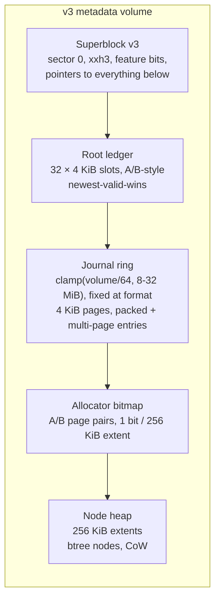
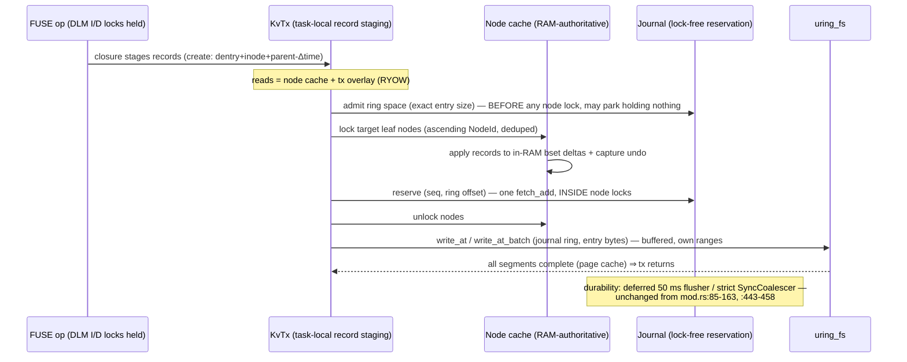
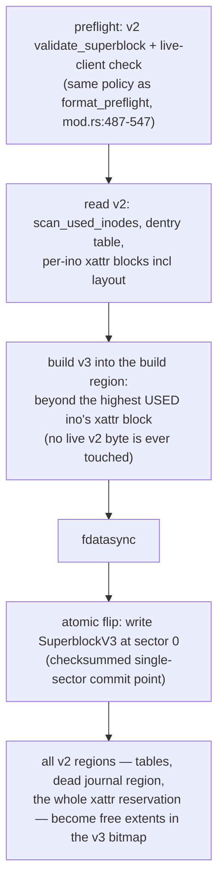

# Design Doc: MetaLV v3 — a bcachefs-style Copy-on-Write KV Node Layer Replacing the Fixed On-Disk Geometry

| | |
|---|---|
| **Title** | SqueezeFS MetaLV v3: CoW KV node layer (large log-structured btree nodes, logical journal, atomic-by-construction crash contract) replacing the fixed inode/dentry/xattr tables |
| **Author** | _(placeholder — assign on review)_ |
| **Date** | 2026-07-08 |
| **Status** | **Implemented (K0–K10 merged 2026-07-09/10; see `.benchmarks/2026-07-09-kv-v3-gates.md`)** |
| **Repo** | `/home/justin/Source/squeezefs`, branch `dev` |
| **Intended home** | `docs/design-cow-kv-metadata.md` |
| **Reviewers** | MetaLV / FUSE owners |
| **Related** | `docs/design-wal-crash-consistency.md` (D0/D1/D2 contract, WAL deletion rationale — this design must answer it §7.2), `docs/design-transaction-lock-removal.md` (sector-commit protocol being superseded for v3 volumes), `docs/design-zero-copy-write-path.md` (data path — out of scope, §5.4 lease boundary untouched), `.benchmarks/2026-07-08-zero-copy-write-path-closing.md` (reference perf table / gates), `.benchmarks/2026-07-07-pre-wal-removal-mount-bench.md` + `.benchmarks/2026-07-07-pr5-delete-gate-analysis.md` (WAL-deletion baselines), `AGENTS.md` (non-negotiables) |

---

## Overview

MetaLV's on-disk format is a set of **fixed, hardcoded regions**: a 4 KiB free-inode bitmap at 4096, a directly-indexed 256 B-slot inode table at 8192, a 512 B-slot static-hash dentry table at 8 MiB (131,072 slots total), one fixed 32 KiB xattr block per ino at `72 MiB + ino·32 KiB`, and a dead 4 MiB journal region at 104 MiB. The geometry caps every volume at **`min(20000, (dev_size − 72 MiB)/32 KiB)` inodes** (`src/meta_backend/storage.rs:118-125`, `:167`) and **131,072 dentries** (`src/meta_backend/dentry.rs:9`, hard error `"Dentry table full"` at `dentry.rs:248-252`), quarantines inos [1024, 1152) whose xattr blocks physically overlap the dead journal region (`xattr.rs:18-31`), caps xattrs at 3 entries × 8 KiB per ino, and forces the read path to bulk-scan the entire 64 MiB dentry table into RAM at first use (`storage.rs:185-239`). None of this scales toward the architecture's stated target of billions of files across 15,000+ nodes, and a 1M-entry directory is not representable at all.

This design replaces the fixed geometry with a **bcachefs-style copy-on-write KV node layer**: metadata records (inodes, dentries, xattrs — including the data path's `"layout"` xattr) live in **256 KiB log-structured CoW btree nodes** addressed through per-volume tree roots; commits append **logical records to a lock-free reservation journal** (read at every mount — unlike the deleted WAL) and apply to a **RAM-authoritative, demand-paged node cache**; durability keeps the existing deferred/strict `fdatasync` cadence and `SyncCoalescer` group commit; **checkpoints** flip per-tree roots in a checksummed A/B root ledger on the background flush cadence, never on the commit path. Every on-disk structure is checksummed and copy-on-write, which makes the crash contract **strictly stronger than today's D0/D1/D2 by construction**: whole-transaction atomicity (one tx = one checksummed journal entry) and torn-write *immunity* (a torn write is detected and ignored; it can never corrupt live state) — collapsing the D1/D2 distinction for KV-resident metadata. Format version bumps to 3 with feature bits; existing v2 volumes keep mounting unchanged, and an explicit offline `squeezefs migrate` converts them in place. Per-volume targets: **100 M inodes, 1 M+ entries in a single directory, mount time O(active set)** (≤ ~300 ms typical for a 100 M-inode volume vs. minutes if the current geometry could even express it), while holding the committed performance reference (Stat 141 K / Mkdir 32 K / Readdir 18 K ops/s; write path 1827 MiB/s untouched).

---

## 1. Background & Motivation

### 1.1 The fixed geometry today (verified)

| Region | Offset | Shape | Hard limit | Source |
|---|---|---|---|---|
| Superblock | 0 | `#[repr(C)]` zerocopy, magic `METALV01`, version 2, xxh3_64 checksum (field-zeroed), validated at mount | — | `storage.rs:27-37`, `:304-391`; format `mod.rs:549-609` |
| Free-inode bitmap | 4096 | 1 sector; legacy/reconciled cache, **not authoritative** (rebuilt from the table at mount/clean unmount) | 32,768 bits | `storage.rs:699-751` |
| Inode table | 8192 | 256 B fixed slots, directly indexed by ino; `DiskInode` has a **184 B pad** | `min(20000, (size−72 MiB)/32 KiB)` inos | `inode.rs:5-25`; `storage.rs:118-125`, `:167` |
| Dentry table | 8 MiB | 512 B slots (`DiskDentry`: 256 B name + **224 B pad**); static 32,768-bucket hash (`DefaultHasher(parent, name) % 32768`) with chained overflow slots found by **linear scan of an in-RAM occupied set** | **131,072 dentries total**; `"Dentry table full"` | `dentry.rs:5-21`, `:52-66`, `:235-252` |
| Xattr region | 72 MiB | one fixed 32 KiB block per ino at `72 MiB + ino·32 KiB`; **max 3 xattrs/ino, key ≤ 64 B, value ≤ 8192 B** | 3 × 8 KiB per ino | `xattr.rs:5-7`, `:50-58`, `:302-306` |
| Journal region | 104–108 MiB | **reserved but dead** (WAL write path deleted; `journal.rs` no longer exists); inos [1024, 1152) quarantined because their xattr blocks overlap it | — | `storage.rs:15-16`; `xattr.rs:18-31` |

Consequences, each independently disqualifying at target scale:

1. **~20,000 inodes/volume, period.** `route_ino` striping (`mod.rs:1243-1260`) multiplies this by volume count, but 1 e9 files would need 50,000 metadata volumes.
2. **131,072 dentries/volume** — a single 1 M-entry directory is unrepresentable. Worse, overflow-slot allocation is a linear scan of a `HashSet` under a `std::sync::Mutex` (`dentry.rs:236-246`), and `find_dentry` is a **linear scan of the parent's entry `Vec`** (`dentry.rs:160-177`) — O(dir size) per lookup even in RAM.
3. **The 8 KiB xattr value cap forces the data path's hand**: the `"layout"` xattr (bincode `LayoutMetadata`, `routing.rs:46-55`) spills its `block_map` to an "indirect" whole-value-RMW data block at **> 32 entries** (`routing.rs:765-768`), i.e. any file > 128 MiB at 4 MiB blocks pays indirect-map reads and allocator churn on every layout persist.
4. **Mount-time work is O(geometry), not O(active set)**: allocator seeding scans the whole inode table (`storage.rs:613-697`), `ensure_dentry_index` scans the whole 64 MiB dentry table (`storage.rs:185-239`), and `refresh_bitmap_from_table` scans the table again. Extrapolated to a hypothetical 100 M-inode fixed geometry: a 24 GiB inode table plus a proportionally scaled dentry table — minutes of mount-time scanning.
5. **Space efficiency**: 256 B/inode (72 B live + 184 B pad), 512 B/dentry (avg ~50 B live), 32 KiB/ino xattr reservation whether used or not. A 20,000-inode volume *reserves* 625 MiB of xattr blocks.
6. **Crash contract ceiling**: the sector-RMW commit's D1/D2 rows (design-wal-crash-consistency §3) depend on 4 KiB sector-write atomicity that is *probed* (`atomicity.rs`) but cannot be *engineered around* — a torn sector on non-atomic storage is detected only by slot magic, with no repair and possible silent garbage in unmagic'd bytes.

### 1.2 What must not regress

- **The read path is RAM-authoritative and fast**: `dentry_index` (`scc::HashMap`) + `dentry_by_offset` are the read truth after warm-up; moka `attr_cache`/`dir_entry_cache` sit above in the FUSE layer (`fuse_client.rs:533-534`, `:639-647`). Committed reference (`.benchmarks/2026-07-08-zero-copy-write-path-closing.md`): **Stat 141,469 ops/s, Mkdir 32,452, Readdir 18,209, Rmdir 31,394, Delete 3,553** (delete is kernel-eviction-bound, not meta-bound — `.benchmarks/2026-07-07-pr5-delete-gate-analysis.md`). Micro: `create_unlink_file` ~102–112 µs, `lookup_file` ~6 µs post-WAL-deletion.
- **The commit path was just hardened**: `run_transaction_sector_locked` (`mod.rs:258-471`) — task-local patch staging, ascending-shard sector write locks, parallel RMW reads, one batched io_uring apply, undo-snapshot rollback, deferred 50 ms flush (`SQUEEZEFS_META_FLUSH_INTERVAL_MS`; 0 = strict with `SyncCoalescer` group commit). Explicit D0/D1/D2 contract with a crash & fault-injection harness (`tests/crash_contract_tests.rs`, `tests/crash_kill_tests.rs`, `TORN_WRITE_FAULT` shims).
- **Cheap parent-time updates under a SHARED parent lock**: `stage_parent_time_patch` (`inode.rs:63-83`) stages a 16-byte mtime/ctime patch, letting same-directory regular-file create/unlink run concurrently. This parallelism must survive.
- **Lock order P1-9 / P1-10** (`stripe_locks.rs:10-37`), the zero-copy data path (out of scope), and the stats-inode observability surface.
- **The WAL was deliberately deleted** (design-wal-crash-consistency, Key Decision 1). Any log this design introduces must answer, point by point, why it does not recreate the problems that led to that deletion (§7.2).

### 1.3 Direction (agreed)

The staged roadmap agreed with the owner: (1) per-record checksums, (2) durable allocation + backpointers, (3) **this design: the CoW KV node layer replacing the fixed geometry**, (4) extents later (data path, out of scope), (5) snapshots enabled by CoW roots (designed-for here, not built). This document delivers step 3, subsumes step 1 for KV-resident records (per-bset/per-entry checksums, §4.3), and delivers the durable-allocation half of step 2 (the node-extent allocator, §4.7); data-block backpointers remain future work with a reserved tree id (§4.2).

---

## 2. Goals & Non-Goals

### Goals

1. **Remove the hard caps.** Per-volume: ≥ 100 M inodes, ≥ 1 e9 dentries, 1 M+ entries in a single directory, unlimited xattrs per ino with values up to 64 KiB (Linux `XATTR_SIZE_MAX`, at the default node size — §4.2). Cluster: 1 e9 files across ≥ 10 volumes via the existing `route_ino` striping.
2. **CoW commit with a crash contract strictly stronger than D0/D1/D2**: whole-transaction atomicity and torn-write immunity by construction (checksums + never-overwrite-live-data), collapsing the D1/D2 distinction for KV-resident metadata. The existing crash harness extends to prove it (§4.10).
3. **Mount O(active set)**: superblock + root ledger + allocator bitmap + bounded journal replay; no full-table scans. ≤ ~300 ms typical / ≤ ~2 s pathological for a 100 M-inode volume; **no noticeable regression** on today's small volumes.
4. **Hold the committed perf reference** (§1.2 numbers) on v3 volumes: Stat/Mkdir/Readdir/Rmdir at-or-above; Delete at-or-above (meta share shrinks further); `lookup_file` micro at-or-better; large-write 1827 MiB/s untouched (data path untouched).
5. **Reduce metadata write amplification ≥ 10×** on create/unlink storms (quantified §4.4): logical journal records + amortized node appends instead of 2–3 × 4 KiB sector RMW writes per transaction.
6. **Lift the layout-xattr ceiling** without redesigning the block map: inline `block_map` spill threshold moves from > 32 entries (> 128 MiB file) to a 64 KiB value cap (≈ 1,500 entries ≈ 6 GiB file at 4 MiB blocks), through the existing `merge_block_mappings`/`save_metadata_to_backend` choke point only (§5.3).
7. **Format v3 + feature bits; v2 volumes keep mounting** (dual-format mount dispatch); explicit offline `squeezefs migrate` (§6.2). The dead journal region and quarantined xattr blocks become reclaimable space.
8. **Stay inside AGENTS.md non-negotiables**: all node/journal/ledger I/O via `crate::uring_fs` (io_uring); no dead code (v2 support is live compat, not parked code); latch-free reads (arc-swap node snapshots, scc index), locks only in FUSE-op/meta-transaction class; P1-9/P1-10 preserved with the node-lock substitution (§4.9); loom models for the new lock-free cores; TDD per PR with the full gate.
9. **Design for snapshots without building them**: versioned roots, refcount-ready allocator records, reserved key-encoding space (§4.11).

### Non-Goals

- **Data-path redesign.** `routing.rs` read/write, the zero-copy write path, block sizes, the block-map *structure*, block refcounts, staging, and `NvmeBlockDev` are untouched except that the `"layout"` xattr's storage substrate changes underneath the same `Metadata::{get,set}xattr` calls and the inline-spill constant moves (§5.3).
- **Data-block backpointers / refcount durability** (`block_allocator.rs:281-411` mount rebuild scan): unchanged in this design; the KV layer reserves a tree id for a future backpointers tree (§4.2).
- **Snapshots/reflink of metadata**: designed-for only.
- **A networked/replicated DLM**: the in-process DLM (`src/dlm.rs`, `meta_backend/dlm.rs`) and its fencing-token semantics are composed with, not changed (§4.9).
- **FUSE transport** (the first-party `crates/fuse3` fork), `fsck`-style offline repair tooling beyond what mount-time validation provides, and dropping v2 mount support (a later, separate decision).

---

## 3. Scale Targets & Capacity Math (quantified)

Sizing convention for every row: *raw* = record bytes (decimal GB converted to GiB); *on-disk* = raw ÷ 0.75 leaf fill factor at 256 KiB nodes. On-disk figures are the ones the volume must hold.

| Quantity | Today (v2) | v3 target | v3 sizing basis |
|---|---|---|---|
| Inodes / volume | `min(20000, …)` | **100 M** (u64 keyspace; practical bound = volume size) | ~96 B/record ⇒ 100 M = 9.6 GB ≈ 8.9 GiB raw ≈ **12 GiB on-disk** (vs 24 GiB fixed table + 3 TiB xattr reservation) |
| Dentries / volume | 131,072 | **1 e9** | ~80 B avg record ⇒ 1 e9 = 80 GB ≈ 74.5 GiB raw ≈ **99 GiB on-disk**; 100 M ≈ 7.5 GiB raw ≈ **10 GiB on-disk** |
| Entries / directory | ≤ 131,072 (shared with whole volume) | **≥ 1 M per directory** (bounded only by volume) | 1 M × ~80 B ≈ 76 MiB raw ≈ 102 MiB on-disk ≈ **~400 leaf nodes**; insert/lookup O(log n) |
| Xattrs / ino | 3 × 8 KiB | unlimited count; value ≤ `min(65,536, node_size/4)` B inline (= the full 64 KiB Linux `XATTR_SIZE_MAX` at the default 256 KiB node, §4.2) | records in xattr tree; layout values beyond the cap stay indirect (§5.3) |
| Meta volume for 100 M files | unrepresentable | **~30–45 GiB** (12 GiB inodes + 10 GiB dentries + xattr/layout trees + interior + slack) | on-disk convention above; 256 KiB nodes |
| Mount time, 100 M inodes | minutes (extrapolated full-table scans) | **≤ ~300 ms typical** (SB 4 KiB + ledger 128 KiB + bitmap ≤ 1 MiB + journal ≤ 32 MiB sequential read + replay into ≤ 4,096 demand-loaded nodes ≤ 1 GiB worst-case ⇒ ≤ ~2 s pathological) | §4.6 checkpoint caps bound replay working set |
| Node-cache RAM @ 100 M inodes | n/a (today pins the whole dentry table + occupied set) | default **512 MiB** (~2,048 nodes ≈ 4–8 M hot records) knob `SQUEEZEFS_META_NODE_CACHE_MB`; interior nodes (< 3 MiB per 100 M-record tree) always pinned | §4.5 |
| Cluster (15 K nodes, 1 e9 files) | — | 10–16 meta volumes × 100 M inos, existing `route_ino` striping | §4.9 |

---

## 4. Proposed Design

### 4.1 On-disk layout (format v3)

No hardcoded offsets except sector 0. Everything else is placed at format time and recorded in the superblock; migration exploits this by placing v3 structures wherever free space exists (§6.2).



**Superblock v3** (`#[repr(C)]` zerocopy, same checksum discipline as v2 — xxh3_64 with field zeroed, verified at mount by the already-shipped `validate_superblock`, `storage.rs:349-392`):

```rust
#[derive(IntoBytes, FromBytes, Immutable, Clone, Copy)]
#[repr(C)]
pub struct SuperblockV3 {
    pub magic: [u8; 8],          // "METALV01" (unchanged — version field discriminates)
    pub version: u32,            // 3
    pub node_size: u32,          // bytes; default 262144, format-time tunable
    pub features_incompat: u64,  // bit 0: KV_V3. Unknown bits ⇒ refuse mount.
    pub features_ro: u64,        // unknown bits ⇒ mount read-only (future: snapshots)
    pub root_ledger: ExtentRef,  // { start: u64, len: u64 }
    pub journal: ExtentRef,      // fixed ring
    pub alloc_bitmap: ExtentRef, // A/B page pairs
    pub heap: ExtentRef,         // node extents
    pub uuid: [u8; 16],
    pub hash_seed: u64,          // random at format; keys the dentry/xattr name hashes (§4.2)
    pub checksum: u64,           // xxh3_64, field-zeroed
}
```

`validate_superblock` already rejects `version > 2` with "upgrade squeezefs" (`storage.rs:372-378`), so every shipped binary since the WAL-consistency PR 1 fails loud on a v3 volume — the downgrade story the WAL design bought us is exactly what makes a format bump safe now.

**Root ledger**: 32 round-robin 4 KiB slots. Each record: `{magic, seq, len, xxh3, per-tree roots [(tree_id, node_addr, node_seq)], journal_tail_seq, next_ino, alloc_bitmap_generation}`. Mount picks the newest slot whose checksum verifies; a torn slot (checkpoint racing power loss) falls back to the previous — correct by the pending-free rule (§4.7).

**Journal ring**: fixed extent, sized at format to **`clamp(volume_size/64, 8 MiB, 32 MiB)`** (resolved OQ 1 — a flat 32 MiB would be ~12 % of a 256 MiB volume; `--meta-journal-mb` overrides). 4 KiB pages, each with a **checksummed** 24 B page header `{magic: u32, lap: u32, first_entry_off: u16, _pad: u16, xxh3_64: u64}` (the checksum covers the preceding fields — the header is a unit replay trusts to find entry boundaries, so §4.3's every-unit-checksummed rule applies to it literally, not rhetorically). `first_entry_off` is the in-page offset of the first entry that **starts** in this page (`0xFFFF` = the whole page is continuation bytes of an entry begun earlier). Entry: `{seq: u64, len: u32, xxh3_64(whole payload), payload = [Record]}`. Small entries pack within a page (~17 create-sized entries/page net of the header); an entry larger than the page remainder **continues across consecutive pages** — one entry header, one whole-entry checksum, so a transaction of any size up to the cap remains a single all-or-nothing unit. One **transaction = one entry** — the atomicity unit — and the framing can hold the design's own largest transactions: a 64 KiB `setxattr` (~17 pages), a `LAYOUT_INLINE_MAX` layout persist (~15 pages), a 64-ino `destroy_inodes` batch (≤ ~8 KiB), a rename with two 255 B names (≤ ~1.5 KiB). **Max entry size = 128 KiB** (2× the largest legal record plus headers, asserted at commit — the assertion is the *writer-side* guard). Torn/replay semantics — with the rule that **nothing inside the replay window ever fails a mount loud**, because `[tail, head]` is by definition the maybe-torn region and a tear there is a legitimate power-loss artifact: replay walks pages in ring order; a page whose header checksum fails is unusable for entry discovery (entries *starting* there are lost; an entry *continuing* through it at chain-known offsets is still read and its whole-entry checksum decides); any invalid structure on the chain — bad entry checksum, `len` > cap, `len` overrunning the ring — is treated identically: **drop the entry, resynchronize at the next page whose header verifies and whose `first_entry_off ≠ 0xFFFF`, count it** (`meta_kv_replay_dropped_torn`). Corruption *detection* for ring contents rests where it is decidable: `meta_kv_replay_dropped_torn > 0` after a **clean** unmount is the corruption alert (§10); loud mount failures are reserved for units with durable-coverage arguments (superblock, all-ledger-slots-invalid, the §4.5 node classifier, both-bitmap-slots-invalid).

**Allocator bitmap**: 1 bit per 256 KiB heap extent, stored as A/B page pairs (each page `{generation, xxh3, bits}`; writer alternates slots; reader takes the newest valid) — torn-bitmap-safe by construction. 1 TiB heap ⇒ 4 M bits ⇒ 512 KiB × 2. The bitmap is a **checkpoint accelerator**, not the sole truth: journal alloc/free records since `journal_tail_seq` replay over it (§4.7).

**Node heap**: everything else. Nodes are 256 KiB (one allocator extent), copy-on-write, internally log-structured:

```text
Node = | node header (4 KiB page) | bset 0 (base, sorted) | bset 1 | … | unwritten tail |
header: { magic, node_addr (self), node_seq, tree_id, level, min_key, max_key,
          format_version, xxh3 of header }
bset:   { magic, node_seq_at_write, journal_seq_horizon, n_records, len (4 KiB multiple),
          xxh3 of records, records… sorted by key }
```

A node **rewrite** (compaction/split) goes to a **freshly allocated extent** — never in place — and the parent's pointer update is itself a journaled record; the old extent is freed through the pending-free protocol (§4.7). A node **append** adds a sorted bset at the current tail (4 KiB granularity). Appends *are* in-place mutation of the extent, but only of **never-written bytes** (the unwritten tail), so a torn append can only damage data that was never live: the bset checksum makes it detected-and-ignored. This is the property that lets v3 keep append economics without giving up CoW crash safety.

### 4.2 Trees and key encoding

**One node layer, multiple logical trees per volume** — bcachefs's shape. `tree_id: u8` in node headers and journal records:

| Tree | Key (big-endian composite, memcmp-ordered) | Value | Notes |
|---|---|---|---|
| `TREE_INODES = 1` | `ino: u64` | packed inode record: `{mode, uid, gid, nlink, flags, size, atime, mtime, ctime (u64 ns), flags2}` ≈ 96 B — the `DiskInode` fields (`inode.rs:11-25`) minus the 184 B pad, plus `flags2` (bit 0: `QUARANTINE_CONTENT_LOST`, §6.2) | value is versioned (leading varint tag) for future extension |
| `TREE_DENTRIES = 2` | `(parent_ino: u64, name_hash54: u54, coll_seq: u8)` | `{child_ino: u64, file_type: u8, name_len: u8, name ≤ 255 B}` | `name_hash54` = **seeded** `xxh3_64_with_seed(name, sb.hash_seed) >> 10` (per-volume secret seed — bcachefs seeded-str_hash precedent — so filenames cannot be chosen off-line to collide). Collisions: probe `coll_seq` 0..=255 comparing full names; expected colliding pairs for a 1 M-entry dir ≈ n²/2^55 ≈ **2.8 × 10⁻⁵** (54 bits chosen for cookie headroom, below). Chain exhaustion (a 257th same-hash name) fails the insert with a clean error + `meta_kv_dentry_collision_overflows` counter — unreachable without the seed, and the probe loop is bounded by construction. Readdir cookie = `3 + ((hash54 << 8) | coll_seq)` (§5.1) |
| `TREE_XATTRS = 3` | `(ino: u64, name_hash56: u56, coll_seq: u8)` | `{name_len: u8, name, value ≤ min(65,536, node_size/4) B}` | same seeded hash, 56 bits (no cookie constraint — `listxattr` returns whole lists, no resume). Value cap = `min(65,536, node_size/4)`: 65,536 is Linux `XATTR_SIZE_MAX` (the natural user-facing ceiling), and `node_size/4` keeps the largest record + headers comfortably inside one node at every knob setting (§5.1). At the 256 KiB default the cap is exactly 64 KiB. Unlimited count; `"layout"` and `"system.symlink"` live here (symlink targets ≤ 4096 B fit trivially); client registrations on ino 1 too |
| `TREE_ALLOC_RESERVED = 4` | — | — | reserved id: future refcounted-extent tree (snapshots) |
| `TREE_BACKPTR_RESERVED = 5` | — | — | reserved id: future data-block backpointers (roadmap step 2 remainder) |

Records within a bset are length-prefixed `(key_len, key, val_len, val)`; keys memcmp-sortable so bset binary search needs no decoding. Interior nodes use the same node format with `level > 0` and values = `(child_node_addr: u64, child_node_seq: u64)`; `child_node_seq` must match the child header at read (stale-pointer detection; a mismatch means the child was rewritten under a concurrent SMO — the traverser reloads the parent snapshot and retries, bounded, §4.6). Interior fanout at 256 KiB ≈ **~7,000 children** (≈ 36 B/interior record) ⇒ a 100 M-record tree is depth ≤ 3 with **< 3 MiB of interior nodes — always pinned in RAM**, so any cold point lookup costs exactly one 256 KiB leaf read.

**Record kinds & merge rules** (the fold algebra shared — byte-identically — by point lookup, bset n-way merge, compaction, and journal replay; specified here because two record classes break plain LWW):

- Kinds: `Put(value)` — full value; `Delta(field_mask, fields)` — partial update folding into the newest base (v1's only user: the Δtime record, §4.4 pt 6); `Delete` — per-key tombstone.
- **Lookup fold**: scan record sources newest-seq-first, collecting `Delta`s, until the first `Put` or `Delete`. `Delete` ⇒ key absent (collected Deltas discarded). `Put` ⇒ apply the collected `Delta`s onto it in ascending seq order. A `Delta` with no underlying `Put` (e.g. a replayed Δtime whose base was destroyed in the same window) folds to *absent* — a counted no-op (`meta_kv_delta_orphans`), matching the fact that live DLM ordering makes it unreachable outside replay.
- **Compaction fold**: identical algebra; the output bset contains one folded `Put` (or nothing) per key. **Tombstone elision rule**: a `Delete` may be dropped from the compacted output only if its seq < the durable checkpoint tail at compaction time — a tombstone still inside the replay window must survive in the node, or replay could resurrect the key from an older journal `Put` it was shadowing. (Old node *extents* need no such care: they are unreachable from any live root after the checkpoint, per §4.7.)
- **Replay fold**: same algebra over `(node state, journal records ≥ tail)` in seq order — which is why "replay reproduces RAM" is a single theorem about one fold function, tested once in K1 and reused everywhere.
- The **full-tree digest walk** (§4.10) hashes the *post-fold* live keyspace (tombstones and unfolded deltas excluded), so replay-twice equality compares user-visible state, not physical encoding.

**Deliberately not per-shard trees within a volume.** The mandate asked per-shard trees vs one tree per volume to be decided: cross-volume sharding already exists (`route_ino`, `mod.rs:1243-1260`) and stays the scaling unit; *within* a volume, the reason one might shard — "global root swaps must not serialize unrelated per-inode mutations" — is dissolved structurally instead: **commits never touch roots** (roots advance only at background checkpoints, §4.6), and commit-path serialization is per-node locks + a lock-free journal reservation. Intra-volume shard-trees would multiply roots, splits, and checkpoint bookkeeping for no demonstrated contention win; `meta_kv_node_lock_wait_ns` (§9) is the signal to revisit.

### 4.3 Checksums: subsuming the "per-record checksums" roadmap step

Every on-disk unit is checksummed with the repo's established primitive (xxh3_64 — superblock, DLM keys precedent): superblock, root-ledger records, journal **page headers** and entries, node headers, bsets, allocator bitmap pages. A record is never trusted unless its containing bset/entry verifies, and bset verification happens **once at node load / entry replay**, not per read — the RAM-authoritative cache means per-read checksum cost is zero. This subsumes roadmap step 1 ("per-record checksums") for all KV-resident records with strictly better granularity than the v2 slot-magic scheme (which validates 4 bytes of a 256 B slot and nothing of dentry names or xattr values). v2 volumes keep their existing (weaker) checks until migrated — stated, not hidden.

### 4.4 Commit pipeline

The `Metadata` trait (`mod.rs:44-78`) and `run_transaction` shape survive; the storage under them changes. Today's task-local staging (`ACTIVE_TX` byte patches) becomes task-local **record staging** (`Vec<(tree_id, Record)>` with read-your-own-writes overlay, the analog of `read_blocks`' patch overlay at `storage.rs:558-590`).



Protocol details, each load-bearing:

1. **Node locks replace sector locks + dentry bucket locks.** Per-node `tokio::sync::RwLock` embedded in the cached node object; multi-node transactions (rename/exchange: up to 4 dentry leaves + 2 inode leaves) acquire in **ascending NodeId order, deduped** — the same total-order discipline as today's ascending-shard sector locks (`mod.rs:350-380`) and `tx_prelock_buckets` (`dentry.rs:74-89`). Because locks live in the node objects (not a fixed stripe array), there is no shard-collision aliasing; dedup by NodeId suffices. **Node locks cover only the RAM apply — never device I/O** (the journal write happens after unlock): the P1-10 discipline ("never hold the meta handle across durable I/O") applied to the new layer.
2. **Journal reservation inside the node locks — and it can never block there.** `seq`/ring-offset assignment is a single atomic `fetch_add` on a packed (lap, logical-offset) word over a **logical byte space that excludes page-header slots** (a fixed logical→physical mapping skips the 24 B header at each page start, so entry bytes never overwrite headers and multi-page entries need no special casing). The reservation only *claims budget the committer already holds*: ring-space **admission** happened before any node lock was taken (pt 5), so the in-lock `fetch_add` succeeds by construction and the lock window never waits on ring space. Exactly one committer's reservation contains each page's first logical byte — that committer writes the page header (computing its checksum over the fields it fully determines), and it always has the local information `first_entry_off` needs: its own entry starts in the page (offset = its start), spans it entirely (`0xFFFF`), or ends at `x` inside it (`first_entry_off = x`, the successor's start position whether or not a successor is ever written — replay treats a `first_entry_off` pointing past the valid data as end-of-log). Reserving *inside* the node locks guarantees per-key journal seq order equals RAM apply order, so replay's last-writer-wins-by-seq reproduces exactly the RAM history. The reservation core is a standalone `journal_core.rs` module, `#[path]`-included and exhaustively checked by `loom-models/` (`tests/run_loom.sh`) like `alloc_core.rs` today — the model covers admission + reservation jointly (no over-commit of the ring, admitted budget conserved across transfer/release).
3. **The entry write is the committer's own bytes** — no worker, no mpsc hop, no serializer (the deleted WAL's residual serializer, design-wal-crash-consistency §2.7, does not reappear). A page-local entry is one `uring_fs::write_at`; a multi-page entry's physical segments (the logical mapping skips page-header slots, pt 2) go out as one `uring_fs::write_at_batch` message — the tx returns only after the whole batch completes, preserving the D0 argument (§4.10). Concurrent committers write disjoint byte ranges of the same ring pages; buffered io_uring writes merge in page cache; the physical write volume per flush interval is the number of dirtied journal pages, not per-commit sectors.
4. **Failure rollback — seq-conditional, because the locks were released.** If the journal write errors (EIO/ENOSPC on file-backed — a device-failure class, since buffered page-cache writes otherwise cannot fail), the committer re-acquires the node locks and rolls back — but between unlock and re-lock a concurrent transaction may have committed to the **same key**, so a v2-style absolute pre-image restore (`TxState` undo, `storage.rs:93-112`, `:506-546` — which runs *while the guards are still held*) would clobber it. The undo is therefore **per-record seq-conditional**: every dirty-delta record carries the seq of the tx that wrote it; rollback restores a key only if its newest dirty record still bears *this* tx's seq, and otherwise skips it (a newer committed record stands). This is exact for the only same-key concurrency the DLM discipline permits: the failing tx holds its DLM I/D locks across the whole op (rollback included), so dependent readers and same-key `Put` writers are excluded until rollback completes; the sole non-excluded same-key writers are shared-parent-lock **merge-record** writers (Δtime, pt 6), for which skip-if-newer is precisely LWW-correct. The reserved ring range stays unwritten — replay's checksum walk drops it. One inherited caveat, stated rather than silently carried: latch-free snapshot readers that hold no DLM lock on the object (e.g. a concurrent `readdir` under its own I-shared dir lock) can observe the failing tx's records between RAM apply and rollback — byte-for-byte v2's existing exposure (its lock-free `dentry_index` is updated in the closure and read by `find_dentry` before commit, `dentry.rs:160-177`); the *strictly stronger* claim of §4.10 is about the crash contract, not transaction isolation, and this window neither grows nor shrinks. Escalation: repeated journal write failures mark the volume failed via the existing `disabled_volumes` mechanism (`mod.rs:1182-1190`) — mutations return EIO until remount (the `errors=remount-ro` class). A dedicated harness case pins the race: fail tx A's journal write after tx B committed a Δtime on the same key; assert RAM == replay digest (§4.10).
5. **Journal-full backpressure — admission before locks, a checkpoint-task reserve, and a progress theorem** (the ring twin of §4.7's "no write-to-free-space deadlock"; without this point, pts 1–2 plus §4.6's single background task would make a full ring a derivable deadlock):
   - **Admission placement**: a committer's staged records fix its exact entry size before any lock is taken, so **ring-space admission happens before node-lock acquisition**: an atomic admitted-bytes counter is bumped iff `head_estimate + admitted + size ≤ reusable_upto + ring_len − reserve`; otherwise the committer parks **holding no node locks** (counted: `meta_kv_journal_full_stalls`) until `reusable_upto` advances. The in-lock reservation (pt 2) then merely transfers admitted budget to the head — it cannot block. A parked committer does hold its DLM I/D guards, which is safe because the drain path below takes no DLM locks, ever.
   - **Checkpoint-task ring reserve**: a fixed slice (`max(256 KiB, ring/64)`) is admissible only by the checkpoint/writeback/SMO task's own records (interior-pointer updates, alloc/free — §4.6, §4.7). SMOs therefore never wait on ring space behind user commits — closing the **task-self-deadlock** (an SMO blocking on ring space would block the only task whose checkpoints free ring space). ~50–100 B per SMO record means the reserve holds thousands of SMO records per checkpoint cycle.
   - **Progress theorem**: a *minimal* checkpoint — flush dirty bsets, `sync_device()`, write a ledger slot — consumes **zero ring bytes**: bset appends go to node extents, the ledger and bitmap are their own extents. So even with the ring 100 % full of user entries, the checkpoint task can always run to completion, advance the tail, and (post-barrier, §4.6 pt 3) advance `reusable_upto` — the drain always makes progress, and the reserve itself drains the same way. Net liveness invariant: **no task ever blocks on ring space while holding a node lock, and the parties that do block hold nothing the drain path needs.** Verified by a K6b liveness storm test (commit storm against a tiny `--meta-journal-mb` ring with concurrent SMO pressure; must drain, never deadlock) and risk row R10.
   - Runway unchanged: 32 MiB = 8,192 pages × ~17 create-sized entries ≈ **139 K entries ≈ 4.3 s at 32 K creates/s** (at the 8 MiB clamp floor of §4.1: ~35 K entries ≈ 1.1 s — still above the ≤ 1 s checkpoint cadence); checkpoints run at ≤ 1 s cadence, so admission stalls indicate pathology, not steady state.
6. **Parent-time updates stay cheap and shared-lock-parallel.** `stage_parent_time_patch`'s role (`inode.rs:63-83`) is played by a `Δtime` record type: `{ino, mtime, ctime}` — a *merge* record that updates only the time fields of the inode record (RAM apply: field overwrite; replay: same). Concurrent same-dir creates under the **SHARED parent DLM lock** (unchanged, `mod.rs:1340-1361`) each stage their own Δtime record; per-key LWW by seq gives the same benign last-writer-wins as today's 16-byte sub-sector patches, and no full inode-record write can clobber concurrent value fields because Δtime never carries them. Same-node RAM contention (the node write lock) is nanoseconds — bounded by an in-RAM apply, strictly shorter than today's sector-lock window which spans the RMW-read + batched device write (`mod.rs:363-437`).

**Write-amplification, quantified** (single create ≈ 200 logical bytes: dentry ~80 B + inode ~96 B + Δtime ~32 B):

| Scheme | Per-commit device bytes | Amortized per create @ 32 K creates/s, 50 ms flush | Notes |
|---|---|---|---|
| v2 today (in-place sector RMW) | 2–3 × 4 KiB = **8–12 KiB** | 8–12 KiB | one batched write per tx (`mod.rs:414-424`) |
| 4 KiB-page CoW (LMDB-style, per-commit root flip) | leaf+interior path+root ≈ 4–6 × 4 KiB = **16–24 KiB** | 16–24 KiB | rejected, §7.1 |
| **v3 (this design)** | journal entry ~230 B (packed ~17 tx/page) | journal ~0.24 KiB + node bset appends ~0.1–0.3 KiB + compaction ~0.1 KiB ≈ **0.5–0.7 KiB** | **11–24× reduction** (8–12 KiB ÷ 0.5–0.7 KiB), safely clearing the **≥ 10×** Goal-5/§8 gate; node writeback batches one 4 KiB bset append per dirty node per tick, amortized over that tick's records for the node; 256 KiB compaction amortized over ~32–56 appends |

**Read amplification, honest accounting**: a cold point lookup reads one 256 KiB leaf (≈ 85–120 µs on NVMe) vs one 4 KiB sector today (≈ 20–80 µs; today's direct `ino → offset` indexing is unbeatable for cold single-record reads). v3 trades ≤ ~2× cold-miss latency for: 2,000+ co-located records per fetch (same-directory inos and dentries cluster by key — monotonic ino allocation §4.8 makes creation-order locality real), a RAM-authoritative hot path identical to today's, and the elimination of the warm-up full-table scan. `node_size` is a format-time knob (64 KiB–1 MiB) if a deployment is cold-point-lookup-dominated — with the stated consequence that the per-volume record-value cap scales as `node_size/4` (§4.2), so sub-256 KiB nodes trade xattr/layout headroom for cold-read latency (a format-time warning states the resulting cap); 256 KiB is the default because: interior stays trivially pinnable (< 3 MiB / 100 M records), append-log depth (~32–56 × 4 KiB bsets) amortizes compaction ≈ 8 KiB/append, one-node reads stay under the ~100 µs NVMe latency knee, the value cap lands exactly on Linux `XATTR_SIZE_MAX`, and it matches bcachefs's shipped default (`btree_node_size` 256 KiB) — prior art at exactly this design point.

### 4.5 RAM-authoritative reads: node cache, demand paging, eviction

Replaces `dentry_index`/`dentry_by_offset`/`dentry_occupied_offsets` (`storage.rs:75-78`) and the mount-time bulk build (`storage.rs:185-239`):

- `NodeCache`: `scc::HashMap<NodeAddr, Arc<CachedNode>>`. `CachedNode` holds an **arc-swap'd immutable snapshot** (merged-sorted record view + the on-disk bset list) plus the mutable dirty delta guarded by the node RwLock. **Reads are latch-free**: load the snapshot Arc, binary-search — no lock, no copy (readers hand out `Bytes`/slice views into the snapshot). Writers swap a new snapshot after RAM apply. This satisfies AGENTS.md's latch-free hot-path rule; the write-side node lock is in the sanctioned "metadata transactions" class.
- **Demand paging**: a miss reads the 256 KiB node with one `uring_fs::read_at`, verifies header + bsets, builds the snapshot. **Torn-bset classification is positional, using only trustworthy bytes** (a torn bset's own header — including its `journal_seq_horizon` — is garbage and is never branched on): walk bsets in append order; at the first checksum failure, truncate the node view there. Then a diagnosis pass scans the remainder at 4 KiB strides for bset headers that *do* verify: if any valid bset beyond the tear has `journal_seq_horizon ≤` the durable tail, **fail the node loud** — checkpoint-covered data was barriered before its ledger record (§4.6 ordering), and a durable-required bset cannot legitimately follow a torn one (the same barrier covered every earlier append); otherwise the tear is the expected un-checkpointed tail — every truncated record has seq > tail and replay re-supplies it — so it is dropped silently and counted (`meta_kv_node_dropped_tail_bsets`; nonzero after a *clean* unmount is the corruption alert, mirroring `meta_kv_replay_dropped_torn`, §10). Loads are single-flight per NodeAddr (same discipline as the router's inflight block-read guards, `routing.rs:632-645`).
- **Eviction**: clock ring over cache entries (reuse the sharded-clock patterns in `src/cache/lru.rs`); clean nodes evict by dropping the Arc (in-flight readers keep their snapshot alive — safe by refcount); dirty nodes are pinned until writeback. Interior nodes and the root ledger are pinned unconditionally. Budget: `SQUEEZEFS_META_NODE_CACHE_MB` (default 512).
- **FUSE-layer caches unchanged**: moka `attr_cache`/`dir_entry_cache` and the router `metadata_cache` sit above `Metadata` and are format-agnostic. One adjustment ships with the big-directory work: `dir_entry_cache` only caches directories ≤ 10 K entries (an `Arc<[…]>` snapshot of a 1 M-entry dir is ~60 MB); larger directories stream through `readdir(dir, offset, max)` range scans — the trait already has `offset`/`max` parameters that the v2 impl ignores (`mod.rs:950`).
- **Perf trace against the gates**: hot Stat = moka hit (unchanged) or inode-tree point lookup: pinned-interior traverse + leaf snapshot binary search ≈ O(log 2,000) memcmp on ~16 B keys — comparable to today's scc read + slot decode; hot lookup in a huge directory improves from O(dir size) linear `Vec` scan (`dentry.rs:168-175`) to O(log). Mkdir/create = RAM apply + one buffered journal write vs today's 2–3 sector RMW + batched apply write — fewer awaits, less device traffic. Readdir = leaf range scan emitting records in key order vs today's `Vec` clone. The §8 gates hold these claims to the committed numbers.

### 4.6 Checkpoints, node writeback, and durability cadence

Background, per-volume, riding the **existing** flusher/`SyncCoalescer` machinery (`mod.rs:85-163`, `sync_coalescer.rs`):

1. **Node writeback — snapshot-then-write, never I/O under the node lock** (every flush tick, or when a node's dirty delta exceeds a bset worth, or on cache pressure): take the node write lock **only** to freeze the dirty delta — swap it out as an immutable, sorted, 4 KiB-padded bset image and open a fresh empty delta for subsequent commits — then release the lock and `write_at` the frozen image to the node's unwritten tail **outside** it. Commit-path writers are never blocked by device I/O and the §4.4 pt 1 invariant ("node locks never across device I/O") holds for writeback too. Each node tracks `oldest_dirty_seq` (the seq of its oldest record not yet in a *durable-covered* bset); a completed append covered by a later barrier retires it. On-disk log area full ⇒ **compact**; oversized post-compaction ⇒ **split** — both are SMOs, protocol below.
2. **Checkpoint** (every ≤ 1 s, or journal distance > ring/2, **or dirty-node count > 4,096** — the cap that bounds mount-replay working set, §3): flush the chosen dirty set → `sync_device()` (coalesced fdatasync — the same barrier the flusher already issues) → compute **`journal_tail_seq` = min(`oldest_dirty_seq` over ALL nodes still dirty after this flush, else the current head seq)** — the tail must respect nodes the checkpoint chose *not* to flush, or replay would skip records living only in their un-flushed deltas — → write the next root-ledger slot naming the synced roots + that tail. The root record's own durability rides the next barrier; if it is lost, mount falls back one slot and replays a longer window — correct, just slower. **Floors round DOWN to journal-entry starts** (FIND-SMO-TAIL, design-smo-replay-currency §1b): a multi-leaf transaction stamps per-record seqs `entry_start + i` across its leaves, so a raw per-record floor could compute a tail **strictly inside** an entry when one member leaf flushes while another stays dirty (or is skip-deferred) — replay would then parse mid-entry, resync at the next page, and drop acked records. Every floor contribution is therefore the containing **entry's start seq** (conveyor members pass their computed `entry_start`; replay applies pass their `ReplayedEntry` start; SMO flips and root-swap dying floors already pin at `res.start`), making "the tail is always an entry boundary" an enforced invariant, not a module-doc claim. The lower tail only lengthens the replay window by < one entry, absorbed idempotently by the per-key LWW fold.
3. **Journal ring-space reclamation — the same invariant as pending-free (§4.7), stated for the ring**: advancing the in-RAM tail does **not** make the pages in `(old_tail, new_tail]` writable. They join a *pending-reclaim* watermark tagged with the ledger record that retired them and become writable only after that record is **known durable** (post-barrier) — otherwise the head could overwrite the very pages a torn-newest-slot fallback needs, silently losing acked (even fsynced) transactions. The head bounds against this `reusable_upto` watermark, not the logical tail (§4.4 pt 5). This is the ring-shaped twin of the node-extent rule; it gets its own harness case (§4.10).
4. **fsync/fsyncdir unchanged**: the trailing coalesced `sync_device_for_ino` barrier (design-wal-crash-consistency §4.3) covers journal pages the same way it covers sector applies today; `tests/fsync_single_barrier_tests.rs` / `fsync_coalescing_tests.rs` remain the regression guards, byte-for-byte. Strict mode (`SQUEEZEFS_META_FLUSH_INTERVAL_MS=0`) barriers after the journal write per commit, coalesced.

**Structure modifications (SMOs: compact, split): the concurrency protocol.** The mechanics above are the easy half; the protocol is what kills btrees, so it is pinned here (bcachefs needed a whole interior-update subsystem for this — v3 buys a drastically simpler one by construction):

- **All SMOs run on the per-volume checkpoint/writeback task, one at a time** — SMO-vs-SMO races do not exist. Commit-path transactions **never lock interior nodes**: interior mutations (parent-pointer updates, splits, new roots) are journaled records applied only by the SMO task. The two lock populations are therefore: commit path = leaf locks only (ascending NodeId); SMO = parent (interior) then child (leaf), top-down. A deadlock cycle would need a commit-path task to hold a leaf and *wait on an interior lock* — which it structurally never does — so the composition is acyclic without any NodeId relationship between parent and child. (Rename's multi-leaf set composes the same way: the SMO waits on one leaf at a time; the commit path never waits on anything the SMO holds except that leaf.)
- **An SMO replaces a node in three steps**: build the successor node(s) from a frozen snapshot (no locks held); take parent-then-child write locks; re-freeze any delta that accumulated during the build into the successor (bounded second merge), swap the cache mapping (old `CachedNode` marked *superseded*, snapshot left intact for in-flight readers), **reserve** the journal entries for the interior-pointer and alloc/free records, release. Old extents go to pending-free (§4.7). The journaling obeys the same split as every commit (§4.4 pt 2): **reservation inside the lock window, entry bytes written after release** — so the "node locks never across device I/O" invariant (§4.4 pt 1, §4.9 4b) holds for SMOs too, and the assertion can stay unconditional. Ordering across the release-then-write window is already guaranteed by the reservation: any commit that lands on the successor node after the swap reserves *after* the SMO reserved (the swap happened inside the SMO's lock window), so its records carry higher seqs and replay applies the pointer record first — stated so the `node_state_core` loom model and the K5/K6b storm tests can pin exactly this window. SMO admissions draw from the checkpoint-task ring reserve (§4.4 pt 5), never from user-commit budget; the SMO's entry bytes are written before the checkpoint that names the new roots.
- **Unclean-shutdown replay is two-phase — routing records before content** (Option C′, design-smo-replay-currency §2/§4). The seq-order guarantee above covers commits that land **after** the swap; commits racing the SMO's *build window* reserve **before** the SMO's in-lock reservation (lower seqs than the flip) and reach the successor images only as RAM-overlay leftovers, which die with the process. A single pass in seq order would apply such a record via the pre-flip route and then unroute it when the higher-seq flip applies — an acked, in-window, cleanly-replayed record the post-replay walk routes around (sub-mechanism (i) stranding). Replay therefore iterates the materialized window twice: **phase 1** applies every interior-pointer record (level **descending**, then seq — upper flips route lower ones; a leaf-SMO flip is itself content to the interior it applies to), **phase 2** applies content records at their original seqs through the now-**final** routing — sound because the fold is per-key LWW by seq (§4.2's one theorem): *where* a record folds is irrelevant as long as it folds into the node covering its key in the final structure, and successor images are barriered before their flips can exist. Root-swap SMOs journal no pointer records, so their windows replay through the **old** structure by design — kept sound by the §4.7 coverage gate parking their in-window frees (the old extents stay readable). §4.4 pt 4 holes stay dropped in both phases (both walk the same checksummed-chain entries); replay-twice digest equality holds — the phased order is a deterministic total order over the same entries.
- **Writer retry on stale resolution**: a commit-path transaction resolves keys → leaf NodeIds via the latch-free traversal, locks the leaves ascending, then **revalidates under lock** — node not superseded, every key within the node's `[min_key, max_key]`. A failed revalidation (an SMO swapped the leaf between resolution and lock) unlocks everything, re-resolves, and retries; SMOs are rare and serialized, so the loop is short in practice and counted (`meta_kv_commit_smo_retries`). Reads retry the same way on `child_node_seq` mismatch (§4.2).
- **Sibling merge of underfull nodes is deliberately out of v1** (deletes leave slack until natural compaction; space cost bounded by the fill-factor accounting in §3); the SMO framework accommodates it later without protocol change.
- The node lifecycle (`clean → dirty → serializing → superseded`, plus the freeze/swap/revalidate steps) is a small state machine over atomics + the node lock — extracted as `node_state_core.rs` and **loom-modeled in K5** (§10), with a multi-threaded split-vs-commit storm test in K5/K6b.

### 4.7 Space accounting: the extent allocator, ENOSPC, pending-free

The fixed regions vanish, so v3 needs a real allocator. **Decision: a flat bitmap (1 bit per 256 KiB extent) with a lock-free in-RAM mirror, A/B durable pages, and journaled deltas** — not a buddy allocator and not (yet) an allocation btree:

- All allocations are exactly one extent (nodes are one extent; journal/ledger/bitmap are fixed at format), so there is no fragmentation problem for a buddy system to solve — a bitmap is optimal and its in-RAM mirror reuses the proven `alloc_core.rs` protocol (`fetch_or` claim, loom-modeled) generalized to extents (`alloc_ext_core.rs`, new loom model). An allocation *btree* (bcachefs's endgame) introduces allocate-to-record-allocations recursion and reserve machinery — deferred until snapshots need per-extent refcounts (`TREE_ALLOC_RESERVED` is the designed slot).
- **Durability**: every alloc/free emits a journal record; checkpoint writes the dirty bitmap pages (alternating A/B slot per page, generation-stamped, checksummed). Mount: load newest-valid slot per page, then replay journal alloc/free records ≥ tail. No reachability scan, no O(volume) work.
- **CoW reuse rule (the invariant that makes root-fallback sound)**: an extent freed by compaction/split enters a **pending-free list gated on checkpoint COVERAGE of the freeing SMO, not mere durability of a ledger record** (Option A, design-smo-replay-currency §2 — the original "tagged with the checkpoint seq that stops referencing it, released once that record is durable" gate certified the wrong thing: the flush pass may skip the flip-carrying interior, and a root swap's dying floor pins the tail below the SMO entry, so a durable record's tail can sit **below** the freeing flip while the tag passes — releasing an extent that in-window replay still routes into). The gate keys off the free record's own **journal seq** (the SMO entry's highest — per-SMO-entry floor pinning at `res.start` gives `tail > free.seq ⇒` every flip of that entry is covered; zero format change, the on-disk value keeps its historical tag byte-for-byte): *live*, a pending free releases only when the durable **tail** passes its seq (`after_durable_barrier` advances the allocator by the record's tail — the same §4.6 pt 3 clock as `reusable_upto`); *mount*, replayed allocator deltas fold per-key LWW first (a free superseded by a later in-window re-alloc must fold away), then every checkpoint-referenced final **parks** until the first post-mount durable checkpoint. Hence any root record mount can select — newest valid or its predecessor — references only never-overwritten extents, now to the letter. Pending-free is journaled (replay rebuilds it) and capped, **and the cap is a pressure valve, never a liveness gate** (2026-07-27, the §4.7 pinned-floor cycle-break — P2 2026-07-26 §9 found the original clause-c protocol closing a dependency cycle {parked frees await the tail} → {the tail awaits a log-full node's floor} → {the floor awaits that node's compaction} → {the compaction awaits FIFO headroom} → {headroom awaits the parked frees}, which wedged live volumes, their remounts, AND their maintenance-arm loud terminal — on a shape that is resolvable by construction): pending-headroom is checked at **threshold-SMO** admission (clean pre-swap abort; both maintenance arms treat `PendingFreeFull` like reserve exhaustion — forced `checkpoint_cycle` + retry), but the checkpoint **flush pass's own compactions run with FORCED retirement** — at cap the old extent parks in an unbounded overflow gated on the same durable-tail clock (same non-decreasing gate order, one serialized producer; the flush pass's SMOs are precisely what discharge tail-pinning floors, so they are never refused). Successor floors for SMO-lifted overlay leftovers are **exact per-record `entry_floor` stamps** (each record carries its containing entry's start from its original apply) — the former predecessor-floor inheritance chained an ancient floor through every compaction of a continuously-written leaf, the cycle's second closer. Progress is therefore structural: every barriered cycle discharges every pre-cycle floor, so the next cycle's tail passes every previously-parked gate — any parked retirement drains within two barriered cycles (progress theorem on `KvTree::smo_replace`). The **clause-b progress audit is centralized in `checkpoint_cycle`** (every barriered cycle rides it, `checkpoint_now`/`checkpoint_past`/shutdown included — the pre-fix audit lived only on the maintenance arms, so direct-cycle callers livelocked silently): retirements parked with neither a release nor a ledger-tail advance for 8 consecutive barriered cycles fail the volume **loud** — now reachable only by tails nothing can discharge (e.g. a stuck in-flight reservation), never by the pinned-floor shape. Mount-side re-parking of replayed in-window frees is forced too (a pre-crash pinned tail legitimately accumulates more frees than the cap; refusing them made the image unmountable), and the mount gate runs a **pre-claim ring-recovery preflight** (bounded barriered cycles inline, before the writer-claim commit — which otherwise parks against a ring nobody else can drain: the checkpoint task does not exist yet). Heap exhaustion during recovery rides an **ENOSPC ratchet**: a flush-pass compaction that cannot claim its successor extent (`NoSpace` — a pinned tail's parked retirements hold the missing budget as set bits) skip-and-defers like the reserve arm, so the cycle still completes, barriers, and releases the retirements its tail covers — the next cycle's claim finds the returned budget (and the SMO build releases every claimed-but-unpublished extent on any mid-build error, so scarcity is never compounded by leaks). Counters `meta_kv_pending_free_parked` / `_released` / `_overflow` (overflow = the cycle-break's engagement gauge, ≈ 0 in steady state); the per-volume `meta_kv_pending_free` gauge is the wedge detector.
- **ENOSPC semantics**: allocation failure with the **compaction reserve** intact ⇒ the metadata op fails with `ENOSPC` (mapped through the existing error path; today's analog is "Inode table full", `alloc.rs:67-69`). The reserve (max(8 extents, 2 % of heap)) is allocatable only by compaction/checkpoint internals, so the tree can always fold appends and free space even at user-visible ENOSPC — no write-to-free-space deadlock. `statfs` maps free extents × node fill factor into `f_ffree`/`f_favail` estimates (today's hardcoded health math at `mod.rs:1210` goes away); the stats inode reports exact counters (§9).

### 4.8 Inode allocation: monotonic, no reuse, no seeding scan

The v2 allocator is an in-RAM bitmap seeded by scanning the whole inode table (`alloc.rs`, `storage.rs:668-697`) and *reuses* inos after durable destroy — forcing the "free strictly after durable zero" ordering rule (v2 Key Decision 11). v3 replaces it with a **monotonic `next_ino` watermark**: `AtomicU64` `fetch_add`, persisted in every root-ledger record, recovered as `max(ledger.next_ino, max ino in replayed journal window) + 1`. Consequences:

- No mount-time seeding scan (the O(table) cost is gone with the table).
- No reuse ⇒ the destroy/create slot-race class (v2's premature-free hazard) is structurally impossible, and NFS/FUSE ino-staleness aliasing disappears. u64 exhaustion is a non-issue (1 e9 files uses 30 bits; crash-skipped ranges waste nothing that matters).
- `route_ino`/`make_global_ino` (`mod.rs:1243-1271`) compose unchanged: per-volume local inos grow monotonically; the affine global mapping keeps them unique.
- ino 0 reserved, ino 1 = root, `next_ino` starts at 2. The v2 quarantine range is meaningless in v3 (no xattr-block geometry); migration handles legacy quarantined occupants via the `QUARANTINE_CONTENT_LOST` inode flag (§6.2).
- `destroy_inodes` batching (v2 §4.5 reclaim group-commit) carries over: one journal entry per batch containing inode-delete + per-key xattr-delete records (the ino's xattr keys are contiguous in `TREE_XATTRS` — enumerate from the tree, typically just `"layout"`; no range tombstones in v1). The v2 rule "free the ino only after durable commit" becomes vacuous (no reuse), deleting a whole class of ordering bugs.

### 4.9 Distributed composition & lock order

- **DLM/fencing unchanged**: per-inode leases and monotonic fencing tokens (`src/dlm.rs:228-260`) key off ino; `save_metadata_to_backend`'s fencing check (`routing.rs:744-751`) sits above `Metadata` and does not move. Nothing in the KV layer holds cross-inode state that could invalidate a fencing decision: commit serialization is per-node (finer than per-volume) plus a lock-free reservation, and checkpoints touch no DLM state. The 15 K-node future (networked DLM) still sees the same `Metadata` transaction surface.
- **Lock order (P1-9 revised for v3 volumes)** — level 4 sub-order becomes:
  - 4a. DLM `I{ino}` / `D{parent,name}` stripes — unchanged (`meta_backend/dlm.rs` canonical order, two-phase discovery patterns preserved verbatim: unlink `mod.rs:711-766`, rename `mod.rs:836-948`).
  - 4b. **Node write locks** — commit path: **leaf locks only**, ascending NodeId, deduped, lock-then-revalidate-then-retry against SMOs (§4.6); interior-node locks belong exclusively to the serialized SMO task (parent-then-child), which is what keeps the two populations acyclic. Replaces both dentry bucket locks and sector locks. Never held across device I/O **and never held while waiting on ring space** — commit apply (§4.4 pts 1–2, admission before locks per pt 5), writeback freeze (§4.6 pt 1), and SMO journaling (reserve-in-window/write-after-release, §4.6) alike — the P1-10 analog stated as an invariant and asserted in debug builds.
  - 4c. Journal reservation — a wait-free atomic, not a lock; ordered inside 4b by protocol, imposes no ordering edges.
  - Levels 1–3.5 (`active_inode_locks` → `lease_locks` → `BLOCK_FLUSH_LOCKS` → `INODE_META_LOCKS`) are untouched; `stripe_locks.rs:10-37` doc updated in the PR that lands the commit pipeline.
- **Volume routing**: `RoutedMetaBackend` gains `enum VolumeBackend { V2(Arc<MetaLvBackend>), V3(Arc<KvMetaBackend>) }` — static dispatch, no `dyn`, mixed-version volume sets legal (migrate one volume at a time). Directory-placement health scoring (`mod.rs:1192-1222`) switches from the hardcoded `max_inodes = 20000` to **estimated remaining-capacity bytes** — free extents × node fill for v3, free inos × per-object footprint for v2 — the common unit that makes mixed v2/v3 volume sets comparable (resolved OQ 5).

### 4.9a Node-cache coherence: a lagging reader, and partitioned appenders (2026-08-05)

The §4.5 node cache is **load-once RAM-authoritative**, which pre-RC engineering spec §6.2 names the runtime item *"arguably harder than any of the ten"* durable-format single-writer assumptions, with the verdict: *"the tractable answer is to ensure two writers never cache the same node — **partitioning, not cache coherence**."* This subsection is the normative statement of both halves as built (`src/meta_backend/kv/epoch_core.rs`, `node_cache.rs`, `revalidate.rs`; evidence `.benchmarks/2026-08-05-mw-node-cache-coherence.md`). **There is no cross-node coherence protocol, deliberately.**

**A. The reader half (spec §6.8 item 2).** A mount may declare itself a *coherent reader* as of one A/B root-ledger record; thereafter it polls the ledger on a derived cadence and drops every cached node not covered by the new record. Three rules make it sound:

1. **What "covered" means is nearly empty, and that is the point.** A ledger record proves currency only for identities it names, and even a byte-identical root identity is **not** a currency proof: a leaf (or root-leaf) bset append grows the extent's log while leaving `(node_addr, node_seq)` untouched. So the only provably-current nodes after an advance are those **loaded under the new epoch**; everything else is dropped and demand-paged again. (Pinning is about *eviction*, not staleness — interior nodes and roots are dropped like any other.)
2. **The epoch stamp is the invalidation, checked lazily on the hit path and eagerly by the sweep.** Both drop exactly `stamp ≠ current`, and the epoch is published *before* the sweep walks, so an operation that begins after a poll can never adopt a stale node even mid-pass. The hit-path cost is two relaxed loads and a compare — measured free.
3. **The epoch and the durable tail are ONE ordered publication** (the loom-modelled two-word law): the tail is stored before the epoch that vouches for it and read after it. The inversion — an epoch-new stamp with a tail-old classification — would let the §4.5 torn-tail classifier silently drop bsets the claimed checkpoint covers, which is precisely the silent-divergence class the item exists to prevent.

A reader's load path also **retries a §4.5 loud verdict** a bounded number of times: the writer's node writes are single `write_at`s, so a reader's whole-extent read can legitimately observe a torn frame followed by a complete one — corruption on a crashed writer, a plain read/append race here. Retries are counted; a verdict that survives them is returned unchanged.

Consistency model (operator-facing wording in `docs/operations.md` § *Read-only coherent mounts*): **the state of the most recent checkpoint the reader polled**, staleness ≤ poll interval + the 1 s checkpoint ceiling, monotone, per-operation atomic, with committed-but-uncheckpointed work invisible by design.

**B. The writer half: which nodes an appender may cache.** With appenders partitioned per §6.2 item 4 (per-writer journal sub-rings, bitmap pages, ledger slot ranges), the *cacher* populations are:

| Population | Cacher/mutator | Why disjoint | Enforcement |
|---|---|---|---|
| interior nodes (`level > 0`), tree roots | the **root authority** alone | lock order **4b** already gives interior-node mutation exclusively to the serialized per-volume checkpoint/SMO task, and `read_partitioned_ledger` refuses a non-authority record that names tree roots — so a peer cannot even publish structural state | `apply_locked` refuses a non-authority structural mutation **loud** (`meta_kv_node_partition_refusals`) |
| leaves | the appender the **slot map** assigns (§6.2 items 4/8 — not yet built) | not structural: the cache deliberately does **not** arbitrate leaves, because pretending to would be mistaken for cross-writer custody | a peer's append into a node whose log tail we cache is **detected** at `append_frozen` (destination-page probe, partitioned volumes only) instead of silently overwriting its acked records |
| any node, on a coherent reader | nobody | a cache that is a projection of another process's tree cannot also be authoritative | the reader arm of the same gate |

The residual hole, stated rather than hidden: **a leaf a peer wrote in an earlier window, which the authority cached before that window closed.** The append probe sees it only if the authority appends to that node again, and replay's `PartitionViolation::Key` sees it only while both writers' records are still inside the replay window. Nothing detects it afterwards. What closes it is arming the reader path on *every* non-authority appender — with respect to structure a peer **is** a reader, so it must drop its cached interior nodes and its cached leaves on each authority epoch step — plus the S8 admission rule that a peer only ever writes keys the slot map assigned it. Neither is this subsection's to build.

### 4.10 Crash contract: strictly stronger, and how the harness proves it

| Level | Failure | v2 guarantee (design-wal-crash-consistency §3) | **v3 guarantee** |
|---|---|---|---|
| **D0** | Process crash | Completed sector writes survive in page cache; acked-fsync durable; multi-sector tx may split mid-apply | **Same or stronger**: a returned tx's journal entry is fully in page cache (a completed buffered write cannot be torn by process death); replay restores every returned tx **atomically** (one entry = whole tx) |
| **D1** | Power loss, 4 KiB-atomic storage | Per-sector consistency *if* the stack honors atomicity (probed); acked durable; **tx may split across sectors** | Acked durable (entry preceded the acking barrier); un-acked lost ≤ flush window, **whole-tx all-or-nothing**; no torn metadata representable |
| **D2** | Power loss, non-atomic storage | **Torn sectors possible; no repair; garbage detected only by slot magic** | **Identical to D1** — the distinction collapses: every unit is checksummed; torn journal entries/pages, bsets, root slots, and bitmap slots are detected and ignored; CoW + pending-free guarantee the fallback state is intact |

**SMO-window closure (2026-07-16)**: the D0 row's "replay restores every returned tx" is enforced across **structure-modification windows** too. The FIND-VS-A residual — kill -9 at create-storm peak losing 0.4–0.9 % of acked creates across a *clean* replay (`dropped_torn == 0`), or refusing the remount on a `child_node_seq` mismatch — was three distinct window holes, each closed by construction (program record: `docs/design-smo-replay-currency.md`): build-window stranding by the §4.6 two-phase replay; mid-entry tails by the §4.6 pt 2 entry-start floor rounding; recycled-extent stale routes (incl. root-swap windows) by the §4.7 coverage-gated pending-free. The child-seq mount refusal is consequently no longer a legitimate crash artifact — it is a **true corruption detector**, kept loud with no tolerance or retry. Acceptance is the storm-shape soak asserting **jointly** acked-loss == 0 AND mount-refusals == 0 AND `replay_dropped_torn == 0` (never the counter alone — a mid-entry tail on the newest entry can read 0), ×10 consecutive across both CPU masks: `.benchmarks/2026-07-16-smo-program-closing.md`.

Two honest caveats, stated so the contract is precise: (a) under power loss, *un-acked* transactions may be lost with **holes** (entry N torn, N+1 intact in later pages ⇒ replay applies N+1 without N) — page-verified replay with the §4.1 resync rule + per-key seq-LWW makes this safe per key, and cross-tx dependency holes among un-acked ops are exactly today's unordered-page-writeback exposure, not a new one; (b) v2 volumes keep the v2 contract until migrated. The mount-time atomicity probe (`atomicity.rs`) stays for v2 volumes and keeps running informationally on v3 (resolved OQ 2): the stats surface reports **both** fields — `meta_volume_atomicity = cow-checksummed` (the contract class, satisfied by construction on v3) **and** the physical probe classification alongside (`meta_volume_atomicity_physical`) so operators keep hardware visibility — while `--strict-meta-atomicity` retains its gating meaning on **v2 volumes only** (on v3 it has nothing left to gate).

**Harness extension** (the existing infrastructure is reused, not rebuilt): `TORN_WRITE_FAULT` (`uring_fs`) already tears arbitrary offsets — new `tests/crash_contract_tests.rs` cases arm it against journal pages (torn entry mid-page; **torn page header ⇒ entries starting in that page die, chain-continuations through it still read, scanner resyncs at the next checksum-verified header — asserted to recover, never to fail the mount loud** (§4.1); entry-then-gap-then-entry with resync; garbage-`len` probe ⇒ drop-and-resync, not corruption; **torn middle page of a multi-page entry ⇒ the whole entry drops, entries in later intact pages recovered** — §4.1 framing), node appends (torn tail bset ⇒ node loads with the bset dropped, prior bsets intact; **valid-bset-after-tear with horizon ≤ tail ⇒ loud corruption failure** — §4.5 classifier), node rewrites (torn new node ⇒ unreferenced, old node serves), root-ledger slots (torn newest ⇒ predecessor + longer replay), bitmap slots (torn A ⇒ B), **journal ring reuse ordering** (compaction-heavy churn to near-wrap, tear the newest ledger slot, force wrap pressure ⇒ mount from the predecessor must find its whole replay window intact — the §4.6 pt 3 `reusable_upto` invariant; this is the one new cross-unit interaction with no other test), and the **rollback race** (fail tx A's journal write after tx B committed a same-key Δtime ⇒ RAM == replay digest; §4.4 pt 4). `tests/crash_kill_tests.rs` kill-9 soak runs unchanged against v3 volumes with two strengthened assertions: every ledger-acked op present **and whole** (no partial tx effects — assertable now, impossible to promise under v2), and replay idempotence (remount twice ⇒ identical tree state, compared via the full-tree **post-fold** digest walk of §4.2). The `arm_power_cut` path gains a "torn + reordered pages" mode (write-back order shuffling within the un-synced window) to exercise the hole semantics above.

### 4.11 Designed-for snapshots (not built)

CoW roots make snapshots a root-copy: the reserved hooks are (a) versioned root-ledger records already carrying `(tree roots, seq)` tuples — a snapshot is a retained old record; (b) `TREE_ALLOC_RESERVED` for per-extent refcounts (pending-free generalizes to refcount-decrement); (c) record values carry a leading version varint so a snapshot-id key dimension can be added behind a `features_incompat` bit without rewriting v3 nodes; (d) `features_ro` lets pre-snapshot binaries mount snapshot-bearing volumes read-only instead of refusing. No snapshot code ships in this design (no dead code).

---

## 5. API / Interface Changes

### 5.1 Public surface

- **CLI**: `squeezefs format` produces v3 (flags: `--meta-node-kib <64|128|256|512|1024>` default 256 — settings below 256 print a warning stating the reduced per-volume record-value cap `node_size/4` (§4.2); `--meta-journal-mb` overriding the `clamp(volume/64, 8 MiB, 32 MiB)` default — §4.1, resolved OQ 1). No flag to format v2 (a parked legacy format-writer is dead weight; v2 *mount* support is the compat story; the dual-format **test** matrix keeps a test-scoped v2 image builder — §6.2, PR K6a). New `squeezefs migrate <sqmeta://…> [--grow <bytes>]` (§6.2). `squeezefs status` reports format version per volume.
- **Env knobs**: `SQUEEZEFS_META_NODE_CACHE_MB` (default 512), existing `SQUEEZEFS_META_FLUSH_INTERVAL_MS` reused as-is (journal/checkpoint cadence), `SQUEEZEFS_META_CHECKPOINT_MAX_DIRTY_NODES` (default 4096).
- **`Metadata` trait: unchanged** (in the letter — one *non-trait* per-volume capability accessor is added for the data path, §5.3). All FUSE-visible behavior deltas are capability *lifts*: xattr count/size caps (3 → unlimited, 8 KiB → up to 64 KiB per §4.2), dentry capacity, ino non-reuse. `readdir` starts honoring its `offset`/`max` parameters on v3.
- **Readdir cookie contract** (the §4.2 key suffix, made FUSE-safe): synthetic `.`/`..` are emitted with offsets 1 and 2; a real entry's offset is `3 + ((hash54 << 8) | coll_seq)` — a ≤ 62-bit payload, so the bias can never overflow and **the sign bit is always clear** (the vendored fuse3 surfaces directory offsets as `i64` in places; a top-bit-set cookie is the classic FUSE readdir bug class this encoding forecloses, and why the dentry key hash is 54 bits, §4.2). Resume rule: a `readdir` at offset `c` returns entries whose key suffix is **strictly greater** than `c − 3` (offsets 0/1/2 resume from the directory start / after `.` / after `..`). Cookies are stable across concurrent inserts/removals because they are the key itself. K7 tests force a `hash54 == 0, coll_seq == 0` name and a top-of-range name and resume mid-stream across both.

### 5.2 Internal module layout (new code lives in `src/meta_backend/kv/`)

```text
src/meta_backend/kv/
  mod.rs           // KvMetaBackend (implements Metadata), KvTx staging/overlay
  record.rs        // key/value encodings per tree, Put/Delta/Delete fold algebra (§4.2)
  bset.rs          // bset build/verify/binary-search/merge
  node.rs          // node header, load/verify (§4.5 torn-tail classifier), append, compact, split
  node_cache.rs    // scc map + arc-swap snapshots + clock eviction + single-flight loads
  node_state_core.rs // node lifecycle state machine (§4.6 SMO protocol) — loom-modeled
  journal.rs       // ring I/O, entry framing (multi-page), replay scan
  journal_core.rs  // lock-free reservation (lap,offset,seq) — #[path]-included by loom-models
  alloc_ext.rs     // extent allocator (A/B bitmap pages, pending-free, reserve)
  alloc_ext_core.rs// lock-free in-RAM mirror — loom-modeled
  checkpoint.rs    // writeback scheduling, SMO execution, root-ledger records, tail + reusable_upto
  superblock.rs    // SuperblockV3 (+ shared validate dispatch with v2)
  builder.rs       // offline bulk image builder (gate volumes §8; the migrate engine)
  migrate.rs       // offline v2 → v3 converter (drives builder.rs)
```

`MetaLvStorage`/`MetaLvBackend` and the whole v2 module set remain live (v2 mounts) — no dead code is created; when v2 support is eventually retired (explicitly out of scope), deletion happens then.

### 5.3 Data-path interaction (the only routing.rs change)

`fetch_metadata_from_backend` / `save_metadata_to_backend` (`routing.rs:669-843`) keep calling `getxattr/setxattr(ino, "layout")`; the KV xattr tree stores the same bincode `LayoutMetadata` bytes. Two constants move, at the existing choke point only:

- Inline spill: `bm.len() > 32` (`routing.rs:765-768`) becomes "serialized layout value > `LAYOUT_INLINE_MAX`", where `LAYOUT_INLINE_MAX` = the target volume's record-value cap (§4.2) minus 4 KiB headroom — **60 KiB at the default 256 KiB node**. Because volume sets may mix v2 and v3 (and v3 volumes may differ in `node_size`), the cap is **per-ino**: a new *non-trait* accessor `RoutedMetaBackend::xattr_value_cap(ino) -> usize` (routed via `route_ino`; returns 8,192 for v2 volumes, `min(65,536, node_size/4)` for v3) is what `save_metadata_to_backend` consults — the `Metadata` trait itself stays unchanged, as §5.1 states, and v2-routed files keep today's 32-entry behavior automatically. At ~14 B/entry bincode, 60 KiB ≈ 4,300 entries; conservatively documented as **≈ 1,500+ entries ⇒ files to ≈ 6 GiB stay inline** (vs 128 MiB today). Indirect maps beyond that are byte-for-byte today's mechanism.
- Quantified effect: a 1 GiB file's layout persist today = 32 KiB xattr-block staged patch → 8 × 4 KiB sector fragments per save (`mod.rs:325-348` splitting) *plus* the indirect-block allocate/write/free cycle for > 128 MiB files; on v3 = one ~4 KiB record in a journal entry + amortized node writeback. `set_layout_and_size` (`mod.rs:2536`) becomes a single two-record transaction (size + layout) — it is today's *non-transactional* two-write path, so this is also a small atomicity improvement on the fsync flush path. `merge_block_mappings` (`routing.rs:1373`) and `INODE_META_LOCKS` serialization are untouched.

---

## 6. Data Model Changes & Migration

### 6.1 Format compatibility matrix

| Binary \ Volume | v2 volume | v3 volume |
|---|---|---|
| Pre-this-design (≥ WAL-design PR 1) | mounts (unchanged) | **fails loud** (`version > 2`, `storage.rs:372-378`) with "upgrade squeezefs" |
| This design | mounts via v2 path (byte-identical behavior; the entire v2 test suite keeps running against it) | mounts via KV path |
| Future (unknown `features_incompat` bit) | — | refuses mount naming the bit; unknown `features_ro` ⇒ read-only |

### 6.2 Migration: explicit offline `squeezefs migrate` — the position, defended

**Rejected: dual-format mount with background/opportunistic migration.** Two live authoritative formats per object class means every op (and every crash test) must be proven against 2^N mixed states; the crash matrix squares at the exact moment the format is newest; and the payoff is continuous availability that this fleet does not need — v2 volumes are ≤ ~700 MiB by construction (§1.1) and convert in seconds-to-minutes. Scale motivations only materialize on *new* (v3-formatted) volumes anyway. Precedent: this repo deliberately deletes rather than parks dual paths (AGENTS.md anti-patterns; WAL PR 8).

**Mechanism** (in-place, crash-safe, idempotent):



- **The build region, precisely** (v2's geometry reserves xattr blocks to the device end *by construction* — `inode_limit = min(20000, (size − 72 MiB)/32 KiB)`, `storage.rs:118-125`, `:167` — so "space outside v2 regions" is the empty set; the usable space is the *unused* part of the reservation): `build_start = align_up(72 MiB + (max_used_ino + 1) · 32 KiB, 256 KiB)`, with `max_used_ino` from step B's `scan_used_inodes`; the build region is `[build_start, device_end)`. Unallocated inos' xattr blocks contain no live bytes, so no live v2 byte is written before the flip.
- **Crash-safety**: until step E, sector 0 still holds the v2 superblock and every **live** v2 byte is intact ⇒ re-running `migrate` after a crash is a clean restart. One interaction must be argued, not assumed: a **v2 remount between a torn migration and its re-run** can allocate a previously-unused ino whose xattr block now holds v3 build garbage. That is safe by the existing v2 code: `get_xattr`/`list_xattrs` gate on the block magic `0x58415452` and degrade to "no xattrs" on mismatch (`xattr.rs:198-200`, `:394-396`); `set_xattr` **re-initializes** the block when the magic is invalid (`xattr.rs:273-277`); the symlink branch overwrites the full 32 KiB buffer (`xattr.rs:252-257`). Residual risk — build bytes coincidentally forming a valid magic *and* a sane `num_entries ≤ 3` at a block boundary — is ~2⁻⁶² per block; defense in depth anyway: a `migrate` re-run **zeroes the header sector of every 32 KiB block boundary in its build region before rebuilding** (the `wipe(quick)` ghost-kill precedent, `storage.rs:871-903`). Step E is a single checksummed sector — the same atomicity class as every v2 superblock write (`storage.rs:325-335`).
- **Space & `--grow`**: the v3 image needs ≈ 200 B × object count ÷ 0.75 fill + the fixed structures (journal ring per the §4.1 clamp — 8 MiB at the small-volume floor, 32 MiB at the ceiling — plus ledger + bitmap: ≈ 9–35 MiB). If `device_end − build_start` is smaller — and note the bound case: a **fully-populated 697 MiB, 20,000-ino volume has zero build region by construction** — `migrate` refuses with the exact deficit and requires `--grow <bytes>` (file-backed `set_len`) or migrate-to-new-device copy-out. A 256 MiB test volume with the standard test population (thousands of inos, `max_used_ino` far below the reservation ceiling) leaves a build region of ~180 MiB against an image of ~10 MiB (clamped 8 MiB ring + ledger/bitmap + trees) — fits trivially. Post-flip, **everything v2 — tables, the dead journal region [104, 108 MiB), and the entire per-ino 32 KiB xattr reservation — is reclaimed as ordinary heap extents**: on a full-geometry 20,000-ino volume that is ~629 MiB returned (4 MiB journal + 625 MiB reservation), per the mandate's accounting.
- **Quarantined inos [1024, 1152)** (`xattr.rs:18-31`): their inode records migrate with `flags2.QUARANTINE_CONTENT_LOST` set; their xattr blocks are *not* read (presumed corrupt). Migrated behavior matches today's degrade contract: regular xattr reads ⇒ empty, `system.symlink` reads ⇒ `EIO`, setxattr **allowed** (v3 has no overlapping geometry to protect — a repair improvement over v2's blanket EIO), and the mount log + `meta_quarantined_inodes` metric carry over. New v3 inos in that numeric range are ordinary.
- **Ino continuity**: v2 inos are preserved verbatim as v3 keys; `next_ino` = max(existing)+1. `route_ino` mappings are therefore stable across migration — no client-visible ino changes.
- **v2 formatter lifecycle, resolved**: from K6a on, the CLI `format` produces only v3 — but the v2 format body is **not deleted**, because the dual-format safety net requires creating v2 volumes for as long as v2 mount support exists: the K6 trait-conformance suite runs against both backends, the kill-9 soak is parameterized over both formats (Rollout 4), and `kv_migrate_tests.rs` needs populated-v2 sources. It becomes a `#[doc(hidden)] pub fn format_v2_for_tests(…)` retained under AGENTS.md's documented-exception clause with the one-line justification on the item ("required by the dual-format contract suite and migrate tests; delete with v2 mount support") — which also names its deletion trigger (resolved OQ 4: fleet telemetry, Rollout 5d). This is *live, test-called* code, not parked code; the v2 *reader/mounter* is production code throughout. Between K6a and v2 retirement, the convention is explicit: v2-format capability is test-surface only.

---

## 7. Alternatives Considered

### 7.1 LSM tree (RocksDB-style memtable + leveled SSTs)

Batched sequential writes and huge namespaces are LSM home turf, and per-record checksums come free. Rejected: (a) an LSM **is** a WAL-first design — the memtable is unreadable after crash without a durable-ordered log, i.e. it reintroduces exactly the log-durable-before-apply flush this repo just removed from the deferred path (design-wal-crash-consistency §7.1 Alt A #3) or forfeits D0; (b) read amplification is multi-level by construction (bloom filters mitigate, another subsystem), while the btree's is one leaf; (c) background compaction debt at level boundaries creates latency cliffs foreign to the current predictable commit path; (d) range-delete/tombstone semantics add correctness surface v1 does not need. The chosen design keeps the LSM's *good half* (log-structured appends, batched writeback) inside btree nodes, bounded per node.

### 7.2 The mandated question: doesn't the journal recreate the deleted WAL?

No — every property that condemned the WAL (design-wal-crash-consistency §2.3–§2.7) inverts:

| WAL-deletion finding | Deleted WAL | v3 journal |
|---|---|---|
| **No reader** — write-only, pure cost | never read | **read at every mount**; load-bearing for D0 and for RAM rebuild |
| **Replay unsound** (stale full-sector images could overwrite newer in-place state; no checkpoint discipline) | full-sector redo vs in-place applies | **logical records, per-key LWW by seq, idempotent**; checkpointed tail rule (§4.6); applies land in CoW nodes, never over unrelated bytes |
| **Soundness required log-durable-before-apply** ⇒ +1 flush per batch on a zero-flush path | yes (in-place apply can tear alongside its record) | **not required**: "apply" (node writeback) never destroys prior state — a torn node write is unreferenced garbage; the old node + journal reconstruct. Zero added barriers; cadence identical to today |
| **Single-drain worker serializer** (~half of metadata write volume + per-commit round-trip) | mpsc → one worker → serial state-sector write | **lock-free reservation; committer writes its own bytes; no worker, no state sector** |
| **Write volume ~2N+1 sectors per N-sector tx** | full images + state sector | **~100–400 logical bytes per tx, page-packed** (§4.4 table) |
| **Fixed region overlapping xattr blocks** (the ino-quarantine corruption) | hardcoded [104, 108 MiB) colliding with `72 MiB + ino·32 KiB` | ring placed by the allocator at format; **no overlapping fixed geometry exists in v3 at all** |

### 7.3 4 KiB-page CoW btree with per-commit root flip (LMDB lineage)

Torn-write immunity with no journal at all: every commit CoWs leaf→root and flips a root pointer. Rejected on measured-path grounds: per-commit write cost is the whole tree path (16–24 KiB vs today's 8–12 KiB — a *regression*, §4.4 table); the root flip is a per-commit global serialization point (the exact property the mandate forbids: "global root swaps must not serialize unrelated per-inode mutations"); small pages ⇒ depth 4–5 at 100 M records ⇒ interior working set too large to pin. Page-CoW's one advantage over the chosen design (no replay logic) is not worth a per-commit write-amp regression on a repo that has spent three perf cycles buying write amplification down.

### 7.4 Keep the fixed geometry, scale the constants (bigger tables, more buckets)

Cheapest engineering: raise the 20,000/131,072 caps, grow the hash bucket count, widen xattr blocks. Rejected: it is O(geometry) forever — mount scans, RAM occupancy (`dentry_occupied_offsets` alone at 1 e9 dentries ≈ 8 GB of `HashSet<u64>`), per-slot padding waste (2.5× space), fixed per-ino xattr reservation (32 TiB reserved at 1 e9 inos), no per-record integrity, and the D2 torn-sector exposure remains. Every dollar spent here is discarded by the eventual KV move the roadmap already committed to.

### 7.5 Journal-free v3: per-commit bset appends directly to nodes

Drop the journal; each commit appends its records as a (padded) bset to every touched node. Attractive purity — one persistence mechanism — but: 4 KiB minimum append × 2–3 nodes per commit ⇒ **8–12 KiB/commit, i.e. today's write volume**, plus node log areas fill ~60× faster under storms ⇒ compaction rewrites dominate (a same-dir create storm rewrites its hot dentry node every ~60 creates: +4.3 KiB/create amortized); and cross-node transactions lose atomicity (no single checksummed unit) — strictly weaker than the mandated contract. Kept in the toolbox as a degraded mode is rejected too (dead code / two-regime commit). The journal *is* the batching layer that makes big nodes economical.

---

## 8. Performance Gates (hard, measured, per Rollout)

Gate discipline first, because the reference report's own provenance demands it: the committed metadata rows are a **single full-table run** that the report labels noisy ("single-run read/metadata rows stay noisy", with Stat's documented spread **132,178–208,671** across adjacent binaries), while the 1827 MiB/s figure is the **gate-shape** run (`-t 10 --large-size 1024 --only large-seq-write`, mean of five; the full-table Write Large Seq row is 1340.53). Literal single-run floors on noisy rows would produce false failures, so every gate below is a **paired A/B comparison**: at K7, capture fresh v2 *and* v3 measurements on the same box/substrate/day with the stated method, gate on the pair, and commit both to `.benchmarks/` with the committed historical rows as context.

| Gate | Method & statistic | Pass criterion | Where enforced |
|---|---|---|---|
| Metadata rows (Stat/Mkdir/Readdir/Rmdir/Delete) | full-table `squeezefs bench -t 10`, **median of 5 runs**, paired v2-vs-v3, same substrate as `.benchmarks/2026-07-08-zero-copy-write-path-closing.md` | v3 median ≥ v2 median − 5 % per row; and v3 medians at-or-above the committed reference rows' historical bands (Stat: within/above 132 K–208 K) | PR K7 closing report committed to `.benchmarks/` |
| Write Large Seq (data path untouched — any delta is noise or a bug) | gate shape: `-t 10 --large-size 1024 --only large-seq-write`, **mean of 5** | within ±10 % of the paired v2 mean (reference context: 1827 MiB/s band 1764–1901) | PR K7 |
| Micro (criterion `meta_lv_bench` + new KV benches) | criterion medians vs `--save-baseline pre_kv_v3` captured immediately before K6a on the same box | `lookup_file` ≤ baseline + 10 % (context: ~6.1 µs committed median); `create_unlink_file` ≤ baseline (improvement expected: no sector RMW round-trip; context ~102–112 µs) | PR K7 |
| Mount time, existing small v2 volume | v2 code path untouched — asserted structurally, plus CI wall-clock timing of a v2 mount | no code-path change; timing within noise of pre-K6a | PR K6a |
| Mount time, synthetic v3 volumes | volumes produced by the **`kv::builder` offline bulk image builder** (K6a; validated by digest-walk equality against a small trait-built volume so the gate measures real images, not a fiction): 1 M-ino in the serial gate (builds in seconds), 10 M + 100 M nightly | 100 M-ino cold mount ≤ 2 s (target ≤ 300 ms typical); 1 M-ino serial-gate bound ≤ 500 ms | PR K7 serial + `tests/long_validation.py` nightly |
| 1 M-entry single directory | trait-path create storm + lookups + streamed readdir | storm completes; lookup p50 within 2× small-dir p50; readdir streams without OOM (dir_entry_cache bypass) | PR K7 tests |
| Metadata write amplification | create/unlink storm, device bytes via `meta_kv_journal_bytes` + node writeback counters (v3) vs `meta_commit_sectors` × 4 KiB (v2), paired runs | ≥ 10× reduction (design arithmetic predicts 11–24×, §4.4) | PR K7 closing report |

---

## 9. Security & Privacy Considerations

- **Threat model unchanged**: local/in-process refactor; no new network surface. The journal/node/ledger parsers consume **self-written, checksummed** structures; every length field is bounds-checked against its container before use (node loads reject bsets exceeding the extent; journal entries whose `len` exceeds the 128 KiB entry cap or the ring are **never parsed — dropped and resynced per §4.1's replay-window rule**, so the bound is enforced without ever dereferencing the length) — the parse surface is smaller and better-guarded than v2's unguarded `cast_block` pointer casts in `xattr.rs:80-87`.
- **Adversarial filenames / hash-flooding**: the on-disk dentry/xattr hash is **keyed by a per-volume random seed** (`sb.hash_seed`, §4.2), so collisions cannot be precomputed offline — unlike an unseeded public hash baked into a format (and no *worse* than v2, whose `DefaultHasher` bucket scheme is unkeyed on disk today, `dentry.rs:52-59`). Even granted seed knowledge, degradation is bounded: at most 256 same-hash probes inside one leaf, and the 257th insert fails cleanly (counted) rather than looping or corrupting.
- **Integrity is the point**: xxh3_64 everywhere (error-detection, not authentication — same posture as v2's superblock/DLM usage; anyone who can write the journal can write nodes). No metadata encryption in scope (`crypto_compress.rs` is data-path; unchanged).
- **Data remanence**: CoW means deleted records persist in dead extents/old bsets until compaction/reuse — *more* remanence than v2's zero-the-slot destroy. `squeezefs format` full wipe still provides forensic erasure; the v2 "quick-format ghost" lesson (design-wal-crash-consistency resolved OQ 3) is inherited: v3 quick-format zeroes the superblock, ledger, journal, and bitmap — unreferenced heap extents are unreachable through the FS API, and full format remains the erasure tool. Documented in README's durability section.
- **DoS/availability**: journal-full and dirty-node caps convert runaway mutation into backpressure (counted), never unbounded RAM; the compaction reserve prevents ENOSPC livelock; node cache is capacity-bounded.
- **Fault-injection statics** stay process-local, disarmed-by-default, per the established `TORN_WRITE_FAULT`/`nvme_dev` precedent.

## 10. Observability

Extending the stats-inode JSON (AGENTS.md: prefer live signals), all counters on the existing `METRICS` struct (`fuse_client.rs:311-423`) pattern:

| Metric | Type | Meaning / alert |
|---|---|---|
| `meta_format_version` | per-volume string | `"2"` / `"3"` |
| `meta_kv_node_cache_hits` / `_misses` / `_evictions` / `_bytes` | counters/gauge | hit rate is the Stat-regression early signal |
| `meta_kv_node_appends` / `_compactions` / `_splits` | counters | compaction:append ratio > ~1:8 ⇒ node_size or cadence mistuned |
| `meta_kv_node_freeze_shadow_dropped` | counter | freeze-time shadow-fold engagement (2026-07-30 meta-plane-writes): overlay records excluded from frozen bsets because a newer same-key `Put`/`Delete` in the same freeze shadows them (fold algebra §4.2) — high under same-key commit storms by design; 0 on such a workload ⇒ the fold regressed |
| `meta_kv_journal_entries_per_volume` / `_bytes_per_volume` | per-volume arrays | journal attribution — the meta-plane balance instrument (`.benchmarks/2026-07-30-meta-plane-writes.md`): every volume of a healthy multi-volume set moves under load; one volume saturated with its sibling at 0 = placement/routing regression |
| `meta_kv_node_lock_wait_ns` | histogram | successor of `meta_sector_lock_wait_ns`; the §4.2 revisit-shard-trees trigger |
| `meta_kv_journal_bytes` / `_entries` / `_reservation_cas_retries` / `_full_stalls` | counters | `_full_stalls` counts **ring-admission parks** (§4.4 pt 5 — before any node lock); > 0 ⇒ checkpoint lagging — investigate |
| `meta_kv_checkpoint_age_ms` / `_dirty_nodes` | gauges | age > 5 s ⇒ alert (mount-replay window growing) |
| `meta_kv_replay_entries` / `_replay_dropped_torn` / `_replay_ms` | mount-scoped | `dropped_torn > 0` after **clean** unmount ⇒ corruption alert; nonzero after crash = working as designed |
| `meta_kv_tree_depth{tree}` / `_free_extents` / `_pending_free` | gauges | ENOSPC forecasting |
| `meta_kv_commit_smo_retries` / `meta_kv_node_dropped_tail_bsets` / `meta_kv_dentry_collision_overflows` / `meta_kv_delta_orphans` | counters | SMO revalidation churn (§4.6); torn-tail drops — nonzero after a **clean** unmount ⇒ corruption alert (§4.5); adversarial/degenerate hash chains (§4.2); replay Δ-without-base folds (§4.2) |
| v2-only metrics (`meta_commit_sectors`, `meta_inode_alloc_*`, `meta_sector_lock_*`) | retained | emitted only for v2 volumes; dashboards keyed on them keep working until fleet migration completes (breaking-removal deferred, called out in release notes) |

Mount logs one structured line per volume: format version, root-ledger seq chosen, replay entries/dropped, replay ms, free extents. Loom coverage — each model owned by a named PR: `journal_core` reservation (no overlap, monotonic seq, wrap/lap correctness — K3), `alloc_ext_core` (no double-allocation, pending-free never reused early — K4), `node_state_core` (the §4.6 node lifecycle: clean/dirty/serializing/superseded, freeze-swap vs concurrent commit apply, supersede vs revalidate — K5) — wired into `tests/run_loom.sh`.

## 11. Rollout Plan

1. **Branch/TDD per AGENTS.md**: every PR below is a branch off `dev`, tests first, full gate (`clippy -D warnings`, `fmt --check`, `test --test-threads=1`, `doc --no-deps`, `bench --benches -- --test`), `tests/run_loom.sh` on PRs touching lock-free cores, crash harness on commit-path PRs, `--ff-only` merges, branches deleted.
2. **v2 is the safety net, not a flag**: the dual-format dispatch means v3 ships dark — nothing changes for any existing volume until an operator formats v3 or runs `migrate`. There is no runtime toggle to rip out later (AGENTS.md forbids parked escape hatches); rollback of any PR is `git revert` (no PR mutates v2 bytes; v3 volumes created by a reverted-away binary fail loud on old binaries by the existing version gate).
3. **Bench discipline**: save criterion baselines (`pre_kv_v3`) before PR K6a; commit the v3 mount-bench tables (paired v2/v3 per §8's method column) to `.benchmarks/` at PR K7 with machine/substrate provenance (the repo convention). Root suites (`run_ltp_syscalls.sh`, `run_fstests.sh`, `run_elbencho_mount.sh`) run against a v3 mount after K7 and after K9.
4. **Soak**: kill-9 crash soak (20 rounds serial gate; 500-round nightly in `tests/long_validation.py`) runs against **both** formats from PR K6b on (mutations exist from K6b); v2 soak volumes are produced by the test-scoped v2 formatter (§6.2); migration adds a migrate-mid-crash loop (K9).
5. **Fleet sequencing**: (a) ship binary (all volumes still v2); (b) new volumes formatted v3; (c) opportunistic per-volume offline `migrate` during maintenance windows, one volume per window (mixed sets are legal, §4.9); (d) v2-retirement decision deferred until fleet telemetry shows `meta_format_version == "2"` at zero.

## 12. Risks

| # | Risk | Severity | Mitigation |
|---|---|---|---|
| R1 | Cold-read regression: 256 KiB leaf reads vs 4 KiB direct-indexed slots hurt cold-Stat-heavy workloads | Medium | Interior always pinned (1 read max); locality by monotonic ino/dir clustering; `node_size` format knob down to 64 KiB (with the stated §4.2 record-cap consequence); gate on the committed Stat/lookup numbers (§8) which are hot-path anyway |
| R2 | Journal replay correctness (the PR-8 lesson: recovery code is where filesystems die) | **High** | Replay is idempotent-by-construction (one fold algebra shared by lookup/compaction/replay — a single tested theorem, §4.2; per-key seq LWW into CoW state, §7.2); torn/hole/resync semantics specified, not emergent (§4.1); ring reclamation mirrors pending-free (§4.6 pt 3); harness attacks every unit incl. the ring-reuse and rollback-race cases (§4.10); replay-twice digest test; nightly soak |
| R3 | Pending-free bug reuses an extent an older reachable root references ⇒ corruption after root fallback | **High** | Single stated invariant (§4.7) with a dedicated crash test (tear the newest root record after compaction-heavy churn; mount must serve the predecessor intact); pending-free journaled and loom-modeled in `alloc_ext_core`; the ring-shaped twin invariant (§4.6 pt 3) tested the same way |
| R4 | Node-lock contention on hot directories worse than today's sector locks | Medium | Lock covers RAM apply only (shorter than today's device-write-spanning sector window); Δtime merge records keep shared-parent parallelism; `meta_kv_node_lock_wait_ns` watched; shard-trees are the designed escalation (§4.2) |
| R9 | SMO (split/compaction) protocol bug — the classically hard btree concurrency problem — corrupts the tree or deadlocks against commits | **High** | Protocol pinned in §4.6, deliberately simple by construction: SMOs serialized on one task per volume; interior locks SMO-only ⇒ commit/SMO lock populations acyclic; SMO journaling reserve-in-window/write-after-release (no I/O under node locks); lock-then-revalidate-then-retry on the commit path; `node_state_core` loom model (K5); multi-threaded split-vs-commit storm tests (K5/K6b); `meta_kv_commit_smo_retries` watched |
| R10 | Ring-full liveness: a commit stalled on journal space while holding node locks (or an SMO stalled on its own ring records) wedges the volume — the write-to-free-space deadlock class, ring-shaped | **High if unhandled** | Structurally foreclosed by §4.4 pt 5: admission before node locks (parked committers hold nothing the drain needs; the drain path takes no DLM locks), checkpoint-task ring reserve for SMO records, and the zero-ring-byte minimal-checkpoint progress theorem; admission/reservation accounting loom-modeled (K3); K6b tiny-ring liveness storm test; `meta_kv_journal_full_stalls` watched |
| R5 | Migration bug corrupts a volume | Medium | Offline, idempotent, v2-intact-until-single-sector-flip (§6.2); dry-run mode diffs a full digest walk of source objects vs built trees before flipping; migrate-mid-kill-9 soak |
| R6 | Memory blow-up at scale (dirty nodes, pending-free, journal buffers) | Medium | Everything capped: dirty-node checkpoint cap, node-cache budget, journal ring fixed, pending-free bounded-with-forced-checkpoint; caps surfaced as gauges |
| R7 | Two live formats double maintenance until retirement | Low–Medium | v2 code is frozen-behavior (its full test suite pins it); shared surfaces (`Metadata`, DLM, uring_fs) are format-agnostic; retirement is a tracked follow-up decision |
| R8 | u64 readdir cookie semantics break a picky client on hash-ordered listing | Low | Cookies are stable and resumable (key-suffix encoding §4.2); hash order is legal POSIX readdir order; LTP/fstests readdir cases in the K7 root-suite run |

## 13. Open Questions (all resolved)

All five were put to the owner (decision recorded 2026-07-08); each resolution below is **final** and its consequences are folded into the body text (§4.1, §4.4 pt 5, §4.9, §4.10, §5.1, §6.2) and the PR plan (K6a) — no question remains parked on a future review.

1. **Journal sizing on small/migrated volumes — RESOLVED: ring = `clamp(volume/64, 8 MiB, 32 MiB)`, decided now (not deferred to K6a).** Rationale: a flat 32 MiB is ~12 % of a 256 MiB test volume for no benefit, and the floor still yields ~35 K entries ≈ 1.1 s of runway — above the ≤ 1 s checkpoint cadence, so the R10 liveness math is unaffected (§4.1, §4.4 pt 5, §5.1, §6.2 updated).
2. **`meta_volume_atomicity` reporting for v3 — RESOLVED: both fields.** `meta_volume_atomicity = cow-checksummed` (the contract class, by construction) plus `meta_volume_atomicity_physical` (the probe result, kept for operator hardware visibility); `--strict-meta-atomicity` retains gating meaning on v2 volumes only. Rationale: contract class and hardware truth answer different operator questions — reporting both costs one stats field (§4.10, K6a updated).
3. **Layout-value cap for > ~6 GiB files — RESOLVED: defer to the extents step (roadmap step 4); the indirect mechanism is retained unchanged.** Rationale: a chunked layout keyspace is a data-path layout redesign, which is exactly what this design's Non-Goals fence off; the inline cap already moves the spill boundary 48× (§5.3 stands as written).
4. **v2 mount-support retirement — RESOLVED: fleet telemetry decides (Rollout 5d).** Rationale: retirement is an operational fact (`meta_format_version == "2"` at zero across the fleet), not a design-time date; until then both paths stay gate-covered and the `format_v2_for_tests` deletion trigger (§6.2) is tied to this event.
5. **Health-score inputs on mixed v2/v3 sets — RESOLVED: normalize by estimated remaining-capacity bytes, decided now (not deferred to K7).** Free extents × node fill for v3, free inos × per-object footprint for v2 — the one unit both formats can honestly report, so directory placement needs no format-aware special cases (§4.9 updated).

## 14. References

- `AGENTS.md` — non-negotiables (io_uring-first, no dead code, zero-copy/latch-free, P1-9/P1-10), TDD workflow, verification gate, stats surface.
- `docs/design-wal-crash-consistency.md` — D0/D1/D2 contract (§3), WAL-deletion rationale (§2.3–2.7, §7.1) answered here in §7.2; superblock validation + checksum (PR 1) this design leans on; quarantine (§4.4).
- `docs/design-transaction-lock-removal.md` — sector-commit protocol (superseded on v3 volumes; v2 unchanged).
- `docs/design-zero-copy-write-path.md` + `.benchmarks/2026-07-08-zero-copy-write-path-closing.md` — data-path boundary; committed reference table (§8 gates).
- `.benchmarks/2026-07-07-pre-wal-removal-mount-bench.md`, `.benchmarks/2026-07-07-pr5-delete-gate-analysis.md` — WAL-deletion baselines; Delete-row attribution (kernel-eviction-bound).
- Code anchors: `src/meta_backend/{storage.rs, inode.rs, dentry.rs, xattr.rs, alloc.rs, alloc_core.rs, mod.rs, dlm.rs, atomicity.rs, sync_coalescer.rs}`, `src/stripe_locks.rs:10-37`, `src/uring_fs.rs` (`read_at`/`write_at`/`write_at_batch`/`fdatasync`), `src/routing.rs:46-55`, `:669-843`, `:1373`, `src/dlm.rs:228-260`, `src/block_allocator.rs:281-411`, `src/fuse_client.rs:533-534`, `:639-647`, `:311-423`, `loom-models/`, `tests/{crash_contract_tests.rs, crash_kill_tests.rs, run_loom.sh}`.
- Prior art: **bcachefs** (256 KiB log-structured btree nodes, bsets, journal key reservations, per-bset checksums — the design's namesake), LMDB (page-CoW root flips — rejected §7.3), RocksDB (LSM — rejected §7.1), jbd2 (checkpointed redo discipline), XFS dirent hashing (hash-keyed directories with collision sequence numbers).

---

## Key Decisions

1. **256 KiB log-structured CoW btree nodes with internal bset appends** — not 4 KiB-page CoW, not LSM. Big nodes make interior trees pinnable (< 3 MiB per 100 M records ⇒ cold lookup = 1 leaf read), appends amortize compaction (~8 KiB per 4 KiB append), and the size matches bcachefs's shipped default. Page-CoW regresses per-commit write volume 2× and serializes on root flips (§7.3); LSM reintroduces mandatory log-before-ack flushes (§7.1). Node size is a format knob, 256 KiB default (§4.4).
2. **A logical, reservation-based journal that answers the WAL deletion point-by-point** (§7.2): read every mount (load-bearing), idempotent seq-LWW replay into CoW state (the unsoundness class that killed the old replay is unrepresentable), **zero added flushes** (CoW removes the log-durable-before-apply requirement), no worker serializer (lock-free `fetch_add` reservations, committers write their own bytes), ~100–400 B logical records instead of full sector images, no fixed-region overlap because v3 has no fixed regions — and **deadlock-free ring backpressure by construction** (pre-lock admission + checkpoint-task reserve + the zero-ring-byte minimal-checkpoint progress theorem, §4.4 pt 5).
3. **Commits never move roots; checkpoints do, in the background, on the existing flush cadence — and all structure modifications run serialized on that same task.** Per-commit serialization is per-node *leaf* locks (RAM apply only) + a wait-free reservation — no global point, which is what dissolves the per-shard-tree question: one tree-set per volume, `route_ino` striping stays the sharding layer. Interior locks belong exclusively to the SMO task (commit path never takes them ⇒ acyclic lock populations, lock-then-revalidate-then-retry on the commit side) — the deliberately simple answer to the classically hard btree-SMO problem (§4.2, §4.6).
4. **Crash contract strengthened by construction, D1/D2 collapse**: one tx = one checksummed journal entry — with multi-page continuation framing so the atomicity unit holds *every* legal transaction up to the 128 KiB entry cap (§4.1) — every on-disk unit checksummed and never-overwrite-live (torn writes detected-and-ignored; root fallback guaranteed intact by the pending-free rule *and* its journal-ring twin, §4.6 pt 3). The existing torn-write/kill-9 harness extends to attack every new unit (§4.10). This subsumes the roadmap's "per-record checksums" step for KV-resident records (§4.3).
5. **RAM stays authoritative; the mount-time full-table scan is replaced by demand paging** — scc node index + arc-swap immutable snapshots (latch-free reads), clock eviction, pinned interior, single-flight loads; moka FUSE caches untouched. Mount = SB + ledger + bitmap + bounded replay = O(active set), with the checkpoint dirty-node cap explicitly bounding worst-case replay I/O (§4.5, §4.6, §3).
6. **Monotonic ino allocation, no reuse** — deletes the seeding scan, the reuse-race ordering rules, and the quarantine's allocator half; u64 is inexhaustible at target scale; `route_ino` composes unchanged (§4.8).
7. **Flat extent bitmap allocator (A/B durable pages + journaled deltas + compaction reserve), not buddy, not an alloc btree** — single-size extents make a bitmap optimal; the loom-modeled `alloc_core` protocol generalizes; alloc-btree recursion is deferred to the snapshot era with a reserved tree id. ENOSPC is reported at user ops while the reserve keeps compaction live (§4.7).
8. **Explicit offline `squeezefs migrate`, not dual-write background migration** — v2 volumes are small by construction; in-place tail-build + single-sector superblock flip is crash-safe and idempotent; dead journal region + xattr reservation (~629 MiB on a full v2 volume) are reclaimed; quarantined inos carry a content-lost flag preserving today's degrade semantics (§6.2).
9. **Parent-time Δ records preserve shared-parent-lock create/unlink parallelism** — the semantic successor of the 16-byte sub-sector patch: time-only merge records, per-key LWW, never clobbering concurrent value fields (§4.4 pt 6).
10. **The data path is untouched except two constants at the existing layout choke point** — same `LayoutMetadata` bytes, same `merge_block_mappings` discipline; the inline block-map spill moves from > 32 entries (128 MiB files) to the per-volume record-value cap (`min(65,536, node_size/4)` — 60 KiB usable at the default, ≈ 6 GiB files), consulted through a non-trait per-ino capability accessor so mixed v2/v3 volume sets behave per-volume, quantified in §5.3.

---

## PR Plan

Ordered branches off `dev`; **tests land first in every PR as their own commit(s)**, per the repo's actual TDD precedent: tests compile against the PR's new API surface and fail on assertions (or are `#[ignore]`d with an explicit "until PR Kn" annotation when they encode a later PR's behavior — the WAL-design pattern); **every commit passes the full gate** (`clippy --all-targets --all-features -- -D warnings`, `cargo fmt --check`, `cargo test --all-features -- --test-threads=1`, `cargo doc --no-deps`, `cargo bench --benches -- --test`), so non-compiling test commits do not exist; no stub implementations. PRs marked ⚙ also run `tests/run_loom.sh`; PRs marked 💥 extend and run the crash harness. **Liveness convention**: K1–K5 code is production-unreachable until K6a wires the mount path — it is kept alive (per the no-dead-code rule) by its own unit tests, integration tests, and criterion benches, exactly the AGENTS.md-sanctioned surface for staged subsystems. **Sizing** (S ≈ ≤ 1 engineer-week, M ≈ 1–2, L ≈ 2–4; owner column to be assigned at kickoff): the plan totals roughly **18–26 engineer-weeks — ~10–14 calendar weeks with two engineers** (K2/K3 and later K8/K9 parallelize); K6b and K7 are the schedule risks and carry explicit review budget.

### PR K0 — `docs(meta): CoW KV metadata design` — **S**
- **Files**: `docs/design-cow-kv-metadata.md` (this document); one-line "superseded on v3 volumes" pointers in `docs/design-transaction-lock-removal.md` and `docs/design-wal-crash-consistency.md`.
- **Deps**: none.
- **Changes**: land the decision record.

### PR K1 — `feat(meta): kv record & bset encodings + the fold algebra` — **M**
- **Files**: new `src/meta_backend/kv/{mod.rs, record.rs, bset.rs}`; unit tests in-module; criterion micro-benches (bset build/search/merge/fold) added to `benches/meta_lv_bench.rs`.
- **Deps**: K0 (context).
- **Changes**: memcmp-ordered key builders for the three trees (§4.2); record framing with the **`Put`/`Delta`/`Delete` kinds and the single fold algebra** (lookup/merge/compaction/replay share it — §4.2 "Record kinds & merge rules"), tests covering Δ-without-base and tombstone-shadowing orders plus the tombstone-elision seq rule; bset build/verify (xxh3)/binary-search/n-way merge; **seeded** dentry/xattr hash (`hash_seed` parameter) + coll_seq scheme with forced-collision tests **including chain overflow at 256** (clean error, counter); readdir cookie encode/decode incl. the reserved-offset bias and sign-bit-clear property (§5.1). Pure in-memory — no I/O, no wiring; exercised by its own tests and benches (liveness convention above).

### PR K2 — `feat(meta): node format — load, append, compact, split` — **M** 💥
- **Files**: `src/meta_backend/kv/node.rs`; `tests/kv_node_tests.rs`; crash cases in `tests/crash_contract_tests.rs` (torn tail bset ⇒ dropped + counted, priors intact; **valid-bset-after-tear with horizon ≤ tail ⇒ loud failure** — the §4.5 positional classifier; torn rewrite ⇒ unreferenced).
- **Deps**: K1.
- **Changes**: node header, 256 KiB extent I/O via `uring_fs::read_at`/`write_at` (io_uring-only), the §4.5 torn-tail classification, append/compact/split as pure functions over caller-provided extents (allocator arrives in K4; tests inject extents; the per-volume record cap `node_size/4` enforced here). `TORN_WRITE_FAULT` reused for tear injection.

### PR K3 — `feat(meta): journal ring + reservation core + root ledger` — **L** ⚙💥
- **Files**: `src/meta_backend/kv/{journal.rs, journal_core.rs, checkpoint.rs (ledger record part)}`; `loom-models/src/lib.rs` (+`journal_core` model: no reservation overlap, seq monotonic, lap/wrap correct, multi-page reservations contiguous, **admission/reservation budget accounting — no ring over-commit, admitted bytes conserved across transfer/release, reserve never consumable by user admissions** — §4.4 pts 2/5); `tests/kv_journal_tests.rs`; crash cases (torn entry, **torn page header ⇒ recover-and-resync, never loud**, garbage-`len` probe ⇒ drop-and-resync, hole-then-resync, **torn middle page of a multi-page entry ⇒ whole entry drops, later entries recovered**, torn ledger slot ⇒ predecessor).
- **Deps**: K1.
- **Changes**: page/entry framing **including multi-page continuation** (checksummed 24 B page headers, `first_entry_off` resync, 128 KiB entry cap — §4.1), lock-free **admission + reservation** (lap, offset, seq; checkpoint-task reserve carve-out — §4.4 pt 5), replay scan (page-verified, entry reassembly, seq-sorted, drop-and-resync tear semantics, fold-algebra contract tests), A/B root-ledger read/write with newest-valid selection, and the **`reusable_upto` ring-reclamation watermark** (§4.6 pt 3) with its dedicated crash case (ring reuse never overwrites a fallback window).

### PR K4 — `feat(meta): extent allocator — A/B bitmap, journaled deltas, pending-free` — **M** ⚙💥
- **Files**: `src/meta_backend/kv/{alloc_ext.rs, alloc_ext_core.rs}`; loom model (no double-alloc; pending-free never allocatable before its checkpoint-durable seq); `tests/kv_alloc_tests.rs`; crash case for R3 (tear newest root after compaction churn ⇒ predecessor's extents intact).
- **Deps**: K3 (journal records, ledger seq).
- **Changes**: bitmap page A/B write/select, in-RAM lock-free mirror, compaction reserve + ENOSPC surface, pending-free protocol (§4.7) as an explicit tested invariant.

### PR K5 — `feat(meta): btree + node cache — demand paging, latch-free reads, SMO state machine` — **L** ⚙
- **Files**: `src/meta_backend/kv/{tree.rs, node_cache.rs, node_state_core.rs}`; `loom-models/src/lib.rs` (+`node_state_core` model: clean/dirty/serializing/superseded lifecycle, freeze-swap vs concurrent apply, supersede vs revalidate — §4.6/§10); `tests/kv_tree_tests.rs` (point/range/insert/delete, splits incl. interior recursion, **multi-threaded split-vs-commit storm** (`#[tokio::test(multi_thread)]`) exercising lock-then-revalidate-then-retry, 1 M-key single-parent range, eviction-under-read via held snapshots, single-flight load races); criterion benches (point lookup hot/cold, insert, range scan).
- **Deps**: K2, K4.
- **Changes**: lookup/insert/delete/range over the node cache; arc-swap snapshots (reads lock-free — asserted by a test that reads while a writer holds the node lock); clock eviction with dirty pinning + pinned interior; cache budget knob; the **§4.6 SMO protocol** (serialized SMO execution, interior-locks-SMO-only, writer revalidation/retry) implemented and loom-modeled.

### PR K6a — `feat(meta): superblock v3, format, dual-format mount dispatch, read path, image builder` — **M** 💥
- **Files**: `src/meta_backend/kv/{superblock.rs, builder.rs, mod.rs (read-side KvMetaBackend)}`; `src/meta_backend/mod.rs` (`VolumeBackend` enum, routed dispatch; `format_with_options` v2 body → `#[doc(hidden)] format_v2_for_tests` with the documented AGENTS.md exception — §6.2); `src/main.rs` (mount dispatch on SB version; `format` v3 with `--meta-node-kib`/`--meta-journal-mb` + sub-256 KiB cap warning); `tests/kv_backend_tests.rs` (read-side `Metadata` conformance — lookup/getattr/readdir/getxattr/listxattr — against builder-produced v3 images **and** v2 volumes via `rstest`); crash cases (torn SB/ledger at mount).
- **Deps**: K3, K4, K5.
- **Changes**: the smaller half of the old K6 (split per review: land dispatch + read path + tooling before the commit pipeline, so composition bugs surface in two reviews, not one). `kv::builder` is the **offline bulk image builder** (checkpointed, valid images; validated by digest-walk equality against a small trait-built volume once K6b lands) — it is the §8 gate-volume producer and the engine `migrate` reuses in K9. Mount = SB → ledger → bitmap → replay (read-only replay into the cache). v2 volumes: zero behavior change (test-pinned); v2 formatting becomes test-surface-only from this PR (§6.2). Implements the pre-resolved OQ 1–2 decisions (§13): the `clamp(volume/64, 8 MiB, 32 MiB)` ring sizing and the dual `meta_volume_atomicity` / `meta_volume_atomicity_physical` fields.

### PR K6b — `feat(meta): KvMetaBackend commit pipeline + checkpoint/writeback` — **L** 💥
- **Files**: `src/meta_backend/kv/{mod.rs (KvTx staging/overlay, commit), checkpoint.rs (writeback/checkpoint scheduling, tail rule, ring reclamation wiring)}`; `src/stripe_locks.rs` (P1-9 doc: node locks at 4b); `tests/kv_backend_tests.rs` (full mutating `Metadata`-trait conformance against **both** backends — the v2 suite becomes the shared contract); `tests/crash_kill_tests.rs` (kill-9 soak parameterized over both formats; whole-tx atomicity + replay-twice post-fold digest assertions; **the §4.4 pt 4 rollback-race case**); `tests/dismount_teardown_tests.rs` (checkpoint task lifecycle).
- **Deps**: K6a.
- **Changes**: the §4.4 commit pipeline (tx record staging + RYOW overlay, **pre-lock ring admission**, ascending-NodeId leaf locks with revalidate/retry, in-lock reservation, out-of-lock entry write, **seq-conditional rollback** + `disabled_volumes` escalation), checkpoint/writeback tasks on the existing flusher cadence + `SyncCoalescer` (tail-seq rule + `reusable_upto` advance + the checkpoint-task ring reserve), monotonic ino allocation. Test list additionally includes the **R10 ring-full liveness storm** (commit storm against a tiny `--meta-journal-mb` ring with concurrent SMO pressure — must drain, never deadlock; §4.4 pt 5). **This is the highest-risk PR in the plan; its review budget covers §4.4/§4.6 end-to-end.**

### PR K7 — `perf(meta): v3 gates — big directories, 100M-inode mount, bench closing` — **L**
- **Files**: `src/fuse_client.rs` (readdir offset/max streaming on v3 with the §5.1 cookie contract; `dir_entry_cache` ≤ 10 K-entry policy; new `meta_kv_*` metrics + stats JSON; v2-only metrics scoped per-volume); `tests/kv_scale_tests.rs` (1 M-entry directory create/lookup/readdir/rmdir; forced `hash54 == 0` and top-of-range cookie resume tests; **1 M-ino builder-built mount-time bound in the serial gate**); `tests/long_validation.py` (10 M + 100 M-ino nightly builder-built mounts); `.benchmarks/` closing report.
- **Deps**: K6b.
- **Changes**: the §8 gate run exactly as specified there — paired v2/v3 medians-of-5, gate-shape write row, criterion vs `pre_kv_v3` baselines, write-amp measurement, builder-image digest validation, root external suites (`run_ltp_syscalls.sh`, `run_fstests.sh`, `run_elbencho_mount.sh`) on a v3 mount. No merge past K7 until gates are green and the report is committed.

### PR K8 — `feat(routing): lift layout-xattr inline spill to the per-volume record cap` — **S**
- **Files**: `src/routing.rs` (`LAYOUT_INLINE_MAX` per-volume at the `save_metadata_to_backend`/`merge_block_mappings` choke point; spill predicate on serialized size); `src/meta_backend/mod.rs` (**`RoutedMetaBackend::xattr_value_cap(ino)` non-trait capability accessor** — §5.3); `tests/data_path_correctness_tests.rs` + `tests/refcount_clone_tests.rs` extensions (a 1–6 GiB-shaped file keeps an inline map end-to-end on v3; spill boundary round-trips both directions; **mixed-set test: one v2 + one v3 volume in the same mount, files routed to each, per-volume spill behavior asserted**).
- **Deps**: K6b (needs v3 xattr values > 8 KiB); K7 recommended first (isolates perf attribution).
- **Changes**: §5.3 exactly — no block-map redesign, no new persistence paths; indirect mechanism untouched for values beyond the cap.

### PR K9 — `feat(meta): squeezefs migrate — offline v2 → v3 converter` — **M** 💥
- **Files**: `src/meta_backend/kv/migrate.rs` (drives the K6a `builder` engine); `src/main.rs` (`migrate` subcommand, `--grow`, `--dry-run` digest diff); `tests/kv_migrate_tests.rs` (populated-v2 sources produced via `format_v2_for_tests`; round-trip digest equality; quarantined-ino flag carryover incl. symlink-EIO preservation; ino continuity under `route_ino`; idempotent re-run after kill-9 at every phase via the harness **including the torn-migration-then-v2-remount xattr-scribble case and the re-run header-sector zeroing** (§6.2); build-region/`--grow` deficit refusal on a full-geometry volume; live-client refusal reusing `format_preflight` policy; space-reclaim accounting assertion — journal region + xattr reservation returned as free extents).
- **Deps**: K6a/K6b (format + builder), K7 (gates green before any migration tooling ships).
- **Changes**: §6.2 verbatim — no formatter changes here (that lifecycle resolved at K6a). Release notes: migration guidance + the v2-metrics deprecation timeline.

### PR K10 — `docs(meta): durability & ops documentation, AGENTS/README updates` — **S**
- **Files**: `README.md`/`QUICKSTART.md` (v3 durability contract §4.10, migrate runbook, knobs: `SQUEEZEFS_META_NODE_CACHE_MB`, `--meta-node-kib` incl. the record-cap consequence, `--meta-journal-mb`, `SQUEEZEFS_META_CHECKPOINT_MAX_DIRTY_NODES`); `AGENTS.md` (metadata-layer section: v3 format summary, revised P1-9 4b wording, stats fields); this doc → Status: Implemented with links to the K7 closing report.
- **Deps**: K7, K9.
- **Changes**: documentation closure; no code.

**Dependency graph**: K0 → K1 → {K2, K3} → K4 → K5 → K6a → K6b → K7 → {K8, K9} → K10. K2 and K3 are parallelizable; K8 and K9 are parallelizable after K7. Nothing merges past K6b until the dual-format kill-9 soak is green in nightly; nothing merges past K7 until the §8 gates are committed to `.benchmarks/`.

### As-built merge log (`dev`)

Every PR merged `--ff-only` to `dev` per the workflow. Verify with `git log`.

| PR | Commit | Merged subject |
|---|---|---|
| K0 | `0aeecde` | `docs(meta): CoW KV metadata design (PR K0)` |
| K1 | `6ba0381` | `feat(meta): kv record & bset encodings + the fold algebra` |
| K2 | `aeec709` | `feat(meta): kv node format — load, append, compact, split` |
| K3 | `5ab1645` | `feat(meta): kv journal ring, reservation core, root ledger` |
| K4 | `5bccc84` | `feat(meta): kv extent allocator — A/B bitmap, journaled deltas, pending-free` |
| K5 | `cce6b98` | `feat(meta): kv btree + node cache — demand paging, latch-free reads, SMO state machine` |
| K6a | `6687dc5` | `feat(meta): superblock v3, dual-format mount dispatch, kv read path, image builder` |
| K6b | `043cca3` | `feat(meta): kv commit pipeline + checkpoint/writeback — v3 volumes go read-write` |
| K7 | `9c0d01c` | `docs(bench): K7 closing report — all §8 gates green, root-suite deltas zero` |
| K8 | `522c61c` | `feat(routing): lift layout-xattr inline spill to the per-volume record cap` |
| K9 | `c25fc19` | `feat(meta): squeezefs migrate — offline v2 → v3 converter` |
| K10 | _(this PR)_ | `docs(meta): v3 durability, migrate runbook, AGENTS/README closure (PR K10)` |
| — | `fd22b69` | `refactor(meta)!: drop v2 metadata format support entirely — v3 is the only format` — v2 support removed `fd22b69` (user directive: always forward). Rollout 5d / resolved OQ 4's fleet-telemetry trigger was overridden pre-beta (no fleet); the v2 backend, `format_v2_for_tests`, the K9 `migrate` converter, the quarantine machinery, and `--strict-meta-atomicity` are gone. §6.2's migrate design and the dual-format sections above stand as history, not as shipped surface. |

Measured evidence for the §8 gates is in `.benchmarks/2026-07-09-kv-v3-gates.md` (K7).

**§4.2 cap refinement (2026-07-22, VL10 release gate — fstests generic/020):** the record-value cap's TWO roles were split. The user-facing **xattr VALUE cap** stays `min(65,536, node_size/4)` exactly as specified above; the **node-layer record budget** is that value cap **plus a 256-byte xattr-envelope allowance** (`XATTR_RECORD_ENVELOPE_MAX` = 1-byte `name_len` + name ≤ 255). Pre-refinement the enforcement charged `name + envelope` against the value cap, so the advertised full-`XATTR_SIZE_MAX` value was unreachable (generic/020's fuse `max_attrval_size=65536` leg failed EINVAL). No on-disk format change (the read path decodes length-prefixed records with no cap check); pinned in `tests/kv_backend_tests.rs::xattr_value_cap_is_the_full_xattr_size_max` + the updated `kv_node`/`kv_tree` cap tests.
