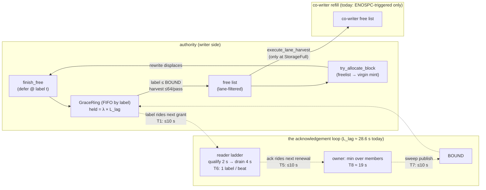

# Design: THE FREE-GRACE SUSTAIN CAMPAIGN — making the freed-offset loop's release rate track the deferral rate (finding 15, part 2)

| | |
|---|---|
| **Title** | The free-grace sustain campaign: a demand-coupled acknowledgement loop — pipelined reader acks, demand-coupled bound publication, demand-armed prods, and ahead-of-stall lane refill |
| **Author** | (design agent; adjudication owner: user) |
| **Date** | 2026-08-25 |
| **Status** | **Implemented — fleet acceptance NOT MET (2026-09-05, `.benchmarks/2026-09-05-d4-free-grace-sustain.md` §6: finding 15 reproduces on the s11 venue at 23 s — lane ENOSPC storms — and five of eight co-writers wedge on the ENOSPC'd writes).** PRs 1–4 landed 2026-08-25 (`f992c2e1` instruments · `11dafe2f` L1 · `29788e55` L4+L2+L2b+L3 · `69b2fe16` L5 + the OQ 2 horizon), followed by finding 18 (`6ce59456`, the prod decay) and finding 29 (`a50da1e4` + `37bf6036`, the bounded allocation park). The s11-mpiio row went GREEN once on the cloud venue (2026-08-30 16b, `8e4a2cab`, `.benchmarks/cloud/2026-08-30-094130`) — on a fleet whose lanes never coupled (`demand_waits` 0, `bound_age` 23–29 s, the routine composite). The §3 rate equation was closed in-process 2026-09-05 (D-4, `.benchmarks/2026-09-05-d4-free-grace-sustain.md`: the shipped levers unbind a recycle-bound stream at zero fences; Little's law holds on live gauges; finding D4-1 priced). **Owed**: the from-zero s11-mpiio row on the finding-15 venue with the sustain columns (PR 5's harness rung is NOT landed — the rig `.benchmarks/rigs/free-grace-sustain-rig.sh` reads the row's snapshots), run by the parent campaign |
| **Repo state audited** | branch `dev`, tip `894cc088` (finding-15 part 1 landed at `8d2bcd3b`; contracts `tests/mw_cowriter_free_tests.rs` §finding 15) — the design as written; landed state per the Status row |
| **Program input** | `.benchmarks/2026-08-25-s11-freeloop-stall.md` (finding 15 + the same-day part-1/re-grade addendum); `docs/design-full-multi-writer.md` rung-20 residual board item 1 (re-attributed 2026-08-25) and item 2 (the `SQUEEZEFS_RANGE_CUSTODY` flip, which inherits this as a precondition) |
| **Binding inputs** | AGENTS.md (one source of truth — DLM S6/S7/S9 families, ENG-10, the two-substrate + sustained-state row rules, the TDD law); `docs/pre-rc-engineering-spec.md` §6.8 item 3; `docs/operations.md` §Freed-offset grace period; `.benchmarks/2026-08-19-blob-aware-merge-and-fabric-venue.md` §3 (the 0→825 never-draining capture); the free-grace pressure valve (rung-20 residual 6, in tree) |
| **Evidence this program must move** | the s11-mpiio acceptance row (`tests/run_mw_matrix.sh s11-mpiio`): phase A1 refused by the sustained-window gate at 138 → 80 MiB/s decay. **Probe provenance (every measurement states its instrument):** the box's best measured probe is **2,240 MiB/s** — from the 2026-08-25 *pre-part-1 stock-clock control run*; the **counted** part-1 from-zero row (the one that produced 138 → 80, held 572, deferrals 4,773) probed **202 MiB/s** on a quiet box. The 33 → 202 → 2,240 swing across box states is the evidence note's own flagged, unresolved venue hazard, which the acceptance rung gates on (§PR Plan, PR 5's probe precondition) |

> **Evidence-tier statement (mandatory per `docs/rc-manifest.md`).** Everything
> measured in this document is *measured-real* on the single-node proving
> fleet (1 set authority + 8 co-writers, nvmet-tcp devsub, one box). Every
> 15 k-member number in §5.8 and §10 is *arithmetic-on-measured-constants*
> and is labeled as such where it appears. Nothing here claims a measured
> multi-box result.

---

## 1. Overview

On a multi-writer fleet with the S6 membership plane armed, every terminally
freed block offset enters the freed-offset grace ring (`src/free_grace.rs`)
and is not reallocatable until every live member has acknowledged passing its
label — spec §6.8 item 3's never-release-unacknowledged promise. Finding 15
part 1 (`8d2bcd3b`) made that supply *reachable* from the co-writers' lane
harvest; the re-graded s11-mpiio row then quantified part 2: **the sustained
shared-file rewrite ceiling IS the grace loop's release rate.** Phase A1
decays 138 → 80 MiB/s, and the 80 MiB/s floor is exactly
`held ÷ loop-latency` = 572 blocks × 4 MiB ÷ 28.6 s — a Little's-law identity
this document derives term-by-term from the code (§3).

The loop's latency is not physics; it is **quantization**. Of the measured
≈ 28.6 s an offset spends between `finish_free` and reallocatability, only
≈ 6 s is the coherence physics (the reader's qualify + drain windows, which
derive from the checkpoint/staleness machinery). The remaining ≈ 22 s is
three cadence quantizations stacked end-to-end: labels are learned only on
the 10 s lease-renewal beat, the reader's acknowledgement ladder completes
exactly **one label per beat** (one-candidate-in-flight), and the owner
publishes the reallocation bound only on its 10 s sweep. The campaign removes
the quantizations and leaves the physics: (L1) a **pipelined acknowledgement
ladder** on the reader, (L2) **demand-coupled prods** that extend the
existing rung (a) from "space is running out" to "the writer's allocation is
recycling" — plus (L2b) **demand-elastic revalidation passes** (the user's
OQ 3 decision: the prodded cadence is also the pass-cadence ask, floored at
the checkpoint ceiling, with the S5 staleness contract's published numbers
pinned unmoved) — (L3) **demand-coupled bound publication** on the owner —
riding the valve's *existing* rate-limited refresh path, no new arm in the
renewal hot op — (L4) the **demand signal** itself — the lane-aware pressure
input finding 15 named, with a refusal-edge-independent detector the ring
computes on state it already holds — and (L5) **ahead-of-stall lane refill**
on the co-writer with a **measured refill horizon** (the user's OQ 2
decision: the harvest reply carries the authority's live bound age), so the
shipped harvest stops being a serialized stall→RTT→batch appendage of
ENOSPC.

Post-fix, the loop's latency on the s11 venue drops from ≈ 28.6 s to a
derived ≈ 9–12 s (§5.7), which moves the loop's throughput ceiling from
80 MiB/s (at the frozen 572-block inventory) to ≈ 2.0–2.5 GiB/s at the
venue's circulating-supply bound — at or above the venue's best measured
probe (2,240 MiB/s, from the pre-part-1 control run; the counted decay row's
own probe read 202 MiB/s — provenance and the acceptance precondition it
forces are in §5.7 and PR 5). The loop stops being the ceiling; the venue's
per-lane spare supply becomes the honest next bound, and it is published
(§8).

No promise weakens: release still happens only at `label ≤ BOUND` or through
the counted fence-with-eviction arm; the tightening floor (one honest
acknowledgement cycle) is untouched; acks stay label-batched on renewals
(zero journal traffic, no per-free wire traffic); and every mechanism is
inert on an unarmed mount (one relaxed load — the solo re-gate holds).

---

## 2. Background & Motivation

### 2.1 The machinery today (code map)

| Half | Where | Cadence today |
|---|---|---|
| Deferral | `BlockAllocator::finish_free` → `GraceRing::defer` (`src/block_allocator.rs:2216`, `src/free_grace.rs:702`) | per terminal free |
| Label clock | `free_grace::label_now` = owner clock + 1 ms (`src/free_grace.rs:300`) | per free |
| Release | `GraceRing::harvest_with` pops the front while `label ≤ BOUND`, `HARVEST_BATCH = 64` per pass (`src/free_grace.rs:429,756-841`) | per allocation attempt (`try_allocate_block` head, `src/block_allocator.rs:1948`), per `finish_free`, per lane-harvest pass (part 1) |
| BOUND | `MembershipOwner::min_acked_free_epoch` → `publish_bound` (`src/membership.rs:1801-1827`) | membership **changes** + the owner sweep at `renew_interval` (`src/membership.rs:2718-2740`); under a live prod, additionally rate-limited to once per prodded cadence (`src/free_grace.rs:945-951`) |
| Reader ack | `ReaderAckLadder::note_pass`, driven once per revalidation pass by `spawn_reader_revalidation` (`src/free_grace.rs:1157-1196`, `src/ro_coherence.rs:304-383`) | one pass/s; **one candidate in flight** |
| Ack carriage | `MemberSession::ack_free_epoch` → the next lease renewal (`src/membership.rs:1626-1684`) | the renewal beat (10 s shipped) |
| Valve | rungs (a) prod / (b) tighten / (c) force+evict, keyed on `runway_ms` — a **space** forecast (`src/free_grace.rs:516-546,904-976`) | per harvest |
| Co-writer refill | `harvest_lane_supply` → `routed_harvest_sink` → `execute_lane_harvest` (`src/block_allocator.rs:1533`, `src/data_alloc_lane.rs:514`, `src/cowriter.rs:1833`) | **only** from the `StorageFull` arm of `allocate_block_inner` (`src/block_allocator.rs:1869`) |

### 2.2 What the field showed

Three captures, one shape:

1. `.benchmarks/2026-08-19-blob-aware-merge-and-fabric-venue.md` §3:
   `free_grace_offsets` 0 → 825 across one 8-rank row, never draining;
   380 s outlier iterations.
2. `.benchmarks/2026-08-25-s11-freeloop-stall.md` (first run): a 2.2 GiB/s
   rewrite storm recycling at ≈ 65 MiB/s (~34× short), fleet ENOSPC through
   lane exhaustion, `free_grace_pressure_pct` **0** the whole run — the
   valve's forecast reads space, and the failure mode was throughput.
3. Same note, addendum (the part-1 binary, from zero): no ENOSPC, no lane
   harvests, no fences — and A1 decays to **exactly the release rate**:
   deferrals 4,773 / releases 4,201 / held 572 / tightenings 2,073 /
   `pressure_pct` 0 / `alloc_lane_harvests` 0 on every mount. The
   `tightenings 2,073` beside `pressure_pct 0` is not a contradiction, and
   the precise statement matters: rung (b) **was** evaluating sub-routine
   deadlines throughout — on the PASSED supply (≈ 10³ blocks; see the note
   below for what that number is made of) against the storm's ~50 ms mean
   inter-arrival, `runway_ms` reads ≈ 51 s, below the 76 s routine bound (a
   counted tightening per harvest) but above the ≈ 38 s prod threshold
   (`cadence_for` returns `None`), so rung (a) never engaged; and
   `pressure_pct` is a TTL'd point gauge snapshotted at read time, not a
   counter. So the exact defect is **"rung (a) never engaged and rung (b)
   engaged without effect"** — the space forecast graded the storm as mild
   while throughput was already coupled, which is the gap L4 exists to
   close. **Supply-trajectory note (load-bearing for §5.4's site 0 —
   corrected in this revision to name TWO quantities, because they diverge
   on exactly this row):**
   * **The PASSED supply** — what the valve reads today:
     `free_supply_blocks` = lane-scoped `virgin_bytes` + `free_blocks_count`
     (`src/block_allocator.rs:2308-2314`), whose free-list half is **not
     lane-filtered** (`free_blocks_count`, `:1122-1124`). On this row it
     stays ~10³ throughout: the lane-scoped virgin margin early, then
     **foreign-lane free-list accumulation** — released offsets are
     overwhelmingly co-writer-lane blocks, the only foreign-lane consumer
     (`execute_lane_harvest`) ran 0 times, and the authority's own funnel
     filters `lane_is_ours` — so releases-to-date pile up unreachable
     (thousands against 4,201 releases by the tail). That accumulation is
     what held `runway_ms` at ≈ 51 s through the decay, and **the measured
     gauges independently confirm the passed supply never troughed**: had
     it reached ≤ 64 at a tail harvest, runway ≈ 64 × 50 ms ≈ 3.2 s ⇒
     `cadence_for(3,200)` clamps to the 1 s floor ⇒ `Some` — rung (a) prods
     — and `pressure_pct` ≈ 96; the row measured 0 and no prods.
   * **The LANE-REACHABLE supply of the starving stream** — the
     `lane_is_ours` free-list population plus the lane-scoped virgin
     remainder, i.e. exactly `try_allocate_block`'s own reachable set. THIS
     is the quantity that troughs at the decay tail (sweep-quantized bursts
     ≈ release rate × sweep ≈ 200 blocks, consumed toward 0 between
     sweeps). **No shipped code computes it** — the un-lane-filtered
     free-list half inside the valve's supply signal is a remnant of the
     ORIGINAL finding-15 defect class ("the forecast reads GLOBAL supply,
     allocation starves per-LANE"); part 1's correction covered only the
     `virgin_bytes` half. §5.4's site 0 keys on the lane-reachable
     quantity; PR 1 lands the counting-set wrapper that makes it
     measurable correct-by-construction (§5.4) and captures its
     trajectory; PR 3 re-bases the runway's
     free-list half onto the same counter, so the shipped rung (a)/(b)
     signal stops inheriting the skew (stated here rather than left
     implicit — §5.4).

Part 1 fixed reachability (the remote funnel now runs the ring head). Part 2
is the rate: the loop re-supplies at the acknowledgement machinery's own
quantized cadence *regardless of demand*. That is a design property, not a
wiring gap — hence this document.

---

## 3. The rate equation (derived from the code, reconciled against the row)

### 3.1 The shipped clocks on the s11 venue

All derived, none assumed (venue: localhost nvmet-tcp devsub, default knobs):

| Symbol | Value | Derivation (code) |
|---|---|---|
| revalidation interval `P` | **1 s** | `max(flush cadence 50 ms, CHECKPOINT_MAX_AGE_MS 1 s)` — `resolve_revalidate_interval_ms` (`src/meta_backend/kv/revalidate.rs:103-117`; flush default `src/env_knobs.rs:133`) |
| staleness bound `S` | **2 s** | `P + 1 s` checkpoint ceiling (`revalidate.rs:156`) |
| `skew_max` | **22.5 ms** | `max(45 s × 500 ppm, observed RTT ≈ 0)` (`src/membership.rs:1128-1133`, `MONOTONIC_RATE_DRIFT_PPM src/membership.rs:1070`) |
| `D_purge` | **2 s** | `2 × P` (`src/membership.rs:1140-1145`) |
| `T_owner` / `T_self` | 45 s / ≈ 42.95 s | `src/membership.rs:1123`, `lease_clock_core::t_self_nanos` |
| renewal beat `B` | **10 s** | `min(CLIENT_HEARTBEAT_INTERVAL_SECS 10 s, T_self/3 ≈ 14.3 s)` (`src/membership.rs:1177-1182`) |
| `ack_cycle` | **≈ 38.0 s** | `3B + 3S + skew + D_purge` (`src/free_grace.rs:465-468`) — matches the module doc's "≈ 38 s with the shipped clocks" |
| routine fence / pressure bound | 76 s / 38 s | `2 × cycle`, `cycle` floor (`src/free_grace.rs:318-325,473-484`) |
| `ack_refresh_floor` | **1 s** | `max(P, skew_max)` (`src/free_grace.rs:577-579`) |

### 3.2 The loop latency `L_lag`: where every second goes

An offset freed at owner instant `t` (label `t+1`) becomes reallocatable when
`BOUND ≥ t+1`. Follow one label through the machinery:

| # | Term | Mechanism | Cost on this venue |
|---|---|---|---|
| **T1** | **Label learn quantum.** A reader learns labels only from grants, i.e. only at renewals (`MemberSession::learned_label`; the label is `Grant::granted_at_owner_ms`) | the label a member is working on is 0–10 s old at adoption, and — decisive — the value it eventually ACKS is a full beat old when it arrives (see T5/T6) | up to **B = 10 s** |
| **T2** | **Qualify.** Condition (2) of the ladder: a pass's ledger read must begin ≥ `S + skew` after the label was *learned* (`src/free_grace.rs:1172-1181`) | 2.02 s | **≈ 2 s** |
| **T3** | **Pass granularity.** Qualify/promote decisions land only on 1 s revalidation passes (`spawn_reader_revalidation`) | ≤ 1 s per stage | **≈ 1–2 s** |
| **T4** | **Drain.** Condition (3): `S + D_purge` after the qualifying pass (`src/free_grace.rs:1183-1194`) | 4 s | **≈ 4 s** |
| **T5** | **Carry-home.** The promoted ack rides the *next* renewal (`reader_pass_completed` → `ack_free_epoch` → next beat) | promote lands at learn+≈7 s; the next renewal is at learn+10 s | **≈ 3 s** (the beat remainder) |
| **T6** | **One-candidate-in-flight.** Ladder condition (0) adopts a new candidate only after the previous acked (`pending ≤ acked && candidate ≤ acked`, `src/free_grace.rs:1160-1170`) | the ladder completes exactly **one label per renewal beat**: T2+T4+T3 (≈ 7 s) fits inside B (10 s), so the ack ADVANCE is beat-quantized, and each acked value is exactly one beat old on arrival | folds into T1/T5: acked-value age at owner update = **B = 10 s** |
| **T7** | **Bound publish quantum.** `refresh_free_grace_bound` runs at membership changes + the owner sweep at cadence `B` (`src/membership.rs:2718-2740`); renewals deliberately do not pay the O(members) min (`src/membership.rs:1814-1827`) | published bound is 0–10 s staler than the freshest recorded acks | **0–10 s, mean ≈ 5 s** |
| **T8** | **Min over members.** `min_acked_free_epoch` over 8 co-writers: a member's recorded ack ages from 10 s (at its renewal) to 20 s (just before the next); the min VALUE is the max AGE. **Assumption, stated as one**: the 18.9 s figure takes renewal phases as independent and uniform — the mw fleet rig starts co-writers near-simultaneously, so phases may be correlated (fully in-phase members give a mean min-age of ≈ 15 s, which *widens* the gap to the measured 28.6 s rather than closing it). §8's residence-histogram self-check is the instrument that adjudicates this assumption (PR 1) | E[max of 8 × U(10 s, 20 s)] ≈ 10 + 10·8/9 ≈ **18.9 s** under the phase assumption | dominates T1/T5/T6's composite |

**Effective bound age at a harvest** ≈ T8 (≈ 19 s) + T7 (mean 5 s, worst
10 s) + T3 residue ≈ **24 s mean, ≈ 29 s toward the worst phase**. Harvest
*trigger* frequency and `HARVEST_BATCH` are **not** binding terms: harvests
run at every allocation attempt and every `finish_free` (hundreds/s under the
row), and 64 offsets/pass × that frequency is ≥ 3 orders above demand. The
per-volume ring structure (2 rings, one per data volume) is also not binding:
labels and BOUND are process-global.

### 3.3 Reconciliation against the measured row

* **Latency closes.** `held ÷ release-rate` = 572 blocks ÷ 20 blocks/s =
  **28.6 s**, inside the derived 24–29 s band. The loop latency is the
  bound's age — measured and derived agree.
* **The floor closes.** Little's law on the closed loop: throughput =
  circulating inventory ÷ loop latency = 572 × 4 MiB ÷ 28.6 s = **80 MiB/s**
  — exactly the floor A1 decayed to, and exactly the note's "releases bracket
  the floor".
* **The freeze closes.** Once *any* allocation stream on the collective's
  critical path is recycle-bound, the loop is 1-in-1-out: each allocation
  that consumes a released offset is followed by exactly one displaced free
  entering the ring, so `held` freezes (572) and with it the rate. Deferral
  closure (4,773 ≡ 4,201 + 572) confirms no leak.
* **What does NOT fully close from the existing gauges — the narrowed
  term.** *Which* allocation stream became recycle-bound first.
  `alloc_lane_harvests = 0` on every mount excludes the co-writers'
  `StorageFull` funnel (the only instrumented refill); the run also carries
  no alloc-stall storm in its log — **an inference, stated as one**: the
  addendum's gauge list does not quote `free_grace_alloc_stalls`, and PR 1's
  harvest columns make the value explicit on the re-capture. Two candidates
  presented themselves, and the shipped gauges cannot watch **the local
  funnel's supply source** directly: (a) the **authority's own lane-0
  allocations** — the shipped
  publishes' indirect-map blob writes (`publish_indirect_blob_bytes`,
  `src/routing.rs:6143`) and any other authority-resident allocation run
  `try_allocate_block` → `harvest_grace` locally, appear in no harvest gauge,
  and under a 10 GiB indirect-domain rewrite they CoW a blob per publish
  window; (b) the **co-writers' virgin margins** — 4 GiB/lane against
  ≈ 2.3–3.6 GiB written per co-writer over the run puts several writers near
  their virgin cliff at exactly the decay's tail.

  **The exclusion argument (this revision): the candidate set collapses to
  (a).** A stream can only be recycle-*bound* if it **consumes** recycled
  offsets. A co-writer's only path to recycled supply is the lane harvest
  (`adopt_lane_free_grant` — its own displaced frees SHIP by the S9
  accounting law, so its local free list receives nothing else), and the row
  shows `alloc_lane_harvests` **0 on every mount**: no co-writer consumed a
  single recycled block all run. A virgin-only allocation stream cannot be
  paced by the release rate (a fresh mint does not slow as the cliff merely
  *approaches*), and a co-writer that actually crossed its cliff would have
  produced the harvests/ENOSPC the row lacks. So (b) cannot be the stream
  that froze the inventory; the only consumption path that both exists and
  is uncounted is **(a) — the working hypothesis PR 1's capture exists to
  CONFIRM and sharpen** (naming the specific authority-side arm), not one of
  two open branches — unless the capture surfaces a consumption path this
  reasoning misses, which is exactly what the instruments would show.
  **PR 1 pins the term** with the allocation-source split
  (`alloc_from_freelist` / `alloc_fresh_mints` per mount), the demand-wait
  counter at every funnel arm, the grace residence histogram, and the
  bound-age gauge — and re-captures the row before the trigger-site PRs
  (3–4) finalize their placement; the same capture's residence-histogram
  p50/p90 spread is the check that the §3.2 T8 phase model — and not a
  missing term — explains the measured 28.6 s sitting at the top of the
  derived band. The levers L1–L3 are justified by the latency closure
  *alone* and do not wait on the attribution.

### 3.4 The loop, drawn



---

## 4. Goals & Non-Goals

### Goals

1. **The release rate tracks the deferral rate** whenever the fleet's
   allocation demand couples to the recycle loop, with the residual latency
   equal to the coherence physics (qualify + drain) plus small, derived
   cadence floors — never the renewal/sweep beats.
2. **The pressure machinery sees throughput coupling**, not only space
   scarcity — and its supply inputs are **lane-reachable**, not global
   (the finding-15 defect class, both halves): the s11 shape (decay at
   `pressure_pct 0`) becomes structurally impossible to miss on the gauges.
3. **Co-writer refill leaves the stall path**: the lane harvest engages ahead
   of exhaustion, watermarked by demand, off the allocation hot path.
4. **The s11-mpiio acceptance row passes from zero** on the finding-15 venue
   with the loop no longer the binding constraint (quantified target §10).
5. Every mechanism carries its A/B lever, its stats law, and its red-first
   contract tests; the unarmed mount's cost stays one relaxed load.

### Non-Goals

1. **No weakening of the coherence promise.** No release below an
   unacknowledged label except through the existing counted
   fence-with-eviction arm. Rungs (b)/(c) and their floors are untouched.
2. **No per-volume vector acks / no second reader→writer channel** — the
   scalar-label decision in `src/free_grace.rs`'s module docs stands.
3. **No durable format change, no new incompat bit, no new wire verb.**
   (One additive, versioned field on an existing reply — the OQ 2 bound-age
   hint, adopted per the user's 2026-08-25 decision — is the sole wire
   change: `PUBLISH_SCHEMA` 7 → 8, §6/§7; the design degrades to the
   derivation without it, which is the mixed-version posture.)
4. **Not a general clock retune.** `T_owner`, the 10 s routine beat, `S`,
   `D_purge` keep their shipped derivations; the campaign changes *when the
   machinery deviates from the routine beat*, not the routine beat itself.
5. **Not the venue's supply arithmetic.** If, post-fix, a row is bound by
   per-lane circulating spare (§5.7's honest margin), that is the venue's
   capacity statement, published on the gauges — not this campaign's bug.

---

## 5. Proposed design

Five levers, smallest set the §3 equation justifies. L1–L3 attack the three
quantizations (T1/T5/T6, T7, T8-composite); L4 is the signal that arms L2/L3
honestly; L5 moves the co-writer refill off the stall path. Each is
independently landable and independently disarmable.

### 5.1 L1 — the pipelined acknowledgement ladder (reader side)

**Today** `ReaderAckLadder` is one-candidate-in-flight by construction
(condition (0), `src/free_grace.rs:1160-1170`): a fresh label is adopted only
after the previous candidate is *acked*. That was the correct fix for the
"climbs and never drains" starvation (the candidate snapshot law), but it
quantizes the ack advance to one label per renewal beat (T6).

**Change**: generalize the ladder to a bounded FIFO of candidates, each an
`(label, learned_at_ms, qualified_pass_ms, ready_at_ms)` record with **its own
unchanged gates**:

* **Adopt**: on each pass, if the freshest learned label exceeds the newest
  candidate's, push a new candidate snapshotting `(label, learned_at)`. The
  per-candidate snapshot preserves the anti-starvation law verbatim — a
  faster beat only ever makes the *newest* candidate fresher; it never moves
  an adopted candidate's target.
* **Qualify**: a candidate qualifies on the first advancing pass whose
  `pass_start ≥ learned_at + (S + skew)` — condition (2) per candidate,
  bytes-identical to today's rule.
* **Promote**: `acked = max{ label : qualified ∧ now ≥ ready_at }`, where
  `ready_at = qualify_pass_now + (S + D_purge)` — condition (3) per
  candidate. Monotone by construction (labels adopt in learn order).
* **Depth**: derived, never a knob —
  `clamp(ceil((qualify_lag + drain_lag) / ack_refresh_floor) + 2, 2, 16)`
  (= 9 on this venue: `ceil(6.02 s / 1 s) + 2`). A full queue drops the
  *oldest unqualified* candidate
  in favour of the newest label (acking a fresher label subsumes the older —
  the bound is a high-water mark), so the queue can never wedge the ladder.

**Correctness argument** (the reviewable core): an ack for label `L` is
emitted only after (i) an epoch-step purge ran in a pass whose ledger read
began ≥ `S + skew` after `L` was learned, and (ii) `S + D_purge` elapsed
since that pass. Pipelining changes only *how many labels* ride the ladder
concurrently; no label's own gates move. The single-candidate ladder is the
depth-1 special case, which is exactly what the A/B lever restores.

**Structure**: the candidate queue lives behind a `parking_lot::Mutex` inside
`ReaderAckLadder` — `note_pass` runs once per second on the revalidation
task, nowhere near a hot path; the published `acked` word stays an
`AtomicU64` for the renewal reader.

**Effect**: alone, L1 removes T6 (the ladder keeps up with any learn
cadence). Composed with L2's faster learn beat, the ack advance cadence drops
from one label / 10 s to one label / pass, and each acked value's age at the
owner drops from `B` (10 s) toward `qualify + drain + 2 passes` (≈ 7–8 s).

**Lever**: `SQUEEZEFS_FREE_GRACE_ACK_PIPELINE` (bool, default on; `0` =
depth-1, the pre-campaign ladder verbatim). Registry entry per ENG-10.

### 5.2 L2 — demand-coupled prods (rung a′)

**Today** rung (a) engages only off `runway_ms` — a *space* forecast
(supply ÷ deferral rate). A throughput-paced fleet with ample space never
prods: the s11 row ran its whole decay at `pressure_pct 0` with rung (a)
never engaging (§2.2 item 3's reconciliation: rung (b) tightened 2,073 times
without effect, but the ≈ 51 s space runway never crossed the ≈ 38 s prod
threshold), so every member kept its routine 10 s beat.

**Change**: a second, orthogonal arm into the same rung. When the **demand
signal** (§5.4) is live, `take_prod_cadence` answers the **floor cadence**
(`ack_refresh_floor`, ≈ 1 s here) for every member behind `PROD_LABEL` —
the same "is this member holding anything we hold?" gate as today
(`src/free_grace.rs:962-976`), the same delivery (the grant's `renew_ms`,
`src/membership.rs:1680-1682`), the same `sqz-lease` lane. The demand
**mark never feeds rung (b)**: the fence deadline tightens only off the
space runway, whose floor stays one honest ack cycle — a demand-prodded
healthy reader is asked to answer sooner, never fenced sooner (constraint 2
holds by construction). (What DOES change under the same lever is the
runway's supply *input* — lane-reachable instead of passed-global,
§5.4/KD-FG-10 — which corrects rung (b)'s reading on lane-starved
authorities without touching its law.)

**Why the floor is already the correct cadence**: `ack_refresh_floor =
max(revalidation interval, skew_max)` is the shortest interval at which a
member's answer can carry anything new (`src/free_grace.rs:569-579`), and the
candidate-snapshot law is what makes a floor-cadence beat safe against ladder
starvation — **at any depth, including the shipped depth-1**: the snapshot
exists precisely so a fast beat cannot refresh the target out from under a
pass, and the existing rung (a) already prods down to this same floor under
space pressure today (`ProdParams::cadence_for` clamps into
`[floor, renew]`). Under a 1 s beat the depth-1 ladder still advances one
label per ≈ 7–8 s (each acked value ≈ 8 s old at arrival vs today's
10–20 s) — a safe partial win.

**The L1-before-L2 ordering is therefore a measurement-cleanliness choice,
not a correctness one**: landing them together would leave the acceptance
A/B unable to attribute the latency cut between the beat and the ladder.
Operationally the two stay decoupled — under `ACK_PIPELINE=0` (risk R1's
field retreat) the demand arm **stays live and degrades to depth-1 pace**
(prods still fire at the floor; the ladder promotes one label per
qualify+drain; logged once per arm), so a field pipelining bug costs only
L1's share of the latency cut, never the whole campaign.

**Effect**: T1 (label learn) and T5 (carry-home) collapse from beat-remainder
scale (≈ 10 s composite) to ≤ 2 floor beats (≈ 2 s).

#### 5.2b L2b — demand-elastic revalidation passes (OQ 3, user decision 2026-08-25)

The prod already carries the ask (**no wire change**): `Grant::renew_ms` is
what the member's renewal loop sleeps on, and `take_prod_cadence` only ever
hands out a shortened value under rung (a)/(a′) — so a member observing a
prodded `renew_ms` below its routine beat has an unambiguous demand signal,
and under L2b it also tightens its **revalidation pass cadence** (the
qualify/promote vehicle, `spawn_reader_revalidation`'s sleep) to

```
pass_interval = clamp(prodded renew_ms, CHECKPOINT_MAX_AGE_MS, routine interval)
```

TTL'd exactly like the prod (the member session deposits a prodded-pass
word; the loop's timeout reads it; expiry restores the routine interval
within one reading TTL). **The floor is the derived minimum pass cost, and
it is physics, not tuning**: `resolve_revalidate_interval_ms`'s own
derivation says polling faster than the writer's 1 s checkpoint ceiling
buys no freshness (records do not exist to be found) — so the floor is
`CHECKPOINT_MAX_AGE_MS`, below which a pass cannot observe anything new.

**Why this can never weaken the S5 staleness contract — stated precisely**:
the contract is an UPPER bound ("a reader serves the state of the most
recent checkpoint it has polled; staleness ≤ interval + 1 s"). Shortening
the pass interval only ever LOWERS actual staleness; it can never raise it.
Three numbers therefore deliberately DO NOT move:

* the **published `reader_staleness_bound_ms`** stays the ROUTINE
  derivation — it is the guarantee in force even when a demand window ends
  mid-pass, and a bound that flickered with load would be a promise an
  operator cannot read;
* the **kernel/daemon reader TTLs** (§6.8 item 4) stay derived from the
  routine bound — caches may legitimately hold entries up to it, and a
  transient pass speedup does not invalidate that;
* the **ack ladder's `qualify_lag`/`drain_lag`** stay derived from the
  routine staleness bound — the label-qualification argument rests on the
  WRITER's checkpoint ceiling, never on the reader's pass rate, so the
  qualification windows must not re-derive from a transient. What elastic
  passes buy is more *passes* — finer T3 stage granularity and earlier
  promote instants — never shorter windows.

**Where it pays, honestly**: on the s11 venue the routine interval already
sits AT the 1 s floor (`max(50 ms flush, 1 s ceiling)`), so L2b is
**structurally inert there and §5.7's budget does not change**. It pays on
slow-flush venues — e.g. `SQUEEZEFS_META_FLUSH_INTERVAL_MS=5000` derives a
5 s pass interval, and under demand the T3-class stage granularity shrinks
5 s → 1 s per stage (the qualify/drain windows themselves stay at that
venue's routine derivation, as above).

**Cost**: passes are LOCAL — one ledger read per volume per pass, no wire,
no journal, no owner-side work — so the demand-window cost is ≤ 1 extra
ledger read per volume per second per member, and §5.8's wire table is
untouched by L2b. **Lever**: `SQUEEZEFS_FREE_GRACE_PASS_ELASTIC` (bool,
default on; `0` = the routine pass cadence always — the pre-campaign S5
behavior verbatim; member-side, the `ACK_PIPELINE` pattern). **Gauges**:
`free_grace_pass_prods` (passes run on a tightened cadence — the engagement
counter) and `free_grace_pass_interval_ms` (the cadence in force; routine
when no prod is live — the `prod_renew_ms` precedent).

### 5.3 L3 — demand-coupled bound publication (owner side, riding the existing valve refresh)

**Today** the O(members) minimum is recomputed at membership changes, the
`renew_interval` sweep (`src/membership.rs:1814-1827` — deliberately,
against the 22.5 M scans/s strawman), and — the piece this lever builds on —
`note_pressure`'s **existing** rate-limited refresh
(`LAST_BOUND_REFRESH_MS`, `src/free_grace.rs:945-951`), which already runs
at every harvest (hundreds/s under the row) but is gated on a prod cadence
having been *computed from the space runway*. Under the s11 storm that gate
never opened (§2.2 item 3), so the bound advanced only on the 10 s sweep —
a 0–10 s dead time on every advance (T7) that also staled the min
composition (T8's window).

**Change**: extend the gate of the existing refresh path from "a prod
cadence was computed" to "a prod cadence was computed **or the demand mark
is live**" (§5.4), keeping its floor rate limit verbatim. **No new arm in
`MembershipOwner::renew`** — an earlier draft put a dirty-mark in the
renewal path, and the marginal-latency argument kills it: once the
harvest-context refresh runs at the floor, a renewal-side mark buys only the
sub-beat gap between an ack's *arrival* and the *next harvest*, which under
a coupled storm (harvests running hundreds/s) is ≪ 1 s — not worth touching
the plane's stated hot op. The sweep stays as the idle-fleet backstop,
verbatim. `free_grace_bound_refreshes` counts the demand/prod-path
recomputes.

**Cost law** (the module-doc arithmetic, restated honestly): ≤ 1 O(members)
scan per floor interval — unchanged from the mechanism the valve already
ships; the demand gate only widens *when* it may fire.
*Arithmetic-on-measured-constants at 15 k members*: 1 scan/s × 15,000
`min()` reads ≈ 15 k relaxed loads/s — 3 orders below the refused 22.5 M/s.

**Effect**: T7 collapses from mean 5 s (worst 10 s) to ≤ 1 s; T8's composite
tightens because recorded acks are read within a floor beat of arrival.
Because L3 is one gate widening on L4's signal, it ships **in the same PR as
the demand arm** (PR 3) — there is no PR window in which it exists without a
live trigger (the no-dead-code law).

### 5.4 L4 — the demand signal (the lane-aware pressure input finding 15 named)

One new process word beside `RUNWAY_MS`: `DEMAND_UNTIL_MS` (owner clock,
TTL'd exactly like the runway reading — `reading_ttl_ms`). It is set — with
the counter `free_grace_demand_waits` — at the sites where the machinery
*observes* recycle coupling. The decisive design point (this review cycle's
correction): **the motivating row reached no refusal edge** — no ENOSPC, no
lane harvest, no stall — so a signal built only from refusal edges would
have read 0 on the exact shape this campaign exists to fix. Site 0 is
therefore the standing, refusal-edge-independent detector, and the refusal
edges are corroborating marks, not the arming condition:

0. **the standing coupling detector — first-class, built for the
   recycle-bound trough shape the motivating row decayed into.** Anchored
   **inside `GraceRing::harvest_with` / `note_pressure`**
   (`src/free_grace.rs:756-841,923-952`) — beside the existing `runway_ms`
   computation, which is the one place all three inputs are already in one
   pair of hands: the ring lock and the oldest/newest labels are taken
   *there* (not in the allocator wrapper), and the supply number arrives as
   an argument from the allocator's `harvest_grace` / `harvest_with_supply`
   (`src/block_allocator.rs:2286-2297`). The placement is also strictly
   broader than the wrapper: all three funnels — the routine
   `harvest_grace`, the pressure `harvest_grace_pressure`, and part 1's
   lane-harvest ladder — drain through `harvest_with`, so site 0 is live
   for every one of them by construction, and the deposit reuses the
   valve's TTL'd-word pattern. The predicate: demand ⇔ the ring is
   non-empty ∧ the oldest held label's age exceeds the **physics floor**
   (`qualify_lag + drain_lag + 2 × ack_refresh_floor`, resolved once at arm
   — offsets are aging past the point a healthy loop would have released
   them) ∧ the **LANE-REACHABLE** supply is at or below one `HARVEST_BATCH`
   — releases being consumed within a beat of publish.
   **The supply input is the lane-reachable set, normatively — not today's
   `free_supply_blocks`** (§2.2's corrected trajectory note: the passed
   number's free-list half is un-lane-filtered, accumulates foreign-lane
   releases nobody but a lane harvest can consume, and the measured row's
   own gauges prove it never troughed — a conjunct reading it would never
   fire on the motivating shape). The lane-reachable number is exactly
   `try_allocate_block`'s own reachable set: the `lane_is_ours` free-list
   population plus the lane-scoped virgin remainder. **The counter is
   specified correct-by-construction, never by call-site enumeration**: the
   free list's mutation census is TEN sites, not three — inserts at
   `publish_free_list`, `return_from_trim` (the KD-4.4 claim-window
   return), the fsck C6 limbo reconciliation, and `adopt_lane_free_grant`;
   removes at `try_allocate_block`'s claim, `take_free_for_lane_grant`,
   `claim_free_for_trim`, the C6 eviction, and the two VL7 mover picks
   (`allocate_block_below` / `allocate_block_at_or_above`) — and `trim
   --full` walks the list while the movers pick continuously, so an
   enumerated counter drifts in production (drifted-low ⇒ spurious
   tightenings/prods once PR 3 re-bases the runway; drifted-high ⇒ the
   never-fires hole this conjunct exists to close). So `free_blocks` is
   wrapped in a thin **counting-set type**: insert/remove adjust the
   lane-owned count under the same call (one modulo per mutation;
   unpartitioned mounts count everything, so the two quantities coincide
   there), and an eleventh mutation site is correct by construction — the
   C8 ledger's `pending_block_refs` deferred-op-accumulator precedent. The
   wrapper earns its **drift tripwire for free**: the fsck C6 walk already
   recounts the list per lane, so PR 1's contracts assert counter ≡ recount
   (and C6 reports a mismatch as a finding-adjacent diagnostic).
   **PR 1 lands the wrapper with the consumer-less observation**
   and captures the trough trajectory (the §2.2 burst/trough shape is a
   stated expectation until then); **PR 3 re-bases the passed supply on it
   under the `DEMAND` lever** — the armed conjunct AND the rung (a)/(b)
   `runway_ms` read the lane-reachable number (closing the shipped runway's
   inherited half of the original finding-15 global-vs-lane skew), while
   `DEMAND=0` keeps the pre-campaign passed-global runway verbatim (the
   lever's restore-exactly contract). Cost: two compares on values
   `harvest_with` is already handed, under the lock it already holds;
   nothing new is read on an unarmed mount (the existing empty-ring
   short-circuit runs first);
1. the existing pressure arm in `allocate_block_inner`
   (`src/block_allocator.rs:1852-1861`): `StorageFull` with a non-empty ring
   — today's cliff, now also a demand mark;
2. `execute_lane_harvest`'s empty passes (`src/cowriter.rs:1862-1883`,
   part 1's ladder): a remote writer asking for supply the ring still holds;
3. `try_allocate_block`'s head, when the harvest released nothing, the
   lane-filtered free list is empty, *and* the fresh-mint arm is at its
   cliff (`next_fresh_block` about to refuse) while the ring holds offsets —
   the coupling instant one step before StorageFull;
4. **subject to PR 1's attribution capture**: the specific authority-side
   allocation arm PR 1 names (§3.3's working hypothesis (a), confirmed and
   sharpened by the capture), if its coupling instant is not already
   covered by (0)–(3).

**The fixture is sourced honestly**: PR 1 lands site 0's predicate as a
**counted, consumer-less observation** — the demand-wait word already lands
there "counter only, no consumer yet", and it counts site-0 predicate hits
from day one — evaluated over the **lane-reachable** counter, so PR 1's
instrumented capture answers directly whether the trough conjunct fires on
the row's lane-reachable trajectory (and whether it needs loosening, e.g.
`≤ max(HARVEST_BATCH, deferral_rate × sweep)`, before PR 3 hard-codes it).
PR 3's deterministic engagement fixture is then built from **PR 1's
measured trace** (deferral cadence, supply trough, front age > the 8.02 s
physics floor ⇒ demand fires), not from the pre-instrumented addendum
trace, which carries no supply trajectory.

**The fallback is stated, not deferred**: if PR 1's capture convicts a
stream none of (0)–(3) cover — or shows the trough conjunct never
satisfied on the row — site 0's front-label-age term alone (ring non-empty
∧ front age past the physics floor) becomes the arming input — a strictly
weaker precondition site 0 already approximates, so the demand arm can
never be left without a trigger by the attribution's outcome.

`note_pressure` gains the demand input: a live demand mark arms rung a′
(§5.2) and L3's widened refresh gate regardless of the space runway, and
feeds a graded gauge (`free_grace_demand_pct`, the coupling face beside the
existing scarcity face `free_grace_pressure_pct`). The signal is one relaxed
store at sites that are either inside `harvest_with`'s existing lock
(site 0) or at a refusal edge (1–3) — zero added hot-path cost when
uncoupled, one load when unarmed (the existing `armed()` short-circuit).

### 5.5 L5 — ahead-of-stall lane refill (co-writer side)

**Today** `harvest_lane_supply` runs only from the `StorageFull` arm
(`src/block_allocator.rs:1869`): the refill is a serialized
stall → ship-RTT → grain-batch appendage of exhaustion, and every recycled
block a co-writer consumes costs its writers a full stop first.

**Change**: a watermark refill, off the allocation path:

* The co-writer already knows its **owed supply** without any wire traffic —
  but the accounting must be **per `(vol_tag, lane)`**, not the
  process-global counters: the watermark decision is per-volume (the verb
  is `ship_harvest_lane_free(endpoint, vol_tag, lane, …)`,
  `src/data_alloc_lane.rs:514-540`), and on the target venue's two data
  volumes a global owed number cannot say which volume's authority list
  holds the supply — it would trigger wasted harvest RTTs against a volume
  owed nothing, or miss one that is owed. So: a per-allocator owed word
  (one `AtomicU64` beside the lane state), **incremented at
  `ship_displaced_frees`' acknowledgement** for each offset whose verdict
  was `Freed` (the shipping site knows the offset's volume, and the lane is
  derivable from the offset — `b % W`), **decremented at
  `adopt_lane_free_grant`** per adopted block. The process-global counters
  (`meta_ship_publish.free_shipped_blocks`, `alloc_lane_harvested_blocks`)
  remain the stats faces; the new gauge `alloc_lane_owed_blocks` publishes
  the **sum** of the per-allocator words.
* A background single-flight-per-volume task (spawned only on laned
  co-writer engagements, `alloc_lane_grant::engage_allocator_lane` — the
  place the sinks are already wired) harvests when
  `reachable < watermark && owed > 0` **for that volume's allocator**, where
  `reachable` = local free list +
  the lane's virgin remainder (`virgin_bytes`, already lane-scoped), and
  `watermark = ceil(alloc_rate × horizon)` — `alloc_rate` an EWMA over the
  funnel's own claims, capped at lane-share/4. Derived, never a knob (the
  ENG-10 posture; the A/B lever disarms the mechanism, not the number).
* **The horizon is a MEASUREMENT, with the derivation as the fallback**
  (OQ 2 — user decision 2026-08-25, choosing the non-default):
  `HarvestLaneFree`'s **reply** carries the authority's live
  `free_grace_bound_age_ms` as **one additive u64 field**, versioned per
  the publish wire's schema discipline (`PUBLISH_SCHEMA` **7 → 8**, its
  doc comment recording the reason per convention: *"8 since the harvest
  reply carries the authority's bound age — the co-writer's refill horizon
  becomes a measurement"*). When the field is present and nonzero,
  `horizon = measured bound age + harvest RTT + one ack_refresh_floor`
  (the loop latency actually in force, plus the refill's own transit and
  one beat of slack); when the field is **absent (an old authority) or
  zero (nothing held)**, the horizon falls back to the member-local
  derivation (`qualify_lag + drain_lag + 2 × ack_refresh_floor +
  harvest RTT`) — so mixed-version fleets are safe by construction, and a
  co-writer never over-trusts a quiet ring. Engagement:
  `alloc_lane_horizon_hints` counts replies that carried the field (0
  against an old authority = the fallback engaged, by design) and
  `alloc_lane_harvest_horizon_ms` publishes the horizon in force (the
  `depth_target` publication precedent). The hint rides the SAME lever
  (`SQUEEZEFS_ALLOC_LANE_HARVEST_AHEAD=0` disarms the whole watermark
  machinery, hint included — restore-exactly), and a lying/mis-sized hint
  is bounded by the watermark cap (lane-share/4): the worst a bad number
  buys is a too-early or too-late refill, never a correctness effect.
* The harvest verb, grain, exactly-once handout ledger, and
  quarantine-on-death (`note_lane_handouts` / `discharge_lane_handouts`)
  are untouched — this is a *when*, not a *what*.

**Effect**: the refill RTT and the release-batch quantum leave the writer's
critical path entirely; the co-writer's funnel sees a fed free list instead
of a cliff. On a 250 µs fabric the harvest RTT amortizes over the grain
(64+ blocks) — sub-µs/block.

**Lever**: `SQUEEZEFS_ALLOC_LANE_HARVEST_AHEAD` (bool, default on; `0` =
ENOSPC-triggered only, the shipped shape).

### 5.6 Composition and ordering (what depends on what)

```mermaid
sequenceDiagram
  participant W as writer funnel
  participant R as GraceRing
  participant O as owner (membership)
  participant M as member (reader ladder)
  Note over W,R: demand signal (L4, site 0): ring aging + supply drained
  W->>R: harvest (front age > physics floor, supply ≤ 1 batch)
  R->>O: DEMAND live → rung a′ (L2) + widened refresh gate (L3)
  O->>M: grant carries renew_ms = floor (1 s)
  Note over M: prodded renew_ms also tightens the pass cadence (L2b,\nfloored at the 1 s checkpoint ceiling; inert on this venue)
  loop every floor beat (was: every 10 s)
    M->>M: pipelined ladder (L1): qualify Lk while Lk-1 drains
    M->>O: renewal carries acked label (age ≈ 7 s, was 10-20 s)
    O->>O: demand-gated min recompute (≤1/floor, was ≤1/10 s)
    O->>R: BOUND advances (age ≈ 9 s, was ≈ 24-29 s)
  end
  R->>W: releases track deferrals (lag = physics + floors)
  Note over W: co-writer: watermark refill (L5) keeps the funnel fed\n(horizon = the harvest reply's measured bound age, OQ 2)
```

Ordering: L1 first (a measurement-cleanliness choice, §5.2 — the demand arm
degrades gracefully without it) → L4+L2+L2b+L3 as **one** demand-arm PR
(L3 is a gate widening on L4's signal and may not exist without it — §5.3;
L2b's ask IS the prodded cadence, so it belongs to the same mechanism) → L5
(independent after PR 1; its per-volume owed accounting and watermark venue
check read PR 1's attribution; the OQ 2 hint rides its harvest-path PR).
PR ladder in §PR Plan.

### 5.7 The post-fix budget, quantified

Worst-member `L_lag` on the s11 venue with L1–L4 armed:

| Term | Today | Post-fix | Why |
|---|---|---|---|
| T1 learn | ≤ 10 s | ≤ 1 s | prodded beat = floor |
| T2 qualify | 2 s | 2 s | **physics — untouched** |
| T3 pass granularity | 1–2 s | 1–2 s | pass cadence unchanged (= floor) |
| T4 drain | 4 s | 4 s | **physics — untouched** |
| T5 carry | ≈ 3 s | ≤ 1 s | prodded beat |
| T6 ladder serialization | beat-quantized | eliminated | pipeline |
| T7 bound publish | ≤ 10 s | ≤ 1 s | demand-coupled refresh (existing valve path, gate widened) |
| T8 min composition | ≈ +9 s | ≤ +1–2 s | floor-cadence records |
| **Total** | **≈ 24–29 s (measured 28.6)** | **≈ 9–12 s** | — |

L2b (demand-elastic passes, §5.2b) is **structurally inert on this venue**
— the routine pass interval already sits at the 1 s checkpoint-ceiling
floor, so the table above is unchanged by it. On slow-flush venues (routine
interval > 1 s) L2b shrinks the T3-class stage granularity toward 1 s per
stage under demand, while that venue's qualify/drain windows stay at their
routine derivation (§5.2b's contract argument).

**Loop ceiling** = circulating spare ÷ `L_lag`. This venue
(2 × 32 GiB, W = 16, 9 writers, 10 GiB live): per-lane spare
≈ 4 GiB − 1.25 GiB ≈ 2.75 GiB → per-lane ceiling ≈ 2.75 GiB ÷ 9–12 s
≈ 235–313 MiB/s → 8 active lanes ≈ **1.9–2.5 GiB/s**, bracketing the venue's
best measured probe. **Probe provenance**: 2,240 MiB/s is the 2026-08-25
*pre-part-1 stock-clock control run's* reading; the **counted** decay row's
own probe read **202 MiB/s** on a quiet box, and the evidence note flags the
33 → 202 → 2,240 swing across box states as an unresolved venue hazard. The
Little's-law closure and the `L_lag` budget above are independent of the
probe; the *acceptance framing* is not — which is why PR 5 carries a probe
precondition (the acceptance run's own probe must land in the ≥ 750 MiB/s
domain, else the run is label-only venue evidence and restarts from a quiet
box), so a venue-state failure can never be misread as a campaign failure or
vice versa. The loop leaves the binding-constraint position; the
next bound is the venue's per-lane circulating supply, and it is now
*published* (`free_grace_bound_age_ms` × `alloc_lane_reachable_blocks` ×
the allocation-rate gauges make the `spare ÷ L_lag` arithmetic readable
live). **Honest margin statement**: at
full probe rate the required per-lane inventory (≈ 70 blocks/s × 10 s
≈ 2.7 GiB) sits at ≈ 98 % of spare — the row's own 0.8× band and A-B-B-A
brackets are the measured verdict, and if the row grazes the supply bound the
answer is the venue-sizing lever (`SQZ_MWFLEET_OSS_GB`), stated in the row,
never a gate relaxation.

**The 250 µs-RTT fabric venue** (arithmetic-on-measured-constants): every
`L_lag` term is second-scale and derives from checkpoint/staleness cadences,
not the wire — RTT enters only `skew_max` (`max(22.5 ms, RTT)` — unchanged at
250 µs), the prod delivery (+RTT per beat) and the harvest (+RTT per grain
batch, amortized to < 4 µs/block at grain 64). Post-fix loop latency on that
venue is the same ≈ 9–12 s; the loop ceiling remains
`per-lane spare ÷ L_lag`, fabric-insensitive by construction.

### 5.8 The 15 k-member economy check (constraint 3)

*Arithmetic-on-measured-constants* — 15 k has never been measured and this
table does not claim otherwise:

| Load | Routine | Under demand (this campaign) | Refused strawman |
|---|---|---|---|
| renewals at the owner (RAM half) | 1,500/s (10 s beat) | ≤ 15 k/s (floor beat) — one scc `update_sync` each, the plane's stated hot op | — |
| renewals at the owner (**wire half** — the term "RAM-only" would hide) | 1,500 authenticated frames/s | ≤ 15 k frames/s on the isolated `sqz-lease` lane: per-frame MAC verification, grant serialization, per-frame wakeups — a 10× amplification of the lane's routine load, pressure-scoped and TTL-decayed. **PR 3's 32-mount measured-simulated fan-out row is the instrument that bounds this term** (per rc-manifest tiers); the 15 k figure stays arithmetic | — |
| journal writes for liveness/acks | **0** | **0** (unchanged — the S6 gate) | 455/s measured ceiling on the `client:` plane |
| O(members) min recomputes | 0.1/s (sweep) | ≤ 1/s (rate-limited) ≈ 15 k reads/s | 22.5 M/s (per-renewal min) |
| per-free / per-block wire traffic | none | **none** (acks stay label-batched on renewals; the demand signal is process-local) | — |
| L2b elastic passes (member-side) | 1 ledger read/volume per routine interval | ≤ 1 ledger read/volume/s per prodded member — **LOCAL device reads, zero wire, zero journal, zero owner-side work** (§5.2b); the owner's tables above are untouched by L2b | — |

The prod fan-out is bounded by the floor and TTL'd by `reading_ttl_ms`
exactly as rung (a) is today; a quiet fleet decays to the routine beat within
one reading TTL. The OQ 2 hint's wire cost is one u64 on replies to a verb
that is already demand-driven and grain-batched (≈ demand ÷ grain ≈ 9
replies/s fleet-wide at the s11 shape) — not a per-member or per-beat term.

---

## 6. API / interface changes

**No public API, no new wire verb, no on-disk change.** Custody schema, the
harvest verb itself, `Grant`'s fields, and every incompat bit are untouched.
**One additive wire field** (OQ 2 — user decision 2026-08-25):
`HarvestLaneFree`'s reply gains the authority's `free_grace_bound_age_ms`
(u64), versioned by the `PUBLISH_SCHEMA` **7 → 8** bump with its
doc-comment reason recorded per the wire discipline (§5.5, §7). Everything
else is process-internal plus the operator surface:

### 6.1 Env knobs (registry entries per ENG-10, `src/env_knobs.rs`)

| Knob | Kind | Default | Meaning |
|---|---|---|---|
| `SQUEEZEFS_FREE_GRACE_ACK_PIPELINE` | bool | on | L1. `0` = depth-1 ladder (pre-campaign, the A/B control) |
| `SQUEEZEFS_FREE_GRACE_DEMAND` | bool | on | L2+L3+L4 as one arm (they are one mechanism: the signal and its two consumers), **including the runway's lane-reachable supply re-base** (§5.4 site 0). `0` = space-runway-only valve on the passed-global supply, sweep-only bound publish — the pre-campaign shape verbatim |
| `SQUEEZEFS_FREE_GRACE_PASS_ELASTIC` | bool | on | L2b (§5.2b, OQ 3 user decision): a prodded member also tightens its revalidation pass cadence, floored at the 1 s checkpoint ceiling. `0` = the routine pass cadence always — pre-campaign S5 behavior verbatim (member-side, the `ACK_PIPELINE` pattern) |
| `SQUEEZEFS_ALLOC_LANE_HARVEST_AHEAD` | bool | on | L5, **including the OQ 2 measured horizon** (the harvest-reply bound-age hint). `0` = ENOSPC-triggered harvest only, hint and all — restore-exactly |

The existing `SQUEEZEFS_FREE_GRACE_VALVE=0` continues to disarm rungs (a)/(b)
wholesale and now also stands the demand arm down (a disarmed valve with an
armed demand arm would be a contradiction; the arm logs which lever silenced
it). **Lever interaction (§5.2)**: `ACK_PIPELINE=0` with `DEMAND=1` keeps
the demand arm **live at depth-1 pace** — prods still fire at the floor and
the shipped ladder promotes one label per qualify+drain (logged once per
arm) — so the R1 field retreat surrenders only L1's share of the latency
cut, never the campaign. No new integer knobs: pipeline depth, prod cadence,
watermark and refresh rate all **derive** (§5), per the resource-derivation
law.

### 6.2 Behavior changes an operator can observe

* Under a rewrite storm, members' renewal cadence drops to
  `ack_refresh_floor` (visible as `free_grace_prod_renew_ms` +
  `membership_renewals` slope) and recovers within one reading TTL of quiet.
* `free_grace_bound` advances near-continuously instead of in 10 s steps.
* On slow-flush venues, a prodded member's revalidation pass cadence
  tightens toward the 1 s checkpoint ceiling (`free_grace_pass_interval_ms`
  / `free_grace_pass_prods`) and recovers with the prod — while the
  published `reader_staleness_bound_ms` and every reader TTL hold still
  (L2b's contract, §5.2b).
* Co-writers show background `alloc_lane_harvests` growth *without*
  correlated ENOSPC/stall counters — the ahead-of-stall signature — and
  `alloc_lane_horizon_hints` tracking their harvests once the authority
  runs a schema-8 binary (0 against an older authority = the derivation
  fallback, by design).
* `docs/operations.md` §Freed-offset grace period gains the demand face and
  the bound-age number (PR 5 docs rung).

---

## 7. Data model changes

None durable. No superblock bit, no record format, no `Grant` field. **One
wire change** (OQ 2 — user decision 2026-08-25, superseding the earlier
deferral): the `HarvestLaneFree` reply carries the authority's live
`free_grace_bound_age_ms` as an **additive u64**, under a `PUBLISH_SCHEMA`
**7 → 8** bump whose doc comment records the reason ("the harvest reply
carries the authority's bound age — the co-writer's refill horizon becomes
a measurement"), per the schema's each-bump-documented discipline.
Mixed-version safety is by construction: an old authority's reply lacks the
field and the co-writer falls back to the member-local horizon derivation
(§5.5); an old co-writer ignores the extra field under the schema's
versioned decode. Rollback stays binary-swap clean: a pre-campaign binary
reads every volume and — the additive field aside, which it never sees —
every wire frame this campaign's binary wrote; no durable state migrates.

---

## 8. Observability

All on the stats inode, merged by `fuse_client` into the existing
`free_grace_*` / `alloc_lane_*` families; every gauge is 0 / absent on an
unarmed mount (the solo re-gate — pinned by the existing contract-1 shape in
`tests/reader_free_grace_tests.rs`, extended).

| Field | Law |
|---|---|
| `free_grace_bound_age_ms` | **the loop-latency instrument**: owner-clock `now − BOUND` while armed and holding. Row-validity: a sustain row must publish it; post-campaign target ≤ 12 s sustained under storm on the s11 venue (was ≈ 28.6 s). Falls to 0 when the ring drains |
| `free_grace_residence_ms` | latency-core histogram, stamped at release (`now − (label−1)`): the measured per-offset residence; p50 must agree with `bound_age` under storm (self-check of the model) |
| `free_grace_demand_waits` | sites that observed recycle coupling (L4's site 0 standing detector + the refusal edges 1–3). 0 on solo/unarmed; growth is the *coupled* statement the s11 row lacked. Site 0 is built for the row's refusal-free decay-tail trough (§5.4); from PR 1 it counts as a consumer-less observation, so the capture itself proves (or re-sizes) the engagement before PR 3 arms a consumer |
| `free_grace_demand_pct` | the graded coupling face beside the scarcity face `free_grace_pressure_pct`; the s11 failure shape (decay at scarcity 0) must read ≈ 100 here |
| `free_grace_demand_prods` | prods issued by rung a′ (⊆ `free_grace_prods`); growth with `bound` advancing is the arm working; growth with `bound` flat = expect rung (c), same reading as rung (a) |
| `free_grace_bound_refreshes` | L3's demand/prod-path recomputes (the valve's existing `LAST_BOUND_REFRESH_MS` path, gate widened by L4); law: ≤ elapsed ÷ `ack_refresh_floor` (a rate-limit breach is a bug, testable) |
| `free_grace_ack_pipeline_depth` | reader gauge: candidates in flight; ≤ derived cap; 1-pinned under `ACK_PIPELINE=0` |
| `free_grace_acked_lag_ms` | reader gauge: member-clock `now − learned_at(acked)` — the reader's own contribution, separating reader lag from carry/publish lag in field triage |
| `free_grace_pass_prods` | L2b's engagement counter (member-side): revalidation passes run on a tightened cadence. 0 on quiet fleets, on `PASS_ELASTIC=0`, and — structurally — on venues whose routine interval already sits at the 1 s floor (this venue) |
| `free_grace_pass_interval_ms` | the revalidation pass cadence in force (routine when no prod is live — the `prod_renew_ms` precedent); never below `CHECKPOINT_MAX_AGE_MS`, pinned |
| `alloc_lane_horizon_hints` | OQ 2's engagement counter: harvest replies that carried the authority's bound-age field. 0 against a pre-schema-8 authority = the derivation fallback engaged, by design |
| `alloc_lane_harvest_horizon_ms` | the refill horizon in force (measured-with-fallback, §5.5 — the `depth_target` publication precedent); exported under the same engagement gate as `alloc_lane_reachable_blocks` |
| `alloc_from_freelist` / `alloc_fresh_mints` | **the attribution split PR 1 exists for**: per-process counters at `try_allocate_block`'s two exits; with `alloc_lane_harvested_blocks` they decompose every allocation's source |
| `alloc_lane_reachable_blocks` | the **lane-reachable supply** (the counting-set wrapper's lane-owned count + lane-scoped virgin remainder, published as the sum) — the quantity that troughs on a recycle-bound stream (§2.2's corrected note) and the site-0/runway input from PR 3. The COUNT is maintained always (one atomic beside the set op — what makes the wrapper correct-by-construction); the GAUGE **exports only when a lane partition or the grace plane is engaged, absent otherwise** — the `alloc_lane_*` family's solo-inert convention (`alloc_lane_writers` 0 = unpartitioned), keeping this preamble's every-gauge-0-unarmed law true without exceptions and the PR 5 solo re-gate uncarved |
| `alloc_lane_owed_blocks` | co-writer gauge: shipped frees − harvested back, accounted **per `(vol_tag, lane)`** (one word per allocator — §5.5) and published as the sum (the recycle stock owed to this lane across the authorities' lists) |
| `alloc_lane_ahead_harvests` | L5's engagement counter (⊆ `alloc_lane_harvests`); ahead-harvests with zero co-located stall counters is the designed steady state |
| `alloc_lane_harvest_watermark` | the derived watermark in force (the `depth_target` publication precedent) |

Existing tripwires keep their laws: `free_grace_forced_releases` /
`free_grace_laggard_fences` **stay must-stay-0 on a healthy fleet** — this
campaign's success criterion explicitly includes both remaining 0 while the
rate target is met (faster honest acks, never faster fences).
`tests/write_amp_rig.sh` / the mw matrix harvesters gain the new columns.

Logging: the demand arm logs once per engagement episode (rate-limited like
`note_alloc_stall`), naming the funnel arm that coupled and the live
bound age — the operator's "why is my fleet beating at 1 s" answer.

---

## 9. Security & privacy considerations

* **No new wire verb; one additive reply field.** The demand signal is
  process-local to the authority; prods ride the existing authenticated
  grant path (`renew_ms`), and L2b's pass-cadence ask is member-side
  inference from that same value (no field at all); the ahead-harvest uses
  the existing `HarvestLaneFree` verb under the same lease-epoch
  validation, handout ledger and quarantine-on-death. The OQ 2 bound-age
  hint is one u64 on that verb's **reply** — authenticated exactly as the
  reply already is, and advisory by construction: a lying or mis-sized
  hint can only mis-time a refill within the watermark cap (lane-share/4),
  never touch a correctness surface (the handout ledger, quarantine, and
  lane checks are unchanged).
* **Abuse bounds**: a malicious/buggy member cannot use the campaign to hold
  the free list longer than today — the fence bounds (routine/pressure,
  rungs b/c) are untouched, so the worst a non-answering member costs is
  unchanged and still ends in its counted eviction. A member also cannot
  *accelerate* releases for others: acks only ever raise its own recorded
  label, and the bound is the min.
* **Resource bounds**: the candidate queue is capped (≤ 16 entries × 32 B);
  the ahead-harvest is single-flight per volume and grain-bounded; the
  demand-coupled refresh is rate-limited. No unbounded queue, no new
  allocation on the free/allocate hot paths.
* **Census posture**: no new field names inos, offsets, ranges or peers —
  nothing joins the `SQUEEZEFS_STATS_KEY_CENSUS` gate.

---

## 10. Rollout plan

* **Dark-by-default preserved.** Every mechanism sits behind `armed()` /
  plane presence; a plain mount arms nothing, pays one relaxed load, and the
  solo re-gate (`dlm_rpcs == 0`, zero `free_grace_*` movement) re-proves in
  PR 5. On *armed* fleets the campaign defaults ON — it is a fix to an
  armed-plane defect, and the pre-campaign shapes remain reachable per-lever
  (§6.1) for A/B measurement and emergency retreat.
* **Staging**: PR-by-PR (each independently mergeable, each with its lever);
  the mw matrix quick legs (`s9-fanout`, `s11-blockcyclic`) run per-PR; the
  full s11-mpiio from-zero row is the final rung only (test-tiering law).
* **Rollback**: binary swap or lever-off; no durable state to migrate
  (§7). A mid-fleet mixed-version window is safe: prods are just shorter
  `renew_ms` values (any member honors them today), an old reader's
  depth-1 ladder simply acks slower — the min composes correctly across
  mixed members — and the OQ 2 hint is additive under the
  `PUBLISH_SCHEMA` discipline (an old authority's reply lacks it ⇒ the
  co-writer's derivation fallback; an old co-writer never decodes it).
* **Risk register** (severity / mitigation):
  * **R1 — a pipelining bug acks an undrained label** (critical: the exact
    silent passthrough corruption §6.8 item 3 exists to prevent).
    Mitigation: per-label gates unchanged (§5.1's argument); red-first
    adversarial-schedule contracts + a proptest law ("no interleaving of
    learns/passes/clock steps acks a label before its qualify+drain
    windows") in `tests/reader_free_grace_tests.rs`; the depth-1 lever as
    the field retreat — which, per §5.2/§6.1, no longer stands down the
    demand arm, so the retreat surrenders only L1's share of the latency
    cut instead of reopening the s11 decay wholesale.
  * **R2 — prod herd at scale** (medium): 15 k members at the floor beat is
    §5.8's arithmetic, not a measurement — including its **wire half** (up
    to 15 k authenticated frames/s on the `sqz-lease` lane). Mitigation:
    the TTL decay, the floor derivation, and a measured-simulated fan-out
    row (PR 3's gate) on the 32-mount fleet; the reading is labeled per
    rc-manifest tiers.
  * **R3 — ahead-harvest over-fetch strands supply** (low): harvested
    blocks are the co-writer's own lane — no peer can be starved by them;
    on death the existing handout quarantine covers them. Watermark cap
    (lane-share/4) bounds the exposure.
  * **R4 — demand-signal flap** (low): TTL'd like the runway reading; the
    cadence recovers within one `reading_ttl_ms` of quiet (tested).
  * **R5 — the §3.3 working hypothesis (a) is wrong** — i.e. a consumption
    path the exclusion argument misses — **or site 0's trough conjunct
    mis-sizes and a trigger site is misplaced** (low): §5.4's site 0 is
    refusal-edge-independent and lands in PR 1 as a counted observation, so
    the demand arm neither depends on the attribution nor hard-codes the
    trough size unmeasured; PR 1's instrumented re-capture remains a hard
    input to PR 3/PR 4's placement of the corroborating sites (item 4 is
    the adjustable one), the conjunct-loosening form is pre-stated
    (`≤ max(HARVEST_BATCH, deferral_rate × sweep)`), and §5.4's fallback
    (front-label-age alone) covers a stream none of (0)–(3) reach.
  * **R6 — S5-adjacency of the elastic pass cadence** (medium — the risk
    the document itself named before the user's OQ 3 decision): a FUTURE
    change that re-derives reader TTLs, the published
    `reader_staleness_bound_ms`, or the ladder's `qualify_lag`/`drain_lag`
    from the LIVE pass interval instead of the routine derivation would
    silently weaken the S5 contract exactly where L2b made the interval
    load-dependent. Mitigation: §5.2b's three do-not-move numbers are each
    pinned by a PR 3 contract (published bound, TTLs, and lag constants
    byte-identical under a prodded pass cadence), the pass floor
    (`CHECKPOINT_MAX_AGE_MS`) is pinned, and `PASS_ELASTIC=0` restores the
    routine cadence verbatim as the field retreat.

---

## 11. Alternatives considered

1. **A bigger ring / more inventory only** (no latency work). Rejected: the
   ring was at 572 of ≈ 3.6 M cap — "ring capacity was never the binding
   constraint" (module docs, and this row re-proves it). Inventory is
   bounded per-lane by circulating spare; without cutting `L_lag`, this
   venue's ceiling stays ≈ 3–4× short of the probe, and the first capture's
   ENOSPC mode returns at higher demand.
2. **Shorten the shipped clocks fleet-wide** (renewal 10 s → 1 s
   unconditionally). Rejected: pays the 10× beat cost at 15 k members
   *always*, for a benefit needed only under storms — which is precisely
   what rung (a)'s cadence mechanism exists to deliver conditionally. The
   campaign reuses that mechanism instead of a new constant (and ENG-10
   bans the free constant anyway).
3. **Per-volume vector acks** (ack each volume's revalidation epoch instead
   of one scalar label). Rejected — unchanged from the module's own
   adjudication: needs a wider channel than S6 built, starves structurally
   in unbalanced sets, and the scalar-label design is not the bottleneck
   (the quantizations are).
4. **Authority-push lane refills on release** (push released lane blocks to
   the owing co-writer). Rejected for v1: S9 deliberately has no
   authority→co-writer push channel (revocation is pull-based by design);
   inventing one for supply would be a new wire surface and a new liveness
   coupling. The watermark pull (L5) achieves the same latency hiding with
   no new verb — and the OQ 2 bound-age hint (the smaller step this
   rejection anticipated) is now ADOPTED per the user's decision (§5.5),
   sharpening the pull's horizon without any push machinery. Revisit push
   only if a measured row shows the hinted pull's RTT un-amortizable.
5. **Release on deadline rather than acknowledgement** (time-based grace).
   Rejected outright: it converts the coherence promise into a probability
   — the exact silent-passthrough corruption the module exists to forbid
   (constraint 1). Not negotiable.
6. **Skip the grace ring for intra-writer recycling** (an offset freed and
   reallocated by the same writer). Rejected: the hazard is the *reader's*
   cached binding, which does not care which writer reuses the offset; any
   same-writer bypass is a silent broken promise.

---

## 12. Open questions — ALL RESOLVED (user adjudication, 2026-08-25)

1. **OQ 1 — RESOLVED (user decision, 2026-08-25): accepted as proposed.**
   Working hypothesis (a) stands — the §3.3 exclusion argument collapses
   the candidate set (the co-writers' only recycled-consumption path was
   provably unused, `alloc_lane_harvests` 0) — and PR 1's capture confirms
   it and names the specific authority-side arm (the indirect-blob CoW per
   publish window is the leading suspect), before PR 3/PR 4 finalize the
   corroborating trigger sites. No design change; the L1–L3 levers and
   site 0's engagement were never waiting on it.
2. **OQ 2 — RESOLVED (user decision, 2026-08-25): ADD THE HINT NOW** (the
   non-default). `HarvestLaneFree`'s reply carries the authority's
   `free_grace_bound_age_ms` as one additive u64 under the
   `PUBLISH_SCHEMA` 7 → 8 bump; L5's refill horizon is a MEASUREMENT with
   the member-local derivation as the fallback for old peers / absent
   field / empty ring. Folded into §5.5 (design), §6/§7 (wire + schema
   discipline + mixed-version safety), §8 (`alloc_lane_horizon_hints`,
   `alloc_lane_harvest_horizon_ms`), §9 (advisory-by-construction bound),
   and PR 4 (implementation + contracts).
3. **OQ 3 — RESOLVED (user decision, 2026-08-25): MAKE PASSES
   DEMAND-ELASTIC** (the non-default; this document had deferred it as
   S5-adjacent — the user has made the product call). Designed as L2b
   (§5.2b): the prodded `renew_ms` is itself the pass-cadence ask (no wire
   change), floored at the 1 s checkpoint ceiling (the derived minimum
   pass cost — polling faster observes nothing new), with the precise
   never-weakens argument (the S5 contract is an UPPER bound; shortening
   passes only tightens actual staleness) and three numbers pinned
   unmoved: the published `reader_staleness_bound_ms`, the reader TTLs,
   and the ladder's qualify/drain lags (all stay the ROUTINE derivations).
   Lever `SQUEEZEFS_FREE_GRACE_PASS_ELASTIC`, gauges
   `free_grace_pass_prods` / `free_grace_pass_interval_ms`, risk R6, PR 3.
   Structurally inert on the s11 venue (routine interval already at the
   floor — §5.7 unchanged); pays on slow-flush venues.
4. **OQ 4 — RESOLVED (user decision, 2026-08-25): keep both percentages**
   as proposed — `free_grace_pressure_pct` (scarcity) and
   `free_grace_demand_pct` (coupling) answer different questions; the
   ops-doc rung (PR 5) states the reading discipline.

---

## 13. What this does NOT do (the honesty section)

* It does **not** make release unconditional or approximate: every release
  still requires `label ≤ BOUND` or the counted fence+eviction. A fleet
  with a genuinely dead-slow reader still ends in that reader's eviction at
  the *unchanged* bounds.
* It does **not** shrink the coherence physics: qualify (`S + skew`) and
  drain (`S + D_purge`) are the staleness machinery's own numbers, and they
  stay at their ROUTINE derivations even under L2b's demand-elastic passes
  (§5.2b — elastic passes buy finer stage granularity, never shorter
  qualification windows); ≈ 6 s of loop latency on this venue remains
  irreducible.
* It does **not** remove the venue's supply bound: post-fix, per-lane
  circulating spare ÷ `L_lag` is the honest ceiling (§5.7 puts this venue at
  ≈ 1.9–2.5 GiB/s — *at* the pre-part-1 control run's 2,240 MiB/s probe,
  not comfortably above it).
* It does **not** explain the venue's own probe swings (33 → 202 →
  2,240 MiB/s across box states — the evidence note's flagged hazard): the
  campaign fixes the loop; PR 5's probe precondition only *separates* a
  venue-state failure from a campaign failure, it does not resolve the
  swing.
* It does **not** measure 15 k members: §5.8 is arithmetic on measured
  constants, labeled as such.
* It does **not** touch rung (b)'s tightening law, rung (c), the ring cap
  derivation, `HARVEST_BATCH`, the label clock, or the scalar-label channel
  decision. (Rung (b)'s runway *input* does change under the `DEMAND` lever
  — lane-reachable instead of passed-global, KD-FG-10 — a corrected reading
  under the unchanged law, restored verbatim by `DEMAND=0`.)

---

## References

* `.benchmarks/2026-08-25-s11-freeloop-stall.md` — finding 15 + part-1
  addendum (the program input).
* `.benchmarks/2026-08-19-blob-aware-merge-and-fabric-venue.md` §3 — the
  first never-draining capture; the fabric venue.
* `src/free_grace.rs` — the ring, the ladder, the valve (module docs are
  normative for the promise).
* `src/membership.rs` — the S6 plane, `min_acked_free_epoch`,
  `refresh_free_grace_bound`, the sweep, `LeaseClocks`.
* `src/ro_coherence.rs` — the revalidation driver, the ack emission point.
* `src/block_allocator.rs` — the funnels, `harvest_grace`,
  `harvest_lane_supply`.
* `src/cowriter.rs` — `execute_lane_harvest` (part 1's ladder),
  `execute_shipped_frees`.
* `src/data_alloc_lane.rs` / `src/alloc_lane_grant.rs` — lane partition,
  sinks, grain.
* `docs/design-full-multi-writer.md` — rung-20 residual board items 1/2.
* `docs/operations.md` §Freed-offset grace period — the operator law this
  campaign extends.
* House precedents: instruments-first PR (design-il-wake-economy PR 1);
  probe-governor derivations (`.benchmarks/2026-07-29-probe-up-governor.md`);
  the `depth_target`/`_base` publication law.

---

## Key Decisions

* **KD-FG-1 — Attack the quantizations, keep the physics.** The measured
  28.6 s loop latency decomposes into ≈ 6 s of coherence physics
  (qualify + drain) and ≈ 22 s of beat/sweep/ladder quantization (§3.2).
  The campaign removes only the latter; the promise's gates are untouched
  per label. Rationale: the latency closure (`held ÷ rate` = derived bound
  age) is exact, so the levers are justified by arithmetic, not intuition.
* **KD-FG-2 — Pipelining is a generalization, not a new ladder.** Each
  candidate carries today's exact per-label gates and its own learned-at
  snapshot; depth-1 is the shipped ladder and the A/B lever. Rationale:
  the anti-starvation candidate-snapshot law was hard-won (rung-20
  residual 6); per-candidate snapshots preserve it verbatim.
* **KD-FG-3 — Demand is a second arm into the EXISTING rung (a), never a
  new fence.** The demand signal accelerates asks (prods, bound refresh) and
  never deadlines: rung (b) stays coupled to the space runway alone
  (whose supply *input* KD-FG-10 corrects to lane-reachable — the law is
  untouched, the reading is fixed), so a healthy reader can be asked faster
  but never fenced faster (constraint 2 structurally held).
* **KD-FG-4 — Acks stay label-batched on renewals; the owner pays the min
  at a rate-limited floor, through the valve's EXISTING refresh path.** No
  per-free traffic, no journal writes, no new channel, no new arm in the
  renewal hot op (§5.3's marginal-latency argument); the demand-coupled
  recompute is ≤ 1/`ack_refresh_floor` — 15 k arithmetic three orders below
  the refused per-renewal strawman (S6 economy, constraint 3). The one
  non-RAM term is priced, not hidden: up to 15 k authenticated
  lease-lane frames/s at the prodded floor, bounded by the fan-out row
  (§5.8).
* **KD-FG-5 — Co-writer refill becomes a watermark pull, not a push — with
  a MEASURED horizon (OQ 2, user decision 2026-08-25).** The co-writer
  computes its owed supply from its own per-`(vol_tag, lane)` accounting
  and harvests ahead of the cliff off the hot path; the refill horizon is
  the authority's live `free_grace_bound_age_ms` carried on the harvest
  REPLY (one additive u64, `PUBLISH_SCHEMA` 7 → 8), with the member-local
  derivation as the fallback for old peers / absent field / empty ring.
  S9's no-push posture stands (alternative 4 rejected — the hint is the
  smaller step that rejection anticipated, now taken).
* **KD-FG-6 — Instruments before trigger placement.** The term the shipped
  gauges could not pin (which stream froze the inventory) is narrowed by
  the §3.3 exclusion argument to working hypothesis (a) — the design claims
  what its gauges already prove, no less — and PR 1's allocation-source
  split + demand-wait counters + bound-age gauge on a re-captured row
  CONFIRM it and name the specific arm, before PRs 3–4 finalize their
  corroborating sites. The latency levers (L1–L3) are justified by the
  closure alone and do not wait.
* **KD-FG-9 — The demand signal must fire without a refusal edge, and its
  engagement is measured before it is armed.** The motivating row reached
  no ENOSPC, no lane harvest, no stall — so the standing detector (§5.4
  site 0: ring aging past the physics floor while releases are consumed
  within a beat) is computed inside `harvest_with`/`note_pressure` on state
  the ring already holds — live for all three funnels by construction — and
  the refusal edges are corroboration. Its trough conjunct is a stated
  expectation about the decay tail (the addendum published no supply
  trajectory), so it lands in PR 1 as a counted consumer-less observation
  and is confirmed or re-sized from the measured capture before PR 3 arms
  it. Rationale: a coupling signal built only from refusal edges reads 0 on
  the exact shape this campaign exists to fix — and a detector whose
  engagement is asserted rather than measured would repeat the valve's own
  mistake one level up.
* **KD-FG-10 — The valve's supply inputs become LANE-REACHABLE (the other
  half of the original finding-15 skew).** The shipped `free_supply_blocks`
  is lane-scoped only in its virgin half; its free-list half counts the
  whole list, and on a fleet whose foreign-lane releases accumulate
  unreachable, the passed number never troughs — the measured row's own
  gauges prove it (pressure 0, no prods, against the ≤ 64 ⇒
  prods-and-≈ 96-pct falsification arithmetic in §2.2). Site 0's conjunct
  therefore reads the lane-reachable set normatively — maintained
  **correct-by-construction** by a counting-set wrapper over `free_blocks`
  (never a call-site enumeration: the mutation census is ten sites and two
  of the missed ones — the trim walk, the VL7 mover picks — run
  continuously in production; the `pending_block_refs` precedent), with the
  fsck C6 per-lane recount as the drift tripwire and the
  `alloc_lane_reachable_blocks` gauge engagement-gated per the family's
  solo-inert convention (PR 1 lands all three) — and PR 3
  re-bases the rung (a)/(b) runway onto it under the `DEMAND` lever —
  closing the inherited skew rather than leaving it unstated inside the
  very signal §2.2's arithmetic leans on; `DEMAND=0` keeps the
  passed-global runway verbatim (the lever's restore-exactly contract).
* **KD-FG-11 — Demand-elastic passes tighten the contract's REALITY, never
  its TERMS (OQ 3, user decision 2026-08-25).** The prodded `renew_ms` is
  itself the pass-cadence ask (no wire field — the prod is the signal), the
  floor is the 1 s checkpoint ceiling (the derived minimum pass cost —
  physics, not tuning), and because the S5 staleness contract is an UPPER
  bound, shortening passes can only lower actual staleness. Three numbers
  are pinned unmoved by contract: the published `reader_staleness_bound_ms`
  (the guarantee must hold when a demand window ends mid-pass), the reader
  TTLs it derives, and the ack ladder's qualify/drain lags (the
  qualification argument rests on the WRITER's checkpoint ceiling, never
  the reader's pass rate). Elastic passes buy more passes — finer stage
  granularity — never shorter windows; structurally inert where the routine
  interval is already at the floor (this venue).
* **KD-FG-7 — All new sizings derive; all new mechanisms have bool levers.**
  Pipeline depth, prod cadence, refresh rate, pass floor, horizon and
  watermark derive from the plane's published numbers or arrive measured
  (ENG-10 + the resource-derivation law); the four bool knobs restore the
  pre-campaign shape exactly for A/B.
* **KD-FG-8 — The acceptance target is stated as arithmetic, with the
  probe's provenance stated beside it.** Post-fix `L_lag` ≈ 9–12 s (gauge
  law: `free_grace_bound_age_ms` ≤ 12 s sustained), loop ceiling ≈ per-lane
  spare ÷ `L_lag` ≈ 1.9–2.5 GiB/s on the s11 venue — at/above the
  2,240 MiB/s *pre-part-1 control* probe (the counted decay row's own probe
  read 202 MiB/s; PR 5's probe precondition separates venue-state failures
  from campaign failures) — with `forced_releases` and `laggard_fences`
  remaining 0. If the row then grazes the supply bound, that is the venue's
  published capacity statement, not a gate relaxation.

---

## PR Plan

Branch prefix `feat/free-grace-sustain-*` off `dev`; full `task check` gate
per PR, mw-matrix quick legs for PRs touching the armed planes, merge
`--ff-only`, delete branches. **Red-first discipline, stated precisely so it
composes with the per-PR gate law**: red-first is *within each PR's branch*
(the tests-first commit precedes the implementation commit; the PR merges
green). PR 1's behavior contracts therefore land **GREEN**, pinning today's
quantizations as *current behavior* — each carries a comment naming the PR
that inverts it — and the inverting PR's own tests-first commit flips that
assertion red before its implementation commit. At no point does `dev`
carry a failing test.

### PR 1 — `feat/free-grace-sustain-instruments` (instruments + green pinned-behavior contracts + the attribution capture)
* **Files**: `src/free_grace.rs` (bound-age gauge, residence histogram via
  `latency_core`, demand-wait counter word — counter only, no consumer yet —
  **evaluating site 0's predicate inside `GraceRing::harvest_with` as a
  counted observation from day one**, §5.4),
  `src/block_allocator.rs` (`alloc_from_freelist` / `alloc_fresh_mints`
  split at `try_allocate_block`'s exits; the **counting-set wrapper over
  `free_blocks`** — the lane-owned count adjusted inside insert/remove
  itself, covering all ten mutation sites by construction, §5.4/KD-FG-10 —
  feeding site 0's observation and the engagement-gated
  `alloc_lane_reachable_blocks` gauge), `src/fuse_client.rs` (METRICS +
  stats JSON), `tests/reader_free_grace_tests.rs`,
  `tests/mw_cowriter_free_tests.rs`, `.benchmarks/rigs/` (a
  `free-grace-sustain-rig.sh` column harvester for the mw matrix rows).
* **Dependencies**: none.
* **Changes**: the always-on attribution instruments (§8 rows 1–3, 9–11),
  plus the **green** pinned-current-behavior contract set (each named with
  its inverting PR): (i) ack advance is beat-quantized at depth 1
  (inverted by PR 2), (ii) the bound advances only on the sweep quantum
  when neither prod nor demand is in force (inverted by PR 3), (iii) a
  long-space-runway coupled fleet never prods — the addendum row's gauge
  shape replayed as a deterministic fixture (inverted by PR 3). Gate: solo
  re-gate unchanged (the reachable gauge is engagement-gated, so a plain
  mount exports nothing new — §8); the **counter ≡ recount drift contract**
  (the counting-set's lane-owned count asserted against the fsck C6 walk's
  per-lane recount, across a trim-walk + mover-pick + harvest-adoption
  exercise of the full mutation census); **one instrumented s11-mpiio
  capture** re-run to
  (α) CONFIRM §3.3's working hypothesis (a) and name the specific
  authority-side arm (the exclusion argument's check for a missed
  consumption path), (β) measure the decay tail's **lane-reachable supply
  trough** (the new counter's trajectory — the passed-global number is
  captured beside it, expected flat-high per §2.2's falsification
  arithmetic) — site 0's `≤ HARVEST_BATCH` conjunct fires or is re-sized to
  the pre-stated loosening (`≤ max(HARVEST_BATCH, deferral_rate × sweep)`)
  before PR 3 arms a consumer, and (γ) adjudicate the T8 phase model (the
  residence histogram's p50/p90 spread — §3.2/§3.3); evidence note appended
  to the finding-15 file. The capture is an input to PR 3/PR 4's site
  placement and conjunct sizing, not a pass/fail gate.

### PR 2 — `feat/free-grace-ack-pipeline` (L1)
* **Files**: `src/free_grace.rs` (`ReaderAckLadder` → bounded candidate
  queue; `SQUEEZEFS_FREE_GRACE_ACK_PIPELINE`), `src/env_knobs.rs` (registry),
  `tests/reader_free_grace_tests.rs` (adversarial schedules + the proptest
  never-early-ack law + the no-wedge queue-drop law + depth-1-lever
  equivalence), `src/fuse_client.rs`
  (`free_grace_ack_pipeline_depth`, `free_grace_acked_lag_ms`).
* **Dependencies**: PR 1 (whose pinned contract (i) this PR's tests-first
  commit flips red, then its implementation turns green as the inverted
  assertion).
* **Changes**: §5.1 verbatim. Gate: proptest laws green ×1000 cases (both
  the never-early-ack law and the bounded-queue no-wedge law); the depth-1
  lever bit-compatible with the shipped ladder (contract equality test); no
  gauge movement unarmed.

### PR 3 — `feat/free-grace-demand-arm` (L4 + L2 + L2b + L3, one PR — §5.3's no-dead-code fold)
* **Files**: `src/free_grace.rs` (demand word + TTL, `note_demand`,
  rung a′ in `take_prod_cadence`/`note_pressure`, the L3 refresh-gate
  widening in the existing `note_pressure` path + `free_grace_bound_refreshes`,
  `free_grace_demand_pct`, **site 0's consumer arming in
  `harvest_with`/`note_pressure`** — the counting itself landed in PR 1 —
  the L2b member-side prodded-pass word + `free_grace_pass_prods` /
  `free_grace_pass_interval_ms`, `SQUEEZEFS_FREE_GRACE_DEMAND`,
  `SQUEEZEFS_FREE_GRACE_PASS_ELASTIC`),
  `src/block_allocator.rs` (site 3, site 1's mark; **the supply re-base**:
  under the `DEMAND` lever the number passed to `harvest_with` — site 0's
  conjunct AND the rung (a)/(b) runway — is the lane-reachable counter +
  virgin, KD-FG-10) + `src/cowriter.rs` (site 2; site 4 placed per PR 1's
  capture) + `src/membership.rs` (`MemberSession` deposits the prodded pass
  cadence on grant adoption — L2b) + `src/ro_coherence.rs`
  (`spawn_reader_revalidation`'s sleep reads the prodded-pass word, floored
  at `CHECKPOINT_MAX_AGE_MS` — §5.2b), `src/env_knobs.rs`,
  `tests/reader_free_grace_tests.rs`,
  `tests/mw_cowriter_free_tests.rs`, `docs/operations.md`.
* **Dependencies**: PR 1 (attribution + pinned contracts (ii)/(iii), which
  this PR's tests-first commit flips), PR 2 **for measurement cleanliness
  only** (§5.2 — the arm is correct at depth 1 and degrades to depth-1 pace
  under `ACK_PIPELINE=0`; landing after PR 2 keeps the acceptance A/B
  attributable per lever).
* **Changes**: §5.2 + §5.3 + §5.4, including the site-0 standing detector,
  the stated fallback, and the KD-FG-10 supply re-base.
  `MembershipOwner::renew` untouched (KD-FG-4). Rung (b)/(c)'s **law**
  untouched — pinned by contracts asserting (i) the effective fence bound
  is runway-only regardless of demand (the demand mark never feeds the
  deadline) and (ii) `DEMAND=0` restores the passed-global runway input
  verbatim (the lever's restore-exactly contract). **L2b ships here with
  its own contract set** (risk R6): the published
  `reader_staleness_bound_ms`, the reader TTLs, and the ladder's
  qualify/drain lags byte-identical under a prodded pass cadence; the pass
  floor pinned at `CHECKPOINT_MAX_AGE_MS`; cadence recovery within one
  reading TTL of quiet; `PASS_ELASTIC=0` restores the routine cadence
  verbatim; structural-inertness pin on a floor-interval venue
  (`free_grace_pass_prods` 0 where routine = floor). Gate: the fleet-shape
  contract (demand live → prods at floor → bound age collapses; quiet →
  routine beat within one TTL); **the site-0 engagement fixture, built from
  PR 1's measured capture** (deferral cadence, the measured supply trough,
  front age > the 8.02 s physics floor ⇒ demand fires — never from the
  pre-instrumented addendum trace, which carries no supply trajectory) with
  the conjunct at the size the capture justified; a measured-simulated
  32-mount prod fan-out row for R2, including the lease-lane frame-rate
  column (§5.8's wire half).

### PR 4 — `feat/alloc-lane-harvest-ahead` (L5, incl. the OQ 2 measured horizon)
* **Files**: `src/block_allocator.rs` (rate EWMA, watermark check, the
  per-allocator owed word), `src/alloc_lane_grant.rs` (background
  single-flight refill task wiring), `src/data_alloc_lane.rs` /
  `src/cowriter.rs` (**per-`(vol_tag, lane)` owed accounting**: increment at
  `ship_displaced_frees`' `Freed` verdicts, decrement at
  `adopt_lane_free_grant` — §5.5, never the process-global counters),
  `src/meta_ship/publish.rs` (**the OQ 2 hint**: `HarvestLaneFree`'s reply
  gains the authority's `free_grace_bound_age_ms` — one additive u64,
  `PUBLISH_SCHEMA` **7 → 8** with the doc-comment reason recorded per the
  schema's each-bump-documented discipline; the co-writer's horizon reads
  it measured-with-fallback, §5.5),
  `src/fuse_client.rs` (`alloc_lane_owed_blocks` as the sum,
  `alloc_lane_ahead_harvests`, `alloc_lane_harvest_watermark`,
  `alloc_lane_horizon_hints`, `alloc_lane_harvest_horizon_ms`),
  `src/env_knobs.rs`, `tests/mw_cowriter_lane_tests.rs`,
  `tests/mw_cowriter_free_tests.rs`.
* **Dependencies**: PR 1 (owed/source instruments + the attribution's
  watermark venue check); independent of PRs 2–3 (composes with them;
  mergeable in parallel after PR 1).
* **Changes**: §5.5 including the measured horizon. Gate: handout-ledger/
  quarantine contracts unchanged (existing suites re-run); ahead-harvest
  engages before exhaustion on a deterministic rig; a two-volume fixture
  proving the per-volume owed words route the harvest to the owing volume
  (no wasted RTT against a volume owed nothing); **mixed-version horizon
  contracts** — a schema-7 reply (field absent) engages the derivation
  fallback verbatim, a zero bound age (empty ring) does too, and a present
  hint sets `horizon = hint + RTT + floor` with `alloc_lane_horizon_hints`
  accounting every hinted reply; `AHEAD=0` restores the ENOSPC-only shape
  verbatim, hint included; single-flight + cap pinned.

### PR 5 — `feat/free-grace-sustain-acceptance` (the acceptance rung)
* **Files**: `tests/run_mw_matrix.sh` (the sustain columns + io-PSI gate +
  the probe precondition per the finding's instrument-honesty addendum),
  `docs/operations.md` (§Freed-offset grace period demand face), AGENTS.md
  stats-family row, `.benchmarks/2026-xx-xx-free-grace-sustain.md` (the
  closing evidence note), `docs/design-full-multi-writer.md`
  (residual-board item 1 update).
* **Dependencies**: PRs 1–4.
* **Changes**: **the s11-mpiio row from zero** on the finding-15 venue
  (1 authority + 8 co-writers, range custody armed, nvmet-tcp devsub,
  `SQZ_MWFLEET_OSS_GB=32`, quiet box: load/thermal/io-PSI gated).
  **Probe precondition (Issue-3 discipline)**: the acceptance run's own
  probe must land in the ≥ 750 MiB/s domain; a run whose probe reproduces
  the 202-probe regime is label-only venue evidence and restarts from a
  quiet box — venue-state failures and campaign failures stay separable.
  A-B-B-A per the row's own discipline. **Quantified acceptance**: (a) the
  row's own gates green — both brackets shared ≥ 0.8× disjoint,
  sustained-window flatness ≤ 30 %, engagement exact, cold-authority fsck +
  C8 drift 0; (b) phase A1 sustained in the ≥ 750 MiB/s domain with **no
  decay-to-release-rate signature** (releases tracking deferrals within one
  floor beat across the window); (c) `free_grace_bound_age_ms` ≤ 12 s
  sustained under the storm (vs 28.6 s measured pre-campaign);
  (d) `free_grace_forced_releases = 0`, `free_grace_laggard_fences = 0`,
  `free_grace_alloc_stalls = 0`; (e) the A/B leg (`SQUEEZEFS_FREE_GRACE_DEMAND=0
  SQUEEZEFS_FREE_GRACE_ACK_PIPELINE=0`) reproduces the pre-campaign decay
  shape — the counted attribution. Failures follow the fail-fast +
  restart-from-zero counting discipline; the closing note cites only the
  from-zero pass.
