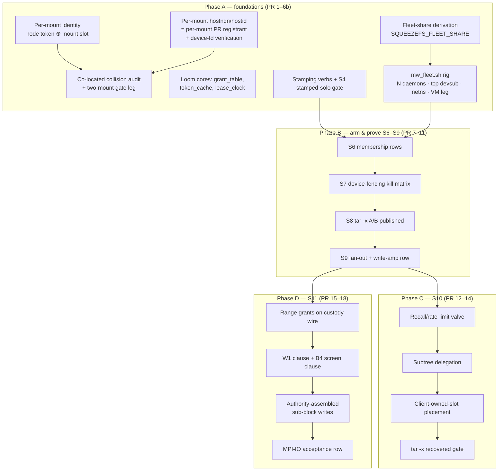
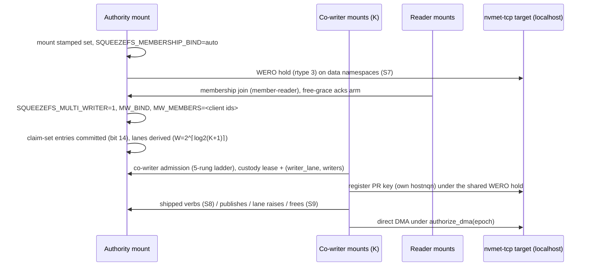

# Design: FULL MULTI-WRITER — arm S6–S9, build S10–S11, single-node client fleets

| | |
|---|---|
| **Title** | The FULL MULTI-WRITER program: arming the built planes, subtree delegation (S10), byte-range custody (S11), and same-machine multi-mount client fleets |
| **Author** | (design agent; adjudication owner: user) |
| **Date** | 2026-08-15 |
| **Status** | **Consensus (4 review rounds, 28 issues, 0 open)** — 2026-08-15; **PROGRAM CLOSED 2026-08-18** — all 19 rungs + the fix campaigns landed (per-rung SHAs in the PR-plan table; closing record `.benchmarks/2026-08-18-mw-program-closing.md`; the rung-20 residual board is §Program closing below) |
| **Repo state audited** | branch `dev`, tip `1814be0f` (B4 wire-wall record) |
| **Binding inputs** | AGENTS.md (one source of truth); `docs/pre-rc-engineering-spec.md` §6 (esp. §6.2, §6.5, §6.7, §6.8, §6.9 S0–S11, §6.10–6.12); `docs/design-mw-data-alloc-partition.md`; `docs/design-mw-cursors-and-incarnation.md`; `docs/design-mw-layout-versions.md`; `docs/design-dynamic-meta-routing.md`; `docs/design-overlay-overwrite.md` (B4, OW crash-window precedent) |
| **User charter (verbatim)** | (1) "we need MPI-IO shape i.e S11 everything up to it as well FULL MULTI WRITER SUPPORT"; (2) "I'd also like to be able to mount the same filesystem multiple times on the same 'machine' and each mount be a 'client' so to speak so we can test from a single node."; (3) "we should avoid AWS at all costs until we absolutely need it" |

---

## 1. Overview

Every durable-format prerequisite for multi-writer SqueezeFS is **already in the tree** and every distributed plane through S9 is **built but dark** (ruling D9: build the bit, never stamp it; every arm knob defaults off). What remains is not construction of S6–S9 — it is (a) the **stamping adjudication** D9 deferred, (b) an **arm-and-prove campaign** run at crucible discipline, (c) two genuinely unbuilt stages — **S10 subtree delegation + client-owned-slot placement** (the R1 serial-latency recovery) and **S11's distributed half** (byte-range custody over the wire; the *process-local* range arbitration already landed in `src/dlm.rs`), and (d) a product surface the whole proving program stands on: **same-machine multi-mount clients**, where each mount is an independent client identity with its own node token, its own NVMe-oF host NQN (hence its own PR registrant), and zero cross-mount resource collisions.

The proving matrix is **single-node by design** (charter 3). Because hostnqn is a per-*connection* NVMe-oF property, N daemons on one box over `nvmet-tcp` on localhost each present a distinct registrant to a real kernel target — so even the device-enforced tier (WERO rejection of a fenced host's DMA, dead-epoch quarantine, kill-9 preemption) is provable without a second machine. §12 states exactly what residue genuinely needs more than one kernel (answer: almost nothing that a local VM does not cover) so the user can judge if AWS is ever needed.

## 2. Background & Motivation

### 2.1 Why now

The 2026-07/08 record built the multi-writer substrate bottom-up under D9: format assumptions were dismantled one by one, each behind an incompat bit nothing stamps, each with contracts but **no live engagement**. The program has reached the point spec §6.9 calls S9 with every stage's machinery merged and every stage's *proof* deferred. Meanwhile the product statement (AGENTS.md "15,000+ Concurrent Nodes", spec §6.12) still describes a capability the shipped default posture does not deliver. The user charter closes the gap: arm what is built, build S10/S11, and prove all of it from one machine.

### 2.2 Verified current-state audit (2026-08-15, against tip `1814be0f`)

The prompt's own current-state summary is **stale in the direction of pessimism**. The tree audit:

**§6.2's ten format assumptions + the node-cache item — status with anchors:**

| # | Item | Status | Anchors (verified) |
|---|---|---|---|
| 1 | Durable block refcounts + free list | **BUILT** (bit 9), oracle-verified, C8 ungated | `src/meta_backend/kv/block_refs.rs`; `tests/durable_block_refs_tests.rs`; `docs/design-durable-block-refcounts.md` |
| 2 | Per-writer journal rings + replay merge | **BUILT** (bit 8 `KV_PARTITIONED_APPEND`) | `kv/journal.rs:188` `AppendPartition`, `:262` `partition_ring_base`, `:1273` `merge_replay_windows`; `tests/kv_partitioned_append_tests.rs`; `.benchmarks/2026-08-05-mw-partitioned-append.md` |
| 3 | Partitioned A/B extent bitmap | **BUILT** (rides bit 8) | `kv/alloc_ext.rs` — module doc `:87-122`, `format_partitioned`/`load_partitioned` (`:158+`), page-granular `partition_map_for`; foreign-partition extent ⇒ loud mount refusal |
| 4 | Per-writer root-ledger slot ranges | **BUILT** (rides bit 8) | `kv/checkpoint.rs:378` `ledger_slot_for(seq, part)`, `:348` `append_partition` on the record, pre-partition records classified |
| 5 | Per-writer ino lanes | **BUILT** (bit 12 `KV_INO_LANES`) | `kv/ino_lane.rs`; `superblock.rs:349+`; `tests/mw_ino_lane_tests.rs`; `docs/design-mw-cursors-and-incarnation.md` |
| 6 | `offset ‖ incarnation` block keys | **BUILT** (bit 13, requires bit 7) | `superblock.rs` bit-13 block; `src/incarnation_core.rs` (loom-modeled); wire form `offset@<base36>`, `incarnation == 0` = legacy byte-identical; `tests/mw_block_key_incarnation_tests.rs` |
| 7 | Claim-set record | **BUILT** (bit 14 `KV_CLAIM_SET`) | `src/membership.rs` `ClaimSet::{store,from_writer_claim}` (singleton projection on un-stamped volumes); registrant keys join the shared `WeroHold` |
| 8 | Writer-scoped staging keys | **BUILT** (bit 10, one contract with item 10) | `src/writer_scope.rs` (items 8 **and** 10 as "two halves of ONE contract") |
| 9 | Durable per-ino layout versions | **BUILT** (bit 15 `KV_LAYOUT_VERSIONS`) | `docs/design-mw-layout-versions.md` (Status: landed 2026-08-03); `src/layout_wire.rs:217` `LayoutVersionGate`; `src/routing.rs:6088` `mint_layout_version` |
| 10 | Node-identity staging stamp | **BUILT** (bit 10; node token = machine-id ladder) | `src/writer_scope.rs:141-235` `resolve_node_identity`, `SQUEEZEFS_NODE_ID_FILE` seam — **host-scoped, which §5.2 must fix for co-located mounts** |
| — | Node-cache partitioning/revalidation | **BUILT** for the two shipped consumers | reader revalidation `kv/revalidate.rs` (root-ledger poll + drop pass, `meta_kv_revalidate_*`); appender partition enforced at the node layer — `node_cache.rs:82` `CachedNode::apply_locked` refuses non-authority structural mutations (`meta_kv_node_partition_refusals`, must-stay-0) |

**Stage machinery:** S0–S5 shipped and on. S6 (`src/membership*.rs`, `LeaseClocks` with `T_self = T_owner − 2·skew_max − D_purge` at `membership.rs:628-680`), S7 (`src/data_custody.rs`, `authorize_dma` single authorization point, WERO + dead-epoch quarantine), S8 (`src/meta_ship/` — router, owners, tokens, service, wire, publish; `dlm_token_cache_*` live), S9 (`src/cowriter.rs` five-rung admission, `src/data_grant.rs` grant table + `GrantAudit`, `src/multi_writer.rs`, `src/data_alloc_lane.rs` + `src/alloc_lane_grant.rs`, shipped frees `PublishCall::FreeBlocks` schema 3, shipped lane raises schema 2), §6.8-item-3 grace (`src/free_grace.rs`) — **all built, all dark** (`SQUEEZEFS_MEMBERSHIP_BIND=off`, `SQUEEZEFS_MULTI_WRITER=off` in `src/env_knobs.rs:265-275`).

**S11's single-node half is ALREADY BUILT** — this was not in the prompt's summary: `src/dlm.rs` carries `FileCustody` (whole-file slots + sorted interval list of range grants, stab-window conflict probe O(log n + c), end-exclusive spans, modes with **CW shipped disabled**), `span_range_shared` as the production consumer, and the W1 seventh clause counter `patch_ineligible_range_shared` wired into the decision ledger (`block_allocator.rs:1520`, `fuse_client.rs:5592`, rendered `:9255`; suite `tests/dlm_range_custody_tests.rs`). What S11 still owes is the **distributed** half: range grants on the S9 custody-lease wire, the client-side range token cache, and the block-grain DMA composition (§9.3).

**S10 is NOT built.** `meta_ship/router.rs:29` names subtree delegation as "the recovery" in a comment; `tokens.rs:16` cites the Ceph/NFSv4/GPFS caching lineage. No delegation grant, no recall lane, no client-owned-slot placement exists.

**Loom obligations (spec §6.9):** `grant_table_core`, `token_cache_core`, `lease_clock_core` **do not exist** (verified: zero grep hits; `loom-models/src/lib.rs` includes 26 cores — the `lease_core` there is the *fuse3 transport* lease, not the DLM lease clock). `incarnation_core`, `lane_core`, `slot_cursor_core`, `epoch_core`, `alloc_ext_core`, `journal_core`, `slot_gate_core` are modeled. S11 adds a fourth obligation: `range_custody_core`.

**Identity audit (charter 2):** node identity is minted **per host** (`resolve_node_identity`: `SQUEEZEFS_NODE_ID_FILE` → `/etc/machine-id` → `/var/lib/dbus/machine-id` → `/etc/squeezefs/node-id`); NVMe host identity is **per host** (`nvmeof/initiator.rs:53` `get_host_nqn` reads `/etc/nvme/hostnqn`; `reservation.rs:631-639` same) — but the connect string already carries `hostnqn=`/`hostid=` per connection (`initiator.rs:229`), so per-mount identity is a plumbing change, not a protocol change. The D0 flock is already rescoped: a co-writer takes **no** Layer-A flock (`backend.rs:1258`: "two co-writer mounts on one host are legitimate"; `cowriter.rs:68` "What a co-writer takes on flock — nothing"). Staging directories are already per-mount-point isolated (`main.rs:4669-4700`: `<dir>/<fs_name>/<sanitized_mount>` + the `cache_segment` symlink).

### 2.3 Pain points this design removes

1. **D9's deferred adjudication**: nine built-never-stamped bits (7, 8, 9, 10, 11, 12, 13, 14, 15) with no stamping plan, no upgrade verb ordering, and no evidence gate per stamp.
2. **No proving venue**: every mw suite proves its plane in-process; no rig runs N real daemons against one real PR-capable target and kills them.
3. **R1 unpaid**: function-shipped metadata's serial-latency tax (spec: 250 µs RTT turns 9,090 creates/s into 2,778/s) has neither its published A/B nor its S10 recovery.
4. **Shared-file writes serialize**: two writers of disjoint ranges of one file conflict at whole-file custody — the MPI-IO shape is unreachable.
5. **Same-machine fleets collide**: two mounts share node token and hostnqn, so writer-scoped staging cannot classify their records apart and the device sees one registrant for both.

## 3. Goals & Non-Goals

### Goals

1. **Stamping adjudication executed** (KD-MW-1): one fresh-format flag, one offline upgrade verb, per-bit evidence gates, crash-resumable, with the S4 within-noise gate re-run on **stamped-solo** mounts.
2. **S6–S9 armed and proven single-node**: membership, device fencing, function shipping, co-writer data plane — each stage's spec gate executed on the tcp devsub / field box, kill-9 and fencing matrices at crucible discipline, fsck oracle (C1–C10 + `SQUEEZEFS_BLOCK_REFS_VERIFY=1`) green after every kill.
3. **Same-machine multi-mount clients as a product surface**: per-mount node identity, per-mount hostnqn/hostid, collision-free co-located mounts (IPC hosts, staging, stats, supervisor), `squeezefs clients` shows each mount, guarantee-class table split by identity sharing.
4. **S10 built**: subtree delegation + client-owned-slot placement; `tar -x` on a co-writer recovered to the S0 baseline (or the honest product statement published if it cannot be).
5. **S11 completed**: distributed byte-range custody (4 modes + capability bits, required-vs-desired), W1 seventh clause live, B4 overlay composition adjudicated, MPI-IO-shaped acceptance row.
6. **Loom debt paid**: `grant_table_core`, `token_cache_core`, `lease_clock_core`, `range_custody_core` — extracted, `#[path]`-included, weakening-verified.
7. **Performance non-negotiables held**: solo mounts (stamped or not) indistinguishable — `dlm_rpcs == 0`, mdstorm/rand-4k/scoreboard within noise after **every** rung; the B4 41.6 GiB/s single-writer row untouched; range custody structurally absent from the whole-file fast path.

### Non-Goals

- **15,000 *physical* nodes measured-real.** Fleet rows are measured-simulated (real kernels, real nvme-tcp queues, one memory bus); 15 k claims stay arithmetic-on-measured-constants, labeled per `docs/rc-manifest.md`. (D1: 15 k nodes rarely share files — the design serves that shape.)
- **Cross-node writable shared `mmap`** (spec R9): refused + guarantee-table row, not built.
- **Cross-owner rename/link** (S3.5 gap): stays EXDEV-refused (`meta_ship` `cross_owner_refusals`); the cross-volume transaction machinery is out of scope.
- **A consensus service.** PR remains the arbiter (spec §6.7 "On external consensus"); the `OwnershipArbiter` trait stays a seam, PR the only shipped impl.
- **CW mode issuance.** CW stays built-but-disabled until a verb issues it (no-dead-code; the test seam remains the only reach).
- **Erasure/replication of data blocks.** Custody moves; bytes do not gain redundancy here.

## 4. Proposed Design — overview map



---

## 5. Same-machine multi-mount clients (charter 2) — the product surface everything else stands on

### 5.1 The identity model: the CLIENT is the MOUNT

Today four identity planes disagree about what a "client" is:

| Plane | Today's scope | Anchor |
|---|---|---|
| Writer-scope staging token | **host** (machine-id ladder) | `writer_scope.rs:141` |
| NVMe PR registrant (hostnqn/hostid) | **host** (`/etc/nvme/*`) | `initiator.rs:53`, `reservation.rs:631` |
| D0 `WriterClaim.id` | **mount** (fresh uuid per mount) | `kv/backend.rs` |
| Membership member / co-writer roster id (`node_{16 hex}`) | **host** (derived from node token) | `cowriter.rs:230-235` |

The design unifies on: **a client identity is `(node_token, mount_slot)`** — rendered `node_{16hex}.m{8hex}`:

- `node_token`: unchanged ladder (`resolve_node_identity`).
- `mount_slot`: `xxh3_64(canonicalized mount point)` truncated to 32 bits — **mount-point-stable** (a restart of the same mount point is the *same* client; this is load-bearing: `writer_scope.rs:86-100` documents why a per-*process* identity inverts staged-crash recovery into data loss — the successor must classify its predecessor's residue as OWN), **distinct across co-located mounts**, and already the derivation the staging isolation uses (`main.rs:4671` sanitized mount path). Operator override: `-o client_slot=<hex8>` for mount-point-migration cases (registered knob, ENG-10).

**What changes where:**

1. **Writer-scope token** (`writer_scope.rs`): scope becomes the pair. Solo volumes (bit 10 unstamped): byte-identical, nothing reads the scope. Stamped volumes: records/roots minted by co-located mounts classify apart; a successor of the *same mount point* still adopts its predecessor's residue (contracts extended in the existing `tests/writer_scoped_staging_tests.rs`, red-first: two co-located scopes, cross-classification must refuse).
2. **Roster ids** (`SQUEEZEFS_MW_MEMBERS`, claim-set entries, membership member ids): carry the pair. A refused co-writer's mount log prints its full id (existing behavior extended).
3. **`squeezefs clients`**: renders the pair, plus posture (`writer`/`reader`/`co-writer`), hostnqn, and lease freshness — the S6 census (`membership_census_serves`) already carries kinds `member-reader`/`member-writer`; add `member-co-writer`. It also renders **residue-holding dead client slots** (see the moved-mount-point law below), so an operator can *list* the slot value a `-o client_slot=` remedy needs.

**The moved-mount-point law (never strand acked custody silently).** Mount-point-stable identity has a converse hazard the host-scoped token did not: on a bit-10-stamped volume, remounting the SAME volume set at a DIFFERENT path makes the successor a different client, so the predecessor's staged residue — which can include **acked write custody awaiting writeback** — would classify FOREIGN. The never-lossy law forbids that being silent. Three mechanisms:

- **(a) Mount-time foreign-slot residue detection.** Staging roots are enumerable on the node (`<dir>/<fs_name>/<slot-dir>` under the format-declared cache paths). A write mount scans sibling slot dirs for the SAME volume-set generation and same `node_token` but a foreign `mount_slot`; any found with live staged/extent records is reported **LOUD** at mount (the refused-co-writer print precedent), naming the residue slot and the exact remedy string: `remount at the original path, or mount with -o client_slot=<hex8> to adopt`. The mount proceeds (the residue is not this client's to touch), but the report repeats on every mount until the residue is adopted or discarded.
- **(b) An explicit adopt-or-discard verb**: `squeezefs staging adopt|discard --slot <hex8> <sqmeta-uri>` — adopt re-binds the residue slot to the invoking identity (the KD-8 two-phase rebind machinery reused, D0-guarded); discard runs the existing stale-token orphan-discard ladder with the freed keys enumerated. fsck gains a report-only arm listing orphaned slots (no auto-repair — adoption is an operator identity decision).
- **(c) Crash window MW-1b** (§10) covers the moved-mount-point successor shape with a red-first repro.

### 5.2 Per-mount hostnqn/hostid — the device-enforced tier on one box

hostnqn is per-**connection**, not per-machine: `nvme connect ... hostnqn=X,hostid=Y` (already exactly what `fabrics_connect_string` emits, `initiator.rs:229`). New registered knobs + mount options:

| Knob / option | Effect |
|---|---|
| `SQUEEZEFS_HOSTNQN` / `-o hostnqn=` | Host NQN for every NVMe-oF connection this daemon makes; default = `/etc/nvme/hostnqn` (today's behavior verbatim) |
| `SQUEEZEFS_HOSTID` / `-o hostid=` | Paired hostid; refusal if exactly one of the pair is overridden (a mismatched pair is how registrants alias) |
| derived default under `--fleet` (rig only) | `nqn.2014-08.org.nvmexpress:uuid:{node_token}-{mount_slot}` — deterministic per client id |

Plumbing: `get_host_nqn()`/`get_host_id()` gain the override arm (explicit-wins-verbatim precedence, ENG-10); `reservation.rs` `HostIdentity` resolution reads the same source (`set_identity` at `:942` is already the seam).

**The identity↔device-fd binding — the guarantee row must be structurally true, not configuration-hopeful.** Setting `-o hostnqn=` is meaningless if the mount's I/O then rides a `/dev/nvmeXnY` that some *other* connection (the host's, or a sibling mount's) established under a different identity. Two rules make the binding structural:

1. **Per-mount hostnqn REQUIRES daemon-owned connections — and the connect coordinates come from a durable, admin-declared record, never a mount flag.** Today mounts never connect: `connect_target` is reachable only from the `nvmeof` CLI verb (`main.rs:3407` is its sole caller outside `src/nvmeof/`), and no config plane carries fabric coordinates per volume. This design adds one: **`fabric_endpoint:` records** — one per **data** volume, `(vol_tag → traddr, trsvcid, subnqn)`, versioned + checksummed on ino 1 (the KD-2 plane beside `DataVolumeRecord`; `vol_tag` per KD-5, VAL-2-allowlist-invisible) — written by the admin verb **`squeezefs config set-fabric-endpoints <sqmeta-uri> <vol-id>=<traddr>:<trsvcid>:<subnqn> ...`** (+ `get-fabric-endpoints`), the exact `set-cache-paths` pattern including its format-grade live-client refusal. **Mount reads the records and can never override them** (the cache-path-policy precedent verbatim: a hypothetical mount-line coordinate flag is rejected loud naming the verb) — which is what keeps the guarantee row *structural*: the coordinates are declared once by an administrator, not conjured per mount. With explicit identity set, the daemon issues its **own** fabrics connect per data volume from the record (the existing `fabrics_connect_string` path) and resolves each namespace by the durable `vol-{hex}` identity / `(subnqn, nsid)` **under its own controller** — never by an operator-shared `/dev` path. Two co-located mounts of one volume set thus hold two controllers and two distinct `/dev/nvmeYnZ` nodes for the SAME namespace, each mount opening only nodes belonging to its controller.

   **The bootstrap exemption (the META plane).** The records live on ino 1 of the meta plane, so a fabric-backed META volume's coordinates structurally cannot come from a record stored behind the very connect they would describe. The exemption is exactly the plane split: **the META volumes named by the `sqmeta-uri` are operator-established connections** (the operator connects them — with the mount's configured identity when explicit identity is set — and hands the mount its meta device paths), and **rule 2's sysfs verification is their structural gate**: under explicit identity, a meta controller whose actual identity mismatches the configured pair refuses loud, so the guarantee row cannot lie on the bootstrap plane either. `fabric_endpoint:` records then govern **the DATA plane** — every data volume of the set — which is where the co-writer DMA custody the guarantee row protects actually lives.

   **The refusal ladder, decidable at every shape** (explicit identity set): (i) a shared/foreign-identity device path (meta or data) ⇒ refuse loud naming the rule — rule 2's verification; (ii) a data volume with **no `fabric_endpoint:` record** ⇒ refuse loud naming the verb — **uniformly, including the edge shape where the operator pre-connected a DEDICATED data controller whose actual identity matches the configured pair**: explicit identity means daemon-owned data-plane connects, full stop — one rule keeps the ladder decidable, and admitting the matching-pre-connect shape would make "was this controller really dedicated?" a per-mount judgment the guarantee row cannot rest on (the operator's remedy is one `set-fabric-endpoints` invocation, or dropping the explicit-identity knobs); (iii) the META volumes ⇒ the bootstrap exemption above, rule-2-verified. Rule 1 inapplicable is never silently degraded — the knob is never inert. **The supported alternative without explicit identity**: an operator may pre-connect per-mount controllers themselves (distinct hostnqn per `nvme connect`) and hand each mount its own paths — then rule 2's sysfs verification is the structural gate feeding `pr_registrant_shared` from actual identities, and the guarantee row still cannot lie. The fleet rig uses the admin verb (product path) for the data plane and operator-established meta connects (the bootstrap shape, exercised as the product will run it).
2. **Mount-time identity verification, always.** For every data/meta backing-device fd, the mount reads the controller's **actual** identity from sysfs (`/sys/class/nvme/<ctrl>/hostnqn` + `hostid`, resolved from the fd's device) and compares: (a) explicit identity configured + mismatch ⇒ **refuse loud** (rule 1's enforcement point); (b) no explicit identity ⇒ the *actual* controller identity is what feeds the guarantee-class row and `pr_registrant_shared` — the gauge compares **actual controller identities across co-located mounts of one set** (discoverable via the claim-set roster), never the configured strings, so a shared-connection degradation can never hide behind a configured-but-inert knob. Non-NVMe backing devices (dev boxes, files) render the row `process-local` honestly, as today.

**Consequence:** each co-located mount is its own PR registrant under the shared `WeroHold`, so WERO rejection, registrant preemption, and the S7 dead-epoch ladder are **device-enforced between two processes on one machine** — the whole reason charter 2 makes charter 3 achievable. PR 2 carries both rules and their red-first refusal tests; the fleet rig deliberately does NOT pre-connect devices for co-writers, so the rig exercises the product resolution path rather than masking it.

### 5.3 Co-located collision audit

| Resource | Today | Verdict / action |
|---|---|---|
| D0 Layer-A flock | per meta-volume file; authority holds `LOCK_EX`, co-writers take nothing (`backend.rs:1258`) | **OK by construction** — one authority per volume set per host; N co-located co-writers legal |
| Staging dirs | per-mount isolated (`<dir>/<fs>/<mount>`) | **OK**; add the pinned test (two mounts, disjoint `isolated_staging_dirs`, shared `cache_segment` read ring documented as shared-by-design) |
| Staging generation stamp | volume-set uuids (+ node token under bit 10) | **extend with `mount_slot`** (§5.1) — otherwise co-located co-writers on a stamped volume adopt each other's roots |
| IPC session host socket | abstract AF_UNIX name `sqz-il0-{pid}-{rand:08x}` (`fuse_client.rs:24105`) — **per-process unique by construction, no collision** | The real gap is **shim discovery**: how a shim client finds the right socket for the mount its fd lives on when two interception mounts coexist. **PR 3 AUDIT VERDICT: already keyed by mount path by construction** — the bootstrap xattr is answered by the fd's OWN mount (`fgetxattr` in `interpose.rs::classify_and_bind`), the blob names that daemon's unique socket, the shim registry keys sessions by `st_dev`, and the §5.2 rule-3 fd screen refuses foreign-mount fds at HELLO and BIND. Pinned: `tests/ipc_host_tests.rs::two_colocated_hosts_discover_by_mount_and_never_cross` (unit) + the two-mount `run_preload_gate.sh` leg 2m (live acceptance: one shim process, both mounts, per-mount engagement + never-cross) |
| `/dev/shm` / memfd arenas | sealed memfds (anonymous, fd-passed) | **OK** (no named shm since VL3 deleted the runtime-config file); pin with the same two-mount leg |
| Stats/.config inodes | per mount by construction | OK |
| Supervisor (`--daemon --supervise`) pidfiles/log paths | per-mount paths | **PR 3 AUDIT VERDICT: clean** — no pidfiles or fixed paths exist (the daemon PID comes from the supervisor's own fork, the sysfs conn id from the mount's own `st_dev` minor, `--log-file` is operator-chosen per mount); `open_log_file` already 0600+O_NOFOLLOW. The one shared artifact was the probe thread's comm, fixed by the row below (the supervise parent derives the same slot, `-o client_slot` included) |
| `sqz-ipc-thp` / worker thread names | comm strings collide across daemons | cosmetic; **DONE (PR 3)** — every per-mount named thread routes through `comm_core::comm_name` (canonical `crates/squeezefs-ipc/src/comm_core.rs`, `#[path]`-shared into fuse3; seeded from `writer_scope::set_mount_identity`, every crate copy): suffix `m{low hex nibble of mount_slot}` inside the 15-char comm budget, base-truncating, never suffix-truncating; slot 0 keeps bare names. Budget pinned over the tree's base literals in `tests/mount_comm_tests.rs` |
| **Derived resource caps** | **every derivation reads the WHOLE machine** — R5 memory budget, transport payload arenas (`mem_budget/8` per queue set), drain-lane ceilings `clamp(3×cpus/8, 2, 64)`, conveyor batches, blocking pools | **THE biggest co-location collision: N daemons oversubscribe every derived cap N×.** Closed by the fleet-share derivation term, §5.6 (its own PR rung, 3b) — "per-daemon by construction" is only correct at N = 1. **Exception: kernel-mandated geometry is NOT divisible** — the FUSE-over-uring queue COUNT is one queue per kernel possible CPU per mount (`fuse_over_uring.rs:2399/:2425` — fewer never becomes ready), so N daemons always hold N × possible-CPUs queues; what fleet-share DOES shrink there is queue depth + payload arenas through the divided memory root (§5.6's exemption class) |
| Env knobs | process-scoped | OK as a *mechanism* (per-daemon environments); the *values* problem is the fleet-share row above |

### 5.4 Guarantee-class split (operations.md table)

| Pair of mounts | Write-exclusion / fencing class |
|---|---|
| Distinct hosts, PR substrate | device-enforced (WERO rejects fenced DMA) — unchanged |
| **Co-located, distinct hostnqn (this design)** | **device-enforced** — same row as distinct hosts; kill-9 of one daemon leaves the other's registrant standing; preemption is real |
| Co-located, shared hostnqn (operator did not split) | device sees ONE registrant: fencing between the two mounts is **process-local** (flock + custody epochs + `authorize_dma` latch). Loud mount warning when a second mount joins a set with an identical hostnqn+hostid pair |
| Any pair, non-PR substrate | multi-writer **refuses to arm** (unchanged S9 law) |

### 5.5 The fleet harness — `tests/mw_fleet.sh` (PR 6)

One rig, product verbs only (the `nvmeof_target_substrate.sh` discipline):

```
mw_fleet.sh create  N [--transport tcp] [--netns] [--netem "delay 200us"] \
                    [--cowriters K] [--readers R] [--vm V]
mw_fleet.sh kill    <client-id|random> [--sig 9]
mw_fleet.sh pause   <client-id>            # VM members: qemu 'stop' = hung kernel
mw_fleet.sh partition <client-id> [--heal-after S]
mw_fleet.sh status | teardown
```

- Builds the tcp devsub (`SQZ_DEVSUB_TRANSPORT=tcp`, port slice 54100–54199), formats once, mounts: 1 authority + K co-writers + R readers, each with `--node-id-file` (per-client seam file), per-mount hostnqn (§5.2 — the rig does **not** pre-connect devices for co-writers, so the product's per-mount connect/resolution path is exercised, not masked), disjoint mount points, per-daemon log/stats capture, and `SQUEEZEFS_FLEET_SHARE=N` exported per daemon (§5.6).
- `--netns` places each daemon in its own network namespace with veth to the target's namespace; `--netem` injects RTT/loss on the veth — the R1 latency venue and the partition venue on one box.
- `--vm V` (PR 6b) adds V qemu/KVM guest members joining the fleet over the host's nvmet-tcp port — each an **independent kernel and independent clock domain**. `pause` on a VM member is the hung-kernel shape kill-9 cannot produce (the guest's TCP stack freezes mid-conversation instead of closing). §12 names the two rows that must run on this leg.
- Every verb snapshots the per-mount stats inodes; the rig's row emitter carries the engagement columns (a row without its `dlm_*`/`meta_ship_*`/`membership_*` deltas is INVALID), and every N > 1 row carries the **R5-pressure columns** (`mem_budget_red_events` bounded and attributed, `hard_backstops == 0`, `parked_gate_timeouts == 0`) so fleet oversubscription can never be a row's silent story.
- Fleet width on the field box: 32 CPUs ⇒ default N = 8 (1 authority + 5 co-writers + 2 readers); `N=32` for the census/fan-out rows. Honest label: **measured-simulated** (real kernels/queues, shared memory bus and clock).

### 5.6 Fleet-share resource derivation (the N-daemons-one-machine sizing law)

The house sizing law derives every cap from system resources — and every derivation in the tree reads the **whole machine**: the R5 memory budget, transport payload-arena caps, per-mount FUSE-over-uring queue counts (kernel possible CPUs), drain-lane ceilings, conveyor batch caps, reclaim lanes, blocking pools. That is only correct at one daemon per host; N co-located daemons independently derive N× the machine. Consistent with derived-not-hardcoded (ENG-10) and the existing `absolute > percentage > derived` precedence:

- **`SQUEEZEFS_FLEET_SHARE`** (int ≥ 1, default **1** = today's whole-machine posture, registered): a divisor applied **once, at the root inputs of the derivation tree** — the effective memory budget and effective CPU count become `ceil(system / fleet_share)` — so every downstream derived value scales through the existing formulas untouched. It modifies the **derived tier only**: explicit absolute knobs still win verbatim, percentages apply to the shared budget.
- **Floors are never divided.** Physical minima and never-regress-below-shipped floors (the `Q_DEPTH_FLOOR` law) hold per daemon regardless of share — a share that cannot satisfy its floors refuses loud at startup (naming the arithmetic), never silently clamps below a floor. Rounding: the share itself rounds UP (`ceil`) per the rounding doctrine — mild oversubscription of divisible resources is acceptable; silent starvation below a floor is not.
- **Not auto-detected, by decision.** Daemons discovering each other to divide a machine is a coordination plane; a registered knob the operator (or the rig — `mw_fleet.sh` exports it automatically) sets is strictly simpler and composes with cgroup-limited deployments, where the operator already knows the share. Auto-derivation from cgroup limits is a possible later refinement (noted, not designed).
- **The kernel-mandated-geometry exemption class.** Fleet-share divides *derived sizing choices*; it cannot divide geometry the KERNEL mandates. The one member today: the **FUSE-over-uring queue COUNT** — `fuse_uring_create()` allocates one queue per possible CPU and a session with fewer never becomes ready (`crates/fuse3/src/raw/connection/fuse_over_uring.rs:2399`, `:2425`, module doc `:31-32`), so N co-located daemons always hold N × possible-CPUs queues regardless of share. The *memory* behind those queues DOES scale: per-queue depth degrades to fit the divided payload-buffer cap (the existing `SQUEEZEFS_FUSE_OVER_IO_URING_Q_DEPTH` degradation law, `mem_budget/8`), so the arenas shrink through the memory root even though the count cannot. The exemption list is pinned by a tie test asserting it stays exactly the kernel-mandated set — a derived cap drifting INTO the exemption list is a red test, not a judgment call.
- **Tie test**: `tests/derivation_sweep_tests.rs` gains the fleet-share rows (drift-is-red, house law) — scoped to the **derived tier minus the exemption class** (share=4 quarters every divisible derived cap; the exemption-list pin is its own row); the N=32 rig rows carry the §5.5 R5-pressure acceptance columns as the live proof.

---

## 6. The stamping adjudication (D9 resolved) — KD-MW-1

### 6.1 The bit set and its internal dependencies

Bits 7 (durable term), 8 (partitioned append: journal rings + extent-bitmap pages + ledger slots), 9 (block refcounts), 10 (writer-scoped staging), 11 (mw data plane), 12 (ino lanes), 13 (incarnation keys — **requires 7**), 14 (claim set), 15 (layout versions). Per-bit `set_*_bit` verbs exist (`superblock.rs:1332+`).

### 6.2 The decision: stamp as ONE act, never piecemeal

The bit-9 lesson is the governing precedent: *a partially-populated ledger is the dangerous state* — half-engaged multi-writer formats multiply that class by nine. Therefore:

1. **Fresh volumes**: multi-writer-capable is the END-STATE DEFAULT (user ruling 2026-08-15, verbatim: "when multi-writer is supported we shouldn't need '--multi-writer' that should just be the default if anything '--single-writer' would be preferred in some instances (maybe fixing the filesystem or recovery efforts)"). Two phases, the house build-dark-prove-flip pattern:
   * **Phase A (rung 5, dark)**: `squeezefs format --multi-writer` stamps all nine in `SuperblockV3::plan` (one plan, one superblock write — no ordering problem); default format stays today's (no bit) while the arm-and-prove campaign runs.
   * **Phase B (the default flip — its own rung, gated on the §6.3 evidence table + the rung-10 S9 acceptance)**: `format` stamps the nine bits BY DEFAULT; **`--single-writer`** becomes the explicit opt-out that formats today's unstamped class; `--multi-writer` survives as the announced-inert forward spelling. The flip is one act across CLI + drift pins + docs (the B4 default-flip discipline). Note the recovery/fsck use case the ruling names does NOT require an unstamped format: a stamped volume mounts solo verbatim (the stamped-solo S4 gate's posture — solo is W=1 on a stamped format, and every repair/fsck verb runs under the D0-guarded open regardless of stamps); `--single-writer` exists for operators who want the old format CLASS itself (e.g., a recovery scratch volume readable by pre-mw binaries — the incompat-bit compatibility boundary is the one real difference).
2. **Existing volumes**: `squeezefs volume enable-multi-writer <sqmeta-uri>` — **offline** (D0-guarded open, the `add-meta` posture, stated loudly), all volumes of the set in one invocation, per-volume bit order `7 → 9 → 15 → 12 → 13 → 8 → 10 → 14 → 11` (dependencies first; 13 after 7 by its own refusal law; **bit 11 deliberately terminal** — see the predicate below), each `set_*_bit` barriered (existing semantics). **Crash-resumable**: re-running is idempotent (each verb is a no-op on a set bit). Crash windows: MW-S1/S1b/S2/S3 in §10.

   **The refusal predicate, precisely.** Three partially-stamped shapes exist and must be separated:

   | Shape | State | Verdict |
   |---|---|---|
   | (a) cross-volume mixed | some volumes of the set upgraded, others not | refuse writable, name the lagging volume |
   | (b) crash mid one volume's nine-bit sequence | one volume carries a proper prefix of the order | refuse writable, name the volume + resume remedy |
   | (c) legitimately partial populations | standalone bit 7 (`set_durable_term_bit` is a documented upgrade path), bit 15 Phase-8 stamps, bit-5 runtime stamps, etc. — non-uniform bit populations occur in the field | **must NOT trigger** — grandfathered |

   Two mechanisms, both required: **(i) a durable upgrade-intent marker** — the verb's FIRST act writes one `mw_upgrade:` record on ino 1 of volume 0 (the KD-2 plane: whole-tx atomic, torn-immune, offline probe-readable, VAL-2-allowlist-invisible) naming the target bit set and volume list, and its LAST act (after every volume's terminal bit) deletes it; a writable mount refuses while the marker exists (covers shape (b) on any volume, including volume 0 itself — the marker precedes any bit write). **(ii) The bit-11 uniformity invariant** — bit 11 (`KV_MULTI_WRITER_DATA`) is stamped LAST per volume by construction, so the verb maintains *"bit 11 set ⇒ all nine set on that volume"*; the mount gate refuses writable iff the marker exists, OR bit-11 presence differs across the set (shape (a)), OR any volume carries bit 11 without the other eight (a foreign-tool/corruption tripwire, refused naming fsck). Shape (c) never trips either mechanism: subsets not including bit 11 and not under a marker are exactly today's legal field states.

   **Serialization.** The spec documents `set_incompat_bit` as an unsynchronized read-modify-write (two concurrent setters lose a bit). During the upgrade this race is **structurally unreachable**: the enable verb is the sole setter, serialized under the D0-guarded offline open, and no runtime stamper (the `layout_deltas_ready()` class) can run because the volume is not mounted. The verb asserts the guard before its first write and the design pins this with a concurrent-invocation refusal test (second invocation refuses on the guard, never interleaves).

   **Two interaction rules the predicate needs to stay closed under existing verbs:**

   - **`volume add-meta` on a bit-11-uniform set stamps the new volume to match, as part of the add.** Without this, growing an upgraded set with a freshly-formatted volume breaks the uniformity invariant and the next writable mount refuses a set the operator legitimately grew. The add's plan stamps all nine bits at format time (the `format --multi-writer` arm — one plan, one superblock write, no marker needed since a fresh volume has no prior state to sequence through); the converse also holds: `add-meta` of a bit-11 volume into a non-upgraded set refuses (the same uniformity law, read at the add). Pinned by a test in both directions.
   - **The enable verb's guarded open is the ONE marker-tolerant writable open.** The verb's resume path IS a D0-guarded writable open of volume 0 (to re-run stamps and finally delete the marker); an unconditional marker refusal would refuse its own resume. The tolerance is scoped to exactly this verb's open (flagged internally, never an operator surface), and the concurrent-invocation test extends to cover it: a second enable invocation still refuses on the D0 guard, and an ordinary writable mount still refuses on the marker.
3. **First writable mount after stamping** performs the minting acts the bits define (bit 9 ledger root, bit 8 partition adoption of pre-partition records, bit 10 root rebind via the KD-8 two-phase machinery) — all existing code paths.
4. **No downgrade verb.** Forward-only (house law). `format --force` reformats.

### 6.3 Evidence gates per stamp (what must be green before the verb is trusted)

| Gate | Evidence |
|---|---|
| Bit 9 | oracle green across the 28 layout-publishing suites with `SQUEEZEFS_TEST_STAMP_BLOCK_REFS=1` (already standing); `meta_kv_block_refs_drift == 0` on the stamped fleet soak |
| Bit 8 | `kv_partitioned_append_tests` + a **stamped-solo** full external release gate pass (pjdfstests/LTP/fstests) — partitioned-solo must be behaviorally identical |
| Bits 12/13/15/10/14/7/11 | their standing suites (`mw_ino_lane`, `mw_block_key_incarnation`, `mw_layout_version`, `writer_scope`, `dlm_membership`, `dlm_durable_term`, `dlm_multi_writer`) re-run with the stamp engaged via the format flag, not the test seams |
| **The S4 re-gate (the big one)** | **stamped-solo vs unstamped-solo A-B-B-A**: mdstorm, rand-4k, scoreboard smoke, B4 seq-write row — all within noise; `dlm_rpcs == 0`; sustained ≥60 s rows. Falsifier: any stamped-solo regression > noise blocks the stamping PR, not the arm |

---

## 7. Arm-and-prove S6–S9 (built machinery) — the crucible campaign

### 7.1 Arm sequence (per fleet, rig-driven)



Order is load-bearing and already enforced by the refusal ladder (mw refuses with membership off; co-writer refuses without all five rungs). The rig arms in this order and asserts each refusal by *deliberately* violating the order once per matrix (refusal rows are engagement rows).

### 7.2 The proving matrix (all single-node; per-stage gates from spec §6.9)

| Row | Venue | Gate | Falsifier |
|---|---|---|---|
| **S6-a** heartbeat off the journal | fleet N=32 (readers+co-writers), `SQUEEZEFS_FLEET_SHARE=32`, 10 min | `membership_renewals` grows, `meta_kv_journal_entries` per-beat delta ≈ 0; `membership_registration_commits` bounded by membership *changes*; **R5-pressure columns** (`hard_backstops == 0`, `parked_gate_timeouts == 0`, red events bounded+attributed) | journal entries growing ∝ renewals; a fleet row whose R5 columns are the silent story |
| **S6-b** self-fence clock law | netem +200 ms on one member's veth, freeze via SIGSTOP past `T_self` | member self-fences BEFORE owner re-grant (`membership_self_fences` = 1 on the victim, 0 elsewhere); no divergence in fsck oracle | owner re-grants while victim still writes |
| **S6-b′** hung-kernel + real clock domains (VM leg, PR 6b) | one qemu/KVM guest member; `mw_fleet.sh pause` past `T_self` (guest TCP freezes mid-conversation — the shape kill-9 cannot produce); resume past TTL | same self-fence law under a genuinely hung kernel; the plane tolerates the REAL (host-vs-guest) monotonic domains — large-skew injection stays on the `membership_sim.rs` seam, stated honestly | victim's frozen-then-thawed writes land after fence |
| **S7-a** device rejection (spec R2 verbatim) | co-writer SIGSTOP past custody TTL, resume, attempt DMA | **device rejects** (reservation conflict), not merely the local latch; `data_dma_epoch_refusals` accounts; PR preempt observed on target | write lands after fence |
| **S7-b** kill-9 × 10 per role (counted, restart-from-zero on any fix) | fleet, saturated write load (fio via the mounts) | dead epoch minted; quarantined offsets never reallocated pre-drain-proof (`dlm_quarantined_offsets` closure); fsck C1–C10 + C8 oracle green after EVERY kill; `fsck_findings == 0` | any oracle finding; any quarantine leak (gauge never released without proof) |
| **S8-a** the R1 row (spec: "published even if it regresses") | 1 co-writer, netem sweep {0, 50, 150, 250 µs}, serial `tar -x` (linux src) A/B vs authority-local | published table: ops/s + `meta_ship_phase_ns` rtt share + batches/verbs coalesce factor; engagement `shipped == served` | ships that don't account; missing publication |
| **S8-b** shipped-verb crucible | K=5 co-writers, mdstorm-shaped mixed verbs, 30 min saturation | `dedup_hits` under injected retries; `stale_term_refusals`/`era_relearns` split clean across an authority restart; `owner_panics == 0`; `local_commit_refusals == 0` | any un-routed local commit |
| **S9-a** fan-out write row (the "15 k-shaped" row, honestly scaled) | N=32 mounts × disjoint files, `SQUEEZEFS_FLEET_SHARE=32`, tcp devsub, sustained ≥60 s | aggregate GB/s + **write-amp columns** (device÷user bytes, `wareq-sz`, `block_free_*`) per the standing instrument; `alloc_lane_enospc_refusals == 0`; `meta_ship_publish.free_shipped_blocks` accounts displaced frees; **R5-pressure columns** per §5.5 (32 write pipelines each targeting a fleet-share BDP depth — backstops firing = the row is measuring memory thrash, not the plane); evidence tier **measured-simulated**, 15 k extrapolation **arithmetic-on-measured-constants** | invalid row (missing engagement/amp/R5 columns) |
| **S9-b** authority failover | kill -9 authority mid-load; successor takes D0 ladder, bumps term, grace window | `dlm_grace_conflicts == 0`; co-writers re-admit under new era; in-flight frees refuse by era; oracle green | grace conflict, or a co-writer surviving on a dead lease |
| **S9-c** co-located device fencing (charter 2's proof) | 2 co-writers SAME machine, distinct hostnqn; preempt one | device-enforced row of §5.4 demonstrated on one box | rejection only via local latch |
| **Solo re-gate** after each arm rung | solo mount, stamped | `dlm_rpcs == 0`, all `dlm_custody`/`meta_ship` fields 0/off by construction; perf within noise | any solo movement |

Multi-run discipline applies verbatim (counted matrices restart from zero after any fix; every failure gets its red-first cargo repro — the repro-port mandate).

---

## 8. S10 — subtree delegation + client-owned-slot placement

### 8.1 The problem, quantified

Spec §6.5: one fabric RTT inside the create path is a 69 % serial regression. S8 makes every foreign-volume metadata verb a round trip; `tar -x`, `make`, `rsync` are serial streams. §6.10 R1 requires the A/B published either way; S10 is the recovery. Prior art the spec designates: **GPFS metanode** (per-file metadata owner, ship deltas), **Lockify** (creating node self-designates owner — "free here, because inos are monotonic and never reused"), Ceph rate-limited recall.

### 8.2 Design: two independent levers

**Lever 1 — subtree delegation (read-mostly + parent-context authority).** A delegation is a **capability-bit token over a directory subtree**, granted by the owning authority, cached in the S8 token cache (`meta_ship/tokens.rs` — the exact consumer its module doc anticipates):

- Bits: `LOOKUP | UPDATE | PERM | XATTR` per spec §6.7's mode table (`LAYOUT`/`DATA` never ride subtree tokens — data custody is S9's plane; `UPDATE` here means child-entry mutation authority as described below).
- Grant rides the metadata RPC the client was already issuing (intent-lock law: "there is no operation that needs a token but performs no metadata RPC first"). Over-issue on grant (Ceph): a `lookup` under a cold directory returns the entry **plus** a subtree LOOKUP delegation bounded by depth/entries budget.
- **What a LOOKUP delegation buys**: the co-writer serves lookups/getattrs/readdir from its reader-revalidation view **without staleness bound tightening** — the delegation is the *coherence promise* (the owner recalls before any conflicting mutation publishes), so kernel TTLs under a delegation stretch to the delegation's own TTL (the S5 machinery already plumbs per-class TTLs).
- **What UPDATE buys — the metanode/Lockify move**: a co-writer holding `UPDATE` on directory D **creates children of D without a synchronous round trip**: it mints the ino from its own lane (bit 12 — collision-free by construction), appends the dentry intent to a **delegation journal batch** shipped asynchronously (the existing `meta_ship` pipelining pair `batches`/`batched_verbs` is the vehicle; the owner remains the only appender — R4's one-appender-per-volume law intact), and answers the FUSE reply from the local intent. Visibility law: children created under an un-flushed batch are visible to *this* client immediately, to others after the owner applies the batch (close-to-open semantics preserved: `RELEASE`/`fsync` forces the batch flush and waits). Crash law: an unshipped batch dies with the client — the same acked-un-fsynced class as the data plane (MW-10 in §10); `fsync(dir)` is the contract point.
- **Recall**: owner-initiated, batched per client (one frame carrying the recall set), rate-limited (`mds_recall`-style derived cap = f(wire budget), never a constant), deadline derived from live `meta_ship_owner_phase_ns` p99 (the R3 law — never a constant), with the `transport_lease_overlong` precedent: overdue recall is a loud tripwire + eviction escalation, never a silent wait.
- **No durable state.** Delegations are RAM, reconstructed by re-assertion after owner failover inside the S8 grace window (NFSv4 pattern; the grace machinery exists — `dlm_grace_reclaims`).

**The UPDATE conflict and deferred-error law** (the three questions an implementer hits on day one, each a red-first case in `tests/mw_intent_batch_tests.rs`):

1. **UPDATE is EXCLUSIVE per directory — single-owner, recall-on-conflict.** The GPFS metanode is per-object single-owner for exactly this reason: two concurrent UPDATE holders on D could both ack `O_CREAT|O_EXCL` for one name and discover the collision at apply — a POSIX violation, not a durability class. So: one holder per directory; a second wanter's metadata RPC triggers recall of the first (batch flush + token surrender, the recall lane's deadline law), then the grant moves. **The EEXIST-decidable-locally argument**: the grant carries D's dentry version; the holder revalidates its view of D's entries to that version before its first local create decision, and exclusivity guarantees no foreign mutation of D thereafter — so a local negative lookup IS authoritative and `O_EXCL` semantics are exact. (Directories too large to revalidate within the grant budget simply don't receive UPDATE — the grant declines, creates ship as today; a declined grant is a priced fallback, never a correctness fork.)
2. **Deferred apply-refusals surface at the contract point, per the POSIX-16 precedent.** ENOSPC/EDQUOT/journal-refusal at batch apply — after a local ack — latches onto the directory handle exactly as `writeback_errors_latched` latches data-plane loss: the refusal is reported at `fsync(dir)`/`close(dir)` (and poisons subsequent ops on the child's handle with the owner's errno), the locally-minted ino is destroyed (lane inos are never reused — a burned ino is free), and `meta_ship_intent_refusals` counts it (must-stay-≈0: the VL2 capacity-preflight class makes healthy-owner refusals rare; growth is the stop-and-read signal). This is deliberately a *different disclosure* from the crash law: a refusal on a healthy owner is reported through the error channel, never silently absorbed into the acked-un-fsynced class.
3. **Foreign negative-dentry composition.** Other clients' kernels may hold negative entries for names created under an un-flushed batch. The visibility bound for intent-created children composes exactly as any owner-applied mutation: foreign visibility latency = batch-flush latency + the S5 staleness bound, and foreign kernels' `negative_timeout` TTLs (≤ the reader bound by the S5 TTL law) age out within it. The delegation adds no new incoherence class — it *widens* the existing, documented reader bound by the batch-flush term, which the flush-forcing triggers (fsync/close/recall — including the foreign-lookup/`readdir` recall-forces-flush arm, OQ-2's resolved form) keep bounded. The red-first case: client B's negative lookup of a name client A created under an un-flushed batch must go positive within the published bound after A's `fsync(dir)`.

**Lever 2 — client-owned-slot placement.** Delegation removes round trips for *existing* subtrees; placement removes them structurally for *new* work: when a co-writer's workload creates a fresh subtree, mint the subtree's inos into **slots the co-writer's colocated authority owns** — i.e., invert `mint_redirects`. Mechanism reuses bit-6/bit-2 machinery verbatim: the fleet operator (or the S10 auto-policy: N consecutive UPDATE-delegated creates in foreign slots) triggers `migrate-meta-slot` of the subtree's hot slots toward the client's nearest authority, or — in the fleet-of-authorities shape (each client is authority for ≥1 volume, the §6.10 R4 recipe) — new directories mint via `MINT_SPREAD` into self-owned slots. **This is policy over existing machinery, not new machinery**; the only new code is the placement hint plumbed through `meta_ship/router.rs`.

### 8.3 Gate

`tar -x` (linux source) on a co-writer at netem 250 µs: **back to within 10 % of the S0 authority-local baseline** with delegation+placement on; the full ladder published (S8 raw / +delegation / +placement). (Spec §6.9's S10 gate reads "`tar -x` back to the S0 baseline"; **≤1.10× is this design's proposed quantification of that wording, flagged for adjudication with the user at PR 14** — a literal 1.00× gate on a netem-taxed venue would fail on noise alone.) If the gate cannot be met, the honest product statement ships in operations.md (spec R1's own fallback: "remote clients are throughput-oriented; latency-sensitive metadata work runs on the owner") — the row is published either way. Falsifier for delegation itself: recall storm test (hot shared directory, 32 clients) must show `dlm_thrash_demotions` engaging before fan-out hurts (spec R5), and a client holding a delegation must never serve a stale child after ack'ing recall (red-first coherence test).

### 8.4 New machinery vs reuse

| Piece | Home | New/reuse |
|---|---|---|
| Delegation grant/recall verbs | `meta_ship/wire.rs` (schema bump), `tokens.rs` | new verbs, existing cache + wire |
| Delegation coverage check | `meta_ship/router.rs` (route: local / delegated / ship) | new arm in existing router |
| Create-intent batches | `meta_ship` pipelining lane | reuse (batch vehicle exists) |
| Recall rate limiter | `tokens.rs` | new, derived caps |
| Placement hint | router + `mint_redirects` inversion | policy over bit-6 machinery |

---

## 9. S11 — byte-range custody (the MPI-IO shape)

### 9.1 What exists vs what's owed

The **arbitration core is done** (§2.2): `FileCustody` in `src/dlm.rs` decides whole-file/range and range/range conflicts in one place, end-exclusive spans, per-file token mint shared with ranges, CW disabled, `span_range_shared` feeding `patch_ineligible_range_shared`. Owed: (a) range grants over the wire, (b) the client-side cached range token, (c) required-vs-desired semantics, (d) composition with block-granular DMA and the B4 overlay arm, (e) the loom core, (f) the acceptance row.

### 9.2 Distributed range custody rides the S9 custody lease (KD-MW-7)

A range grant is a **sub-grant of the S9 custody lease**, served by the file's *custody authority* (the same process as its metadata authority — spec §6.7 decision 2), stored in the authority's `FileCustody` table (unchanged), cached client-side in the S8 token cache keyed `(ino, [start,end), mode, token)`:

- **Modes**: NL/CR/CW/EX with capability bits per spec §6.7. Shipped issuance in v1: **EX ranges and EX whole-file only** (every current verb is EX; CR is the read-side reservation the reader plane may adopt later; CW stays disabled — KD-MW-9). The mode lattice is built and tested; issuance is deliberately narrow.
- **Required vs desired (GPFS)**: the client's acquire carries `required = [write.start, write.end)` and `desired = block_align_out(required ∪ predicted_stream_window)` — desired **rounds UP to 4 MiB block alignment** (rounding doctrine: allocations round up) and stretches by the same stream classifier R2 uses. The authority grants the largest desired-subset that conflicts with nothing, never less than required (or refuses/queues). Effect: a strided MPI writer converges to block-aligned custody stripes after one acquire per stripe, and subsequent writes hit the cached token — the ≥99.5 %-local law (spec §6.5 item 1) holds for the steady state.
- **Fencing**: ranges share the FILE's generator (already the `FileCustody` law) — the ~24 fencing read sites keep reading file identities; a range writer fences on its own lease token. No new token algebra.
- **Revocation/expiry**: the custody-lease machinery verbatim — pull-based (learned at renewal), `T_self` self-fence, dead-epoch quarantine of offsets written under the dead range grant. `dlm_custody_unknown_leases` covers ranges too.
- **Whole-file fast path untouched (KD-MW-12 / D1)**: a file with zero live range grants takes exactly today's whole-file path — the range table is `None` until the first range acquire (verified structure: `FileCustody.ranges: Vec` empty ⇒ conflict probe is the O(1) empty check at `dlm.rs:228`). Solo mounts: structurally unreachable (no verb issues ranges without the mw arm).
- **Bounds, coalescing, and R5 accounting** (grant state is authority-side memory a misbehaving client would otherwise tax everyone with):
  - **Coalescing at admit**: adjacent/overlapping same-holder same-mode grants merge into one span (the admit is already the O(n) memmove — the merge rides it). A byte-granular acquirer whose desired stripes are honored therefore converges to O(file_blocks) spans, not O(acquires).
  - **Derived caps, refuse-loud at cap — no free constants**: the per-file cap is the file's **own geometry** — `max(16, ceil(size / block_size))` spans (a cap below the block count would refuse legitimate stripe-per-block custody, *including the block-cyclic MPI decomposition, whose non-adjacent round-robin spans never coalesce and legitimately approach one span per block*; the floor 16 is transient pre-coalesce headroom for sub-16-block files — reason on the line). There is deliberately **no per-file span ceiling beyond geometry**: the real ceiling is the **byte budget** — the `dlm_grant_table_bytes` R5 share, enforced at admission (spans are ~48 B, so even the 1 TiB block-cyclic shape is ~262,144 spans ≈ 12 MiB, priceable against the share rather than refused by a constant); the per-client aggregate cap derives from the same share. At budget the acquire **refuses loud** (the bounded-wait/EAGAIN retry-ladder class, counted `range_custody_cap_refusals`) — **never a silent trim of `required`** (desired is always trimmable; required never is), and the refusal names the budget arithmetic per the fleet-share precedent.
  - **R5**: the spec's own counters land as specified — **`dlm_grant_table_bytes`** (authority-side: `FileCustody` wholes + ranges, ranges included — one gauge, the spec's name) and **`dlm_token_cache_bytes`** (client-side — already rendered by `meta_ship/tokens.rs::token_cache_stats`; extended to count range-span state), **both R5 components**. Red clamps grant admission (refuse-loud, converge by release) — never OOM, per the R5 law.
  - The adversarial many-tiny-ranges row (§9.5) is the falsifier for all three.

### 9.3 The hard case: block-granular DMA vs range-granular custody (composition with B4)

Two co-writers hold disjoint ranges of ONE 4 MiB block. Byte custody says both may write; the data plane's unit of DMA, CoW rewrite, refcount, and the B4 device-overlay overwrite arm is the **block**. Uncoordinated, both CoW-rewrite the block from different bases — last-publish-wins destroys the other's bytes (the layout-version gate, bit 15, *detects* the divergence; it cannot merge it).

**Adjudication (KD-MW-8): block DMA custody stays single-owner; the ASSEMBLER for a sub-block-shared block is THE AUTHORITY.** The GPFS metanode pattern at block grain — with the assembler role deliberately placed on the authority, not a peer:

1. When a range acquire's span, after block alignment, is **wholly block-aligned** (the MPI-IO collective / stripe-aligned case): the grant carries the blocks; the holder DMAs directly (S9 path, `authorize_dma` unchanged). This is the fast, common shape and the one the acceptance row measures.
2. When two live grants share a block (`FileCustody` sees this exactly — the stab window), the block **demotes to authority-assembled**: BOTH holders' writes to that block (including the first grantee's, symmetrically) **ship as extent records to the authority** over the publish wire (`PublishCall::WriteExtent`, publish schema 4 — the W2 extent-record vocabulary reused: offset-in-block, bytes, fencing token, `(lease_epoch, request_id)` dedup key). The authority merges via the existing extent overlay/fold and publishes once. One doctrine note stated against the module's own text: `publish.rs:33` declares the vocabulary **"No retry"** by default — `WriteExtent` explicitly joins the RETRIED class (the shipped-free precedent), which is exactly why it carries the dedup key; PR 17 states this against the no-retry doctrine rather than leaving it implied. **Why the authority and not a peer assembler**: the publish wire as built (`meta_ship/publish.rs`) is a client→authority channel and the custody plane has *no push backchannel* (the `dlm_custody_unknown_leases` law) — a peer assembler would need either an authority-relay lane (a second hop plus designation tracking) or peer-to-peer sessions (a NEW trust edge, contradicting §14); the authority already holds full data- and metadata-plane authority, is already every extent's publish destination, and its death is already the MW-3/S9-b failover story — a peer assembler buys only merge-CPU offload at the cost of a new topology, a new trust class, and a new crash actor. Priced as the exception path (D1: rarely-shared); the row that prices it (including the authority's merge CPU) is in §9.5. OQ-3 (assembler re-designation tiebreak) is thereby **resolved by construction** — there is no designation to move.
   - **The demotion transition barrier (closes the concurrent-publisher window without a push backchannel).** Naively, holder A (block-aligned, direct-DMAing) would learn of a demotion only at its next renewal — up to a renewal interval during which A publishes directly while the authority merges B's extents: two publishers of one block, the exact hazard this section opens with. The fix makes **grant issuance itself the barrier**, at the one place already serialized (the authority's `FileCustody` admit): **B's overlapping grant is NOT ISSUED until A's custody over that block is provably retired.** Sequence: B's acquire parks; the authority marks the block *demotion-pending*; A learns via the **pull channel it already has** — the demotion notice rides A's next renewal REPLY (reply-carried on a client-initiated RPC is not a push; it is exactly how `dlm_custody_unknown_leases` revocation is learned); A quiesces direct DMA on that block (drains in-flight publishes, re-routes subsequent writes to extent-ship) and **acks the demotion** (a client-initiated RPC); only then does B's grant issue and the authority begin assembling. The notice is **composed under the same `FileCustody` serialization that parked B**, so a renewal reply composed after the pending-mark always carries it (a reply already in flight when the mark lands simply pushes the notice to the next renewal — still inside the bound; A remains the sole legal publisher throughout, since its grant is not yet retired). If A never acks, the barrier resolves at **A's lease expiry on the AUTHORITY's clock** — the owner-side re-grant instant `T_owner`, the same instant every S6/S9 re-grant already waits for, by which time A's `T_self` has **provably** fired (the S6 law's own construction: `T_self = T_owner − 2·skew_max − D_purge` exists precisely so owner-side expiry ⟹ the member's fence has already happened; `membership.rs:705-715` states the refusal condition verbatim — the owner acts only at ITS expiry, never at its estimate of the member's `T_self`, which would consume exactly the margin the law preserves against a stalled-but-alive A, the S6-b SIGSTOP shape). So A's direct-DMA belief died with its lease and the grant proceeds. Bound: `max(renewal interval + ack RTT, lease expiry)` **≤ `T_owner`** — and since renewal cadence is `min(10 s, T_self/3)`, the clean path resolves well inside it; never unbounded. **Single publisher holds at every instant by construction**: the authority merges nothing until A quiesced-or-fenced, and B holds nothing until then either. Ledger: a fence-resolved demotion produces no ack, so the closed accounting is `demotions ≡ acks + fence_resolves` (§13) — the healthy-fleet posture is `fence_resolves == 0`, and kill-matrix rows close the ≡ through the fence column instead of breaking it.
   - **§9.3a — the required-watermark TAIL SHRINK (residual item 7's fix, landed 2026-08-19).** The barrier above assumed every block share was honest; the first real-fabric venue proved the forward-doubling *stretch* fabricates them (`.benchmarks/2026-08-19-blob-aware-merge-and-fabric-venue.md` §3: an 8-rank block-cyclic ior row with ZERO true block sharing produced +822 `dlm_custody_conflicts`, +2,367 desired trims and +9 sticky demotions, waits bucketing to ≤4 s — the stretched desired is GRANTED over a peer's unclaimed run before the peer's acquire lands, and the `Grant` remembered only the SPAN). The fix: every grant carries the **union of the REQUIRED spans admitted/extended into it** (Covered serves union too — that closure is what makes a mid-shrink wire re-ask of a tail byte resolve as an escalation instead of a release), and a foreign REQUIRED whose block-hull share lies wholly at-or-beyond that union's hull is classified a **tail share**: the grant is marked *shrink-pending* at the block floor that frees the ask (never demotion-pending), the asker parks on the same machinery/wait histogram, and the notice rides the incumbent's renewal reply exactly like the demotion notice (`RenewReplyFrame::shrinks`, custody schema 5, `VERB_CUSTODY_SHRINK_ACK`). The incumbent's client shrinks its covering cache to the floor FIRST, reads its **written high-water** (an `AtomicU64` max on the cached range token, `fetch_max`ed at every covering serve and acquire outcome, surviving renewal rebuilds) SECOND, and only then acks: watermark ≤ floor ⇒ the authority shrinks the span to the floor and the asker gets EXCLUSIVE custody — no demotion, no shared clauses, transient; watermark > floor ⇒ the grant shrinks only to the watermark hull (now honest required) and the EXISTING demotion barrier arbitrates the truly-shared block (`range_custody_shrink_demotions`, ≈ 0 on disjoint workloads) — sticky demotion is thereby **reserved for true sharing**. A fenced/dying incumbent resolves its shrink pendings through the fence column like demotions (the whole grant retires, so the shrink is trivial). Closed ledger: `tail_shrinks ≡ tail_shrink_acks + tail_shrink_fence_resolves`. The **client half** kills the retry amplification at the source: a shrink notice teaches the ino a *learned stretch ceiling* — the stretch LENGTH that survived beyond the written frontier (0 on an exact-boundary shrink: stop doubling, the honest posture for block-cyclic, whose EVERY stretch crosses a peer run) — and future sequential doublings clamp to it (`range_custody_stretch_ceiling_clamps`); the ceiling clears when a later grant covers ACROSS the floor (the peer provably released) or the ino's custody episode ends. Contracts: `tests/dlm_range_custody_tests.rs` (§9.3a section) + `tests/mw_ranged_lease_ladder_tests.rs` (ceiling + zero-true-sharing rows); the rung-18 strided/doubling pins untouched.
   - **Custody transfer, and the fence as backstop (not mechanism).** Demotion transfers the block's *data-plane* custody to the authority for the demotion's lifetime: the authority's assembly writes pass `authorize_dma` under the **authority's own epoch** (never as an exercise of A's or B's grant), and A's/B's grants over the block become extent-ship-only capabilities. The bit-15 layout-version CAS remains the belt-and-suspenders backstop for the crash/late-arrival shapes, with the **loser law specified**: a direct block publish refused by the version gate on a demoted block resolves by **re-shipping the loser's own bytes as extents** (its base diverged, so retry-as-whole-block is forbidden — it would republish stale foreign bytes); counted `range_custody_demotion_fenced_publishes` (≈ 0: the barrier makes this the crash-window path, not the steady-state path). Red-first in PR 17: two holders, B's acquire lands mid-A-DMA — assert the grant is withheld until A's ack, exactly one publisher throughout, and the fenced-publish counter stays 0 on the clean path.
   - **The extent retention law (the peer's half)**: a shipper retains each extent until the block's **layout version covering it is visible** (bit 15 is the visibility instrument; re-ships after failover are idempotent under the dedup window). Retention rides the R5 `parked_extent_bytes` component (the W2 budget, existing). An assembler-side ACK alone never releases retention — otherwise an authority death between ack and publish loses bytes the application saw succeed. Consequently **a sub-block writer's `fsync` chains through the authority's publish barrier** for every retained extent (the shipped-free precedent: remote durability = the authority's durability, awaited).
   - **The retention RELEASE channel is pull, precisely** (no new backchannel): the `WriteExtent` ack returns `covering_version: Option<u64>` — `Some` **iff the covering publish has already run** (e.g. the extent rode or trailed a flush-forced publish), releasing immediately; otherwise `None`, and release rides the client's existing pull surfaces — the next renewal reply piggybacks the ino's current layout version, and the reader-revalidation view serves the same number — the client releasing every retained extent whose stamped version is ≤ the observed one. Acks are therefore **never deferred until publish** (extent shipping stays asynchronous; "publishes once" survives). **The fsync shape**: `fsync` on a file with retained extents issues a synchronous **flush-force publish RPC** (`PublishCall::FlushExtents{ino}`, rides schema 4; the shipped-free precedent's synchronous form) whose reply carries the covering version — fsync returns only after release. **The at-budget arm**: when retention hits its R5 share, retained extents **spill to `active_block_ext:` records** (the W2 spill verbatim — local-durable, versioned + fencing-stamped, no seed read); a spilled extent stays logically retained (the record IS the retention) but leaves the RAM gauge; the writer is backpressured only when spill itself cannot proceed (the existing W2 law). One red-first case each: ack-with-Some releases; renewal-observed version releases; fsync forces and releases; at-budget spills instead of blocking; `publish.extent_retained_bytes → 0 at quiesce` is falsifiable against all four.
3. **B4 screen clause**: the overlay-overwrite eligibility screen (`design-overlay-overwrite.md` §5.1) gains one clause — *a block any live range grant does not solely cover is overlay-ineligible* (counted in the existing decision-ledger style: `overlay_ineligible_range_shared`). The settle→rewrite-epoch feed therefore never runs concurrently with a foreign sub-block writer; single-writer mounts are structurally unaffected (no live grants ⇒ clause never fires ⇒ **the 41.6 GiB/s row is untouched by construction**, and the solo re-gate proves it).
4. **The W1 seventh clause is live BY CONSTRUCTION** — nothing to flip: `BlockAllocator::patch_range_shared` is consulted unconditionally on the shipped write path today (`fuse_client.rs:12553` sub-block face, `:15981` whole-block face; short-circuits on `span_range_shared == false` at `block_allocator.rs:1510-1523`), and is inert only *structurally* because no verb issues range grants yet. The moment PR 15 makes range grants issuable, a range-shared span refuses the in-place patch with zero new predicate code; `patch_ineligible_range_shared` is its ledger row. PR 16's job is therefore the B4 screen clause plus **pinning the composed behavior** (red-first: a range-shared span refuses BOTH patch and overlay) — not wiring a gate that already exists.

### 9.4 Loom: `range_custody_core`

Extract the `FileCustody` conflict/admit/release logic plus the grant-token fence interaction into `src/range_custody_core.rs` (`#[path]`-shared into `loom-models`). Models: (1) concurrent disjoint admits never serialize and never double-grant an overlapping span; (2) release-wake vs acquire race admits exactly one overlapping waiter; (3) whole-file acquire vs in-flight range admit — one wins, never both; (4) the file-generator monotonicity across range release (contract 5 of the suite). Weakening evidence per house precedent (flip each ordering, show the model catches it).

### 9.5 Acceptance rows (S11 gate)

| Row | Shape | Gate | Falsifier / engagement |
|---|---|---|---|
| **MPI-IO row** (spec's S11 gate) | **`ior`, pinned release + checksum** (OQ-4 resolved) — N=8 mounts × 4 procs, ONE shared file, 4 MiB-aligned segments, sustained ≥60 s, tcp devsub, A-B-B-A vs disjoint-files same fleet | aggregate ≥ 0.8× the disjoint-files baseline; correctness read-back exact | `range_custody_grants` delta accounts for stripes; `patch_ineligible_range_shared`/`overlay_ineligible_range_shared` = 0 on aligned rows (nothing should share a block) |
| **Sub-block exception row** (priced, never gating) | 4 KiB interleaved shared-file (the anti-shape) | published cost table (extent ship rate, authority merge CPU, `publish` schema-4 columns, retention `parked_extent_bytes` residency) | `WriteExtent` ships account for every sub-block write to a shared block (both holders — the demotion is symmetric) |
| **Adversarial tiny-ranges row** (bounds falsifier) | one client issuing byte-granular required-only acquires against one file until cap | coalescing holds spans ≈ O(file blocks); at-budget acquires refuse loud (`range_custody_cap_refusals` accounts); `dlm_grant_table_bytes` bounded by the R5 share; authority latency for OTHER clients within noise during the storm | table bytes growing past budget; a silent trim of `required`; foreign-client latency collateral |
| **Block-cyclic row** (the non-coalescible legitimate shape) | N=8 mounts, round-robin block-cyclic decomposition of one large file (spans never adjacent per holder by construction) | grants ≈ blocks-in-file with **zero** cap refusals below the R5 byte budget (`grants` delta accounts; `dlm_grant_table_bytes` ≈ spans × span-size); aggregate within the MPI-IO row's band | any `range_custody_cap_refusals` on a within-budget shape — the Issue-19 class: a constant refusing the workload S11 exists for |
| **Demotion-barrier row** (the Issue-14 race, red-first) | holder A direct-DMAing a block-aligned grant; B acquires an overlapping-block range mid-stream | B's grant withheld until A's renewal-carried notice + ack (or A's lease expiry on the AUTHORITY's clock — the owner-side re-grant instant); exactly ONE publisher of the block at every instant; `range_custody_demotion_fenced_publishes == 0` on the clean path; **the closed ledger `demotions ≡ acks + fence_resolves` holds on every posture** (healthy rows: `fence_resolves == 0`; kill rows close through the fence column); A's post-ack writes ship as extents | a B grant issued before A's retirement; two publishers observed; fenced-publish counter moving without a crash injected; a row whose demotion ledger does not close |
| **Range kill matrix** | kill -9 a range holder mid-DMA ×10 | dead-epoch quarantine covers its blocks; peer's ranges unaffected; retained extents re-ship idempotently after authority failover; oracle green | quarantine closure; `dlm_custody_grace_conflicts == 0` |
| **Fast-path tax row** | single-writer + whole-file-custody rand-4k/seq A-B-B-A, armed-vs-S9-tip | within noise (D1 non-negotiable) | any movement blocks merge |

---

## 10. Crash windows (the OW-table precedent) — MW-1..MW-13

| # | Window | State on media | Recovery / law |
|---|---|---|---|
| MW-S1 | crash mid `enable-multi-writer`, between volumes (some volumes fully stamped) | mixed bit-11 presence across the set, `mw_upgrade:` marker present | writable mount refuses on the marker AND the bit-11 uniformity check, naming the lagging volume; re-run verb (idempotent per-bit) |
| MW-S1b | crash mid ONE volume's nine-bit sequence (between bit k and k+1) | that volume carries a proper prefix of the order; marker present; bit 11 absent (terminal by construction) | marker refusal covers it regardless of which volume (the marker precedes any bit write, including volume 0's own); resume re-runs the prefix as no-ops and continues; **red-first repro: kill between each adjacent bit pair** |
| MW-S2 | crash between bit stamp and first-mount minting act | bit set, structure unminted | first writable mount minting is itself crash-safe (bit-9/bit-8/KD-8 machinery, already pinned) |
| MW-S3 | old binary meets stamped volume | — | refuses loud via `FEATURES_INCOMPAT_KNOWN` (existing law) |
| MW-1 | co-writer dies mid-DMA under custody | partial block bytes at a granted offset | custody TTL → dead epoch → offsets quarantined (never reallocated pre-drain-proof); successor-of-that-mount-point re-admits, staging residue classified OWN by `(node, mount_slot)` scope; oracle: C2/C8 clean because refs never published |
| MW-1b | co-writer dies with staged residue; successor mounts at a DIFFERENT path | residue under a foreign `mount_slot`, incl. possibly acked custody | **never silent** (§5.1 moved-mount-point law): mount-time foreign-slot scan reports LOUD with the `-o client_slot=` remedy; `squeezefs clients` lists the residue slot; `staging adopt|discard` is the operator resolution; red-first repro: residue must be reported on every mount until resolved |
| MW-2 | co-writer dies with unshipped frees | blocks durably referenced, locally "freed" | leak-safe: authority's next derivation returns them (`free_ship_failures` law, existing) |
| MW-3 | authority dies mid custody grant | grant un-acked | client treats as refused (no token); successor grace window; `dlm_grace_conflicts == 0` |
| MW-4 | authority dies with shipped-verb batch applied but reply lost | verb durable, client unsure | S8 dedup window replays answer (`dedup_hits`); across failover, era relearn + client retry re-keys never double-applies (era fence) |
| MW-5 | membership owner dies | leases RAM-only | re-assertion in grace window (S6 machinery); readers keep serving at staleness bound |
| MW-6 | member partitioned past `T_self` | member's objects self-fenced | member fail-stops its own objects before re-grant (S6 law); netem row S6-b proves |
| MW-7 | kill -9 during shipped lane raise | frontier record possibly committed | monotone raise: retry is a no-op or a fresh raise; offset never handed out on refusal (existing `alloc_lane_raise_refusals` law) |
| MW-8 | delegation holder dies with unshipped create-intent batch | children acked locally, never applied | batch dies with client — acked-un-fsynced class, disclosed; `fsync(dir)` was the contract point; recall on death is trivially complete (no state) |
| MW-9 | owner dies holding recall half-acked | tokens ambiguous | re-assertion: surviving clients re-assert delegations in grace; un-reasserted = gone (NFSv4 law) |
| MW-10 | range holder dies mid sub-block ship to the authority | extent frame partial | wire framing discards torn frame; the authority applies whole extents only; the client's un-acked extent was still RETAINED client-side (the §9.3 retention law) — but the client is the one that died, so the un-fsynced extent follows MW-8's acked-un-fsynced class; a *surviving* client's un-acked extents simply re-ship |
| MW-11 | the AUTHORITY dies with shipped extents merged but unpublished | extents in the authority's overlay, no covering layout version durable | ≡ MW-3/S9-b (authority failover — no separate assembler actor exists, KD-MW-8): peers still RETAIN every extent no durable layout version covers (retention releases only on covering-version visibility, never on ack), so after the successor's grace window every retained extent re-ships idempotently under its `(lease_epoch, request_id)` key; an in-flight `fsync` on a shared block had not returned (it chains through the publish barrier) — no acked durability is lost |
| MW-12 | power loss (not kill-9) after unbarriered save on write-back namespace | OW-8's class | inherited verbatim, disclosed via `data_volume_write_cache`; fsync remains the contract point (no new window — stated for completeness) |
| MW-13 | authority dies **mid-demotion** (B's grant parked, A un-acked) | demotion-pending state was RAM; no B grant, no authority merge ever ran | dies cleanly by construction: A re-asserts its ORIGINAL block-aligned grant in the successor's grace window (the pending demotion died with the authority — A never surrendered anything), B's parked acquire re-issues against the successor and the demotion restarts from zero; no divergence possible because B never held a grant and the authority never assembled. A's direct publishes in the interregnum are fenced by era exactly as every S9-b in-flight op. The later sub-case — A already ACKED, re-routed, and shipped extents the authority merged before dying — is **MW-11's shape verbatim** (retention releases only on covering-version visibility, regardless of demotion phase), so the two windows compose without a gap |

Every window lands with a red-first cargo repro (kill seams exist: `dev_power_cut.rs`, crash-kill suites, `membership_sim.rs`).

## 11. API / Interface changes

**New/changed knobs (all registered, ENG-10):**

| Surface | Change |
|---|---|
| `squeezefs format --multi-writer` | stamps the nine bits at plan time |
| `squeezefs volume enable-multi-writer <sqmeta-uri>` | offline ordered stamping verb, crash-resumable |
| `SQUEEZEFS_HOSTNQN` / `SQUEEZEFS_HOSTID` / `-o hostnqn=,hostid=` | per-mount NVMe host identity (pair-or-neither refusal); **explicit identity requires daemon-owned connections and is verified against the actual controller identity under every device fd at mount — mismatch refuses loud** (§5.2 rules 1–2) |
| `squeezefs config set-fabric-endpoints <sqmeta-uri> <vol-id>=<traddr>:<trsvcid>:<subnqn> ...` / `get-fabric-endpoints` | the §5.2 rule-1 connect-coordinate source for the **DATA plane**: durable per-data-volume `fabric_endpoint:` records on the KD-2 plane, admin-declared (the `set-cache-paths` pattern, format-grade live-client refusal); **mount reads, never overrides** (a mount-line coordinate flag rejects loud naming this verb — the cache-path-policy precedent). The META plane is the bootstrap exemption: operator-established connects, rule-2 sysfs-verified |
| `-o client_slot=<hex8>` | mount-slot override (mount-point migration; the remedy string of the §5.1 residue report) |
| `squeezefs staging adopt\|discard --slot <hex8> <sqmeta-uri>` | the moved-mount-point residue resolution verb (§5.1(b); D0-guarded) |
| `SQUEEZEFS_FLEET_SHARE` (int ≥ 1, default 1) | the §5.6 fleet-share divisor at the root of the derived-sizing tree; derived tier only, floors never divided, refuse-loud when a share cannot satisfy its floors |
| `SQUEEZEFS_MW_MEMBERS` | id grammar extended to `node_{16hex}.m{8hex}` (bare `node_` form still accepted = slot wildcard for single-mount hosts) |
| `SQUEEZEFS_DELEGATION` | S10 A/B lever — the instrument stays alive both sides. **ENG-10 form**: registry `Kind::Bool`, static default `on`; read **only when the mw plane is armed** (the `SQUEEZEFS_MW_ROLE` "read only when SQUEEZEFS_MULTI_WRITER is on" precedent); `=1` on an unarmed mount is **announced-inert** (startup notice, every delegation gauge structurally 0), never a refusal; `=0` on an armed mount is the A/B control |
| `SQUEEZEFS_RANGE_CUSTODY` | S11 A/B lever — same ENG-10 form as `SQUEEZEFS_DELEGATION` verbatim: `Kind::Bool`, static default `on`, read only when armed, announced-inert if set while unarmed |
| `squeezefs clients` | renders client id pair, posture, hostnqn, lease freshness, kind `member-co-writer`, and residue-holding dead client slots (§5.1) |

**Wire schema bumps** (versioned, refusal on unknown — existing law): `meta_ship` verbs `DelegGrant/DelegRecall/DelegReassert` (schema +1); publish `WriteExtent` (schema 4); custody lease carries optional range vector. No new incompat bits for S10/S11 (KD-MW-11): both are RAM protocols reconstructed by re-assertion; their on-disk needs are already paid by bits 7–15.

## 12. Single-node coverage — and the honest residual

**Provable on one box** (tcp devsub / field box): device-enforced fencing & preemption (per-mount hostnqn, real nvmet-tcp target), kill-9 death of any role, dead-epoch quarantine + drain proofs, membership/self-fence timing (SIGSTOP + netem), partitions (netns), RTT sensitivity sweeps (netem 0–250 µs — *calibrated* to the spec's fabric numbers), all correctness oracles, all engagement ledgers, fan-out write rows (label: measured-simulated).

**Genuinely not single-process-node**: (1) **independent kernel death** (a hung kernel that keeps TCP alive but stops scheduling — kill-9 releases sockets too cleanly; SIGSTOP approximates the scheduler half but the kernel's TCP keeps ack'ing) and (2) **independent clock domains** (one box = one monotonic clock; `skew_max` physics is simulated via the `membership_sim.rs` seam, never real). Both are covered **without AWS** by 1–2 local **qemu/KVM guests on the field box** joining the fleet over the host's nvmet-tcp port (a VM is an independent kernel and an independent clock domain; `mw_fleet.sh pause` on a guest is the hung-kernel shape — the guest's TCP freezes mid-conversation instead of closing). The VM leg is a **scheduled rung, not an unowned promise**: PR 6b builds `--vm V` and names its two mandatory rows (S6-b′ hung-kernel self-fence, real-clock-domain tolerance — §7.2), and it lands **with Phase B**, before the S6/S7 evidence notes close. Large-skew injection honestly stays on the `membership_sim.rs` seam (real host-vs-guest TSC skew is small); the row states which half is real. The only thing a second *physical* machine ever adds is real NIC/fabric congestion physics — relevant to perf rows (already covered by the 2×200 GbE field box for single-writer), not to correctness. **Recommendation: AWS is not needed for this program, *provided the PR 6b VM leg lands with Phase B* — that condition is part of the recommendation, not a footnote.**

## 13. Observability (stats families; §11 style)

New/extended (existing families listed in AGENTS.md stay untouched):

- **Delegation (S10)**: `dlm_delegation_{grants,hits,recalls,reasserts,entries,bytes}` (bytes rides R5), `dlm_delegation_recall_phase_ns`, `dlm_thrash_demotions` (valve engagement), `meta_ship_intent_{batches,verbs,flush_forces}` (create-intent lane; verbs÷batches = coalesce factor), `meta_ship_intent_refusals` (**must-stay-≈0** — deferred apply-refusals surfaced at the §8.2 contract point; growth = capacity/quota pressure reaching the delegated create path), tripwires: `dlm_delegation_recall_timeouts` (loud, escalates to eviction — never silent), `dlm_delegation_stale_serves` **must-stay-0** (a serve after acked recall = coherence bug).
- **Range custody (S11)**: `range_custody_{grants,releases,active,conflicts,waits,desired_trims,cap_refusals}`, the demotion-barrier family `range_custody_{demotions,demotion_acks,demotion_fence_resolves,demotion_wait_ns}` — the **closed ledger law is `demotions ≡ acks + fence_resolves` on EVERY posture** (healthy fleet: `fence_resolves == 0`, so acks ≡ demotions; kill-matrix rows close through the fence column — a fence-resolved demotion produces no ack and needed its own accounting; `wait_ns` prices the renewal-bounded window) — with the tripwire `range_custody_demotion_fenced_publishes` (**≈ 0** — a version-gate-fenced direct publish on a demoted block is the crash-window path, never steady state), the spec-named R5 pair **`dlm_grant_table_bytes`** (authority-side `FileCustody` incl. range spans) and **`dlm_token_cache_bytes`** (client-side, extended for range-span state — the gauge `meta_ship/tokens.rs` already renders), both R5 components with Red clamping admission refuse-loud; `range_custody_grant_census` (opt-in behind `SQUEEZEFS_STATS_KEY_CENSUS` — names inos+ranges, VAL-7a law), `patch_ineligible_range_shared` (exists), `overlay_ineligible_range_shared` (new B4 clause row), `publish.extent_{shipped,served,replays,stale_refusals,retained_bytes,flush_forces,spills}` (schema-4 ledger; shipped ≡ served is the engagement law; `retained_bytes` is the §9.3 retention law's live gauge, → 0 at quiesce — falsifiable against the four named release paths; `flush_forces` counts `FlushExtents` fsync RPCs; `spills` counts at-budget W2 spills), tripwire `range_custody_grace_conflicts` must-stay-0.
- **Identity/fleet**: `client_id` (gauge string pair), `pr_registrant_shared` (0/1 — the §5.4 shared-hostnqn warning's gauge), `mw_admission_refusals` per rung (exists as `cowriter.admission_refusals`; add rung labels).
- **Row-validity rule (standing)**: every fleet row carries per-mount stats deltas; a row whose shipped/served, grants/serves, or fill/gather ledgers don't close is INVALID.

## 14. Security & Privacy

- Custody/membership/meta-ship wires stay on `cluster_wire` (TLS-capable, storage-trust HMAC enrollment — the job-wire posture); S10/S11 verbs add no new trust class: a delegation or range grant is only ever issued to an **admitted** co-writer (five-rung ladder — declaration, bit 14 roster, live lease, WERO registrant).
- Per-mount hostnqn does not weaken PR: registrants still join the single shared WERO hold; an unrostered registrant's key is preempted by the authority (existing `job_remote_pr_preempts` class).
- `range_custody_grant_census` and delegation censuses ride the VAL-7a opt-in (they name inos/ranges/identities).
- The stamping verb is offline + D0-guarded (format-grade), so no live client can race a half-stamped set.
- Same-machine mounts: the IPC daemon-fd screen (§5.2 of the L4 design) is per-host-socket; distinct hosts per mount keep the screen's peercred and build-commit checks per client id (PR 3 pins).

## 15. Alternatives considered

1. **Cache-coherent shared KV tree instead of function shipping / partitioning** — rejected (spec §6.2's own verdict: partitioning, not coherence; two writers on one RAM-authoritative tree need distributed invalidation of interior nodes under SMOs — the exact class every reference design avoids).
2. **Byte-merge at publish (CRDT-style layout merge) instead of the block assembler** — rejected: the layout fold algebra is deliberately last-writer-wins per record; merging divergent block images requires byte provenance the format doesn't carry, and bit 15 exists precisely to *detect* divergence, not license it. The assembler keeps one publisher per block — the invariant every crash window in the tree already assumes.
3. **Range custody as a separate lock service (lock-shipped, not custody-sub-grant)** — rejected: doubles the wire objects per shared file, and spec §6.7 decision 3's law ("no operation needs a token but performs no metadata RPC first") would break — the custody lease is the RPC that's already there.
4. **Per-process (not per-mount-point) client identity** — rejected: inverts staged-crash recovery (successor classifies predecessor residue as foreign — data loss; `writer_scope.rs`'s own analysis).
5. **Stamp bits incrementally as each stage arms** — rejected (KD-MW-1): multiplies half-engaged format states; the bit-9 partial-ledger lesson generalizes.
6. **Second physical machine / AWS for the proving matrix** — rejected per charter 3; §12 shows the residual is covered by local VMs.

## 16. Rollout plan

1. **Default posture unchanged at every merge**: every rung ships dark (knobs off, bits unstamped by default format); the solo re-gate rides every PR.
2. **Fleet-arm posture** is opt-in per volume set (`format --multi-writer` or the upgrade verb) + per mount (`SQUEEZEFS_MULTI_WRITER=1` etc.) — existing refusal ladders keep mis-arms loud.
3. **Staged proof**: Phase A (identity/rig/stamping) → Phase B (arm S6–S9, matrices green) → Phase C (S10) → Phase D (S11). Each phase's evidence note lands in `.benchmarks/` before the next phase arms.
4. **Rollback**: dark-by-default means rollback = don't arm; stamped volumes remain solo-mountable indefinitely (stamped-solo gate is the guarantee). No downgrade verb (forward-only).
5. **Docs**: operations.md gains §Same-machine client mounts, §Subtree delegation, §Byte-range custody, the §5.4 guarantee split; AGENTS.md scale statement corrected per spec §6.12 (evidence-tiered claim).

## 17. Open questions — ALL RESOLVED (0 open; OQ-1/2/4/5 by orchestrator-adopted defaults 2026-08-15, OQ-3 by KD-MW-8's construction)

1. **OQ-1** — **RESOLVED** (adopted leaning; orchestrator-adopted default 2026-08-15, reversible before PR 5 lands): `format --multi-writer` / `enable-multi-writer` **refuse pre-bit-6 sets outright** — reformat is the documented path for frozen-width volumes (routing width is presence-REQUIRED already; stamping companions onto legacy sets is not attempted).
2. **OQ-2** — **RESOLVED** (adopted leaning; orchestrator-adopted default 2026-08-15): **recall forces flush** — a foreign client's `readdir`/lookup under D recalls the UPDATE delegation, which flushes the intent batch before the foreign serve (coherence over latency on the foreign path). The PR 13 storm row PRICES this and remains the reopening trigger if the cost proves unacceptable.
3. **OQ-3**: ~~The assembler designation tiebreak when the first granted writer releases mid-stream~~ — **RESOLVED by KD-MW-8's revision** (the assembler is the authority; there is no designation to move and no tiebreak to pick).
4. **OQ-4** — **RESOLVED** (adopted leaning; orchestrator-adopted default 2026-08-15): the MPI-IO gate uses **`ior`, pinned release + checksum**, scoreboard-style (the external dep is accepted; PR 18 carries the pin).
5. **OQ-5** — **RESOLVED** (adopted leaning; orchestrator-adopted default 2026-08-15): an observed `mount_slot` collision within one claim set **refuses the mount loud**, naming both colliding mount points and the `-o client_slot=<hex8>` remedy (cheap, loud, and it keeps client identity injective where it matters).

## 18. References

- `docs/pre-rc-engineering-spec.md` §6 (esp. §6.2 table, §6.5 budget, §6.7 architecture + modes, §6.9 stage table + loom + counters, §6.10 R1–R9, §6.11, §6.12)
- `docs/design-mw-data-alloc-partition.md` (lanes, 9a grant), `docs/design-mw-cursors-and-incarnation.md` (bits 12/13), `docs/design-mw-layout-versions.md` (bit 15), `docs/design-dynamic-meta-routing.md` (width, slots), `docs/design-durable-block-refcounts.md` (bit 9)
- `docs/design-overlay-overwrite.md` (B4; OW-1..OW-8 crash-window precedent; §5.1 eligibility screen)
- Code anchors cited inline: `src/dlm.rs` (FileCustody), `src/meta_ship/*`, `src/data_grant.rs`, `src/cowriter.rs`, `src/membership.rs`, `src/writer_scope.rs`, `src/data_alloc_lane.rs`, `src/alloc_lane_grant.rs`, `src/free_grace.rs`, `src/meta_backend/kv/{journal,checkpoint,alloc_ext,superblock,revalidate,node_cache}.rs`, `src/nvmeof/initiator.rs`, `src/meta_backend/reservation.rs`, `loom-models/src/lib.rs`
- Prior art per spec §6.6: GPFS (metanode, required/desired), Lustre LDLM (intent locks, inodebits), Ceph MDS (caps, rate-limited recall), NFSv4.1 (re-assertion, grace), Lockify FAST '26 (creator self-designation)

---

## Key Decisions

| # | Decision | Rationale |
|---|---|---|
| **KD-MW-1** | The nine mw bits (7,8,9,10,11,12,13,14,15) stamp as **one act** — `format --multi-writer` (Phase A; **the DEFAULT after the Phase-B flip, with `--single-writer` the explicit opt-out** — user ruling 2026-08-15, §6.2 pt 1) or the offline ordered, crash-resumable `volume enable-multi-writer`; never piecemeal; mixed-stamp sets refuse writable mounts | The bit-9 lesson generalized: partially-engaged formats are the dangerous states. One adjudication, one evidence gate (the stamped-solo S4 re-run) |
| **KD-MW-2** | Client identity = `(node_token, mount_slot)`, mount_slot derived from the canonical mount point (stable across restarts, distinct across co-located mounts) — **paired with the moved-mount-point law**: foreign-slot residue of the same set+node is detected and reported LOUD at every mount, listed by `squeezefs clients`, and resolved by `staging adopt\|discard` (never silently stranded) | Per-process identity inverts staged-crash recovery into data loss (`writer_scope.rs`'s own analysis); per-host identity collides co-located clients. Mount-point scope is the unique point satisfying both — and its one hazard (a legitimate path move strands acked custody) is closed by loud detection + an operator verb, per the never-lossy law |
| **KD-MW-3** | Per-mount hostnqn/hostid is a product surface (pair-or-neither refusal); each mount = its own PR registrant | hostnqn is per-connection in NVMe-oF, so device-enforced fencing between co-located mounts is real — the mechanism that makes the whole proving matrix single-node (charter 2 enables charter 3) |
| **KD-MW-4** | The proving matrix is single-node, evidence-tier labeled; independent-kernel/clock residue is covered by local qemu/KVM guests (**the PR 6b VM leg — a scheduled Phase-B rung, and a stated condition of the "AWS not needed" recommendation**), never AWS | Charter 3. §12 shows the only physically-unreachable residue is fabric congestion physics — a perf concern, not a correctness one; an unscheduled promise would be exactly what the evidence-tier discipline forbids |
| **KD-MW-5** | S10 delegations are RAM-only capability tokens on the S8 token cache, reconstructed by re-assertion in the grace window; no new incompat bit | NFSv4/GPFS precedent; durable delegation state buys nothing (failover re-asserts) and costs a format change |
| **KD-MW-6** | Client-owned-slot placement is policy over existing bit-6 machinery (mint-spread + slot migration + `mint_redirects` inversion), not a new placement plane | The slot map is already a durable, online-migratable homing function (spec §6.7 decision 2); inventing a second one is the named anti-pattern |
| **KD-MW-7** | S11 range grants are **sub-grants of the S9 custody lease**, arbitrated by the existing `FileCustody` table on the authority, cached in the S8 token cache | One wire object per file, one grant table, one fencing generator (ranges already share the file's mint by the landed S11-half law); satisfies the intent-lock law |
| **KD-MW-8** | Block DMA custody stays single-owner: block-aligned range grants DMA directly; a sub-block-shared block **demotes to authority-assembled** — both holders ship extents to the AUTHORITY (publish schema 4, W2 extent vocabulary); **the demotion transition is barriered at grant issuance** (the overlapping grant is not issued until the incumbent's renewal-carried notice is acked or its lease expires **on the authority's clock** — the owner-side re-grant instant, by which the member's `T_self` has provably fired per the S6 law's own margin; single publisher at every instant, no push backchannel invented, bound ≤ `T_owner`; ledger `demotions ≡ acks + fence_resolves`); shippers **retain each extent until its covering layout version is visible**, released by **pull only** (ack-carried `covering_version` when already published, else renewal/revalidation observation; fsync = the synchronous `FlushExtents` publish force; at-budget = the W2 spill) | The block is the unit of CoW/refcount/overlay; divergent block images cannot merge (bit 15 detects, not licenses — the version gate is the crash backstop, never the coordination mechanism, and its loser law is re-ship-as-extents, never retry-as-whole-block). The authority-as-assembler keeps the client→authority wire topology and trust model unchanged (no peer sessions, no relay lane, no new crash actor — MW-11 collapses into the existing failover story), and ack-releases-nothing retention is what makes an authority death between ack and publish lossless. Priced as the D1 exception path |
| **KD-MW-9** | CW mode stays disabled until a verb issues it; v1 issues EX only | Spec §6.7 pin + no-dead-code |
| **KD-MW-10** | Loom debt paid by extraction: `grant_table_core` (from `data_grant.rs`), `token_cache_core` (from `meta_ship/tokens.rs`), `lease_clock_core` (from `membership.rs` `LeaseClocks`), plus new `range_custody_core` — all `#[path]`-included, weakening-verified | Spec §6.9 names the first three as required; the fourth is S11's own lock-free core |
| **KD-MW-11** | S10/S11 take **no new incompat bits**; wire schema versions carry compatibility | Both are RAM protocols; their durable needs are already paid by bits 7–15. Format bits are for on-disk meaning only |
| **KD-MW-12** | Range custody must be structurally absent from the whole-file/solo fast paths (empty-table O(1) probe; B4 screen clause fires only under live grants) — proven by the fast-path tax row on every S11 rung | D1: shared-file is the exception; the common case is never taxed. The B4 41.6 GiB/s row is a non-negotiable |
| **KD-MW-13** | S10 UPDATE delegations are **exclusive per directory** (recall-on-conflict), use asynchronous create-intent batches with `fsync(dir)` as the contract point; unshipped batches die with the client (acked-un-fsynced class); **deferred apply-refusals surface at fsync/close per the POSIX-16 errseq precedent** (`meta_ship_intent_refusals`), never silently absorbed | Exclusivity is what makes `O_EXCL` decidable locally (two holders could both ack one name — a POSIX violation, not a durability class); the crash law's durability class already exists in the product (DUR-2/OW-8 lineage) and is disclosed, not invented; a refusal on a healthy owner is an error-channel event, distinct from crash loss |
| **KD-MW-14** | N co-located daemons divide the machine via **`SQUEEZEFS_FLEET_SHARE`** — one divisor at the root inputs of the derived-sizing tree (derived tier only; floors never divided, refuse-loud when unsatisfiable; share rounds UP; set by the operator or the rig, never auto-detected) — **minus the pinned kernel-mandated-geometry exemption class** (today: the FUSE-over-uring queue COUNT, whose memory nevertheless scales through the divided root via the existing depth-degradation law) | Every derivation in the tree reads the whole machine, which is correct only at N=1; a root-input divisor scales every downstream formula untouched and preserves `absolute > pct > derived` precedence. Auto-detection would be a coordination plane where a knob suffices. Kernel geometry is not a sizing choice — a session with fewer queues than possible CPUs never becomes ready, so pretending to divide it would be a lie the tie test now forbids |
| **KD-MW-16** | **Maintenance jobs are FLEET-PARALLEL under multi-writer** (user ruling 2026-08-15, verbatim: "to avoid things like fsck and defragmentation from taking to long those need to be able to work in multi-writer parallel mode as a job across the filesystem that all clients participate in"): fsck/scrub/defrag/rebalance shard across the S6 membership roster — every mounted member is an eligible worker BY MEMBERSHIP (enrollment rides the membership session; the manual `job worker` verb survives for storage-trust non-mount workers), the coordinator is the claim-set authority, and shards align with the natural MW partitions (meta classes by S8 slot ownership — owners verify their own slots, locality for free; block classes and movers by alloc-lane/offset ranges). Participation is capability-classed: read-class shards (detect/scrub) run on any member incl. readers; repair/mover shards require write custody and take it through the S9 grant machinery like any co-writer. Every existing safety law transfers verbatim: shard leases + fencing-checked result proposals + the pre-allocated-unpublished-destination law + quarantine-on-expiry (VL2b), the KD-3 duty-cycle throttle and R5 `job_copy_buffers` budget PER CLIENT (a Red client pauses its own shards loudly; the coordinator re-leases them), and the VL9 mover-scope serialize-loud law scoped per shard domain. Detailed wire/enrollment mechanics get a short design pass at the rung (the B4 pattern) | A 15k-node filesystem's fsck/defrag wall-clock must scale with the fleet, not with one node — the whole point of having 15k participants; the job fabric was BUILT for distribution (VL2b) and the MW planes supply exactly the missing pieces (roster, ownership partitions, custody) |
| **KD-MW-15** | §5.2 rule 1's connect coordinates are **durable per-data-volume `fabric_endpoint:` records** on the KD-2 plane, written by the admin verb `config set-fabric-endpoints` (the `set-cache-paths` pattern) — **mount reads, never overrides**; **the META plane is the ONE bootstrap exemption** (records cannot live behind the connect they describe): meta connects are operator-established and rule-2 sysfs-verified. Under explicit identity, a missing data-volume record refuses loud naming the verb — **uniformly, including a matching pre-connected dedicated controller** ("explicit identity means daemon-owned data-plane connects, full stop"); operator-pre-connected per-mount controllers remain supported without explicit identity, rule 2 as the structural gate | Mounts never connect today and no plane carries fabric coordinates — rule 1 was unimplementable without a source. Admin-declared durable records keep the guarantee row structural (coordinates cannot be conjured per mount) and honor the cache-path-policy precedent; a mount option would reopen exactly the configuration-hopeful gap rule 1 exists to close. The uniform data-plane refusal keeps the ladder decidable — "was this controller really dedicated?" must never be a per-mount judgment |

---

## PR Plan

Ordered ladder; every rung red-first, carries its suites + evidence note, ships dark, and re-runs the **solo re-gate** (`dlm_rpcs == 0`; mdstorm/rand-4k within noise; bench smoke). Format work (stamping) leads per the spec's own sequencing; arming next; S10 then S11.

| # | PR | Files/components | Deps | Description & gate |
|---|---|---|---|---|
| 1 | `feat/mw-client-identity` | `src/writer_scope.rs`, `src/cowriter.rs`, `src/membership.rs`, `src/main.rs` (`-o client_slot`, the mount-time foreign-slot residue report, `squeezefs staging adopt\|discard`), `env_knobs.rs`; `tests/writer_scoped_staging_tests.rs` (extended — no new suite), `tests/dlm_membership_tests.rs` | — | KD-MW-2: `(node_token, mount_slot)` identity; roster/claim-set/census grammar; the §5.1 moved-mount-point law (loud residue report + adopt/discard verb + `clients` rendering). Red-first: co-located scopes classify apart; same-mount-point successor adopts residue; **MW-1b: moved-path residue is reported on every mount until resolved** |
| 2 | `feat/mw-per-mount-hostnqn` | `src/nvmeof/initiator.rs`, `src/meta_backend/reservation.rs`, `src/config_ops.rs` + `src/lib.rs` (**`fabric_endpoint:` records** — the KD-2-plane coordinate source), `env_knobs.rs`, `main.rs` (`config set-fabric-endpoints`/`get-fabric-endpoints`, the mount-side connect + the mount-flag rejection); `tests/` PR-identity suite | 1 | KD-MW-3 + §5.2 rules 1–2 + KD-MW-15: hostnqn/hostid knobs (pair-or-neither), the **admin-declared fabric-endpoint records** (mount reads, never overrides — cache-path-policy precedent), **daemon-owned connects from the records with `vol-{hex}`/`(subnqn,nsid)` per-controller namespace resolution**, the full refusal ladder (explicit identity + shared path ⇒ refuse; explicit identity + missing record on a fabric-backed volume ⇒ refuse naming the verb), **mount-time sysfs verification of the ACTUAL controller identity under every device fd** (mismatch ⇒ refuse loud), `pr_registrant_shared` computed from actual identities + shared-identity mount warning; red-first: the inert-knob shape (configured identity, foreign-connected device), the missing-record shape, **the matching-pre-connected-dedicated-data-controller shape (refuses uniformly — the §5.2 edge)**, and **the bootstrap shape (explicit identity + operator-connected META volume with matching actual identity = accepted, mismatching = refused)** must all behave as the ladder states; fidelity-rig leg: two registrants from one box via the product connect path, preempt one |
| 3 | `fix/mw-colocated-collisions` | shim discovery (`crates/squeezefs-preload` + `src/ipc_host.rs` — socket names are already per-process unique, `sqz-il0-{pid}-{rand}`), supervisor paths, thread comm suffixes; `tests/run_preload_gate.sh` two-mount leg | 1 | §5.3 audit: **per-mount shim discovery keyed by mount path** (the real gap — not socket collision), supervisor path audit, comm suffixes; acceptance = two concurrent `-o interception` mounts pass the preload gate |
| 3b | `feat/mw-fleet-share` | `src/env_knobs.rs`, the derivation roots (`mem_budget.rs`, sizing entry points), `tests/derivation_sweep_tests.rs` (fleet-share tie rows + the exemption-list pin) | — | KD-MW-14 / §5.6: `SQUEEZEFS_FLEET_SHARE` divisor at the root inputs (derived tier only); floors never divided, unsatisfiable share refuses loud naming the arithmetic; **kernel-mandated-geometry exemption class** (FUSE-over-uring queue COUNT exempt — `fuse_over_uring.rs:2399/:2425`; depth/arenas scale through the memory root) with a tie test pinning the exemption list to exactly the kernel-mandated set; red-first: share=4 quarters **every divisible derived cap** (the derived tier minus the exemption class), floors hold, absolute overrides still win verbatim |
| 4 | `test/mw-loom-cores` | new `src/grant_table_core.rs` (extracted from `data_grant.rs`), `src/token_cache_core.rs` (from `meta_ship/tokens.rs`), `src/lease_clock_core.rs` (from `membership.rs`); `loom-models/src/lib.rs` | — | Spec-required models, `#[path]`-included, weakening-verified ×3; behavior-preserving extraction pinned by existing suites |
| 5 | `feat/mw-stamping` | `src/main.rs` (`format --multi-writer`, `volume enable-multi-writer` incl. the `mw_upgrade:` intent marker, the `add-meta` stamp-to-match arm), `kv/superblock.rs` (plan arm), the §6.2 refusal predicate (marker + bit-11 uniformity + orphan-bit-11 tripwire, shape-(c) grandfathering, **the marker-tolerant scope of the verb's own guarded open**); `tests/mw_stamping_tests.rs` | — | KD-MW-1: one-act stamping, ordered, idempotent, crash-resumable; sole-setter serialization under the D0-guarded offline open (concurrent-invocation refusal test, extended to cover the marker-tolerant resume open); the two §6.2 interaction rules pinned both directions (**`add-meta` stamps to match a bit-11-uniform set; a bit-11 volume refuses joining a non-upgraded set**); repros: MW-S1, **MW-S1b (kill between every adjacent bit pair)**, MW-S2/S3, and the shape-(c) non-trigger case (standalone bit 7/15 volumes mount as today); gate: **stamped-solo S4 re-run** A-B-B-A within noise + stamped-solo external QUICK set |
| 5b | `feat/sqz-kernel-mw-multipath` + `fix/mw-multipath-refusal` | `docker/kernel-sqz/` (new patch + SERIES.md), `docs/design-mw-multipath-kernel.md`, `src/nvmeof/initiator.rs` (rule-2 multipath detection refusal) | 2,5 | **The rung-6 STOP finding, adjudicated 2026-08-15** (user ruling: "lets go with the sqz-kernel fix for sure"): §5.2's per-identity `/dev` node assumption is FALSE on `nvme_core.multipath=Y` kernels (the upstream default) — the kernel groups controllers by subsysnqn IGNORING hostnqn, so two co-located identities' paths merge under ONE shared head whose round-robin voids per-mount device fencing (rung 2's ladder already refuses it, correctly). The product answer is a **sqz-kernel patch** (ruling D13): group/segregate fabric subsystems by `(subsysnqn, hostnqn)` so co-located identities never merge — its own short design pass (`docs/design-mw-multipath-kernel.md`, the design-zc-write-kernel-v2 precedent), patch into the sqz series, validated INSIDE the 6b qemu guest (no host reboot on the critical path). **Authoring order (user ruling 2026-08-15, verbatim: "should be built around the latest 7.1.x kernel code we run locally and then back ported to the 6.19.14 kernel")**: the patch is authored and build-verified against the series' 7.1.x track FIRST (the locally-running first-class kernel — `patches-7.1/`, the 7.1.6-sqz line), then backported to the 6.19.14 base track; both tracks carry it in SERIES.md. Stock multipath=Y kernels keep the refusal, upgraded to NAME the shape and the remedy (sqz kernel, or multipath=N boot param as the documented stock-kernel workaround). N=1 explicit-identity mounts (the field posture) proven working end-to-end and unaffected |
| 6 | `test/mw-fleet-rig` | `tests/mw_fleet.sh`, `tests/run_mw_matrix.sh` | 1,2,3,3b,5,**5b** | §5.5 harness: N daemons, per-mount identity/hostnqn (no pre-connected devices — the product resolution path is exercised), netns/netem, `SQUEEZEFS_FLEET_SHARE=N` export, per-mount stats capture, engagement + R5-pressure column row emitter; smoke leg on tcp devsub |
| 6b | `test/mw-fleet-vm-leg` | `tests/mw_fleet.sh` (`--vm V`, `pause` verb), qemu/KVM guest image plumbing | 6 | The §12 residual venue: V guest members over the host's nvmet-tcp port; owns rows S6-b′ (hung-kernel self-fence via VM pause) and the real-clock-domain tolerance leg; **lands within Phase B — a stated condition of the "AWS not needed" recommendation (KD-MW-4)**. **LANDED 2026-08-16** — scoped siblings `bcf03b86`/`0787f606`, the VM leg `fbfc5443`, 0030 boot-validation ledger `9d5ed2d4` — the condition was met |
| 7 | `test/mw-arm-s6` | rig legs; `membership_sim.rs` seams as needed | 6,6b | S6-a/S6-b/S6-b′ rows (journal non-growth at N=32 with R5-pressure columns; self-fence clock law under SIGSTOP+netem and VM pause); evidence note `.benchmarks/…-mw-s6-arm.md` |
| 8 | `test/mw-arm-s7` | rig legs; red repros for any finding | 6 | S7-a device-rejection row (spec R2) + S7-b kill-9 ×10 matrix with fsck/C8 oracle after every kill; counted-restart discipline |
| 9 | `test/mw-arm-s8` | rig legs; `meta_ship` fixes as found | 7,8 | S8-a R1 `tar -x` A/B across netem sweep **published**; S8-b shipped-verb crucible (dedup/era/panic tripwires); evidence note is the R1 baseline S10 must recover |
| 10 | `test/mw-arm-s9` | rig legs; write-amp instrument wiring into fleet rows | 8,9 | S9-a fan-out row (amp columns, measured-simulated label + 15 k arithmetic extrapolation per rc-manifest), S9-b authority failover, S9-c co-located device fencing |
| 10b | `feat/mw-default-format` | `src/main.rs` (format arg: `--single-writer` opt-out, `--multi-writer` announced-inert), format drift pins, `docs/operations.md`, AGENTS.md format row | 10 | **The Phase-B default flip** (user ruling 2026-08-15, §6.2 pt 1): `format` stamps the nine bits BY DEFAULT once the §6.3 evidence table + rung 10's S9 acceptance are green; `--single-writer` formats the unstamped class (recovery-scratch/pre-mw-binary compatibility); red-first: default-format stamps all nine, `--single-writer` stamps none, drift pins flipped as ONE act (the B4 flip discipline). **LANDED 2026-08-16** — red pins `b3aac379`, the flip `377c76cb` (library default + `format_v3{,_stamped}_single_writer`, clap-refused contradictory pair, add-meta uniformity both directions, drift-pin wave); evidence `.benchmarks/2026-08-16-mw-default-flip.md`; gate inputs: `.benchmarks/2026-08-15-mw-s4-regate.md` + `.benchmarks/2026-08-16-mw-s4-residuals.md` + `.benchmarks/2026-08-16-mw-s9-arm.md` + `.benchmarks/2026-08-16-mw-publish-era-gate.md` |
| 10c | `feat/mw-fleet-jobs` | `src/jobs.rs`, `src/job_wire.rs`, `src/fsck.rs` (shard planner: slot/lane alignment), `src/defrag.rs`, `src/membership.rs` (worker enrollment on the session); rig legs in `tests/run_mw_matrix.sh` | 7,9,10 | **KD-MW-16** (user ruling 2026-08-15): fleet-parallel maintenance — membership-roster workers (manual `job worker` survives for non-mount storage-trust workers), slot-aligned meta shards / lane-aligned block+mover shards, capability-classed participation (read shards on readers, repair/mover shards under S9 custody), per-client KD-3 throttle + R5 budget with coordinator re-lease on Red. Opens with its own short design pass (the B4 pattern) — landed as `docs/design-mw-fleet-jobs.md` (worker identity/enrollment law, shard alignment, capability classes, the exactly-once/kill-9/R5 laws, and the two adjudicated deferrals: cross-writer lane reconcile — the lane-blind free law makes exported tracked maps non-authoritative, C8 stays the oracle — and custody-class mover shards, the `wire_executable` one-gap record). Red-first: an N-member fsck detect pass covers the census exactly once with per-member `fsck_*` deltas accounting for the partition; a member kill-9 mid-shard re-leases with zero double-repair (the fencing-checked proposal law); defrag mover shards never fight custody (the §5.7 probe defers). Gate: fsck wall-clock on the fleet rig scales ≥0.6×linear to N=4 on the tcp devsub (evidence-tier labeled), findings 0 on healthy volumes at every N |
| 11 | `feat/s10-recall-valve` | `src/meta_ship/tokens.rs` (rate-limited batched recall, derived caps/deadlines), stats family | 9 | Ceph-pattern recall lane + `dlm_thrash_demotions` valve; red-first hot-object storm test (spec R5) — lands BEFORE grants exist so delegation can never ship without its brake. **LANDED 2026-08-17** — red suite `5bb76188`, `tests/mw_recall_valve_tests.rs` (all five storm arms + dark-posture + batching law); the `dlm_recall` object + `dlm_revoke_phase_ns` export now; the valve has NO knob (structural — only the levers `SQUEEZEFS_DLM_RECALL_{BATCH_MAX,DEADLINE_MS,COOLDOWN_MS}` are registered); API contract + derivation arithmetic in `.benchmarks/2026-08-17-s10-recall-valve.md` |
| 12 | `feat/s10-subtree-delegation` | `src/meta_ship/{wire,router,tokens}.rs` (DelegGrant/Recall/Reassert, route arm), reader-TTL stretch; `tests/mw_delegation_tests.rs` | 11 | LOOKUP-class delegations: piggybacked grant, coherence law (recall-before-conflicting-publish), grace re-assertion; red-first stale-serve test; `SQUEEZEFS_DELEGATION` lever |
| 13 | `feat/s10-update-intents` | `meta_ship` intent batches, per-directory EXCLUSIVE UPDATE grants + recall-on-conflict, dentry-version revalidation at grant, deferred-refusal latch (`meta_ship_intent_refusals`), fsync(dir) flush force, MW-8 crash repro; `tests/mw_intent_batch_tests.rs` | 12 | KD-MW-13 + the §8.2 UPDATE conflict/deferred-error law, each arm red-first: (1) two-client `O_EXCL` race under recall-on-conflict never double-acks a name; (2) injected apply-ENOSPC surfaces at fsync(dir)/close and destroys the local mint; (3) foreign negative lookup goes positive within the published bound after fsync(dir); **recall-forces-flush (OQ-2's resolved form) priced by the storm row — the row remains the reopening trigger** |
| 14 | `feat/s10-slot-placement` | `src/meta_ship/router.rs` placement hint; policy over `mint_redirects`/slot migration | 12 | Client-owned-slot placement; **gate: `tar -x` recovered to ≤1.10× S0 baseline at netem 250 µs** (or the honest product statement lands in operations.md + rc-manifest) |
| 15 | `feat/s11-range-wire` | `src/data_grant.rs` (range vector on lease), `src/meta_ship/tokens.rs` (client range cache, `dlm_token_cache_bytes` range extension), `src/dlm.rs` (required/desired admit, **admit-time coalescing, the geometry-derived per-file cap (`max(16, ceil(size/block_size))`) + the R5 byte-budget ceiling with refuse-loud** — no free span constants, per Issue-19's law), `dlm_grant_table_bytes` R5 component, new `src/range_custody_core.rs` + loom model | 10,4 | KD-MW-7: distributed range grants (EX only), required-vs-desired block-aligned rounding, pull-revocation + T_self, the §9.2 bounds/R5 law (required is never silently trimmed; refusals name the budget arithmetic); `tests/dlm_range_custody_tests.rs` extended to the wire; red-first: at-budget refusal + coalescing convergence (the adversarial tiny-ranges shape) + **the block-cyclic shape granting ≈ blocks-in-file with zero refusals below budget** |
| 16 | `feat/s11-b4-clause-and-pins` | `src/fuse_client.rs`/`routing.rs` (B4 §5.1 `overlay_ineligible_range_shared` clause), composed-behavior pins, stats rows | 15 | KD-MW-12. **The W1 seventh clause is already live by construction** (`patch_range_shared` consulted unconditionally on the shipped path — `fuse_client.rs:12553`/`:15981`; PR 15 making grants issuable is what engages it; nothing to flip). This rung's content: the B4 overlay screen clause + **PINNING the composed behavior** (red-first: a range-shared span refuses BOTH patch and overlay) + the **fast-path tax row** (single-writer A-B-B-A within noise — the 41.6 GiB/s guard) |
| 17 | `feat/s11-authority-assembler` | `src/meta_ship/publish.rs` (`WriteExtent` schema 4 **joining the retried class — stated against the module's `publish.rs:33` no-retry doctrine**, `FlushExtents` fsync force, served/replay ledger), `src/dlm.rs` `FileCustody` (shared-block demotion detection + **the grant-issuance demotion barrier**: park, renewal-carried notice **composed under the same `FileCustody` serialization that parked B** — the in-flight-renewal race pin — ack-or-owner-clock-lease-expiry), `src/data_custody.rs` (demotion custody transfer — authority assembly under its own epoch), client-side **extent retention + the four pull release paths** (ack-carried `covering_version`, renewal/revalidation observation, `FlushExtents`, at-budget W2 spill; rides `parked_extent_bytes`); MW-10/11/13 crash repros | 15,16 | KD-MW-8 (revised): both holders of a sub-block-shared block ship extents to the AUTHORITY; **the demotion-barrier red-first case** (grant withheld until ack; single publisher throughout; fenced-publish counter 0 on the clean path; loser law = re-ship-as-extents); exactly-once under the dedup window across failover (retention releases on covering-version visibility, never on ack — red-first: kill the authority between ack and publish, assert zero acked-fsynced loss; MW-13: kill mid-demotion, A re-asserts, demotion restarts); one red-first case per release path; sub-block exception row priced incl. authority merge CPU |
| 18 | `test/s11-mpiio-row` | rig leg (`ior` pinned release), `tests/run_mw_matrix.sh` S11 rows | 16,17 | The MPI-IO acceptance row (≥0.8× disjoint-baseline, engagement exact), the **adversarial tiny-ranges bounds row**, the **block-cyclic row** (zero cap refusals below budget — the Issue-19 shape adjudicated, not discovered), the **demotion-barrier row**, range kill matrix, evidence note closes the S11 gate. **LANDED 2026-08-18** (`.benchmarks/2026-08-18-s11-mpiio-row.md`): rows run on pinned ior 4.0.0 — block-cyclic/tiny/demotion/kill adjudicated live (ten red-first product fixes); the gate closes CONDITIONALLY: the MPI-IO throughput row is blocked at width 32 on the same-ino publish REFS composition and the sub-block fourth dangling-take face — both standing-red in the legs' own gates, rung 19's |
| 19 | `docs/mw-guarantees` | `docs/operations.md` (guarantee tables §5.4, delegation, range custody, capacity, fleet-share sizing), `AGENTS.md` + `README` scale-claim correction (§6.12) **plus the standing AGENTS.md bit-numbering staleness** (it still calls durable block refcounts "incompat bit 8"; the code and this design say bit 9 — `FEATURE_INCOMPAT_KV_PARTITIONED_APPEND = 1<<8`), `docs/rc-manifest.md` evidence-tier rows | 10,14,18 | Docs-class PR; markdown gate only. **LANDED 2026-08-18** — this rung (branch `docs/mw-guarantees`; closing record `.benchmarks/2026-08-18-mw-program-closing.md`); the width-N fix campaign rode this rung's window and is annotated on row 18 |

Dependency shape: 1→2→3 and 3b/4/5 are parallel-safe with each other; 6 gates all arming and 6b (the VM leg) must land within Phase B; 9's published baseline is 14's gate input; 11 deliberately precedes 12 (brake before engine); 16 must merge before 17 exposes sub-block sharing to real workloads.

### Fix-campaign footnotes (not rungs — found by the rungs' own oracles, each red-first)

| Campaign | Found by | What it was | Landed | Evidence |
|---|---|---|---|---|
| `fix/mw-publish-era-gate` | rung 10's s9-colocated-fence trailing oracle (finding #6) | a swept-but-not-yet-self-fenced zombie's layout publishes still APPLIED (no era gate on the layout-publish verbs) + no idempotence witness for lost-reply re-ships — a durably-committed divergent delta chain | design §6a `59033aad`, red `c180272b`, feat `c151368a`/`79c69fea`, note `9b959343` | `.benchmarks/2026-08-16-mw-publish-era-gate.md` (publish schema 5; leg GREEN ×3 from zero) |
| `fix/mw-shipped-free-c8-drift` | rung 13's tarx leg — the FIRST leg to fsck a co-writer tar+rm sweep | reclaim of an ino with an OPEN rewrite epoch never drained the epoch's parked custody or `pending_block_refs` — one orphaned durable ref + one durably-referenced unreachable block per victim (posture-blind class, reached via the co-writer patch-plane refusal) | red `d196909f`, fix `b1aeb6a8`, note `55d88138` | `.benchmarks/2026-08-17-mw-shipped-free-c8-fix.md` |
| `fix/mw-xv-unlink-c10` | the same leg's rm sweep (C10 findings) | a detector-plane MIRAGE: fleet fsck shards read C9/C10 through per-volume checkpoint projections at different instants — the inode plane is a ONE-VIEW plane, judged whole on the coordinator; plus the format-time root-nlink −1 law | red `d6827891`, fix `5077323c`, note `633b2a08` | `.benchmarks/2026-08-17-mw-xv-unlink-c10-fix.md` (the write path was proven innocent FIRST) |
| `fix/s11-zeros-interleave-c8` | rung 17's narrowed standing-red | the production arm never installed the range-geometry source — every range holder's full Put applied VERBATIM ("peer entries at risk", its own warn text); zeros-dependence FALSIFIED (content-blind) | red `fa518409`, fix `e174b03b`, gate restore `8bb6ee5d`, note `28cab7a9` | `.benchmarks/2026-08-17-s11-zeros-interleave-fix.md` (composition gate ×3 GREEN) |
| `fix/s11-widthn-refs` (rung 19's window) | rung 18's two standing-reds at width 8–32 | a FAMILY OF FOUR: the compaction fork latch, the swapped-pair caller-frame refs mint, the volume-local-ino identity hole (this campaign's own first-cut regression, caught by its own instruments), the indirect-head hole | red `f686b7eb`, fixes `9af96955`/`5f2a3813`/`44b5d73b`, verdict `8ce5d60c` | `.benchmarks/2026-08-18-s11-widthn-refs-fix.md` (**the MPI-IO verdict ISSUED: MET**) |
| `perf/block-map-encoding-bracket` (sizing, never merged as product) | user question 2026-08-17 | is the block-map string round-trip worth a packed on-disk format change? Counted answer: the displaceable term is ≈ 45–57 ns/mapping — **displacement NOT justified** | bench rows `d7e6d26e`, note `70eaf8c1` | `.benchmarks/2026-08-17-block-map-encoding-bracket.md` |

---

## Program closing (2026-08-18)

All 19 rungs landed, 2026-08-15 → 2026-08-18; summary record
`.benchmarks/2026-08-18-mw-program-closing.md`. The verdicts, one line each:
the stamped-solo S4 re-gate PASSED (solo is performance-invisible, so the
Phase-B flip made **`format` multi-writer-capable by default**); S6–S9 are
**armed and proven** (journal-free liveness at N=32, REAL device rejection,
the R1 tar-x row published, zero acked-data loss across authority failover);
KD-MW-16 fleet maintenance MET its scale gate (2.50× at N=4); S10's tar-x
gate is **NOT MET by architecture** and the honest product statement governs
(6.73× — remote clients are throughput-oriented); S11's **MPI-IO verdict is
MET** (1.411×/2.273× ≥ 0.8×, read-back exact, oracle clean).

### What shipped vs what is dark by default

| Surface | Shipped posture |
|---|---|
| `format` | **Multi-writer-capable by default** (nine bits, one act); `--single-writer` = the pre-flip class; `volume enable-multi-writer` = the offline upgrade |
| A plain mount | Arms NOTHING — every distributed plane dark, the solo re-gate law (`dlm_rpcs == 0`) re-proven at every rung |
| Membership (S6) | `SQUEEZEFS_MEMBERSHIP_BIND` — off by default |
| Multi-writer (S7/S8/S9) | `SQUEEZEFS_MULTI_WRITER=1` + the five-rung co-writer admission — opt-in; refuses non-PR substrates and unstamped formats loudly |
| Delegations / intents / placement (S10) | Default **on**, read ONLY when the mw plane is armed (announced-inert otherwise) |
| Byte-range custody (S11) | `SQUEEZEFS_RANGE_CUSTODY` — **default OFF** (upheld three times; flip preconditions on the residual board) |
| Fleet-parallel jobs (10c) | Default on for JOINED members (`SQUEEZEFS_FLEET_JOBS`); zero-capacity fleet run ≡ the local run |
| Fleet share (3b) | `SQUEEZEFS_FLEET_SHARE` default 1 = whole-machine (set per co-located daemon) |
| sqz kernel 0030 | In both kernel tracks; stock `multipath=Y` kernels keep the loud rule-2 refusal + remedies |

### The rung-20 residual board (ordered — the next program's input)

Collected from every evidence note's own residual section; nothing else is
outstanding. Items 1–2 are the S11 completion pair; 3 is the named unlock for
the S10 gate; the rest are carried, priced, and loud where they can fire.

1. **The indirect-map width-N composition** (the width-N campaign's fix-4
   named gap) — **IMPLEMENTED 2026-08-19** (`feat/s11-blob-aware-merge`,
   `5ed65ebe`; `.benchmarks/2026-08-19-blob-aware-merge-and-fabric-venue.md`):
   the blob-aware owner-side merge composes all three sites onto the
   rehydrated full map through the arm-installed `indirect_map` hook
   (unarmed mounts keep the refusal verbatim; engagement gauge
   `publish_blob_composes`; contracts `tests/mw_widthn_refs_tests.rs` §1d),
   and the s11-mpiio rig sizes back into the 10 GiB domain. Ran the
   indirect domain LIVE (probe 1,582 MiB/s → 10,240 MiB shared file,
   12 iterations, zero fsync EIO — structurally impossible pre-branch).
   **The acceptance row itself stays OPEN**: the only venue measured that
   reaches ≥ 750 MiB/s probe (the strixhalo laptop) fails the sustained
   flatness gate thermally, and the cheap fabric venue reaches neither
   the bandwidth nor a valid engagement (see item 7). Re-run under
   thermal mitigation is the open path.
   `.benchmarks/2026-08-18-s11-widthn-refs-fix.md`.
2. **The `SQUEEZEFS_RANGE_CUSTODY` default flip** — upheld OFF three times
   (rungs 15/17/18). Preconditions now exactly two: residual 1 closed, and
   the `s11-range` + §9.5 row gates green ×3 from zero on the flipped
   default. **2026-08-19 addendum**: the first real-fabric venue showed
   the ranged plane fabricating custody contention on fully-aligned
   disjoint writes (item 7's capture) — the flip now ALSO reads that
   finding's fix, or a recorded ruling that localhost-gate green
   suffices, as an input (the evidence note's verdict 4).
3. **Per-volume claim admission — the fleet-of-authorities recipe** (§6.10
   R4): a client holding the D0 claim on ≥ 1 volume of a shared set is what
   makes the S10 tar-x gate meetable and inverts `mint_redirects` for real.
   Needs the D0 Layer-B2 per-volume admission + partial-writer open + the
   claim set naming per-volume owners; the placement machinery is landed,
   dark, and pinned against the shape (`tests/mw_slot_placement_tests.rs`).
   Cross-owner slot migration (a shipped migration form through the
   `install_migration_executor` seam) rides with it.
   `.benchmarks/2026-08-17-s10-slot-placement.md`.
4. **Automatic co-writer re-admission** (S9-b's documented deferral):
   un-poisoning a fenced mount is a designed transition needing the
   S6/S7/S9 planes' adjudication — "a fenced holder is dead until remount"
   is load-bearing. Posture until then: supervise + remount on the
   self-fence gauges (operations.md carries it).
5. **The width-8+ fan-out venue**: `s9-fanout` at width 8 on a
   custody-armed fleet wedged in shipped-free double-release churn (recorded
   at rungs 18/19 as new territory, not a regression — the leg's proven
   venue is width 2 and it is green there from zero). The width-N family's
   remaining live shape.
6. **Free-grace ack cadence under rewrite churn** (rung-17 finding 5c,
   reproduced at scale): a storm's deferrals outrun reader releases —
   `free_grace_offsets` climbs and lane-share ENOSPC follows (a 32 GiB
   lane exhausted in ~460 passes). Wants its own row + a pressure-coupled
   release valve; `free_grace_alloc_stalls` is the live instrument.
   **First live capture 2026-08-19** (the real-fabric mw venue):
   `free_grace_offsets` 0 → 825 across one 8-rank row, never draining
   (`.benchmarks/2026-08-19-blob-aware-merge-and-fabric-venue.md` §3).
7. **The kernel-split sequential-frontier extend RTT** (the v2 desired
   stretch): live dd streams pay ~1 extend round trip per block (63/64
   extensions on `s11-range`; sub-1 % at localhost). The R2-classifier
   window is the fabric-venue refinement. **UPGRADED to a measured
   product finding 2026-08-19**: at real fabric RTT (AWS nvmet-tcp,
   4 × i4i.2xlarge) the desire/extend machinery FABRICATES custody
   contention on fully-aligned disjoint writes — 822
   `dlm_custody_conflicts` + 2,367 `desired_trims` + 9 demotions in one
   8-rank 4 MiB-aligned row, with demotion-barrier waits reaching the
   ≤4 s buckets (pull-based revocation waits for the holder's renewal).
   Evidence + harvested per-phase snapshots:
   `.benchmarks/2026-08-19-blob-aware-merge-and-fabric-venue.md` §3 +
   `.benchmarks/cloud/2026-08-19-171824/rows/`. **FIX LANDED 2026-08-19
   (`a4d893c0` — the §9.3a tail shrink)**: grants carry a required-union
   watermark; a foreign REQUIRED overlapping only a grant's
   desired-minted tail marks a renewal-carried SHRINK (incumbent acks
   with its written high-water; escalation to the honest demotion
   barrier only when the tail was truly written), and the client learns
   a per-ino stretch ceiling so steady interleaves stop colliding at the
   source. Ledger `tail_shrinks ≡ acks + fence_resolves`; engagement
   `range_custody_tail_shrinks`; sticky demotion is now reserved for
   TRUE sharing (contracts: `tests/dlm_range_custody_tests.rs` +
   `tests/mw_ranged_lease_ladder_tests.rs`, rung-18 pins preserved).
   **Fabric confirmation OPEN**: one cheap-preset cloud row expecting
   engagement-gate GREEN (demotions 0, tail_shrinks > 0) where the
   2026-08-19 row was INVALID.
8. **The S8 serial-residual decomposition** (rungs 13/14 residuals): per-verb
   owner-side attribution of the ~11.7 shipped verbs/entry (a verb histogram
   on `meta_ship_owner_phase_ns`'s keying), the applied-name attr-serve
   cache, and the pooled-across-dirs intent supply — the inputs any further
   serial-latency work needs before touching machinery.
9. **Range-custody economy items** (rung-15 residuals 4–6 + rung-11
   residual 3, all carried): the per-client aggregate budget split, the
   owner-side `client_ranges` O(live grants) renewal scan (the 1 TiB-shape
   economy item), the `range_custody_grant_census` VAL-7a export, and
   partial recall acks (never priced in by any storm row).
10. **Delegation watermarks under multi-appender volumes**: the grant/view
    watermark comparison must name the bit-8 partition on the day one
    volume has TWO appenders (S8 multi-owner; today's one-appender-per-volume
    keeps it sound). Fleet-jobs' deferred pair lives in the same future:
    cross-writer lane reconcile (C8 stays the block-plane oracle) and
    mover/repair shard distribution (the `wire_executable` gap); fleet
    inode-plane sharding needs a coherent-instant protocol (coordinator-
    serial today, by the C10 one-view law).
11. **Pre-fix field damage stays visible, never healed silently** (the
    forward-only law): pre-fix volumes keep their orphaned C8 records
    (report-only) and their root-nlink −1 (self-suppressed at the decrement
    floor). Reformat is the clean path.
12. **Carried non-MW standing red — RETIRED 2026-08-18 (`07456d21`)**:
    `fsync_durability_contract_tests::test_data_barrier_precedes_the_metadata_barrier`
    failed deterministically on dev on the flip note's box (pre-existing —
    verified against the un-flipped tree; `.benchmarks/2026-08-16-mw-default-flip.md`
    residual 1). Adjudicated a HARNESS race, not a durability hole: the
    50 ms checkpoint cadence tick barriers land in the same
    `meta_device_syncs` funnel the assertion reads, so a background tick
    inside the fault window read as "metadata barrier ran despite a failed
    data barrier" (bare 0/3 red vs timer-parked 5/5 green; the fsync path
    itself early-returns before any meta barrier on a failed data barrier).
    The pin parks the timer via `SQUEEZEFS_META_FLUSH_INTERVAL_MS` — the
    registry's own idiom — keeping the assertion's full teeth. Re-verified
    green 2026-08-19 (serial gate shape + 5× default-parallel).
13. **Rig-class notes** (no product change owed): the ior venue pins
    (`--map-by :OVERSUBSCRIBE`, `-std=gnu17` under GCC ≥ 15 — recorded in
    `run_mw_matrix.sh`), the kept-vs-deleted publish-plane/delete-plane
    fsck discriminator worth packaging if the width-N family recurs, the
    `SQZ_DEVSUB` NQN-reuse reconnect-latency nuisance, and the S6 owner-
    cadence journal allowance (a measured constant — re-derive, never
    widen).
