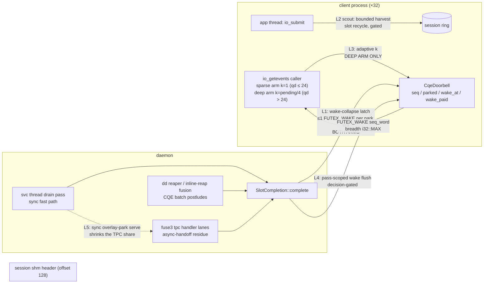

# Design: the IL-shim fan-in wake-economy campaign

| | |
|---|---|
| **Title** | IL-shim fan-in wake economy — closing the 32-process rand-4k write wall |
| **Author** | SqueezeFS core — IL data-plane campaign owner (J. Maynard) |
| **Date** | 2026-08-14 (Rev 4 — post-review, third pass) |
| **Status** | Draft |
| **Owner branch ladder** | `perf/il-wake-economy-pr1…N` |
| **Evidence basis** | `.benchmarks/2026-08-13-sqz-sync-park-race.md` (parts 2–3 + the falsification addendum — the problem statement), `.benchmarks/2026-08-08-shim-reap-fanin.md` (r2 batch-wake threshold), `.benchmarks/2026-08-08-shim-drain-funnel-r3.md` (lane-scoped flush), `.benchmarks/2026-07-28-ipc-op-economy.md` (doorbell + park-max history), `docs/design-il-direct-write.md` (dd write lane), `docs/design-preload-interception.md` (the L4 plane this extends) |
| **Governing doctrine** | IOPS verdicts govern on the IL shim (user ruling 2026-08-13); every tunable derives from cores/memory/measured rates (user law re-affirmed 2026-08-14) |

---

## Overview

The IL shim's rand-4k write plane has a **client fan-in wall**: at a fixed 256 offered
in-flights on the TCP devsub venue (written fileset, pre-fill rule), 4 client processes ×
qd64 reach **257k IOPS** (91 % of the 281k raw device ceiling) while 32 processes × qd8
reach only **185k** (66 %). The counted attribution is *scheduling load, not capacity*:
`ipc_ingress_ns` is 77–90 µs (the ring is fine), the 12-lane drain width is the re-swept
interior optimum (8/12/16/24 → 126/136/132/129k — capacity exonerated), and the box shows
CPU PSI-some across **32 % of the window** at 32 procs (vs 5 % at 4) driven by
`ipc_cqe_wake_writes` ≈ **0.94 wakes/op** — ~140k `FUTEX_WAKE`s/s, each a cross-process
scheduler wakeup toward one of 32 parked client reapers, plus the extra cross-thread wakes
of the handler-handoff residual (patch share 94 % at 4 procs → 76 % at 32).

This design attacks the wall with five levers whose regime scope is stated honestly
against the shipped reap-arm map (`REAP_EVENT_PARK_MAX = 24` since commit `047783a0`:
per-ctx pending ≤ 24 rides the **sparse event park at k = 1**; > 24 rides the **deep
batch-threshold park** — so the governing 32×qd8 row lives entirely in the sparse arm):
(1) a **wake-collapse latch** in the `CqeDoorbell` protocol — the daemon pays **at most
one `FUTEX_WAKE` per park era**, structurally, in *both* arms; this is the lever that
reaches the governing row, and it is *maximally* effective at the sparse arm's k = 1;
(2) a **pass-scoped wake flush** on the daemon (decision-gated on post-latch counts);
(3) a **decision-gated handler-handoff share reduction** (serving the `overlay`-class
write sync on the svc thread, priced from the `ipc_dd_write_ineligible_*` ledger — the
governing row's second term); (4) an **adaptive, measured-rate-derived batch mark**,
scoped to the deep arm (> 24 pending) it actually modifies — the 8×32 / 4×64 / 1×32 /
32×32 shapes, *not* 32×8; and (5) a **client reap-on-submit scout**, demoted to a
decision-gated investigation after honest re-derivation against the shipped
`io_getevents` probe order (its park-avoidance claim does not survive code reading; its
residual slot-recycle mechanism is stated, instrumented by the new `il_slot_reroutes`
counter, and pre-registered for falsification). Every
lever carries its engagement instrument, its A/B lever, its loom obligation where a fence
protocol changes, and a counted A-B-B-A acceptance row with the pre-fill rule.

## Background & Motivation

### Where every wake comes from today

All completion publication funnels through one function —
`SlotCompletion::complete` (`src/ipc_host.rs:400`):

1. **Slot-word wake** — `slot.core.complete()`; pays a `FUTEX_WAKE` on the slot's own
   state word only when a per-slot waiter parked (sync ops / sparse regime). Already
   elided in the libaio doorbell regimes (clients park on the doorbell, not slots).
2. **Session completion doorbell** — `CqeDoorbell::complete()`
   (`crates/squeezefs-ipc/src/cqe_core.rs:140`): bump `seq`, `fence(SeqCst)` (the
   load-bearing Dekker half), then wake **iff** `parked != 0` **and** the bumped seq has
   reached the earliest parked batch mark (`wake_at`, wrapping order). Counted as
   `ipc_cqe_wake_writes` / `ipc_cqe_wake_elided` (`src/ipc_host.rs:431-436`).

The completing thread is one of three venues: the svc-thread **sync fast path**
(`src/ipc_service.rs`), the **dd reaper / inline-reap fusion** (`src/ipc_direct.rs` —
CQE postludes, which drain in *batches* per pass), or a **fuse3 tpc handler lane**
(the async-handoff residue). Each completion decides its wake **independently** — there
is no cross-completion or cross-session wake state.

### The client reap-arm map (which park runs where)

The libaio reap (`interpose.rs`, `aio_reap_served`) picks its park by the ctx's pending
ring population against `reap_event_park_max()` (`interpose.rs:2497`, default
`REAP_EVENT_PARK_MAX = 24` since the 2026-08-13 retune, `interpose.rs:2680-2690`):

| Shape (per-process qd) | Arm | Park | Mark |
|---|---|---|---|
| 32×**qd8**, 16×**qd16** (≤ 24 pending) | **sparse event arm** (`interpose.rs:2549-2645`) | 4-sweep DONE spin, then `cqe_park_begin` | **k = 1** |
| 1×**qd32**, 8×**qd32**, 4×**qd64**, 32×**qd32** (> 24) | **deep batch arm** (`interpose.rs:2479-2548`) | `cqe_park_begin_batch(k)` | `reap_batch_wake_threshold(pending)` = clamp(pending/4, 2, pending) |

**The governing 32×qd8 row therefore never consults `reap_batch_wake_threshold` at
all** — it parks at k = 1. This map governs every lever's honest scope below.

### Why 0.94 wakes/op happens (and why no k-retune can fix it)

At 32×8 the sparse arm parks at **k = 1**: the first post-snapshot completion pays the
wake — and then the shipped `CqeDoorbell` has **no memory of having paid it**. Every
*subsequent* completion re-passes the mark test (a mark at-or-behind the seq reads as
reached — `cqe_core.rs:152-159`, a deliberate anti-strand posture) and re-pays the
syscall **for as long as `parked != 0`**. The parked reaper's deregistration
(`park_end`) is what stops the paying — and under 32-proc PSI the woken reaper waits in
the runqueue for hundreds of µs while completions stream at ~150k/s. So a park era's
wake count ≈ its whole harvest: nearly every completion in the era pays, which is
exactly the measured **0.94 wakes/op** (the shipped unit test pins the behavior: "past
the mark stays woken until re-park", `cqe_core.rs:268`). In the deep arm the same gap
exists past the mark; the k elides only the *below-mark prefix*.

This is a **protocol gap, not a tuning gap**: no value of k — in either arm — can
express "stop after the syscall you already paid"; only per-era state can. (The r2
batch mark and the 047783a0 boundary retune were both counted wins over their
predecessors, but both operate *before* the mark is reached; the post-mark re-pay
stream is untouched by either.)

The second multiplier is the **handler-handoff share**: the ~24 % of ring writes at 32
procs that fail the dd-write probe (`drive_direct_write`, `src/ipc_service.rs:360`) ride
`handoff_spawn → tpc_spawn` — an extra cross-thread wake + lane dispatch per op, landing
on the same oversubscribed runqueues. The corrected steady-state split (the falsification
addendum): **~78 % dd patches, ~22 % handler** (overlay ≈ 9.5 %, block-lock and shape the
rest) — with the `unmapped` class proven to be fio's own layout pass, now excluded by the
standing pre-fill rule.

The `--thread` control row (32 fio workers in ONE process = 111k, *worse* than 32
processes) pins the conviction on scheduling/wake fan-out, not process overhead.

### Thread census at 32×8 (32 CPUs)

32 fio workers + 32 parked client reapers (the `io_getevents` callers parked at k = 1 in
the **sparse event arm**'s doorbell wait, `interpose.rs:2549-2645`) + 12 `sqz-ipc-svcN`
+ 12 `sqz-ipc-ddN` (mostly fused/inline since shim-iops) + fuse3 tpc lanes + writeback
tasks. 140k FUTEX_WAKEs/s against this census **is** the PSI.

## Goals & Non-Goals

### Goals

- **G1 (headline):** 32×qd8 rand-4k il write ≥ **215k IOPS** sustained (≥ 40 % of the
  185k→257k gap), counted A-B-B-A, pre-fill rule, engagement exact, both bracket orders,
  ≥ 60 s sustained row. Stretch: ≥ 230k. The levers that reach this row are L1, L4, L5
  (the sparse arm + the handoff share); L2/L3 are gated auxiliaries on other shapes.
- **G2:** `ipc_cqe_wake_writes / (writes + elided + collapsed)` ≤ **0.25** at 32×8
  (from 0.94), with CPU PSI-some ≤ ~15 % of the window on the same row.
- **G3 (non-regression, hard gates):** qd1 RTT p99 stays 94–98 µs (the wake IS the
  contract near idle); 1×qd32 ≥ 126k / p99 ≤ 750 µs (both from
  `.benchmarks/2026-08-13-sqz-sync-park-race.md`'s honest-headline rows); read 32×8
  gates against **PR 1's captured baseline median on this venue** (measured 713–733k in
  the 2026-08-13/14 campaign sweeps — not yet filed in a `.benchmarks` note, which is
  exactly why PR 1's baseline capture files it and becomes the citable floor); daemon
  CPU/op flat-or-better (the op-registry CPU face).
- **G4:** every mechanism ships with its engagement instrument, loom coverage where a
  fence protocol changes, and derivation-tied sizing (tie tests per the `sizing.rs`
  pattern).

### Non-Goals

- The kernel zero-copy write path (throughput-governed; different campaign).
- The single-hot-file rewrite decay (45k → 32k — named for the rewrite program).
- Re-deriving the drain-lane width (12 re-confirmed as the interior optimum 2026-08-13;
  capacity is exonerated).
- A push-based revocation/completion channel, per-CPU doorbell arrays, or any new
  transport. This campaign is wake *economy* on the existing plane.
- Making overlay/block-lock shapes dd-*eligible* (that is design-il-direct-write's
  ladder); we only move where the *fallback* executes.
- Re-deriving `REAP_EVENT_PARK_MAX` inside this campaign's PR ladder — but L1 changes
  the economics that priced 24 in, so the boundary re-count is a **named post-L1
  counted act** in PR 7 (the 047783a0 precedent: retunes are counted acts with
  citations), and the sparse-arm batch-mark question is filed as Open Question 2.

## Proposed Design

### Architecture: the wake paths and where each lever lands



(Lever numbering everywhere — sections AND diagram edges — keeps the Rev 1 order: L1
latch, L2 reap-on-submit scout, L3 adaptive mark, L4 pass flush, L5 handoff share — so
review cross-references stay stable. The *leverage* order after the regime correction is
L1 → L5 → L4 → L3 → L2, stated here as a parenthetical only.)

---

### Lever 1 — the wake-collapse latch (`CqeDoorbell` v3)

**The mechanism.** Repurpose the doorbell's `_pad` word (the struct stays 16 bytes at
header offset 128 — the layout static asserts are untouched) as `wake_paid: AtomicU32`,
a **per-park-era latch**:

- **Daemon (`complete`)**: unchanged through the seq bump, fence, `parked` gate, and
  mark test. When the mark test passes, attempt
  `wake_paid.compare_exchange(0, 1, SeqCst, SeqCst)`:
  - **CAS wins** → return `Wake` (the caller pays the `FUTEX_WAKE`, breadth `i32::MAX`
    — one syscall wakes *every* parked reaper on the session, as today).
  - **CAS loses** → return `Collapsed` (a wake for this era is already in flight or
    already delivered; the syscall is elided). New counter `ipc_cqe_wake_collapsed`.
- **Client (`park_begin[_batch]`)**: after the parked registration + fence (both
  unchanged and load-bearing), **clear the latch** (`wake_paid.store(0, SeqCst)`),
  **then** take the seq snapshot, **then** write the `wake_at` mark exactly where the
  shipped code writes it (after the snapshot — the ordering is
  **register → fence → latch-clear → snapshot → mark**). A completer that runs in the
  clear→mark window reads the *stale previous mark* (at-or-behind the seq ⇒
  reads-as-reached) against the *freshly cleared* latch and **over-pays one wake** —
  benign, bounded, and exactly the class the shipped code already documents at each
  racy `wake_at` store (`cqe_core.rs:190-196`); the new window gets the same
  documented-at-the-store treatment.
- **`park_end`**: unchanged (deregistration only — the latch belongs to eras, not
  parkers; the next `park_begin` re-arms it). The clear deliberately does NOT live in
  `park_end`: an era with no successor parker would otherwise leave `wake_paid = 1`
  behind for the *next* parker (the loom weakening set below includes exactly this
  mis-placement).

**Knob plumbing (the dependency-free-file constraint).** `cqe_core.rs` is deliberately
dependency-free (`cqe_core.rs:80-83` — loom `#[path]`-includes the shipped file; the
shim shares the build), so it can never read an env knob. The lever therefore rides the
signature: `complete(latch: bool) -> CompleteOutcome`. `src/ipc_host.rs` resolves
`SQUEEZEFS_IPC_CQE_WAKE_LATCH` **once** (registry-parsed at startup, cached — the
`reap_event_park_max()` OnceLock pattern) and passes it at the one call site
(`SlotCompletion::complete`). The `latch = false` arm is the **shipped body verbatim**
(`Wake` on every mark-passed completion — bit-identical semantics to today's
`return true`); the loom models exercise the `true` arm. The client-side latch clear is
unconditional and harmless under a `latch = false` daemon (a cleared word the daemon
never CASes is dead weight, not behavior), which is what makes the lever a single
daemon-side switch.

```rust
/// Daemon-side outcome (replaces the bool):
pub enum CompleteOutcome { Elided, Collapsed, Wake }

impl CqeDoorbell {
    /// `latch`: the wake-collapse arm. This file is dependency-free
    /// (loom #[path]-includes it) — the caller resolves the knob once
    /// and passes it; `false` = the shipped wake-per-mark-passed body
    /// verbatim. Loom models run `true`.
    pub fn complete(&self, latch: bool) -> CompleteOutcome {
        let seq = self.seq.fetch_add(1, Ordering::SeqCst).wrapping_add(1);
        fence(Ordering::SeqCst);                     // load-bearing (unchanged)
        if self.parked.load(Ordering::SeqCst) == 0 { return CompleteOutcome::Elided; }
        let at = self.wake_at.load(Ordering::SeqCst);
        if seq.wrapping_sub(at) >= (1 << 31) { return CompleteOutcome::Elided; }
        if !latch { return CompleteOutcome::Wake; }  // shipped posture, verbatim
        match self.wake_paid.compare_exchange(0, 1, Ordering::SeqCst, Ordering::SeqCst) {
            Ok(_)  => CompleteOutcome::Wake,        // this era's ONE syscall
            Err(_) => CompleteOutcome::Collapsed,   // wake already in flight
        }
    }
}
```

**Why no wake is ever lost (the strand argument, to be pinned by loom).** The existing
proof's structure is preserved: registration → fence → snapshot on the parker;
DONE-publish → seq bump → fence → parked/mark/latch reads on the completer, all `SeqCst`
(one total order). The new obligation is that a parker can never sleep behind a *stale*
latch:

1. **Completers that CAS-won before this parker's latch-clear.** Such a completer's
   seq bump precedes its CAS (program order within `complete`), and the parker's
   snapshot follows its own clear. Two cases on where that bump sits relative to the
   parker's snapshot:
   - *Bump visible to the snapshot* (bump ≤ snapshot in the total order): the
     completion's DONE publish precedes its bump, so the parker's **mandatory
     post-snapshot re-scan** finds the DONE — the parker never sleeps behind it.
   - *Bump not visible to the snapshot* (bump follows it): the seq the wait admits
     against has moved by the time `FUTEX_WAIT` runs — the **futex admission fails**
     (`EAGAIN` → re-scan). Either way: no sleep behind that completion, and the
     stale `wake_paid = 1` such a completer may have left is exactly what the
     parker's clear just erased.
2. **Completers that run after the clear** find `wake_paid == 0` at the mark and pay.
   The k-th post-snapshot completion therefore always has a payable latch.
3. **Two parkers**: the paid wake's breadth (`i32::MAX`, unchanged) covers both; a
   woken parker that re-parks re-clears the latch (a new era). The one benign cost is
   the same class as the existing mark-overwrite race: a *delayed* wake bounded by the
   parker's own age bound (§5.3.1 rule 5 — every doorbell wait is deadline-bounded),
   never a lost one.

**Loom obligations** (red-first, in `loom-models/src/lib.rs`, which `#[path]`-includes
`cqe_core.rs` — the models check the shipped file), with the **model-fidelity
requirements** stated up front because the latch changes what an adequate wake witness
is:

- *Witness fidelity*: the existing models' one-shot `AtomicBool` wake witness is
  adequate for the shipped protocol only because every mark-passed completion re-pays.
  Under the latch, the dangerous class is a wake paid **before** the parker's
  admission (consumed/lost in real futex semantics) with every subsequent completion
  collapsing — a one-shot bool set by that pre-admission payer would falsely satisfy
  the assert. The new models therefore (a) **scope the wake witness per era** (reset
  at `park_begin`), (b) keep the shipped **post-registration re-scan** and the
  **one-load futex admission** modeled exactly as the client code runs them (the
  safety composition is {latch-clear-before-snapshot + re-scan + admission}, and
  weakening any leg must fail), and (c) assert **"a wake paid after this parker's
  admission OR a failed admission OR a re-scan hit"** — never "any wake ever".
- `ipc_cqe_latched_parked_reaper_never_stranded` — **loom**: single parker, two
  completers, latch arm live; the era-scoped strand assert above.
- `ipc_cqe_latch_two_parkers_covered` — **loom**: split submitter/reaper pair; both
  parkers' bounds hold under one paid wake.
- `ipc_cqe_latch_new_era_is_payable` — **unit test** (sequential walk in
  `cqe_core.rs`'s test module, the `batch_park_wakes_at_kth_completion` pattern):
  park → wake → harvest → `park_end` → re-park → assert the new era's mark-passed
  completion returns `Wake`, not `Collapsed`.
- **Weakening verification**: (a) move the latch clear before the parked registration →
  strand found; (b) clear at `park_end` instead of `park_begin` → the new-era unit test
  and the loom strand model fail (a successor-less era leaves the latch set); (c) drop
  either existing Dekker fence → the existing models still fail (re-verification, per
  the binding constraint). Run only via `tests/run_loom.sh`.

**qd1 / sparse-regime safety (G3a).** At qd1 the sparse arm parks at k = 1: the first
post-snapshot completion CAS-wins and pays exactly as today — there *are* no post-wake
duplicate completions at qd1, so the latch is behaviorally inert on the RTT shape. The
latch only ever *removes syscalls that follow an already-paid wake within one era* — it
can delay observation relative to today only in the two-parker overwrite class, which
was already bounded (and is re-bounded by the age bound).

**Trust boundary (§5.3.1, unchanged class).** `wake_paid` is client-writable shm like
its three siblings. Scribbling it to 1 permanently suppresses wakes — **for the
scribbler's own session only**; its reapers ride their age bounds (the blind-sleep
posture, bounded self-harm). Scribbling 0 restores wake-per-mark-passed-completion —
the pre-latch posture, bounded. The daemon never waits on the word. Documented at the
field per the house pattern.

**ABI.** Semantics of a shared header word change ⇒ **IPC_ABI 5 → 6**
(`crates/squeezefs-ipc/src/layout.rs:56`; the module's own discipline — "bump on ANY
change to this module's types or the region arithmetic", `layout.rs:39-41`). The
same bump covers this PR's `ClientStatsPage` field additions (see Observability / PR 2
— one coarse bump for both changes, the v5 precedent of batching same-PR layout
changes under one bump). No size/offset change to the doorbell (static asserts
unchanged). KD-7 same-commit pairing means a mixed pair is already refused at HELLO
(`ipc_bind_refused_version`) → passthrough; the KD-7 dirty-stamp lesson from the
park-max retune (engagement columns caught a silent passthrough) is why every
acceptance row carries `ipc_ops_write` delta == fio writes.

**A/B lever.** `SQUEEZEFS_IPC_CQE_WAKE_LATCH` (bool, default ON after the bracket;
registry entry in `src/env_knobs.rs`; measurement lever, never an operational escape),
plumbed as the `complete(latch)` parameter above.

**Expected effect (honest arithmetic at the sparse arm's k = 1, verified by
counting):** today a 32×8 park era pays ≈ its whole harvest (every completion from the
first through `park_end` — the 0.94). With the latch, an era pays exactly 1, so
wakes/op ≈ 1/harvest, where harvest ≈ 1 + (reaper wakeup delay × completion rate).
At the measured 32-proc PSI the delay-driven harvest is ~5–8 ⇒ ~0.12–0.2 wakes/op,
~140k → ~25–35k FUTEX_WAKEs/s. Note the **self-limiting feedback**: as the wake storm
abates and PSI falls, the wakeup delay shrinks, harvests shrink, and wakes/op drifts
back up toward 1-per-op-era — the equilibrium sits between, and the bracket measures
it; the latch's guarantee is the *bound* (≤ 1/era), not a fixed rate. The IOPS delta is
what the bracket measures — the PSI row (32 % → target ≤ 15 %) is the attribution
instrument.

---

### Lever 2 — client reap-on-submit (demoted: a decision-gated scout with the honest mechanism)

**What the Rev 1 draft claimed, and why the code contradicts it.** Rev 1 argued that a
submit-time harvest would let "the next `io_getevents` find events ready and return
without parking — fewer park eras, fewer wake targets", and that "the machinery exists;
this is a call, not new state". Both claims fail code reading:

1. **There is no ready set.** `AioCtxState` is `{ pending: Vec<PendingRing>,
   kernel_pending: usize, destroyed: bool }` (`aio_core.rs:96-104`); `getevents`
   delivers events straight into the caller's output array, and `io_submit` has no
   channel to deliver events to the app. A submit-time harvest therefore requires
   **new per-ctx state** — a ready-event backlog — specified below.
2. **The park-avoidance causal chain does not follow.** `io_getevents`' own first pass
   already runs a non-blocking ring probe (`state.getevents` with a zero budget,
   `interpose.rs:2410-2447`), and the sparse arm additionally runs a 4-sweep DONE spin
   (`interpose.rs:2560-2571`) *before* any park. A submit-time probe runs strictly
   earlier in time, so it observes a **subset** of what the getevents-entry probe will
   observe — it cannot convert a would-park getevents call into a non-park one. Under
   fio's submit→getevents alternation, whether a completion is harvested at submit or
   found by the next getevents probe changes *which userspace loop touched the DONE
   word first*, not whether a park happens.

**The honest residual mechanism (what a submit-time harvest CAN buy).** Harvesting
DONE ring tickets at submit time **recycles ring slots and slab space before the batch
publishes**. The submit path's slot claim is a bounded CAS scan; when the session's
slots are exhausted by completed-but-unreaped ops, the shipped behavior is the
**slot-exhaustion kernel-lane reroute** (`aio_core.rs:229-243` — `try_submit → None`
reroutes the iocb into the open kernel run; a correctness fallback that pays the full
kernel FUSE lane per rerouted op, by contract never `-EAGAIN` and never a truncated
prefix). Earlier recycle shrinks the exhaustion window. This mechanism is (a) real,
(b) *not* a wake-economy mechanism, and (c) plausibly material only at deep
per-session qd (1×32, 4×64 — the shapes where per-ctx pending approaches the slot
population), not on the governing 32×8 row.

**The gate needs an instrument that does not exist yet.** Nothing in the tree counts
this reroute: the `try_submit → None` arm increments no counter, and
`note_kernel_route` fires only on the hybrid lane gate's *size-route* arm with
`min != 0` (`interpose.rs:2304`) — a different class. A subtraction proxy
(fio writes − `ipc_ops_write` delta) is class-blind (it lumps screen refusals,
size-gate routes and slot exhaustion) and cannot serve either. So the campaign adds
**`il_slot_reroutes`** as the third `ClientStatsPage` counter, riding **PR 2's single
5→6 ABI bump** with its siblings. Plumbing decision (made here, not left to the PR):
the count lands in the **`SessionRing` impl's `try_submit`**, at the
`submit_pread_nowait`/`submit_pwrite_nowait` → `None` arm — the session handle is
already resolved in scope there (`interpose.rs:2016-2032`), so the increment hits the
right session's page with zero extra lookups, and the earlier `?`-arms (unbound fd /
session gone) fall out *before* a page is resolvable. That alone is NOT class-pure,
though: `submit_op` (`session.rs:1087-1132`) returns `None` from **three** arms — the
`poisoned()` pre-check (`:1095`), `claim_slot()` failure (the actual slot exhaustion,
`:1098`), and the corrupt-state ring-push **self-poison** (`:1117`) — and the shipped
reroute comment says so ("No slot *(or poisoned session)*", `aio_core.rs:230`). A
poisoned session reroutes *every* subsequent iocb, which would let a failure anomaly
masquerade as slot pressure and trip the gate. So **the increment is gated on
`!session.poisoned()`** — one branch on a path that is already the slow fallback; both
poison arms leave `poisoned() == true` at the instant `try_submit` observes the
`None` (the pre-check trivially, the corrupt-state arm because it poisons *before*
returning), so the post-hoc check excludes exactly arms (a)/(c) and counts exactly
(b). (The residual cross-thread race — another thread poisoning between the slot
claim-failure and the check — can only *undercount* by a bounded handful, and belt-
and-braces: **any row with a nonzero `ipc_sessions_poisoned` delta is INVALID for the
L2 gate** — poison is already a must-stay-0 tripwire, and a poison flood is a failure
investigation, never a slot-pressure signal.) Surfacing the count through
`SubmitOutcome` was considered and rejected:
`aio_core.rs` is a stats-free protocol core (the `cqe_core` posture), and an
outcome-level count would be class-blind between the lookup-failure and no-slot arms.

**The gate reads post-PR-2, and its expected answer is stated up front.** Because the
counter cannot exist before PR 2 (PR 1 is bump-free by construction), the scout's gate
input is **PR 2's acceptance grid**, which carries the `il_slot_reroutes` column on
every row. And there is prima facie evidence the gate will read **zero on the standing
acceptance shapes**: the standing row-validity rule (a) — `ipc_ops_write` delta ==
fio writes — is only satisfiable when reroutes are zero (rerouted ops are kernel-lane
and never count in `ipc_ops_write`), so *every valid row the discipline has ever
produced had zero slot-exhaustion reroutes by construction*. The scout most likely
gets skipped with the counts filed — which is further support for the demotion, and
exactly what a decision gate is for.

**The lever lands only if** PR 2's grid (or a shape added to it for this purpose)
shows a nonzero `il_slot_reroutes` rate, and its bracket is pre-registered to falsify
on the park instrument.

**Backlog state (specified, since it must exist):**

```rust
/// Events harvested outside a getevents call (the submit-time recycle
/// pass). Drained FIRST by the next getevents pass, before ring/kernel
/// merges — FIFO, so delivery order for one ctx matches the order the
/// DONE flags were observed (libaio guarantees no cross-op ordering,
/// but we keep observation order for determinism).
ready: std::collections::VecDeque<HarvestedEvent>,  // {data, iocb_id, res, res2}
```

- **Drain order**: `getevents` pops `ready` first, then runs the existing ring/kernel
  merge for the remainder — one extra branch at pass top, no change to the merge core.
- **`io_destroy`**: `AioCtxState::destroy` (`aio_core.rs:368`) disposes the backlog
  with the pending set — harvested-but-undelivered events on a destroyed ctx are
  dropped exactly as undelivered ring completions are (libaio's own contract for
  destroy-with-inflight), and the **registry vacate-before-drain + collision
  retro-neutralization** that closed the 2026-07-25 recycled-ctx crash class
  (`io_destroy` vacates the id BEFORE draining so it no longer resolves,
  `interpose.rs:2211-2219`; `io_setup`'s `register()` retro-neutralizes a colliding
  recycled value, `interpose.rs:2189-2193` / `aio_retro_neutralize`) covers the
  backlog for free — it lives inside the same registry entry a recycled ctx value can
  never adopt. (There is no generation field in the aio registry; naming the
  protection correctly matters so an implementer doesn't hunt for one.)
- **Fork**: the fork-child **`close(2)`-not-`shutdown(2)`** poison law is unaffected —
  the harvest and backlog touch only process-owned memory. (The law's shape, verified:
  the atfork CHILD handler runs `poison_child` — flag store + `close(2)` of the
  child's inherited fd-table copies, never `shutdown(2)`, which would kill the
  parent's shared ctl socket — `interpose.rs:1389-1393`, `session.rs:747-756`; the
  *same-process* poison is the separate `shutdown(2)`-never-`close` arm,
  `session.rs:733-745`, untouched here.) A poisoned session's backlog still delivers
  already-harvested results (client-owned bytes at that point) while new ops fall
  through.
- **Reentrancy**: covered by the existing `Guard::enter` TLS screen — the harvest runs
  inside the same guarded `io_submit` body.
- **Bounding**: the harvest runs only when `ring_pending > 0`, probes only this ctx's
  pending tickets (O(pending) DONE-word loads under the ctx lock already held), and is
  capped per submit call.

**Engagement instrument + pre-registered falsification:** client counters
`il_submit_harvested` (events moved to `ready` by the submit pass), `il_park_eras`
(parks entered) and `il_slot_reroutes` (the gate input above) on the session's
`ClientStatsPage` (all three land with PR 2's ABI bump; reserved space exists —
`layout.rs:397-408`; exported by the daemon as gauges like the lane-gate trio). The
scout's bracket is INVALID unless `il_submit_harvested` is nonzero with the lever on
and exactly zero with it off. **Scout rows use the split-attributable engagement
form**: because the scout only matters on shapes where reroutes are nonzero — the
exact shapes the standing rule (a) structurally invalidates — rule (a) for these rows
becomes `ipc_ops_write` delta + (`il_slot_reroutes` delta + lane-gate
`lane_gate_kernel_routes` delta) == fio writes (the same split-attribution posture the
lane-gate counters exist for; exhaustive on this campaign's 4 KiB shapes — the
uncounted gate-off structural-slab class is structurally empty there; scope details in
Observability). **Falsification pre-commitment:**
the design *predicts* `il_park_eras`/op is a wash (the probe-order argument above);
the lever's only path to landing default-ON is the `il_slot_reroutes` rate falling
with an IOPS delta ≥ the 2 % bar on some acceptance shape. A wash on both = the
falsified-lever rule (revert the machinery, file the note — the `2abe2094` precedent).

**A/B lever:** `SQUEEZEFS_IL_REAP_ON_SUBMIT` (bool, default OFF until the gate clears;
registry entry; the shim announces-and-defaults on a bad value, never kills the host —
the documented ENG-10 asymmetry).

---

### Lever 3 — the adaptive batch mark: `k` = last era's harvest (deep arm ONLY)

**Scope (corrected):** this lever modifies the k passed to `park_begin_batch` in the
**deep batch arm**, which engages only when a ctx's pending ring population exceeds
`REAP_EVENT_PARK_MAX = 24` (`interpose.rs:2497`). It therefore touches the
**8×32 / 4×64 / 1×32 / 32×32** shapes and **cannot move the governing 32×qd8 row or
the 16×16 shape** (both ride the sparse k = 1 arm). Its acceptance rows and leverage
claims are scoped accordingly; the governing row belongs to L1/L4/L5. Whether batch
marks should *extend into* the sparse arm (qd 3..24) — or the 24 boundary itself be
re-derived — becomes a meaningful question only after L1 changes the wake economics
that priced 24 in: both are filed as Open Question 2 and the PR 7 re-count, not
smuggled into this lever.

The r2 threshold `reap_batch_wake_threshold(pending) = clamp(pending/4, 2, pending)`
(`sizing.rs:180`) is depth-derived but **rate-blind**: at qd32 it wakes the reaper ~4×
per depth's worth of completions even when every wakeup harvests more. With the latch
(L1) the daemon already pays once per era, so the remaining cost of a small k is
**client-side**: era churn — park ceremony, re-scan sweeps, and runqueue round-trips
per harvest.

**The derivation (measured-rate, no constant — the binding law):** the next era's mark
is the **previous era's observed harvest**, clamped to the liveness cap:

```rust
/// Adaptive batch mark (wake-economy campaign, 2026-08-14): the next
/// DEEP-ARM park era's wake mark is the LAST era's harvested completion
/// count — a measured-rate derivation (harvest ≈ completion_rate ×
/// observed era length, self-measured, no venue constant), clamped to
/// [2, pending] — floor 2 = the first value distinguishable from the
/// sparse event park (REAP_EVENT_PARK_MAX owns that regime boundary),
/// ceiling = the CqeDoorbell liveness cap (an admitted sleeper needs k
/// more completions to exist). Seeded with the r2 static form
/// (clamp(pending/4, 2, pending)) on the first era of a ctx.
pub fn reap_adaptive_wake_threshold(last_harvest: usize, pending: usize) -> u32
```

This is self-tuning without a governor: a burst-completing venue (the dd lanes drain
CQs in batches) converges k upward to the burst size; a trickling venue converges to
the floor. The age bound (`SQUEEZEFS_IL_REAP_QUANTUM_US`, unchanged role since r2)
remains the worst-case observation cap, so a rate collapse mid-era costs exactly the
shipped posture. Tie tests ride `sizing.rs` per the house pattern
(`reap_batch_wake_threshold_values` precedent), including the pointwise liveness law.

**Honest falsifiability:** the sparse/deep boundary (`parks ≤ 24` rides the event
park) is untouched by this lever, and r2's own history warns that flat-form mark
inflation loses at fan-in (the PARK_MAX=4096 herd row: −3–10 % IOPS, +16–36 % tails) —
so L3's bracket runs the deep shapes it can reach (8×32, 4×64, 1×32, 32×32) plus qd1
and 32×8/16×16 as *non-engagement non-regression rows* (the lever must count zero
adaptive parks there — that is its own engagement check). If the adaptive form loses
to the static `pending/4` anywhere it engages, the static form stays and L3 lands as
the measurement lever only (`SQUEEZEFS_IL_REAP_ADAPTIVE_K=0/1`, default = whatever the
count says).

---

### Lever 4 — pass-scoped wake flush (daemon, decision-gated)

After L1, the residual `ipc_cqe_wake_writes` are one-per-era syscalls issued **inline
in the completion loops** — the svc drain pass and the dd inline-reap fusion pass both
complete many ops (across the sessions a thread owns) per sweep. Move the syscall out
of the inner loop: `SlotCompletion::complete_deferred(&mut WakeBatch)` records the
session's `Wake` outcome into a pass-local, allocation-free batch (the
service-thread-local deferred-handoff queue at `src/ipc_service.rs:155-183` is the
exact precedent), and the pass's existing end-of-sweep `flush()`
(`ipc_host.rs:2820-2822` — the `SessionSink::flush` liveness rule already orders it
before any park) issues **≤ 1 `FUTEX_WAKE` per session per pass**. Handler-lane
completions have no pass context and keep the immediate wake.

**The qd1 exposure, stated honestly:** at qd1 the client parks on the **doorbell**
via the sparse arm (`cqe_park_begin`, `interpose.rs:2600`), and sync fast-path serves
complete **inside** the svc drain pass — so L4 defers *exactly the qd1-latency wake*
to the end of that pass. The deferral bound at qd1 is the near-empty pass tail
(a one-op drain + flush), measured live by `ipc_drain_pass_ns`; the qd1 bracket row is
the empirical gate. **Pre-committed mitigation** if that row moves: issue the wake
inline when the pass's served count is 1 (the degenerate batch — deferral buys nothing
there by definition), keeping the batch for multi-op sweeps only.

**Deferral bound (general):** the remainder of one drain pass — µs-scale, measured
live by the existing `ipc_drain_pass_ns`. The wake is *delayed within a bounded window
that is already the plane's scheduling quantum*, never elided.

**Decision gate:** this PR lands only if the post-L1 count still shows wake syscalls
> ~0.1/op at 32×8 *and* the bracket shows ≥ 2 % on the governing row — with the latch
collapsing intra-era duplicates, L4's marginal value may be noise; it is sequenced
after L1's count for exactly that reason. Lever:
`SQUEEZEFS_IPC_PASS_WAKE_BATCH` (bool, registry entry).

---

### Lever 5 — the handler-handoff share at fan-in (decision-gated investigation)

The corrected ledger says ~22 % of ring writes at fan-in ride
`handoff_spawn → tpc_spawn` (an extra cross-thread wake each): **overlay ≈ 9.5 %**,
block-lock, and shape residual. The dd write lane's block-lock arm already has
try-then-park-redrive (`WriteTrains`, `ipc_dd_write_block_parks` / `park_redrives`,
`src/ipc_direct.rs:440-596`) — a follower conveyor that keeps same-block contention off
the handler lanes when the holder is the dd lane itself. What remains:

1. **Sync overlay-park serve (the priced candidate).** An `overlay`-class refusal
   (`ipc_dd_write_ineligible_overlay`) means the block carries parked extents — the W2
   extent park itself is a **RAM operation** (byte-budgeted, under the block's stripe
   locks), not a device I/O. Proposal to evaluate: extend the svc thread's sync
   fast-path write gate to *perform the extent park synchronously* when the stripe
   `try_lock` succeeds — the read-side demotion posture (`ipc_fast_path_lock_demotions`)
   applied to the overlay write arm; contended or budget-Red shapes demote to the
   handler exactly as today. This must NOT weaken any W2 rail: escalation/spill/fold
   triggers, R5 accounting (`parked_extent_bytes`), and the fold's seed-once law all
   run through the same functions — the change is *which thread runs the RAM half*,
   never what runs. **Gate:** land only if the ledger prices it in — 9.5 % of ops ×
   the measured handoff queueing term (~130 µs/op cold-firehose class from the
   handoff-economy note; re-measure on this venue) must clear the 2 % row bar, and the
   svc-thread budget must not regress read fast-path serves (the VAL-5e per-session
   budget is the guard).
2. **Foreign-holder train parks are explicitly out of scope** — the train registry IS
   the holder authority (`drive_direct_write`'s docs: a foreign holder can never absorb
   a park, because no CQE pump would ever drain it). That correctness law stands.
3. **Shape/lease residual:** report-only; feed the ledger back to
   design-il-direct-write's PR ladder (eligibility work belongs there).

---

### What was evaluated and rejected (summary — details in Alternatives)

- **Token-bucket wake budgets**: needs a rate constant no honest derivation produces;
  the latch achieves a stronger bound (≤ 1/era) structurally. Rejected.
- **io_uring `FUTEX_WAKE` batching (kernel ≥ 6.7)**: batches the *syscalls*, not the
  *wakeups* — the PSI is runqueue load from scheduler wakeups, which this does not
  reduce. Deferred (see Alternatives for the shape it could take later).
- **One shared per-process doorbell across sessions**: collapses 8 sessions' wake words
  into 1, but re-creates the pre-r2 shared-session wake herd r2 measured at −21 %, and
  breaks the per-session trust boundary. Rejected.

## API / Interface Changes

| Surface | Before | After |
|---|---|---|
| `CqeDoorbell::complete()` | `-> bool` (wake yes/no) | `complete(latch: bool) -> CompleteOutcome { Elided, Collapsed, Wake }`; `latch = false` arm is the shipped body verbatim (cqe_core stays dependency-free — the caller resolves the knob once and passes it; loom exercises `true`) |
| `CqeDoorbell` layout | `seq / parked / wake_at / _pad` (16 B, offset 128) | `_pad` → `wake_paid: AtomicU32` (same size/offset; static asserts unchanged) |
| `CqeDoorbell::park_begin_batch(k)` | register → fence → snapshot → mark | register → fence → **latch clear** → snapshot → mark (clear position load-bearing, loom-pinned; the clear→mark stale-mark over-pay window is benign-and-documented at the store) |
| `SlotCompletion::complete(result)` | inline wake decision + syscall | unchanged semantics; gains `complete_deferred(result, &mut WakeBatch)` for pass contexts (L4) |
| `sizing.rs` | `reap_batch_wake_threshold(pending)` | + `reap_adaptive_wake_threshold(last_harvest, pending)` (L3, deep arm only), tie tests both |
| `io_submit` interposer | classify → lock → `submit_batch` | (L2 scout, gated) classify → lock → **bounded slot-recycle harvest into the new per-ctx `ready` backlog** → `submit_batch` |
| `AioCtxState` | `{pending, kernel_pending, destroyed}` | (L2 scout, gated) + `ready: VecDeque<HarvestedEvent>` — drained first by `getevents`, disposed by `destroy`, covered by the registry's vacate-before-drain + collision retro-neutralization |
| `ClientStatsPage` | lane-gate trio + reserved | + `il_submit_harvested`, `il_park_eras`, `il_slot_reroutes` (from reserved space — no page growth; **all three land in PR 2 under the same IPC_ABI bump**, per the layout module's bump-on-any-type-change discipline). `il_slot_reroutes` counts in `SessionRing::try_submit`'s no-slot arm **gated on `!session.poisoned()`** (the session handle is in scope — `interpose.rs:2016-2032`; the gate excludes `submit_op`'s two poison `None`-arms, `session.rs:1095`/`:1117`), never via `SubmitOutcome` (the core stays stats-free and the outcome would be class-blind) |
| `IPC_ABI` | 5 | 6 — **one coarse bump, carried by PR 2**, covering both the doorbell word semantics and the stats-page fields (the v5 precedent: batch same-train layout changes under one bump). PR 1 touches no `layout.rs` types and is genuinely bump-free |

New env knobs (all registry entries per ENG-10; all A/B measurement levers, defaults
per bracket verdicts; the shim-side ones announce-and-default):

| Knob | Side | Kind | Default |
|---|---|---|---|
| `SQUEEZEFS_IPC_CQE_WAKE_LATCH` | daemon | bool | ON post-bracket |
| `SQUEEZEFS_IPC_PASS_WAKE_BATCH` | daemon | bool | per L4 decision gate |
| `SQUEEZEFS_IL_REAP_ON_SUBMIT` | shim | bool | OFF until the L2 scout's gate clears |
| `SQUEEZEFS_IL_REAP_ADAPTIVE_K` | shim | bool | per L3 count (deep arm only) |

## Data Model Changes

**None on-disk.** The shared-state changes are the semantic repurposing of the
doorbell's `_pad` word and the `ClientStatsPage` field additions inside the session shm
header/pages — same sizes, same offsets, version-locked by **one** IPC_ABI 5→6 bump in
PR 2 (per `layout.rs:39-41`'s bump-on-any-type-change discipline) + KD-7 same-commit
pairing (a stale shim is refused at HELLO and passes through, counted in
`ipc_bind_refused_version`). No migration: sessions are ephemeral (client-process
lifetime). The L2 scout's `ready` backlog is client-private heap, not shm.

## Alternatives Considered

1. **Daemon-side token-bucket wake-rate budget** (elide wakes above a rate; parked
   reapers self-serve on their age bounds). *Rejected*: the bucket rate is a constant
   with no honest derivation (cores? memory? neither predicts the acceptable
   observation latency), and under the derivation law a "wakes/ms" number would be a
   box constant with a doc comment pretending otherwise. The latch delivers a stronger
   guarantee — at most one wake per park era, *zero* rate parameter — and degrades to
   the age bound identically. The token bucket also taxes qd1 (a budget shared across
   regimes), which is a G3 violation by construction.
2. **Batch the wake syscalls through io_uring `IORING_OP_FUTEX_WAKE`** (kernel ≥ 6.7;
   the dd rings exist and are COOP_TASKRUN already; a kernel-dependent fast path is
   sanctioned by ruling D13 with loud degrade). *Deferred, not rejected*: it reduces
   *syscall entries*, but every futex wake still enqueues a scheduler wakeup — the PSI
   evidence convicts runqueue load, not syscall overhead (0.94 wakes/op × ~1 µs of
   syscall entry ≈ 0.14 CPU, vs 32 % PSI-some). After L1 cuts the wakeup *count* ~5×,
   the residual syscall cost may be worth one more counted look; it composes cleanly
   with L4's `WakeBatch` (the flush point would submit SQEs instead of calling
   `futex(2)` in a loop). Filed as an open question with its kernel gate.
3. **One process-wide doorbell** (client registers a single futex word; every session's
   completions bump it). *Rejected*: re-creates the pre-r2 shared-wake herd (every
   completion on ANY of the process's 8 sessions wakes the reaper — r2 measured this
   class at −21 % on t16qd16), erases the per-session trust boundary (§5.3.1: one
   hostile session could starve siblings' observation), and complicates the
   `wait_any`/`futex_waitv` machinery that already gives us multi-session waits with
   per-session words.
4. **A dedicated per-client wake-aggregator thread** (daemon wakes one thread per
   client; it fans in-process). *Rejected*: adds a thread to a census the evidence
   convicts of oversubscription, and adds a hop to the latency path. The whole design
   direction is *fewer* wakeups and *fewer* threads.
5. **Raise `reap_batch_wake_threshold` statically (pending/2, pending)** — or lower
   `REAP_EVENT_PARK_MAX` so more shapes ride batch marks. *Rejected as the primary
   lever*: rate-blind — it trades daemon wakes for client observation latency
   uniformly, and both boundaries' own falsification history (the PARK_MAX=4096 herd
   row: −3–10 % IOPS, +16–36 % tails; the 2→24 retune the other direction) shows
   flat-form retunes lose at regime boundaries. L3's measured-harvest form subsumes
   the static raise where it engages; the boundary re-derivation is PR 7's counted
   act, on top of L1's changed economics.

## Security & Privacy Considerations

- **Threat model unchanged**: the doorbell words (now four) are client-writable shm;
  the daemon only bumps/loads/CASes and never waits on them. `wake_paid` scribbles are
  bounded self-harm (see Lever 1) — pinning 1 starves only the scribbler's own reapers
  to their age bounds; pinning 0 restores the pre-latch wake posture. The per-session
  isolation is exactly why alternative 3 was rejected.
- The §5.2 daemon fd screen, HELLO ladder (ABI + build-commit equality + nonce +
  `SO_PEERCRED`), and the `ipc_bind_refused_*` counters are untouched; IPC_ABI 6
  refusals land in the existing `ipc_bind_refused_version` class.
- No new privileged surface, no new sockets, no new fds. The L2 scout's harvest and
  backlog read/write only memory the client already owns.
- Client counters on `ClientStatsPage` carry no keys/paths (counts only) — no VAL-7a
  census-gating needed.

## Observability

**New stats (stats inode, semantics documented in the families list):**

| Counter | Meaning | Health law |
|---|---|---|
| `ipc_cqe_wake_collapsed` | mark-passed completions whose syscall the latch elided | the L1 engagement instrument; **the wake-economy gauge becomes `writes/(writes+elided+collapsed)`** — ≤ 0.25 at 32×8 is the G2 target; ≈ 1 under a saturated parked reaper means the latch stopped engaging (regression). NOTE: this **changes the denominator** of the standing `ipc_cqe_wake_*` health-law ratio documented in AGENTS.md and design-preload-interception §8 — PR 7 migrates both docs and calls the change out for dashboards/notes keying on the old ratio |
| `ipc_cqe_pass_wake_flushes` | L4 end-of-pass wake syscalls issued | flushes ≤ sessions × passes by construction |
| `il_submit_harvested` (client page → daemon gauge; **fields land in PR 2** under the ABI bump) | completions the L2 scout's submit pass moved to the `ready` backlog | nonzero with L2 on; **exactly 0 with `SQUEEZEFS_IL_REAP_ON_SUBMIT=0`** (the A/B validity check) |
| `il_park_eras` (client page → daemon gauge; PR 2) | doorbell parks entered (either arm) | the fan-in wake-target census; eras/op is L2's pre-registered falsification instrument and L3's era-churn gauge |
| `il_slot_reroutes` (client page → daemon gauge; PR 2) | iocbs rerouted to the kernel lane by session slot exhaustion (`try_submit`'s no-slot arm gated on `!poisoned()` — NOT poisoned-session refusals, which the gate excludes, and NOT the lane-gate size routes, which stay in `lane_gate_kernel_routes`) | the L2 scout's gate input; nonzero on a row switches that row's rule (a) to the split-attributable form below; a row with a nonzero `ipc_sessions_poisoned` delta is INVALID for the gate; the standing rule-(a) argument predicts 0 on every historically-valid shape |

**Row-validity discipline (extends the standing engagement law):** a wake-economy
bracket row is INVALID unless (a) `ipc_ops_write` delta == fio writes (engagement) —
**amended for rows with nonzero `il_slot_reroutes`** (the L2 scout's shapes, where the
unamended form is structurally unsatisfiable because rerouted ops are kernel-lane and
never count in `ipc_ops_write`) to the split-attributable form
`ipc_ops_write Δ + il_slot_reroutes Δ + lane_gate_kernel_routes Δ == fio writes`, so
every op **on this campaign's 4 KiB shapes** is attributed to a named lane and a
silent passthrough still cannot hide. (Scope, stated honestly: the **structural slab
reroute** — `io.nbytes > slab` with the lane gate OFF, `min == 0` — deliberately
counts nothing (`interpose.rs:2294-2306`), so the amended form is exhaustive only
where that class is empty, which it structurally is on every 4 KiB row here
(4 KiB ≪ slab); a future >slab il row must either enable the lane gate — making the
class counted in `lane_gate_kernel_routes` — or accept the unamended rule's scope.) —
(b) the wake gauge's denominator (`writes+elided+collapsed`) accounts for the row's
completions, and (c) the L2 rows show the `il_submit_harvested` on/off split above.
External instruments per row: CPU PSI-some (`/proc/pressure/cpu` deltas),
`perf stat -e syscalls:sys_enter_futex` or equivalent FUTEX_WAKE/s, and the existing
`ipc_direct_phase_ns` (admit-phase mean is the intra-pass queueing witness) +
`ipc_ingress_ns` (must stay in its 77–90 µs band — a rise means we moved the wall into
the ring, not removed it).

**Logging:** the latch and each lever log one line at session establish / mount with
their resolved state (the killpriv-negotiated pattern); loud degrade lines where a
kernel gate is involved (none in PR 1–5; alternative 2 would add one).

## Rollout Plan

1. Every lever lands default-consistent-with-its-bracket behind its registry knob; the
   knobs are measurement levers (documented as such), never operational escapes.
2. Sequencing is strictly counted: L1's bracket runs before L4's decision gate; L3's
   bracket runs on top of L1 (the levers interact through era length); L2's scout gate
   reads PR 2's acceptance-grid `il_slot_reroutes` column (the instrument cannot exist
   before PR 2's ABI bump — see Lever 2).
3. **Acceptance grid per perf PR** (TCP devsub, pre-fill rule, engagement exact,
   A-B-B-A both orders, medians of 3, ≥ 60 s sustained for headline rows), annotated
   with which arm each shape rides so engagement checks are per-lever-honest:
   32×qd8 (the governing row — **sparse arm**), 16×16 (**sparse arm** — r2's herd
   shape), 8×qd32, 4×qd64, 1×qd32, 32×32 (**deep arm** — L3's engagement shapes),
   qd1 RTT (hard gate), read 32×8 (hard gate vs PR 1's captured baseline), plus the
   per-row wake/PSI/futex columns above.
4. **Rollback**: each lever independently reverts by knob flip (bit-identical shipped
   paths preserved: latch OFF = the verbatim `!latch` arm, L2 OFF = no harvest call,
   L3 OFF = static k, L4 OFF = inline wakes). IPC_ABI 6 is the one non-knob change; it
   rides PR 2 and reverts only by branch revert (acceptable: KD-7 pairing makes
   partial deployment unrepresentable anyway).
5. Release gate: the standing battery (three external suites at release cadence,
   `run_preload_gate.sh` legs 1+2 per-PR since this touches
   `crates/squeezefs-preload/` and `src/ipc_service.rs`/`src/ipc_host.rs`,
   loom via `tests/run_loom.sh` on every PR touching `cqe_core.rs`, bench-baseline
   pre-merge since these are perf PRs).

## Risks

| Risk | Severity | Mitigation |
|---|---|---|
| Latch protocol strands a parker (lost-wake class — the sqz-sync lesson is *fresh*) | **High** | Red-first loom models with era-scoped wake witnesses + shipped re-scan/admission fidelity (see L1 loom block), weakening verification ×3, before any daemon wiring; the age bound (§5.3.1 rule 5) remains the absolute backstop on every wait; `lock_ticked_reregisters`-style anomaly visibility via park-timeout counters on the client page |
| qd1 RTT regression (the wake is the contract near idle) | High | Latch is behaviorally inert at k=1/no-duplicate shapes (argued + tested); L4's qd1 doorbell-wake deferral is named honestly with the served==1 inline-flush mitigation pre-committed; qd1 row is a hard gate in every bracket |
| L2 scout is machinery for a falsified mechanism (the Rev 1 park-avoidance chain) | Medium | Mechanism re-derived (slot recycle, not park economy); gated on PR 2's measured `il_slot_reroutes` rate (the instrument lands with PR 2's bump — and the standing rule-(a) argument predicts the gate reads zero, i.e. the scout is most likely skipped with the counts filed); falsification pre-registered on `il_park_eras`; default OFF; the falsified-lever rule (revert + note) pre-committed |
| L3 adaptive k over-batches on a rate cliff (stale harvest estimate) | Medium | Deep-arm scope only (sparse shapes structurally untouched — engagement counters must read 0 there); age bound caps the damage at the shipped blind-sleep posture; liveness clamp `k ≤ pending` pointwise-tested; falls back to static form on a losing count |
| L5 sync overlay-park starves svc-thread read serves | Medium | VAL-5e per-session budget guards the pass; try-lock demotion posture (never blocks); decision-gated on the priced ledger; read 32×8 hard gate |
| Wake economy helps FUTEX rate but IOPS stays flat (PSI attribution wrong) | Medium | The 4×64 = 91 %-of-ceiling row bounds what scheduling can return; the bracket's PSI/futex columns make a flat-IOPS-falling-wakes outcome a *finding*, not a silent wash — the falsified-lever rule applies (revert, file the note) |
| KD-7 dirty-stamp silent passthrough poisons a bracket | Low | Engagement columns mandatory per row (the 2026-08-13 lesson is codified in the acceptance grid) |

## Open Questions

1. **Post-L1 residual syscall cost**: does batching the residual ~30k wakes/s through
   `IORING_OP_FUTEX_WAKE` (kernel ≥ 6.7, loud degrade per D13) clear the 2 % bar? Needs
   the post-L1 count first (Alternative 2).
2. **The sparse-arm mark question**: post-latch, should batch marks extend into the
   sparse event arm (qd 3..24 — today structurally k = 1), and/or should
   `REAP_EVENT_PARK_MAX = 24` be re-derived? The 047783a0 retune priced 24 in under
   pre-latch wake economics (the batch quantum sleep vs the responsive event park);
   the latch changes what a k = 1 park costs the daemon, and L1's counted bracket at
   32×8 (sparse) vs 8×32 (deep) is the first data that can answer it. PR 7 carries the
   boundary re-count as a named counted act; extending marks into the sparse arm is a
   possible L3 follow-on with its own latency obligations — not smuggled into this
   campaign's L3.
3. **Should the dd inline-reap fusion pass prioritize completion publication over new
   admits under fan-in?** The 315 µs admit-phase mean is intra-pass queueing; L1/L4
   shrink the pass body, but pass-ordering (complete-before-admit) is an untested
   degree of freedom. File as a scout leg in the L4 bracket.
4. **The remaining patch-share residual** (shape/lease classes after L5): does it
   justify extending dd-write eligibility (design-il-direct-write's ladder), or is
   4-proc-parity at 32 procs achievable on wake economy alone? The post-campaign
   ledger decides.
5. **Client reaper CPU affinity hints** (park the reaper near its session's owner
   node — the `numa_core` nearest-map is injectable): deliberately out of this
   campaign (no counted evidence yet); note for the NUMA program if the post-L1 PSI
   still shows cross-node wake latency.

## References

- `.benchmarks/2026-08-13-sqz-sync-park-race.md` — the problem statement (parts 2–3 +
  falsification addendum); the pre-fill rule; the lost-wake lesson.
- `.benchmarks/2026-08-08-shim-reap-fanin.md` — the r2 batch-wake threshold + ingress
  stamp; the flat-park herd falsification.
- `.benchmarks/2026-08-08-shim-drain-funnel-r3.md` — lane-scoped flush; the funnel
  instruments (`ipc_drain_pass_ns` etc.).
- `.benchmarks/2026-07-28-ipc-op-economy.md` — the CqeDoorbell's birth; the
  `REAP_EVENT_PARK_MAX` 24→2 history (since re-counted 2→24, commit `047783a0` —
  the boundary that puts qd ≤ 24 on the sparse k = 1 event park today).
- `.benchmarks/2026-08-06-dd-width-slope.md` — the drain-lane derivation the width
  re-sweep re-confirmed.
- `docs/design-preload-interception.md` — §5.3 wake protocol, §5.3.1 trust boundary +
  rule 5, §5.5 service threads.
- `docs/design-il-direct-write.md` — the dd write lane; the eligibility ledger this
  design's L5 prices from.
- Code: `crates/squeezefs-ipc/src/cqe_core.rs`, `crates/squeezefs-ipc/src/sizing.rs`,
  `crates/squeezefs-ipc/src/layout.rs` (IPC_ABI + its bump discipline at lines 39-41,
  header asserts, `ClientStatsPage`),
  `crates/squeezefs-preload/src/interpose.rs` (the reap-arm boundary at 2497/2690,
  sparse arm 2549-2645, deep arm 2479-2548, `io_submit` 2244),
  `crates/squeezefs-preload/src/aio_core.rs` (`AioCtxState` at 96-104, `destroy` at
  368), `crates/squeezefs-preload/src/session.rs` (park API, `wait_any`),
  `src/ipc_host.rs` (`SlotCompletion::complete`, `service_loop`),
  `src/ipc_service.rs` (`drive_direct_write`, deferred-handoff queue precedent),
  `src/ipc_direct.rs` (`WriteTrains`, inline-reap fusion), `loom-models/src/lib.rs`.

## Key Decisions

1. **Wake-once-per-park-era is a protocol change, not a tuning change.** At the
   governing row's sparse arm (k = 1), a park era pays ≈ its whole harvest because the
   shipped doorbell re-pays the wake on every mark-passed completion until `park_end`;
   the latch (`wake_paid` CAS, cleared at `park_begin`) bounds it at 1/era
   structurally, in both reap arms. Rationale: no derivation of k — in either arm —
   can express "stop after the syscall you already paid"; only state can.
2. **Reuse the `_pad` word; one coarse IPC_ABI bump (5→6) in PR 2 covering both
   layout-module changes** (the doorbell word semantics AND the `ClientStatsPage`
   fields), per `layout.rs`'s own bump-on-any-type-change discipline and its v5
   same-train precedent. PR 1 touches no layout types and is genuinely bump-free.
3. **Lever scope is stated against the shipped reap-arm map, not assumed.**
   `REAP_EVENT_PARK_MAX = 24` puts the governing 32×8 row (and 16×16) on the sparse
   k = 1 arm — so L3's adaptive mark is scoped to the deep shapes it actually
   modifies, the sparse-arm mark question and the boundary re-derivation are filed as
   post-L1 counted acts (Open Question 2 / PR 7), and the governing row is owned by
   L1 + L4 + L5.
4. **No new client threads or hops; the one client-side reap lever is demoted to a
   decision-gated scout.** Reap-on-submit's park-avoidance claim does not survive the
   code (the `io_getevents`-entry probe + 4-sweep spin strictly subsume a submit-time
   probe); its honest residual mechanism — earlier ring-slot recycle shrinking
   slot-exhaustion kernel-lane reroutes — is specified with its real state cost (the
   per-ctx `ready` backlog + lifecycle), gated on the new `il_slot_reroutes`
   instrument (nothing shipped counts the reroute — the counter rides PR 2's ABI bump
   and the gate reads PR 2's grid; the standing rule-(a) argument predicts a zero read
   and a filed skip), and pre-registered for falsification on `il_park_eras`. Scout
   rows carry the split-attributable engagement form so the row-validity law survives
   nonzero reroutes.
5. **Adaptive k derives from the client's own measured harvest, never a constant.**
   `k_next = clamp(last_era_harvest, 2, pending)` is a measured-rate derivation per the
   2026-08-14 law; the static `pending/4` remains the seed and the falsification
   fallback. The age bound stays the worst-case cap, so the failure mode is exactly
   the shipped posture. Deep arm only (Decision 3).
6. **Token buckets and syscall batching rejected/deferred on attribution grounds.**
   The PSI convicts scheduler wakeups, not syscall entries; the latch removes wakeups,
   io_uring FUTEX_WAKE would only remove entries. A rate budget needs a constant the
   derivation law forbids.
7. **The handler-handoff share is attacked by moving where the fallback executes
   (sync overlay-park on the svc thread, try-lock demotion posture), never by weakening
   eligibility or the train-ownership law.** Priced from the
   `ipc_dd_write_ineligible_*` ledger; decision-gated; W2 rails run verbatim.
8. **Every lever is independently revertible by knob, sequenced by counted brackets,
   and carries its engagement instrument.** L2, L4 and L5 are explicitly
   decision-gated on measured counts — the design pre-commits to *not* landing
   machinery the counts don't price in (the falsified-lever rule).

## PR Plan

**PR 1 — `perf/il-wake-economy-pr1`: daemon-side instruments + baseline capture (bump-free by construction)**
- *Files*: `src/fuse_client.rs` (METRICS registration: `ipc_cqe_wake_collapsed`,
  `ipc_cqe_pass_wake_flushes` — registered at 0 ahead of their mechanisms, the
  instruments-first house pattern; stats-JSON export), campaign rig script under
  `.benchmarks/rigs/` (PSI + FUTEX_WAKE/s columns per row; the `il_slot_reroutes`
  column is CHARTERED here but marked "lands with PR 2" — its counter is a
  `ClientStatsPage` field and cannot exist in a bump-free PR), stats docs
  (AGENTS stats surface + `docs/design-preload-interception.md` §8).
- *Deps*: none.
- *Description*: land the daemon-side observability first and capture the pre-campaign
  baseline rows (32×8/16×16/8×32/4×64/1×32/qd1/32×32/read-32×8) with the pre-fill
  rule — the read-32×8 median becomes G3's citable floor. (The L2 scout's gate input —
  the `il_slot_reroutes` rate — is **PR 2's** output, not this PR's: the counter is a
  `ClientStatsPage` field and this PR is bump-free.) **Deliberately excludes any
  `crates/squeezefs-ipc/src/layout.rs` change** (the `ClientStatsPage` fields move to
  PR 2 so the ABI bump discipline holds — `layout.rs:39-41`). Red-first tests: counter
  registration + stats-JSON presence (`tests/ipc_op_economy_tests.rs` pattern). No
  behavior change — no perf claim.

**PR 2 — `perf/il-wake-economy-pr2`: the wake-collapse latch (CqeDoorbell v3) + client-page fields — IPC_ABI 5→6**
- *Files*: `crates/squeezefs-ipc/src/cqe_core.rs` (`wake_paid`,
  `complete(latch) -> CompleteOutcome`, park clear ordering + the documented
  clear→mark over-pay window), `crates/squeezefs-ipc/src/layout.rs` (**one coarse
  bump 5→6** covering the doorbell word semantics AND the new `ClientStatsPage`
  fields `il_submit_harvested`/`il_park_eras`/`il_slot_reroutes`; v6 history note per
  the module's discipline), `loom-models/src/lib.rs` (two loom models with era-scoped
  wake
  witnesses + shipped re-scan/admission fidelity, weakening set ×3, re-verification
  of the existing pair), `src/ipc_host.rs` (once-resolved knob passed at the
  `SlotCompletion::complete` call site; `ipc_cqe_wake_collapsed` wiring),
  `crates/squeezefs-preload/src/session.rs` (`cqe_park_begin[_batch]` latch clear +
  park-era counting onto the client page),
  `crates/squeezefs-preload/src/interpose.rs` (`SessionRing::try_submit`'s no-slot arm
  counts `il_slot_reroutes` — the session handle is in scope, `interpose.rs:2016-2032`;
  the plumbing decision from Lever 2), `src/env_knobs.rs`
  (`SQUEEZEFS_IPC_CQE_WAKE_LATCH`).
- *Deps*: PR 1 (instruments + baseline).
- *Description*: the campaign's primary lever — the only one that structurally reaches
  the governing sparse-arm row. Red-first: loom models fail on the retired protocol
  re-expression (the sqz-sync discipline); the `new_era_is_payable` walk lands as a
  `cqe_core.rs` unit test; unit tests pin the outcome walk (latch collapse, era
  re-arm, two-parker coverage, qd1 inertness, `latch=false` bit-parity with the
  shipped body) plus the `il_slot_reroutes` class test (no-slot counts;
  **poisoned-session refusals** — both `submit_op` poison arms, the `:1095` pre-check
  and the `:1117` corrupt-state self-poison — lookup-failure and lane-gate size routes
  do not). **Acceptance row**: A-B-B-A 32×qd8 (target
  ≥ +10 %), full grid as hard gates; engagement = wake gauge ≤ 0.25 +
  `ipc_cqe_wake_collapsed` accounting for the removed syscalls; sustained 90 s on the
  governing row; **the grid carries the `il_slot_reroutes` column on every row — this
  is the L2 scout's gate input** (the standing rule-(a) argument predicts 0
  everywhere). Loom via `tests/run_loom.sh`.

**PR 3 — `perf/il-wake-economy-pr3`: reap-on-submit scout (client; decision-gated, default OFF)**
- *Files*: `crates/squeezefs-preload/src/aio_core.rs` (`ready: VecDeque<HarvestedEvent>`
  backlog: drain-first in `getevents`, disposal in `destroy`, harvest entry),
  `crates/squeezefs-preload/src/interpose.rs` (`io_submit` bounded harvest;
  `il_submit_harvested` counting; split-shape microbench test), `src/env_knobs.rs`
  (`SQUEEZEFS_IL_REAP_ON_SUBMIT`, default OFF).
- *Deps*: PR 2 (client-page fields incl. the `il_slot_reroutes` instrument); **gate**:
  PR 2's acceptance grid (or a shape added to it for this purpose) must show a nonzero
  `il_slot_reroutes` rate on a row whose `ipc_sessions_poisoned` delta is zero (a
  poison flood is a failure investigation, never a slot-pressure signal — Lever 2),
  else this PR is skipped with the counts filed — and the standing rule-(a) argument
  (Lever 2) predicts exactly that skip.
- *Description*: the honest mechanism — earlier ring-slot/slab recycle shrinking
  slot-exhaustion reroutes — NOT park economy (the getevents-entry probe subsumes a
  submit-time probe for park avoidance; the design pre-registers `il_park_eras`/op as
  a predicted wash). Lifecycle: backlog dies with `io_destroy`'s vacate-before-drain +
  `io_setup`'s collision retro-neutralization (the 2026-07-25 recycled-ctx class),
  fork-child `close(2)`-not-`shutdown(2)` and `Guard::enter` reentrancy unaffected
  (owned memory only). Red-first: harvest-visibility + drain-order + destroy-disposal
  unit tests on the aio core, split submitter/reaper non-regression test.
  **Acceptance row**: A-B-B-A on the shapes with measured reroutes + 1×qd32 + qd1 hard
  gates; engagement = `il_submit_harvested` on/off split (exactly 0 with the lever
  off) + the `il_slot_reroutes` delta, with rule (a) in its **split-attributable
  form** (`ipc_ops_write Δ + il_slot_reroutes Δ + lane_gate_kernel_routes Δ == fio
  writes` — the unamended form is structurally unsatisfiable on exactly the shapes
  this scout targets); falsification = wash on both ⇒ revert + note.

**PR 4 — `perf/il-wake-economy-pr4`: adaptive batch mark (measured-harvest k, deep arm only)**
- *Files*: `crates/squeezefs-ipc/src/sizing.rs` (`reap_adaptive_wake_threshold` +
  tie/liveness tests), `crates/squeezefs-preload/src/interpose.rs` (the **deep batch
  arm** (`parks.len() > reap_event_park_max()`) uses last-era harvest; per-ctx harvest
  memo — no allocation; the sparse arm is untouched), `src/env_knobs.rs`
  (`SQUEEZEFS_IL_REAP_ADAPTIVE_K`).
- *Deps*: PR 2 (era length is shaped by the latch; the bracket runs on the composed
  tip).
- *Description*: k_next = clamp(last_harvest, 2, pending), seeded by the r2 static
  form; the `REAP_EVENT_PARK_MAX = 24` regime boundary untouched (its re-derivation is
  PR 7's counted act). Red-first: sizing tie tests (pointwise liveness `k ≤ pending`),
  regime-boundary tests (sparse shapes must count zero adaptive parks — the negative
  engagement check). **Acceptance rows**: A-B-B-A on the deep shapes it can reach —
  8×32, 4×64, 1×32, 32×32 — plus qd1 and 32×8/16×16 as non-engagement non-regression
  rows; falsification pre-commitment: a losing count keeps the static form and lands
  the lever default-OFF with the note.

**PR 5 — `perf/il-wake-economy-pr5`: pass-scoped wake flush (daemon; decision-gated)**
- *Files*: `src/ipc_host.rs` (`WakeBatch`, `complete_deferred`, end-of-pass flush at
  the existing `sink.flush()` points, the served==1 inline-flush arm),
  `src/ipc_direct.rs` (inline-reap fusion + reaper CQ-drain postludes route through
  the batch), `src/env_knobs.rs` (`SQUEEZEFS_IPC_PASS_WAKE_BATCH`).
- *Deps*: PR 2 (gate: post-latch wake count still > ~0.1/op at 32×8 AND a scout leg
  shows ≥ 2 %); PR 1.
- *Description*: ≤ 1 wake syscall per session per pass, syscall off the completion
  inner loop; handler-lane completions keep immediate wakes; the qd1 doorbell-wake
  deferral exposure is named (the near-empty pass tail, `ipc_drain_pass_ns`-measured)
  with the served==1 inline-flush mitigation wired if the qd1 row moves. Red-first:
  liveness test (a deferred wake always flushes before the thread can park — the
  `SessionSink::flush` contract extended), dedup unit tests. **Acceptance row**:
  A-B-B-A 32×8 with `ipc_cqe_pass_wake_flushes` as engagement + qd1 hard gate;
  skipped (with the counts filed) if the gate says no.

**PR 6 — `perf/il-wake-economy-pr6`: sync overlay-park serve (decision-gated
investigation)**
- *Files*: `src/ipc_service.rs` (sync fast-path write gate: overlay-class try-lock
  arm), `src/routing.rs` / extent-overlay entry points (no semantic change — the RAM
  half runs on the svc thread under the same stripe locks and budgets),
  `tests/il_direct_write_tests.rs` extensions (W2 rails re-pinned from the svc venue).
- *Deps*: PR 2 (the wake-economy floor changes the handoff term's price); the priced
  gate from the PR 1 ledger columns.
- *Description*: serve the `ipc_dd_write_ineligible_overlay` class synchronously when
  the stripe try-lock succeeds (demote on contention/Red — the read-side posture);
  W2 escalation/spill/fold/R5 rails run through the existing functions verbatim.
  Red-first: rail tests (escalation triggers, `parked_extent_bytes` accounting,
  demotion on contention), then the counted bracket. **Acceptance row**: A-B-B-A 32×8
  with the handoff share (`ipc_async_handoffs`/op) and read-fast-path non-regression
  as engagement; lands only if the ledger prices it ≥ 2 % on the governing row.

**PR 7 — `perf/il-wake-economy-pr7`: campaign closing — boundary re-count + evidence note + docs**
- *Files*: `.benchmarks/2026-08-XX-il-wake-economy.md` (the closing note: full grid,
  sustained rows, PSI/futex columns, falsifications, and the **post-latch
  `REAP_EVENT_PARK_MAX` re-derivation** — a named counted act per the 047783a0
  precedent, since L1 changes the economics that priced 24 in; the sparse-arm mark
  question adjudicated or re-filed with its count), AGENTS.md stats-surface +
  campaign paragraph **including the wake-gauge denominator migration**
  (`writes/(writes+elided)` → `writes/(writes+elided+collapsed)` — called out
  explicitly so dashboards/notes keying on the old ratio migrate),
  `docs/design-preload-interception.md` §5.3 protocol + §8 gauge-law update,
  `tests/run_bench_baseline.sh` reference refresh if criterion-visible, possible
  `SQUEEZEFS_IL_REAP_QUANTUM_US` default re-count on the new stack.
- *Deps*: PRs 2–6 (whichever landed).
- *Description*: one from-zero acceptance pass of the final composition (the
  counted-restart discipline — mid-campaign brackets are never the closing evidence),
  headline sustained rows ≥ 60 s both governing shapes, the honest gap statement vs
  the 257k/281k ceilings, and the residual board (open questions 1–5 adjudicated:
  built / deferred-with-count / falsified).
