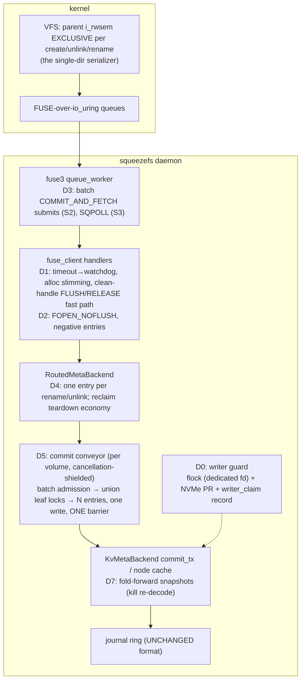

# Design Doc: SqueezeFS Metadata-Throughput Program — Closing the 4.4× FUSE Multiple

| | |
|---|---|
| **Title** | Metadata-throughput program: FUSE-layer teardown, group-commit v2, journal-entry economy, and the single-writer mount guard |
| **Author** | _(placeholder — assign on review)_ |
| **Date** | 2026-07-14 |
| **Status** | Approved — **revision 2** (writer/reviewer consensus, 3 rounds; see Revision History) |
| **Repo** | `/home/justin/Source/squeezefs`, `dev` @ `9943fcb` |
| **Intended home** | `docs/design-metadata-throughput.md` |
| **Evidence base (normative)** | `.benchmarks/2026-07-14-metadata-throughput-baseline.md` — every lever below traces to a measured row in that report |
| **Engine contract (inviolable)** | `docs/design-cow-kv-metadata.md` — whole-tx atomicity (one tx = one checksummed journal entry), torn-write immunity, checkpoints off the commit path, lock order §4.9 4b |
| **Related** | `AGENTS.md` (non-negotiables), `.benchmarks/2026-07-13-rand4k-per-op-cost.md` (S2/S3 structural menu), `.benchmarks/2026-07-12-read-path-closing.md` (regression reference rows), `docs/design-zero-copy-write-path.md` + `docs/design-read-path.md` (acceptance-report style precedent), `.benchmarks/2026-07-09-kv-v3-gates.md` (K7 lineage bands) |

**Revision history**

| Rev | Date | Change |
|---|---|---|
| 0 | 2026-07-14 | Initial draft |
| 1 | 2026-07-14 | Review round 1 (12 issues) addressed. **D0 Layer B redesigned**: the ring-bytes raw-re-read arbitration was retired as unsound (buffered re-read cannot see cross-host writes; TOCTOU; checkpoint-task head divergence — §8.8) in favor of **NVMe Persistent Reservations** (enforcement-grade) + a detection-grade claim record with automatic cross-host takeover disabled on non-PR substrates and a new `squeezefs claim clear` attestation verb; Layer A moved to a **dedicated daemon-lifetime guard fd** (uring_fs `FdCache` eviction would silently drop a cache-fd flock). **G3 restated** as strict-vs-default convergence (≥ 90 % of same-tip default rows on B1/C + group-size median ≥ 4) — the round-1 absolute 4× silently required G2 × 1.25. **§1.2 unlink attribution corrected** (the code disclaims a per-corpse `delete_file` commit, `routing.rs:5754-5759`; batch fill ≈ 1 is the stated prior) and D4.c re-targeted at batch fill. **D5 gained a leader-lifecycle & cancellation-safety subsection** (detached panic-guarded pass task; `Admission`/`Reservation` drop hazards; M4→M7 load-bearing edge; cancel-mid-batch harness). **D6 (FUA) descoped** to a future program (§8.7 — pad bytes poison `replay_dropped_torn`; a PAD entry kind is a forbidden framing change; O_DIRECT tail ownership is a ring-writer redesign). Cost model demoted to a measured hypothesis (under-`i_rwsem` span estimator added to D1.a); watchdog exception list made audit-derived; Security/Threat-model subsection added to §5.0; D7 memory charged to the node-cache budget; PR graph reconciled with Deps rows + per-PR week estimates; editorial nits (§3 pt refs, preflight filter, pinned fstests cases, 2.002/2.004 citation, Key Decision 2 phrasing). |
| 2 | 2026-07-14 | Review round 2 (4 new issues vs the revision-1 material; all 12 round-1 fixes verified, none reopened). **Issue 13 (major): conveyor DLM-guard ownership moved into the queue entry** — the revision-1 lifecycle text let a dropped parked committer release its DLM I/D guards by RAII while its staged records stayed queued, violating (and debug-assert-firing) the co-queue same-key exclusion the crash-contract/LWW argument cites; now each entry co-owns its tx's guards as an `Arc<[DlmGuard]>` (tokio *owned* guards — movable), released per-tx at terminal outcome (post-ack or post-rollback, preserving §4.4 pt 4 exactness), making the exclusion **structural**; multi-commit ops clone the set per commit; loom + cancel-harness gain the enqueued-then-dropped same-key case; lifecycle diagram/await-inventory/lock-order/KD 3/M7 rewalked. **Issue 14 (medium): B1 fence signal respecified at barriers + new escalation wiring** — entry writes are buffered (`journal.rs:530-556`), so Reservation Conflict lands at the first post-fence barrier, where (verified) nothing escalates today (`note_journal_failure` wired only to entry-write failures `:1221/:1237/:1353`; strict `sync_device` `:1208` propagates without noting, after the `:1202` counter reset; checkpoint tick barriers log-and-retry forever, `checkpoint.rs:386-408`); M1 now adds errno-specific (reservation-conflict class ⇒ immediate `failed` latch) + consecutive-barrier-failure escalation on **both** paths, fence injection moves to the barrier layer, detection bound (≤ 1 cadence + 1 barrier) added to the guarantee table, and the lost-unbarriered-deferred-txs consequence stated. **Issue 15 (minor): B1 fabric realities** — stable hostnqn/hostid required+verified, re-verify holdership on reconnect, PTPL-lapse heartbeat-cadence Report re-check (re-acquire vs fail-stop; `writer_guard_pr_reacquires`), multipath note; guarantee table gains explicit loop-backed and SPDK-served rows; OQ 4 extended to SPDK targets. **Issue 16 (nit): R9 solo row measurement spec** — median of ≥ 2 quiet-gated runs/side, pre-M7-tip vs M7-tip pairing, ±3 % target with a pre-declared widen-to-±5 %/repeat-until-separated rule. Plus the round-2 verification nit: the "fill ≈ 0.98" arithmetic corrected (fill ≥ 1; the 2 % excess is ambient entries, cf. create's 1.006). |

---

## Overview

The v3 CoW-KV metadata engine delivers **26.9 k creates/s** through its trait surface; the same storm through the mount delivers **6.1 k/s** on the same substrate — a **4.4× FUSE-layer multiple** of which only ~18 µs of the +117–133 µs/create gap is raw transport floor (5.18 round trips × ~3.4 µs lineage floor). The baseline report decomposes the rest into measured, addressable costs: 5.18 FUSE ops and **31 `io_uring_enter` syscalls per create**, 26.3 % of daemon CPU in the KV record-fold (`InodeDelta::decode` alone 7.9 %), per-op tokio timeout/task wrapping (2.75 % in `__vdso_clock_gettime`), FLUSH/RELEASE handlers that acquire leases and scan buffers for files with zero dirty state, and a single-directory storm that runs **3.9–4.9× slower** than the same op count across private directories. Separately, strict-durability mode (`SQUEEZEFS_META_FLUSH_INTERVAL_MS=0`) commits with an **effective group size ≈ 1** — 8 concurrent writers each pay a private barrier — and rename/unlink emit **2 journal entries per op** where create emits 1.

This program closes those gaps with seven coordinated workstreams, each independently mergeable and measured: **(D0)** a single-writer mount guard (safety — the baseline harness double-mounted one meta volume with two daemons and nothing refused): same-host exclusivity via a dedicated-fd `flock`, cross-host **enforcement** via NVMe Persistent Reservations on PR-capable namespaces, and a detection-grade claim record everywhere else with its limits stated loudly; **(D1)** FUSE-handler per-op teardown, **(D2)** round-trip reduction 5.18 → ~3–4 per create, **(D3)** over-uring commit batching (S2) + SQPOLL (S3), **(D4)** single-entry rename/unlink + reclaim-entry economy, **(D5)** group-commit v2 — a cancellation-shielded per-volume commit conveyor that batches admission, locking, journal writes, and barriers across transactions while keeping **one checksummed entry per tx** (no on-disk format change), and **(D7)** record-fold slimming. (FUA journal barriers — the baseline's lever 7 — are **descoped to a future program** in revision 1: a sound implementation requires either a journal-framing change this program's non-goals forbid or an O_DIRECT ring-writer redesign; the analysis is recorded in §8.7.) Program gates: **mount-path creates ≥ 3× baseline (≥ ~18 k/s, same substrate)** with default durability unchanged; **strict-mode convergence on real-block substrates** (strict ≥ 90 % of the same-tip default rows on the null_blk / nvmet-loop recipes, with measured group formation); zero regression on the read/write data path (read-path closing rows 1–3) and an unchanged `SQUEEZEFS_FSTESTS_QUICK` expected table.

---

## 1. Background & Motivation

### 1.1 The measured state (baseline report, condensed)

All numbers from `.benchmarks/2026-07-14-metadata-throughput-baseline.md` (dev @ `c0dab9c` content, ratios are the signal — 3.5 GHz-capped box):

| Fact | Measurement | Baseline section |
|---|---|---|
| Engine vs mount, same substrate & storm shape | trait **26,894 / 26,865** creates/s (2 runs) vs FUSE **5,868–6,490**; unlinks 21.3–21.7 k vs 4.8–5.0 k | §Per-create cost decomposition |
| Transport floor share of the gap | 5.18 fuse_ops/create × ~3.4 µs ≈ **18 µs** of +117–133 µs | same |
| Syscall shape | **31 `io_uring_enter`/create** (≈ 6/FUSE-op); `epoll_wait` 16.4/create; `fdatasync` **0** (all barriers via io_uring) | §Flamegraph / syscall attribution |
| CPU shape | KV record-fold **26.3 %** (`InodeDelta::decode` 7.9 %, `Reader::finish` 3.3 %, `next_live`+`MergeIter` ~4.5 %); kernel ~36 % (epoll 10 %, `io_uring_enter` 9.5 %, sched 8 %); vdso clock 2.75 %; jemalloc ~3 % | same |
| Journal shape per op | create **1.006** entries, rename **2.002**, unlink **2.020**, mkdir 1.006, stat 0 | §Per-create cost decomposition |
| DLM leases on metadata paths | **0** across every storm — cluster leases are not on this path | same (lever 9 demoted) |
| Single-dir vs many-dirs | 5.8–6.5 k vs 25.5–28.3 k creates/s = **3.9–4.9×**, substrate-independent | §Substrate bracket |
| Deferred cadence vs substrate | bracket **flat ±9 %** across a 165× barrier-cost spread (btrfs-CoW file → null_blk); 50 ms → 1000 ms flat | §Substrate bracket, §Cadence curve |
| Strict-0 collapse on file substrates | create 6.5 k → **1.3 k** (5.0×), rename 6.3 k → **0.7 k** (8.9×) on btrfs; **−7/−9 %** only on null_blk/nvmet | §Cadence curve |
| Strict group size | ≈ **1 commit/barrier** under 8 writers; ~70 % of wall inside `fdatasync` (A cow); `SyncCoalescer` coalesces only concurrent *already-written* waiters | same |
| FUA vs fdatasync | −11 % (null_blk) / −20 % (nvmet) per barrier; **+33 % INVERTED on btrfs files** — substrate-gating mandatory | §FUA-vs-fdatasync probe |
| Double-mount incident | a late-arming daemon double-mounted the next run's volume; **nothing refused the second concurrent mount** | §Rails & incidents #4 |
| Kill-by-PID discipline | external pattern-kill (`pkill` matching `squeezefs` in cmdline) killed daemons mid-storm; zero deaths after binary rename | §Rails & incidents #3 |

### 1.2 Where the costs live in code (verified against dev @ `9943fcb`)

- **Per-op handler wrapping**: every FUSE op runs as its own spawned task (`third_party/fuse3/src/raw/session.rs:1474+`, one `spawn(debug_span!(...))` per request) and every SqueezeFS handler wraps its body in `tokio::time::timeout(get_fuse_timeout(), fut)` (e.g. create at `src/fuse_client.rs:4020`) — timer-wheel registration plus clock reads per op, ×5.18 ops/create.
- **Create handler side work** (`src/fuse_client.rs:3963-4031`): attr-cache insert, a **String-keyed `metadata_cache` insert** (`crate::keys::inode_path(ino)` allocates per create), `dir_entry_cache_v3.invalidate(&parent)` per create, `add_open`.
- **FLUSH acquires a lease and scans buffers for clean files** (`src/fuse_client.rs:5763-5783`): `get_or_acquire_lease(ino)` + `flush_memory_buffers_for_inode(ino, …)` run for a just-created empty file. **RELEASE spawns a background flush task per close** (`:5804-5808`). A create storm is `open(O_CREAT|O_EXCL)+close` — both handlers run per create, all pure overhead at zero dirty bytes.
- **Transport submits per commit**: the over-uring queue worker calls `ring.submit()` once **per** COMMIT_AND_FETCH message inside the `commit_rx` drain (`third_party/fuse3/src/raw/connection/fuse_over_uring.rs:944-963`) and once per un-parked commit in the parked scan (`:1000-1013`), on top of the loop-bottom `submit_and_wait(1)` (`:1021`). This is the S2 target named by `.benchmarks/2026-07-13-rand4k-per-op-cost.md`. SQPOLL knobs exist **only** for the classical INIT/notify rings (`third_party/fuse3/src/raw/connection/tokio.rs:43-56`), not the over-uring queue rings — the S3 gap.
- **Commit pipeline is per-tx end-to-end** (`src/meta_backend/kv/backend.rs:1033-1242`): admission → ascending-NodeId leaf locks → reserve → RAM apply → unlock → own-bytes `write_at` → completed-prefix wait → strict: `sync_device()` through the per-volume `SyncCoalescer` (`src/meta_backend/sync_coalescer.rs`). Nothing batches *upstream* of the barrier, which is why measured strict group size ≈ 1: same-leaf lock serialization spreads arrivals so the coalescer's batches degenerate.
- **Unlink's second journal entry — two candidates, and the code exonerates one**: FORGET → `queue_reclaim_inode` (`src/fuse_client.rs:5974-5981`, `:911-922` — note the per-FORGET `tokio::spawn` around the channel send) → reclaim worker (batching knobs exist: `SQUEEZEFS_RECLAIM_BATCH`=64, `_WINDOW_MS`=20 at `:7354-7368`, gather loop `drain_reclaim_batch` at `:7321-7347`) → `reclaim_orphaned_batch` (`:3355-3406`) runs a per-ino `router.delete_file` and then one batched `destroy_inodes` (`src/meta_backend/kv/backend.rs:1636-1677`). **`delete_file` lands zero metadata commits for the storm shape**: `routing.rs:5754-5759` carries an explicit comment — "No per-corpse `removexattr("layout")` transaction here: the sole caller is inode reclaim, whose batched `destroy_inodes` kills the whole xattr block inside its own commit" — and for inline/empty files the body is a read (`fetch_metadata`, default-on-miss without writing) plus RAM/staging invalidations. The measured **2.020 entries/unlink therefore points at destroy-batch fill ≈ 1** — singleton batches: 2.020 ≈ 1 (the unlink tx) + 1/fill + ambient, and with the storm's ambient entry rate ≈ 0.006–0.02/op (create's own row measures 1.006 with zero reclaim in play), 1/fill ≈ 1.0 ⇒ **fill ≈ 1** (fill is ≥ 1 by construction; the round-1 "fill ≈ 0.98" arithmetic wrongly ignored the ambient term). Suspects for the 64-ino/20 ms gather window degenerating to singletons under the FORGET storm: per-FORGET spawn scheduling, window expiry against FORGET arrival cadence, `reclaim_semaphore` concurrency splitting arrivals. D4.a's pin test decides between these with counters before D4.c changes anything (§5.4).
- **Rename's companion commit** (measured 2.002 entries/op in the per-op table; the strict-mode barrier accounting quotes 2.004 — same baseline, two measurements) has no obvious single call site in the same-volume path (`routed_rename_local`, `backend.rs:2040-2151`, is one `commit_tx`); D4 pins it with an attribution test before merging anything (§5.4).
- **Single-writer gap**: `KvMetaBackend::open` (`backend.rs:199-203`) takes no exclusive claim of any kind — no `flock`, no claim record (grep: zero `flock`/`LOCK_EX` in `src/`). Mount registration (`client:{id}` xattr heartbeat, `src/fuse_client.rs:1521-1543`, `:6610-6623`) exists but is only *read* by `format_preflight` (`src/meta_backend/kv/builder.rs:756-827`) — mount never checks it.

### 1.3 Why now

The engine program (K0–K10) closed; the read-path program closed (`2026-07-12-read-path-closing.md`); the write path holds 1 userspace copy + 1 DMA. Metadata through the mount is the last 4×-class multiple standing, and the baseline turned it from folklore into a ranked, measured lever list. The double-mount incident additionally exposed a product safety gap that must not survive another benchmark session, let alone a beta.

---

## 2. Goals & Non-Goals

### Goals (program gates — measured, paired, same-substrate)

| # | Gate | Number to beat | Method |
|---|---|---|---|
| G1 | **Safety: single-writer mount guard** | double-mount of one meta volume refused loudly; crash-safe reclaim | `tests/mount_writer_guard_tests.rs` + a two-daemon integration case; ships in the first PR |
| G2 | **Mount-path creates ≥ 3× baseline** at default durability (50 ms cadence) | one-dir create ≥ **~18 k/s** vs 5.9–6.5 k (A2/B1 rows); many-dirs mfcreate must not regress (≥ 27 k/s) | mdstorm shape (8 threads, 100 k), median of ≥ 2 quiet-gated runs, same rails as baseline |
| G3 | **Strict-mode convergence on real-block substrates** (what D5 actually promises: the barrier leaves the throughput path). Strict is structurally ≤ default on the same tip, so the gate is *relative to the same-tip default rows*, not an absolute multiple: **strict one-dir create/rename/unlink ≥ 90 % of the same-session default rows on B1 AND C**, with **`meta_commit_group_size` median ≥ 4** under the 8-writer strict storm (group formation proven, not inferred). Derived absolute floor: if G2 lands at its ≥ 18 k/s floor, strict ≥ ~16 k/s. Context rows, **non-gating**: file-substrate strict (A cow create 1,291) expected ~4–6× via D5 alone (baseline: file substrates lie about barrier work and can invert lever signs) | baseline's null_blk/nvmet configfs recipes (`setup_substrates.sh` quirks recorded in the baseline); same-session paired strict/default runs |
| G4 | **Journal-entry economy**: rename/unlink ≤ 1.05 entries/op through the mount (from 2.002/2.020) | `.stats` `meta_kv_journal_entries` delta per op | per-op `.stats` snapshot before/after each storm phase |
| G5 | **No data-path regression**: read-path closing rows 1–3 (fresh seq write band, cold seq read 6,512/4,151 class, rand-4k 59.5 k IOPS class) within noise; `SQUEEZEFS_FSTESTS_QUICK` expected table unchanged | rows from `.benchmarks/2026-07-12-read-path-closing.md` | one elbencho session at program close + QUICK per data-path-adjacent PR |
| G6 | **Crash contract preserved at every step**: whole-tx atomicity, torn-write immunity, replay-twice digest equality — under group commit and single-tx merges | existing `tests/crash_contract_tests.rs` / `tests/crash_kill_tests.rs` assertions, extended (§5.5) | kill-9 soak + torn-write harness per commit-pipeline PR |
| G7 | Round trips: fuse_ops/create 5.18 → **≤ 4.2** measured (stretch ≤ 3.5) | `.stats` `fuse_ops` per op | mdstorm phases |

### Non-Goals

- **SPDK-for-targets**: separate program. The baseline's `src/nvmeof.rs` inventory and the recorded user decision stand as reference; nothing here touches target serving. (The nvmet-loop *measurement* substrate stays kernel-nvmet regardless — baseline §SPDK scoping.)
- **v3 on-disk node/record/journal format changes.** D5 group commit is designed to need **zero** framing change (§5.5 — one batch = N standard checksummed entries in one contiguous reservation). If any future variant ever requires a journal-format change, it follows the Finding-A watermark precedent: `features_incompat` bit, refuse-loud, forward-only. This program does not exercise that path — and it is exactly why **FUA journal barriers are descoped** (§8.7): a sound FUA implementation needs either a checksummed pad-entry kind (a framing change) or an O_DIRECT ring-writer redesign, both outside this program.
- **FUA journal barriers (baseline lever 7)**: descoped in revision 1 to a future program; full analysis in §8.7. The baseline's measurement (−11/−20 % per barrier on block, +33 % inverted on files) stands as the future program's evidence base.
- **Read-path changes**: that program is closed. R1–R5 machinery is untouched; G5 pins it.
- **Directory keyspace sharding / readdir-cookie changes**: demoted with evidence, §5.8 — the engine already does 26.9 k/s single-dir; the contention is not in the keyspace.
- **DLM lease batching**: demoted by measurement (zero leases on metadata paths) — §8 Alternatives.
- **Networked DLM / cluster changes**: the guard (D0) composes with the existing lease/TTL machinery; no cross-node DLM redesign.

---

## 3. Measurement & Verification Protocol (program-wide)

The sibling programs' discipline, adapted, plus the baseline's incident lessons:

1. **TESTING PAUSE is in effect** (user directive). Per-PR verification = the cargo gate (`clippy --all-targets --all-features -- -D warnings`, `fmt --check`, `test --all-features -- --test-threads=1`, `doc --no-deps`, `bench --benches -- --test`, `tests/run_loom.sh` when a lock-free core changes) **plus targeted single fstests only** (named per PR in §PR Plan, e.g. `sudo tests/run_fstests.sh generic/074`). **No full `-g auto` sweeps per PR.** The full sweep runs **once**, at the final program/beta gate (PR M11), per the fix-loop discipline in AGENTS.md.
2. **Every perf PR carries a measured acceptance section** in the zero-copy/read-path report style: the mdstorm rows it moves (baseline row cited by name), the `.stats` counter deltas, and provenance (substrate, rails, quiet-gating). Storm rows use the baseline's quiet-gate protocol verbatim (comm-exact `pgrep -x`, 3-poll 45 s streak, Tctl < 80 °C, post-phase DIRTY re-check).
3. **Kill-by-PID discipline** (incident 3): harnesses record daemon PIDs at spawn and kill by PID only; storm binaries are named to avoid `squeezefs` cmdline substrings (`sqmd` precedent). Any agent sharing the box must not `pkill -f` patterns.
4. **Substrate selection follows the baseline's methodology verdict**: default-cadence throughput work may measure on file-backed volumes (bracket flat ±9 %); **anything touching barriers — D5, the G3 rows, and any future §8.7 work — measures on B1 null_blk and C nvmet-loop** via the recorded configfs recipes. File-substrate strict rows are reported as context, never as gates.
5. **Format/ownership currency**: the guard and all preflight interactions build on the just-landed force-gate + staging-ownership fixes (`4558d07`, `2b52269`, `4b0ab57`, `3f51a7a`) — i.e. `format_preflight`'s refusal classes and the invoking-owner stamp are the current contracts to compose with, not re-derive.

---

## 4. Architecture: where each lever cuts



Cost model the gates rest on — **a hypothesis stack until M2 measures it** (Issue: the two "confirmations" available today are not independent — 6.1 k/s and 164 µs/op are the same row inverted, and the many-dirs per-thread wall is ~288 µs (27.8 k/8 threads) with an *assumed*, not measured, trailing-op overlap): one-dir throughput ≈ 1 / (critical-section length under the kernel's parent `i_rwsem`). The model says the under-lock ops are LOOKUP + CREATE (their transport + handler + engine cost) while FLUSH/RELEASE/GETATTR trail outside the lock; if so, ~164 µs of the ~288 µs serial wall is under-lock today. **D1.a makes the under-`i_rwsem` span a first-class measured artifact** (per-(parent,name) LOOKUP-arrival → CREATE-reply pairing in the rig, §5.1), and the R1 arithmetic is re-derived from that measurement in the M2 acceptance session before G2 is treated as frozen. D1–D3+D7 shrink both halves; D2 removes trailing ops. Reaching G2 (≥ 18 k/s ⇒ ≤ ~55 µs under-lock) requires the sum of: FLUSH/RELEASE handler elision (D1/D2), −19 syscalls/create (D3), timeout/alloc/glue cuts (D1), and the engine-side fold + apply cuts (D7, D5's single lock pass). §10 Risks carries the arithmetic and the fallback if the serial chain floors above 55 µs.

---

## 5. Proposed Design

### 5.0 D0 — Single-writer mount guard (safety; ships first)

**Problem (measured, incident 4):** two daemons mounted one meta volume concurrently; both ran RAM-authoritative node caches and journal heads over the same ring; the second mount's storm saw ENOENT on names it created. Nothing refused. The v3 engine is single-writer *by construction* (RAM authority + monotonic reservations); the product must enforce what the design assumes.

**Revision-1 note.** The round-1 draft arbitrated cross-host races by re-reading the claim's ring bytes. Review demonstrated that mechanism unsound three ways, each confirmed against code: (i) the re-read was **buffered** (`uring_fs` opens with `O_CLOEXEC` only, no `O_DIRECT` — `uring_fs.rs:689-694` — so a daemon re-reading bytes it just wrote is served from its own host's page cache and always "wins", regardless of what another host durably wrote); (ii) even a true device read leaves a **TOCTOU** window (write→sync→read-once admits the interleaving A-write/A-read/B-write/B-read where both arm — nothing bounds the skew between a claimant's replay and its claim write); (iii) the **same-bytes premise breaks** because `KvMetaBackend::open` spawns the checkpoint task immediately (`backend.rs:200-202`), whose writeback/SMO records can advance one claimant's head before its claim tx. The redesign below replaces detection-by-re-read with **device-level enforcement where the device can provide it (NVMe Persistent Reservations)** and states loudly, per guarantee class, what remains detection-grade elsewhere. Same-host stays Layer A's job; cross-host is exactly as strong as the mechanism the substrate supports — no stronger claim is made.

**Layer A — same-host exclusivity: `flock` on a dedicated, daemon-lifetime fd.** `KvMetaBackend` holds no fd today — the struct stores `path: PathBuf` (`backend.rs:101-103`) and all I/O is path-based through `uring_fs`, whose per-worker `FdCache` **evicts by LRU** (`uring_fs.rs:638-676`). A flock belongs to the open file description, so taking it on a cache-owned fd would be silently released at eviction, reopening the double-mount window mid-session. M1 therefore adds a **`guard_fd: std::fs::File` field to `KvMetaBackend`**, opened once in `open_inner` (write mode only), used exclusively as the lock carrier (never registered with `uring_fs`, never read/written), dropped only at `shutdown`/backend drop:

```rust
// src/meta_backend/kv/backend.rs (open_inner, write mode only).
// Layer A: kernel-arbitrated same-host exclusivity, crash-free reclaim
// (the kernel releases flock on process death — no TTL, no protocol).
// DEDICATED fd: uring_fs's FdCache evicts by LRU (uring_fs.rs:660-676);
// a lock on a cache-owned fd would be silently dropped at eviction.
let guard_fd = std::fs::OpenOptions::new().read(true).write(true).open(path)?;
if unsafe { libc::flock(guard_fd.as_raw_fd(), libc::LOCK_EX | libc::LOCK_NB) } != 0 {
    let holder = read_writer_claim_best_effort(/* replayed state */); // message only
    return Err(KvError::Busy(format!(
        "{}: another squeezefs process holds the writer lock{} — concurrent \
         mounts of one metadata volume are refused (single-writer guard)",
        path.display(), holder_suffix(holder)
    )));
}
// guard_fd stored in Self; lives until shutdown/drop.
```

- `open_probe` (read-only: format preflight, status, config bootstrap) takes **no lock** — probing a live-mounted volume must keep working (that is the preflight's whole point, `builder.rs:750-755`).
- Covers the measured incident exactly (both daemons were same-host). Crash reclaim is instant; a **SIGSTOP'd holder keeps its flock**, so same-host paused-holder usurpation is structurally impossible (the would-be usurper is refused at open).
- **Same-host caveat, stated**: flock arbitrates per *inode of the device node*. Two containers with private `/dev` instances (or a hand-`mknod`'d second node) for the same major:minor open different inodes and do not conflict — in such deployments only Layer B's device-level mechanism guards. Documented beside the NFS caveat below.

**Layer B — cross-host: NVMe Persistent Reservations (enforcement) + the claim record (identity & detection).**

**B1 — NVMe Persistent Reservations, the primary cross-host mechanism (enforcement-grade).** For volumes that are NVMe namespaces (local or NVMe-oF) advertising reservation support (Identify Namespace `RESCAP ≠ 0`, probed at mount — the `atomicity.rs` sysfs/identify probe precedent):

1. **Register** a 64-bit reservation key derived from the client identity (`xxh3_64(client_id ‖ boot_id)`) via Reservation Register on the namespace.
2. **Acquire** a **Write Exclusive** reservation. WE permits reads from all hosts (probes and `open_probe` keep working) and **rejects every non-holder write at the device** — enforcement, not advisory detection.
3. **Conflict at acquire** ⇒ another registrant holds it. Read Reservation Report (holder key), cross-check against the `writer_claim` record's identity/heartbeat: **fresh claim ⇒ refuse loud** naming the holder; **stale claim (TTL) ⇒ preempt** (Reservation Acquire, PREEMPT action, providing the stale holder's key). Preemption is safe *because the device fences* — but the fence signal must be specified where it actually lands **(corrected in revision 2, Issue 14)**: journal entry writes are *buffered* page-cache writes (`journal.rs:530-556` via `uring_fs::write_at[_batch]`; `uring_fs` opens `O_CLOEXEC`-only), so a fenced alive-but-paused holder's entry writes succeed into its **local page cache**; the Reservation Conflict surfaces at the **first post-fence barrier/writeback** — the strict-mode `sync_device()`, the deferred-mode checkpoint-tick barrier (~50 ms cadence), fsync-path barriers, and checkpoint node/ledger writes — as the kernel-mapped errno for the reservation-conflict block status (`EBADE` class; M1 pins the exact mapping, falling back to generic escalation on plain `EIO`). **And the fail-stop lattice must be *wired* there, because today it is not** (verified): `note_journal_failure` (`backend.rs:995`) is called only from entry-write failure paths (`:1221`, `:1237`, `:1353`); the strict-path `sync_device()` failure (`:1208`) propagates without noting (and `journal_failures` is even reset at `:1202` *before* the sync runs); the checkpoint task's tick/maintenance barrier failures are **log-and-retry-next-tick with no escalation at all** (`checkpoint.rs:386-393`, `:401-408`). As previously specced, a fenced deferred-mode holder would warn every 50 ms and keep acking mutations into RAM forever — the exact split-brain-adjacent behavior B1 exists to foreclose. **M1 therefore adds barrier-failure escalation**: (a) errno-specific — a reservation-conflict-class barrier error latches `failed` **immediately** with the guard message (`writer_guard_fenced`); (b) a consecutive-barrier-failure rung feeds `note_journal_failure` for generic barrier errors — covering **both** the `commit_tx` strict path (`:1208`, ordered so the `:1202` counter reset cannot defeat it) and the checkpoint task's tick barrier (where a deferred-mode fence is actually seen). **Detection latency is bounded, not instantaneous**: ≤ one flush cadence + one barrier (50 ms default; immediate in strict/fsync) — stated in the guarantee table. **Durability consequence, stated plainly**: a fenced holder's acked-but-unbarriered deferred-mode transactions are lost — identical in class to any device failure inside the deferred window (the existing `errors=remount-ro`-style contract), and the successor replays only what the device accepted before the fence.
4. **Release** on clean unmount; registration persists across holder crash (PTPL set where supported) until the successor preempts under rule 3.
5. Implementation: NVMe passthru ioctls on the namespace fd at mount/unmount (Reservation Register/Acquire/Release/Report are NVM I/O commands; control-plane, mount-time-only plus the heartbeat-cadence report check below — consistent with the repo's existing nvme-cli shellouts for connect, `nvmeof.rs:659-684`; io_uring-first governs data paths, not one-shot admin plumbing). A `ReservationClient` trait with an in-memory fake keeps the protocol cargo-testable; the real-nvmet validation is a bounded root session in M1's acceptance using the baseline's nvmet recipes (probe decides — kernel nvmet reservation support is target-version-dependent, and absence degrades per B2's table, never fails the mount). **Fence injection in the cargo-tier tests happens at the barrier layer** (the sync/fdatasync path), not the entry-write layer — injecting at the write layer would pass against wiring the real fence never exercises (Issue 14).
6. **Fabric realities (added in revision 2, Issue 15)**:
   - **Host identity is the registrant, the key is only the credential**: PR registrants are identified by the controller association's Host NQN/Host ID; the reservation key does not survive an identity change. M1 requires and verifies a **stable hostnqn/hostid** for guarded namespaces (read at mount; the existing `connect_target` path defers to nvme-cli defaults, `nvmeof.rs:659-684` — the runbook pins `/etc/nvme/hostnqn`/`hostid`), and treats an identity mismatch at re-association as *not our registration*.
   - **Re-verify on reconnect**: after any controller re-association/reset event, the holder re-runs Reservation Report and re-proves holdership (re-register + re-acquire if the registration lapsed and no foreign holder exists; fail-stop if a foreign holder took it). Never assume persistence across association loss.
   - **PTPL**: attempted at registration; support varies by target. Without PTPL, a **target power cycle silently clears the reservation** — enforcement lapses with no signal to an idle holder. Mitigation: a **heartbeat-cadence (10 s) Reservation Report re-check** piggybacked on the existing claim refresh — holdership lost + no foreign holder ⇒ re-acquire (logged, counted); foreign holder ⇒ fail-stop. Residual stated: a ≤ 10 s window after a target power cycle in which a second mount could acquire before the incumbent's re-check — detection-grade for that window, `writer_guard_mode` transition logged.
   - **Multipath**: one host identity over multiple controllers is a single registrant per spec; fencing applies namespace-wide regardless of path. The mount-time and heartbeat ioctls travel through the namespace fd the mount opened (whichever path backs it) — no per-path state.

**B2 — the `writer_claim` record: identity, liveness metadata, and mount-time detection (all volumes).** A dedicated **`writer_claim` xattr on ino 1** (beside the `client:{id}` registrations, `fuse_client.rs:1521`): `{"id":<client_id>,"ts":<secs>,"pid":<pid>,"boot":<boot_id>}`.

```mermaid
sequenceDiagram
    participant M as mounting daemon
    participant V as meta volume
    M->>V: open dedicated guard_fd + flock(LOCK_EX|LOCK_NB) — refuse on EWOULDBLOCK (Layer A)
    M->>V: bootstrap replay (SB → ledger → bitmap → journal) — read-only, torn-tolerant (the open_probe precedent)
    M->>M: read writer_claim from replayed state (the staleness evidence)
    alt fresh foreign claim (age ≤ CLIENT_STALE_TTL_SECS)
        M-->>M: refuse LOUD, name holder {id,pid,boot,age}
    else stale-foreign on non-PR volume
        M-->>M: refuse LOUD — takeover requires dead-pid proof (same host) or `squeezefs claim clear` (operator attestation)
    else absent / own / TTL-stale on PR volume / dead-pid-proven same-host
        M->>V: B1 (PR-capable): register key + acquire WE — conflict: fresh holder ⇒ refuse; TTL-stale holder ⇒ PREEMPT then acquire
        M->>V: commit writer_claim tx + coalesced fdatasync — BEFORE spawn_checkpoint_task, BEFORE FUSE arm
        M->>M: arm FUSE; heartbeat refreshes claim + client registration
    end
```

*(Ordering note: the PR acquire runs **after** replay because the preempt decision consumes the replayed claim's staleness evidence; the replay itself is the read-only, torn-tolerant bootstrap `open_probe` already performs against possibly-live volumes — sanctioned by the preflight design, `builder.rs:750-755`. On PR volumes the acquire step is what arbitrates two simultaneous mounts that both read an absent/stale claim: exactly one acquire succeeds.)*

- **Ordering pinned**: the claim tx is committed and barriered from `open()` **before `spawn_checkpoint_task`** and before any FUSE arm — the claim is the volume's first post-replay mutation by construction (this also retires review point (iii): no maintenance record can precede it).
- **What mount-time detection is worth, honestly**: a second mount's replay sees the first holder's claim iff it was durable before the second's journal read — claim barriered at arm + heartbeat re-commits every 10 s under the 50 ms cadence ⇒ any second mount starting **more than ~one heartbeat after the first armed is refused**. Two mounts racing within that skew on a **non-PR** volume can both arm: this is a **detection-grade** guard there, and the doc says so rather than claiming coverage (on PR volumes B1's acquire step arbitrates exactly this race — one of the two acquires fails).
- **Heartbeat & usurpation**: the heartbeat refresh **never blind-writes on takeover evidence**. On PR volumes the device is the authority — a fenced holder's next **barrier** fails with the reservation-conflict errno ⇒ fail-stop within one flush cadence via the B1 pt 3 escalation wiring (no revalidation loop needed; the heartbeat's own claim commit rides the same cadence and barriers, so a paused-then-resumed holder is fenced before or at its first post-resume durability point). On non-PR volumes a resumed paused holder *cannot* observe the usurper (RAM authority makes cross-host claim reads meaningless — this is precisely why the round-1 verify-by-read was unsound), so the design **disables automatic cross-host takeover on non-PR volumes entirely**: a TTL-stale foreign claim there refuses with instructions instead of reclaiming. Recovery paths: same-host crash ⇒ flock free + dead-pid proof (`boot` matches this boot AND `kill(pid,0)` == ESRCH) ⇒ automatic instant reclaim; cross-host crash on non-PR ⇒ operator runs **`squeezefs claim clear <sqmeta-uri>`** (new admin verb: probe-mount, re-verify staleness, remove the claim — the `format_preflight` live-check pattern and refusal style, `builder.rs:756-827`). No time-based auto-usurpation means no paused-holder split-brain by our own hand; the residual (operator clears a claim whose holder is alive-but-partitioned) is an attested human action, stated in the verb's output.
- **TTL & constants**: heartbeat refresh every `CLIENT_HEARTBEAT_INTERVAL_SECS` (10 s); staleness at `CLIENT_STALE_TTL_SECS` (45 s) — one staleness law with the existing registration machinery.
- **Clean unmount** deletes the claim and releases the PR (beside the existing registration removal in teardown).
- **Format interplay** (explicit, correcting round 1): `format_preflight`'s live sweep filters `k.starts_with("client:")` (`builder.rs:777`) — `writer_claim` does **not** match, so M1 extends the filter to `client:* ∪ writer_claim` (one line + test). The value parses with the same `{"ts":…}` reader (`builder.rs:712`).
- **Multi-volume mounts** claim every meta volume in the set (volume order); failure on volume k releases flocks/PRs 0..k; claim records for never-armed daemons age out by TTL.

**Guarantee classes (the loud scoping table — README ships it verbatim):**

| Substrate | Guarantee |
|---|---|
| Same host, any volume | **Refusal-grade** (flock on a dedicated fd; kernel-enforced; instant crash reclaim; SIGSTOP-safe) |
| NVMe / NVMe-oF namespace with `RESCAP` PR support | **Enforcement-grade** (Write-Exclusive reservation: the device rejects a fenced/stale holder's writes; acquire arbitrates simultaneous mounts; automatic TTL-stale preemption is safe). **Fencing detection latency ≤ one flush cadence + one barrier** (50 ms default; immediate in strict/fsync — Issue 14); PTPL-lapse residual ≤ 10 s (heartbeat report re-check, §5.0 B1 pt 6) |
| — SPDK-served namespace (`storage nvmeof share --spdk`) | PR support exists in SPDK's nvmf target — **probe decides the row above vs below**; validated in OQ 4's scope (SPDK differs from kernel-nvmet) |
| — loop-device-backed nvmet namespace (the repo's own file-backed share path, `losetup` wrap) | loop devices expose no PR ⇒ lands in the **"block without PR"** row below — named explicitly because the repo's own tooling creates this shape |
| Block volume **without** PR support | **Detection-grade**: mounts separated by > ~1 heartbeat are refused; near-simultaneous mounts can both arm; a paused holder cannot detect usurpation — therefore automatic cross-host takeover is disabled (operator-attested `claim clear` only) |
| File-backed volume shared cross-host (NFS et al.), or containers with private `/dev` nodes | **Unsupported for concurrent-mount protection** — stated in README; single-host operation of such volumes remains fully guarded by flock (former) / PR-if-available (latter) |

**Threat model & security posture (D0).** The guard is an *anti-footgun*, not an authentication boundary: the `writer_claim` record is honor-system JSON — any principal with volume write access can forge or delete it, which is acceptable because volume write access already implies total control of the filesystem's bytes (same posture as the engine's xxh3 integrity checksums: error detection, not authentication). The refusal path discloses holder `{id, pid, boot, age}` — mild information disclosure to co-operators of the same volume, accepted for operability. `kill(pid, 0)` dead-pid proof is subject to pid reuse, mitigated by requiring the `boot` id to match *and* flock availability before auto-reclaim. NVMe PR preemption is available to any host with namespace access — again the existing trust boundary, and the device-level fencing means a malicious preemptor can deny service but not induce silent split-brain (the fenced holder fail-stops loudly). There is **no mount flag to bypass the guard**; the designed recovery for a wedged claim is dead-pid proof, PR preemption, TTL, or the attested `claim clear` verb — in that order of automation. No new network surface.

**Tests** (`tests/mount_writer_guard_tests.rs`, TDD-first): second open refused while first holds (Layer A); **flock survives fd-cache churn** (storm distinct paths through `uring_fs` to force `FdCache` eviction, then assert the second-open refusal still holds — pins the dedicated-fd requirement); probe never blocked by a held mount; claim committed + barriered **before** the checkpoint task exists (ordering assertion via a task-spawn hook); kill-9 after arm ⇒ same-host instant reclaim via dead-pid proof; boot-id-spoofed "cross-host" stale claim on a non-PR volume ⇒ refusal with the `claim clear` instruction (never auto-taken); `claim clear` verb: refuses fresh claims, clears stale ones, preflight-style live-check; PR protocol against the `ReservationClient` fake: acquire-conflict → fresh ⇒ refuse / stale ⇒ preempt; **fence injection at the barrier layer** (reservation-conflict errno injected into the sync/fdatasync path — never the entry-write layer, which the real fence cannot exercise; Issue 14) ⇒ fail-stop with the guard message within one tick, asserted separately for the strict `commit_tx` path and the checkpoint tick path; consecutive-generic-barrier-failure escalation; hostnqn/hostid mismatch at re-association ⇒ not-our-registration handling; PTPL-lapse re-check: report shows no holder ⇒ re-acquire + counter, foreign holder ⇒ fail-stop; two-process integration case reproducing incident 4's shape (second daemon exits nonzero with the guard message, first daemon's storm unaffected). M1 acceptance additionally runs one bounded root nvmet session (baseline recipes) validating register/acquire/preempt/fence-at-barrier against a real kernel target.

### 5.1 D1 — FUSE-layer per-op teardown (lever 1: the 4.4× body)

A family of measured cuts, each landing with its own before/after storm row. Ordered by expected µs and risk:

**D1.a — Attribution rig first** (the baseline's own prescription: "needs a per-op wall breakdown first"). A lightweight per-op phase profile, off by default (`SQUEEZEFS_OP_PROFILE=1`): monotonic stamps at handler entry → backend entry → `commit_tx` return → reply enqueued, recorded into per-op-type `LatencyHistogram`s on the existing `METRICS`/stats-inode pattern (`fuse_client.rs:1307` JSON block). Two `Instant` reads per op when enabled, zero when disabled (checked via a memoized `OnceLock` like `get_fuse_timeout`, `fuse_client.rs:60-74`). Two first-class artifacts beyond raw phases: (1) the **under-`i_rwsem` span estimator** — the rig pairs each create's preceding LOOKUP by `(parent, name)` (bounded recent-lookups map, profile-mode only) and records LOOKUP-arrival → CREATE-reply as `fuse_create_under_lock_ns`, the direct measurement the §4 cost model and R1's arithmetic are re-derived from in M2's acceptance session (a one-off kernel-side bpf cross-check of `i_rwsem` hold time is the calibration artifact there); (2) the **journal-entries-per-op pin test** used by D4 (§5.4). This rig is the program's court of appeal for every subsequent claim.

**D1.b — Per-op `tokio::time::timeout` → deadline watchdog.** Today every handler wraps its future in `timeout(get_fuse_timeout(), …)` — timer-wheel insert/cancel + clock reads ×5.18 ops/create (2.75 % of daemon cycles in `__vdso_clock_gettime` is the measured ceiling of the win, plus wheel churn under sched). Replace with a **watchdog registry**: op entry stores `(op, ino, start: coarse Instant)` in a fixed slab; one per-daemon task ticks every 5 s and logs (loudly, with op detail) any entry older than `SQUEEZEFS_TIMEOUT`; op exit clears the slot. Two rationales, both load-bearing: the measured per-op timer cost, **and a correctness hazard removal** — `timeout()` expiry *drops the handler's future at whatever await it is parked on*, which today can cancel `commit_tx` between journal admission and completion, the exact vector §5.5's cancellation analysis must otherwise shield against (an `Admission` dropped on the floor leaks ring budget forever — `journal_core.rs:198-203` — and an uncompleted registered `Reservation` stalls `completed_upto`, `journal.rs:563-567`). Semantics change, stated: ops no longer synthesize `ETIMEDOUT` at 30 s; a watchdog log preserves the diagnosis value (the wedge classes the timeout papered over were fixed structurally in the unmount/sideband work, `.benchmarks/2026-07-08-unmount-stuck-request-rootcause.md`).
  **The exception list is derived from an audit, not named ad hoc.** M4's first commit enumerates every handler-reachable await that can block indefinitely on device/ring/network and assigns each an explicit disposition; the audit's current inventory:
  | Await class (verified anchor) | Disposition |
  |---|---|
  | FLUSH/FSYNC barrier waits (`sync_device` / coalescer) | **bounded wait + error** — synthesized error stays load-bearing for userspace liveness on a sick device |
  | Ring-admission parking (`commit_tx` step 2, `backend.rs:1061-1084` — `space_notified()` with no timeout; shutdown/failure flags re-checked per park, but a wedged-not-failed drain parks forever) | **watchdog + escalation**: parked-too-long (≥ `SQUEEZEFS_TIMEOUT`) trips the same `note_journal_failure` → `disabled_volumes` fail-stop lattice — louder and more actionable than today's per-op ETIMEDOUT, which left the wedged volume serving |
  | `wait_completed_upto` (`journal.rs:443-454`) | **watchdog-only** — post-D5 it is leader-internal (§5.5); a stall here is a conveyor bug, surfaced by the overdue log + `meta_commit_group_*` gauges |
  | Demand-paged node reads (`uring_fs` device I/O) | **watchdog-only** — device errors already propagate as op errors; only true device hangs remain, and an op error cannot fix those |
  | DLM stripe locks / network | no unbounded network awaits on metadata paths (leases measured 0; stripe locks are RAM) — **watchdog-only** |

**D1.c — Create/lookup path allocation & cache-maintenance slimming** (jemalloc ~3 %, glue smear):
- `router.metadata_cache` seeding at create (`fuse_client.rs:3994-4008`) allocates a `String` key (`inode_path(ino)`) + a 7-field struct per create. Switch the router's metadata cache to the `u64` ino key it always derives from (one mechanical change at the `DataRouter` boundary; the string form remains only where backend keys legitimately need `fs_key!` forms).
- `dir_entry_cache_v3.invalidate(&parent)` per create/unlink/rename (moka invalidation) → **parent generation counters**: a `scc::HashMap<u64, AtomicU64>` bump; readdir snapshots key on `(parent, gen)` so stale entries die by key mismatch, not by eager invalidation. Latch-free, O(1), allocation-free on the mutate path (AGENTS.md hot-path rule).
- `osstr_to_cow`/name copies: stage `&str` through to the backend without intermediate `to_vec` where the tx builder already copies once (audit in `KvTx::stage_put` call sites — one copy per record is the design floor, two is a bug).
- Metrics stamps: collapse the per-op multi-counter `fetch_add`s into one per-op struct update where the profile shows them (minor; measured by D1.a).

**D1.d — Clean-handle FLUSH/RELEASE fast path.** Track dirty state per open handle (an `AtomicBool` beside the existing `open_inodes` entry, set by write/truncate/fallocate). FLUSH (`fuse_client.rs:5763`) and RELEASE (`:5785`) on a never-dirtied handle return immediately: no `get_or_acquire_lease` (a DLM map hit + possible acquire), no `flush_memory_buffers_for_inode` scan, no `spawn_bg` task per close. For the create storm both handlers become ~free; for real write workloads nothing changes. (The round trips themselves die in D2; this kills their cost wherever the kernel still sends them.)

**Expected (baseline lever-1 row)**: stepwise toward 2–3× on creates; every µs cut ≈ +40 creates/s at the current shape. Each sub-PR's acceptance is its measured mdstorm delta + the D1.a phase histogram move.

### 5.2 D2 — Round-trip reduction: 5.18 → ~3–4 fuse_ops/create (lever 2)

Measured shape per create (`open(O_CREAT|O_EXCL)+close`): LOOKUP (ENOENT) + CREATE + FLUSH + RELEASE + ~1.18 trailing (GETATTR/FORGET amortized). Cuts, in dependency order:

- **D2.a — `FOPEN_NOFLUSH` on clean handles (−1.0 op)**: kernel ABI bit (`1 << 5`, fuse ≥ 7.36 / Linux ≥ 5.16 class — probe at INIT, mirror the `FOPEN_PARALLEL_DIRECT_WRITES` precedent at `fuse_client.rs:633-645` and its kernel-bit test at `:7486`). Reply flag on `create`/`open` replies. The kernel then elides FLUSH on close for those handles. Semantics review, per the baseline's caution: SqueezeFS FLUSH is already a **soft** flush (`fuse_client.rs:5776-5780` — "sync_all/fsync is the durable barrier"), so no durability contract weakens; close-to-open visibility across *mounts* is moot under D0's single-writer guard; within one mount, read-your-writes rides the write path's own visibility machinery (`tests/write_visibility_tests.rs` pins it). If a handle later dirties, nothing changes — FLUSH's work was already a no-op for clean handles (D1.d) and dirty handles keep their close-time flush via RELEASE's background path + fsync.
- **D2.b — Negative-entry replies (kernel-side negative-dentry cache)**: vendored fuse3 grows a negative `ReplyEntry` form (nodeid 0 + `entry_timeout > 0`; today the handler returns `Errno(ENOENT)` which the kernel may not cache). Wins: repeated misses (shell PATH walks, `stat` retry loops, rename-dest probes of *recurring* names) stop paying a round trip each. Honest scope note the PR must carry: a unique-name create storm looks up each name **once**, so D2.b does not move the mdstorm create row — it moves the trailing-op mix and real-workload miss traffic. (fuse3 change is additive; `entry_timeout` for negatives = 1 s to match positive TTLs.)
- **D2.c — Attr-TTL and trailing-GETATTR audit (−0.2–0.5 op)**: the storm's 0.18 residual ops/create are GETATTR/FORGET stragglers. CREATE already replies with full attrs (TTL 1 s); the audit finds which invalidation forces the kernel back (candidate: the per-op `attr_cache.invalidate(&parent)` in unlink/rename handlers combined with dir mtime changes re-fetching parent attrs). Fix is data-driven off D1.a's op mix — likely replying parent-attr-bearing `ReplyEntry`s where the protocol allows, not blind TTL inflation.
- **D2.d — Atomic-open probe (opportunistic, no dependency)**: if the running kernel's FUSE INIT offers an atomic-open-class capability (the patch lineage that folds the pre-create LOOKUP into CREATE for uncached dentries), negotiate it and let D1.a's fuse_ops/create row judge. The design **does not depend** on it (G7's ≤ 4.2 is reachable via D2.a alone: 5.18 − 1.0 = 4.18); it is the only path to the ≤ 3.5 stretch on unique-name storms.

**Expected (baseline lever-2 row)**: −1 to −2 round trips ≈ −25–40 µs/create at current handler cost ⇒ +20–35 % creates; compounding with D1's handler cuts.

### 5.3 D3 — Transport submit economy: S2 commit batching + S3 SQPOLL (lever 3)

**D3.a (S2) — one `ring.submit()` per drain in the over-uring queue worker.** Restructure `queue_worker`'s loop (`fuse_over_uring.rs:938-1032`): the `commit_rx` drain and the parked scan **push** COMMIT_AND_FETCH SQEs and count them; a single `ring.submit()` flushes the batch after both passes (or defers entirely to the loop-bottom `submit_and_wait(1)` when the worker is about to sleep anyway — one syscall serves both submission and wait). The §5.4 lease re-arm gate ordering is untouched: `try_commit`/`try_unpark` still gate *per ent* before its SQE is pushed; only the syscall is shared. SQ-full handling: on push failure, submit-and-continue (the existing error path at `:931` already models it). Same treatment for the `uring_fs` process worker (`crossbeam` recv → currently submit-per-message; batch the drain — the 1.28 % recv + submit share).

**D3.b (S3) — SQPOLL on the over-uring queue rings, knob-only.** Extend the existing `SQUEEZEFS_FUSE_IO_URING_SQPOLL_IDLE_MS` / `_CPU` handling (today classical-rings-only, `tokio.rs:43-56`) to the queue rings' builder in `fuse_over_uring.rs`. Off by default (burns up to a core — the S3 cost row); one measured quiet session decides whether the README recommends it for metadata-heavy deployments. No code path depends on it.

**Expected (baseline lever-3 row)**: 31 → target **≤ 12** `io_uring_enter`/create; −30–50 % of ring submits ≈ 5–8 % op cost, more under concurrency (the submit syscall sits inside the single-dir critical chain). Acceptance: strace `-c` counts per create (the baseline's method) + the mdstorm row.

### 5.4 D4 — Journal-entry economy: single-entry rename/unlink (lever 4)

**D4.a — Pin the second commit per op with a test before changing anything.** New `tests/meta_entry_economy_tests.rs`: mount-shaped storms through `RoutedMetaBackend` (the `meta_lv_fuse_tests` harness pattern) asserting `meta_kv_journal_entries` deltas per op and — with a debug hook counting `commit_tx` call sites plus the reclaim fill-vs-window counters — naming the exact mechanism for rename and unlink. Code reading (§1.2, corrected in revision 1) predicts: **unlink = destroy-batch fill ≈ 1** (singleton batches: 2.020 ≈ 1 + 1/fill + ambient, fill ≥ 1 by construction — §1.2; `delete_file` is exonerated by its own no-per-corpse-commit contract, `routing.rs:5754-5759`); **rename = to-be-pinned** (the same-volume `routed_rename_local` is one tx; the baseline's "dentry move + inode mtime as separate txs" attribution names the symptom — the test names the call site). The tests land failing-then-green in the same PR per TDD.

**D4.b — Rename: one whole-tx entry, and the parent-times gap.** `routed_rename_local` (`backend.rs:2040-2151`) stages dentry surgery but **no parent mtime/ctime Δ records and no source-inode ctime** — whatever companion tx exists today, the correct end state is: **one `KvTx`** carrying dentry deletes/puts + `InodeDelta::times` on both parents (shared-parent-safe merge records, `stage_parent_update` shape at `backend.rs:1590-1603`) + a `Δctime` on the moved inode + dest-inode accounting (already in-tx). This *strengthens* atomicity (the baseline's own note: both keys are already CoW-atomic per entry; merging removes the crash window between them) and fixes the POSIX dir-mtime surface in the same stroke. Strict mode: 2 barriers/rename → 1.
- Cross-volume renames keep their per-volume fragments (never transactional across volumes — unchanged, documented).

**D4.c — Unlink: reclaim batch-fill economy** (corrected in revision 1 — see §1.2: the code already disclaims a per-corpse `delete_file` commit, `routing.rs:5754-5759`, so there is no per-ino teardown commit to remove). The unlink tx itself is already one entry (dentry delete + parent update + child nlink/ctime, `routed_unlink_local` `backend.rs:1857-1894`); the second entry rides the FORGET-side `destroy_inodes`, and the measured 2.020 ⇒ **batch fill ≈ 1** is the target. Keeping the FUSE lifecycle intact (the inode record **must** outlive unlink until FORGET — the kernel may getattr an unlinked-open inode):
  1. **Pin, then fix, the batch-fill degeneration**: D4.a's counters (the existing `meta_reclaim_batch_size` histogram, `fuse_client.rs:540`, plus a new fill-vs-window attribution) name the mechanism first. Suspects from code reading, in order: the per-FORGET `tokio::spawn` around each channel send (`queue_reclaim_inode`, `:918-921` — scheduling jitter that spreads arrivals past the 20 ms window), the `drain_reclaim_batch` window/deadline shape (`:7321-7347`), and `reclaim_semaphore` concurrency splitting one storm's FORGETs across parallel singleton batches (`:3356`). The fix follows the pin: e.g. send inline without the spawn (the channel has 100 k capacity — `try_send` first, spawn only on Full), and/or gather at the `queue_reclaim_inode` edge (lock-free ring, kick on size/age).
  2. **Verify-and-pin the already-true teardown economy**: a test asserting `delete_file` on an inline/empty corpse lands **zero** journal entries (the `routing.rs:5754` contract, currently comment-only) so a future data-path change cannot silently reintroduce a per-corpse commit.
  - Net: entries/unlink → 1 + (1/batch_fill) ≈ **≤ 1.05** at fill ≥ 20 (G4). Strict mode: the destroy batch amortizes to one barrier per batch via D5.
- **Crash contract**: unchanged by construction — destroys were already deferred past the unlink ack; batching wider defers them further within the same lifecycle (kill-9 between ack and destroy leaves the same orphan-inode state as today; v3's no-reuse ino allocator makes it leak-only, and the existing kill-9 soak covers it).

**Expected (baseline lever-4 row)**: strict rename/unlink ×2 (barrier count halves); deferred-mode −50 % journal entries + one commit-pipeline pass saved (single-digit % throughput, compounding).

### 5.5 D5 — Group commit v2: the per-volume commit conveyor (lever 5)

**Measured problem**: strict-mode effective group size ≈ 1 under 8 writers (~70 % of wall inside `fdatasync` on A cow; 1,420 entry commits/s at 709 renames/s each barriering). The existing `SyncCoalescer` (jbd2-style, `sync_coalescer.rs`) only merges barriers of *already-written* entries; upstream per-leaf lock serialization spreads arrivals so batches rarely form. The fix must move batching **ahead of the leaf locks** — batch admission, application, journal write, and barrier — while preserving the §4.4 pipeline's invariants verbatim.

**Design: a leader-based conveyor in front of `commit_tx`'s locked window.** All user commits on a volume enqueue; the leader-elect committer **spawns a detached pass task** (cancellation shield — see the lifecycle subsection below) that drains a batch and runs the pipeline once for the whole batch:

```mermaid
sequenceDiagram
    participant T1 as tx A (committer)
    participant T2 as tx B..H (committers)
    participant L as pass task (spawned by leader-elect A; detached)
    participant NC as node cache
    participant J as journal ring
    T1->>L: enqueue {staged records, Arc<DLM guard set>, oneshot}; leader-elect (CAS) spawns the pass, then awaits its oneshot like everyone
    T2->>L: enqueue same shape; park on oneshots (NO node locks; each entry co-owns its tx's DLM guards — revision 2)
    L->>J: ONE admission for Σ entry sizes (AdmissionClass::User)
    L->>NC: lock UNION of leaves — ascending NodeId, deduped (§4.9 4b verbatim)
    L->>NC: revalidate; apply txs IN QUEUE ORDER; per-tx undo capture
    L->>J: ONE reserve_registered for the contiguous range;<br/>per-tx entry seqs stamped back-to-back
    L->>NC: unlock
    L->>J: ONE write_at_batch: N standard entries, contiguous logical range
    J-->>L: completed prefix covers batch end
    L->>J: strict: ONE coalesced fdatasync for the batch
    L-->>T2: fan out per-tx results (oneshots; receiver drops harmless — lifecycle below)
```

**Crash-contract analysis (G6) — the load-bearing property: zero on-disk format change.**
- One batch = **N ordinary checksummed entries** in one contiguous reservation. Replay is byte-for-byte today's walk: each tx keeps its own entry, its own checksum, its own whole-tx atomicity. A torn entry mid-batch drops **that tx only** — identical to today's independent-committers exposure (design-cow-kv-metadata §4.10 caveat (a) neither grows nor shrinks: un-acked holes were always possible across txs).
- Per-key seq order still equals RAM apply order: the leader applies in queue order and stamps seqs in the same order inside the same lock window — the §4.4 pt 2 theorem transfers unchanged.
- Rollback on write failure: the leader re-runs the **per-tx seq-conditional rollback** (`rollback_failed_tx`, `backend.rs:1272+`) for every tx in the failed batch (their reserved ranges stay unwritten; replay's checksum walk drops them) — the §4.4 pt 4 machinery is reused, not reinvented. Escalation (`note_journal_failure` → `disabled_volumes`) unchanged.
- Acking: a tx completes only after (its entry's) completed-prefix watermark + the batch barrier in strict mode — exactly today's per-tx conditions, evaluated once for the batch.

**Lock-order analysis (P1-9 4b)**: the pass takes **leaf locks only, ascending NodeId, deduped, revalidate-then-retry** — the same discipline, over a union set. Parked committers hold **no node locks**; the DLM I/D guards their transactions need are **co-owned by the queue entries themselves** (revision 2 — see "DLM guard ownership" below), so the §4.4 pt 5 liveness shape transfers with one refinement: the entities holding DLM guards (queue entries + any still-live committer frames) never wait on anything the drain path needs, and the pass task — the drain — **holds transferred guards but never *acquires* a DLM lock** (holding-without-acquiring adds no wait-for edge, so the acyclicity argument is unchanged; when the pass parks on ring admission it holds DLM guards exactly the way today's parked committers do, and the checkpoint drain takes no DLM locks, ever). The node-lock population *shrinks*: leaf write-lockers become {pass task, checkpoint/SMO task} instead of {N committers, checkpoint/SMO task}. Revalidation failure for any tx's leaf (SMO raced): **drop ALL node guards, re-resolve every tx's leaves, re-lock the union ascending** — the whole-set drop-and-relock `commit_tx` already implements (`backend.rs:1112-1121`), bounded by `COMMIT_RETRY_BUDGET`, never re-resolving one member while holding the others' locks (which would order a lock acquisition after an arbitrary hold — exactly what 4b's ascending discipline forbids), and never abandoning the batch.
- **DLM guard ownership travels with the queued tx (revision 2 — Issue 13).** At enqueue, the committer's DLM I/D guard set becomes an **`Arc<[DlmGuard]>`** stored in the queue entry (mechanically sound: `DlmGuard` wraps tokio *owned* guards — `OwnedRwLock{Read,Write}Guard`, `dlm.rs:165-168` — movable and `'static`). The pass drops an entry's guard ref only at that tx's **terminal outcome**: after its result-send on success, or after its seq-conditional rollback completes on batch failure (preserving §4.4 pt 4's exactness requirement that the failing tx's guards exclude same-key writers *through* rollback). The committer's own ref drops whenever its frame ends — normal return or future drop — so a tx's isolation lives until the **later** of committer completion and pass-side terminal outcome, i.e. **at least as long as its staged records**. The `Arc` (rather than a pure move) is deliberate: multi-commit ops that issue several `commit_tx` calls under one guard set (e.g. cross-volume unlink's per-volume fragments, `mod.rs:702-727`) clone the same set per commit without forfeiting their own hold. Plumbing consequence, scoped in M7: the routed ops hand their guard set to `commit_tx` (a `KvTx`-carried `Arc`), instead of keeping it purely in the caller's frame.
- **Same-key ordering across queued txs — now structural, not behavioral**: a conflicting same-key writer cannot co-queue because the earlier tx's D/I guards are alive **inside the queue** until that tx's terminal outcome (post-ack / post-rollback, per the ownership bullet above) — a dropped committer future no longer releases them (the round-1 text's "drops only a oneshot receiver" was false precisely here: RAII would have freed the guards while the records sat queued, letting a second create of the same name stage against pre-apply state and silently overwrite the first's dentry `Put` — lost insert, leaked ino, and the debug assert firing in a scenario the text called harmless). The sanctioned exception is unchanged: shared-parent Δtime merge records, whose LWW-by-seq semantics are order-independent (§4.4 pt 6). The invariant stays debug-asserted — and is now provable from ownership rather than pleaded from committer behavior.
- **Ring admission**: the leader's single Σ-admission preserves the engine design's ring-full liveness structure (design-cow-kv-metadata risk R10: admission before any node lock; parked = holding nothing the drain needs; checkpoint reserve untouched). `journal_core`'s loom model gains a batch-admission case (Σ conservation, no over-commit).

**Batching policy** (no timers — the anti-pattern list bans sleep-based batching; jbd2's no-wait batch shape): the leader drains **whatever is queued** at drain time, bounded by `max_batch_txs = 64` and `max_batch_bytes = 256 KiB` (well under ring runway; both env-tunable). Under low concurrency a batch of 1 is byte-for-byte today's pipeline (the degenerate case *is* the current code path — no second regime to test separately). Under storm, arrival concurrency sets the group size — the measurement that today reads ≈ 1 because arrivals were serialized *by the locks the conveyor now takes once*.

**Deferred-mode benefit**: one lock pass + one `write_at_batch` + one completed-prefix wait per batch (fewer awaits, fewer submits); the 50 ms flusher cadence is untouched.

**Leader lifecycle & cancellation safety (added in revision 1 — the volume-wedge class the round-1 draft did not address).** The journal accounting is deliberately unforgiving: an `Admission` dropped on the floor **leaks ring budget forever** (`#[must_use]`, no Drop recovery — `journal_core.rs:198-203`), and a `reserve_registered` reservation that is never `complete()`d **permanently stalls `completed_upto`** (`journal.rs:398-420`), after which every later committer's `wait_completed_upto` hangs — a full volume wedge. `commit_entry`'s own doc comment states this ("a reservation that never completes would wedge the completed-prefix watermark", `journal.rs:563-567`) — a guarantee that holds only if the pipeline future *runs to completion*. Today each handler future **can be dropped mid-`commit_tx`**: every handler wraps in `tokio::time::timeout` (`fuse_client.rs:4021`), whose expiry drops the inner future at whatever await it is parked on. The conveyor concentrates N transactions behind one such future and adds park points (enqueue, leader election, follower oneshots) — so cancellation semantics are specified, not hoped:

- **The batch pass executes on a spawned, detached task** — never inline in a committer's (cancellable) future. The leader-elect committer spawns the pass and awaits its own oneshot like every follower. This is an explicit strengthening over the `SyncCoalescer` shape (whose leader runs inline in a caller's future, `sync_coalescer.rs:80-103` — safe there only because its unit is a barrier, not held budget). Dropping any committer future — timeout (until M4 removes it), client abort, unmount teardown — drops **a oneshot receiver and the committer's own `Arc` ref on its guard set, nothing the queued tx depends on** (revision 2: the queue entry co-owns the guards, so isolation survives the drop — the round-1 claim that only a oneshot was involved was wrong, Issue 13): the pass completes, the tx commits under its still-held guards, the result fans out to a dead channel (harmless; semantically identical to today's timeout-fires-after-commit-succeeded reality).
- **Await inventory of the pass task and drop behavior**: committer-side — queue send (drop before enqueue: tx never admitted, guards die with the frame, nothing queued), oneshot await (drop: harmless per above — the entry's guard ref keeps exclusion alive until the pass's terminal outcome for that tx). Pass-task-side — ring admission park, union lock acquisition, RAM apply (no awaits), `reserve_registered` (sync), entry `write_at_batch`, `wait_completed_upto`, strict barrier: **none of these can be cancelled by any client-visible event** because the pass task is detached; its only terminations are completion, the shutdown/failure flag re-checks it inherits from `commit_tx`'s admission loop (`backend.rs:1073-1084` — parked passes unpark and error on shutdown; entry guard refs drop as each queued tx is failed out), and panic (the guard below also drops entry guard refs after rollback, never before).
- **Panic containment**: the pass wraps the pipeline in a panic guard (`catch_unwind` on the spawned task / `JoinHandle::is_panicked` handling): on panic, release un-transferred `Admission`, `complete()` any registered reservation as abandoned (the §4.4 pt 4 unwritten-range mechanism — replay's checksum walk drops it), fail the batch's oneshots with EIO, and `note_journal_failure` — a loud failed batch, never a silent watermark wedge.
- **M4 → M7 is a load-bearing ordering edge, not a coincidence**: D1.b removes the per-op `timeout()` future-drop vector *before* the conveyor concentrates N txs behind one future; the spawn-shield then covers the residual vectors (unmount/session teardown). Encoded in the PR graph.
- **Harness**: a cancel-mid-batch case joins the M7 crash suite — drop the *committer* future at each protocol stage (enqueue, pre-election, mid-pass, pre-fanout) under an armed conservation audit: admitted-bytes conservation (the loom model's invariant, now asserted at runtime in tests via the ring's accounting), `completed_upto` monotone progress, no leaked oneshots. **The post-enqueue/pre-apply stage specifically asserts the Issue-13 property**: after the committer drops, a second same-key writer (create of the same `(parent, name)`) must **block on the DLM stripe until the pass releases the entry's guards post-apply** — never co-queue, never observe pre-apply state. The `conveyor_core.rs` loom model covers leader uniqueness, no lost wakeups, FIFO apply order, budget conservation across committer-future drops, **and guard-lifetime ≥ staged-record-lifetime under an enqueued-then-dropped committer** (the ownership invariant modeled directly).

**Loom & harness**: conveyor core (leader election, queue incl. guard-ref ownership, fan-out, budget conservation) extracted as `conveyor_core.rs`, `#[path]`-included in `loom-models/` (invariants above). Crash harness: kill-9 soak + torn-write cases against batched commits (torn first/middle/last entry of a batch; batch-spanning ring wrap; rollback race mid-batch; cancel-mid-batch per the lifecycle subsection incl. the enqueued-then-dropped same-key case) — extending `tests/crash_contract_tests.rs` / `crash_kill_tests.rs` per the K6b precedent.

**Expected (baseline lever-5 row)**: file-substrate strict up to ~6× (barrier-bound → engine-bound: 8 writers × ~500 µs barrier amortized — context, non-gating); real-block strict −7/−9 % penalty vanishes into the batch — **this is G3**: strict converges to ≥ 90 % of the same-tip default rows on B1/C with `meta_commit_group_size` median ≥ 4.

### 5.6 D6 — FUA journal barriers: DESCOPED in revision 1 (analysis moved to §8.7)

The round-1 draft productized the baseline's lever 7 (FUA-flagged journal writes on `queue/fua=1` block volumes) with a pad-to-page-boundary rule for batch tails. Review surfaced two specification holes that turn out to be structural, not editorial: (1) **replay accounting** — pad bytes are not a valid entry, so every strict FUA batch would trip `meta_kv_replay_dropped_torn` at the next replay, destroying the volume's primary corruption tripwire ("nonzero after a *clean* unmount is the corruption alert", design-cow-kv-metadata §4.1/§10); a checksummed PAD entry kind fixes that but is a **journal-framing change**, which this program's non-goals forbid (Finding-A incompat-bit territory, and not required by group commit); (2) **O_DIRECT head alignment** — true FUA requires `O_DIRECT` aligned offset *and* length, so the partial page a batch tail shares with the *next* batch's head (and with checkpoint-class records written buffered by the checkpoint task) demands either universal padding (dead space + the framing problem above) or a single O_DIRECT ring-writer owning a tail-page image — a ring-I/O redesign, not a barrier swap. Rather than ship an unsound mechanism or smuggle in a format change, **D6 is descoped**: the full trade-off analysis, the measured evidence (−11/−20 % per barrier on block, +33 % inverted on files), and the two viable future shapes are recorded as §8.7 for a follow-on program. Nothing in this program's gates depends on FUA (G3 is barrier-*count* convergence via D5, and the B1/C barrier costs are 3–10 µs). No FUA knob, probe, or stats field ships (the no-dead-code rule: mechanism-less observability is clutter).

### 5.7 D7 — KV record-fold slimming (lever 8: ~16 % of daemon CPU)

Measured: `InodeDelta::decode` 7.9 % + `Reader::finish` 3.3 % + fold walk (`next_live`/`MergeIter::run_end`) ~4.5 % — the per-lookup/create record-fold machinery re-decoding the same deltas on every probe (the create storm's hot key is the parent inode record, which accumulates one Δtime per create until compaction). Two structural cuts, preserving the single-fold-algebra theorem (design-cow-kv-metadata §4.2 — the fold function itself is untouched; we change *when* it runs, not *what* it computes):

- **D7.a — Fold-forward overlay**: the node's open dirty delta keeps, per key, both the record list (required for bset freeze/writeback — on-disk economics unchanged) **and** a materialized folded head value, updated at apply time under the node write lock the committer already holds. Reads that hit the overlay take the folded head directly — zero delta decodes on the hot path. One fold at write replaces N folds at N reads; the writer-side cost is one `InodeDelta::apply` against the previous head (already decoded).
- **D7.b — Snapshot fold memo**: for bset-resident deltas (older ticks, not yet compacted), the immutable arc-swap'd snapshot gains a bounded per-node memo (`key → (folded value, horizon seq)`, small fixed capacity, populated on first fold). Snapshots are immutable, so the memo is race-free by construction (populate-once cells); it dies with the snapshot at the next swap. Latch-free reads preserved: memo probes are lock-free reads of the snapshot Arc's interior `OnceLock`-style cells.
- **Digest-walk / replay equivalence guard**: the K1 fold-algebra contract tests extend with an equivalence assertion — folded-head/memo results must byte-equal a from-scratch fold for randomized record histories (property test via `proptest`, the repo's stated tool) — so the memo can never diverge from the algebra.
- **Memory accounting (added in revision 1)**: overlay folded heads (per dirty key) and snapshot memo cells are real bytes at scale (hot wide directories on a 100 M-inode volume). Both **count toward the `SQUEEZEFS_META_NODE_CACHE_MB` budget** through the node-cache accounting they live inside (a node's charged size = extent bytes + overlay bytes + memo bytes), the memo capacity is a small fixed per-node bound (default 8 entries — the hot-parent-key case needs 1), and a `meta_kv_fold_memo_bytes` gauge joins the mem-budget component discipline (the R5-era `mem_budget_components` convention in AGENTS.md). M9's acceptance includes the budget interaction: a storm at a deliberately tiny node-cache budget must show eviction keeping the gauge bounded, not OOM-class growth.

**Expected (baseline lever-8 row)**: ~10 % daemon CPU back (≈ +5–8 % storm throughput), compounding with D1; visible as the `InodeDelta::decode` symbol vanishing from the profile (the acceptance artifact is a perf diff, per the attribution method).

### 5.8 D8 — The single-dir multiple (lever 6): demote sharding, attack the critical section

The baseline ranks "hot-parent sharding" at ~4× — but its own engine rows bound the mechanism: **the engine does 26.9 k creates/s into ONE directory through the trait path** (same 8-writer storm shape), while the mount does 27.8 k across eight dirs and 6.1 k into one. The keyspace, node locks, and dentry chains therefore sustain single-dir storms at full rate *when no kernel sits in front*; the best-supported model for the single-dir collapse is the **VFS parent-inode `i_rwsem`** (held exclusive across each create/unlink/rename's FUSE round trips) turning the workload into a serial chain of critical sections. The model is consistent with the rows (a fully-serialized ~164 µs under-lock span against the ~288 µs many-dirs per-thread wall implies ~1.7× residual overlap — which is what the one-dir row shows over a single thread) but is **a hypothesis until D1.a's under-`i_rwsem` span measures it** (§4, §5.1 — the round-1 phrasing "exactly the measured per-op wall" was circular: 6.1 k/s and 164 µs are the same number inverted). Daemon-side "directory sharding" cannot relax a kernel lock; redesigning readdir cookies/dentry keys for it would spend L-sized effort where the engine is already exonerated.

**Design consequence**: lever 6 is delivered as **critical-section shortening** — the under-lock ops are LOOKUP + CREATE (resp. LOOKUP + UNLINK), so every D1/D2/D3/D7 µs lands inside the serial chain with 1:1 effect, and D2.d (atomic open, if negotiable) removes one full under-lock round trip. D8 itself ships only: (a) a **single-dir gate row** in every perf PR's acceptance table (the program gate G2 *is* the one-dir row — nothing hides behind mfcreate); (b) an audit test asserting the daemon adds no second parent serializer on the create path (parent I-stripe is SHARED for regular-file create — `mod.rs:461-473` — and must stay so; `active_inode_locks` must not grow a parent write acquisition); (c) a documented escalation path: if after D1–D7 the one-dir row floors below G2 while many-dirs exceeds it, the *measured* residue decides between pursuing kernel-side parallel-dirops negotiation and accepting a revised gate — with numbers, not speculation. Keyspace sharding is recorded in §8 Alternatives as rejected-by-evidence.

---

## 6. API / Interface Changes

**No `Metadata`-trait change. No on-disk format change** (superblock version stays 3; journal framing untouched; no new incompat bits).

| Surface | Change | PR |
|---|---|---|
| Mount refusal (new) | loud single-writer refusal: `another squeezefs process holds the writer lock (claim: id=…, pid=…, boot=…, age=…)`; exit nonzero; PR-conflict and non-PR-stale variants name their remedy (`claim clear` / wait / dead-pid auto-reclaim) | M1 |
| Root-ino xattrs | new `writer_claim` alongside `client:{id}` (same JSON shape + `id`/`boot` fields); refreshed by the existing heartbeat task; removed on clean unmount; `format_preflight` sweep extended from `client:*` to `client:* ∪ writer_claim` (`builder.rs:777`) | M1 |
| NVMe namespace state | reservation Register/Acquire(WE)/Release/Report via passthru ioctl on PR-capable namespaces (`RESCAP` probed); stable hostnqn/hostid required + verified; TTL-stale-gated PREEMPT; heartbeat-cadence Report re-check (PTPL lapse); **barrier-failure escalation**: reservation-conflict-class errno at any barrier ⇒ immediate `failed` latch; consecutive-barrier-failure rung into `note_journal_failure` (strict `sync_device` + checkpoint tick — new wiring, Issue 14) | M1 |
| CLI (new admin verb) | **`squeezefs claim clear <sqmeta-uri>`** — operator-attested removal of a stale `writer_claim` on non-PR volumes (refuses fresh claims; `format_preflight`-style live-check + refusal style). No mount flag bypasses the guard; automation ladder is dead-pid proof → PR preempt → TTL → this verb | M1 |
| Env knobs (new) | `SQUEEZEFS_OP_PROFILE` (per-op phase histograms, default off); `SQUEEZEFS_META_COMMIT_BATCH_TXS` (default 64) / `_BATCH_BYTES` (default 262144); existing `SQUEEZEFS_FUSE_IO_URING_SQPOLL_IDLE_MS`/`_CPU` now also govern over-uring queue rings. *(Revision 1: `SQUEEZEFS_META_JOURNAL_FUA` removed with the D6 descope — §8.7)* | M2/M7/M10 |
| FUSE reply flags | `FOPEN_NOFLUSH` on clean-handle open/create replies (INIT-probed); negative `ReplyEntry` (nodeid 0, entry_timeout 1 s) in vendored fuse3 | M5 |
| Handler timeout semantics | per-op `ETIMEDOUT` synthesis replaced by watchdog logging + the audited disposition table (§5.1 D1.b: barrier waits stay bounded-error; admission parking escalates via `disabled_volumes`); `SQUEEZEFS_TIMEOUT` becomes the watchdog/escalation threshold | M4 |
| Stats inode | new fields (§9) | each PR |

Vendored-fuse3 changes (D3.a, D3.b, D2.a/b) stay inside `third_party/fuse3` per the patched-dependency rule (edit vendored source; never revert to crates.io).

## 7. Data Model Changes

- **`writer_claim` xattr on ino 1** (D0): plain xattr record in `TREE_XATTRS` — no schema machinery, readable by `open_probe` and included in `format_preflight`'s live-client sweep (filter extended, §5.0). Backward compatible: absence ⇒ pre-guard volume, first guard-aware mount claims it. Old binaries ignore it entirely (they predate the guard; fleet sequencing note in §11).
- **NVMe reservation state** (D0 B1): lives in the *namespace controller*, not on the volume's bytes — no on-disk representation; cleared/preempted through standard NVMe commands; invisible to non-NVMe deployments.
- **Journal**: unchanged framing; D5 writes N standard entries per batch in one contiguous reservation — replay-compatible with every post-K3 binary. *(Revision 1: this claim is now unqualified — the one pressure against it, D6's pad bytes, was resolved by descoping D6 rather than bending the framing, §5.6/§8.7.)*
- **Migration**: none required anywhere in the program (the explicit design constraint).

---

## 8. Alternatives Considered

1. **DLM lease batching (baseline lever 9) — demoted by evidence, not designed.** The original proposal assumed lease-acquire traffic on metadata ops; the baseline measured `lease_acquire_* = 0` across every metadata storm — cluster leases are simply not on this path (only per-inode/dentry in-process stripe locks are, `src/meta_backend/dlm.rs`). The residual lease work the profile *does* show on the create path is FLUSH's `get_or_acquire_lease` for clean files — removed structurally by D1.d/D2.a rather than batched. Lease batching remains a data-write-path idea for a future program if its numbers ever justify it.
2. **Directory keyspace sharding for hot parents (baseline lever 6 as literally stated) — rejected on the baseline's own engine rows** (§5.8): trait-path single-dir creates already run 26.9 k/s, so per-parent keyspace/lock sharding inside the engine attacks a non-bottleneck, at L-sized cost touching readdir cookies (§5.1 contract) and lock order 1→4. Chosen instead: critical-section shortening with a standing one-dir gate row and a measured escalation path.
3. **Batched-entry journal format (one checksummed mega-entry per group)** — rejected: it would make N txs share one atomicity unit (a torn batch kills N−1 innocent acked txs — a contract *weakening* unless acks are deferred batch-wide), requires a `features_incompat` bump (Finding-A precedent: refuse-loud, forward-only), and buys ~24 B/entry of header economy that the measured problem (barrier count, lock passes, submits) never asked for. D5 achieves the batching wins with N standard entries and zero format risk.
4. **Timer-based group commit (wait T µs for stragglers, jbd2 `commit_interval` style)** — rejected: sleep-based batching is on the repo's anti-pattern list, adds tail latency to every solo commit, and the arrival math shows it unnecessary — once the conveyor removes lock-serialized arrivals, 8-writer storms self-batch (arrivals during the leader's in-flight batch queue up; the follow-on batch drains them — the `SyncCoalescer`'s own proven shape, moved upstream).
5. **Raising the flush cadence for throughput** — measured dead end (baseline: 50 ms → 1000 ms flat everywhere; pure durability loss). Not designed.
6. **SPDK for the strict-substrate story** — out of scope by decision; the baseline's nvmet-loop recipe is the sanctioned real-block substrate for this program's gates, and target-side SPDK is a separate program (referenced, not designed).
7. **FUA journal barriers (baseline lever 7) — descoped in revision 1; the future program's charter.** The measurement stands (−11 % null_blk / −20 % nvmet per barrier; +33 % *inverted* on btrfs files ⇒ any future implementation stays hard-gated to block devices). Why it cannot ship cleanly inside this program: true FUA needs `O_DIRECT` writes with aligned offset *and* length, and the v3 journal packs ~17 entries per 4 KiB page — so a batch tail almost always ends mid-page. The two sound completions are both out of scope: **(a) a checksummed PAD/no-op entry kind** so padded tails replay as recognized entries instead of tripping `meta_kv_replay_dropped_torn` (whose "nonzero after clean unmount = corruption" contract must not be poisoned) — that is a journal-framing change, Finding-A incompat-bit territory, explicitly non-goal here since group commit doesn't need it; **(b) a single O_DIRECT ring-writer** owning an in-RAM tail-page image (whole-page rewrites, RMW-free because single-writer) — which must also absorb checkpoint-class journal writes (today written buffered by the checkpoint task; mixing buffered and O_DIRECT on shared pages is a coherence hazard) and the mode-transition pages around fallback latching: a ring-I/O redesign. Either shape also changes ring packing economics (up to 4,095 B dead per batch under (a)). The follow-on program should start from (b) + D5's conveyor (which already serializes user entry writes through one pass task — half the single-writer property exists after M7). Expected value on current gates: nil (B1/C barriers are 3–10 µs; G3 is barrier-count convergence via D5); expected value on real NVMe with populated write caches: potentially large — which is exactly what makes it a *program*, not a rider.
8. **D0 cross-host arbitration alternatives** (revision 1 — the round-1 mechanism is retired here). **(a) Claim-entry raw re-read in the journal ring (round-1 design) — rejected as unsound**: the re-read was buffered (`uring_fs` opens without `O_DIRECT`, `uring_fs.rs:689-694` — a claimant always re-reads its own page cache and "wins" cross-host); even a true device read leaves write→sync→read-once TOCTOU (A-write/A-read/B-write/B-read admits both); the same-bytes premise breaks once the checkpoint task (spawned immediately at open, `backend.rs:200-202`) advances one claimant's head; and a late loser's write scribbles the winner's *live* ring. Unfixable without a device-enforced primitive — detection cannot be promoted to arbitration by re-reading harder. **(b) O_DIRECT two-phase claim slots outside the ring** (intent → settle-delay ≥ 2× heartbeat → confirm, randomized token): page-cache-blind and clobber-free, but requires a dedicated claim region — an on-disk format addition (SB extent pointer) this program forbids — and still only shrinks (never closes) the window while adding seconds of mount latency; kept as the fallback shape *if* a future format bump happens anyway. **(c) NVMe Persistent Reservations — adopted (B1)**: enforcement rather than detection (the device rejects fenced writes — closes the paused-holder case outright, the one no software protocol above can), standard for exactly this topology, zero on-disk footprint, control-plane-only cost; trade-offs accepted: target-dependent availability (probed; non-PR volumes degrade to detection-grade per the §5.0 table), one more privileged mount-time interaction, and per-namespace granularity (fine — meta volumes are whole namespaces in this architecture). **(d) SCSI PR / DLM-quorum lease service**: no SCSI in this architecture; a networked lease authority is the 15 k-node program's scope, not a mount guard's.
9. **O_TMPFILE/kernel-side create elision, FUSE passthrough** — passthrough (fuse passthrough_hp-class) does not exist for metadata ops; nothing to negotiate. Recorded for completeness.

---

## 9. Observability

All on the existing `METRICS` / stats-inode JSON pattern (`fuse_client.rs:1307+`), following the AGENTS.md stats-surface conventions:

| Field | Type | Meaning / alert |
|---|---|---|
| `fuse_op_phase_ns{op,phase}` + `fuse_create_under_lock_ns` | histograms (gated by `SQUEEZEFS_OP_PROFILE`) | D1.a rig: handler / backend / commit / reply phases per op type; the under-`i_rwsem` span estimator the §4 cost model is re-derived from |
| `fuse_op_watchdog_overdue` | counter + structured log | ops past `SQUEEZEFS_TIMEOUT` (was: silent ETIMEDOUT); > 0 ⇒ investigate |
| `writer_claim_refusals{fresh,flock,pr_conflict}` / `writer_claim_reclaims{dead_pid,pr_preempt,operator_clear}` | counters | D0: refusal = a real double-mount attempt, labeled by which layer refused; reclaims labeled by automation rung |
| `writer_guard_mode{volume}` | string | `flock+pr` \| `flock+claim` — the §5.0 guarantee class this volume actually mounted with; operators alert on fleet drift |
| `writer_guard_fenced` | counter + structured log | reservation-conflict-class errno at a **barrier** (strict sync / checkpoint tick / fsync) mapped to guard fail-stop within one flush cadence (usurped/paused holder — working as designed, but always investigate) |
| `writer_guard_pr_reacquires` | counter | heartbeat-cadence Reservation Report found holdership lapsed with no foreign holder (PTPL-less target power cycle) and re-acquired — > 0 means the target dropped reservations; audit the fabric |
| `transport_commit_batch` | histogram | D3.a: COMMIT_AND_FETCH SQEs per submit; ≈ 1 under load ⇒ batching regressed |
| `meta_commit_group_size` | histogram | D5: txs per conveyor batch; strict-mode ≈ 1 under 8-writer storm ⇒ conveyor regressed (the baseline's measured failure mode); median ≥ 4 is a G3 gate input |
| `meta_commit_group_bytes` / `meta_conveyor_leader_passes` / `meta_conveyor_pass_panics` | counter/gauge | batch fill vs caps; pass_panics > 0 ⇒ the §5.5 panic guard fired (batch failed loud, volume escalating — never a silent wedge) |
| `meta_kv_fold_memo_hits` / `_misses`; `meta_kv_fold_head_serves`; `meta_kv_fold_memo_bytes` | counters + gauge | D7: overlay-head/memo effectiveness (create-storm hit rate is the acceptance number); memo bytes ride the node-cache budget (§5.7) |
| `meta_reclaim_batch_size` (exists) + fill-vs-window attribution | histogram | D4.c: batch fill — the 2.020-entries/unlink mechanism; fill ≥ 20 is the G4 input |
| `fuse_ops` / `meta_kv_journal_entries` (exist) | counters | the per-op ratios G4/G7 gate on — unchanged semantics, now load-bearing for acceptance |

*(Revision 1: the D6 `meta_journal_barrier_mode`/`meta_journal_fua_*` fields were removed with the FUA descope — no mechanism, no fields, per the no-dead-code rule.)*

Mount logs one structured guard line per volume (claim taken/reclaimed/refused, holder identity). Per-PR acceptance tables quote these counters — live signals over ad-hoc logging, per AGENTS.md.

---

## 10. Risks

| # | Risk | Sev | Mitigation |
|---|---|---|---|
| R1 | **G2's 3× on the one-dir row floors out**: the model says the row is a serial chain under the kernel's parent i_rwsem; 18 k/s needs ≤ ~55 µs under-lock (LOOKUP+CREATE). If transport floor (2 × ~3.4 µs) + slimmed handlers (~2 × 8–10 µs) + engine commit (~25–35 µs incl. conveyor pass) lands at 60–70 µs, the row stalls at 14–16 k/s. **The decomposition is a hypothesis stack until M2** (§4 — the round-1 "confirmation" was circular) | **High** (program gate) | D1.a's `fuse_create_under_lock_ns` measures the span directly in M2's acceptance session (bpf cross-check) and the R1 arithmetic is re-derived there, *before* later PRs bank on it; D2.d (atomic open) is the −1-round-trip reserve; D7+D5 shave the engine term; §5.8(c) escalation is pre-agreed: measured residue decides between kernel-negotiation work and a gate revision **with numbers** — many-dirs ≥ 27 k stands regardless, and G3 (relative convergence, not an absolute multiple) remains satisfiable at whatever level G2 lands |
| R2 | Conveyor bug corrupts ordering, deadlocks, **or wedges the volume via a cancelled/panicked pass** (an uncompleted registered reservation stalls `completed_upto` forever — `journal.rs:398-420`; a dropped `Admission` leaks ring budget — `journal_core.rs:198-203`) | **High** | Pipeline-stage degenerate case (batch of 1) is today's shape; **cancellation is designed out, not hoped away** (§5.5 lifecycle: detached pass task — client-visible drops touch only oneshots; panic guard releases/abandons budget and fails loud); M4 removes the per-op `timeout()` drop vector *before* M7 (explicit graph edge); conveyor core + budget conservation loom-modeled; cancel-mid-batch crash cases at every protocol stage; DLM-exclusion invariant debug-asserted; kill-9 soak from the first conveyor commit; `meta_commit_group_size`/`meta_conveyor_pass_panics` watch production |
| R3 | `FOPEN_NOFLUSH`/negative-entry semantics regress a POSIX surface (close-to-open, ENOENT staleness) | Medium | Soft-flush precedent already holds (flush is advisory here — `:5776`); single-writer guard (D0) removes the cross-mount coherence class *before* D2 lands (ordering is deliberate); targeted fstests per PR (the close/flush and lookup families); negative TTL matches positive (1 s) so staleness windows don't widen |
| R4 | Watchdog replacement of per-op timeouts converts a bounded userspace error into an unbounded hang on a wedged-but-not-failed volume | Medium | The exception list is **audit-derived, not ad hoc** (§5.1 D1.b table): barrier waits keep bounded errors; ring-admission parking past the threshold **escalates via `disabled_volumes`** (strictly more actionable than today's ETIMEDOUT-while-the-volume-keeps-wedging); unmount-soak (`tests/run_unmount_kill_soak.sh`) is the regression net |
| R5 | **Guard coverage varies by substrate**: non-PR block volumes are detection-grade (near-simultaneous mounts can both arm; paused-holder usurpation undetectable), and operators may not know which class they're in | Medium | The §5.0 guarantee-class table ships in README verbatim; `writer_guard_mode` per volume + fleet-drift alerting; automatic takeover disabled exactly where enforcement is absent (no silent split-brain by our own hand); PR-capable namespaces documented as the deployment recommendation for shared fabric |
| R6 | Guard false-positives block legitimate remounts (crash loops, TTL waits, stale claims after cross-host crashes on non-PR volumes) | Medium | Same-host: dead-pid instant reclaim + flock auto-release (no wait ever); PR volumes: automatic TTL-stale preempt; non-PR cross-host: `squeezefs claim clear` with preflight-style checks — refusal messages name holder + age + the exact remedy |
| R7 | Fold memo diverges from the fold algebra (stale heads), or memo/overlay bytes evade the memory budget | Medium | Property-test equivalence gate (D7); memos attach to immutable snapshots only; overlay head updated under the same lock as the record list — no second synchronization regime; bytes charged to the node-cache budget + `meta_kv_fold_memo_bytes` gauge with a tiny-budget storm acceptance row (§5.7) |
| R8 | Vendored-fuse3 transport changes (D3.a) break the lease re-arm gate ordering (§5.4 zero-copy contract) | Medium | Per-ent gating untouched (only the syscall batches); the small-write zero-copy tests + `TRANSPORT_PARKED_COMMITS` counters pin it; D3.a's acceptance includes the write-path QUICK subset |
| R9 | Conveyor handoff (spawned pass + oneshot) regresses **solo-commit latency** on low-concurrency deferred workloads — the 99 %-of-deployments case that gets no batching benefit | Medium | Spawn+oneshot ≈ 1–3 µs against a ~37 µs engine commit and a 31-syscall transport context; M7's acceptance carries an explicit **single-writer mdstorm row with a measurement spec (Issue 16)**: median of ≥ 2 quiet-gated runs per side, same substrate/rails/session-class, **pre-M7-tip vs M7-tip pairing** (D5 is unconditional — there is no on/off knob to A/B); target non-regression ±3 %, and because ±3 % sits near the repeat-noise floor (baseline bracket cells spread ±5–9 %; only quiet-gated trait rows showed ~0.1 %), the row pre-declares the fallback statistic: widen to ±5 % **or** repeat-until-separated (additional paired runs until the medians' CIs separate or the delta is bounded < 3 %) — decided inside M7's acceptance session, never after a false regression. If it genuinely regresses, the pass inlines for queue-depth-1 with the shield kept for depth > 1 (the fallback is scoped in M7, not invented later) |
| R10 | Program-wide: perf PRs interact (win double-counting) | Low | Every PR's acceptance row is measured against the *then-current* dev tip, and M11 re-runs the full baseline table once — the program gate judges the composition, not the sum of claims |

---

## 11. Rollout Plan

1. **Ordering is safety-first**: M1 (guard) merges before any perf work; every later storm session runs under the guard (it also protects the program's own benchmarking — incident 4 was a benchmark casualty).
2. **Per-PR verification** honors the TESTING PAUSE (§3 pt 1): cargo gate + named targeted fstests only; loom on lock-free-core PRs; crash harness on commit-pipeline PRs. The **one** full `-g auto` sweep + full LTP + elbencho mount suite runs at M11 (program/beta gate) — with the QUICK expected table asserted unchanged.
3. **Feature exposure**: D3.b (SQPOLL) is env-gated, default off, promoted only by a measured session; D5's conveyor and D1/D2/D3.a/D4/D7 are unconditional (their batch-of-1/clean-handle/degenerate shapes are the current behavior — no parked escape hatches, per AGENTS.md). The guard is unconditional; its *mechanism* degrades by substrate per the §5.0 table, never by knob. *(Revision 1: the FUA knob is gone with the D6 descope.)*
4. **Rollback**: every PR is `git revert`-clean (no on-disk format changes anywhere; the `writer_claim` xattr is inert to old binaries; NVMe reservations release on unmount and are clearable with standard `nvme` tooling). D5 reverts to the per-tx pipeline it wraps.
5. **Fleet sequencing**: none needed (no format change). The guard's cross-version notes: pre-guard binaries don't honor claims or reservations — mixed-version double-mount protection is only as strong as the oldest binary; and a fleet mixing PR-capable and non-PR namespaces should alert on `writer_guard_mode` drift. Both stated in release notes.
6. **Program close**: M11 publishes `.benchmarks/2026-xx-xx-metadata-throughput-closing.md` with the full baseline table re-measured (same substrates, same rails), gate verdicts G1–G7 (G3 in its revision-1 convergence form, same-session paired strict/default), and per-lever attribution — the read-path closing report is the template.

---

## 12. Open Questions

1. **Rename's second commit call site** — deliberately left to D4.a's pin test rather than asserted here (code reading exonerates the same-volume engine path; the baseline measured 2.002 per-op / 2.004 in strict barrier accounting through the mount). The design covers both candidate outcomes (fold into the rename tx; or an adjacent handler-path commit that D4.b's one-tx shape absorbs). Unlink's mechanism is likewise pinned-then-fixed, with the batch-fill theory now the stated prior (§1.2, §5.4).
2. **Atomic-open negotiability** (D2.d): does the deployment kernel line (7.x cachyos here) advertise a FUSE atomic-open INIT capability? Probe-and-measure; the program does not depend on it (it is the ≤ 3.5-ops stretch and the R1 reserve).
3. **SQPOLL default posture** (D3.b): burns a core for −1 syscall/commit-class wins; the measured session at M10 decides the README recommendation (likely: recommended only for dedicated metadata-heavy nodes).
4. **Target-side reservation support on the deployment shapes** (D0 B1): the guard probes `RESCAP` and degrades per the §5.0 table either way, but (a) whether the M1 acceptance's enforcement validation can run against **kernel nvmet-loop** (vs requiring a PR-capable target build) is settled in M1's root session — worst case the barrier-layer fence-injection test carries the enforcement assertion in-tree and the real-target run moves to M11's gate box; and (b) **SPDK-served namespaces** (the repo's own `--spdk` share path) implement PR in SPDK's nvmf target independently of the kernel — their row in the guarantee table is probe-decided and should be validated when the SPDK-for-targets program (non-goal here) stands its stack up; until then the README row says "probe decides" explicitly.
5. **G3's 90 % convergence constant on C nvmet under contention**: if the nvmet target's queue behavior interacts with batch sizes, M7's paired strict/default acceptance session on B1+C settles the constant before M11 freezes the gate number (the gate's *form* — relative convergence — is fixed by this revision; only the constant is open).

---

## 13. References

- `.benchmarks/2026-07-14-metadata-throughput-baseline.md` — the evidence base: substrate bracket, cadence curve, per-op attribution, ranked levers, incident log, null_blk/nvmet recipes.
- `docs/design-cow-kv-metadata.md` — v3 engine: §4.1 journal framing, §4.4 commit pipeline + pts 2/4/5, §4.6 checkpoint/SMO, §4.9 lock order 4b, §4.10 crash contract.
- `.benchmarks/2026-07-13-rand4k-per-op-cost.md` — S2/S3 structural rows; `.benchmarks/2026-07-12-read-path-closing.md` — regression reference rows (G5) + transport-ceiling control (294 k IOPS).
- `docs/design-zero-copy-write-path.md` §5.4 — payload-lease boundary D3.a must respect; `.benchmarks/2026-07-08-zero-copy-write-path-closing.md` — acceptance-report style.
- `AGENTS.md` — non-negotiables (io_uring-first, no dead code, latch-free hot paths, P1-9/P1-10), TDD workflow, test tiering, stats surface.
- Code anchors (verified @ `9943fcb`; revision 1 additions marked ★): `src/fuse_client.rs` (`:60-74`, `:633-645`, `:911-922`, `:1521-1543`, `:3355-3406`, `:3963-4031`, `:5763-5810`, `:5974-5996`, `:6610-6623`, ★`:7321-7347`, `:7354-7380`); `src/meta_backend/kv/backend.rs` (★`:101-139` (struct holds `path: PathBuf`, no fd), `:199-213`, ★`:200-202` (checkpoint task spawned at open), ★`:995-1004` (`note_journal_failure` lattice), `:1033-1242`, ★`:1061-1084` (admission parking), ★`:1112-1121` (drop-all-and-relock retry), `:1272-1355`, `:1590-1631`, `:1636-1677`, `:1857-1898`, `:2040-2151`, `:2327-2394`); `src/meta_backend/mod.rs` (`:103-138`, `:390-414`, `:461-473`, `:569-729`, `:851-1032`); `src/meta_backend/kv/journal.rs` (`:117-130`, `:385-462`, ★`:398-420` (uncompleted reservation stalls `completed_upto`), ★`:443-454` (`wait_completed_upto`), ★`:552-575` (buffered `uring_fs` entry writes; `commit_entry`'s wedge warning)); `src/meta_backend/kv/journal_core.rs` (`:187-224` incl. ★`:198-203` (`Admission` leaks on drop, no Drop recovery), `:292+`); `src/meta_backend/kv/record.rs` (`:439-475`, `:788-825`); `src/meta_backend/kv/builder.rs` (`:690-827`, ★`:777` (preflight `client:` prefix filter)); `src/meta_backend/sync_coalescer.rs` (★`:80-103` — leader runs inline in a caller's future); `src/meta_backend/dlm.rs`; ★`src/routing.rs` (`:5720-5793` — `delete_file`; `:5754-5759` no-per-corpse-commit contract comment); ★`src/uring_fs.rs` (`:638-676` `FdCache` LRU eviction; `:689-694` opens `O_CLOEXEC`-only, no `O_DIRECT`); ★`src/nvmeof.rs` (`:659-684` nvme-cli control-plane precedent); `third_party/fuse3/src/raw/connection/fuse_over_uring.rs` (`:485-503`, `:925-1032`); `third_party/fuse3/src/raw/connection/tokio.rs` (`:43-56`); `third_party/fuse3/src/raw/session.rs` (`:1474+`).
- Prior art: jbd2 group commit (batch shape, no-timer variant chosen); **NVMe Persistent Reservations** (NVMe Base spec Reservation Register/Acquire/Release/Report, Write-Exclusive type — the standard multi-host fencing for shared namespaces; adopted for D0 B1); ext4/xfs FUA journal commits (`REQ_FUA` when `queue/fua` — context for the descoped §8.7 program); bcachefs journal reservations (already the v3 lineage); fuse `FOPEN_NOFLUSH` (Linux commit lineage ≥ 5.16); fuse negative-dentry `entry_timeout` convention (libfuse); flock-based single-writer volume guards (qemu image locking precedent — including its dedicated-lock-fd discipline).

---

## Key Decisions

1. **The guard ships first and is layered by what each substrate can actually enforce** *(revised in round 1 — the raw-re-read arbitration was retired as unsound)*: **flock on a dedicated daemon-lifetime fd** (same-host — kernel-arbitrated, crash-free reclaim, SIGSTOP-safe; a cache-owned fd would drop the lock at LRU eviction, `uring_fs.rs:660-676`); **NVMe Persistent Reservations, Write-Exclusive** (cross-host on PR-capable namespaces — *enforcement*: the device rejects a fenced holder's writes, which is the only mechanism class that closes the paused-holder split-brain; RAM-authoritative backends structurally cannot verify ownership by reading; revision 2 pins where the fence signal actually lands — the first post-fence **barrier**, requiring new escalation wiring in the strict sync and checkpoint-tick paths, with a stated ≤ 1-flush-cadence detection bound); and a **`writer_claim` record** everywhere as identity + mount-time detection, with automatic cross-host takeover **disabled** where no enforcement exists (operator-attested `claim clear` instead). The guarantee-class table (§5.0) ships in README; detection-grade substrates are named as such, never oversold. TTL/heartbeat constants reuse the existing registration machinery (10 s / 45 s) — one staleness law, not two.
2. **Group commit v2 batches admission, locking, journal write, and barrier — never the atomicity unit.** One batch = N ordinary checksummed entries in one contiguous reservation: zero on-disk change, per-tx recoverability identical, torn-batch exposure identical to today's independent committers. The conveyor's batch-of-1 **pipeline stages** are today's `commit_tx` shape — the *new* regime is the enqueue/leader/fan-out machinery around them, which is exactly what the `conveyor_core` loom model and the cancellation harness exist to prove. This deliberately rejects the mega-entry format (weaker contract + incompat bit for header pennies).
3. **All user commits route through one per-volume conveyor whose batch pass runs on a detached, panic-guarded task, and each queued tx co-owns its DLM guards** *(revision 2)* — the leaf-lock population shrinks to {pass task, checkpoint/SMO task}, the §4.9 4b discipline transfers verbatim (union set, ascending, deduped, drop-all-and-relock retry), and DLM guard *ownership travels with the queue entry* (`Arc<[DlmGuard]>`, released per-tx at terminal outcome) so a dropped committer future can never strand queued records without their isolation — the same-key co-queue exclusion the crash-contract/LWW argument relies on becomes **provable from ownership**, not pleaded from committer behavior. The DLM-guard holders (entries + live committer frames) never wait on anything the drain needs, and the pass holds-but-never-acquires DLM locks — the engine design's ring-full liveness argument (design-cow-kv-metadata R10) is reused with that one stated refinement. **No client-visible cancellation can drop a pass mid-flight** (§5.5 lifecycle: the journal's accounting is unforgiving — a dropped `Admission` leaks budget forever and an uncompleted reservation wedges `completed_upto` — so cancellation immunity is structural, not assumed).
4. **Round trips are removed kernel-side (`FOPEN_NOFLUSH`, negative entries), and their handler cost is removed daemon-side (clean-handle fast paths) — in that order of authority.** FLUSH elision is safe *here specifically* because SqueezeFS FLUSH was already advisory (fsync is the barrier) and D0 removes the multi-mount coherence class before D2 lands. The design does not bet on atomic-open; it is the recorded reserve for R1.
5. **Per-op timeouts become a watchdog, with an audit-derived exception table** — hang *diagnosis* is preserved (louder, structured), the per-op timer-wheel and clock tax dies, and every handler-reachable unbounded await gets an explicit disposition (barrier waits: bounded error; ring-admission parking: watchdog + `disabled_volumes` escalation; the rest: watchdog-only — §5.1 D1.b). Equally load-bearing: removing `timeout()` removes the future-drop-mid-`commit_tx` cancellation vector that D5 would otherwise concentrate N transactions behind (the M4 → M7 graph edge).
6. **Single-dir "sharding" is demoted to critical-section shortening, on the baseline's own evidence**: the engine sustains 26.9 k/s single-dir through the trait path, so the best-supported model for the 4.6× mount-side collapse is the kernel's parent `i_rwsem` times per-op latency — an argument for making LOOKUP+CREATE fast (D1/D2/D3/D7 land 1:1 inside the serial chain), not for touching dentry keyspaces or readdir cookies. The model is measured, not assumed: D1.a's under-`i_rwsem` span estimator re-derives the R1 arithmetic at M2, and a standing one-dir gate row keeps the demotion falsifiable.
7. **Unlink's second journal entry is attacked at the reclaim batch fill, not the FUSE lifecycle** *(corrected in round 1)*: the inode record must outlive unlink until FORGET (POSIX/FUSE), and the code already avoids any per-corpse teardown commit (`routing.rs:5754-5759` — the round-1 draft's claim to the contrary contradicted the cited code). The measured 2.020 ≈ 1 + 1/fill points at destroy-batch fill ≈ 1; D4 pins the degeneration mechanism with counters first, fixes the gather path, and pins the already-true zero-commit teardown with a regression test — entries/unlink → 1 + 1/batch_fill, no lifecycle change, no new crash exposure. Rename collapses to one tx (and gains the missing parent-time Δ records — an atomicity *and* POSIX improvement).
8. **FUA journal barriers are descoped, with the analysis recorded rather than the mechanism shipped** *(revised in round 1)*: a sound implementation requires either a checksummed PAD entry kind — a journal-framing change this program's non-goals forbid, and one that would otherwise poison the `replay_dropped_torn` corruption tripwire — or an O_DIRECT single-ring-writer redesign (tail-page image ownership, checkpoint-class write coherence). Neither is a barrier *swap*; both are a program. §8.7 is that program's charter, carrying the baseline's measured evidence (−11/−20 % block, +33 % file inversion) and the recommended starting shape (ring-writer + the conveyor's existing serialization). Nothing in this program's gates needs FUA.
9. **Fold cost is moved from read-time to write-time (fold-forward overlay + snapshot memos), leaving the fold algebra untouched** — the single-theorem property (one algebra for lookup/compaction/replay) survives with a property-tested equivalence gate; hot reads stop re-decoding Δtime chains (the measured 7.9 % top symbol) without any change to what is journaled or written back; overlay-head and memo bytes are charged to the node-cache budget with their own gauge (never an unaccounted RAM class).
10. **Gates are mutually satisfiable by construction** *(revised in round 1)*: G2 is the absolute lever (one-dir creates ≥ 3×), and G3 is **relative** — strict ≥ 90 % of the *same-tip* default rows on B1/C with proven group formation (`meta_commit_group_size` median ≥ 4) — because strict is structurally ≤ default and the only recoverable strict penalty on real block is the measured −7/−9 %. A program that lands exactly at G2's floor can pass G3; the round-1 absolute "strict ≥ 4×" silently required G2 × 1.25. Every lever is measured against the baseline row it claims, on the substrate class the baseline sanctions for it (default-cadence work on files is valid — bracket flat ±9 %; barrier work only on the null_blk/nvmet recipes). The TESTING PAUSE shapes verification: cargo + targeted fstests per PR, one full sweep at the program gate. DLM lease batching stays demoted unless a counter says otherwise.

---

## PR Plan

Ordered branches off `dev`; tests-first per AGENTS.md TDD (tests land as their own commit(s), failing on assertions, then implementation); every commit passes the full cargo gate; ⚙ = `tests/run_loom.sh` required; 💥 = crash-harness extension required; 📊 = carries a measured acceptance section (mdstorm rows + counters + the baseline row it moves). Per the TESTING PAUSE, "fstests" below means *targeted single tests*, not sweeps.

### PR M1 — `feat(meta): single-writer mount guard — dedicated-fd flock, NVMe PR fencing, writer_claim` — **M–L** 💥
- **Files**: `src/meta_backend/kv/backend.rs` (`guard_fd` field + `open_inner` flock on it; claim commit + barrier ordered **before** `spawn_checkpoint_task`; **barrier-failure escalation on the strict `sync_device` path** — reservation-conflict-class latch + consecutive-failure rung, ordered against the `:1202` counter reset), `src/meta_backend/kv/checkpoint.rs` (**tick/maintenance barrier failures escalate** instead of log-and-retry-forever — `:386-408`; same errno-specific + consecutive rungs), new `src/meta_backend/reservation.rs` (`ReservationClient` trait: RESCAP probe, Register/Acquire-WE/Preempt/Release/Report via passthru ioctl + in-memory fake; hostnqn/hostid verification; heartbeat-cadence Report re-check), `src/meta_backend/kv/builder.rs` (preflight sweep filter `client:* ∪ writer_claim` — `:777`), `src/fuse_client.rs` (heartbeat refreshes claim + PR report re-check; unmount removes claim + releases PR), `src/main.rs` (mount error surfacing; **`squeezefs claim clear` admin verb**), new `tests/mount_writer_guard_tests.rs`, `tests/mount_registration_tests.rs` (claim/registration coexistence).
- **Deps**: none. **Ships first** (safety mandate; also protects the program's own bench sessions).
- **Changes**: §5.0 as revised — Layer A dedicated-fd flock (write mounts only; probes unlocked); B1 PR enforcement on `RESCAP` namespaces (fresh-conflict refusal, TTL-stale preempt, **fence signal at barriers with new escalation wiring + ≤ 1-cadence detection bound**, fabric-realities list: stable host identity, reconnect re-verify, PTPL re-check, multipath note); B2 claim record (mount-time detection, dead-pid same-host auto-reclaim, **no** automatic cross-host takeover on non-PR volumes, `claim clear` attestation verb). Crash cases: kill-9 after arm ⇒ same-host instant reclaim; torn claim entry ⇒ standard dropped-torn replay + re-claim.
- **Verify**: cargo gate (PR protocol against the trait fake; flock fd-cache-churn survival; ordering assertion; fence-injection fail-stop; two-daemon integration case); targeted fstests: none (no data-path change); acceptance: one bounded root nvmet session (baseline recipes) validating register/acquire/preempt/fence against a real kernel target (OQ 4 settles here). ~1.5 w.

### PR M2 — `test(meta): per-op attribution rig + journal-entry economy pins` — **S** 📊
- **Files**: `src/fuse_client.rs` (gated `fuse_op_phase_ns` histograms + the `fuse_create_under_lock_ns` LOOKUP→CREATE pairing estimator, watchdog-ready op registry scaffolding), new `tests/meta_entry_economy_tests.rs` (journal entries/op through mount-shaped storms; `commit_tx` call-site pin for rename **and** the unlink batch-fill attribution — fill-vs-window counters), stats JSON fields.
- **Deps**: M1 (sessions run under the guard).
- **Changes**: §5.1 D1.a — the measurement rig every later PR's acceptance quotes; pins the D4 second-commit mechanisms (resolves OQ 1); the acceptance session measures the under-`i_rwsem` span (one-off bpf cross-check) and **re-derives the §4/R1 arithmetic** before any later PR banks on it. No behavior change.
- **Verify**: cargo gate only. ~0.5 w.

### PR M3 — `perf(fuse3): S2 — batch COMMIT_AND_FETCH submits per drain` — **S–M** 📊
- **Files**: `third_party/fuse3/src/raw/connection/fuse_over_uring.rs` (drain/parked-scan push-then-single-submit; `transport_commit_batch` accounting hook), `src/uring_fs.rs` (worker drain batch-submit), stats field.
- **Deps**: M2 (rig measures the syscall delta).
- **Changes**: §5.3 D3.a; lease re-arm gate per-ent ordering untouched (R8).
- **Verify**: cargo gate; targeted fstests `generic/074` (write soak through the transport, from the QUICK set); acceptance: strace `io_uring_enter`/create 31 → ≤ 12–15, mdstorm create/stat rows, small-write zero-copy tests green. ~1 w.

### PR M4 — `perf(fuse): handler teardown — watchdog timeouts, alloc & cache-maintenance slimming` — **M** 📊
- **Files**: `src/fuse_client.rs` (timeout→watchdog per §5.1 D1.b **with the audited await-disposition table as its first commit**; create-path ino-keyed metadata cache; parent generation counters replacing per-op moka invalidations; metrics-stamp consolidation), `src/routing.rs` (metadata_cache key type at the router boundary), `src/meta_backend/kv/backend.rs` (admission-park escalation threshold — the D1.b table's `disabled_volumes` rung).
- **Deps**: M2. **M4 → M7 is a load-bearing edge** (removing the per-op `timeout()` future-drop vector before the conveyor concentrates N txs behind one future — §5.5 lifecycle, R2).
- **Changes**: §5.1 D1.b + D1.c. Watchdog semantics + disposition table documented in-code; unmount-soak is the wedge regression net.
- **Verify**: cargo gate; targeted fstests: `generic/013` (fsstress metadata churn, QUICK set) + `generic/001` (create/rename chains, QUICK set); acceptance: vdso/jemalloc profile shares, mdstorm one-dir + many-dirs rows. ~1.5 w.

### PR M5 — `perf(fuse): round trips — clean-handle fast path, FOPEN_NOFLUSH, negative entries` — **M** 📊
- **Files**: `src/fuse_client.rs` (per-handle dirty bit; FLUSH/RELEASE fast path; NOFLUSH reply flag + INIT probe; create/open reply plumbing), `third_party/fuse3/src/raw/` (negative `ReplyEntry` support; INIT flag surface), tests: `tests/write_visibility_tests.rs` extension (dirty-handle FLUSH unchanged), new lookup-negative tests.
- **Deps**: M1 (single-writer coherence argument), M2, M4 (handler shape settled).
- **Changes**: §5.2 D2.a–c + §5.1 D1.d; D2.d probe lands as measurement only (INIT log line) — adoption is a follow-up if offered.
- **Verify**: cargo gate; targeted fstests, **pinned now** (Issue-12c): `generic/001` + `generic/013` (the QUICK set's create/close/rename exercisers) + `generic/075` (fsx open/close/data churn, QUICK set); acceptance: fuse_ops/create 5.18 → ≤ 4.2 (G7), mdstorm rows. ~1.5 w.

### PR M6 — `perf(meta): single-entry rename + reclaim batch-fill economy` — **M** 💥 📊
- **Files**: `src/meta_backend/kv/backend.rs` (`routed_rename_local` one-tx shape with parent/source Δ records; whatever M2's pin implicates), `src/fuse_client.rs` (reclaim batch-fill fix per M2's attribution — `queue_reclaim_inode` send shape and/or `drain_reclaim_batch` gather; `reclaim_semaphore` interaction), `tests/meta_entry_economy_tests.rs` (green thresholds: rename ≤ 1.02, unlink ≤ 1.05; **zero-commit inline-teardown pin** — the `routing.rs:5754` contract as a test), `tests/crash_contract_tests.rs` (rename one-entry atomicity case), `tests/meta_dlm_stripe_tests.rs` (parent-time assertions extended to rename).
- **Deps**: M2 (pin test names the mechanisms).
- **Changes**: §5.4 D4.b + D4.c (revision-1 form: batch fill is the unlink mechanism; teardown economy is verify-and-pin); POSIX parent-mtime-on-rename gap closes as a side effect (test-pinned).
- **Verify**: cargo gate; targeted fstests: `generic/013` + `generic/001` (QUICK set rename/unlink churn); kill-9 soak (crash-kill tests) for the reclaim change; acceptance: G4 counters + paired strict/default rename/unlink rows on B1 (context rows on A2). ~1 w.

### PR M7 — `perf(meta): group-commit v2 — the per-volume commit conveyor` — **L** ⚙💥 📊
- **Files**: `src/meta_backend/kv/backend.rs` (commit_tx routes through the conveyor; pass pipeline per §5.5 incl. the detached-task shield + panic guard; **guard-set plumbing: routed ops hand their DLM guards to commit as a `KvTx`-carried `Arc<[DlmGuard]>`** — Issue 13), new `src/meta_backend/kv/conveyor_core.rs` (+ loom model in `loom-models/`: leader uniqueness, no lost wakeups, FIFO order, **budget conservation across committer drops, guard-lifetime ≥ staged-record-lifetime under enqueued-then-dropped committers**), `src/stripe_locks.rs` (4b doc note: leaf-lock takers = pass task + checkpoint task; pass holds-but-never-acquires DLM guards), `tests/kv_backend_tests.rs` (conveyor conformance), `tests/crash_contract_tests.rs` / `tests/crash_kill_tests.rs` (torn batch member first/middle/last; batch ring-wrap; mid-batch rollback race; **cancel-mid-batch at every protocol stage under a conservation audit, incl. the post-enqueue/pre-apply same-key-blocks-until-release case**; replay-twice digest under batches), stats fields (`meta_commit_group_*`, `meta_conveyor_pass_panics`).
- **Deps**: **M4 (cancellation edge — load-bearing, §5.5/R2)**, M5 + M6 (op shape and entry economy settled so group-size accounting is clean), M2.
- **Changes**: §5.5 verbatim — batch admission → union leaf locks (drop-all-and-relock retry) → contiguous per-tx reservations → one `write_at_batch` → one barrier; per-tx seq-conditional rollback reused; detached pass task + panic guard; **queue entries co-own DLM guards, released per-tx at terminal outcome (post-ack / post-rollback)**; no format change. **Highest-risk PR; review budget covers §5.5's crash-contract, lock-order, and lifecycle analyses end-to-end.**
- **Verify**: cargo gate + loom; targeted fstests: one fsync-heavy case (`generic/455` or `generic/457`, torn-fsync class) on a strict-mode mount; acceptance: `meta_commit_group_size` median ≥ 4 under 8-writer strict storm on B1; **paired same-session strict/default rows on B1 + C showing strict ≥ 90 % of default (G3)**; deferred rows non-regressing; **single-writer solo row per the R9 measurement spec** (median of ≥ 2 quiet-gated runs/side, pre-M7-tip vs M7-tip, ±3 % target with the pre-declared widen/repeat rule). ~3 w.

### PR M8 — *withdrawn in revision 1* (was: FUA journal barriers)
- D6 descoped to §8.7 (a sound implementation needs a journal-framing change or an O_DIRECT ring-writer redesign — both outside this program's non-goals). The PR number is retained to keep review cross-references stable; no work ships under it. The §8.7 charter is the follow-on program's starting point.

### PR M9 — `perf(kv): record-fold slimming — fold-forward overlay + snapshot memo` — **M** ⚙(model-touch review) 📊
- **Files**: `src/meta_backend/kv/node_cache.rs` (overlay folded-head; snapshot memo cells; **budget charging: node charged size += overlay + memo bytes**), `src/meta_backend/kv/record.rs` (apply-onto-head helper), `src/meta_backend/kv/node.rs` (freeze path unchanged — records list remains the writeback source), property tests (fold-equivalence via proptest), criterion benches (hot parent-key probe), stats fields (`meta_kv_fold_*` incl. `_memo_bytes`).
- **Deps**: M2 (profile is the acceptance artifact); independent of M3–M7.
- **Changes**: §5.7; fold algebra untouched; latch-free reads preserved (immutable-snapshot memos); memo/overlay bytes ride the node-cache budget.
- **Verify**: cargo gate (+ loom run since node-state adjacency is touched); acceptance: perf diff showing `InodeDelta::decode` off the top table; mdstorm create row; `meta_kv_fold_*` counters; **tiny-node-cache-budget storm showing bounded `meta_kv_fold_memo_bytes` under eviction** (§5.7). ~1 w.

### PR M10 — `perf(fuse3): S3 — SQPOLL on over-uring queue rings (knob) + measured session` — **S** 📊
- **Files**: `third_party/fuse3/src/raw/connection/fuse_over_uring.rs` (builder honors `SQUEEZEFS_FUSE_IO_URING_SQPOLL_*`), README knob table.
- **Deps**: M3 (submit economy first, so SQPOLL's marginal value is measured honestly).
- **Changes**: §5.3 D3.b — knob-only; default off; one quiet measured session decides the README recommendation (resolves OQ 3).
- **Verify**: cargo gate; acceptance: paired mdstorm rows on/off + core-burn note. ~0.5 w.

### PR M11 — `docs(bench): metadata-throughput closing report + program/beta gate` — **M** 📊
- **Files**: `.benchmarks/2026-xx-xx-metadata-throughput-closing.md`; `tests/run_fstests.sh` (QUICK additions for any case that caught a bug during the program, per AGENTS.md tiering).
- **Deps**: M1–M7, M9, M10 (M10 may be a no-recommendation outcome; the report records either way; M8 is withdrawn).
- **Changes**: the one full verification pass sanctioned by the TESTING PAUSE: full `-g auto` fstests sweep + LTP + `run_elbencho_mount.sh` + unmount-kill soak; the complete baseline table re-measured on A2/B1/C with gate verdicts G1–G7 (G3 in its convergence form: same-session paired strict/default on B1+C, group-size median) and per-lever attribution; the R1/OQ 5 escalation resolved with numbers if G2/G3 needed it.
- **Verify**: everything; no merge past M11 until gates are green and the report is committed. ~1.5 w.

### PR M12 — `docs(meta): program closure — AGENTS/README/design-doc updates` — **S**
- **Files**: `AGENTS.md` (stats-surface additions: guard incl. `writer_guard_mode`/`writer_guard_fenced`, conveyor, fold counters; the single-writer guard as a repo convention; watchdog-timeout semantics), `README.md`/`QUICKSTART.md` (the §5.0 guarantee-class table verbatim; `squeezefs claim clear` runbook; knobs: `SQUEEZEFS_OP_PROFILE`, `SQUEEZEFS_META_COMMIT_BATCH_*`, SQPOLL posture), this doc → Status: Implemented with the closing-report link.
- **Deps**: M11.
- **Changes**: documentation closure; no code. ~0.5 w.

**Dependency graph** (reconciled with the per-PR Deps rows in revision 1): `M1 → M2 → {M3, M4, M9}` in parallel; `M5 after M4` (and M1/M2); `M6 after M2`; **`M7 after {M4, M5, M6}`** — M4 is the cancellation edge (§5.5/R2), M5/M6 settle the op shape and entry economy the group-size accounting reads; `M10 after M3`; `M11 after {M7, M9, M10}`; `M12 after M11`. M8 is withdrawn. **Sizing (auditable)**: M1 1.5 + M2 0.5 + M3 1 + M4 1.5 + M5 1.5 + M6 1 + M7 3 + M9 1 + M10 0.5 + M11 1.5 + M12 0.5 ≈ **13.5 engineer-weeks serial; ~10–11 calendar weeks with two engineers** (M3/M9 ride beside M4→M5→M6; M7 + M11 dominate and do not parallelize). Every PR merges `--ff-only` to `dev`, branch deleted, conventional-commit messages explaining *why*, per the repo workflow.
