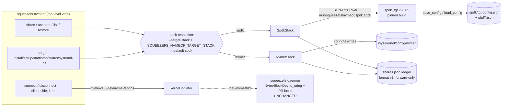

# Design Doc: SqueezeFS NVMe-oF Target Management — Dual-Stack (SPDK Default + Kernel nvmet) Ground-Up Rebuild of `src/nvmeof.rs`

| | |
|---|---|
| **Title** | NVMe-oF target management program: dual-stack target serving (SPDK JSON-RPC + kernel nvmet configfs) with SPDK as the default stack, explicit selection, loud failure, working persistence, and a real-stack fidelity test tier |
| **Author** | _(placeholder — assign on review)_ |
| **Date** | 2026-07-17 |
| **Status** | **Implemented** (rev 5, 2026-07-18 — program closed at PR 7/N7: landed-SHA table, gate ledger, design amendments, residuals, and findings index in §Program Closure Record; G5 adjudicated PASS on the product-verb A/B rerun `.benchmarks/2026-07-18-nvmeof-dual-stack-ab.md`. Was Approved rev 4: review rounds 1–3 complete, 23/23 findings resolved, verdict "Approve" 2026-07-17; all six Open Questions resolved by final user decision 2026-07-17) |
| **Repo** | `/home/justin/Source/squeezefs`, `dev` @ `49ad606` |
| **Intended home** | `docs/design-nvmeof-target-management.md` |
| **Evidence base (normative)** | `.benchmarks/2026-07-17-spdk-target-scoping.md` (full `nvmeof.rs` inventory, SPDK-vs-nvmet A/B, PR/PTPL matrix, ops notes, ranked OQs); `.benchmarks/2026-07-17-guard-pr-register-ladder.md` (S1 landed: register ladder, `wire_host_id()`, both-stack 10/10 kill-9 matrix) |
| **Engine contracts (inviolable)** | Single-writer mount guard semantics (`docs/design-metadata-throughput.md` §5.0, `src/meta_backend/reservation.rs`); AGENTS.md non-negotiables (io_uring-first on data paths, no dead code, forward-only formats, loud refusal) |
| **Related** | `tests/dev_substrate.sh` (ownership-namespacing conventions this program adopts), README §Single-writer mount guard guarantee table, QUICKSTART §4, `.agents/spdk-scoping/{rig-up,guard-smoke,pr-matrix,bench,teardown,snapshot}.sh` (fidelity-tier seed; rig scripts removed from the tree — git history at `c615e3a`) |

**Revision history**

| Rev | Date | Change |
|---|---|---|
| 0 | 2026-07-17 | Initial draft |
| 1 | 2026-07-17 | Review round 1 (17 issues) addressed. **Majors**: (1) the omitted seq128k-write A/B row restored to the evidence table + **G5 restated on named rows only** (rand4k QD32 ×2 + seq128k read ordered; seq-write/QD1 recorded-and-attributed, unordered) + a seq-write no-preference row in the §6.3 deployment-class table; (2) **write-ahead intent protocol** (§6.4 law 6: `pending`/`active`/`removing` states, record-before-mutate on share *and* unshare, reconciliation semantics, crash-window injection test) — the product can no longer strand its own crash-orphaned shares as "foreign" — and the duplicate-backing guard made **ledger + live-state** on both stacks (the old module's `bdev_get_bdevs` scan kept); (3) **PR 1 transitional contract** added (schema-v1 field-presence rules, laws live at N1 vs N2, ledger owns `loop_device` from N1, ownership = ledger membership across the NQN-prefix change, N1 restore path caveat) + the N2→N4 SPDK-unavailability window stated in Migration pt 3. **Minors**: bare-`restore` semantics fixed (replay each record to its recorded stack; `--target-stack` filters, never retargets); schema `listeners[]` array with per-listener `nvmet_port_id` + probe wrap/exhaustion refusal; hugepage rung dropped from the share preflight (start/setup-time invariant); README-caveat milestone corrected N3→N4 (§6.7, KD 5); systemd unit made runnable (baked values, `Wants=network-online.target`, StartLimit park-failed posture, current_exe path); mechanical docs land with their verbs (PR 2/PR 4), claims stay N4/N7; per-PR estimates + pre-N5 gate harness named (`.agents/spdk-scoping/` scripts) + G4's product-verb clause scoped to N4+. **Nits**: truncation-bug phrasing corrected to "never readable back" (3 sites); G3 restated as an enforceable module-graph rule; `--accept-version-drift`/`SQUEEZEFS_SPDK_TGT_BIN` placement specified; `fabric_ctrl_reconnects` respecified as a sampled-transition counter; the `fabric_*` runtime surface split out of the docs PR into **PR 6 `feat(stats)`** (docs PR renumbered PR 7); relocate-vs-fork env-seam line drawn in §6.8; control-plane Criterion exemption stated in G6. |
| 2 | 2026-07-17 | Review round 2 (5 revision-surfaced consistency issues; all 17 round-1 fixes verified, none reopened). **Issue 18**: the rev-1 live-state duplicate guard contradicted both "re-adopt by re-share" recovery exits — recovery is now **removal-first** everywhere (§Security ledger-loss story, Migration pt 1's ordered exits), the guard's refusal message is specified as the runbook (names the live holder + classification + exact removal steps), and Open Question 3's `adopt` trigger is sharpened (graduates on first field occurrence of either scenario). **Issue 19**: `ns_uuid` promoted to the **both-stack namespace identity** (SPDK `-u` pin / nvmet `device_uuid` stamp) — generated once at share, recorded, re-presented by restore; §6.6's `device_uuid` and Restore bullets updated (idempotency matches on `device_path` + `device_uuid`; the changed-identity revalidation hazard named), PR 1/PR 2 aligned — making G2's same-NQN/nsid/UUID clause achievable on the nvmet leg. **Issue 20**: SPDK persistence law extended to `restore` whenever reconciliation changed anything (re-adds, finalizations, resumed teardowns), with the share-flap and resumed-teardown-**resurrection** failure modes stated; PR 4's restore clause updated. **Issue 21**: the phantom "storm leg" replaced — the **target-restart persistence leg (G2)** is named as the gauge-consuming leg in §6.8, and **PR 6 owns the `run_nvmeof_fidelity.sh` assertion edit** (files/deps/gate + dependency graph updated: PR 6 lands after PR 5). **Issue 22**: `--accept-version-drift` rescoped to mutating verbs only — `target status` always proceeds and *reports* drift (`rpc.drift` field added to the §6.9 payload), `target stop` warns-and-proceeds (refusing shutdown on version grounds inverts the risk). |
| 3 | 2026-07-17 | **Round 3 (the approval round): verdict Approve; its one leftover nit recorded here and fixed in this revision** (the design-metadata-throughput rev-3 precedent). **Issue 23**: `--nsid`/`--ns-uuid` per-stack semantics pinned — `--ns-uuid` seeds the recorded `ns_uuid` on **both** stacks (SPDK `add_ns -u` / nvmet `device_uuid`; generated when absent), while `--nsid` is **SPDK-only**: the nvmet configfs namespace index is now stated as **structurally fixed at 1** (the module/dev_substrate/old-code convention, and what makes G2's same-nsid clause hold on that leg), so `--nsid` ≠ 1 with `--target-stack nvmet` **refuses loud** per the house norm (the `--disk-cache-paths` precedent — never a silent flag-ignore; multi-ns nvmet, if ever wanted, is a schema-visible future change). §6.2 share row, §6.4 presence rules (`nsid` never recorded on nvmet — structural; `ns_uuid` seed-or-generate), §6.5, and §6.6 all updated to agree. |
| 4 | 2026-07-17 | **All six Open Questions resolved by final user decision (binding; no re-review follows).** OQ 1 (dev_substrate `--spdk`: post-program, optional, guard suite nightly on it) and OQ 4 (`--allow-host` interim; DH-HMAC-CHAP/TLS = a separate security program) **resolved as written**. OQ 3 **changed — the `nvmeof adopt <subnqn>` verb is built in this program**: new **PR 4b** (~1 wk) inserted after PR 4, spec'd as **§6.10** (explicit operator action; classify the live foreign object; duplicate-guard refusal classes; absorb via the intent protocol with `adopted_from` provenance; both stacks; tests-first + two fidelity legs — pre-rebuild-style configfs adopt, adopt-after-simulated-ledger-loss); the two funneling exits (Migration pt 1, Security ledger-loss) now name `adopt` as the managed path once PR 4b lands, removal-first remaining the pre-4b guidance; schema gains optional `adopted_from`. OQ 2 **changed** — PR 7's A/B rerun gains **2- and 4-reactor spdk_tgt scaling rows** (TCP-localhost-bound caveat stated; +~1 day, PR 7 ≈ 1.2 wk); dynamic scheduler/interrupt mode stays deferred. OQ 5 **changed** — PR 5 gains a **soft-RoCE (rdma_rxe over loopback) plumbing-validation leg** (explicitly not representative of real RNIC behavior; real-RDMA validation stays deferred to hardware; +~2–3 days, PR 5 ≈ 2 wk). OQ 6 **resolved as written, made concrete** — a named **`bdev_uring` vs `bdev_aio` row** in PR 7's rerun (switch-only-if-data-says-so posture). Dependency graph, PR numbering (4b letter-inserted to keep all cross-references stable), and the total estimate (**~11 weeks**) updated; Open Questions section converted to the resolved record. |
| 5 | 2026-07-18 | **Program closure (PR 7/N7): Status → Implemented.** Landed-SHA table, per-PR gate ledger, named residuals, and findings index recorded in **§Program Closure Record**; **G5 adjudicated PASS** on the product-verb A/B rerun (`.benchmarks/2026-07-18-nvmeof-dual-stack-ab.md`) incl. the rev-4 recorded rows — 2-/4-reactor scaling (TCP-localhost-bound; one-reactor default confirmed) and `bdev_uring` vs `bdev_aio` (uring writes 0.51×, tails 2–2.8× worse → **aio stays**; the switch-only-if-data-says-so posture discharged *with* data). Two implementation judgment calls **folded as design amendments**: (1) **PR 2** — `ShareRecord` gains the optional **`allow_hosts`** allowlist field (§6.4 presence rules; `restore` must re-present the allowlist — a restored share never silently widens to allow-any; absent-not-`[]` keeps N1-era byte-compatibility); (2) **PR 4b** — `adopt_shape_unsupported` gains the **listener-less** rung (§6.10 pt 2; a subsystem with no fabric presence violates the §6.4 `listeners ≥ 1` law — nothing an initiator can reach, nothing the ledger can represent). PR 5's soft-RoCE **residuals named** as future-program pointers (product listener plumbing cannot express `trtype=rdma`; the pinned SPDK build is TCP-only). Findings indexed: FIND-N3-A/B, FIND-N6-A. |

---

## Overview

`src/nvmeof.rs` (1,549 lines) is the repo's oldest untouched surface: a JuiceFS-derived, `#![allow(clippy::all)]`-exempted module whose target-serving half has **never worked in production** — its share registry truncates itself to `[]` on every root invocation (`get_shares_config_path()`, nvmeof.rs:1019–1033), so the duplicate-share guard, `restore-shares`, and SPDK-share `unshare` dispatch have been dead since inception; its configfs bookkeeping writes fake files into configfs (impossible on a real kernel, silently swallowed); its port-id allocation collides by construction with any other configfs tenant; its `spdk-install` builds unpinned master into `/opt/spdk`; its `spdk-start` is a fire-and-forget with no pidfile, config, or restart story; and **every test is mock-mode only** (`SQUEEZEFS_MOCK_NVMEOF=1`). The 2026-07-17 scoping pass inventoried all of this and measured the two candidate target stacks head-to-head.

This program rebuilds the module ground-up as a **dual-stack target manager**: `squeezefs nvmeof` sets up and manages **both** SPDK (`spdk_tgt`, JSON-RPC, pinned v26.05) and kernel nvmet (configfs), with **SPDK as the default** and nvmet a first-class, explicitly selected alternative (`--target-stack nvmet`). Selection is explicit and failure is loud — if the chosen stack cannot serve, the verb fails with actionable remediation; there is **no silent cross-fallback**. Persistence moves to a mechanism that actually works: SPDK's native `save_config`/`load_config` (proven round-tripping reservations + PTPL in the scoping pass) as the SPDK source of truth, plus a slim versioned, forward-only share ledger for cross-stack dispatch and nvmet restore. The single-writer guard is already portable across both stacks (S1, landed at `cfe0ff1`/`49ad606`: the PR register ladder + `wire_host_id()`, kill-9 remount 10/10 on both). The mock-only-test era ends: a dual-stack **fidelity test tier**, seeded from the scoping rig and driven by the product's own lifecycle verbs, runs the guard PR suite, the nvmeof verb round-trips, and a curated fabric subset against **both real stacks** at per-PR and nightly cadences. The client/initiator side is untouched: the daemon stays on kernel io_uring, the kernel initiator, and kernel PR ioctls.

---

## Binding User Decisions (final — this design operates within them)

Recorded verbatim so no review round relitigates them:

1. **Dual-stack**: `squeezefs nvmeof` sets up and manages BOTH target stacks — kernel nvmet AND SPDK. **SPDK is the default/preferred**; nvmet is a first-class, explicitly-selected alternative (`--target-stack nvmet`).
2. **Explicit choice, loud failure — no silent cross-fallback.** SPDK setup failure (missing binary, no hugepages, RPC dead) fails loud with actionable guidance; never quietly degrades to nvmet. Symmetrically for nvmet.
3. **Client/initiator side is out of scope.** The daemon stays on kernel io_uring (`NvmeBlockDev`), the kernel initiator (`nvme connect` / `/dev/nvme-fabrics`), and kernel PR ioctls. No SPDK on the consume side.
4. **Test-fabric posture**: `tests/dev_substrate.sh` stays kernel nvmet-loop as the default dev substrate. This program delivers a **dual-stack target-fidelity test tier** (writer-guard PR suite + nvmeof verb tests + fabric subset against BOTH real stacks), driven by the product's own lifecycle code. An optional `dev_substrate.sh --spdk` mode may come **after** the product ships SPDK management (recorded as an open question, not in this program's scope).
5. **SPDK-as-default is gated on the PR/guard evidence** (green post-S1) and **stated per-deployment-class honestly**: the scoping A/B showed SPDK wins QD32 throughput/tails but costs a dedicated poller core and loses QD1 latency on TCP-localhost single-reactor (§6.3 deployment-class table; every SPDK perf claim in docs carries the per-core-honesty framing).

---

## Background & Motivation

### What exists today (verified against `dev` @ `49ad606`)

The full inventory is `.benchmarks/2026-07-17-spdk-target-scoping.md` §1; the load-bearing facts:

| Fact | Where | Consequence |
|---|---|---|
| **Registry truncation bug**: running as root, `get_shares_config_path()` does `fs::write(&path, "[]")` as its writability probe **on every resolution**, i.e. `load_shares()` truncates `/etc/squeezefs/nvmeof_shares.json` before reading it | `src/nvmeof.rs:1019–1033` | duplicate-share guard never fires; `restore-shares` restores nothing; `unshare` of an SPDK share never detects `is_spdk` and falls into the configfs branch → NotFound. **Share persistence has never worked in production — and nobody noticed** (the strongest liveness signal in the module) |
| **Configfs fake-file bookkeeping**: loop association recorded via `fs::write(sub_dir/"associated_loop_device")` *inside configfs* — configfs forbids arbitrary file creation, the write fails silently (`let _ =`) | `src/nvmeof.rs:207–210`, read back at `:530–532` | loop detach on `unshare` never fires outside the mock |
| **Port-id collision hazard**: ports allocated as "next free small integer" (1, 2, 3…) — exactly the id namespace `tests/dev_substrate.sh` defends against with `SQZ_DEVSUB_PORT_ID=52026` ("ports carry no name") | `src/nvmeof.rs:214–247` | any other configfs tenant (dev substrate, another harness, an operator's hand-built port) can be adopted/clobbered |
| **Silent 1 GiB sparse auto-create** on a missing backing path (typo ⇒ new file) | `src/nvmeof.rs:115–123` | destructive-adjacent side effect on typos |
| **`spdk_install` clones unpinned master** to `/opt/spdk`, runs `pkgdep.sh` (mutates system packages), `pip3 --break-system-packages` | `src/nvmeof.rs:1120–1210` | irreproducible builds; v26.09 already announces API removals — master is a moving hazard |
| **`spdk_start` is fire-and-forget**: detached `nvmf_tgt -i 0 -m 0x1`, stdout/stderr → null, `pgrep` dedupe, no pidfile/config/restart story; RPC-built state is volatile across restarts | `src/nvmeof.rs:1310–1348` | a target restart silently drops every subsystem; initiators enter ~10-min reconnect storms |
| **`share_target_spdk` pins neither `nsid` nor ns UUID nor `ptpl_file`** | `src/nvmeof.rs:414–429` | reservation persistence never configured; PTPL state binds to ns UUID, so restart restore refuses (scoping §4 pt 1) |
| **Mock-only tests**: every path short-circuits on `SQUEEZEFS_MOCK_NVMEOF=1` before touching a kernel or an SPDK socket | `tests/nvmeof_tests.rs` (297 lines), `is_mock()` branches throughout | zero real-stack coverage ever |
| **Dead code**: `extract_nvmeof_connection_details` (`pub`, zero callers), `SqueezefsError::NvmeOfBackend` (constructed nowhere, `src/error.rs:17`), `#![allow(clippy::all)]` header, JuiceFS copyright header on a file that is now mostly rebuilt | `src/nvmeof.rs:960+`, `src/error.rs:17/64` | violates the house no-dead-code rule |
| **The one battle-tested part**: `ensure_nocow_backing()` — btrfs `FS_NOCOW_FL` guard with real unit tests (`nocow_tests`), born from a live fabric wedge (commit `eafab6c`) | `src/nvmeof.rs:1360–1450` | **keep** |
| **The kept client half**: `connect`/`disconnect`/initiator `list` (nvme-cli shell-out + `/dev/nvme-fabrics` fallback), and the `/etc/nvme/hostnqn|hostid` identity convention (`get_host_nqn()`/`get_host_id()`) that `reservation.rs::host_identity()` reads | `src/nvmeof.rs:579–816` | **keep** (binding decision 3; guard dependency) |

### What the scoping pass measured (the ground truth this design builds on)

**A/B, SPDK v26.05 (tag, sha `d519b163cbc0e2f28c35d9bc86d610da368b032c`) vs kernel nvmet, NVMe/TCP localhost, zram-backed, fio-3.42/io_uring, n=3 medians** (scoping §3.2–3.3):

| Row | spdk-tcp | nvmet-tcp | Read |
|---|---|---|---|
| rand4k read QD32 | **126.4 k IOPS**, p99 872 µs | 112.6 k, p99 387 µs | SPDK +12 % |
| rand4k write QD32 | **45.5 k IOPS**, p99 888 µs | 37.3 k, p99 1,581 µs | SPDK +22 %, 1.8× tighter tail |
| seq128k read QD8 | **2,304 MB/s** | 1,406 MB/s | SPDK +64 % |
| seq128k write QD8 | 200 MB/s (1,600 IOPS), p99 **7,110 µs** | **238 MB/s (1,903 IOPS)**, p99 8,978 µs | nvmet marginally ahead; both arms collapse vs the loop reference's ~1.5 GB/s zram ceiling — scoping attributes it as a transport/backing interaction, **arm-symmetric, not an SPDK-vs-nvmet differentiator** |
| rand4k read QD1 | 57.3 k, p50 11 µs | **101.8 k, p50 5 µs** | nvmet wins the latency floor |
| rand4k write QD1 | 27.6 k, p50 30 µs | **35.9 k, p50 23 µs** | nvmet wins |
| per-core honesty | ~21.0 k IOPS/system-core; **1 reactor burns 0.82–0.99 core under load and ~100 % idle** | ~23.9 k IOPS/system-core | SPDK's queued-row wins come from its dedicated poller, not lower total system cost |
| nvmet-loop reference | 4–30× faster than either TCP arm | — | the dev substrate stays loop (speed substrate); the TCP tiers are behavior-fidelity substrates |

**PR/PTPL matrix** (scoping §4, corrected by the S1 session): SPDK `RESCAP=0xff` incl. **PTPL bit**; register/acquire/fence(EBADE)/preempt/release all behave exactly as `reservation.rs` expects; **PTPL state survives `spdk_tgt` SIGKILL → relaunch → `load_config`** (holder key/rtype restored from `ptpl_file`) but **binds to the namespace UUID** — re-adding with a fresh auto-UUID bdev refuses loud, so `-n nsid -u uuid` pinning is mandatory. Kernel nvmet: PR-capable with `resv_enable=1` but **PTPL=0** — reservations do not survive target power cycles there (the guard's heartbeat re-check heals, `writer_guard_pr_reacquires`). **Both stacks measured spec-strict on Register** (the M1-era "nvmet is lenient" note only covered same-key idempotency) — which is why S1's register ladder governs both.

**S1 is landed** (`fa0a6fd` RED → `cfe0ff1` fix → `49ad606` docs): `register_ladder()` in `src/meta_backend/reservation.rs` (~line 170) — plain register → on conflict, `wire_host_id()` (Get-Features FID 0x81; authoritative over the `/etc/nvme` files, which measurably diverge) → Report → unregister *own* stale key(s) only → fresh register; foreign registrations fail closed. Kill-9 → remount **10/10 on both stacks**, PTPL survive-restart proven, `FakeReservationClient` gained `RegisterSemantics::{SpecStrict,LenientReplace}`. This design treats S1 as done and builds on it.

### Why now

The guard evidence gate for SPDK-as-default is green (binding decision 5). The module's broken persistence is a live operator trap (a `share` that silently forgets itself across target restarts, on the stack whose restarts drop all namespaces). And the metadata-throughput program's guarantee table (README:292) already carries a forward reference this program must discharge: *"Note today's `share --spdk` does not yet pin ns UUID / `ptpl_file` — that lands with the SPDK-target program (scoping §5)."*

---

## Goals & Non-Goals

### Goals (program gates — measured, real-kernel)

| # | Gate | Method / number |
|---|---|---|
| G1 | **Dual-stack share/unshare/list/restore round-trip, real kernels, zero mocks** | root-tier test: share (file + block backing) → connect → dd IO → unshare → **zero residue** (snapshot before/after), on BOTH stacks, driven by product verbs |
| G2 | **Persistence actually works** | target restart (SPDK: SIGKILL `spdk_tgt` → start → restore; nvmet: configfs wipe → restore) → shares reappear under the same NQN/nsid/UUID → initiators reattach without operator action; ledger load-never-writes regression test (named for the truncation bug) |
| G3 | **Loud-fail matrix** | each preflight failure (missing binary, wrong version, no hugepages, RPC dead, module missing, configfs absent) produces its designed message with remediation verbs; asserted by tests; **zero cross-stack fallback paths in code**, enforced as a **module-graph rule**: `src/nvmeof/spdk/` carries no `use`/path reference to `nvmet` items and vice versa (one CI grep + a unit-test pin), and the preflight-message tests assert the other stack appears in output only as explicit operator-guidance text |
| G4 | **Dual-stack guard matrix stays green through the rebuild** | productized `guard-smoke` (kill-9 remount ×10, PTPL power-cycle leg on SPDK, claim-clear laws, clean-unmount zero PR residue) green on both stacks; **from N4 on, against namespaces shared by the product's own verbs** (not the rig's raw rpc.py/configfs plumbing) — through N2–N3 the matrix rides rig-shared namespaces exactly as S1 did (the verbs able to satisfy the clause do not exist yet) |
| G5 | **A/B rerun on the fidelity rig** with the shipped verbs standing up the targets; **per-core honesty stated in every SPDK perf claim** (README/QUICKSTART/benchmarks) | `.benchmarks/` note gating on **named rows only**: spdk ≥ nvmet on **rand4k read QD32, rand4k write QD32, and seq128k read QD8** (all three already true on the scoping rig). **seq128k write QD8 and the two QD1 rows are recorded, not ordered**: QD1 documented as accepted (nvmet wins the latency floor), seq-write documented with its scoping attribution (arm-symmetric TCP/backing collapse, nvmet marginally ahead — 238 vs 200 MB/s). A faithful rerun must reproduce the full six-row table, not a subset |
| G6 | **House hygiene** | `#![allow(clippy::all)]` gone; dead code deleted; full cargo gate green per commit; no `let _ =` swallows on teardown/persistence edges (every ignored error is either impossible-by-construction with a comment, or logged). **Criterion posture, stated**: the control-plane verb surface is exempt from the per-public-fn Criterion rule — root-only one-shot admin I/O benches would measure the kernel/RPC peer, not our code; perf claims live in the fidelity-tier A/B instead (mirrors the io_uring control-plane carve-out §6.1 cites) |

### Non-Goals

- **Client/initiator SPDK** — out of scope by binding decision 3. The daemon's data path stays `NvmeBlockDev` io_uring + kernel initiator + kernel PR ioctls.
- **PCIe passthrough backing (`spdk-bind`/`spdk-unbind`, vfio/uio, `bdev_nvme`)** — deleted in v1, recorded in the removed-verbs ledger. Scoping Q9 answered: the A/B and guard evidence cover `bdev_aio` over kernel block nodes only; vfio bind mutates system driver bindings (can detach a system disk), and the fidelity rig has no spare PCIe NVMe to test it. A passthrough-backing program can revive it with its own evidence.
- **RDMA transport support** — TCP is the only **supported/preflighted** transport in v1 (transport plumbing is structured so `trtype` is a parameter). PR 5 adds a **soft-RoCE plumbing-validation leg** (rdma_rxe over loopback) that keeps the `trtype` parameter honest — explicitly **not** representative of real RNIC behavior; real-RDMA support/validation stays deferred to hardware (user decision, Resolved Questions #5).
- **In-band auth (DH-HMAC-CHAP) and NVMe/TCP TLS** — noted in Security; not in v1 (user decision, Resolved Questions #4: a separate security program; `--allow-host` is the interim).
- **`dev_substrate.sh --spdk`** — explicitly deferred until after the product ships SPDK management (binding decision 4; user-resolved as written, Resolved Questions #1: optional mode, guard suite nightly on it once it exists). The default dev substrate stays kernel nvmet-loop.
- **Dynamic scheduler / interrupt-mode measurement** — still a future program. **Multi-reactor scaling is no longer a non-goal**: PR 7's A/B rerun measures 2- and 4-reactor spdk_tgt rows (TCP-localhost-bound caveat stated — user decision, Resolved Questions #2); v1 still defaults to one reactor core and claims nothing beyond its own rows.
- **Discovery service management** — targets are connected by explicit NQN as today.

---

## Proposed Design

### 6.1 Architecture

`src/nvmeof.rs` becomes a directory module (`src/meta_backend/` precedent):

```
src/nvmeof/
├── mod.rs         # public surface, StackKind, stack resolution (flag > env > default spdk)
├── stack.rs       # TargetStack trait + ShareRequest/ShareRecord/TargetStatus types
├── spdk/
│   ├── mod.rs     # SpdkStack: preflight, share/unshare/restore, save_config law
│   ├── rpc.rs     # JSON-RPC 2.0 client v2 (timeouts, id counter, version handshake)
│   ├── lifecycle.rs # target install/start/stop/status, pidfile, systemd-unit emission
│   └── hugepages.rs # sizing rule, reservation, preflight math
├── nvmet.rs       # NvmetStack: configfs plumbing, port allocator, loop handling
├── ledger.rs      # versioned forward-only share ledger (atomic write, load-never-writes)
├── initiator.rs   # KEPT: connect/disconnect/connected-disk listing, /etc/nvme identity
└── nocow.rs       # KEPT: ensure_nocow_backing + nocow_tests (moved verbatim)
```

Provenance note: `initiator.rs` and `nocow.rs` carry retained/derived code and keep the existing Apache-2.0 header; ground-up files are new. The module-wide `#![allow(clippy::all)]` does not survive into any file.



**io_uring-first note**: everything here is mount-time/admin control plane — one-shot RPC over a unix socket, configfs writes, nvme-cli shell-outs. The design explicitly rides the sanctioned precedent already documented in `src/meta_backend/reservation.rs`: *"io_uring-first governs data paths, not mount-time admin plumbing — the nvmeof.rs nvme-cli precedent."* No data path is touched.

**The `TargetStack` trait** (the `ReservationClient` trait precedent — small, synchronous one-shot verbs, testable seams without env-var mocks):

```rust
/// One NVMe-oF target stack the product can manage. Implementations:
/// `SpdkStack` (JSON-RPC to spdk_tgt) and `NvmetStack` (kernel configfs).
/// Methods are synchronous one-shot control-plane operations (CLI-driven).
pub trait TargetStack: Send + Sync {
    fn kind(&self) -> StackKind; // Spdk | Nvmet

    /// Loud, actionable, ordered checks. Every error names its remediation
    /// verb. NEVER returns a suggestion to fall back to the other stack as
    /// an automatic action — only as an explicit operator choice in text.
    fn preflight(&self, op: PreflightOp) -> Result<(), PreflightError>;

    fn share(&self, req: &ShareRequest) -> Result<ShareRecord, NvmeofError>;
    fn unshare(&self, rec: &ShareRecord) -> Result<(), NvmeofError>;

    /// Live state as the stack reports it (RPC get_subsystems / configfs walk)
    /// — reconciled against the ledger by `list` (managed / down / foreign).
    fn live_shares(&self) -> Result<Vec<LiveShare>, NvmeofError>;

    /// Re-establish every ledger share (idempotent; per-share errors are
    /// collected, not short-circuited — a report, not a first-failure bail).
    fn restore(&self, recs: &[ShareRecord]) -> Result<RestoreReport, NvmeofError>;

    fn target_status(&self) -> Result<TargetStatus, NvmeofError>;
}
```

### 6.2 CLI / API surface

The verb set moves from `squeezefs storage nvmeof …` to a **top-level `squeezefs nvmeof …`** (binding decision 1 names it so; the old path is recorded in the removed-verbs ledger so stale scripts fail comprehensibly — the `defrag`/`--local-ips` precedent, README:266).

| Verb (new) | Replaces | Notes |
|---|---|---|
| `nvmeof share <backing> --ip <ip>[,…] [--port 4420] [--subnqn N] [--target-stack spdk\|nvmet] [--nsid 1] [--ns-uuid U] [--create-size <sz>] [--allow-host <nqn>]…` | `storage nvmeof share [--spdk]` | default stack **spdk**; missing backing path **refuses loud** (the silent 1 GiB sparse auto-create is deleted; `--create-size` is the explicit opt-in); NoCOW guard on file backings (both stacks); default NQN `nqn.2026-07.io.squeezefs:share-<uuid>` (ownership prefix — distinguishable from devsub/foreign). **Per-stack flag semantics**: `--ns-uuid` seeds the recorded `ns_uuid` on **both** stacks (SPDK `add_ns -u` / nvmet `device_uuid`), generated when absent; `--nsid` is **SPDK-only** — the nvmet namespace index is structurally fixed at 1 (§6.6), so `--nsid` ≠ 1 with `--target-stack nvmet` **refuses loud** (the `--disk-cache-paths` precedent: never a silent flag-ignore) |
| `nvmeof unshare <subnqn>` | `storage nvmeof unshare [--spdk]` | stack resolved from the **ledger** — including `pending`/`removing` intent records (§6.4 law 6), so a crash-window share stays ours to remove; never guessed; NQN absent from the ledger ⇒ refuse loud, print `list` guidance + manual remediation for pre-rebuild/foreign shares (we never tear down objects we did not record — the dev_substrate ownership law) |
| `nvmeof list [--json]` | `storage nvmeof list` | reconciliation states: **managed** (ledger `active` ∩ live), **down** (ledger ∖ live — restore candidates), **pending**/**removing** (intent records from an interrupted verb, §6.4 law 6, with the reconciliation action named), **foreign/unmanaged** (live ∖ ledger — displayed, never touched); plus the kept connected-fabric-disks section |
| `nvmeof restore [--target-stack …]` | `storage nvmeof restore-shares` (never worked) | bare `restore` replays **every** ledger record into its **recorded** stack (both stacks touched when both have records); `--target-stack X` is a **filter** (only records recorded for X), **never a retarget**; reconciles `pending`/`removing` intents (§6.4 law 6); per-share result report; idempotent |
| `nvmeof adopt <subnqn>` | *(new — PR 4b, user decision)* | **explicit operator action** absorbing a live **foreign** (unledgered) share into management — §6.10: classifies the live object (stack auto-detected, backing, listeners, identity), refuses loud on the named classes (already-ledgered, backing live-duplicated — the duplicate-guard laws apply — harness-owned NQN, unsupported shape), absorbs via the intent protocol with `adopted_from` provenance; **mutates no target state**; both stacks |
| `nvmeof target install [--version v26.05] [--with-pkgdep]` | `spdk-install` | SPDK only; pinned tag + sha verification (§6.5); `--with-pkgdep` is the explicit opt-in for system package mutation (default: preflight lists missing toolchain and stops) |
| `nvmeof target setup [--hugemem-mb 2048]` | `spdk-setup` | hugepage reservation with recorded-prior + preflight math (§6.5); for nvmet: modprobe + configfs mount checks |
| `nvmeof target start [--target-stack …] [--core-mask 0x… \| --cores N] [--dpdk-mem-mb 1024]` | `spdk-start` | SPDK: preflighted spawn with pidfile + RPC-liveness wait + `load_config`; nvmet: modprobe + `restore` (configfs is the "running target") |
| `nvmeof target stop` | *(new)* | SPDK: `save_config` → SIGTERM by pidfile → grace → SIGKILL; refuses while ledger shares are live-connected unless `--force` |
| `nvmeof target status [--json]` | *(new)* | §6.9 observability payload |
| `nvmeof target systemd-unit [--target-stack …]` | *(new)* | emits a unit to stdout, **never installs** (the `dev_substrate.sh systemd-unit` precedent) |
| `nvmeof connect --ip … [--port 4420] --subnqn …` / `nvmeof disconnect <subnqn>` | `storage nvmeof connect/disconnect` | **kept behavior** (client side; nvme-cli with `/dev/nvme-fabrics` fallback; `/etc/nvme/hostnqn|hostid` create-if-missing convention preserved) |
| *(deleted)* | `spdk-bind`, `spdk-unbind` | removed-verbs ledger: PCIe vfio passthrough backing is a future program; v1 serves kernel block nodes and files via `bdev_aio` |

**Stack selection resolution order** (applies to the verbs that *create* or *target-manage*: `share`, `target …`): `--target-stack` flag > `SQUEEZEFS_NVMEOF_TARGET_STACK` env > **default `spdk`**. Verbs acting on **existing** shares (`unshare`, `restore`) use each record's ledger-recorded stack — a share is owned by exactly one stack for its lifetime; on `restore` the flag filters, never retargets (see table).

**Loud-fail semantics** (binding decision 2). Every verb runs the selected stack's preflight ladder first; failures are structured, ordered, and name the remediation. Example (SPDK share with dead RPC):

```text
error: SPDK target stack unavailable: RPC socket /run/squeezefs/nvmeof/spdk.sock not answering (connect timed out after 5 s)
  the target is not running or is unresponsive:
    check:  sudo squeezefs nvmeof target status
    start:  sudo squeezefs nvmeof target start
  if you intended the kernel target stack, select it explicitly:
    sudo squeezefs nvmeof share … --target-stack nvmet
note: SqueezeFS never falls back between target stacks automatically —
      they differ in reservation persistence (PTPL) and latency envelope.
```

The SPDK preflight ladder for `share`: (1) pinned binary present (or `SQUEEZEFS_SPDK_TGT_BIN` override — loud unpinned warning), (2) `spdk_tgt` process alive per pidfile/systemd, (3) RPC answers `spdk_get_version` within timeout, (4) reported version matches the pinned tag (mismatch = loud warn + proceed only with `--accept-version-drift`). Hugepage-pool checks (free ≥ configured DPDK mem) live at `target setup`/`target start` **only** — by share time a healthy running target has already mapped its DPDK memory from the pool, so kernel free-page counts are *expected* to be low (§6.9's own example shows `free_2m: 900` of 1024 on a healthy node); share-time allocation pressure surfaces as typed RPC errors and on the `target status` hugepage gauges instead. The nvmet ladder: (1) `nvmet`+`nvmet-tcp` modules loadable, (2) configfs mounted, (3) port allocator can produce a non-foreign id, (4) `resv_enable` knob presence probed (absence ⇒ loud note that the writer guard lands detection-grade on this namespace, not a failure).

**Flag/override placement**: `--accept-version-drift` is honored by the **mutating** RPC verbs — `share`, `unshare`, `restore`, `target start` — gating preflight rung 4 wherever that rung runs. Two deliberate exemptions: **`target status` never refuses on drift** — the diagnostic verb must run against exactly the drifted target it exists to diagnose; it always proceeds and *reports* (`rpc.drift: true` in the §6.9 payload, with the pinned tag alongside). **`target stop` downgrades rung 4 to warn-and-proceed** — refusing shutdown on version grounds inverts the risk (a running drifted target is the hazard, not the stop), and the SIGTERM-by-pidfile half of stop needs no RPC at all (only the best-effort `save_config` does). `SQUEEZEFS_SPDK_TGT_BIN` substitutes the pinned binary path for all six verbs' preflights and for `target start` (rig/dev use — the fidelity tier points it at the sanctioned `/var/tmp/spdk-scoping` build; always with the loud unpinned warning); `target install` ignores it (install always builds the pin).

### 6.3 SPDK-default posture, stated per deployment class (binding decision 5)

The default is **spdk everywhere** — one default, no auto-switching. The docs (README + QUICKSTART §4) ship this table so the explicit `--target-stack nvmet` choice is an informed one:

| Deployment class | Guidance | Measured basis (scoping §3) |
|---|---|---|
| Dedicated storage/target node; queued I/O (the product's data-path shape: QD32 4 KiB blocks, QD8 sequential streams) | **spdk (default)** | +12 % rand-read QD32, +22 % rand-write QD32 with a 1.8× tighter write p99, +64 % seq-read; PTPL reservation persistence; the dedicated poller core is the entry price and is available on this class |
| Converged node (target + daemon + apps), core-constrained | consider `--target-stack nvmet` | SPDK's default reactor busy-polls ~100 % of one core even idle; per-system-core efficiency is at parity (~21.0 k vs ~23.9 k IOPS/system-core on rand-read QD32) — SPDK's absolute wins come from the dedicated poller, not lower total cost |
| QD1-latency-dominated consumers | consider `--target-stack nvmet` | kernel target completes inline in softirq: 5 µs vs 11 µs p50 read, 23 µs vs 30 µs write at QD1 (TCP-localhost, single reactor) |
| Sequential-write-heavy service | **no stack preference from the evidence** | seq128k write QD8 collapsed on **both** TCP arms (spdk 200 vs nvmet 238 MB/s, nvmet marginally ahead, against the loop reference's ~1.5 GB/s zram ceiling) — an arm-symmetric transport/backing interaction, not a stack differentiator; choose on the other rows |
| Locked-down hosts (no hugepages, no out-of-distro binaries) | `--target-stack nvmet` | zero extra install; PR-capable (`resv_enable=1`) but no PTPL — the guard's heartbeat law covers target power cycles there |

Every SPDK perf claim in shipped docs carries the per-core framing (program gate G5).

### 6.4 State & persistence (replacing the truncation-bug registry)

Three state homes, all root-owned:

| Path | Contents | Lifetime |
|---|---|---|
| `/var/lib/squeezefs/nvmeof/` (`SQUEEZEFS_NVMEOF_STATE_DIR` override for tests) | `shares.json` (the ledger), `spdk/tgt-config.json` (SPDK-native `save_config` output — the SPDK source of truth), `spdk/ptpl/<ns-uuid>.json` (reservation persistence files), `spdk/build-info.txt` (provenance) | persistent, **cluster-critical** (backup story in §Security) |
| `/run/squeezefs/nvmeof/` (`SQUEEZEFS_NVMEOF_RUN_DIR`) | `spdk.sock` (RPC, 0600), `spdk_tgt.pid` | tmpfs, reboot-cleared |
| `/opt/squeezefs/spdk/<tag>/` | the pinned SPDK build (never `/opt/spdk`, never system-wide) | per-version, immutable after install |

**The ledger** (`ledger.rs`) is deliberately slim — it exists for exactly five jobs the SPDK-native config cannot do: (a) nvmet restore, (b) `unshare` stack dispatch, (c) the **cross-stack** duplicate-backing guard (a path shared via nvmet must refuse an SPDK share of the same canonical path and vice versa), (d) `list` ownership metadata, (e) the **crash-window intent records** (law 6 below). The duplicate guard is deliberately **not ledger-only**: it consults the ledger *and live state on both stacks* — the SPDK `bdev_get_bdevs` aio-filename scan (the one duplicate check the old module got right, kept from scoping §1.2) plus the configfs `device_path` walk — so a crash-window or foreign share of the same backing still refuses. **The refusal message is the runbook**: it names the live holder (NQN, stack, and its classification — managed / `pending` / `removing` / foreign) and the exit — `unshare` for anything ledgered, the exact manual configfs/`rpc.py` removal steps for foreign objects — because **removal-first is the only re-share path while the old object serves** (the ordering §Migration pt 1 and §Security's ledger-loss story now state) — or, once PR 4b lands, the **`adopt` verb** (§6.10) collapses it to one step by absorbing the live object instead of tearing it down. SPDK subsystem/bdev/listener details remain authoritative in `tgt-config.json`.

Schema (forward-only, versioned header — the house superblock/format pattern):

```json
{
  "format": 1,
  "shares": [
    {
      "subnqn": "nqn.2026-07.io.squeezefs:share-6f0c1b2e",
      "stack": "spdk",
      "state": "active",
      "backing_path": "/dev/zram3",
      "backing_canonical": "/dev/zram3",
      "nsid": 1,
      "ns_uuid": "e2b1c9a4-52d1-4a08-9f31-7c2b8d1e0aa1",
      "listeners": [
        { "ip": "10.10.10.50", "port": 4420, "nvmet_port_id": null }
      ],
      "bdev_name": "sqz_aio_6f0c1b2e",
      "ptpl_file": "spdk/ptpl/e2b1c9a4-52d1-4a08-9f31-7c2b8d1e0aa1.json",
      "loop_device": null,
      "created_utc": "2026-07-17T14:02:11Z"
    }
  ]
}
```

Field-presence rules (the law-3 nullability contract): **required on every record** — `subnqn`, `stack`, `state` (`pending` | `active` | `removing`), `backing_path`, `backing_canonical`, `listeners` (≥ 1 entry; `ip`+`port` required per entry), `created_utc`. **Optional (`Option` in the Rust type)** — `ns_uuid` is the **namespace identity UUID on BOTH stacks** (SPDK: the `add_ns -u` pin; nvmet: the `device_uuid` stamp), seeded by `--ns-uuid` or generated once at share time and populated on every share from its stack's rebuild PR on (N2 nvmet / N4 spdk; null only on N1-era records, whose old paths stamp/pin nothing — PR 1 transitional contract); `nsid`/`ptpl_file`/`bdev_name` are SPDK-only (null on nvmet, whose namespace index is structurally fixed at 1 and therefore never recorded — §6.6); `loop_device` + per-listener `nvmet_port_id` are nvmet-only (null on SPDK, where listeners need no id bookkeeping — each nvmet (ip, port) listener is its own configfs port object with its own recorded id, §6.6); `adopted_from` (either stack) is the adoption-provenance object written only by `nvmeof adopt` (§6.10) — `{"utc": …, "class": "pre-rebuild" | "foreign" | "ledger-loss"}`, surfaced by `list`, absent on shares created by `share`; **`allow_hosts`** (either stack) is the `--allow-host` allowlist *(design amendment, rev 5 — PR 2 judgment call)*: recorded so **`restore` re-presents the allowlist — a restored share must never silently widen to allow-any**, and **absent (not `[]`) on allow-any shares** so records without an allowlist stay byte-compatible with N1 readers (the `adopted_from` schema-visible-v1-addition pattern).

Laws (each pinned by a test):

1. **Load never writes.** The regression test is named for the bug: `test_ledger_load_never_writes_truncation_bug_regression` — `load()` on a read-only filesystem succeeds; a byte-identical file survives 1,000 loads.
2. **Writes are atomic and serialized**: read-modify-write under `flock` on `shares.json.lock`; write `shares.json.tmp` → `fsync` → `rename` → `fsync` parent dir. (Control plane: std fs is sanctioned here, per the reservation.rs precedent; no uring requirement.)
3. **Forward-only**: `"format" > 1` ⇒ refuse loud ("created by a newer squeezefs; upgrade"). Unknown fields within v1 are an error, not ignored (no silent partial reads); **absent optional fields are legal** per the field-presence rules above.
4. **Reconciliation, never blind trust**: every verb that acts on a record first checks live state; `restore` is idempotent (an already-live share is a verified no-op); `unshare` of a ledger record whose live object vanished cleans the ledger entry and says so.
5. **Bookkeeping lives here, never in configfs** — the loop-device association (`loop_device`) and nvmet port ids are ledger fields; nothing is ever written into configfs except real kernel attributes (fixes the fake-file bug structurally).
6. **Write-ahead intent (the crash-window law)**: `share` appends its record with `state:"pending"` **before the first stack mutation** and flips it to `"active"` only after the last mutation succeeds (SPDK: after `save_config`); `unshare` flips the record to `"removing"` **before the first teardown write** and deletes it only after teardown (+ SPDK `save_config`) completes. A crash/SIGKILL/power-cut in any window therefore leaves an intent record that still *claims* the objects: `list` shows `pending`/`removing` records distinctly with the reconciliation action named; `restore` reconciles them (a `pending` record whose live objects exist and match ⇒ finalized `active`; one with no live objects ⇒ garbage-collected with a loud line; `removing` ⇒ teardown resumed); and `unshare` accepts them. **The product can never strand its own share as "foreign"** — mutate-first/record-last ordering is forbidden on both verbs. Pinned by a crash-window injection test in the fidelity tier (kill the CLI between RPC/configfs steps).

**SPDK persistence law**: every SPDK verb that **mutated target state** ends with RPC `save_config` to `spdk/tgt-config.json` (atomic tmp+rename, same discipline) — `share`, `unshare`, **and `restore` whenever its reconciliation changed anything** (re-added subsystems, finalized `pending` intents, resumed `removing` teardowns; a no-op restore skips it). The restore clause is load-bearing under law 6: a restore that re-adds a subsystem without saving leaves `tgt-config.json` — "the SPDK source of truth" — stale, so every subsequent `load_config` drops the share again (a flap the ledger re-heals each restart), and a resumed teardown that isn't saved gets its deleted subsystem **resurrected** by the next `load_config`. `target start` / the systemd unit run `load_config` after RPC liveness. This is exactly the mechanism the scoping pass proved round-trips subsystems, pinned ns UUIDs, `ptpl_file` bindings, **and live reservation state** through a target SIGKILL (scoping §4 step 10, re-proven in the S1 GREEN matrix PTPL leg).

**Old registry migration**: none is possible or needed — as root the registry was **never readable back**: `get_shares_config_path()` truncates the file on every resolution *before* `load_shares()` reads it, so anything a prior `save_shares` wrote is destroyed before the next verb can read it (a file whose last-ever writer was a `share` may hold that one share's bytes today; no code path ever read them back). First mutating verb of the new binary renames a pre-existing `/etc/squeezefs/nvmeof_shares.json` to `.retired-by-rebuild` and logs one loud line. §Migration states this honestly.

### 6.5 SPDK management

**Version pinning.** Constants in `spdk/lifecycle.rs`:

```rust
pub const SPDK_PINNED_TAG: &str = "v26.05";
pub const SPDK_PINNED_COMMIT: &str = "d519b163cbc0e2f28c35d9bc86d610da368b032c";
```

`target install`: `git clone --branch v26.05 --depth 1` (+ submodules) into `/opt/squeezefs/spdk/v26.05/src`, **verify `git rev-parse HEAD` == pinned sha (mismatch = hard fail)**, `./configure --disable-tests --disable-unit-tests --disable-examples`, `make -j$(nproc)`, write `build-info.txt` (tag, sha, compiler, flags, date — the scoping `build-info.txt` shape). Build cost is cheap (~35 s on 16 railed cores measured) — per-release CI rebuilds are viable. **No `pkgdep.sh` by default**: preflight probes for the toolchain (gcc/clang, make, python3, pkg-config, libaio headers, …) and prints the distro package list; `--with-pkgdep` is the explicit consent flag for system mutation (and never `pip --break-system-packages`). Vendoring was rejected (~464 MiB tree with submodules vs the 35 s pinned build — Alternatives §A3). Deprecation posture: v26.05 already logs removals scheduled for v26.09 (`nvmf_namespace_hide_metadata`, sock-callback API); the RPC client's version handshake (below) plus the pinned-tag policy contain the drift; bumping the pin is a deliberate PR with a fidelity-tier rerun (Risks R1).

**Lifecycle owner: systemd unit, emitted — plus a direct mode.** Rationale vs a squeezefs-supervised child (scoping Q2; Alternatives §A2): the target's lifetime domain is the *node*, not any one daemon — it serves arbitrary initiators (including remote ones) and must survive daemon restarts; `Restart=always`, journald capture, cgroup accounting, and boot ordering come free; and the repo's `mount --daemon --supervise` precedent supervises a *per-mount* process — a different lifetime domain. Following the `dev_substrate.sh systemd-unit` precedent, squeezefs **emits** the unit and never installs it:

```ini
# squeezefs nvmeof target systemd-unit  (stdout; operator installs).
# Every value below is BAKED by the emitter at emission time: the resolved
# core mask / DPDK MB from the flags, the pinned spdk_tgt path, and the
# squeezefs binary path via /proc/self/exe (example values shown). No
# ${VAR} indirection — systemd expands unset variables to empty and would
# silently render a malformed spdk_tgt command line.
[Unit]
Description=SqueezeFS-managed SPDK NVMe-oF target (pinned v26.05)
Wants=network-online.target
After=network-online.target
StartLimitIntervalSec=60
StartLimitBurst=5
[Service]
Type=simple
ExecStart=/opt/squeezefs/spdk/v26.05/build/bin/spdk_tgt -r /run/squeezefs/nvmeof/spdk.sock -m 0x80000000 -s 1024
ExecStartPost=/usr/local/bin/squeezefs nvmeof restore --target-stack spdk
Restart=always
RestartSec=2
LimitMEMLOCK=infinity
RuntimeDirectory=squeezefs/nvmeof
RuntimeDirectoryMode=0700
[Install]
WantedBy=multi-user.target
```

(`Wants=` + `After=network-online.target` together actually gate on the network — `After=` alone orders without pulling the target in, which matters for a TCP listener. The example `-m 0x80000000` is the baked default mask for "highest online CPU" on a 32-CPU box; `ExecStart`/`ExecStartPost` paths are resolved at emission, not hardcoded conventions.)

`ExecStartPost` runs the **product's** `restore` verb (which does RPC-liveness wait + `load_config` + ledger reconciliation) — `rpc.py` stays out of the runbook. **Failure posture**: a failing `ExecStartPost` (restore error) fails the start loudly in journald with the per-share report; `Restart=always`/`RestartSec=2` retries, and `StartLimit{IntervalSec,Burst}` parks the unit **failed** after 5 attempts in 60 s — a persistent misconfiguration becomes a visible failed unit, never a hot restart loop (`systemctl reset-failed` after fixing, then start). The **direct mode** (`target start`, for rigs/dev boxes without a unit): preflight → spawn `spdk_tgt` with `-r/-m/-s` → poll `spdk_get_version` up to 10 s (0.2 s cadence — the rig's proven loop) → `load_config` if `tgt-config.json` exists → write pidfile. Every step fails loud with the step named. `target stop`: `save_config` → SIGTERM → 10 s grace → SIGKILL; refuses while ledger shares have live initiator connections unless `--force` (the reconnect-storm blast radius, Risks R3).

**RPC client v2** (`spdk/rpc.rs`) replaces the hand-rolled single-shot client: connect timeout 5 s, per-call timeout 10 s (60 s for `save_config`/`load_config`/`bdev_aio_create` on slow media), monotonically increasing request ids, structured `SpdkRpcError { code, message, method }` (no more `Error::other(format!…)`), and a **version handshake** — `spdk_get_version` checked at `target start` and cached per-process for verb preflights; a major-version mismatch against the pin fails loud. Socket at `/run/squeezefs/nvmeof/spdk.sock` (dir 0700 root, socket 0600) — **not** `/var/tmp/spdk.sock` (world-writable-dir default = local-root-equivalent control surface; §Security). Unit-tier tests speak to an **in-process fake RPC server on a real `UnixListener`** (framing, timeouts, error mapping are tested for real — no env-var mock).

**Hugepage sizing rule + preflight** (`spdk/hugepages.rs`, from scoping §5): DPDK memory default `-s 1024` (1 GiB) comfortably served 5 aio namespaces + TCP transport at the measured rates; reservation default **1024 × 2 MiB pages = 2 GiB** for headroom. The sizing rule documented and enforced by preflight: scale with **transport buffers** (`in_capsule_data_size × queue_depth × connections`), not namespace count. `target setup --hugemem-mb N` records the prior `nr_hugepages` value in the state dir before writing (rig pattern), is idempotent, and **never lowers** below currently-allocated-in-use pages. Preflight warnings: requested reservation > 25 % of `MemAvailable` (converged-node hazard, Risks R2); free hugepages at `target start` < configured `-s`.

**Reactor/core budget**: default **one reactor core** = the highest-numbered online CPU (keeps CPU0/IRQ locality alone; scoping used core 24), overridable via `--core-mask 0x…` or `--cores N` (N cores from the top down). Docs state the entry price plainly: *one reactor ≈ one fully-burned core, ~100 % busy-poll even idle under the default static scheduler* (0.82–0.99 core measured under load). SPDK's dynamic scheduler/interrupt mode remains unmeasured (deferred beyond this program — Resolved Questions #2); **multi-reactor scaling gets its first numbers in PR 7's A/B rerun** (2- and 4-reactor spdk_tgt rows on the fidelity rig, with the TCP-localhost-bound caveat stated on every row) — v1's default stays one reactor, and the docs claim nothing beyond the measured rows.

**Namespace identity & PTPL (the scoping §4 pt 1 fix)**: every SPDK share pins `nsid` (default 1, `--nsid` for multi-ns subsystems later — the flag is SPDK-only, §6.2) and a **ns UUID seeded by `--ns-uuid` or generated once at share time, recorded in the ledger, and passed via `nvmf_subsystem_add_ns … -u <uuid> -n <nsid>`**, with `ptpl_file` at `spdk/ptpl/<ns-uuid>.json`. Restore re-presents the same UUID, so PTPL state re-binds cleanly across bdev re-creates. Stable UUID also gives initiators stable device identity across target restarts. `bdev_aio_create` keeps `block_size` 4096.

### 6.6 Kernel nvmet management rebuild

`nvmet.rs` rebuilds the configfs path with the dev_substrate ownership discipline:

- **No fake files in configfs** — loop association and port ids live in the ledger (§6.4 law 5). Every configfs write's error is checked (the dozen `let _ =` swallows die).
- **Port-id allocation (collision-proof)**: ports carry no name, so ownership rides a **reserved id range** `[SQUEEZEFS_NVMET_PORT_ID_BASE (default 53000), base+999]` — disjoint by default from dev_substrate's 52026 and the scoping rig's 52470/52471. **One configfs port object per (ip, port) listener**: a multi-`--ip` share allocates one id per listener, each recorded in the ledger's `listeners[].nvmet_port_id` (§6.4 schema — the teardown law needs *all* of them). Deterministic first candidate `base + (fnv1a("tcp:{ip}:{port}") % 900)`, then linear probe **wrapping through the full `[base, base+999]` range** (the hash spreads over 900 slots; the last 100 are pure probe headroom); if every id in the range is occupied by foreign/incompatible ports, **refuse loud** naming the `SQUEEZEFS_NVMET_PORT_ID_BASE` knob. A candidate id is **reusable** only if its attrs match exactly (`addr_trtype/traddr/trsvcid/adrfam`) AND every subsystem link under it is ours — where **ownership = ledger membership**; the `share-` NQN prefix is only the classification heuristic for unledgered objects (the `port_is_ours()` shape from dev_substrate.sh:242). Otherwise it is **foreign — skip, never touch**. Teardown removes an id only when we recorded it and it is link-free.
- **`resv_enable` default ON**: written (`1`) before `enable` whenever the knob exists (the dev_substrate.sh:280 convention) so the writer guard lands enforcement-grade; knob absent ⇒ share proceeds with a loud one-line note that this namespace serves without PR (guard = detection grade). Namespaces also get a stamped `device_uuid` — **seeded by `--ns-uuid` or generated once at share time, recorded as the ledger's `ns_uuid`** (§6.4 field-presence rules), never regenerated: duplicate/absent NGUID breaks host connects on RAM-backed devices (the dev_substrate.sh:274 repro note), and a *changed* identity across a restore is exactly what the kernel initiator's namespace revalidation trips on. **The nvmet namespace index is fixed at 1** — one namespace per subsystem, the configfs convention this module, `tests/dev_substrate.sh:272`, and the old code have always used, and what makes G2's same-**nsid** clause hold structurally on this leg; `--nsid` with any value ≠ 1 under `--target-stack nvmet` **refuses loud**, never silently ignores (§6.2 per-stack flag semantics — multi-namespace nvmet subsystems, if ever wanted, are a schema-visible future change, not a flag reinterpretation).
- **Loop-device handling for file-backed shares**: NoCOW guard first; reuse an existing `losetup -j` association or attach `losetup -f`; the association is a ledger field; `unshare` disables the namespace, removes configfs objects in child→parent order (checked), then detaches the recorded loop device. `share` output states the guarantee-class consequence loudly: *loop devices expose no PR ⇒ the writer guard is detection-grade on this share* (the README table's named row).
- **Module/config preflight**: `modprobe nvmet nvmet-tcp` and the configfs mount are preflight steps with real errors, not silent best-effort.
- **Restore**: replays ledger records into configfs idempotently, **re-presenting the recorded `ns_uuid` as `device_uuid`** — the identity is recorded, never regenerated, which is what makes G2's same-NQN/nsid/UUID clause hold on the nvmet leg and lets initiators reattach without operator action. "Existing-and-matching" (= verified no-op) matches on `device_path` **and** `device_uuid`; existing-but-mismatched = loud conflict, never clobbered. The emitted nvmet systemd unit is `Type=oneshot` + `RemainAfterExit=yes`, `ExecStart=squeezefs nvmeof restore --target-stack nvmet` (configfs is empty at boot by nature).

### 6.7 Writer-guard integration (formalizing what S1 proved)

Nothing in the guard changes — this section pins the contract the target program must keep true:

- **Both stacks serve PR-enforcement-grade volumes.** The register path is the **S1 ladder** (`register_ladder()`, `src/meta_backend/reservation.rs`) on both, because both measured spec-strict on different-key re-register. The fidelity tier keeps the semantics **probe** (guard-smoke leg 0b) rather than per-stack assumptions.
- **PTPL asymmetry stated everywhere it matters**: SPDK shares (ptpl-pinned per §6.5) survive target power cycles — a live holder rides out `spdk_tgt` kill + `load_config` with `writer_guard_fenced=0` and `writer_guard_pr_reacquires=0`; **growth of `pr_reacquires` on an SPDK-served volume is a PTPL regression signal** (alert). Kernel nvmet has `ptpls=0` — reservations do not survive target restarts; the M1 heartbeat re-check law remains load-bearing there (`pr_reacquires` growth is *expected* across nvmet target power cycles; the ≤ 10 s PTPL-lapse residual bound from README applies). The README guarantee-table rows updated by S1 stay; this program removes the standing caveat sentence (*"today's `share --spdk` does not yet pin ns UUID / ptpl_file"*) when **N4** lands — the PR that ships pinned-UUID/PTPL sharing and makes the removal true (N3 is lifecycle only).
- **Host identity convention formalized**: `/etc/nvme/hostnqn` + `/etc/nvme/hostid` are the **connect-time identity inputs** — created-if-missing by the kept initiator path (`get_host_nqn()`/`get_host_id()`), consumed by nvme-cli and the fabrics fallback string, and read by `reservation.rs::host_identity()`. The **match authority** for the register ladder is `wire_host_id()` (Get-Features FID 0x81) — the S1 session measured the association identity diverging from the files, so the files are never used to match registrants. Both facts get one normative paragraph in README (they are currently spread across code comments and benchmark notes).
- **Fencing errno contract**: `EBADE` (`is_reservation_conflict()`) measured identical on both stacks; the fidelity tier's PR matrix keeps asserting it.

### 6.8 Dual-stack fidelity test tier (the mock era ends)

**Zero-mock policy for target paths**: `SQUEEZEFS_MOCK_NVMEOF`, the three mock-dir env vars, every `is_mock()` branch, and the mock-only tests in `tests/nvmeof_tests.rs` are **deleted**. Correctness claims for target serving come only from real stacks. The unit tier still exists — for pure logic, via injection seams (the `install_override` precedent), never env-var behavioral forks inside product code. The line, drawn explicitly so §6.4's env knobs are not mistaken for a new mock: env overrides that **relocate** real behavior (`SQUEEZEFS_NVMEOF_STATE_DIR`/`_RUN_DIR` paths, the `SQUEEZEFS_SPDK_TGT_BIN` binary) are sanctioned seams — every code path executed is the production path, pointed at a different location; env vars that **fork** behavior (mock short-circuits that skip the real kernel/RPC) are banned:

| Tier | What runs | Cadence | Cost |
|---|---|---|---|
| **Per-commit (cargo gate)** | `tests/nvmeof_ledger_tests.rs` (schema round-trip, atomic-write law, **load-never-writes truncation regression**, forward-version refusal); `tests/nvmeof_port_alloc_tests.rs` (determinism, foreign-skip, range bounds — pure functions over an injected configfs snapshot); `tests/nvmeof_rpc_tests.rs` (JSON-RPC framing/timeout/error mapping against an in-process real-`UnixListener` fake server); preflight message-shape tests; kept `nocow_tests` | every commit | ~seconds |
| **Per-PR (nvmeof/reservation-touching)** | `sudo tests/run_nvmeof_fidelity.sh quick` — share/unshare/list/restore round-trip on **both** stacks + guard-smoke 1 kill-9 cycle each, product-verb-driven, zero-residue snapshot assert | PRs touching `src/nvmeof/`, `src/meta_backend/reservation.rs`, or the guard gate | ~10–15 min |
| **Nightly / release gate** | `sudo tests/run_nvmeof_fidelity.sh full` — guard matrix kill-9 **×10 restart-from-zero** per stack, SPDK PTPL power-cycle leg, automated PR/PTPL matrix (`pr-matrix.sh` productized), **target-restart persistence (G2)** — the one leg with a live reconnect window; once PR 6 lands, this leg also asserts the consuming mount's `fabric_ctrl_not_live`/`fabric_ctrl_reconnects` gauges rise and settle across the bounce (harness edit owned by PR 6) — **crash-window injection** (kill the CLI between RPC/configfs steps → assert §6.4 law 6 reconciliation: `pending` adopted or GC'd loudly, never foreign-stranded; duplicate guard still refuses mid-window), loud-fail matrix (G3), **adopt legs** (pre-rebuild-style configfs adopt; adopt-after-simulated-ledger-loss, both stacks — §6.10 pt 5), **soft-RoCE plumbing leg** (rdma_rxe over loopback, trtype=rdma share/connect/IO/unshare round-trip on both stacks — plumbing validation only, explicitly not representative of real RNIC behavior; Resolved Questions #5), A/B smoke rows | nightly + program/release gates | ~45–70 min |
| **Per-release** | full A/B rerun recorded in `.benchmarks/`, per-core honesty stated — as landed (PR 7): the fidelity substrate stood up via product verbs + the corrected six-row runner archived at `.agents/spdk-scoping/results/2026-07-18-pr7-ab-rows.sh` (git history at `c615e3a`; seed lineage: `bench-all.sh`; the seed's `/proc/stat` busy formula counted iowait — see the 2026-07-18 note's anomaly 1 before reusing it) | releases + perf-relevant landings | ~60 min |

#### 6.8.1 DEFERRED leg — DLM S7's data-plane custody fence (specified, not yet run)

DLM **S7** (`docs/pre-rc-engineering-spec.md` §6.9 S7 row, risks **R2**/**R7**) landed on branch `feat/dlm-s7-data-fence` with its in-process contracts pinned (`tests/dlm_data_fence_tests.rs`, 12 contracts) but its **device leg deliberately not executed** — the branch shipped inside the D11 verification window (no root, no devices, no fabric). The S7 gate is *"a stop/resume-past-TTL leg must show device rejection"*, and only a real PR-capable namespace can produce that. This subsection is the specification to run when the deferred stack runs; it belongs in `tests/run_nvmeof_fidelity.sh full` (a new leg) and must be recorded in a `.benchmarks/` note.

**What the leg must show — device rejection, not a latch.** The distinction is the whole point: an in-process refusal proves the daemon declined to submit; the gate demands that a submission the daemon *would* have issued is **refused by the namespace**.

1. **Setup, both stacks (SPDK and kernel nvmet), per stack:** a zram-backed data namespace shared through the product's own verbs (`target start` + `share --target-stack {spdk,nvmet}`), `RESCAP ≠ 0` confirmed by `nvme id-ns` (R7's confirmation on the tcp substrate is part of this leg's record); a metadata namespace as usual. Mount with `SQUEEZEFS_MULTI_WRITER=1` **and** the data volume's meta set stamped with incompat bit 10 (`superblock::set_multi_writer_data_bit`, offline, the volume being unmounted) — otherwise the mount refuses by design and the leg has proven the refusal path, not the fence.
2. **Arm assertion:** `data_plane_fence_mode == 1` on the `.stats` inode, and a `Reservation Report` on each data namespace showing rtype 2 (WERO) held under one key — the SAME key for the mount and, if a job-wire worker is enrolled, for the coordinator fence (the shared-hold law; two keys means the hold forked).
3. **The stop/resume-past-TTL cycle:** `SIGSTOP` the daemon (a paused holder, not a dead one — the shape the guard cannot detect on a non-PR substrate), wait past the claim TTL (> 45 s) so the successor's recovery ladder preempts, mount a successor from the second host (or the second `hostnqn` association), then `SIGCONT` the original and drive one write through it.
   * **Expected:** the zombie's first post-resume data-plane DMA fails with the reservation-conflict class (`EBADE`, `is_reservation_conflict`), *from the device*, and the zombie's own gate latches (`data_dma_fence_refusals` grows, `writer_guard_fenced` = 1, `block_free_reclaim_fence_halts` grows if it had queued reclaims). Capture `nvme` error-log or `dmesg` evidence that the command was refused by the namespace, not skipped by the daemon — a run whose only evidence is the counter has NOT met the gate.
   * **Counter-evidence to record:** the successor's writes to the same offsets succeed throughout.
4. **PR/PTPL matrix (both stacks):** repeat step 3 across (a) PTPL supported + target restart during the paused window — the reservation must survive and still reject the zombie; (b) PTPL-less power cycle — the reservation is lost, `writer_guard_pr_reacquires` grows on the successor, and the zombie's rejection is then **detection-grade only**: record that honestly rather than asserting a rejection the substrate cannot provide.
5. **The quarantine's drain proof:** while the zombie is paused, assert on the SUCCESSOR that the preempted epoch's blocks are quarantined (`dlm_quarantined_offsets` > 0) and that they are released (`dlm_quarantine_releases` grows, gauge returns to 0) exactly when the WERO preempt of the zombie's key lands. Then assert the released offsets are reallocatable and that a full store with an unreleased cohort refuses `ENOSPC` instead of reusing one (the in-process ruling, re-confirmed on a real device).
6. **Multi-writer refusal legs (no PR needed, but run them on the rig for completeness):** `SQUEEZEFS_MULTI_WRITER=1` over a **loop-device** data namespace must refuse the mount naming the namespace; over a PR-capable namespace with an **unstamped** format it must refuse naming the format capability. Both are pinned in cargo; the rig proves the message an operator actually sees.
7. **Zero-residue teardown** as every other leg: no reservation, no registration, no quarantined offsets left behind.

Until this leg runs, the honest claim for S7 is: **the submission decision, its counting, the quarantine lifecycle and the refusals are proven in-process; the device-side rejection is designed and unverified.**

Mechanics: **`tests/nvmeof_target_substrate.sh`** generalizes the scoping rig's `rig-up.sh`/`teardown.sh` (history: `.agents/spdk-scoping/` at `c615e3a`) under the dev_substrate ownership conventions — own NQN prefix (`nqn.2026-07.io.squeezefs:fideli-`), zram backings via `hot_add` (never index 0), manifest-recorded objects only, hugepages record-prior/restore, modules-stay-loaded policy, port ids from the test-reserved slice (54000–54099, disjoint from product 53000–53999, devsub 52026, rig 52470/52471). Crucially it stands the fabric up **through the product's own verbs** (binding decision 4): `target install` (or `SQUEEZEFS_SPDK_TGT_BIN` pointing at the sanctioned `/var/tmp/spdk-scoping` build to skip the 35 s rebuild), `target start`, `share --target-stack {spdk,nvmet}` — the harness only supplies backings and assertions. `guard-smoke.sh` (already productized both-stack in S1) moves to `tests/` with its rig-path assumptions parameterized. AGENTS.md's test-tier table gains the two rows (per-PR quick, nightly full). The multi-run discipline applies verbatim (kill-9 ×10 counts restart from zero after any fix).

### 6.9 Observability

**`squeezefs nvmeof target status --json`** (CLI-side — target nodes need no mount):

```json
{
  "stack": "spdk",
  "pinned": {"tag": "v26.05", "commit": "d519b16…"},
  "running": {"pid": 149620, "mode": "systemd|pidfile", "uptime_s": 86400},
  "rpc": {"live": true, "version": "SPDK v26.05", "drift": false, "latency_us": 180},
  "reactors": [{"core": 31, "busy_pct": 4.2}],
  "hugepages": {"free_2m": 900, "total_2m": 1024, "dpdk_mem_mb": 1024},
  "subsystems": 3, "namespaces": 4, "listeners": ["10.10.10.50:4420"],
  "ptpl_files": {"present": 4, "missing": 0},
  "ledger": {"managed": 3, "down": 0, "pending": 0, "removing": 0, "foreign_live": 1}
}
```

Reactor busy % from `framework_get_reactors` tick deltas (two samples 500 ms apart) — the "is the poller core actually burning" answer; `ptpl_files.missing > 0` is the PTPL-regression pre-alarm. The nvmet variant reports module presence, port/subsystem/ns counts, and per-ns `resv_enable`.

**Daemon `.stats` (initiator side, small)**: a `fabric_*` family for mounts whose meta/data devices are fabric-attached, sampled from sysfs at the existing stats cadence: `fabric_controllers`, `fabric_ctrl_not_live` (controllers in `connecting`/`resetting` — reconnect-storm detector), and `fabric_ctrl_reconnects` — a **sampled-transition counter**, not a kernel counter: sysfs exposes only instantaneous controller state (no native cumulative reconnect count), so this counts *observed* `live → connecting/resetting` transitions at the stats cadence and **undercounts flaps faster than the cadence** — acceptable for a storm detector (measured storms run at 10 s cadence for ~10 min), and stated here so nobody later "fixes" it against a nonexistent kernel counter. Guard signals stay the existing `writer_guard_{mode,fenced,pr_reacquires}` with the per-stack `pr_reacquires` reading from §6.7.

**`squeezefs status <sqmeta-uri>` / `clients`**: `status` gains a `"Fabric"` section per volume when the backing device is fabric-attached (target NQN, traddr, controller state) — same sysfs source as the `.stats` family; `clients` is untouched (guard records already carry what it needs).

**Logging**: every mutating verb emits one structured line (`nvmeof share: stack=spdk nqn=… backing=… nsid=1 uuid=… ptpl=…`); `spdk_tgt` output goes to journald (systemd mode) or `/run/squeezefs/nvmeof/spdk_tgt.log` (pidfile mode) — never `Stdio::null()`.

### 6.10 Foreign-share adoption — `nvmeof adopt <subnqn>` (PR 4b; user decision, Resolved Questions #3)

An **explicit operator action** — never automatic, never any other verb's fallback — that absorbs a live, unledgered ("foreign") share into management by **writing only the ledger; the live target object is untouched** (that is the point: the two funneling scenarios, §Migration pt 1's pre-rebuild shares and §Security's ledger loss, both have data serving that must not bounce). Flow, identical on both stacks:

1. **Locate + classify.** The NQN must be live on **exactly one** stack (configfs walk / `nvmf_get_subsystems`). Adopt reads the live object into a candidate record: stack, canonical backing, listeners (nvmet: the actual serving port ids — **out-of-range ids** (e.g. a pre-rebuild share's small-int port) are recorded as-is and remain removable under the §6.6 link-free teardown law; the allocator's reserved range governs only *allocation*), and identity (nvmet: the live `device_uuid` if exposed → recorded as `ns_uuid`, else null with a **loud note** that restart-identity stability requires a re-share; SPDK: live nsid + ns UUID; a missing `ptpl_file` is recorded as null with a loud note that PTPL/guard-persistence upgrade requires a re-share).
2. **Refuse loud** — the named classes: `adopt_not_live` (NQN served by neither stack), `adopt_ambiguous` (served by both — fail closed), `adopt_already_ledgered` (NQN **or backing** already in the ledger, any state incl. `pending`/`removing` — those belong to `restore`), `adopt_backing_duplicated` (another live object serves the same canonical backing — the §6.4 duplicate-guard laws apply to adopt verbatim), `adopt_harness_owned` (NQN carries a known test-harness prefix — `devsub-`/`fideli-`/spdkscope — harness objects belong to their harness's teardown), `adopt_shape_unsupported` (nvmet namespace index ≠ 1 or multi-ns — §6.6's structural convention; non-`bdev_aio` SPDK namespaces; **listener-less subsystems** *(design amendment, rev 5 — PR 4b judgment call: a subsystem with no fabric presence has nothing an initiator can reach and nothing the §6.4 schema — `listeners ≥ 1` — can represent)* — remediation for all: removal-first + re-share). Ledger write failures follow law 2 as everywhere.
3. **Absorb via the intent protocol** (law 6): append the record `state:"pending"` **with `adopted_from` provenance** (`{"utc": …, "class": "pre-rebuild" | "foreign" | "ledger-loss"}` — §6.4 presence rules; surfaced by `list`) → **re-verify** the live state still matches the candidate record (TOCTOU re-read) → finalize `active`. A crash mid-adopt leaves a `pending` intent that reconciles exactly like any other (law 6).
4. **SPDK truth capture**: adopt on the SPDK stack ends with `save_config` — not because target state changed (it did not), but because `tgt-config.json` must describe what the target now serves *under management*; without it, a foreign rpc.py-built subsystem survives only until the next `load_config` and is then re-healed by ledger `restore` — a bounce adopt exists to avoid.
5. **Tests-first** (PR 4b): unit tier drives the classification + every refusal class against injected live-state snapshots and the fake RPC server; the fidelity tier (PR 5) gains two adopt legs — **(i)** adopt a hand-built **pre-rebuild-style configfs share** (small-int port id, `namespaces/1`, no ledger) → `list` shows managed with provenance → clean `unshare` incl. the out-of-range port-id removal; **(ii)** **adopt after simulated ledger loss** (product `share` → delete `shares.json` → `list` shows foreign → adopt with `class:"ledger-loss"` → `restore`/`unshare` work) — both stacks.

Removal-first (§6.4) remains the documented guidance **until PR 4b lands**; after it, `adopt` is the managed path for both funneling scenarios and the duplicate-guard refusal message names it alongside the manual steps.

---

## API / Interface Changes

**CLI before/after** — see §6.2 table. Summary of breaking changes (all recorded in README's removed-flags/verbs ledger; stale scripts fail with clap's unknown-command error plus the ledger explains):

| Old | New | Class |
|---|---|---|
| `squeezefs storage nvmeof <verb>` | `squeezefs nvmeof <verb>` | moved (top-level) |
| `share --spdk` / `unshare --spdk` | `--target-stack {spdk\|nvmet}`, default spdk; unshare auto-resolves from ledger | replaced |
| `restore-shares` | `restore` (and it works) | replaced |
| `spdk-install` / `spdk-setup` / `spdk-start` | `target install` / `target setup` / `target start` (+ new `stop`/`status`/`systemd-unit`) | replaced |
| `spdk-bind` / `spdk-unbind` | *(deleted — PCIe passthrough backing is a future program)* | removed |
| share auto-creates missing backing as 1 GiB sparse | refuse loud; `--create-size <sz>` explicit | behavior fix |

**Rust surface**: `src/nvmeof.rs` monolith → `src/nvmeof/` module (§6.1). Deleted publics: `extract_nvmeof_connection_details` (zero callers), `SqueezefsError::NvmeOfBackend` + its errno arm (`src/error.rs:17,64`), `call_spdk_rpc` as a raw public (replaced by the typed `spdk::rpc` client), `register_share*`/`deregister_share`/`load_shares`/`save_shares` (the broken registry). Kept publics: `connect_target`, `disconnect_target`, initiator listing, `ensure_nocow_backing` (now `nocow::ensure_nocow_backing`). New error type: `NvmeofError` (thiserror) local to the module — CLI-facing, not FUSE-errno-mapped (nothing on the FUSE path constructs it; that is what made `NvmeOfBackend` dead).

---

## Data Model Changes

- **New**: the share ledger (`shares.json`, format 1 — schema and laws in §6.4); SPDK `tgt-config.json` + `ptpl/*.json` under the state dir; `build-info.txt` provenance.
- **Removed**: `/etc/squeezefs/nvmeof_shares.json` (and the `~/.squeeze/…` non-root fallback). Migration strategy is the honest null one: **as root the registry was never readable back** — truncated before every read (§6.4), so no saved record was ever consumed by any code path; there is no *usable* data to migrate. First mutating verb renames a pre-existing file to `.retired-by-rebuild` with one loud log line; whatever bytes it holds (e.g. the record of a last-ever `share`, written by `save_shares` and never read back before the next verb's truncation) are preserved by that same rename.
- **No on-disk SqueezeFS format change** — metadata v3, staging, and block formats are untouched. The ledger is host-local operator state, not volume state.

---

## Migration & Rollout

1. **Operators using today's verbs**: there is no working persistence to migrate (stated plainly in release notes, with the bug reference). Live kernel-nvmet subsystems created by the old binary keep serving (configfs state is untouched by upgrade); the new `list` shows them as **foreign/unmanaged**, and the ledger note documents the exits **in their required order**: (a) manual configfs removal first (commands given), *then* re-share under management — the live-state duplicate guard (§6.4) refuses a re-share of the same backing while the old object still serves, and its refusal message names the holder and repeats the removal steps; (b) leave them serving unmanaged; or, **once PR 4b lands, (c) `nvmeof adopt <subnqn>`** (§6.10) — the managed path that absorbs the live share with `adopted_from: {"class": "pre-rebuild"}` and no serving interruption (removal-first remains the guidance until then). The new `unshare` refuses them by ownership law.
2. **Verb migration — docs move in two grades, with the verbs**: the removed/changed-verbs ledger (README:266 pattern) gains the §API table **with PR 2** (the PR that changes the verbs), not at program end, and **mechanical spelling** follows the same rule — QUICKSTART §4 command corrections land with PR 2 (new grammar + the nvmet runbook + a loud interim note that SPDK target management lands later in this program), PR 4 (the SPDK lifecycle/share sections go live), and PR 4b (the `adopt` runbook + the Migration/Security exit updates). The repo's own blessed runbook never instructs deleted verbs. **Claims** — the deployment-class table (§6.3), the guarantee-table caveat removal, perf numbers, and the initiator reconnect-knob guidance (`ctrl_loss_tmo`/`reconnect_delay` — documented, not owned; Risks R3) — wait for the PRs that prove them (N4/N7).
3. **Rollout is verb-scoped, with one stated availability window**: nothing here touches the mount/data path, so there is no daemon feature flag. The stack default (spdk) is exercised only when an operator invokes the new verbs; `--target-stack nvmet` and the env knob are the deliberate escape. **Between N2 (old SPDK verbs deleted; `--target-stack spdk` fails loud with the milestone-naming message) and N4 (SPDK sharing goes live), SPDK target serving is unavailable entirely on `dev`** — deliberate and acceptable: the deleted path was never production-exercised (§Background), `dev` is the integration branch, and releases gate on program completion. Rollback = downgrade the binary; nvmet shares restore from the ledger with the old kernel path gone (ledger format is readable by any ≥ N1 binary), SPDK shares restore from `tgt-config.json` + `load_config` (SPDK-native, binary-independent).
4. **Docs order**: mechanical spelling with the verbs (pt 2); the guarantee-table caveat removal with N4 (the PR that makes it true); the deployment-class table, perf claims, and final runbook polish in the closing docs PR (N7), after the fidelity tier proves them.

---

## Alternatives Considered

**A1 — SPDK-only (delete kernel-nvmet target serving).** The scoping report's own §2 recommendation. **Rejected by user decision — and the decision aged well**: (a) the strongest argument for SPDK-only was "two stacks = two PR behavior matrices" — that collapsed when the S1 session measured **both** stacks spec-strict and one ladder + one probe now covers both (the matrices converged); (b) nvmet wins real rows (QD1 latency floor, per-system-core parity, zero-install), so deleting it would force the poller-core tax on deployment classes that measurably do not benefit; (c) dual-stack differential testing is itself an asset — the nvmet arm caught the M1-era lenient-Register misbelief. Cost accepted: two preflight ladders and two restore paths to maintain, bounded by the shared `TargetStack` trait and one shared ledger.

**A2 — spdk_tgt as a squeezefs-supervised child (vs emitted systemd unit).** Rejected as the primary story: the target's lifetime domain is the node, not a daemon — remote initiators must survive local daemon restarts; systemd gives Restart=always/journald/cgroups/boot-order for free; the `mount --daemon --supervise` precedent is per-mount, a different domain. Retained in spirit as the **pidfile direct mode** (`target start`) for rigs and dev boxes, which is also what the fidelity tier uses (units in CI are awkward). Squeezefs never auto-installs units (dev_substrate precedent: emit to stdout, operator installs).

**A3 — Distro/system SPDK packages (vs pinned-tag build).** Rejected as the supported path: the guard/PTPL evidence is pinned to v26.05 behavior; distro versions skew across the fleet and across the v26.09 API removals; and PTPL/`save_config` semantics are exactly the kind of thing that drifts. The pinned build is ~35 s. Escape hatch kept: `SQUEEZEFS_SPDK_TGT_BIN` (loud unpinned warning; the fidelity rig uses it to point at the sanctioned scoping build). Vendoring (the `crates/fuse3` precedent) also rejected: ~464 MiB tree with submodules for zero patch need — pin + sha verification gives the same reproducibility at none of the repo weight (scoping §5 lean).

**A4 — Persistence: homegrown registry only / save_config only / hybrid.** Homegrown-only is what exists (broken, and it duplicates what SPDK persists natively). save_config-only cannot serve nvmet restore, `unshare` stack dispatch, or the cross-stack duplicate guard. **Hybrid chosen**: SPDK-native config is authoritative for SPDK object detail; the slim versioned ledger owns cross-stack dispatch/ownership metadata (§6.4). The ledger is deliberately too small to drift far from live state, and every verb reconciles.

**A5 — Keep `SQUEEZEFS_MOCK_NVMEOF` for cheap CI (vs zero-mock + injection seams).** Rejected: the mock is precisely how a never-worked registry and impossible configfs writes shipped — the mock *was* the product's only ever-green environment. Injection seams (fake RPC server on a real unix socket; configfs-root parameter for pure path-composition tests) keep unit-tier speed without behavioral forks in product code, and correctness claims move to the real-stack tiers (G1/G4).

**A6 — Port identity: fixed well-known id (dev_substrate's 52026 style) vs reserved-range + deterministic probe.** A single fixed id per product install cannot host multiple listeners (ip:port pairs) and collides across tenants sharing a kernel. Chosen: reserved range + fnv1a first-candidate + ownership-checked linear probe + ledger record (§6.6) — deterministic in the common case, collision-proof by ownership law, and disjoint from the known test-id squatters by default.

---

## Security & Privacy Considerations

- **Threat model**: anyone who can speak to the SPDK RPC socket controls every served namespace (create/delete/detach = data destruction); anyone who can write configfs owns nvmet likewise (root-only by kernel). Mitigation: socket moves from `/var/tmp/spdk.sock` (world-writable parent) to `/run/squeezefs/nvmeof/spdk.sock`, directory 0700 root:root, socket 0600; all target verbs require root (`check_root` kept); the systemd unit sets `RuntimeDirectoryMode=0700`.
- **Fabric exposure**: both stacks currently serve `allow_any_host=1`. v1 keeps allow-any as the default **stated loudly in docs as the trusted-fabric posture**, and adds `--allow-host <hostnqn>` (repeatable) wiring to configfs `allowed_hosts` / SPDK `nvmf_subsystem_add_host` for operators who want allowlisting. In-band auth (DH-HMAC-CHAP) and NVMe/TCP TLS are explicitly out of scope v1 — **resolved by user decision (Resolved Questions #4): a separate security program**, with `--allow-host` as the shipped interim — and the fabric is assumed to be a private storage network, as today.
- **Cluster-critical state**: `tgt-config.json` + `ptpl/*.json` + `shares.json` under `/var/lib/squeezefs/nvmeof/` are backup-worthy (documented). Loss of a `ptpl_file` is **not** data loss — it degrades reservation persistence to nvmet-class (heartbeat law covers it); loss of the ledger orphans management: shares keep serving, `list` shows them foreign, and once PR 4b lands the managed exit is **`nvmeof adopt`** (§6.10) — rebuild each record in place from live state with `adopted_from: {"class": "ledger-loss"}`, zero data-path bounce. Until then (and as the fallback), **recovery is removal-first** — tear the now-foreign object down (the manual steps the duplicate-guard refusal message hands over, §6.4), then re-share under management; a direct re-share is refused *by design* while the old object serves (the live-state duplicate guard is doing its job — the same backing must never be double-served).
- **Supply chain**: `target install` verifies the pinned commit sha after clone (tag spoofing defense); `build-info.txt` records provenance; no `pkgdep.sh`/pip system mutation without the explicit `--with-pkgdep` consent flag.
- **No new data-plane exposure**: payload paths are unchanged; this program is control-plane only.

---

## Risks

| # | Risk | Severity | Mitigation |
|---|---|---|---|
| R1 | **SPDK v26.09 API drift** (deprecations already announced: `nvmf_namespace_hide_metadata`, sock-callback API) breaks the RPC surface or PTPL semantics on a future bump | Medium | pinned tag + sha (no master); RPC version handshake fails loud on major drift; pin bumps are deliberate PRs gated on a full fidelity-tier + PR-matrix rerun; deprecation watch recorded in the module docs |
| R2 | **Hugepage reservation vs the daemon's R5 memory budget on converged nodes**: hugepages are invisible to the cgroup-derived budget math — reserving 2 GiB shrinks real available RAM without the mount's `mem_budget` seeing it, pushing the node toward pressure the budget authority cannot attribute | Medium | preflight warns when reservation > 25 % of `MemAvailable`; QUICKSTART converged-node guidance says to pass an explicit `--mem-budget` reduced by the hugepage reservation; `target status` surfaces the reservation so operators can audit; deployment-class table steers core/RAM-constrained nodes to nvmet |
| R3 | **Initiator reconnect storms on target crash** (measured: 10 s cadence, ~10 min to `ctrl_loss_tmo` give-up), potentially masking/delaying the meta-backend barrier-failure escalation on consuming daemons (scoping Q4) | High blast radius, mitigated | systemd `Restart=always` + `ExecStartPost restore` (same-NQN + `load_config` lets initiators reattach transparently — proven in scoping); PTPL keeps the guard's reservation across the bounce; `fabric_ctrl_not_live` stats surface the storm; QUICKSTART documents `ctrl_loss_tmo`/`reconnect_delay` and their interaction with `disabled_volumes` timing (documented, not owned — client side); `target stop` refuses with live consumers unless `--force` |
| R4 | **spdk_tgt crash blast radius**: one process serves all SPDK namespaces — a crash drops every share simultaneously (no per-subsystem isolation offered by SPDK) | Medium | restart story (R3 mitigations); PTPL preserves reservations; scoping observed zero crashes across ~40 min load + SIGSTOP cycles + 2 SIGKILLs (stability signal, not proof); deployment guidance: nothing forces meta+data of one volume set onto one target process |
| R5 | **Port-id collisions with foreign tenants** | Low (post-fix) | reserved range + ownership-checked probe + ledger-recorded ids + never-touch-foreign law (§6.6); fidelity test includes a squatting-foreign-port case and live coexistence with dev_substrate's 52026 |
| R6 | **Fidelity tier needs root + real kernels** — can rot if inconvenient | Medium | per-PR quick tier is ~10–15 min and scoped to nvmeof/guard-touching PRs only; nightly owns the ×10 matrices; zero-residue snapshots make reruns safe; the tier reuses the committed, already-proven rig scripts rather than new bespoke plumbing |
| R7 | **`target stop`/`unshare` under live initiators** wedging consumers in D-state | Medium | refusal-with-`--force` posture (mirrors dev_substrate `refuse_if_in_use`); `list` shows connected-disk view first; docs sequence unmount → disconnect → unshare |

---

## Open Questions — All Resolved (final user decisions, 2026-07-17)

**All six were resolved by final user decision on 2026-07-17 (binding).** Kept in place with their resolutions, per the house annotation pattern (the scoping report's `[CLOSED …]` style), so every cross-reference in this document keeps resolving. The plan changes are folded into §6.5/§6.10, Non-Goals, and the PR Plan (Rev 4).

1. **`dev_substrate.sh --spdk` mode** — **RESOLVED as written**: comes after this program ships; optional; the guard suite runs **nightly** on it once it exists. Shape unchanged (reuse `nvmeof target start` + `share` against null_blk/zram backings). No program-scope change.
2. **Multi-core reactor scaling + dynamic scheduler / interrupt mode** — **CHANGED**: multi-reactor scaling is measured **in this program** — PR 7's A/B rerun gains **2- and 4-reactor spdk_tgt rows** on the fidelity rig, every row carrying the TCP-localhost-bound caveat (+~1 day on PR 7). Dynamic scheduler/interrupt-mode evaluation stays deferred beyond the program (still needed before multi-tenant target-node recommendations).
3. **Adopt-foreign-share verb** — **CHANGED: built in this program** as **PR 4b** (~1 week, after PR 4), spec'd in **§6.10**: explicit operator action, live-object classification, duplicate-guard refusal classes, intent-protocol absorption with `adopted_from` provenance, both stacks, tests-first + two fidelity legs (pre-rebuild-style configfs adopt; adopt-after-simulated-ledger-loss). The two funneling exits (§Migration pt 1, §Security ledger-loss) name `adopt` as the managed path once PR 4b lands; removal-first remains the pre-4b guidance.
4. **DH-HMAC-CHAP / NVMe-TCP TLS** — **RESOLVED as written**: `--allow-host` shipped in v1 is the interim access control; in-band auth and TLS are a **separate security program**.
5. **RDMA transport validation** — **CHANGED**: PR 5 gains a **soft-RoCE (rdma_rxe over loopback) plumbing-validation leg** (+~2–3 days) — trtype-parameter honesty only, **explicitly not representative of real RNIC behavior**; real-RDMA validation remains deferred to hardware, and TCP remains the only supported/preflighted transport.
6. **SPDK `bdev_uring` vs `bdev_aio`** — **RESOLVED as written, made concrete**: a **named `bdev_uring`-vs-`bdev_aio` row** in PR 7's A/B rerun (same zram backing, spdk arm). `bdev_aio` stays the shipped backing; **switch only if the data says so** (a material, attributed win — and then as its own PR, not a rider).

---

## References

- `.benchmarks/2026-07-17-spdk-target-scoping.md` — inventory, A/B, PR/PTPL matrix, ops notes, open questions, S1–S4 sketch (adapted here to N1–N7 under the keep-both decision).
- `.benchmarks/2026-07-17-guard-pr-register-ladder.md` — S1 evidence (landed): both-stack kill-9 ×10, PTPL leg, semantics probe.
- `src/nvmeof.rs` @ `49ad606` — the module being rebuilt; `src/main.rs:541–609, 2862–2956` — current CLI.
- `src/meta_backend/reservation.rs` — `ReservationClient`, `register_ladder`, `wire_host_id`, host-identity convention.
- `tests/dev_substrate.sh` — ownership-namespacing conventions (manifest, prefixes, `port_is_ours`, modules-stay-loaded, refuse-if-in-use).
- `docs/design-metadata-throughput.md` §5.0 — single-writer guard design (D0/M1); README §Single-writer mount guard — guarantee-class table.
- README:266 — removed-flags/verbs ledger pattern; `QUICKSTART.md` §4 — the fabric runbook this program rewrites.
- SPDK v26.05 (`d519b163cbc0e2f28c35d9bc86d610da368b032c`): `nvmf_subsystem_add_ns` (`-n`/`-u`/`ptpl_file`), `save_config`/`load_config`, `framework_get_reactors`.

---

## Key Decisions

1. **Dual-stack behind one trait, SPDK default, explicit selection, loud failure** (binding). `TargetStack` with `SpdkStack`/`NvmetStack`; resolution flag > env > `spdk`; zero automatic cross-stack edges in code (G3 makes it grep-able). Rationale: the stacks differ in persistence (PTPL) and latency envelope — silently swapping them would change guarantees behind the operator's back.
2. **Persistence = SPDK-native `save_config`/`load_config` + a slim forward-only ledger** (not a rebuilt homegrown registry). save_config round-trips subsystems, pinned UUIDs, PTPL bindings, and live reservations (measured); the ledger exists only for what SPDK cannot know (nvmet restore, stack dispatch, cross-stack duplicate guard, ownership metadata, crash-window intent records) and obeys load-never-writes + atomic-replace + future-version-refuses + **write-ahead-intent** laws (§6.4 law 6: record `pending` before mutating, so an interrupted verb can never strand the product's own share as "foreign"); the duplicate guard additionally consults live state on both stacks, never the ledger alone.
3. **Pin SPDK to v26.05 by tag + commit sha, build into `/opt/squeezefs/spdk/<tag>/`; no system mutation without explicit consent** (`--with-pkgdep`). Master-clone installs and `pip --break-system-packages` are deleted. Distro SPDK and vendoring rejected (A3): evidence is version-bound, the pinned build costs ~35 s.
4. **spdk_tgt lifecycle: squeezefs-emitted systemd unit (never auto-installed) + a pidfile direct mode**; `ExecStartPost` runs the product's `restore` verb. Supervised-child rejected as primary (A2): the target's lifetime domain is the node, not a daemon.
5. **Every SPDK share pins `nsid` + generated ns UUID + `ptpl_file`** — fixes the measured PTPL-binds-to-UUID refusal, gives initiators stable identity across restarts, and upgrades the guard to survives-target-power-cycles on SPDK (the README caveat sentence retires with N4, the PR that ships pinned sharing).
6. **nvmet bookkeeping moves entirely to the ledger; port ids come from a reserved, ownership-checked range (53000–53999)** with deterministic probe and never-touch-foreign law — fixes the impossible configfs fake-file writes and the small-integer collision hazard; coexists with dev_substrate (52026) and the scoping rig (52470/52471) by construction.
7. **Client/initiator side untouched** (binding): kernel io_uring + kernel initiator + kernel PR ioctls; `/etc/nvme` files stay the connect-time identity, `wire_host_id()` stays the match authority (S1 divergence finding formalized in docs).
8. **Zero-mock policy for target paths**: `SQUEEZEFS_MOCK_NVMEOF` and all `is_mock()` forks deleted; unit tier uses injection seams (real-socket fake RPC server, injected roots); correctness claims live in the dual-stack fidelity tier driven by product verbs (binding decision 4).
9. **`spdk-bind`/`spdk-unbind` (PCIe vfio passthrough) deleted in v1**; `bdev_aio` over kernel block nodes/files is the only backing — it is what the A/B and guard evidence cover, and vfio rebinding is dangerous and untestable on the current rig. Removed-verbs ledger entry; future program may revive with evidence.
10. **Honest migration story**: the old registry was never readable back as root (truncated before every read), so no share record was ever consumed — nothing functional to migrate, and release notes say exactly that; pre-existing live nvmet shares surface as foreign/unmanaged with documented exits — removal-first until PR 4b, then the **explicit** `nvmeof adopt` verb (§6.10, user decision) — rather than being *silently* adopted or clobbered.
11. **Per-deployment-class honesty is a docs contract** (binding decision 5): the QD32-wins / QD1-loses / one-burned-core trade ships as a table wherever SPDK-default is stated, and every SPDK perf claim carries per-core framing (gate G5).

---

## PR Plan

Executed under the repo's AGENTS.md discipline: branch per PR off `dev`, tests-first (RED commit → fix/feat commit), full cargo gate per commit, `--ff-only` merges, branch deleted after merge. S1 (`fix/guard-pr-register-ladder`) is **already landed** and is this program's PR 0.

---

**PR 0 — LANDED: `fix(guard)`: PR register ladder** *(reference only)*
- **Files**: `src/meta_backend/reservation.rs`, `src/meta_backend/kv/backend.rs`, `tests/mount_writer_guard_tests.rs`, `.agents/spdk-scoping/{rig-up,guard-smoke}.sh` (history: `c615e3a`), README guarantee table.
- **Status**: merged at `cfe0ff1`/`49ad606`; evidence `.benchmarks/2026-07-17-guard-pr-register-ladder.md`. Both-stack kill-9 remount 10/10; PTPL survive-restart; `wire_host_id()`; fake `RegisterSemantics`.

---

**PR 1 (N1) — `refactor(nvmeof): module split, share ledger, dead-code purge, initiator keep`**
- **Files**: `src/nvmeof.rs` → `src/nvmeof/{mod,stack,ledger,initiator,nocow}.rs`; `src/error.rs` (delete `NvmeOfBackend`); `src/main.rs` (dispatch updated, no verb-surface change yet); new `tests/nvmeof_ledger_tests.rs`; delete mock-only cases from `tests/nvmeof_tests.rs` that cover deleted paths.
- **Deps**: none. **Estimate**: ~1 week.
- **Changes**: mechanical rehome of kept code (initiator verbs, NoCOW guard + its tests, `/etc/nvme` identity fns); **delete** `extract_nvmeof_connection_details`, `NvmeOfBackend`, `#![allow(clippy::all)]`, the truncating registry (`get_shares_config_path`/`load_shares`/`save_shares`/`register_share*`) and the mock env plumbing for deleted paths; land `ledger.rs` (format 1, atomic write, flock, forward-version refusal, **intent state machine** — `begin(pending) → finalize(active)` / `mark_removing → delete`, §6.4 law 6) wired as the new record store for the *existing* share verbs (so it is live, not dead code — old share/unshare now record/consult it through the intent API; `restore-shares` replays it for nvmet). Tests-first: ledger laws incl. `test_ledger_load_never_writes_truncation_bug_regression` and the intent-state transitions.
- **Transitional contract (N1)** — what an implementer needs before N2 exists:
  - *Schema-v1 presence at N1*: N1-era records populate the required fields (`subnqn`, `stack`, `state`, `backing_path`/`_canonical`, `listeners` with `ip`+`port`, `created_utc`) plus `loop_device`; `listeners[].nvmet_port_id` stays **null** (the old allocator's small-int ids are deliberately untracked — N1 `unshare` keeps the old all-ports symlink walk), and `ns_uuid` (the both-stack namespace identity from N2/N4 on) plus the SPDK-only fields (`nsid`/`ptpl_file`/`bdev_name`) stay null — the old paths stamp/pin nothing. All match the §6.4 field-presence rules (`Option` fields).
  - *Laws live at N1*: laws 1–4 and 6 in full. Law 5 **partial**: the ledger owns `loop_device` from N1 — `unshare`'s loop detach reads the ledger, not configfs, so the never-fires detach bug dies one PR early; the old share path's configfs fake-file *write* (nvmeof.rs:207–210) survives until N2 deletes the path (it silently no-ops on real kernels; nothing reads it from N1 on).
  - *N1→N2 record compatibility*: **ownership = ledger membership**, never NQN prefix — N1-era records keep old-style default NQNs (`nqn.2026-06…:subsystem-…`) and remain fully managed at N2+ (`unshare`/`restore` honor any ledgered NQN); the new `share-` prefix applies to shares created from N2 on and serves only as the classification heuristic for *unledgered* live objects.
  - *N1 `restore-shares`* replays through the pre-rebuild configfs path (including its collision-prone port allocator) — accepted for this one-PR window and stated here; N2 replaces the path.
- **Gate**: cargo gate green with clippy `-D warnings` now covering the module; ledger property tests (laws + intent transitions + load-never-writes); existing kept `nocow_tests` green.

**PR 2 (N2) — `feat(nvmeof): kernel-nvmet target path rebuilt + new CLI grammar`**
- **Files**: `src/nvmeof/nvmet.rs`, `src/nvmeof/stack.rs` (trait finalized), `src/main.rs` (top-level `nvmeof` subcommand, `--target-stack` with default `spdk`, verb renames per §6.2), new `tests/nvmeof_port_alloc_tests.rs`; **docs (mechanical grade — Migration pt 2)**: README removed-verbs ledger entries + QUICKSTART §4 verb-spelling update (nvmet runbook; loud interim note that SPDK target management lands later in this program).
- **Deps**: PR 1 (ledger, module layout). **Estimate**: ~2 weeks.
- **Changes**: configfs path rebuilt (no fake files; checked errors; `resv_enable` + `device_uuid` before enable — the UUID generated once, **recorded as the ledger's `ns_uuid`, re-presented by restore** (G2's same-UUID clause); loop handling via ledger; reserved-range per-listener port allocator with ownership checks + loud range-exhaustion refusal); `share`/`unshare`/`list`/`restore` on `NvmetStack`, riding the **ledger intent protocol** (§6.4 law 6) and the **live-state duplicate guard** (configfs `device_path` walk; refusal message names the holder + removal steps); missing-backing refusal + `--create-size`; `--allow-host` wiring. `--target-stack spdk` (the default) **fails loud** with the designed preflight message pointing at N3/N4 ("SPDK target management lands with the next milestone of this program — select `--target-stack nvmet` explicitly, or install/start the SPDK target once available") — the loud-fail UX is itself the deliverable; only its remediation text changes when N3/N4 land.
- **Gate**: root-tier round-trip on real kernel (share file+block → connect → IO → unshare → zero residue); foreign-port squat test; live coexistence with `dev_substrate.sh create`; port-allocator unit tests; cargo gate. **Root legs execute via the committed `.agents/spdk-scoping/` rig scripts** (rig-up/teardown arms adapted per leg) until PR 5's `tests/` harness supersedes them (superseded as planned; rig scripts since removed — history at `c615e3a`).

**PR 3 (N3) — `feat(nvmeof): SPDK target lifecycle — pinned install, start/stop/status, systemd-unit, RPC client v2`**
- **Files**: `src/nvmeof/spdk/{mod,rpc,lifecycle,hugepages}.rs`, new `tests/nvmeof_rpc_tests.rs` (real-`UnixListener` fake server), `src/main.rs` (`target …` verbs live for spdk).
- **Deps**: PR 2 (CLI grammar, preflight framework). **Estimate**: ~2 weeks.
- **Changes**: `target install` (tag+sha verify, own prefix, `--with-pkgdep` consent, build-info provenance); `target setup` (hugepage rule + recorded-prior + preflight math); `target start/stop/status` (pidfile mode: spawn → RPC-liveness poll → `load_config`; stop: `save_config` → TERM → grace → KILL, refuse-with-live-consumers); `target systemd-unit` emission (values baked at emission — §6.5); RPC v2 (timeouts, id counter, typed errors, version handshake + `--accept-version-drift`, 0600 socket at `/run/squeezefs/nvmeof/`); `SQUEEZEFS_SPDK_TGT_BIN` override (loud).
- **Gate**: root-tier install→start→status→stop cycle; loud-fail matrix G3 (no binary / no hugepages / dead RPC / version drift) message assertions; RPC framing/timeout unit tests; cargo gate. **Root legs execute via the `.agents/spdk-scoping/` rig scripts** until PR 5 supersedes them (since removed — history: `c615e3a`).

**PR 4 (N4) — `feat(nvmeof): SPDK share/unshare/restore with pinned nsid+UUID+PTPL; SPDK default goes live`**
- **Files**: `src/nvmeof/spdk/mod.rs` (share path), `src/nvmeof/mod.rs` (default-stack dispatch now reaches a real `SpdkStack`); **docs (mechanical grade)**: README guarantee-table caveat removal (now true) + QUICKSTART §4 SPDK lifecycle/share sections go live (interim note removed).
- **Deps**: PR 3. **Estimate**: ~1.5 weeks.
- **Changes**: `share --target-stack spdk` (default): **ledger intent `pending` (§6.4 law 6)** → NoCOW → `bdev_aio_create` (4096) → `nvmf_create_subsystem` → `add_ns -n <nsid> -u <uuid> --ptpl-file <state>/spdk/ptpl/<uuid>.json` → `add_listener` per ip → `save_config` → **ledger finalize `active`**; `unshare` (**mark `removing`** → subsystem+bdev teardown → `save_config` → **record delete**); `restore --target-stack spdk` (RPC-live wait + `load_config` + intent/live reconcile, **ending with `save_config` whenever reconciliation changed anything** — §6.4 persistence law, incl. the resumed-teardown resurrection case); cross-stack duplicate-backing guard fully live (ledger + live `bdev_get_bdevs` filename scan + configfs walk; refusal message names the holder + removal steps); `list` reconciliation states (managed/down/pending/removing/foreign) complete for both stacks.
- **Gate**: root-tier acceptance — share → connect → **format → mount → IO → SIGKILL `spdk_tgt` → `target start` (load_config) → IO resumes** (G2), reservation intact via PTPL; `writer_guard_mode=flock+pr` on the product-shared namespace (G4's product-verb clause activates here); zero residue; cargo gate. **Root legs execute via the `.agents/spdk-scoping/` rig scripts** until PR 5 supersedes them (since removed — history: `c615e3a`).

**PR 4b (N4b) — `feat(nvmeof): adopt verb — absorb live foreign shares into management`** *(user decision, Resolved Questions #3)*
- **Files**: `src/nvmeof/{mod,stack,ledger}.rs` (adopt flow + the `adopted_from` provenance field), `src/main.rs` (verb), new `tests/nvmeof_adopt_tests.rs`; **docs (mechanical grade)**: Migration pt 1 / Security ledger-loss exits gain the managed path (removal-first stays documented as the pre-4b guidance and fallback).
- **Deps**: PR 4 (both stacks' share paths, the live-state duplicate guard, and the intent protocol must all be live). **Estimate**: ~1 week.
- **Changes**: `nvmeof adopt <subnqn>` per **§6.10** — locate + classify the live foreign object (stack auto-detected; backing, listeners incl. out-of-range port ids recorded-as-is under the link-free teardown law; identity read from live state with loud nulls where absent) → the named refusal classes (`adopt_not_live` / `adopt_ambiguous` / `adopt_already_ledgered` / `adopt_backing_duplicated` / `adopt_harness_owned` / `adopt_shape_unsupported`) → intent-protocol absorption (`pending` with `adopted_from` provenance → TOCTOU re-verify → finalize `active`) → SPDK truth-capture `save_config`. **Mutates no target state.** The duplicate-guard refusal message adds `adopt` beside the manual steps.
- **Gate**: unit refusal-class matrix (tests-first, injected live-state snapshots + fake RPC server); root-tier — adopt a hand-built pre-rebuild-style configfs share → `list` managed with provenance → clean `unshare` (incl. out-of-range port-id removal), **via the `.agents/spdk-scoping/` rig scripts** until PR 5 supersedes them (since removed — history: `c615e3a`); cargo gate.

**PR 5 (N5) — `test(nvmeof): dual-stack fidelity tier`**
- **Files**: new `tests/nvmeof_target_substrate.sh`, `tests/run_nvmeof_fidelity.sh` (quick/full), `tests/guard_smoke.sh` (rig script productized, parameterized), automated PR-matrix probe script; AGENTS.md test-tier table rows; `.agents/spdk-scoping/` scripts superseded by the `tests/` harness (and since removed from the tree — history at `c615e3a`).
- **Deps**: PR 4 + PR 4b (drives product verbs, incl. `adopt`, on both stacks). **Estimate**: ~2 weeks (was 1.5; +~2–3 days for the soft-RoCE leg — user decision, Resolved Questions #5).
- **Changes**: substrate script per §6.8 (ownership conventions, product-verb-driven, zram backings, test port slice 54000–54099, hugepage record/restore, zero-residue snapshot assert); quick tier (both-stack verb round-trips + 1 guard cycle each); full tier (kill-9 ×10 per stack, SPDK PTPL power-cycle leg, PR matrix, loud-fail matrix, persistence G2 re-assert, **crash-window injection** per §6.4 law 6, **adopt legs** per §6.10 pt 5 — pre-rebuild-style configfs adopt + adopt-after-simulated-ledger-loss, both stacks, **soft-RoCE plumbing leg** — rdma_rxe over loopback, trtype=rdma share/connect/IO/unshare round-trip on both stacks, plumbing validation only, explicitly **not** representative of real RNIC behavior, no guard/perf claims ride it).
- **Gate**: quick tier green on the dev box both stacks; full tier green once (nightly thereafter) incl. the adopt and soft-RoCE legs; teardown-to-zero-residue proof automated (snapshot diff empty — rdma_rxe device removed, module policy per dev_substrate conventions).

**PR 6 (N6) — `feat(stats): fabric_* daemon family + squeezefs status Fabric section`**
- **Files**: daemon stats surface (`src/fuse_client.rs` + the stats-inode registration) — `fabric_controllers`, `fabric_ctrl_not_live`, `fabric_ctrl_reconnects` (the §6.9 sampled-transition counter); `squeezefs status` per-volume Fabric section (`src/main.rs`); unit tests for the sysfs sampler; **`tests/run_nvmeof_fidelity.sh`** — the gauge assertion added to the full tier's target-restart persistence leg (**this PR owns the harness edit**: the leg exists from PR 5, the gauges only from here).
- **Deps**: PR 1 (module layout for the shared sysfs helpers) + PR 5 (the target-restart persistence leg the assertion rides). **Estimate**: ~0.5 week.
- **Changes**: sysfs controller-state sampler at the existing stats cadence; the transition-undercount caveat pinned in the field's doc comment and test name. Split out of the docs PR deliberately — the program's only daemon-touching runtime code rides its own `feat` PR (house atomic-commit discipline; docs PRs carry no features).
- **Gate**: sampler unit coverage (state parse, transition counting, missing-sysfs tolerance); fidelity full tier asserts the gauges rise and settle during its **target-restart persistence leg (G2)** — the leg with a live reconnect window (assertion added by this PR); cargo gate.

**PR 7 (N7) — `docs/perf(nvmeof): runbook polish, deployment-class table, A/B rerun with per-core honesty`**
- **Files**: `QUICKSTART.md` §4 final polish (mechanical spellings already landed with PRs 2/4/4b); `README.md` (nvmeof utilities section incl. `adopt`, deployment-class table §6.3 incl. the seq-write no-preference row, host-identity normative paragraph, `fabric_*`/`target status` observability docs); new `.benchmarks/2026-07-18-nvmeof-dual-stack-ab.md`; `docs/design-nvmeof-target-management.md` (this doc) status → Implemented with landed-SHA table.
- **Deps**: PRs 1–4, 4b, 5–6 (documents only what shipped and was measured). **Estimate**: ~1.2 weeks (was 1; +~1 day for the multi-reactor rows — user decision, Resolved Questions #2).
- **Changes**: fabric runbook final pass; A/B rerun through the fidelity rig using product verbs, recorded with instrument statement + per-core rows against **G5's named-row gate** (rand4k QD32 read/write + seq128k read QD8 ordered; seq128k write + QD1 rows recorded and attributed, unordered) **plus two new recorded-class rows** (joining the recorded/attributed class — G5's ordered-row set is unchanged): **(a) multi-reactor scaling** — 2- and 4-reactor `spdk_tgt` rows on the rig, every row carrying the TCP-localhost-bound caveat (localhost transport saturates before real-fabric reactor scaling shows; the rows bound the *shape*, not the fleet claim); **(b) `bdev_uring` vs `bdev_aio`** — same zram backing, spdk arm (Resolved Questions #6): `bdev_aio` stays the shipped backing, **switch only if the data says so** (a material, attributed win — and then as its own PR, not a rider); program closure record. **Pure docs + bench record — no runtime code** (that shipped in PR 6).
- **Gate**: G5 named rows recorded (full six-row table, no subsetting) **plus the multi-reactor and bdev_uring recorded rows with their caveats stated**; docs claims cross-checked against the fidelity tier's latest green run; every SPDK perf claim carries per-core framing.

---

**Dependency graph**: PR 1 → PR 2 → PR 3 → PR 4 → **PR 4b** → PR 5 → PR 7, with **PR 6 (stats)** branching after PR 1 (its runtime code needs only the module layout) and **landing after PR 5** (its `run_nvmeof_fidelity.sh` gauge assertion rides PR 5's target-restart persistence leg). PR 4b is letter-inserted rather than renumbering so every existing N-milestone cross-reference (N2→N4 window, G4's N4 activation, the caveat-removal milestone) stays stable. Serial-spine rationale: PR 3 could start once PR 2's CLI grammar merges — its verbs are disjoint from PR 2's nvmet internals — but the preflight framework lands in PR 2, so the spine stays serial for reviewability. **Total estimate: ~11 weeks** (1 + 2 + 2 + 1.5 + 1 + 2 + 0.5 + 1.2 ≈ 11.2).

---

## Program Closure Record (PR 7 / N7 — 2026-07-18)

**Status: Implemented.** Every PR merged to `dev` with the full cargo gate green per commit (clippy `-D warnings` / fmt / `test --test-threads=1` / doc / bench-smoke); root-tier acceptance per PR as recorded below. All work executed on the serial spine as planned (PR 6 landed after PR 5, as re-ordered in rev 2 Issue 21). This section is the landed-SHA table the Status row points at.

### Landed SHAs

| PR | Milestone | dev tip at merge | Root-tier / gate evidence |
|---|---|---|---|
| PR 0 (S1) | guard PR register ladder *(pre-program product fix)* | `49ad606` | `.benchmarks/2026-07-17-guard-pr-register-ladder.md` — kill-9 remount **10/10 on both stacks**, PTPL survive-restart, `wire_host_id()` divergence finding |
| PR 1 (N1) | module split + share ledger + dead-code purge + initiator keep | `2c692b0` | cargo tier: ledger laws incl. `test_ledger_load_never_writes_truncation_bug_regression`, intent-state transitions; kept `nocow_tests` |
| PR 2 (N2) | kernel-nvmet rebuild + new top-level CLI grammar | `c9cc4ee` | N2 root gate via the committed rig scripts (`.agents/spdk-scoping/n2-nvmet-gate.sh` — history: `c615e3a`): real-kernel round-trip, foreign-port squat, dev_substrate coexistence (transcripts session-local, per the pre-N5 harness posture) |
| PR 3 (N3) | SPDK lifecycle — pinned install, start/stop/status, systemd-unit, RPC v2 | `f3e6abd` | N3 root gate (`n3-spdk-gate.sh`): install→start→status→stop cycle + loud-fail matrix (G3); **FIND-N3-A and FIND-N3-B caught by this gate and fixed in-PR** (`a2ada70`) |
| PR 4 (N4) | SPDK share/unshare/restore with pinned nsid+UUID+PTPL; **SPDK default goes live** | `ccd2a8f` | N4 root gate **GREEN run 1, PASS=42 FAIL=0** (`.agents/spdk-scoping/results/n4-gate-GREEN.txt` — history: `c615e3a`): G2 target-restart persistence, triple-source duplicate guard, G4's product-verb clause (`flock+pr` on product-shared namespaces) |
| PR 4b (N4b) | `adopt` verb — foreign-share absorption | `11fbdbc` | N4b root gate **GREEN, PASS=39 FAIL=0** (`.agents/spdk-scoping/results/n4b-adopt-gate-GREEN.txt` — history: `c615e3a`): pre-rebuild configfs adopt with zero target mutation + zero serving interruption, ledger-loss adopt, refusal classes |
| PR 5 (N5) | dual-stack fidelity tier (substrate + quick/full orchestrator + guard smoke) | `926ff5f` | quick tier GREEN **2m20s** / full tier GREEN **5m46s** measured (zram/localhost dev box) incl. crash-window injection, adopt legs, soft-RoCE plumbing leg, PR/PTPL matrix, guard ×10 per stack, automated zero-residue proof |
| PR 6 (N6) | `fabric_*` daemon stats family + `squeezefs status` Fabric section | `45a4eda` | sampler unit tier + the fidelity G2-leg gauge assertion (rise-and-settle across the target bounce); **FIND-N6-A caught live by that leg on run 1 and fixed in-PR** (`45a4eda`) |
| PR 7 (N7) | this closing docs/perf PR | *(this merge)* | `.benchmarks/2026-07-18-nvmeof-dual-stack-ab.md` (G5 adjudication) + fidelity quick tier green on the final tree |

### Gate ledger (G1–G6)

| Gate | Verdict | Evidence |
|---|---|---|
| **G1** dual-stack round-trip, real kernels, zero mocks | **PASS** | fidelity quick tier: share (file+block) → connect → IO → unshare → zero residue, both stacks, product verbs — green at N5 landing and every fidelity run since (mock era ended at N1/N2: `SQUEEZEFS_MOCK_NVMEOF` and all `is_mock()` forks deleted) |
| **G2** persistence actually works | **PASS** | N4 gate: SIGKILL `spdk_tgt` → `target start` (`load_config`) → IO resumes, reservation intact via PTPL, same NQN/nsid/UUID; nvmet configfs wipe → `restore` re-presents recorded identity, initiator reattaches; ledger load-never-writes regression pinned in the cargo tier; fidelity full G2 legs re-assert per run (+ `fabric_*` gauge assertion since PR 6) |
| **G3** loud-fail matrix, zero cross-stack fallback | **PASS** | preflight message-shape tests + the module-graph rule (no `spdk`↔`nvmet` use/path edges; other stack appears only as explicit operator-guidance text) in the cargo tier; fidelity full loud-fail leg (missing backing, unledgered unshare, `--nsid`≠1 on nvmet, nvmet `--force` refusal, broken `SQUEEZEFS_SPDK_TGT_BIN`, dead-RPC runbook message, double start) |
| **G4** guard matrix green through the rebuild | **PASS** | S1 ×10 both stacks (rig-shared, N2–N3 era as scoped); from N4 on against **product-shared** namespaces (N4 gate + `tests/guard_smoke.sh`); fidelity tiers keep it standing (quick ×1, full ×10 restart-from-zero + SPDK PTPL power-cycle leg) |
| **G5** A/B rerun on the fidelity rig, product verbs, per-core honesty everywhere | **PASS** | `.benchmarks/2026-07-18-nvmeof-dual-stack-ab.md`: ordered rows spdk ≥ nvmet — rand4k read QD32 **2.11×**, rand4k write QD32 **+23 %** (p99 1.8× tighter), seq128k read QD8 **+47 %**; full six-row table recorded (seq-write: nvmet marginally ahead, arm-symmetric collapse — attributed; QD1: nvmet wins the latency floor — accepted); recorded-class additions measured with caveats (scaling rows TCP-localhost-bound — no gain, a burned core per reactor; `bdev_uring` 0.51× writes → `bdev_aio` stays); per-core framing on every SPDK claim here, in README (§6.3 table shipped at the SPDK-default statement), and in QUICKSTART §4 |
| **G6** house hygiene | **PASS** | `#![allow(clippy::all)]` and the JuiceFS-header monolith died at N1; dead publics deleted (`extract_nvmeof_connection_details`, `NvmeOfBackend`, the truncating registry); cargo gate green per commit across the program; no `let _ =` swallows on teardown/persistence edges; control-plane verbs exempt from per-fn Criterion as stated (perf claims live in the fidelity A/B instead) |

### Design amendments (implementation judgment calls, folded in rev 5)

1. **PR 2 — `ShareRecord.allow_hosts` (§6.4 field-presence rules).** The rev-4 schema listed `--allow-host` wiring but no ledger field; implementation recorded the allowlist so `restore` re-presents it — a restored share must never silently widen to allow-any. Absent (not `[]`) on allow-any shares → byte-compatible with N1-era readers (the `adopted_from` schema-visible-v1-addition pattern). Pinned by `ShareRecord::validate` + ledger round-trip tests.
2. **PR 4b — listener-less `adopt_shape_unsupported` rung (§6.10 pt 2).** A live subsystem with zero listeners has no fabric presence an initiator can reach and violates the §6.4 `listeners ≥ 1` law — adopt refuses loud (removal-first + re-share is the remediation) instead of minting an unrepresentable record. Pinned in `tests/nvmeof_adopt_tests.rs`.

### Named residuals (future-program pointers — none block closure)

1. **RDMA trtype plumbing** *(from PR 5's soft-RoCE leg — the `RXE RESIDUAL (PR 7)` lines in `tests/run_nvmeof_fidelity.sh`)*: the product's listener plumbing cannot express `trtype=rdma` — `nvmeof share` has no `--trtype`, `src/nvmeof/nvmet.rs` pins `addr_trtype=tcp`, and `src/nvmeof/spdk/mod.rs` pins the TCP transport/listeners; the fidelity leg's rdma listener is harness-built on the product-shared subsystem. TCP remains the only supported/preflighted transport (Non-Goals; Resolved Questions #5). An RDMA-transport program owns the flag, the per-stack preflights, and real-RNIC validation — soft-RoCE stays plumbing-fidelity only.
2. **Pinned SPDK build is TCP-only**: `SPDK_CONFIGURE_ARGS` carries no `--with-rdma` (and no `--with-uring` — the PR 7 uring row used a throwaway rebuild, since removed). An SPDK RDMA/uring arm is a deliberate pin-bump-class PR gated on a fidelity rerun (Risks R1 posture).
3. **Multi-connection reactor scaling + dynamic scheduler / interrupt mode** — deferred beyond the program (Resolved Questions #2). PR 7's 2-/4-reactor rows bound the single-stream localhost *shape* only (no gain, one burned core per reactor); fleet-scaling claims need multi-initiator fabric measurement.
4. **`dev_substrate.sh --spdk`** — optional post-program mode (Resolved Questions #1); once built, the guard suite runs nightly on it.
5. **In-band auth (DH-HMAC-CHAP) / NVMe-TCP TLS** — a separate security program (Resolved Questions #4); `--allow-host` ships as the interim, allow-any stays the documented trusted-fabric default.

### Findings index (caught by the program's own gates — each fixed in-PR with a regression pin)

| Finding | What broke / what it taught | Fixed + pinned |
|---|---|---|
| **FIND-N3-A** | `load_config` replay must gate on `rpc_get_methods {current: true}` — without it a RUNTIME target lists STARTUP-only methods (e.g. `sock_set_default_impl`, which a real `save_config` captures) and replaying one errors "Method may only be called before framework is initialized" | `src/nvmeof/spdk/lifecycle.rs::rpc_methods_current` (fix `a2ada70`); regression pinned in `tests/nvmeof_rpc_tests.rs` |
| **FIND-N3-B** | `target install`'s dirty-checkout refusal must use `git status --ignore-submodules=dirty` — building SPDK leaves byproducts *inside* its submodule trees forever ("M isa-l" after one make is build dirt, not a source change; a moved submodule COMMIT still refuses) | `src/nvmeof/spdk/lifecycle.rs` install verify (fix `a2ada70`) |
| **FIND-N6-A** | Fabric controller identity must key the **stable target endpoint** (`traddr`+`trsvcid`), never the raw sysfs `address` attribute — nvme-tcp appends `src_addr=` only while queue 0 is live, so the raw string differs between `connecting` and `live` and every reattach minted a fresh identity (the reconnect counter never fired). Caught **live** by the fidelity G2 leg's gauge assertion, run 1 | `src/nvmeof/fabric.rs::stable_endpoint` (fix `45a4eda`); pinned in `tests/nvmeof_fabric_stats_tests.rs` |

### As-landed notes

- The per-release A/B tier's method is the PR 7 session: fidelity substrate stood up via product verbs, six rows + scaling + uring arms driven by the corrected row runner archived at `.agents/spdk-scoping/results/2026-07-18-pr7-ab-rows.sh` (raw CSV alongside; history: `c615e3a`). The scoping-era `bench.sh`/`bench-all.sh`/`rerun-row.sh` remain as seed lineage — their `/proc/stat` "busy" formula counts **iowait** as busy (`$6`; the comment claims irq) and must not be reused uncorrected (`.benchmarks/2026-07-18-nvmeof-dual-stack-ab.md` anomaly 1).
- `target status`'s `reactors[].busy_pct` is the tick-based useful-work fraction (reads 0.0 on an idle poller that still burns ~0.99 cores by process accounting) — both signals are real; README's Fabric-observability paragraph documents the pair (dogfooded during the G5 session).
