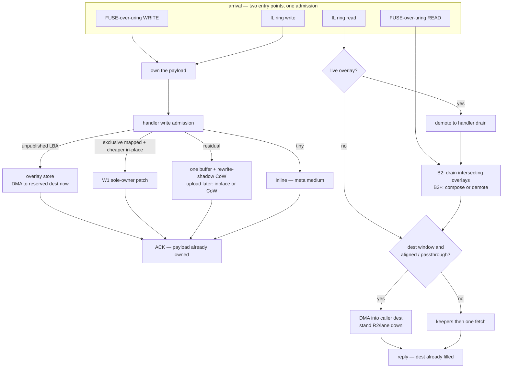
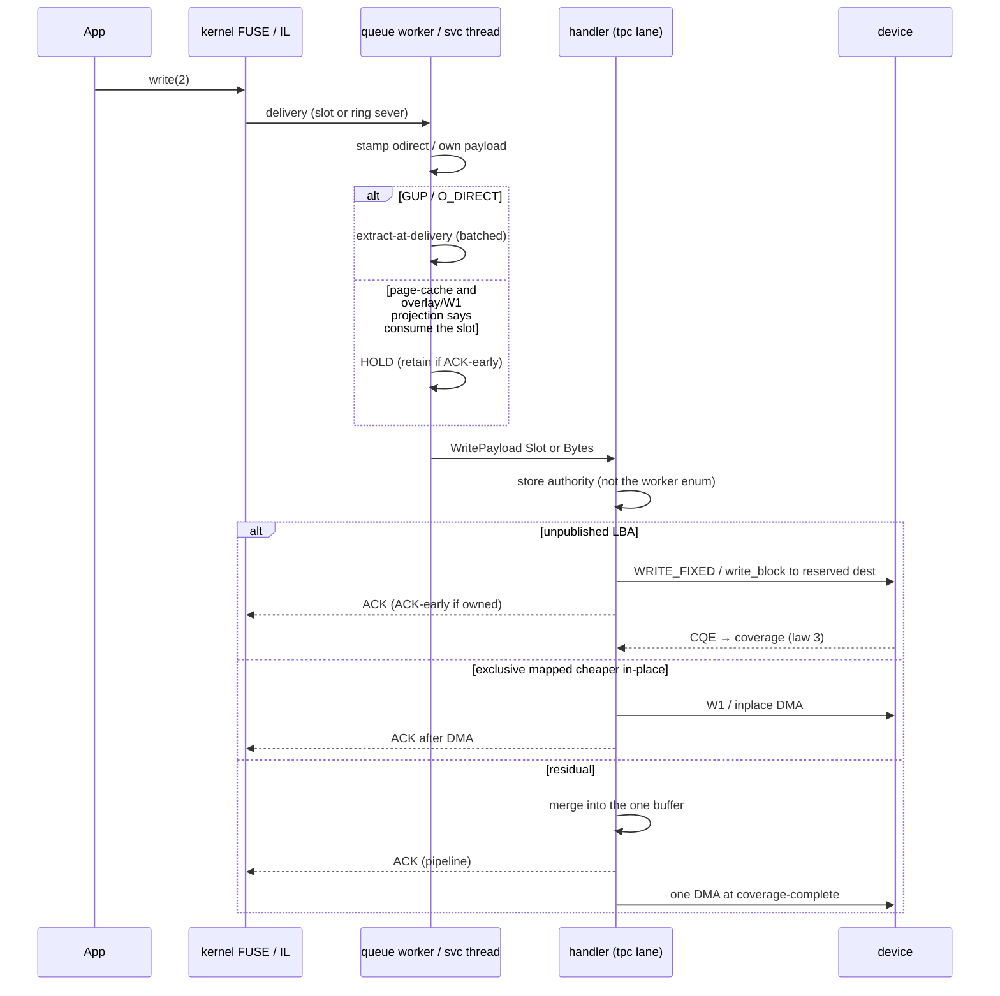
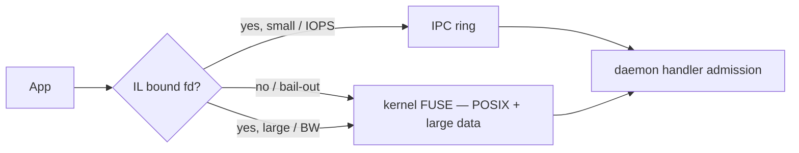

# Design: One path — one admission, always the cheapest legal I/O

| | |
|---|---|
| **Title** | One path: one admission, always the cheapest legal I/O — the vehicle-zoo collapse program |
| **Author** | _(placeholder — assign on review)_ |
| **Date** | 2026-08-09 (Rev 5 — hybrid is the client product) |
| **Status** | **Rev 5 — design only; product questions resolved.** One admission, always the cheapest legal I/O, never a named posture. Overlay default ON after B3 + §8 restatement + B2 fsync-storm (not the A-leg number, not B4/B5). Delete FUSE placed-merge (keep IL `placed_sever`). **Hybrid IL stays — that is the client product:** one `LD_PRELOAD`, IOPS on the ring and large throughput / zero-copy on kernel FUSE, no user choice. Killing the gate would force a choice and is rejected. W1 is un-disableable on a production mount. Write bar: **≥ 35 GB/s** next to proven **~40 GB/s** reads and **~1 M IOPS**. |
| **Repo / branch** | `docs/one-path` off `dev` @ `c987ce0b` |
| **Intended home** | `docs/design-one-path.md` (this file) |
| **Related** | `docs/design-device-overlay.md` (Approach B — the fresh/hole store; laws 1–9 + KD-OV-10..14 stay inviolable; **B-initial = PR B5 closes it**, not this program's A-leg number), `docs/rc-manifest.md` §3f (write-bandwidth Approach A/B adjudication — **cited, not edited**), `docs/design-zero-copy-write-path.md` (§5.3 coverage/write-through, §5.4 lease severance), `docs/design-random-small-writes.md` (W1 / W2 — physics, not postures), `docs/design-read-path.md` + dest-lease (`.benchmarks/2026-08-06-read-dest-lease.md`), `docs/design-rewrite-program.md` (shadow dual-map; KD-OV-12 coexistence), `docs/design-zc-write-kernel-v2.md` (0029 retention), `docs/design-preload-interception.md` + D14 hybrid lane (`crates/squeezefs-preload/src/lane_gate.rs`), `docs/design-zcrx-read-lane.md` |
| **Inviolable contracts** | AGENTS.md non-negotiables (performance is the only terminal requirement; io_uring-first — no classical fallback to "make it work"; no dead code; zero-copy + latch-free hot paths; portable by default / D13 kernel-frontier; env-knob ONE convention; TDD tests-first); lock order P1-9/P1-10 + RES-1; D0 single-writer + RES-6/S7 DMA authorization; overlay laws 1–9 (`docs/design-device-overlay.md` §2.2); FIND-L1-A coverage-union write-through; FIND-M11-A supersession-aware never-lossy writeback; generic/209 read-freshness |

**Revision history**

| Rev | Date | Change |
|---|---|---|
| 0 | 2026-08-09 | Initial draft. Inventories the live vehicle zoo against tip `c987ce0b`. Names the one-path law. Documents P-minus-one as already landed. Gates overlay default-ON on a field number; does not flip `SQUEEZEFS_DEVICE_OVERLAY`. Leaves product questions open. |
| 1 | 2026-08-09 | **Engineering review round 1 folded (18 items).** P3 three-way; P2-prep/flip; dest-lease three-state; knob taxonomy; ledger as user-byte partition; 8-cell acceptance; P1/P4 gated on OQ2/OQ3; no shared `WriteAdmit`; GB/s; P0 file list narrowed. |
| 2 | 2026-08-09 | **Review round 2 folded (5 items).** Fusion cap is `min(explicit, hold_candidate bound)` after INIT; `admit_write_overlay_bytes` at handler `Ok(true)`; P2-flip item 4 is B2 fsync-storm; mermaid WRITE vs READ; F0 not under `docs(one-path)`. |
| 3 | 2026-08-09 | **Review round 3 folded (3 items).** ACK partition is overlay / W1 / accumulate only; `write_through_inplace_overwrites` is upload engagement (out of the ACK sum). `INL --> ACK`. F0 computes the cap once at session arm. |
| 4 | 2026-08-09 | **Product OQ1/OQ2/OQ4/OQ5 folded.** Overlay default-ON without the A-leg number (still B3 + §8 + B2 fsync). P1-delete FUSE placed-merge. B3 required. W1 un-disableable. |
| 5 | 2026-08-09 | **OQ3 reversed.** Hybrid IL is the product (IOPS + throughput/zc, no user choice). P4-A kill-hybrid is rejected. Gate stays; `IL_KERNEL_LANE_MIN=0` remains a measurement A/B only. |

Line numbers in §2.3 are **as of tip `c987ce0b`**. Everywhere else, cite the function or test name — those are the stable handles.

---

## 1. Overview

SqueezeFS can be fast — but only when an operator (or a campaign) picks the right named vehicle for the pattern under test. Fresh 1 MiB O_DIRECT wants the device overlay *and* at-delivery extract *and* ACK-early. Rand-4k exclusive overwrite wants W1 and a HOLD. Overwrite of an already-mapped block wants accumulation + rewrite-shadow, because overlay B2 is fresh/hole only. IL 4k wants the ring; IL 1 MiB already rides kernel FUSE whenever the hybrid gate's derived interior is below 1 MiB (it usually is). Each of those is a real physical distinction. Each has also grown a **knob, a posture name, and a campaign residual** that the next campaign then has to remember not to apply to the wrong shape.

The exhibit is the field 1 MiB A-leg at **24.7 GB/s** (comment-cited as 23.0 GiB/s, 256g one-shot; no in-tree `.benchmarks/` note — see §2.2) on tip-of-campaign overlay + HOLD + late extract. Overlay HOLDs the zc slot so the handler can `WRITE_FIXED` slot→device; fusion's *default* ceiling is `payload/8` = 128 KiB (`fusion_ceiling`) and so does not take 1 MiB; the handler then `materialize()`s — a late `WRITE_FIXED` oneshot on the ACK path, the zcws-8 tax. A campaign vehicle built for page-cache 0-copy retain was applied to GUP pages that cannot be retained. The pattern got slower than the extraction control it was supposed to beat. Fusion is not that tax: without overlay, `hold_candidate` uses `payload/2`, so a 1 MiB WRITE cannot HOLD and therefore cannot fuse. The dangerous combo is streaming-hold (P2-flip) **and** `FUSION_MAX ≥ payload`. §5.3/`fix(fuse3)` caps explicit at the live `hold_candidate` bound (`payload/2` today), not at the default `payload/8`.

This program collapses the zoo. The product is **one admission** that always takes the cheapest legal I/O for the bytes in hand. Path-changing `SQUEEZEFS_*` knobs are deleted, renamed to `SQUEEZEFS_TEST_*` (ENG-10 retired-knob), or kept as **measurement A/B** — never a named operator posture. A wrong outcome is a bug, not a "posture."

**Program** acceptance (not a P0/P1 claim — §8):

> **A default mount, no path-changing `SQUEEZEFS_*` knobs, matches the best hand-typed recipe** on the 8-cell matrix (seq 1 MiB / rand 4K) × (kernel / IL) × (read / write), inside the A-B-B-A reverse-order delta **and** ≥ 0.97× that recipe, with admission-ledger closure. If a shape needs a lever to be fast, admission is wrong.

Several cells are **structurally unmeasurable** until later PRs (§8). P0 and P1 do not claim this sentence.

This is **not** "one memcpy/DMA sequence for every shape." GUP vs page-cache, fresh vs already-mapped, 4K-into-4MiB, and FUSE vs IL are physics. Those stay. What dies is the *named posture* that an operator must select to get the physics.

---

## 2. Background & Motivation

### 2.1 The product ruling (2026-08-09)

The user (product owner) stated they have too many specialized vehicles so we can hit certain benchmark numbers. They want the system to work at maximum performance in both read/write and IOPS **all the time, regardless of pattern**. The 24.7 GB/s A-leg is the exhibit, not the goal. The write strategic end state is still `docs/design-device-overlay.md` §1.3: **≥ 0.85× same-day raw, sustained**, with overlay PR **B5** closing the overlay program's own **B-initial** gate. **P2-flip no longer waits on that A-leg number** (OQ1, final): default ON after B3 + §8 restatement + B2 fsync-storm. Overlay B5 remains B-initial and is not a P2-flip conjunct. The 0.80×/0.85× fractions stay the *measurement* bar for whether the default path is winning; they are not a flip lock.

The user's "~40" is unit-ambiguous (see §2.2). The *fraction* against same-day raw is the measurement bar, not a flip lock.

### 2.2 Field numbers (evidence, not the goal) — **GB/s throughout**

Every absolute is venue-dependent and must be re-measured same-day. The *fraction* is the bar. Unit is **GB/s** (decimal, matching `nvme_dev.rs`, the B2 note, and §3f). GiB/s (binary) is shown only where a source used it, with the conversion.

| Quantity | Value (GB/s) | Source / conversion |
|---|---|---|
| Raw 1 MiB writes | **49.5–49.7 GB/s class** (field namespaces); tcp-devsub B2 same-day raw **2.272 GB/s** | §3f; `NvmeBlockDev` lane-fanout comment (49.7 GB/s raw vs 35.31 GB/s kernel seq); `.benchmarks/2026-08-09-device-overlay-b1-b2.md` |
| Kernel seq 1 MiB | **35.31 GB/s** = 7.06 × 5 data namespaces (historical field); earlier 34–39 GB/s class | `.benchmarks/2026-08-07-write-lane-fanout.md` |
| Overlay A-leg with late extract | **24.7 GB/s** (source said 23.0 GiB/s, 256g one-shot) | **Comment only** — `zc_write_hold_eligible` doc, `odirect_overlay_is_not_hold_eligible` comment, `fuse_over_uring` odirect stamp comment. **No `.benchmarks/` note in-tree.** Treat as exhibit class, not a gate input, until a note exists |
| time_based 1g/file 32 jobs | **~31.7 GB/s** overwrite plateau (source ~29.5 GiB/s) | overlay only first fill — B2 is fresh/hole; pass 2+ is mapped overwrite. Same caveat: cite class, write a note when re-measured |
| Overlay B2 ACK-after-CQE (tcp devsub) | **0.77×** extraction control (1.126 vs 1.456 GB/s median); **0.495×** same-day raw (2.272 GB/s) | `.benchmarks/2026-08-09-device-overlay-b1-b2.md` |
| Approach A placed-merge capture | **~25.2 %** of stream bytes (first-chunk-only) | `.benchmarks/2026-08-09-fuse-placed-merge.md` — FALSIFIED |
| Overlay strategic end state | **≥ 0.85×** same-day raw, sustained | `docs/design-device-overlay.md` §1.3 |
| Overlay **B-initial** (PR **B5** closes it) | materially above §1.4 comparator **and ≥ 0.80×** same-day raw, with B4 coexistence + fsync-storm | `docs/design-device-overlay.md` §1.3 / §8 B5. **Not** this program's A-leg row |
| User target "~40" | **unit not stated.** 40 GB/s = 0.81× of 49.5; 40 GiB/s = 43.0 GB/s = 0.87× of 49.5. 0.85 × 49.5 = **42.1 GB/s** (39.2 GiB/s) | product, 2026-08-09. P2-flip and overlay B5 stay on **fractions of same-day raw**, which do not depend on this |

The B2 falsifier is load-bearing: engagement was exact (store bytes 96.9 %, extraction 3.1 %, nt_copy 2.3 %, 31–32 qids, amp 1.008, zero tripwires) and the armed posture still **lost**, because ACK-after-CQE × per-inode `i_rwsem` serialization caps in-flight custody at lanes × 1 MiB. The extraction control pays two CPU copies *off* the ACK path while the write pipeline holds 128–137 MiB of DMA. That is why ACK-early (kernel 0029 + P-minus-one) is the named *measurement* re-bracket. **OQ1 (final) does not wait on that row to flip the default.** Last counted overlay row is still B2 0.77×; flipping without a new A-leg note is an **accepted product risk** (R1). The remaining P2-flip wait is B3 + §8 restatement + B2 fsync-storm.

**B2 *measured* ACK-after-CQE vs tip *code* ACK-early.** The B2 note and `tests/device_overlay_tests.rs` header still describe ACK-after-CQE (KD-OV-7) as the B2 contract. Tip `c987ce0b` code ACKs early whenever `ack_early_enabled()` (default ON) and overlay is armed — `try_device_overlay_store` returns `Ok(true)` and drops the block guard while the claim stays in-flight. Do not cargo-cult KD-OV-7 as current *code* law. P0/P2-prep repairs the comments (§5.9).

### 2.3 The vehicle zoo, as of tip `c987ce0b`

The inventory below is from live code, not folklore. Every row is a *named* path a campaign can select. Line numbers are **as of `c987ce0b`**.

#### Write arrival

| Entry | Where | What it is |
|---|---|---|
| Kernel FUSE-over-uring | `crates/fuse3/src/raw/connection/fuse_over_uring.rs` delivery loop | sparse-slot `ITER_SOURCE` (patch 0024); HOLD vs extract vs place decided **on the queue worker** before the handler runs |
| IL ring | `crates/squeezefs-preload/` + `src/ipc_service.rs` | lock-free ring; §5.5.2 sever-at-dequeue; placed-sever on whole-block chunks (`src/placed_sever.rs` — **product**, default engaged; not the FUSE placed-merge vehicle) |
| Hybrid size gate | `SQUEEZEFS_IL_KERNEL_LANE_MIN`, `lane_gate::kernel_lane_route`, `squeezefs_ipc::sizing::kernel_lane_min_default` | ops **strictly larger** than the derived threshold ride kernel FUSE. Default = `memBW × 2.3 µs / 2 copies`, 4 KiB-grained, clamp `[slab, max_op]`. **Clamp rail** = session `max_op` (usually 1 MiB). **Derived interior** ≈ 140–164 KiB on field memBW (or the slab floor on a slower probe). Therefore **1 MiB routes kernel** unless `IL_KERNEL_LANE_MIN=0`. Offsetful forms latch sticky. |

#### Write stores

| Vehicle | Default | Scope | Knob / gate |
|---|---|---|---|
| Inline (tiny) | always | payload in meta `inline_data:`; different **medium** | layout threshold (~4 KiB) |
| Staging mmap | format-time | small / partial / spill | cache-path policy (format, not mount) |
| Accumulation + write-through + rewrite-shadow CoW | **the shipped streaming *and* whole-block-overwrite path** | `ActiveBlockBuf` + RW3b coverage union → DMA when complete; overwrite publishes via rewrite-shadow (`pipeline_upload_parked_block` takes CoW/supersession unless `inplace_overwrite_enabled()`) | `SQUEEZEFS_REWRITE_SHADOW` default ON (`=0` is an A/B). This is the **live whole-block overwrite winner** on zram-lz4 |
| W1 sole-owner patch | ON (`SQUEEZEFS_PATCH_MAX_BYTES` derived block/8) | LBA-aligned exclusive overwrite of mapped whole-block passthrough | `try_sole_owner_patch` |
| W2 extent overlay | ON | patch-ineligible small writes; park extents, fold later | `SQUEEZEFS_FOLD_MAX_*` |
| Device overlay B2 | **OFF** | fresh/hole aligned single-block; slot/Bytes → unpublished dest. Mapped blocks still `Ok(false)` ("the overwrite shape is PR B4") | `SQUEEZEFS_DEVICE_OVERLAY`; `try_device_overlay_store` / `overlay_hold_eligible`. `device_overlay_enabled` comment: default OFF until the **B5 gate row** |
| Inplace overwrite | **OFF** | full-block sole-owner rewrite, zero displacement | `SQUEEZEFS_INPLACE_OVERWRITE` — substrate-measured ≈ 2× loss on zram-lz4 |
| FUSE placed merge (Approach A) | **OFF, falsified** | FUSE `WRITE_FIXED(slot → memfd assembly)` + adopt | `SQUEEZEFS_FUSE_PLACED_MERGE`; `zc_write_place`. ~25 % capture. Distinct from IL `placed_sever` |

#### Payload hold (FUSE-over-uring WRITE delivery)

| Vehicle | Who takes it today | Cost |
|---|---|---|
| HOLD + `COMMIT_RETAIN` | page-cache overlay (`zc_write_hold_eligible` returns `!odirect` on overlay-eligible) | 0-copy; needs kernel 0029; folios stable |
| HOLD + late extract | **the 24.7 GB/s tax — removed for overlay O_DIRECT** | handler `materialize()` = oneshot `WRITE_FIXED` on the ACK path (zcws-8) |
| At-delivery extract → Bytes ACK-early | overlay O_DIRECT after P-minus-one; IL severs | batched worker copy; daemon-owned snapshot; ACK-early without the GUP knob |
| Held-GUP snapshot | `SQUEEZEFS_ZC_ACK_EARLY_ODIRECT=1` only | extract *after* HOLD, before reply; test seam / hold-gate miss. Production overlay O_DIRECT does **not** HOLD |
| Fusion | small held W1 only | `SQUEEZEFS_FUSE_ZC_WRITE_FUSION` default ON; default ceiling `payload/8` = 128 KiB. Explicit `SQUEEZEFS_FUSE_ZC_FUSION_MAX` wins verbatim today (registry `4096..1<<30`; `fusion_ceiling_bounds_inline_work_and_explicit_wins` pins 256 KiB = `payload/4`). A 1 MiB WRITE cannot fuse without HOLD, and HOLD of 1 MiB needs streaming-hold (`payload+1`). §5.3 caps explicit at the live hold bound after INIT |

The hold gate is two layers (`fuse_over_uring` delivery, `hold_candidate` + registered `zc_hold_gate`):

1. `zc::hold_candidate(offset, size, payload_sz)` — LBA-aligned; bound is `payload/2` normally, or `payload+1` when `set_zc_hold_streaming(true)` (armed at mount **iff overlay is on**, `set_zc_hold_streaming` in the mount path).
2. `Filesystem::zc_write_hold_eligible(ino, offset, len, odirect)` — overlay arm first (`return !odirect`), else the lock-free W1 shape probe (deliberately skips refcount == 1 and byte-range custody; cache miss = false).

`odirect` is stamped on the worker from `fuse_write_in`: open flags carry `O_DIRECT` **and** `write_flags & FUSE_WRITE_CACHE == 0`. `FUSE_WRITE_CACHE` is the kernel writing *its* page-cache folios out (generic/451) — sound even when it borrowed an O_DIRECT ff.

#### Reads

| Vehicle | Default | Role |
|---|---|---|
| Overlay drain (B2) | on whenever any overlay is open | FUSE handler `drain_device_overlays_range` **before** `read_file`: freeze / await inflight / **seed gaps to a whole block with zeros** / publish. Engagement: `overlay_read_drains`. IL direct-drive **DEMOTES** (`Err(I::Overlay)` in the custody snapshot) — KD-OV-13 |
| Dest-lease | **ON** | cold 4 KiB-aligned sub-block kernel windows DMA into the reply dest; `SQUEEZEFS_READ_DEST_LEASE`. `dest_leaseable` in `DataRouter` does **not** probe the overlay registry — overlay-freedom is manufactured upstream by drain |
| FUSE-zc direct serve | ON with `SQUEEZEFS_FUSE_ZC` | device → caller pages via sparse slot (K1); `read_zc_serve_bytes` |
| Hot-block RAM tier | ON | R4; `Bytes` refcount hit |
| Read-lane hold | **ON** | ledger-invisible completed-fill store; `SQUEEZEFS_READ_LANE`. Ahead depth: `SQUEEZEFS_READ_LANE_DEPTH` (0 = ahead off) |
| NVMe read cache | ON | R1b `SQUEEZEFS_READ_TIER_ADMISSION` = `second-touch` (always / second-touch / never) |
| Staging / active-block overlay | always | RYW; "overlay never invisible" |
| Bounce | fallback | unaligned dests |
| ZCRX | opt-in, parked on engagement | userspace NVMe/TCP RX; not a second read path |
| Prefetch R2 / ranged R3 | ON | pipeline + sub-block; dest-leaseable traffic **stands them down** (`pipeline_touch(..., dest_leaseable \|\| zc_geometry)`) |
| IL arena dest | ON for il (`SQUEEZEFS_IL_READ_DEST`) | E-IL2 serve-into-arena |
| GDS | feature-gated (`gds`) | `SQUEEZEFS_IOC_GDS_READ` / `gds_read_block_range` — ioctl path, not a mount knob. Out of scope like ZCRX |
| `direct_device_true` | **OFF** | measurement escape — **keep as measurement, not a second read path** |

### 2.4 Why the zoo is now the problem

Each vehicle was a correct answer to a counted question. The rot is compositional:

1. **A campaign vehicle applied to a pattern it made slower.** Overlay HOLD + handler `materialize()` on O_DIRECT 1 MiB (the 24.7 GB/s A-leg). Fusion's first field posture held W1-ineligible shapes and double-paid (0.45× at fabric RTT). Approach A captured 25 % because `i_rwsem` never delivers a cohort.
2. **The default is not the best recipe (until P2-flip).** Overlay ships default OFF because B2 ACK-after-CQE lost 0.77×. OQ1 flips it ON after B3 + §8 restatement + B2 fsync-storm **without** waiting on a new A-leg number — an accepted product risk (R1).
3. **Path-changing knobs on the hot path.** They select *which physics run*. That is a posture menu. §5.8 classifies each as delete / `SQUEEZEFS_TEST_*` / measurement A/B.
4. **Dead code wearing a lever.** FUSE placed-merge default-OFF is not enough (AGENTS.md no-dead-code). OQ2: **delete** the FUSE path; IL `placed_sever` stays. The held-GUP snapshot path is not a product lever. `fuse3_zc_write_lazy_extractions` growing on a steady row is the hold gate regressing, not a second vehicle.

### 2.5 P-minus-one — already landed (do not re-propose)

Tip `c987ce0b` and its parents through ACK-early / `COMMIT_RETAIN` are **done**. This design treats them as the baseline, not as future work:

* Worker stamps `odirect` from `fuse_write_in` (open flags + not `FUSE_WRITE_CACHE`).
* Overlay HOLD returns `!odirect` so O_DIRECT extracts at delivery (batched) — `zc_write_hold_eligible`; pin `odirect_overlay_is_not_hold_eligible`.
* Production `bytes_vehicle_armed()` follows overlay enablement. O_DIRECT overlay extracts on the worker; the handler's `Bytes` **are** the snapshot.
* Bytes overlay ACK-early without `SQUEEZEFS_ZC_ACK_EARLY_ODIRECT`. Daemon-owned bytes are always sound.
* `zc_write_place` refuses overlay-eligible deliveries. Approach A cannot steal the fresh/hole A-leg.
* `SQUEEZEFS_ZC_ACK_EARLY_ODIRECT` remains **only** for a HELD unsound GUP slot (test seam / hold-gate miss). Production overlay O_DIRECT does not HOLD.
* W1 O_DIRECT still HOLDs (0-copy slot→device patch). Page-cache overlay still HOLDs for `COMMIT_RETAIN`.
* The B2 ACK-after-CQE *suite* still pins the overlay lever **off** (`tests/device_overlay_tests.rs`) — that is the B2 *measured* contract, not a claim that tip code ACKs after CQE when overlay is armed.

What P-minus-one did **not** do: flip the overlay default; delete FUSE placed-merge; delete the held-GUP snapshot knob; land a field A-leg **note**; arm overwrite overlays (overlay PR B4, not built); teach dest-lease the overlay read protocol (B3/B7); collapse the hybrid lane gate; repair the stale "ACK-after-CQE — KD-OV-7" / "structurally instant" comments.

---

## 3. Goals & Non-Goals

### Goals

1. **One write admission. One read admission.** The decision ledger *is* the product. Every store/serve outcome is named by the ledger and closes against **user bytes at ACK / serve** (charter-rule-4). Closure is a partition of those bytes, not a reconstruction from block counts or reply counts (§11).
2. **Program acceptance is the 8-cell matrix in §8**, with a numeric band. P0/P1 do not claim it. Cells that cannot be measured yet are marked, not hand-waved.
3. **Path-changing knobs are classified** (delete / `SQUEEZEFS_TEST_*` / measurement A/B). Measurement levers that do not change *which* path runs (phase histograms, `SQUEEZEFS_OP_PROFILE`, NT-copy floors, pipeline-depth pins) stay. `DIRECT_DEVICE_TRUE` stays as the amplification-measurement escape, labeled as such, never a second read path.
4. **Wrong outcome = bug.** A 1 MiB fresh O_DIRECT that HOLDs and late-extracts is a red test, not a "recipe we forgot." A 4K exclusive overwrite that accumulates a 4 MiB buffer is a red test (W1 predicate rot — already the `patch_ineligible_*` law).
5. **Overlay becomes the fresh path after the P2-flip AND-gate** (B3 + §8 restatement + B2 fsync-storm). OQ1: **do flip the default** without waiting on the A-leg ≥ 0.80× row. Overlay PR B5 still owns the overlay program's B-initial close and is not a flip lock.
6. **Overwrite stays one store family, not a second zoo.** Sub-block exclusive = W1 (already, **un-disableable** — OQ5). Whole-block exclusive is a **three-way counted row** (inplace vs today's CoW residual vs overlay-B4-after-B4-is-built). One-path does not delete CoW and does not build B4.
7. **One client data plane = hybrid IL.** One `LD_PRELOAD`. Small/IOPS ops ride the ring (~1 M proven). Large ops ride kernel FUSE for throughput / zero-copy (~40 GB/s reads, ≥ 35 GB/s writes). The user does not choose. Killing the gate would force a choice and is rejected.
8. Stay inside the inviolable set. Every PR is tests-first, independently mergeable, full change-class gate.

### Non-Goals — physics that must NOT be flattened

These are not vehicles. Deleting them is a product bug.

| Physics | Why it stays | Evidence |
|---|---|---|
| **W1 sole-owner patch** | 4K exclusive overwrite is one DMA; deleting it returns ~2,500× RMW | `docs/design-random-small-writes.md`; 61–67 k IOPS, amp 1.0× W / 0.0× R |
| **GUP vs page-cache** | Cannot DMA user pages after `write(2)` returns. O_DIRECT HOLDs are unsound; page-cache `COMMIT_RETAIN` is sound | 2026-08-09 live-smoke aliasing; `odirect_ack_early_must_not_observe_post_ack_reuse` |
| **Fresh vs already-mapped** | Unpublished dest vs old binding. Overlay B2 is the former; overwrite is the latter (W1 / CoW residual / future B4). Collapsing them is silent CoW-vs-in-place corruption | overlay laws 5/8; KD-OV-12 five dual-authority hazards |
| **FUSE vs userspace ring as *entry points*** | FUSE has a copy/syscall tax. The ring has a consume-copy tax on reads. Both exist; admission picks, it does not pretend they are one transport | D14 field: kernel 49.2 GB/s read / 35.3 write vs ring 594 k IOPS / 28 GB/s psync |
| **Coverage-union write-through (FIND-L1-A)** | Kernel-split OOO O_DIRECT WRITEs are the normal case (`FOPEN_PARALLEL_DIRECT_WRITES`). Completeness is the accumulated union, never one write's end | `docs/design-random-small-writes.md` §5.3; `tests/write_through_coverage_tests.rs` |
| **Tiny inline** | A different **medium** (meta KV), not a fourth data-plane. Stays. | progressive layout |
| **Whole-block CoW residual** | Today's default overwrite; the measured zram winner (inplace ≈ 2× a fresh-slot write) | `pipeline_upload_parked_block`; `.benchmarks/2026-07-31-write-wall.md` |

Also out of scope: on-disk format change; S9 multi-writer overlay composition (device-overlay PR B9); replacing FUSE-over-io_uring with a classical `/dev/fuse` hot path; SPDK initiator; making ZCRX or GDS a second POSIX read path; **building overlay PR B4/B5 inside a one-path PR**.

---

## 4. The one-path law (normative)

This section is the product. Every PR that *does* land red-first against it. A violation is a bug, not a posture.

### 4.1 Write

```
own the payload before ACK
  (retain if pages are stable; extract-at-delivery if GUP)
if this range has a final unpublished LBA (fresh/hole):
    DMA there now          → overlay, always, not a knob
elif exclusive mapped + aligned + in-place is cheaper than CoW:
    DMA there now          → W1 (sub-block) / inplace (whole-block)
else:
    one buffer, one DMA when coverage is complete
    (today's accumulate + rewrite-shadow CoW — the residual, and the
     live whole-block overwrite winner on zram)
```

Tiny inline stays a different medium (meta), not a fourth data-plane.

**"Own the payload before ACK"** is P-minus-one made law:

* Page-cache folios are stable across `write(2)` return. The sound 0-copy is `COMMIT_RETAIN` (kernel 0029) and DMA from the retained slot. ACK-early is legal.
* GUP/O_DIRECT pages are reusable the instant `write(2)` returns. The sound move is **extract at delivery** (batched on the queue worker) into daemon-owned `Bytes`, then ACK. DMA-from-GUP after ACK is the live-smoke aliasing. `SQUEEZEFS_ZC_ACK_EARLY_ODIRECT` (HOLD then snapshot) is not a product arm.
* IL severs are already daemon-owned (`placed_sever` / `SeveredPool`). They ride the Bytes arm.

**"Final unpublished LBA"** is overlay B2's install predicate (`overlay_hold_eligible` / `try_device_overlay_store` state screen): striped authority, block unmapped, no RAM/staged/extent/shadow custody for *this* block, passthrough, LBA-aligned, single block. When the predicate holds, the cheapest legal I/O is slot/Bytes → reserved dest. After P2-flip, this is not behind `SQUEEZEFS_DEVICE_OVERLAY` as an operator opt-in.

**"Exclusive mapped + aligned + in-place cheaper than CoW"** is W1 today (sub-block) and *optionally* inplace-overwrite (whole-block). The cost comparison is **measured per substrate**, not a knob the operator flips: on zram-lz4, in-place slot-replace is ≈ 2× a fresh-slot write so **CoW + deferred discard wins for whole-block overwrite**; W1 sub-block patch is still one 4K DMA and stays. P3 measures inplace vs this CoW residual on the field SSD/DSM substrate and absorbs `INPLACE_OVERWRITE` into admission or pins it measurement-only. Overlay-to-new-dest (B4) is **not** a P3 candidate until the overlay ladder builds it.

**"One buffer, one DMA when coverage is complete"** is the residual accumulate: `ActiveBlockBuf` + RW3b union + write-through + rewrite-shadow. W2 extents are the compact *representation* of that buffer when the first write is small, not a third store. Transformed volumes live here by impossibility (`docs/design-device-overlay.md` §7). Whole-block exclusive overwrite lives here **today**.

### 4.2 Read — live three-state compose, then the law

The law:

```
if the caller gave us a dest window: DMA into it
else: one fetch into a buffer we already have to keep or discard
```

**What the code does today, and what it will do**, because "overlay-free" is not a `dest_leaseable` conjunct:

| State | Who | Dest-lease / zc / IL dest-DMA | Speculation (R2 / lane ahead) |
|---|---|---|---|
| **(1) Today (B2)** — P0 pins this | FUSE handler drains intersecting overlays (`drain_device_overlays_range`: freeze → `await_overlay_inflight` → seed zeros to a whole block → publish), **then** dest-lease/zc/keepers run on the published map. IL direct-drive DEMOTES (`Err(I::Overlay)`). | After drain, dest-lease fires on the now-durable dest. It does **not** demote; it does **not** probe the registry. | `pipeline_touch(..., dest_leaseable \|\| zc_geometry)` stands R2/lane down when dest-leaseable |
| **(2) B3** | Lock-free compose (overlay design §5.2). Dest-lease/zc **DEMOTES** on any live record (KD-OV-13) until B7. | Demote, not drain. | Same stand-down on dest-leaseable |
| **(3) B7** | Dest-lease runs the overlay §5.2 revalidate / §5.3 full-window overwrite protocol. | Dest-DMA of overlay-covered ranges is legal. | Same |

**Dest window** = the FUSE-over-uring registered ent payload (dest-lease / zc serve) or an IL arena window (`SQUEEZEFS_IL_READ_DEST`) the daemon already has to fill. Cold, aligned, passthrough. Speculative fills for a window the demand read DMAs itself are a double-fetch (`read_dest_lease_tests` contract 2 is the stand-down, not overlay-free).

**"Buffer we already have to keep or discard"** is the keeper ladder *after* the dest pre-keeper gate: staging/active overlay → hot-block → read-lane hold → NVMe tier → single-flight device fill. R1b admission decides keep-vs-discard. ZCRX, if engaged, is the fill's RX path, not a parallel serve. GDS is an ioctl path, not this ladder.

`SQUEEZEFS_DIRECT_DEVICE_TRUE` is a measurement ruler. It is not the "true" read path. `overlay_read_drains` is the B2 engagement gauge: nonzero on dest-armed overlay-covered FUSE reads is the **drain tax**, not dest-lease.

`await_overlay_inflight` is **load-bearing after P-minus-one** (ACK-early returns while the claim is in-flight). Its "structurally instant in B2 — the block guard serializes stores" comment is false on this tip. Overlay §8's ACK-early future law still stands: a read intersecting an ACKed-but-incomplete store must wait for that store **or serve from its retained source**; drain currently only waits (yield-spin), and does not serve retained. P2-flip cannot precede that restatement (AND-gate conjunct 2).

### 4.3 Client

One `LD_PRELOAD`. **Hybrid is the product, not a leftover.** It is the same law as write admission, on the client: pick the cheapest legal lane so the application does not.

* **IOPS / small** → IPC ring (proven ~1 M).
* **Throughput / zero-copy / large** → kernel FUSE (proven ~40 GB/s reads; write bar ≥ 35 GB/s on overlay ACK-early).

`lane_gate.rs` approximates that with a startup memBW probe × a measured 2.3 µs lane-RTT delta, clamped to `[slab, max_op]`. On field memBW the derived interior is ~140–164 KiB, so **1 MiB already routes kernel**. That is the intended 1 MiB story, not a bug.

Killing the gate (all-ring, or all-FUSE) would make the user choose IOPS *or* GB/s. Rejected. `SQUEEZEFS_IL_KERNEL_LANE_MIN=0` stays a class-(3) measurement A/B, never a product posture.

POSIX metadata (open/stat/readdir/mmap/locks/fsync) stays on FUSE either way. The hybrid cut is **data ops only**.

### 4.4 What "cheapest legal" means

Cheapest is **measured work deleted**, in this order:

1. **Illegal is not cheap.** GUP-after-ACK, overlay-without-install (law 1), in-flight overlap (law 6 clause), DMA without `authorize_zc_store`, a dest-lease that cannot revalidate — these are refuse/fallback, never "faster."
2. **Zero daemon copies + DMA to the final LBA** beats extract + merge + DMA.
3. **One DMA of the written extent** (W1) beats one DMA of the whole block, when the block is already ours.
4. **One whole-block DMA after coverage completes** beats per-segment device RTTs that serialize on ACK (the B2 0.77× lesson) *unless* ACK-early has detached the reply — then per-segment DMA to the final LBA wins on copies *and* on depth.
5. **A serve into a dest the caller already gave us** beats fetch-into-daemon-buffer + copy-out.
6. **A warm hit in a buffer we already keep** beats a device fetch.

Admission evaluates this per request from facts it can probe lock-free (or under the block lock it already holds). It does not consult an operator posture knob.

---

## 5. Proposed Design

### 5.1 Target shape



No unlabeled edge leaves a write-admission node. Drain is the FUSE **read** handler (and the IL demote target), never a write epilogue. Worker-side HOLD/extract/place is a **conservative projection** of the handler (§5.2), not a second admission. Fusion is a *scheduling* detail of a **held** W1 at ≤ `min(explicit, hold_candidate bound)` (default derivation remains `payload/8`). FUSE placed-merge does not appear as a product path. The hybrid lane gate **is** the client admission — same law, other side of the fd.

### 5.2 Write admission — two faces, not one function

Today the decision is scattered across four sites that can disagree:

| Site | Thread | What it decides |
|---|---|---|
| `zc::hold_candidate` + `set_zc_hold_streaming` | queue worker | shape bound (payload/2 vs streaming) |
| `SqueezefsFilesystem::zc_write_hold_eligible` | queue worker | overlay vs W1 HOLD; O_DIRECT overlay extracts. **Skips** refcount == 1 and byte-range custody; cache miss = false |
| `SqueezefsFilesystem::zc_write_place` | queue worker | Approach A placement (default OFF; already refuses overlay-eligible) |
| `write_file_staged` `try_patch` / `try_overlay` then per-block `try_sole_owner_patch` / `try_device_overlay_store` | handler | the actual store (awaits, takes `BLOCK_FLUSH_LOCKS`, fetches on miss) |

Those cannot be the same function. The worker cannot `begin_patch_sole_owner`. After P-minus-one the worker's overlay decision is also `!odirect`; the handler then sees `WritePayload::Bytes` or `Slot`, not an `odirect` flag.

**P0's product is drift tests, not a shared enum.** The live comment on `zc_write_hold_eligible` is the law:

* Worker is a **conservative hold/extract/place projection**. Stale TRUE → one `fuse3_zc_write_lazy_extractions` (hold then handler cannot consume from the slot). Stale FALSE → one forfeited direct-DMA (counted, not silent).
* Handler remains the store authority.
* If an enum is wanted, it is **handler-only**: `Inline | Overlay | InPlace | Accumulate | Refuse`. Worker returns stay `Hold | Extract | NoPlace`. Do **not** thread `odirect` into the handler type; ownership is already `Slot` vs `Bytes`.

`try_overlay` gated on `device_overlay_enabled()` is a knob, not a fact — that is a P2-flip change, not a P0 reorder.

**`try_patch` before `try_overlay` is ledger order, not a correctness defect.** For a mapped exclusive 4K, W1 succeeds and overlay is not reached. For a fresh hole, W1 declines `patch_ineligible_unmapped` and overlay (if armed) takes it. After P2-flip the *outcomes* are the same either order; only which counter moves changes. Reorder is **ledger hygiene after P2-flip**, with `extent_patch` / overlay suites updated so a fresh 4K hole does not increment `patch_ineligible_unmapped`. Keep W1 first until overlay is default-ON so the shipped `patch_ineligible_*` series stays comparable.



W1 ACK-after-DMA (`try_sole_owner_patch` awaits `z.store` before return) is why W1 O_DIRECT HOLD is sound while overlay O_DIRECT HOLD is not. Keep that.

### 5.3 Payload ownership (the 24.7 GB/s law)

The zcws-8 lesson, now law:

> A payload the store will not consume from the slot **must not be HELD**. A payload that cannot legally be DMA'd after ACK **must not be retained**. Extract at delivery is the GUP vehicle; retain is the page-cache vehicle; late extract on the handler is a bug.

Consequences:

* `fuse3_zc_write_lazy_extractions` is a **must-stay-0 tripwire on a steady eligible row** (armed when P1-tripwire lands; P0 may export it). Growth means the hold gate is admitting work the handler cannot consume from the slot. Cold-start cache misses may tick it once; the tripwire is *steady-row* after warmup (R7).
* Fusion stays a scheduling optimization of *held* W1. The write-bracket law is "never move **payload-scale** memcpys onto the worker" — 1 MiB at 1 MiB payload, not 256 KiB. Default derivation stays `payload/8` (128 KiB). **`fix(fuse3)` (not P0)** computes `capped = min(explicit, hold_bound)` **once** when the session learns `payload_sz` after INIT (and recomputes if `set_zc_hold_streaming` flips `hold_bound`). `hold_bound` is the live `hold_candidate` size ceiling (`payload/2` without streaming-hold; `payload+1` with it). Physical reason **on the compute site**: a fused WRITE that cannot HOLD is unrepresentable; the cap is a geometry constraint after FUSE INIT, not a registry-range clamp. Registry stays `int(4096, 1<<30)`. If `explicit > hold_bound`, **one** mount/session log (not per WRITE — `fusion_ceiling` is on every armed delivery today). Hot-path `fusion_ceiling` only **reads** the already-capped value. **Do not** refuse them from `refusal_report()` — there is no payload yet at startup. `fusion_ceiling_bounds_inline_work_and_explicit_wins` (256 KiB = `payload/4` ≤ `payload/2`) stays green. 1 MiB at 1 MiB payload is unrepresentable without streaming-hold; with streaming-hold the bound becomes `payload+1` and the 1 MiB brake is `zc_write_hold_eligible == false` (KD-OP-16), not this cap.
* `SQUEEZEFS_ZC_ACK_EARLY` (default ON, inert without overlay) stays the overlay depth-cap release. After P2-flip it is how overlay ACKs; `=0` is a measurement A/B (ACK-after-CQE comparator), not "test-only."
* `SQUEEZEFS_ZC_ACK_EARLY_ODIRECT` leaves the product surface with P1-delete's sibling cleanup (rename to `SQUEEZEFS_TEST_*` or delete). Production overlay O_DIRECT does not HOLD.

### 5.4 Overlay is the fresh path — P2-prep then P2-flip

Today `SQUEEZEFS_DEVICE_OVERLAY` is default OFF (D17): B2 ACK-after-CQE lost 0.77× with engagement exact. `device_overlay_enabled`'s comment still says "default OFF until the **B5 gate row**." This program does **not** redefine "B-initial." Overlay PR B5 still closes B-initial (fsync-storm + B4 coexistence + the §1.3/§1.4 number) and is **not** a P2-flip conjunct. OQ1 flips the *one-path* default without waiting on the A-leg number; last counted overlay row remains 0.77× — accepted risk R1.

**P2-prep** (mergeable now, default stays OFF):

* Streaming-hold decoupling *prep* — **do not** call `set_zc_hold_streaming(true)` unconditionally while overlay is still default OFF. Today `hold_candidate` uses `payload/2`, so a 1 MiB WRITE at 1 MiB payload **cannot hold** even if `zc_write_hold_eligible` is a stale TRUE. Unconditional streaming-hold makes every aligned size < `payload+1` a candidate and leaves **only** the filesystem gate between a 1 MiB accumulate shape and HOLD+late-extract. That is a blast-radius change, not a coupling cleanup.
* P2-prep (and P0) pins, with streaming-hold **forced on in the test**, that `zc_write_hold_eligible` is false for: mapped 1 MiB accumulate, stream-adjacent 4K, cache-miss fresh 1 MiB, transformed volume, W2-small. After those pins exist, P2-flip may arm streaming-hold unconditionally on a zc-armed session.
* Ledger + comment repairs (§5.9). `try_overlay` stays knob-gated until P2-flip.
* Update the `device_overlay_enabled` "until B5" comment in the **same** change that documents the P2-flip AND-gate, so the two documents cannot drift. The comment becomes: default OFF until P2-flip's AND-gate; overlay B5 still owns B-initial and is **not** that gate.

**P2-flip** (default ON) is a separate PR and does not merge without **all** of:

1. **Overlay B3 landed** (lock-free read compose — OQ4, final). Drain-on-read + zero-seed of the unwritten 3 MiB of a 1 MiB-into-4 MiB overlay is not an acceptable default-mount read path. The full-block/fsync-only restriction is **not** an escape.
2. **Overlay §8's ACK-early read/fsync restatement implemented** — wait-or-serve-retained, not "comment says instant." `await_overlay_inflight` is load-bearing; the yield-spin is not the retained-source serve the future law also allows.
3. **B2 fsync-storm contracts green on the ACK-early binary** (fresh/hole only). Name the existing `device_overlay_tests` fsync / seed-zeros / `overlay_unpublished_at_fsync == 0` pins plus a storm under ACK-early (`overlay_fence_drops == 0`). That is the fsync work a **fresh/hole** default needs. It is **not** overlay B5.

**Not a conjunct:** the A-leg ≥ 0.80× same-day raw row (OQ1). Flip without that note means we may default-ON a path whose last *counted* row was B2 ACK-after-CQE 0.77×. That is an **accepted product risk** (R1). Still **write** the A-leg note when the row exists — it is measurement, not a flip lock.

**Overlay B5-with-B4 is not a P2-flip conjunct.** B5 remains the overlay program's **B-initial** close. One-path does not build B4 (KD-OP-9) and does not wait on it.

### 5.5 Overwrite is the same store — three-way, B4 is not a one-path PR

B2 is fresh/hole only (`try_device_overlay_store` returns `Ok(false)` on any mapped block). Mapped overwrite today is:

* W1 if exclusive + aligned + sub-`PATCH_MAX` + not stream-adjacent + no overlay/staging;
* inplace whole-block if `INPLACE_OVERWRITE=1` (default OFF, zram ≈ 2× loss);
* **else accumulate (+ W2 extents if small) → write-through → rewrite-shadow CoW** — `pipeline_upload_parked_block` takes this path unless inplace is on. **This is the live whole-block winner.**

P3's charter: **direct store whenever the dest is ours and in-place is cheaper; one residual accumulate.** "Ours" means exclusive (refcount == 1, the W1 fence) and the dest is the live binding.

| Shape | Winner | What one-path P3 does | What it does **not** do |
|---|---|---|---|
| LBA-aligned sub-block exclusive overwrite | **W1** (already). Overlay-on-mapped for this shape *is* W1 | Keep. No second in-place | Do not build a B4 "overwrite overlay" for 4K |
| Whole-block exclusive overwrite | **Three-way counted row:** (1) inplace DMA to the live binding, (2) residual accumulate + rewrite-shadow CoW (**today, zram winner**), (3) overlay-to-new-dest **only after overlay PR B4 is built** under the overlay ladder (KD-OV-12 five hazards, red-first) | Measure (1) vs (2) on the field SSD/DSM substrate. Absorb `INPLACE_OVERWRITE` into admission or pin it measurement A/B. Do not delete (2) | Do **not** schedule B4 as a one-path deliverable. If B4 lands as a sibling overlay PR, one-path consumes its winner afterwards |
| Shared / transformed / unaligned / adjacent-stream | residual accumulate (W2 extents or full buffer) | none — this *is* the residual | — |

`SQUEEZEFS_REWRITE_SHADOW` default ON stays until a B4 sibling exists and KD-OV-12 picks one pending-binding authority. `=0` is a measurement A/B, not a one-path delete.

`SQUEEZEFS_INPLACE_OVERWRITE` cannot remain an operator substrate menu after P3. If inplace wins on the field substrate, it is admission; if it loses, the code path is measurement A/B or deleted. The zram-lz4 2× loss is why this is a counted row, not a design-time pick — and why deleting CoW in favor of inplace-or-B4 was wrong.

### 5.6 Read admission — dest is a pre-keeper gate

P0 names the **live** ladder (state 1 in §4.2):

```
FUSE: if any overlay open → drain intersecting range
      (overlay_read_drains; zero-seed gaps; then the map is durable)
IL direct-drive: live overlay → DEMOTE (Err(I::Overlay))
then:
  compute dest_leaseable / zc_geometry
  pipeline_touch(..., dest_leaseable || zc_geometry)  # stand R2/lane down
  if dest window && aligned && passthrough:
      DMA into dest
  else:
      keepers (staging, hot, hold, NVMe) then one fetch
      R1b decides keep vs discard
```

P0 tests "dest-armed cold read → dest-lease" on a **non-overlaid** (or already-drained) range. An overlay-covered dest-armed read on tip is drain+publish+DMA; asserting dest-lease *or* inventing an overlay-free check in `dest_leaseable` is a wrong contract. Export `overlay_read_drains` and close it: dest-armed overlay-covered FUSE reads must account for the drain tax.

What dies as *named operator postures* (classification in §5.8):

* `SQUEEZEFS_READ_DEST_LEASE=0` as a recipe that turns dest-DMA off. Stays a **measurement A/B** (pre-campaign fill+serve-copy). Default stays ON (field +28.6 % GB/s, CPU/byte −50 %).
* `SQUEEZEFS_READ_LANE=0` / `READ_LANE_DEPTH=0` as a "hold/ahead off" recipe. Measurement A/B (A0 / hold-only).
* `SQUEEZEFS_READ_TIER_ADMISSION=never` as a named read posture. Measurement A/B; default stays `second-touch`.
* `SQUEEZEFS_IL_READ_DEST=0` as a second read path. Measurement A/B; default stays ON (E-IL2).
* ZCRX / GDS as parallel POSIX read paths. RX / ioctl vehicles under the same admission.

Hybrid I/O already did the right thing for O_DIRECT-vs-buffered (one ladder; `direct_device_true` is the ruler). Do not re-split.

### 5.7 Client — hybrid is the product (no user choice)



One preload. The gate is **admission**, not a second filesystem:

| Lane | What the user gets | Proven |
|---|---|---|
| Ring | IOPS, low syscall tax | ~1 M |
| Kernel FUSE | throughput, dest-lease / zc, overlay ACK-early | ~40 GB/s read; write bar ≥ 35 GB/s |

`SQUEEZEFS_IL_KERNEL_LANE_MIN` stays derived. Explicit `0` (all ring) and a huge pin (all FUSE) are class-(3) A/B only. **Do not delete the gate.** Do not advertise "set the knob for seq vs rand."

No P4 kill-hybrid PR. A later P4 is only *tune the derivation* if a default-preload mount misses either cell (4k IOPS on the ring, 1 MiB GB/s on FUSE). That is gate hygiene, not a new vehicle.

### 5.8 Knob confrontation — three classes, not "test-only"

ENG-10's actual test-only pattern is the `SQUEEZEFS_TEST_*` name (startup-loud, suites only) or a retired-knob refusal of the old name. A purpose-string edit does not stop `SQUEEZEFS_READ_DEST_LEASE=0` on a field mount and does not fail `env_knobs::refusal_report()`.

**Classes:**

| Class | Meaning | Operational teeth |
|---|---|---|
| **(1) delete** | Code path gone. No-dead-code | git history is the rollback |
| **(2) `SQUEEZEFS_TEST_*`** | Suites only. **This is what "test-only" means** | Old name is a **retired knob** — `refusal_report()` names the successor and refuses the process |
| **(3) measurement A/B** | Operators *may* still set it. Not a posture | Registry purpose says "A/B control, not an operator posture"; **mount-log line when non-default** |

P0 may do class (3) for dest-lease / read-lane / fusion-on-off / tier-admission / IL-read-dest. Do not call (3) "test-only."

| Knob | Today | Class / disposition |
|---|---|---|
| `SQUEEZEFS_DEVICE_OVERLAY` | default **OFF** (B2 0.77×); comment says until B5 | **P2-flip** defaults ON after B3 + §8 restatement + B2 fsync-storm (OQ1). Then `=0` is class (3) (A/B that proves fallback). Does **not** wait on the A-leg number or B5 |
| `SQUEEZEFS_ZC_ACK_EARLY` | default ON, inert without overlay | After P2-flip: how overlay ACKs. `=0` class (3) (ACK-after-CQE comparator) |
| `SQUEEZEFS_ZC_ACK_EARLY_ODIRECT` | default OFF — residual held-GUP snapshot | Class (2) or (1) with P1-delete. Production overlay O_DIRECT does not HOLD |
| `SQUEEZEFS_FUSE_PLACED_MERGE` | default OFF, falsified ~25 % | **Class (1) — P1-delete.** FUSE-only surface gone. IL `placed_sever` is not this knob |
| `SQUEEZEFS_FUSE_ZC` | default ON | stays — transport capability. Stock kernels decline loud. `=0` class (3) |
| `SQUEEZEFS_FUSE_ZC_WRITE_FUSION` | default ON | scheduling of held W1. `=0` class (3) |
| `SQUEEZEFS_FUSE_ZC_FUSION_MAX` | derived payload/8; explicit wins verbatim (`4096..1<<30`) | Class (3). **`fix(fuse3)`:** compute `min(explicit, hold_candidate bound)` **once** at session arm (recompute if streaming-hold flips). **One** mount-log if reduced. Hot path reads the cached cap. Registry range **unchanged**. 256 KiB A/B stays representable; 1 MiB at 1 MiB payload does not (cannot HOLD) |
| `SQUEEZEFS_FUSE_ZC_RETENTION` | default ON | stays — arming is bit-identical until ACK-early engages; pre-0029 declines loud |
| `SQUEEZEFS_READ_DEST_LEASE` | default ON | class (3). Default ON |
| `SQUEEZEFS_READ_LANE` | default ON | class (3). Default ON |
| `SQUEEZEFS_READ_LANE_DEPTH` | derived; `0` = ahead off | class (3) (hold-only A/B) |
| `SQUEEZEFS_READ_TIER_ADMISSION` | `second-touch` | class (3). `never` is not a product posture |
| `SQUEEZEFS_IL_READ_DEST` | default ON | class (3). E-IL2 dest-DMA, read-side twin of dest-lease |
| `SQUEEZEFS_INPLACE_OVERWRITE` | default OFF | **P3:** absorb into admission or class (3). Not an operator substrate menu |
| `SQUEEZEFS_REWRITE_SHADOW` | default ON | stays ON until a B4 sibling + KD-OV-12. `=0` class (3). **Not a one-path delete** |
| `SQUEEZEFS_IL_KERNEL_LANE_MIN` | derived | **Stays.** The hybrid cut *is* the client product. Explicit `0` / huge pin = class (3) A/B only, never a posture |
| `SQUEEZEFS_DIRECT_DEVICE_TRUE` | default OFF | class (3) **measurement escape**, never a second read path |
| `SQUEEZEFS_PATCH_MAX_BYTES` | derived block/8; `0` currently disables W1 | Default stays derived (block/8). **`=0` is retired as a product A/B** (OQ5). Production/default mounts cannot turn W1 off. Tests that need W1-off use class (2) `SQUEEZEFS_TEST_PATCH_MAX_BYTES` (or equivalent); the old `=0` product meaning is an ENG-10 retired-knob refusal |
| `SQUEEZEFS_TEST_OVERLAY_BYTES` | test seam | already class (2) |

### 5.9 Comment / doc repairs (P0 or P2-prep — not optional)

P-minus-one made these comments false. The next implementer will cargo-cult them if they stay:

| Site | Stale text | Repair |
|---|---|---|
| `write_file_staged` overlay arm comment | "`Ok(true)` = ACKed off the overlay (ACK-after-CQE — KD-OV-7)" | ACK-early when `ack_early_enabled()` and payload is owned (retain or Bytes); ACK-after-CQE only when that lever is off |
| `await_overlay_inflight` | "structurally instant in B2 — the block guard serializes stores" | Load-bearing after ACK-early; claim outlives the guard; long wait is still a tripwire |
| `docs/design-device-overlay.md` Resolved Question #1 / §8 accelerator | v1 is ACK-after-CQE | Distinguish B2 *measured* ACK-after-CQE from tip *code* ACK-early; §8 future law is P2-flip conjunct 2 |
| `tests/device_overlay_tests.rs` header | "ACK-after-CQE (KD-OV-7)" as the live contract | Keep as the B2 *measured* contract; do not claim tip code matches it when overlay+ACK-early are armed |
| `device_overlay_enabled` | "default OFF until the B5 gate row" | default OFF until P2-flip AND-gate; B5 still owns B-initial and is **not** that gate |

---

## 6. API / Interface Changes

No new public CLI. No on-disk format. No new FUSE INIT flag.

**Internal (P0):** drift tests only. No shared `WriteAdmit` enum that both faces compute. Optional handler-only enum later; worker stays `Hold | Extract | NoPlace`.

**fuse3:** no new opcode. `odirect` stamping stays (P-minus-one). `fusion_ceiling` hold-bound cap is **`fix(fuse3)`**, not P0. FUSE `zc_write_place` is **deleted in P1** — do not `cfg(test)` it (fuse3 is a separate workspace; that does not hide it from the daemon).

**Shim:** no ABI bump. Hybrid gate stays. No P4 kill-hybrid.

---

## 7. Data Model Changes

None on disk. Overlay stays volatile (device-overlay §6.1). W1 still mutates in place. Rewrite-shadow stays the overwrite pending-binding authority (default ON) until a B4 sibling + KD-OV-12.

P0 may add stats-inode fields (the admission ledger, §11). That is RAM + JSON export, not a format bit.

---

## 8. Acceptance matrix (program bar, not P0/P1)

Eight cells: (seq 1 MiB / rand 4K) × (kernel / IL) × (read / write).

**Every cell:** instrument named (fio/elbencho), substrate named (tcp-devsub = scoping; nvmet-tcp or field fabric = acceptance for fabric-sensitive write/bandwidth cells), ≥ 60 s flat (sustained-state law), same-day raw on write/bandwidth cells, **admission-ledger closure** (§11), tripwires 0.

**Numeric band:** inside the A-B-B-A reverse-order delta **and** ≥ **0.97×** the best hand-typed recipe (fusion acceptance precedent). "Within noise" without a number is not a gate.

| Cell | Typed recipe (today) | Measurable on default mount when | Notes |
|---|---|---|---|
| kernel × seq 1 MiB × write | overlay ON + ACK-early + at-delivery extract (after P-minus-one) | **P2-flip** | Until then the default is accumulation; this cell **cannot** match the typed recipe. P0/P1 do not claim it |
| kernel × seq 1 MiB × read | dest-lease / zc serve on a **published** map | P0 on non-overlaid files; **P2-flip after B3** for overlay-covered | Drain+zero-seed of a partial overlay is not dest-lease |
| kernel × rand 4K × write | W1 HOLD + slot→device | **now** (default) | `patch_write_bytes` ≈ user bytes; `patch_ineligible_*` explains the rest |
| kernel × rand 4K × read | dest-lease / ranged / keepers | **now** (default) | copy-ledger closure |
| IL × seq 1 MiB × write | **hybrid → kernel FUSE** (same overlay ACK-early path) | **now** as soon as overlay is ON (P2-flip) | `ipc_lane_gate_kernel_bytes` must account for the row. Not a ring claim. This *is* the preload 35 GB/s cell |
| IL × seq 1 MiB × read | **hybrid → kernel FUSE** (dest-lease / zc) | **now** / P2-flip after B3 for overlay-covered | Same: large IL is kernel on purpose. ~40 GB/s read cell under preload |
| IL × rand 4K × write | ring + W1 | **now** (default) | `ipc_ops_write` engagement exact |
| IL × rand 4K × read | ring + dest/keepers | **now** (default) | `ipc_ops_read` engagement exact |

**P0/P1:** no program-acceptance claim. They pin contracts and ledgers on the cells that are already measurable.

---

## 9. Key Decisions

| # | Decision | Rationale |
|---|---|---|
| **KD-OP-1** | **The product is one admission, not a menu of vehicles.** The law in §4 is normative. A shape that needs a lever to be fast is a bug. | The 24.7 GB/s A-leg and the B2 0.77× row are the same class of failure: a named posture applied (or defaulted) where it was not cheapest. |
| **KD-OP-2** | **This is not one memcpy/DMA sequence.** GUP vs page-cache, fresh vs mapped, 4K-into-4MiB, FUSE vs IL-as-entry-point, coverage-union, W1, inline-as-meta, and the whole-block CoW residual stay. | Flattening physics returns 2,500× RMW, the live-smoke aliasing, or the zram 2× inplace loss. |
| **KD-OP-3** | **Own the payload before ACK: retain if stable, extract-at-delivery if GUP.** Late handler `materialize()` of a HELD overlay O_DIRECT slot is a bug. After INIT, `fusion_ceiling = min(explicit, hold_candidate bound)` (`payload/2` without streaming-hold); registry range stays `4096..1<<30`; 256 KiB A/B stays. | P-minus-one; zcws-8. Payload-scale = 1 MiB at 1 MiB payload, which cannot HOLD without streaming-hold. Startup cannot refuse against a payload that does not exist yet. |
| **KD-OP-4** | **Overlay is the fresh/hole store after the P2-flip AND-gate: B3 + §8 restatement + B2 fsync-storm.** OQ1: **flip default ON** without waiting on the A-leg ≥ 0.80× row. Overlay PR B5 still closes B-initial and is **not** a P2-flip conjunct. | Product: do not wait on a number whose last counted row is 0.77×. Accepted risk R1. B3 is required (OQ4) so default-ON is not drain+zero-seed. |
| **KD-OP-5** | **P-minus-one is baseline.** | Already on `c987ce0b`. Re-proposing it is a design error. |
| **KD-OP-6** | **Worker is a conservative hold/extract/place projection; handler is the store authority.** P0 is drift tests, not a shared `WriteAdmit` enum. Stale TRUE → `fuse3_zc_write_lazy_extractions`; stale FALSE → one forfeited direct-DMA. | The 0.45× fusion-predicate bug was a shape-only worker vs handler W1. The worker cannot evaluate refcount == 1. |
| **KD-OP-7** | **FUSE placed-merge is deleted (P1).** IL `placed_sever` stays. | OQ2 final. 25 % capture cannot be a product path. IL 1-copy writes are independent. |
| **KD-OP-8** | **W1 is not a vehicle; it is the exclusive-mapped in-place arm, and it is un-disableable on a production mount.** `patch_ineligible_*` stays the decision ledger. `SQUEEZEFS_PATCH_MAX_BYTES=0` is class (2) `SQUEEZEFS_TEST_*` only (OQ5). `try_patch` before `try_overlay` stays until P2-flip (ledger hygiene, not a bug). | Deleting W1 is the 2,500× RMW regression. An operator lever to turn it off is the zoo again. The 2,500× pin is a test that W1 *is* engaged. |
| **KD-OP-9** | **Whole-block overwrite is a three-way counted row: inplace vs today's CoW residual vs overlay-B4-after-B4.** One-path P3 measures (1) vs (2) and does not build or delete via B4. | Live winner is CoW (`pipeline_upload_parked_block`). B4 is an overlay-program rung (KD-OV-12). |
| **KD-OP-10** | **Dest-lease / zc / IL dest-DMA are one arm, running after B2 drain (today) / demoting at B3 / composing at B7.** `dest_leaseable` does not compute overlay-free. `DIRECT_DEVICE_TRUE` stays measurement-only. | Live handler drains first; IL DEMOTES. P0 pins state (1). |
| **KD-OP-11** | **Client: hybrid IL is the product.** One preload. Ring = IOPS (~1 M). Kernel FUSE = throughput / zc (~40 GB/s read, ≥ 35 GB/s write). The user does not choose. Killing the gate is rejected. | OQ3 final (Rev 5). A forced all-ring or all-FUSE story is the zoo again. |
| **KD-OP-12** | **Knobs are delete / `SQUEEZEFS_TEST_*` / measurement A/B.** "Test-only" means class (2) only. Class (3) logs non-default at mount. | Purpose-strings do not refuse a process (ENG-10). |
| **KD-OP-13** | **Overlay laws 1–9 + KD-OV-10..14 remain inviolable.** One-path consumes overlay; it does not relax them. | A faster illegal store is not cheapest. |
| **KD-OP-14** | **Program acceptance is the §8 8-cell matrix** (0.97× typed recipe and inside A-B-B-A reverse-order delta, ledger closure, ≥ 60 s). P0/P1 do not claim it. Unmeasurable cells are marked. | "Four cells" was arithmetic-wrong; "within noise" was undefined. |
| **KD-OP-15** | **Units in this document are GB/s.** Fractions of same-day raw are the flip/end-state bars. The 24.7 GB/s A-leg is comment-class until a `.benchmarks/` note exists. | Mixed GiB/GB made 0.80× vs "~40" uncheckable. |
| **KD-OP-16** | **Unconditional `set_zc_hold_streaming(true)` is a P2-flip blast-radius change**, gated on P0/P2-prep pins that accumulate/W2/oversize/cache-miss shapes return false from `zc_write_hold_eligible` with streaming-hold forced on. | Today `payload/2` is a second brake on 1 MiB HOLD. |

---

## 10. Alternatives Considered

### Alt 1 — Keep the zoo; document the recipes

Publish a matrix ("for 1 MiB O_DIRECT set `DEVICE_OVERLAY=1` and do not HOLD GUP; …"). Rejected: that *is* the status quo the ruling forbids.

### Alt 2 — One memcpy/DMA sequence for every shape

Always extract, always accumulate, always whole-block DMA — or always overlay-everything including mapped/transformed. Rejected: W1 deletion is ~2,500×; overlay-on-transformed is impossible; GUP retain is unsound; coverage-union exists because the kernel splits; inplace-on-zram is 2×.

### Alt 3 — Kernel-only data plane (delete IL)

Rejected. Drops the proven ~1 M IOPS ring. Hybrid exists so preload users keep that *and* GB/s.

### Alt 4 — Kill hybrid (all IL / P4-A)

Rejected (Rev 5). Forces the user to choose IOPS *or* throughput. All-ring 1 MiB pays the consume-copy tax (28-vs-35/49 class). The gate *is* how one preload gets both.

### Alt 5 — Flip overlay default ON without B3

Rejected. OQ1 flips without the A-leg *number*; OQ4 still requires B3. Drain+zero-seed is not a default-mount read path.

### Alt 6 — P3 picks inplace-or-B4 and deletes CoW

Rejected (Issue 1). That deletes the live whole-block winner and schedules an unbuilt overlay rung as a one-path PR.

### Alt 7 — Shared `WriteAdmit` enum on worker and handler

Rejected (Issue 9). The worker cannot evaluate the handler's mutating predicates. That is how the 0.45× fusion-predicate bug happened.

---

## 11. Security & Privacy Considerations

No new trust boundary. Overlay dests remain unpublished until law-7 publish; ACK-early still installs the record first (law 1) so an ACKed byte is resolvable. Extract-at-delivery for GUP closes the aliasing hole (post-ACK reuse scribbling a retained slot) — that is a correctness/integrity fix, not a new surface.

IL stays behind the §5.2 daemon fd screen (KD-6 of design-preload-interception). Hybrid does not widen bind rights.

Class (3) knobs must not be documented as "disable dest-lease / disable overlay" recipes. Stats-inode key census stays behind `SQUEEZEFS_STATS_KEY_CENSUS` (VAL-7a).

---

## 12. Observability

### 12.1 The admission ledger — partition of user bytes

A row is INVALID unless the ledger **closes against user bytes at ACK (writes) or serve (reads)**. Pin the equality in `tests/one_path_admission_tests.rs` against known `pwrite` / read lengths, not against reconstructed products of other counters.

**Write — exactly one arm per request at handler return / ACK.** Three arms exist at that instant. Incremented with `payload_len` then, **not** at device CQE / upload:

| Bucket | How it is counted | Meaning |
|---|---|---|
| `admit_write_overlay_bytes` | **new**, `+= payload_len` on handler `try_device_overlay_store` → `Ok(true)` — the same instant as `overlay_ack_early_bytes` on the ACK-early path, and next to the existing add on the ACK-after-CQE success path. **Not** an alias of `overlay_store_bytes` | unpublished LBA; counts fence-dropped ACKs too |
| `admit_write_inplace_bytes` | **alias of `patch_write_bytes` only** (`+= payload_len` at W1 ACK — already). W1 `Ok(true)` returns before accumulate fall-through | exclusive mapped **sub-block** (W1). Name kept so P3 can later grow it |
| `admit_write_accumulate_bytes` | **new**, `+= payload_len` on the fall-through into accumulate (including W2 park **and** whole-block overwrites whose *upload* later goes inplace or CoW). Do **not** derive from `write_through_blocks × block_size` | one buffer; ACK is pipeline admission, DMA detached |
| `admit_write_inline_bytes` | new if missing; `+= payload_len` on the inline medium | meta medium |

`admit_write_overlay_bytes + admit_write_inplace_bytes + admit_write_accumulate_bytes + admit_write_inline_bytes` ≡ user write bytes at ACK (setup/teardown tolerance).

**Whole-block inplace is not an ACK arm on this tip.** Mapped whole-block exclusive overwrite is `patch_ineligible_oversize` (not W1) and overlay `Ok(false)` (mapped). `write_file_staged` falls through to checkout/merge/park and ACKs via the write pipeline; DMA is detached (`write_pipeline`). `inplace_overwrite_enabled()` is consulted later in `pipeline_upload_parked_block` → `pipeline_upload_serialized`, which increments `write_through_inplace_overwrites` **on upload success** — after ACK, and only if upload did not fall into `write_through_fallbacks`. Counting that increment in the ACK sum double-counts every 4 MiB mapped overwrite under `INPLACE_OVERWRITE=1` and mixes a device outcome with admission. **`write_through_inplace_overwrites` stays the upload engagement gauge, out of the ACK sum** (same class as `write_through_bytes`). P0 must not add `+= payload_len` on that arm.

P3 may promote whole-block inplace to a **handler** admission arm (decide before ACK, skip the accumulate increment). That is not P0.

`overlay_store_bytes` stays the **CQE / device-engagement** face (`finish_ack_early_*` after CQE, and only if `stored`). On a completed ≥ 60 s overlay-eligible row, `overlay_store_bytes ≈ user bytes` remains that face (measurement, **not** a P2-flip conjunct). P0 pins `bytes_overlay_ack_early_returns_before_device_cqe`: at ACK, `admit_write_overlay_bytes == pwrite len` and `overlay_store_bytes` may still be 0.

`write_through_blocks` / `write_through_bytes` stay as the *upload* face (device bytes of complete blocks), not the admission face.

Payload-ownership face (existing, not in the ACK sum): `fuse3_zc_write_{extract,direct,placement}_bytes`, `fuse3_zc_retain_commits`, `overlay_ack_early_bytes`. **Tripwire:** `fuse3_zc_write_lazy_extractions` = 0 on a steady eligible row.

**Read — consume the existing copy ledger; do not invent a parallel taxonomy.**

```
kernel:  read_copy_dest_bytes + read_copy_bounce_bytes + read_dest_dma_bytes
         + read_zc_serve_bytes  ≈  user read bytes
il:      dest + bounce + dest_dma + ipc_arena_copy_bytes  ≈  ipc bytes out
```

Dest-lease is a **subset** of fetch: `read_dest_lease_bytes ⊆ read_dest_dma_bytes`. Keepers show up as `read_copy_dest_bytes` (warm split: `read_copy_warm_serve_bytes`) or dest-DMA on a dest-armed hit. **Never** add `fuse3_zc_replies` or `ipc_read_dest_serves` (counts, not bytes) into a byte sum.

`overlay_read_drains` is the B2 drain-tax gauge. A dest-armed overlay-covered FUSE read whose drain count does not move is a wrong P0 contract (the drain ran or it didn't).

**Client:** `ipc_ops_*` / `ipc_bytes_*` (ring) vs `ipc_lane_gate_kernel_{routes,bytes}` (hybrid large). An il row is valid iff those two families together account for the row: 4k on the ring, 1 MiB on the kernel-lane counters. That split *is* engagement exact.

### 12.2 What dies or becomes inverted

| Gauge | Fate |
|---|---|
| `fuse3_zc_write_placements` / `_bytes` / `placed_fuse_claims` | 0 forever after P1-delete. IL `placed_merge_elides` stays |
| `fuse3_zc_write_lazy_extractions` | inverted tripwire (must stay 0 on steady eligible rows) |
| `patch_ineligible_*` | stays — W1's ledger |
| `overlay_store_fallbacks` | stays — loud engagement loss, ≈ 0 on eligible |
| `overlay_read_drains` | B2 drain-tax; → 0 on dest-armed overlay reads after B3 (compose). The full-block-only restriction is **not** an escape (OQ4) |
| `read_odirect_*` | stays as labels, not a second path |

Mount log: one line that states the admission **facts** (overlay armed/unarmed, dest-lease on, hybrid threshold) plus a line per class-(3) knob that is non-default. Not a recipe menu.

---

## 13. Rollout

| Stage | Default mount | What is allowed |
|---|---|---|
| **Now (tip `c987ce0b`)** | overlay OFF, dest-lease ON, read-lane ON, fusion ON, zc ON, FUSE placed-merge OFF, inplace OFF, rewrite-shadow ON, hybrid derived | P-minus-one live. Overlay is opt-in for the A-leg re-bracket only |
| **P0** | unchanged | Law + drift tests + ACK-time admission counters + class-(3) purpose strings + mount-log + comment repairs. **No program-acceptance claim.** Fusion cap is F0, not P0 |
| **F0** | unchanged | `fusion_ceiling` cap at hold bound after INIT; 256 KiB A/B stays |
| **P2-prep** | unchanged | Streaming-hold pins (streaming-hold forced on *in tests only*); do not arm it in production while overlay is OFF; `device_overlay_enabled` comment updated |
| **P1** | unchanged | **P1-delete:** FUSE placed-merge gone; IL `placed_sever` stays |
| **P2-flip** | overlay default ON | AND-gate: **B3 + §8 restatement + B2 fsync-storm.** Then `DEVICE_OVERLAY=0` is class (3). Does **not** wait on A-leg number or B5 |
| **P3** | inplace absorbed or class (3) | Three-way row; CoW residual stays unless the field number kills it. No B4 |
| **W1-lock** | `PATCH_MAX_BYTES=0` unrepresentable | Class (2) `SQUEEZEFS_TEST_*` only. 2,500× pin asserts W1 is engaged |
| **P4** | hybrid stays | Optional retune if default preload misses 4k IOPS or 1 MiB GB/s. Not a kill |

Rollback: every deleted vehicle is git history. Overlay `=0` restores accumulation (fallback-is-correctness). Dest-lease `=0` restores fill+copy (class 3). No format migration, no incompat bit.

---

## 14. Risks

| # | Risk | Sev | Mitigation |
|---|---|---|---|
| R1 | Field A-leg with ACK-early still loses to accumulation; we flip anyway | High | **Accepted product risk (OQ1).** Still write the A-leg note when the row exists. Do not "patch the posture" if it loses — profile the residual |
| R2 | Default-ON overlay regresses read cells via drain+zero-seed | High | P2-flip requires **B3** (OQ4). Not optional. No full-block-only escape |
| R3 | P1-delete then a later B4 wants FUSE memfd assembly | Med | Rebuild from git if a **written** B4 design names it. IL `placed_sever` is independent |
| R4 | A shared admission enum becomes a new zoo | Med | KD-OP-6: no shared enum. Drift tests only |
| R5 | P3 picks inplace on a zram-class 2× loss | High | Three-way row; CoW is a candidate; field SSD/DSM number required |
| R6 | Someone kills the hybrid "to simplify" | High | **Rejected product.** That forces IOPS vs GB/s. Gate stays |
| R7 | `fuse3_zc_write_lazy_extractions` noisy on cold-start cache misses | Low | Tripwire is *steady-row* after warmup |
| R8 | ACK-early read of in-flight overlay serves old gap or blocks on a yield-spin | High | P2-flip conjunct 2 (overlay §8 restatement). Drain wait is not serve-retained |
| R9 | Unconditional streaming-hold + stale-TRUE gate = 1 MiB HOLD+late-extract | High | KD-OP-16 pins before arming |
| R10 | Calling the A-leg number "B-initial" **or** requiring B5-with-B4 as a P2-flip conjunct stalls default-ON on unbuilt overwrite overlays | High | A-leg ≠ B-initial. The three conjuncts are B3 + §8 restatement + B2 fsync-storm. B5 stays the overlay program's close |

R2/R5/R8/R9 are **entry criteria** on P2-flip / P3. R1 is accepted (OQ1) and is measurement, not a flip lock. R6 is a standing product veto.

---

## 15. Open Questions

None remain. OQ1–OQ5 were product calls; they are resolved in §16.

---

## 16. Resolved Questions

### Product OQ1–OQ5 (2026-08-09, final)

| # | Resolution |
|---|---|
| **OQ1** | **Flip overlay default ON without waiting on the A-leg ≥ 0.80× raw row.** Combined with OQ4: P2-flip still **requires overlay B3** (lock-free read compose). Do **not** use the "restrict read cells to full-block/fsync" escape. The flip AND-gate is **B3 + §8 ACK-early read/fsync restatement + B2 fsync-storm**. It does **not** wait on overlay B4/B5 and does **not** wait on the A-leg *number*. **Accepted product risk (R1):** last *counted* overlay row is B2 0.77×; we may default-ON a path whose last counted row lost. Still write the A-leg note when the row exists — measurement, not a flip lock. |
| **OQ2** | **Delete the FUSE placed-merge path.** Keep IL `src/placed_sever.rs`. P1 is **P1-delete** only. P1-keep is off the ladder. |
| **OQ3** | **Hybrid stays. That is the client product.** One `LD_PRELOAD`: ring for IOPS, kernel FUSE for throughput / zero-copy. The user does not choose. Killing the gate (P4-A) is rejected. `IL_KERNEL_LANE_MIN=0` is measurement only. |
| **OQ4** | **Require overlay B3.** Not the restricted-cell workaround. "Neither" remains off the menu. |
| **OQ5** | **W1 is un-disableable on a production/default mount.** `SQUEEZEFS_PATCH_MAX_BYTES=0` is no longer a product A/B. Tests that need W1-off use class (2) `SQUEEZEFS_TEST_*` only (ENG-10 retire the `=0` product meaning). The 2,500× RMW pin stays as a test that W1 *is* engaged, not as an operator lever to turn it off. |

### Earlier engineering resolutions (Rev 1–3)

| # | Resolution |
|---|---|
| P-minus-one is future work? | **No** — landed on `c987ce0b`. |
| Flip `DEVICE_OVERLAY` without B3 / §8 / B2 fsync? | **No** — OQ1 flips without the A-leg *number*; the AND-gate still applies (OQ4). |
| P3 deletes CoW in favor of inplace-or-B4? | **No** — three-way; B4 is not a one-path PR (Issue 1). |
| P2 A-leg number = overlay "B-initial"? | **No** — B-initial is overlay PR B5. P2-flip does not wait on B5. |
| P2-flip waits on B5-with-B4? | **No** — conjunct 3 is B2 fsync-storm on the ACK-early binary. B5 is not a one-path conjunct. |
| Fusion cap at `payload/8` + startup refuse? | **No** — `min(explicit, hold_candidate bound)` once at session arm; registry unchanged; 256 KiB A/B stays. |
| `admit_write_overlay_bytes` alias `overlay_store_bytes`? | **No** — increment at handler `Ok(true)` (ACK); store_bytes is CQE. |
| `admit_write_inplace_bytes` += upload success? | **No** — P0 ACK sum is overlay / W1 / accumulate; `write_through_inplace_overwrites` is upload-only. |
| Shared `WriteAdmit` on worker and handler? | **No** — drift tests; worker is a conservative projection (Issue 9). |
| "Test-only" = purpose-string edit? | **No** — three-class taxonomy (Issue 8). |
| Document unit? | **GB/s** (Issue 11). |

---

## 17. References

- Product ruling 2026-08-09 (vehicle-zoo collapse; "~40"; 23.0 GiB/s / 24.7 GB/s exhibit).
- `docs/design-device-overlay.md` Rev 2 — laws 1–9, KD-OV-1..14, B1–B9, **B-initial = B5**.
- `docs/rc-manifest.md` §3f — Approach A/B adjudication, D13–D17, D14 hybrid corollary (**cite, do not edit**).
- `docs/design-zero-copy-write-path.md` — 1 copy + 1 DMA, §5.3/§5.4.
- `docs/design-random-small-writes.md` — W1/W2/FIND-L1-A.
- `docs/design-read-path.md` + `.benchmarks/2026-08-06-read-dest-lease.md`.
- `docs/design-rewrite-program.md` — shadow, KD-OV-12 coexistence.
- `docs/design-zc-write-kernel-v2.md` — 0025/0029 retention.
- `docs/design-preload-interception.md` + `.benchmarks/2026-08-07-shim-hybrid-lane-gate.md`.
- `.benchmarks/2026-08-09-device-overlay-b1-b2.md` — B2 0.77× falsifier.
- `.benchmarks/2026-08-09-fuse-placed-merge.md` — A 25 % falsifier.
- `.benchmarks/2026-08-07-write-lane-fanout.md` — 35.31 / 49.7 GB/s.
- `.benchmarks/2026-07-31-write-wall.md` — inplace ≈ 2× on zram-lz4.
- Code (names): `try_device_overlay_store`, `zc_write_hold_eligible`, `overlay_hold_eligible`, `try_sole_owner_patch`, `write_file_staged`, `zc_write_place`, `pipeline_upload_parked_block`, `drain_device_overlays_range`, `await_overlay_inflight`, `bytes_vehicle_armed`, `fusion_ceiling`, `hold_candidate`, `kernel_lane_route`, `kernel_lane_min_default`, `dest_leaseable` / `pipeline_touch`, `gds_read_block_range`.
- Tests: `odirect_overlay_is_not_hold_eligible`, `bytes_overlay_ack_early_returns_before_device_cqe`, `fusion_ceiling_bounds_inline_work_and_explicit_wins`, `tests/device_overlay_tests.rs`, `tests/fuse_zc_write_fusion_tests.rs`, `tests/fuse_zc_write_place_tests.rs`, `tests/read_dest_lease_tests.rs`, `tests/extent_patch_tests.rs`, `tests/write_through_coverage_tests.rs`, `tests/inplace_overwrite_tests.rs`.

---

## PR Plan

Each PR is independently reviewable and mergeable off `dev`, tests-first, full change-class gate. Overlay laws and W1 contracts are not renegotiated in any PR. **P1 is P1-delete only (OQ2).** **Hybrid stays (OQ3, Rev 5) — no kill-hybrid PR.** **P2-flip does not wait on the A-leg number (OQ1)** and does wait on B3 (OQ4). Overlay B4/B5 are sibling overlay-program PRs, not one-path deliverables.

### PR P0 — Law + ledger (docs + drift tests)

- **PR title:** `docs(one-path): one admission, always the cheapest legal I/O`
- **Files/components:** `docs/design-one-path.md` (this document); `tests/one_path_admission_tests.rs` (drift tests + ledger closure against known `pwrite` lengths; dest-lease on **non-overlaid** ranges; `overlay_read_drains` on overlay-covered FUSE reads; worker `zc_write_hold_eligible` vs handler store with streaming-hold forced on for the accumulate/W2/oversize/cache-miss pins; **ACK-early stall:** `admit_write_overlay_bytes == pwrite len` while `overlay_store_bytes` may still be 0, pin against `bytes_overlay_ack_early_returns_before_device_cqe`; **whole-block overwrite:** `admit_write_accumulate_bytes == pwrite len` even when `INPLACE_OVERWRITE=1`, and `write_through_inplace_overwrites` is **not** in the ACK sum); new `admit_write_{overlay,accumulate,inline}_bytes` incremented at handler ACK/`Ok(true)` / accumulate fall-through; `admit_write_inplace_bytes` **aliases `patch_write_bytes` only** (no increment on `write_through_inplace_overwrites`); `src/env_knobs.rs` class-(3) purpose strings (no registry-range change for `FUSE_ZC_FUSION_MAX`); one paragraph in `docs/operations.md` §Environment knobs pointing at the design; comment repairs in `write_file_staged` / `await_overlay_inflight` (or those wait for P2-prep if the diff is noisy). **Not in this PR:** `AGENTS.md`, `docs/rc-manifest.md`, `fusion_ceiling` behavior, any upload-arm admission increment, flipping `DEVICE_OVERLAY`, retiring `PATCH_MAX_BYTES=0`.
- **Dependencies:** none (docs + tests against live tip). Overlay default stays OFF (P2-flip owns the flip).
- **Description:** The law is the product. Worker ≡ handler is a *drift* contract, not a shared enum. Class-(3) knobs log non-default; they are not renamed. No program-acceptance claim. No deletions. Code class = full `task check` because of the new admission counters.

### PR F0 — Fusion ceiling respects the hold bound (not under `docs`)

- **PR title:** `fix(fuse3): fusion ceiling caps at the live hold bound`
- **Files/components:** session-arm compute of `capped = min(explicit, hold_candidate bound)` when `payload_sz` is known (recompute if `set_zc_hold_streaming` flips the bound); **one** log if `explicit > hold_bound` (mount/session, not per WRITE); hot-path `fusion_ceiling` only reads the cached cap; comment on the compute site (geometry constraint, not a registry clamp); `tests/fuse_zc_write_fusion_tests.rs` (`fusion_ceiling_bounds_inline_work_and_explicit_wins` stays green at 256 KiB; add a 1 MiB-at-1 MiB-payload pin that does **not** fuse without streaming-hold); fuse3 `fusion_ceiling_derives_from_payload_geometry` if it asserts verbatim-above-hold-bound.
- **Dependencies:** none. Independently mergeable from P0. Change-class = code (full gate including `task check:fuse3`).
- **Description:** Write-bracket law: never move payload-scale memcpys onto the worker. 256 KiB A/B (`payload/4`) remains representable. 1 MiB at 1 MiB payload cannot HOLD without streaming-hold, so it cannot fuse. Do not change the ENG-10 registry range. Do not `info!` inside the per-WRITE `fusion_ceiling` read. Do not hide this under `docs(one-path)`.

### PR P2-prep — Overlay prep without a default flip

- **PR title:** `test(overlay): streaming-hold pins + ACK-early comment/doc repair`
- **Files/components:** pins listed in KD-OP-16 / §5.4 (streaming-hold forced on **in tests**); do **not** call `set_zc_hold_streaming(true)` unconditionally in production; `device_overlay_enabled` comment updated to name the P2-flip AND-gate (B3 + §8 restatement + B2 fsync-storm; **not** the A-leg number; **not** B5) and to leave B-initial with B5; remaining §5.9 repairs (`docs/design-device-overlay.md` RQ1/§8 status if that file is in scope for a one-line distinguish-measured-vs-code note; `tests/device_overlay_tests.rs` header).
- **Dependencies:** P0.
- **Description:** Makes unconditional streaming-hold *safe to arm later*. Does not change the shipped default. Does not arm streaming-hold on overlay-off mounts.

### PR P1 — Delete FUSE placed-merge (P1-delete only)

- **PR title:** `refactor(fuse3): delete FUSE placed-merge; keep IL placed_sever`
- **Files/components:** `SqueezefsFilesystem::zc_write_place`, fuse3 place bridge/gate, `fused::ZcWritePlacement`, `SQUEEZEFS_FUSE_PLACED_MERGE`, `fuse3_zc_write_placement*`, `tests/fuse_zc_write_place_tests.rs`. **Stay:** `src/placed_sever.rs` IL `SharedBlock` / adopt / `placed_merge_elides`. Optionally class-(2) `SQUEEZEFS_ZC_ACK_EARLY_ODIRECT` → `SQUEEZEFS_TEST_*`. Arm `fuse3_zc_write_lazy_extractions` as a steady-row tripwire if not already in P0.
- **Dependencies:** P0. OQ2 is decided: delete FUSE, keep IL.
- **Description:** No-dead-code on the FUSE 25 % path. Do not `cfg(test)` across the fuse3 workspace boundary. Do not touch IL 1-copy writes. P1-keep is not on the ladder.

### PR P2-flip — Overlay default ON after the AND-gate

- **PR title:** `perf(overlay): default ON after B3 + ACK-early read/fsync restatement`
- **Files/components:** `device_overlay_enabled` / `src/env_knobs.rs` default; `set_zc_hold_streaming(true)` on zc-armed sessions (pins already green); `try_overlay` no longer a knob check; optional `try_patch`/`try_overlay` reorder **with** `patch_ineligible_*` suite updates; `docs/operations.md`. Overlay B3 / §8 restatement / **B2** fsync-storm as **dependencies**, not files this PR invents. Write `.benchmarks/20YY-MM-DD-one-path-overlay-default.md` **if** the A-leg row exists by then; it is **not** a merge conjunct. **Not a dependency:** overlay B5 / B4; the A-leg ≥ 0.80× number.
- **Dependencies:** P0; P2-prep; P-minus-one (already on `dev`); **AND-gate §5.4** (B3 landed + §8 restatement + B2 fsync-storm green on the ACK-early binary). Does **not** wait on the A-leg number (OQ1, accepted risk R1).
- **Description:** Flip after B3 + read/fsync conjuncts. Last counted overlay row may still be 0.77×. Not "B-initial." Not B5.

### PR P3 — Whole-block overwrite three-way (no B4)

- **PR title:** `perf(one-path): whole-block overwrite is admission, not INPLACE_OVERWRITE`
- **Files/components:** `inplace_overwrite_enabled`, `pipeline_upload_parked_block`, `try_sole_owner_patch`, `SQUEEZEFS_INPLACE_OVERWRITE` → admission or class (3), `tests/inplace_overwrite_tests.rs` / rewrite-shadow suites / admission pins. **Not in this PR:** overlay B4, `docs/design-device-overlay.md` B4 implementation.
- **Dependencies:** P0. Does **not** depend on P2-flip (overwrite is mapped; overlay B2 declines). Does **not** depend on overlay B4.
- **Description:** Counted (1) inplace vs (2) CoW residual on the field SSD/DSM substrate. Absorb the knob. Do not delete CoW without the number. Do not build B4.

### PR W1-lock — `PATCH_MAX_BYTES=0` leaves the product surface

- **PR title:** `fix(w1): PATCH_MAX_BYTES=0 is test-only; W1 is un-disableable`
- **Files/components:** `src/env_knobs.rs` — retire product `SQUEEZEFS_PATCH_MAX_BYTES=0` (ENG-10 refusal naming the successor); class (2) `SQUEEZEFS_TEST_PATCH_MAX_BYTES` (or equivalent) for suites that still need W1-off; the 2,500× RMW pin asserts W1 *is* engaged on a default mount; `docs/operations.md`; `tests/env_knob_convention_tests.rs` / `tests/extent_patch_tests.rs`.
- **Dependencies:** P0 (registry/docs). Independently mergeable from P1/P2. OQ5 is decided.
- **Description:** Turning W1 off must not be representable on a default/production mount. The 2,500× pin is not an operator lever.

### PR P4 — Hybrid hygiene only (not a kill)

- **PR title:** `perf(il): retune hybrid cut if a default-preload cell misses`
- **Files/components:** only if a default `LD_PRELOAD` mount misses the 4k ring IOPS cell or the 1 MiB kernel GB/s cell. `kernel_lane_min_default` / probe constants. **Do not delete `lane_gate`.**
- **Dependencies:** a failing 8-cell row on a default preload mount. Not scheduled until then.
- **Description:** The gate is the product. This PR exists only if the derivation is wrong. `IL_KERNEL_LANE_MIN=0` stays measurement A/B.

**Program acceptance:** the §8 matrix after P2-flip makes the 1 MiB write cells measurable. Preload 1 MiB cells are **kernel-via-hybrid** and must close on `ipc_lane_gate_kernel_bytes`, not ring ops. Cited with instrument, substrate, same-day raw, and admission-ledger closure.
