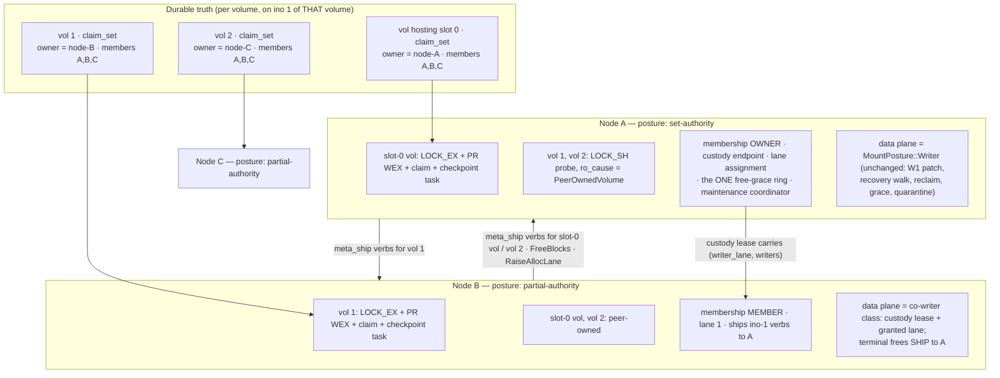
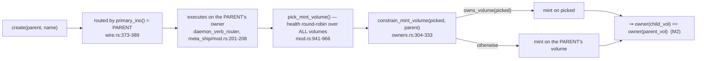
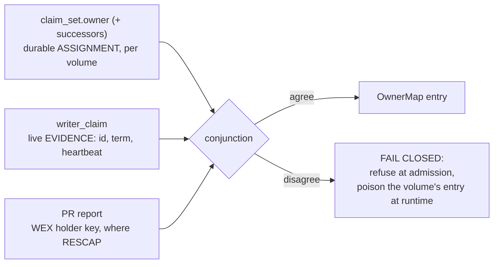

# Design: PER-VOLUME CLAIM ADMISSION — the fleet-of-authorities recipe (§6.10 R4)

| | |
|---|---|
| **Title** | Per-volume claim admission: partial-writer opens, per-volume metadata owners, and the inversion of `mint_redirects` |
| **Author** | (design agent; adjudication owner: user) |
| **Date** | 2026-08-21 |
| **Status** | **IMPLEMENTATION-READY (rev 7 — PRs 2–7 and 7b landed; PR 8, the acceptance rung, is next)** — three review rounds, 29 issues (4 critical), all addressed and independently verified against the tree; no open issues. The remaining unknowns are *measurements* (PR 0's volume-scaling row, PR 8's gate) and two product calls raised as open questions 2, 3 and 3b — not design gaps. Revision logs at the bottom of the PR plan; the review file carries the per-issue responses |
| **Repo state audited** | branch `dev`, tip `4a877c78`; the free-grace pressure valve (`39047c70`, residual 6) is in the tree |
| **Program input** | `docs/design-full-multi-writer.md` **rung-20 residual board item 3** (`:644-651`) — *"Per-volume claim admission — the fleet-of-authorities recipe (§6.10 R4): a client holding the D0 claim on ≥ 1 volume of a shared set is what makes the S10 tar-x gate meetable and inverts `mint_redirects` for real."* |
| **Binding inputs** | AGENTS.md (one source of truth); `docs/pre-rc-engineering-spec.md` §6.7 decisions 1/2, §6.9 S4/S8/S9, §6.10 **spec-R1/spec-R4/spec-R8**, §6.12; `docs/design-full-multi-writer.md` (the closed predecessor — KD-MW-1…16); `docs/design-mw-data-alloc-partition.md`; `docs/design-dynamic-meta-routing.md`; `docs/design-mw-fleet-jobs.md`; `docs/rc-manifest.md` §evidence tiers |
| **Evidence this program must move** | `.benchmarks/2026-08-18-mw-program-closing.md:52-60` (the ≈ 2.6 GiB/s single-authority ingest wall) and `.benchmarks/2026-08-17-s10-slot-placement.md` (the S10 `tar -x` gate, **NOT MET at 6.73×**) |

> **Risk-namespace note (rev 2).** Two `R`-namespaces appear in this program.
> Risks from `docs/pre-rc-engineering-spec.md` §6.10 are written **`spec-R1`,
> `spec-R4`, `spec-R8`**; this document's own register (§8) uses bare
> **`R1`…`R18`**. They are unrelated numbering.

---

## 1. Overview

Every metadata volume of a SqueezeFS set is owned by **one** node today, and
it is the **same** node for every volume: `open_meta_volume_set` opens each
path with `OpenMode::Write` in set order and releases everything it took on
the first refusal (`src/meta_backend/mod.rs:283-303`). That loop — not a
policy, not a knob — is what makes "one metadata authority per volume set"
true. Two measured consequences follow from it and only from it: the
single-authority publish plane bounds aggregate co-writer ingest at
**≈ 2.6 GiB/s independent of writer count**, and the S10 `tar -x` gate is
**structurally unmeetable** at 6.73× because a co-writer that owns no volume
has no slot its work can be placed into (`OwnerMap::volumes_owned_by` is
empty by construction on every fleet the product can mount).

This design admits **one D0 claim per volume, taken by a different node per
volume**, while keeping **exactly one appender per volume** — the §6.10 R4
law the durable format actually depends on (one journal ring, one A/B extent
bitmap, one 32-slot root ledger, one node cache per volume;
`src/meta_ship/owners.rs:5-24`). Nothing about the appender count changes;
what changes is **which node is the appender**, and that a mount may be the
appender for a *subset* of the set. The runtime machinery to consume that
answer — `OwnerMap`, the per-owner router lanes, the owner service with its
dedup/era/grace gates, publish schema 6's ~13 `owner_of(be, ino)` dispatch
sites, the S10 placement policy — is **already landed, already per-volume,
and already pinned in-process against exactly this shape**. The gap is a
durable *source* for foreign ownership entries, an admission decision that
lets a mount open a peer-claimed volume without weakening D0, and a
partial-writer open that takes only what it owns.

The recipe does **not** need incompat bit 8 (`KV_PARTITIONED_APPEND`) — that
bit expresses N appenders *inside* one volume, which this design does not
want. Bit 8 today serves only the data-plane allocation lanes.

**What rev 2 changed, in one paragraph.** The review convicted three
load-bearing errors, all confirmed against the tree. (1) Cross-owner
`unlink`/`rmdir` escapes `route_verb` — `MetaCall::named_inos` returns the
parent alone for `Unlink` (`src/meta_ship/wire.rs:392-409`) — so an ordinary
`rm` could mint a cross-owner `XvPlan`, commit its first half, fail-stop
**both** volumes and leave a durable intent that refuses the next mount.
§5.4a now carries the three mechanisms that make D18's scoped-out posture
safe for this traffic (KD-PV-11). (2) KD-PV-8's rationale was factually
wrong: C9's repair is `destroy-unreferenced-inode` (`src/fsck.rs:4400-4411`),
not a raise. The split is re-derived from the actual repair semantics and
from the direction a monotone-behind projection errs in, and the online
half shrinks (§5.9). (3) The cross-authority free-grace bound is not needed
at all and the proposed wire field was unsound: every terminal free of a
partial authority **ships** to the set authority (`plane_gate`
`src/block_allocator.rs:2144`, `execute_shipped_frees`
`src/cowriter.rs:1564`), so exactly ONE grace ring exists, on ONE clock
(§5.11). The `Grant` field is withdrawn.

**What rev 3 changed.** The round-2 review found that rev 2's fixes did not
*compose*. Its critical finding is the one that matters: **M2 plus the
disarmed migration half closed every path by which a peer authority could
come to own new work**, so on a set built by rev 2's own procedure every ino
would descend from root and belong to the set authority — `mint_redirects`
would invert for nobody and PR 8 would reproduce the 6.73× it exists to beat.
Rev 3 answers it by making ownership a property of a **subtree** established
at the same offline moment as the volume (§5.5.1, KD-PV-15), which turns the
namespace's top level into an owner partition (§5.5.2) — a real product
statement, and the shape Lustre DNE and CephFS subtree pinning already take.
Three further compositions were repaired: the inode plane's coverage
(KD-PV-7 ∧ KD-PV-14 left peer volumes at 1/K coverage — KD-PV-16 makes it
per-owner shards with an asserted gauge), the revalidation-arming predicate
(a `set-authority` latches neither latch and was skipped entirely), and the
`successors` opt-in's interaction with rung 6 and the poison predicate.

**What rev 6 changed (PR 5's implementation).** Six corrections, folded
back from the landed rung. **(1) KD-PV-13's disarm is TOTAL, not partial**:
a candidate requires a peer-owned entry, which is the disarm's own
predicate, so the launch arm (executor, one-in-flight bound, never-thrash
valve) has no reachable production caller at all — §5.5 says so now, and
the valve's coverage rides a declared test override on the
`arm_ownership` precedent so D19's follow-on inherits it. **(2) §5.10's
runtime trigger has no wire-borne holder**: `STATUS_STALE_TERM` carries
`owner_term` and nothing else, so a relearn must re-READ the volume's
durable record; silence poisons at runtime where it refuses at admission.
**(3) The derivation's refusal arms are unreachable over an OPEN set** —
PR 4's `open_peer_owned` refuses every disagreeing peer volume at the door
— so the derivation splits into a pure core plus a gather, and the ONE
disagreement reachable end to end is the shape §5.10 never named: an
assigned set mounted by a node that declared nothing while no peer runs,
where the D0 ladder grants it every claim. **(4) The gather is PR 5's**,
not PR 4's as `partial_authority`'s module doc claimed. **(5) Rung 5 is
unsatisfiable for a SET AUTHORITY as written** (`registrant_detail`
demands a held reservation; a fresh fleet's first authority holds none
until it arms one, which happens after the open) — the gather takes the
hold for that posture and `arm_multi_writer`'s rung 3 joins it. **(6) The
partial-authority ARM does not exist** and PR 5 does not build it: §5.7's
splits say which planes it must not take, but its own arm is the
co-writer client half composed with an owner half over its own volumes,
which no rung owns — the set-authority arm refuses a non-set-authority
loudly rather than half-arming, and the composition is now a named
prerequisite of PR 8.

**What rev 5 changed (PR 4's implementation).** Four corrections, folded
back from the landed rung: **KD-PV-17** supplies the holder resolution PR 3
left owed (`claim_set.holder`, an attestation the holder writes about its
OWN claim — §5.1.1's correction box carries the adjudication of the three
candidates and their cold-start behaviour); the partial set open takes the
**admission** rather than a forgeable `&[VolumeMode]`; the durable
`vol-{hex}` identity of a META volume **does not exist** in the tree and is
derived from the superblock uuid, which PR 7's operator verbs must match;
and `shutdown()` was convicted of WRITING on every authority-less posture
(reader, co-writer, peer-owned) — a shipped-path bug the "a Peer-mode
backend's shutdown is a no-op" law exposed. §5.4 carries the last three.

**What rev 4 changed.** Round 3 found no criticals and narrowed the remaining
work to KD-PV-16's *implementation path*. Three gaps are closed. **§5.8.2**
now gives the owner-shard fan-out the C4 sweep's treatment — five named sites
led by `strip_inode_plane_proposals` (`fsck.rs:1801`), a defensive filter
whose in-code contract forbids exactly what KD-PV-16 needs — together with a
coordinator-side, evidence-based admission predicate that never reads a
shard's self-declaration, and the negative-direction contract that keeps the
`fix/mw-xv-unlink-c10` mirage barred. **§5.8.0** states the
candidate-scoped/referenced-whole asymmetry that the K subtree roots would
otherwise break, anchored on the identical rule the offline shard path
already carries (`fsck.rs:240-248`). **§5.5.1** replaces the owned-candidate
filter's false justification (rung 3 is an admission-time property; volumes
are disabled at runtime) with the real one, and decides the empty-set
behaviour explicitly: fall back to the parent's volume, never panic, never a
new refusal.

---

## 2. Background & Motivation

### 2.1 The wall, quantified (both faces of one cause)

| Face | Number | Tier | Source |
|---|---|---|---|
| Aggregate co-writer ingest through ONE authority | **≈ 2.6 GiB/s, independent of writer count** | arithmetic-on-measured-constants (9,473 verbs/s × 3.6 verbs/MiB, both measured) | `.benchmarks/2026-08-18-mw-program-closing.md:52-60` |
| Serial `tar -x` on a co-writer at 250 µs RTT | **6.73×** of the authority-LOCAL S0 baseline (14.87 s vs 2.21 s), A-B-B-A agreeing < 1 % | measured-real | `.benchmarks/2026-08-17-s10-slot-placement.md` |
| Placement engagement on that row | 1,330 client-slot mints/arm, `rotor_fallbacks` **0**, `migration_candidates` **0** | measured-real | same |

The third row diagnoses the first two. Placement's *mint-targeting* half
engages perfectly; its *migration* half is structurally dark because the
policy's candidate inversion asks "does this shipping client own a metadata
volume?" and the answer is `no` on every mountable topology
(`src/meta_ship/placement.rs:340-343`, reading
`OwnerMap::volumes_owned_by`, `src/meta_ship/owners.rs:167-174`).

### 2.2 Verified current-state audit — what enforces "one authority per set"

**The D0 ladder inside one volume** (`KvMetaBackend::open`,
`src/meta_backend/kv/backend.rs:1041-1156`), in pinned order:

1. **Layer A** — `flock(LOCK_EX | LOCK_NB)` on a dedicated daemon-lifetime
   fd, taken **unconditionally, before any classification**
   (`acquire_writer_flock`, `:3608`).
2. Bootstrap replay (the read-only, torn-tolerant `open_probe` sequence).
3. **Layer B2** — `classify_claim` (`:3754-3787`) → `ClaimEvidence`
   (`:3593-3602`): `Reclaimable` / `FreshForeign` / `StaleForeign`. The
   `FreshForeign` arm refuses on **every** substrate (`:3824-3835`); the
   non-PR `StaleForeign` arm refuses naming `squeezefs claim clear`
   (`:3840-3853`).
4. **Layer B1** — PR register ladder + Write-Exclusive acquire with preempt
   arbitration (`:3860-3925`).
5. The `writer_claim` tx commits and **barriers**, then
   `spawn_checkpoint_task` + `spawn_times_drain_task` (`:1148-1149`).

**The set-level enforcement** is the loop above it: `open_meta_volume_set`
(`src/meta_backend/mod.rs:283-303`) runs that ladder on **every** path with
`OpenMode::Write` and, on any refusal at volume *k*, shuts down the backends
for `0..k` before propagating loud. `OpenMode` is
`Write | Probe | ReadOnlyMount` (`:239-247`) — **there is no partial mode**.
The mount path does not call it directly: it calls
**`open_routed_meta_set`** (`:312-397`), which runs `discover_meta_set`
first and opens `disc.ordered_paths` in **canonical `member_position`
order**, then the `mw_upgrade:` marker probe, `recover_open_intents`, and
the per-volume bring-up cover. Its reader twin is
`open_routed_meta_set_read_only` (`:407`) and its co-writer twin is
**`open_routed_meta_set_co_writer` (`:444-469`)** — the exact precedent this
design's partial twin follows.

**The metadata read-only latch** a co-writer rides is
`ro_cause = ReadOnlyCause::CoWriterMount` (`backend.rs:1306`), consumed by
`write_gate` (`:4961-5008`) at ~40 mutation sites. Its refusal text states
the law this design must not weaken: the volume *"has exactly one appender,
and it is the authority that holds the D0 claim."*

**`open_co_writer`'s per-step table** (`backend.rs:1243-1324`) is the
template: Layer A not taken (released `LOCK_SH` probe only), B2 not
evaluated, B1 not performed, no claim, no checkpoint task — and
`admission.covers(path)` refuses an admission decided over a different set
(`:1280-1289`).

**Nothing can create a foreign ownership entry today.** The one arm site is
`OwnerMap::for_volumes(meta, Vec::new())` (`src/multi_writer.rs:899-919`),
whose own comment names this exact missing piece.

**The router is not the gate for every verb.** `route_verb` inspects
`call.named_inos()` (`src/meta_ship/router.rs:233`), and
`MetaCall::named_inos` (`src/meta_ship/wire.rs:392-409`) returns
`[new_parent, ino]` for `Link`, `[old_parent, new_parent]` for `Rename`, and
**`primary_ino()` — the parent alone — for everything else including
`Unlink`**. Its own doc comment states the law: *"'Names', not 'touches':
`unlink`'s child and `rename`'s moved and overwritten inodes are discovered
under guards, so the client cannot see them and the owner checks them after
discovery."* The owner-side post-discovery checks exist
(`src/meta_ship/service.rs:1117-1157`); **the local path has none.** This is
the root of §5.4a.

### 2.3 What already exists and is reusable VERBATIM (the good news)

| Machinery | Anchor | State |
|---|---|---|
| `OwnerMap` / `owner_of_volume` / `owns_volume` / `peers` / `foreign_assignments` / `volumes_owned_by` | `src/meta_ship/owners.rs:82-201` | **Per-volume already.** No shape change |
| `arm_ownership` / `rearm_ownership` / `disarm_ownership` + the S4 lock-plane publish (`dlm_slot::install_local_slots`, `src/dlm_slot.rs:220`) | `owners.rs:223-271` | One truth for both planes; the migration-while-armed re-arm law is stated and implemented |
| Per-owner batch lanes + `route_verb`'s cross-owner refusal (**named inos only** — see §5.4a) | `src/meta_ship/router.rs:200-300` | Lock-free, one relaxed load unarmed |
| Owner service + `(client_epoch, request_id)` dedup + era/grace gates + `SHIP_CLIENT` task-local + **the post-discovery cross-owner pre-checks** | `src/meta_ship/service.rs:95-120`, `:647-671`, **`:1117-1157`** | Designed for a node that is BOTH client and owner; `:1117-1157` is the precedent §5.4a mirrors onto the local path |
| Publish schema 6, ~13 `owner_of(be, ino)` dispatch sites; `raise_alloc_lane` keys on `owner_of(be, 1)` | `src/meta_ship/publish.rs:1129-1136`, `:1652-1690` | Per-ino → per-volume → per-owner already |
| Daemon trait-boundary routing (`daemon_verb_router`) | `src/meta_ship/mod.rs:190-209`; e.g. `mod.rs:2753-2756` | No call site can bypass it **for named participants** |
| Co-writer routed open (the partial twin's template) | `src/meta_backend/mod.rs:444-469` | Discovery → canonical order → per-volume admitted open |
| Placement half 1 — per-client dedicated mint slot | `placement.rs:199-245`, hooked at `RoutedMetaBackend::pick_mint_slot` (`mod.rs:1113-1138`) | **LIVE**, 1,330 mints/arm measured |
| Placement half 2 — migration policy + thrash valve + executor seam | `placement.rs:250-438`, candidate inversion `:340-347`, executor install `src/multi_writer.rs:917-919` | **LANDED-DARK-PINNED** — and **disarmed by this design** under multi-owner (§5.5, KD-PV-13) |
| The intra-process `migrate_slot` engine + travel-exclusion list | `src/meta_backend/slot_migration.rs:480+`, `is_pinned_control_record` `:262-291` | Reused for intra-owner migration; cross-owner is D19's follow-on |
| The five-rung co-writer admission ladder | `src/cowriter.rs:438` (r1), `:485` (r2), `:550` (r3), `:600` (r4), `:675` (r5), `classify_admission` `:734-775` | The template the per-volume ladder EXTENDS, never forks |
| Shipped-free execution on the authority | `src/cowriter.rs:1564+` `execute_shipped_frees`, under `with_authority_accounting` (`:1342-1354`) | **The reason §5.11 needs no wire change** |
| Data-plane allocation lanes + the §9a lane grant | `src/data_alloc_lane.rs`, `src/alloc_lane_grant.rs` | Composed under D20 — but the *width input* is not untouched (§5.7) |
| Existing pins encoding the target shape | `tests/mw_slot_placement_tests.rs:128-213` (`fixture(vols, client_owned)`), `:501-555`, `:560-576` | **CAVEAT:** the fixture's client backend is `open_routed_meta_set_read_only` and the migration engine runs on the physically-local owner set, so those pins prove the **policy inversion** and the **engine**, not the **admission** and not a genuinely remote appender. **Both** are re-scoped in PR 5 (§5.5) |

### 2.4 The pain points this removes

1. **The publish funnel** for self-owned metadata work (zero wire verbs).
2. **The S10 gate's structural blocker.**
3. **`migration_candidates` permanently 0** — a landed, tested, dark policy
   with no reachable input (note: this design makes the *candidate* reachable
   and deliberately keeps the *migration* disarmed — §5.5).
4. **The honest product statement's scope**: spec-R1's fallback stays true,
   but "the owner" stops meaning "one box".

---

## 3. The three USER RULINGS (final — recorded as D-numbered rulings)

Settled, in the product ruling namespace (D0…D17 taken; this program takes
**D18–D20**). They must not reappear as open questions.

| # | Ruling (user, 2026-08-21) | What it fixes |
|---|---|---|
| **D18** | **Cross-owner `rename`/`link` is SCOPED OUT, with a PUBLISHED refusal rate.** The S3.5 cross-volume transaction machinery is not built and will not be built in this program. Cross-owner rename/link keeps refusing `EXDEV` (`cross_owner_error`, `src/meta_ship/mod.rs:604-616`); placement is biased so a client's subtree stays on its own volume; the program **MEASURES and PUBLISHES** the refusal rate. Accepted rationale: `mv` degrades to copy+unlink — correct but slower, never wrong | Removes the hardest correctness item from the critical path. **Rev 2 note:** the ruling scopes out cross-owner *transactions*; §5.4a supplies the mechanism that makes the scoped-out posture SAFE for `unlink`/`rmdir`, which have no copy+unlink fallback |
| **D19** | **Program depth = STATIC ownership to the gate.** Ownership is assigned by an operator verb and stays put. **Live cross-owner slot migration is a NAMED FOLLOW-ON.** Reasoning: once `mint_redirects` inverts, a client extracting into a fresh subtree mints into its OWN volume, so its publishes are local and the tar-x gate is reachable without live migration | Kills the two-party live ownership hand-off entirely (§5.2.3): the assignment verb runs **offline**, under the D0-guarded coordinator open `volume enable-multi-writer` already uses. The single largest simplification in the program |
| **D20** | **The owner of the volume hosting slot 0 is the SET AUTHORITY** for the planes that must stay singular: data-plane allocation-lane assignment, the S9 custody endpoint, and root (ino 1 pins to slot 0 via `route_ino_width`, `mod.rs:501-508`). No separate election — it derives from whoever holds that volume's D0 claim, and failover of the SET-AUTHORITY ROLE reuses the existing D0 recovery ladder | Resolves the lane partition, custody/WERO, the membership plane's multiplicity, the free-grace channel (§5.7, §5.11) and the maintenance-coordinator identity (§5.4 row 10) with **zero new election machinery** |

**One precision on D20** (KD-PV-6): the ruling says "volume 0"; the code's
invariant is `route_ino_width(1, W) == (0, 1)` — ino 1 homes on **slot 0**,
and slot 0 homes on `slot_to_volume[0]`. Because `migrate-meta-slot` can move
any slot, this design **pins slot 0 non-migratable while a multi-owner plane
is armed**, so the set authority cannot silently relocate. A refusal, not a
mechanism.

**One scope precision on D20** (rev 2, Issue 9): D20 says the *set-authority
role* fails over through the D0 ladder — and it does, because the ladder is
about a claim on one volume. It says nothing about a **non-slot-0 volume's
owner dying**, and this design does not make ownership itself fail over by
default. §5.7.1 states the posture and KD-PV-12 offers the bounded,
still-static opt-in.

---

## 4. Goals & Non-Goals

### Goals

1. A durable, per-volume statement of who appends to each volume,
   byte-identical to today on every set that names no owner.
2. A per-volume D0 admission decision reachable only from a DECLARED
   posture, so an undeclared mount's `FreshForeign` refusal is byte-identical.
3. A partial-writer open: Layer A + B1 + claim + tasks on owned volumes
   **only**, with a rollback ladder that releases exactly what it took.
4. **Every cross-owner mutation refused BEFORE any durable effect** — the
   §5.4a total-refusal law, which is also the precondition §5.9 rests on.
5. **A node must be able to come to OWN WORK** — §5.5.1's subtree bootstrap
   (KD-PV-15). Without it, goals 6 and the whole program are unreachable
   (rev 3, Issue 23).
6. `mint_redirects` inverts for real; the dark placement pins flip as one act.
7. The S10 `tar -x` gate re-run **on a valid setup** (§5.13), verdict
   published either way, alongside the published cross-owner refusal rate
   (D18) **including `unlink`/`rmdir`**.
8. The inode plane stays decidable **and covered** — its indecidability
   stated and bounded, its coverage asserted (KD-PV-16), never silently
   narrowed.
9. Everything ships DARK; the solo re-gate (`dlm_rpcs == 0`) survives.

### Non-Goals

- Cross-owner `rename`/`link` transactions (D18); live cross-owner slot
  migration (D19); N appenders inside one volume (§9 alternative (a)).
- An election, a consensus service, or a directory service.
- Automatic ownership rebalancing, and **automatic subtree placement**: which
  subtree belongs to which node is the operator's declaration (§5.5.1).
- **A second-hop mint** that would let a child's ino land on a volume its
  parent's owner does not own — explicitly rejected, not deferred (KD-PV-15).
- Any 15 k measured row.
- **Making an existing tree's cross-owner names deletable in place.** §5.4a
  states the posture; **subtree re-homing** (not slot migration) is the named
  follow-on and open question 3.
- **Serving workloads that cannot be partitioned into K weakly-interacting
  subtrees.** §5.5.2 states this as a product boundary: such workloads should
  run single-authority.

---

## 5. Proposed design

### 5.0 The shape, in one picture



The one-line law: **assignment ∧ evidence**. `claim_set.owner` says who
*should* append; `writer_claim` says who *does*. The runtime `OwnerMap` is
the conjunction, and disagreement **fails closed** (§5.10).

---

### 5.1 C1 — per-volume D0 admission

#### 5.1.1 The new `ClaimEvidence` arm, and the COMPLETE classification table

```rust
enum ClaimEvidence {
    Reclaimable,
    FreshForeign(WriterClaim),
    StaleForeign(Option<WriterClaim>),
    /// Per-volume claim admission: a heartbeat-fresh claim held by the node
    /// this volume's durable `claim_set` NAMES as its owner, opened under a
    /// per-volume admission decision taken BEFORE the open. Not a weakening
    /// of `FreshForeign` — a different door, unreachable without an
    /// unforgeable `SetAdmission`.
    PeerAuthority(WriterClaim),
}
```

`classify_claim` (`backend.rs:3754`) gains **one** predicate, at the point
where it returns `FreshForeign` today:

```
if claim.age_secs(now) <= CLIENT_STALE_TTL_SECS {
    match admission {                       // Option<&VolumeAdmission>
        Some(a) if a.recognizes(&claim) => ClaimEvidence::PeerAuthority(claim),
        _                                => ClaimEvidence::FreshForeign(claim),  // byte-identical
    }
} else { ClaimEvidence::StaleForeign(Some(claim)) }
```

`recognizes` re-checks, against the claim actually replayed, the three facts
the ladder established before the open: (a) bit 14 + the durable record names
the holder as `owner` and this node as a `Writer` member; (b) the holder's
claim is heartbeat-fresh (same predicate, inverted verdict); (c) an admission
decision exists ("declared, never inferred", `src/cowriter.rs:41-49`).

> **CORRECTION (PR 3 implementation, `2ccd7326`) — clause (a) cannot be
> written as sketched, and PR 4 owes the missing mechanism.** `recognizes`
> compares the live holder against `claim_set.owner`, but the two are not the
> same kind of name: **`WriterClaim.id` is a per-mount UUID**
> (`backend.rs:1093`, `Uuid::new_v4()` at every open) while `owner` is a
> durable KD-MW-2 member id. This is the *identical* mistake rung-9 finding #3
> already fixed once for the co-writer ladder, where it "refused every healthy
> fleet's first co-writer". PR 3's ladder therefore decides over a distinct
> evidence field `holder_member_id: Option<String>` — the gather's durable
> resolution of the live holder — and treats `None` as **silence, refused**
> (ownership never moves on silence). **PR 4 must supply that resolution**: a
> membership-census lookup, an `owner_claim_id`-style durable field on the
> claim itself, or a rendezvous-record read. The design names none of them,
> and no implementation of `recognizes` that compares the UUID directly can
> work.
>
> **RESOLVED (PR 4 implementation, `5e44c360`) — KD-PV-17, the holder
> attestation.** The holder ATTESTS ITSELF: `claim_set` gains an optional
> `holder = { id, writer_id, pid, boot }` (`src/membership.rs`), written by
> the partial open on the volumes it OWNS, after the D0 ladder committed
> their claims, and emitted only when present so an unassigned record stays
> byte-identical. `ClaimSet::resolve_holder(&claim)` admits it **only when
> the `(writer_id, pid, boot)` triple matches the claim actually replayed**,
> so a dead predecessor's leftover attestation resolves NOTHING (the open
> refuses) instead of naming the wrong node — it is an attestation about one
> specific claim, never a second truth able to disagree with the claim
> beside it. The two alternatives were rejected on their cold-start
> behaviour and their meaning: a **membership-census lookup** answers *who
> is alive*, not *who wrote this claim*, and it needs the census formed and
> the set authority reachable at the instant a peer mounts — mount ordering
> becomes load-bearing beyond §5.1.1's own requirement, and two incarnations
> of one node id are indistinguishable in it; a **rendezvous read** names
> one owner PER SET (and, since sweep row 17, only on the slot-0 volume), so
> it cannot name a per-volume holder at all. A member-ROSTER entry carrying
> the live pid was rejected too, and this is the sharp one: KD-PV-4 requires
> the roster form to stay **pid-less** so the rung-8 same-boot prune exempts
> it, so writing live pids there would re-manufacture exactly the
> assignment-vs-enrollment disagreement that precision exists to prevent.
> Cold start is unaffected: the attestation is written by the holder on its
> own volume with no peer involved, and it is read only when a peer volume
> carries a FRESH claim — which by definition means its owner is up.

> **CORRECTION (rev 10 — the partial authority's device half destroyed the
> live fence, found by the third real fleet bring-up, 2026-08-23).** Rung 5's
> device half in `gather_set_admission` called `join_wero_as_registrant`
> UNCONDITIONALLY — the co-writer arm's rung-9 finding-#1 split (co-located ⇒
> ADOPT the standing hold, remote ⇒ register; `9f0ba3df`) never reached the
> PR 7b path. On the co-located `--owners` fleet the member's PR ioctls ride
> the box's shared host association, where a Register is destructive under
> either target semantics (spec-strict: the register ladder's own-stale proof
> names the LIVE set authority's holder key and unregistering it releases the
> whole set's reservation; lenient: IEKEY replaces the authority's key in
> place, usurping its fence) — so m20's admission destroyed m0's WERO and
> then refused over the rtype-0 state it had itself created ("Arm the
> authority's multi-writer plane first", about an authority that WAS armed).
> Fix, red-first (`tests/mw_colocated_wero_tests.rs`, the finding-#1 home):
> `partial_wero_join` (rung 5's device half, extracted) routes by
> `co_located_with_set_authority` — the co-writer classifier's boot-id law
> scoped to the SLOT-0 volume's claim, because the standing WERO holder is
> the SET authority under D20 and peer volumes' claims never decide it — and
> the co-located arm adopts with the holder key cross-checked against the
> slot-0 volume's durable claim set. Remote members keep the register path,
> where the head is their own and the ladder's proof is sound.

> **CORRECTION (rev 9 — the membership-arm self-refusal, found by the second
> real fleet bring-up, 2026-08-23).** The attestation as landed did one thing
> more than this resolution specifies: `set.term = set.term.max(term)`, with
> `term` = the attesting mount's own fresh era. Written between the D0 gate
> and `arm_owner`'s predecessor read, that self-stamp made the set authority
> read its OWN era back as "the predecessor's durable term" and refuse to arm
> against itself (`term 5 <= prior_term 5`) on every `--owners` remount —
> deterministically, and retries could never heal it because each retry
> re-stamped. Two-part fix, red-first (`tests/dlm_membership_tests.rs`):
> **the attestation never advances `set.term`** (it is an attestation about
> ONE claim — not a membership change — and its era is implicit in the claim
> it names; on a record-less volume it now writes nothing, since there is no
> assignment to resolve a holder against), and **the D0 gate's
> `resolve_writer_term` maxes in every era recorded on the volume**
> (`membership::max_recorded_era` — the claim set's term, which full-writer
> arms stamp with the PROCESS-wide era, and a crashed owner's rendezvous
> term), so the claim barrier publishes a term strictly above every recorded
> predecessor's — which is exactly the remedy `MembershipOwner::arm`'s
> refusal message had been promising. Same-volume records only (sweep row
> 17(c)'s scope holds: a peer volume's era is never imported).

**The complete open-behaviour table (rev 2, Issue 17 — `classify_claim`
reaches `Reclaimable` BEFORE the freshness branch, including the
`same_host && pid_provably_dead` arm that fires routinely on the single-node
proving fleet).**

| Mode | `Reclaimable` | `FreshForeign` / `PeerAuthority` | `StaleForeign` |
|---|---|---|---|
| **`Own`** | proceed — full D0 ladder, unchanged | `FreshForeign` ⇒ refuse (unchanged); `PeerAuthority` unreachable (the admission does not name a peer for this volume) | unchanged (PR preempt, or the non-PR attestation refusal) |
| **`Peer`** | **PROCEED, DEGRADED** *(corrected — see below)* — nothing claims the volume, so nothing appends to it: its owner has not started yet (every volume of a cold fleet reads exactly this) or it is down. The open already takes no lock, writes no claim and appends nowhere, so admitting adopts nothing. It is announced loudly and counted (`peer_volume_unclaimed_admits`, gauge `meta_ship.volumes_peer_unclaimed`), and every verb about that volume refuses at the ship site until its owner arrives | `PeerAuthority` ⇒ proceed with the peer-mode open (this is the admitted path). A `FreshForeign` here means `recognizes` rejected the live holder — i.e. the claim's id ≠ the record's `owner` — which is the §5.10 fail-closed refusal | **ATTRIBUTABLE to the admitted holder ⇒ proceed, DEGRADED** (the same absent-owner state read where no dead-pid proof exists — admitting is not preempting: nothing here takes the claim). **Otherwise REFUSE the open, loud**: a TTL-stale claim that attributes to nobody, or to a node the record does not entitle, says something appended here that the assignment cannot account for. Counter `peer_volume_unclaimed_refusals`; the remedy is `squeezefs claim clear` or an offline re-assignment |

> **CORRECTION (rev 8 — the cold-start deadlock, found by the first real
> fleet bring-up).** Rev 2–7's `Peer`+`Reclaimable` row was **unsatisfiable
> by construction** and made the whole program unusable: `sudo
> tests/mw_fleet.sh create N=1 --owners=2` formats, assigns and then mounts
> the set authority first exactly as `docs/operations.md` prescribes, and
> the mount is refused at rung 6 because the peer's volume carries no
> claim. At a cold fleet start **no volume carries a claim** — the arm was
> symmetric, so the set authority could not mount before its peers and no
> peer could mount before it. Every PR 7b contract armed through
> `arm_partial_authority` or hand-built its evidence, so the suite was green
> over a product no node could start.
>
> The rule KD-PV-3 states is *never adopt on silence*, which forbids TAKING
> a volume this node is not assigned. It does not require refusing to mount
> because a peer has not started, and the two were conflated. The corrected
> law is one sentence, applied identically at all three sites (rung 6, the
> peer door, the map derivation): **where a peer volume HAS a claim it must
> agree with the assignment; where it has NONE, nothing appends there — so
> admit, adopt nothing, and let the ship path refuse.** The `StaleForeign`
> row moves with it because it is the same state read on a substrate with no
> dead-pid proof (a cross-host dead owner), and admitting as a peer is not
> preempting; what still refuses there is an unattributable claim, since age
> never makes one readable.
>
> **The availability argument, which is the whole of it:** refusing the
> mount because one owner is down takes the ENTIRE namespace down over a
> single degraded subtree, while admitting degrades only that owner's
> subtree and does so loudly. §5.7.1 / R13 already ship *"ownership does not
> fail over"* as a known availability regression — this makes the blast
> radius match that statement instead of exceeding it. Contracts:
> `rung_6_admits_a_peer_volume_with_no_live_appender_and_never_adopts_it`,
> `a_peer_owned_volume_with_no_live_claim_opens_degraded`,
> `an_assigned_volume_no_node_claims_derives_a_degraded_peer_entry`, and the
> end-to-end `a_cold_assigned_set_comes_up_through_the_mount_paths_own_reads`.

The remaining `Peer`-mode refusals are **fail-closed and fleet-visible**:
the mount does not come up, so the operator learns immediately rather than
through a half-served set. They are the operational face of Issue 9's
posture (§5.7.1) — narrowed, by the correction above, to the volumes whose
evidence the assignment cannot account for.

**Layer A and Layer B1 become per-volume**, decided by the mode vector:

| Layer | `Own` | `Peer` |
|---|---|---|
| A | `flock(LOCK_EX \| LOCK_NB)` — unchanged | released `LOCK_SH` **probe** (`probe_shared_lock`, `backend.rs:1290-1303`) |
| DUR-5 superblock repair | runs (WRITES sector 0) | **skipped** |
| B2 | full ladder | the table above |
| B1 (PR register + WEX) | unchanged | **not performed** — a WEX acquire would preempt the owner |
| claim commit + barrier | unchanged | never written |
| checkpoint + times-drain tasks | spawned | not spawned |
| `guard_heartbeat` | runs | **self-skips already** (`guard_fd.is_none() \|\| read_only`, `backend.rs:4383`) — pinned, not changed |

#### 5.1.2 A distinct read-only cause (never reuse `CoWriterMount`)

```rust
pub enum ReadOnlyCause {
    Writable, UnknownRoFeatureBits, ReaderMount, CoWriterMount,
    /// THIS volume is appended to by a PEER authority of the same set. The
    /// mount commits locally on the volumes it owns, so the refusal points
    /// at the shipped path and is counted apart from `CoWriterMount`.
    PeerOwnedVolume,
}
```

Reusing `CoWriterMount` would rot its refusal text (*"holds NO metadata
authority over it"* is false for a partial authority) and the meaning of
`cowriter_local_commit_refusals`. New counter
**`peer_volume_local_commit_refusals`** (must-stay-0, own text, same
backtrace capture).

#### 5.1.3 TWO postures, and the latch table (rev 2 — Issue 5)

Rev 1 said a partial authority latches `CO_WRITER_MOUNT` wholesale. That is
wrong for the set authority. `plane_gate` (`src/block_allocator.rs:760-781`)
refuses the accounting arms whenever `co_writer_mount()` is true outside
`authority_accounting_scope_active()`, and its own comment states the
production assumption: *"in production the authority's posture is `writer`
and the probe never fires."* A fleet in which **every** node latches
co-writer has no node that performs the W1 in-place patch, the ownership
recovery walk, or direct device reclaim.

**`mount_posture` therefore gains TWO words, one per real shape:**

| Posture | `READ_ONLY` | `CO_WRITER` | `PARTIAL_META` *(new additive latch)* | Data plane | Metadata plane |
|---|---|---|---|---|---|
| `writer` | 0 | 0 | 0 | full | full |
| `reader` | 1 | 0 | 0 | none | none |
| `co-writer` | 0 | 1 | 0 | custody + lane | none local |
| **`set-authority`** | 0 | **0** | **1** | **full — byte-identical to `writer`** (W1 patch, recovery walk, reclaim, grace ring, quarantine, local terminal frees) | local on owned volumes, shipped on peer-owned |
| **`partial-authority`** | 0 | **1** | **1** | co-writer class — byte-identical to `co-writer` (custody + granted lane; terminal frees SHIP) | local on owned volumes, shipped on peer-owned |

`PARTIAL_META` is read **only** by `mount_posture()` and the per-volume
metadata gate. Every data-plane consumer of `co_writer_mount()` /
`read_only_mount()` is **unedited**, which is the S9 latch discipline
(`fuse_client.rs:645-650`) honoured rather than asserted: changing a
predicate's meaning at ~40 sites at once is precisely what that comment
forbids. PR 4 carries a sweep row that walks `co_writer_mount()`'s consumers
and states, per site, which posture it is correct for.

**The cost this makes visible instead of hiding (rev 2).** On a K-node fleet,
K−1 nodes are `partial-authority` and therefore lose the **W1 sole-owner
extent patch** (a lifetime incarnation retire is durable ownership state and
the §5.1 clone/patch fence is a two-word process-local protocol no wire can
compose — `src/cowriter.rs` module docs). Their isolated small overwrites
ride CoW-rewrite + a shipped free instead of one in-place sub-block DMA. That
is a real regression against the 61–67 k IOPS W1 path on those nodes, it is
**not** recoverable inside this program, and it is:
- **priced** — PR 8 carries a rand-4k row on a partial authority vs the same
  workload on the set authority vs single-authority today, all three labeled;
- **instrumented** — `patch_ineligible_*` (the decision ledger) plus
  `cowriter_accounting_refusals` on the partial authorities;
- **filed** as risk R14 (§8) and as a named residual for the follow-on.

---

### 5.2 C2 — the claim set names per-volume owners

#### 5.2.1 The two options, adjudicated

| | **(i) `owner` on EACH VOLUME's own record** *(chosen)* | (ii) a replicated set-wide `volume_owners` table |
|---|---|---|
| Truth lives | in the volume it describes, beside that volume's `writer_claim` | on ino 1, read by everyone |
| Disagreement | **structurally impossible** — one record, one volume | two volumes can carry different generations; R5's cache divergence becomes *durable* |
| Atomic re-assignment | bracketed, not atomic | atomic |
| Composition | composes with `is_pinned_control_record` (`slot_migration.rs:262-291`, which already pins `claim_set`), `upsert_writer_member`'s per-volume commit, and `ClaimSet::store`'s bit-14 refusal | needs a new record class, travel rule, fsck class, and a hard dependency on the slot-0 volume being up to change any assignment |

**KD-PV-2: option (i).** The atomicity advantage buys nothing under D19, and
the bracket that replaces it is the nine-bit stamp's own mechanism: a durable
**`owner_assign:` intent marker** on ino 1 of the slot-0 volume, written
first and deleted last, with a writable mount refusing while it exists — the
`MW_UPGRADE_MARKER_XATTR` pattern verbatim (`mod.rs:326-372`).

#### 5.2.2 The record change

```rust
pub struct ClaimSet {
    pub v: u32,
    pub term: u64,
    pub members: Vec<ClaimSetMember>,
    /// The durable member id that appends to THIS volume.
    /// `None` = the legacy shape (the set's sole authority appends to
    /// everything) — every set today.
    pub owner: Option<String>,
    /// KD-PV-12 (opt-in): ordered, statically-declared adoption candidates
    /// for this volume. Empty by default — ownership does NOT fail over.
    pub successors: Vec<String>,
    #[serde(skip)] pub durable: bool,
}
```

`encode` emits `owner`/`successors` only when non-empty, so an unassigned set
is **byte-identical** to today's record; `decode` uses the existing tolerant
`get(...).and_then(...)`. The singleton projection is untouched:
`from_writer_claim` (`:268-285`) sets both empty, `load` (`:360-376`) still
falls back with `durable = false`, `store` (`:381-391`) still refuses without
bit 14, and `registrant_keys()` / the rung-8 prune do not read them.

**PR 2's red-first contracts (rev 2 — Issue 16 adds the RMW half, which is
where the field can be silently LOST):**

| Contract | What it pins |
|---|---|
| `a_set_with_no_owner_encodes_byte_identically_to_the_pre_program_record` | the byte-identity law |
| `the_singleton_projection_never_carries_an_owner` | projection purity |
| `store_refuses_an_owner_without_bit_14` | the bit-14 law |
| `a_pre_program_record_decodes_with_owner_none` | forward tolerance |
| **`an_upsert_preserves_the_owner_and_successors`** | `upsert_writer_member`'s decode→mutate→store RMW (`membership.rs:426-470`) |
| **`the_dead_writer_prune_preserves_the_owner_and_successors`** | the rung-8 prune path (`:433-465`) |
| **`an_undecodable_claim_set_on_an_ASSIGNED_volume_refuses_rather_than_resetting`** | the decode-failure fallback `ClaimSet::decode(&raw).unwrap_or_else(\|\| ClaimSet::empty(term))` — which today would silently drop `owner` and convert a multi-owner volume into the legacy shape, i.e. **an ownership loss that reads as a legitimate posture**. On a bit-14 volume under an armed plane or a marker, the fallback becomes a loud refusal |
| **`a_last_member_withdrawal_preserves_the_assignment`** | **the FIFTH loss site, convicted during PR 2's implementation and missed by this table's rev-2 enumeration**: `withdraw_writer_member` DELETES the record when the departing member is the last one (`ClaimSet::clear`), so a fleet-wide unmount would carry every volume's assignment away with it — an ownership loss with no operator act behind it. Under D19 an assignment is durable operator state that outlives every mount, so an assigned volume keeps its memberless record and only `set-owners --clear` removes it; unassigned sets still vanish exactly as before (both directions pinned). It fails loud at PR 3 rung 3 rather than diverging, but loud-and-wrong is still wrong |
| **`an_owner_field_survives_a_migrate_slot_of_any_other_slot`** | `is_pinned_control_record` already pins `claim_set` (`slot_migration.rs:275`) — pinned as a contract, not an inference |

#### 5.2.3 The hand-off problem, dissolved by D19

Only a volume's own authority may `upsert_writer_member`, so an *online*
hand-off is inherently two-party. **D19 deletes the problem.** The assignment
verb (§6.1) opens the whole set under the D0-guarded coordinator open, so it
is momentarily the sole authority of every volume and writes every record
itself, in one bracketed pass.

**KD-PV-4: it writes the enrollment in the same act.** Every fleet member
becomes a durable `Writer` member of **every** volume's claim set. This kills
per-volume two-party enrollment and removes `SQUEEZEFS_MW_MEMBERS` from the
partial-authority arming path (the knob survives unchanged for the
pure-co-writer topology).

**KD-PV-4 precision (rev 2 — Issue 14).** The verb enrolls the **pid-less
roster form** (`pid = 0`, empty `boot`, no endpoint) — exactly the form
`enroll_members` writes today (`src/cowriter.rs:792-800`) and exactly the
form the rung-8 same-boot prune **exempts** (`membership.rs:437-441`:
`m.identity.pid == 0 || m.identity.boot.is_empty()` ⇒ retained). Without
this, on the single-node proving fleet — the only measured-real venue, where
every member shares one boot id — killing a partial authority and then having
any peer upsert would prune the dead member's entry while `claim_set.owner`
still names it, manufacturing an assignment-vs-enrollment disagreement that
rung 3 refuses and §5.10 poisons **on a fleet behaving normally**. Contract:
`a_killed_owners_enrollment_survives_a_peer_upsert_on_one_boot`.

---

### 5.3 C3 — the per-volume admission ladder

The ladder is `src/cowriter.rs:734-775` **extended, never forked**.

| Rung | Today (anchor) | Under per-volume admission |
|---|---|---|
| **1** declaration | `:438-481` | new role values **`set-authority`** and **`partial-authority`**. `SQUEEZEFS_MW_AUTHORITY` = the SET authority's endpoint (D20); a `set-authority` role needs none (it *is* the endpoint) |
| **2** engaged claim set | `:485-545` — iterates volumes demanding a **uniform** verdict | **per-volume verdict vector.** Bit 14 + a durable record still required on every volume; the OWNER reading becomes per volume |
| **3** durable enrollment | `:550-596` | per volume, plus: a volume this node will own must name it as `owner` (or list it in `successors`, KD-PV-12); a peer-owned volume's `owner` must be a `Writer` member. `owner == None` on one volume of a set where another names one ⇒ **refuse loud** (the incomplete-assignment shape the marker also covers) |
| **4** live authority | `:600-660` — `max` over every volume's claim term | **per volume**, because terms diverge per owner. The membership authority's term is compared against the **slot-0 volume's** claim term (D20); each peer-owned volume's own claim term is learned/refused independently through `era_relearns`. **CORRECTION (PR 3): this row describes only the PARTIAL-authority arm.** A set authority *is* the membership owner under D20, so demanding a granted lease of it makes the posture unreachable — it requires none, and refuses only on a **provably foreign** live membership owner (a non-empty `owner_claim_id` that is not this node; a legacy empty value proves nothing and must not refuse) |
| **5** device registrant | `:675-720` | unchanged in substance; the WERO hold is joined, never forked (`data_custody::acquire_wero:774-790`) |
| **6** *(new)* ownership coherence | — | **assignment ∧ evidence per volume**, per §5.1.1's complete table. An own-mode volume must classify `Reclaimable`, **or `StaleForeign` on a PR substrate where the D0 ladder's preempt would grant it** (rev 3, Issue 24: rev 2's text said `Reclaimable` only, which was narrower than both §5.1.1's `Own`/`StaleForeign` cell and KD-PV-12 clause (ii), and would have made the successor opt-in unusable). A peer-mode volume that CARRIES a claim must resolve its holder to a durable id **in that volume's assignment set** (`owner` ∪ `successors`, §5.10) — fresh or TTL-stale alike; anything else refuses (never adopts). **A peer-mode volume with NO claim is admitted DEGRADED** (rev 8's cold-start correction — nothing appends there, so there is nothing to disagree with and nothing is taken) |
| **7** *(new)* the freeze precondition | — | **every peer-owned volume's projected `claim_set` must carry an `owner`.** This is what §5.9 rests on and it is self-certifying: a monotone projection that shows the assignment record shows every commit that preceded it on that volume (§5.9.2). Refuse if any peer volume's projection predates its own assignment |

**Three more PR 3 corrections to this section.** (a) The **verdict vector is
produced by rung 3, not rung 2**: rung 2 answers the per-volume *owner
reading*, and a mode cannot be resolved before rung 3 has refused a partial
assignment map — resolving earlier would require an "unassigned mode" that is
never legal. (b) **Rung 2 does not demand a live `writer_claim` per volume**
(the co-writer ladder's clause does): under per-volume admission an own-mode
volume is legitimately unclaimed, so the claim evidence belongs to rung 6,
where §5.1.1's table already puts it. (c) **`VolumeMode::Peer.owner_id` is the
live HOLDER, not the record's `owner`** — §5.10's adoption reading taken to
its conclusion, since after a KD-PV-12 adoption the record still names the
dead predecessor and shipping to `owner` would ship to a corpse;
`owner_endpoint` is best-effort and its absence is announced, never refused
(a peer's endpoint is only in the live census, so refusing would make the
FIRST node of a fleet unmountable).

**Contract-table gap (PR 3):** §5.1 has no contract table — PR 3's contract
names came from the PR-plan row plus §5.3's single pin. PR 4 should not expect
one here either; the authoritative per-rung list for the admission ladder is
`tests/pv_admission_tests.rs` as landed.

**The ladder's output — keyed by durable identity, not by position
(rev 2 — Issue 8):**

```rust
pub enum VolumeMode {
    Own,
    Peer { owner_id: String, owner_endpoint: String },
}
pub struct SetAdmission { /* unforgeable; classify_set_admission is the only ctor */ }
impl SetAdmission {
    pub fn covers(&self, paths: &[String]) -> bool;
    /// Keyed by the DURABLE `vol-{hex}` identity (KD-5) — resolved to an
    /// index only AFTER `discover_meta_set` has produced the canonical
    /// order. `None` = the admission does not name this volume (refuse).
    pub fn mode_for(&self, vol_id: &str) -> Option<&VolumeMode>;
    pub fn owns_any(&self) -> bool;
    pub fn is_set_authority(&self) -> bool;   // owns the slot-0 volume
}
```

§6.1 is emphatic that a `<vol-id>` is never an ordinal or a set position, and
the runtime object must not contradict it: the mount path's order is
`disc.ordered_paths` (canonical `member_position`), **not** the caller's URI
order (`mod.rs:312-325`). An index-keyed vector plus a permuted URI list
would take the **full D0 ladder — flock + PR WEX + claim — on a volume a peer
owns**: the worst outcome in the program, reached by an off-by-permutation
rather than a race. Pin:
`a_set_admission_resolves_modes_by_durable_volume_id_not_by_position`,
exercised with a URI order that differs from the canonical order.

---

### 5.4 C4 — the partial-writer open and the site sweep

Two functions, mirroring the co-writer pair:

```rust
enum OpenMode { Write, Probe, ReadOnlyMount, PartialWrite(VolumeMode) }

/// The per-volume mode loop + the rollback ladder.
pub async fn open_meta_volume_set_partial(
    ordered_paths: &[String], modes: &[VolumeMode],
) -> Result<Vec<Arc<KvMetaBackend>>>;

/// **The mount path's entry point** — the twin of
/// `open_routed_meta_set_co_writer` (`mod.rs:444-469`): discovery →
/// canonical order → resolve `SetAdmission` modes by durable vol id →
/// the partial set open → the marker probes → the ownership-scoped
/// intent recovery → the owned-volume bring-up cover → RoutedMetaBackend.
pub async fn open_routed_meta_set_partial(
    paths: &[String], admission: &SetAdmission,
) -> Result<Arc<RoutedMetaBackend>>;
```

**The rollback ladder releases only what it took.** A `Peer`-mode backend
holds no flock, claim or reservation, so its `shutdown()` is a no-op —
correct, and pinned in both directions
(`a_partial_set_open_failure_releases_exactly_the_owned_volumes_guards`).

> **CORRECTIONS (PR 4 implementation, `8792aacb`).**
>
> 1. **The set-level open takes the `SetAdmission`, not `modes: &[VolumeMode]`.**
>    `VolumeMode` is a plain public enum any caller can construct, so a mode
>    vector would make the peer door reachable with a FABRICATED decision —
>    the exact property `SetAdmission`'s private fields exist to prevent
>    (`open_peer_owned` re-checks the decision itself). Landed signature:
>    `open_meta_volume_set_partial(ordered: &[String], vol_ids: &[String],
>    admission: &SetAdmission)`.
> 2. **The durable `vol-{hex}` identity of a META volume does not exist in
>    the tree.** §5.3 and §6.1 both key modes on it (KD-5, "never a path, an
>    ordinal, or a set position") but the only `vol-{hex}` a metadata volume
>    carries is `FormatConfig.meta_volumes`, a documented MIRROR: absent on
>    every set the lifecycle verbs never touched and synthesized as
>    `meta-pos-{position}` by `config_ops` — keying admission on it would key
>    it on a POSITION after all. PR 4 therefore derives the identity from the
>    volume's **superblock uuid** (`kv::backend::durable_volume_id_of` —
>    `vol-{xxh3(uuid):016x}`), which is the sole per-volume durable identity a
>    mount can read before any tree is routed and which `MetaSetDiscovery`
>    already carries in canonical order. **PR 7's `set-owners`/`get-owners`/
>    `locate` must print the SAME derivation**, or an operator's `<vol-id>`
>    will not match the one admission resolves.
> 3. **A shipped-path bug the rollback law convicted**: `shutdown()` ran
>    `checkpoint_now()` whenever no checkpoint task existed — which is
>    exactly the reader, co-writer and (new) peer-owned postures — so a mount
>    whose contract is *"cannot and will not write"* WROTE at teardown. Now
>    those three causes tear down without touching the volume; §4.11's
>    unknown-ro degradation (a WRITE mount holding Layer A) keeps its shipped
>    path.

#### The sweep — 18 rows

| # | Site | Anchor | Verdict |
|---|---|---|---|
| 1 | The D0 claim loop | `mod.rs:283-303` | **Change**: per-volume mode vector + the rollback ladder |
| 2 | `mw_upgrade:` marker probe on `backends[0]` | `mod.rs:326-372` | **Keep** — a READ served from bootstrap replay in either mode; an incomplete nine-bit upgrade still refuses every writable mount. **Add** the sibling `owner_assign:` probe, same refusal shape |
| 3 | S3.5 cross-volume intent recovery | `mod.rs:386` → `crossvol_tx.rs:988-1030`; coordinator = step 0's volume (`:642-646`) | **§5.4a** — rewritten in rev 2 |
| 4 | Bring-up residue cover (WRITES) | `mod.rs:393-395` | **Change**: owned volumes only |
| 5 | Checkpoint + times-drain tasks | `backend.rs:1148-1149` | **Structural**: the `Peer` path does not run `open()`'s tail. Pin `a_peer_owned_volume_spawns_no_checkpoint_or_times_drain_task` |
| 6 | Conveyor pass-task identity | `backend.rs:1105-1107` | **Keep** — construction identity; no pass can run because `write_gate` refuses first |
| 7 | Claim heartbeat + B2 refresh | `backend.rs:4383`, `:4487-4505` | **No change**: already returns early on `guard_fd.is_none() \|\| read_only`. Pin it |
| 8 | Membership: `upsert_writer_member` + the owner branch | `membership.rs:2037-2043`, `:2202` | **Change**: the "write mount ⇒ lease AUTHORITY" branch keys on **owning the slot-0 volume** (D20); `upsert_writer_member` runs on owned volumes only. **LANDED (PR 4)**: the branch tests the slot-0 volume's own posture (`owns_slot_0_volume` — it APPENDS to it, rather than a declared role that could disagree with the open), so a partial authority joins as a WRITER MEMBER; the upsert loop filters to `!is_read_only()` volumes |
| 9 | Lane derivation over ALL volumes' claim sets | `multi_writer.rs:953-1000` | **Change**: only the set authority derives (D20, §5.7) |
| 10 | fsck / defrag / jobs coordinator | `fsck.rs:1111, 2011, 2049, 2332, 6065, 6107`; `defrag.rs:194, 486, 526`; `jobs.rs:714, 1971` | **§5.4b** — the predicate, in rev 2 |
| 11 | `config_ops` offline volume verbs | `config_ops.rs:1052, 1100, 1337` | **Change, and rev 2 corrects the stated mechanism.** `live = \|t\| !t.starts_with("sqmeta://")` (`main.rs:4362`, `:4638`) is a **target-FORM test**, not a liveness probe — it is false for any URI regardless of what is mounted anywhere. The real enforcement is the **D0-guarded coordinator open**, which refuses on a peer's fresh claim. The "every owner of this set must be unmounted" wording belongs in *that* refusal (naming the volume and the observed holder), never on `live()` |
| 12 | `cluster_wire::discover_peers` | `cluster_wire.rs:1206` | **Keep** — reads only; `peers_from_registrations` dedupes by id and requires a fresh heartbeat |
| 13 | `slot_migration::finish_flip`'s set-wide write loop | `slot_migration.rs:840-870` | **Change**: `migrate_slot` refuses when either endpoint volume is peer-owned (D19's follow-on) and refuses slot 0 outright while armed (KD-PV-6). **This refusal is load-bearing for §5.9's freeze** |
| 14 | `plane_gate` / `alloc_plane_gate` | `block_allocator.rs:760, 809` | **No edit — and rev 2 makes it a two-posture statement.** A `set-authority` latches neither `READ_ONLY` nor `CO_WRITER`, so its data plane is byte-identical to `writer`. A `partial-authority` latches `CO_WRITER`, so both gates keep their exact classes and texts. **New sub-row:** PR 4 walks every `co_writer_mount()` / `read_only_mount()` consumer and states, per site, which posture it is correct for |
| **15** | **Reader-revalidation arming is per-MOUNT and must become per-VOLUME — and the predicate itself must change, because a `set-authority` latches NEITHER latch** | `fuse_client.rs:20612-20621` — `if reader_mount \|\| co_writer { arm_reader_data_plane(…); arm_reader_coherence(&routed.volumes, …); spawn_reader_revalidation(routed.volumes.clone(), …) }`; obligation stated at `backend.rs:1268-1271` | **Change, correctness-class — rewritten in rev 3 (Issue 26).** Rev 2 named only the partial authority, but §5.1.3's table gives a `set-authority` `READ_ONLY = 0` and `CO_WRITER = 0`, so this branch does not run for it **at all** — and a set authority holds K−1 peer-owned volumes. Un-armed, its node caches for those volumes never step epochs: it serves its mount-time read indefinitely and never runs the R-6 purge, on the node that coordinates maintenance, serves custody and owns ino 1. **The two arms must be split and re-predicated:** `arm_reader_data_plane` iff `CO_WRITER` (reader, co-writer, partial-authority — **never** set-authority, which has a full data plane); `arm_reader_coherence` + `spawn_reader_revalidation` **over the peer-owned subset** for *any* mount that holds one — reader (all volumes), co-writer (all), partial-authority (peer subset), **set-authority (peer subset)**. Arming an OWNED volume in either posture trips `meta_kv_revalidate_dirty_skips`, a must-stay-0 counter. §5.11(a)'s formulation ("this mount runs a revalidation cadence") is the right predicate and row 15 now uses it. Pins: `a_partial_authority_arms_revalidation_on_peer_volumes_only_and_dirty_skips_stays_zero` **and** `a_set_authority_arms_revalidation_on_its_peer_owned_volumes_and_dirty_skips_stays_zero`; the set-authority row joins row 14's posture-by-site audit table. **LANDED (PR 4)** as a per-VOLUME predicate keyed on each volume's own `ReadOnlyCause` (`ro_coherence::volume_wants_revalidation`) rather than on a posture word: a mount arms exactly the volumes it does not append to, which is every volume on a reader/co-writer (unchanged), the peer-owned subset on both partial-writer postures, and none on a writer. `arm_reader_data_plane`'s own predicate is unchanged, because `reader_mount \|\| co_writer` already IS "iff CO_WRITER (∪ reader)" once a partial authority latches it |
| **16** | **R-6 purge amplification** | `ro_coherence::purge_reader_block_keys` (`:101-128`) drops the **entire** cached block census per epoch step, deliberately un-scoped | **Named cost, measured not fixed.** With K−1 armed peer caches each checkpointing at up to `CHECKPOINT_MAX_AGE_MS = 1000` (`kv/checkpoint.rs:933`), a partial authority pays up to K−1 whole-tier purges/second. Scoping the purge needs the per-offset attribution item 3 exists to avoid inventing. **PR 0 measures it** (read-tier hit-rate collapse vs K) and PR 8 carries the row; if it dominates, it is the follow-on's first item |
| **17** | **The membership rendezvous record** | `arm_owner` writes `publish_owner_record` to **every** volume (`membership.rs:2189-2201`); `arm_member` selects the record with the **highest term across all volumes** (`:2313-2320`); `prior_term` is a max over volumes (`:2131-2141`) | **Change, correctness-class.** Under multi-owner only the set authority may write, so peer volumes retain **stale** `membership_owner` records that nobody can remove (pinned against slot travel, `slot_migration.rs:275`) and that max-term selection may pick — pointing members at a dead endpoint. Fix: (a) the owner writes its record **only to the slot-0 volume** while a multi-owner plane is armed; (b) `arm_member` selects **the slot-0 volume's record**, not a max; (c) `prior_term` reads the slot-0 volume only. Pin `a_member_joins_the_slot_0_owner_and_never_a_stale_peer_rendezvous`; the assignment verb **deletes** stale rendezvous records from non-slot-0 volumes as part of its bracket. **LANDED (PR 4)**: `rendezvous_volumes` scopes (a)(b)(c) while `partial_meta_mount()` is latched; every other posture reads the whole set verbatim |
| **18** | **The routed open itself** | `open_routed_meta_set` (`mod.rs:312-397`) is what the mount path calls; every site in rows 2/3/4 lives inside it | **Change**: the partial twin `open_routed_meta_set_partial` above, modeled on `open_routed_meta_set_co_writer` (`:444-469`) |

---

### 5.4a Row 3 rewritten — cross-owner `unlink`/`rmdir` (rev 2, Issue 1; KD-PV-11)

**What rev 1 got wrong.** It asserted that "after the split, a cross-owner
intent cannot be MINTED: the router refuses at `route_verb`". `route_verb`
inspects `call.named_inos()` only, and for `Unlink` that is the **parent
alone** (`wire.rs:392-409`). `daemon_verb_router` likewise returns `None`
when no *named* participant is peer-owned (`meta_ship/mod.rs:201-208`). So
`RoutedMetaBackend::unlink` (`mod.rs:1839`) runs **locally** with an owned
parent and a peer-owned child.

**What happens then, verified end to end.** The cross-volume branch
(`mod.rs:2023-2081`) builds an `XvPlan` and calls `crossvol_tx::execute`
(`:828`), which commits **step 0 (`RemoveDentry`, carrying the intent
record) on the owned parent volume**, barriers it, and only then applies
`SetNlink` on the child's volume — where `write_gate`'s new
`PeerOwnedVolume` arm refuses. `escalate_midplan` (`crossvol_tx.rs:952-973`)
then **fail-stops BOTH volumes** (`routed.disabled_volumes.insert`) and
leaves a durable open intent spanning two owners. The name is gone, `nlink`
was never decremented, no process in the fleet can roll it forward, and the
next mount hits case (c) and refuses. **One ordinary `rm` takes two volumes
offline and bricks the set's next mount.**

This is not rare. `create` picks the child's volume from health/balance
(`mod.rs:1546` → `pick_mint_volume` → `constrain_mint_volume`), so on any set
converted from a single-authority history most parent→child pairs are already
cross-**volume**; after assignment most become cross-**owner**.

**D18 is not reversed. Three mechanisms make the scoped-out posture safe.**

**M1 — a local cross-owner pre-check at child discovery (mandatory,
correctness-class).** `RoutedMetaBackend::{unlink, rename, link}` gain the
pre-check the owner side already runs (`service.rs:1117-1157` is the exact
precedent and the exact text): resolve the participants under the guards the
op already holds, and if any one's volume owner is not this node, refuse
`cross_owner_refusal(verb, participant, …)` — **`EXDEV`, before any `XvPlan`
is minted**. No durable effect, no intent record, no fail-stop. This is not a
policy choice; the alternative is the corruption path above.

**Coverage is by construction, and the participant set is plural (rev 3).**
Every `XvPlan` construction site in the tree sits inside exactly the three
methods M1 names — `mod.rs:2072` (unlink; `rmdir` rides its `XvOp::Rmdir`),
`:2201` (link), `:2477` (rename, plain arm) and `:2667` (rename, exchange
arm) — so a pre-check in those three methods cannot be bypassed. The rename
arms check **more than one child**: the moved ino, the overwrite victim, and
— on `RENAME_EXCHANGE` — both participants. The precedent already has the
right shape (`service.rs:1140-1150` loops over
`[(old_parent, old_name), (new_parent, new_name)]` and refuses on any
participant this node lacks authority for); M1 reuses that loop rather than
checking "the child", singular. Pin:
`the_rename_precheck_covers_the_moved_ino_the_overwrite_victim_and_both_exchange_participants`.

**M2 — the placement invariant that makes the class unreachable for
everything the fleet creates.** `constrain_mint_volume(picked, parent)`
(`owners.rs:304-333`) already redirects a mint into the parent's volume when
`picked` is peer-owned, and a `create` always executes on the parent's owner
(routed by `primary_ino()` = the parent). Therefore, for every ino minted
under an armed plane:

> **`owner(child_volume) == owner(parent_volume)`.**

Cross-owner parent→child pairs can then arise from exactly three sources,
all closed: `link`/`rename` (caught by `named_inos` at the router **and** by
M1 locally **and** by the owner side), slot migration (refused cross-owner by
row 13), and **the tree that existed before assignment**. Pin:
`every_ino_minted_under_an_armed_plane_shares_its_parents_owner`.

**M3 — the pre-existing tree is measured at assignment, and acknowledged.**
The assignment verb runs the same single `TREE_DENTRIES` pass C9 already runs
(one pass, `InoBitmap`-shaped) and reports the **cross-owner dentry
population** the proposed assignment would create: the exact count, the
per-volume breakdown, and a bounded sample. It then **refuses** unless the
operator passes `--accept-cross-owner-names <N>` matching the counted number
(the VL4 capacity-preflight discipline: *refusals print the numbers*). What
the operator is acknowledging is stated in the refusal verbatim:

> *"N existing names resolve to inodes on a volume their parent's owner will
> not own. Those names cannot be unlinked, renamed or relinked in place while
> this assignment stands: `unlink`/`rmdir` on them will return EXDEV, and
> unlike `rename` there is no copy+unlink fallback. Remedies: assign
> ownership on a set with no such names (the fresh-fleet recipe), reduce N by
> re-homing offline, or clear the assignment (`volume set-owners --clear`),
> delete, and re-assign."*

**The honest product statement — corrected in rev 3 (Issue 23).** Rev 2's
shape list was **backwards**: it recommended "a fresh or near-empty set" as
the intended deployment, which is precisely the shape that delivers **zero**
inversion (§5.5.1), and it treated the pre-existing spread tree as merely
costly when it is in fact *both* costly and inversion-less. The corrected
list:

| Shape | Cross-owner name population (M3) | Does the inversion happen? | Verdict |
|---|---|---|---|
| **(a) A fresh set with per-owner subtree roots minted by the assignment verb (§5.5.1)** | **exactly K** — one per subtree root, whose dentry lives in the parent directory on the set authority's volume while its ino lives on the assignee's | **YES** — every descendant of a root inherits that root's owner by M2 | **The recipe's supported deployment** |
| (b) An existing tree, assigned as-is | large, measured, per-volume | **NO** — the tree's inos are spread by `pick_mint_volume` history, not by subtree, so no node owns a coherent working set | **Not recommended.** It pays the whole refusal population and buys nothing. The verb prints both numbers and the operator must acknowledge |
| (c) An existing tree **re-homed** | reduced to (a)'s K | YES, after the pass | The named follow-on |

The K root names of shape (a) are the *entire* undeletable-in-place
population on the supported deployment: `rmdir` of a node's workdir root
returns `EXDEV`, which is a teardown act (`volume set-owners --clear`), not a
workload. Everything **inside** a subtree is ordinary POSIX, including
`unlink`, because M2 makes every descendant's ino share its parent's owner.

Note honestly that re-homing by slot migration cannot co-locate an arbitrary
parent/child pair — inos map to slots by `route_ino_width`, i.e. by ino
arithmetic, not by subtree — so a genuine re-homing pass is a **subtree
re-mint + copy**. Rev 3 records the consequence for the follow-on's scope:
cross-owner *slot* migration would move a child's inode record without its
parent's dentry, i.e. it would **create** cross-owner names rather than
remove them. **The follow-on is therefore subtree re-homing, not slot
migration**, and it subsumes both D19's deferred item and open question 3.

**Case (c) is reclassified.** An intent whose steps span two owners is now
**reachable-by-bug, not unreachable**: it is what M1 exists to prevent, and
its detection at mount stays fail-closed (refuse, naming the offline remedy)
with **`xv_cross_owner_intents` a must-stay-0 counter** and a named red-first
repro (`a_cross_owner_unlink_refuses_before_the_plan_is_minted`, plus its
negative twin `the_pre_check_absent_shape_is_what_fail_stops_two_volumes`
run against the injected pre-M1 behaviour through a test seam, so the repro
records *why* the pre-check exists).

**The three arms at mount, unchanged in substance:** (a) an intent wholly
inside volumes THIS node owns → rolled forward; (b) wholly inside a peer's →
skipped and logged once, its owner rolls it forward; (c) spanning two owners
→ refuse the mount loud.

**The assignment verb is still a barrier**: it refuses to write the first
owner record while ANY volume carries an open intent (`xv_scan_intents` is
one bounded range per volume and finds nothing on a healthy set).

---

### 5.4b Row 10 specified — the maintenance coordinator (rev 2, Issue 12)

Today the coordinator is the D0 writer-claim holder, unique because one node
holds every claim. Under the recipe **every** partial authority holds a claim
on some volume, so any "do I hold the claim?" predicate is true on all K
nodes: K concurrent fsck/defrag/job coordinators over one set.

**The predicate (KD-PV-14):** the maintenance coordinator is **the owner of
the volume hosting slot 0** — D20's set authority, which is also where the
job records live (`src/jobs.rs:1438` writes them through the routed
`setxattr(ROOT_INO, …)`, so `daemon_verb_router` already ships them to slot
0's owner). One predicate, already-durable records, no election.

- **A non-coordinator's `squeezefs fsck` / `defrag` / `job submit`
  invocation refuses loud**, naming the set authority's identity and
  endpoint (from `get-owners`), rather than starting a second coordinator.
  **What the refusal covers, precisely (rev 3, Issue 25):** it refuses the
  **coordinator-class** acts — minting a job record, planning shards,
  applying repairs — and **not** a peer authority's participation as an
  owner **shard**. §5.8.1's KD-PV-16 fans the inode plane out to every owner
  precisely because the alternative is 1/K coverage; a shard is a
  fencing-checked result *proposal* on the existing wire, not a second
  coordinator, and it is what the coordinator's plan asked for. The refusal
  text says which of the two the operator hit.
- **The offline whole-set pass** — §5.9's full-teeth fallback — requires
  **every owner unmounted**. That is a fleet-wide maintenance window and it
  goes in `docs/operations.md` (PR 7) beside the R13 posture row.
- Red-first: `exactly_one_node_coordinates_on_a_k_node_fleet`;
  `a_non_set_authority_refuses_to_coordinate_naming_the_set_authority`.
- Fleet shard planning aligns to S8 slot ownership, which KD-MW-16 already
  built as a locality nicety and this design makes **load-bearing** (§5.8).

---

### 5.5 C5 — inverting `mint_redirects`, and disarming the migration half

**`constrain_mint_volume` is untouched.** Once a node owns a volume,
`owns_volume(picked)` is true and the redirect stops firing for picks that
land there. Global inos are untouched: `route_ino_width` is pure arithmetic
over `(ino, width)`, pinned
(`ownership_assignment_never_changes_route_ino_width`, R4).

**Rev 2's claim of "no code change at the mint funnel" was wrong on both
halves, and §5.5.1 fixes both.** The inversion does not happen at all unless
a node owns a *subtree* (Issue 23), and the funnel does need one change —
the owned-candidate filter on `pick_mint_volume` — without which
`mint_redirects` is a structural constant and a multi-volume owner gets no
balance. Read §5.5.1 before this section's remaining claims.

**But the migration half must be DISARMED (rev 2, Issue 4 — KD-PV-13).**
The policy's target is `let target = owned[0]` where
`owned = map.volumes_owned_by(client)` (`placement.rs:340-347`) and the
victim is a slot whose home volume is **not** in that set (`:360-363`).
Every migration the policy can trigger is therefore, by construction, a
**cross-owner** slot migration — which row 13 refuses (D19). Composed
naively: `migration_candidates` and `migrations_triggered` grow, the executor
launches (`:417`), the engine refuses, `migrations_failed` grows, and the
policy retries on every sustained supply event, bounded only by the thrash
valve's cooldown. **A permanent error-logging loop on a healthy fleet.**

So:

- `note_supply_event`'s launch arm is **inert while a multi-owner plane is
  armed** — evidence and `migration_candidates` may still count (they are
  the follow-on's demand signal), but nothing is triggered and nothing fails.

> **CORRECTION (PR 5 implementation, rev 6): the disarm is TOTAL, and the
> launch machinery therefore has no reachable production caller.** A
> candidate exists only when `volumes_owned_by(client)` is non-empty, which
> requires a PEER-owned entry in the map — which is exactly the disarm's
> predicate (`OwnerMap::multi_owner`). So "candidates counted, nothing
> triggered" is not a policy narrowing that leaves the rest of the arm
> live: **the executor, the one-migration-in-flight bound and the
> never-thrash valve become unreachable together**, and the valve's own pin
> (`two_clients_alternating_on_one_directory_never_ping_pong_the_slot`)
> would have died with them. They are kept — D19's named follow-on is what
> re-arms them — behind the declared
> `placement::TEST_MIGRATION_DISARM_OVERRIDE`, on the `arm_ownership`
> precedent (*"public and reachable so the shipped and refused behaviours
> are tested rather than commented"*). The alternative was deleting the
> half outright under the no-dead-code law; that would have made §11.2's
> "nonzero = the disarm broke" reading vacuous and left the follow-on to
> rebuild the valve from git history.
- `SQUEEZEFS_SLOT_PLACEMENT`'s registry text says so (§6.2).
- §11.2 records that `migrations_triggered` / `migrations_failed` are
  **structurally 0 under multi-owner** until the follow-on lands.
- **The pin flip is TWO tests, not one** (rev 2): `:560-576`
  (`the_policy_stays_dark_when_no_client_owned_volume_exists`) is re-scoped,
  **and** `:501-555`
  (`the_migration_policy_engages_on_sustained_client_concentration`) — which
  asserts `migrations_completed >= 1` and `migrations_failed == 0` — is
  re-scoped to the **disarmed** posture (candidate counted, nothing
  triggered), with the in-process engine behaviour it exercised preserved as
  a directly-invoked engine test so the follow-on inherits its coverage.

---

### 5.5.1 How a node comes to own WORK — the subtree bootstrap (rev 3, Issue 23; KD-PV-15)

**The defect rev 2 introduced.** M2 (§5.4a) and the disarmed migration half
(§5.5) together close *every* path by which a peer authority could come to
own new work, and rev 2 supplied no replacement. Traced in the tree:



Compose that induction with the root pin — ino 1 → slot 0 → the set
authority's volume (KD-PV-6) — and **every ino created under an armed plane
descends from root and therefore belongs to the set authority**.
`client_mint_slot` cannot escape it: its candidate set is filtered
`v == volume_idx` (`placement.rs:220-223`), so it chooses a slot *within* the
volume `constrain_mint_volume` already fixed. `reserve_intent_supply` is
constrained identically (`mod.rs:1191-1197`). On a set built by rev 2's own
§7 procedure, K−1 nodes would own **empty** volumes, ship 100 % of their
metadata verbs, and PR 8 would reproduce the 6.73× it exists to beat.

**The resolution: ownership is a property of a SUBTREE, established at the
same offline moment as the volume assignment.** M2 is not the problem — it is
the property that keeps `rm` working (§5.4a) — so the fix is not to lift it
but to give it the right *initial condition*.

> **KD-PV-15.** The assignment verb **mints each owner's subtree root on the
> volume it is about to assign to that owner**, in the same offline bracket.
> Every descendant then inherits that owner by M2, with no second hop, no
> migration, and no new runtime mechanism.

**Why the verb can do this with existing machinery.** It runs offline as the
sole authority of every volume with the ownership plane **unarmed**, and
`constrain_mint_volume` returns its input verbatim when unarmed
(`owners.rs:312-315`). More directly, the preset path already exists for
exactly this shape: `RoutedMetaBackend::create_with_rdev_preset(parent, name,
…, Some(IntentCreatePreset { global_ino, ts_ns }))` (`mod.rs:1511-1521`)
routes a **pre-supplied global ino** to its own volume
(`target_v_idx = self.route_ino(p.global_ino).0`, `:1544`). So the verb, for
each `<vol-id>=<member-id>:<path>`:

1. picks a mint slot hosted by the target volume (`pick_mint_slot`),
2. mints the ino from that slot (`allocate_local_ino_in_slot`, `:1145`) —
   which by `make_global_ino_width` routes to the target volume by
   construction,
3. creates the directory through the preset path, and
4. records the `(path, vol-id, ino)` triple so `get-owners` can print it.

Deterministic: no round-robin luck, no create-then-inspect dance.

**The manual fallback**, for an operator who prefers to place roots by hand:
create them **before** assignment while the plane is unarmed, when
`pick_mint_volume`'s health round-robin still spreads mints across all
volumes, then assign each volume to the node whose root landed there. This
needs the operator to *see* where a directory landed, which nothing exposes
today (verified: no `route_ino`/slot-map surface in `src/main.rs`) — hence
the new `squeezefs volume locate <path>` verb in §6.1.

**What it costs: exactly K cross-owner names**, one per subtree root (dentry
in the parent directory on the set authority's volume, ino on the assignee's).
They appear in M3's census, they are the whole undeletable-in-place
population on the supported shape, and `rmdir` of a workdir root is a
teardown act rather than a workload.

**The owned-candidate filter (a second, smaller finding of the same trace).**
Under an armed plane `pick_mint_volume` still round-robins over **all**
volumes and `constrain_mint_volume` then redirects the (K−1)/K of picks that
land on peers — so `mint_redirects` grows *structurally on every node*, and,
worse, the redirect always lands on the **parent's** volume, which means a
node owning two or more volumes gets **no health/balance placement among its
own volumes at all**. Rev 3 therefore filters `pick_mint_volume`'s candidate
set to owned volumes when the plane is armed, leaving `constrain_mint_volume`
as the backstop it was designed to be. Unarmed ⇒ no filter ⇒ byte-identical.
This restores balance *and* restores `mint_redirects` to a genuine
must-stay-≈0 health signal instead of a structural constant (§11.2).

**The filter's justification, corrected in rev 4 (Issue 29).** Rev 3 said
"rung 3 guarantees the set is non-empty". **It does not, and not at the
moment it matters.** Rung 3 is an *admission-time* property — this node owns
≥ 1 volume when it mounts — while `pick_mint_volume` skips volumes present in
`disabled_volumes` (`mod.rs:947-949`), which the fail-stop lattice populates
**at runtime** (`mirror_volume_failure`, `escalate_midplan`'s double insert,
the health plane). A node whose owned volumes have all been disabled has an
**empty** filtered candidate set, and the stated invariant would be false
exactly when it is relied on. An implementer who trusted it would reasonably
write `candidates[idx]` or an `expect()` — a panic in a mount-lifetime path,
which under the release profile is an `abort` (the ENG-10 no-panic-on-a-knob
discipline, same class).

**The honest argument, and the decided behaviour: fall back, do not refuse.**
`pick_mint_volume` already ends its candidate build with
`if candidates.is_empty() { return parent_v_idx; }` (`mod.rs:953-955`), and
under M2 `parent_v_idx` **is owned by construction** (the create executes on
the parent's owner). So the filter's empty case is already covered by an
existing arm that lands on an owned volume, and the very next statement —
`check_volume_enabled(target_v_idx)?` (`mod.rs:1550`) — turns "that volume is
also disabled" into a clean, typed error rather than a mint onto a dead
volume. That ladder is strictly better than a new refusal: it degrades a
placement *preference* without inventing a second failure mode for a
condition the fail-stop lattice already reports, and the operator-visible
signal stays the one they already watch (`disabled_volumes` +
`writer_guard_fenced`). The filter is therefore a **preference, never a
gate** — stated that way in the code comment so the empty arm cannot be read
as unreachable.

Pins: `an_armed_mint_pick_never_proposes_a_peer_owned_volume`;
`a_two_volume_owner_balances_across_both_of_its_own_volumes`; and
**`an_armed_mint_pick_with_every_owned_volume_disabled_falls_back_to_the_parents_volume`**
(with its follow-on assertion that a disabled parent volume then produces the
`check_volume_enabled` error and never a panic).

---

### 5.5.2 What this means for the namespace — an owner-partitioned top level

This is a product statement, not a footnote, and it belongs in
`docs/operations.md` (PR 7) in these words:

> **At fleet scale SqueezeFS presents an owner-partitioned namespace.** The
> operator divides the tree into K subtrees, one per authority. **Inside** a
> subtree everything is ordinary POSIX. **Across** subtrees, `rename` and
> `link` return `EXDEV` (D18) and the K subtree roots cannot be `rmdir`'d in
> place.

Three consequences, stated honestly:

1. **`mv` across subtrees works**, because coreutils degrades to copy+unlink
   on `EXDEV` and — this is the part the subtree model buys — **the unlink
   half is intra-owner** (the source's parent and ino share an owner by M2),
   so it is an ordinary local unlink. D18's accepted rationale holds
   *because* of KD-PV-15, not in spite of it.
2. **`ln` across subtrees simply fails.** A hard link has no fallback.
   Applications that hard-link across the partition must be placed inside one
   subtree. This is the sharpest edge of the topology and §5.13 measures it.
3. **The partition is the unit of scaling.** A workload that cannot be
   divided into K weakly-interacting subtrees does not benefit from the
   recipe and should run single-authority.

**Prior art makes this a normal shape rather than an apology.** Lustre DNE
remote directories and CephFS subtree pinning (`ceph.dir.pin`) both expose a
per-subtree metadata-server assignment with restricted or expensive
cross-boundary `rename`/`link`. The difference here is deliberate: those
systems perform an expensive distributed transaction; SqueezeFS **refuses it
loudly and publishes the refusal rate** (D18), which is the S3.5 ruling
restated as a product property.

---

**Placement bias for D18/M3.** The refusal rate D18 publishes is a function
of placement, and two existing mechanisms carry the bias with no new
machinery: the per-client dedicated mint slot (`client_mint_slot`, stable per
`(client, volume)`, chosen outside the volume's mint set) and
`constrain_mint_volume`'s parent-volume fallback — which is also M2, the
invariant that makes cross-owner unlink unreachable for new work.

---

### 5.6 C6 — the router, the service, and the dual role

A reachability statement, not new construction:

- `route_verb` computes per-ino ownership and refuses `EXDEV` when a verb's
  **named** participants span owners (`router.rs:227-278`). §5.4a supplies
  the discovered-participant half on the local path.
- The owner service already carries the dedup window, the era gate and the
  grace gate, and already splits `stale_term_refusals` (as owner) from
  `era_relearns` (as client) — precisely so a dual-role node cannot
  double-count one failover.
- `daemon_verb_router` at the trait boundary means the daemon's ino-1
  writes — including the `client:{id}` heartbeat
  (`fuse_client.rs:11942-11979`) and the job records (`jobs.rs:1438`) — ship
  to the slot-0 volume's owner with no call-site edit.
- `raise_alloc_lane` already keys on `owner_of(be, 1)`
  (`publish.rs:1652-1690`): a partial authority ships its lane reservation
  because the `alloc_lane:` record lives on ino 1. Not an adaptation — the
  existing code being right.

---

### 5.7 The set-authority planes (D20)

| Plane | Singular because | Mechanism |
|---|---|---|
| **Allocation lanes** | two nodes deriving a width from a roster is the collision the partition exists to prevent (`alloc_lane_grant.rs:161-249`) | ONLY the set authority runs `derive_lane_assignment`; peers install `(writer_lane, writers)` from the custody lease via `install_mount_partition`, which already refuses a second, different partition loud |
| **Lane reservation records** | `alloc_lane:` lives on ino 1 | already shipped by `raise_alloc_lane`'s peer arm. Gauges: `alloc_lane_shipped_reservations > 0`, **`alloc_lane_raise_refusals == 0`** |
| **Custody / WERO** | the hold is joined, never forked; `SQUEEZEFS_MW_AUTHORITY` is one endpoint | the set authority serves custody for the whole set; `authorize_dma` untouched |
| **Membership + the free-grace channel** | the bound is a process-wide scalar fed by ONE owner; the label is the owner's own monotonic instant | the set authority is the membership OWNER, and it is the ONLY node whose grace ring ever arms (§5.11) |
| **Terminal frees, tier purge, reclaim, quarantine** | set-wide device state | a partial authority latches `CO_WRITER`, so `plane_gate` refuses locally (`block_allocator.rs:2144`, `:2362`) and the free SHIPS; `execute_shipped_frees` (`cowriter.rs:1564+`) runs the whole ladder on the set authority under `with_authority_accounting` |
| **Maintenance coordination** | K self-appointed coordinators otherwise | §5.4b |
| **Root (ino 1)** | `route_ino_width(1, W) == (0, 1)` | slot 0 pinned non-migratable while armed (KD-PV-6) |

**The lane-width cost, priced (rev 2, Issue 15).** KD-PV-4 enrolls every
fleet member as a `Writer` on every volume, and `LaneAssignment::derive`
unions Writer members across all claim sets (`alloc_lane_grant.rs:161-195`)
with `writers()` rounding **up to a power of two** (`:213-216`). So a K-node
fleet runs `W = next_power_of_two(K)`:

| K nodes | W | `alloc_lane_stranded_bytes` ≈ `cap × (W−K)/W` |
|---|---|---|
| 2 | 2 | 0 % |
| 3 | 4 | 25 % |
| 5 | 8 | 37.5 % |
| 8 | 8 | 0 % |
| 9 | 16 | 43.75 % |
| 16 | 16 | 0 % |

And a **hard fleet-width bound**: `MAX_LANES = journal::MAX_APPENDERS = 16`
(`alloc_lane_grant.rs:119`, `kv/journal.rs:173`), refused loud past it
(`:179-190`). **K ≤ 16 owners**, independent of the volume count. §4's
"the lane partition is untouched" refers to its *mechanism*; its **width
input is not untouched**, and this table goes in `docs/operations.md`
§Multi-writer capacity planning (PR 7). Operators are advised to size fleets
at powers of two.

> **CORRECTIONS (PR 5 implementation, rev 6).**
>
> 1. **Rung 5 is unsatisfiable for a SET AUTHORITY as §5.3 writes it.**
>    `registrant_detail` demands `reservation_held` — but a fresh fleet's
>    first set authority holds no reservation until it arms one, and the
>    arm runs *after* the open. The gather therefore takes the WERO hold
>    for the `set-authority` posture (a granted rtype-3 hold IS the
>    device's answer to all four of rung 5's questions: the arm refuses a
>    namespace with no reservation support, and the holder of a
>    Write-Exclusive-Registrants-Only reservation is by construction one of
>    its registrants) and `arm_multi_writer`'s rung 3 then JOINS the
>    standing hold, which is what its own doc always said it does. A
>    `partial-authority` keeps the co-writer shape: `join_wero_as_registrant`.
> 2. **The partial-authority ARM does not exist, and PR 5 does not build
>    it.** This table says which set-singular planes a partial authority
>    must not take; it does not say what it *does* arm, and no rung owns
>    that composition: the co-writer client halves (a custody lease from
>    the set authority, the lane installed from it, the publish client and
>    the daemon verb router) composed with an OWNER half serving only the
>    volumes it appends to (a listener with the meta + publish services and
>    **no** custody service). `arm_multi_writer` is the SET authority's
>    arm; reaching it without owning the slot-0 volume now **refuses
>    loudly** rather than half-arming a mount that would grant custody
>    nobody may hold or mint lanes nobody granted. **PR 8 cannot run a
>    fleet until that arm lands** — it is a named prerequisite of the
>    acceptance rung, not a residual.
> 3. **A multi-owner map needs the daemon verb router on BOTH postures.**
>    §5.6 reads it as the co-writer's client half, but a set authority also
>    holds peer-owned volumes, and its own daemon writes on them (the
>    `client:{id}` heartbeat, job records, ino-1 traffic) would otherwise
>    meet the peer write gate and count
>    `peer_volume_local_commit_refusals`. `arm_multi_writer` installs it
>    whenever the derived map is multi-owner.

> **CORRECTIONS (PR 7b implementation, rev 7).** Correction 2 above is
> **DISCHARGED**: `multi_writer::arm_partial_authority` is the arm, its
> client half is `cowriter::install_client_halves` (extracted from
> `cowriter::arm` unchanged, so the two postures cannot drift), and its
> owner half is `MetaShipService::with_authority(map.local_volume_set())`
> + `PublishService` + the S10 delegation host on a listener with no
> custody service. Building it found four things this section did not say.
>
> 1. **The endpoint a peer's verbs ship to was resolved from the wrong
>    plane.** `derive_ownership` read the claim-set roster first, and an
>    armed membership OWNER writes its MEMBERSHIP plane's address into its
>    own member entry (`membership::arm_owner`) — a listener that serves
>    membership verbs only. On any assigned set the set authority's
>    metadata verbs would therefore have gone to a port answering
>    `RPC_UNKNOWN_VERB`. Fixed: the DECLARED `SQUEEZEFS_MW_AUTHORITY`
>    (D20's one operator-declared endpoint) wins for the slot-0 owner, in
>    one shared `EndpointBook` both arms and the refresh pass read.
> 2. **Nothing published where a PARTIAL authority serves.** §5.10 says a
>    peer's endpoint is "resolved from DURABLE state — its own claim-set
>    member record", but the only writer of that field was the membership
>    owner, and a partial authority is a member, not the owner (a member's
>    `JoinRequest` carries `endpoint: None`). The arm now edits its OWN
>    enrollment on the volumes it owns, carrying `id`/`pid`/`boot`/`pr_key`
>    verbatim — KD-PV-4's pid-less form is load-bearing (a live-pid entry
>    is prunable by the rung-8 same-boot sweep, and pruning a node the
>    record still ASSIGNS a volume to manufactures the
>    assignment-vs-enrollment disagreement rung 3 refuses the whole set
>    over) and `pr_key` is the registrant a drain proof preempts.
> 3. **"An absent endpoint is announced, never refused" is not survivable
>    on its own.** The admission ladder forces the order — rung 4 needs a
>    LIVE membership lease, and the set authority owns that plane — so the
>    set authority ALWAYS derives its map before any peer exists, and its
>    entries for them would stay endpoint-less for the life of the mount.
>    `owners::refresh_peer_endpoints` + a bounded cadence fill them in
>    (moving no ownership: only an EMPTY endpoint is filled), and both are
>    structurally inert on the all-local map every unassigned set derives.
> 4. **The set authority's own S8 service was unscoped.** `arm_multi_writer`
>    built `MetaShipService::new` = authority over EVERY volume, so under a
>    multi-owner map a stale client's frame about a PEER's volume would
>    have been executed here instead of meeting `not_owner`. It is now
>    scoped to the derived local set — identical on an all-local map,
>    which is what keeps the shipped path unchanged.
>
> The mount path took the same sweep: a declared partial authority is a
> CLIENT posture too, so it skips the WERO acquire (its preflight
> registered), the ownership-recovery walk, the maintenance coordinator
> (KD-PV-14) and the second membership arm, and it DOES arm the fleet
> worker KD-PV-16's owner shards are leased over — five sites that read
> `co_writer_mount` alone and would each have killed or corrupted the
> mount.

#### 5.7.1 Failover — corrected (rev 2, Issue 9)

Rev 1 said failover was "the existing D0 recovery ladder, verbatim. The
successor re-derives lanes…". **That was wrong for a volume's ownership.**
Under D19 + rung 6, ownership is decided by the durable assignment, and
§5.10's law is "never adopt on silence" — so for a volume whose `successors`
list is empty **there is no successor**. The D0 ladder answers *"may I take
this claim?"*, not *"may I become this volume's owner?"*, and only the same
node id restarting can use it.

**The default posture, stated plainly and put in the guarantee table:**

> **Ownership does not fail over.** If a partial authority dies, the volumes
> it owns have no appender: **that owner's subtree stops** — every verb about
> it refuses loud at the ship site — while the rest of the set keeps serving,
> and every other node still MOUNTS (§5.1.1's rev-8 correction; the degraded
> state is announced at admission, at the open and as
> `meta_ship.volumes_peer_unclaimed`, so the failure stays immediate and
> visible). The repair is `squeezefs volume set-owners`, an **offline** verb
> requiring every node unmounted — a fleet-wide maintenance window. Failure
> probability scales with K while MTTR goes from "the next mount reclaims" to
> "schedule an outage". Compared with today's single authority, this is an
> **availability regression of the same order as the throughput gain** (risk
> R13, S2) — bounded, since rev 8, to the dead owner's own subtree rather
> than to the whole namespace.

**KD-PV-12 — the bounded, still-static opt-in.** `claim_set.successors:
Vec<String>` (ordered, empty by default, written by the same offline verb).
A node may adopt a volume iff (i) it is named in `successors`, **and** (ii)
the D0 ladder would grant the claim anyway — `Reclaimable` (dead-pid proof /
own residue) or `StaleForeign` on a PR substrate (device-fenced preempt),
**never** `FreshForeign`, **and** (iii) the durable term bumps through S2's
existing ladder. No new mechanism: the D0 ladder is the arbiter, so two
successors racing is resolved exactly as two writers racing one volume is
resolved today, and the derived map (`assignment ∧ evidence`) needs no
rewrite of `owner` at failover — `successors` widens the *assignment* side
and the claim disambiguates. `successors` empty ⇒ the posture above, which
stays the default because a declared successor is a durable statement an
operator must mean.

Counters: `owner_adoptions` (an adoption occurred — expected 0 on a healthy
fleet, nonzero is the stop-and-read signal) and `owner_adoption_refusals`.

---

### 5.8 R2 — the writer era's ino floor under N eras per set

C9's zero-FP rests on `minted_in_prior_era` (`backend.rs:2130`; the era-floor
fields and their capture are `:660-679` and `:1846-1855`): only records below
the floor captured at open are candidates, and a keyspace with no floor is
never a candidate (fail-closed).

The floor is **already per volume and per keyspace**, and a volume has
exactly one appender, so the property survives verbatim *for that volume's
owner*. What does not survive is a **peer** running C9 over a volume it does
not append to: its floor there is a snapshot of a cursor another node
advances, so a record minted by the owner after the peer's open reads as
prior-era — a false-positive generator.

**KD-PV-7: the C9 CANDIDATE set is scoped to volumes the evaluating node
OWNS.** Not a weakening — the same "residue from the current mount is
reported by the next one" law, one axis over: *residue on a volume this node
does not append to is reported by that volume's owner*. Enforcement:
`FsckOptions` gains `owned_volumes: Option<Vec<usize>>` beside the existing
`inode_plane` flag, and the fleet shard planner's slot-ownership alignment
becomes load-bearing.

#### 5.8.0 CANDIDATE-scoped, REFERENCED-whole — and why the subtree roots are the case that breaks (rev 4, Issue 28)

The word **candidate** in KD-PV-7 is load-bearing and rev 3 left it to
inference. The **referenced** set must still come from a dentry pass over
**every** volume, because a name living on a peer's volume can reference an
ino this owner is responsible for.

**Rev 3 made that materially more dangerous than it was**, because KD-PV-15
deliberately creates a population of inodes **whose only name is
cross-owner**: the K subtree roots, whose dentry lives in the parent
directory on the set authority's volume while the ino lives on the
assignee's. An implementer who reads "scoped to volumes the evaluating node
owns" and scopes *both* halves — a natural misreading — produces
`C9Unreferenced` for **every subtree root on the supported deployment**: K
guaranteed false findings on a healthy fleet, forever, against the very
population the design just introduced.

**The rule already exists in the tree, one axis over, and generalizes
verbatim.** The offline `--shards k/N` path states it (`src/fsck.rs:240-248`):

> *"**C9's shard rule**: a shard covering a subset of INODES still needs the
> full referenced set for those inodes, so it filters dentries by the child
> ino their VALUE carries (`child_ino % N == k`) — **never by the dentry key,
> whose parent ino says nothing about which inode is named**. Every shard
> therefore walks the whole dentry tree but marks only its own residue:
> sharding divides the bitmap and the inode pass, not the dentry walk."*

KD-PV-16's owner shard is that rule with **one predicate swapped**: the
residue test becomes `owner(route_ino(child_ino).0) == me` instead of
`child_ino % N == k`. The clause the existing comment italicises — *never by
the dentry key* — is precisely Issue 28's hazard, already convicted once in
this codebase for the ino-residue axis.

**The test is arithmetic, with no projection dependency.** `route_ino` is
pure `(ino, width)` arithmetic (`mod.rs:501-508`) and the `OwnerMap` is a
process-local snapshot, so classifying a foreign name costs no read and no
coherence assumption. What the pass reads on peer volumes is the dentry tree
itself, which for the cross-owner subset is **frozen** (§5.9.2).

**The honest cost, stated rather than buried:** each owner's shard pays a
**full dentry scan of the whole set**. The fan-out parallelises the *inode*
half of the plane, not the dentry half — exactly the trade the offline shard
rule already makes, and the reason `fsck_dentry_refs_indexed` will grow ~K×
across a fleet pass relative to a single-authority pass over the same tree.

Contract (PR 6):
**`a_verb_minted_subtree_root_is_never_a_c9_candidate_on_its_owners_shard`**
— the cheapest possible insurance on the population KD-PV-15 introduces —
plus `an_owner_shards_dentry_pass_covers_every_volume_not_only_its_own`.

#### 5.8.1 The coverage composition — corrected in rev 3 (Issue 25)

Rev 2 justified completeness with *"reported by that volume's owner"*, which
**requires every owner to run its own inode-plane pass** — and then §5.4b
(KD-PV-14) made a non-set-authority's `squeezefs fsck` refuse outright.
Composed, only the set authority ever runs the plane, its candidates are its
own volumes, and **no peer-owned volume's inodes are evaluated online by
anyone**: coverage silently drops from the whole set to 1/K of it, on the
plane whose entire purpose is catching crash-residue leak and loss shapes.
Worse, PR 6's gate (`fsck_findings == 0` at K = 2 and K = 4) would have
passed *trivially*. A detector that covers nothing fails the same way as one
that lies.

**The fix: separate COORDINATION from DETECTION.** What must be singular is
the job fabric — durable `job:`/shard records, shard planning, and repair
application — not a read-only detection pass over volumes a node appends to
itself.

> **KD-PV-16.** Under multi-owner the inode plane becomes an **owner shard**:
> the set authority's fleet fsck job fans out one inode-plane shard **per
> owner**, each owner evaluates the classes over **its own volumes** on its
> own coherent view, and returns findings as fencing-checked **proposals**
> over the existing job-shard wire (`src/job_wire.rs`, KD-MW-16). The
> coordinator merges. The one-view law is restated as **"one coherent view
> per OWNER over its OWN inos"** — which is exactly what KD-PV-7 already
> implies.

**Why this does not undo the `fix/mw-xv-unlink-c10` fix.** That campaign's
mirage came from *reader-view* shards: S5 members whose per-volume
projections sat at different instants mid-churn. An **owner** shard is
different in kind — it reads records it **appends to**, so its view of its
own inos is authoritative rather than a projection, and the only projected
reads it makes are of the frozen cross-owner reference set (§5.9.2), which
cannot change. The distinction is the whole reason the restatement is safe,
and it is stated in the code comment that carries it (`fsck.rs:331-345`).

**Repair stays owner-applied and coordinator-planned.** Only a volume's owner
can commit to it, so the safe raises (§5.9.3) are applied by the owner under
the coordinator's plan, through the existing fencing-checked result-proposal
path — the same `job_remote_*` shape the VL2b wire already ships. The
destructive trio is report-only online regardless (§5.9.3), so nothing
destructive is ever driven by a shard.

**The site this runs through is named in §5.8.2**, because the filter that
currently forbids inode-plane proposals is defensive on purpose and cannot
simply be turned off.

**Coverage becomes an assertion, not a claim.** New gauge
**`fsck_inode_plane_volumes_covered`**; a completed fleet pass must satisfy
`fsck_inode_plane_volumes_covered == volume_count`, and an owner shard that
does not report makes the pass **INCOMPLETE** (the existing law — an
incomplete dentry pass records no verdict) rather than silently narrowing.
PR 6's gate is amended: `fsck_findings == 0` **and** full coverage at K = 2
and K = 4. Contract:
`the_union_of_online_owner_shards_covers_every_volumes_inode_plane_at_k4`,
and the coverage guarantee is stated in `docs/operations.md` (PR 7).

> **CLARIFICATION (PR 6 implementation, rev 7): "INCOMPLETE" is the
> PASS's verdict, not the findings'.** An owner shard that does not report
> leaves its volumes unevaluated; it does not invalidate the volumes that
> WERE evaluated, because each owner's candidates are its own records and
> its reference set is a whole-set dentry pass. So the findings that came
> back stand, the coverage gauge states what was reached, and the loud
> line names the unreachable owners and their volumes. The "records no
> verdict" law keeps its original scope: a pass whose OWN referenced set,
> live set or freeze precondition failed (§5.9.2's box).

#### 5.8.2 The site KD-PV-16 must invert, and the predicate that admits it (rev 4, Issue 27)

KD-PV-16 is a sound *decision* that runs straight through a mechanism built
to forbid exactly what it now needs, and rev 3 never named that mechanism.
This section gives it the C4 sweep's treatment — anchor, verdict, predicate —
because it is the one place a faithful-but-wrong implementation re-admits the
convicted mirage.

| # | Site | Anchor | Verdict |
|---|---|---|---|
| **F1** | `strip_inode_plane_proposals` — unconditionally drops every `"C9" \| "C10"` finding and **zeroes six inode-plane counters** (`nlink_mismatch_{high,low}`, `nlink_zero_named`, `dangling_dentries`, `nlink_names_counted`, `nlink_transient_cleared`, `current_era_exempted`) | `src/fsck.rs:1801-1816` | **Becomes conditional** on the admission predicate below. Its existing behaviour is the `else` arm, byte-identical |
| **F2** | The fleet merge loop's call site + its loud log | `src/fsck.rs:1580-1589` | **Change**: evaluate the predicate per report before stripping; the retained path folds, the stripped path keeps today's text and loudness verbatim |
| **F3** | `FleetOutcome { shard, payload }` — **carries no worker identity**, although the wire has it in hand at both send sites (`holder.worker_id`, `job_wire.rs:2170` and `:2392`) | `src/jobs.rs:1015-1018` | **Change**: add the lease **holder's** `worker_id`, filled by the wire from its own lease table. This is what makes the predicate evidence-based instead of self-declared |
| **F4** | `fold_finalize_counters`, whose comment says *"The inode plane is judged exclusively at finalize (one-view law): its counters exist only here — shards skip the classes and member proposals are stripped — so the fold is exact, never a double count"* | `src/fsck.rs:1421` | **Change**: that premise is exactly what KD-PV-16 retires. The inode-plane counters now come from the **union of ADMITTED shards** (including the coordinator's own local shard) rather than from finalize. Getting this wrong double-counts every owner's findings — name it, do not leave it to inference |
| **F5** | `FsckOptions::inode_plane`'s doc — *"`true` everywhere except the FLEET plane … Fleet shards therefore skip the plane"* | `src/fsck.rs:331-345` | **Change**: the skip becomes posture-conditional (an **owner** shard evaluates it; a **member/reader** shard still skips it), and the comment carries the §5.8.1 "different in kind" reason so the next reader meets it at the code |

**The admission predicate — coordinator-side, evidence-based, and stated
three times because each clause is a place an implementer could take the
shard's word instead:**

> Admit a `C9`/`C10` finding **F** from shard report **R** iff
> 1. R arrived under a live, fencing-valid lease **the coordinator itself
>    issued** (the existing law, unchanged); **and**
> 2. the lease **holder's** `worker_id`, read from **the coordinator's own
>    lease table** and never from R's payload, names a peer that **the
>    coordinator's own `OwnerMap`** says owns volume V; **and**
> 3. V is derived by **the coordinator's own `route_ino`** from F's ino — and
>    for `C10DanglingDentry`, which carries an explicit `vol` beside its
>    `child_ino` (`fsck.rs:471-475`), **both** `vol` and
>    `route_ino(child_ino).0` must be owned by that worker.
>
> Otherwise: the existing drop path, unchanged text, unchanged loudness.

**Why the lookup is direct and needs no mapping table.** A fleet worker's
`worker_id` **is** `cowriter::node_member_id()` — the mount's durable KD-MW-2
enrollment id (`src/fleet_worker.rs:10`, armed at `src/main.rs:6054-6057`) —
which is the same identity space as `claim_set.owner` and
`PeerOwner::peer_id`. So clause 2 is one `OwnerMap` lookup on an id the
coordinator already trusts, and the *only* other worker-id shape in the tree
(`"{hostname}:{pid}"`, the standalone `squeezefs job worker` verb,
`main.rs:1997`) can never appear in an `OwnerMap` — so a foreign or older
binary's shard **keeps hitting the existing drop path unchanged**, which is
the property that preserves the mirage's regression barrier.

**Two arming facts that must not be "fixed" by a later reader.** The fleet
worker arms under `(reader_mount || co_writer_mount) && …`
(`main.rs:6049-6053`): a **partial authority** latches `CO_WRITER` so it arms
and can be leased a shard; a **set authority** latches neither (§5.1.3) so it
does **not** arm one — correctly, because it is the coordinator and runs its
own shard through the existing local path (`reports.push(run(ctx,
&local_shard(k)).await?)`, `fsck.rs:1540`). Coverage therefore closes as
*coordinator-local ∪ admitted owner shards*, and neither half is optional.

**Counters.** `fsck_inode_plane_proposals_admitted` — the engagement
instrument, which must be **> 0** on any K ≥ 2 fleet pass, since coverage
that closes without an admitted proposal came from nowhere — and
`fsck_inode_plane_proposals_stripped`, which **must stay 0 on a homogeneous
fleet** and whose growth means a non-owner is proposing the plane, i.e. the
mirage path is live.

> **CORRECTION (PR 6 implementation, rev 7) — the fan-out needed a
> MECHANISM this section did not name, and three of its parts are places
> the pass silently loses its own proposals.** Rev 4 gave the predicate
> the sweep's treatment and left the *dispatch* to inference. Landed:
>
> 1. **A targeted dispatch verb.** `dispatch_read_shard` picks *any* idle
>    read-capable session, which is right for an ownership-blind residue
>    and wrong for the plane: an inode-plane shard has exactly ONE
>    legitimate venue. `FleetDispatch::dispatch_inode_plane_shard(job_id,
>    shard_no, worker_id, …)` picks the session whose `worker_id` matches,
>    over a disjoint shard-number space (`jobs::INODE_PLANE_SHARD_BASE =
>    1 << 20`, unreachable by a residue), so the wire's shard map, lease
>    law, fencing identity and durable `job:{id}:shard:{k}` records are the
>    existing ones. The frame gains one tolerant row —
>    `ShardDescriptor.inode_plane` (`#[serde(default)]`) — and the seam's
>    argument list becomes `FleetShardSpec`.
> 2. **The shard must be plane-ONLY** (`FsckOptions::inode_plane_only`).
>    A plane shard that also reported a census would double-count the
>    residue partition at the merge — KD-MW-16 gate 1's exactly-once law —
>    so it skips C1/C2/C3/C6/C8, the staging scan, the scrub and the
>    partial census, and its census walk skips the per-inode `layout` read
>    (which is what a census actually costs). Its report is folded for its
>    inode-plane counters alone.
> 3. **Ordering and the collect loop.** The plane fan-out runs BEFORE the
>    census partition and `n` is sized by what is still idle: a node has
>    one session, so an owner serving its plane shard is not also a census
>    venue this pass. And the collect loop is keyed on BOTH populations —
>    with K−1 owners and no other members the census partition is EMPTY,
>    and a residue-keyed loop returns before the plane ever answers,
>    silently losing every proposal (found by
>    `the_union_of_online_owner_shards_covers_every_volumes_inode_plane_at_k4`).
> 4. **A lost plane shard is not relocal-able.** The census's "host gone ⇒
>    run the residue locally" arm is the natural thing to reuse and is
>    exactly wrong here: judging a peer's inos locally is the
>    false-positive generator KD-PV-7 refuses. One re-lease to the SAME
>    owner, then UNCOVERED and loud.
> 5. **The ledger is per PROPOSAL, not per finding.** This section's own
>    reading — *"must be > 0 on any K ≥ 2 fleet pass"* — is unsatisfiable
>    if `fsck_inode_plane_proposals_admitted` counts findings: a healthy
>    fleet has none, which is precisely when the gate passes. It counts
>    admitted owner REPORTS; `…_stripped` counts reports that had any
>    finding dropped.
> 6. **Coverage travels as identities.** `FsckReport.inode_plane_covered`
>    (a volume-index list, `#[serde(default)]`) is what the coordinator
>    UNIONs — intersected with what its own map grants that holder, so a
>    declaration can only narrow. A summed count would let one volume
>    covered twice read as two.
> 7. **F3's site detail**: at `job_wire.rs:2170` the holder is cleared
>    (`*shard.holder.lock() = None`) BEFORE the outcome is sent, so the id
>    is captured with `take()` on that same line rather than read after.
>
> **And the DETECTION side must mirror clause 3.** A `C10DanglingDentry`
> whose dentry record lives on a peer's volume while its child ino homes
> here is admissible to neither owner (this node cannot commit the name's
> removal; the peer cannot read the ino's record as anything but a
> projection). If the owner shard reported it anyway, the coordinator
> would strip it — and `fsck_inode_plane_proposals_stripped` is a
> must-stay-0 tripwire, so a healthy fleet would grow it forever. The
> owner therefore DECLINES that shape at detection and counts it
> (`fsck_inode_plane_cross_owner_declined`); the offline whole-set pass is
> its only detector, stated rather than left invisible. KD-PV-7's routine
> scoping gets the same treatment (`fsck_inode_plane_foreign_scoped`).

**Contracts (PR 6), including the negative direction:**

- `an_owner_shards_inode_plane_findings_merge_and_move_the_coordinators_counters`
- **`a_member_shards_inode_plane_findings_are_still_stripped_loudly`** — the
  `fix/mw-xv-unlink-c10` mirage's own regression test
- `an_owner_shards_finding_about_a_volume_it_does_not_own_is_stripped`
- `the_admission_predicate_never_reads_the_shards_own_claim` — feed a payload
  whose report asserts a different shard id and owner; the verdict must not
  move
- `an_admitted_shards_counters_fold_exactly_once` (the F4 double-count pin)

---

### 5.9 R3 — the inode plane under N owners (re-derived in rev 2)

#### 5.9.1 What rev 1 got wrong

Rev 1 split the plane into a "LEAK direction (safe: raising)" kept online and
a "LOSS direction" refused online. **The mapping to actual repair semantics
was inverted.** From `src/fsck.rs:4400-4450`:

| Class | Repair action | Consequence of a FALSE positive |
|---|---|---|
| `C9Unreferenced` | **`destroy-unreferenced-inode`** — quarantine the record + every xattr, free its blocks through the terminal-free law, destroy in one tx (`:4400-4411`; applied path `:4808-4880`; contract `tests/fsck_c9_tests.rs::test_c9_repair_applied_frees_blocks_and_accounting_closes`) | **a live file is destroyed.** The most destructive act in the fsck surface |
| `C10NlinkTooHigh` | **`lower-nlink-to-counted-names`** — the code's own text: *"Lowering a count is the one C10 repair that could make a named inode reclaimable if the count were wrong"* (`:4412-4421`) | a named inode becomes reclaimable — **loss** |
| `C10DanglingDentry` | `remove-dangling-dentry` (`:4442-4451`) | **a live name disappears** |
| `C10NlinkTooLow` | `raise-nlink-to-counted-names` — *"Raising is the safe direction: an over-count delays reclaim (a leak)"* (`:4423-4431`) | a leak — **safe** |
| `C10ZeroNlinkNamed` | `raise-nlink-to-counted-names` (`:4432-4441`) | a leak — **safe** |

So the honest axis is not leak-vs-loss; it is **repair consequence**, and the
two classes rev 1 kept online (C9, C10-high) are precisely the destructive
and dangerous ones.

#### 5.9.2 The projection's skew is one-directional — and the reference set is FROZEN

A partial authority's view of a peer volume is a **monotone,
staleness-bounded** reader projection: it serves the newest checkpoint it has
polled and is never ahead. So its two possible errors are:

| Error | Effect on the reference set | Classes it can falsely produce |
|---|---|---|
| **misses a recent dentry create** on a peer volume | **undercount** | C9 (destroy), C10-high (lower), C10-dangling (remove) — **all destructive** |
| **shows a dentry already removed** on a peer volume | **overcount** | C10-low, C10-zero-named (raise) — **both safe leaks**; it also *suppresses* C9 |

The dangerous direction therefore has exactly one source: **a cross-owner
dentry create that this node cannot yet see.** §5.4a's M1 + M2 + row 13 make
that impossible:

> **The frozen-cross-owner-reference law.** While a multi-owner plane is
> armed, no cross-owner dentry can be created (`create` is constrained by
> M2; `link`/`rename` are refused by `named_inos` at the router, by the owner
> side, and by M1 locally) and none can be removed (M1 refuses cross-owner
> `unlink`/`rmdir`) and none can be relocated (row 13 refuses cross-owner
> slot migration). **The cross-owner reference set is fixed at the assignment
> instant.**

This is a **pinned contract**, not an inference:
`the_cross_owner_dentry_set_is_frozen_under_an_armed_plane` (four arms: the
create constraint, and the three refusals). Under KD-PV-15 the frozen set is
also *small and enumerable* — the K subtree roots, plus any pre-assignment
residue M3 counted — which is what makes it cheap to read and cheap to
reason about.

**The freeze gives a stronger guarantee than "monotone" alone (rev 3).**
Composed with KD-PV-7's owned-volume candidate scoping, an owner's inode-plane
pass reads exactly two things: records on volumes it **appends to** (so
authoritative, not projected) and the frozen cross-owner set (so records that
**cannot change**). Neither can skew *in either direction* while the pass
runs, which is what actually rules out the residual hazard "monotone" leaves
open — a pass whose read order lets an intra-volume rename be observed as
zero names. Stating the property this way, rather than as a direction
argument, is what makes KD-PV-16's owner shards sound (§5.8.1).

**The precondition is self-certifying — no barrier verb is needed
(rev 2 supersedes rev 1's unspecified barrier).** Rev 1 named a "barrier"
with no verb, schema, ack ledger or timeout. It is unnecessary. The
assignment verb commits each volume's `claim_set.owner` under the offline
coordinator and checkpoints the volume before exiting. A monotone
checkpoint-consistent projection that **shows a peer volume's `owner`
field** therefore shows every commit that preceded it on that volume —
including every cross-owner dentry that will ever exist there. So the
precondition is:

> **every peer-owned volume's projected `claim_set` carries an `owner`** —
> which admission rung 7 already establishes, and which is monotone
> thereafter.

One durable, observable fact. No wire object, no ack ledger, no timeout, no
new failure mode. If it does not hold, the pass is **INCOMPLETE** and records
no verdict — the existing law (`fsck.rs:1257-1260`).

> **CORRECTION (PR 6 implementation, rev 7): "no verdict" must also mean
> "no COVERAGE".** The precondition is read per pass (one `ClaimSet::load`
> per peer-owned volume, before the plane runs). Recording no verdict but
> still crediting the pass with its own volumes would let an unfrozen pass
> satisfy the coverage half of the gate it just failed the verdict half
> of, so `fsck_inode_plane_volumes_covered` is 0 whenever the plane
> records nothing — for this cause, for a truncated ino set, and for an
> incomplete dentry pass alike. Pinned by
> `a_peer_volume_projection_predating_its_assignment_records_no_verdict`.

#### 5.9.3 KD-PV-8, rewritten

| | Online, multi-owner | Offline whole-set |
|---|---|---|
| **Detection**, all inode-plane classes | **YES**, scoped per KD-PV-7, gated on the freeze precondition; INCOMPLETE ⇒ no verdict | YES |
| **Repair — the destructive/dangerous trio**: `C9Unreferenced` (destroy), `C10NlinkTooHigh` (lower), `C10DanglingDentry` (remove a name) | **REFUSED — report-only, the C8 precedent.** The refusal reuses the existing shape and text of the `repair_refs: None` arm (`fsck.rs:4860-4866`: *"the referenced-ino pass could not complete: repair refuses rather than destroy an inode whose name may exist"*), which under multi-owner is **always** taken. Counter `fsck_repair_refused_multi_owner` | YES — full teeth, including the asymmetric-lowering law (third independent pass, record unchanged, no open cross-volume plan) |
| **Repair — the safe raises**: `C10NlinkTooLow`, `C10ZeroNlinkNamed` | **ALLOWED.** Their false-positive source is an *overcounted* reference set, which is the direction a monotone-behind reader errs in, and their FP consequence is a leak the next pass corrects | YES |

**Why report-only rather than trusting the freeze.** The freeze argument is
sound, but it rests on M1 — a pre-check this very program introduces — being
**total**. Betting the most destructive repair in the surface on a
newly-introduced total-refusal property, when the offline pass costs a
maintenance window and the finding is visible either way, is not a trade
worth taking. The C8 precedent (detection ungated, repair never automatic) is
the house's own answer to exactly this shape.

> **CORRECTION (PR 6 implementation, rev 7): the posture reaches `repair`
> through its OWN option, never through the report.** §6.3 listed the two
> new `FsckOptions` fields and stopped there, but `repair` consumes a
> `RepairReport`-shaped input and takes `RepairOptions`. Reading the
> posture from the report would be the destructive repair trusting a
> payload — precisely the direction this decision exists to close — and a
> report can arrive from a file (`merge-reports`, an older binary). So
> `RepairOptions.multi_owner` is set by the caller from its own truth: the
> mount's executor derives it from the live `OwnerMap`; the offline
> harness is always `false`, because the whole-set pass runs under the
> D0-guarded open with every owner unmounted and has no peer projection in
> it to be wrong about.
>
> The classification was **re-verified against the repair arms
> themselves** before it was encoded (the rev-1 inversion is why): the
> three C10 count-arm classes share ONE apply arm that dispatches on
> `lowering = value.nlink > names` and refuses when the direction
> disagrees with the finding's class (`fsck.rs`
> `C10NlinkTooHigh|TooLow|ZeroNlinkNamed`), so a `TooLow`/`ZeroNlinkNamed`
> identity can only ever RAISE — which is what makes a class-keyed split
> of that shared arm sound.

**Red-first contracts (PR 6):**
- `a_multi_owner_online_pass_over_a_healthy_tree_produces_zero_inode_plane_findings` (the `fix/mw-xv-unlink-c10` mirage, reproduced and then refused);
- `an_offline_whole_set_pass_over_the_same_damaged_tree_finds_and_repairs_all_of_them`;
- `c9_repair_refuses_online_under_multi_owner_naming_the_offline_pass`;
- `c10_low_and_zero_named_raises_still_apply_online`;
- `a_peer_volume_projection_predating_its_assignment_records_no_verdict`;
- the freeze contract's four arms (§5.9.2).

---

### 5.10 R5 — the ownership map, derived and fail-closed

`OWNERS` is an `ArcSwapOption` process-local cache (`owners.rs:203-271`) with
no durable per-volume owner record and no invalidation protocol today. Two
peers with different maps is two appenders or an orphaned volume.

**KD-PV-3: the map is DERIVED, never configured, and a stale map FAILS
CLOSED.**



- **At admission** (rung 6): disagreement refuses the mount, naming both the
  record's `owner` and the claim's holder.
- **At runtime**: the existing `stale_term_refusals` / `era_relearns` pair is
  extended, not duplicated. A relearn on a volume whose live holder is **not
  in that volume's durable ASSIGNMENT SET** — `owner` ∪ `successors`, not
  `owner` alone — **poisons** the entry, so verbs on it refuse loud rather
  than ship to a node that is not entitled to append there, until a
  re-derivation from a fresh read agrees. Counter
  **`owner_map_poisoned_volumes`** (must-stay-0).

  **The set, not the singleton (rev 3, Issue 24).** Rev 2's bullet read
  against `owner` alone while the diagram above already read
  `owner (+ successors)`. After a legitimate KD-PV-12 adoption the durable
  `owner` still names the dead predecessor — the adoption deliberately writes
  nothing — so a singleton predicate would make every peer poison exactly the
  volume the opt-in just recovered. Reading against the assignment set, with
  the live claim disambiguating *which* member of it is currently appending,
  is what the prose two bullets down already implies. Contract:
  `a_successor_adoption_does_not_poison_peers_map_entries`.
- **Never adopt on silence.** Ownership moves because an operator ran the
  verb (D19), or because a declared successor's D0 ladder granted it
  (KD-PV-12) — never because a node is slow. **That is a rule about
  TAKING, not about mounting** (rev 8): a volume nothing appends to keeps
  its assigned owner's entry, with whatever endpoint resolves, and this
  mount neither claims it nor appends to it. The derivation reads the D0
  gate's `ClaimStanding` rather than `claim.is_some()` for exactly this,
  because a claim from a holder this boot proved dead is not an appender
  and the ladder and the peer door both admit that volume.

> **CORRECTIONS (PR 5 implementation, rev 6).**
>
> 1. **The runtime trigger cannot read a holder off the wire.** A
>    `STATUS_STALE_TERM` reply carries `owner_term` and nothing else, so
>    "a relearn on a volume whose live holder is not in that volume's
>    assignment set" has to be a fresh READ of that volume's durable
>    record. Landed as `owners::note_era_relearn` (fire-and-forget from the
>    relearn site, which is a refusal path that must not await I/O) →
>    `reconcile_volume_owner` → `reconcile_owner_from`, the pure predicate.
> 2. **At runtime, silence POISONS**; at admission it refuses. The
>    asymmetry is the fail-closed direction: a running mount cannot refuse,
>    and an entry whose holder can no longer be resolved is one whose verbs
>    must stop rather than continue on the strength of an old reading.
> 3. **The refusal arms are unreachable over an OPEN set.** A disagreeing
>    or unattested peer volume cannot be part of one — `open_peer_owned`
>    refuses it at the door (PR 4) and a plain `KvMetaBackend::open`
>    refuses its live foreign claim — so the derivation is split into the
>    pure `derive_owner_map_from` over a public `VolumeOwnership` plus the
>    `derive_owner_map` gather that reads a live set, the
>    `SetAdmissionRequest` precedent exactly.
> 4. **The one disagreement reachable end to end is the shape this section
>    never named**, and it is the dangerous one: an operator assigns
>    ownership offline and then mounts a node that declared NO per-volume
>    posture while its peers are down. The D0 ladder grants that node every
>    claim — correctly, it is doing its job — and the derived map is the
>    only thing that catches it, refusing with both sides named
>    (`a_local_claim_on_a_peer_assigned_volume_refuses_the_derivation`).
>    PR 7's verb must therefore keep its own `set-owners`-time refusal, and
>    an operator's remedy is to declare the posture, not to retry.
> 5. **"Assigned" is `durable && owner.is_some()`**: on a bit-14 volume
>    with no record `ClaimSet::load` answers the singular PROJECTION, whose
>    `owner` is `None` — but a future projection that ever carried one must
>    not read as an assignment, so the derivation filters on `durable`
>    before reading `owner`.
>
> **CORRECTION 6 (rev 8 — the cold-start deadlock).** The derivation's
> *"nothing claims it ⇒ refuse — a set with a hole"* row was the third face
> of §5.1.1's unsatisfiable arm (the ladder and the peer door were the other
> two), so fixing either alone still left the mount refused. It now installs
> the **assigned owner's** entry, DEGRADED, and counts it
> (`meta_ship.volumes_peer_unclaimed`); the endpoint is resolved if the
> record published one and left empty otherwise, which is PR 7b's existing
> not-yet-up path — loud ship refusals plus `refresh_peer_endpoints`. One
> unclaimed shape still refuses: a volume assigned to **this node** that
> this mount did not open `Own`, because a peer entry naming ourselves would
> ship every verb to our own endpoint, and taking the claim here would be an
> adoption outside the D0 ladder.

Loom: the map swap is the `PlacementTable` `ArcSwapOption` precedent; the new
lock-free object is the poison latch's interaction with the per-lane term
word. It rides `token_cache_core`'s discipline, or PR 5 extracts
`owner_map_core.rs` and adds a model, weakening-verified ×3.

---

### 5.11 R10 — reader coherence and free grace across owners (rewritten in rev 2)

#### 5.11(a) The staleness bound — the honest statement, not a max

Rev 1 proposed publishing `reader_staleness_bound_ms` as a max over owners.
Two code facts make that unbuildable as written:

1. The gauge is **gated on the reader latch**:
   `"reader_staleness_bound_ms": if read_only_mount() { … } else { 0 }`
   (`fuse_client.rs:9326-9328`). It already reports **0 on co-writer mounts**
   — whose own `open_co_writer` docs say their bound *is* a reader's bound —
   and would report 0 on a partial authority for the same reason.
2. The quantity is **not per-owner**: `staleness_bound()` = the local poll
   interval + the **constant** `CHECKPOINT_MAX_AGE_MS` (`revalidate.rs:155-157`,
   `checkpoint.rs:933` = 1000). No wire object carries a peer owner's
   checkpoint behaviour, so "the max of the ceilings the reader can observe"
   resolves to the same constant, and rev 1's "fail-closed on an unreachable
   owner" arm had no unreachability signal wired to it.

**The honest design:**

- **Un-gate the gauge** so co-writer, partial-authority **and
  set-authority** mounts publish their bound (a one-line predicate change
  from `read_only_mount()` to "this mount runs a revalidation cadence").
  Stated as a prerequisite, not assumed — and note that rev 3's sweep row 15
  makes a set authority run that cadence too, over its peer-owned subset
  (Issue 26), so the predicate and the arming site now agree.
- **The bound is per volume and holds while each owner's checkpoint task is
  alive.** It is published as the single derived number it actually is, plus
  **`reader_staleness_bound_owners`** (how many distinct owners the mount's
  projection depends on; 0 or 1 on today's shape) and
  **`reader_owner_unreachable`** (peer volumes whose revalidation poll has
  not advanced within `2 × staleness_bound` — a real signal, derived from the
  poll the mount already runs). The composition is a **tripwire pair**, not a
  max.
- `docs/operations.md`'s guarantee sentence is generated from the gauges, so
  it cannot drift.

#### 5.11(b) The free-grace bound — the fix is structural; the wire change is WITHDRAWN

Rev 1 claimed a peer authority's grace ring is inert, reopening the §6.8
item-3 hole, and proposed `Grant.min_acked_free_epoch`. The review correctly
convicted the mechanism: `label_now()` reads the **local** process's
`PLANE.clock` (`free_grace.rs:299-301`, armed by `arm_owner_plane` at `:317`),
so a peer authority would stamp frees on its own clock and compare them to a
bound minted on the set authority's — the foreign-clock comparison §6.7 and
the module header (`free_grace.rs:44-71`) forbid.

**Re-derived, the premise itself is false — and the answer needs no wire
change at all.** A partial authority latches `CO_WRITER` (§5.1.3), so
`plane_gate` refuses its terminal frees locally
(`block_allocator.rs:2144` `"terminal block free"`, `:2362` `"block free"`)
and every one of them **SHIPS** as `PublishCall::FreeBlocks`. The set
authority's `execute_shipped_frees` (`cowriter.rs:1564+`) runs the whole
ladder — `refcount` → `backend.free_block` → `begin_free` → tier purge →
reclaim enqueue → `finish_free` — under `with_authority_accounting`, and
`finish_free` (`block_allocator.rs:2194-2220`) is the grace ring's **only**
entry point.

> **Therefore: exactly ONE grace ring exists in the fleet, on ONE clock,
> against ONE bound — the set authority's.** The causal-token property is
> preserved by *not distributing it*. No `Grant` field, no slaved label, no
> label-request round trip, no second plane.

What must be **pinned**, because the property is structural and a future
edit could break it silently:

| Contract | Reading |
|---|---|
| `free_grace_bound_source` == `"owner"` on the set authority | the plane is armed where it must be |
| **`free_grace_deferrals == 0` and `free_grace_mode == "off"` on every `partial-authority` mount** | **the must-stay-0 invariant.** A nonzero deferral on a non-set-authority means a local terminal free escaped the ship path — i.e. §5.1.3's latch or `plane_gate` broke |
| `a_partial_authoritys_terminal_free_ships_and_enters_the_set_authoritys_grace_ring` | the end-to-end law, red-first |
| `meta_ship_publish.free_ship_failures ≈ 0` | each failure is a leak-safe durably-free offset unreturned until the authority's next derivation (existing law) |

**The cost this makes explicit** is not a hole but a **funnel**: every
terminal free in the fleet executes on the set authority. That is Issue 6's
territory and is priced in §5.12 and measured by PR 8's rewrite row.

**The reader-side ack is unchanged and remains sound.** The label a reader
echoes is `grant.granted_at_owner_ms`, carried into `learned_label()` while
the member anchors its **deadline** on its own send instant (`anchor_ms`) —
`membership.rs:1683-1700`. The in-tree comment *"the member NEVER anchors on
a foreign clock's value"* governs the deadline, and the code honours it: the
owner's instant travels only as an opaque **causal token**, echoed, never
used as a local deadline. With one owner minting labels, that is exactly the
property the module was designed around.

---

### 5.12 C7 — the post-recipe ceiling, with every remaining funnel (rev 2)

**Today's bound** (arithmetic-on-measured-constants; both inputs
measured-real):

```
one authority serves     9,473 wire verbs/s     (S8-a, veth floor)
co-writer ingest costs   3.6 publish verbs/MiB  (S9-a)
⇒ ≈ 2,631 MiB/s ≈ 2.6 GiB/s aggregate, INDEPENDENT of writer count
```

**Under the recipe**, the metadata-publish term is removed for self-owned
work — but rev 1 modeled *only* that term. The complete picture:

| Work class | Where it executes under the recipe | Bound | Tier |
|---|---|---|---|
| Metadata verbs on a node's **own** subtree | locally | that node's own conveyor | **UNMEASURED** (PR 0/8) |
| Metadata verbs on a **peer's** subtree | that peer | ≈ 2.6 GiB/s-equivalent per owner ⇒ **≈ K × 2.6 GiB/s** aggregate for the shipped fraction, K ≤ 16 | arithmetic-on-measured-constants |
| **Terminal frees** (`PublishCall::FreeBlocks`) | **the set authority, for the whole fleet** | one node's free ladder. Proportional to *displaced blocks*, i.e. to rewrite/overwrite ingest — and the recipe **increases** the number of nodes feeding it | **UNMEASURED — the recipe's most likely relocated wall** |
| **Lane-frontier raises** (`raise_alloc_lane` peer arm) | the set authority | one durable commit per derived grain of **fresh** blocks; reuse pays none | negligible by construction, pinned by `alloc_lane_reservations` |
| **Custody grants / renewals** | the set authority (one endpoint, joined WERO) | one node | measured at width 2 (`.benchmarks/2026-08-16-mw-s9-arm.md`); **UNMEASURED at K > 2** |
| **Every ino-1 write** — `client:` heartbeats, `job:`/shard records, claim-set upserts | the set authority | low rate, but O(K) | negligible; instrumented |
| **Membership plane + the free-grace ack channel** | the set authority | O(members) on a sweep cadence, already designed for 15 k | measured (S6-a, N=32) |
| **Maintenance coordination** (§5.4b) | the set authority | one node plans; shards fan out | measured at N=4 (2.50×, KD-MW-16) |
| **R-6 purge amplification** (sweep row 16) | every partial authority | up to K−1 whole-tier purges/s | **UNMEASURED — PR 0** |

**The honest post-recipe statement**, replacing rev 1's:

> The **metadata-publish** term is removed for self-owned work and divided
> by K for shipped work. The **set-authority** term is not removed — it is
> now shared by K nodes, and on a rewrite-heavy workload (where frees track
> ingest) the recipe may simply relocate the wall. Create-dominated
> workloads — which is what `tar -x` measures — are bounded by the first
> term; rewrite/overwrite workloads are bounded by the second, and that
> bound is **unmeasured**. K itself is capped at **16** by `MAX_APPENDERS`
> (§5.7), and the usable K is further bounded by PR 0's volume-scaling
> answer.

PR 8 therefore carries a **rewrite/overwrite row** alongside `tar -x`, with
`meta_ship_publish.free_shipped_blocks` as its engagement instrument — or the
program states explicitly that rewrite-heavy fleets are outside the recipe's
claimed scope.

### 5.13 C8 — the gate, and the published cross-owner refusal rate

**The gate**, wording unchanged: `tar -x` recovered to **≤ 1.10×** the
authority-LOCAL S0 baseline at netem 250 µs. Instrument held verbatim: real
linux `fs/` tree (2,384 entries, 49 MB), netns member at 125 µs/end,
A-B-B-A, medians, leg `tests/run_mw_matrix.sh s10-placement-tarx` extended
with a `--partial-authority` arm. Baseline: **6.73×**.

**The setup is part of the gate (rev 3, Issue 23) — a row run without it is
INVALID, not merely disappointing.** The extraction target directory **must
be the extracting node's own subtree root**, minted on that node's volume by
the assignment verb (KD-PV-15, §5.5.1). Extracting into any directory
descended from root-on-the-set-authority reproduces the 6.73× baseline **by
construction**, because M2 pins every child to the parent's owner. The leg
therefore asserts, before the timed run: `volume locate <target>` reports a
volume the extracting node owns, and the first ten creates under it show
`owner_of(child) == the extracting node`. This precondition is the single
most likely way for a faithful implementation to produce a meaningless row.

**Evidence tiers, declared up front (rev 2, Issue 22) so the closing note
cannot drift:**

| Row | Tier |
|---|---|
| `tar -x` gate (1 set authority + 1 partial authority, netns, one box) | **measured-real** (same venue class as the 6.73× row it replaces) |
| Cross-owner refusal-rate table | **measured-real** |
| Rewrite/overwrite funnel row at K = 2 | **measured-real** |
| K ≥ 4 fan-out rows on one box | **measured-simulated** |
| Any K = 16 or 15 k projection | **arithmetic-on-measured-constants**, formula published |

**Engagement law — a row is INVALID without all of:**

| Column | Required |
|---|---|
| placement ledger | closes to the op; `rotor_fallbacks == 0` |
| **the setup** | `volume locate <extraction target>` names a volume the extracting node OWNS (rev 3 — see above) |
| **the inversion** | the extracting node's **wire verbs/entry → ≈ 0 for its own subtree** (today 14.5) |
| `mint_redirects` | **per posture (rev 3):** ≈ 0 on both postures once the owned-candidate filter lands (§5.5.1). Before it, growth is structural at `1 − owned/total` on *every* node and carries no health signal — which is why the filter is part of PR 5 rather than a later optimization |
| `migrations_triggered` / `migrations_failed` | **0** (KD-PV-13's disarmed posture) |
| must-stay-0 set | `peer_volume_local_commit_refusals`, `cowriter_local_commit_refusals`, `alloc_lane_raise_refusals`, `owner_map_poisoned_volumes`, `xv_cross_owner_intents`, `meta_ship_publish.{refusals,owner_panics}`, `free_grace_deferrals` on partial authorities, `meta_kv_revalidate_dirty_skips` |
| fsck oracle after the sweep | `fsck_findings == 0`, `meta_kv_block_refs_drift == 0` |

**The cross-owner refusal table (D18's obligation, rev 2 widened).** Rev 1's
denominator was "rename+link ops" — which would not have caught Issue 1.

| Column | Definition |
|---|---|
| `cross_owner_refusals` Δ, **split by verb** | `rename` / `link` / **`unlink`** / **`rmdir`**. **Correction (PR 8):** the counter is ONE scalar (`meta_ship::CROSS_OWNER_REFUSALS`, incremented from the M1 pre-check, the router's three arms and the owner service) — there is no per-verb family to read. The split is produced by the **venue**: each verb class runs in its own snapshot window, so the window's delta belongs to exactly that verb (`tests/run_mw_matrix.sh pv-cross-owner`). Making it a product surface is a follow-on, not an acceptance-rung edit |
| refusal rate, per verb | Δ ÷ ops of that verb |
| **undeletable-in-place population** | the M3 census count at assignment, and the count still standing at the end of the run |
| user-visible cost | wall-clock delta vs the same workload single-authority (the copy+unlink degradation for rename, **measured**; for unlink there is no fallback and the op fails — reported as an error rate) |
| placement effectiveness | fraction of created inos minted into the creating node's own volume (M2's engagement) |

Workloads: the linux `fs/` corpus, a `make`-shaped build, an `rsync`
refresh, and an **`rm -rf` of a pre-assignment subtree** (the shape Issue 1
exposed), each in three placements (all-own-subtree, 50/50, adversarial
cross-subtree).

---

## 6. API / interface changes

### 6.1 The operator verb (new)

```
squeezefs volume set-owners <sqmeta-uri>
        <vol-id>=<member-id>[+<successor-id>...][:<subtree-root-path>] ...
        [--accept-cross-owner-names <N>] [--dry-run]
squeezefs volume set-owners <sqmeta-uri> --clear
squeezefs volume get-owners  <sqmeta-uri>
squeezefs volume locate      <sqmeta-uri|mountpoint> <path>      # rev 3
```

- **OFFLINE.** The enforcement point is the **D0-guarded coordinator open**,
  which refuses on any volume carrying a heartbeat-fresh foreign claim (rev 2
  — `live(&target)` is a target-*form* test, not a liveness probe). The
  refusal names the volume, the observed holder and the requirement: *"every
  owner of this set must be unmounted."* Contract:
  `set_owners_refuses_while_any_volume_carries_a_fresh_foreign_claim`.
- `<vol-id>` is the durable `vol-{hex}` identity (KD-5) — never a path, an
  ordinal, or a set position. `<member-id>` is the KD-MW-2 client identity.
  `+<successor-id>` declares an ordered adoption candidate (KD-PV-12).
- **Bracketed** by the `owner_assign:` intent marker on ino 1 of the slot-0
  volume (KD-2 plane; VAL-2-allowlist-invisible; FUSE reserved-xattr screen).
  Written first, deleted last; a writable mount refuses while it exists.
  Idempotent and crash-resumable.
- **`:<subtree-root-path>` is what makes the recipe work (rev 3, KD-PV-15).**
  For each volume so annotated the verb **mints that node's subtree root on
  that volume** and creates the directory, using the existing preset path
  (`pick_mint_slot` → `allocate_local_ino_in_slot` →
  `create_with_rdev_preset(.., Some(IntentCreatePreset { global_ino, .. }))`,
  `mod.rs:1145`/`:1511-1544`) — deterministic placement, no round-robin luck.
  It runs with the plane unarmed, as the sole authority of every volume, so
  nothing is being smuggled past a gate. An existing path is accepted only if
  its ino already homes on the named volume (otherwise refuse loud and name
  `volume locate`); a missing parent directory refuses rather than being
  created implicitly. Each root adds exactly one entry to the M3 census, and
  the verb prints them. Omitting `:<path>` is legal and means *"this node
  owns a volume but no subtree"* — the verb **warns loudly** that such a node
  will own no new work (§5.5.1).
- **In the same bracket** it also: enrolls every member as a pid-less roster
  `Writer` on every volume (KD-PV-4); **deletes stale `membership_owner`
  rendezvous records from non-slot-0 volumes** (sweep row 17); and
  checkpoints every volume so the assignment is projection-visible (the
  §5.9.2 precondition).
- **`volume locate <path>`** answers the question nothing in `src/main.rs`
  can answer today (verified: no `route_ino`/slot-map operator surface): it
  prints the ino, its slot (`slot_of_ino`, `mod.rs:1037-1042`), the hosting
  volume's durable `vol-{hex}` id and that volume's owner. It is the manual
  bootstrap's missing instrument, PR 8's setup assertion, and the
  first thing an operator reaches for when `cross_owner_refusals` moves.
- **Refusals**, each naming cause and remedy: any volume missing bit 14; an
  unenrollable member; a partial map; **any open cross-volume intent**;
  an `mw_upgrade:` marker; **a cross-owner dentry population the operator has
  not acknowledged** (§5.4a M3); more than `MAX_LANES = 16` members (§5.7).
- **Announces D20 loudly**: *"volume `vol-…` hosts slot 0 — its owner
  `node-A` is the SET AUTHORITY: it assigns allocation lanes, serves the S9
  custody endpoint, owns the ONLY freed-offset grace ring, coordinates
  maintenance, and homes ino 1."*

`get-owners` prints assignment beside evidence — the drift instrument:

```
vol-0a1b…6071  slot 0 (SET AUTHORITY)  owner=node_ab..cd.m0000001a  succ=-          claim=node_ab..cd.m0000001a  term=7  fresh 3s  pr=held
vol-1122…7788                          owner=node_ef..01.m0000002b  succ=node_ab..  claim=node_ef..01.m0000002b  term=4  fresh 5s  pr=held
vol-99aa…ff00                          owner=node_ef..01.m0000002b  succ=-          claim=(none)                         --       DRIFT: assigned owner is not claiming
cross-owner names: 0   (measured at assignment 2026-08-21T11:04Z)
```

### 6.2 Env knobs (ENG-10 registry — `src/env_knobs.rs`)

No new names. Two enum values, and **three registry texts that go stale in
the same act and must be updated with it** (rev 2, Issue 18):

| Knob | Change |
|---|---|
| `SQUEEZEFS_MW_ROLE` (`:270`) | **new enum values `set-authority`, `partial-authority`** beside `authority` \| `co-writer`. Text: the per-volume posture, the six-plus-one-rung ladder, the refusal-unless-declared law, and the D20 note that `set-authority` is claimed by owning the slot-0 volume (the role value is a declaration; the ladder verifies it) |
| `SQUEEZEFS_MW_AUTHORITY` (`:271`) | **meaning narrowed**: the SET authority's endpoint (D20). Required for `partial-authority` and `co-writer`; not read for `set-authority` |
| `SQUEEZEFS_MW_MEMBERS` (`:272`) | text updated: still the authority's roster for the **pure-co-writer** topology; under per-volume claim admission the **offline `volume set-owners` verb** writes enrollment (KD-PV-4), and the knob is not read on the partial-authority arming path |
| `SQUEEZEFS_SLOT_PLACEMENT` (`:285`) | text updated: its closing sentence (*"On today's one-authority fleets the MIGRATION half is structurally dark — no shipping client owns a metadata volume"*) becomes false. New text: the mint-targeting half engages; the **migration half is DISARMED while a multi-owner plane is armed** (KD-PV-13, D19's follow-on), so `migrations_triggered`/`migrations_failed` stay 0 by construction |

`tests/env_knob_convention_tests.rs` keeps the gate honest; the enum values
ride the existing `Kind::Enum` entry, so there is no new name to register.

### 6.3 Internal interfaces

```rust
// src/meta_backend/mod.rs
enum OpenMode { Write, Probe, ReadOnlyMount, PartialWrite(VolumeMode) }
pub async fn open_meta_volume_set_partial(ordered: &[String], modes: &[VolumeMode])
    -> Result<Vec<Arc<KvMetaBackend>>>;
pub async fn open_routed_meta_set_partial(paths: &[String], admission: &SetAdmission)
    -> Result<Arc<RoutedMetaBackend>>;                      // the mount path's entry point

// src/meta_backend/kv/backend.rs
enum ClaimEvidence { Reclaimable, FreshForeign(WriterClaim),
                     StaleForeign(Option<WriterClaim>), PeerAuthority(WriterClaim) }
pub enum ReadOnlyCause { /* … */ PeerOwnedVolume }
impl KvMetaBackend {
    pub async fn open_peer_owned(path: &Path, admission: &SetAdmission, vol_id: &str)
        -> std::result::Result<Arc<Self>, KvError>;
}

// src/partial_authority.rs  (new — modeled on src/cowriter.rs)
pub fn classify_set_admission(req: &SetAdmissionRequest) -> Result<SetAdmission>;

// src/meta_backend/mod.rs — the §5.4a M1 pre-check (mirrors service.rs:1117-1157)
async fn refuse_cross_owner_child(verb: MetaVerb, child: Ino) -> Result<()>;

// src/membership.rs
pub struct ClaimSet { /* … */ pub owner: Option<String>, pub successors: Vec<String> }
pub async fn set_volume_owner(be: &KvMetaBackend, owner: &str,
                              successors: &[String], term: u64) -> Result<bool>;

// src/meta_ship/owners.rs
pub fn derive_owner_map(routed: &RoutedMetaBackend) -> Result<Arc<OwnerMap>>;  // assignment ∧ evidence
pub fn poison_volume(v_idx: usize, why: &str);

// src/fsck.rs
pub struct FsckOptions { /* … */ pub owned_volumes: Option<Vec<usize>>, pub multi_owner: bool,
                         pub inode_plane_only: bool }              // rev 7: the owner shard
pub struct FsckReport  { /* … */ pub inode_plane_covered: Vec<usize> }   // the coverage UNION
pub struct RepairOptions { /* … */ pub multi_owner: bool }               // KD-PV-8's posture

// src/jobs.rs — KD-PV-16's fan-out + KD-PV-14's predicate (rev 7)
pub const INODE_PLANE_SHARD_BASE: u32 = 1 << 20;
pub struct FleetOutcome { /* … */ pub worker_id: Option<String> }   // the lease HOLDER's id
pub trait FleetDispatch { /* … */
    fn dispatch_inode_plane_shard(&self, job_id: &str, shard_no: u32, worker_id: &str,
                                  job_type: &JobType, throttle_pct: u32,
                                  tx: &FleetOutcomeTx) -> bool;    // TARGETED at the owner
}
pub fn maintenance_coordinator_refusal() -> Option<String>;

// src/job_wire.rs
pub struct ShardDescriptor { /* … */ #[serde(default)] pub inode_plane: bool }
pub struct FleetShardSpec { pub k: u32, pub n: u32, pub throttle_pct: u32, pub inode_plane: bool }

// src/meta_ship/owners.rs
impl OwnerMap { pub fn set_authority(&self) -> Option<&Arc<PeerOwner>>; }  // the slot-0 owner
```

---

## 7. Data model changes

| Object | Change | Compatibility |
|---|---|---|
| `claim_set` (bit 14, ino 1 of **each** volume) | `+ "owner"`, `+ "successors"`, `+ "holder"` (KD-PV-17, PR 4), all emitted only when non-empty | **Byte-identical** when unassigned; tolerant decode. The real gate is the marker + the ladder, not the format |
| `owner_assign:` marker (ino 1, slot-0 volume) | **New**, versioned + checksummed, KD-2 plane | Present only during a run; refuses writable mounts; VAL-2-allowlist-invisible |
| `membership_owner` rendezvous record | **Scoped**: written only to the slot-0 volume while a multi-owner plane is armed; stale copies deleted by the assignment verb | Single-owner sets unchanged |
| Membership `Grant` wire object | **NO CHANGE** (rev 2 — the `min_acked_free_epoch` field is withdrawn, §5.11(b)) | — |
| **Incompat bits** | **NONE.** Gated on bit 14 | Pre-flip sets upgrade offline via `volume enable-multi-writer`, then `volume set-owners` |

**The stated-nowhere cost of taking no bit (PR 2's finding — say it out loud
rather than leaving it inferable).** Because the program takes no incompat
bit, the FORMAT does not refuse a pre-program binary on an assigned set.
Such a binary reads an assigned `claim_set` as the legacy shape (unknown keys
are ignored) and — the sharp edge — its `upsert_writer_member` will **drop
`owner`/`successors` on the next membership change**, silently unassigning
volumes; it also does not know the `owner_assign:` name, so it will not
refuse a mount taken mid-assignment. The protection is entirely (a) operator
discipline about which binaries touch an assigned set and (b) PR 3/4's ladder
in the NEW binary. That is defensible under the repo's forward-only posture,
but it is a real operational constraint and belongs in PR 7's guarantee rows,
not in a reader's inference.
| Slot map / routing width | **UNCHANGED**; global inos eternally stable | Pinned (R4) |

**Migration strategy** — forward-only, offline, idempotent:

```
(unmount every node)
  1. squeezefs volume enable-multi-writer <uri>    # only if pre-flip / --single-writer
  2. squeezefs volume set-owners <uri> --dry-run \
        vol-A=node-A:/projects/a  vol-B=node-B:/projects/b  …
     # prints: the per-volume assignment, the subtree roots it WILL mint and
     #         where, and the cross-owner name census (K on a fresh set)
  3. squeezefs volume set-owners <uri> \
        vol-A=node-A:/projects/a  vol-B=node-B:/projects/b  … \
        [--accept-cross-owner-names N]
  4. mount each node: SQUEEZEFS_MULTI_WRITER=1
                      SQUEEZEFS_MW_ROLE={set-authority|partial-authority}
                      SQUEEZEFS_MW_AUTHORITY=<set authority endpoint>   # partial only
  5. squeezefs volume locate <uri> /projects/a     # verify: vol-A, owner node-A
     # each node's workload runs INSIDE its own subtree (§5.5.2)
```

**Step 2's `:<path>` is not optional in practice (rev 3).** Assigning volumes
without subtree roots produces a fleet in which K−1 nodes own empty volumes
and ship 100 % of their metadata verbs — the Issue-23 shape. The verb warns;
`volume locate` is how the operator confirms; and §5.5.1 explains why.

Rollback: `volume set-owners --clear` (offline) → every volume unassigned →
the map derives all-local → a single node mounts as today's sole authority.

---

## 8. Risk register

**S1** = data loss / silent divergence · **S2** = availability or
guarantee-class regression · **S3** = performance / operability.
(These are this document's numbers; spec §6.10 risks are written `spec-Rn`.)

| # | Risk | Sev | Mitigation |
|---|---|---|---|
| **R1** | **Cross-owner `unlink`/`rmdir` mints a cross-volume plan, commits half of it, fail-stops two volumes and bricks the next mount.** Verified: `named_inos` returns the parent alone for `Unlink`; `escalate_midplan` disables both volumes | **S1** | §5.4a / KD-PV-11: **M1** the local pre-check (EXDEV before any plan is minted), **M2** the pinned placement invariant, **M3** the assignment-time census + acknowledgement. Case (c) reclassified reachable-by-bug with `xv_cross_owner_intents` must-stay-0 and a named repro. Refusal rate published per verb (§5.13) |
| **R2** | C9's era floor under N eras per set | S1 (false repair) | §5.8 / KD-PV-7: candidates scoped to owned volumes; the floor is already per volume and per keyspace. **Its completeness half is R17/KD-PV-16** — scoping alone would have narrowed coverage rather than preserving it |
| **R3** | The inode plane is a ONE-VIEW plane; the `fix/mw-xv-unlink-c10` campaign convicted per-volume projections at different instants as a detector MIRAGE | **S1** | §5.9 / KD-PV-8 (rewritten): split by **repair consequence**; the destructive trio is report-only online; the safe raises stay online because a monotone-behind projection errs only in their direction; the freeze precondition is self-certifying and **pinned**; the offline pass keeps full teeth. Rev 3 strengthens the soundness argument (§5.9.2: the reads are of records that *cannot change*, not merely of a monotone view) and restores whole-set coverage (§5.8.1) |
| **R4** | Global-ino stability | S1 if violated | Not threatened; **PINNED** + KD-PV-6 |
| **R5** | Ownership map divergence | **S1** | §5.10 / KD-PV-3: derived, poisoned on disagreement, never adopts on silence |
| **R6** | The D0 guarantee table + `claim clear` semantics | S2 | PR 7: two new rows (set-authority, partial-authority) + the R13 posture row; `claim clear` already iterates the set (`main.rs:4776-4813`), so the doc change is that clearing every volume of a multi-owner set is almost never what an operator wants. `get-owners` is the drift instrument |
| **R7** | Lane partition: two nodes deriving a width | S1 | **D20** + §5.7: only the set authority derives; peers install from the lease |
| **R8** | Custody / WERO forking | S1 | **D20** + §5.7: one endpoint, hold joined |
| **R9** | ~46 volumes: node-cache target `max(budget/16, 512 MiB)` **per volume** ⇒ 23 GiB target at 46 volumes ⇒ permanent R5 Red with continuous shed kicks (checkpoint thrash, not OOM) | S3 → **S2 at width** | **PR 0** (rev 2: moved to the FRONT of the ladder) measures 1/4/16/46; the derivation change lands separately behind an A/B **and** an explicit never-regress ruling (§13 Q2). §5.12 states that usable K is bounded by PR 0's answer. **MEASURED 2026-08-21 — `.benchmarks/2026-08-21-pv-volume-scaling.md`**: the authorization half is confirmed to the number (23.0 GiB at N=46 in the floor arm = 11.5× a 2 GiB budget; 2.87× the derived 82.4 GiB one; crossover at N=16 by construction) and the shed-cannot-converge mechanism is confirmed (the R5 lever is a checkpoint KICK; only the per-volume `evict_to_budget` lowers the gauge, and `meta_kv_node_cache_evictions` is 0 in all 20 shipped-derivation rows including the Red ones) — but the THRASH is refuted at reachable working sets: 46 volumes mount in 0.60 s, cost 2.4 MB RSS + 0.043 % of a core + 0.2 checkpoints/s per volume, and run R5 Green. The fill constants are now measured (`N × 1.00 MiB + ~173 B/resident inode`), so the Red is an arithmetic on the working set, not on the width. PR 9 also inherits a new cost the note prices: a *uniform* division of the budget is lossy (cold metadata reads −2.6× at N=16 with the aggregate held constant, −5.0× at N=46) |
| **R10** | Reader coherence + free grace across owners | S1 → **resolved structurally** | §5.11: the bound is a per-volume number plus two tripwires (not a max), the gauge is un-gated; the free-grace ring is **singular by construction** because all terminal frees ship — pinned by `free_grace_deferrals == 0` on partial authorities. The `Grant` wire change is withdrawn |
| **R11** | Tripwire semantics change meaning | S3 (silent rot) | §11.2, published with the mechanism |
| **R12** | **The SOLO RE-GATE LAW** — this program touches the SHIPPED D0 mount path | **S1/S2** | `the_fresh_foreign_refusal_is_byte_identical_for_an_undeclared_mount`; `PeerAuthority` structurally unreachable without a `SetAdmission`; every rung re-runs the solo re-gate |
| **R13** *(bounded in rev 8)* | **Ownership does not fail over.** A dead partial authority's volumes have no appender, so ITS SUBTREE stops (verbs about it refuse at the ship site); the repair is an offline verb requiring a fleet-wide maintenance window. Failure probability scales with K while MTTR goes from "next mount reclaims" to "schedule an outage" | **S2** | §5.7.1: the posture is **stated** in `docs/operations.md`'s guarantee table (PR 7) with its operational cost, the degradation is loud and immediate (§5.1.1's `Peer` rows + `peer_volume_unclaimed_admits` / `meta_ship.volumes_peer_unclaimed`), and **KD-PV-12** offers the bounded static opt-in (`successors` + the unchanged D0 ladder as arbiter). Counters `owner_adoptions` / `owner_adoption_refusals`. **Rev 8 removed the amplification**: refusing every mount over one absent owner took the whole namespace down and — since a cold fleet has no claims anywhere — made an assigned set unmountable by any node |
| **R14** | **K−1 nodes lose the W1 sole-owner extent patch** (a lifetime incarnation retire is durable ownership state; the §5.1 fence is process-local and no wire composes it). On a product whose terminal requirement is performance, this is a real regression on partial authorities' isolated small overwrites | **S3** | §5.1.3: **priced** by a PR 8 rand-4k row (partial authority vs set authority vs single-authority today, all labeled), **instrumented** by `patch_ineligible_*` + `cowriter_accounting_refusals`, and **filed** as a named residual. Not recoverable inside this program |
| **R16** | **The inversion does not happen unless a node OWNS A SUBTREE.** M2 + the disarmed migration half pin every ino to its parent's owner, and every ino descends from root, so a set assigned without subtree roots gives K−1 nodes empty volumes and reproduces the 6.73× baseline | **S2** (the program fails its purpose) | §5.5.1 / KD-PV-15: the assignment verb mints each owner's subtree root on the volume it assigns; `subtree_roots_minted` and the verb's loud warning make an unrooted assignment visible at the moment it is made; §5.13 makes the setup an explicit gate precondition asserted by `volume locate`; §5.5.2 states the resulting namespace posture |
| **R17** | **The inode plane covers 1/K of the set.** KD-PV-7's owned-volume scoping composed with KD-PV-14's single coordinator leaves peer-owned volumes unevaluated online, and PR 6's findings gate would pass trivially | **S1** (a detector that covers nothing) | §5.8.1 / KD-PV-16: per-owner detection shards over the existing job wire; `fsck_inode_plane_volumes_covered == volume_count` asserted; a missing shard makes the pass INCOMPLETE, never narrower |
| **R18** | **A set authority never arms revalidation.** It latches neither `READ_ONLY` nor `CO_WRITER`, so `if reader_mount \|\| co_writer` skips it — yet it holds K−1 peer-owned volumes and would serve its mount-time read of them forever, never running the R-6 purge | **S1** | Sweep row 15 (rewritten): the two arms are split and re-predicated — `arm_reader_data_plane` iff `CO_WRITER`; revalidation + purge sink over the **peer-owned subset** for any posture holding one. Pinned for both new postures; `meta_kv_revalidate_dirty_skips` is the tripwire |
| **R15** | **R-6 purge amplification**: up to K−1 whole-tier block-census purges per second on a partial authority (sweep row 16) | S3 | Measured by PR 0 (read-tier hit-rate vs K) and reported by PR 8; scoping the purge needs the per-offset attribution item 3 exists to avoid inventing, so it is the follow-on's first item if it dominates. **PR 0 took the half it could (`.benchmarks/2026-08-21-pv-volume-scaling.md` arm D)**: under the SHIPPED derivation width costs the read tier nothing (100.00 % node-cache hit rate at every N), and under a divided one it costs 2.6–5.0×. The PURGE half is not measurable until PR 4 arms peer-volume revalidation — `meta_kv_revalidate_{epochs,keys_purged}` are 0 in every PR 0 row by construction — so it stays owed to PR 8 |

---

## 9. Alternatives considered

### (a) Partitioned append (bit 8) — N appenders **inside** one volume

**For:** finer granularity; no assignment verb; a hot volume can be shared;
removes R9 entirely; and — points rev 2 and rev 3 must concede — it would
also remove **R1's** whole class (a parent and child on one volume are never
cross-owner) and **R16's** (no subtree bootstrap is needed if two nodes can
append to the volume the work already lives on, so the namespace would not
need partitioning either).

**Against, decisive:** (1) it does not remove the funnel it targets — the
node cache is one per volume and `CachedNode::apply_locked` refuses
non-authority structural mutations (`node_cache.rs:82`,
`meta_kv_node_partition_refusals`, must-stay-0); the coherence work's named
residual is exactly the missing third gate state (*"reader for structure,
appender for my own leaves"*, `kv/revalidate.rs`). (2) It multiplies the
crash matrix across three durable structures. (3) Residual item 10 already
flags the delegation watermark comparison as needing to name the bit-8
partition on that day. (4) The volume-grain answer needs no format change.
**Rejected for this program; the natural successor if PR 0's row or R14's
price proves prohibitive.**

### (b) A set-wide `volume_owners` table

Adjudicated in §5.2.1. Duplicated truth elevates R5 from a cache problem to a
durable one; the atomicity advantage buys nothing under D19; it adds a record
class, a travel rule, an fsck class, and a hard dependency on the slot-0
volume being up to change any assignment. **Rejected.**

### (c) Keep the single authority; make the wire faster

**For:** zero new durable state or posture; every guarantee row untouched;
residual 8 already scopes the work.

**Against:** the wrong derivative. S8-a attributes **100 %** of the tar-x
regression to RTT with owner execute at 8–32 µs and coalesce 1.00 — the
funnel is *latency-serial*, not throughput-bound. And 10 GiB/s through one
authority needs ~36,000 verbs/s, a 3.8× on a plane at its veth floor.
Removing verbs dominates making them cheaper. **Rejected as primary; retained
as complementary.**

### (d) Do nothing — accept the 2.6 GiB/s wall

**For:** zero risk to the shipped mount path; the honest product statement
already ships; S11's MPI-IO verdict is MET without it. And rev 2 strengthens
this option: R1, R13, R14 and R15 are all costs the recipe *introduces*.

**Against:** the wall is independent of writer count, so 15 k clients share
2.6 GiB/s of metadata ingest; and the S10 gate is not merely missed but
structurally unmeetable. **Rejected** — but it remains the correct fallback,
and rev 2 sharpens where to stop: **after PR 2** (a durable field nothing
writes) the tree is strictly no worse, and **after PR 0** the program has its
viability answer before any posture is built.

---

## 10. Security & privacy considerations

- **Trust model unchanged.** Possession of volume access IS cluster
  membership (D2); `job:enroll` remains the root of trust. No new transport,
  listener or credential.
- **The admission ladder is the authorization boundary**, declarative-first;
  rung 5 still requires a device registrant under the standing WERO hold, so
  an admitted node is one the *device* can fence.
- **Self-assertion remains impossible.** `claim_set.owner` is written only by
  the offline coordinator under the D0 guard; the runtime map is the
  conjunction with the live claim. A forged local role value is refused at
  rungs 3/6 naming the node's own id.
- **New records are invisible through the mount.** `owner_assign:` is
  invisible through the FUSE boundary by construction and
  `fuse_reserved_xattr_refusals` is its tamper tripwire. **Correction (PR 2):
  rev 1–4 said the name "joins the VAL-2 allowlist"; there is no list to
  join.** VAL-2 has been a *positive* allowlist since the pre-RC §3 change
  (`user.*` minus `user.squeezefs.`, plus `security.*` / `trusted.*`), so an
  unprefixed record name is excluded by default. The deliverable is the pin,
  not an edit: `the_owner_assign_marker_is_invisible_through_the_fuse_boundary`
  asserts `xattr_name_allowed` is false for `owner_assign:`, `mw_upgrade:` and
  `claim_set`. PR 4 and PR 7 should not go looking for a list to extend.
- **Fail-closed everywhere it matters**: ownership never moves on silence; an
  unattributable claim proves nothing; a poisoned entry refuses; a
  cross-owner intent refuses the mount; a `Peer`-mode volume with no live
  claim refuses the mount; an undecodable claim set on an assigned volume
  refuses rather than resetting.
- **Privacy.** `get-owners` prints node ids and endpoints — the class
  `squeezefs clients` already prints. No new census surface.

---

## 11. Observability

### 11.1 New counters

| Counter | Object | Reading rule |
|---|---|---|
| `mount_posture` | top level | gains **`set-authority`** and **`partial-authority`** (§5.1.3) |
| `writer_guard_mode` | per volume | gains **`peer-owned`**. A partial authority shows a MIX; uniform `peer-owned` means the node owns nothing and should be a co-writer |
| `volumes_owned` / `volumes_peer_owned` | `meta_ship` | the partition at a glance; `volumes_owned == 0` on a partial-authority mount is refused by the ladder |
| **`peer_volume_local_commit_refusals`** | top level | **MUST STAY 0** — an un-routed daemon surface committed locally on a peer-owned volume. Distinct from `cowriter_local_commit_refusals` |
| **`peer_volume_unclaimed_refusals`** *(narrowed in rev 8)* | top level | mount-open refusals on a peer-owned volume whose CLAIM cannot be reconciled with the assignment: a TTL-stale claim attributing to nobody, or to a node the record does not entitle (§5.1.1). Something appended there the record cannot account for; the remedy is `squeezefs claim clear` or an offline re-assignment. A volume with NO claim is no longer this class |
| **`peer_volume_unclaimed_admits`** *(new in rev 8)* | top level | peer-owned volumes ADMITTED with no appender — their owner has not started yet (every volume of a cold fleet) or is down. **Not a tripwire**: it is the number of subtrees this mount came up DEGRADED over. Nonzero once the fleet is fully up means an owner never arrived — read it with `squeezefs volume get-owners` |
| **`volumes_peer_unclaimed`** *(new in rev 8)* | `meta_ship` | the same state as a GAUGE: `volumes_peer_owned` minus it is how many of the set's other owners were appending when this mount DERIVED its map ("K owners, J of them present"). **A mount-time reading, not a liveness monitor** — under the documented bring-up order the set authority derives before any peer exists, so it reports `K − 1` for the life of that mount, and a peer mounting later reports only the owners still missing. `squeezefs volume get-owners` is the live drift instrument; the ship-site refusal rate is the live symptom |
| **`owner_map_poisoned_volumes`** | `meta_ship` | **MUST STAY 0** (§5.10) |
| **`xv_cross_owner_intents`** | top level | **MUST STAY 0** — reachable-by-bug since rev 2; the M1 pre-check is what keeps it 0 |
| `owner_adoptions` / `owner_adoption_refusals` | `meta_ship` | KD-PV-12; `owner_adoptions` **expected 0** on a healthy fleet |
| `owner_assignments` / `owner_assign_refusals` | `meta_ship` | the verb's ledger; refusals name their cause |
| `cross_owner_names_at_assignment` | `meta_ship` | the M3 census, published so the undeletable-in-place population is never invisible. On the supported shape it equals **K** (one per subtree root, §5.5.1); materially more means an existing tree was assigned as-is |
| **`fsck_inode_plane_volumes_covered`** | fsck | KD-PV-16's coverage assertion. A completed fleet pass must satisfy `== volume_count`; a short count makes the pass INCOMPLETE rather than silently narrowing to 1/K (§5.8.1). **This is what stops `fsck_findings == 0` from passing trivially** |
| **`fsck_inode_plane_proposals_admitted`** | fsck | §5.8.2's engagement instrument. **Must be > 0 on any K ≥ 2 fleet pass** — coverage that closes without an admitted owner proposal came from nowhere |
| **`fsck_inode_plane_proposals_stripped`** | fsck | **MUST STAY 0 on a homogeneous fleet.** Growth means a non-owner (a reader/co-writer member, or an older/foreign binary) is proposing the inode plane — i.e. the `fix/mw-xv-unlink-c10` mirage path is live and the §5.8.2 predicate is the only thing holding it. **Per PROPOSAL** (rev 7): reports that had any inode-plane finding dropped, not findings |
| `fsck_inode_plane_foreign_scoped` *(added rev 7, PR 6)* | fsck | KD-PV-7's engagement gauge: inode-plane candidates left to their own volume's owner. 0 on every single-authority mount; the division of labour made visible instead of a silent narrowing |
| **`fsck_inode_plane_cross_owner_declined`** *(added rev 7, PR 6)* | fsck | The population whose verdict is **undecidable online under multi-owner** — a dangling name whose dentry record lives on a peer's volume while its child ino homes here. Neither owner may decide it (§5.8.2's clause-3 shape), so it is declined at detection rather than reported-then-stripped, and the **offline whole-set pass is its only detector**. Nonzero is not a fault; it is the size of the population the maintenance window owes |
| `subtree_roots_minted` | `meta_ship` | the assignment verb's KD-PV-15 ledger; `0` with `volumes_owned > 0` on a peer is the Issue-23 shape and the verb warns at assignment time |
| **`fsck_repair_refused_multi_owner`** | fsck | the destructive trio declined online (§5.9.3). **Expected nonzero** on a multi-owner online pass with findings; **must be 0** on the offline pass — the inverted reading is the point |
| `free_grace_bound_source` | `free_grace` | `owner` on the set authority; **`none` with `free_grace_deferrals == 0`** on a partial authority. **`free_grace_deferrals != 0` on a partial authority is a must-stay-0 violation** — a local terminal free escaped the ship path |
| `reader_staleness_bound_owners` / `reader_owner_unreachable` (**`reader_owner_unreachable` is OWED — PR 4 landed the un-gating and the owners gauge; the unreachability signal needs a per-volume poll-advance stamp the revalidation task does not keep yet**) | reader family | the §5.11(a) tripwire pair (not a max); the bound gauge is un-gated for co-writer, partial-authority **and set-authority** mounts (rev 3 — a set authority runs the cadence over its peer-owned subset, sweep row 15) |
| `meta_kv_revalidate_dirty_skips` | existing, must-stay-0 | **rev 3 gives it a second reading**: it is now also the tripwire for sweep row 15's per-volume arming. Nonzero means a mount armed revalidation on a volume it appends to — the failure mode the row's split predicate exists to prevent |

### 11.2 Counters whose MEANING changes (R11)

| Counter | Old reading | New reading |
|---|---|---|
| `meta_ship.mint_redirects` | the one-appender constraint engaging | **Corrected in rev 3 (Issue 23).** Rev 2 read it as "growth on a partial authority means the client's subtree is not staying on its own volume", which is wrong under M2: without the §5.5.1 owned-candidate filter, growth is **structural on every node** at rate `1 − owned/total` (the health round-robin proposes peer volumes and `constrain_mint_volume` redirects them), so it carries no signal at all. **With** the filter it returns to a genuine **must-stay-≈0 health gauge** on every posture, and any growth means the pick escaped the filter. §5.13's engagement column reads it per posture |
| `meta_ship.cross_owner_refusals` | "should be ~0" | **expected nonzero; read as a RATE, per verb** (§5.13). Above the published band = placement bias failed, not a new bug |
| `meta_ship.not_owner_refusals` | "should be ~0" | **routing health**: nonzero with `owner_map_poisoned_volumes == 0` is a benign re-derivation race the retry resolves; nonzero *with* poison is the fail-closed path working |
| `meta_ship_placement.{migrations_triggered, migrations_failed, migrations_completed}` | the policy working | **structurally 0 under multi-owner** (KD-PV-13). Nonzero = the disarm broke |
| `meta_ship_placement.migration_candidates` | 0 by construction | **expected nonzero** — the follow-on's demand signal, counted but never acted on |
| `meta_ship.{local,shipped,served}_verbs` | client `shipped` == owner `served` | unchanged as a law, but a dual-role node's `served` now includes peers' verbs; the engagement law is per (client, owner) pair |
| `dlm_rpcs` | 0 in solo mode | **unchanged and non-negotiable** |

### 11.3 Logging

Every refusal names its rung, the volume by durable `vol-{hex}` id, the
assigned owner, the observed claim holder and the remedy. The mount emits one
`log::warn!` summary at arm (the `arm_ownership` precedent): volumes owned,
volumes shipped, peers, local slots, whether this node is the SET AUTHORITY,
and — on a partial authority — the W1-patch and free-shipping posture (R14).

---

## 12. Rollout & arming posture

**Everything ships DARK. A plain mount arms nothing.**

| Surface | Shipped posture |
|---|---|
| `claim_set.owner` / `successors` | **Never written** by any mount; only the offline verb |
| `SQUEEZEFS_MW_ROLE={set-authority,partial-authority}` | Opt-in; refused unless `SQUEEZEFS_MULTI_WRITER=1` and all seven rungs hold on every volume |
| The `PeerAuthority` claim arm | **Structurally unreachable** without a `SetAdmission` |
| The M1 cross-owner pre-check | **Always on, both postures** — it costs one owner lookup on an already-discovered child and it is a correctness gate, not a feature |
| Subtree roots (KD-PV-15) | **Only ever minted by the offline verb**, never by a mount. A set with no `owner` records has none, and the mint path is the plane-unarmed identity |
| The owned-candidate mint filter | armed-only; unarmed ⇒ `pick_mint_volume` byte-identical |
| `SQUEEZEFS_SLOT_PLACEMENT` | unchanged default; **migration half disarmed** under multi-owner |
| Slot-0 migration / cross-owner migration | refused while armed |
| fsck destructive repairs | refused online **only** under multi-owner; single-authority behaviour byte-identical |
| The node-cache derivation | PR 0 measures; the change lands separately behind an A/B **and** a ruling |

**Refusal behaviour on every un-declared path:**

| Shape | Verdict |
|---|---|
| plain `mount` of a set with owners assigned | `FreshForeign` on the first peer-claimed volume — **byte-identical text**, whole set rolled back |
| a declared role without `SQUEEZEFS_MULTI_WRITER=1` | rung 1 refusal |
| `partial-authority` on a set with no owners assigned | rung 3 refusal naming `squeezefs volume set-owners` |
| `partial-authority` on a set where this node owns nothing | rung 3 refusal: mount as `co-writer` |
| `set-authority` on a node that does not own the slot-0 volume | rung 6 refusal naming the real set authority |
| a peer-owned volume with **no** live claim (or a stale one its own owner left) | **mounts, DEGRADED** (§5.1.1's rev-8 correction) — that owner's subtree refuses at the ship site, loudly and counted; R13's visible face, bounded to one subtree |
| a peer-owned volume whose claim attributes to nobody, or to a node the record does not entitle | **mount refused** (§5.1.1) — the divergence itself, fresh or aged |
| any writable mount while `owner_assign:` exists | refused, naming the idempotent re-run |
| a peer volume whose projection predates its own assignment | rung 7 refusal |
| non-PR substrate | rung 5 refusal (unchanged S9 law) |
| a `set-owners` invocation naming no `:<subtree-root-path>` for a volume | **admitted with a LOUD warning** — that node will own a volume but no work (§5.5.1). Not a refusal, because an operator may legitimately stage an assignment; `subtree_roots_minted` and `volume locate` make the state visible |
| a `:<subtree-root-path>` whose existing ino homes on a different volume | refused, naming `volume locate` and the observed volume |
| a plain co-writer joining a multi-owner set | **admitted, unchanged** |

**Staged rollout.** PR 0 (measure; the viability gate) → PR 2 (a field
nothing writes) → PR 3 (a decision unreachable from `main`) → PR 4 (an open
no posture selects, **plus M1 which lands unconditionally**) → PR 5 (the
posture becomes selectable via the test constructor; pins flip) → PR 6/7
(safety + the operator verb — which is what makes the posture
production-reachable **and** what mints the subtree roots without which the
posture owns nothing, §5.5.1) → PR 8 (the gate). Rollback at any point: `volume set-owners --clear` + a
single-authority mount.

---

## 13. Open questions

1. **Does the tar-x gate clear ≤ 1.10× once the inversion is real?** The
   rung-14 decomposition leaves ~11.7 S8 verbs + ~2.8 publish verbs/entry, of
   which the recipe removes the publish verbs and the shipped creates for an
   own-subtree extract; the **per-entry kernel reads** are served from the
   delegated revalidation view, which this program does not change. PR 8
   measures; PR 1 does not predict.
2. **Does lowering the per-volume node-cache floor need a user ruling?**
   AGENTS.md permits floors only as "physical minima or the
   never-regress-below-shipped posture". Making the target set-aware with a
   per-volume physical minimum **replaces a never-regress floor with a
   physical one** on already-deployed 2–4-volume sets. Rev 2 declines to
   settle that with an A/B alone: **this is a posture change that wants an
   explicit ruling**, and PR 0's measurement is the input to it.
3. **Is the recipe supported on an EXISTING tree at all?** Rev 3 answers the
   half rev 2 got backwards: a fresh set **with verb-minted subtree roots**
   (KD-PV-15) is the supported shape and costs K cross-owner names, while an
   existing spread tree costs a large measured population **and delivers no
   inversion** (its inos are spread by mint history, not by subtree), so
   assigning one buys nothing. What remains open is whether the program
   should ship **subtree re-homing** (a re-mint + copy of a subtree's
   dentries and inodes — *not* a slot migration, which would create
   cross-owner names rather than remove them) as part of this ladder or as
   the named follow-on. Rev 3 recommends the follow-on and refuses the
   existing-tree shape with a printed census in the meantime.
3b. **Is an owner-partitioned namespace acceptable as a product statement?**
   §5.5.2 states it plainly — cross-subtree `rename`/`link` are `EXDEV`, `mv`
   degrades to a working copy+unlink, `ln` simply fails, and the K subtree
   roots cannot be `rmdir`'d in place. Lustre DNE and CephFS subtree pinning
   expose the same shape, so it is a normal topology rather than a novel
   restriction — but it is a **user-visible semantic boundary**, and whether
   it is acceptable for the intended workloads is a product call, not a
   design one.
4. **How many owners before the cross-owner refusal rate stops paying?** D18
   makes it a published number, not a gate; the judgment is the user's, with
   PR 8's per-verb table as the input.
5. **Should `successors` default to non-empty for a fleet-shaped
   deployment?** KD-PV-12 defaults to empty (ownership does not fail over)
   because a declared successor is a durable statement an operator must mean.
   A fleet operator may reasonably want the opposite default; that is a
   product call.
6. **`SQUEEZEFS_MW_AUTHORITY` is still operator-declared.** With a set
   authority derivable from the slot-0 volume's claim, the endpoint could be
   published in that volume's rendezvous record and discovered. Out of scope;
   named.

---

## 14. References

- `docs/design-full-multi-writer.md` — residual board item 3 (`:644-651`); KD-MW-1…16; the S10 gate wording (`:565`); the C10 one-view conviction (`:580`)
- `docs/design-mw-data-alloc-partition.md`; `docs/design-dynamic-meta-routing.md`; `docs/design-mw-fleet-jobs.md`
- `docs/pre-rc-engineering-spec.md` §6.7 decisions 1/2, §6.9 S4/S8/S9, §6.10 spec-R1/spec-R4/spec-R8, §6.12
- `docs/rc-manifest.md` §evidence tiers (`:171`), S8/S9/S10 rows (`:237-239`)
- `docs/operations.md` §Single-writer mount guard (`:112-125`), `claim clear` (`:190-197`), §Multi-writer co-writer mounts, §Membership plane, §Freed-offset grace period, §Multi-writer capacity planning
- `.benchmarks/2026-08-18-mw-program-closing.md:52-60`; `.benchmarks/2026-08-17-s10-slot-placement.md`; `.benchmarks/2026-08-16-mw-s8-arm.md`; `.benchmarks/2026-08-17-mw-xv-unlink-c10-fix.md`
- Code: `src/meta_backend/{mod,crossvol_tx,slot_migration}.rs`, `src/meta_backend/kv/{backend,node_cache,checkpoint,revalidate,journal}.rs`, `src/meta_ship/{owners,router,service,publish,placement,wire,mod}.rs`, `src/membership.rs`, `src/cowriter.rs`, `src/multi_writer.rs`, `src/alloc_lane_grant.rs`, `src/data_alloc_lane.rs`, `src/free_grace.rs`, `src/ro_coherence.rs`, `src/fsck.rs`, `src/block_allocator.rs`, `src/fuse_client.rs`, `src/jobs.rs`, `src/main.rs`
- Prior art: GPFS metanode, Lockify self-designating creator, NFSv4 delegations + grace, Ceph rate-limited recall

---

## Key Decisions

| # | Decision | Rationale |
|---|---|---|
| **KD-PV-1** | **Ownership granularity is the VOLUME; the appender count per volume stays exactly ONE.** | The durable single-appender structures are what make bit 8 necessary for intra-volume sharing, and the node-cache third gate state does not exist. Volume grain needs **no format change**, which is why the whole runtime plane already speaks it |
| **KD-PV-2** | **Per-volume `claim_set.owner`, not a set-wide table.** | One record per volume cannot disagree with itself; a table elevates R5's cache divergence into durable state. The atomicity it buys is worthless under D19, and the `owner_assign:` bracket is the `mw_upgrade:` mechanism verbatim |
| **KD-PV-3** *(clarified in rev 8)* | **The `OwnerMap` is DERIVED from assignment ∧ evidence (∧ PR) — refuse at admission, poison at runtime, never adopt on silence.** *"Never adopt on silence" is a rule about **taking** a volume, not about mounting beside an absent owner*: where a peer volume HAS a claim it must agree with the assignment (a stranger, or a holder nothing attests, refuses); where it has NONE, nothing appends there, so the volume keeps its assigned owner's entry, DEGRADED — admitted, never adopted, with its verbs refusing loud at the ship site | Two peers with different maps is two appenders or an orphaned volume. A derived map cannot be edited into disagreement. The clarification is not a weakening: it removes a refusal that was **unsatisfiable by construction** (at a cold fleet start no volume carries a claim, so no node could mount an assigned set at all — §5.1.1's rev-8 correction) and whose blast radius exceeded the product's own stated one (R13: one absent owner degrades ONE subtree, not the namespace) |
| **KD-PV-4** | **The offline verb writes ownership AND pid-less roster enrollment in one bracket**, and deletes stale rendezvous records. | Live enrollment is inherently two-party; D19's offline verb is momentarily the sole authority. The **pid-less** form is required so the rung-8 same-boot prune (which exempts it) cannot manufacture an assignment-vs-enrollment disagreement on the single-node proving fleet |
| **KD-PV-5** *(rewritten in rev 2)* | **TWO postures, not one.** `set-authority` keeps `MountPosture::Writer`'s data plane byte-identically; `partial-authority` latches `CO_WRITER`. A new additive `PARTIAL_META` latch is read only by `mount_posture()` and the per-volume metadata gate; every data-plane consumer is unedited. `ReadOnlyCause::PeerOwnedVolume` is distinct from `CoWriterMount` | A blanket co-writer latch would leave a fleet with **no** node performing the W1 patch, the ownership recovery walk or direct reclaim — `plane_gate`'s own comment states the production assumption it would break. Splitting the posture keeps the S9 latch discipline (no meaning change at ~40 sites) and makes R14's cost explicit instead of accidental |
| **KD-PV-6** | **Slot 0 is non-migratable while a multi-owner plane is armed**; the SET AUTHORITY is the owner of the volume hosting slot 0. | D20 says "volume 0"; the code's invariant is ino 1 → slot 0 → `slot_to_volume[0]`. A refusal makes the derivation total without adding a mechanism |
| **KD-PV-7** | **fsck C9's candidate set is scoped to volumes the evaluating node OWNS** — completeness therefore *requires* KD-PV-16's per-owner shards (rev 3). | The era floor is already per volume and per keyspace; a peer's snapshot of a cursor another node advances is a false-positive generator. Rev 2 claimed completeness follows because "every volume has exactly one owner", which is only true if every owner actually runs a pass — see KD-PV-16 |
| **KD-PV-8** *(rewritten in rev 2)* | **The inode plane splits by REPAIR CONSEQUENCE, not by leak/loss direction.** Detection online (scoped, gated on the freeze precondition); the **destructive/dangerous trio** — C9 `destroy`, C10-high `lower`, C10 `remove-dangling-dentry` — is **report-only online under multi-owner**; the **safe raises** (C10-low, C10-zero-named) stay online; the offline whole-set pass keeps full teeth. **No barrier verb**: the precondition is the self-certifying "this peer volume's projection shows its own `owner` field" | Rev 1 called C9 "raising, the safe half"; `fsck.rs:4400-4411` calls it `destroy-unreferenced-inode` and `:4412-4421` calls C10-high's lower *"the one C10 repair that could make a named inode reclaimable"*. A monotone-behind projection errs by **undercounting** the reference set, which produces exactly those three classes falsely and the safe raises falsely only in the leak direction. Betting the surface's most destructive repair on a total-refusal property this program is itself introducing is not a trade worth taking; the C8 precedent (detect always, repair never automatic) is the house's answer to this shape |
| **KD-PV-9** | **No new incompat bit** — gated on bit 14. | Bit 14 already means "this format expresses a set of writers". An optional field on a tolerant-decode record inside an existing bit's scope is not a format change |
| **KD-PV-10** | **The cross-owner refusal RATE is a first-class published column, split per verb** (`rename`/`link`/**`unlink`**/**`rmdir`**), and `cross_owner_refusals` is reclassified from tripwire to rate. | D18 makes the refusal designed behaviour. A counter documented "should be ~0" while the design expects growth is a tripwire that rots — and rev 1's rename+link-only denominator would not have caught R1 |
| **KD-PV-11** *(new in rev 2)* | **Cross-owner mutation refusal must be TOTAL, and it is enforced at three layers**: **M1** a local pre-check at child discovery (`unlink`/`rmdir`/`rename`/`link`) refusing `EXDEV` before any `XvPlan` is minted, mirroring `service.rs:1117-1157`; **M2** the pinned placement invariant `owner(child_vol) == owner(parent_vol)` for every ino minted under an armed plane; **M3** an assignment-time census of the pre-existing cross-owner dentry population, refused without explicit operator acknowledgement | Without M1, one ordinary `rm` commits half a cross-volume transaction, fail-stops **both** volumes and leaves a durable intent that refuses the next mount — verified end to end. D18 scopes out cross-owner *transactions*; it cannot scope out `rm`, so the posture needs a mechanism that is safe rather than merely refusing. M1+M2+row 13 also produce the **frozen cross-owner reference set** that KD-PV-8's online detection rests on, which is why the property is pinned rather than inferred |
| **KD-PV-12** *(new in rev 2)* | **Ownership does not fail over by default**; `claim_set.successors` is the ordered, statically-declared, offline-written opt-in, and adoption requires the **unchanged D0 ladder** to grant the claim (`Reclaimable`, or `StaleForeign` on a PR substrate — never `FreshForeign`) plus an S2 term bump | Rev 1's failover row implied a successor that rung 6 forbids. Making it explicit costs one optional field and no new mechanism — the D0 ladder is already the arbiter of two nodes racing one volume — and keeping it opt-in preserves D19's "assigned by an operator and stays put". The default's cost (R13, S2) is stated in the guarantee table rather than discovered |
| **KD-PV-13** *(new in rev 2)* | **The S10 migration policy's migration half is DISARMED while a multi-owner plane is armed** (candidates still counted; nothing triggered). | Every migration the policy can select is cross-owner by construction (`target = owned[0]`, victim not in `owned`) and row 13 refuses it — so leaving it armed is a permanent trigger→refuse→fail retry loop and a counter that grows forever on a healthy fleet. Both existing pins re-scope in the same act |
| **KD-PV-14** *(new in rev 2, scoped in rev 3)* | **The maintenance coordinator is the owner of the slot-0 volume** (D20); a non-coordinator's fsck/defrag/job invocation refuses loud naming it — **but the refusal covers coordinator-class acts only, never an owner's participation as a detection SHARD** (KD-PV-16). | "Do I hold the claim?" is true on all K nodes under the recipe, giving K concurrent coordinators. The slot-0 predicate is already where the job records live, so there is nothing to elect. Rev 3 narrows the refusal because composing it with KD-PV-7 otherwise left peer-owned volumes with zero inode-plane coverage |
| **KD-PV-15** *(new in rev 3)* | **Ownership is a property of a SUBTREE, and the assignment verb mints each owner's subtree root on the volume it is assigning** (`:<subtree-root-path>`), in the same offline bracket, through the existing preset-ino create path. Every descendant inherits that owner by M2. The namespace becomes **owner-partitioned at the top level** (§5.5.2), and `pick_mint_volume` gains an owned-candidate filter when armed | Without it the program cannot demonstrate its own purpose: M2 plus the disarmed migration half means every ino descends from root and belongs to the set authority, so `mint_redirects` inverts for nobody and PR 8 reproduces the 6.73×. M2 is not the defect — it is what keeps `rm` working — so the fix is the right *initial condition*, not lifting the invariant. A second-hop mint (redirecting a shipped create onward to the child's volume owner) is explicitly **rejected**, not deferred: it would put a child's ino and its parent's dentry on different owners, recreating the undeletable class M1 exists to refuse. The owned-candidate filter rides along because the redirect also destroyed health/balance placement among a node's own volumes |
| **KD-PV-17** *(new in rev 5, PR 4)* | **The live claim holder ATTESTS its own durable identity**: `claim_set.holder = { id, writer_id, pid, boot }`, written by the partial open on the volumes it owns, admitted by `resolve_holder` only when the `(writer_id, pid, boot)` triple matches the claim actually replayed; an unattested or mismatched holder is SILENCE and refuses | §5.1.1's `recognizes` cannot compare `WriterClaim.id` (a per-mount uuid) to `claim_set.owner` (a durable member id) — the rung-9 finding #3 mistake. A census lookup answers *who is alive* rather than *who wrote this claim* and makes mount ordering load-bearing on a forming fleet; a rendezvous read names one owner per SET; a live-pid ROSTER entry would break KD-PV-4's pid-less form and re-manufacture the assignment-vs-enrollment disagreement the rung-8 prune exemption exists to prevent. An attestation about ONE claim, verified against that claim, is the only candidate that is both cold-start-safe and incapable of disagreeing with the evidence beside it |
| **KD-PV-16** *(new in rev 3)* | **The inode plane becomes an OWNER SHARD**: the coordinator fans one shard per owner, each owner evaluates its own volumes on its own coherent view and returns fencing-checked proposals over the existing job-shard wire; the one-view law is restated as *one coherent view per OWNER over its OWN inos*. Coverage is asserted (`fsck_inode_plane_volumes_covered == volume_count`), not claimed | KD-PV-7 ∧ KD-PV-14 otherwise leave 1/K coverage and a gate that passes trivially. This does not undo the `fix/mw-xv-unlink-c10` fix, because that mirage came from *reader-view* shards reading projections at different instants; an **owner** shard reads records it appends to, plus the frozen (unchangeable) cross-owner set — authoritative, not projected. Repair stays owner-applied and coordinator-planned, and the destructive trio stays report-only online regardless |

---

## PR Plan

Ordered ladder. Every rung is **red-first**, ships **dark**, carries its
named contracts and must-stay-0 counters, and **re-runs the solo re-gate**
(`dlm_rpcs == 0`; mdstorm / rand-4k / scoreboard smoke within noise; bench
smoke). Size is a rough order of magnitude: **S** ≈ days, **M** ≈ 1–2 weeks,
**L** ≈ 3+ weeks of one engineer.

| # | PR | Size | Files / components | Deps | Description, contracts & gate |
|---|---|---|---|---|---|
| **0** | `perf/pv-volume-scaling-measurement` | M | **LANDED 2026-08-21** as `tests/pv_volume_set.sh` (the N-metadata-volume fixture — ONE daemon over N volumes, which is not the N-daemon shape `tests/mw_fleet.sh` builds, so the fixture is new and substrate-agnostic rather than a fleet extension), `tests/run_mw_matrix.sh pv-volume-scaling` (the leg), evidence note `.benchmarks/2026-08-21-pv-volume-scaling.md` | — | **THE VIABILITY GATE — moved to the front in rev 2 (Issue 10).** Measures, at **1 / 4 / 16 / 46 volumes**: aggregate RSS, checkpoint CPU, R5 level + shed-kick rate, `meta_kv_journal_entries_per_volume` balance (spec-R4's own row), **and** the R15 read-tier hit-rate collapse vs K peer caches (sweep row 16). **No product change.** Its answer bounds the recipe's usable K and is the input to open question 2's ruling. If 46 volumes cannot be mounted without thrash, the program's width claim is capped here, before any posture is built. **ANSWERED: they can.** 46 volumes mount in 0.60 s at 2.4 MB RSS / 0.043 % of a core / 0.2 checkpoints/s per volume, R5 Green, `volsMoved == N` at every width — so this measurement caps K nowhere below §5.7's `MAX_APPENDERS = 16`. What it DOES bound is the working set (R9's row) and the cost of any future uniform cache division (R15's row). The CPU and journal-balance rows are file-substrate scoping evidence and owe a root + `tests/dev_substrate.sh` re-run, which the fixture takes as a device list |
| **1** | `docs/pv-claim-admission` | S | this document → `docs/design-per-volume-claim-admission.md`; a residual-board pointer in `docs/design-full-multi-writer.md:644-651` | — | **This design.** Docs-class: markdown gate only. Records D18/D19/D20 and KD-PV-1…16, and §5.8.2's five named fsck/job-wire sites |
| **2** | `feat/pv-claim-set-owner` | S | `src/membership.rs` (`owner`, `successors`, `set_volume_owner`), `src/config_ops.rs` (the `owner_assign:` record), `src/lib.rs` (constant + the invisibility pin — VAL-2 is a positive allowlist, nothing to edit); `tests/dlm_membership_tests.rs` extended | 1 | **The durable fields, written by nothing.** Contracts: the four byte-identity pins **plus the four RMW pins of §5.2.2** — `an_upsert_preserves_the_owner_and_successors`, `the_dead_writer_prune_preserves_…`, `an_undecodable_claim_set_on_an_ASSIGNED_volume_refuses_rather_than_resetting`, `an_owner_field_survives_a_migrate_slot_of_any_other_slot`. Gate: full cargo gate + sector-0 and `claim_set` byte-identity on an unassigned set |
| **3** | `feat/pv-admission-ladder` | M | new `src/partial_authority.rs` (`classify_set_admission`, `SetAdmission`, `VolumeMode`, seven rungs), `src/cowriter.rs` (shared rung helpers extracted, behaviour-preserving), `src/env_knobs.rs` (two enum values + the three neighbour texts, §6.2); `tests/pv_admission_tests.rs` | 2 | **The decision, unreachable from `main`.** One red-first case per rung, both directions; the per-volume verdict vector; rung 4's per-volume term comparison; rung 6's assignment ∧ evidence; rung 7's freeze precondition. Pins: the ladder is the ONLY `SetAdmission` constructor; `covers` refuses a cross-set admission; **`a_set_admission_resolves_modes_by_durable_volume_id_not_by_position`** exercised with a URI order ≠ the canonical order (Issue 8) |
| **4** | `feat/pv-partial-open` **+ `fix/pv-cross-owner-child-precheck`** | **L** | `src/meta_backend/mod.rs` (`OpenMode::PartialWrite`, `open_meta_volume_set_partial`, **`open_routed_meta_set_partial`**, the rollback ladder, the `owner_assign:` probe, ownership-scoped intent recovery, **the M1 pre-check in `unlink`/`rename`/`link`**), `src/meta_backend/kv/backend.rs` (`PeerAuthority`, `PeerOwnedVolume`, `open_peer_owned`, `write_gate` arm, `writer_guard_mode` row), `src/fuse_client.rs` (two postures + the `PARTIAL_META` latch + the un-gated staleness gauge), `src/ro_coherence.rs` + the arming call site (per-volume revalidation, sweep row 15), `src/membership.rs` (rendezvous scoping, sweep row 17), `src/meta_backend/slot_migration.rs` (row 13 refusals); `tests/pv_partial_open_tests.rs`, `tests/pv_cross_owner_tests.rs` | 3 | **The sweep, all 18 rows.** Must-stay-0: `peer_volume_local_commit_refusals`, `xv_cross_owner_intents`, `meta_kv_revalidate_dirty_skips`. **Headline pin (R12): `the_fresh_foreign_refusal_is_byte_identical_for_an_undeclared_mount`.** Plus: **`a_cross_owner_unlink_refuses_before_the_plan_is_minted`** and its seam-injected negative twin (Issue 1); **`every_ino_minted_under_an_armed_plane_shares_its_parents_owner`** (M2); the four arms of `the_cross_owner_dentry_set_is_frozen_under_an_armed_plane`; `a_partial_set_open_failure_releases_exactly_the_owned_volumes_guards`; `a_peer_owned_volume_spawns_no_checkpoint_or_times_drain_task`; `guard_heartbeat_self_skips_on_a_peer_owned_volume`; **both** arming pins — `a_partial_authority_arms_revalidation_on_peer_volumes_only_and_dirty_skips_stays_zero` **and `a_set_authority_arms_revalidation_on_its_peer_owned_volumes_and_dirty_skips_stays_zero`** (rev 3, Issue 26: the set authority latches neither latch, so the existing `if reader_mount || co_writer` site skips it entirely — the two arms are split, `arm_reader_data_plane` iff `CO_WRITER`, revalidation over the peer-owned subset for any posture holding one); `the_rename_precheck_covers_the_moved_ino_the_overwrite_victim_and_both_exchange_participants` (rev 3, Issue 1 residual — the precedent's loop at `service.rs:1140-1150`, not "the child" singular); `a_member_joins_the_slot_0_owner_and_never_a_stale_peer_rendezvous`; the §5.1.1 `Peer`-mode `Reclaimable`/`StaleForeign` refusals; the `co_writer_mount()` consumer-by-posture audit table. **M1 lands unconditionally** (it is correct on a single-authority mount too, where it is a never-taken branch) |
| **5** | `feat/pv-owner-map-derivation` | M | `src/meta_ship/owners.rs` (`derive_owner_map`, `poison_volume`), `src/meta_ship/placement.rs` (**disarm the migration half**, KD-PV-13), `src/meta_backend/mod.rs` (**the owned-candidate filter in `pick_mint_volume` when armed**, §5.5.1), `src/multi_writer.rs` (derive instead of `for_volumes(…, Vec::new())`; the D20 splits for lanes/custody/membership), `src/main.rs` (the mount path selects the posture); possibly `src/owner_map_core.rs` + `loom-models/src/lib.rs`; **`tests/mw_slot_placement_tests.rs` — BOTH pins re-scoped** | 4 | **The plane goes live and `mint_redirects` inverts.** Red-first: assignment-vs-evidence disagreement refuses and poisons (`owner_map_poisoned_volumes` must-stay-0); never adopts on silence; `ownership_assignment_never_changes_route_ino_width`; slot 0 refuses migration while armed; a non-set-authority never derives a lane assignment; **`the_migration_half_is_disarmed_under_multi_owner`** with `migrations_triggered == 0`; **rev 3 adds the owned-candidate filter's pins, rev 4 a third** — `an_armed_mint_pick_never_proposes_a_peer_owned_volume`, `a_two_volume_owner_balances_across_both_of_its_own_volumes`, and **`an_armed_mint_pick_with_every_owned_volume_disabled_falls_back_to_the_parents_volume`** (Issue 29: the filter is a PREFERENCE, never a gate — the empty arm is reachable at runtime via `disabled_volumes` and must fall back, never panic) — which together return `mint_redirects` to a must-stay-≈0 gauge (§11.2) and restore balance among a node's own volumes. **The pin flip is ONE act covering `:501-555` AND `:560-576`**, with the in-process engine coverage preserved as a directly-invoked engine test. **Milestone wording (rev 2, Issue 19b): liveness here is TEST-CONSTRUCTOR-ONLY** — the only supported way to create an assignment is PR 7's verb, so nothing is production-reachable until then. Loom weakening-verified ×3 if a core is extracted. **LANDED (rev 6)**: no core was extracted — the poison latch is a per-volume `AtomicBool` inside the arc-swapped, immutable-once-built map (the `PlacementTable` precedent), with no cross-word invariant and no new ordering protocol, so it carries no loom model. Six corrections folded back: the disarm is TOTAL (§5.5's box), the runtime trigger must re-READ (§5.10's box), the derivation splits pure-core-plus-gather, the gather is this rung's, rung 5 is unsatisfiable for a set authority as written, and **the partial-authority arm is a named prerequisite of PR 8** (§5.7's box) |
| **6** | `feat/pv-fsck-and-coordinator` | **L** | `src/fsck.rs` (`owned_volumes`, `multi_owner`, the repair-consequence split, `fsck_repair_refused_multi_owner`), **the KD-PV-16 owner-shard fan-out + `fsck_inode_plane_volumes_covered`; §5.8.2's sites F1 `strip_inode_plane_proposals` `:1801-1816`, F2 its merge-loop call site `:1580-1589`, F4 `fold_finalize_counters` `:1421`, F5 `FsckOptions::inode_plane`'s doc `:331-345`; §5.8.0's candidate-vs-referenced split**), `src/jobs.rs` (**F3 — `FleetOutcome` gains the lease holder's `worker_id`, `:1015-1018`**), `src/job_wire.rs` (**fill it from `holder.worker_id` at `:2170` and `:2392`**; the inode-plane shard/proposal rows on the existing wire), `src/jobs.rs` + `src/defrag.rs` (the KD-PV-14 coordinator predicate + the narrowed refusal + ownership-aware shard planning); `tests/fsck_c9_tests.rs` / `tests/fsck_c10_tests.rs` extended, `tests/pv_coordinator_tests.rs` | 5 | **The R2/R3 safety work + the coordinator identity.** Red-first: `a_multi_owner_online_pass_over_a_healthy_tree_produces_zero_inode_plane_findings` (the mirage reproduced then refused); `an_offline_whole_set_pass_over_the_same_damaged_tree_finds_and_repairs_all_of_them`; `c9_repair_refuses_online_under_multi_owner_naming_the_offline_pass`; `c10_low_and_zero_named_raises_still_apply_online`; `a_peer_volume_projection_predating_its_assignment_records_no_verdict`; `exactly_one_node_coordinates_on_a_k_node_fleet`; `a_non_set_authority_refuses_to_coordinate_naming_the_set_authority`; **rev 3 (Issue 25) adds `the_union_of_online_owner_shards_covers_every_volumes_inode_plane_at_k4` and `a_missing_owner_shard_makes_the_pass_INCOMPLETE_not_narrower`; rev 4 adds the §5.8.2 admission set — `an_owner_shards_inode_plane_findings_merge_and_move_the_coordinators_counters`, **`a_member_shards_inode_plane_findings_are_still_stripped_loudly`** (the mirage's regression test), `an_owner_shards_finding_about_a_volume_it_does_not_own_is_stripped`, `the_admission_predicate_never_reads_the_shards_own_claim`, `an_admitted_shards_counters_fold_exactly_once` (the F4 double-count pin) — and the §5.8.0 pair **`a_verb_minted_subtree_root_is_never_a_c9_candidate_on_its_owners_shard`** and `an_owner_shards_dentry_pass_covers_every_volume_not_only_its_own`**. Gate: `fsck_findings == 0` **AND `fsck_inode_plane_volumes_covered == volume_count`** on a healthy multi-owner fleet at K = 2 and K = 4 — the coverage half is what stops the findings half from passing trivially at 1/K coverage. **Note (rev 2, Issue 19a): the R10 free-grace work that rev 1 put here is GONE** — §5.11(b) is structural and its pins live in PR 4. **LANDED (rev 7)**: 13 contracts in `tests/pv_coordinator_tests.rs` (over a real K-volume set, the real job wire and in-process owner workers) plus the four repair-split contracts in the C9/C10 suites; seven corrections folded back into §5.8.2, §5.9.2 and §5.9.3 — the fan-out needed a TARGETED dispatch verb + a disjoint shard-number space, an `inode_plane_only` shard shape, a collect loop keyed on BOTH shard populations (a residue-keyed one silently loses every plane proposal when the owners are the only members), a never-relocal rule for a lost plane shard, a per-PROPOSAL ledger, coverage carried as volume IDENTITIES, and a DETECTION-side mirror of clause 3 (`fsck_inode_plane_cross_owner_declined`). `RepairOptions.multi_owner` carries KD-PV-8's posture from the caller's own truth, never from the report |
| **7** | `feat/pv-owner-verb` + `docs/pv-guarantees` | M | `src/main.rs` (`volume set-owners` / `get-owners` / **`volume locate`** / `--dry-run` / `--accept-cross-owner-names` / **`:<subtree-root-path>`**), `src/config_ops.rs` (bracketed offline coordinator, **the KD-PV-15 subtree-root mint via the preset-ino create path**, the cross-owner name census, intent barrier, rendezvous cleanup, idempotent resume), `docs/operations.md`, `docs/rc-manifest.md`, AGENTS.md; `tests/pv_owner_verb_tests.rs` | 5 (6 for the doc rows) | **The operator surface — and the first production-reachable rung.** Red-first: `set_owners_refuses_while_any_volume_carries_a_fresh_foreign_claim` (the D0-guarded open, **not** `live()`); refuses a bit-14-less set, an unenrollable member, a partial map, an open cross-volume intent, an unacknowledged cross-owner name census, > 16 members; a kill between adjacent volumes resumes idempotently; `--clear` restores byte-identical unassigned records; `get-owners` renders drift. **Rev 3 (Issue 23) adds the KD-PV-15 half**: `the_verb_mints_each_subtree_root_on_the_volume_it_assigns`; `an_existing_root_path_whose_ino_homes_elsewhere_refuses_naming_volume_locate`; `a_volume_assigned_without_a_subtree_root_warns_that_the_node_will_own_no_new_work`; `volume_locate_names_the_hosting_volume_and_its_owner`; and a resumability pin covering a kill between the root mint and the owner record — which also records the pre-existing, bounded residual the round-3 review named: cross-volume `create` is un-wrapped by design, so a crash between a root's inode commit and its dentry commit leaves a C9-detectable orphan, cleaned by the offline pass and re-minted by an idempotent re-run. Docs: the two new guarantee rows, **the R13 no-failover row and its maintenance-window cost**, the R14 W1 posture, the §5.7 lane-width/stranded-capacity table, the offline-fsck-requires-a-fleet-outage note, **§5.5.2's owner-partitioned-namespace product statement**, and **KD-PV-16's coverage guarantee** |
| **7b** *(added rev 6, PR 5's correction 6)* | `feat/pv-partial-arm` | M | `src/multi_writer.rs` (the partial-authority arm: custody-lease client half + lane install + an owner half over its OWN volumes), `src/cowriter.rs` (`install_client_halves`, extracted from `arm` unchanged), `src/meta_ship/owners.rs` (the endpoint refresh), `src/main.rs` (the client-posture site sweep), `src/env_knobs.rs`; `tests/pv_partial_arm_tests.rs` | 5, 7 | **The arm no rung owned.** PR 5 convicted this: §5.7 described the partial-authority posture's steady state but no rung built the act that ENTERS it, and `arm_multi_writer` now refuses a non-set-authority outright rather than half-arming. A fleet cannot be stood up without this, so it is PR 8's hard prerequisite. Red-first: the arm composes the co-writer client halves (custody lease over peer-owned volumes, lane grant from the set authority) with an owner half over the volumes it appends to; a set authority's arm stays the shipped path unchanged; an arm that cannot reach the set authority refuses loud rather than half-arming; `note_era_relearn` gains its end-to-end fleet pin (PR 5's other owed item). **LANDED (rev 7)**: 9 contracts in `tests/pv_partial_arm_tests.rs` over a verb-created assignment, a real in-process set authority and a real partial open. Four corrections folded into §5.7 — the peer endpoint was resolved from the MEMBERSHIP plane's address (every metadata verb of an assigned set would have dialled a port answering `RPC_UNKNOWN_VERB`), nothing published where a partial authority serves, the admission order makes "announced, never refused" permanent without a refresh pass, and the set authority's own S8 service was unscoped under a multi-owner map — plus the mount-path sweep of the five sites that read `co_writer_mount` alone. The bring-up sequence (mount order, known ports, the verification list) is `docs/operations.md` §Bringing a multi-owner fleet up |
| **8** | `test/pv-acceptance` | M | `tests/run_mw_matrix.sh` (a `s10-placement-tarx --partial-authority` arm + a rewrite/overwrite arm + an `rm -rf` arm), `tests/mw_fleet.sh` (`--owners`), the evidence note `.benchmarks/2026-…-pv-claim-admission.md` | 6, 7, **7b** | **The acceptance rung**, and it gates on one thing PR 5 did NOT build: **the partial-authority arm** (§5.7's rev-6 box — the co-writer client halves composed with an owner half over the volumes it appends to). A fleet cannot be stood up without it. **(0) The setup precondition is part of the gate (rev 3, Issue 23):** the extraction target must be the extracting node's own verb-minted subtree root, asserted by `volume locate` before the timed run — a row extracted into a root-descended directory reproduces 6.73× *by construction* and is INVALID, not disappointing. (a) the `tar -x` gate vs 6.73×, engagement law per §5.13, honest statement if it misses; (b) **the per-verb cross-owner refusal table incl. `unlink`/`rmdir`** and the undeletable-in-place population; (c) **the rewrite/overwrite funnel row** (§5.12, `free_shipped_blocks` as the instrument) or the explicit out-of-scope statement; (d) **the R14 rand-4k W1 row** (partial authority vs set authority vs single-authority today); (e) fsck + C8 oracle clean; (f) every row labeled with its tier per §5.13. **Closure wording (rev 2, Issue 19c): this rung closes residual item 3's ADMISSION half.** The item's own text ends *"Cross-owner slot migration … rides with it"*, which D19 defers — so PR 8 **re-files the remainder as a named follow-on** on the residual board in the same act, together with the offline re-homing pass (open question 3), the R15 purge scoping, and R14's W1 recovery. **RIG LANDED, MEASUREMENT OWED (2026-08-22):** `tests/mw_fleet.sh --owners=K`, the four legs, the setup gate `tests/pv_locate_gate.sh` and the note skeleton `.benchmarks/2026-08-22-pv-claim-admission.md` are on `test/pv-acceptance`; the measured run needs a PR-capable substrate. That branch also carries the rung's most serious catch: **neither per-volume role was SELECTABLE by the mount path** — PR 3's fail-closed stub in `cowriter::co_writer_requested()`, which `src/main.rs` reads before `partial_authority::requested()`, so PRs 4/5/7b built the open, the derivation and both arms behind a bolted door and every 7b contract stepped over it by calling the arm directly. Fixed red-first; pinned by `pv_partial_arm_tests::a_declared_per_volume_posture_is_selectable_by_the_mount_path`. Two more corrections are recorded in the note: `cross_owner_refusals` has no per-verb family (§5.13's row now says so), and the AWS `PRESET=mw` cloud shape provisions ONE metadata volume, so it cannot host a multi-owner set at all |
| **9** | `perf/pv-node-cache-derivation` | S | `src/meta_backend/kv/backend.rs` (`resolve_node_cache_budget` set-aware), `tests/derivation_sweep_tests.rs` (tie row + the per-volume physical-minimum pin) | 0, **+ the open-question-2 ruling** | **The derivation change, split out of PR 0 in rev 2.** Lands only with (i) PR 0's measurement, (ii) a counted A/B at the shipped 2–4-volume widths showing no regression, and (iii) the explicit never-regress-floor ruling (open question 2). Parallel-safe with 3–8 |

**Dependency shape.** **0** runs first and alone — it is the viability gate
and it changes no product code. **1 → 2 → 3 → 4 → 5** is the spine, each rung
independently reviewable and progressively less dark (2 = a field nothing
writes; 3 = a decision nothing calls; 4 = an open no posture selects, plus
the unconditional M1 correctness fix; 5 = live via the test constructor
only). **6 and 7 parallelize off 5**, except that 7's guarantee rows want 6's
fsck posture settled. **8 gates on both 6 and 7.** **9 gates on 0 plus a
ruling** and shares no files with 3–8.

**Revision log — rev 10 (2026-08-23)** records the third real-fleet bring-up
catch: rung 5's device half registered unconditionally, so a co-located
partial authority's admission destroyed the set authority's live WERO through
the shared host association and refused over its own wreckage (rung-9
finding #1, resurfaced on the PR 7b path — the §5.1.1 box's rev-10
correction). `partial_wero_join` now adopts when co-located
(`co_located_with_set_authority`, the slot-0 claim's boot id) and registers
only when remote.

**Revision log — rev 9 (2026-08-23)** records the second real-fleet bring-up
catch: the KD-PV-17 attestation's `set.term` raise made the set authority
refuse its own membership arm (the §5.1.1 box's rev-9 correction). The
attestation no longer advances the era and the D0 gate's term resolution now
absorbs every era recorded on the volume (`membership::max_recorded_era`),
restoring the arm law's own stated remedy.

**Revision log — rev 7 (2026-08-22)** records PR 6's, PR 7's and **PR 7b's**
landings. 7b built the arm §5.7's rev-6 correction 2 named and no rung owned
— `arm_partial_authority`, the co-writer client halves (extracted, not
forked) composed with an owner half scoped to the volumes the node appends
to — and folded four corrections into §5.7: the peer endpoint was resolved
from the MEMBERSHIP plane's address, nothing published where a partial
authority serves, the admission order makes an unresolved endpoint permanent
without a refresh pass, and the set authority's own S8 service was unscoped
under a multi-owner map. The mount path's five client-posture sites were
swept with it. **PR 8's hard prerequisite is discharged**; its remaining
inputs are measurements.

**Revision log — rev 4 (2026-08-21)** responds to the round-3 review's three
issues, all on KD-PV-16's implementation path, and marks the document
**implementation-ready**. **Issue 27**: new **§5.8.2** names the five sites
the owner-shard fan-out runs through — F1 `strip_inode_plane_proposals`
(`fsck.rs:1801-1816`), F2 its merge-loop call site (`:1580-1589`), F3
`FleetOutcome`'s missing worker identity (`jobs.rs:1015-1018`, filled from
`holder.worker_id` at `job_wire.rs:2170`/`:2392`), F4 `fold_finalize_counters`
(`:1421`, whose exactly-once premise KD-PV-16 retires), F5
`FsckOptions::inode_plane`'s doc (`:331-345`) — and states a coordinator-side,
evidence-based admission predicate that never reads a shard's
self-declaration, with five contracts including the negative direction.
**Issue 28**: new **§5.8.0** states the candidate-scoped/referenced-whole
asymmetry, anchored on the identical rule the offline shard path already
carries (`fsck.rs:240-248` — *"never by the dentry key"*), which KD-PV-16
generalizes with one predicate swap; the K subtree roots are the population it
protects and the whole-set dentry cost is admitted. **Issue 29**: §5.5.1's
justification is replaced (rung 3 is admission-time; `disabled_volumes` is
populated at runtime) and the empty-set behaviour decided — fall back to the
parent's volume via the existing `candidates.is_empty()` arm, never panic,
never a new refusal; the filter is a preference, not a gate. The round-3
Part-A residual (a crash between a root's inode and dentry commits) is folded
into PR 7's resumability pin.

**Revision log — rev 3 (2026-08-21)** responds to the round-2 review's four
issues. **Issue 23 (critical)**: M2 plus the disarmed migration half left no
path by which a peer authority could own new work, so §5.5.1 (KD-PV-15) makes
ownership a property of a **subtree** minted by the assignment verb on the
volume it assigns, §5.5.2 states the owner-partitioned-namespace product
posture with its prior art, `pick_mint_volume` gains an owned-candidate
filter, §5.4a's shape list is flipped, §7 gains the `:<path>` step, §6.1 gains
`volume locate`, §5.13 makes the setup part of the gate, and §11.2 corrects
`mint_redirects`. **Issue 25**: KD-PV-16 turns the inode plane into per-owner
shards with an asserted coverage gauge, and KD-PV-14's refusal is narrowed to
coordinator-class acts. **Issue 26**: sweep row 15 now covers both new
postures and splits `arm_reader_data_plane` from the revalidation arm.
**Issue 24**: rung 6 admits `StaleForeign`-on-PR and §5.10's poison predicate
reads the assignment SET. Two review residuals also landed: the rename
pre-check's plural participant set, and §5.9.2's stronger
records-that-cannot-change argument.

**Revision log — rev 2 (2026-08-21)** responds to the 22-issue review:
KD-PV-11/12/13/14 added; KD-PV-5 and KD-PV-8 rewritten; the `Grant` wire
change withdrawn; PR 0 promoted to the front and PR 9 split out; the sweep
grew from 14 to 18 rows; §5.4a, §5.4b, §5.7.1, §5.9 and §5.11 are new or
rewritten; three anchors corrected (`minted_in_prior_era` `backend.rs:2130`;
rung 2 `cowriter.rs:485`; rung 5 `:675`).
