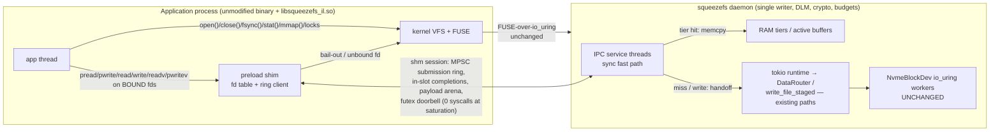

# Design Doc: L4 — LD_PRELOAD POSIX-Interception Data Path (`libsqueezefs-il`)

| | |
|---|---|
| **Title** | L4: LD_PRELOAD POSIX-interception data path — the direct app→daemon escape past the kernel FUSE transport (DAOS `libioil` pattern) |
| **Author** | Justin (repo owner) — L4 program owner |
| **Date** | 2026-07-18 |
| **Status** | **Draft — rev 3** (review rounds 1–2 folded, 18 + 4 items; §12 OQ resolutions stamped 2026-07-18, user delegated) |
| **Repo** | `/home/justin/Source/squeezefs`, `dev` @ **`cefe311`** (post-L3 `4a25d85` + the multi-reference scoreboard harness & inaugural baseline **merged** — `tests/run_scoreboard.sh`, `.benchmarks/2026-07-18-multi-reference-scoreboard.md` are landed facts, not concurrent work) |
| **Intended home** | `docs/design-preload-interception.md` |
| **User directive (2026-07-18, verbatim)** | *"I believe the DAOS LD_PRELOAD is our key to 600k+ or more iops, if we can hit higher then 600K why wouldn't we shoot for it to see what we can hit?"* — PERFORMANCE IS PRIMARY. This design targets the maximum the architecture allows; **600 k is the floor, not the goal**. |
| **Evidence base (normative)** | `.benchmarks/2026-07-18-l3-transport-economy.md` (post-L3 posture: device-true rand-4k **604,313** IOPS, warm/hybrid **644,726**, residual ≈ **4.5 syscalls/op** of which `epoll_wait` ≈ 1.5/op is tokio parking; substrate raw ceiling **1.98 M**); `.benchmarks/2026-07-15-iops-parity-decomposition.md` (per-op cost anatomy, hot-tier 14 µs CPU/op, the two multiplicative in-flight gates); `docs/reference-clients-survey.md` D9/D10/D18 (DAOS `libioil`/`libpil4dfs` — the designated reference pattern; this program is the survey's **P3-A** adoption item); `.benchmarks/2026-07-18-multi-reference-scoreboard.md` (inaugural top-3 baseline; the kernel-FUSE table's primacy) |
| **Inviolable contracts** | AGENTS.md non-negotiables (io_uring-first *for kernel I/O paths*, zero-copy + latch-free hot paths, no dead code, TDD, forward-only); `docs/design-zero-copy-write-path.md` (1 userspace copy + 1 DMA; §5.4 lease-severance discipline); single-writer mount guard D0 + DLM/fencing invariants (`docs/design-metadata-throughput.md`); cache-path policy; the instrument-alignment lesson (every measurement states its instrument) |
| **Related** | `tests/run_scoreboard.sh:13-15` (the pre-declared L4 labeling rule — **shipped on dev**), `crates/fuse3/src/raw/connection/wake_core.rs` (L3 `WakeCoalescer` — reused verbatim), `src/version.rs` (build-commit identity — the version-skew handshake key), survey items D11/J13 (transport-notify, fd handover — adjacent, not in scope) |

**Revision history**

| Rev | Date | Change |
|---|---|---|
| 22 | 2026-08-06 | **The drain-LANE width re-grade: svc ceiling + direct-drive shard width move to `il_drain_lanes_default` = `clamp(3×cpus/8, 2, 64)`** (`perf/dd-width-slope`; evidence `.benchmarks/2026-08-06-dd-width-slope.md` — user ruling: derived values, never fixed). The counted field width sweep (squeeze-test 32 CPUs/2 nodes, il rand-4k 32×qd32, 3×30 s rows per width, W8 brackets both ends — no drift — engagement + shards/svc gauges exact per width) found a genuine INTERIOR optimum: W8 (the old cpus/4) 622–636k → **W12 695–700k (+10.4 %, clat 1461–1472 µs — best)** → W16 675–690k (+7 %) → W24 616–626k (−2 %, regression). The derivation is the LANE-PAIR budget, not the point: one lane = 2 OS threads (`sqz-ipc-svcN` submitter + `sqz-ipc-ddN` reaper), so the sweep's grid in lane-thread/core terms is 2W/cpus ∈ {0.5, 0.75, 1.0, 1.5} — the optimum sits at ¾ of the core budget (the complement left to the co-located client fleet) and the ONE sampled point past 1.0× is the ONE regression, verifying the oversubscription failure mode inside the same sweep. The pair moves TOGETHER by structure (governed submits ride `lane = owner_idx % width`, owners bounded by the ceiling — a wider shard set is production-dark, a wider ceiling shares reapers), which is also why the sweep could not have split them. The Rev 13 ingest surfaces are SUBSUMED, never retuned: the shim's per-mount session default keeps its measured `cpus/4` slope verbatim, and the ceiling's new law against it is DOMINANCE (⌊3c/8⌋ ≥ ⌊c/4⌋ pointwise, floors equal) — every default session still owns its own drain thread and spawn-on-bind keeps idle spares unrepresentable, so the DEFAULTS-MISMATCH topology stays unrepresentable in either direction. Floor 2 = the pre-L4-8 plateau (never-regress: no box derives below the previously shipped width); rail 64 = the explicit-lever clamp parity (engages ≥ 174 cpus). `service_thread_count` now sizes from `crate::cpu::process_parallelism()` (the Hang-1 process-mask law — the runtime half of the lane-pair equality). Honest scope: one box shape; the second-box-shape confirmation row is filed in the evidence note. Ties: `dd_shard_width_derivation_ties_to_drain_lane_width`, `service_ceiling_is_the_drain_lane_width_and_dominates_shim_sessions`, `il_drain_lane_width_is_the_three_eighths_lane_pair_slope`. |
| 21 | 2026-08-05 | **Direct-drive rings + reapers SHARD by the derived drain-parallelism width** (`perf/il-directdrive-randread`; the D12 randread-shim residual — field fio libaio rand-4k 32×qd8: il 208k IOPS FLAT vs kernel 273–280k at 235 µs fabric RTT / 256 in-flight, while the local shape ran +44 % il). The DIALED P1 engine's "one shared ring + one reaper" shape (whose own module doc recorded per-thread rings as the fallback "if SQ contention ever shows on a profile") serialized every CQE-side serve — revalidate + accounting + slot completion, ~4.8 µs/op — on ONE unpinned `sqz-ipc-dd` thread, the exact term the kernel path spreads over per-CPU queues (and which lever 1, the same-lane READ dispatch `b6d7413b`, improved on the kernel side only). Now: `dd_shards_from` == `il_sessions_default` (the Rev 13 shared derivation, `clamp(cpus/4, 2, 16)` — the SAME function that ceilings the service threads, so lanes and service threads are 1:1 by construction; `SQUEEZEFS_IPC_DD_SHARDS` is the override/measurement lever, clamp 1..=64), one lane per service thread (`set_service_lane(owner)` in the host's `service_loop`; foreign threads round-robin), each shard = own 512-entry ring + own in-flight slab/mutex + own `sqz-ipc-ddN` reaper spawned on the lane's first governed submit (the `ensure_service_threads` spawn-on-bind posture) and PINNED per the `numa_core::owner_nodes` partition at the shard width — the reaper sits where its lane's submitter and session arenas live. Per-shard semantics unchanged (prelude, 795 revalidation, fallback ladder, accounting, MEM-7c stall law, shutdown drain-then-join across all spawned shards). Engagement gauge `ipc_direct_shards` (LIVE shard reapers; 1-forever-under-load = the single-reaper field structure is back). Contracts: `tests/ipc_direct_drive_tests.rs` §9. |
| 20 | 2026-08-04 | **Population-derived session arenas — Rev 18's /128 fraction killed** (`fix/ipc-arena-population-derivation`). Field conviction (squeeze-test, TWO battery runs): the arena default's /128 divisor was a legacy "per-uid cap 64 × 2 safety" POPULATION assumption, not a derivation — on the 176 GiB cluster (cap ≈ 22.5 GiB → 176 MiB arenas) the budget admitted only ~128 sessions, so the matched-inflight 256-process fio battery (njobs × qd, the EXA fairness law) refused ~125 binds/pass (`ipc_admission_refusals`), rode the kernel lane, and printed INVALID (engagement 0.697) — with the Rev-19-era per-uid cap ALREADY derived (~131: the ARENA SIZE was the binding constraint; the measured operator escape was `SQUEEZEFS_IPC_ARENA_MB=80`). User directive verbatim: *"we need to see how we make that some derived value from the system size (cpu/memory/threads) something so it's not a hard coded value."* Now `mem_budget::ipc_session_population_target` = `max(128, cpus × 8)` (×8 = the matched-inflight client-fleet slope — one shim session per client process, qd 8 the canon dim, 32 cpus → the exact 256 that refused; floor 128 = the /128's shipped population, so boxes with `cpus × 8 < 128` keep the old arithmetic byte-identically) and the arena default = `max(64 MiB, DMA-aligned cap ÷ population_target)`; `cpus` = the PROCESS mask (`crate::cpu::process_parallelism`, the Hang-1 discipline); floor/alignment/env-verbatim unchanged. Cluster shape: arena **88 MiB**, per-uid cap **256** (= the target — the §11 cap rides the SAME two numbers, coherent by construction), 256 × 88 MiB = exactly the cap. Contracts: `tests/derivation_sweep_tests.rs` A9/A12. |
| 19 | 2026-08-02 | **PERF-7: the bound-fd offset mirror — offsetful ops go zero-syscall** (`perf/shim-lseek`; pre-rc spec §9 PERF-7, execution-plan D7 Track 2). §5.4.3's kernel-offset discipline (+2 `lseek64`/op on every `read`/`write`/`readv`/`writev` — the exact cost `cp`/`dd`/`tar` pay per op) is superseded for bindings the shim can prove unshared: the offset mirrors in the **shared `BindingCell`** (the object dup'd fds already share — intra-process dup keeps kernel shared-`f_pos` semantics exactly, and the per-description offset lock supersedes the per-fd stripe, closing the pre-existing dup-sibling stripe-split race). Normative authority predicate in `fd_table.rs` module docs: armed at bind with a fork-epoch snapshot taken **before the fd existed** + snapshot still current + never demoted. Every transition out of mirror authority **flushes mirror → kernel `f_pos` first** (raw `SYS_lseek`, never the now-interposed symbol): atfork **prepare** (bump + flush — the child inherits true offsets; the parent demotes to the §5.4.3 resync discipline), `posix_spawn{,p}` (glibc clones without atfork handlers), the unbind-class demotes (F_SETLK*, F_SETFL O_APPEND/O_DIRECT, mmap walk, poison), offsetful fallthroughs (incl. transient ring backpressure — that fd re-prices at the pre-PERF-7 two-syscall discipline, never a wrong offset), and the f_pos-consuming passthroughs (`sendfile{,64}`/`copy_file_range`/`splice` with NULL offset pointers — newly interposed as demote triggers). `lseek`/`lseek64` are interposed (LFS-64 alias discipline): SEEK_SET/SEEK_CUR are pure arithmetic on armed fds; SEEK_END/SEEK_DATA/SEEK_HOLE stay kernel-routed (same `i_size` source — the POSIX-8 staleness scope is unchanged, not widened) and re-seed the mirror. The disarm/publish pair is a SeqCst-fenced Dekker protocol (single-issuer flush under the cell's offset lock); the residual fork-concurrent-with-in-flight-I/O window is the same class §5.4.3's Issue-11 scoping already excluded. Contracts: `tests/offset_mirror_tests.rs`; microbench `benches/offset_mirror_bench.rs` (mirror bookkeeping ~73 ns vs the replaced syscall pair ~1.48 µs on the dev box). KD-6's "offset authority stays in the kernel" is amended accordingly — fallback-is-correctness itself is untouched (every demote flushes first, then the real call is exact). |
| 18 | 2026-08-04 | **Rev 16's filed transport sibling CLOSED by the derivation sweep** (`refactor/derivation-sweep`; evidence `.benchmarks/2026-08-04-derivation-sweep.md`): `transport_buffer_cap` lost its fixed 2 GiB ceiling too (`budget/8`, `SQUEEZEFS_TRANSPORT_MEM_MAX`/`_PCT` overrides, absolute > pct > derived — the pinned-arena bound is the geometry's structural demand cap `nqueues × 32 × payload_sz`), and the entangled `MAX_BACKGROUND_CEILING=256` became `clamp(q×d, 64, u16::MAX)` (wire-format bound; `-o max_background=256` = the A0 lever). Same sweep: the per-session arena default derives (`max(64 MiB, PMD-aligned cap/128)` — `mem_budget::resolve_ipc_arena_bytes`; `SQUEEZEFS_IPC_ARENA_MB` explicit wins verbatim), and the `il_sessions_default` ceiling 16 is now DERIVED from the structural `sizing::SESSION_REGISTRY_SLOTS = 32` (÷ 2 mounts; shim `MAX_SESSIONS` ties to the same constant, drift-is-red both crates). Field A/B rows ride the reformat window (sweep note §3). |
| 17 | 2026-08-04 | **Direct-link (DT_NEEDED) support — SDK Tier 1** (`feat/sdk-design`; design `docs/design-sdk.md` §4, evidence `.benchmarks/2026-08-04-sdk-design.md`). `-lsqueezefs_il` is a supported linkage of the shipped shim: the ctor audit's verdict is that the §5.4 "no ctor ordering games; first call initializes" posture already makes a DT_NEEDED load safe (other objects' pre-`main` constructors calling interposed symbols hit lazily-initializing interposers — pinned by the gate's ctor-context I/O row), and two real gaps were fixed in `build.rs`: **`-Wl,-soname,libsqueezefs_il.so`** (rustc sets no cdylib SONAME — a by-path link embedded the build-tree path as DT_NEEDED) and **`-Wl,-z,nodelete`** (`pthread_atfork` handlers can never be unregistered, so any load must be permanent; dlclose becomes a structural no-op). The bootstrap path gains the **linked-mode detection line** — once per process, on first bootstrap-blob decode, when LD_PRELOAD does not name the shim (`session::load_mode_from`, unit-pinned): `squeezefs-il: active via direct link (DT_NEEDED), not LD_PRELOAD — same KD-7 build pairing applies`. Gate rows: leg 1e (unprivileged — SONAME/NODELETE asserts, cc-compiled linked harness without LD_PRELOAD: ctor-order pin, `dladdr` scope-occupancy proof, parity) and leg 2b-linked (root — ring engagement + the line exactly once). KD-7 is unchanged in linked mode (same-commit pairing; the SDK program's SKD-4 window is the app-cadence answer). Operator surface: operations.md "Direct link" block (link-order requirement incl. the `--as-needed` trap, setuid/env-scrubbing wins, the fatal-missing-DT_NEEDED difference). |
| 16 | 2026-08-02 | **Derived `ipc_session_arenas` admission cap — the fixed 2 GiB ceiling deleted** (`fix/ipc-arena-cap-derivation`; evidence `.benchmarks/2026-08-02-ipc-cap-derivation.md`). The user's 2026-08-01 ruling: `SQUEEZEFS_IPC_MEM_MAX=8192` as a standing posture lever is the hardcoded-default anti-pattern — the cap must be calculated from the system, percentage-preferred. The §5.7 admission cap is now **12.5 % of the resolved R5 memory budget with no absolute byte ceiling** (`mem_budget::ipc_arena_cap` = `budget/8`; the budget is machine-derived per §5.7 resolution order, so the fraction is scale-free). Override forms: `SQUEEZEFS_IPC_MEM_PCT` (percent of the budget, clamp (0,100], the preferred spelling) and the compat `SQUEEZEFS_IPC_MEM_MAX` (MiB, explicit-wins-verbatim); precedence **absolute > percentage > derived default** (`resolve_ipc_arena_cap`, pure, never refuses a mount on a bad env string — warn + fall through, the knob-family convention). The ceiling was deleted rather than re-derived: the R5 budget scales the cap, per-uid session caps + idle reap bound the population, and Red shedding refuses new sessions under pressure — a second absolute bound duplicated R5's job with a constant, and on the 251 GB field client it clamped the pool to ~31 × 64 MiB sessions against a 48-HELLO fleet (`ipc_bind_refused_budget` 13/48, engagement-INVALID il rows — the 2026-08-01 rewrite-publish-drain rider §8). The transport sibling (`transport_buffer_cap`, same `min(budget/8, 2 GiB)` shape) deliberately keeps its ceiling: it degrades gracefully (queue depth, floor 4 — never refuses work), binds only above 64 possible CPUs at 1 MiB payloads, and is entangled with the measured `max_background ≤ 256` L1 evidence — filed as a follow-up requiring its own field window. Contracts: `tests/ipc_host_tests.rs` cap-law/precedence/clamp tests |
| 15 | 2026-07-29 | **Read saturation: large-op ring reads + ring-fed stream classification** (`perf/read-saturation`; evidence `.benchmarks/2026-07-29-read-saturation.md`). Field conviction (4-node 2×200GbE, nullblk targets, il sequential 4k reads): burst at the warm RAM-tier ceiling for a few seconds then collapse to the cold-miss fabric-RTT floor (900k–1.2M → 200–300k sustained; reproduced exactly on the rsat nvmet-tcp rig, 1.8M → ~560k). Two structural causes, both closed client-visible-behavior-identical: **(a) `ring_pread` chunked at the arena slab** — a 1 MiB il streaming read paid 16 serial 64 KiB fabric RTTs (measured `ipc_ops_read`/user-op = 16.02) where writes have ridden ONE multi-slab window since Rev 11's pre-agreed follow-on; `ring_pread` now mirrors `ring_pwrite` verbatim (multi-slab `claim_run` windows, pipelined flights reaped in offset order, POSIX short-read prefix, batch doorbell) with the read-specific custody rule *copy-out-then-release* (a released run is claimable by sibling threads; the copy is ordered after the completion's Acquire). **(b) Ring ops never fed the §5.3 stream classifier** — il streams never classified, so the §5.6 streaming veto never engaged and every 4k miss direct-drove one ranged window read forever; `DataRouter::ring_read_lane_touch` feeds every ring read once at the sink (warm serves = the pipeline's silent consumption; misses feed before the P1.5 ladder so the 4th contiguous op's classification vetoes direct-drive), ring handoffs carry `ReadClassHint::lane_pre_fed` (the handler must not observe them twice — 16 double-observations declassify), and `bg_admit::spawn_bg` became runtime-agnostic (foreign service threads spawn prefetch onto the fuse3 TPC lanes — the Rev 10 venue). Rounded out by the §5.5 window economy (design-read-path.md §5.5 amendment: budget-derived cap, split issue bounds, overrun growth). Contracts: `tests/preload_session_tests.rs` (6 read twins of the P3 pins), `tests/read_saturation_tests.rs`, `tests/read_prefetch_window_tests.rs`. |
| 14 | 2026-07-28 | **Shim parity: the 1-copy ring write path** (`perf/shim-parity`; evidence `.benchmarks/2026-07-28-shim-parity.md`). The governing law (user directive, verbatim): *"The kernel and IPC should always at minimum be at par with the IPC out pacing the kernel in the majority of benchmarks."* Closes the ingest-economy board item 1 (kernel out-streamed the ring path ~15 % at t16×4MiB: shim-copy + sever-copy + merge vs lease + merge). **Placed sever** (`src/placed_sever.rs` + the `src/placed_core.rs` claims protocol): whole-block-stream chunks sever DIRECTLY into a shared per-`(ino, block)` assembly (`SharedBlock` — the overlay-backing allocation class) at dequeue — the §5.5.2 severance law verbatim (one arena read, synchronous, pre-handoff; page-claim overlap exclusion; the seal-vs-claim `fence(SeqCst)` Dekker — loom-modeled ×3, fails on weakening); the first entry-absent merge ADOPTS the assembly as the `ActiveBlockBuf` backing (`CowCell::adopt` — the cell starts non-unique, so every in-place mutation path CoWs away while placed payloads live: severed custody is structurally indestructible), and every pointer-proven merge records coverage with the copy ELIDED. Sink screens: page-aligned single-block, `len > patch_max_bytes()` (patch/extent machinery stays mutually exclusive by the same lever), EFBIG-mirrored, cached-striped, entry-absent, capped at `min(budget/8, 2 GiB)` (non-sheddable R5 `placed_assemblies`). Engagement levers: placed-write handoffs defer to `DataPlaneSink::flush` (end-of-drain-pass — sibling chunks sever before any merge parks the entry) and the shim's pipelined large-write submit batch-publishes the whole flight under ONE doorbell. Counters: `ipc_placed_severs`, `ipc_placed_sever_fallbacks`, `placed_adoptions`, `placed_merge_elides`, `placed_assembly_bytes`. Counted A-B-B-A (TCP devsub, fio psync zero_buffers direct, medians of 3, engagement EXACT): il t16×4MiB **9,510 → 11,188 MiB/s (+17.6 %)** = **1.002× kernel** (BASE: 0.863×); rand-4k flat (il +21 % over kernel both sides); amp 1.001–1.003; `write_path_seed_read_bytes` 0. The law is SELF-ENFORCING: `tests/write_matrix.sh` now fails (nonzero exit) on any il-vs-kernel pair beyond ±10 % and asserts il majority-win (first run: 9/9 PAR, 0 losses); `tests/shim_parity_bracket.sh` is the counted acceptance rig. Ride-along: fuse3 dead-TPC-lane dispatch re-route (loud, counted `fuse3_tpc_lane_redispatches`; all-lanes-dead aborts) — ingest board item 2 closed. |
| 13 | 2026-07-28 | **Ingest economy** (`perf/ingest-economy`; evidence `.benchmarks/2026-07-28-ingest-economy.md`). Field conviction (4-node 2×200GbE nvme-tcp, 32-CPU client): large sequential shim ingest walled at 7.5 GB/s of a 16.6 GB/s raw ceiling because the shim's flat 4-session default and the daemon's `clamp(cpus/4,2,8)` service-thread default were two unrelated constants — `sqz-ipc-svc0..3` saturated while `svc4..7` sat parked with no ring to drain (`SQUEEZEFS_IL_SESSIONS=8` recovered +44 % on the spot). Three changes: (1) **one derivation** — `squeezefs_ipc::sizing::il_sessions_default` = `clamp(cpus/4, 2, 16)` now defaults BOTH the shim per-mount session count and the daemon service-thread ceiling (paired tie tests in both crates make drift a red test; `SQUEEZEFS_IL_SESSIONS` clamp widened 1..=16, both env vars are override levers only); (2) **spawn-on-bind service threads** — a thread spawns when its owner index first receives a session (`ensure_service_threads`), so a session-less host (every default mount) owns ZERO service threads and `ipc_service_threads` gauges the SPAWNED count; (3) **pooled severed-write buffers** (`SeveredPool`, `ipc_severed_pool_{hits,misses,bytes}`) — the §5.5.2 sever copy's destination recycles `max_op_bytes`-class buffers via `Bytes::from_owner` (queue slots = `arena_cap/max_op`, the structural in-flight bound), deleting the profiled per-op slab-alloc engine (jemalloc arena + MADV purge + ~256 re-zeroed page faults per ring write: 1.76 M faults/s across 5 saturated svc threads at 12.7 GB/s, ~70 % %system → ~1.5 % post-fix; the severance law's ONE arena read + single memcpy unchanged). Also: fuse3 TPC lane threads are now NAMED (`fuse3-tpcN`) — unnamed they inherited `sqz-ipc-svc0`'s comm from the lazy first-touch spawn, polluting pidstat/perf attribution (the field capture read lane CPU as service-thread CPU). **BLOCKING dev finding fixed en route** (evidence note §7): the §5.4 transport-lease watchdog (`EntPayloadLease::drop` `debug_assert(age < 1 s)`) PANICKED the write-handler task when a handler invocation legitimately exceeded 1 s (write-pipeline admission backpressure on slow/debug substrates) — the FUSE reply was lost (kernel writeback folio parked forever: fsync D-state, umount joins the wedge) and the unwind skipped `release()` (permanent ent loss). Deterministically red on dev `88f2075` via the `SQUEEZEFS_TEST_WRITE_STALL_MS` seam + `tests/transport_lease_overlong_tests.rs`; fixed loud-never-fatal: `transport_lease_overlong` tripwire (stats inode) + error log, `release()` always runs; statfs_tests ×10 green under a stated compile-storm load, 0 hangs. |
| 12 | 2026-07-28 | **IPC op economy** (`perf/ipc-op-economy`; evidence `.benchmarks/2026-07-28-ipc-op-economy.md`). Two levers, one campaign. **Lever 1 — allocation-free warm serve prelude**: the §5.5.1 warm fast path paid ~12 heap allocations/op (alloc-site table in the evidence note: double `CachedMetadata` moka-get clone, heap key formatting ×4, staging-probe `Bytes` key mint, `StagedMetadata` path String, payload `Bytes` bounce, per-park `Vec`s). Fixed by deletion: single metadata get; `CachedMetadata.file_type → CompactString` + `block_map_id`/`block_prefix`/`file_id → Arc<str>` (the by-value clone is allocation-free everywhere now); `keys::StackKey` stack formatting (overflow → heap fallback, never truncates); `get_static` `&[u8]`-keyed; `StagedMetadata::peek_original_size`; **serve-into-arena** (`crate::PayloadSink` impl'd by `ArenaWindow`, `IpcReadProbe::Served(n)` — the tier legs' intermediate alloc + memcpy deleted); allocation-free service parks. Standing pin: `tests/ipc_op_economy_tests.rs` (≤ 1 alloc/100 warm ops, engagement-exact; `SQZ_ALLOC_TRACE=1` = the alloc-site profiler). **Lever 2 — completion doorbell** (`squeezefs-ipc::cqe_core::CqeDoorbell`, header line 2, **IPC_ABI 2**): the daemon pays a completion `FUTEX_WAKE` only toward a registered parked reaper (`ipc_cqe_wake_{writes,elided}`); the libaio sparse-regime reap parks register→snapshot→re-scan on ≤ `IL_SESSIONS` session words instead of a per-ticket `futex_waitv` array + per-completion WAITER wakes (the collect-and-wake term past ~525 k IOPS). `Session::ticket_wait_entry` deleted; per-slot WAITER wakes for sync waiters unchanged. Dekker `fence(SeqCst)` pair load-bearing; loom `ipc_cqe_parked_reaper_never_stranded`, weakening-verified ×3. Phase B (same evidence note, §B): warm il **+22–29 % / −18–23 % daemon CPU/op**; the bracket FOUND the doorbell's shared-session wake herd (−21 % elbencho t16qd16 at the old park threshold — 16 threads on 4 sessions, one wake herd per completion) and the counted `REAP_EVENT_PARK_MAX` A/B (24 / 4096 / 0 / 2) adjudicated the retune **24 → 2**: qd ≤ 2 stays event-driven (qd1 clat 250–251 µs preserved), deeper batches (t16qd16 505,952 vs 486,633 pre-doorbell baseline, fleet −10 % daemon CPU, wakes ≈ 0 at depth). Preload gate legs 1+2 green on the final pair incl. kill-9 ×5 / fork-kill-parent on ABI 2. |
| 11 | 2026-07-27 | **DIALED P3: large-op ring economy** (`perf/write-side-economy`; evidence `.benchmarks/2026-07-27-write-side-economy.md`). The client's `ring_pwrite` chunked at the per-slot arena slab (arena/slots = **64 KiB** at default geometry) and round-tripped each chunk **serially** — a 1 MiB write was 16 ring RTTs (write-matrix `ring/op` 16.00; 0.38× kernel-armed single-stream, 0.47–0.74× threaded on every >slab row) even though the daemon has validated `len ≤ max_op_bytes` (1 MiB) since PR L4-4. Fix, entirely client-side (no wire/ABI change): (a) **multi-slab max_op windows** — `claim_run` reserves a contiguous, non-wrapping slot run whose adjacent slabs form one arena window; only the base slot is submitted, the extension slots are CLAIMED **arena holds** the daemon never observes, returned via the new `SlotCore::release_claimed` (CLAIMED → FREE, client-exclusive; loom `ipc_slot_claimed_hold_release_reuse_clean`); (b) **pipelined flights** — every chunk of one op submits before any is waited on, reaped in offset order with POSIX prefix semantics (first short/failed chunk ends the count; later flights drain ignored — the kernel's own split out-of-order O_DIRECT WRITE property); (c) **aligned-stride claiming** — want-aligned bases first, so concurrent large writers pack runs instead of fragmenting the array (greedy fallback keeps the fragmented-slots degradation law); (d) single-slab ops keep the pre-P3 allocation-free serial path (every W1 patch-path write byte-identical). Sever-at-dequeue custody, the copy ledger, and the write-handler venue are untouched. Every >slab shim write row moved to 1.00–1.10× kernel-armed (single-stream 1 MiB +95 %); gate leg 2h now alternates bs=1M kill-9 cycles so multi-slab runs are in flight at SIGKILL. `ring_pread` large-op economy is the pre-agreed follow-on (reads > slab still chunk serially). |
| 10 | 2026-07-26 | **Handoff venue fix (the §7 reap-note residual): ring handoffs ride the fuse3 per-core handler lanes** (`perf/ipc-handoff-economy`; evidence `.benchmarks/2026-07-26-ipc-handoff-economy.md`). The async handoff no longer spawns onto the daemon's multi-thread runtime — a service thread is a *foreign OS thread* to tokio, so `Handle::spawn` from it lands every miss on the **global inject queue**, which saturated workers poll only between local-queue batches: the measured ~130 µs/op cold-firehose queueing term the kernel transport never pays (its dispatch spawns handlers straight onto the `TPC_SCHEDULER` per-core current-thread lanes). `DataPlaneSink` handoffs (read misses AND writes) now go through `handoff_spawn` → `fuse3::raw::tpc_spawn` — the **same venue kernel-lane handlers run on**, making the §5.5 "the handoff path IS the existing handler" argument exact (same body, same locks, same executor class). The §5.8.2 "task wake ~1–3 µs" cost line was correct for the wake but blind to the inject-queue *queueing* under load; venue pins (`handoff_venue_tests`) assert current-thread-lane execution + foreign-thread spawnability. Cold ddt il rows moved from 0.82–0.89× to ≥ 1.07× kernel on the fabric-latency rig (t16qd16 + t32qd32). |
| 9 | 2026-07-25 | **Field segfault #2 closed: the glibc<2.36 `RTLD_NEXT` base-version trap** (`fix/preload-aio-kernel-lane`; reproduced AND fixed in the containerized field environment — `docker/Dockerfile.rocky8-test` + `tests/run_rocky8_aio_repro.sh`, Rocky 8.10 / glibc 2.28 / libaio 0.3.112 / in-distro dynamic elbencho). `dlsym(RTLD_NEXT, "io_getevents")` on pre-2.36 glibc returns the **base** version — `io_getevents@LIBAIO_0.1`, the 4-argument compat wrapper — not the 5-argument `@@LIBAIO_0.4` default; called with the 0.4 convention it register-shuffles and re-enters the interposer through its own PLT until an integer lands in its timeout register (`movdqu (%rcx)`, EL8 offset 0xF00 — the field backtrace frame, byte-exact; 0xF1B = its PLT return address). Mode-independent (fires on the passthrough fallback AND the armed merge path — the field's `RealKernel::getevents` frame proves their run was armed). Fix: **`real_aio!` resolves every libaio symbol via `dlvsym` with its explicit default version** (`aio_glue::libaio_default_version` — io_submit `LIBAIO_0.1`, io_pgetevents `LIBAIO_0.5`, setup/destroy/getevents/cancel `LIBAIO_0.4`; unit-pinned), plain `dlsym` fallback only where that version is absent; libc-family symbols stay on unversioned `dlsym` (single-version link names). The rocky8 rig (3 legs: plain passthrough, armed + engagement-checked, refused + refusal-line) is the standing regression net for foreign-glibc symbol resolution. |
| 8 | 2026-07-25 | **Reason-bearing refusal lines** (user directive: "make it so the shim prints out the stderr line of the reason it isn't being used i.e. the version mismatch"; `fix/preload-passthrough-aio-segfault`). The generic per-open `session establish failed — mount passthrough` is replaced by `squeezefs-il: session refused: <cause> — mount passthrough`, printed **once per distinct (mount `st_dev`, reason) per process** (`session::RefusalOnce`, a tiny mutexed set — the establish ladder's per-open retry behavior is unchanged; only the logging dedups; past capacity it stops remembering, never stops printing). The enumerated causes (`SessionError::describe` + `refuse_reason`): client-side skew names **both build commits** (or both ABI values, or the `SQUEEZEFS_IPC_ALLOW_DEV` remedy for degenerate dev identities); socket EOF vs errno; every daemon refusal class distinct; unknown classes surface their number; daemon BIND refusals print their class once in their own key space (`bind refused: … — fd stays kernel-served`; the KD-6 silent-op posture is unchanged — the OP still just passthroughs). New wire cause **`RefuseClass::Disabled` (=8)**: the control-plane-only (no `-o interception`) HELLO refusal previously rode the opaque `Flags` class — the daemon knows the reason, the wire now carries it (KD-7 forward-only ABI), the shim prints `interception not armed on this mount (mount with --interception)`, and the daemon counts it in the new **`ipc_bind_refused_disabled`** stat (kept apart from the security-signal classes). Gate leg 2k asserts the cause text, the remedy text, and the exactly-once bound; leg 1's new `nm` tripwire pins that `aio_lifecycle_harness` carries no interposer symbols (it briefly self-interposed — exe symbols beat the preloaded .so — caught by the once-count assertion). |
| 7 | 2026-07-25 | **Field crash class closed: fake-vs-real `io_context_t` confusion** (`fix/preload-passthrough-aio-segfault`; live-cluster report — elbencho libaio t32 qd32 under the shim on a passthrough mount segfaulting inside real libaio's `io_getevents`). Invariant made structural: a context's registry membership always resolves to exactly ONE definite owner — (a) a **colliding `io_setup` registration retro-neutralizes** (the kernel never hands out one live ctx value twice, so a collision is a recycled REAL context whose `io_destroy` bookkeeping was missed — guard-refused entry, panicked destroy body, `real!`-miss, `-Bsymbolic`-class libaio internal binding; the corpse is vacated and the value re-registered fresh instead of adopting stale pendings/tickets); (b) **`io_destroy` bookkeeping runs unconditionally and vacates before draining** (it is libc-free, so the TLS guard and real-symbol resolution no longer gate it); (c) **the §5.4 panic discipline gains its async-shape exception**: `io_submit`/`io_getevents`/`io_pgetevents` panic arms must NOT replay the real call (a panicked body may have already dispatched batch prefixes / consumed ring tickets — the replay double-submits or orphans completions); they poison, retro-neutralize the ctx, and answer `-EIO`/`-EINTR` (kernel-legal); `io_cancel` keeps the replay (read-only body); (d) destroyed corpses fast-reject to the real call in the reap path (hang guard). Instruments: `aio_lifecycle_harness` (dlopen-global full-lifecycle driver, double-dispatch tripwire) + gate legs 1d (plain fs), 2j (armed mount), 2k (the establish-refused field shape: per-open refusal asserted, ipc engagement delta exactly 0). |
| 0 | 2026-07-18 | Initial draft |
| 6 | 2026-07-19 | **OQ-3 RESOLVED: sync-write fast path — measured NO-GO** (`.benchmarks/2026-07-19-oq3-sync-write-fastpath-nogo.md`; the L4-7 < 10 % law governed). Interleaved A/B with drain settles (fio psync randwrite 4k direct t16, devsub): il ~116 k median vs kernel-FUSE ~50 k — the handoff already beats the kernel round trip 2.3×, and Little's law puts the write op body at ~70–138 µs (device-DMA-bound W1 patch) vs the ≤ 3 µs handoff wake = **1.5–4 % of the op**, an Amdahl ceiling far under the build gate. The read program's 4× sync-serve win does not transfer (a warm read's body is ~2 µs — wake ≈ body; a write's body is 25–65× the wake). The rand-write lever is delivered concurrency via the v1.1 libaio interposers (measured 251 k @ j16 qd32 in the same ladder, indicative). **Standing posture: all writes stay async handoffs by design**; revisit only if the write body ever becomes µs-class. No code was written (no dead code to delete). |
| 5 | 2026-07-19 | **OQ-6 SHIPPED (v1.1): path-based ctl socket for container netns** (`feat/v1.1-ctl-socket-path`). The host additionally binds a filesystem-path `SOCK_SEQPACKET` socket at `<runtime-dir>/<socket_name>.sock` and advertises it in the blob's **reserved `socket_path` field** (carried since v1 — no ABI bump, exactly as planned); the shim's establish runs a **connect ladder** — abstract first (same-netns fast path, zero residue), path fallback. The permission-bits story the OQ owed: the socket file is **0666 because connecting is not a credential** — `SO_PEERCRED` + the §5.2 fd screen remain the boundary, identical over both rendezvous; runtime dir defaults `/run/squeezefs` (root) / `$XDG_RUNTIME_DIR/squeezefs` else `/tmp/squeezefs-il-<uid>` (user mounts; the 0700 XDG dir bounds reach to same-uid apps by design), `SQUEEZEFS_IPC_SOCKET_DIR` overrides (`none` restores the v1 abstract-only zero-residue posture). Degrade law: a failed path bind is loud but never fails spawn; shutdown unlinks the file (zero residue restored); stale same-name crash residue is replaced at spawn (names embed pid+random — a collision is always our own corpse). Acceptance: gate row 2g-netns — a preload'd client inside `unshare -n` (foreign netns, shared mount ns) establishes via the path rung and serves its reads over the ring, engagement-checked. The §5.2/§11 "containers silently stay on kernel FUSE" caveats are superseded for v1.1 daemons+shims. |
| 4 | 2026-07-19 | **OQ-1 SHIPPED (v1.1): libaio interposers landed** (`feat/v1.1-libaio`; evidence `.benchmarks/2026-07-19-v1.1-libaio-interposers.md`). `io_setup`/`io_submit`/`io_getevents`/`io_pgetevents`/`io_cancel`/`io_destroy` decompose mixed batches per-iocb: ring-eligible PREAD/PWRITE on bound fds ride session slots as **no-wait tickets**; everything else — RESFD/eventfd completions, non-HIPRI RWF flags, over-slab, vectored/fsync/unknown opcodes, unbound fds, unregistered contexts — is literally the real libaio call. Architecture: hermetic mixed-batch state machine (`aio_core`, prefix-atomic submit + lane-merge getevents, injected lanes) + pure glue cores (`aio_glue`: userspace-ABI mirrors pinned by offset asserts + C cross-check, allow-list iocb screen, leak-by-design ctx registry) + thin symbols. Ctx lock never held across a long kernel wait (bounded ~50 ms merge passes; split submitter/reaper legal); poisoned sessions resolve in-flight tickets as `-EIO` events. Gate row 2g-aio (fio libaio iodepth 16 + crc32c verify, 100 % ring engagement) added to `tests/run_preload_gate.sh`. **Measured (devsub, fio libaio randread 4k direct, jobs=16 qd=32, ×3): median 633,183 IOPS device-true** — beats the v1.0 `-t 256` sync shape (622,112) with 16 client threads. The §3-rule-4 corollary and the §5.5/§5.8.3/G-L4-2 statements that "`--iodepth` cannot exercise interception" are **superseded for v1.1 shims**: libaio drivers are now valid il instruments, engagement verification unchanged. |
| 3 | 2026-07-18 | **OQ resolutions stamped** (administrative; no design change, no re-review). The user was presented the six §12 Open Questions and **delegated to the document's own recommendations** (2026-07-18): OQ-1 ship v1 without libaio interposers, decide after PR-8's device-true row; OQ-2 workspace + custom `preload-release` profile as primary, fuse3 stays out; OQ-3 sync write fast path deferred to PR-7, decided on PR-4's handoff measurement; OQ-4 opt-in across the board for v1; OQ-5 document-only, knob only if a real workload hits a §5.6.2 window; OQ-6 path-based socket deferred to v1.1 with the blob field reserved now. §12 retitled + header note added; recommendations unaltered; the in-ladder decision points (OQ-1 → post-PR-8, OQ-3 → PR-4) remain live as specified. |
| 2 | 2026-07-18 | Review round 2 (4 items) folded. **Issue 19 (Major): §5.8.4 corrected to the SHIPPED rails** — the harness pins daemon **and** driver to one 0-15 set (`tests/run_scoreboard.sh:290` "daemon + driver contend on one pinned set", `pin_cmd :520-522`, mount `:693`, elbencho `:1214`); the false "daemon unpinned" rail note is retracted in the text, the il rail policy is decided normatively (governed rows under the identical 0-15 cage; one labeled off-rail 0-31 companion per family, recorded never gating), the self-contradicting "~⅓–½ core busy" occupancy is replaced with flat-out ~1-logical-CPU spinners (RTT 2–3 µs < the 4 µs spin window ⇒ never parks; units fixed to logical CPUs, no SMT discounting), and the table + §5.8.3 + G-L4-2 driver lines are recomputed under the 16-CPU cage: **warm governed row = `-t 8`** (t16 does not fit and is excluded; sweep {4,8,12} recorded), device-true `-t 256` priced per-op (~5–6 µs client CPU/op ⇒ 3–6 CPUs). **Issue 20 (Minor)**: the fast path's "replicates … verbatim" overclaim is retracted — the shipped guarded sequence has an in-guard `.await` (`fuse_client.rs:7476-7489`); normative miss-⇒-demote rule added (attr-cache/metadata-cache/buffer/tier miss releases the guard, then enqueues) with the load-bearing **drop-guard-before-enqueue** ordering (tokio `RwLock` is write-preferring/FIFO — holding the read guard across the handoff's re-acquire behind a queued writer self-deadlocks) and the demotion counter split (`lock` vs `miss`, distinct regression semantics). **Issue 21 (Minor)**: the fd-creator hygiene sweep is refcount-aware — releases a stale entry exactly as `close` would (decrement, async unbind on last ref; empty case = one load + branch), never a bare clear; composition unit test added to PR L4-5. **Issue 22 (Minor)**: the mmap bail-out unbinds **all in-process bindings on the mapped inode** (per-inode, not per-fd), closing the same-process two-fd W3 variant; §5.6.2 W3 split into (a) same-process CLOSED / (b) cross-process declared-unsupported; mmap-sibling test added to G-L4-4. |
| 1 | 2026-07-18 | Review round 1 (18 items) folded. **Issue 1 (Critical): the daemon-side fd screen is now the normative security boundary** (§5.2 "Daemon fd screen" block: `O_PATH` rejected explicitly — its access-mode bits read `O_RDONLY`/0, so a naive mode check would grant reads without read permission; non-regular `st_mode` rejected; O_WRONLY ⇒ no ring reads; the shim ladder demoted to an optimization); adversarial bind matrix added to PR L4-3. **Issue 2 (Major): coherence contract corrected for the default-on kernel writeback cache** — `-o interception` now **forces kernel write-through** (`write_back = false`, KD-11), closing the buffered-kernel-write → ring-read direction structurally; §5.6.2 rewritten as a complete window enumeration (cross-process `MAP_SHARED` readers/writers, `sendfile`/CFR) with the mmap-writer mix declared unsupported; G-L4-3 pins the posture, PR L4-8 prices it. **Issue 3 (Major): sync fast path's lock posture made explicit** — per-inode `try_read()` (sync-callable on the shipped `tokio::sync::RwLock<()>`), contention ⇒ async handoff; the false "takes no locks" claim retracted. **Issue 4 (Major): the `panic="abort"` × workspace collision resolved** — custom `[profile.preload-release]` (`inherits="release"`, `panic="unwind"`), `#[cfg(panic="abort")] compile_error!` guard in the shim, `default-members` excludes it from root-profile builds; KD-8/OQ-2 updated. **Issue 5 (Major): fd-reuse staleness confronted** — `close_range` interposed, common fd-*creators* interposed to clear stale entries, residual (raw-syscall/io_uring closes) documented + risk-register row + reuse regression test. **Issue 6 (Major): engagement verification is normative** — an il row is INVALID unless `.stats` `ipc_ops_*` ≈ ops (§3 rule 4, G-L4-2, PR L4-8); stated plainly that the literal `--iodepth 16` charter line cannot exercise v1 interception; per-row driver lines fixed. **Issue 7 (Major): G-L4-1 extended** — serve-shaped leg (≥ 650 k/core), tokio-handoff leg (≤ 3 µs), core-budget table; KD-10 claim scoped. **Issue 8 (Major): fork semantics fixed** — atfork child closes the session socket (AS-safe), poisoned sessions never emit ctl traffic, munmap deferred, G-L4-4 zero-residue re-worded, fork-then-kill-parent soak added. **Issue 9 (Major): shm TOCTOU rules made normative** (§5.3.1 daemon self-protection: snapshot-then-validate, single-read discipline, uninterpreted-bytes-only arena DMA, lease-refcounted unmap, bounded parks). Minors: fuse3 `get_notify` exposure added to PR L4-6 + non-goal amended (10); offset-exactness claim scoped to sequential mixing (11); nonce lifecycle + `unknown`/`-dirty` build refusal specified (12); abstract-socket netns limitation + OQ-6 path-based option (13); dup bindings refcounted, last-close unbinds (14); session-pinned-to-service-thread ownership invariant (15); header re-anchored to dev `cefe311`, author assigned (16); warm floor = 644,726 like-for-like, `RWF_NOWAIT` enumerated, per-open probe cost + negative-`st_dev` cache, client stats page marked untrusted, operator-docs ownership assigned (17); `wake_core` `#[path]` production-sharing direction pinned with rejected alternative (18). |

---

## 1. Overview

Every kernel-FUSE request pays the kernel round trip: the app thread traps, the kernel queues onto the FUSE connection, the daemon's over-uring queue delivers it, the reply commits back through the ring, and the kernel wakes the app. Three programs (L1 concurrency, M3 batching, L3 syscall economy) have driven the daemon side of that loop from ~15.7 syscalls/op to **≈ 4.5/op**, and rand-4k O_DIRECT from 44 k to **604 k device-true / 645 k warm** on the devsub box. What remains is structural: ~1.5 `epoll_wait`/op of tokio parking, ≥ 2 scheduler round trips per op, and the kernel FUSE queue itself. No kernel-FUSE lever reaches those — they *are* the transport.

L4 adds the only proven escape, following DAOS `libioil` (survey D9): an `LD_PRELOAD` interception library (`crates/squeezefs-preload` → `libsqueezefs_il.so`) that leaves **all control-plane operations on the real kernel-FUSE mount** — `open()` still traverses the kernel (permissions, namespace, a real fd) — and, after a per-fd handshake with the daemon, routes **data-plane calls** (`pread`/`pwrite`/`read`/`write`/`readv`/`writev`/…) over a same-host **shared-memory submission/completion ring + payload arena** directly into the daemon's existing routing layer. Steady-state cost per op: a lock-free ring rendezvous and one bounded memcpy each way — **zero syscalls on either side at saturation** (futex/eventfd wakes amortize to ~0 under the L3 `WakeCoalescer` discipline, reused verbatim). Anything the shim cannot serve identically (mmap, O_APPEND, locks, handshake failure, daemon death, version skew) **falls through transparently to the real fd via kernel FUSE — correctness never depends on interception.** The daemon remains the single writer, the single DLM/fencing authority, and the single device-I/O owner (io_uring unchanged); interception moves the *transport*, not the *authority*.

Target: substrate-ceiling-class rand-4k (**1 M+ IOPS plausible** on the devsub box whose raw ceiling is 1.98 M; §5.8 cost model), with the kernel-FUSE table remaining the primary "fastest FUSE filesystem" claim surface and interception rows published as a **separately-labeled measurement mode** — the charter discipline in §3 is user-locked and normative.

---

## 2. Background & Motivation

### 2.1 Where the kernel-FUSE ceiling now binds (measured)

Post-L3 anatomy of one warm rand-4k op (all from `.benchmarks/2026-07-18-l3-transport-economy.md` + `.benchmarks/2026-07-15-iops-parity-decomposition.md`, elbencho 3.1-9):

| Cost component | Measured | Reachable by kernel-FUSE levers? |
|---|---|---|
| Daemon syscalls/op | ≈ 4.5 (epoll_wait 1.51, write 1.87, io_uring_enter 0.49, read 0.57) | `epoll_wait` ≈ 1.5/op is **tokio worker parking per request batch** — L3 report names it "the dominant residual… L4 territory". The `write` residual is tokio cross-thread unpark, not the queue wake path (counter-true wake writes are already 0.45/reply, 55 % elided) |
| App-side syscall + block/wake | 1 syscall + park in the kernel FUSE queue | No — that *is* the transport |
| Context switches | ≥ 2 per op (app→daemon wake, daemon→app wake), plus tokio internal task wakes | No — that *is* the transport |
| Kernel FUSE queue latency | in-flight gated by `queues × Q_DEPTH` and `max_background` (the L1 multiplicative gates, both already opened to policy defaults) | Already opened; further depth buys queueing, not latency |
| Daemon CPU/op, hot-tier serve | ≈ 14 µs/op total incl. transport (decomposition hot-tier row: 492 k @ 7.0 cores); handler-only phases p50 ≤ 1 µs | Handler is already µs-class; the other ~10+ µs is transport + runtime wake topology |
| Result | **604,313** device-true / **644,726** warm (3.5 GHz cap) vs substrate raw **1.98 M** | The remaining ~3× to the substrate ceiling is transport-shaped |

### 2.2 The reference pattern (survey D9/D10, DAOS)

DAOS ships two interception libraries. **`libioil`** (D9): control stays on the dfuse mount; on `open()` the shim does an ioctl handshake *on the dfuse fd* to fetch direct handles; reads/writes then bypass FUSE; a per-fd bail-out ladder (`O_APPEND`, `O_PATH`, mmap, `fcntl` locks, streams, io-errors — `int_posix.c:99`, `:1043-1049`, `:1786-1813`) falls back to plain FUSE transparently; the first intercepted call evicts the kernel caches for that inode (`ops/ioctl.c:61-63`). **`libpil4dfs`** (D10) additionally intercepts *path* operations (open/stat/readdir) with a userspace dcache — the survey classifies it N/A-today for SqueezeFS because it bypasses the metadata control plane, which is incompatible with our DLM/lease + kernel-VFS coherence model unless the ioil-style shim exists first. The survey's P3-A sketch proposed handing the *client* NVMe access (in-process io_uring reads) — §10 Alternative E explains why this design deliberately rejects that in favor of app→daemon IPC: the daemon keeps sole possession of the single-writer guard, fencing, crypto keys, and device queues.

Also adopted from the survey: DAOS's EQ progress-thread **adaptive poll backoff** (D18: empty-poll counter → exponential 50 µs → 5 ms sleep) is the shape of our service-thread park ladder, and JuiceFS J12/J14 lifecycle hygiene informs the crash matrix (§5.7).

### 2.3 Why now

L3 closed with an explicit hand-off ("a deeper fix means restructuring task-per-request wake topology — L4 territory, out of L3 scope"). The multi-reference scoreboard landed with the L4 labeling rule **pre-declared in its header** (`tests/run_scoreboard.sh:13-15`: "A future L4 LD_PRELOAD interception mode will add separately-labeled rows — do not mix those semantics into this grid"). The build-commit identity needed for version-skew handshakes landed today (`src/version.rs`, `.stats` `build_commit`). And the user directive is explicit: shoot for the maximum.

---

## 3. Charter discipline (user-locked 2026-07-18 — normative, verbatim intent)

1. **Interception rows are a separately-labeled measurement mode** in the multi-reference scoreboard (`tests/run_scoreboard.sh` — the acceptance surface, **shipped on dev `cefe311`** with the L4 labeling rule pre-declared at `:13-15`). They are emitted into their **own table** (`scoreboard-il.md` / `il`-suffixed row ids), labeled `mode=interception (LD_PRELOAD, kernel-page-cache-bypass)`, compared against (a) SqueezeFS's own kernel-FUSE rows and (b) the raw-substrate ceiling reference.
2. **The kernel-FUSE table remains the primary "fastest FUSE filesystem" claim surface.** Interception rows never enter the top-3 rank denominators, never gate the kernel-FUSE verdicts, and are never cited as "FUSE" numbers. Reference systems keep their documented default postures — no reference gets an interception column (none ships an equivalent as its default posture; DAOS is not in the reference field).
3. **No semantics-mixing, ever.** Every published interception number carries its semantics class label (§5.6) and its instrument line (the AGENTS.md instrument-alignment lesson).
4. **Engagement is verified, never assumed** (the measurement corollary of rule 3): because every bail-out is *silent by design* (KD-6), an il-labeled row could otherwise quietly measure kernel FUSE and be published as interception. An il row is therefore **INVALID unless `.stats` proves the shim served it**: `ipc_ops_{read,write}` delta ≈ the workload's op count (tolerance for setup/teardown ops), with `preload_passthrough_ops` and `ipc_bind_refused_*` published alongside every number. The harness's existing INVALID-cell machinery (exit-nonzero) extends to this check. Corollary stated plainly: **the literal charter line (`--iodepth 16`) drives libaio, which v1 does not intercept — it runs 100 % over kernel FUSE and can never be published as an il row** (§5.8.3 fixes the per-row driver lines). *(Superseded for v1.1 shims — Rev 4: the libaio interposers landed, so `--iodepth`/`--ioengine=libaio` drivers now genuinely exercise interception and are publishable il instruments; the engagement rule itself is unchanged and still mandatory.)*

---

## 4. Goals & Non-Goals

### Goals (program gates — measured, paired, same-substrate)

| # | Gate | Number to beat / criterion | Method |
|---|---|---|---|
| **G-L4-1** | **IPC-hop ceiling proven BEFORE the surface is built** (the PR 2 spike), three legs: **(i) echo leg** — RTT p50 ≤ 3 µs (tier-hit shape, 4 KiB payload each way), steady-state syscalls/op ≤ 0.1 both sides (counter-true, `strace -c` corroborated); **(ii) serve-shaped leg** — binding-validation stand-in + `scc` hash-map probe + 2 × 4 KiB memcpy + stats increments per op: **≥ 650 k/core**, i.e. ≥ 1.3 M at the default 2 service threads — a ≥ 30 % margin over the G-L4-2 warm requirement, so an echo-only pass can never smuggle a marginless design forward; **(iii) tokio-handoff leg** — service thread → task wake on an embedded runtime → completion post: **≤ 3 µs/op added** (the assumption the §5.8.3 device-true story leans on, falsified here, not at PR-4). All legs run against the stated **core-budget table** (§5.8.4). **Miss ⇒ redesign or kill the program at PR 2 — this gate is the go/no-go.** | model §5.8; the per-line assumptions it isolates are listed there | dedicated rig (PR L4-2), n≥3, quiet-gated, instrument stated |
| **G-L4-2** | **Warm interception rand-4k ≥ 1.0 M IOPS** on the L3 box/substrate (target; **warm floor = 644,726**, the like-for-like kernel-FUSE *warm* number — beating only the 604 k device-true number would quietly weaken the beat-yourself framing); **device-true interception: floor 600 k** (the user-locked program floor; kernel-FUSE device-true is 604,313, so the floor ≈ parity), target substrate-class (1.98 M reference), amplification 1.00× per the house diskstats protocol. **Validity condition (charter rule 4)**: every il row is INVALID unless `.stats` shows `ipc_ops_{read,write}` ≈ the row's op count; `preload_passthrough_ops`/`ipc_bind_refused_*` published alongside. **Driver lines are fixed per row** (§5.8.3/§5.8.4): warm = elbencho sync positional **`-t 8`** (cage-sized; sweep t ∈ {4, 8, 12} recorded, t16 excluded — it overcommits the 16-CPU rail), no `--iodepth`; device-true = `-t 256` sync (parked-threads shape, or the OQ-1 libaio interposer if adopted). **Rail policy is part of each row's instrument line**: governed rows under the house 0-15 cage (daemon + driver + shim + service on one pinned set — the shipped harness posture), plus one recorded off-rail (0-31) companion per family, labeled, never gating. The literal `--iodepth 16` charter line does not exercise v1 interception and is never an il row *(superseded for v1.1 shims — Rev 4: libaio drivers are valid il instruments, engagement rule unchanged)*. | kernel-FUSE 604,313 device-true / 644,726 warm (L3) | elbencho under `LD_PRELOAD`, drivers + rails as stated; `.stats` engagement proof + diskstats evidence |
| **G-L4-3** | **Correctness parity**: byte-exact parity suites (same ops through kernel-FUSE vs interception, interleaved and concurrent), RYW across both transports **in both directions — including buffered-kernel-`write(2)` → ring-read, which pins the §5.6.2 write-through posture (KD-11) rather than assuming it**, fsync/close ordering (§5.6.3), LTP syscalls subset green under preload, fio `--verify=xxhash` soaks green | zero divergence | new `tests/preload_*_tests.rs` + `tests/run_preload_gate.sh` |
| **G-L4-4** | **Transparency**: unmodified `elbencho`, `fio`, `cp`, `dd`, `tar` work under the shim; every bail-out condition demotes to passthrough with identical results (never an error the real fd would not return); kill-9 of either side leaves **zero persistent residue** (no shm litter — memfd-only; no daemon session leaks — socket EOF fires because forked children close their inherited socket copy, §5.4.1; no wedged app threads — bounded-time detection §5.7). Bounded exception, stated: a forked child's inherited **arena mapping** lingers until the child's next intercepted op, `exec`, or exit — tested (fork-then-kill-parent soak, PR L4-6), never unbounded. Includes the fd-reuse regression test (`close_range` a bound fd, `socket()` reuses the number, verify no stale serve — §5.4.1), the dup transparency test (dup, close original, dup stays intercepted — Issue 14 shape), and the **mmap same-inode-sibling test** (open twice, mmap `fd_a`, verify `fd_b` issues zero ring writes post-mmap — §5.6.2 W3(a)) | — | bail-out matrix tests + kill-9 / fork-kill-parent soaks (multi-run discipline: counts restart post-fix) |
| **G-L4-5** | **Scoreboard integration under the §3 charter**: `il` mode rows emitted separately-labeled; kernel-FUSE grid byte-identical in output shape to pre-L4; closing report `.benchmarks/` | — | `tests/run_scoreboard.sh` `SQUEEZEFS_SB_MODES=il` |
| **G-L4-6** | **House gates**: `cargo clippy --all-targets --all-features -- -D warnings`, `cargo fmt --check`, `cargo test --all-features -- --test-threads=1`, `cargo doc --no-deps`, bench smoke — root workspace (covers `squeezefs-ipc` as a default member) **plus `tests/run_preload_gate.sh`, which runs the identical clippy/fmt/test set on `squeezefs-preload` under `--profile preload-release`** (the shim sits outside `default-members` for the §5.4 panic-profile reason — the gate is split across two commands, never weakened); **`tests/run_loom.sh` green including the new `ipc_*` models (mandatory — new lock-free rings)**; no dead code | — | per-PR, tiered per AGENTS |

### Non-Goals

- **No change to the kernel-FUSE path or its primacy.** No changes to `crates/fuse3` **transport internals** — the over-uring hot path, sideband, and wake-coalescer wiring are untouched (the shim *reuses* `wake_core.rs` as a source-shared protocol core, it does not modify it). One **additive API exposure** is explicitly allowed and scoped: publicizing the existing `Session::get_notify` (`crates/fuse3/src/raw/session.rs:365`, private today) and plumbing the `Notify` handle out through mount, so the daemon can issue `notify_inval_inode` (§5.6.2) — additive surface ≠ transport internals, and PR L4-6 carries it.
- **No metadata-plane interception** (no path resolution, no open/stat/readdir interception — that is `libpil4dfs`/D10 territory, evaluated and deferred in §10-A). `open`/`close`/`fsync`/`stat`/locks/xattrs all remain kernel-FUSE.
- **No on-disk format changes, no wire format changes.** The IPC protocol is same-host, same-boot, version-locked to the build commit — explicitly *not* a stable ABI (forward-only: skew ⇒ refuse bind ⇒ passthrough).
- **No client-side device access.** The preload library never opens NVMe devices, never holds fencing tokens, never sees crypto keys (§10-E).
- **No multi-node interception.** Same-host only by construction (shm).
- **No new durability class.** Acked-via-ring == acked-via-FUSE-WRITE (daemon-acked, pre-fsync volatile window unchanged; fsync is the durable barrier, and fsync passes through kernel FUSE — §5.6.3). Note that KD-11's forced kernel write-through on interception mounts *narrows* the kernel-side volatile window for buffered kernel-path writers; it never widens any window.
- **Not default-on.** v1 is opt-in at mount (`-o interception` / `SQUEEZEFS_IPC=1`) and opt-in per app (`LD_PRELOAD`). (Default posture is OQ-4.)

---

## 5. Proposed Design

### 5.1 Shape: `libioil`-style v1 — control on kernel FUSE, data on the ring



Why this split (argued, per the charter's request):

1. **The kernel stays the authorizer.** `open()` through the mount runs the kernel's permission checks (`default_permissions`, namespaces, seccomp/LSM policy) and the daemon's own open handler (lease setup, handle tracking, `add_open`). The fd the app holds is a *real capability*; §5.2 turns possession of it into the handshake credential. `libpil4dfs`-style path interception would re-implement permission checks in userspace — a security surface we refuse (§10-A).
2. **The fallback is free.** Every intercepted call has a trivially correct fallback: call the real libc function on the real fd. DAOS proved the ladder shape in production (`int_posix.c` state list). Correctness never depends on the shim.
3. **Coherence has one owner.** All data mutations — FUSE-WRITE and ring writes alike — funnel into the same daemon paths under the same `active_inode_locks`/DLM/`BLOCK_FLUSH_LOCKS` order (AGENTS lock order P1-9 untouched). There is no second data authority to reconcile.
4. **It composes with everything already landed**: W1 sole-owner patch, coverage-union write-through, R3 ranged reads, R4 hot tier, R5 budget — the ring is a new *ingress*, not a new engine.

**Intercepted surface (v1, exact):**

| Class | Symbols | Disposition |
|---|---|---|
| Positional data | `pread`, `pwrite`, `pread64`, `pwrite64`, `preadv`, `pwritev`, `preadv2`, `pwritev2` (RWF flags screened — `RWF_APPEND`, **`RWF_NOWAIT`** (known-but-unservable: the ring cannot honor may-not-block semantics on a miss without inventing EAGAIN paths), and any unknown flag ⇒ passthrough) | **Ring** on bound fds |
| Offsetful data | `read`, `write`, `readv`, `writev`, `lseek`, `lseek64` (Rev 19 / PERF-7) | **Ring** on bound fds: armed-mirror authority (zero syscalls; `lseek` SEEK_SET/CUR pure arithmetic, SEEK_END-class kernel-routed) with the kernel-offset resync discipline §5.4.3 as the demoted/unarmed fallback |
| Detection / lifecycle | `open`, `open64`, `openat`, `openat2`, `creat`, `close`, **`close_range`** (Issue-5 class: glibc ≥ 2.34, the systemd/container post-fork idiom — sweeps the fd table over its range), `dup`, `dup2`, `dup3`, `fcntl` (F_DUPFD*, F_SETFL, F_SETLK* observed), `fork` (via `pthread_atfork`), `mmap`/`mmap64` (bail-out trigger only) | Shim bookkeeping; the *real* call always executes |
| fd-creator hygiene | `socket`, `socketpair`, `pipe`, `pipe2`, `accept`, `accept4`, `eventfd`, `epoll_create`, `epoll_create1`, `timerfd_create`, `signalfd`, `signalfd4`, `inotify_init`, `inotify_init1`, `memfd_create` | Real call, then if the returned number holds a stale entry, **release it exactly as `close` would — refcount decrement, async unbind ctl on last ref** (a bare pointer clear would leak the refcount and orphan a dup-sibling's "last close", §5.4.1); the overwhelmingly common empty-entry case is **one load + branch** — the perf property that matters. Closes the common close-was-unobserved → number-reused corruption paths (§5.4.1 residual-hazard note covers the rest) |
| libaio (`io_setup`/`io_submit`/`io_getevents`/`io_pgetevents`/`io_cancel`/`io_destroy`) | **Intercepted since v1.1** (Rev 4, OQ-1): ring-eligible PREAD/PWRITE iocbs on bound fds ride session slots as no-wait tickets; RESFD, non-HIPRI RWF, over-slab, vectored/fsync/unknown opcodes, unbound fds, and unregistered contexts take the real libaio call | Mixed batches lane-split prefix-atomically; `io_getevents` merges lanes under bounded passes |
| f_pos-consuming passthroughs (Rev 19 / PERF-7) | `sendfile`, `sendfile64`, `copy_file_range`, `splice` (NULL offset-pointer shapes only), `posix_spawn`, `posix_spawnp` | Real call always executes, kernel-served as before; interposed ONLY as mirror **demote/flush triggers** (an armed mirror flushes to kernel `f_pos` first, so the kernel-served op consumes a current offset) |
| Everything else | `fsync`, `fdatasync`, `fstat`, `ftruncate`, `fallocate`, io_uring, POSIX AIO, `O_TMPFILE`, streams (`fread`/`fwrite` ride the underlying fd calls where they hit `read`/`write`; no `FILE*` interception — glibc-internal stdio seeks/reads bypass interposition and sit in the §5.4.3 out-of-model residual for armed fds) | **Not intercepted** — kernel FUSE serves them |

### 5.2 Rendezvous, handshake, and the kernel-as-authorizer argument

Two mechanisms considered for the per-fd handshake; the fd-passing socket wins (Key Decision KD-2):

- **FUSE ioctl on the fd (the literal DAOS mechanism)**: works, but (a) the fork's ioctl plumbing today delivers neither in-data nor out-data to handlers — `ReplyIoctl` is `{result, flags, in_iovs, out_iovs}` (`crates/fuse3/src/raw/reply.rs:412`) and the one existing user (`SQUEEZEFS_IOC_GDS_READ`, `src/fuse_client.rs:6589`, handler `:9563`) resorts to reading the caller's memory via `/proc/<pid>/mem` — a hack we will not extend; (b) an ioctl reply **cannot carry file descriptors**, and the session setup must hand the client a sealed memfd + doorbell — fd passing is required anyway. Extending ioctl would buy a second, weaker channel.
- **AF_UNIX + `SCM_RIGHTS` (chosen)**: one abstract-namespace `SOCK_SEQPACKET` socket per daemon (abstract = zero filesystem residue, zero permission-bit questions; Linux-only repo). The client proves it may touch inode X on mount M by **sending its real open fd** — kernel-verified possession of a kernel-granted capability. **Known limitation, stated**: abstract names are **per network namespace** — a containerized app with the mount bind-mounted in but its own netns can read the bootstrap xattr yet never connect, and interception silently degrades to passthrough fleet-wide. The tell is necessarily **client-side** (`preload_bind_refused{socket}` — the daemon never sees a connect that cannot reach it) plus the §3 rule-4 INVALID cell on any attempted il measurement. The bootstrap blob therefore reserves a field for an **optional path-based socket** (under the daemon's runtime dir) as the container-fleet answer — v1.1 scope, OQ-6, where its permission-bits story is owed. *(Shipped in v1.1 — Rev 5: the reserved field now carries the live path, the shim ladders abstract→path, and the permission-bits story is settled as 0666-because-connecting-is-not-a-credential.)*

**Bootstrap (how the shim finds the socket):** a **virtual xattr** on the just-opened fd — `fgetxattr(fd, "user.squeezefs.il0")` — answered synthetically by the existing xattr handler (`src/fuse_client.rs:9746`) with a fixed-layout blob: `{abi: u32 = IPC_ABI, build_commit: [u8;41] (src/version.rs form, -dirty included), socket: abstract name, socket_path: reserved (OQ-6), nonce: [u8;32], flags}`. Properties: it rides the already-authorized kernel path (read access to the file ⇒ may read it); non-SqueezeFS FUSE mounts return ENODATA/ENOTSUP (cheap negative probe, DAOS-ioctl-probe equivalent); one round trip per *process per mount* (cached by `st_dev`), not per fd. The name is reserved: filtered from `listxattr`, `setxattr` on it returns EPERM, and it is only synthesized when the mount has interception enabled. **Nonce lifecycle (specified so it cannot be implemented as a no-op)**: one random 32-byte nonce per **daemon instance**, rotated on a ~60 s TTL, **multi-use within its TTL** (concurrent handshakes need no serialization; single-use would race them for nothing); the daemon accepts the current and immediately-previous nonce (rotation race). The nonce is *only* anti-replay for stale traces — possession of the fd remains the sole authorizing credential.

**Bind protocol** (per session = per (process, mount); then per fd):

```mermaid
sequenceDiagram
    participant App as app + shim
    participant K as kernel (VFS/FUSE)
    participant D as daemon (session host)
    App->>K: open(path) — unmodified
    K->>D: FUSE OPEN (permissions, lease, add_open)
    D-->>App: real fd
    App->>K: fgetxattr(fd, "user.squeezefs.il0")   [once per mount]
    K->>D: FUSE GETXATTR
    D-->>App: {abi, build_commit, socket, nonce}
    App->>D: connect(abstract socket) [SO_PEERCRED: uid,gid,pid]
    App->>D: HELLO{abi, build_commit, nonce} + SCM_RIGHTS[dup of fd]
    D->>D: validate: abi==IPC_ABI && build_commit==ours (never "unknown"/-dirty)<br/>&& nonce fresh; DAEMON FD SCREEN (normative, below): fstat(rx_fd) st_dev==mount<br/>&& S_ISREG; F_GETFL: reject O_PATH/O_APPEND/O_TMPFILE/O_SYNC/O_DSYNC,<br/>derive mode; budget admission (mem_budget component)
    D-->>App: SESSION{SCM_RIGHTS[memfd(rings+arena, sealed), doorbell efd]} or REFUSE{reason}
    App->>D: BIND{rx over session ctl slot: another SCM per-fd? no — fd sent per BIND on the socket}
    D-->>App: BIND_OK{binding_id, ino, mode} or BIND_REFUSED{reason} → shim stays passthrough for that fd
```

(Per-fd `BIND` messages each carry the fd via `SCM_RIGHTS` on the same socket; the daemon closes its dup immediately after validation — it needs `(st_dev, st_ino, f_flags, mode)`, not a live handle. `open` ordering with the FUSE OPEN is inherent: the fd exists only after the daemon's open handler returned.)

**The daemon fd screen (normative — THE security boundary; the shim's §5.4.1 ladder is an optimization over it, never a substitute, because the shim is untrusted and any process can speak the socket protocol directly):**

On every received fd, in order, all daemon-side:

1. `fstat(rx_fd)`: `st_dev` must equal this daemon's mount device; **`st_mode` must be `S_ISREG`** — directories, device nodes, FIFOs, sockets, symlink-`O_PATH` handles are refused (`BIND_REFUSED{flags}`).
2. `F_GETFL`: **reject any description carrying `O_PATH`** — this is load-bearing, not belt-and-braces: `open(path, O_PATH)` succeeds with only *search* permission (no read permission on the file), and on Linux the access-mode bits of an `O_PATH` description read as `O_RDONLY` (0), so a naive "mode ⇒ O_RDONLY ⇒ reads allowed" check would grant ring reads of a file the uid cannot read — on `--allow-other` mounts, a cross-user data disclosure. Refusing `O_PATH` outright restores the invariant that an accepted fd's access mode was granted by a real permission-checked open. Also rejected here: `O_APPEND`, `O_TMPFILE`, `O_SYNC`/`O_DSYNC` (§5.4.1 semantics reasons — enforced daemon-side, not merely shim-side).
3. Access mode ⇒ per-op rights, **both directions**: O_RDONLY binding ⇒ ring writes refused; **O_WRONLY binding ⇒ ring reads refused** (symmetric; both surface as EBADF, matching kernel behavior for the wrong-direction op on that fd).
4. Version/nonce/budget as diagrammed. **`build_commit` degeneracy closed**: a `BUILD_COMMIT` of `"unknown"` (no-git tarball build, `src/version.rs`) or any `-dirty`-suffixed commit **refuses the bind on either side's value** — two *different* unknown/dirty builds would otherwise satisfy equality and silently defeat the skew gate, leaving only the hand-maintained `IPC_ABI`. Dev override: `SQUEEZEFS_IPC_ALLOW_DEV=1` (both ends), counted in `ipc_bind_refused_version`'s companion `ipc_binds_dev_override`.

PR L4-3's refusal matrix includes the **adversarial client**: a raw-socket (non-shim) client presenting an `O_PATH` fd, a directory fd, an O_WRONLY fd attempting ring reads, a stale nonce, and a wrong-`st_dev` fd — every row must refuse.

**Why a forged handshake fails (the rigor the charter demands):**

- To *bind* ino X you must present an open fd whose `fstat` shows `(st_dev == mount, st_ino == X)` **and that survives the screen above** — in particular, possession of an `O_PATH` fd is *not* possession of read capability, which is exactly why the screen refuses it. For accepted fds, the only way to hold one is to have passed the kernel's + daemon's permission-checked open path (or to have received the fd from a process that did — which is exactly POSIX fd-passing semantics, the same trust POSIX already grants).
- The daemon reads the **file-description flags** (`F_GETFL`) from the received fd itself — the client cannot claim O_RDWR on an O_RDONLY description. Per-op enforcement is bidirectional (screen rule 3).
- `SO_PEERCRED` supplies (uid, gid, pid) for accounting, rate caps, and logs — it is **not** the authorizer (the fd is); it caps per-uid sessions/arena bytes (DoS posture §11).
- The xattr nonce adds freshness (a socket name copied out of a stale trace cannot bind: HELLO must echo a nonce the daemon minted within its TTL) — defense in depth, not the primary gate.
- **v1 multi-user posture, stated plainly**: with `--allow-other`, any uid that can open files on the mount can establish sessions. Sessions are **per-process, never shared**; arenas are private mappings (one process can never see another's payload bytes); per-uid caps bound resource use. The trust model is exactly POSIX-fd trust plus resource caps — no weaker, no stronger. Cross-user secrecy relies on per-session arenas, and binding-scoped mode checks mirror the kernel's.

**The OTHER direction — the shim authenticates the daemon (VAL-4, pre-RC spec §3; `crates/squeezefs-preload/src/session.rs`, pinned by `tests/preload_authn_tests.rs`):** everything above screens the CLIENT. The rendezvous itself, however, is named by the *mount* (`fgetxattr(fd, "user.squeezefs.il0")`), so any filesystem that can answer that call dictates where the shim connects — and the shim then hands over the caller's open fd via `SCM_RIGHTS` and maps whatever memfd comes back. Three rungs close that, the first two **before the credential fd leaves the process**:

1. **Path-rung screen** — the advertised `socket_path`'s parent directory, opened `O_PATH|O_DIRECTORY|O_NOFOLLOW`, must be owned by uid 0 or the mount owner and carry no group/world write bit; otherwise no `connect(2)` happens at all. (The abstract rung has no filesystem residue and needs no screen.)
2. **`getsockopt(SO_PEERCRED)`** — the peer's uid must be `0` or the mount root's `st_uid` (the value the interposer already `fstat`ed on the credential fd; never re-stat'ed). Deliberately no "or our own uid" disjunct: the conservative predicate's only cost is passthrough on mounts served by a third-party service account.
3. **`fcntl(memfd, F_GET_SEALS)`** — `F_SEAL_SEAL | F_SEAL_SHRINK | F_SEAL_GROW` must all be present before the mapping is trusted; without `SHRINK` the peer can `ftruncate` the file under the mapping and every later slot access becomes an in-app SIGBUS.

Each rung is its own `SessionError` (reason line + dedup code) and each refusal is a clean passthrough, per §5.4.2. The daemon half of the same item: `path_listen` creates its socket dir 0755, requires `st_uid == geteuid() && mode & 0o022 == 0` on the opened **dirfd**, does unlink/bind/chmod through that dirfd (`/proc/self/fd/<dirfd>/<name>` — AF_UNIX has no `bindat`), and refuses rather than binding in a directory it does not exclusively own (the mount degrades to abstract-only, loudly).

**Control-plane resource bounds (VAL-5, pre-RC spec §3; `src/ipc_host.rs`, pinned by `tests/ipc_host_tests.rs`)** — this socket is reachable by any process in the namespace, so the ctl plane carries five bounds ahead of any validation: (a) `recv_ctl` derives the `SCM_RIGHTS` fd count from `cmsg_len`, owns every descriptor immediately, and refuses on `MSG_CTRUNC` or count > 1 (the same bound now mirrors on the shim's receive path); (b) every accepted connection is registered for `shutdown` to sever and carries `SO_RCVTIMEO`, with a 10 s handshake deadline for peers that never speak; (c) a per-session **in-flight ledger** admits at most `slots` dequeued-but-uncompleted ops — the state word is client-writable, so a re-published slot is a §5.3 rule-4 violation and poisons the session; (d) concurrent ctl threads are capped by a bound derived from the session budget (`2 × arena_cap/footprint`, floor 32, rail 4096) and finished `JoinHandle`s are pruned per accept; (e) each drain pass serves at most `slots` ops per session and the sweep rotates, so one saturating session cannot own its service thread (the §5.5.1 pinning invariant makes siblings unavoidable).

### 5.3 The shm session: rings, slots, arena, wake protocol

One session = one sealed `memfd` (F_SEAL_GROW|SHRINK|SEAL), mapped by both sides:

```
[ header page ]  magic, IPC_ABI, session generation, daemon heartbeat word,
                 daemon-parked flag (WakeCoalescer), client stats page offset,
                 geometry {ring_entries, slots, arena_bytes, max_op_bytes}
[ submission ring ]  MPSC bounded ring of u32 slot indices (power of two,
                     default 1024) — producers: app threads; consumer: the
                     one service thread that owns this session's drain
[ op slot array ]    ring_entries × 128 B cache-aligned descriptors
[ client stats page ] shim-side counters (preload_* — aggregated by daemon)
[ payload arena ]    default 64 MiB, 4 KiB-aligned slabs, client-side
                     lock-free slab allocator; every slot references
                     arena offsets only (no pointers cross the boundary)
```

**Op slot** (the SQE and CQE in one, completion-in-place):

```rust
#[repr(C, align(128))]
struct IpcSlot {
    state: AtomicU32,      // FREE → CLAIMED → SUBMITTED → SERVING → DONE → FREE
                           //   (+ WAITER bit: client parked on this word — futex)
    op: u32,               // READ | WRITE (v1)
    binding: u64,          // daemon-issued binding id (maps to {ino, mode, flags})
    offset: u64,
    len: u32,
    flags: u32,            // odirect-hint, etc.
    arena_off: u64,        // payload location (in for WRITE, out for READ)
    result: i64,           // bytes or -errno
    seq: u64,              // ABA guard, generation-stamped
}
```

Protocol rules (each is a loom-model invariant, §5.3.2):

1. **Submission**: client claims a FREE slot (bounded scan + free-list hint), fills descriptor, `state.store(SUBMITTED, Release)`, pushes the index into the MPSC ring (reserve-tail CAS → publish with a per-cell seq — the classic bounded MPSC), then **arms the doorbell** via the session's `WakeCoalescer` — `libc::FUTEX_WAKE` on the header word **only when `arm()` returns true and the daemon-parked flag is set**. Saturated steady state: the daemon never parks, `arm()` elides, **0 wake syscalls**. **Multi-slab op windows (Rev 11 — large-op economy)**: an op larger than one slab claims a contiguous, non-wrapping slot RUN whose adjacent slabs form one arena window (`len ≤ max_op_bytes` still governs, daemon-validated as ever); only the run's **base** slot is submitted — the extension slots are CLAIMED arena holds the daemon never observes, returned CLAIMED → FREE (`release_claimed`, client-exclusive while CLAIMED) when the base completes, or abandoned with the run on the §5.4.1 deadline poison (never-reuse law, extended to holds: the daemon may still serve into the run's window arbitrarily late). Chunks of one client op are **pipelined** — all submitted before any is waited on, reaped in offset order with POSIX prefix semantics.
2. **Completion**: the service side writes `result`, then `state.swap(DONE, AcqRel)`; if the swap's prior value carried the WAITER bit → `FUTEX_WAKE(&slot.state, 1)`. The client spins a bounded window (default 4 µs, knob) before setting WAITER via CAS and `FUTEX_WAIT` — two-phase, publish-then-recheck on one word (the missed-wake race closes exactly like `lease_core`'s parked-commit re-check).
3. **The consumer drain** mirrors `wake_core`'s law verbatim: drain ring to empty → `disarm()` → re-scan — reusing **the shipped `WakeCoalescer`** (`crates/fuse3/src/raw/connection/wake_core.rs`) as a `#[path]`-shared dependency-free core, exactly the house convention (`loom-models/src/lib.rs` includes shipped sources, not copies).
4. **Nothing in shm is trusted**: the daemon validates every descriptor field against the binding table it owns (binding id live, op permitted by mode, `offset+len` sane, `arena_off+len` inside the arena, `len ≤ max_op_bytes`). A malformed descriptor completes with `-EINVAL`; a corrupted state word (impossible transitions) poisons the session loudly (session torn down; client sees generation bump → all fds passthrough). The daemon **never dereferences client-supplied pointers** — offsets into its own mapping only. (Contrast deliberately drawn with the GDS `/proc/<pid>/mem` precedent, which this design does not extend.)

#### 5.3.1 Daemon self-protection rules (normative — the TOCTOU discipline rule 4 implies, spelled out)

Descriptor fields and payload bytes live in **client-writable memory for the entire serve**; validation that re-reads shm after checking it re-opens every check. Five rules, each carried into PR L4-4's adversarial descriptor tests (a hostile client mutating descriptors/payloads mid-serve) and into the loom cores where expressible:

1. **Snapshot-then-validate, serve-from-snapshot**: on dequeue, the daemon copies the descriptor **once** into private memory, validates the *copy*, and serves exclusively from the copy. No field is ever re-read from the shm slot after validation (`ipc_slot_core` models the dequeue-snapshot as the single linearization read).
2. **Single-read discipline for derived values**: arena payload bytes are client-mutable during serve — inherent, and POSIX-acceptable for the write's *content* (an app racing its own buffer gets torn data, same as `write(2)`); but any daemon logic that reads the payload **twice** can self-inconsistently fail. Therefore every derived value (checksums, `--write-verification` read-back compares, transform inputs) is computed from the **severed private copy** (§5.5.2), never from a second arena read.
3. **Direct-arena DMA only for uninterpreted bytes**: §5.5.3's registered-buffer DMA is restricted to shapes where the daemon never *interprets* payload bytes — W1 patch and complete-block **passthrough** uploads. Transform paths (compress/encrypt) read the payload as input and must consume the severed copy; this restriction is stated now so a future transform change cannot silently violate rule 2.
4. **Lease-refcounted arena unmap**: session teardown orders the `munmap`/memfd close **after** every outstanding arena lease drops — structurally, not by convention: the arena mapping is owned by an `Arc` that every `Bytes::from_owner` arena lease clones (the `EntPayloadLease`-holds-`Arc<PayloadArena>` precedent, zero-copy design §5.4), so early unmap is unrepresentable.
5. **Bounded parks on client-controlled memory**: every daemon wait that involves a client-writable word (the doorbell futex, slot states) is timeout-bounded (the D18 ladder caps at 5 ms) — a daemon must never block indefinitely on memory a client can refuse to change.

**Why shm+futex and not io_uring for the hop** (the mandate-precedent argument, required by charter): the io_uring-first non-negotiable governs paths where *the kernel does I/O* — FUSE transport, NVMe, local files. The app→daemon hop is same-host memory movement; the AGENTS table already carves out "Staging **mmap** segments stay mmap by design" for exactly this reason: when the kernel adds nothing, the fastest correct mechanism is shared memory with zero syscalls. An io_uring-based hop (e.g. `IORING_OP_MSG_RING` or send/recv on the socket) would *add* at least one `io_uring_enter` per submission batch on each side — strictly worse than 0. The futex doorbell is a park/wake primitive, not an I/O path. **The daemon's device I/O stays `NvmeBlockDev` io_uring, unchanged** — the mandate is not touched, and the one place the ring *meets* io_uring (arena as registered fixed buffers, §5.5.3) deepens uring usage rather than bypassing it.

#### 5.3.2 Loom obligations (mandatory — G-L4-6)

New dependency-free cores in `crates/squeezefs-ipc/src/`, `#[path]`-included by `loom-models/src/lib.rs` (isolation preserved: loom-models stays its own crate, `tests/run_loom.sh` unchanged, `LOOM_MAX_PREEMPTIONS=3`):

| Model | Invariants |
|---|---|
| `ipc_ring_core` | MPSC bounded ring: no entry lost, none double-consumed, no reserve past capacity; publication seq monotonic per cell (ABA-safe). **Model precondition, stated because the model cannot see its violation** (the `patch_clone_core` lesson: per-protocol models are blind to cross-protocol races): exactly **one** consumer per ring — guaranteed structurally by the §5.5.1 session-pinning invariant (a session is owned by one service thread for its whole lifetime), not by anything inside the ring |
| `ipc_slot_core` | slot state machine: exactly-once completion; a client that sets WAITER after DONE-publication is never stranded (publish-then-recheck); FREE reuse never observes a stale DONE (seq guard); **the daemon's dequeue-snapshot is the single linearization read of the descriptor** (§5.3.1 rule 1, expressed as: post-snapshot client mutation of slot fields never changes the served op); **Rev 11**: a CLAIMED arena-extension hold is daemon-invisible and its generation never consumes a later life's DONE (`ipc_slot_claimed_hold_release_reuse_clean`) |
| `ipc_wake_core` | composition of `wake_core::WakeCoalescer` (the shipped file) with the ring publication — N submissions between two drains cost ≤ 1 wake and none is stranded (the L3 models re-verified in the new composition, same weakening evidence discipline: permuted drain/disarm/scan order must fail) |

**`wake_core` sharing direction, pinned (production reuse, not just models)**: `crates/squeezefs-ipc` `#[path]`-includes `crates/fuse3/src/raw/connection/wake_core.rs` — an extension of the house convention (which loom-models already applies cross-crate, `loom-models/src/lib.rs:104-107`) from *models* to *production* sharing. Consequences, intentional: two distinct `WakeCoalescer` **type identities** exist in the build (one per including crate) — fine because instances never cross a crate boundary (each side wakes only its own flags), and any future refactor that tries to share an instance will fail to compile rather than silently alias. Rejected alternative: moving `wake_core.rs` into `squeezefs-ipc` and having fuse3 include from there — inverts the dependency direction (the shipped, standalone-tested fuse3 fork would reach outside its own tree; `squeezefs-ipc` is new and can point anywhere). The include couples `squeezefs-ipc`'s build to fuse3's file layout; accepted, one-line comment at the include site.

### 5.4 The client library — `crates/squeezefs-preload`

**Crate shape**: `crate-type = ["cdylib"]`, output `libsqueezefs_il.so`. Dependencies: `libc` + `squeezefs-ipc` (the protocol crate) only — **no tokio, no allocator replacement, no jemalloc** (the daemon's `tikv-jemallocator` is a Rust `#[global_allocator]`, not a libc `malloc` interposer, and the preload crate keeps the same property: we never interpose allocation for the host app). Root `Cargo.toml` gains a `[workspace]` with members `["crates/squeezefs-ipc", "crates/squeezefs-preload"]` (loom-models stays excluded for `--cfg loom` isolation; `crates/fuse3` stays a `[patch]`-path crate with its standalone suite — precedent) so the root gate builds/tests the new code (KD-8; remaining contested edge OQ-2).

**Build profile (the `panic = "abort"` collision, resolved — Issue-4 class)**: the root manifest ships `[profile.release] panic = "abort"` (`Cargo.toml:89`), and Cargo takes profiles **from the workspace root for all members** — a naive workspace membership would build the cdylib with `panic=abort`, making the interposers' `catch_unwind` a no-op and turning any shim panic into a **host-application abort**, the exact failure mode this section forbids. Resolution, three interlocking pieces:

1. Root gains a **custom profile**: `[profile.preload-release] inherits = "release", panic = "unwind"` — the documented, only sanctioned build of the shipped `.so` is `cargo build -p squeezefs-preload --profile preload-release` (Cargo accepts `panic` in custom profiles; only `test`/`bench` coerce unwind — verified at PR L4-1, with fallback (2)-standalone below if any toolchain regression appears).
2. The shim carries a **compile-time guard**: `#[cfg(panic = "abort")] compile_error!("squeezefs-preload must be built with --profile preload-release (panic=unwind)")` — a wrong-profile build fails loudly at compile time; a silently-aborting shim is unrepresentable, not merely discouraged.
3. Workspace `default-members` **excludes `squeezefs-preload`** so the root gate's plain `--release` invocations never trip guard (2); `tests/run_preload_gate.sh` runs the shim's own clippy/fmt/test/build under `--profile preload-release` and is part of the per-PR gate for shim-touching PRs (G-L4-6 coverage preserved — the gate is split across two commands, not weakened).

Declared fallback if custom-profile `panic` misbehaves on some toolchain: drop the shim from the workspace entirely (own workspace, own lock — the `loom-models`/`crates/fuse3` precedent), keeping guard (2) and the gate script unchanged.

**Interposer mechanics**:

- `#[no_mangle] pub unsafe extern "C" fn pread64(...)` etc., chaining via `dlsym(RTLD_NEXT, ...)` resolved lazily behind `OnceLock`-style atomics (no ctor ordering games; first call initializes).
- **Reentrancy guard**: a TLS flag; any interposer entered while the flag is set (allocator hooks, our own internal I/O, dlsym's malloc) calls the real function immediately. All shim-internal syscalls (socket, futex, fstat) go through the saved real pointers or raw `libc::syscall` — the shim never re-enters itself.
- **Panic discipline**: every interposer body runs under `catch_unwind`; a panic poisons the session (generation bump → global passthrough), writes one loud stderr line, and returns the real call's result. A Rust panic must never unwind into the host app (UB across `extern "C"`); `panic=abort` is rejected for a library loaded into arbitrary processes — and the **build-profile block above makes that enforceable**, not aspirational (compile_error guard + `preload-release` profile). **Async-shape exception (Rev 7, normative)**: the libaio `io_submit`/`io_getevents`/`io_pgetevents` panic arms must NOT replay the real call — a panicked body may have already dispatched part of the batch or consumed ring tickets, so the replay double-submits (duplicate completions) or overwrites the caller's partially-written event array (orphaned completions). They poison, **retro-neutralize the ctx** (vacate its registry entry — every later call on the value is the verbatim real call), and answer a kernel-legal errno (`-EIO` submit, `-EINTR` reaps). `io_cancel` keeps the real-call replay: its served body is read-only.
- **fd table**: a lock-free, allocation-free-on-lookup structure — an atomically-grown array of `AtomicPtr<Binding>` indexed by fd (fds are small dense ints; growth by doubling via `mmap`, old tables leaked-by-design at ~KB scale). Lookup on the data path is one load + null check — the unbound-fd cost (every non-SqueezeFS fd in the process) is **one predictable branch**.
- **Per-open classification cost (stated — the only per-call tax paid by non-mount fds beyond the table load)**: each successful `open*` pays one `fstatfs(fd)`/`fstat(fd)` to classify the fd (`f_type == FUSE_SUPER_MAGIC` → `st_dev`); a process-wide **negative `st_dev` cache** (fixed-size, lock-free) makes every subsequent open on an already-classified non-SqueezeFS filesystem one hash probe + the real syscall — ~100–200 ns over the open the app was paying anyway (opens are control-plane; this never touches the data path). Positive classification proceeds to the once-per-mount xattr bootstrap (§5.2).
- **Signal safety**: positional-op interposers are async-signal-safe post-init (ring push is lock-free; futex loops restart on EINTR); during first-call init, if the init lock is unavailable the call falls through to the real function (never blocks in a handler).

#### 5.4.1 Bail-out ladder (per fd, DAOS-parity; each row is a pinned test)

| Condition | When detected | Action |
|---|---|---|
| Mount lacks interception / xattr ENODATA / socket refused / version skew / budget refused | bind time | never bound — passthrough (counter: `preload_bind_refused{reason}`) |
| `O_APPEND`, `O_PATH`, `O_TMPFILE`, `O_SYNC`/`O_DSYNC`, non-regular file, RWF_APPEND | bind time / per-op flag screen | passthrough (append needs an atomic size authority round trip — v1 refuses; O_SYNC needs per-op durable barriers — kernel path already provides) |
| `mmap()` on a bound fd | interposed `mmap` | **unbind ALL in-process bindings on the same inode first** — one fd-table walk keyed by the binding's ino (the mapping's authority is per-*file*, not per-fd: leaving a same-inode sibling fd bound would recreate the W3 lost-update hazard inside one process through `fd_b` ring writes racing `fd_a`'s page-granularity writeback — §5.6.2); daemon drops the bindings and performs the inode invalidation handoff, then the real `mmap` proceeds — kernel page cache becomes the authority for that file (DAOS rule, widened from per-fd to per-inode) |
| `fcntl(F_SETLK/F_SETLKW/F_OFD_*)` on a bound fd | interposed `fcntl` | unbind, then real call (DAOS-parity conservatism; locks are advisory but lock users deserve the single-transport shape) |
| Ring op error class {session poisoned, generation bump, timeout} | per op | complete the op via passthrough on the real fd; unbind |
| Arena exhaustion / op > `max_op_bytes` after split | per op | this op via passthrough (binding stays — transient) |
| `fork()` | `pthread_atfork` child handler — **flag-poisons AND `close(2)`s the inherited session socket fd** (both async-signal-safe) | child: all bindings poisoned → passthrough; the socket close restores EOF semantics for the *parent's* death detection (a surviving child no longer masks it — §5.7) and guarantees the child can never emit ctl traffic on the parent's session (**normative: a poisoned session never sends ctl messages** — e.g. a `close()` in the child must not unbind a binding the parent still uses; the socket being gone makes this structural, not behavioral). The inherited arena mapping is left in place (munmap is not AS-safe) and reclaimed at the child's next intercepted op (which lazily establishes the child's **own** session), `exec`, or exit |
| `exec()` | inherent (image replaced) | fresh shim init if LD_PRELOAD persists; inherited fds are simply *unknown* → passthrough (v1 does not probe unknown fds — one branch, zero cost, kernel FUSE correct) |
| `close()`/`close_range()`/`dup*()` | interposed | **bindings are refcounted across the fd-table entries that share them** (Issue-14 class): `dup*` propagates the binding and increments; `close`/`close_range` decrement and send the async unbind ctl message only on **last** close — so `dup2(a,b); close(a)` leaves `b` intercepted instead of silently deoptimizing (pinned by the G-L4-4 dup transparency test). Real `close` always executes (kernel FLUSH/RELEASE unchanged — the clean-handle fast paths still apply) |

**Residual fd-reuse hazard (decided posture, not an oversight)**: closes performed via **raw `syscall(2)`** or **`IORING_OP_CLOSE`** are invisible to the shim, as are fds created by raw syscalls / `IORING_OP_OPENAT` (the creator-hygiene row catches the common libc creators). A bound fd closed invisibly whose number is reused by an *invisibly created* resource could be served stale file bytes. v1 posture: (a) `close_range` interposed and the libc fd-creator sweep (§5.1) close the overwhelmingly common paths (systemd/container idioms, stdio plumbing); (b) the remaining window requires an app that *both* closes and re-creates fds exclusively through non-libc paths *and* then issues **libc** data calls on the reused number — a rare mixed-ABI shape, documented as unsupported-under-shim in the operator docs (PR L4-3/L4-8); (c) a debug/triage knob `SQUEEZEFS_IL_PARANOID_FSTAT=1` revalidates `(st_dev, st_ino)` per op for attribution — **rejected as a default** because one fstat per op re-spends the syscall budget the transport exists to delete. Risk-register row + the G-L4-4 `close_range`-then-`socket()` reuse regression test pin the posture.

#### 5.4.2 Fallback-is-correctness invariant (normative)

At any instant, for any fd, the shim is in exactly one of {unbound, bound, poisoned}; in all three states every intercepted symbol produces a result **indistinguishable from the real call** (bound: served by the daemon through the same code paths kernel FUSE would reach; otherwise: literally the real call). Mixing transports op-by-op on one fd is safe *because both transports converge on the same daemon state under the same locks* — the cross-transport artifacts are exactly the kernel-page-cache windows enumerated (and bounded) in §5.6.2.

#### 5.4.3 Offset discipline for `read`/`write` (Rev 19 / PERF-7: mirror-when-provably-unshared, kernel-resync otherwise)

Sequential `read`/`write` consume the **file-description offset**, which is shared across `dup`s, across `fork`, and with any passthrough op. The original v1 posture kept the kernel's offset authoritative at +2 syscalls per op: `read(fd, buf, n)` ≙ `off = lseek(fd, 0, SEEK_CUR)` → ring-pread(off) → `lseek(fd, off+ret, SEEK_SET)` (`lseek` SEEK_CUR/SET on FUSE touches only `file->f_pos` — no FUSE request, pinned by the gate's lseek row). PERF-7 measured that pair as the dominant per-op cost on `read()`/`write()`-based drivers (`cp`, `dd`, `tar` — the ~1.5 µs syscall pair vs ~73 ns of bookkeeping, `benches/offset_mirror_bench.rs`) and superseded it with the **bound-fd offset mirror**:

- **Where the mirror lives**: in the shared `BindingCell` (`fd_table.rs`) — the object `dup*` already propagates — so intra-process dup siblings share ONE mirror and ONE offset lock, which is exactly kernel shared-`f_pos` semantics (and strictly tighter than the old per-fd stripe, which split dup siblings across stripes). Offsetful ops on armed fds are **0 syscalls**: mirror load → ring op → mirror publish; `lseek`/`lseek64` SEEK_SET/SEEK_CUR are pure arithmetic; SEEK_END/SEEK_DATA/SEEK_HOLE route to the kernel (the same `i_size`/extent authority as before — the POSIX-8 staleness item is unchanged in scope) and re-seed the mirror with the result.
- **The authority predicate (normative — `fd_table.rs` module docs)**: the mirror is authoritative iff the binding was armed at bind with a fork-epoch snapshot taken *before its fd existed*, the snapshot still equals the current fork epoch, and nothing has demoted it. Everything else — unarmed binds, post-fork survivors, demoted fds, unbound fds — runs the original kernel-authoritative resync discipline verbatim.
- **Demote-flush law**: every transition out of mirror authority writes the mirror through to kernel `f_pos` (raw `SYS_lseek`, never the interposed symbol) *before* kernel authority resumes: the atfork **prepare** handler (epoch bump + one flush per armed cell — the fork child inherits true offsets, the parent demotes), `posix_spawn{,p}` (glibc spawns via clone, no atfork handlers), unbind-class demotes (F_SETLK*, F_SETFL O_APPEND / O_DIRECT toggle, the mmap W3(a) walk, session poison), any offsetful fallthrough to the real call (including transient ring backpressure — that fd re-prices at the two-syscall discipline rather than ever serving a wrong offset), and the newly-interposed f_pos-consuming passthroughs (`sendfile{,64}`/`copy_file_range`/`splice` when the respective offset pointer is NULL). The disarm/publish pair is a SeqCst-fenced Dekker protocol with single-issuer flushes under the cell's offset lock, so an op racing a demote either publishes into a still-armed mirror or writes its own final offset through.

**Exactness claim, re-scoped (Issue-11 class, PERF-7 amendment)**: offset coherence is exact under **sequential mixing within the predicate** — dup'd fds (shared cell), demote-flushed transitions, fork alternation (prepare flush + child poison + parent demote), and interleaved *interposed* passthrough ops. What is outside the claim is unchanged in kind from the original scoping, now stated for the mirror: (a) a description **shared across processes** whose other holder issues kernel-native offsetful ops concurrently (fork-without-exec racing in-flight I/O, `SCM_RIGHTS`-passed fds — invisible by nature); (b) **libc-invisible f_pos consumers on an armed fd** — raw syscalls, io_uring, glibc-*internal* stdio/spawn/exec paths (`fseek`/`fread` internals, `system`/`popen` on spawn-based ports, the variadic `execl*` family) — these bypass interposition, and where the old posture kept them coherent for free, an armed mirror sees their kernel-side motion only after a demote. Fork-based spawn paths run the atfork flush; direct `execve`-class replacement without a preceding fork inherits the last flushed offset (documented operator residual). Kernel-native exactness for any such app shape is restored by running without the shim, exactly as before.

### 5.5 The daemon service path

#### 5.5.1 Service threads and the two-tier serve

Dedicated **IPC service threads** (ceiling knob `SQUEEZEFS_IPC_SERVICE_THREADS`; default = the Rev 22 drain-LANE derivation `squeezefs_ipc::sizing::il_drain_lanes_default(cpus)` = `clamp(3×cpus/8, 2, 64)` — the SAME function that widths the direct-drive shards, so the lane pair cannot drift, and it DOMINATES the shim's per-mount session default `il_sessions_default(cpus)` = `clamp(cpus/4, 2, 16)` at every machine size, so every default session still owns a drain thread (the Rev 13 topology preserved by subsumption); threads **spawn on session admission** up to the ceiling, a session-less host owns zero), *not* tokio workers — this is precisely how the interception path escapes the `epoll_wait`/op tokio-parking residual. Each thread loops: drain each owned session's ring → serve → adaptive backoff ladder on empty polls (spin → `spin_loop` → short `FUTEX_WAIT` with escalating timeout, 50 µs → 5 ms — DAOS D18 shape) → park with the daemon-parked flag set (WakeCoalescer disarm→scan ordering preserved).

**Session-ownership invariant (normative — the `ipc_ring_core` model's single-consumer precondition, §5.3.2)**: a session is **pinned to exactly one service thread at admission, for its whole lifetime**. There is no drain handoff and no shard rebalance of live sessions — a service-thread-count change or load skew rebalances only by natural session churn (new sessions admit to the lightest thread; existing ones keep their owner until teardown). This is deliberately the dumbest possible ownership rule: any live-rebalance protocol would need its own model, and the sessions-per-thread population (per-process, per-mount) is small and long-lived.

Per op:

- **Sync fast path (reads, v1)**: binding check → **per-inode `try_read()`** → the guarded probe sequence → on hit, memcpy tier→arena, complete the slot. No tokio, no future, no syscall on the hit path. This is the 1 M+ engine. **Lock posture, stated exactly (correcting an earlier draft's false "takes no locks" claim)**: the shipped read handler runs its size bound + `metadata_cache` size override + active-buffer probe **inside the per-inode read lock** (`src/fuse_client.rs:7466-7501`), under a load-bearing comment — the guarded size override is what prevents a read racing a write from observing a stale size, returning short, and letting the kernel cache zero pages (silent RYW corruption). A lockless ring serve would be a *different* synchronization contract vs concurrent truncate/write/promotion, not "the same lookups". The fast path therefore takes the same lock, non-blockingly: the per-inode lock is a `tokio::sync::RwLock<()>` (`src/fuse_client.rs:3544-3550`) whose **`try_read()` is synchronous and callable off-runtime**; on acquisition the fast path **replicates the handler's guarded sequence on the cache-hit path** — "verbatim" is impossible and not claimed: the shipped guarded section contains an **in-guard async fallback** (`attr_cache` miss ⇒ `backend.getattr(ino).await`, `src/fuse_client.rs:7476-7489`), which a synchronous service thread cannot execute. **Normative demote rule**: any in-guard miss (attr-cache, `metadata_cache`, active-buffer, hot-tier) **releases the `try_read` guard first, then enqueues the async handoff** — which re-runs the full handler, including its async attr fallback, under its own guard. Drop-before-enqueue is load-bearing, not style: tokio's `RwLock` is write-preferring/FIFO, so a handoff re-acquiring `lock.read()` behind a queued writer while the service thread still holds its read guard is a self-deadlock. On **lock contention** (`try_read` fails) the op demotes the same way — a writer holding the lock means the op was about to wait anyway. Two counters with distinct regression semantics join the §8 family: `ipc_fast_path_lock_demotions` (contention — growth on read-only workloads = unexpected writers) and `ipc_fast_path_miss_demotions` (cold caches — growth on warm workloads = fast-path rot). Lock-order position (1) is respected trivially (nothing else is held).
- **Async handoff (read misses/contention, all writes v1)**: package the op as a future onto the **fuse3 per-core handler lanes** (`handoff_spawn` → `tpc_spawn` — Rev 10; the original "existing runtime" venue injected from the foreign service thread into tokio's global queue, a ~130 µs/op queueing term under cold-firehose load) — reads ride `DataRouter::read_file_range_zero_copy` (`src/routing.rs:4932`, R3 ranged reads for sub-block shapes), writes ride the FUSE write handler's own body factored to take a payload source (`write` at `src/fuse_client.rs:7712` → `write_file_staged` `:4583` — same fencing acquisition `get_or_acquire_lease`, same inode lock, same coverage-union write-through, same W1 patch eligibility). Completion posts back to the slot (state swap + conditional futex). The handoff costs a task wake (~1–3 µs, asserted by G-L4-1 leg (iii)) but still deletes the entire kernel-FUSE round trip; whether a *sync write fast path* (service-thread-driven W1 patch DMA) is worth building is decided by PR-4 measurement (OQ-3). *(Resolved NO-GO — Rev 6: the wake is 1.5–4 % of the 70–138 µs device-bound write body; writes stay async handoffs by design.)*

**Lock-order compliance**: service threads acquire nothing beyond what the existing handlers acquire, in the same order — the fast path takes exactly lock (1) via `try_read()` (never blocking, never holding it across a wait **or across the demote enqueue** — the drop-before-enqueue rule above; the guarded section is probe+memcpy, the same bound the handler's own guard carries); the handoff path *is* the existing handler. No new wait-for edges; ring slots never block daemon-side (a full ring is client-visible backpressure: the client claims no slot ⇒ spins/parks client-side or falls through per §5.4.1).

#### 5.5.2 The copy ledger (zero-copy discipline, bounded explicitly)

House law (`docs/design-zero-copy-write-path.md`): large-write hot path = **1 userspace copy + 1 DMA**, and transport payload leases are severed inside one handler invocation (§5.4 there). The interception path preserves the law — what changes is *who performs the transport copy* (the app core, replacing the kernel's `copy_from_user`):

| Path | Kernel-FUSE today | Interception v1 | Interception + §5.5.3 |
|---|---|---|---|
| Write 4 KiB–4 MiB | kernel copy (user→uring payload buf) → **lease, 0 copy** → 1 merge copy into `ActiveBlockBuf` → DMA | app copy (user→arena) → **arena lease, 0 copy** → 1 merge copy → DMA — *same total moves, no kernel* | complete-block / W1-patch shapes: app copy → **DMA directly from arena** (registered buffer) — deletes the merge copy on those shapes |
| Read (tier hit) | tier→ent payload copy (daemon) + kernel `copy_to_user` | tier→arena copy (daemon) + arena→user copy (app) — same count, no kernel | — |
| Read (device-true) | DMA→pooled buf → copy→ent payload → kernel `copy_to_user` (2 copies + DMA) | DMA→pooled buf → copy→arena → app copy (parity) | **DMA directly into arena** → app copy — **1 copy + 1 DMA, strictly one better than kernel FUSE can ever do** |

**Arena-lease severance rule (normative, mirrors §5.4 of the zero-copy design)**: when a ring WRITE hands the daemon a `Bytes::from_owner` view over the arena slab, that lease is consumed by the accumulation merge / one-shot severing copy **before the op completes**, and the slot is not FREEd (arena slab not reusable) until the lease drops — the same never-write-while-leased law, enforced by the slot state machine instead of COMMIT parking; the lease's `Arc<arena>` owner is also what makes early unmap unrepresentable (§5.3.1 rule 4). Sinks that retain payloads unboundedly (inline route, LRUs) receive severed copies exactly as they do from FUSE leases — the severance boundary is the *same code* (`sever_payload` route (i)), because ring writes enter through the same handler body. **Single-read corollary (§5.3.1 rule 2)**: because arena bytes are client-mutable during serve, every *derived* value — checksums, opt-in `--write-verification` read-back compares, transform inputs — is computed from the severed private copy, never from a second read of the arena.

#### 5.5.3 Registered-buffer arena DMA (the uring deepening, staged by evidence)

Arena slabs are 4 KiB-aligned by construction, making them eligible as `NvmeBlockDev` io_uring **fixed buffers** (`IORING_REGISTER_BUFFERS`). PR L4-7 registers each session arena with the uring workers at session admission (bounded count; registration slots are finite — budget-gated) so that: device-true ring reads DMA straight into the completion payload region, and complete-block/W1-patch ring writes DMA straight from the submission payload. **Scope restriction (§5.3.1 rule 3, normative)**: direct-from-arena DMA is permitted only where the daemon never *interprets* the payload bytes — W1 patch and complete-block **passthrough** uploads; transform paths (compress/encrypt) consume the severed copy. On `--write-verification` mounts a *sampled* write needs a stable compare source, and a direct-DMA write has none (the arena may mutate): sampled ops therefore sever first (sample rate bounds the cost) — a re-read of the arena as the compare source is forbidden. This is the "consider daemon-side DMA directly from/to the shm arena" charter item, answered *yes, as a staged PR with its own A/B* — it must show ≥ 10 % on the device-true interception row to stay (no dead code otherwise).

### 5.6 Semantics, coherence, and the honest label

#### 5.6.1 The semantics class (what the scoreboard label says)

Intercepted data ops **never touch the kernel page cache** — the class is *direct-to-daemon*, closest to O_DIRECT-through-FUSE under the 2026-07-15 hybrid-I/O directive (daemon RAM tiers may serve unless `-o direct_device_true`). Interception rows therefore come in the same two flavors the kernel table already uses, and say so: `il-warm` (tier serves allowed — compare against kernel-FUSE warm 644,726) and `il-device-true` (`-o direct_device_true` mount, `.stats`-verified, diskstats amplification 1.00× — compare against kernel-FUSE device-true 604,313 and the raw substrate 1.98 M). Buffered-semantics rows (kernel page cache serving reads) **do not exist in interception mode** — that combination is unrepresentable and the capability matrix marks it N/S rather than faking it.

#### 5.6.2 Cross-transport coherence (complete window enumeration — corrected for the default-on kernel writeback cache)

An earlier draft claimed "any daemon-served read observes every acked write from either transport" and framed a single staleness window. That was **incomplete on the default mount**: SqueezeFS enables the kernel writeback cache by default (`src/main.rs:247-249` `no_writeback` flag, `:1657` `let writeback = !no_writeback`, applied at `src/fuse_client.rs:9951` `options.write_back(writeback)`), under which a buffered kernel-path `write(2)` is acked once the page is *dirtied* — **before the daemon ever sees a FUSE WRITE** — so a ring read (direct-to-daemon by construction) would miss it. The corrected contract:

- **KD-11 (structural fix): interception mounts run kernel write-through.** `-o interception` **forces `write_back = false`** on that mount (same knob the existing `--no-writeback` flag drives). Buffered kernel-path writes then reach the daemon synchronously before acking, restoring the invariant that *daemon state contains every acked write from any transport* — the buffered-kernel-writer → ring-reader direction is closed **structurally**, not by invalidation heuristics. Precedent: JuiceFS runs without writeback cache by default (survey J5c) for closely related echo-semantics reasons. Cost: buffered kernel-path small-write throughput on interception mounts loses the kernel's dirty-page batching — **priced as an explicit A/B line in PR L4-8's closing report** (interception mounts exist to take the ring path for exactly those writes, so the tax falls on the residual unintercepted-writer mix). G-L4-3's RYW suite pins this direction (buffered kernel `write(2)` → ring read) so the posture is tested, not assumed.
- **Daemon-side state coherence (now true as stated)**: both transports mutate through the same inode locks, leases, active buffers, tiers; with KD-11, any daemon-served read (all interception reads; all O_DIRECT kernel reads; all buffered kernel reads that miss the page cache) observes every acked write from either transport.
- **Window W1 — ring writes → stale buffered kernel readers**: page-cache pages held by buffered kernel-FUSE *readers* are not invalidated by ring writes the kernel never saw. Mitigation (DAOS `ops/ioctl.c:61-63` parity): on **bind** and on **first ring write per (ino, T-window)** (rate-limited, default 1 s), the daemon issues `notify_inval_inode` through the fork's notify surface (`crates/fuse3/src/notify.rs`, `fuse_notify_inval_inode_out`) — which requires publicizing the private `Session::get_notify` (`crates/fuse3/src/raw/session.rs:365`) and plumbing the handle to the daemon: an additive fuse3 API change carried by PR L4-6 (Non-Goals amended accordingly), with a test row proving notify delivery on an **armed** over-uring session (it rides the classical connection's reply path — believed to work post-arm, pinned rather than assumed). Residual: a buffered reader racing inside the window can observe pre-write bytes — the same class and bound as today's attr-TTL staleness for size, now stated for data.
- **Window W2 — cross-process `MAP_SHARED` mmap readers**: the shim's mmap bail-out is **per-process** (it can only observe its own process's `mmap`). Another process's established `MAP_SHARED` read mapping serves stale pages within the W1 window (the `notify_inval_inode` mitigation helps only pages the kernel can drop; pinned/mapped pages re-validate on fault patterns, not synchronously). Stated bound: same as W1 for practical purposes, but *not* closable by the shim.
- **Window W3 — mmap WRITERS racing ring writers (page-granularity lost updates)**: a `MAP_SHARED` **writer** dirties whole pages that later write back through kernel FUSE at page granularity — clobbering ring-written bytes that landed in the same page between the fault and the writeback. This is not a staleness window but a lost-update hazard inherent to mixing page-granularity mmap writeback with sub-page external writes (kernel-FUSE O_DIRECT writers racing mmap writers have the same hazard today). Scope, split by what the shim can see: **(a) same-process, any fd — CLOSED by the shim**: the mmap bail-out unbinds *all in-process bindings on the mapped inode*, not just the mapped fd (§5.4.1 — the `mmap(fd_a)`-while-`fd_b`-keeps-ring-writing shape is cheaply detectable from the fd table and closing it is the fallback-is-correctness posture); **(b) cross-process — declared unsupported**: another process's mapping is invisible to this shim; **v1 declares concurrent cross-process mmap-writer + ring-writer on the same file unsupported** (operator docs, PR L4-3/L4-8); the OQ-5 strict knob is the escalation if a real workload needs enforcement (daemon-side bind refusal for inodes with active kernel write mappings is detectable only heuristically — hence a knob question, not a default).
- **Window W4 — unintercepted in-kernel readers of the page cache** (`sendfile`, `copy_file_range`, and any buffered read on an *unbound* fd): these read through the same page cache as W1 and inherit exactly W1's bound and mitigation; listed separately only because they bypass the shim entirely (they are kernel-internal consumers, not libc calls on bound fds).
- **Locks**: byte-range/OFD locks stay kernel-FUSE (§5.4.1 unbinds on lock usage) — lock semantics are never bifurcated.

Workloads needing strict mixed buffered/mmap coherence with concurrent external writers run without the shim — v1 documents the windows above rather than pretending to close what the kernel does not expose; the honest-label charter (§3 rule 3) is why this enumeration is normative.

#### 5.6.3 Durability ordering (why fsync-through-FUSE is sound)

`fsync`/`fdatasync`/`close` are not intercepted. Soundness: an app calls `fsync(fd)` only after its writes *returned* (program order); a ring write returns only after the daemon acked it into the same write state kernel-FUSE writes reach (parked buffer / write-through / patch — all pre-`flush_inode_to_backend` state). The subsequent kernel FSYNC arrives at the same daemon, which flushes **that same state** with the existing single-barrier contract (`tests/fsync_single_barrier_tests.rs` unchanged). There is no ordering gap: happens-before is app-program-order → ring-ack → fsync-issue → daemon flush. The parity suite pins it (write-via-ring, fsync-via-FUSE, kill-9, verify — the crash contract inherits verbatim because the daemon state is transport-agnostic).

#### 5.6.4 Single-writer / DLM interaction (stated precisely, per charter)

The interception data plane funnels into the daemon that already holds the D0 writer claim (flock + NVMe PR + `writer_claim`) and the per-inode DLM leases; the shim holds **no** lease, token, or claim, ever. Fencing decisions, supersession-aware writeback, layout promotion — all execute in the daemon exactly as for FUSE-origin writes. Consequence: interception adds **zero** new writers, zero new fencing states, and no change to the guarantee-class table in `docs/operations.md`. A second host, or a second daemon on the same host, is excluded by the same guard that excludes it today.

### 5.7 Lifecycle & integrity

| Event | Detection | Behavior |
|---|---|---|
| Client process exits/crashes | socket EOF (SEQPACKET) on the session ctl — **reliable even with forked descendants**, because the atfork child handler closes the child's inherited socket copy (§5.4.1), so the parent's death drops the last socket ref | daemon completes in-flight ops (acked-to-nobody is harmless — state is daemon-owned; §5.3.1 rule 4 orders teardown after outstanding arena leases drop), drops bindings, unregisters arena from budgets/uring, closes memfd — **memory frees when the last map drops; zero persistent residue by construction (memfd + abstract socket)**. A surviving forked child's inherited arena *mapping* is the one bounded straggler: reclaimed at its next intercepted op / exec / exit (G-L4-4 wording; fork-kill-parent soak) |
| Client leaks (no exit, idle) | per-uid session caps + idle timer | idle sessions past `SQUEEZEFS_IPC_IDLE_SECS` (default 300) are torn down (generation bump; client lazily re-binds) |
| Daemon crash | client: futex timeout escalation (default 1 s) → socket probe (EOF/ECONNRESET) → header generation/heartbeat stale | poison session; all fds passthrough → real fds surface exactly what kernel FUSE surfaces for a dead daemon (ENOTCONN after abort / hang until the J12-style supervisor aborts the connection — the `--supervise` machinery is unchanged and now also unwedges interception waiters, since they degrade to kernel-FUSE waiters) |
| Daemon clean restart / remount | new socket + new nonce; old session generation dead | old fds are dead at the kernel level too (new FUSE connection) — shim behavior identical to kernel-FUSE apps: EIO/ENOTCONN on old fds; new opens bind fresh |
| Version skew (daemon upgraded, shim old — or vice versa) | HELLO carries `IPC_ABI` (u32, bumped on any layout change) **and** `build_commit` (`src/version.rs`; `.stats` `build_commit` is the fleet detector). **Degenerate identities refuse too**: `unknown` (no-git tarball) or `-dirty` on *either* side — equality between two such builds proves nothing (§5.2 screen rule 4; `SQUEEZEFS_IPC_ALLOW_DEV=1` is the counted dev override) | **refuse bind, forward-only** — no compat shims, no protocol negotiation; the app silently stays on kernel FUSE; `preload_bind_refused{version}` counts it; mixed-fleet operators see it on `.stats` |
| In-flight op at any death | slot seq/generation stamps | client never consumes a completion from a dead generation; abandoned slots (client died mid-wait) are GC'd with the session |

Budget integration: session arenas + rings register as a `mem_budget::Component` (`src/mem_budget.rs:111`) named `ipc_session_arenas` — floor 0, non-reclaimable, shed = refuse-new-sessions + reap-idle (never tearing live sessions — the R5 never-lossy discipline; live arenas are bounded by admission). Admission cap: **derived, no fixed ceiling** (2026-08-02, the user's 2026-08-01 no-hardcoded-defaults ruling; evidence `.benchmarks/2026-08-02-ipc-cap-derivation.md`) — default 12.5 % of the resolved memory budget (`budget/8`, the same fraction the transport payload cap uses; the budget itself is machine-derived so the fraction is scale-free), overridable as `SQUEEZEFS_IPC_MEM_PCT` (percent of the budget, clamp (0,100] — the preferred spelling) or `SQUEEZEFS_IPC_MEM_MAX` (MiB absolute, compat, explicit-wins-verbatim); precedence absolute > percentage > derived (`mem_budget::resolve_ipc_arena_cap`, pure). The former fixed 2 GiB `IPC_ARENA_CAP_CEILING` was **deleted, not re-derived**: it duplicated R5's job with a constant and starved big-RAM fleet clients (251 GB field box: ~31 × 64 MiB sessions vs a 48-HELLO fleet, `ipc_bind_refused_budget` 13/48 — the 2026-08-01 rewrite-publish-drain rider §8); the pool stays bounded by the R5 budget + per-uid session caps + idle reap + Red shedding. The per-session arena default is **population-derived** (Rev 20, 2026-08-04 — the same-day fix over the morning sweep's cap/128): `max(64 MiB shipped floor, DMA-aligned cap ÷ ipc_session_population_target)` with the population target `max(128, cpus × 8)` — the matched-inflight client-fleet slope (one shim session per client process, qd 8 the canon dim), because the fixed /128 divisor was a POPULATION assumption that admitted only half of the 32-CPU cluster's 256-process battery (engagement-INVALID twice; the floor 128 keeps `cpus × 8 < 128` boxes on the shipped cap/128 arithmetic byte-identically); `SQUEEZEFS_IPC_ARENA_MB` explicit stays verbatim. The per-uid session cap is **derived from the same budget** (2026-08-04 field conviction — the bare 64 refused sessions the box's own budget admitted: 256-process matched-inflight fio battery on a 176 GiB-budget cluster client, `ipc_admission_refusals` 125, ~192 jobs silently on the kernel lane, engagement 0.695 ⇒ INVALID row): `mem_budget::ipc_per_uid_session_cap` = `clamp(arena_cap_bytes / arena_bytes, 64, 4096)` — the session population the admission cap can actually hold, which with the derived arena is ≈ the population target itself (the cluster shape: 22 GiB ÷ 88 MiB = 256 — same cap, same arena, no third number; floor 64 = the shipped posture, never-regress-below-shipped; rail 4096 = the `ctl_conn_cap_from` thread-exhaustion rail — the daemon session store is unbounded and the shim's `SESSION_REGISTRY_SLOTS` bounds one client process, not a uid's population, so no structural bound sits below the rail). No knob of its own — the budget knobs it derives from are the levers. Admission failure ⇒ soft bind refusal ⇒ passthrough.

### 5.8 Per-op cost model (assumptions stated; PR-2 falsifies each early)

#### 5.8.1 Today's kernel-FUSE op (measured, L3 report)

```
app:    1 syscall (pread) + park/wake ............ ~1–2 µs sched round trip
kernel: FUSE queue in/out, copy_(from|to)_user ... queue latency + 1 payload copy
daemon: ≈4.5 syscalls/op (epoll_wait 1.51, write 1.87,
        io_uring_enter 0.49, read 0.57) + tokio task wakes
        ≈14 µs CPU/op hot-tier class (492k @ 7 cores, decomposition)
net:    604,313 device-true / 644,726 warm (3.5 GHz cap, elbencho)
```

#### 5.8.2 Interception op (estimated — every line is a PR-2 microbench assertion)

| Component | Estimate | Assumption to verify |
|---|---:|---|
| fd-table lookup + flag screen (app) | 20–40 ns | one atomic load + branch |
| slot claim + descriptor fill + ring publish (app) | 50–150 ns | uncontended CAS; 1–2 cross-core cacheline transfers (~60–120 ns each) under load |
| doorbell | ~0 syscalls | WakeCoalescer elision ≥ 90 % at saturation (L3 measured 55 % on a *lower*-duty path; a hot-polled consumer elides more) |
| daemon drain + binding validation | 100–200 ns | MPSC pop + table load |
| tier probe + 4 KiB memcpy → arena | 250–600 ns | scc find ~100–200 ns; memcpy at 10–25 GB/s |
| completion store + wake | ~0 syscalls (client spinning) / ~1–2 µs (parked futex) | spin window 4 µs covers tier-hit RTT |
| app copy arena→user + return | 150–400 ns | memcpy |
| **RTT, tier hit** | **≈ 1.5–3 µs** | **G-L4-1: p50 ≤ 3 µs** |
| **Service cost, tier hit** | **≈ 0.8–1.5 µs/core/op ⇒ 0.7–1.2 M ops/s per service core** | **G-L4-1 leg (ii), serve-shaped**: validation stand-in + `scc` probe + 2 × 4 KiB memcpy + stats — **≥ 650 k/core, ≥ 1.3 M @ the default 2 threads** (≥ 30 % margin over the G-L4-2 warm requirement; the echo leg alone cannot green-light the program — an echo-only 700 k/core could plausibly deliver ~500 k/core served, i.e. the target with zero margin) |
| Async-handoff adder (device-true & fast-path misses) | ~1–3 µs/op (task wake on the runtime) | **G-L4-1 leg (iii)**: rig embeds a minimal tokio runtime; service thread → spawn/wake → completion post asserted ≤ 3 µs — falsified at PR-2, **not** first discovered at PR-4 |
| Syscalls/op steady state | **≈ 0 both sides** (positional AND armed-mirror offsetful — Rev 19/PERF-7; demoted/unarmed offsetful fds pay the original +2 × ~100 ns `lseek` resync); device ops keep daemon `io_uring_enter` ≈ 0.2–0.5/op amortized (M3 batching, measured 0.49) | counter-true wake ratios + `strace -c` window |

#### 5.8.3 Ceiling arithmetic (and the concurrency-delivery caveat, stated honestly)

- **Warm/tier-resident**: a spinning sync client at RTT 2–3 µs completes ~330–500 k ops/s, so the in-flight count needed to *saturate* the service side is small — `in_flight = service_rate × RTT ≈ (1.3–2.4 M/s) × (2–3 µs) ≈ 3–7` clients; service capacity binds first ⇒ **1.4–4.8 M ops/s at 2–4 service threads, uncaged**. Under the real 16-logical-CPU scoreboard rail (§5.8.4) the governed row is **`-t 8`**: offered 8 × ~400 k = 3.2 M ≫ service capacity, budget 8 + 2 + ~1 ≈ 11 of 16 logical CPUs. Target ≥ 1.0 M sits inside leg-(ii)'s ≥ 1.3 M @ 2-threads bar with the cage priced; 644,726 (kernel-FUSE warm, the like-for-like floor) is exceeded even at one service thread if RTT holds. **Driver line, fixed**: elbencho sync positional rand-4k, **`-t 8` primary** (sweep t ∈ {4, 8, 12} recorded; **t16 is excluded from the governed warm row** — 16 never-parking spinners + service + runtime overcommit the 16-CPU cage and measure scheduler interference, not the transport — §5.8.4), no `--iodepth`, engagement-verified per §3 rule 4.
- **Device-true**: throughput is Little's-law-bound by *delivered concurrency* × device latency (~129 µs/op at the devsub's 1.98 M full-queue point). Sync interception at t16 delivers only 16 in flight ⇒ ~120 k — **the charter line's `--iodepth 16` concurrency comes from libaio, which v1 does not intercept; that line therefore runs 100 % over kernel FUSE and is never publishable as an il row (§3 rule 4 makes it INVALID mechanically).** The device-true il row's driver is one of: (a) `elbencho -t 256` sync threads (256 in flight ⇒ 1.2–1.5 M plausible against the 1.98 M ceiling, service-side async handoff cost asserted by G-L4-1 leg (iii), proven end-to-end in PR-4), or (b) the v1.1 libaio interposer (`io_submit` decomposes iocbs; naturally async — ring push without waiting — the *best* case for interception), which is OQ-1 for scope. Floor 600 k requires ≥ ~80 in-flight at 129 µs — reachable under (a) regardless. *(Rev 4 outcome: (b) shipped and measured — fio libaio jobs=16 qd=32 median 633,183 IOPS device-true on the devsub, beating (a)'s 622,112 with 16 client threads instead of 256; `.benchmarks/2026-07-19-v1.1-libaio-interposers.md`.)*
- **What would falsify the model**: RTT dominated by futex wakes (spin window mis-sized), cross-core cacheline storms on the ring (fix: per-thread submission lanes — a pre-agreed PR-2 fallback shape), service-thread starvation vs tokio (fix: pin/priority — J25 renice precedent), or async-handoff cost swamping device-true service (fix: batched handoff, or sync-submit into `NvmeBlockDev`'s queue from the service thread). **PR-2's three legs catch the RTT, serve-throughput, and handoff assumptions at rig scale; the core-budget table below prices the remaining "free cores" assumption.** What PR-2 structurally cannot catch (full daemon integration effects — budget/lock interactions, real tier probes) is exactly what PR-4's acceptance measures before any shim work starts.

#### 5.8.4 Core-budget arithmetic (the "free cores" assumption, priced under the REAL rails)

**The rail policy (normative — corrected; an earlier draft misstated the shipped harness).** The scoreboard rail is `CPUSET="0-15"` applied to **both** the daemon and the driver — `tests/run_scoreboard.sh:290` ("house rails: daemon + driver contend on one pinned set"), `pin_cmd` at `:520-522`, applied to the SqueezeFS mount (`:693`) and to elbencho (`:1214`) alike. There is no "daemon unpinned" posture in the tree. il rail policy, decided here (not deferred to run notes), with the rail stated on every il row's instrument line per §3:

1. **Governed il rows (the G-L4-2 numbers) run under the identical 0-15 cage** — matched-conditions comparability with every other scoreboard row is worth more than headroom, and the cage *fits* once the driver shape is sized to it (table below). Because interception moves transport work **into the app threads** (a kernel-FUSE sync thread *sleeps* in the FUSE queue, freeing its CPU; an il sync thread at RTT 2–3 µs < the 4 µs spin window **never parks and is ~100 % busy — spin-wait IS CPU**), the client-thread count is itself a caged resource: the warm driver is `-t 8`, not `-t 16` (§5.8.3).
2. **One off-rail companion row per il family** (`taskset 0-31`, all 32 logical CPUs) is *recorded* — labeled `il-warm-uncaged` etc., its own instrument line, **never substituted for the governed row and never gating** — because PERFORMANCE IS PRIMARY wants the un-caged ceiling on record ("see what we can hit") without contaminating the matched-rails comparison.

Units note: the box is 16 cores / 32 SMT threads; all figures below are **logical CPUs** (the taskset unit) — no SMT discounting is applied anywhere (a spinning thread is priced at 1 logical CPU flat).

| Run | Cage (logical CPUs) | Client threads | IPC service | tokio workers | Budget vs cage | Fits? |
|---|---|---|---|---|---|---|
| PR-2 rig (echo/serve legs) | uncaged rig (32) — per-thread figures are cage-independent | 4–16 swept, each ~1 CPU (spinning) | 1–4 (swept, ~1 CPU each) | 0 (no runtime) | ≤ 16 + 4 = 20 of 32 | yes |
| PR-2 rig (handoff leg) | uncaged rig (32) | 8 | 2 | 4 (embedded runtime, pinned) | ~14 of 32 | yes |
| **G-L4-2 warm il row (governed)** | **0-15 (16)** | **8 × ~1 CPU** (never-parking spinners) | 2 (~1 CPU each, flat out) | ~1 (mostly idle on tier hits) | **≈ 11 of 16** | **yes at t8** — t12 ≈ 15/16 is the swept edge; **t16 does NOT fit** (16 + 2 + 1 > 16 ⇒ scheduler interference, excluded from the governed row); the spin-window knob (§5.3 rule 2) is the pressure valve if the sweep shows client-side squeeze (shorter spin → parks → syscalls return; measured, not assumed) |
| **G-L4-2 device-true il row (governed, `-t 256`)** | **0-15 (16)** | 256 threads, ~99 % parked (device ~129 µs ≫ 4 µs spin); client CPU is per-*op*, not per-thread: ~4 µs spin + ~1–2 µs park/wake ≈ 5–6 µs/op ⇒ **3–6 CPUs at 0.6–1.0 M ops/s** | 2–4 | runtime + uring workers (device path) ≈ 3–4 | ≈ 10–14 of 16 | yes — tight at the 1 M+ end; the off-rail companion row shows whether the cage binds; the spin window MUST stay ≪ device latency or 256 spinners melt the cage (4 µs ≪ 129 µs — safe by construction) |

The corrected feasibility conclusion: **the 16-CPU cage supports the G-L4-2 targets only with cage-sized driver shapes** (warm t8, device-true t256-parked) — which is why those shapes are fixed in the driver lines (§5.8.3, G-L4-2) rather than left to run notes. PR L4-2's evidence note fills this table with **measured** occupancy (`/proc/<pid>/stat` per thread class), and PR L4-8's closing report re-prints it for the governed rows.

---

## 6. API / Interface Changes

No public on-disk, wire, or kernel-FUSE changes. New surfaces:

| Surface | Change |
|---|---|
| New crates | `crates/squeezefs-ipc` (protocol: layout consts, ring/slot/wake cores, session types — shared by daemon + shim + loom); `crates/squeezefs-preload` (cdylib `libsqueezefs_il.so`) |
| Root `Cargo.toml` | `[workspace]` members for the two new crates (loom-models + fuse3 excluded — §5.4), **`default-members` excluding `squeezefs-preload`**, and the custom **`[profile.preload-release]`** (`inherits = "release"`, `panic = "unwind"` — §5.4 build-profile block); root gains `squeezefs-ipc` path dependency |
| Mount | `-o interception` / `SQUEEZEFS_IPC=1` enables the session host (v1 opt-in; OQ-4) **and forces kernel write-through on that mount (`write_back = false` — KD-11, §5.6.2; a mount combining `-o interception` with an explicit writeback-cache request is refused loud)**; `SQUEEZEFS_IPC_SERVICE_THREADS`, `SQUEEZEFS_IPC_ARENA_MB` (explicit MiB verbatim; default derived = `max(64 MiB, DMA-aligned admission-cap ÷ max(128, cpus × 8))` — Rev 20, §5.7), `SQUEEZEFS_IPC_MAX_OP_BYTES` (default 1 MiB), `SQUEEZEFS_IPC_IDLE_SECS` (300), `SQUEEZEFS_IPC_MEM_PCT` / `SQUEEZEFS_IPC_MEM_MAX` (session-shm admission cap: percent-of-budget / MiB absolute; absolute > percentage > derived default budget/8 = 12.5 % — no fixed ceiling, §5.7), per-uid caps; `SQUEEZEFS_IPC_ALLOW_DEV=1` (dev-build skew override, counted); `SQUEEZEFS_IL_PARANOID_FSTAT=1` (shim-side triage knob, §5.4.1) |
| Virtual xattr | `user.squeezefs.il0` bootstrap blob (synthesized; filtered from `listxattr`; EPERM on set) — only when interception enabled |
| CLI | none in v1 (`squeezefs status` may later surface session counts — rides the stats fields) |
| `.stats` | the `preload_*` / `ipc_*` family (§8) |
| App usage | `LD_PRELOAD=/usr/lib/libsqueezefs_il.so elbencho …` — unmodified binaries |

## 7. Data Model Changes

**None.** No metadata keys, no superblock bits, no staging formats. The IPC protocol is explicitly non-durable and version-locked (§5.7): nothing it defines survives a process exit, so there is nothing to migrate — forward-only by construction.

---

## 8. Observability (stats inode — the acceptance instrument)

New families on `.stats` (`generate_stats_json`, `src/fuse_client.rs`), following the house counter conventions (Relaxed atomics; client-side counters live in the session's shm stats page and are aggregated by the daemon):

| Field | Meaning / regression signal |
|---|---|
| `ipc_sessions_active` / `ipc_sessions_total` / `ipc_sessions_reaped_idle` | session lifecycle; leaks show as active≫expected |
| `ipc_session_admission_ns` | ALWAYS-ON per-admission latency histogram (HELLO receipt → SessionOk sent; refusals record nothing). The fleet-launch convoy instrument (durable-write decomposition 2026-08-05): a fleet row's delta counts the row's sessions and names the daemon-side share of the per-process launch term — at w256 the client-side cost was ~150–190 ms/process (connect + admission scheduling under the storm) vs ~8 ms kernel-arm open, while the daemon-side service span stays ~3 ms mean, so a growing gap between this histogram and the client-observed first-issue latency is CPU-contention convoy, not a serialized daemon stage. One `Instant` + one bucket add per SESSION. The ctl listen backlog derives from the ctl connection cap (`ctl_listen_backlog`, floor 64 = pre-derivation shipped posture, rail 4096) so a fleet-width connect burst is never convoyed through 64-slot accept windows |
| `ipc_binds` / `ipc_bind_refused_{version,flags,mode,budget,nonce,disabled}` / `ipc_binds_dev_override` | the daemon-side refusal ledger — `version` growth = mixed fleet (join with `build_commit`); `dev_override` nonzero outside dev boxes is a fleet-hygiene alarm; `disabled` (Rev 8) = data HELLOs on control-plane-only mounts, the expected default-mount posture, counted apart so the security classes stay clean. (The §5.2 netns failure is *not* here — a connect that cannot reach the daemon is countable only client-side: `preload_bind_refused{socket}`) |
| `ipc_ops_{read,write}` / `ipc_bytes_{in,out}` | volume; **the §3 rule-4 engagement proof** — every il scoreboard row is INVALID unless the delta ≈ the row's ops |
| `ipc_fast_path_serves` / `ipc_async_handoffs` / `ipc_fast_path_lock_demotions` / `ipc_fast_path_miss_demotions` | the two-tier split — handoff share growing on warm workloads = fast-path rot; **lock** demotions ≈ 0 on read-only workloads (growth = unexpected writer contention on the read shape); **miss** demotions ≈ 0 on warm workloads (growth = cold caches on a shape that should hit — distinct regression semantics, split on purpose) |
| `ipc_hold_probe_{serves,misses}` | the il hold-probe engagement pair (2026-08-03 campaign; charter `.benchmarks/2026-08-02-il-anomalies.md` §2): ring reads served from the read-lane hold by the §5.5.1 sync fast path's fourth leg (staging → hot → **hold** → NVMe read-cache — the handler ladder's order). A bracket row is INVALID unless the serves delta accounts for its hold serves; `serves + misses` ≈ executed probes. Ledger-visible serves dispatch their R1b ceremony to the handler lanes (exactly-once per serve); 0 by construction under `SQUEEZEFS_READ_LANE=0` and on `direct_device_true` mounts |
| `ipc_ring_full_stalls` / `ipc_slot_wait_parks` | backpressure; parks/op ≈ 0 at saturation or the spin window is mis-sized |
| `ipc_wake_writes` / `ipc_wakes_elided` (both directions) | the L3 counter-true wake economy, same law: writes/(writes+elided) ≈ 1 under saturation = coalescer regression |
| `ipc_service_{polls_hot,parks}` / `ipc_service_threads` | service duty cycle (`ipc_service_threads` = SPAWNED threads — spawn-on-bind, Rev 13; 0 on session-less hosts) |
| `ipc_session_owners` | 530k-ceiling campaign (2026-08-05): owners with ≥1 LIVE session — the admission-time face of `ipc_direct_shards`. Admission is balance-first `(load, distance, index)` on an atomic owner-load ledger (reserve at pick, release at teardown), the arena binds to the CHOSEN owner's node; a saturated process fleet must read the full derived width here — stuck below it under load is the field's lane-concentration signature (4-5 of 8 = the ~530k rand-4k il service ceiling, clat doubling per qd step) |
| `ipc_severed_pool_{hits,misses,bytes}` | Rev 13 severed-write buffer pool: reuse health (steady miss growth on a streaming write = the per-op slab-alloc fault engine is back) + retained-bytes gauge (worst case = the session-shm cap) |
| `ipc_arena_bytes` (mem-budget component gauge) / `ipc_admission_refusals` | R5 integration |
| `ipc_inval_notifies` | §5.6.2 coherence handoffs (rate-limited — unbounded growth = limiter broken) |
| `ipc_descriptor_rejects` / `ipc_sessions_poisoned` | **must stay 0** in production — nonzero = client bug or attack; loud log per poison |
| `preload_passthrough_ops{reason}` / `preload_bailouts_{mmap,locks,append,fork}` / `preload_bind_refused{reason}` (incl. `socket` — the netns tell) | client-side ladder use (aggregated) — explains any "interception was slow" report before it becomes one |

**Trust boundary on the `preload_*` family (stated so nobody alarms on it)**: these counters live in the **client-writable** shm stats page — they are **display-only diagnostics, never inputs** to daemon decisions, budgets, or gates (a hostile client can write anything there). The daemon-side `ipc_*` counters are the trusted family; the §3 rule-4 engagement proof and every gate read `ipc_*` exclusively.

Logging: one loud line per session poison / bind refusal class / version skew; never per-op logs on the hot path.

---

## 9. Rollout Plan

1. **Opt-in at both ends** (mount option + LD_PRELOAD) — nothing changes for any existing deployment; the kernel-FUSE path remains the default and the claim surface. Note `-o interception` also flips that mount to kernel write-through (KD-11) — operators enabling it for a *mixed* buffered-writer workload should read the §5.6.2 contract and the PR L4-8 cost line first.
2. **Deployment-shape caveat (containers)**: the v1 rendezvous is an **abstract AF_UNIX socket — per network namespace** (§5.2). Apps in containers with their own netns silently stay on kernel FUSE (the client-side `preload_bind_refused{socket}` counter + the rule-4 INVALID cell are the tells — the daemon cannot count connects that never reach it); the path-based socket answer is OQ-6/v1.1. State this in the operator docs before any fleet enables the shim. *(Superseded in v1.1 — Rev 5: the path socket ships; the residual operator contract is bind-mounting the runtime dir into containers — operations.md carries it.)*
3. **Staged by PR ladder** (§PR Plan): protocol cores + loom → rig (go/no-go) → daemon host → data plane → shim → hardening → perf deepening → scoreboard.
4. **Rollback**: unset `LD_PRELOAD` (per app, instant), or mount without `-o interception` (per mount). No persistent state exists to roll back. In-tree rollback = revert PRs; no format interlock.
5. **Acceptance**: G-L4-2 numbers in the closing report + G-L4-5 scoreboard IL table; the per-release scoreboard cadence then carries IL rows forward (labeled, non-gating for top-3).

### Risk register

| Risk | Sev | Mitigation |
|---|---|---|
| Shm protocol bug ⇒ data corruption | **P0** | loom on all three cores (weakening evidence required); daemon-side full descriptor validation + the §5.3.1 self-protection rules (snapshot-then-validate, single-read, bounded parks); parity suites with interleaved transports; debug-build payload xxh3 stamps slot-to-serve |
| **fd-reuse staleness** (bound fd closed via raw syscall / `IORING_OP_CLOSE`, number reused by a non-interposed creator ⇒ stale binding serves file bytes for a socket) | **High (silent corruption class)** | `close_range` interposed + libc fd-creator sweep clears stale entries (§5.1); residual mixed-ABI shape documented unsupported-under-shim (§5.4.1, operator docs); `close_range`-then-`socket()` regression test (G-L4-4); `SQUEEZEFS_IL_PARANOID_FSTAT=1` triage knob (rejected as default: one fstat/op re-spends the deleted syscall budget) |
| IPC ceiling doesn't materialize (RTT/serve/handoff misses G-L4-1's three legs) | High | the PR-2 spike is a hard gate *before* surface investment; pre-agreed fallback shapes (per-thread lanes, service pinning) listed in §5.8.3; core-budget table §5.8.4 |
| Cross-transport staleness (§5.6.2 windows W1/W2/W4) & mmap-writer lost updates (W3) | Med | KD-11 write-through closes the buffered-writer direction structurally; bind-time + rate-limited write-triggered `notify_inval_inode` bounds W1/W4; W3 same-process closed by the per-inode mmap unbind (§5.4.1), cross-process declared unsupported (operator docs); documented contract + label; OQ-5 strict knob; G-L4-3 pins both directions |
| Forked-child session artifacts (masked EOF, ctl on a shared socket, leaked arena map) | Med | atfork child closes its socket copy + poisons (never emits ctl — structural, §5.4.1); arena map reclaimed at next op/exec/exit; fork-then-kill-parent soak (PR L4-6); daemon poisons on any malformed/unexpected ctl message (§5.7) |
| Host-app misbehavior under shim (reentrancy, fork, signals, exotic runtimes) | Med | TLS guards, atfork poisoning, catch_unwind→passthrough (enforceable: `preload-release` profile + `#[cfg(panic="abort")] compile_error!` — §5.4); G-L4-4 transparency matrix incl. LTP subset; passthrough is always one flag away |
| Daemon service threads starve tokio (or vice versa) on small boxes | Med | thread count knob + adaptive park ladder; A/B in PR-4 acceptance on 4-core cage |
| Resource abuse via sessions (multi-user) | Med | per-uid session/arena caps; budget admission; idle reaping; the fd-possession gate bounds *who* |
| Scoreboard semantics contamination — incl. **silent passthrough masquerading as interception** | Med (charter) | §3 labeling is normative **and rule 4 makes engagement machine-checked** (il row INVALID unless daemon-side `ipc_ops_*` ≈ ops; passthrough/refusal counters published per row); harness emits separate table; review gate on the harness PR pins output shape |
| Dead code if program stalls mid-ladder | Low | each PR lands only what its tests exercise; §5.5.3 explicitly self-deletes on a failed A/B |

---

## 10. Alternatives Considered

**A. Full-path interception (`libpil4dfs`-style) now.** Intercepts open/stat/readdir with a userspace dcache; deletes FUSE from metadata ops too. Rejected for v1: re-implements permission/namespace logic userspace (security surface), bypasses the DLM/lease coherence model the survey already flags (D10 "incompatible… unless the D9 shim exists first"), and the metadata program (M1–M12) already took metadata ops off the critical-cost list. Recorded as the possible v2 once the ioil-style plane is proven; the bind/session machinery here is deliberately reusable for it.

**B. Kernel FUSE passthrough (`FUSE_PASSTHROUGH`, kernel ≥ 6.9).** Kernel-mediated direct I/O to a *backing fd* — requires each file to be a real kernel-visible file. SqueezeFS files are block-backed compositions (inline/staged/striped, crypto/compress) with no per-file backing fd; inapplicable without inventing one per file (a staging-file-per-file architecture we do not have and do not want). Also caps at page-cache semantics, not our direct-to-daemon class.

**C. Per-op data over FUSE ioctl (no shm).** Keeps the kernel round trip and its copies — definitionally cannot beat the transport it rides. Only the *handshake* could use ioctl, addressed and declined in §5.2 (out-data plumbing absent; cannot pass fds).

**D. AF_UNIX socket data plane (send/recv payloads, no shm).** Simple, but each op pays ≥ 2 syscalls + 2 kernel copies + wakeups — measured socket RPC floors sit at ~5–15 µs RTT and single-digit-hundreds-of-k ops/s per core: below the kernel-FUSE path we already have. Kept only as the *control* channel (bind/lifecycle), where its fd-passing and EOF-on-death semantics are exactly right.

**E. Client-side direct NVMe io_uring (the survey P3-A sketch).** The shim fetches {volume identity, fencing token, block map lease} and reads NVMe in-process. Highest theoretical ceiling (no daemon hop at all) — and rejected: it multiplies writers (every app process becomes a device actor the D0 single-writer guard must reason about), leaks crypto keys and fencing tokens into arbitrary app address spaces, requires device-node access for unprivileged apps, and forks the read path (tiers/prefetch/budget live in the daemon). The ring hop costs ~1–3 µs against device latencies of ~100+ µs device-true and buys a single-authority architecture. If a future RDMA/GDS-class deployment demands it, it is a separate program with its own guard design.

**F. io_uring-based IPC hop (`IORING_OP_MSG_RING` / shared SQ).** Adds ≥ 1 `io_uring_enter`/batch/side vs 0 for shm+futex; `MSG_RING` still requires each side to own a ring and syscall to reap. Fails against the mmap-precedent test (§5.3). The mandate's purpose — kernel I/O rides uring — is honored where the kernel actually does I/O (§5.5.3 deepens it).

---

## 11. Security & Privacy Considerations

- **Authorization**: possession-of-fd is the credential (§5.2) — the kernel + daemon open path is the sole grantor; **the daemon-side fd screen is the normative security boundary** (the shim ladder is an untrusted optimization): the daemon re-derives (dev, ino, `S_ISREG`, flags, mode) from the received fd, **rejects `O_PATH` outright** (an `O_PATH` fd is obtainable with search-only permission and reads access-mode 0 — accepting it would grant reads without read permission), and enforces mode per-op in both directions. Forgery requires an actual permission-checked open, i.e. is not forgery.
- **Isolation**: per-process sessions; arenas never shared across processes; daemon validates every descriptor snapshot against its own tables and mapping (no client pointers, no re-reads after validation — §5.3.1; no `/proc/<pid>/mem` — the GDS precedent is explicitly not extended).
- **Multi-user (v1 posture, explicit)**: `--allow-other` mounts accept sessions from any uid that can open files; per-uid caps (sessions, arena bytes) bound abuse — the session cap derives from the session budget (`mem_budget::ipc_per_uid_session_cap` = `clamp(arena_cap_bytes / arena_bytes, 64, 4096)`, and since the arena itself divides that cap by the Rev 20 population target `max(128, cpus × 8)` the quotient ≈ that target; a tripwire aligned with the R5 admission bound, not an inter-uid fairness device — the mount posture is single-tenant by declaration, VAL-7d); SO_PEERCRED labels accounting/logs. Payload confidentiality between users = separate arenas + mode-checked bindings; equal to POSIX fd semantics. **Documentation ownership assigned (not just promised)**: `docs/operations.md` gains the interception security-posture + unsupported-mix section in **PR L4-3** (landing with the session host it describes); README + AGENTS.md surfaces ride **PR L4-8**.
- **DoS**: socket connect floods are cheap to shed (abstract socket, accept-rate cap); arena memory is admission-gated under R5; descriptor abuse ⇒ `-EINVAL`/poison with loud counters, never daemon crash (all validation branches tested).
- **Crypto/keys**: never leave the daemon. The shim carries zero secrets; its binary is loadable into untrusted apps by design.
- **Privacy**: the stats family aggregates counts only (no paths, no uids beyond existing log conventions).

---

## 12. Open Questions (resolved 2026-07-18 — user delegated to recommendations)

All six resolved per recommendation (user delegated, 2026-07-18); decision points inside the PR ladder (OQ-1 → post-PR-8, OQ-3 → PR-4 measurement) remain live as specified.

| # | Question | Recommendation |
|---|---|---|
| OQ-1 | **libaio (`io_submit`/`io_getevents`) interposers in scope for v1.1?** They make the *charter elbencho line* (`--iodepth 16`) run natively async over the ring — the cleanest device-true concurrency story — but add a mixed-batch completion-merge surface (intercepted + passthrough iocbs in one context). Without them the device-true IL row uses `-t 256` sync threads (honest, labeled). | Ship v1 without; decide after PR-8's device-true row shows how far `-t 256` gets vs the 1.98 M ceiling. **SHIPPED in v1.1** (Rev 4, 2026-07-19): interposers landed with the mixed-batch machine + glue cores; device-true median 633,183 IOPS at jobs=16 qd=32 (beats `-t 256` sync's 622,112 at 1/16th the client threads) — `.benchmarks/2026-07-19-v1.1-libaio-interposers.md` |
| OQ-2 | **Workspace-ization residue** (KD-8): the Issue-4 collision is resolved (custom `preload-release` profile + compile_error guard + `default-members` exclusion — §5.4); the remaining contested edge is only whether the declared **fallback** (shim fully outside the workspace, own lock, gate-script-only — the fuse3/loom-models precedent) should be the *primary* instead, trading root-gate visibility for zero profile machinery. Also: fold `crates/fuse3` in, ever? | Keep the workspace + custom profile as primary (root-gate coverage is worth one profile stanza); fuse3 stays out |
| OQ-3 | **Sync write fast path in v1** (service-thread-driven W1 patch DMA, skipping the tokio handoff for the rand-write shape)? Big rand-write-IL upside; more service-thread lock-order surface to review. | Defer to PR-7, decide on PR-4's handoff-cost measurement. **RESOLVED NO-GO** (Rev 6, 2026-07-19): the wake is 1.5–4 % of the 70–138 µs write body — under the < 10 % build law; writes stay async handoffs, rand-write concurrency comes from the v1.1 libaio interposers — `.benchmarks/2026-07-19-oq3-sync-write-fastpath-nogo.md` |
| OQ-4 | **Default posture once proven**: keep `-o interception` opt-in, or default-on (still requiring LD_PRELOAD per app)? Note default-on now also implies the KD-11 write-through flip for every mount — a real semantics change that strengthens the opt-in recommendation. | Opt-in for v1 across the board; revisit at closing with the security review |
| OQ-5 | **Strict-coherence knob**: refuse binds (or per-op invalidation) on mounts that declare mixed buffered-reader / mmap-writer workloads (§5.6.2 W1–W3)? | Document-only in v1; add the knob if a real workload hits a window |
| OQ-6 | **Path-based socket for container fleets** (v1.1): abstract names are per-netns (§5.2) — containerized apps silently stay on kernel FUSE. A filesystem-path socket (advertised in the reserved bootstrap field) fixes reachability but owes a permission-bits + runtime-dir story (root vs user mounts). | Defer to v1.1; land the reserved blob field now (done in §5.2) so no ABI bump is needed. **SHIPPED in v1.1** (Rev 5, 2026-07-19): path listener + connect ladder + 0666/fd-screen permission story + degrade/unlink/stale-replace laws; proven by the gate's `unshare -n` row |

---

## 13. References

- `docs/reference-clients-survey.md` — D9 (libioil: handshake `il/int_posix.c:483-670`, bail ladder `:99`, `:1043-1049`, `:1786-1813`; coherence handoff `ops/ioctl.c:61-63`), D10 (pil4dfs), D18 (poll backoff); P3-A adoption item.
- `.benchmarks/2026-07-18-l3-transport-economy.md` — post-L3 posture; `wake_core` protocol + loom lineage; the "L4 territory" hand-off.
- `.benchmarks/2026-07-15-iops-parity-decomposition.md` — per-op anatomy; hot-tier CPU/op; the multiplicative in-flight gates; substrate ceilings.
- `.benchmarks/2026-07-18-multi-reference-scoreboard.md` + `tests/run_scoreboard.sh:13-15` — the acceptance surface and the pre-declared L4 labeling rule; `:290` (`CPUSET="0-15"` "daemon + driver contend on one pinned set") + `pin_cmd :520-522` applied at `:693` (mount) and `:1214` (elbencho) — the shipped rail posture §5.8.4 is computed under.
- `docs/design-zero-copy-write-path.md` — the copy law and §5.4 lease-severance discipline this design mirrors.
- `docs/design-metadata-throughput.md` — D0 single-writer guard; watchdog/supervise machinery.
- `src/version.rs` — build-commit identity (version-skew handshake).
- Code anchors: `crates/fuse3/src/raw/connection/wake_core.rs`; `crates/fuse3/src/notify.rs` + `crates/fuse3/src/raw/session.rs:365` (private `get_notify` — the PR L4-6 exposure); `src/fuse_client.rs:7381` (read; guarded probes `:7466-7501`), `:7712` (write), `:4583` (`write_file_staged`), `:3544-3550` (inode `RwLock<()>`), `:9563` (ioctl precedent), `:9746` (getxattr), `:9951` (`options.write_back`); `src/main.rs:247-249`/`:1657` (writeback-cache default — the KD-11 flip point); `src/routing.rs:4932` (`read_file_range_zero_copy`); `src/mem_budget.rs:111` (`Component`); root `Cargo.toml:89` (`panic = "abort"` — the §5.4 profile collision); `loom-models/src/lib.rs:104-107`; `tests/run_loom.sh`.
- DAOS: `github.com/daos-stack/daos` @ `549e4e6` (`src/client/dfuse/il/`, `pil4dfs/`).

---

## Key Decisions

| # | Decision | Rationale |
|---|---|---|
| KD-1 | **ioil-style v1**: control plane (open/close/fsync/stat/locks/metadata) stays kernel-FUSE; only fd-bound data ops ride the ring | Kernel remains the authorizer; fallback is trivially correct; coherence has one owner; pil4dfs-style path interception deferred (§10-A) |
| KD-2 | **Handshake = virtual-xattr bootstrap + abstract AF_UNIX socket + `SCM_RIGHTS` fd-passing**, not FUSE ioctl | fd possession is a kernel-verified capability; session setup must pass fds anyway (memfd, doorbell); the fork's ioctl plumbing lacks out-data and can never pass fds; zero filesystem residue |
| KD-3 | **Transport = sealed-memfd shm: MPSC submission ring + completion-in-place slots + payload arena; futex doorbell under the L3 `WakeCoalescer` (source-shared — production `#[path]` include from fuse3, direction + duplicate-type-identity consequences pinned in §5.3.2)** | 0 syscalls/op at saturation on both sides; justified against the io_uring mandate via the "staging mmap stays mmap" precedent — the kernel adds nothing on a same-host memory hop (§5.3); daemon self-protection rules §5.3.1 make the untrusted-shm posture normative |
| KD-4 | **Daemon side = dedicated service threads (sessions pinned to one thread for life) with a sync tier-hit fast path under per-inode `try_read()` (contention OR any in-guard miss ⇒ drop guard, then hand off); misses and writes ride the existing async handlers** | Deletes the tokio-parking residual (the L3-named dominant cost) for the hot shape while reusing every landed data-path invariant (locks — the read handler's guarded size-coherency section replicated on the hit path, its in-guard async attr fallback reached via the demote (§5.5.1's drop-before-enqueue rule) — fencing, W1, coverage-union, budgets) unchanged |
| KD-5 | **Copy law preserved**: app-side arena copy *replaces* the kernel's copy_user; daemon keeps ≤ 1 copy + 1 DMA (arena leases severed like §5.4 transport leases); registered-buffer arena DMA staged as an evidence-gated PR | House zero-copy law stays intact and the ledger (§5.5.2) shows interception is never worse, strictly better device-true |
| KD-6 | **Fallback-is-correctness**: every bail-out (mmap, locks, append, skew, death, budget) demotes to the real fd transparently; offset authority rides the PERF-7 bound-fd mirror where the predicate proves the description unshared, and every demote **flushes mirror → kernel `f_pos` before the real call resumes** — the kernel-authoritative lseek discipline remains the fallback arm (exactness re-scoped — §5.4.3 Rev 19) | Correctness never depends on interception (DAOS-proven ladder); dup/fork offset coherence via the shared-cell mirror + prepare-flush; the measurement corollary (silent fallback could fake il rows) is closed by charter rule 4's engagement proof |
| KD-7 | **Forward-only version lock on `build_commit` + `IPC_ABI`; refuse-and-passthrough on skew — including `unknown`/`-dirty` identities on either side (counted dev override only); protocol explicitly not a stable ABI** | House forward-only law; the new build-commit identity exists for exactly this; degenerate identities prove nothing by equality; refusal is safe because passthrough is complete |
| KD-8 | **Two new crates (`squeezefs-ipc`, `squeezefs-preload`) under a root `[workspace]`; loom-models and fuse3 stay excluded; the shim builds ONLY via `[profile.preload-release]` (`inherits="release"`, `panic="unwind"`), enforced by a `#[cfg(panic="abort")] compile_error!` guard, with `default-members` keeping it out of root-profile builds** | Shim must be dependency-minimal cdylib (no tokio/jemalloc in host apps) whose `catch_unwind` actually works — the root's `panic="abort"` release profile would silently void it (§5.4 build-profile block); protocol cores shared source-identical with loom models; root gate covers the new code (OQ-2 for the residual edge) |
| KD-9 | **Charter labeling is normative** (§3): interception = separately-labeled measurement mode; kernel-FUSE table stays the primary claim; **engagement machine-verified per row (rule 4)** | User-locked 2026-07-18; pre-declared in the scoreboard harness header; silent-passthrough rows are structurally unpublishable |
| KD-10 | **PR-2 IPC-hop rig is a hard go/no-go before any surface is built** (G-L4-1's three legs: echo RTT/syscalls, serve-shaped throughput with ≥ 30 % margin, tokio-handoff adder) | The rig falsifies the §5.8 cost model's rig-scale assumptions (RTT, serve cost, handoff, wake economy, core budget); what it structurally cannot see (full-daemon integration effects) is named PR-4 acceptance scope — measure-first is house law and the cheapest possible kill switch |
| KD-11 | **Interception mounts run kernel write-through**: `-o interception` forces `write_back = false` (`src/fuse_client.rs:9951` knob; conflicting explicit writeback request refused loud) | The default-on kernel writeback cache acks buffered writes the daemon has not seen — ring reads would miss them (§5.6.2); write-through closes that direction structurally instead of heuristically; JuiceFS ships the same default posture (survey J5c); cost priced as an explicit PR L4-8 A/B line |

---

## PR Plan

Branch prefix `feat/l4-…` off `dev`; every PR carries its own tests-first commits, the change-class gate (full cargo gate for all of these — code-class), and loom where marked. Each is independently reviewable/mergeable; later PRs depend only on earlier ones as listed.

**PR L4-0 — `docs(design): land the L4 preload-interception design`**
- Files: `docs/design-preload-interception.md` (this document), cross-link from `AGENTS.md` reference list + `docs/reference-clients-survey.md` P3-A row annotation.
- Depends: none. Gate: docs-only (markdown link/anchor check).
- The charter, gates, and labeling rule become citable before code lands.

**PR L4-1 — `feat(ipc): squeezefs-ipc protocol crate — ring/slot/wake cores + loom models`**
- Files: new `crates/squeezefs-ipc/` (`layout.rs`, `ring_core.rs`, `slot_core.rs`, session header types, `IPC_ABI`), root `Cargo.toml` (`[workspace]` + path dep + **`default-members` excluding `squeezefs-preload` + `[profile.preload-release]` with `panic = "unwind"` — verified accepted by the pinned toolchain here, with the §5.4 standalone-workspace fallback declared**), `loom-models/src/lib.rs` + `Cargo.toml` (`#[path]`-include `ipc_ring_core`/`ipc_slot_core`/`ipc_wake_core` composition), unit + proptest suites.
- Depends: L4-0. Gate: full cargo gate + `tests/run_loom.sh` (new models green, with recorded weakening evidence per house convention).
- Pure protocol: no daemon wiring, no syscalls — everything here is loom-checkable logic (single-consumer precondition documented at the ring core, §5.3.2).

**PR L4-2 — `perf(ipc): two-process IPC-hop rig — the G-L4-1 go/no-go spike`**
- Files: `crates/squeezefs-ipc/src/bin/ipc_hop_rig.rs` (daemon-role + client-role over a real memfd session: **echo leg, serve-shaped leg** (validation stand-in + `scc` probe + 2×4 KiB memcpy + stats), **tokio-handoff leg** (embedded minimal runtime)), `benches/ipc_hop_bench.rs` (root crate, criterion — joins the bench-smoke gate), `tests/run_ipc_hop_bench.sh`, evidence note `.benchmarks/2026-07-XX-l4-ipc-hop-ceiling.md` (incl. the §5.8.4 core-budget table filled with measured occupancy).
- Depends: L4-1. Gate: full cargo gate; **G-L4-1 adjudicated in the evidence note (echo: RTT p50 ≤ 3 µs, syscalls/op ≤ 0.1; serve-shaped: ≥ 650 k/core and ≥ 1.3 M @ 2 threads — the ≥ 30 % margin leg; handoff: ≤ 3 µs/op) — a miss on any leg stops the program here per KD-10**.

**PR L4-3 — `feat(daemon): IPC session host — bootstrap xattr, bind socket, session lifecycle, budgets, stats`**
- Files: `src/ipc_host.rs` (new — incl. the normative §5.2 daemon fd screen), `src/fuse_client.rs` (xattr synthesis + listxattr filter, mount-option plumb **incl. the KD-11 `write_back = false` flip + loud refusal of conflicting writeback requests**, stats fields), `src/mem_budget.rs` component registration site, `src/main.rs` (mount flag), `docs/operations.md` (**interception security posture + unsupported mixes — Issue-17e ownership**), `tests/ipc_host_tests.rs` (bind/refusal matrix incl. skew/`unknown`/`-dirty` + peercred caps + **the adversarial rows: raw-socket non-shim client presenting an `O_PATH` fd, a directory fd, an O_WRONLY fd attempting ring reads, stale nonce, wrong-`st_dev`** — every row must refuse; an ECHO ring op only — no data plane yet).
- Depends: L4-1 (protocol), L4-2 (go). Gate: full cargo gate.

**PR L4-4 — `feat(daemon): IPC data plane — service threads, sync read fast path, async handoff for misses/writes`**
- Files: `src/ipc_service.rs` (new — session pinning, `try_read()` fast path + the two demotion counters, **the drop-guard-before-enqueue demote rule** (§5.5.1) with a test forcing the queued-writer interleaving, §5.3.1 snapshot-then-validate serve), thin factoring in `src/fuse_client.rs` (write-handler body callable with a payload source; the fast path's guarded **hit-path** probe sequence factored for reuse) — no behavior change to FUSE paths (pinned by existing suites), `tests/preload_parity_tests.rs` (harness-client driven: byte parity, RYW **both directions incl. buffered-kernel-write → ring-read under KD-11**, fsync-through-FUSE ordering, arena-lease severance, interleaved transports, **adversarial descriptors: client mutates slot fields + payload bytes mid-serve — served op must match the snapshot, derived values the severed copy**).
- Depends: L4-3. Gate: full cargo gate + targeted fstests QUICK subset (data-path class).

**PR L4-5 — `feat(preload): squeezefs-preload cdylib — interposers, fd table, bail-out ladder`**
- Files: new `crates/squeezefs-preload/` (`interpose.rs` — incl. `close_range` + the fd-creator hygiene sweep + the `#[cfg(panic = "abort")] compile_error!` guard, `fd_table.rs` — refcounted bindings, `session.rs`, `bailout.rs`), `tests/run_preload_gate.sh` (builds the cdylib **with `--profile preload-release`**, runs its clippy/fmt/tests, then cp/dd/fio/elbencho + LTP syscalls subset under `LD_PRELOAD`), `tests/preload_transparency_tests.rs` (incl. **dup-then-close-original stays intercepted; `close_range`-then-`socket()` fd-reuse; the hygiene-sweep × refcount composition: bind → dup → raw-`syscall(2)`-close one fd → `socket()` reuses the number (sweep releases the stale ref) → close the dup → the binding unbinds exactly once; the lseek-SEEK_CUR-is-FUSE-free pin**).
- Depends: L4-4. Gate: full cargo gate + the preload gate script; G-L4-4 matrix starts here.

**PR L4-6 — `fix(l4): lifecycle hardening — fork/exec/dup suites, crash matrix, coherence handoff`**
- Files: `crates/squeezefs-preload` (atfork **flag-poison + AS-safe socket close**, poison paths), `src/ipc_host.rs` (idle reap, kill-9 cleanup, malformed-ctl poison, `notify_inval_inode` handoff), **`crates/fuse3/src/raw/session.rs` (publicize `get_notify`) + mount plumbing for the `Notify` handle — the additive API exposure the amended Non-Goal sanctions**, `tests/preload_lifecycle_tests.rs` (incl. **notify delivery proven on an armed over-uring session**; **fork-then-kill-parent** residue/EOF soak), kill-9 soak in `tests/run_preload_gate.sh` (multi-run discipline).
- Depends: L4-5. Gate: full cargo gate + the fuse3 fork's own suite + soaks (counts restart post-fix).

**PR L4-7 — `perf(l4): device-true deepening — registered-buffer arena DMA (+ optional sync-write fast path per OQ-3)`**
- Files: `src/nvme_dev.rs` (arena fixed-buffer registration slots), `src/ipc_service.rs`; A/B evidence note. **Self-deleting if the A/B shows < 10 % on the device-true IL row (no dead code).**
- Depends: L4-6. Gate: full cargo gate + A/B note.

**PR L4-8 — `feat(tests): scoreboard interception mode + program closing report`**
- Files: `tests/run_scoreboard.sh` (`SQUEEZEFS_SB_MODES=il`: LD_PRELOAD-wrapped sqz rows → separate labeled table; **the charter-rule-4 engagement check wired into the INVALID machinery** — `ipc_ops_*` delta ≈ row ops or the cell is INVALID and the run exits nonzero; passthrough/refusal counters printed per row; capability-matrix N/S for buffered-IL; **driver lines + rail policy per §5.8.3/§5.8.4** — governed il rows under the house 0-15 cage with cage-sized thread counts, one labeled off-rail 0-31 companion per family, rail stated on every instrument line), closing report `.benchmarks/2026-07-XX-l4-interception-closing.md` (G-L4-2 adjudication, cost-model reconciliation incl. **the §5.8.4 table re-printed with measured occupancy**, **the KD-11 write-through cost A/B line**, honest residuals), `AGENTS.md` (stats-surface + program paragraph + **the preload gate added to the test-tier table**), `README.md` + `docs/operations.md` riders (multi-user posture, netns caveat — Issue-17e ownership).
- Depends: L4-5 minimum (L4-7 preferred). Gate: harness-class (script) + scoreboard smoke; the closing run adjudicates G-L4-2/G-L4-5.
