# Design Doc: SqueezeFS Random-Small-Write Program — Killing the ~2,500× RMW Amplification

| | |
|---|---|
| **Title** | Random-small-write program: sole-owner extent patch, extent-granular overlay/fold, and the >12-writer convoy (FIND-L1-A) |
| **Author** | _(placeholder — assign on review)_ |
| **Date** | 2026-07-16 |
| **Status** | **Approved** (revision 2 — round-1 items 1–13 and round-2 items 15–19 dispositioned; round-2 verdict "W1 survives — reaffirmed"; rev 2 verifiable by diff against the five round-2 edits) |
| **Repo** | `/home/justin/Source/squeezefs`, `dev` @ `04889b6` |
| **Intended home** | `docs/design-rand-write.md` |
| **Evidence base (normative)** | `.benchmarks/2026-07-15-vs-juicefs-scoreboard.md` (Loss 2 — the only genuine product loss family), `.benchmarks/2026-07-15-l1-transport-concurrency.md` (FIND-L1-A), `.benchmarks/2026-07-13-overwrite-lazy-rmw-seed.md` (item B — the read half of RMW, closed; row-5 "the RMW read moved, it did not disappear" is this program's charter), `.benchmarks/2026-07-16-find-vs-b-fix.md` (the staged-layout RMW sibling) |
| **Inviolable contracts** | `docs/design-zero-copy-write-path.md` (1 userspace copy + 1 DMA; §5.4 lease severance; complete-block write-through; never-lossy fallbacks), `docs/design-cow-kv-metadata.md` (whole-tx atomicity, checkpoints off the commit path, §4.9 lock order), AGENTS.md non-negotiables (io_uring-first, latch-free hot paths, no dead code), FIND-M11-A supersession-aware never-lossy writeback |
| **Related** | `docs/design-read-path.md` (R3 ranged reads — the machinery W1 reuses for writes; read rows are this program's regression fence), `docs/design-metadata-throughput.md` (conveyor; template precedent), `.benchmarks/2026-07-15-hybrid-io.md` (O_DIRECT writes deliberately untouched — until now) |

**Revision history**

| Rev | Date | Change |
|---|---|---|
| 0 | 2026-07-16 | Initial draft |
| 1 | 2026-07-16 | Review round 1 (13 items) folded. **Issue 1 (Blocker): the in-process CFR-clone vs patch race is now fenced in §5.1 itself** — `clone_file`'s pin loop gains incarnation-validate-after-pin and the patch re-checks refcount **after** `mark_incarnation_unstable` (the ordering pair that closes both interleavings); red case named (`clone_cfr_vs_patch_storm`, both orders, byte-audit). **Issue 2 (Major): W1 v1 is LBA-aligned-only** — the unaligned-edge in-place path (which rewrote previously-durable foreign sectors) is deferred to a phase-2 note with an owned torn-edge contract; the blast-radius claim and item B's `crash_inside_window_leaves_old_block_intact` guarantee are now universally true. **Issue 3 (Major): decorated `bk:off:len` mappings are predicate-excluded** (`patch_ineligible_decorated`; red case on a promoted-staged fixture). Moderates: §1.2 third-leg attribution corrected (R5-pressure drain + parked-gate self-flush + same-key re-stage churn — **not** `enqueue_writeback`) and the +12–26 % block-revisit discount stated (Issue 4); W2 same-generation downgrade = **loud segment-header-versioned refusal**, never silent key-skipping (Issue 5); G-RW1 made coherent — gate = scoreboard W verdict, 10 k stretch non-gating, 20 k expectation note, <10 k attribution clause + RW2-adjudication FIND-L1-A caveat (Issue 6). Minors: G-RW2 gains the `patch_edge_rmw_reads = 0` / `patch_writes ≈ ops` tripwires in gate text (7); G-RW3 gains a mixed rand-R/W row + hybrid-io warm recheck (8); W3 gains first-class **H2b** stripe-collision audit (9); RW2 ships the lock-free staged-existence probe instead of inheriting the H1 hop, + read-only refcount accessor noted (10); anchors/numbers fixed — title/Overview on the derived ~2,500× (~1,700×/~850× per leg), refcount recovery = `block_allocator.rs:323` invoked `main.rs:2580`, `FOPEN_PARALLEL_DIRECT_WRITES` `:1460`, §4 fold formula de-double-counted (11); RW2 ∥ RW3 = development parallel, **measurement serialized** (12). Issue 13 (info): reviewer-verified-clean facts (passthrough default, free write-verification of the patched window, read-mid-patch closed by validated fills, defrag stub, aligned crash legality, GDS/transform exclusion completeness) adopted as stated. |
| 3 | 2026-07-17 | **RW3/RW3b closure folded**: §5.3's diagnostic answered — FIND-L1-A's mechanism was **none of H1–H4/H2b** but a write-path completion-trigger defect (`write_end == b_end_offset` as a proxy for block completeness), convicted to the line in `.benchmarks/2026-07-17-rw3-find-l1a-forensics.md` and fixed by the RW3b coverage-based trigger + covered flush-seed elision (`.benchmarks/2026-07-17-rw3b-write-through-coverage-fix.md`). **G-RW4 CLOSED** (annotated in the gate row); §5.3 carries the closure annotation + the two named residuals (H1 sibling-hop; bench-instrument aligned-buffer charter). |
| 2 | 2026-07-16 | Round 2 (5 bounded items) folded. **Issue 19 (Major): predicate-1 polarity fixed** — eligibility is the **undecorated 2-part whole-block mapping form** (`persist_block_key`'s bare offset strings, `routing.rs:545-557`), which `parse_block_mapping` returns with `exact == false` (`:1519-1521`); the rev-1 formula's `exact == true` conjunct marked precisely the decorated promoted-staged form and would have patched **nothing** (fail-closed, but the whole win rode on it); a dedicated `is_whole_block_mapping()` helper is now the single predicate source and RW1's rig prints the fixture's mapping form as a pinned sanity line. **Issue 15 (Major): the clone/patch fence gains explicit cross-word memory ordering** — `fence(SeqCst)` between the store and the load on **both** sides (the store-buffering closure; the existing `retire` Release fence / `snapshot` Acquire / `try_acquire` AcqRel orderings do not forbid SB) and RW2's loom scope extends to a **composed two-word model** (incarnation_core × refcount_core in one model — per-protocol models cannot see SB across protocols). **Issue 17 (Moderate): the W2 downgrade mechanism made honest** — retroactive refusal is unimplementable (shipped binaries validate no segment version; the only versioned artifact is the generation marker whose mismatch arm **wipes**, `nvme.rs:94-130`): forward-only declaration, RW4's header version fences *future* downgrades, clean-shutdown extent-record drain mandated, kill-9-then-downgrade named as the residual with forward detection. **Issue 16 (Minor): clone-vs-patch-storm disposition = accepted bounded refusal** (the existing `attempt >= 3` bound, `routing.rs:5638-5644`, fail-stops loud; red case asserts bounded-loud-refusal-or-success, never hang/corruption). **Issue 18 (Minor): two precision sentences** — map resolve reads the authoritative cached map under the held block lock; "convoy-shaped" deferral signature defined as a falsifiable RW1 deliverable. |

---

## Overview

`rand_write_4k` is the vs-JuiceFS scoreboard's only genuine product loss: **354–397 IOPS flat across all three regimes** vs JuiceFS 4.4–4.6 k (0.08–0.09×). The mechanism is fully attributed and reproduced in code below: every 4 KiB random write to a striped file ultimately pays a **whole-4 MiB-block read-modify-write pipeline** — ~4 MiB of device reads plus ~8 MiB of device writes per user op: measured **~850× read / ~1,700× write amplification, ~2,500× combined** (the scoreboard's "~600×" is its loosest gloss of the same device evidence) — and, worse, the *writer pays it inline* through the parked-buffer cap's spill path, so the ACK latency **is** the RMW latency. The regime-independence (R1≈R2≈R3) is the proof: the number is device-bandwidth-bound at 12 MiB/op, ~320 ops/s on this substrate, and no cache regime can move it.

This program kills it with three coordinated levers: **(W1) sole-owner extent patch** — an in-place, sub-block, **LBA-aligned** DMA for isolated small overwrites of exclusively-owned, passthrough, whole-block-mapped blocks (device cost per 4 KiB write: **one 4 KiB write, zero reads, zero meta commits**; the striped on-disk format is untouched because the block map never changes; unaligned shapes keep today's path in v1); **(W2) extent-granular overlay + batched fold** for the patch-ineligible shapes (compressed/encrypted volumes, refcount-shared post-clone blocks, holes, unaligned): dirty extents park compactly in RAM, spill as staging *extent records* instead of seed-materialized whole blocks, and fold into blocks lazily with measured amortization; and **(W3) the FIND-L1-A ≥13-writer convoy** — same write-path surface, diagnostic-first (the attribution rig exists: `SQUEEZEFS_OP_PROFILE`), fix per evidence. Program gates: rand_write_4k ≥ JuiceFS in every regime (the scoreboard W verdict; stretch 10 k+ non-gating), patch-shape device amplification ≤ 4× writes / ≤ 1× reads (from ~1,700×/~850×), zero regression on seq-write/read/metadata/crash/mixed rows, t16 seq O_DIRECT ≥ t8 parity, and the scoreboard allowlist shrinking to the seq-write ACK-semantics artifact rows only.

---

## 1. Background & Motivation

### 1.1 The measured state (all numbers from the evidence base)

| Fact | Measurement | Source |
|---|---|---|
| rand_write_4k, all regimes | SQZ **354 / 397 / 378** IOPS vs JFS 4,451 / 4,571 / 4,423 (0.08–0.09×) — the only loss family that is not an ACK-semantics artifact | scoreboard Loss 2 |
| Device evidence during the row | **~2,478–2,859 device reads/s at 1.2–1.3 GiB/s + 2.5 GiB/s device writes** for ~1.4–1.6 MiB/s of user bytes; R:W byte ratio ≈ **1:2**; per leg ≈ **850× R / 1,700× W** | scoreboard Loss 2 |
| Regime independence | 354/397/378 flat across as-deployed / device-true / cold — device-bound, cache-invariant | scoreboard |
| House 6-pass corroboration | write rand 4k 346–362 ops/s, "equal, device-latency-bound", default vs stock identical | L1 report §6-pass |
| The read half is already solved for *coverage-complete* overwrites | item B: overwrite seed reads 4,083 → 1–2 per 16 GiB pass; but **row-5 rand-4k: deferred 3,207 / materialized 3,207 / skipped 0** — "the RMW read moved, it did not disappear" | item B §3/§4 |
| FIND-L1-A (same surface) | ≥13 concurrent O_DIRECT seq writers: **−25 %** at t16×1 MiB (mb256 1,212–1,243 vs mb12 1,623–1,652 MiB/s); ct and Q_DEPTH exonerated; boundary is `mb < writers`; t8 collapses to noise; `block_lock_wait` 241-sample ≤16 ms tail with `uring_queue_full=0` | L1 FIND-L1-A |
| Staged-layout sibling | ≤4 MiB staged files rebuild the **whole staged image** per 4 KiB overwrite (`read_staged_into` + same-key `stage_write`) | FIND-VS-B fixture |
| JuiceFS's own answer | log-structured slice appends, **~100× amplification** (1.5–1.9 GiB/s device for ~18 MiB/s user), 4.4–4.6 k IOPS | scoreboard Loss 2 |
| What must not move | rand_read 2.07–2.84× W (R2: 237 k IOPS @ 1.00× amp), device-true seq write W 1.65× (4.4 GiB/s device-true class), stat 2.7–2.9×, del 9.3–10.3× | scoreboard W rows |

### 1.2 Where the costs live in code (verified against dev @ `04889b6`)

The striped write path (`src/fuse_client.rs`): handler `write` (`:5734`) → non-extending striped writes drop the inode guard and enter `write_file_staged` (`:2998`). Per block, under `BLOCK_FLUSH_LOCKS` (4096 stripes, `:778`):

1. **Checkout** (`:3052-3081`): RAM parked buffer, else staged copy, else `ActiveBlockBuf::fresh` (no existing data) or `::deferred` (item B — existing data, seed postponed). A 4 KiB random write to a distinct mapped block always creates a **deferred 4 MiB-class pooled buffer** for 4 KiB of payload — and its staged-sibling remove dispatches a `spawn_blocking` hop under the staging-shard write lock (`:3106-3112`) whether or not anything is staged.
2. **Merge + trigger** (`:3155-3278`): `is_block_complete = write_end == b_end_offset` — a mid-block 4 KiB write never triggers; the buffer **parks** via `insert_active_block_buffer` (`:3275`).
3. **The cap** (`MAX_ACTIVE_BLOCK_BUFFERS = 256`, `:1454`): 256 parked buffers × 4 MiB = 1 GiB (halved under R5 Red). Random 4 KiB writes over a 16 GiB dataset touch 4,096 distinct blocks, so the map saturates after ~256 ops and **every subsequent write spills a victim inline, in the foreground writer's own future** (`:3878-3958`): the victim is a deferred sparse buffer, so the spill **materializes the seed** — `fetch_seed_image` = **4 MiB device read** (`:3914-3928`) — then `put_active_block_async` = **4 MiB staging write** (mmap; the dirtied pages reach the device via kernel writeback).
4. **Durable upload — corrected attribution (review Issue 4)**: on this pure O_DIRECT rand-write shape the spill path **never enqueues writeback** — the `enqueue_writeback` chain (`:3748` → worker `:8389` → `flush_one_active_block` `:8727`) is driven by fsync, dismount, and the write-through *fallback*, none of which fire here. The in-row durable-upload stream (the second 4 MiB write leg the R:W ratio proves exists) is driven by the **staging-full / R5-pressure machinery** — the parked drain (`drain_parked_toward` → `flush_memory_buffers_for_inode`, which stages *and* enqueues at `:2970`) and the Red parked-gate **self-flush** (`upload_active_block_bytes`, `:8609`) — plus **same-key re-stage churn** (a block revisit's checkout removes the staged sibling, re-parks, re-spills). RW1's rig must reconcile the staging-bytes vs durable-upload-bytes buckets from **these** drivers' counters; that reconciliation is the baseline artifact.

**Per-op device arithmetic** ≈ 4 MiB read (spill seed) + 4 MiB write (staging writeback) + 4 MiB write (durable upload) = **12 MiB per 4 KiB op, R:W = 1:2 — the measured 1.2–1.3 : 2.5 GiB/s ratio matches**; the level — 354–397 measured vs the 315 ops/s model (3.7–3.8 GiB/s ÷ 12 MiB) — sits **+12–26 % above the model, the block-revisit discount**: ~11 k ops over 4,096 blocks in a 30 s row ⇒ ~2.8 writes/block, and revisits skip the seed and/or spill legs. The ratio and the flatness carry the attribution; diskstats adjudicate the totals. The model explains why item B didn't move row 5 (the seed read moved to the spill; the two 4 MiB writes never moved at all) and why the ACK is slow (the cap makes the foreground writer pay a victim's spill inline).

What is already right (build on it, don't rebuild it): `read_block_range` (`src/routing.rs:578`) does **arbitrary-offset, LBA-aligned sub-block device reads** — the uring worker already takes arbitrary offsets; `write_block(offset, data)` (`src/nvme_dev.rs:556`) takes arbitrary offsets and lengths with a guaranteed zero-copy aligned branch (`:580-600`) **and performs opt-in write verification as a window-exact read-back compare inside itself** (`:717-737`) — a sub-block patch inherits verification of exactly the patched window for free; the block allocator has a per-offset **incarnation seqlock** (`mark_incarnation_unstable` / `publish_block` / `fill_incarnation[_still]`, `src/block_allocator.rs:55-99`) that already fences racing validated cache fills across content changes; refcounts are RAM-authoritative under the single-writer mount guard (`scc::HashMap`, `:20`), recovered at mount by the live-inode-tree layout walk (`recover_active_blocks_v3`, `block_allocator.rs:323`, invoked `main.rs:2580`); crypto exposes `is_passthrough()` (`src/crypto_compress.rs:250`); and `ActiveBlockBuf` already carries a `covered` interval (`src/cache/active_block.rs:138`). **Every mechanical ingredient of a sub-block in-place write path exists; what is missing is the path.**

### 1.3 Why now

The read path closed (111 k+ → 237–293 k rand-read), the metadata program closed (creates 3×, del 10×), zero-copy write holds 1 copy + 1 DMA, SMO replay closed. rand_write_4k is the last loss cell, the user directive is explicit ("we need to kill it everywhere"), and FIND-L1-A is a standing −25 % on the same surface with its follow-up already promised on the L1 lever board.

---

## 2. Goals & Non-Goals

### Goals (program gates — measured, paired, same-substrate, scoreboard rails)

| # | Gate | Number to beat | Method |
|---|---|---|---|
| G-RW1 | **rand_write_4k ≥ JuiceFS in every regime** — the gate is the scoreboard **W verdict (> 1.05× JFS, ≈ ≥ 4.7 k IOPS at current JFS rows)**. **Stretch 10 k+ recorded, non-gating**; 20 k+ is the §4 arithmetic expectation (note, not a number to beat). Whenever measured < 10 k the closing report **must** carry an attribution clause (device rand-write steady-state ceiling vs convoy vs transport). RW2's adjudication carries the FIND-L1-A caveat: a convoy-shaped t16 shortfall defers *final* G-RW1 adjudication to post-RW3 (see PR plan) — where **"convoy-shaped" is the falsifiable rig signature RW1 delivers** (the t16-vs-t8 boundary reproduced on the rand shape + the FIND-L1-A `block_lock_wait` tail class), so the deferral can never be invoked rhetorically | ≥ ~4.7 k IOPS vs 354–397 today (≥ 13×) | `tests/run_vs_juicefs.sh` R1/R2/R3 rand_write_4k rows, same rails/budgets as the inaugural run |
| G-RW2 | **Amplification honesty on the patch shape** (LBA-aligned 4 KiB random overwrites of whole-block-mapped striped blocks): device write bytes ≤ **4×** user bytes, device read bytes ≤ **1×** user bytes, **with the decision-ledger tripwires in the gate itself**: `patch_writes` ≈ row op count and `patch_edge_rmw_reads` **= 0** (v1 is aligned-only — the counter exists and any nonzero is an alignment/predicate regression; the ≤1× read slack may not absorb one silently) | from ~1,700× writes / ~850× reads (12 MiB/op) | diskstats-over-row + `.stats` ledger (`patch_write_bytes`, `get_obj`, `ranged_read_bytes`) — the scoreboard Loss-2 protocol verbatim |
| G-RW3 | **Zero regression elsewhere**: seq-write device-true class (R2 1.65× W; 4.4 GiB/s device-true), seq/rand read rows, stat/del rows, fsync latency class, **one mixed rand-R/W row** (hot rand-read over a file being concurrently patched — the per-patch tier-purge tax only shows on mixed shapes), **the hybrid-io warm-row recheck** (`read_odirect_tier_serves` class after patched blocks, the 2026-07-15 acceptance shape), `SQUEEZEFS_FSTESTS_QUICK` expected table, kill-9 + torn-write soaks (incl. the 2026-07-16 SMO acceptance shape), never-lossy writeback suites, loom | scoreboard W/TIE rows + QUICK table + crash suites | one scoreboard session at close + targeted suites per PR |
| G-RW4 | **FIND-L1-A closed**: fresh-volume t16×1 MiB seq O_DIRECT with default mb256 within ±5 % of the mb12 band, and t16 ≥ 0.95× t8. **CLOSED 2026-07-17 (RW3b)** — on the gate's own instrument (`squeezefs bench`, the L1 recipe): t16 def/mb12 **1.026 off-rail / 1.006 on-rail** (dev convoy 0.664), t16/t8@def 1.13/1.10, with the mechanism ledger zeroed (`get_obj = 0`, `write_path_seed_read_bytes = 0`, `flush_seed_read_bytes = 0`, `write_through_blocks =` dataset blocks, same-key ms-tail 951 → 9–36/row); elbencho grid confirmation both masks `not-convoy-shaped`. Forensics `.benchmarks/2026-07-17-rw3-find-l1a-forensics.md`; fix evidence `.benchmarks/2026-07-17-rw3b-write-through-coverage-fix.md` | mb256 1,212–1,243 vs mb12 1,623–1,652 MiB/s | re-run the L1 2×2 mb/ct matrix + a t∈{8,12,13,16} sweep, n≥3, quiet-gated |
| G-RW5 | **Allowlist shrinks**: `R{1,2,3}.rand_write_4k` deleted from `SQUEEZEFS_VS_ALLOW_LOSS` the day W1 lands; remainder = the two seq-write ACK-semantics rows only (→ ∅ if RW6 lands) | today: 5 allow-listed rows | scoreboard gate run in RW5 |
| G-RW6 | **Patch-ineligible floor (W2, phase 2)**: compressed-volume rand_write_4k amplification ≤ **150×** with fold fill median ≥ 16; hole-write (sparse striped) soak green. **CLOSED 2026-07-17 (RW4)** — lz4-volume rand-4k row (fio, compressible payloads — see FIND-RW4-A): device amp **15–17× combined** (write ≤ 14.6×) from the measured base ~700–785×; `fold_fill` mean 80.2, median bucket ≤128; hole soak green (0.5× read amp, no seed storms; base: 3.9× + 21 % seed reads); IOPS 411–501 → **17.7–18.3 k**. Evidence `.benchmarks/2026-07-17-rw4-extent-overlay.md` | today: same ~2,500× class | paired compressed-volume row + `fold_fill` histogram |

### Non-Goals

- **On-disk striped-format changes.** W1 changes no block map, no key form, no superblock bit — that is its point. W2's extent records live only in **local staging** (generation-bound; segment-header **versioned** so downgrade refusal is loud — §7). If any future variant needs a durable sub-block map, it takes a `features_incompat` bit and its own program (§8 Alt B records why we didn't).
- **Read-path changes.** R1–R5 machinery untouched; W2's overlay probe rides the *existing* per-block active-buffer/staged consult. G-RW3 pins the rows.
- **Metadata-engine changes.** No journal/commit changes; the patch path *removes* meta traffic (no map merge). The conveyor is consumed as-is.
- **Write-ACK durability semantics.** O_DIRECT ≠ O_SYNC: acks keep today's classes. W1 in fact *strengthens* the loss shape's posture (data at device before ACK). No new deferred-durability class is introduced.
- **SPDK / NVMe-oF target work; GDS write path** (reads only today — unchanged).
- **elbencho iodepth write coalescing**: random 4 KiB offsets are almost never adjacent; a merge window would add latency for ~0 merges. Rejected as a lever (measured shape, not folklore); adjacency detection appears only as the W1 predicate's seq-stream guard.

---

## 3. Measurement & Verification Protocol (program-wide)

1. **Per-PR verification = the cargo gate** (clippy `-D warnings`, fmt, `test --all-features -- --test-threads=1`, doc, bench smoke; `tests/run_loom.sh` when a lock-free core changes) **plus targeted single fstests named per PR**. Full sweeps only at the program gate (RW5), per AGENTS tiering.
2. **Every perf PR carries a measured acceptance section**: the scoreboard/L1 row it moves (cited by name), `.stats` deltas, diskstats-over-row amplification, provenance (substrate, rails, quiet-gate, kills by PID). Multi-run counts restart post-fix per the AGENTS multi-run discipline.
3. **Rails**: the scoreboard harness rails verbatim (taskset 0-15, memcg cages, 3-poll quiet gate, per-row honesty lines). **FIND-L1-A work must ALSO run off-rail** (full 25-CPU mask) — FIND-VS-B proved shard-geometry defects hide on the 16-CPU rail. **Measurement sessions are serialized across branches** (one box-owner at a time — §11).
4. **Amplification is measured, never inferred**: diskstats delta over the timed row ÷ elbencho user bytes, plus the `.stats` ledger split (`patch_write_bytes` / staging / `get_obj` / journal bytes) so every device byte has an attributed bucket — the buckets keyed to the §1.2 point-4 drivers (parked drain, self-flush, re-stage churn), not to the writeback queue.
5. **Crash evidence**: kill-9-at-storm-peak soaks (the SMO acceptance shape) + fsx/fsstress aged protocol on every PR that touches block content lifecycles (W1, W2).

---

## 4. Architecture: where each lever cuts

```mermaid
flowchart TD
    subgraph TODAY["today: 12 MiB device I/O per 4 KiB write"]
        A[4k WRITE] --> B["deferred 4 MiB ActiveBlockBuf parks"]
        B --> C["cap=256 ⇒ INLINE spill of a victim:<br/>seed read 4 MiB + staging put 4 MiB"]
        C --> D["R5-pressure drain / self-flush / re-stage churn:<br/>upload 4 MiB CoW block + map merge"]
    end
    subgraph W1["W1: sole-owner extent patch (the loss shape)"]
        E[aligned 4k WRITE, predicate holds] --> F["mark unstable → re-check refcount →<br/>ONE 4 KiB DMA at block_offset+rel →<br/>publish + tier purge"]
        F --> G["ACK. 0 reads, 0 meta, 0 staging"]
    end
    subgraph W2["W2: patch-ineligible (compressed / shared / holes / unaligned)"]
        H[small write] --> I["ExtentOverlay parks 4 KiB, not 4 MiB"]
        I --> J["spill = staging EXTENT RECORD (4 KiB-class)"]
        J --> K["batched fold: seed once, apply k extents,<br/>one upload — amp ≈ 2048/k + 2"]
    end
    W3["W3: FIND-L1-A convoy — rig first, then the fix<br/>(per-site lock attribution + stripe-collision audit,<br/>spawn_blocking hop, hold-time split, pool)"]
```

Cost model the gates rest on: the patch shape's per-op device cost is one LBA-aligned 4 KiB write (amp ~1×; G-RW2's ≤4× leaves room for journal cadence, allocator persistence, and predicate-fallback strays). The op ceiling then moves from the device (315/s) to the daemon/transport, whose measured 4 KiB-op capability is the 300 k-class read row — hence the W-verdict gate (≥ ~4.7 k) is conservative by ~2 orders and 20 k+ is the honest expectation (10 k+ the recorded, non-gating stretch). W2's fold amortization: overlay budget B over D touched blocks gives k = B/(D·4 KiB) extents/fold; fold cost = one 4 MiB seed read + one 4 MiB upload per k user writes ⇒ **amp ≈ 2048/k + ~2 (the staging spill legs)** — at B = 512 MiB, D = 4,096 → k = 32 → ≈ **66×**; at the G-RW6 fill-median floor of 16 ⇒ ~130× ≤ the 150× gate (JuiceFS's own model measures ~100×).

---

## 5. Proposed Design

### 5.1 W1 — Sole-owner extent patch (in-place sub-block DMA)

**Predicate** (all under the block's `BLOCK_FLUSH_LOCKS` guard; the mapping resolve reads the **authoritative cached map under that held lock** — the same side as the "block `b`'s map entry mutates only under this lock" argument, resolving `fetch_metadata`'s cached-vs-backend layering to the authoritative entry; refcount is re-checked **after** the unstable mark — see the fence):

1. striped layout; target block mapped by the **undecorated 2-part whole-block form** — the shape `persist_block_key` emits for every ordinary striped block (bare `offset` / `be://offset` strings, `routing.rs:545-557`), which `parse_block_mapping` (`routing.rs:1503-1523`) returns as `(bk, off == 0, len == block_size, exact == false)` (`:1519-1521`). **Polarity note (review Issue 19): eligibility must NOT require `exact == true`** — that flag marks precisely the decorated 3-part `bk:off:len` form (promoted staged files, where `len` is load-bearing against the stale-tenant class), i.e. the *ineligible* population; a formula demanding it would patch nothing, including the loss dataset itself. To keep flag polarity out of call sites, eligibility is decided by one dedicated helper on the resolve path — **`is_whole_block_mapping(mapping_str) -> bool`** (true ⇔ undecorated 2-part parse) — the **single predicate source**; decorated forms count `patch_ineligible_decorated` (patch arithmetic is base-offset `offset + rel` and must never scribble outside a decorated window). Holes (unmapped) are ineligible (`patch_ineligible_unmapped`). RW1's rig prints the fixture's actual mapping form as a pinned sanity line so this class of polarity inversion is caught at rig time, forever; RW2's byte-exactness red case (a freshly-created striped file) is the designated tripwire — a wrong polarity fails it on first run.
2. **no RAM `ActiveBlockBuf` and no staged `active_block:` entry** for the key (an accumulation in progress owns the block — merge into it, today's path). The probe is **lock-free and ships in RW2** (review Issue 10): dashmap probe first, then a lock-free staging-index existence check (occupancy bitmap / scc index) — the patch hot path must **not** inherit the per-write `spawn_blocking` + shard-write-lock hop that W3's H1 indicts.
3. `is_passthrough()` (`crypto_compress.rs:250`) — a compressed/encrypted image cannot be patched in place;
4. block refcount == 1 (RAM-authoritative under the D0 guard; only `increment_refcount` exists today — RW2 adds a read-only accessor) — a clone-shared block must CoW;
5. write **offset and length both 4,096-LBA-aligned** (v1 — the scoreboard shape costs nothing; see "Unaligned shapes" below), length ≤ `SQUEEZEFS_PATCH_MAX_BYTES` (default 512 KiB), **non-extending** (`offset + len ≤ i_size`), inside one block;
6. **not stream-adjacent**: a per-ino atomic `last_write_end` word; `offset == last_write_end` routes to the accumulation path so sequential 4 KiB streams keep today's 4 MiB write-through economy (the seq-stream guard; G-RW3's seq rows pin it).

**Mechanism** (a strict specialization of `upload_full_block`, `fuse_client.rs:3558`, with allocate-new replaced by patch-existing):

1. Resolve the whole-block mapping (`is_whole_block_mapping`, predicate 1) to `(be_id, offset)`; **`mark_incarnation_unstable(offset)`** (`block_allocator.rs:55`) — racing validated read-tier fills of this key fail their seqlock re-check (`fill_incarnation_still`, the `cache_read_block_validated` discipline, `nvme.rs:1426+`) instead of publishing mid-patch bytes; **then `fence(SeqCst)`, then re-check refcount == 1** (the fence, below). On any post-unstable back-off (refcount grew, DMA refused), `publish_block(offset)` re-stabilizes — content never changed — and the write falls back to the whole-block CoW path.
2. `write_block(offset + rel, payload)` — one DMA, `WriteData::Aligned` (the severed payload rides a pooled 4 KiB-aligned buffer); opt-in write verification covers exactly the patched window for free (`nvme_dev.rs:717-737`).
3. `publish_block(offset)`; purge the key from every read tier (`purge_block_key`'s 4-arm law — RAM LRU / hot-block / NVMe read tier / GDS, `cache/mod.rs:280`) + drop stale whole-file `read_lru`/`write_lru` entries — the same invalidation set and ordering as `upload_full_block` (`:3641-3651`, after DMA).
4. ACK. **No allocate, no free, no block-map merge, no journal entry, no staging** — the map names the same key; size and layout are unchanged; mtime rides the attr-cache + times-echo absorber exactly as today (`:5830-5838`).

**Unaligned shapes (v1 disposition — review Issue 2)**: any write whose offset or length is not LBA-aligned falls back to today's accumulation path, counted `patch_ineligible_unaligned`. The rejected v1 alternative — rounding the window outward and RMW-seeding the ≤2 edge sectors via `read_block_range` — would rewrite **previously-durable bytes the application never wrote** in place; a power-fail mid-edge-sector then corrupts them, which contradicts the blast-radius contract below and silently weakens the item-B crash guarantee. It stays a **phase-2 option** that may only land with its own explicitly-owned torn-edge-sector contract (README durability note + a `FAIL_NEXT_WRITES` powerfail red case + kill-9-mid-edge soak) — or never, if `patch_ineligible_unaligned` stays ~0 on real workloads.

**The clone/patch fence (review Issue 1 — Blocker; this paragraph is normative).** W1 is the first mutation of a mapped block *in place*: the block/refcount/clone model assumed post-map immutability — `clone_file`'s all-or-nothing pin loop (`routing.rs:5554+`, `increment_refcount` at `:5621`) is a snapshot primitive built on CoW never mutating a pinned block, and it is reachable **in-process** from the `copy_file_range` whole-file arm (`fuse_client.rs:6905-6909`, which *reuses* the writer's live lease at `:6891-6903` — the DLM does not exclude the pair). Two coordinated amendments close the race, both directions: **(a) `clone_file` gains incarnation-validate-after-pin** — after pinning each source block, snapshot `fill_incarnation(offset)` (`block_allocator.rs:83`); if the incarnation is unstable (`None`) or the mapping moved, **unpin (free_block = one decrement), refetch the authoritative map under `INODE_META_LOCKS`, and retry** — the exact shape of the existing refused-pin retry loop, extended from "pin refused" to "pin unvalidated". **(b) The patch re-checks refcount == 1 *after* `mark_incarnation_unstable`** (mechanism step 1), falling back to the whole-block CoW path (with `publish_block` re-stabilization) if the count grew. Interleaving closure: if the clone's pin lands **before** the patch's post-unstable re-check, the patch observes refcount 2 and backs off — the pinned block is never mutated; if the clone's pin lands **after** the patch marked unstable, the clone's validate-after-pin observes instability and unpins/retries — a *completed* clone can therefore never reference a block that mutates afterward (a retry that lands post-`publish_block` legitimately snapshots the patched content: a clone racing a write may see old or new, but never mutates-after-completion). **Memory ordering (review Issue 15 — normative; the store-buffering closure)**: the fence is a two-word protocol composition and its cross-word reads need more than the primitives' defaults. Patch = store W (`mark_incarnation_unstable` → `incarnation_core::retire`, AcqRel RMW + trailing `Release` fence — the write-side seqlock role of ordering the word-write before subsequent *data* writes) then load R (refcount re-check); clone = store R (`refcount_core::try_acquire`, AcqRel CAS) then load W (`fill_incarnation` → `incarnation_core::snapshot`, `Acquire` load). Release/Acquire alone does not forbid the classic **SB outcome** — both sides reading the old value (patch sees refcount 1 AND clone sees stable) on ARM/POWER (x86/TSO masks it; the house's own `still()` doc-comment names exactly this class) — so **both sides interpose `fence(SeqCst)` between their store and their cross-word load**: patch = unstable-mark ⇒ `fence(SeqCst)` ⇒ refcount re-read; clone = pin-CAS ⇒ `fence(SeqCst)` ⇒ incarnation snapshot. **RW2's loom obligation is correspondingly a COMPOSED two-word model** — incarnation_core × refcount_core in one model, both interleaving orders, asserting ¬(pin-validated ∧ patch-proceeded) — because per-protocol models structurally cannot see SB across protocols (AGENTS' loom-on-lock-free-cores law applies to the composition, not just the parts). **Progress disposition (review Issue 16)**: every patch — success or back-off — legitimately advances the gen word, so a clone racing a sustained same-file patch storm can observe moved/unstable words repeatedly; the existing pin-loop bound (`attempt >= 3` ⇒ loud error, `routing.rs:5638-5644`) makes this an **accepted bounded EBUSY-class refusal** — chosen over a fairness rung because a point-in-time clone of a hot-mutating file has no progress guarantee worth a new lock-order edge, and fail-stop-loud is the house posture; `clone_cfr_vs_patch_storm` asserts exactly that contract (bounded loud refusal **or** success, never a hang, never corruption), so the refusal is a pinned behavior, not a flaky test. The CLI clone arm (`main.rs:2683+`) builds a throwaway allocator whose RAM refcounts the daemon never sees — the RW2 audit turns "the writer guard forbids it against a live write mount" from an assertion into an enforced, tested refusal. **Red-suite case (named, RW2): `clone_cfr_vs_patch_storm`** — a concurrent whole-file-CFR clone × patch storm driven through both interleaving orders (clone-pins-first ⇒ patch falls back to CoW; patch-unstable-first ⇒ clone unpins and retries), with a full byte-audit of **both** files after the race and again after remount.

**Correctness argument** (remaining points):

- *Serialization*: all content mutation of block `b` stays under `BLOCK_FLUSH_LOCKS(ino, b)` — patch, accumulate-merge, write-through, fold, punch (`:3344-3354`) already share it. Two patches to one block serialize; patch vs. accumulation is excluded by predicate 2 under the same lock; clone is fenced above (it takes no block locks, by design — the fence is the incarnation word).
- *Read-your-own-writes*: ACK follows DMA-complete + tier purge; a post-ACK read misses RAM/staged overlays, misses purged tiers, and ranged-reads the device — new bytes. A *racing* read may see a per-LBA old/new mix, uncached (its validated fill fails the seqlock re-check) — POSIX-legal for overlapping I/O.
- *Crash blast radius (contract decision, stated loudly)*: with v1 aligned-only, **every device sector W1 writes lies wholly inside the application's own write range** — bytes the application never wrote are never rewritten, so the item-B guarantee pinned by `crash_inside_window_leaves_old_block_intact` (no foreign-byte perturbation on crash) stays **universally true**, patched shapes included. The residual exposure is torn-*extent*: a crash mid-DMA may leave a per-sector old/new mix strictly inside the app's in-flight write — POSIX-legal (un-fsynced data is unspecified; fsync acks only after DMA completion, unchanged durability class). Nothing acked-durable is ever at risk and never-lossy is untouched because a patch **holds no custody** (no staged entry, no writeback unit ⇒ FIND-M11-A supersession untouched; recovery/generation-binding see no patch artifacts).
- *Failure*: a failed patch DMA returns EIO for **this** write only (nothing acked, nothing parked, nothing lost); tiers purged and `publish_block` re-stabilizes on the error path, so no stale serve. Counted `patch_dma_errors`.
- *Defrag*: a stub today (`run_defragmentation_with_options` = `Ok(())`, `defrag.rs:70-77`) — the exclusion-matrix keeps one test + a doc note for when it grows teeth.

**What W1 deliberately does not do**: no deferral, no coalescing window, no new custody class. Its throughput story is parallelism (the kernel dispatches up to `max_background=256` WRITEs; `FOPEN_PARALLEL_DIRECT_WRITES` is already advertised, `fuse_client.rs:1460`; each patch is an independent ~50 µs-class device op), not batching.

### 5.2 W2 — Extent-granular overlay, spill, and batched fold (patch-ineligible shapes) — phase 2 — **IMPLEMENTED 2026-07-17 (PR RW4)**

**Landed as designed** (branch `perf/write-extent-overlay`: RED `4766886` → impl `76ee762`; gate + acceptance evidence `.benchmarks/2026-07-17-rw4-extent-overlay.md`): the `ExtentOverlay` repr composes with (never forks) the RW3b coverage union; the 256-buffer cap became the parked BYTE budget; spills are versioned+checksummed `active_block_ext:` records (zero seed reads at spill, pinned); folds seed once and present the CURRENT generation (FIND-M11-A transfer); reads compose records over every base ("overlay never invisible", R6 empty-map cost = one latch-free probe); recovery implements the §5.2 honest downgrade mechanism verbatim (dir-level `.squeezefs_staging_format` v2 fence + record-level version refusal + stale-fencing discard + loud orphan forward-detection + mandated clean-unmount drain); **FIND-RW2-A fixed in RW4** (decorated `bk:off:len` mappings decode at the device-fetch funnel; incarnation tracking keys on the cleaned base offset); the staged-layout rider landed with promotions DEFERRING on record-bearing files and a refusal-proof in-place truncate clip. G-RW6 CLOSED (gate row above). New finding: **FIND-RW4-A** (pre-existing, base-reproduced) — lz4 volumes cannot hold incompressible 4 MiB blocks (frame expansion past the allocator chunk fails every read of such a block loudly); the G-RW6 instrument is therefore fio with compressible payloads; fix belongs to the transform/allocator owner.

For non-passthrough volumes, refcount-shared blocks, holes, and unaligned writes, RMW is unavoidable — the lever is **granularity and amortization**, exactly the "delta/overlay blocks" option, built on the machinery that exists:

- **RAM**: `ActiveBlockBuf` grows an alternative compact representation (`ExtentOverlay`: a small sorted extent list + payload slabs, budget-charged to R5 as `parked_extent_bytes`) chosen when the first write to a block is small and non-adjacent. A 4 KiB write parks ~4 KiB, not 4 MiB — the 256-buffer cap stops thrashing (the cap becomes a *byte* budget; the inline-spill convoy for this shape dies with it). Escalation to a full buffer happens at a coverage threshold (extents ≥ 25 % of block) or on a large merge.
- **Spill**: a staging **extent record** (key `active_block_ext:…`, header {fencing token, block idx, extent table} + payloads; 4 KiB-class staging put) replaces today's seed-materialize + 4 MiB put (`:3914-3943`). **No seed read at spill, ever.** The FIND-VS-B never-shrink/replace-headroom invariants apply to the new record kind.
- **Fold** (the RMW, moved to the last responsible moment and batched): the writeback worker gains a per-block fold that seeds **once** (item B's `fetch_seed_image`, unchanged binding-validated fetch), applies all k parked+staged extents, and runs today's `upload_full_block` — one 4 MiB read + one 4 MiB write per k user writes. Fold triggers: fsync (drains the ino), extent-count/byte thresholds, R5 pressure (the parked-drain worker), teardown. `fold_fill` (k) is the amortization gauge; G-RW6 gates its median ≥ 16.
- **Reads**: the striped read path already probes the RAM buffer and staged entry per block; the probe learns to serve `covered ∩ range` from the overlay and the complement from the base tiers/ranged read — the same "overlay never invisible" law item B pinned (buffer stays parked across every await; stage-then-remove authority transfer). Read-row regression is pinned by G-RW3; when the overlay map is empty (all read-heavy rows) the probe cost is today's dashmap miss — zero.
- **Crash/recovery + downgrade (review Issues 5 → 17 — the honest mechanism)**: extent records recover exactly like staged blocks — generation-bound, fencing-stamped; remount replays them into overlays (or folds them) under `recover_staging`'s existing contract ("stale fencing tokens discard staged work" — the remount law). **Same-generation downgrade is the real hazard**, and retroactive refusal is unimplementable: shipped binaries validate **no** segment version — the only versioned artifact today is the generation marker (`squeezefs-staging-generation-v1`, `cache/nvme.rs:19`), and its mismatch arm **wipes loudly, it does not refuse** (`bind_staging_generation`, `:94-130`); a pre-RW4 binary handed `active_block_ext:` records does what its parser does today — silently skips unknown keys, the exact custody-drop hazard. The design therefore states the forward-only truth instead of promising behavior from binaries that predate the promise: **(i)** RW4's segments carry a **versioned header** and RW4's binary is the *first* that validates it — the fence holds for **all future downgrades** (any RW4+ → older-RW4+ direction refuses the segment as a unit, loudly); **(ii)** downgrade below RW4 with dirty extent-bearing staging is **declared unsupported** (the house forward-only law), and its exposure is structurally narrowed: extent records are only ever *parked spill*, so RW4 **mandates that fsync and clean unmount drain extent records to fold** — a cleanly-shut-down staging dir contains none, and clean downgrades carry zero exposure; **(iii)** the residual is **kill-9-then-binary-downgrade**, named as such, with forward detection: the next RW4+ mount finds orphan ext-records inconsistent with a clean shutdown and logs them loudly (counter + stderr, the `bind_staging_generation` loudness class). The recovery suite exercises the same-generation downgrade direction explicitly and pins the **chosen** behavior per direction: future-downgrade ⇒ loud unit refusal; below-RW4 ⇒ documented-unsupported with the forward-detection line asserted — never *silently absent* without a trace.
- **Never-lossy ladder**: unchanged shape — extents are custody exactly as buffers are: staging-refusal keeps them in RAM, fold failure re-parks, FIND-M11-A supersession semantics transfer (the extent record carries the staging-time stamp; the fold unit revalidates per attempt).
- **Staged-layout rider**: the ≤4 MiB staged-file whole-image RMW (FIND-VS-B fixture) adopts the same extent records for sub-image overwrites — bounded win (≤ file size), shared machinery, included in RW4's scope.

W2 is **phase 2**: the scoreboard gates (G-RW1/2) do not need it — default volumes are passthrough (`--compression`/`--encrypt-algo` default `"none"`, `main.rs:95-99`) and the loss dataset is fully mapped, hole-free, refcount-1. It ships behind G-RW6's own measured row.

### 5.3 W3 — FIND-L1-A: the ≥13-writer O_DIRECT convoy (diagnostic first)

The L1 forensics pin the boundary (`mb < writers` throttles it invisible; ct/QD exonerated; daemon-side) but not the mechanism. **The first step is named and it is measurement**: extend the M2 attribution rig (`SQUEEZEFS_OP_PROFILE`, `fuse_client.rs:233+`) with write-path sub-phases — per-site `block_lock_wait` attribution (checkout vs. spill-victim vs. fold), a **colliding-key histogram** on the stripe table, `merge_copy_ns`, `upload_dma_ns`, `upload_map_merge_ns`, `staging_sibling_remove_ns` (the per-write `spawn_blocking` hop, `:3106-3112`), pool alloc/recycle stalls — then run the t∈{8,12,13,16} × mb∈{12,256} grid on-rail *and* off-rail.

Falsifiable hypotheses the rig decides between (ranked by the evidence):

- **H1 — per-write `spawn_blocking` + staging-shard write lock**: every striped write dispatches a blocking-pool task to `remove_active_block` under an `NvmeShard` **write** lock with parking_lot queued-writer fairness — the FIND-VS-B geometry class (shards = `next_pow2(cores)`; rail-dependent), and a pure overhead when nothing is staged (the seq-create case). Candidate fix: the lock-free existence probe **that RW2 already ships for the patch predicate** (Issue 10) — extend it to elide the hop on every striped write.
- **H2 — `upload_full_block` hold-time under `BLOCK_FLUSH_LOCKS`**: the block lock is held across crypto + allocate + 4 MiB DMA + the conveyor-latency map merge (`:3166-3273`); at 16 writers the DMA queueing time inflates hold times and the ≤16 ms `block_lock_wait` tail is its shadow. Candidate fix: split the trigger — freeze the snapshot under the lock, run DMA + merge with the epoch/if-epoch revalidation (`merge_block_mappings_if_epoch`, `routing.rs:3501`) instead of the held lock, the delayed-merge discipline `flush_one_active_block` already implements.
- **H2b — `BLOCK_FLUSH_LOCKS` stripe-collision audit** (first-class — the L1 follow-up's own words were "**block-lock shard audit** + striped-flush admission"): cross-file stripe *collisions* on the 4096-stripe table are a distinct mechanism from H2's hold-time — collision × hold-time is the observed tail — and cheaply falsifiable with the rig's per-site attribution + the colliding-key histogram (16 writers × in-flight blocks over 4096 stripes should collide rarely; if the histogram says otherwise, the splitmix spread or the stripe count is the defect).
- **H3 — `ALIGNED_BUF_POOL` exhaustion at 16 concurrent 4 MiB accumulations + uploads**: pool refill takes the mmap/page-fault path per miss; `nvme_unaligned_write_fallbacks` and pool-stall counters decide in one run.
- **H4 — scheduling oversubscription on the 16-CPU rail** (16 elbencho threads + daemon workers): the off-rail leg decides; if t16 off-rail matches t8, the "defect" is partly rail geometry and the fix is documentation + default tuning, not code.

The fix PR implements whichever hypothesis the tape convicts (they are not exclusive; H1/H2/H2b are each independently testable code smells). G-RW4 adjudicates; the L1 report's promised "mb256 write row joins the mb12 band" is the acceptance sentence.

**CLOSED (2026-07-17, RW3 forensics + RW3b fix).** The tape convicted **none of H1–H4/H2b** as primary: the mechanism was a **write-path completion-trigger defect** — `is_block_complete = write_end == b_end_offset` (`fuse_client.rs`) used one write's end as a proxy for block completeness, so kernel-split FUSE WRITE segments dispatched concurrently (`FOPEN_PARALLEL_DIRECT_WRITES`; unaligned-buffer O_DIRECT spans max_pages+1 pages) misfired it on partial coverage (inline seed fetch inside a sequential write) and missed it at true out-of-order completion (fully-covered buffers parked into the fsync-flush seed+staging+writeback 12 MiB/op pipeline — the convoy fuel). Full conviction chain, instrument attribution (elbencho aligns its buffers and cannot see it; `squeezefs bench` reproduces it), and the historical-pair proof that nothing had ever cured it: `.benchmarks/2026-07-17-rw3-find-l1a-forensics.md`. **The RW3b fix** (`fix/write-through-coverage-trigger`) made the ACCUMULATED written-coverage union the trigger (overlap-safe, order-blind, once per covering stream; `ActiveBlockBuf::record_write` returns the completion transition; primary-run fast path + rare disjoint-run overflow, `active_block_ooo_runs`), deleted both inline write-path seed-fetch arms (the deferral now holds through gaps — item-B law unchanged: partial defers, exits materialize, full coverage skips), and made the covered flush-seed elision structural (`seed_deferred ⇒ union partial`). `FOPEN_PARALLEL_DIRECT_WRITES` stays enabled; W1's patch path untouched. Gate evidence + before/after ledgers: `.benchmarks/2026-07-17-rw3b-write-through-coverage-fix.md`. **Named residuals (real-but-secondary, NOT implemented in RW3b):** (a) **H1 sibling-hop** — the per-checkout `spawn_blocking` staged-sibling probe/remove showed a 145 ms-class/8,192 tail on the slow tapes; candidate fix remains the RW2 lock-free existence probe extended to elide the hop; file behind its own measured row. (b) **Bench-instrument aligned-buffer charter** — `squeezefs bench`'s O_DIRECT write phase delivers tokio-copied UNALIGNED buffers (defeating its own `AlignedBuf`), so it under-reads seq O_DIRECT throughput by the kernel split-write tax (~2× WRITEs/1 MiB, checkouts stay ≈2×/write even post-fix); tool-honesty item — aligned pwrite via `spawn_blocking` or `uring_fs`; the daemon must stay correct under split/reordered WRITEs regardless.

### 5.4 W4 — Observability + scoreboard wiring

New stats (stats inode, `metrics.*`): `patch_writes`, `patch_write_bytes`, `patch_edge_rmw_reads` (**must be 0 in v1** — defined now, incremented only by the phase-2 edge path if it ever lands), `patch_ineligible_{unmapped,decorated,unaligned,overlay,shared,transform,adjacent,oversize}` (the predicate's decision ledger — the regression tripwire is `patch_ineligible_*` growing on a shape that should patch), `patch_dma_errors`; W2: `parked_extent_bytes`, `extent_spills`, `extent_spill_bytes`, `fold_passes`, `fold_fill` (histogram), `fold_seed_reads`; W3: `fuse_op_phase_ns` write sub-phases + per-site `block_lock_wait` + the stripe-collision histogram. Scoreboard: G-RW5 edits `SQUEEZEFS_VS_ALLOW_LOSS` in `tests/run_vs_juicefs.sh` docs + release posture in the closing report. **RW6 (harness, optional, judged in scope)**: the scoreboard's own P2 follow-up — a durability-leveled seq-write mode (sync-inclusive timing) so R1/R3 seq-write compares acked-durable numbers; if it lands, the allowlist reaches ∅. It is harness-only (SqueezeFS already wins the device-true regime) and never blocks this program's product gates.

---

## 6. API / Interface Changes

- **Env knobs**: `SQUEEZEFS_PATCH_MAX_BYTES` (default 512 KiB; 0 disables the patch path — the A/B lever for acceptance runs, not an operational escape hatch), `SQUEEZEFS_FOLD_MAX_EXTENTS` / `SQUEEZEFS_FOLD_MAX_BYTES` (W2 fold triggers). No mount-option surface; no behavior keyed off O_DIRECT (the patch predicate is shape-based, so buffered non-adjacent small writes benefit identically).
- **Stats**: §5.4 families; AGENTS stats-surface section gains them at closure (RW5).
- **No CLI, no format, no FUSE-protocol changes.**

## 7. Data Model Changes

**None on-disk.** The striped `block_map` (`HashMap<u32, String>`, `routing.rs:85`) is untouched — W1's whole point (and W1 patches only *undecorated whole-block* mappings via `is_whole_block_mapping()`, so the decorated `bk:off:len` form's semantics are untouched too). W2 adds one **local staging record kind** (`active_block_ext:`) inside **version-bumped staging segments**: generation binding handles substrate identity as today; the header version fences **future** downgrades (RW4's binary is the first that validates it), downgrade below RW4 with dirty extent staging is **declared unsupported** with clean-shutdown drain + forward detection per §5.2 (acked staged custody is never dropped without a loud trace). Refcount/incarnation words: existing RAM structures, reused semantics ("content changing under this key"), two new call sites (patch mark/re-stabilize; clone validate-after-pin — both `fence(SeqCst)`-ordered per §5.1) plus one read-only refcount accessor.

---

## 8. Alternatives Considered

### A. Log-structured small-write path as the primary lever (the JuiceFS answer)
Append every small write to a staging log; fold on read/compaction. Rejected as primary by the evidence this program exists to beat: JuiceFS's slice model *measures* ~100× amplification and 4.4–4.6 k IOPS — adopting it caps us at parity-with-compaction-debt, adds fragment lookup to the sacred read path, and builds a new custody/recovery class. The patch path's ~1× beats the log's steady state by ~2 orders on the loss shape. **Adopted in bounded form** as W2's extent records — for exactly the shapes where in-place is impossible — where its amortization (≈66× at scoreboard geometry) is honest and its read-path cost hides in the existing per-block overlay probe.

### B. Extent-granular durable block map (sub-block extents on disk)
16 GiB @ 4 KiB extents = 4 M map entries/file, an incompat bit, a rewrite of merge/prune/refcount machinery, and permanent read-side map-walk cost — to buy what W1 gets with zero format change. Rejected; recorded as the escape hatch if a future workload demands durable sub-block *sharing* (not just overwriting).

### C. Smaller block size
64 KiB blocks ⇒ RMW cost 128 KiB/op = 32× (still a loss-class number), 64× allocator/map churn on every seq path, and a format-time knob users must pre-guess. Rejected by arithmetic; `--block-size` remains available at format for specialists.

### D. In-place **whole-block** RMW (skip CoW allocate on refcount-1 blocks)
Saves allocate/free churn but keeps 2048× DMA and widens torn exposure to the whole block. Strictly dominated by W1 + W2. Rejected.

### E. Rely on kernel writeback-cache coalescing
Does not exist for O_DIRECT (the loss row), and random 4 KiB doesn't coalesce anyway (§2 Non-goals). Rejected.

### F. Tier-write-back (absorb writes in the RAM/NVMe read tiers, drain lazily)
The hybrid-I/O write side deliberately untouched (2026-07-15: "O_DIRECT writes: untouched — durability, ack points, alignment"). Making read tiers dirty inverts their eviction contract (dehydrate becomes data loss), creates a second custody system beside staging, and buys nothing W1/W2 don't. Rejected.

### G. Raise `MAX_ACTIVE_BLOCK_BUFFERS` / grow the parked cap
Moves the cliff, keeps the 12 MiB/op pipeline once any budget saturates (R5 Red exists precisely because parked 4 MiB buffers are the measured OOM engine). Rejected as a lever; W2's byte-granular parking is the principled form.

### H. In-place unaligned edge RMW in v1
Rounding unaligned windows outward and rewriting the seeded edge sectors in place — rejected for v1 (review Issue 2): it writes previously-durable foreign bytes and makes the crash blast radius shape-dependent. Phase-2 only, with an owned torn-edge contract (§5.1).

---

## 9. Observability

§5.4 families, plus regression semantics: `patch_writes/patch_write_bytes` ≈ op count/4 KiB on the scoreboard row (deviation = predicate rot — now also a G-RW2 gate clause); `patch_edge_rmw_reads` > 0 in v1 = alignment/predicate regression by definition (gate clause); `patch_ineligible_{decorated,unaligned}` growing on the scoreboard shape = mapping/alignment drift; `patch_ineligible_overlay` growing on rand-4k = accumulation-path leakage; `fold_fill` median < 8 = amortization collapse (G-RW6 tripwire); `fold_seed_reads` ≈ `fold_passes` (one seed per fold, never per extent); `parked_extent_bytes` rides the R5 gauge (a new component, sheddable via fold). Device truth stays diskstats-over-row per the scoreboard protocol — counters attribute, diskstats adjudicate.

## 10. Risks

| # | Risk | Mitigation |
|---|---|---|
| R1 | **Torn-extent crash exposure** (in-place write) misunderstood as a contract break | §5.1 blast-radius argument (v1 aligned-only ⇒ only app-written sectors ever rewritten; foreign bytes never perturbed) documented in-code + README durability note; kill-9-mid-patch soak + aged fsx in RW2's gate; fsync ack ordering unchanged; the phase-2 edge path may not land without its own torn-edge contract |
| R2 | **Clone (CFR)/patch race** corrupts a completed clone snapshot — incl. the weak-memory (SB) interleaving | the §5.1 fence is normative: mark-unstable→`fence(SeqCst)`→re-check-refcount in patch + pin-CAS→`fence(SeqCst)`→incarnation-snapshot in `clone_file` (the store-buffering closure), both interleavings argued; **composed two-word loom model** (incarnation_core × refcount_core) in RW2; `clone_cfr_vs_patch_storm` red case (both orders, byte-audit both files; clone under patch storm = bounded loud refusal or success, never hang/corruption); CLI-clone live-writer refusal made real in the RW2 audit |
| R3 | **Stale read-tier serve** across a patch (ABA) | the existing incarnation-seqlock protocol, reused verbatim (validated fills already re-check `fill_incarnation_still`); loom already models `incarnation_core`; RW2 adds a patch-interleaving case |
| R4 | Patch predicate misroutes **sequential small-block streams** into per-4 KiB DMAs | adjacency guard (predicate 6) + a pinned seq-4k-stream bench row in RW2's acceptance |
| R5 | Consumer-NVMe sustained rand-write throttling makes G-RW1 substrate-marginal | gate is the comparator-anchored W verdict (survives substrate variance); <10 k triggers the mandatory attribution clause; 30 s rows, same box as the loss evidence |
| R6 | **W2 overlay probe taxes the read path** | probe only extends the existing per-block overlay consult; G-RW3 read rows gate every W2 commit; empty-map cost unchanged |
| R7 | FIND-L1-A mechanism is none of H1–H4/H2b | the rig is the deliverable before any fix; the hypothesis set now includes the L1 report's own named suspect (H2b); timebox the forensics (1 w), escalate with the tape if novel |
| R8 | Extent-record recovery or **downgrade** drops acked-staged bytes | never-lossy suites extended to extent records; generation/fencing law identical to staged blocks; downgrade per §5.2's honest mechanism — **future downgrades fenced by RW4's validated header version; below-RW4 declared unsupported with mandated clean-shutdown drain (clean dirs carry no ext-records) + kill-9-then-downgrade residual named and forward-detected loudly**; recovery suite pins the chosen behavior per direction |
| R9 | Patch path + `direct_device_true` interplay double-counts amplification rows | patch is transport-level invisible; the R2 verification counters (`read_odirect_*`, `direct_device_true`) unaffected — write-side counters are new and separate |

## 11. Rollout Plan

RW1 (rig + red gates) → RW2 (W1 patch — flips the scoreboard rows; allowlist edit rides RW2's merge) → RW3 (FIND-L1-A — independent after RW1) → RW4 (W2 phase 2, own gate) → RW5 (closing report + docs; the one full sweep) → RW6 (optional harness durability mode, any time). **RW2 and RW3 are development-parallel but measurement-SERIALIZED**: one box-owner at a time; every 📊 acceptance session records the other branch's daemon/build state in its provenance block (the 3-poll quiet gate makes concurrent sessions fail rows anyway — this states the discipline instead of discovering it). W1 ships default-on (predicate-gated); `SQUEEZEFS_PATCH_MAX_BYTES=0` is the A/B lever during acceptance only. Every PR: branch off `dev`, tests-first, cargo gate per commit, `--ff-only` merge, branch deleted.

## 12. Open Questions

1. **Patch durability vs. volatile device write cache**: today's block writes (CoW uploads) share the same class — patch changes nothing — but if a future fsync-hardening program adds data-path FUA/flush, patched extents ride it identically. Confirm in RW2's review that fsync's current barrier surface treats patched blocks as clean (they are — device-resident before ACK).
2. **`FOPEN_PARALLEL_DIRECT_WRITES` interplay**: non-extending O_DIRECT writes already advertise shared-lock parallelism (`fuse_client.rs:1460`); verify the kernel actually dispatches ≥ iodepth×threads concurrent WRITEs at 4 KiB (the rig's in-flight histogram answers this in RW1).
3. **Should fold escalate to patch** when a block *becomes* eligible (e.g., refcount drops to 1 mid-overlay)? v1: no — fold is already amortized; revisit with `fold_fill` data.
4. **W2 overlay memory shape** (slab vs. per-extent Bytes): decide at RW4 design review with the R5 gauge arithmetic on the table.
5. Does the RW3 fix want a bounded write-through DMA admission (H2's split) even if H1/H2b convict first? Decide on the tape, not in advance.

## 13. References

- `.benchmarks/2026-07-15-vs-juicefs-scoreboard.md` — Loss 2 attribution, protocol, allowlist posture
- `.benchmarks/2026-07-15-l1-transport-concurrency.md` — FIND-L1-A forensics + the 2×2 matrix to re-run
- `.benchmarks/2026-07-13-overwrite-lazy-rmw-seed.md` — item B: deferral machinery, overlay-never-invisible law, row-5 evidence, `crash_inside_window_leaves_old_block_intact`
- `.benchmarks/2026-07-16-find-vs-b-fix.md` — staging shard geometry + replace-headroom invariants (W2 substrate)
- `docs/design-zero-copy-write-path.md` §5.2–5.4 — ActiveBlockBuf, write-through, lease severance (the laws W1 specializes)
- `docs/design-read-path.md` — R3 ranged reads (`read_block_range`), R5 budget authority (W2's gauge home)
- `docs/design-metadata-throughput.md` — template, conveyor, FIND-M11-A supersession law
- Code anchors: `src/fuse_client.rs` `:2998/:3558/:3865/:6905/:8389/:8609/:8727`, `src/routing.rs` `:545/:578/:1503/:3481/:5554/:5638`, `src/nvme_dev.rs` `:556/:717`, `src/block_allocator.rs` `:55-99/:111/:323`, `src/incarnation_core.rs` (retire/snapshot/still orderings), `src/refcount_core.rs` (try_acquire/release), `src/main.rs` `:2580/:2683`, `src/cache/active_block.rs`, `src/cache/nvme.rs` `:19/:94-130/:1033/:1426`

---

## Key Decisions

1. **Attack granularity, not scheduling**: the ~2,500×-class amplification is structural (whole-block RMW per sub-block write), so the primary lever writes **only the bytes the user wrote** (W1: one in-place LBA-aligned DMA), with batching (W2 fold) reserved for shapes where in-place is impossible. Deferral/batching alone (Alt F/G) caps at ~66× by its own arithmetic — measured-JuiceFS-class, not "kill it" class.
2. **Zero on-disk format change, by construction**: W1 never touches the block map (same key, same layout, same size; decorated mappings excluded rather than reinterpreted); W2's extent records live in generation-bound, **header-versioned** local staging. The incompat-bit path (Alt B) is recorded and rejected.
3. **W1 is the first violation of the post-map-immutability assumption the clone pin model was built on — and the design carries the fence itself, down to the memory model** (revised in rounds 1–2; the rev-0 claim that existing fences sufficed was wrong, and rev 1's protocol-level fence was SB-incomplete): mark-unstable→`fence(SeqCst)`→re-check-refcount in the patch plus pin-CAS→`fence(SeqCst)`→incarnation-snapshot in `clone_file` — one new validation step on an existing loom-modeled word, one re-ordered check, two explicit fences; the composition (not a new protocol) is what gets its own composed loom model. Both interleavings are argued in §5.1 and pinned by the named red case; clone-under-patch-storm is a documented bounded refusal, not a flake.
4. **The write ACK becomes *stronger*, not weaker, on the loss shape**: patch acks after device DMA (today it acks into a parked buffer that later costs 12 MiB). No new deferred-durability class; never-lossy is untouched because patch holds no custody.
5. **v1 is LBA-aligned-only, so the crash blast radius is universally "app-written sectors only"** (revised in round 1): the loss shape is aligned and costs nothing; the unaligned edge path is phase-2 behind an explicitly-owned torn-edge contract, and item B's pinned crash guarantee never becomes shape-dependent.
6. **Sequential economics are protected by predicate, and proven by rows**: adjacency guard + `SQUEEZEFS_PATCH_MAX_BYTES` keep streams on the 4 MiB write-through path; G-RW3/G-RW4 make regression impossible to miss.
7. **FIND-L1-A is diagnosed before it is fixed**: the rig (per-site lock attribution + stripe-collision histogram + write sub-phases, on-rail and off-rail) is a deliverable; H1–H4 + H2b are falsifiable and the fix PR cites the tape. FIND-VS-B's rail-geometry lesson is baked into the protocol.
8. **The scoreboard is the acceptance instrument and the allowlist is the scoreboard's debt ledger**: rand-write rows leave `SQUEEZEFS_VS_ALLOW_LOSS` the day W1 merges; the harness durability mode (RW6) is judged in scope as harness-only, and the product gates never depend on it. G-RW1's gate is the comparator-anchored W verdict; sub-10 k results owe the closing report an attribution, not an excuse.

---

## PR Plan

Ordered branches off `dev`; tests-first per AGENTS TDD; every commit passes the full cargo gate; ⚙ = loom required; 💥 = crash-harness extension; 📊 = measured acceptance section (scoreboard/L1 rows + counters + diskstats). **📊 sessions are serialized across branches** (§11).

### PR RW1 — `test(write): rand-write attribution rig + red gates` — **S** 📊
- **Files**: `src/fuse_client.rs` (write sub-phase histograms under `SQUEEZEFS_OP_PROFILE`; per-site `block_lock_wait` labels + stripe-collision histogram; in-flight WRITE histogram), stats fields; new `tests/rand_write_amp_tests.rs` (cargo-tier red pins: device-byte ledger per 4 KiB overwrite ≤ thresholds — **fails today**; staged-sibling probe cost pin); harness: `tests/l1a_sweep.sh` (t×mb grid, on/off rail).
- **Deps**: none. **Verify**: cargo gate; one rig session reproducing §1.2's 12 MiB/op arithmetic from counters **with the corrected leg drivers** — staging-bytes vs durable-upload-bytes buckets reconciled against the parked-drain / parked-gate-self-flush / re-stage-churn counters (never the writeback queue), and the block-revisit discount quantified (the baseline artifact every later PR quotes). Two pinned rig deliverables ride this session: **the fixture's block-mapping form printed verbatim** (undecorated 2-part expected — the Issue-19 polarity tripwire, permanent) and **the "convoy-shaped" signature definition** (t16-vs-t8 boundary on the rand shape + the FIND-L1-A `block_lock_wait` tail class — what G-RW1's deferral clause cites). ~0.5 w.

### PR RW2 — `perf(write): W1 sole-owner extent patch` — **M** 💥 📊
- **Files**: `src/fuse_client.rs` (predicate + patch route in `write_file_staged`; severed pooled payload; tier purge; **lock-free staged-existence probe** — dashmap-first + staging occupancy index, per Issue 10: the patch hot path never takes the spawn_blocking/shard-write-lock hop), `src/routing.rs` (**`is_whole_block_mapping()` — the single predicate-1 source** (undecorated 2-part form eligible; never raw `exact`-flag polarity at call sites, per Issue 19); **`clone_file` incarnation-validate-after-pin with the §5.1 `fence(SeqCst)` ordering**), `src/block_allocator.rs` (read-only refcount accessor; unstable-for-existing-offsets audit + doc; the patch side's `fence(SeqCst)` between unstable-mark and refcount re-read), new `tests/extent_patch_tests.rs` (red suite: byte-exactness aligned/straddle **on a freshly-created striped file — the designated polarity tripwire**; read-your-writes across tiers; **`clone_cfr_vs_patch_storm` — both interleaving orders, byte-audit both files post-race and post-remount, asserting bounded-loud-refusal-or-success for the clone leg**; **decorated-mapping fallback on a promoted-staged fixture — never scribbles outside the window**; **unaligned fallback** (`patch_ineligible_unaligned`); hole/overlay/shared/transform ineligibility; truncate/punch/CFR exclusion; CLI-clone live-writer refusal; EIO path with `publish_block` re-stabilization; WRITE_VERIFICATION window sample), crash: kill-9-mid-patch soak case; loom ⚙: **the composed two-word model (incarnation_core × refcount_core in one model, both interleaving orders, asserting ¬(pin-validated ∧ patch-proceeded)) — per-protocol models cannot see the SB shape across protocols** — plus the `incarnation_core` patch-interleaving case.
- **Deps**: RW1. **Verify**: cargo gate + loom; targeted fstests `generic/075`, `generic/112`, `generic/074`, `generic/616` (overlay/fsx/punch families); aged fsx ×3; kill-9 soak; **acceptance: scoreboard rand_write_4k rows (G-RW1) + diskstats amplification with the gate tripwires (G-RW2: `patch_writes ≈ ops`, `patch_edge_rmw_reads = 0`) + seq-4k-stream and seq-1M rows unmoved**; **G-RW1 adjudication annotated with the FIND-L1-A caveat** — if the t16 rows are convoy-shaped (rig signature), final adjudication defers to post-RW3 re-measurement rather than shipping a depressed row as "the number"; allowlist edit rides this merge (G-RW5 part 1). ~1.5–2 w.

### PR RW3 — `perf(write): FIND-L1-A convoy — forensics + fix` — **M** 📊 — **DONE 2026-07-17**
- **Files**: forensics first (rig session, hypothesis adjudication note in `.benchmarks/` — H1/H2/**H2b**/H3/H4); then per-verdict: `src/fuse_client.rs` (H1: extend RW2's lock-free probe to elide the per-write `spawn_blocking` hop on all striped writes; H2: freeze-then-epoch-revalidated write-through merge; H2b: stripe-table spread/count fix), `src/cache/nvme.rs` (H1 occupancy index), pool sizing (H3).
- **Deps**: RW1 (rig); RW2 development-parallel, **measurement serialized**. **Verify**: cargo gate; loom if any lock-free probe changes ⚙; targeted `generic/013`/`074`; **acceptance: G-RW4 grid (t8/t12/t13/t16 × mb12/mb256, n≥3, on+off rail) — mb256 joins the mb12 band**; scoreboard seq rows unmoved; **re-adjudicate G-RW1's t16 rand rows if RW2 deferred them**. ~1.5 w (1 w timebox on forensics).
- **Done in two halves.** Forensics (`perf/find-l1a-closure`, merged @ `b1d7a28`): the tape convicted the write-through completion trigger, none of H1–H4/H2b (per-verdict file list above superseded — see §5.3 CLOSED annotation). Fix (`fix/write-through-coverage-trigger`, RW3b): red suite `tests/write_through_coverage_tests.rs` (`test(write)` 9d17383) → coverage-based trigger + covered flush-seed elision in `src/cache/active_block.rs` + `src/fuse_client.rs` (`fix(write)` 2682dd0). **G-RW4 CLOSED** on the bench instrument (def/mb12 1.026 off / 1.006 on; ledger zeroed) + elbencho grid both masks not-convoy-shaped; G-RW3 spot rows unmoved (seq band 3.9–4.2 GiB/s, rand 64.4k IOPS t16 mb256, `patch_writes ≈ ops`, `patch_edge_rmw_reads = 0`); fstests singles 013/074/075/112/616 pass; G-RW1 needed no re-adjudication (RW2 adjudicated FINAL, not deferred — forensics §5). Evidence: `.benchmarks/2026-07-17-rw3b-write-through-coverage-fix.md`. Residuals filed in §5.3: H1 sibling-hop; bench-instrument aligned-buffer charter.

### PR RW4 — `perf(write): W2 extent overlay + staged extent records + batched fold` — **M–L** ⚙ 💥 📊 *(phase 2)*
- **Files**: `src/cache/active_block.rs` (`ExtentOverlay` variant + covered-set algebra; loom for the publish/CoW core per the extracted-core convention), `src/cache/nvme.rs` (`active_block_ext:` record kind inside **version-bumped, version-VALIDATED segments** — RW4's binary is the first checker; orphan-ext-record forward detection at mount), `src/fuse_client.rs` (park/spill/fold routes; **mandated fsync/unmount extent-record drain-to-fold** — clean shutdown leaves none; R5 component), read-path overlay serve extension, recovery tests (generation/fencing/torn-record; **downgrade per the §5.2 honest mechanism: future-downgrade → loud unit refusal; below-RW4 → documented-unsupported with the forward-detection line asserted**), never-lossy + supersession suite extensions; staged-layout (≤4 MiB) rider.
- **Deps**: RW2 (predicate boundary), RW3 (clean convoy baseline). **Verify**: cargo gate + loom; targeted `generic/075`/`213`/QUICK trio; kill-9 + torn-record soaks; **acceptance: G-RW6 (compressed-volume row ≤150×, `fold_fill` median ≥ 16, hole-write soak); rand-read + mixed rand-R/W rows unmoved (G-RW3)**. ~2–3 w.
- **DONE 2026-07-17.** RED `4766886` (20 contracts) → impl `76ee762` → evidence/docs commit. Full serial gate 916/0 + loom 27/27; fstests 075 pass, 213 = the expected-table signature, QUICK == expected table exactly; kill-9 storm soak 10/10 with live torn-record detections; **G-RW6 CLOSED** (15–17× amp, fold_fill mean 80.2, hole soak green, 411–501 → 17.7–18.3 k IOPS); G-RW3 rows unmoved (rand-read 279 k; mixed 168 k R ∥ 48 k W; passthrough rand-write 65.1 k in the RW2 family with `extent_parks = 0`). FIND-RW2-A fixed in-scope; FIND-RW4-A recorded (pre-existing lz4 incompressible-frame class, base-reproduced). Evidence: `.benchmarks/2026-07-17-rw4-extent-overlay.md`.

### PR RW5 — `docs(bench): program closing report + scoreboard gate + AGENTS/README` — **S–M** 📊
- **Files**: `.benchmarks/2026-xx-xx-rand-write-closing.md` (full scoreboard session incl. the mixed rand-R/W + hybrid-io warm rows, G-RW1–G-RW6 adjudication with the <10 k attribution clause if applicable, per-lever attribution), `tests/run_fstests.sh` (QUICK additions for any case that caught a bug), `AGENTS.md` (stats families, patch-path contract note), `README.md` (torn-extent durability note, knobs), this doc → Implemented.
- **Deps**: RW2, RW3 (RW4 if landed; report records either way). **Verify**: the one sanctioned full sweep (fstests `-g auto` + LTP + elbencho + unmount-kill soak) + full scoreboard; no merge past RW5 until gates green. ~1 w.

### PR RW6 — `test(bench): durability-leveled seq-write scoreboard mode` — **S** *(optional, harness-only)*
- **Files**: `tests/run_vs_juicefs.sh` (sync-inclusive seq-write timing mode per the scoreboard's P2 follow-up).
- **Deps**: none (any time). **Verify**: harness self-test + one scoreboard run; if the R1/R3 seq rows flip honest-W, `SQUEEZEFS_VS_ALLOW_LOSS` → ∅. ~0.5 w.

**Dependency graph**: `RW1 → {RW2, RW3}` (development-parallel; measurement serialized) `→ RW4 → RW5`; `RW6` free-floating. **Sizing**: 0.5 + 2 + 1.5 + 2.5 + 1 + 0.5 ≈ **8 engineer-weeks serial; ~6 calendar weeks with two engineers** (the estimate assumes the serialized-measurement discipline in §11 — box contention is scheduled, not discovered; RW4 is the only L-risk item and is phase-2 by design — the scoreboard flips at RW2).
