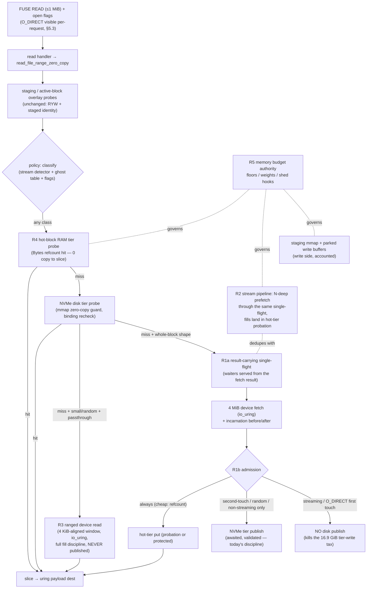

# Design Doc: Read-Path Performance Program for SqueezeFS

| | |
|---|---|
| **Title** | Read-path performance program: scan-resistant tier admission, result-carrying single-flight, sequential prefetch pipeline, sub-block ranged reads, hot-block RAM tier, and a joint memory budget — make reads faster than writes |
| **Author** | Justin (data-path owner) — reviewer sign-off pending |
| **Date** | 2026-07-11 |
| **Status** | **Approved** (2026-07-12 — 3 review rounds, 15/15 review issues resolved, all five Open Question defaults user-approved verbatim; next lifecycle step per Intended home: → Implemented with a landed-SHA table) |
| **Repo** | `/home/justin/Source/squeezefs`, branch `dev` @ `4f1c897` |
| **Intended home** | `docs/design-read-path.md` (committed by PR 1 of the plan; lifecycle mirrors `docs/design-zero-copy-write-path.md`: Draft → Implemented with a landed-SHA table) |
| **Reviewers** | FUSE / data-path owners |
| **Related** | `.benchmarks/2026-07-11-elbencho-odirect-read-smallblock-attribution.md` (the attribution + fixed-row addendum — the evidence base for every claim below), `docs/design-zero-copy-write-path.md` (the sibling design that made writes fast; this document reuses its invariant naming and acceptance-evidence discipline), `tests/read_tier_refetch_churn_tests.rs` + `56a968b` (the single-flight publish contract this design must preserve or provably supersede), `f29520e` (geometry-complete ring eviction, terminal-free tier purge, validated non-owner publishes), `0a184f3`/`8d45ac6` (staged-identity revalidation, binding-validated serves, incarnation seqlock), `441e026` (read zero-copy payload dest re-enabled), `.benchmarks/2026-07-11-seek-hole-oom-and-quick-tier.md` (QUICK-tier expected table + `SQUEEZEFS_FSTESTS_MEMMAX` rail), `AGENTS.md` (io_uring-first, zero-copy/latch-free, lock order P1-9/P1-10, no dead code, v3 CoW KV) |

## Landed (per-PR SHAs on `dev`)

_To be filled as PRs merge — same table shape as the zero-copy write doc._

| PR | Landed as (tests-first + implementation) | Gate evidence |
|---|---|---|
| PR 1 — design + baseline | _pending_ | — |
| PR 2 — result-carrying single-flight (R1a) | _pending_ | — |
| PR 3 — hot-block RAM tier (R4) | _pending_ | — |
| PR 4 — scan-resistant admission + O_DIRECT no-publish (R1b) | _pending_ | — |
| PR 5 — sequential prefetch pipeline (R2) | _pending_ | — |
| PR 6 — sub-block ranged reads (R3) | _pending_ | — |
| PR 7 — joint memory budget (R5) | _pending_ | — |
| PR 8 — closing report + docs | _pending_ | — |

---

## Overview

On SqueezeFS today **large writes outrun reads** — backwards from every storage norm. The user's elbencho on a real mount: fresh 1 MiB O_DIRECT writes **2487 MiB/s** vs sequential 1 MiB O_DIRECT reads **443 MiB/s**; rand-4k reads ~1500 IOPS. The committed sandbox A/B (post refetch-churn fix `56a968b`): writes **3721 / 4072 MiB/s** (full A/B spread 3488–4153 MiB/s), cold sequential reads **786 MiB/s**, rand-4k **302–306 IOPS**. The write path earned its numbers through a deliberate program (`docs/design-zero-copy-write-path.md`: 1 userspace copy + 1 DMA, complete-block write-through past staging). The read path never got the equivalent treatment; this document is it.

The attribution ground truth (`.benchmarks/2026-07-11-elbencho-odirect-read-smallblock-attribution.md`, fixed-row addendum) says the remaining costs are structural, not incidental: reading 16 GiB cold costs **16.35 GiB of device reads (1.02× — good) plus 16.9 GiB of tier WRITES** — every cold read publishes its 4 MiB block into the NVMe read tier, paying a 4 MiB mmap memcpy on the serve path and dirty-page writeback that fights the read stream for the same device. Random 4 KiB reads fetch a full 4 MiB block each (**1024× amplification by design**). Blocks > 256 KiB have **no RAM tier at all** (`read_lru` gate, `src/routing.rs:1414`), so every re-read is an mmap/disk round trip. And sequential O_DIRECT readers have no kernel readahead and only a fire-and-forget 9-block prefetch — nothing keeps the device queue full.

This design removes each cost with five coordinated mechanisms (R1–R5), sequenced so every PR is independently mergeable and measurable: **(R1)** a result-carrying single-flight plus scan-resistant tier admission so streaming/O_DIRECT cold reads stop paying the 1:1 tier-write tax without breaking the one-fetch-per-block dedupe contract; **(R4)** a budgeted hot-block RAM tier so 4 MiB blocks finally have a RAM tier (puts are `Bytes` refcount clones — zero memcpy); **(R2)** a per-stream pipelined prefetcher targeting device-bandwidth-bound sequential reads; **(R3)** sub-block ranged device reads on passthrough volumes, killing the 1024× rand-4k amplification; **(R5)** one memory-budget authority with floors, weights and backpressure so the daemon sheds instead of OOMing (the caged-daemon 8 GiB OOM from the attribution run).

**Program acceptance gate:** on the committed sandbox substrate, cold sequential 1 MiB O_DIRECT reads of striped files **must exceed** fresh sequential 1 MiB O_DIRECT writes measured in the same session (i.e. reads enter and beat the same-session row-1 band — 3488–4153 MiB/s across the committed A/B runs), and rand-4k O_DIRECT reads must become **device-IOPS-bound**: device-read-bytes / user-read-bytes ≤ 2× (today ≈ 1000×), with the IOPS floor and control framing specified in Goals #1 (design-owned hard gate + pre-agreed control fallback, risk R-10). No regression to the write rows, the churn-contract suite, or the fstests QUICK expected table.

---

## Background & Motivation

### The measured read path today (attribution, condensed)

For a cold striped 1 MiB read on the default shape (4 MiB blocks, `max_read` = 1 MiB, FUSE-over-io_uring armed):

```
FUSE READ (1 MiB, one round trip — never split, never kernel-serialized)
  └─ fuse_client.rs:3320 read → routing.rs:2901 read_file_range_zero_copy
       └─ striped single-block arm (routing.rs:3143)
            ├─ staging overlay probe (read_staged_zero_copy)            [miss]
            ├─ NVMe tier probe (get_cached_read_block_range_zero_copy)  [miss]
            └─ get_block_for_index → get_cached_or_fetch_block_traced (routing.rs:1253)
                 ├─ read_lru probe          [miss — 4 MiB > 256 KiB gate, :1414]
                 ├─ NVMe tier probe         [miss]
                 ├─ single-flight insert (scc, broadcast::Sender<()>)
                 ├─ fetch_block_from_remote → BackendRouter::read_block   ← 4 MiB device DMA
                 │    (nvme_dev.rs:735 read_block_with_dest, io_uring worker, O_DIRECT fd)
                 ├─ AWAITED tier publish (spawn_blocking; shard parking_lot
                 │    write lock + 4 MiB memcpy INTO the tier mmap)       ← the tax
                 │    [56a968b: publish completes inside the single-flight]
                 └─ incarnation still-check; waiters re-check tier and hit
            └─ slice 1 MiB out of the 4 MiB ReadBlockValue → uring payload dest
```

Four structural facts drive the row-2/row-3 numbers:

1. **The tier-publish tax (H3 residue).** Every cold fill runs `cache_read_block` (`src/cache/nvme.rs:1225`) → `NvmeShard::put_discard_evicted` (`src/tiering/nvme.rs:323`): a 4 MiB memcpy into an mmap segment under the shard write lock, whose dirtied pages the kernel writes back — **16.9 GiB of device writes to read 16 GiB once** (measured; exactly one publish per block post-`56a968b`). For a one-pass stream this buys nothing: the block is consumed within ~0.3 s and never read again. Pre-fix perf showed **44 % of daemon CPU in memcpy** during read storms; the churn multiplier is gone but the per-block publish memcpy + writeback remains.
2. **Whole-block fetch for any miss (H1).** `get_block_for_index` resolves the block key and fetches all 4 MiB regardless of how few bytes the caller needs — 4× amplification for 1 MiB requests, **1024×** for rand-4k. `--iodepth 16` cannot help; the per-op work is the 4 MiB fetch. `BackendRouter::read_block_with_dest` (`src/routing.rs:532`) and `NvmeBlockDev::read_block_with_dest` (`src/nvme_dev.rs:735`) already accept arbitrary `(offset, size)` — the capability exists, nothing dispatches to it.
3. **No RAM tier for striped blocks.** `get_cached_or_fetch_block_traced` publishes to `read_lru` only for payloads ≤ 256 KiB (`routing.rs:1414-1416`), deliberately, so multi-GiB streams don't flood the LRU. Consequence: a 4 MiB block re-read hits, at best, the disk-tier mmap (page-fault + copy), never RAM. The `no-RAM-repromote` rationale (`routing.rs:1276-1289`) additionally — and correctly — forbids re-promoting NVMe-tier hits into RAM because tier-entry provenance cannot be proven by the incarnation word alone. So the only RAM-fill route that could exist is the one this design adds: device-validated fills at fetch time.
4. **No pipeline for O_DIRECT streams.** Kernel readahead does not exist under O_DIRECT; the mount's `max_readahead=4194304` (`src/fuse_client.rs:5669`) only helps buffered readers. The existing prefetch (`schedule_striped_prefetch`, `routing.rs:2065`: fire-and-forget 9 blocks, `PREFETCH_BLOCK_COUNT = 9`, admission-gated by `BG_TASK_SEM`) has no stream lifecycle: no depth adaptation, no cancellation, no memory bound beyond global task admission, and its fills pay the same tier-publish tax as the foreground. Single-thread row-2 ≈ 8-thread row-2 (125 vs 100 MiB/s pre-fix) proved the ceiling is the shared device+tier path, not FUSE concurrency.

The fifth finding is a liveness cost, not a latency one: during the rand-4k write row the daemon was **OOM-killed at its 8 GiB cgroup cap** — parked write buffers (256 × 4 MiB, `MAX_ACTIVE_BLOCK_BUFFERS`, `fuse_client.rs:513`), staging mmap (5 GiB), read-tier mmap pages, payload buffers and the RAM LRUs have **no joint budget**; each is individually bounded, their sum is not (R5).

### What is already right (build on it, don't rebuild it)

- **The single-flight dedupe + awaited-publish contract** (`56a968b`, pinned by `tests/read_tier_refetch_churn_tests.rs`): one device fetch per unique cold block; a fill is tier-visible before the single-flight guard drops; concurrent resolvers dedupe. This fixed a 6.3× device-read amplifier. Any redesign here must be provably equivalent or stronger (§5.2 makes it stronger: waiters are handed the bytes directly).
- **The correctness lattice** — freshly hardened, and every new fill/serve path in this design must ride it, not fork it:
  - *Validated fills* (incarnation seqlock): snapshot before device read, publish only while stable, still-check after, undo on movement (`routing.rs:1337-1438`; `f29520e` made non-owner publishes validated: `cache_read_block_validated`, `cache/nvme.rs:1273`).
  - *Binding-validated serves* (`8d45ac6`): bytes for key K serve block b only if the fill was incarnation-valid AND the current map still binds b→K after the bytes are in hand (`get_block_for_index`, `routing.rs:1500`; tier fast-path recheck `routing.rs:3223`).
  - *Staged-identity revalidation* (`0a184f3`): unlocked reads re-resolve moved identities, bounded, zeros only for stably-lost payloads (`read_file_range_zero_copy` loop, `routing.rs:2932-2950`).
  - *Geometry-complete ring eviction + de-index-under-lock + terminal-free purge* (`f29520e`): the tier never serves clobbered extents; frees purge every cache tier.
- **Zero-copy reply plumbing**: `get_payload_buffer` hands the registered uring payload dest to the read path (`fuse_client.rs:3486-3491`, re-enabled by `441e026`); the raw full-block DMA-into-dest leg already carries the full fill discipline itself (`routing.rs:3249-3307`).
- **io_uring device path**: `NvmeBlockDev` worker with O_DIRECT fd, fixed-file registration, bounded queue with `uring_queue_full` backpressure accounting (`nvme_dev.rs:169-806`).
- **Shard-lock discipline**: tier writers only on the blocking pool; readers `read_recursive` so they never park behind queued writers (`tiering/nvme.rs:155-179`, the Hang-1 wedge fix). Multi-MiB memcpys never on async workers — this design keeps that split intact everywhere.

### Why "reads faster than writes" is achievable on this substrate

During pre-fix row 2 the device itself sustained **≈4.3 GiB/s of reads** (698 GiB / 163 s) — the substrate can already stream reads at or above the write row's 3488–4153 MiB/s band. Post-`56a968b` the path delivers 786 MiB/s of it to the user. The gap is exactly items 1–4 above: ~1 GiB/s-class publish memcpy + writeback contention on the serve path, no lookahead keeping the device busy, and a 4× request amplification floor. Writes additionally pay allocation + meta merges per block that reads never pay, so with tier-tax removed (R1), the queue kept full (R2), and amplification at 1.0× (R2/R3), cold sequential reads should settle **above** the write band. That inversion — restored to the industry-normal direction — is the program gate.

---

## Goals & Non-Goals

### Goals

1. **Program gate (sandbox, committed protocol of the attribution doc — same machine profile, same volumes, same elbencho shapes, rustc-quiet + thermal rails):**
   - **Row 2** (`-r -b 1M --direct`, 8 t × 2 GiB, cold): cold sequential striped reads **> the same session's row-1 fresh-write MiB/s** (baseline row-1 band 3488–4153 MiB/s ⇒ ≈ 4.4–5.3× the 786 MiB/s read baseline).
   - **Row 3** (`-r --rand -b 4k --iodepth 16`): device-IOPS-bound, gated in two parts. **Design-owned hard gate:** device-read-bytes/user-read-bytes ≤ 2× (alignment slop only; ≈ 1000× today) **and** IOPS ≥ 30× the 302–306 IOPS baseline (≥ ~9k IOPS). **Substrate-coupled target with a pre-agreed fallback (mirrors R-9's framing for row 2):** IOPS ≥ 50 % of a same-session raw-device 4 KiB qd16 O_DIRECT control; if the raw control outruns what a FUSE round trip permits regardless of amplification success, the fallback control is a *FUSE-round-trip-bound* row — warm hot-tier 4 KiB reads, same transport, zero device work — and the gate becomes ≥ 50 % of that, with both controls recorded in the closing note (risk R-10). The design owns amplification; it does not own the transport round trip.
2. **Preserve the single-flight dedupe contract** — replaced by a provably stronger form: waiters are served from the shared fetch result itself (§5.2), never by refetching; whole-block cold fetches stay ≤ 1 device fetch per unique block; `tests/read_tier_refetch_churn_tests.rs` evolves assertion helpers but keeps every behavioral phase.
3. **Zero correctness regression** against the freshly-hardened families: reused-key stale-fill (074), staged-identity (074/127/616), binding rebinds, hole/short-read (616/617), all pinned suites (`reused_key_stale_fill_tests`, `staged_identity_visibility_tests`, `read_tier_refetch_churn_tests`, `data_path_correctness_tests`) plus fstests QUICK expected table (`.benchmarks/2026-07-11-seek-hole-oom-and-quick-tier.md` item B disposition).
4. **No write-row regression**: rows 1/4/5 and the zero-copy write doc's gates stay in-band; the shared machinery this design touches (tier, single-flight, purge discipline) is exercised by both directions.
5. **Warm workloads keep their tier**: re-read-hot blocks still reach the NVMe tier (second-touch admission, §5.3) and now also a RAM tier (R4); a warm-re-read bench row is part of every admission-touching PR gate.
6. **Bounded memory, by authority**: one accounting authority over parked write buffers + staging + read tier + RAM caches + prefetch in-flight + payload buffers; backpressure (shed/clamp/refuse-growth) instead of cgroup OOM; the caged-daemon (8 GiB) rand-4k write storm from the attribution run completes without an OOM kill (R5).
7. Stay inside `AGENTS.md` non-negotiables: io_uring-only device I/O (all new fetch shapes go through the `NvmeBlockDev` uring workers), zero-copy/latch-free hot path (no new blocking locks on the read path; scc/moka/atomics/arc-swap patterns; tier-shard writer discipline unchanged), lock order P1-9/P1-10, no dead code, TDD per PR, bench smoke in the gate.

### Non-Goals

- **Changing the 4 MiB stripe block size or any on-disk format** (block map encoding, tier segment format `BLOCK_MAGIC`, superblock). Zero format change.
- **The lazy-RMW-seed write-side item** (attribution ranked-plan item 3, row 4's old-block fetch) — separate track; this design must not preclude it and does not.
- **GDS path changes** (`gds` feature). The GDS prefetch arm in `schedule_striped_prefetch` is preserved as-is. **One scoped exception, argued in §5.4:** `purge_block_key` gains a `.gds_cache` unlink arm — the GDS cache is a fourth *block-key-addressed* tier, and exempting it would falsify the helper's cannot-be-forgotten claim while leaving a pre-existing within-mount stale-serve hole open. That is cache-coherence completeness for a shared key namespace, not a GDS data-path change.
- **Durability/crash-contract changes.** Reads are non-mutating; the only writes this design touches are cache publishes, which are and remain non-durable by contract.
- **Kernel-side readahead tuning** beyond documenting interactions; no new FUSE INIT flags.
- **Replacing the tier's ring-geometry eviction with LRU/clock.** The addendum *exonerated* ring geometry for these rows (`get_obj/unique = 1.002` post-fix with geometry untouched); the 074-hardened eviction machinery stays untouched.
- **P2P/DHT read-path changes** (`fetch_block_from_remote`'s peer arm is orthogonal; admission applies after whichever source produced the bytes).

---

## Proposed Design

### 5.1 Target read data flow



Cold sequential per 4 MiB block: today **4 MiB DMA + 4 MiB publish-memcpy + ~4 MiB tier writeback + 4 MiB slice-out copies**; after **4 MiB DMA + 4 MiB slice-out copies** (one refcount put), pipelined N-deep. Cold rand-4k per op: today **4 MiB DMA + 4 MiB publish**; after **4 KiB DMA** (+ ≤4 KiB alignment slop).

### 5.2 R1a — result-carrying single-flight (waiter correctness decoupled from publish)

**Problem being solved.** Today waiter correctness *depends on the publish*: `get_cached_or_fetch_block_traced`'s waiters are woken by the primary's guard drop and re-check the caches (`routing.rs:1299-1320`); the awaited tier publish (`:1364-1411`) is what guarantees they hit. If R1b skips the publish for streaming fills, waiters would miss every tier, become fresh primaries, and refetch — reintroducing the exact 6.3× churn `56a968b` killed. Publish and dedupe must be decoupled *first*.

**Mechanism.** The in-flight registry entry carries the fill result. `inflight_block_reads: Arc<scc::HashIndex<String, broadcast::Sender<()>>>` (`routing.rs:833-834` — `HashIndex`, the read-optimized epoch-reclaimed container, not `HashMap`; the container stays, only the value type changes) becomes:

```rust
// src/routing.rs

/// One cold-block fill, shared by its single-flight cohort. `Bytes` clone =
/// refcount bump; waiters never copy, never refetch.
#[derive(Clone)]
pub(crate) struct FillResult {
    pub bytes: bytes::Bytes,
    /// The primary's serve-validity verdict (incarnation stable across the
    /// device read and the publish window). Waiters apply exactly the same
    /// downstream rule as the primary: get_block_for_index rechecks the
    /// binding; `false` forces re-resolve (unchanged semantics).
    pub serve_valid: bool,
}

// value type: broadcast::Sender<Option<FillResult>>
//   Some(res)  → fill completed (ok); waiters serve from `res`
//   None       → primary failed; waiters loop (cache re-check → new primary),
//                exactly today's failure behavior
```

Primary: after the fetch + (per-policy) publishes + final still-check, `let _ = tx.send(Some(FillResult { .. }))`, mark the guard `completed`, then drop it. **Guard-drop semantics, exact (three cases, one rule):** on the **success** path the drop is **close-only** — no second value is ever sent; a late subscriber that raced between `send(Some)` and the drop sees `Err(Closed)`/`Err(Lagged)` and falls into the cache re-check loop, where it is served from the hot tier while resident (the same residency bound as any post-cohort reader, below). On the **failure** path (`return Err(e)` at `:1349-1352`) and on **future-drop mid-fetch** (caller cancelled), the un-`completed` guard's `Drop` sends `None` before closing, so live waiters fail fast into the re-check loop (one of them becomes the new primary) instead of waiting out a 50 ms slice — today's behavior, made explicit so an implementer never guesses among the three safe-but-different variants. Waiters: `rx.recv()` yielding `Ok(Some(res))` returns `(ReadBlockValue::Bytes(res.bytes), res.serve_valid)` **directly** — no tier re-check needed for correctness; `Ok(None)`, `Err(Lagged)`, `Err(Closed)`, and the 50 ms slice timeout all keep today's loop (bounded `MAX_WAIT` 60 s deadline unchanged — no new hang surface). The pre-subscribe cache re-check (`:1304-1310`) stays as the cheap fast path.

**Contract statement (supersedes the tier-visibility *mechanism*, preserves the churn *contract*):** a completed fill is **servable to every member of its single-flight cohort without a second device fetch, unconditionally**, and to immediately-following readers **while it remains hot-tier-resident**. Cohort members get it from the broadcast; immediately-following readers get it from the hot tier (R4 — the put is a refcount clone and happens for *every* class, §5.4), and, for admitted classes, from the NVMe tier exactly as today. The residency precondition is new and stated honestly: under R1b a streaming-class fill's only landing zone is hot-tier probation, whose residency window is `hot_budget / aggregate fill rate` — ≈ 0.4 s at the 1.6 GiB default (25 % of a 6.4 GiB read-mem limit on a 64 GiB box) against a 4 GiB/s aggregate stream, vs ≈ 8 s ring turnover on the user-shape 5 GiB disk tier today. The sequential sub-read pattern needs ~1 block of residency; the multi-stream case is kept bounded by §5.5's evict-before-consume control, pinned by the multi-stream contention phase — a churn-*contract* extension implemented in `tests/read_prefetch_pipeline_tests.rs` (PR 5, which owns the mechanism) under the churn suite's counter-isolation discipline. `tests/read_tier_refetch_churn_tests.rs` keeps all four phases; the `tier_has(...)` assertions generalize to `hot_or_tier_has(...)` helpers (RAM-or-disk visibility — this is the single helper name used throughout this design) in the same PR that changes visibility placement (PR 3/PR 4), with the `get_obj`-delta assertions — the actual churn detectors — byte-identical.

**Ordering & locks.** No new locks; the broadcast send happens where the guard drop happens today (the awaiting task holds no locks — P1-9 unchanged, same statement as the `56a968b` comment `routing.rs:1386-1392`). Loom: no new atomic protocol (tokio broadcast + scc are library primitives; no hand-rolled cross-word invariants) — loom not required; noted per the mandate.

**Perf.** Neutral by itself (one `Bytes` clone per waiter replaces one tier probe per waiter). Lands first because both R1b and R2 depend on its guarantee.

**Test seam (named here because it shapes production code):** PR 2's "tier put artificially delayed" phase injects via `routing::TEST_TIER_PUBLISH_DELAY_MS` — a process-global `AtomicU64` read inside the awaited publish closure, following the `nvme_dev::FAIL_NEXT_WRITES` / `SIMULATE_CORRUPTION` shim precedent (one relaxed load per publish, zero-cost when unset; no `#[cfg(test)]` fork of the production path).

### 5.3 R1b — scan-resistant tier admission + O_DIRECT/stream no-publish

**Scope rule (size-scoped exactly like the existing gates):** fills ≤ 256 KiB keep today's behavior verbatim — synchronous tier publish for < 64 KiB (`routing.rs:1364-1368`), RAM LRU put ≤ 256 KiB (`:1414-1416`). They are small-config/inline-adjacent blocks; warm small-file workloads depend on them, and their publish cost is noise. **The admission policy governs only fills > 256 KiB** — the population that pays 4 MiB publishes and has no RAM tier today. The boundary is deliberately the existing no-RAM-LRU population boundary, and the edge cases inherit deliberately: an EOF-short tail fill that lands ≤ 256 KiB takes the small-fill path (unconditional publish — bounded at one tail per file, and that population *has* a RAM tier already); a 256 KiB-block-size volume (legal config) has every striped fill on the small-fill path — i.e. unchanged from today by design, not by accident. Neither case should be "fixed" toward the other; the PR 4 policy-table tests include a tail-block case pinning this.

#### Policy inputs (all latch-free, all per-request)

1. **O_DIRECT visibility.** The kernel sends the file's open flags in `fuse_read_in.flags` on every READ; the vendored `fuse3` currently discards them (`third_party/fuse3/src/raw/abi.rs:698` — `_flags` unused; the `Filesystem::read` trait has no flags parameter). PR 4 plumbs it: `fuse_read_in._flags` → public, `Filesystem::read(..., flags: u32)` (vendored crate edited in place per the patched-dependency rule; `SqueezefsFilesystem` and the path-bridge are the only impls), `read_file_range_zero_copy` gains a `ReadClassHint` parameter. `open`'s currently-ignored `_flags` (`fuse_client.rs:3252`) is *not* used for this — per-request flags need no fh registry and survive `fh = inode` (`:3295`).
2. **Stream detector.** `sequential_read_state` (`routing.rs:835`, moka, `(end_block, Instant)`) grows into `StreamState` — one moka entry per path holding a small fixed array of **K = 4 offset lanes** (`Lane { next_expected_offset, run_reads: u32, last_seen }` plus the §5.5 pipeline fields), so concurrent sequential readers of one file do not mutually reset each other (a single-cursor entry — today's shape — would see their interleaved offsets as perpetual jumps and never classify; with far more riding on classification than the old fire-and-forget prefetcher, that would make multi-reader single-file workloads regress). An incoming read matches the lane whose `next_expected_offset` equals its offset, else claims the stalest idle lane, else classifies random. **Classification unit — sub-reads, one definition:** `run_reads ≥ 4` *contiguous requests* (each starting where the previous ended, block index non-decreasing) ⇒ **Streaming** — chosen over a block-count threshold because it classifies earliest (four 1 MiB requests = block 0 just completed on the default shape); a non-contiguous read resets that lane's run (and, per §5.5, abandons its pipeline). Lanes are racy-tolerant heuristics exactly like today's `sequential_read_state` (moka get/insert races lose an update, never correctness). **Scope + failure mode, stated:** more than K concurrent readers per file degrade the excess to the random class — which under the table below still skips first-touch publishes and recovers tier warmth via second-touch admission, so the failure cost is a later pipeline start, never wrongness.
3. **Ghost table (second-touch memory).** A fixed **2¹⁶-slot direct-mapped array of `AtomicU32` tags** (~256 KiB, allocated once per `DataRouter`): slot = `xxh3(block_key)` low bits; tag = hash high bits ⊕ epoch (fill-count epoch, bump every 2¹⁵ recorded misses). `ghost_check_and_record(key) -> bool`: true iff the slot's tag matches the key's **current-epoch or previous-epoch** tag (two compares) — the window *slides* one epoch at a time instead of globally invalidating every outstanding tag at each bump (a single-epoch match was an earlier draft; it would have created a periodic table-wide admission dead zone at every epoch flip). **Collision model, stated honestly:** direct-mapped single-tag means a large interleaved cold scan (a 1 TiB pass = 256 K blocks wraps the table ~4×) can overwrite a warm key's record before its second touch — effective coverage is birthday-bounded below the 2¹⁶ × 4 MiB = 256 GiB zero-collision figure, and the cost is a *delayed* admission (third/fourth touch), absorbed meanwhile by the hot tier's first-re-read serve (R-1's mitigation stack). The PR 4 warm-re-read gate row therefore includes an **interleaved-scan variant** that measures exactly this pollution mode, and a **2-way tag set** is the pre-agreed upgrade if `read_tier_admission_ghost_hits` underperforms on it. Deliberately racy-tolerant: a lost update is a missed admission *hint*, never a correctness event; single-word `Relaxed` atomics, no cross-word invariant ⇒ no loom model required (documented on the type, per the mandate's spirit).

#### Admission decision (per >256 KiB validated fill; runs where the publish decision sits today, `routing.rs:1363`)

| Fill class | Hot RAM tier (R4) | NVMe disk tier publish |
|---|---|---|
| **Streaming** (detector) or **O_DIRECT first touch** (flags) | put, **probation** | **skip** — the tax kill. `read_fill_publishes_skipped++` |
| **Re-read** (ghost hit — second miss within window) | put, **protected** | **publish** (awaited, validated — today's `spawn_blocking` discipline unchanged) |
| **Random / unclassified first touch** | put, **probation** | **skip + ghost-record** (second-touch admission: the *next* miss of this key publishes) |
| ≤ 256 KiB (out of scope) | n/a (read_lru as today) | as today (always) |
| **Prefetch fills** (§5.5) | put, **probation** | **skip** (prefetch is streaming by definition) |
| **Dehydration** (read_lru/hot-tier evictions → disk) | n/a | **only `protected` victims** — the *sticky* class bit of §5.4, set at protected insert or by any `get` on a probation entry; explicitly **not** the clock's `referenced` bit, which the eviction scan consumes (every victim has it false by construction, so it cannot classify victims). Probation-and-never-read victims are dropped. The eviction channel carries the class (`(String, Bytes, EvictClass)` — typed in PR 3 behavior-neutral, gate flipped in PR 4); `read_lru` (≤ 256 KiB population) inserts are all protected-class, so **its dehydration behavior is unchanged verbatim** (`cache/mod.rs:110-138` worker; still `cache_read_block_validated_self`) |

Rationale, stated once: **skipping a publish is always correctness-safe** — absence means the next reader goes to the device (the always-true fallback); every *retained* publish keeps the full validated-fill discipline (incarnation before/publish/still-check/undo, `routing.rs:1337-1438`; non-owner publishes via `cache_read_block_validated`, `f29520e`). The risky direction was never "don't cache", it was "cache wrongly" — and that machinery is untouched.

Why second-touch (2Q/TinyLFU-doorkeeper shape) and not pure O_DIRECT gating: buffered sequential streams also pay the tax today (kernel page cache already holds their bytes — our disk-tier copy of a buffered stream is *double* caching), and O_DIRECT random re-readers (databases) genuinely want the tier. Classifying on *behavior* (run length, re-miss) with flags as an accelerator covers both; the operator escape hatch `SQUEEZEFS_READ_TIER_ADMISSION=always|second-touch|never` (default `second-touch`) makes A/B trivial and de-risks rollout.

**What this deletes from the serve path:** for streaming cold reads, the awaited `spawn_blocking` publish (4 MiB shard-locked memcpy + eventual writeback) disappears entirely — the single-flight completes at DMA-return + refcount put. Expected row-2 effect from the ground-truth ledger: device writes 16.9 GiB → ~0; the read stream stops competing with its own writeback; serve-path memcpy volume halves.

**Churn-test evolution (explicit, since this is the contract the task guards):** phases A–D of `tests/read_tier_refetch_churn_tests.rs` keep their `get_obj`-delta assertions unchanged (1 fetch cold, 0 refetch on the second sub-read, 1 fetch across 4 concurrent resolvers, 8 fetches for 8 blocks). Visibility assertions switch from `tier_has` to `hot_or_tier_has` (phase A/C) and phase-D retention asserts hot-tier residency for the tier-fitting working set. A new test pins the tax kill: a classified-streaming pass over N blocks leaves `read_fill_publishes_skipped == N` and NVMe-tier byte counters unchanged; a re-read pass (ghost hits) publishes exactly N.

### 5.4 R4 — hot-block RAM tier (budgeted, device-validated fills only)

**Why a new tier and not lifting the 256 KiB gate:** the gate protects genuinely-hot small entries from being flushed by streams; lifting it would let one 10 GiB stream evict every warm ≤256 KiB entry (the exact reason the write path's `upload_full_block` skips `read_lru.put` for striped files — zero-copy write doc §5.3 pt 4). A **separate budget** keeps the populations from competing, and probation/protected segregation inside the new tier gives scan resistance.

**Type & placement.** `TieredCache` (`src/cache/mod.rs:12`) gains `hot_block: lru::LruCache` — the existing sharded clock machinery (`tiering/memory.rs`: scc `HashIndex`, `SegQueue`, referenced-bit second chance; values are `Bytes` refcounts — **a put/hit never memcpys**) with one addition:

```rust
// src/tiering/memory.rs — the shard value grows ONE sticky class bit beside
// the clock bit: (Bytes, AtomicBool referenced, AtomicBool protected).
//
// `referenced` stays the CONSUMABLE second-chance bit — the clock scan
// clears it, so every victim has it false at eviction time by construction
// and it can never classify victims. `protected` is STICKY: set at
// protected insert or by any `get` on a probation entry, never cleared by
// the clock, and read at eviction to route the dehydration decision
// (§5.3 table). Two bits because they answer different questions:
// "spare this entry one more lap?" vs "was this entry ever worth keeping?".

/// The victim's sticky classification at eviction time, read from the
/// `protected` bit — the value the dehydration worker routes on (§5.3):
/// `Protected` ⇒ eligible to dehydrate to the NVMe tier; `Probation`
/// (inserted probationary, never read) ⇒ dropped.
pub enum EvictClass { Probation, Protected }

/// Insert with referenced=false AND protected=false: a one-pass
/// (streaming/probation) entry is first in line for clock eviction and
/// cannot displace a protected entry that still has its second chance.
pub fn put_probationary(&self, key: Bytes, value: Bytes) -> Vec<(Bytes, Bytes, EvictClass)>;
```

Existing `put` becomes the *protected* insert (`referenced = true, protected = true`). A `get` on a probation entry sets `referenced` (already the case, `memory.rs:26-30`) **and** `protected` — second touch inside RAM promotes in place, sticky, no copy. Evictions carry the class out: shard evictions return `(key, value, class)` and the `LruCache` eviction channel becomes `mpsc::Sender<(String, Bytes, EvictClass)>` (`cache/lru.rs:5,11`). **This plumbing lands in PR 3 behavior-neutral** — all classes still dehydrate, and `read_lru`'s plain `put` inserts are protected-class by definition, so the ≤ 256 KiB population's dehydration is bit-identical to today — which makes PR 4's protected-only gate a one-line policy flip on an already-typed channel rather than a rushed type change.

**Budget:** `SQUEEZEFS_READ_HOT_BLOCK_CACHE_MB`, default `max(2 × block_size, 25 % of the read-mem limit)` (the attribution plan's "e.g. 25 % of read LRU"); registered with the R5 authority when it lands (floor = 2 blocks — the minimum for one stream's consume-behind window). Mount flag `--read-mem-cache-size` semantics unchanged; the hot tier is carved *beside* it, not from it, and both are visible in `.stats`.

**Fill discipline (the f29520e rule, verbatim):** only **device-validated fills** publish — the put sits exactly where the ≤256 KiB `read_lru.put` sits today, inside the publishable window (`routing.rs:1412-1416`), and the failure path's undo removes from the hot tier too (`:1436-1438` grows one line). **No re-promotes from the NVMe tier** — the `no-RAM-repromote` rationale (`routing.rs:1276-1289`) applies to this tier identically and is copied onto the probe site. **No owner puts from the write path** — `upload_full_block`'s no-put stance is unchanged (write streams are the other scan).

**Purge discipline — one helper, one census (the R-6 structural mitigation).** A new tier is a new place for stale bytes to hide; the design makes forgetting impossible rather than remembering carefully. `TieredCache` gains the **only** legal block-key purge:

```rust
/// Purge every block-key-addressed cache tier for a block key — ALL FOUR:
/// RAM LRU, hot-block tier, NVMe disk tier, and the GDS file cache. The
/// ONLY legal way to drop a block key from the caches — displaced-key
/// frees, fill undos, incarnation purges and the read_tier_purge callback
/// all route here, so a tier (present or future) cannot be forgotten by
/// one call site (the 074 family's lesson). Latch-free on the RAM/index
/// arms; the GDS arm is an unlink syscall (see below).
pub fn purge_block_key(&self, block_key: &str) {
    self.read_lru.remove(block_key);
    self.hot_block.remove(block_key);
    self.nvme.remove_cached_read_block(block_key);
    // The 4th block-key tier, which an earlier draft's census MISSED —
    // exactly the forgetting this helper exists to prevent: GDS
    // `.gds_cache` files are keyed by block key (get_gds_path,
    // cache/gds.rs:316-320), written by the prefetch GDS arm
    // (routing.rs:2104-2127) and read_direct (gds.rs:238-243), and SERVED
    // by the GDS ioctl (fuse_client.rs:5401) behind a
    // `!local_path.exists()` check that never refreshes — so within a
    // mount, a freed-and-reallocated key would serve the dead
    // incarnation's file forever (cross-mount is already closed by
    // wipe_gds_cache_files, cache/nvme.rs:52-109). Unlink-if-exists,
    // ENOENT ignored; the `gds` field exists unconditionally (no feature
    // gate), and this closes that PRE-EXISTING within-mount staleness as
    // a drive-by of the helper's completeness claim.
    self.gds.remove_cached(block_key);
}
```

`GdsCache::remove_cached(block_key)` is a new ~5-line method (unlink `get_gds_path(key)`, ignore `ENOENT`) — **paired with a filename unification that makes it complete by construction**: today the code builds `.gds_cache` names **two divergent ways** — `get_gds_path` sanitizes with `replace('/', "_")` (`gds.rs:318`; the name the prefetch arm writes) while `read_direct` inlines `replace(['/', ':'], "_")` (`gds.rs:235`; the name the GDS ioctl path writes *and serves*, `fuse_client.rs:5401`) — so for **prefixed block keys** (`be_id://offset`, the persisted form on non-default backends, `parse_block_key` `routing.rs:481-492`) the two names diverge (`nvme1://123` → `nvme1:__123.gds_cache` vs `nvme1___123.gds_cache`) and an unlink of only `get_gds_path(key)` would purge the prefetch copy while leaving the served copy stale. PR 3 therefore **deletes `read_direct`'s inline construction and routes it through `get_gds_path`** (one construction function, one-source-of-truth/no-dead-code spirit); `remove_cached` then covers every producer by construction, not by enumeration. Pre-unification files under the old `read_direct` scheme need no migration: the mount-time `wipe_gds_cache_files` sweep (`cache/nvme.rs:52-109`) matches on the `.gds_cache` suffix and catches both schemes. Note the grep-guard alone could **not** have caught this (the divergent construction lives *inside* `GdsCache`, which the guard whitelists) — unification is what restores the four-tier completeness claim, and the PR 3 GDS purge test gains a **prefixed-key case** (`be_id://offset`-shaped key, materialized via the `read_direct` path, purged on displacement) to pin it. PR 3 converts every existing paired-remove site (census recorded in the PR description, sibling-doc style, **enumerating all four tiers** — representative anchors: the `read_tier_purge` closure `routing.rs:1164-1171`, fill undo `:1436-1438`, displaced-key frees `:1688/:1804/:1890`, clone/unlink purges `:3763-:3955`, write-path invalidations `fuse_client.rs:2087/:6339/:6348`) and adds a grep-guard test asserting no direct `remove_cached_read_block`/`read_lru.remove(block_key)` caller **and no `.gds_cache` unlink/producer path-construction site** remains outside the helper/`GdsCache` — with the in-`GdsCache` blind spot closed by the unification above, so the guard's whitelist contains exactly one construction site (file-path-keyed whole-file LRU removals are a different population and stay). `hot_block` also joins `offline_device` re-homing as a no-op (RAM tier has no device affinity) and mount-time purge paths.

**Serve integration:** probe order overlay → **hot tier** → read_lru (≤256 KiB population) → NVMe tier → device, in both `get_cached_or_fetch_block_traced` (`:1266-1290`) and the single-block tier fast path (`routing.rs:3180`) — a hot hit still takes the **binding recheck** on the fast path exactly as the NVMe-tier hit does today (`:3223-3238`; hot-tier entries hold current-incarnation bytes by the same argument as tier entries — validated fills + purge-on-free — so binding currency alone validates the serve). Cache-less volumes (no staging dirs ⇒ `cache_read_block` no-ops, `cache/nvme.rs:1229`) get a striped-block RAM tier **for the first time** — called out because it changes their re-read profile from device-bound to RAM-bound.

**Expected effect:** O_DIRECT re-reads and cross-file hot 4 MiB blocks serve at RAM speed (refcount + ≤1 MiB slice copy to the payload dest) instead of mmap-fault speed; rand-4k *warm* IOPS decouple from the device entirely; the elbencho warm-slice probe (attribution: warm 2 GiB re-read still pulled 55 GiB pre-fix, tier-bound post-fix) becomes RAM-bound.

### 5.5 R2 — sequential prefetch pipeline (device-bandwidth-bound streams)

**Replace** `schedule_striped_prefetch`'s fire-and-forget batch (9 blocks; its overlapping jobs raced foreground fetches through the pre-fix invisibility window — real but *secondary* to the dominant detached-late publish, per the addendum's root-cause split) with a **per-stream pipeline** owned by the per-lane `StreamState` of §5.3 (same moka entry; GDS arm preserved verbatim):

- **Issue path:** on every classified-streaming foreground read of block b, top up in-flight prefetches to cover `(b, b + window]`, each an admitted `spawn_bg` task calling `get_cached_or_fetch_block(&key)` — **through the single-flight**, so prefetch/foreground dedupe to one fetch per block (R1a's guarantee; pinned by churn-test phase C/D already). Prefetch resolves keys via `load_striped_block_keys` and — like today's warmer — never *serves* bytes, so it legitimately uses the unvalidated fetch entry point (`get_cached_or_fetch_block` doc contract, `routing.rs:1230-1235`); its fills land in **hot-tier probation** (streaming class ⇒ no disk publish) where the foreground consumes them via the normal validated serve path.
- **Depth (window) policy:** start at 2 blocks; **grow ×2 on foreground-wait** (the reader arrived at a block whose fetch was still in flight — pipeline too shallow: detected as a single-flight *waiter* serve on a prefetch-issued key), up to `min(SQUEEZEFS_READ_PREFETCH_WINDOW, 16)` blocks (default cap 16 ⇒ 64 MiB/stream at 4 MiB blocks); **shrink** on idle (no consume for 2 s — the existing `sequential_read_state` staleness constant, `routing.rs:2055`). Rationale: 16 × 4 MiB in flight at 4 GiB/s ≈ 16 ms of pipeline — comfortably covers the FUSE round trip + fetch latency without a bandwidth-delay estimator; the growth trigger is workload-driven, not modeled.
- **Memory bound & the evict-before-consume control (the refetch-spiral killer):** the quantity that must be bounded is **resident-unconsumed** prefetched bytes, not merely in-flight bytes. A fill that lands in probation and is evicted *before* the foreground consumes it forces a refetch the single-flight cannot prevent (the fetch *completed*), and an in-flight-only bound reopens headroom at every eviction — issue→fill→evict→issue can live-thrash and quietly bring back `get_obj/unique > 1`, the exact metric this program guards, with nothing detecting it. Three mechanisms close it: **(i) per-lane accounting** — each lane tracks `unconsumed` (completed fills not yet foreground-served; consumption advances the lane's consume cursor) and issue stops at `unconsumed ≥ effective_window`; **(ii) contention scaling** — `effective_window = min(window, prefetch_share × hot_budget / (active_streams × block_size))`, `prefetch_share` default 50 % (`SQUEEZEFS_READ_PREFETCH_SHARE_PCT`), so per-lane windows shrink smoothly as the stream population grows instead of collectively overrunning probation. **`active_streams`, precisely — unit and maintenance (this term is load-bearing for R-5, so it gets a definition, not a vibe):** the unit is **classified lanes** (each lane owns a window; a file with two concurrent readers counts twice). It is maintained as a **two-epoch activity gauge** — the same sliding pattern as the ghost table (§5.3), chosen because it is *leak-proof by construction*: epoch length = the 2 s staleness constant; each classified lane increments the current epoch's counter **at most once per epoch** (guarded by a per-lane `last_counted_epoch` stamp — one relaxed compare per issue-path touch); `active_streams = max(count_cur, count_prev)`; on epoch roll, `prev ← cur, cur ← 0`. There is deliberately **no decrement path**: a pure inc/dec counter would leak upward, because lanes live inside per-path moka entries and `sequential_read_state` evicts entries **silently** (no eviction listener is configured) — a lane evicted while classified would never run its decrement, permanently shrinking every survivor's `effective_window` toward the floor, an invisible degradation the lanes' racy-tolerance framing (lost *updates*) does not cover (monotonic *leaks*). Under the activity gauge, moka eviction, 2 s idle, and generation bumps are all handled identically — the dead lane simply stops incrementing and ages out of the estimate within ≤ 2 epochs (≤ 4 s). The gauge is exported as `prefetch_active_streams` so the estimate is directly observable; **(iii) congestion response** — a foreground read of a block its lane's pipeline *already fetched* that nonetheless misses the hot tier **is** an evict-before-consume event: `prefetch_evicted_unconsumed++` (detected at the consumer — no eviction-channel cross-referencing needed) and the lane's window collapses multiplicatively (÷2, floor 2), mirroring the growth trigger — AIMD: grow on foreground-wait, collapse on evicted-unconsumed. `prefetch_inflight_bytes` remains the issue-side gauge (atomic add on issue / sub on completion), accounted against the hot-tier budget and, post-R5, the joint authority. Concurrency stays under `BG_TASK_SEM` + `PREFETCH_BLOCK_CONCURRENCY` admission exactly as today (`bg_admit.rs` unchanged) so prefetch can never starve foreground `STRIPED_IO_SEM` I/O. The churn *contract* gains a **multi-stream contention phase** (M streams against a deliberately small hot budget): `get_obj` overshoot must be *bounded* — windows collapsed, ≤ 1 + ε fetches per unique block — never the unbounded spiral. **One home for this phase:** it is implemented in `tests/read_prefetch_pipeline_tests.rs` (PR 5 owns the mechanism), **not** in `read_tier_refetch_churn_tests.rs` — but under the same counter-isolation discipline the churn suite's header mandates (process-global `get_obj` deltas ⇒ counter-asserting phases share one test fn / run serially, never concurrently with sibling tests).
- **Cancellation on abandonment:** a non-sequential foreground read or 2 s idle bumps `StreamState.generation` and clears the plan; a prefetch task checks its captured generation at admission and *before landing* its fill (post-fetch) — stale-generation fills still complete their (probationary, refcount-cheap) put and are simply first in eviction line. Deliberately **no** io_uring cancel plumbing: aborting an in-flight 4 MiB DMA saves ≤ one block of bandwidth per abandoned stream, bounded by the window; the wasted-fill counter (`prefetch_wasted`) makes the actual cost observable before anyone builds machinery for it.
- **Interaction with FUSE/kernel readahead:** buffered streams arrive as up-to-1 MiB readahead requests under `max_readahead=4194304` (`fuse_client.rs:5669`) — the kernel pipelines *requests*, this pipeline extends the lookahead to *device blocks* past the kernel horizon and dedupes with it through the single-flight. **O_DIRECT streams have no kernel readahead at all** — this pipeline is their only lookahead and is precisely what row 2 needs to keep the device queue full. elbencho row 2's read pattern (1 MiB sequential per thread, 8 files, one lane each) classifies as streaming at **sub-read 4** — block 0's fourth contiguous 1 MiB request, per §5.3's one classification unit — so the pipeline starts before block 1 is even requested; the pre-classification exposure is ≤ 1 block per stream, and that block's fill already skipped the disk publish via the admission table's unclassified-first-touch row (classification timing affects pipeline start and ranged-vs-whole dispatch, not the publish tax).
- **Multi-block reads** (`read_file_range_zero_copy`'s assemble arm, `routing.rs:3428`) already fan out via `STRIPED_IO_SEM`; the pipeline simply advances `next_block` past `end_block` — no interaction change. `should_prefetch_after_striped_read`'s permit-availability guard (`:2045-2047`) moves into the issue path unchanged.

**Expected effect (row 2 arithmetic):** with the tax gone (R1b) and window 16, the device sees a continuous ≥ 16-deep 4 MiB read stream — the same shape that measured ≈ 4.3 GiB/s device-side pre-fix — while the serve path does refcount hits + payload-dest copies. FUSE round-trip concurrency (8 threads × 1 MiB, `FUSE_ASYNC_READ`, uring queues) is already sufficient (H5: `uring_queue_full = 0`; +29 % from deeper queues remains available as operator guidance, unchanged).

### 5.6 R3 — sub-block ranged reads (passthrough volumes; kills rand-4k amplification)

**Dispatch rule (fetch granularity policy):**

```
ranged_eligible(request) :=
       crypto.is_passthrough()                 // crypto_compress.rs:237 — whole block
                                               // is REQUIRED for decode otherwise
    && request_len ≤ SQUEEZEFS_READ_RANGED_THRESHOLD   // default 256 KiB; 0 disables
    && !stream_classified(file)                // streams want whole blocks (1.0× amp
                                               // + pipeline); randoms want small I/O
    && overlay/tier/hot probes all missed      // cache hits already serve sub-ranges
```

Sequential 1 MiB requests therefore keep the whole-block single-flight path (dedupe + prefetch intact — churn-test semantics untouched for that shape); random ≤ 256 KiB requests (elbencho row 3's 4 KiB, kernel-buffered random 4–128 KiB) fetch **only their aligned window**. Compressed/encrypted volumes never range (decode needs the whole physical block + header) — the dispatch collapses at the `is_passthrough()` check, statically per mount.

**Mechanism.** New primitive beside `get_block_for_index` — same serve rule, ranged fetch:

```rust
// src/routing.rs

/// BINDING-VALIDATED ranged striped serve (R3). Identical proof obligation
/// to get_block_for_index (8d45ac6): bytes for key K serve block b only if
/// (a) the fill was incarnation-valid — snapshot before the device read,
/// unchanged after (the raw-dest read's own discipline, routing.rs:3253-3307)
/// — AND (b) the CURRENT map still binds b → K once the bytes are in hand.
/// On movement: re-resolve and retry (MAX_REBINDS), falling back to the
/// whole-block validated loop on exhaustion pressure. Ok(None) = hole.
///
/// NEVER PUBLISHED: a partial payload must not exist under a whole-block
/// tier key (a tier/hot entry is whole-block by contract — a short entry
/// would serve truncated bytes to a larger read). Ranged fills serve their
/// caller only; re-read heat is captured by the ghost table, whose second
/// touch admits a WHOLE-block fetch + publish (§5.3) so genuinely hot
/// sub-block ranges converge to cached whole blocks.
pub async fn get_block_range_for_index(
    &self,
    file_path: &str,
    b: u32,
    rel_range: std::ops::Range<u64>,   // within the block
    resolved_key: Option<&str>,
    dest: Option<RangedDest>,          // uring payload dest when aligned
) -> Result<Option<crate::cache::pool::ReadBlockValue>>
```

Device leg: `BackendRouter::read_block_range(block_key, range)` → `NvmeBlockDev::read_block_with_dest(offset + aligned_start, aligned_len, dest)` — the worker already takes arbitrary offsets (`nvme_dev.rs:735`); the fd is O_DIRECT (`:175`), so the **window is rounded outward to 4 KiB** on both ends (conservative LBA; probe refinement is an open question) and the destination must be 4 KiB-aligned:

- **Zero-copy leg:** request `offset%4096 == 0 && len%4096 == 0` and a payload dest available (dest base is page-aligned registered memory) ⇒ DMA straight into the dest — the expected rand-4k O_DIRECT shape (4 KiB-aligned offsets/lens are the elbencho shape and overwhelmingly common O_DIRECT practice, stated as an *expectation*, not a FUSE-protocol invariant — the kernel does not enforce 4 KiB DIO alignment for all backings; misaligned O_DIRECT requests simply take the bounce leg). Amplification 1.0×.
- **Bounce leg:** unaligned edges ⇒ DMA the ≤ `len + 8 KiB` window into a pooled aligned buffer (`ALIGNED_BUF_POOL` sub-alloc / small pooled class), copy the requested range out (bounded ≤ request+8 KiB — for a 4 KiB read that is a ≤ 12 KiB copy vs today's 4 MiB fetch + 4 MiB publish). Counter `ranged_read_unaligned_bounces`.

`RangedDest`, one definition so no guesswork: `struct RangedDest { ptr: *mut u8, cap: usize }` — a 4 KiB-aligned pointer into the registered uring payload region (`get_payload_buffer`), offered **only** on the zero-copy leg (window == request); the callee DMAs the full served length at offset 0 and **zeroes `served..requested`** (the reused-payload replay rule — same contract as `routing.rs:3338-3348`); the bounce leg never sees it (the bounce copy writes the dest itself, same zeroing rule at the copy site).

Integration points: the single-block arm's validated-resolve (`routing.rs:3240-3364` — beside the existing raw full-block dest leg, which stays for small-block configs) and the multi-block per-block task (`:3496`) when eligible. Hole semantics, dest-region zeroing for short serves (`:3338-3348`), and the staged/active overlay precedence are unchanged — ranged dispatch happens strictly after the overlay probes.

**Sibling-leg hygiene (pre-existing hole, fixed in PR 6 because PR 6 rebuilds this exact dispatch):** the raw full-block dest leg DMAs raw device bytes into the payload dest **without `process_read_async`** (decode runs only inside `fetch_block_from_remote`, `:1226`) and without any passthrough check anywhere in the striped arm. It is unreachable on the default shape (requires `slice_len == block_size ≤ max_read` ⇒ small-block configs only), but on a small-block **compressed/encrypted** volume with over-uring payload dests it would serve ciphertext/compressed bytes — its existing revalidation (incarnation before/after + binding recheck) proves *identity*, not *transform correctness*. PR 6 adds the same `is_passthrough()` gate to that leg (transform configs fall through to the validated whole-block loop, which decodes) and pins it with a small-block transform-config test; gating the new leg while leaving its sibling ungated would be an open invitation to the same bug.

**Single-flight interaction:** ranged reads do **not** register in `inflight_block_reads` — deduping 4 KiB fetches under a 4 MiB block key would serialize independent sub-reads for no byte savings (two concurrent 4 KiB fetches cost 8 KiB; one dedupe'd whole-block fetch costs 4 MiB). The churn contract's *purpose* — device-bytes ≈ user-bytes — is preserved in its strong form: the amplification gate (Goals #1) is the measured invariant, and the one-fetch-per-block mechanism remains for every whole-block fetch. A new contract test pins: N disjoint cold 4 KiB reads of one block ⇒ device reads N windows (`get_obj` Δ = N, bytes ≈ N × 4 KiB), tier/hot unchanged, and a subsequent ghost-admitted whole-block fetch behaves per §5.3. **Counter semantics, stated:** `get_obj` increments inside `read_block_with_dest` (`nvme_dev.rs:800-802`), so ranged ops count too — it remains the raw *device-read-op* counter, deliberately. Every `get_obj/unique ≈ 1.0` framing in this program applies to whole-block workloads (streams, the churn suite), where ranged never fires; random-row gates use `ranged_read_bytes` vs user bytes (the amplification bound) — per-PR gates keep comparing like with like (also restated under Observability).

**Expected effect (row 3 arithmetic):** per-op work drops 4 MiB + publish → 4 KiB; qd16 becomes 16 × 4 KiB in flight. The design owns the ≤ 2× amplification bound (vs ≈ 1000× today), the removal of tier traffic, and the ≥ 30× IOPS floor over the 302–306 baseline (Goals #1); the raw-device qd16 control is the *target*, with the FUSE-round-trip-bound fallback control pre-agreed in Goals #1 / risk R-10 — because past the amplification fix, the residual per-op cost is the FUSE round trip + binding resolution, which this design explicitly does not own.

### 5.7 R5 — joint memory budget (one authority, floors/weights, backpressure not OOM)

**Inventory (the components that summed past the 8 GiB cage; anchors are current bounds):**

| Component | Today's bound | Accounting source |
|---|---|---|
| Parked write buffers (`active_block_buffers`) | count 256 (`fuse_client.rs:513`) ⇒ 1 GiB at 4 MiB blocks | count × block_size → bytes gauge |
| Staging mmap (write segments) | `write_disk_limit` (5 GiB user shape) | `nvme_staging_current_bytes` (exists, `fuse_client.rs:1162`) |
| NVMe read tier mmap | `read_disk_limit` (5 GiB user shape) | `nvme_read_cache_current_bytes` (exists, `:1164`) |
| `read_lru` / `write_lru` | 10 % RAM each default (`cache/mod.rs:47-61`) | `current_bytes()` (exists) |
| **Hot-block tier (new, R4)** | its budget | `current_bytes()` |
| **Prefetch in-flight (new, R2)** | window×block per stream | `prefetch_inflight_bytes` gauge |
| Pooled buffers (`ALIGNED_BUF_POOL`/`BUFFER_POOL`) | pool capacities | pool gauges (add) |
| uring payload buffers | queues × depth × ~1 MiB | static at mount |

**Authority.** `src/mem_budget.rs` (new): a latch-free registry (`ArcSwap<Vec<Component>>` built at mount; per-component `current: Arc<dyn Fn() -> u64 + Send + Sync>`, `floor`, `weight`, `shed: Arc<dyn Fn(u64 /* target bytes */) + Send + Sync>` — closures, not fn pointers, since components carry state and the registry is shared through the `ArcSwap`) plus atomic gauges. **Budget resolution order:** `--mem-budget` / `SQUEEZEFS_MEM_BUDGET_MB` (static per mount) → cgroup v2 `memory.max` × 0.8, **re-read at every 1 Hz sampler tick** (one small file read; a runtime-lowered cage tightens the budget within a second instead of silently reverting the daemon to OOM-target — the caged-daemon fix stays live, not mount-time-only) → 70 % of system RAM. **Floor validation at mount:** `Σ floors ≤ 0.9 × budget`, else floors are proportionally clamped with a loud warning (never a mount failure) — a small `--mem-budget` against the default floors is otherwise undefined behavior an implementer would have to invent. mmap'd tiers are accounted at **logical bytes** (their gauges above) — resident-vs-logical drift is corrected by a 1 Hz `/proc/self/statm` RSS sample: effective pressure = `max(gauge_sum, windowed_rss_max)` where the RSS term is the **max over the last 5 samples** — a decaying window, explicitly *not* a permanent ratchet (a transient spike must not pin the system in Red; pressure falls within 5 s of RSS falling). Documented limitation: mmap residency is kernel-owned; `reclaim_extent`'s punch/`MADV_DONTNEED` (`tiering/nvme.rs:200`) is the mechanism that keeps logical ≈ resident under churn.

**Pressure levels & responses** (hysteresis at the boundaries to prevent oscillation — R-7):

| Level | Condition | Response |
|---|---|---|
| Green | < 80 % | none |
| Yellow | 80–95 % | stop growth: prefetch windows frozen, hot-tier inserts evict-first, **dehydration paused entirely — all victims dropped, protected included** (an escalation: steady-state policy already drops probation victims post-PR 4, §5.3; pausing the rest frees the eviction channel's queued `Bytes` refs and stops tier-mmap dirty-page growth — disk-tier warmth is the cheapest sacrifice under memory pressure) |
| Red | > 95 % | shed to weights: prefetch plans cleared; hot tier clamps toward floor; parked-buffer spill threshold halves (early `flush_memory_buffers_*` — the existing never-lossy staging path, just earlier); staging admission keeps its existing refusal behavior |

Enforcement is **advisory-at-admission** (each component checks the level at its own growth points — one atomic load; no central lock, no blocking on the read/write hot paths) plus the shed callbacks driven from the 1 Hz sampler task. Write-side durability semantics are untouched: shedding *parked buffers* means flushing them through the existing durable paths sooner, never dropping them.

**Shed efficacy for the gate shape (which shed reduces *resident* bytes, and on what timescale):** the row-5 cage scenario is dominated by parked `ActiveBlockBuf`s (pooled heap) + staging-mmap dirty pages. Two distinct timescales, stated so the gate's feasibility is argued, not waved at: (i) halving the parked-spill threshold frees **pool/heap bytes at each upload completion** — buffers return to `ALIGNED_BUF_POOL`, and under Red the pool itself trims excess free buffers back to the OS — the fast, guaranteed RSS reducer; (ii) bytes that spill RAM→staging become mmap-dirty and reduce cgroup-charged memory only after kernel writeback progresses **and** the entry is superseded/removed, at which point `reclaim_extent` punches/`MADV_DONTNEED`s the extent (`tiering/nvme.rs:200` — it fires on supersede/remove, not on live parked data); that timescale is device-writeback-bound (ms-class per block), observable as the `nvme_staging_current_bytes` trend. The PR 7 gate note must plot **both** curves (RSS and staging bytes) so the two timescales are visible rather than inferred.

**Gate:** the attribution's row-5 reproduction (rand-4k O_DIRECT writes, 8 GiB `MemoryMax` cage) runs to completion with `mem_budget_red_events > 0` and **no oom-kill**; steady-state RSS ≤ budget; no write-row regression (early flushes trade peak RAM for writeback smoothing — the row-5 measured shape is writeback-bound already).

---

## API / Interface Changes

No public CLI-breaking, wire, or on-disk changes. New knobs are additive with defaults preserving current behavior except where the design's purpose *is* the change (admission).

| Surface | Change |
|---|---|
| `src/routing.rs` `inflight_block_reads` | value `broadcast::Sender<()>` → `broadcast::Sender<Option<FillResult>>`; waiters serve from the result (§5.2) |
| `src/routing.rs` | `FillResult`, `ReadClassHint`, stream classifier on `sequential_read_state` (→ `StreamState` with K = 4 offset lanes), ghost table (two-epoch-matched `AtomicU32` array), `get_block_range_for_index` + `RangedDest`, `BackendRouter::read_block_range`; `schedule_striped_prefetch` replaced by the stream-pipeline issue path (GDS arm preserved); `TEST_TIER_PUBLISH_DELAY_MS` test shim (`FAIL_NEXT_WRITES` precedent) |
| `src/cache/mod.rs` `TieredCache` | `hot_block: LruCache` + **`purge_block_key` (the only legal block-key purge — read_lru + hot_block + NVMe tier + the GDS `.gds_cache` unlink arm; all sites converted, four-tier census in PR 3)**; eviction channel typed `(String, Bytes, EvictClass)` in PR 3 (behavior-neutral); dehydration worker gains the protected-only gate in PR 4 |
| `src/tiering/memory.rs` | `put_probationary`; shard value gains the sticky `protected` class bit beside the clock's consumable `referenced` bit; evictions return `(key, value, EvictClass)` |
| `src/cache/gds.rs` | `GdsCache::remove_cached(block_key)` — unlink-if-exists of `get_gds_path(key)`, `ENOENT` ignored; called only from `purge_block_key`. **Filename unification (§5.4):** `read_direct` routes through `get_gds_path` (its divergent inline `replace(['/', ':'], "_")` at `gds.rs:235` is deleted), so the purge covers every producer by construction; old-scheme files are swept by mount-time `wipe_gds_cache_files` |
| `src/cache/nvme.rs` | admission-gated `cache_read_block` call sites only; validated-publish machinery untouched |
| `third_party/fuse3` `raw/abi.rs` / `raw/session.rs` / `raw/filesystem.rs` + `path/{path_filesystem.rs,inode_path_bridge.rs}` | `fuse_read_in.flags` exposed; `Filesystem::read(..., flags: u32)` (vendored crate edited in place; both vendored impl surfaces + `SqueezefsFilesystem` + a mechanical sweep of the ~19 integration-test files calling `fs.read(...)` directly) |
| `src/fuse_client.rs` | read handler passes flags/hint; stats fields (§Observability); spill threshold hook for R5 |
| `src/mem_budget.rs` (new) | component registry, budget resolution (flag/env/cgroup), pressure levels, sampler task |
| Env/flags | `SQUEEZEFS_READ_TIER_ADMISSION` (`always\|second-touch\|never`, default `second-touch`), `SQUEEZEFS_READ_HOT_BLOCK_CACHE_MB`, `SQUEEZEFS_READ_PREFETCH_WINDOW` (cap, default 16), `SQUEEZEFS_READ_PREFETCH_SHARE_PCT` (prefetch's share of the hot-tier budget in the `effective_window` formula, default 50; §5.5), `SQUEEZEFS_READ_RANGED_THRESHOLD` (default 262144, `0` disables), `--mem-budget` / `SQUEEZEFS_MEM_BUDGET_MB` |

## Data Model Changes

**None on disk.** Metadata keys, block-map encoding, tier segment format (`BLOCK_MAGIC` headers, 4096-aligned values), superblock: byte-identical. In-RAM only: the hot-block tier, `FillResult` in the in-flight registry, `StreamState`, the ghost array, budget gauges. No migration.

---

## Alternatives Considered

### A. Make the disk tier "LRU-honest" (segment-local clock) instead of admission-gating (attribution option c)

Replace ring-geometry eviction so hot blocks aren't evicted by cursor position. **Rejected**: the addendum *exonerated* ring geometry for these rows (turnover ≈ 8 s vs 0.3 s reuse; post-fix `get_obj/unique = 1.002` with geometry untouched), and no eviction policy removes the actual cost — the publish memcpy + writeback per cold byte happens on *insert*, not evict. The 074-hardened eviction machinery stays untouched; admission (don't insert) beats eviction (insert then regret).

### B. Rely on the kernel page cache for stream reuse; drop SqueezeFS RAM tiers for big blocks

Buffered streams already have page-cache residency; why build R4? **Rejected as a substitute** (kept as context): O_DIRECT — the stated workload — bypasses the page cache by contract, so re-reads have *nothing* without R4; page cache is per-mount-namespace kernel-owned and evaporates under the same memory pressure R5 manages; and the tier serves cross-file/remount warmth the page cache can't. The design *does* lean on this insight in the opposite direction: buffered streams don't get disk-tier publishes (§5.3) precisely because the page cache already holds them.

### C. Publish-to-tier from the prefetcher only; foreground reads never publish (attribution option b)

Single-copy variant of the old flow: prefetch writes the tier, foreground reads it there. **Rejected**: keeps the full tier-write tax (every streamed byte still transits the mmap + writeback — the 16.9 GiB is moved, not removed); serializes foreground behind tier-put latency on prefetch misses; and couples stream throughput to shard-writer throughput (the parking_lot writer discipline caps that deliberately). The hot-tier probation put (refcount, no bytes moved) achieves the same handoff at ~zero cost.

### D. Dedupe ranged reads through a sub-block single-flight (per (key, window) entries)

**Rejected**: the registry exists to prevent 4 MiB refetch storms; at 4 KiB granularity the dedupe'd artifact costs less than the bookkeeping (scc insert/remove + broadcast per op at 20k+ IOPS), and overlapping-window semantics add real complexity for a workload (concurrent identical uncached 4 KiB reads) that is self-limiting. The amplification gate is the contract; if a real workload shows duplicate-window waste, a (key, window-aligned-offset) flight is a bounded follow-up.

### E. FUSE_LSEEK-style kernel readahead tuning / raising `max_read` beyond 1 MiB

**Rejected**: H2 was falsified for reads (one round trip per 1 MiB, shared inode lock, never kernel-serialized); O_DIRECT ignores readahead entirely; `max_read`/`max_pages` beyond 1 MiB trades payload-buffer memory (per uring ent) for round trips the pipeline already hides. The +29 % H5 queue-depth observation stays operator guidance (`SQUEEZEFS_FUSE_OVER_IO_URING_Q_DEPTH=16`), not a default (8× payload memory per queue).

### F. Fix rand-4k by shrinking the stripe block size

**Rejected / non-goal**: on-disk format and allocator geometry change, refcount table growth, write-path re-tuning — a different program. R3 achieves the IOPS goal with zero format change.

---

## Security & Privacy Considerations

- **No new trust surfaces.** No auth, fencing, or privilege changes; stale fencing tokens are rejected at the same points (reads don't burn tokens today and still don't).
- **Cross-file leak discipline (the recycled-memory class):** every buffer a ranged read serves is either DMA-filled for its full served length (zero-copy leg) or a pooled bounce whose served slice is fully DMA-covered; window padding is never served. The multi-block dest-region zeroing contract (`routing.rs:3466-3474` — reused uring payload regions must never replay prior replies) is extended verbatim to ranged serves and pinned by tests (short serve ⇒ explicit zero fill of the remainder).
- **Hot-tier entries are plaintext `Bytes` in RAM**, exactly like today's ≤ 256 KiB `read_lru` entries and staging mmap — no *new* plaintext-at-rest surface (RAM-only; the disk tier already persists plaintext by design on cache volumes, unchanged). Encrypted volumes: hot-tier entries hold *decoded* plaintext like every RAM cache today; R3 never applies (whole-block decode), so no ciphertext-window parsing is introduced.
- **Ghost table holds only key hashes** (no payload, no filenames); admission decisions are not observable cross-tenant beyond generic cache timing, equivalent to today's tiers.
- **Budget authority reads cgroup files and `/proc/self/statm`** — process-local, no new capability requirements.
- **Denial-of-service posture improves**: R5 converts the memory-exhaustion failure mode (cgroup OOM kill = mount death, ENOTCONN for every user) into graded shedding; prefetch and hot-tier growth are the first casualties, correctness paths the last.

## Observability

New stats-inode fields (`generate_stats_json`, `fuse_client.rs:1071` region), per the AGENTS "prefer stats over ad-hoc logging" rule:

| Field | Meaning / regression signal |
|---|---|
| `read_fill_publishes_skipped`, `read_tier_admissions`, `read_tier_admission_ghost_hits` | R1b adoption: skipped ≈ streamed blocks; admissions ≈ re-read blocks. Skipped ≈ 0 on a streaming workload ⇒ classifier broken |
| `singleflight_waiter_result_serves` | R1a adoption: waiters served from the carried result (replaces tier-recheck hits) |
| `hot_block_hits`, `hot_block_misses`, `hot_block_evictions`, `hot_block_current_bytes`, `hot_block_probation_drops` | R4 health; hits/misses is the new warm-read signal for >256 KiB blocks |
| `read_streams_classified`, `read_odirect_requests` | classifier inputs (flags plumb + detector) |
| `prefetch_issued`, `prefetch_completed`, `prefetch_wasted`, `prefetch_inflight_bytes`, `prefetch_window_hwm`, `prefetch_foreground_waits`, `prefetch_evicted_unconsumed`, `prefetch_active_streams` | R2: wasted ≫ 0 ⇒ abandonment/mis-detection; foreground_waits drive window growth and should decay to ~0 in steady state; **evicted_unconsumed is the refetch-spiral detector** (AIMD collapse trigger, §5.5) — sustained growth = hot budget too small for the stream population; **active_streams exposes the contention-scaling denominator** (two-epoch activity gauge, §5.5) — a value stuck above the plausible reader count would indicate the leak class the gauge design precludes |
| `ranged_reads`, `ranged_read_bytes`, `ranged_read_unaligned_bounces`, `ranged_read_rebinds` | R3 adoption + amplification numerator; bounces ≫ 0 on O_DIRECT ⇒ alignment probe wrong |
| `mem_budget_bytes`, `mem_budget_level`, `mem_budget_yellow_events`, `mem_budget_red_events`, `mem_budget_sheds{component}` | R5; red_events with no OOM is the designed outcome under pressure |

Existing signals that must not regress: `get_obj` (the churn detector — per-unique-block ratios in every PR gate; **semantics note post-R3:** it stays the raw device-read-op counter and counts ranged ops too, so `get_obj/unique ≈ 1.0` framings apply to whole-block workloads — streams, the churn suite — where ranged never fires, while random rows gate on `ranged_read_bytes` amplification, §5.6), `cache_hits`/`cache_misses`, `stale_binding_rebinds` (must stay ≈ 0 growth on quiet workloads; every new serve path increments it on movement like the existing ones), `staged_identity_retries`, `uring_queue_full`, `nvme_staging_current_bytes` / `nvme_read_cache_current_bytes` (row-2 tier-write elimination shows here), `bg_spawn_rejected` (prefetch admission), write-path fields (`write_through_*`). Perf provenance: **every perf PR commits a `.benchmarks/` note** (attribution-doc format) with elbencho rows, `/proc/<pid>/io` device-byte deltas, `.stats` counter deltas, and — for admission/prefetch PRs — a fresh `perf` memcpy share.

## Rollout Plan

1. Branches off `dev`, conventional commits, `--ff-only` merges, one PR per plan step; every PR passes the full required gate (`clippy -D warnings`, `fmt --check`, `test --all-features -- --test-threads=1`, `doc`, bench smoke `cargo bench --benches -- --test`).
2. **Baseline first (PR 1):** re-run and commit the attribution sandbox protocol at current dev HEAD (rows 1–5 + warm-re-read row + its interleaved-scan variant + raw-device seq/4k-qd16 controls, `/proc/<pid>/io` ledgers, thermal/quiet rails) so per-PR deltas are attributable; this doc lands as `docs/design-read-path.md` in the same PR.
3. Land PRs in order (PR Plan below). PRs 2–3 are low-risk and independently revertible; PR 4 (admission) is the behavioral change and carries the `SQUEEZEFS_READ_TIER_ADMISSION=always` escape hatch; PR 5–6 are the throughput/IOPS deltas; PR 7 is liveness.
4. **Tiering discipline (AGENTS):** per-commit cargo gate; per-PR (data-path) `FSTESTS_QUICK=1 sudo tests/run_fstests.sh` + `sudo tests/run_ltp_syscalls.sh` for PRs 2–7 (all touch the read/layout/FUSE paths); nightly/closing full `-g auto` + `sudo tests/run_elbencho_mount.sh` after PR 4 and at PR 8. `SQUEEZEFS_FSTESTS_MEMMAX=8G` on every fstests run (the OOM rail).
5. **Rollback story:** no format changes ⇒ plain `git revert` restores any prior behavior. Runtime de-risking: admission `always` (pre-R1b behavior), `SQUEEZEFS_READ_RANGED_THRESHOLD=0` (whole-block only), `SQUEEZEFS_READ_PREFETCH_WINDOW=0` (prefetch off ⇒ pre-R2 shape), hot-tier budget `0` (probe short-circuits; R1b auto-degrades to `always`-publish for streaming classes so sub-reads stay cheap — the knob interaction is pinned by a test).
6. Final acceptance (PR 8): the program gate (reads > writes; rand-4k device-IOPS-bound) on the committed substrate; no-regression table vs the PR 1 baseline (write rows, QUICK set, churn suite); closing `.benchmarks/` report; doc updates (AGENTS stats-surface list, this doc's Status → Implemented + SHA table).

### Risk register

| # | Risk | Sev | Mitigation |
|---|---|---|---|
| R-1 | No-publish regresses warm workloads that relied on first-touch tier warming | Med | Second-touch ghost admission + protected-eviction dehydration + hot RAM tier absorbs the first re-read; warm-re-read bench row in PR 4's gate; `SQUEEZEFS_READ_TIER_ADMISSION=always` operator escape |
| R-2 | Result-carrying broadcast retains 4 MiB `Bytes` per completed fill while stragglers exist | Low | Channel capacity 4 — any ≥ 1 suffices since exactly one terminal value is ever sent (today's 64 was sized for repeated `()` wakeups that no longer exist); the small capacity bounds per-receiver retained `Bytes` clones. Entry removed at guard drop; straggler recv → closed → loop (today's path); `Bytes` is refcounted — retention bounded by cohort lifetime |
| R-3 | Ranged-read alignment errors (O_DIRECT EINVAL) or short-serve zero-fill bugs | Med | Outward 4 KiB rounding + bounce leg as the universal fallback; explicit odd-offset/odd-len test matrix; dest-remainder zeroing pinned (the reused-payload replay class) |
| R-4 | Stream misclassification (random tagged streaming ⇒ lost tier warmth; stream tagged random ⇒ ranged-read chatter; > K readers per file degrade to random) | Low | Classification is advisory: worst case = one class's cost model, never wrongness; per-file offset lanes (K = 4, §5.3) cover the common multi-reader shapes; ghost second-touch recovers warmth; thresholds env-tunable; counters expose class mix |
| R-5 | Prefetch overshoot wastes bandwidth/memory on abandoned streams; **multi-stream pressure evicts probation fills before consumption — an issue→fill→evict→issue refetch spiral that silently brings back `get_obj/unique > 1`** | **Med→High** | Window cap (16), generation-based abandonment, `prefetch_wasted` observable; **per-lane resident-unconsumed accounting + contention-scaled `effective_window` (leak-proof `active_streams` activity gauge, §5.5) + AIMD collapse on `prefetch_evicted_unconsumed` — the spiral becomes bounded, self-limiting degradation, and the counter detects it**; the multi-stream contention phase (`read_prefetch_pipeline_tests.rs`, churn-contract counter-isolation discipline) pins bounded overshoot; admission via existing `BG_TASK_SEM` so foreground always wins |
| R-6 | **A purge site misses one of the block-key tiers ⇒ stale-serve family returns (074-class)** | **High** | **Structural:** `purge_block_key` is the only legal purge and enumerates **all four** block-key tiers — read_lru, hot_block, NVMe tier, and the GDS `.gds_cache` file cache (whose omission from an earlier draft's census was exactly this risk realized at design time; its within-mount staleness was pre-existing and is closed as a drive-by); PR 3 converts every site with a recorded four-tier census + a grep-guard test extended to `.gds_cache` writers; hot-tier fills are device-validated-only with undo; binding recheck on hot fast-path serves (same proof as tier hits) |
| R-7 | Budget sheds oscillate (flush storms at the Yellow/Red boundary) | Med | Hysteresis bands; shed-to-weights (proportional, not cliff); 1 Hz sampler with windowed-max RSS (no permanent ratchet, §5.7); `mem_budget_*` counters graphed in the PR 7 gate note |
| R-8 | Vendored `fuse3` read-signature change ripples (trait impls, tests) | Low | Mechanical but **not** single-crate: the vendored fuse3 (trait + session + both bridge impl surfaces) **plus** a ~19-file integration-test sweep calling `fs.read(...)` directly — named in PR 4's file list so the diff size is expected, not surprising; ABI struct is read-only exposure of an existing kernel field |
| R-9 | Reads-beat-writes gate misses on substrate where writes are anomalously fast | Low | Gate is same-session paired rows (not absolutes); if device write path genuinely outruns its read path (rare on NVMe), record the substrate control asymmetry in the closing note and gate on read ≥ device-read-control × 0.85 — pre-agreed fallback framing, decided by the PR 8 evidence |
| R-10 | PR 6's raw-device IOPS control may be unreachable through a FUSE round trip on fast substrates regardless of amplification success | Med | Two-part gate (Goals #1): the design-owned hard gate is amplification ≤ 2× **and** IOPS ≥ 30× the 302–306 baseline; the raw-device control is the *target*, with a pre-agreed fallback control — a FUSE-round-trip-bound row (warm hot-tier 4 KiB reads: same transport, zero device work) that isolates the transport cost the design doesn't own; both controls recorded in the closing note (mirrors R-9's framing for row 2) |

## Open Questions

1. **Device LBA probe for R3** — *resolved.* **Decision (user-approved 2026-07-12):** ship the conservative 4096 assumption (no mount-time `logical_block_size` probe). **Recorded follow-up:** probe per backend (sysfs for real devices; 512 for file-backed) only if `ranged_read_unaligned_bounces` shows real 512-native waste.
2. **Ghost-table sizing** — *resolved* (the epoch semantics and collision model were already closed — §5.3 specifies the two-epoch sliding match, the direct-mapped birthday-bounded coverage, and the 2-way tag set as the pre-agreed upgrade). **Decision (user-approved 2026-07-12):** 2¹⁶ slots with a fill-count epoch (N = 2¹⁵), as specified. **Recorded follow-up:** revisit size / a time-based window with `read_tier_admission_ghost_hits` + the PR 4 interleaved-scan gate-row data.
3. **Per-stream prefetch rings** (bypass the hot tier with consume-once semantics, freeing probation for randoms) — *resolved.* **Decision (user-approved 2026-07-12):** no — one tier, one budget, simpler purge story; the evict-before-consume churn analysis this question previously gestured at is specified in §5.5 (per-lane resident-unconsumed accounting + AIMD collapse). **Recorded follow-up:** per-stream rings remain the named fallback only if the contention phase shows the shared-probation model still churning at realistic stream counts.
4. **R5 and jemalloc** (watch the retained/active gap via mallctl?) — *resolved.* **Decision (user-approved 2026-07-12):** no explicit mallctl watch — the RSS sampler covers it indirectly. **Recorded follow-up:** add mallctl if RSS-vs-gauges drift exceeds ~10 %.
5. **`FOPEN_KEEP_CACHE`/page-cache interplay for buffered streams once R1b lands** (buffered re-reads may hit *neither* page cache nor our disk tier until second touch — is the ghost window generous enough for nightly-batch re-read patterns?) — *resolved.* **Decision (user-approved 2026-07-12):** the PR 4 warm-re-read gate row decides, with the `SQUEEZEFS_READ_TIER_ADMISSION=always` knob as the interim operator answer. **Recorded follow-up:** the gate row itself (including its interleaved-scan variant) is the standing decision point.
6. **Multi-block assemble arm** (`routing.rs:3428`) still copies staged overlays via `read_staged` (`Vec` materialization per block, `:3480`) — out of scope here (overlay path, not cold-read), but flagged for the write-side track since R2 makes multi-block reads rarer anyway (single-block requests dominate at `max_read` = 1 MiB < block).

## References

- `.benchmarks/2026-07-11-elbencho-odirect-read-smallblock-attribution.md` — five-row reproduction, `/proc/io` ground truth (43.6×/6,100× pre-fix; 1.02× + 16.9 GiB tier writes post-fix), H1–H5 dispositions, ranked plan; **the fixed-row addendum** (row 2: 786 MiB/s, `get_obj/unique` 1.002; row 3: 302–306 IOPS).
- `docs/design-zero-copy-write-path.md` — the sibling program (invariant style, gates discipline, `upload_full_block` no-LRU-put rationale, §5.5 guard-hold rules this design's tier probes obey).
- `tests/read_tier_refetch_churn_tests.rs` + `56a968b`/`511b2b6` — the single-flight publish contract (phases A–D) this design supersedes-with-equivalence.
- `f29520e` — geometry-complete ring eviction, terminal-free purge, `cache_read_block_validated`; `8d45ac6` — binding-validated serves (`get_block_for_index`); `0a184f3` — staged-identity revalidation; `441e026` — payload-dest re-enable; `eaee897` — `put_discard_evicted`; `ec3820f` — parallel direct writes (kernel-lock context).
- `.benchmarks/2026-07-11-seek-hole-oom-and-quick-tier.md` — QUICK expected table, `SQUEEZEFS_FSTESTS_MEMMAX` rail, sparse-promotion precedent for O(map) thinking.
- Code anchors: `src/routing.rs` (`get_cached_or_fetch_block_traced` :1253-1451, gate :1414, no-repromote :1276-1289, `get_block_for_index` :1500-1536, `current_block_binding` :1461, single-block arm :3143-3425, raw dest leg :3249-3307, multi-block :3428-3567, prefetch :2036-2160, `read_block_with_dest` :532), `src/nvme_dev.rs` (:735-805, O_DIRECT fd :175), `src/cache/nvme.rs` (:1225-1370), `src/tiering/nvme.rs` (shard :180, guard :138, lock invariant :155-179, reclaim :200), `src/tiering/memory.rs` (clock shard), `src/cache/lru.rs`, `src/cache/mod.rs` (:28-147), `src/fuse_client.rs` (read :3320-3511, mount opts :5669, `MAX_ACTIVE_BLOCK_BUFFERS` :513, METRICS :348), `src/bg_admit.rs`, `third_party/fuse3/src/raw/abi.rs` (:698).

---

## Key Decisions

1. **Decouple waiter correctness from tier publish before touching admission (R1a first).** The `56a968b` contract made the *publish* load-bearing for dedupe; carrying the `FillResult` in the single-flight makes the *fetch* load-bearing instead — strictly stronger (waiters get bytes, not a probe opportunity), preserves every `get_obj` assertion in the churn suite, and is the precondition both R1b (skip publishes) and R2 (prefetch through the flight) stand on.
2. **Kill the tier tax by admission, not eviction.** The attribution exonerated ring geometry and convicted the per-cold-read publish (4 MiB memcpy + writeback, 16.9 GiB per 16 GiB read). Second-touch (ghost) admission + streaming/O_DIRECT no-publish removes the insert; the 074-hardened eviction/validated-publish machinery is untouched. Skipping a publish is always correctness-safe; every retained publish keeps the incarnation discipline.
3. **Give 4 MiB blocks a RAM tier whose puts are refcount clones, not copies — with a single purge primitive over all four block-key tiers.** The expensive publish was the disk tier; a `Bytes`-valued clock tier costs ~nothing to fill, gives O_DIRECT re-reads RAM-speed serves, and (via a sticky `protected` bit beside the clock's consumable `referenced` bit) is scan-resistant by construction *and* can classify its own eviction victims for dehydration. The new tier's stale-serve risk is retired structurally: `purge_block_key` becomes the only legal purge — read_lru, hot_block, NVMe tier, **and** the GDS `.gds_cache` file cache (whose omission from the first census draft proved the helper's premise) — converted with a four-tier census, guarded by a grep test: the 074 lesson applied in advance.
4. **Streams get whole blocks + pipeline; randoms get ranged reads — granularity follows the workload, gated on passthrough.** Sequential wants 4 MiB device I/Os at 1.0× amplification with an N-deep window (adaptive 2→16, generation-cancelled, gauge-bounded, deduped through the single-flight); random small reads want request-sized I/Os (4 KiB, killing 1024×). Compressed/encrypted volumes keep whole-block fetches (decode requirement) — the dispatch is one `is_passthrough()` check. Ranged fills are never published (whole-block tier-entry contract); re-read heat converges to cached whole blocks via the ghost table.
5. **Every new serve path rides the existing proof obligations, verbatim.** Ranged reads carry the raw-dest leg's own discipline (incarnation before/after + binding recheck after bytes-in-hand); hot-tier hits take the fast-path binding recheck like NVMe-tier hits; prefetch stays a non-serving warmer on the unvalidated entry point. No new consistency mechanism is invented — `stale_binding_rebinds`/`staged_identity_retries` remain the live detectors.
6. **One memory authority, budgeted from the cgroup, shedding instead of dying.** Per-component caps provably don't compose (the 8 GiB OOM); the authority is advisory-at-admission (one atomic load on growth paths — no locks on hot paths), with floors/weights/hysteresis and sheds that reuse existing never-lossy mechanisms (early flush, probation drop, window collapse). The cage becomes the budget.
7. **Sequencing is correctness-first, then symbiosis:** R1a (foundation, perf-neutral) → R4 (RAM landing zone) → R1b (tax kill, needs R4 for sub-read locality) → R2 (pipeline, needs R1a dedupe + R4 landing + R1b classes) → R3 (independent IOPS win, shares the classifier) → R5 (governs everything, lands once the consumers exist) → closing gate. Each PR is independently mergeable, revertible, and carries its own measured acceptance in the sibling doc's style.

---

## PR Plan

Ordered; each independently reviewable/mergeable off `dev` (`--ff-only`), tests-first per the TDD workflow, full required verification gate (incl. bench smoke) on every one; per-PR perf evidence follows the attribution sandbox protocol (rows via elbencho, `/proc/<pid>/io` ledgers, `.stats` deltas) committed as a `.benchmarks/` note. PRs 2–7 are data-path PRs ⇒ per-PR `FSTESTS_QUICK=1 sudo tests/run_fstests.sh` (+ `SQUEEZEFS_FSTESTS_MEMMAX=8G`) and `sudo tests/run_ltp_syscalls.sh`. **Gate-session amortization (wall-clock honesty):** each PR carries ~15–20 min of QUICK+LTP plus an elbencho sandbox session; PRs 5 and 6 may share one sandbox session (their headline rows are disjoint — row 2 vs row 3 — and each note still records its own deltas against the shared session's controls).

---

**PR 1 — `docs(read): read-path performance program design + committed baseline`**
- **Files**: `docs/design-read-path.md` (this document), `.benchmarks/2026-07-XX-read-path-baseline.md` (fresh rows 1–5 at dev HEAD + warm-re-read row **+ its interleaved-scan variant** (re-read set interleaved with a ghost-table-wrapping cold scan — the row PR 4's "within 10 % of PR 3" comparison needs a lineage for) + raw-device sequential and 4k-qd16 controls + `/proc/io` ledgers).
- **Deps**: none. **Must land first** (per-PR deltas attribute against it).
- **Changes**: docs only; no code.

**PR 2 — `perf(routing): result-carrying single-flight — waiters serve from the shared fetch (R1a)`**
- **Files**: `src/routing.rs` (`inflight_block_reads` value type, `FillResult`, primary send + `completed`-flagged guard drop + waiter recv paths in `get_cached_or_fetch_block_traced`; `TEST_TIER_PUBLISH_DELAY_MS` shim), `tests/read_tier_refetch_churn_tests.rs` (new phases: waiter-serves-from-result — N concurrent resolvers, 1 `get_obj`, all served with the tier put artificially delayed **via `TEST_TIER_PUBLISH_DELAY_MS`** (the named seam, §5.2 — `FAIL_NEXT_WRITES` precedent, one relaxed load in the publish closure); **late-subscriber phase** — subscribe after `send(Some)`/close ⇒ served via the cache re-check without a second device fetch while resident; **failure phase** — primary error ⇒ waiters receive `None` and fail fast into re-check, no 50 ms slice wait), stats field `singleflight_waiter_result_serves`.
- **Deps**: PR 1.
- **Changes**: §5.2 incl. the exact guard-drop semantics (close-only after a successful send; `None`-then-close on failure/cancel). Failure/timeout/lag semantics byte-identical (bounded waits, re-check loop); publish behavior untouched in this PR (still awaited, still validated) — pure correctness re-plumb.
- **Gate**: perf-neutral (rows 1–3 within spread); churn suite green including the new phases; `stale_binding_rebinds` flat.

**PR 3 — `perf(cache): budgeted hot-block RAM tier + unified block-key purge (R4)`**
- **Files**: `src/tiering/memory.rs` (`put_probationary`; sticky `protected` bit beside the clock bit; evictions return `(key, value, EvictClass)`), `src/cache/lru.rs` (eviction channel typed `(String, Bytes, EvictClass)` — **plumbed behavior-neutral in this PR**: all classes still dehydrate; `read_lru` plain-`put` inserts are protected-class by definition), `src/cache/gds.rs` (`remove_cached`; **filename unification — `read_direct` constructs via `get_gds_path`, inline divergent construction at `:235` deleted**, §5.4), `src/cache/mod.rs` (`hot_block`, budget wiring, **`purge_block_key` incl. the GDS `.gds_cache` unlink arm**), `src/routing.rs` (probe order in `get_cached_or_fetch_block_traced` + single-block fast path w/ binding recheck; fill-site put + undo; all purge sites → `purge_block_key`), `src/fuse_client.rs` (purge sites, stats), tests: new `tests/hot_block_tier_tests.rs` (device-validated-fill-only incl. incarnation-undo, probation-vs-protected eviction order under budget pressure, sticky-`protected` promotion on probation `get`, eviction-class plumbing behavior-neutral pin (classes recorded, all still dehydrate), no-repromote-from-NVMe pin, binding-recheck on hot fast path, purge-helper census grep-guard incl. `.gds_cache`, GDS stale-file purge-on-displace **incl. the prefixed-key (`be_id://offset`) case materialized via the unified `read_direct` path**, cache-less-volume behavior, budget=0 short-circuit), `reused_key_stale_fill_tests` extended to the hot tier.
- **Deps**: PR 2 (probe ordering interacts with waiter serves; keeps churn phases meaningful).
- **Changes**: §5.4. Purge census recorded in the PR description, **enumerating all four block-key tiers** (all `read_lru.remove(block_key)` / `remove_cached_read_block` / `.gds_cache` sites → helper). The dehydration *gate flip* is explicitly **not** in this PR (it is PR 4 policy); this PR only types the channel.
- **Gate**: warm-re-read row **improves-or-holds with `hot_block_hits` as the adoption signal** — expected magnitude stated honestly: at PR 3 every fill still publishes to the NVMe tier (admission is PR 4), so the warm delta is RAM-refcount-hit vs disk-tier mmap-hit, large when the cage denies the tier's mmap pages residency, small when the page cache holds them; a small-but-real improvement passes. **The interleaved-scan warm variant is recorded in this PR's gate session** (measurement only, no bound — it exists so PR 4's "within 10 % of PR 3 including the interleaved-scan variant" comparison has a PR 3 measurement to compare against, with PR 1 providing the pre-program lineage). rand-4k warm IOPS row improves; rows 1/4/5 flat; QUICK subset green; 074-family suites green.

**PR 4 — `perf(routing,fuse3): scan-resistant tier admission — streaming/O_DIRECT cold reads stop paying the publish tax (R1b)`**
- **Files**: `third_party/fuse3/src/raw/{abi.rs,session.rs,filesystem.rs}` + `third_party/fuse3/src/path/{path_filesystem.rs,inode_path_bridge.rs}` (read flags plumb — both vendored impl surfaces) **plus a mechanical sweep of the ~19 integration-test files that call `fs.read(...)` directly** (named here so the diff size is expected — see R-8), `src/fuse_client.rs` (read handler hint), `src/routing.rs` (stream classifier — K = 4 offset lanes, sub-read run unit per §5.3; ghost table with two-epoch sliding match; admission decision at the publish site), `src/cache/mod.rs` (**dehydration gate flip: protected-only** — the channel was typed in PR 3), env `SQUEEZEFS_READ_TIER_ADMISSION`, stats fields, tests: `tests/read_tier_admission_tests.rs` (policy table row-by-row: streaming skip / ghost-hit publish / second-touch / ≤256 KiB unchanged / **EOF-short tail fill ≤ 256 KiB takes the small-fill path (boundary pin, §5.3)** / prefetch class; **dehydration-class matrix**: probation-never-touched → dropped, probation-read-once → dehydrated, protected-insert → dehydrated, `read_lru` ≤256 KiB population dehydrates exactly as today; multi-lane classification: two concurrent sequential readers of one file both classify; O_DIRECT flag visibility contract in the vendored crate; knob `always` restores today's behavior; hot-tier-budget-0 ⇒ auto-`always` interaction), churn-test visibility helpers generalized (`hot_or_tier_has`) with `get_obj` assertions unchanged.
- **Deps**: PR 2 (waiters must not need the tier), PR 3 (streaming sub-reads land in hot probation; typed eviction channel).
- **Changes**: §5.3.
- **Gate**: row 2 device-**write** bytes during a pure cold read ≈ 0 (was 16.9 GiB per 16 GiB); row-2 MiB/s ≥ +30 % from publish removal alone; warm-re-read row within 10 % of PR 3 **including the interleaved-scan variant** (re-read set interleaved with a table-wrapping cold scan — exercises the ghost table's collision/epoch behavior, §5.3; underperformance here triggers the pre-agreed 2-way tag-set upgrade); perf memcpy share re-measured and recorded; rows 1/4/5 flat; QUICK subset + LTP green.

**PR 5 — `perf(routing): per-stream pipelined prefetch — device-bandwidth sequential cold reads (R2)`**
- **Files**: `src/routing.rs` (per-lane `StreamState` pipeline fields, issue path replacing `schedule_striped_prefetch`'s batch — GDS arm preserved, AIMD window growth/collapse, generation cancellation, per-lane resident-unconsumed accounting, the two-epoch `active_streams` activity gauge, `prefetch_inflight_bytes` gauge), env `SQUEEZEFS_READ_PREFETCH_WINDOW` + `SQUEEZEFS_READ_PREFETCH_SHARE_PCT`, stats, tests: `tests/read_prefetch_pipeline_tests.rs` (dedupe with foreground == 1 fetch/block under the flight; window grows on foreground-wait; abandonment clears the plan and stops issue within one window; in-flight bytes bounded at cap; `window=0` disables; wasted-fill accounting; evicted-unconsumed detection increments `prefetch_evicted_unconsumed` and halves the lane window; **multi-stream contention phase**: M streams against a deliberately small hot budget ⇒ per-lane windows collapse (AIMD) and `get_obj` overshoot stays bounded — never the issue→fill→evict→issue spiral (this file is the phase's one home, §5.5 — churn-contract counter-isolation discipline: counter-asserting phases share one test fn / run serially); **lane-leak self-repair phase**: invalidate a classified stream's `StreamState` moka entry mid-stream (simulating silent eviction) ⇒ `active_streams` ages the dead lane out within ≤ 2 epochs and surviving streams' `effective_window` recovers — no monotonic leak; no `BG_TASK_SEM` starvation of foreground — synchronized via channels/Barrier per house test rules).
- **Deps**: PR 2 (dedupe), PR 3 (probation landing), PR 4 (streaming class ⇒ no tier tax from prefetch).
- **Changes**: §5.5.
- **Gate**: **row 2 cold ≥ same-session row 1 fresh write** (the program's headline inversion — expected to land here; if it lands at ≥ 0.85× instead, record the shortfall and judge cumulatively at PR 8, sibling-doc style); single-stream (1-thread) row recorded; `prefetch_wasted` ≈ 0 **and `prefetch_evicted_unconsumed` ≈ 0** on the clean row-2 shape, both bounded on the contention phase; rows 1/3/4/5 flat; QUICK + LTP green.

**PR 6 — `perf(routing): sub-block ranged reads for passthrough volumes — rand-4k at device IOPS (R3)`**
- **Files**: `src/routing.rs` (`get_block_range_for_index` + `RangedDest`, `BackendRouter::read_block_range`, dispatch in the single-block arm + multi-block per-block task; **`is_passthrough()` gate added to the sibling raw full-block dest leg** — §5.6 sibling-leg hygiene), `src/nvme_dev.rs` (no change expected — offset reads exist; debug assertion on alignment), env `SQUEEZEFS_READ_RANGED_THRESHOLD`, stats, tests: `tests/ranged_read_tests.rs` (byte-exactness across odd offsets/lens/EOF-straddles vs whole-block reference; zero-copy-leg alignment matrix; bounce-leg padding never served; **rebind-under-movement**: concurrent overwrite/truncate during ranged reads ⇒ rebind-or-hole, never foreign bytes (074/075-family shape); compressed/encrypted volume ⇒ never ranged **and the raw full-block dest leg refuses transform configs** (small-block compressed-volume test pinning decoded-bytes correctness — the pre-existing ciphertext-serve hole); threshold=0 kill switch; N-cold-4k-reads amplification contract (`get_obj` = N, bytes ≈ N×4 KiB — `get_obj` counts ranged device ops by design, §5.6); ghost second-touch converges to a published whole block).
- **Deps**: PR 4 (classifier + ghost; policy engine), independent of PR 5 (may share PR 5's bench session per the preamble).
- **Changes**: §5.6.
- **Gate**: **row 3 device-read-bytes/user-bytes ≤ 2× and IOPS ≥ 30× the 302–306 baseline — the design-owned hard gate; the same-session raw-device 4k-qd16 control at ≥ 50 % is the recorded target, with the pre-agreed FUSE-round-trip-bound fallback control per Goals #1 / R-10** (shortfall vs the raw control recorded and judged at PR 8, sibling-doc style); row 2 unchanged (streams don't range); rows 1/4/5 flat; QUICK + LTP green; fstests 074/075/091/616/617 explicitly re-run.

**PR 7 — `feat(mem): joint memory budget — floors, weights, backpressure instead of OOM (R5)`**
- **Files**: `src/mem_budget.rs` (new), `src/main.rs` (`--mem-budget`), `src/fuse_client.rs` (parked-buffer byte gauge + early-flush hook, stats), `src/cache/mod.rs`/`src/routing.rs` (component registration: LRUs, hot tier, prefetch gauge, tier/staging gauges, pools), tests: `tests/mem_budget_tests.rs` (resolution order flag→env→cgroup→RAM-fraction; level transitions with hysteresis; shed hooks fire and are proportional; floors respected; growth-admission checks are single atomic loads — no lock; caged-daemon rand-4k-write reproduction completes with red events and no OOM — under the fstests MEMMAX rail pattern).
- **Deps**: PRs 3/5 (their consumers register); write-side gauges independent.
- **Changes**: §5.7.
- **Gate**: the attribution row-5 cage scenario survives (`mem_budget_red_events > 0`, zero oom-kill); rows 1–5 flat on uncaged runs; RSS ≤ budget steady-state.

**PR 8 — `docs(bench): read-path program closing report + doc lifecycle`**
- **Files**: `.benchmarks/2026-07-XX-read-path-closing.md` (full row table vs PR 1 baseline, program-gate verdicts, `/proc/io` ledgers, counter appendix, follow-up dispositions), `docs/design-read-path.md` (Status → Implemented, SHA table), `AGENTS.md` (stats-surface additions), README/QUICKSTART knob notes.
- **Deps**: PRs 2–7.
- **Changes**: docs; final full-suite runs (`sudo tests/run_fstests.sh` full `-g auto`, full LTP, `sudo tests/run_elbencho_mount.sh`) recorded.
- **Gate**: **program acceptance** — cold seq striped reads > fresh seq writes same-session; rand-4k device-IOPS-bound per Goals #1; no regression vs write-path gates, churn suite, QUICK expected table.
