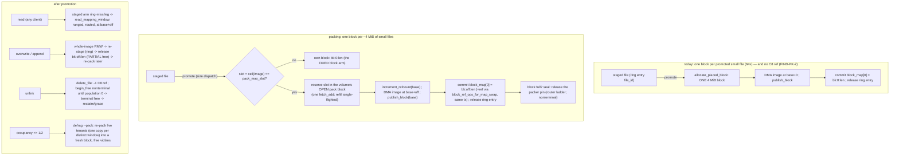

# Design Doc: SqueezeFS Small-File PACKING Layout — Killing the 64× Promotion Space Law

| | |
|---|---|
| **Title** | Small-file packing: many staged-layout files promote INTO one shared striped block via size-carrying sub-block mappings |
| **Author** | justin (repo owner) — drafted by the 2026-09-09 packing design campaign; review-approved at Rev 3.1; implemented by the 2026-09-09/10 PK1–PK7 subagent campaign |
| **Date** | 2026-09-09 |
| **Status** | **Implemented — PK1–PK7 landed on `dev` 2026-09-09 → 10 (PK1 `f4f4396a`, PK2 `0934582b`, PK5 `1310342b`, PK3 `27285f6a`, PK4 `82f78ccd`, PK6 `5848073a`, the bounded report `4fc4aa59`); the acceptance bracket `.benchmarks/2026-09-10-packing-rows-squeeze-test.md` MET every gate and `SQUEEZEFS_SMALL_FILE_PACKING` defaults ON since 2026-09-10.** Design text is the Rev 3.1 review-approved version; the prerequisite FIND-PK-2 landed as `bfcf1e57`. Findings beside the program: FIND-PK-4/-5/-6 (fixed in PK4/PK6) and the P0 overlay-vs-growth-merge race (`d914b673`, its own record). |
| **Repo** | `/home/justin/Source/squeezefs`, `dev` @ `00942fd2` at drafting; round-3 venue `dev` @ `7dd39d55` (= `bfcf1e57` + the evidence note). Every `src/` anchor is as of `2836fa8b` — `routing.rs` line numbers past `:13710` shift by ≈ +10 on `bfcf1e57` and later. |
| **Evidence base (normative)** | [`.benchmarks/2026-09-09-dismount-staged-residue.md`](../.benchmarks/2026-09-09-dismount-staged-residue.md) (the staged-layout population and its cross-client invisibility; §7 steps 1+2 landed as `9ac570ab`), [`.benchmarks/2026-09-09-fsync-promote-staged-ab.md`](../.benchmarks/2026-09-09-fsync-promote-staged-ab.md) (the 64× space law of one-block-per-file promotion — 140,183 promotions filled a 480 GiB set in 8 s), [`.benchmarks/2026-09-09-inline-raise-sweep-local.md`](../.benchmarks/2026-09-09-inline-raise-sweep-local.md) (raising the inline ceiling priced OUT: −34 %/−68 % files/s, 59×/117× metadata bytes per file, a fail-stopped 1 GiB meta volume) |
| **Inviolable contracts** | [`AGENTS.md`](../AGENTS.md) non-negotiables (performance is terminal, derive-never-constant, io_uring-first, zero-copy/latch-free hot paths, no dead code, red-first TDD, the env-knob registry law, lock order 1 → 2 → 3 → 3.5 → 4a/4b never held across a terminal free); [`design-cow-kv-metadata.md`](design-cow-kv-metadata.md) §4.10 (one tx = one checksummed journal entry); [`design-durable-block-refcounts.md`](design-durable-block-refcounts.md) (one C8 record per REFERENCE, the delta rides the layout tx, the free list is the complement of the referenced set); [`design-zero-copy-write-path.md`](design-zero-copy-write-path.md) (1 copy + 1 DMA; P0 layout atomicity — block DMA lands before the meta flip); [`design-full-multi-writer.md`](design-full-multi-writer.md) + [`design-mw-data-alloc-partition.md`](design-mw-data-alloc-partition.md) (a co-writer mints only in its lane `b % W`, SHIPS every metadata mutation and every terminal free) |
| **Related** | [`design-random-small-writes.md`](design-random-small-writes.md) (W1's `is_whole_block_mapping` predicate — the single source every in-place arm refuses decorated mappings through), [`design-volume-lifecycle.md`](design-volume-lifecycle.md) §5.7 (defrag D1, the `move_one` mover, KD-11), [`design-overlay-overwrite.md`](design-overlay-overwrite.md) (the device overlay's whole-block screen), [`design-kvmap-block-map-tree.md`](design-kvmap-block-map-tree.md) (tree-7 STRING records carry decorated shapes verbatim), [`design-read-path.md`](design-read-path.md) (R3 ranged reads — the primitive a packed tenant is read with), [`reference-clients-survey.md`](reference-clients-survey.md) |

**Revision history**

| Rev | Date | Change |
|---|---|---|
| 0 | 2026-09-09 | Initial draft — the design campaign the inline-raise sweep's §4 named as "next: packing". |
| 3.1 | 2026-09-09 | Review round 4 ("approved", 1 minor + 1 nit) folded — a wording pass, no design change. **Minor:** the SPLIT retry is stated under the invariant **"at most ONE `pack_group` frame ever names a given pack block"** — a SPLIT-refused pack is ABANDONED (KNOWN → lane recycle) and EVERY tenant of the frame is re-`prepare`d into fresh packs on the now-current `(owner, home volume)` routes (new reservation, new DMA, one new frame per pack), once; never a re-send of the same block's tenants as two frames (§5.6, KD-4, §10, R1 (f), PK4 files + contract (8)'s seam). **Nit:** the two residual "fsck C3" phrasings (§5.2 struct comment, §6 Internal) → the shared C2/C3 arm. |
| 3 | 2026-09-09 | Review round 3 ("approve with minor revisions", 4 items) folded. **Issue 1 (minor): the publish lane erases the outcome CLASS** (`fail_all` turns transport failures, frame-level refusals, schema/count mismatches and per-call refusals alike into `InvalidOperation(String)`), so `Known/Unknown` and the refusal latch need a **typed publish outcome** — `PublishFailure { class: TransportOutcomeUnknown | FrameRefused(status) | CallRefused(status) | Protocol }` carried on a `SqueezefsError` variant, preserved by `fail_all`/`ship_witnessed`; `Unknown ⇔ TransportOutcomeUnknown`, everything decoded is `Known` (§5.3, §5.6, §6, PK4). The membership grant advertises the SET authority's posture; a partial authority's lever is covered by the frame refusal alone (§5.6 (a)). **Issue 2 (minor): an online `migrate-meta-slot` cutover between the co-writer's partition and the owner's serve can split a `pack_group` frame across home volumes** — the owner verifies the single-home-volume precondition AFTER its slot gate and refuses `PUBLISH_PACK_GROUP_SPLIT` (frame-level, nothing applied, KNOWN); the co-writer re-partitions and retries once, then falls back one-block-per-file (§5.6, PK4 (8)). **Issue 3 (nit):** the "`−ref` only after the layout is applied" premise anchored (`delete_file`'s fence → `release_block_refs` routed to the home volume → `free_blocks`; rung-18 invalidation on the authority) and the invariant it rests on pinned — **`stage` never publishes the tenant's RAM layout entry; `finish` does** (§5.2, §5.6, PK4 seam). **Issue 4 (nit):** the pack-open ledger's fsck arm is the shared **C2/C3** arm (`fsck.rs:4114-4140`), not "C3" (§5.3, PK2). Header metadata, KD, OQ and PR plan made current and internally consistent for sign-off. |
| 2 | 2026-09-09 | Review round 2 (9 items) folded. **Issue 1 (major): the co-writer one-frame law is per HOME META VOLUME and per owner, not per frame** — `set_layout_and_size_group` buckets a frame by `route_ino` and commits each volume's sub-group independently; §5.6 now states the property that actually holds (enqueue atomicity + FIFO on the ino's home volume, `conveyor_core::enqueue_many`; a drain-cap split is harmless), **partitions a co-writer pack by `(owner endpoint, home meta volume)`** (each sub-batch its own block; pack ratio ÷ ≈ meta volumes on a co-writer, stated), and names the `SQUEEZEFS_PUBLISH_CONVEYOR_GROUP` dependency with the never-wrong arm (a pack-group frame flag the owner must honour or REFUSE; a refusal — or a grant that does not advertise the group — makes the co-writer promote one-block-per-file, never a silent per-chain serve). **Issue 2 (major): C12Overlap is `off_a ≠ off_b ∧ intersect`** — same-`off` nesting is the legal prefix-share class (clone + passthrough clip); compaction groups by `off`, copies `max(len)` once. **Issue 3 (major): every TENANT holds its own `InflightAllocGuard` on the base from reserve to commit** (the registry is a per-offset counter); the pack-open ledger excuses the pin alone; ledger insert precedes any guard drop. Issue 4: the passthrough clip is a same-key Delete+Put (population unchanged, never a free of the old mapping). Issue 5: an outcome-UNKNOWN ship error abandons WITHOUT recycle (FIND-PK-4 recorded as the pre-existing per-file shape). Issue 6: `commit_group` = `save_metadata_to_backend_body`'s `stage`/`ship`/`finish` halves (the owner's `prepare_layout_publish`/`finish_layout_publish` mirrored). Issue 7: C12Overrun covers an undecodable decoration. Issue 8: R4s arms. FIND-PK-2's measured red/green repro (`bfcf1e57`, [`.benchmarks/2026-09-09-promotion-durable-ref-hole.md`](../.benchmarks/2026-09-09-promotion-durable-ref-hole.md)) cited in §1.3. |
| 1 | 2026-09-09 | Review round 1 (16 items) folded. **Issue 1 (critical): the block arm of `promote_staged_file` stages NO durable C8 reference today** — recorded as **FIND-PK-2** (§1.3), independently confirmed by the owner and being fixed red-first as a P0 **prerequisite outside this plan**; §1.2/§5.2/§5.4/KD-2 no longer cite the block arm as the template — the spill/clip/inline sites are, and the packed arm stages its `+ref`/`−ref` through `block_ref_ops_for_map_swap` exactly as the FIXED block arm does. **Issue 2 (major): the co-writer law now closes PUBLISH-after-terminal-free structurally** — all tenant publishes of one co-writer pack travel as ONE frame and land as ONE owner conveyor group (§5.6), an authority-side served-publish screen refuses adoption of a released block, and `release_pack_reference` gains the "untracked ⇒ no-op, counted" row. **Issue 3 (major): C12Overlap is "intersect AND not byte-identical"** — identical windows are the legal clone-share class (§5.9); §5.7's clone row corrected (a promoted source's clone SHARES the mapping); **FIND-PK-3** (the staged clone arm takes no RAM reference) recorded. **Issue 4 (major): `publish_block` after the first tenant's DMA** with the block-granular-word argument (§5.2). Issue 5: the release primitive is the ROUTER ladder on the authority, releases obey RES-1. Issue 6: non-numeric `rel_off`/`len` refuse; the overrun bound is `off + ceil(len) ≤ CHUNK`. Issue 7: tie test, ONE grain constant, OQ-2 left honestly open. Issue 8: cost-model wording. Issue 9: PK1 labelled a live lever-independent fix; the lever's scope stated. Issue 10: `committed` is gauge-only. Issue 11: idle-pack bound + gauges + exemption scoping. Issue 12: sustained row + expected-growth gauge. Issue 13: ONE primitive in two halves. Issue 14: stale-incarnation disposition. Issue 15: Alt H (segment-as-pack) + compaction shardability. Issue 16: hygiene. |

---

## Overview

A file whose size falls in `(inline ceiling = 4 KiB, block_size = 4 MiB]` on a volume with staging dirs takes the **staged layout**: its whole payload is one entry in the writing host's local NVMe staging ring, keyed by the layout's `file_id`, and the shared data backend holds nothing for it until it is **promoted**. Promotion now happens at three points (staging-pool pressure, the clean unmount's dismount pass — landed `9ac570ab` — and the default-OFF `SQUEEZEFS_FSYNC_PROMOTE_STAGED` lever), and all three run ONE primitive, `DataRouter::promote_staged_file` ([`src/routing.rs`](../src/routing.rs) `:13565`), whose block arm allocates **one placed 4 MiB striped block per file** and publishes a size-carrying `bk:0:packed_len` mapping. For the small-file population that is the 4 MiB block economy applied to 64 KiB of data — **64× space amplification**, measured: 140,183 promotions consumed 548 GiB against a 480 GiB set in 8 s, and the fstests TEST device's 2,193 resident staged files become ≈ 8.6 GiB of blocks for ≈ 100–140 MiB of data at every clean unmount. The alternative that keeps the payload off the data plane — a raised inline ceiling — was built and priced out the same day: an inline payload rides the metadata plane twice per write, and 16 KiB inline cost −34 % files/s at 59× the metadata bytes per file.

This design makes many small files' payloads **share one striped block**. A promotion no longer allocates a block per file: it reserves an LBA-aligned **slot** in the volume's current **open pack block**, DMAs the file's stored image into that slot, and commits the mapping `bk:rel_off:packed_len` — the **wire form the layout already carries** (`parse_block_mapping`, `:7026-7056`), with `rel_off` finally taking values other than 0. Every other client of the volume set reads the file through the leg that already serves promoted staged files today (the staged arm's ring-miss branch → `read_promoted_staged_block`, `:13917`), which decodes exactly that form and reads exactly the tenant's window — so cross-client visibility comes for free and the metadata plane carries only the ≈ 0.3 KB mapping the staged path already pays. Ownership needs **no new accounting structure**: the durable block-reference ledger (incompat bit 9, [`src/meta_backend/kv/block_refs.rs`](../src/meta_backend/kv/block_refs.rs)) is one record per REFERENCE keyed `(vol_tag, block_idx, owner_ino, block_index)`, so N tenants of one block ARE N records, a tenant's delete removes ONE, and the block frees terminally only when the population reaches 0 — the arithmetic `begin_free → reclaim → finish_free` already runs. What the review found is that the block arm of TODAY's promotion did not stage its record into that ledger at all (**FIND-PK-2**, §1.3 — a P0 fixed as a prerequisite, outside this plan, landed `bfcf1e57`); the packed arm stages its reference the way the spill/clip/inline sites and the fixed block arm do. The remaining pieces are the packer itself (a RAM-only open-block cursor on the promotion path — pinned by a refcount on the authority; on co-writers batch-scoped per `(owner, home meta volume)` with the batch's publishes enqueued atomically on that volume's conveyor), a compaction arm on the defrag D1 axis that re-packs the live tenants of low-occupancy blocks (and, as its first customer, the legacy one-block-per-file population), a fsck class for tenant-range consistency, and the counted squeeze-test rows that decide the default flip. The lever `SQUEEZEFS_SMALL_FILE_PACKING` ships **OFF** ("one block per file", byte-identical to today's promotion) until the acceptance rows land.

---

## 1. Background & Motivation

### 1.1 The measured state (all numbers from the evidence base)

| Fact | Measurement | Source |
|---|---|---|
| The staged-layout population is a steady state, invisible elsewhere | 2,193 resident staged files on the fstests TEST device on EVERY cycle; a same-host same-mount-point remount recovers them byte-exact; **every other client reads them as size-consistent zeros, silently** (`staged_payload_lost_reads 155` on leg B) | residue note §1–§3 |
| Steps (1)+(2) of the residue fix plan LANDED | the dismount wait counts only active blocks; a clean unmount runs `promote_all_staged_files_at_dismount` ([`src/fuse_client.rs`](../src/fuse_client.rs) `:22213`) — gauges `dismount_promoted_{files,bytes,inline_files}`, `dismount_promote_failures` | `9ac570ab`; residue note §7 |
| The promotion primitive's space law | `promote_staged_file` allocates ONE placed block per file (`allocate_placed_block`, `:13645`) and publishes `bk:0:packed_len` (`:13653-13657`): a 64 KiB file costs 4 MiB = **64×**; 140,183 promotions × 4 MiB = 548 GiB against 480 GiB — the set filled ≈ 8 s into the row; 132,439 promotions FAILED `StorageFull`. (The row wrote ≈ 30 GB of user data in total; the 140,183 PROMOTED files carry ≈ 8.6 GiB of it — 140,183 × 64 KiB — which is the arithmetic G-PK3 keys on.) | fsync-promote note §2–§3 |
| The same law governs the landed dismount pass | 2,193 files → ≈ 8.6 GiB of blocks for ≈ 100–140 MiB of data at every clean unmount | fsync-promote note §3 |
| The fsync lever's latency, separately | smallf-fsync −16.7 % files/s, fsync total 338 → 425 µs (+26 %), p99.9 +122 % — a MIX of the promotion itself and the ENOSPC storm the space law caused | fsync-promote note §2 |
| Raising the inline ceiling (candidate iii) is priced out as a default | 16 KiB inline: −34 % files/s, 2.0× fsync µs, **59× journal bytes/file**, 50× node-append bytes/file; 32 KiB: −68 %, 3.3×, 117×/96× and a 1 GiB metadata volume heap-exhausted and FAIL-STOPPED in 20 s; the default flipped back to one page (`00942fd2`) | inline-raise note §2–§4 |
| The staged WRITE path's metadata economy — the baseline packing must not disturb | ≈ 308–312 B journal + ≈ 299–309 B node-append per file regardless of size, measured on the write path with NO promotion; a promoted file pays that plus one more layout commit (+ its 32 B C8 record) at promotion — today and under packing alike | inline-raise note §2 |
| The owner's decision | "leave step (2) as landed, fix it with the raise, and then we move on to packing. Packing is the answer for the 4 KiB–4 MiB population." | campaign brief |

### 1.2 Where the pieces already are (verified against `dev` @ `00942fd2`; re-verified at `2836fa8b`)

**The wire form.** `DataRouter::parse_block_mapping` (`src/routing.rs:7026-7056`) decodes two shapes: the size-carrying `bk:rel_off:packed_len` — `parts[1]` is `rel_off`, `parts[2]` the EXACT stored-image length, `exact == true` — and the bare legacy `bk`. The base key may carry a backend prefix (`vol-…://offset`) and, on a bit-13 volume, an incarnation stamp (`offset@<base36>`, `:1498-1510`): the `@` separator was chosen precisely so the decoration keeps parsing after it and `is_whole_block_mapping` (`:6840-6849`, `!rest.contains(':')`) stays untouched. `clean_block_key_ref` (`:1482-1492`) strips the decoration to the base key every allocator-facing consumer speaks. **Every publish site today emits `rel_off = 0`** (`:13654`, `:16965`, `:19541`, `:19846`, `:20517`); nothing in the grammar or its consumers requires it. One parse defect: a non-numeric `rel_off` silently becomes 0 (`parts[1].parse::<u64>().unwrap_or(0)`, `:7047`) — §5.1 makes it a refusal.

**Who honours `rel_off` today, and how:**

| Consumer | Anchor | `rel_off` handling | Verdict for packing |
|---|---|---|---|
| `read_promoted_staged_block` — the staged arm's ring-miss leg, the read path every promoted staged file takes on every client | `routing.rs:13917-13936` | reads `read_len = ceil4k(sz)` at **`offset + off`** — a true ranged device read of the tenant window; slices `[0, sz)` before the transform; performs NO incarnation check | **correct, provided `off` is LBA-aligned** (the packer guarantees it) — but reads through **`self.nvme_writer`, the DEFAULT device, not the router** (§1.3 FIND-PK-0) |
| `read_nvme_block` — the device-fetch funnel (FIND-RW2-A fix) | `:10193-10217` | reads `ceil4k(off + sz)` from the BLOCK START and slices `[off, off+sz)` — semantically right, but a **prefix read**: a 4 KiB tenant at the block's tail costs a 4 MiB read | must become a ranged read from `off` (PR PK1) |
| `read_nvme_block_old_image` (overlay gap consumers) | `:10236-10267` | same prefix discipline; the overlay never reaches a decorated mapping — `old_image_ranged_eligible` requires `is_whole_block_mapping` (`:10278-10280`) and the overlay's own shape screen refuses decorated mappings (`fuse_client.rs:23438-23442`) | unchanged; belt only |
| fsck **C7 scrub** | [`src/fsck.rs`](../src/fsck.rs) `:5182-5230` | `(base_off + rel, ceil4k(len))` through the ROUTED backend (`br.get_backend(&base_be)`), slices `[0, len)` | **already exactly right — the one funnel to copy** |
| The allocator walk / derived census / C8 ledger / fsck census / movers | [`src/block_allocator.rs`](../src/block_allocator.rs) `:4259-4291` + `:4332-4355`, `routing.rs:3415-3428`, `fsck.rs:2939-3018`, [`src/jobs.rs`](../src/jobs.rs) `:3306-3313` | every one resolves the mapping to its BASE block through `clean_block_key` — decoration-tolerant by design ("the refcount belongs to the BASE block", `:3395`) | N tenants ⇒ N references to one block, already |
| The kvmap tree (bit 16) | `routing.rs:3708-3739` | a decorated key fails the POINT round-trip and rides a STRING record VERBATIM | universal |
| The layout wire | [`src/layout_wire.rs`](../src/layout_wire.rs) `:58-69` | `block_map: HashMap<u32, String>` — a mapping is an opaque string | universal |
| W1 patch / device overlay / in-place overwrite / rewrite supersession / the READ fast paths | `fuse_client.rs:16193`, `:20004`, `:23440`, `:13841`, `:14189` | all screen with `is_whole_block_mapping` (and `file_type == "striped"`) — a decorated mapping is REFUSED to the CoW/handler path (`patch_ineligible_decorated`) | no in-place arm can ever touch a packed block |
| `move_one` (drain / rebalance / D1) | `jobs.rs:2970-3285`, `decoration_suffix` `:3311` | pins the base, copies the WHOLE block verbatim, raises the destination refcount to the referencer count INCLUDING the mint's own reference (`refs.len() − 1` increments on top of the allocation's 1, `:3180`), republishes every referencer as `dst_base + its own suffix` | a packed block moves as a unit, correctly, today — once its word is stable (§5.2, `publish_block`) |

**Ownership.** `BlockAllocator::recover_block` (`:4076-4101`) increments the RAM refcount once per reference it is fed; the map IS keyed by offset alone (`refcounts: scc::HashMap<u64, AtomicU32>`, `:233`), so sharers of disjoint sub-ranges count exactly like clone sharers of a whole block; `layout_owned_blocks` (`:4259-4291`) yields one base index per map entry regardless of decoration. The durable ledger ([`design-durable-block-refcounts.md`](design-durable-block-refcounts.md) §3) keys `(vol_tag ‖ block_idx ‖ owner_ino ‖ block_index)`; `refcount(block)` is the population of the 16-byte prefix; `block_ref_for` (`routing.rs:3415-3428`) resolves decorated keys to the base. `begin_free` (`:3590-3637`) is `refcount_core::release` — terminal only at 0 — and `free_block` (`:3891-3901`) runs `finish_free` only then. The co-writer FREE ladder already answers **`NonTerminal`** for a shipped free whose durable population stays above 0 ([`src/meta_ship/publish.rs`](../src/meta_ship/publish.rs) `:651-666`; [`src/cowriter.rs`](../src/cowriter.rs) `:2062-2075`: "untracked, ledger population > 0 → `NonTerminal` — the release already happened durably on the publish"). **The "N tenants, partial free, terminal at 0" arithmetic exists and is pinned; packing adds tenants to it, not rules.**

**Which publish sites stage into that ledger — and which does not.** The C8 delta rides the layout tx through `block_ref_ops_for_map_swap` (`:7714`) / `block_ref_ops` (`:7753`) and `save_metadata_to_backend_refs`; the plain `save_metadata_to_backend` wrapper passes `block_refs = &[]` (`:7568-7581`). The spill (`:16994`), the staged→striped transition (`:16675`), the clone spill (`:19588`), the truncate clip (`:20597`) and the inline promotion arm's release (`:13822`) all stage their refs. **The BLOCK arm of `promote_staged_file` does not** (`:13693-13712`: `block_map[0] = bk:0:len` then the ref-less `save_metadata_to_backend`) — FIND-PK-2, §1.3. The packed arm's template is therefore the spill/clip shape, never the block arm as it stands.

**The transform.** `CryptoCompressState::encrypt` ([`src/crypto_compress.rs`](../src/crypto_compress.rs) `:688-719`) seals ONE image with its own nonce (`next_nonce_bytes`, `:678-686`: 4-byte process salt + 8-byte counter, stored in the image header) and empty AAD (`:706`); the compression frame (lz4/zstd, store-raw bit 31) is per image too. Every stored image is therefore **self-contained and independently decodable**, and nonce uniqueness is per `process_write`, unaffected by where the image lands. A packed block holding N images holds N independent frames; `packed_len` is each frame's exact length.

**The device write.** `NvmeBlockDev::write_block` ([`src/nvme_dev.rs`](../src/nvme_dev.rs) `:2347`, the unaligned arm `:2420-2457`) pads a non-4 KiB-multiple payload to `aligned_len = ceil4k(len)` (zero-filled) in a pooled aligned buffer and writes exactly `aligned_len` bytes at `offset` — so a tenant DMA at `base + off` touches exactly its own `ceil4k(len)` slot and nothing past it. (That arm counts `nvme_unaligned_write_fallbacks`, whose doc comment reads growth on a passthrough FULL-BLOCK workload as a contract violation; packed promotions of non-4 KiB-multiple images are its legitimate traffic — §10 pre-declares the growth.)

**The incarnation word.** `allocate_block` leaves the offset's seqlock word UNSTABLE; every stored-image writer publishes it after its DMA — the block arm (`routing.rs:13663`), the spill (`:16971`), the clone spill (`:19856`), the clip (`:20527`). `incarnation_core::publish` is an idempotent `fetch_or` ([`src/incarnation_core.rs`](../src/incarnation_core.rs) `:54-56`). An UNSTABLE word makes `pin_block_validated` answer `PinnedUnstable` (the mover defers, `jobs.rs:3003-3009`) and makes the authority's shipped-free executor REFUSE a peer's free of the offset (the finding-24 arm, `cowriter.rs:2015-2026`).

**Promotion drivers.** Three callers, one primitive: the merge worker's `promote_batch` ([`src/cache/nvme.rs`](../src/cache/nvme.rs) `:2213-2251`, batched to 4 MiB / 500 ms by `start_merge_worker`, `:2155-2206`, armed past the 75 % high-water mark), the dismount pass (`fuse_client.rs:22213-22322`, concurrency `bg_admit::striped_block_concurrency`), and the fsync leg (`:20684-20734`). `promote_staged_file` already dispatches on size — `PromotedInto::{Inline, Block}` (`routing.rs:50`) — and publishes under the ino's `INODE_META_LOCKS` guard (3.5) with the ring-entry release INSIDE the commit section (`:13721-13741`, the leg-5 zeros-LOSS law) and displaced keys freed AFTER the guard drops (RES-1, `:13746`).

**What a write to a promoted file does.** The staged arm's whole-image RMW (`:16440-16545`) seeds from the promoted mapping through `read_promoted_staged_block`, re-stages the composed image under the same `file_id` (`stage_write`, generation bump), publishes `block_map: None, layout_dirty` and **releases the superseded durable copy** (`release_superseded_staged`, `:16886-16895` → `free_block(bk:0:len)`). Truncate-shrink of a promoted file (`:20455-20532`) reads the image, allocates a NEW block for the clipped image and frees the old mapping; truncate-up is a size-only change (staged/inline layouts carry an implicit-zero tail, `:17684-17696`).

**What a clone of a promoted file does.** `clone_file`'s staged arm (`:19790-19864`) stages a COPY only when the source's ring entry is resident (`if let Some(mut data) = self.cache.nvme.read_staged(file_id)`, `:19796`). For a PROMOTED source it falls through: `updated_meta = meta.clone()` keeps the source's `block_map = {0: bk:0:len}`, only `file_id` is re-minted (`:19864`), and the dest's save stages a durable `+ref` for that SHARED mapping (`:19995-20007`). Two inos legitimately reference one block with **byte-identical decorated windows** today — under packing, two tenants with identical `(off, len)` (§5.9's legal class). The arm takes no RAM reference for the share (only the striped arm pins, `:19935`) — FIND-PK-3, §1.3.

### 1.3 Findings made while reading (each is a red test; FIND-PK-2 was a PREREQUISITE fix outside this plan — landed)

* **FIND-PK-2 (critical, pre-existing; CONFIRMED, REPRODUCED and FIXED — `bfcf1e57` on `dev`; record [`.benchmarks/2026-09-09-promotion-durable-ref-hole.md`](../.benchmarks/2026-09-09-promotion-durable-ref-hole.md)) — the block arm of `promote_staged_file` staged no durable C8 reference.** At `2836fa8b`, `routing.rs:13693-13712` inserted `block_map[0]` and called the ref-less `save_metadata_to_backend`; the 2026-08-02 wiring commit named "the staged whole-image promotion" among the four map-swap sites and wired the other three. On a bit-9 volume (the DEFAULT format since the rung-10b flip) whose ledger is NON-empty (any ordinary striped file), the next mount seeds ownership from durable records ONLY (`recover_durable_block_refs`, `routing.rs:3852-3867` — an empty ledger declines and walks; a populated one is authoritative), so every block-arm promotion below the cursor landed on the free list through `recover_block`'s gap fill and was re-mintable — and `read_promoted_staged_block` performs no incarnation check, so the old file then served the new owner's bytes. No suite saw it because every promotion suite's population went through that one path (empty ledger ⇒ the walk covered the hole). **Measured repro (contract 3 of [`tests/dismount_staged_residue_tests.rs`](../tests/dismount_staged_residue_tests.rs); laptop, unprivileged file-backed sandbox — a correctness count, scoping venue):** one striped anchor (the ledger's 2 records) + 200 staged files promoted at dismount + remount at a different mount point with `SQUEEZEFS_BLOCK_REFS_VERIFY=1` + four fresh striped writes (8 blocks) → unfixed: `meta_kv_block_refs_recovered` 2, **drift 200, 8 of 200 promoted files clobbered**; fixed: recovered 202, drift 0, 0 clobbered. **The fix** (one commit, no format change, no knob): the block arm's commit stages `block_ref_ops_for_map_swap(ino, current.block_map.as_deref(), updated.block_map.as_deref())` and saves through `save_metadata_to_backend_refs` — the growth site's shape verbatim (`routing.rs` ≈ `:13710` on `bfcf1e57`). Release posture per the record's §6: 1.2.2 ships the pressure-driven half (field mounts are cache-less and unaffected); the fix is 1.2.3-bound with the dismount pass it makes safe. This design's §5.4 crash table is TRUE on `bfcf1e57`; §5.2 step 5 stages the packed arm's reference the same way; PK1 adds the oracle remount on a MIXED population to every packing suite (the record's §5 lesson: a suite whose whole population rides one publish path proves nothing about that path's accounting).
* **FIND-PK-0 — the promoted-staged read funnel bypasses the router.** `read_promoted_staged_block` (`routing.rs:13925-13930`) calls `self.nvme_writer.read_block(offset_u64 + off, …)` — `DataRouter.nvme_writer` is ONE device (`:4735`), the default slot — and `parse_block_offset` drops the backend id (`:3254-3257`), while the promotion it reads back used `allocate_placed_block`, whose placement pick can land on ANY healthy data volume (`:2834-2846`). On a multi-data-volume set a promoted staged file placed off the default volume reads the wrong device's bytes at that offset. Reasoned, not measured (neither evidence row read files back); PR PK1 pins it red-first on a 2-data-volume fixture and routes the funnel through `BackendRouter::read_block_range` (the C7 scrub's discipline). P1 if it reproduces.
* **FIND-PK-1 — the device-fetch funnel prefix-reads decorated mappings.** `read_nvme_block` (`:10203-10212`) reads `ceil4k(off + sz)` from the block start. Harmless while `off == 0`; a 4 MiB read for a 4 KiB tenant once `off` is real. PR PK1 makes it `read_block_range(cleaned, floor(off), window)`.
* **FIND-PK-3 — the staged clone arm shares a promoted source's mapping without a RAM reference.** `clone_file`'s promoted-source fall-through (`:19790-19864`) stages the durable `+ref` (`:19995-20007`) but never `increment_refcount`s the base (only the striped arm pins, `:19935`): the RAM count reads 1 for a block two inos reference, so deleting the source frees the block under the live clone until a remount re-derives — and with FIND-PK-2 unfixed the remount seeds only the clone's record. PR PK1 adds the pin (`pin_block_validated`'s discipline) with a red delete-source-then-read-clone test.
* **FIND-PK-4 (minor, pre-existing; co-writer only) — an outcome-UNKNOWN promotion recycles its block.** `promote_staged_file`'s `Err` arm runs `abandon_unpublished_offset` (`routing.rs:13763-13766`), which on a live laned co-writer RECYCLES the offset into its own lane free list (`block_allocator.rs:3951-3979`, finding 15's arm) unless the custody era is poisoned. The shipped save's error can be a TRANSPORT failure past `PUBLISH_SHIP_ATTEMPTS = 3` (`publish.rs:2396-2423`) with the owner having APPLIED the call: durable layouts then name X while X is back on the co-writer's free list — a double owner at the next mint. The witness window makes the resend exactly-once, so the shape needs three consecutive transport failures against an applying owner — narrow, one block per event today. §5.3 gives the co-writer arm an "outcome unknown" disposition (abandon WITHOUT recycle — the leak-safe next-derivation arm the same function already has for poisoned eras, counted `cowriter_unpublished_abandons`); PK4 lands it for the pack and the per-file promotion alike, with a red test that drops the frame's replies after the owner applied it.
* **Not a finding, stated for the record:** the promoted-staged read leg publishes nothing into the read tiers (device-true per read, `:17662`), and its serve is one pooled window DMA plus one copy-out into a `vec![0u8; want]` (`:17693`). Packing inherits that per-op economy unchanged; the arena-dest form is an owed follow-up only if a counted row prices it (§12).

### 1.4 Why now

The dismount promotion is landed and gated (1.2.3-bound) at the 64× cost — and, until `bfcf1e57`, without its durable reference (FIND-PK-2); the fsync lever is registered and OFF for the space law; the inline raise is a lever, not a default. Every other custody class already has a durability boundary at clean unmount — staged-layout files got one this week and the only things wrong with it are the primitive it promotes INTO and the reference it forgets. The C8 ledger, `move_one`'s shared-block protocol, the size-carrying wire form, the R3 ranged read and the C7 scrub's tenant-window read were each built for other reasons and together leave exactly one mechanism missing: the packer.

---

## 2. Goals & Non-Goals

### Goals (program gates — measured, paired, same-substrate, squeeze-test)

| # | Gate | Number to beat | Method |
|---|---|---|---|
| G-PK1 | **Space proportional to data at the dismount boundary.** The fstests TEST-device population (2,193 staged files, ≈ 100–140 MiB) promotes into `≤ ceil((Σ ceil4k(image)) / 4 MiB) + open-block tails (one per data volume)` blocks — ≈ 30–40 — instead of 2,193; `layout_promoted_packed ≈ 2,193`; `pack_own_block_promotions = 0` for this population; dismount wall ≤ the landed pass's | 2,193 blocks (8.6 GiB) today | the residue probe recipe at scale + `.stats` deltas + `/proc/diskstats` on the data namespaces |
| G-PK2 | **Cross-client byte-exactness with zero new read machinery.** After mount A's clean unmount, mount B (a different mount point — a client A's staging root is invisible to) reads every packed file byte-exact; `staged_payload_lost_reads = 0`; `packed_reads ≈ files`; every read is one ranged device window ≤ `ceil4k(image)` (+ the sub-tenant window law on passthrough) | zeros today (residue note §3 legs A/B) | the residue probe's foreign leg; `read_fill_dma_bytes`/`packed_read_bytes` vs user bytes |
| G-PK3 | **The fsync lever becomes admissible on space.** Re-run the rejected A/B's smallf-fsync row with `SQUEEZEFS_FSYNC_PROMOTE_STAGED=1` AND packing ON: promotions FAIL `StorageFull` **0** times (was 132,439), data blocks allocated ≈ `promoted bytes × (1 + pad)`; the +26 %/op and p99.9 columns are REPORTED, not gated — latency stays a separately priced question | 548 GiB of blocks for the ≈ 8.6 GiB the 140,183 promoted 64 KiB files carry (the row's total user bytes were ≈ 30 GB) | the `2026-09-09-fsync-promote-abba.sh` rig verbatim, both lever states, A-B-B-A |
| G-PK4 | **Zero regression where packing does not engage.** Packing is a promotion-time act: the staged WRITE path, create+fsync files/s with the fsync lever OFF, rr4k-kern, seq read/write and the `SQUEEZEFS_FSTESTS_QUICK` table are unmoved (A-B-B-A within noise); a **≥ 60 s sustained** create+fsync row (lever ON) is flat across its window; write-amplification columns per the standing rule on every write row | the 2026-09-09 A-arm rows | the same rig's A-arm rows, both orders, plus `tests/write_amp_rig.sh` columns |
| G-PK5 | **Compaction reclaims what deletion frees.** Delete half the tenants of a packed population → `frag_d1_pack_occupancy` reads the hole → `squeezefs defrag --pack` → blocks freed ≥ ⌊deleted bytes / 4 MiB⌉ − (volumes), surviving tenants byte-exact, `pack_compaction_bytes_copied ≤ pack_compaction_bytes_reclaimed` (the break-even law) | no compaction exists | the compaction row (§3) |
| G-PK6 | **Tripwires flat on every row.** `meta_kv_block_refs_drift = 0`, `fsck_findings = 0` (C12 included), `block_untracked_free_refusals = 0`, `block_double_frees = 0`, `pack_tenant_overlap_findings = 0`, `packed_mapping_refusals = 0`, `served_publish_free_block_refusals = 0`, `pack_release_untracked_noops = 0` on single-writer rows | — | `.stats` at row end + `squeezefs fsck` after every row |

### Non-Goals

- **Packing the tail block of STRIPED files.** Only staged-layout files (≤ `block_size`, exactly one map entry, `block_map[0]`) pack. A striped file's partial tail block keeps its `bk:0:len` own block; extending the packer to tails is a separate campaign with its own quiescence story (the tail is a live write target; a staged image is a frozen snapshot at promotion).
- **Changing the staged layout, the inline layout, or the inline ceiling.** The staged ring stays the write-absorption vehicle; packing changes what a staged file promotes INTO, nothing about how it is written or read while resident.
- **Sub-block allocation in the allocator** (a second allocation granularity). §8 Alt C records why packing at promotion over the whole-block allocator + the per-reference ledger is the smaller change.
- **Sharing one open pack block across writers.** §5.6 states why (the reservation word and the pin-protection argument both live in exactly one process).
- **A durable open-pack record.** The open block is RAM-only on the authority and batch-scoped per `(owner, home meta volume)` on co-writers; §5.4 argues the crash contract without one.
- **Metadata-engine, journal, conveyor, FUSE-protocol or on-disk FORMAT changes.** No new superblock bit (§7 argues it and PR PK1 pins the wire law). The co-writer batch law reuses D-1b framing and D-1c grouping as they exist, plus one publish-schema flag (a KD-7 same-commit fleet never sees the mismatch; §5.6).
- **The fsync lever's latency.** G-PK3 makes the lever admissible on space; whether it is worth +26 %/op is the owner's separate call on the re-run row.
- **Fixing FIND-PK-2 inside this plan.** It was a P0 on the landed dismount pass and landed as its own commit first (`bfcf1e57`); this plan depends on it (§12).
- **Packing across meta volumes on a co-writer.** A co-writer pack never spans its tenants' home meta volumes (§5.6) — the price is pack ratio, the alternative (an authority-side adoption registration) is recorded as OQ-9, not built.

---

## 3. Measurement & Verification Protocol (program-wide)

1. **Per-PR verification = the cargo gate** (`task check`: clippy `-D warnings` in both feature configurations, fmt, `test --all-features -- --test-threads=1`, doc, bench smoke, the fork/loom/fuzz/docs legs, audit) **plus the targeted fstests each PR names**. Full sweeps only at the program gate (PK7).
2. **Local rows are SCOPING only** (user directive 2026-09-07: heat soak on the dev box skews the second arm of every pair). Every note carrying a laptop row says so. Acceptance = **A-B-B-A on squeeze-test** (32-core Xeon, kernel `6.19.14-sqz`, the 5-node nvme-tcp set — 480 GiB data capacity, 12,288 blocks per data volume; RAM-backed staging dir so the staging term is never the row). Local scoping uses `tests/dev_substrate.sh` with `SQZ_DEVSUB_TRANSPORT=tcp` (the fabric-sensitive rows — writes, bandwidth — MUST run tcp per the two-substrate rule; loop is for latency-shaped decomposition only).
3. **Every row states instrument, substrate, profile.** Instrument: fio (page-aligned; the standing instrument-alignment lesson) for the throughput rows, the residue probe script (sha256-patterned manifest) for the byte-exactness rows; substrate: squeeze-test nvme-tcp set / tcp devsub; profile: `release` for A/B (both arms the same profile), `dist` for release-gate rows. `--all-features` binaries are never a number (dhat replaces jemalloc).
4. **Amplification is measured, never inferred**: `/proc/diskstats` deltas on the DATA namespaces ÷ user bytes, `wareq-sz` vs the block size, and the `block_free_*` reclaim ledger, per row — a write row without its amplification columns is INVALID (`tests/write_amp_rig.sh` is the packaged instrument).
5. **Engagement is exact or the row is invalid**: `layout_promoted_packed + pack_own_block_promotions + layout_promoted_inline + layout_promoted_block` accounts for every promotion the row performed; `packed_reads` accounts for every packed-file read the byte-exactness leg made; `pack_partial_frees + pack_terminal_frees` accounts for every tenant release. **Expected-growth gauges are pre-declared** (§10) so a reader cannot mistake `nvme_unaligned_write_fallbacks` growth on a packed passthrough row for the contract violation its doc comment names.
6. **Sustained-state rows** (the standing rule): every headline claim carries a ≥ 60 s flat row beside its short brackets — R4s below; a decaying burst is a FAILED row.
7. **Crash evidence on every PR that touches block content lifecycles**: kill-9 mid-pack (between a tenant's DMA and its commit; between two tenants' commits) + remount byte-audit + `fsck` (C2/C3/C8/C12 empty) + the C8 oracle (`SQUEEZEFS_BLOCK_REFS_VERIFY=1`) on a NON-empty ledger (one ordinary striped file present — the FIND-PK-2 shape); the multi-run discipline (a fix restarts the count from zero) applies.
8. **The rows** (all A-B-B-A unless byte-exactness-only):

| Row | Shape | Arms | What it decides |
|---|---|---|---|
| R1 dismount | the residue probe scaled to the TEST-device population (2,193 files, sizes drawn from the fstests distribution, sha256 manifest) → `squeezefs umount` | packing OFF / ON | G-PK1 (blocks allocated, dismount wall, engagement), G-PK6 |
| R2 foreign read | remount R1's volumes at a DIFFERENT mount point; verify the manifest; then ALLOCATE past the promoted offsets (a second population) and re-verify (the FIND-PK-2 shape) | ON | G-PK2 (`staged_payload_lost_reads = 0`, `packed_reads`, device bytes per read), G-PK6 |
| R3 fsync lever | the rejected A/B's smallf-fsync (24 jobs × 64 KiB, `fsync_on_close`, 30 s) with `SQUEEZEFS_FSYNC_PROMOTE_STAGED=1` | packing OFF / ON | G-PK3 (StorageFull promotions, blocks vs bytes, the reported latency columns) |
| R4 no-regression | create+fsync (lever OFF), rr4k-kern, wdur-kern, fsync-storm | OFF / ON | G-PK4 (+ amplification columns) |
| **R4s sustained** | create+fsync, **≥ 60 s** (`--time_based --runtime=60`), throughput flat between first and last third | OFF / ON | G-PK4's sustained clause; `pack_open_block_occupancy` / `pack_blocks_sealed_full` cadence read off the window |
| R5 compaction | R1's population → delete every other file → `defrag --report-only` → `defrag --pack` → verify survivors → `fsck` | ON | G-PK5, G-PK6 |
| R6 multi-writer (scoping until the fleet rig is scheduled) | `tests/mw_fleet.sh` 2 co-writers × small-file create+fsync+unmount on the 5-meta-volume set; a delete storm on one co-writer's files from the other; authority reads back | ON | the co-writer arm engages (`pack_blocks_sealed_batch`, `pack_batch_frames`, `pack_batch_volume_splits` ≈ meta volumes per batch), `NonTerminal`/`Freed` verdicts on tenant deletes, `served_publish_free_block_refusals = 0`, `pack_cowriter_group_refusals = 0` (the owner runs the default lever), no lane-foreign mints |

---

## 4. Architecture: where packing cuts



Cost model the gates rest on. A promoted file of stored length `s` costs `ceil4k(s)` bytes of data-plane space instead of `4 MiB` — amplification `ceil4k(s)/s ≤ 1 + 4095/s` (≤ 2× for the smallest 4,097-byte class; exactly 1.0× for a passthrough 64 KiB file, ≈ 1.06× for its transformed image; → 1 as `s` grows) instead of `4 MiB / s` (64× at 64 KiB, 1,024× at 4 KiB). The metadata cost per file is **unchanged from today's promotion** — one layout commit (`file_type`, `file_id`, one mapping string ≈ 40 B) plus one 32-byte C8 record on top of the write path's own commit — i.e. ≈ 2× the staged WRITE path's fixed ≈ 0.3 KB per file that the inline sweep measured (its staged rows had no promotion); packing adds ≤ 8 characters (`:off`) to the mapping. The read cost per packed file is one ranged O_DIRECT window of `ceil4k(s)` bytes (or the sub-tenant 4 KiB-aligned window on passthrough) — the R3 primitive at the tenant's offset.

---

## 5. Proposed Design

### 5.1 The tenant mapping — the existing wire form with `rel_off` live

A packed tenant is the mapping `[be://]offset[@inc]:rel_off:packed_len` — `parse_block_mapping`'s size-carrying form (`routing.rs:7010-7025` documents it) — with two invariants the packer enforces and fsck class C12 (§5.9) verifies. Both are stated in terms of ONE grain constant, **`routing::LBA_GRAIN = 4096`**, lifted from the local `const LBA: u64 = 4096` in `get_block_range_for_index` (`:13121`) and shared by the ranged funnel's asserts (`read_block_range`, `:3280-3289`), the packer, C12Overrun and the derivation tie test — the R3 program's OQ #1 law (the conservative 4 KiB LBA; no per-device 512-native probe until `ranged_read_unaligned_bounces` / `pack_slot_pad_bytes` shows real waste). `ceil(len)` below means `len.div_ceil(LBA_GRAIN) * LBA_GRAIN`.

1. **`rel_off % LBA_GRAIN == 0`** — the slot starts on the LBA every ranged device read already assumes.
2. **`rel_off + ceil(packed_len) ≤ CHUNK_SIZE`** — the tenant's DEVICE WINDOW (not merely its byte length) lies inside the allocator chunk (`block_allocator.rs:135`, 4 MiB — the same bound `ensure_stored_block_image_fits` enforces on every stored image today). A tenant at `CHUNK − 4096` with `len = 4097` would otherwise read into the neighbouring block.

`parse_block_mapping` gains three refusals at the single choke point, each `EIO` exactly as `is_damaged_mapping` is (`:7032-7036`) and counted on `packed_mapping_refusals` (must-stay-0): (a) a non-numeric `rel_off` — today `unwrap_or(0)` (`:7047`) silently serves tenant 0's window as this tenant's bytes; (b) a non-numeric `packed_len` in a 3-part form (today it degrades to a whole-block inexact read); (c) invariant 2 violated. A read must never run past its block into a neighbour's, and a malformed decoration must never resolve to a DIFFERENT tenant's bytes. `is_whole_block_mapping` is untouched: a tenant is decorated, so every in-place arm refuses it.

### 5.2 The open pack block and the packer

**State (RAM-only, per data volume, held by the `DataRouter`):**

```rust
/// One volume's OPEN pack block — the slot cursor N concurrent promotions
/// append into. RAM-only: a crash leaves the committed tenants (each with
/// its durable layout + C8 record) and an unreferenced tail (§5.4).
pub(crate) struct OpenPack {
    be_id: String,
    allocator: Arc<BlockAllocator>,
    device: Arc<NvmeBlockDev>,
    base: u64,                 // device offset of the block
    /// Next free slot offset within the block; reservation is ONE fetch_add.
    next_slot: AtomicU64,
    /// GAUGE ONLY (`pack_blocks_abandoned`, `pack_open_block_occupancy`): tenants
    /// whose layout commit succeeded. The seal's terminal-vs-nonterminal outcome
    /// is what the REFCOUNT says (a tenant mid-DMA holds a reference with
    /// committed == 0), never this word.
    committed: AtomicU32,
    opened_at: Instant,        // `pack_open_block_age_ms`
    sealed: AtomicBool,
}
// No pack-level inflight guard: EVERY TENANT holds its own `InflightAllocGuard`
// on `base` from reserve to commit (the registry is a per-offset COUNTER,
// `block_allocator.rs:1625-1635`, so N holders compose) — exactly today's
// per-promotion allocate→commit guard shape — and the pack's +1 PIN is declared
// to fsck's shared C2/C3 arm through the pack-open ledger (§5.3), entered at OPEN.
```

The router holds one `ArcSwap<Option<Arc<OpenPack>>>` per registered backend id (`scc::HashMap<String, …>`, latch-free). **Reservation** is `next_slot.fetch_add(slot_len)`: if `prev + slot_len ≤ CHUNK_SIZE` the caller owns `[prev, prev + slot_len)`; otherwise the caller marks the pack `sealed` (a CAS; the first sealer runs the seal, §5.3) and enters the **refill**, which is single-flighted per backend id (the R1a single-flight core — `inflight_block_reads`' shape — reused: one caller runs `allocate_placed_block` and installs the new pack; concurrent callers await its outcome and retry the reservation). No lock is held across the allocation's park (an ENOSPC park is bounded by `free_grace::pressure_park_wall_ms`, the finding-29 law; a `StorageFull` propagates to every waiter and the promotion answers as it does today — the entry stays resident, counted).

**The pin.** `allocate_placed_block` hands the packer the block at refcount 1 (`allocate_block` mints with a fresh count). That reference is the **packer's pin** for the open lifetime — `move_one`'s discipline verbatim (`jobs.rs:2991-3037`: "the pin holds refcount = census-refs + 1"). **Every tenant, the first included, takes its own reference with `increment_refcount(base)`** (`block_allocator.rs:2084-2108`, acquire-from-nonzero — a count that already hit 0 refuses, and a refusal means the pack is gone: seal and retry on a fresh one). So while the pack is open, `refcount = committed tenants + tenants mid-flight + 1`, and on the AUTHORITY — whose RAM refcount is the truth the free ladder reads — no sequence of tenant deletes can free the block under a DMA the packer has not finished. (On a co-writer the pin is a private word and buys no such protection; §5.6 closes that posture differently.)

**ONE primitive, two halves — and the save body split the same way.** `promote_staged_file` is restructured into `prepare` and `commit` halves that every driver composes — the per-file call (the merge worker, the fsync leg, the authority's dismount pass) is `prepare → commit`, the degenerate batch of one; the co-writer's batch driver (§5.6) is `prepare × N → commit_group → seal`. The halves law reaches the SAVE too: `commit_group` is not a re-implementation of the shipped save but `save_metadata_to_backend_body` (`routing.rs:9068-9640` — the fencing/range-token check, the reclaim-in-flight NotFound refusal, kvmap/indirect sizing, the finding-38 ref chunking, the shipped-full-claims rule, the never-lossy `note_block_ref_ops` refill on failure) factored into **`stage`** (everything up to and excluding the ship — returns the prepared `PublishCall::SetLayoutAndSize` + its post-actions), **`ship`** (`ship_group` over N staged calls), and **`finish`** (apply one reply's post-actions: RAM publish, ring release, the refill-on-failure) — the owner's own `prepare_layout_publish` / `finish_layout_publish` shape (`publish.rs:5928`, `:6042`) mirrored on the client; the per-file `commit` is `stage → ship(1) → finish`. **One invariant the split must keep, stated because §5.6's FIFO argument rests on it: `stage` NEVER publishes the tenant's RAM layout entry (`publish_layout_cache_entry`) — `finish` does, after the reply.** `save_metadata_to_backend_body` publishes no RAM entry before its ship today (verified `:9068-9700`); if a future `stage` published early, a same-co-writer delete could read the tenant's mapping, release its reference and reach the owner on a SECOND in-flight frame (`ship_depth > 1`) ahead of the group. A PK4 seam pins it. There is still exactly one promotion primitive and one save body; the batch is their composition, not a second entry point.

**`prepare` (per tenant):**

1. Read the ring image (`nvme.read_staged`), the W2 rider fence and the size read exactly as today (`:13585-13611`). Transform (`process_write_async`) → `image` of length `s`; `slot = ceil(s)`.
2. **Dispatch**: `s` fits the inline ceiling → the inline arm (unchanged); `slot > pack_max_slot_bytes()` (§5.5) → the block arm (the FIXED block arm, `bk:0:s`, its `+ref` staged — FIND-PK-2); else the packed arm.
3. `reserve(be_id, slot) → (pack, off)`; **`let _tenant_inflight = pack.allocator.inflight_register(pack.base)`** (held until this tenant's commit is durable and visible, or its failure path releases — the §5.6 registry contract every stored-image writer honours today; the per-offset counter admits N concurrent holders, so the block stays C2/C3-exempt while ANY tenant is between reserve and commit); `pack.allocator.increment_refcount(pack.base)` — refused ⇒ seal, retry step 3 (bounded; on exhaustion the promotion answers `Ok(None)` and the entry stays resident, the never-wrong degrade).
4. `pack.device.write_block(pack.base + off, image)` — ONE DMA of exactly `slot` bytes (the unaligned arm's zero-fill covers `[s, slot)`); then **`pack.allocator.publish_block(pack.base)`** (idempotent — `incarnation_core::publish` is a `fetch_or`, `incarnation_core.rs:54`; the first tenant's publish stabilizes the word, later ones are no-ops); `note_fsync_touched_device` (W-5) as today. A DMA error releases the tenant's reference (`release_pack_reference`, §5.3, OUTSIDE any 3.5 guard) and returns the error — nothing published, nothing lost.

**Why the block-granular word may be stable while later tenants' DMAs are in flight.** The seqlock word protects VALIDATED TIER FILLS of a KEY against content changing under the key (`fill_incarnation` / `fill_incarnation_still`, the `cache_read_block_validated` discipline). Every consumer of a packed tenant reads by its decorated key through the promoted-staged leg, which is device-true (publishes nothing into the tiers, `:17662`) and validates the BINDING (`still_bound` against the current identity), not the word; a later tenant's DMA writes a slot no committed mapping names, so no serve of any committed tenant can observe bytes changing under its key. The word therefore only has to say "this block's committed content is stable for its committed keys" — which is true from the first DMA onward. Leaving it unstable, by contrast, has three concrete costs the review named: `pin_block_validated` answers `PinnedUnstable` and the D1/drain movers DEFER every sealed pack block forever (`jobs.rs:3003-3009`); the authority's shipped-free executor REFUSES a peer's legitimate tenant free on an authority pack block (the finding-24 arm, `cowriter.rs:2015-2026`), leaking the block until remount; and any striped-path fill of the block refuses to publish.

**`commit` (per tenant, under the ino's 3.5 guard):**

5. `meta_lock_acquire(ino)` with the block arm's re-checks (`file_type == "staged"`, same `file_id`, same stage generation): `updated.block_map[0] = format!("{}:{off}:{s}", persist_block_key(be_id, base))`, `size = max(size, raw_len)`, `layout_dirty = false`; **the C8 delta is staged into the SAME tx** — `let refs = self.block_ref_ops_for_map_swap(ino, current.block_map.as_deref(), updated.block_map.as_deref())` (the `+ref` for the tenant and the `−ref` for any displaced older durable copy) and `save_metadata_to_backend_refs(ino, &updated, fencing_token, &refs)` — the spill/clip/inline-arm template (`:16994`, `:20597`, `:13822`) and what the FIXED block arm does; **never the ref-less `save_metadata_to_backend` wrapper** (`:7568-7581`) the unfixed block arm calls. A displaced older durable copy is purged under the guard and freed after it (RES-1). The ring-entry release stays INSIDE the commit section (leg 5). `pack.committed += 1`; the tenant's own inflight guard drops only after the commit is durable and visible (deregister-after-publish-visible). The pack-open ledger entry was made at OPEN — before the pin's block ever had a moment uncovered — so at no instant is the pack's +1 pin declared to nobody.
6. A refused commit (identity moved) releases the tenant's reference — **after the guard drops** (the release can be TERMINAL when the pack has sealed and every sibling was deleted meanwhile; a terminal free's reclaim enqueue parks at the reclaim cap and must never run under 3.5 — RES-1, the collect-then-free pattern `:13746` already uses). The slot's bytes are dead space until compaction; counted `pack_slots_abandoned`.

**Ordering law (P0 layout atomicity, restated for tenants):** step 4 completes before step 5 begins, per tenant; the tenant's durable existence IS its layout commit, which carries its C8 reference in the same checksummed journal entry (§4.10 whole-tx atomicity). Two tenants' commits are two ordinary transactions on their own inos — on the authority no cross-ino tx is needed because no tenant's correctness depends on another's; on a co-writer a pack's tenants' commits travel as one atomically-enqueued group on their one home meta volume for the reason §5.6 gives.

**Hot-path law.** The packer runs on the merge worker (`sqz-meta`), the dismount pass, or the fsync leg — never the WRITE/READ hot path. Its only shared words are the `fetch_add` cursor, the allocator's refcount and the incarnation word (all latch-free already); the only lock is the per-ino 3.5 guard the promotion holds today, never held across a free (RES-1). The DMA source is the transformed `Bytes` the promotion already produces — no copy is added (the pre-existing `read_staged` Vec copy on the promotion path is inherited, not widened).

### 5.3 Sealing, the pin's release, and what an open pack costs

A pack seals on **(a) full** — the reservation that overflows; **(b) dismount** — after the dismount pass's last promotion returns, every open pack seals before "Dismount clean"; **(c) co-writer batch end** (§5.6). It does NOT seal on idle in v1, and that is a stated cost, not an oversight: an open pack that stops receiving tenants holds (i) NO inflight registration of its own — the registry entries are the TENANTS' (§5.2 step 3), one per tenant between reserve and commit, so under live promotion the block is inflight-exempt from C2/C3 the way every allocate→commit window is, and once the last mid-flight tenant commits the registry no longer names it; (ii) one entry in the **pack-open ledger** — a `parking_lot::Mutex<Vec<String>>` of base keys, ENTERED AT OPEN (before any guard could drop) and consulted by fsck's shared **C2/C3 arm** exactly as the mover pre-publish ledger is (`fsck.rs:4114-4140` — the match arm is `C2Leaked | C2Lost | C3Refcount`, and the C2 half matters: an open pack whose every tenant so far was refused at commit — pin only, no committed referencer, no mid-flight registration — is a `C2Leaked` candidate, not a C3 one; an offset-granular exemption: the ledger excuses the block while a pin is live, and because the tenants' transient references are covered by the registry, the pin is the ONLY discrepancy the ledger ever has to excuse — `fsck_pack_ledger_exempted` counts each excuse); and (iii) the D1/compaction movers' deferral (§5.11). All three are bounded by **≤ one block per data volume** for the life of the mount; the block's committed tenants are counted by C8 and the census like any other, and C6 sees an allocated, referenced block. Gauges `pack_open_block_age_ms` and `pack_open_block_occupancy` (per volume, opt-in census key `pack_open_blocks_census`) make the idle tail visible. An idle seal keyed to the merge worker's existing 500 ms / high-water cadence was considered and NOT adopted for v1: it would turn every quiet mount's open pack into a sealed low-occupancy block per idle interval — compaction churn — and would defeat the fsync lever's cross-fsync packing on any mount whose fsync cadence exceeds it (G-PK3's own row). If R4s or a field row prices the idle tail, the seal keys to a DERIVED cadence (that one), never a new constant.

**`BlockAllocator::release_pack_reference(offset, outcome) -> PackRelease`** is the one new allocator primitive — the pin's release, a failed tenant's release and a failed DMA's release share it, it runs OUTSIDE every 3.5 guard (RES-1), and it dispatches on posture, on the entry's state, and on whether the pack's publishes have a KNOWN outcome. **The outcome class must be TYPED, because the publish lane erases it today:** `fail_all` (`publish.rs:1810-1816`) converts a transport failure, a frame-level refusal (`reply.status != PUBLISH_OK`, `:1856-1867`), a schema mismatch and an outcome-count mismatch alike into `SqueezefsError::InvalidOperation(String)`, a per-call `Refused` is the same variant (`:1927-1932`), and `ship_witnessed` returns one `Err(e)` for ladder exhaustion and for a definite refusal (`:2406-2423`) — while `exchange` KNOWS the class internally ("a one-attempt frame refuses (the true sent-then-lost ambiguity)", `:1938-1946`). PK4 therefore adds a typed publish outcome — `PublishFailure { class: TransportOutcomeUnknown | FrameRefused(status) | CallRefused(status) | Protocol }`, carried on a `SqueezefsError` variant and preserved by `fail_all` and `ship_witnessed` — and the arms below key on it: **`Unknown ⇔ TransportOutcomeUnknown`** (the ladder exhausted `PUBLISH_SHIP_ATTEMPTS` against an owner that MAY have applied the frame); every decoded refusal (`FrameRefused`, `CallRefused`), every `Protocol` error and every `Done(Err)` is **`Known`** (nothing was applied, or the owner said exactly what was). No arm ever parses a message string.

| Posture | Nonterminal (references remain) | Terminal (no other reference), outcome KNOWN | Terminal, outcome **UNKNOWN** | **Untracked** (no refcount entry) |
|---|---|---|---|---|
| authority / solo (writer) | **the ROUTER ladder**, `BackendRouter::free_block(&persist_block_key(be_id, base))` (`routing.rs:4411-4495`) — `begin_free` decrements, nothing else runs | the SAME router ladder — the terminal free with read-tier purge, incarnation retire, reclaim-queue enqueue (`block_reclaim.rs`), discard-elision debt, grace ring and S7 quarantine composed exactly like every other terminal free; the never-published bytes are hygiene, never correctness. Chosen over `BlockAllocator::free_block` (`:3891-3901`, an INLINE `finish_free` with no reclaim/purge/debt) so a pack block's end of life is byte-identical to a striped block's | unreachable — an authority's commit is local; its outcome is always known | unreachable on the authority (the pin's own reference keeps the entry alive until this release) — counted `pack_release_untracked_noops` and logged at ERROR if ever observed |
| co-writer | a PRIVATE `refcount_core::release` on the mount's own view (the same word `release_shipped_free_tracking` moves, `block_allocator.rs:2815`) — nothing ships, because nothing durable ever named the pin | `abandon_unpublished_offset(base)` (`:3947`) — the never-published arm (finding 15's lane recycle: nothing durable named it, so the offset returns to this mount's own lane free list) | **abandon WITHOUT recycle** — the leak-safe "next derivation returns it" arm `abandon_unpublished_offset` already takes for a poisoned era (`:3981-3990`, `cowriter_unpublished_abandons`): durable layouts MAY name X on the owner, so X must not re-enter this mount's lane free list; the private entry is dropped, the word left unstable, and the offset stays out of every local allocation path until a harvest or remount re-derives it from the ledger. FIND-PK-4's closure (§1.3), applied to the pack and the per-file promotion alike | **no-op, counted** (`pack_release_untracked_noops`): the entry was removed by `retire_shipped_free_tracking` (`:2788-2803`) when the LAST committed tenant's shipped free came back `Freed` — the authority owns the offset now, and taking the terminal arm here would hand X to this mount's lane free list a SECOND time (the double-handout the recycle arm's own refusal counts, `:3959-3978`). Expected nonzero only on co-writers whose tenants are deleted between the group's landing and the seal |
| reader | unreachable — a reader promotes nothing |

The seal counts `pack_blocks_sealed_{full,dismount,batch}`; a seal that abandoned counts `pack_blocks_abandoned` (≈ 0: every tenant of a pack failed its commit).

### 5.4 Crash contract (why no durable open-pack record)

A crash at any point leaves the volume in one of exactly two durable states per pack block — the §6 argument of [`design-durable-block-refcounts.md`](design-durable-block-refcounts.md) applied to N owners. **The table presupposes FIND-PK-2's fix: a promotion that stages no reference recovers as FREE, which is precisely the defect the block arm has today.**

| Crash point | Durable state | Recovery |
|---|---|---|
| after ≥ 1 tenant committed | N ≥ 1 layout records name `base:off_i:len_i`; N C8 records under the `(vol_tag, block_idx)` prefix (each staged in its tenant's tx, §5.2 step 5) | the block recovers ALLOCATED with `refcount = N` (`seed_from_durable_refs` / the derived walk both count one per reference); the packer's pin was RAM and is gone; the uncommitted tail `[next_slot_at_crash, CHUNK)` and any abandoned slots are dead bytes INSIDE a live block — internal fragmentation the D1 pack axis measures and compaction reclaims (§5.8). The committed tenants read byte-exact from every client. |
| before any tenant committed | no record names the block | the block recovers FREE (the free list is the complement of the referenced set below the cursor); the DMA'd images are garbage in a free block, overwritten by its next owner before that owner publishes. No leak, no double owner. |

Nothing intermediate exists to record. A durable "open pack" record would (i) need the C8 oracle to learn a reference class the layout walk cannot see (a pin record is durable-only ⇒ `N durable vs N−1 derived` = C8 drift on every open block), (ii) create a crash-leak class (a dead mount's pin pins its block forever until a repair verb releases it), and (iii) buy nothing the RAM pin does not already buy on the authority — and the co-writer hazards it would close are closed structurally by §5.6's per-`(owner, home volume)` group law. Non-goal, argued.

**Torn DMA.** A crash mid-slot-DMA leaves a torn image in a slot no layout names — invisible. A tenant whose layout committed has, by ordering, a complete image (the DMA completed before the commit began). Transformed volumes additionally fail the AEAD tag / frame decode on any torn image; passthrough volumes have no checksum (the existing `scrub_readability_only` gap, stated not faked).

### 5.5 The own-block threshold — derived, never a constant

A tenant of slot `s` that takes its OWN block wastes `CHUNK − s` bytes permanently (a staged file never grows in place: every rewrite re-stages the whole image and re-promotes). Packing it instead costs, in the conservative model, **one compaction copy of `s` bytes over its lifetime** (the block it shares loses co-tenants until compaction re-packs it) plus ≤ `LBA_GRAIN − 1` of pad. Packing wins iff the space saved covers the copy: `CHUNK − s ≥ s ⇔ s ≤ CHUNK / 2`.

```rust
/// The largest slot the packer shares a block for — DERIVED from the block
/// economy: an own block wastes `CHUNK − slot` forever, a packed tenant costs
/// one compaction copy of `slot`; the saving covers the copy iff
/// `slot ≤ CHUNK/2` (also: the largest class for which a second tenant of the
/// same class can share, i.e. for which packing can halve anything).
/// Drift-is-red tie: tests/derivation_sweep_tests.rs (the inline-ceiling
/// precedent at :455).
pub fn pack_max_slot_bytes() -> u64 {
    match opt_int_knob::<u64>("SQUEEZEFS_PACK_MAX_SLOT_BYTES") {
        Some(explicit) => explicit,          // registered; range LBA_GRAIN..=CHUNK_SIZE
        None => crate::block_allocator::CHUNK_SIZE / 2,
    }
}
```

The same break-even is the compaction trigger (§5.8): a block is a compaction victim iff its live bytes are ≤ half its capacity — copying `live` reclaims `CHUNK − live ≥ live`. One law, two faces, stated on the line, tied in [`tests/derivation_sweep_tests.rs`](../tests/derivation_sweep_tests.rs) (`pack_max_slot_default_is_half_the_chunk_and_the_grain_is_the_lba_law`). `SQUEEZEFS_PACK_MAX_SLOT_BYTES=4096` packs only one-LBA tenants (the measurement floor); `= CHUNK_SIZE` packs everything (the ceiling); neither is an operational posture.

### 5.6 Multi-writer

A co-writer promotes exactly as the authority does, with three posture facts already in force: `allocate_placed_block` mints ONLY in its lane (`b % W`, [`design-mw-data-alloc-partition.md`](design-mw-data-alloc-partition.md) §2; the lane grant is the admission), `save_metadata_to_backend_refs` SHIPS the tenant's layout as `PublishCall::SetLayoutAndSize` and the authority's served compose stages the C8 `+ref` on ITS side and publishes the block's incarnation word (`witness_served_bindings`, `routing.rs:4349-4367`), and a tenant's release ships as `PublishCall::FreeBlocks`, which the authority answers **`NonTerminal`** while the durable population stays above 0 and **`Freed`** at 0 (`cowriter.rs:2062-2095` — verified; the co-writer's `ship_displaced_frees` handles `NonTerminal` by releasing its private reference only and `Freed` by retiring the entry, `:1889-1897`).

**What differs: the pin is not authoritative on a co-writer, and the authority frees from the DURABLE population.** Two hazards follow, and the review found that Rev 0 closed only the first:

* **DMA-after-terminal-free**: publish(A) lands (population 1) → any client deletes A (population 0 → `Freed` → X enters the authority's lane-`X % W` free supply or the grace ring) → the co-writer, still holding X open, DMAs tenant B into X. Closed by ordering every DMA before every publish.
* **PUBLISH-after-terminal-free**: publish(A) lands → A is deleted → X is `Freed` → **publish(B: `X:off_B:len_B`) lands** — the served compose stages a `+ref` on a block the authority has released, `witness_served_bindings` republishes its word, and X is on the free list (or, one harvest later, in the co-writer's OWN lane free list, `take_free_for_lane_grant`, `block_allocator.rs:2169`) → the next mint DMAs over B's slot. No DMA ordering closes this: the offending DMA belongs to a NEW lifetime. And the window is real: D-1b frames are "whatever is queued when a slot frees" (`publish.rs:1728-1800`), cut at the call cap, the byte budget and the resend-class boundary — a 4 MiB / 500 ms merge-worker batch of individually-issued commits can span several frames.

**The closure is structural, in three parts:**

1. **ONE atomically-enqueued conveyor group per co-writer pack, on the pack's ONE home meta volume, under ONE owner.** What actually protects two tenants' publishes from an interleaving delete is NOT "one pass" — it is **enqueue atomicity + FIFO on the ino's home volume**: the owner's `set_layout_and_size_group` stages every member under one `lock_many` and hands them to `commit_tx_group`, whose `ConveyorCore::enqueue_many` pushes the whole group under ONE queue lock so no drain ever sees a partial group ([`src/meta_backend/kv/conveyor_core.rs`](../src/meta_backend/kv/conveyor_core.rs) `:137-150`), the drain is FIFO (`:169-186`), and a `−ref` for tenant A can only be STAGED after A's layout has been APPLIED — so it is enqueued after the WHOLE group and applied after every sibling regardless of how many drain passes the group spans (a byte-cap split — `commit_tx_group`'s "the drain caps still govern … progress-first", and the frame cap derives from the CO-WRITER's cpus while the drain cap derives from the OWNER's — is therefore harmless). **The premise, anchored:** `delete_file` derives its releases from `fetch_metadata`'s layout (`routing.rs:20913-20927`) — a view that shows `X:off_A` only after A's tx is applied (on the authority, rung 18's `note_served_layout_commit` invalidation keeps the RAM view from exposing a served layout before its commit; on peers, lagged snapshots or the frame reply) — commits them in their own tx through `release_block_refs` → `commit_block_refs`, routed BY INO to the home volume's conveyor (`:21034-21048`, `:7700-7702`), and only then frees (`:21074-21077`); and on the publishing co-writer itself a delete of a tenant first takes the ino's 3.5 fence (`:20899`), which the group's still-held guards block until the reply is `finish`ed. All of it rests on §5.2's invariant that **`stage` never publishes the tenant's RAM layout entry** — the one line a future edit could break. That property holds **per home meta volume**: `RoutedMetaBackend::set_layout_and_size_group` buckets a frame's items by `route_ino(item.ino)` and runs "every volume's sub-group … independently and concurrently" — one `lock_many` + one `commit_tx_group` PER VOLUME ([`src/meta_backend/mod.rs`](../src/meta_backend/mod.rs) `:3539-3621`) — and `pick_mint_volume` (`:1504-1540`) round-robins regular-file creates across the healthy meta volumes, so a co-writer's batch of small files spans every meta volume of the set by design (squeeze-test has 5). Between two volumes' sub-groups the publish-after-terminal-free window reopens (V1 applies A → an unlink of A stages its `−ref` on V1 → `FreeBlocks(X)` → the population summed across volumes reads 0 → `Freed` → V2 applies B onto a free-listed X); on a K-owner S10 fleet the tenants' home volumes are different authorities, different lanes (`self.lane(endpoint)`, `publish.rs:1704`) and different frames — an RTT-wide window. **So the batch driver PARTITIONS a co-writer pack by `(owner endpoint, home meta volume)`**: `prepare × N` groups tenants by `route_ino(ino).0` and by the owner that volume routes to, and each sub-batch is its own pack — its own block, its own group. The cost is stated: a co-writer's pack ratio on a multi-volume set divides by ≈ the number of meta volumes (a 24-file merge-worker batch on the 5-volume set fills ≈ 5 blocks with ≈ 5 tenants each instead of 1 block with 24; the dismount pass's thousands of files fill every volume's blocks anyway), and the AUTHORITY's cross-batch pack is untouched (its pin is authoritative; its tenants may span volumes). `pack_batch_volume_splits` is the ledger. Then, per sub-batch, **`commit_group`**: the tenants' 3.5 guards are taken in canonical order — ascending `inode_meta_stripe`, deduped (two tenants may share a stripe of the 4096-way table; one guard covers both; the discipline `dlm::lock_many` already applies to 4a, [`src/meta_backend/dlm.rs`](../src/meta_backend/dlm.rs) `:244`, documented for 3.5 in [`src/stripe_locks.rs`](../src/stripe_locks.rs) as the ONE multi-holder convention) — every tenant is re-checked and its `SetLayoutAndSize` staged under them by the save body's `stage` half (§5.2), and the N calls are shipped through a new **`PublishClient::ship_group(endpoint, calls)`**: one lane-queue push of the whole group (the `enqueue_many` shape mirrored on the client — no drain ever sees a partial group), the lane drain treating a group as indivisible (a group that would not fit the current frame's remaining call cap / byte budget heads the NEXT frame; a group larger than a frame is refused at submission, which is how the batch is SIZED — below), **and the frame flagged `pack_group`** (publish schema +1). The owner serves a `pack_group` frame's calls as ONE `set_layout_and_size_group` on their one home volume — **after verifying that precondition itself**: the co-writer partitioned by `route_ino(ino).0` at `prepare` time, but the owner re-derives routes AFTER its slot gate (`mod.rs:3537-3562`; the gate's own law: "parks can span a flip, so callers must re-derive routes taken before the call", `:1896-1898`), and `migrate-meta-slot` is an ONLINE verb (VL5b) — a cutover landing between the co-writer's partition and the owner's serve moves a tenant's home volume and would bucket the frame into two sub-groups committed independently, reopening the window for that one frame. So the owner, having re-derived, **refuses a `pack_group` frame whose members route to more than one home volume** (`PUBLISH_PACK_GROUP_SPLIT` — a frame-level KNOWN refusal like `PUBLISH_PACK_GROUP_UNAVAILABLE`: nothing applied; one check, counted `served_pack_group_splits`). **What the co-writer does with a SPLIT-refused pack is governed by one invariant: at most ONE `pack_group` frame ever names a given pack block.** Every tenant of the refused frame has already been DMA'd into ONE block X (phase 1 completed before phase 2), and "re-partition and retry" on the now-current routes yields TWO sub-batches — re-shipping THOSE as two frames whose calls still name `X:off_i:len_i` would be two groups on two home volumes naming one block, i.e. the window itself. So the retry is NOT a re-send: the co-writer **abandons X outright** (`release_pack_reference`, outcome KNOWN — a `FrameRefused(PUBLISH_PACK_GROUP_SPLIT)`, nothing applied → the lane recycle; `pack_blocks_abandoned`) and **re-runs the batch driver from `prepare` for EVERY tenant of the refused frame** — new partition on the now-current `(owner, home volume)` routes, new reservation in a fresh pack per partition, new DMA, one new `pack_group` frame per new pack — ONCE; a second SPLIT (a migration still in flight) falls back one-block-per-file for that batch. Abandon-everything was chosen over "keep X for the sub-batch whose routes still agree and move only the others" because the latter needs X named by two frames (one refused, one served) and a seam that distinguishes refused-from-served — a weaker invariant, harder to pin, for an operator-triggered event whose whole cost is one batch of small files re-DMA'd. The same invariant covers the UNAVAILABLE arm (X abandoned, tenants re-promoted one-block-per-file) and the batch-cap split (successive packs are successive blocks): **a pack block is named by the one frame that seals it, or by none.** Rare and operator-triggered, but the closure is called structural and this is what makes it so. Under the still-held guards each reply is `finish`ed (RAM publish + ring release per tenant — the leg-5 law), the guards drop, displaced keys free (RES-1), and the pack **seals** (§5.3) — after which no publish naming X is ever issued again. A delete after the group is `NonTerminal` while siblings live and `Freed` at 0, on a block the co-writer neither DMAs into nor publishes again. Lock-hold note: the per-file promotion already holds one 3.5 guard across its shipped round trip (`:13677-13741`); the group holds ≤ frame-cap guards across one round trip — the same shape × N, bounded by the wire.

   **The `SQUEEZEFS_PUBLISH_CONVEYOR_GROUP` dependency, stated.** The owner's D-1c grouping is a lever (default on; `0` = the D-1b per-chain dispatch, `publish.rs:4187-4203`, each call's tx enqueued at its own instant — under which the interleaving is possible even on one volume). The co-writer's safety therefore depends on the OWNER's posture, and the design makes that dependency explicit and never-wrong: (a) the membership grant ADVERTISES whether the owner serves pack groups (`Grant::pack_group_available`, the `Grant::checkpoint_ceiling_ms` precedent for "a decision in force, carried on the lease"; `CLUSTER_WIRE_SCHEMA` +1) — a co-writer whose grant does not advertise it runs the FIXED block arm for every promotion (one block per file, byte-identical to today) and counts `pack_cowriter_group_unavailable`. The grant is the SET authority's (the slot-0 owner mints every membership lease, D20), so on a K-owner S10 fleet it advertises the set authority's posture only; a PARTIAL authority's lever is covered by (b) alone — stated so nobody reads (a) as fleet-wide; (b) as the belt, an owner receiving a `pack_group` frame while its lever is `0` (or an owner too old to know the flag) **REFUSES the frame loud** (`PUBLISH_PACK_GROUP_UNAVAILABLE`), never serves it per-chain; the co-writer then abandons the never-published pack (`release_pack_reference`, outcome KNOWN — a `FrameRefused(PUBLISH_PACK_GROUP_UNAVAILABLE)` on the typed outcome, §5.3 → the lane recycle), re-promotes those tenants one-block-per-file, latches THAT endpoint as group-unavailable until the next grant says otherwise (keyed on the typed status, never a message string), and counts `pack_cowriter_group_refusals`. Why this arm and not the other two: serving the frame per-chain anyway would silently reopen the window (the failure this whole section exists to close); overriding the owner's lever for flagged frames would perturb the owner's A/B row and hide the dependency; falling back to one-block-per-file is exactly today's promotion — correct, merely 64×, and counted. `SQUEEZEFS_PUBLISH_CONVEYOR_GROUP=0` is an A/B control, not a fleet posture, so in practice the fallback is a measurement-row artefact.
2. **The authority-side served-publish screen** (belt, timing-independent): a served `SetLayoutAndSize` / `MergeLayoutAndSize` whose staged `+ref`s name a block this authority holds on its **free list, in the grace ring, or in S7 quarantine** (`free_list_contains` / `grace_holds` / `is_quarantined` — the probes `execute_shipped_frees` already composes, `cowriter.rs:2063-2071`) REFUSES that call LOUD (`served_publish_free_block_refusals`, must-stay-0) — never adopts a block the authority has released. Refuse, not reclaim: under (1) the shape is unreachable, so a hit is a bug worth a stop-and-read signal, and a `take_free_for_lane_grant`-style re-claim would race a concurrent mint of the same offset. The screen also protects today's analogous shape — a clone of a promoted foreign-lane source whose source was deleted and freed before the clone's publish landed. It is a BELT and not the closure because it cannot see the post-harvest window (a block the co-writer's own lane list already holds again is, to the authority, indistinguishable from a fresh mint) — which is exactly why (1) is load-bearing.
3. **`release_pack_reference`'s "untracked ⇒ no-op, counted" row** (§5.3): the last committed tenant's `Freed` verdict runs `retire_shipped_free_tracking(X)` (`block_allocator.rs:2788-2803`), which removes the refcount entry regardless of the private pin; the later seal must not take the terminal arm on an entry that no longer exists.

**Batch sizing.** A co-writer pack sub-batch (one `(owner, home volume)` partition) is at most `min(frame_call_cap(), frame_byte_budget / size_hint(SetLayoutAndSize))` tenants — both DERIVED from the wire (`meta_ship::router::batch_max`, [`src/meta_ship/router.rs`](../src/meta_ship/router.rs) `:87`, floored at 64 and ceilinged to the CONTROL class; `frame_byte_budget`, `publish.rs:1561`). A partition larger than that is split into successive packs, each its own block and its own frame; the pack seals at the frame boundary by construction. Two costs are stated: the partition (÷ ≈ meta volumes, above) and the fsync lever's pack ratio on a co-writer (one file per fsync = one batch = one block; the lever is OFF and its row is an authority row) — recorded, and the durable-pin option (Alt F) or an authority-side in-flight adoption registration (OQ-9) are the levers if a co-writer row ever prices either. The merge worker's batches (≤ 4 MiB / 500 ms) and the dismount pass pack at their natural width per partition, capped by the frame.

**Why one open pack per (data volume, mount) — per (data volume, mount, owner, home meta volume) on a co-writer — and never across writers:** the reservation is a RAM word (two processes cannot `fetch_add` one word); a block belongs to the lane of its minter and a foreign writer DMAing into it would write under custody it does not hold (S9 custody is per ino / byte range, never per block); the pin argument holds on exactly one node; and the group law is per client lane and per home meta volume. A cross-writer pack would be a distributed sub-block allocator — Alt C's cost with a network in the middle.

**Readers (`-o ro`, S5).** A reader promotes nothing (no staging writes) and reads packed tenants through the same funnel. The free-grace ring (`free_grace.rs:1975`, `defer(offset, size)`) holds a TERMINAL free by block offset exactly as before; a reader that resolved `base:off:len` keeps reading device bytes at `base + off` until the grace bound — the whole-block coherence contract, unchanged, because nothing sub-block is ever freed on its own.

### 5.7 Writes, truncates, deletes and clones of a packed tenant

| Op | Path (existing unless noted) | Effect on the pack block |
|---|---|---|
| **overwrite / append** (staged arm, `:16440-16545` → `:16808-16903`) | seed from the packed slot via the funnel (§5.10 — ranged, routed), compose, `stage_write` same `file_id` (ring; generation bump), publish `block_map: None, layout_dirty`, `release_superseded_staged(old_map)` → `free_block(base:off:len)` | **partial free**: `begin_free` nonterminal (counted `pack_partial_frees`); the slot becomes dead space; the file re-packs at its next promotion into the then-open block. W1 patch / overlay never engage (`file_type == "staged"` + decorated) |
| **grow past `block_size`** | the existing staged → striped transition (`write_striped`, `:16600-16700` — rewrites block 0 and releases the mapping; a tenant never enters a striped map) | the tenant reference is released as above |
| **truncate-shrink, passthrough** (`:20455-20532`) — **new arm (PR PK3)** | a pure **mapping clip**: `base:off:len'` with `len' = new_size`, no data I/O, same commit shape as today's clip publish. Accounting: `block_ref_ops_for_map_swap` compares mapping STRINGS (`routing.rs:7724-7739`), so `bk:off:len ≠ bk:off:len'` emits a `released` then a `taken` for the SAME `BlockRef` — a same-key Delete+Put pair in one tx (staged in order, so the record survives; `meta_kv_block_refs_{released,staged}` both tick by one); the durable POPULATION and the RAM refcount are unchanged, and the caller must NOT free the old mapping (a `free_block(old)` would decrement a reference that never moved). Pinned as "population unchanged, oracle clean" — never as "no ops". (PK3 may instead teach the swap to compare cleaned base keys and emit nothing; either way the pin is the same.) The slot's bytes past `len'` are dead and never served (`exact` slicing) | no reference moves; occupancy falls by the clipped bytes ONLY when the window is unshared — a clone sibling keeps the longer window's bytes live (the nested prefix-share class, §5.9) |
| **truncate-shrink, transformed** | today's durable clip (re-encode + a fresh image) is pointed at the **packed arm** instead of `allocate_placed_block` (a clipped image is a promotion of a smaller image); the old tenant reference is released (partial free) | one partial free, one new tenant |
| **truncate-up** | size-only (implicit-zero tail, `:17684-17696`) | none |
| **unlink** (`delete_file` → reclaim) | `−ref` in its own tx (§6 of the refcount design), then `free_block(base:off:len)` | nonterminal until the last tenant; the last is the terminal free — incarnation retired, reclaim queued (`block_reclaim.rs`), grace/quarantine composed |
| **clone / `copy_file_range`, ring-RESIDENT source** (`:19796-19863`) | stages a COPY under a fresh `file_id` (the spill escalation arm `:19846` is pointed at the packed arm) | the clone is a new staged file; it packs on its own promotion |
| **clone / `copy_file_range`, PROMOTED source** (`:19790`, `:19864`, `:19995-20007`) | **shares the tenant mapping**: the dest's layout carries the source's `base:off:len` verbatim under a re-minted `file_id`; +1 durable C8 record (staged today) **+1 RAM reference (FIND-PK-3 fix — `pin_block_validated`, PK1)**; two inos, one identical window — the legal C12 class (§5.9). Compose it with the passthrough clip above and the pair becomes **nested same-`off` windows** (`[off, off+ceil(len))` and `[off, off+ceil(len'))`, `len' < len`) — clone-then-clip or clip-then-clone — both correct (the shorter is a prefix of the same image; each reads its own bytes), and the SECOND legal class C12 must not report | population +1 on the block; a later write to either ino re-stages its own image and releases ITS reference (partial free) |

### 5.8 Compaction — the pack arm of defrag D1

**Occupancy** of a block = `Σ_{distinct off} ceil(max len at that off)` over its live windows ÷ `CHUNK_SIZE` — grouped by `off`, because two referencers with byte-identical windows (a clone share, §5.7) occupy the slot once and two referencers with nested same-`off` windows (clone + passthrough clip) occupy the LONGER one's slot once. The tenants of a block are the C8 prefix population; their windows are their mappings. The fsck/defrag census already produces exactly this input — `census_layout` (`fsck.rs:2939-3018`) records every `MappingRef { ino, block_idx, mapping (verbatim), vol, offset }` (`:1072`) — so `measure_pack_occupancy(&CensusOut)` is a fold over `mappings` grouped by `(vol, offset)` then by `off`, taking `max(len)`. It is walk-priced (the D2/D4 precedent: stale-until-measured, refreshed by `measure`, `--report-only`, and after every mover pass; the gauges read `null` until measured), and every size-carrying mapping is a tenant — **a one-tenant block with `len ≤ CHUNK/2` IS a pack block at low occupancy, so the legacy population the landed dismount pass promoted one-per-block (and every `bk:0:len` spill/clip below half a block) is compaction's first customer.**

**Gauges** (`frag_d1_pack_occupancy` worst + mean, permille+1 like `frag_d1_contiguity`; `pack_reclaimable_bytes = Σ_{pack blocks} (CHUNK − live)`; `pack_blocks_below_half`).

**The mover** — `JobType::DefragPack`, invoked by `squeezefs defrag --pack` (operator; automatic submission is §12 OQ-2), throttled by the fabric's duty-cycle law (KD-3), one mover-class job per volume (the VL9 serialize-loud pin). Plan: victims = pack blocks with occupancy ≤ ½ (§5.5's break-even), sorted ascending; destinations filled first-fit from the victims' **distinct live `off` groups** (each sized by its `max(len)`); a plan executes only if it frees ≥ 1 block. Per destination, `move_one`'s discipline (`jobs.rs:2970-3285`) with three deliberate deviations:

1. **the copy is per DISTINCT `off`, not per block and not per referencer** — each live `off` group is read RANGED once at its `max(len)` (`read_block_range(base, off, ceil(max_len))`, raw stored bytes, transform-opaque — movers copy stored bytes verbatim, VL §9) and written consecutively into the pre-allocated, **unpublished** destination (the pre-allocated-unpublished-destination law); read-back verify by xxh3 as today; every referencer of that `off` — identical-window clone shares AND nested same-`off` prefix shares — is republished to the SAME destination `off'` **with its own `len`**, so both legal share classes survive compaction and `pack_compaction_bytes_copied` counts the group once;
2. **the republish re-decorates** — `MergeExpected(old = base:off:len_i → new = dst:off':len_i)` per referencer (not `decoration_suffix`'s verbatim suffix), under the ino's CURRENT fencing token, the block flush lock and the quiesce probe, ascending ino; the destination's refcount is raised to the REFERENCER count (mint + `refs − 1` increments, `move_one`'s arithmetic) before any publish (the pre-publish ledger, C3-exempt), each refused publish releases one destination reference, and each published referencer frees its source reference (nonterminal until the victim's last);
3. **quiescence** for a staged-layout tenant additionally requires **no resident ring entry under its `file_id`** (a resident entry means a newer image is about to supersede the tenant — the mover would copy dead bytes) and **not an open pack block** (`inflight_contains(base)` or a pack-open ledger hit — the packer is still filling it; deferring costs nothing, §5.11).

Victims whose every referencer published free terminally through the ordinary ladder; a victim left with survivors (refused publishes) stays allocated at its new, lower occupancy and is re-planned. Gauges: `pack_compactions`, `pack_compaction_tenants_moved`, `pack_compaction_windows_copied`, `pack_compaction_bytes_{copied,reclaimed}`, `pack_compaction_blocks_freed`, `pack_compaction_deferred`.

**Fleet scope.** `DefragPack` is a coordinator job like every mover-class job, and its per-destination unit is exactly the §5.1.6 remote job-shard shape (KD-MW-16 fleet-parallel maintenance: coordinator-pre-allocated unpublished destinations, fencing-checked result proposals, WERO on data namespaces) — a shard = one destination block's window list. v1 runs it on the coordinator; sharding it over the wire is §12 OQ-7, and nothing in the plan precludes it (the copy is transform-opaque device bytes, the publish is the coordinator's). On a fleet where every co-writer fragments its own lanes and one node compacts, the per-pass cost row (R5) is what decides when OQ-7 is owed.

### 5.9 fsck class C12 — tenant-range consistency

The C8 ledger says HOW MANY references a block has; nothing today says their windows sit inside the block and nest legally. The corruption shape is **a slot minted inside another slot**: two windows that intersect at DIFFERENT `off` — the only shape a packer bug or a torn recovery can produce, because a packer mints slots by one `fetch_add` on a block one mount owns (never two windows sharing a start), and the two LEGAL sharing classes both keep the SAME `off`: the identical-window clone share (§5.7 — a promoted source's clone carries the source's mapping verbatim) and the nested prefix share (that clone composed with the passthrough mapping clip — same `off`, different `len`, both correct). Same-`off` can ONLY arise from clone + clip; different-`off` intersection can ONLY arise from a defect.

* **C12Overlap** — two live mappings on one `(vol, offset)` with **`off_a ≠ off_b` whose `[off, off + ceil(len))` windows intersect**. Same-`off` windows of any lengths are the legal share classes and are NOT a finding; whole-block referencers (`bk` / `bk:0:len` with `ceil(len) == CHUNK`, all at `off = 0`) intersect everything at the same `off`, so the class fires only when at least one referencer's window is a proper sub-range starting elsewhere and the two intersect.
* **C12Overrun** — a decorated mapping with `off + ceil(len) > CHUNK_SIZE`, or `off % LBA_GRAIN ≠ 0`, or **a decoration present but undecodable** (a non-numeric `off` or `len`). The third arm exists because the census resolves the BASE through `clean_block_key` — which strips the decoration — and records the mapping verbatim (`fsck.rs:1072-1086`), so `bk:garbage:len` resolves fine for C2 and its reference is counted; only a READ refuses it (§5.1). Without this arm fsck would never report the corrupt mapping.

**Detection** rides the census `mappings` vector (no new walk) — a per-`(vol, offset)` interval sort with same-`off` windows collapsed to their `max(len)` first. **Zero-FP ladder**: a finding is a SUSPECT first; the census read the two layouts at different instants, and between them a block may have been freed, recycled as a fresh pack, and re-filled — so the settle + **fresh re-read of BOTH layouts under their inos' exclusive 4a leases** (the C3 re-check protocol, `fsck.rs:4147-4164` Phase B) must reproduce the different-`off` intersection on the CURRENT mappings; a bit-13 volume additionally disambiguates eras by the keys' incarnation stamps (two mappings naming different lifetimes of one offset are not one block). An open pack block is exempt (inflight registry / pack-open ledger — its slots are being minted right now). **Repair is REFUSED** (report-only, the C8 posture): two tenants overlapping at different `off` means at least one is wrong and nothing on the volume says which; quarantining both would destroy the one that is right. An undecodable decoration is likewise report-only (the base block IS referenced; only the window is unreadable — the right repair is the owner's, not a guess). `fsck_findings` counts it; `pack_tenant_overlap_findings` is the live must-stay-0 tripwire; `fsck_repair_classC12` is structurally 0.

### 5.10 The read funnel — one ranged, routed window

PR PK1 collapses the two decorated-mapping funnels (`read_nvme_block`'s exact arm and `read_promoted_staged_block`) into ONE:

```rust
/// Read a size-carrying mapping's stored image — or, on a passthrough
/// volume, the LBA_GRAIN-aligned sub-window covering `rel` of it — as ONE
/// ranged, ROUTED device read at `base + off + floor(rel.start)`.
/// Transformed volumes read the whole slot (the frame must decode).
/// FIND-PK-0: never `self.nvme_writer` — the mapping's backend routes.
async fn read_mapping_window(&self, mapping: &str, rel: Option<Range<usize>>) -> Result<Bytes>
```

The staged arm's ring-miss leg (`:17658-17723`) and the RMW seed (`:16468-16545`) call it with the request's sub-range; the binding-revalidation loops around them are untouched (the served bytes are still validated against the CURRENT identity after the read). **Stale-incarnation disposition:** unlike the current funnel, `read_block_range` runs `incarnation_ok` and answers `err_stale_incarnation` for a key naming a dead lifetime (`routing.rs:3290-3296`). Inside the still-bound loops that refusal is classified, not surfaced: a stale refusal on a mapping the FRESH identity no longer binds is the ordinary movement arm (re-resolve and retry, `staged_identity_retries`); a stale refusal on a mapping the fresh identity STILL binds is a contradiction (a live layout naming a retired lifetime — the finding-51 class) and is reported through `note_invariant_tripwire` (`invariant_tripwires`) then surfaced as `EIO`, never as zeros. Engagement: `packed_reads`, `packed_read_bytes` (device window bytes — a G-PK2 row's `packed_read_bytes ≤ Σ ceil(image)` + sub-window law is the amplification bound). The fast paths keep screening decorated mappings to the handler (`fuse_client.rs:13841`, `:14189`) — correctness owns the shape; the per-op economy of the packed read is the staged arm's (§1.3) and is priced, not assumed.

### 5.11 Interplay with the existing movers

`move_one` handles a sealed pack block correctly today (whole-block copy, suffix-preserving republish, refcount raised to the referencer count) — given a STABLE word (§5.2 step 4). Its quiesce probe gains one clause — **defer an open pack block** (`inflight_contains(base)` or a pack-open ledger hit): a mover that copied a block the packer is still filling would republish the tenants elsewhere, drop the source to the packer's pin, and the packer's next tenant would land in a block the D1 pass just tried to vacate — correct, but the pass's work wasted. One relaxed probe per candidate.

---

## 6. API / Interface Changes

**Env knobs (registry entries in [`src/env_knobs.rs`](../src/env_knobs.rs), the ENG-10 law — a bad value refuses the process at startup):**

| Knob | Kind / range | Default | Purpose |
|---|---|---|---|
| `SQUEEZEFS_SMALL_FILE_PACKING` | Bool | **off until PK7's flip** (then on) | The A/B lever. **Scope: the PROMOTION arm only** — `0` = today's one-block-per-file (FIXED) block arm, byte-identical; `1` = the packed arm. Read once at mount. Lever-INDEPENDENT (always in force): the read funnel (§5.10 — a packed volume reads byte-exact under either setting), fsck C12, and the operator verb `defrag --pack` (an explicit request that produces packed blocks; its `--report-only` face says so). |
| `SQUEEZEFS_PACK_MAX_SLOT_BYTES` | Int `LBA_GRAIN..=CHUNK_SIZE` | derived `CHUNK_SIZE/2` (§5.5) | The own-block threshold override — the measurement lever (4096 = one-LBA tenants only; `CHUNK_SIZE` = pack everything). Never an operational posture. |

No mount option, no CLI surface beyond `squeezefs defrag --pack` (an arm of the existing verb; `--report-only` prints the pack occupancy rows) and the `fsck` report gaining C12 rows. **No FUSE-protocol change.**

**Internal:** `PromotedInto` gains `Packed`; `promote_staged_file` splits into `prepare`/`commit` halves and `save_metadata_to_backend_body` into `stage`/`ship`/`finish` halves, composed by the per-file call and the co-writer batch driver (§5.2, §5.6); `DataRouter::{reserve_pack_slot, seal_open_packs, read_mapping_window}`; `routing::LBA_GRAIN`; `BlockAllocator::release_pack_reference(offset, outcome)` keyed on the **typed publish outcome** `PublishFailure { class: TransportOutcomeUnknown | FrameRefused(status) | CallRefused(status) | Protocol }` (a `SqueezefsError` variant `fail_all` / `ship_witnessed` preserve — the lane's first typed failure class; every existing consumer keeps matching the error as before); `PublishClient::ship_group` (+ group-indivisible frame formation in `lane_drain`, the `pack_group` frame flag — publish schema +1 — and the owner's two frame-level refusals `PUBLISH_PACK_GROUP_UNAVAILABLE` / `PUBLISH_PACK_GROUP_SPLIT`, the latter after the owner's post-gate route re-derivation); `Grant::pack_group_available` (`CLUSTER_WIRE_SCHEMA` +1; the set authority's posture); the authority's served-publish free-block screen; `meta_lock_acquire_many` (ascending-stripe, deduped — the 3.5 multi-holder convention); the pack-open ledger consulted by fsck's shared C2/C3 arm (`fsck.rs:4114-4140`); `JobType::DefragPack`; `FindingId::{C12Overlap, C12Overrun}`; `defrag::measure_pack_occupancy`.

---

## 7. Data Model Changes

**None on disk, and no new superblock incompat bit.** The mapping grammar is unchanged — the 3-part size-carrying form has shipped since the staged-truncate-stale fix ([`tests/staged_truncate_stale_tests.rs`](../tests/staged_truncate_stale_tests.rs)); only the VALUE range of `rel_off` widens from `{0}` to the `LBA_GRAIN` multiples below `CHUNK_SIZE`. The argument that no bit is needed (precedents that DID take one: bit 5 `KV_LAYOUT_DELTAS` — a new RECORD kind; bit 9 `KV_BLOCK_REFCOUNTS` — a new TREE; bit 16 `KV_BLOCK_MAP_TREE` — a new tree; [`src/meta_backend/kv/superblock.rs`](../src/meta_backend/kv/superblock.rs) `:90-547`):

* every consumer in the 1.2.x line resolves a decorated mapping to its base through `clean_block_key` (accounting, free, recovery, fsck, movers, kvmap STRING records) — a nonzero `rel_off` changes no base;
* the read funnels honour `off` — `read_promoted_staged_block` reads at `offset + off`, `read_nvme_block` slices `[off, off+sz)` (wastefully, correctly) — so a 1.2.x binary WITHOUT this campaign reads a packed volume byte-exact (modulo FIND-PK-0, which is a pre-existing multi-volume defect of the same binary);
* every in-place arm refuses decorated mappings, so an older binary can never scribble into a neighbour's slot; its truncate-clip and re-promotion paths release the tenant reference through the nonterminal `begin_free`;
* the C7 scrub already reads `(base + rel, len)`.

An older binary therefore neither misdecodes nor damages a packed volume; it merely cannot CREATE packed tenants or compact them. That is the definition of a compat-neutral value-range widening, and PR PK1 pins it: a property test over random `(off, len)` for `parse_block_mapping` ∘ `clean_block_key` ∘ `is_whole_block_mapping` ∘ `decoration_suffix` ∘ `block_key_map_entry` (STRING round-trip) — plus the in-tree consumers listed in §1.2 named in the test's doc comment as the census a future consumer must join. A bit would be owed only if the SLOT GRAIN ever changed (512-byte slots): that is a new value law, not this one.

**RAM:** `OpenPack` per data volume (§5.2); the pack-open ledger (§5.3); the pack occupancy is census-derived, not maintained on the write path.

---

## 8. Alternatives Considered

### A. Cross-client read-through of staged bytes over the S8 wire
A reader of a staged-layout file whose ring it does not hold fetches the bytes from the owning host (`ReadStaged(file_id, range)` — one more verb on the function-shipping plane). Keeps the bytes local until pressure promotes them; costs a network round trip per foreign read (the S8 `meta_ship_phase_ns.rtt` class, ≈ 100s of µs on nvme-tcp fabrics vs one local device window), a **liveness dependency on the origin host** (an unmounted or dead origin makes the file unreadable — strictly worse than zeros-with-a-WARN, and the residue note's whole point was that the origin's unmount is the moment other clients need the bytes), a custody-vs-serve race with the origin's own re-stage, and **nothing for space** — the 64× law stands the moment anything promotes. Rejected as the primary; recorded as a possible latency complement for the pre-promotion window (§12 OQ-4).

### B. Raising the inline ceiling
Built (`aec1241f`) and priced: −34 % files/s and 59× metadata bytes per file at 16 KiB, −68 %/117× at 32 KiB with a fail-stopped 1 GiB metadata volume — the metadata plane is not a data plane. Stays as the registered override for hard visibility needs on generously sized meta sets. Rejected as the answer for the 4 KiB–4 MiB population.

### C. Sub-block allocation in the allocator
A second allocation granularity (e.g. 4 KiB extents inside chunks) with its own free map, refcounts and reclaim: every allocator consumer — the C8 ledger's `block_idx` key, the free-list-is-the-complement law, `recover_block`'s gap fill, the lane partition's `b % W` arithmetic, the reclaim queue's coalescer, the grace ring, S7 quarantine, fsck C2/C3/C6, both movers — would need a sub-block face. Packing at promotion needs none of it: the allocator keeps minting 4 MiB chunks and counting references; the sub-block structure is the mapping's `(off, len)`, which the ledger already keys per REFERENCE and the read path already decodes. The allocator changes are one release primitive and one mover quiesce clause. Rejected; it is the escape hatch if a future workload needs sub-block SHARING semantics packing cannot express (there is none in sight).

### D. Size-aware dismount promotion (keep one block per file above X)
Promotes only files above a derived fraction of the block; leaves the rest in staging — i.e. invisible to every other client, which is the P1 the residue note convicted. Still 64× for whatever it does promote below X. Rejected; §5.5's threshold is the complement (files ABOVE half a block take their own block because packing cannot help them, everything below packs).

### E. A log-structured small-file store (the JuiceFS slice shape)
Append every small file to a per-volume log with a fragment index; compact in background. The `reference-clients-survey.md` records JuiceFS's slice model measuring ≈ 100× amplification on ITS loss shape and a read-side fragment lookup on every read. Packing IS the bounded form of this: the "log" is the open pack block, the "index" is the mapping the layout already carries, compaction is the D1 arm — with no new index structure, no read-side lookup beyond the mapping parse the read already does.

### F. A durable open-pack record (a pin the ledger can see)
Discussed and rejected in §5.4: C8 oracle drift class, crash-leak class, buys nothing on the authority; the co-writer hazards it would close (DMA- and publish-after-terminal-free) are closed structurally by the per-`(owner, home volume)` group law + the served-publish screen (§5.6). Recorded, with OQ-9, as the phase-2 lever for a co-writer fsync-promotion row (where one-file batches make the group law cost a block per fsync) or for a fleet whose meta-volume count makes the partition's pack ratio bind (R12).

### G. 512-byte slot grain
Halves the worst-case pad (4,097-byte files: 8 KiB → 4.5 KiB slots) at the cost of 512-native device reads the R3 program deliberately did not assume (OQ #1: no per-device probe until `ranged_read_unaligned_bounces` shows real waste). Same instrument, same rule — `pack_slot_pad_bytes` is the ledger; revisit when it says so, and the grain is ONE constant (`LBA_GRAIN`) so the change is one line plus a value-law bit (§7).

### H. The staging segment as the pack ("promote the segment")
The staging ring already lays small files out contiguously in mmap segment files (`staging_segment/segment_*.bin`, 16 shards); DMA a segment's payload region to a block as ONE write and let each tenant's mapping be its segment offset — zero re-packing, one DMA per segment. Rejected for four reasons, each structural: (i) the segment is a RING with headers, generation stamps and the padded-size law (`nvme.rs:1246-1278`, the `staged_ledger` cost model) — its byte layout is the staging format's, not a device image's, and live entries interleave with dead/superseded ones (a same-key re-stage replaces an entry in place), so a segment's occupancy is the ring's, not the pack's; (ii) a segment holds `active_block:` / `active_block_ext:` custody beside `file_id` entries (residue note §1) — a segment DMA would carry striped-file custody bytes into a pack block; (iii) transformed volumes store the TRANSFORMED image on the device while the ring holds plaintext, so the segment bytes are not the device bytes anyway; (iv) the 16 shards are the L4 geometry (`next_pow2(cores)`), so "one segment = one block" would tie pack occupancy to core count. The idea survives as a hint: the packer's DMA source could be the ring's mmap slice (zero-copy) instead of the `read_staged` Vec — §1.3's noted copy, an economy item, not a layout.

---

## 9. Security & Privacy Considerations

* **Tenant isolation on read.** A packed read serves exactly `[off, off + len)` of the block — the `exact` slice — never another tenant's bytes; the C12Overrun refusal at `parse_block_mapping` (`packed_mapping_refusals`) makes a mapping whose device window reaches past its block an `EIO` before any DMA, a non-numeric decoration refuses instead of resolving to tenant 0's window (§5.1), and the slot-pad bytes (device residue of a prior incarnation) are inside the slot but past `len` and never served.
* **Transformed volumes.** Each tenant image is independently sealed with its own nonce (per-image header) — no nonce or key material is shared or derived from the slot position, so packing introduces no new cryptographic relationship between files. What packing does NOT change: AAD is empty today (`crypto_compress.rs:706`), so an adversary with device access can already swap any two stored images and both decrypt under the volume key — the same statement holds for two tenants of one block. Binding the AAD to `(vol_tag, block_idx, owner_ino)` would close that class for whole blocks and tenants alike; it is a key-handling campaign, not this one, and is recorded in §12.
* **Privilege surface.** No new verbs, sockets, files or xattrs. `defrag --pack` and the C12 report ride the existing admin lane / D0-guarded offline paths with their existing authorization (VAL-7c). `ship_group` is one more shape on the existing authenticated publish lane (same MAC, same witness window).
* **Staging modes.** Unchanged (`0700`/`0600`, VAL-7b); the packer reads the ring through the existing guard.

---

## 10. Observability

Stats-inode families (all `ShardedAtomic`-class counters unless noted; the AGENTS stats section gains them at PK7):

| Family | Meaning / regression semantics |
|---|---|
| `layout_promoted_packed` | tenants packed (beside `layout_promoted_{inline,block}`) — the ENGAGEMENT instrument: `packed + own_block + inline + block ≡ promotions` on every row |
| `pack_own_block_promotions` | promotions above `pack_max_slot_bytes` that took their own block (`= 0` on a ≤ 2 MiB population) |
| `pack_promoted_bytes`, `pack_slot_pad_bytes` | image bytes packed; LBA pad bytes (the internal-fragmentation ledger — Alt G's instrument; `pad/bytes` is the 4 KiB-grain tax) |
| `pack_blocks_opened`, `pack_blocks_sealed_{full,dismount,batch}`, `pack_blocks_abandoned`, `pack_open_blocks` (gauge ≤ data volumes) | the open-block life cycle; `abandoned ≈ 0` |
| `pack_open_block_age_ms`, `pack_open_block_occupancy` (gauges, worst over volumes; per-volume rows on the opt-in census) | the idle-tail instrument (§5.3): one half-empty block per volume outside compaction is the stated v1 cost — these say how much and for how long |
| `pack_reservation_refills`, `pack_slots_abandoned` | single-flight refills (≈ `blocks_opened`); slots whose tenant commit was refused (dead space until compaction) |
| `pack_partial_frees`, `pack_terminal_frees` | tenant releases: nonterminal vs the block's last; `partial + terminal ≡` tenant releases on a row |
| `pack_release_untracked_noops` | `release_pack_reference` on an entry `retire_shipped_free_tracking` already removed (§5.3) — expected only on co-writers whose tenants were deleted between the group landing and the seal; **must stay 0 on single-writer rows** |
| `pack_batch_frames`, `pack_batch_tenants`, `pack_batch_volume_splits` | co-writer groups shipped, the tenants they carried (`tenants ÷ frames` = the live pack width on a co-writer; a frame per tenant means the batch driver regressed to per-file commits), and the `(owner, home volume)` partitions a batch was split into (≈ meta volumes per batch on a round-robin-minted population — the stated pack-ratio cost, §5.6) |
| `pack_cowriter_group_unavailable`, `pack_cowriter_group_refusals`, `pack_cowriter_group_splits` | promotions a co-writer ran one-block-per-file because its grant did not advertise pack groups / because the owner refused a `pack_group` frame as UNAVAILABLE (the `SQUEEZEFS_PUBLISH_CONVEYOR_GROUP=0` control arm or an older owner) / because the owner refused it as SPLIT (an online `migrate-meta-slot` cutover landed between the co-writer's partition and the serve; the co-writer abandoned the refused pack and re-`prepare`d every tenant into fresh packs once first — `pack_blocks_abandoned` ticks with it) — the never-wrong fallbacks, counted; **the first two are 0 on a same-commit fleet with the default lever, the third is 0 with no migration in flight**; the owner-side twin is `served_pack_group_splits` |
| `served_publish_free_block_refusals` (**must stay 0**) | the authority's served-publish screen (§5.6 (2)) refused a publish adopting a released block — the belt catching what the per-volume group law should make unreachable |
| `packed_reads`, `packed_read_bytes`, `packed_mapping_refusals` (**must stay 0**) | the read funnel's engagement and the overrun/malformed-decoration tripwire |
| `frag_d1_pack_occupancy` (worst, mean; permille+1, `null` until measured), `pack_reclaimable_bytes`, `pack_blocks_below_half` | the D1 pack axis |
| `pack_compactions`, `pack_compaction_tenants_moved`, `pack_compaction_windows_copied`, `pack_compaction_bytes_{copied,reclaimed}`, `pack_compaction_blocks_freed`, `pack_compaction_deferred` | the mover; `copied ≤ reclaimed` on every pass (the break-even law made visible); `windows_copied ≤ tenants_moved` (both share classes copied once per `off`) |
| `pack_tenant_overlap_findings` (**must stay 0**), `fsck_repair_classC12` (structurally 0), `fsck_pack_ledger_exempted` | fsck C12 and the pack-open ledger's C3 exemptions (the pin alone — the tenants' transient references ride the inflight registry's `fsck_inflight_exempted`) |
| `cowriter_unpublished_abandons` (existing) | grows by one per outcome-UNKNOWN pack seal on a co-writer (§5.3 — FIND-PK-4's arm); alongside `free_ship_failures`, the leak-safe "next derivation" ledger |

**Expected-growth gauges (pre-declared so a row is read correctly):** `nvme_unaligned_write_fallbacks` GROWS by one per packed promotion whose stored image is not a 4 KiB multiple (the bounce arm pads it to the slot, `nvme_dev.rs:2420-2457`) — on a passthrough small-file row that is nearly every promotion; the gauge's doc comment describes growth on a FULL-BLOCK passthrough workload as a contract violation, and a packed row is not that workload. `staged_identity_retries` may tick on R2's post-allocation re-verify (movement arms), never `invariant_tripwires`.

Standing tripwires this design leans on and must keep flat: `meta_kv_block_refs_drift` (with the FIND-PK-2 fix in, on a NON-empty ledger), `block_untracked_free_refusals`, `block_double_frees`, `block_live_free_refusals` (the finding-24 arm must never fire on a pack block — its word is published, §5.2), `fsck_findings`, `staged_payload_lost_reads` (on any client of a cleanly-unmounted set). Logging: one aggregated line per promotion batch / dismount pass / compaction pass (never per tenant — the fsync-promote row's 132 k WARN lines in 30 s is the anti-pattern); per-tenant detail at `debug`.

---

## 11. Risks

| # | Risk | Severity | Mitigation |
|---|---|---|---|
| R1 | **A DMA or a PUBLISH into a block that was freed under the packer** (the co-writer hazards, §5.6) | critical | authority: the RAM pin (refcount = tenants + 1, `move_one`'s proven discipline); co-writer: one atomically-enqueued conveyor group per pack on the pack's ONE home meta volume under ONE owner (the partition by `(owner, home volume)`; enqueue atomicity + FIFO means no `−ref` tx can land between two tenants' publishes) + DMA-before-publish + the `pack_group` frame flag the owner must honour or refuse — UNAVAILABLE on the control arm, SPLIT when its post-gate route re-derivation finds two home volumes (the `SQUEEZEFS_PUBLISH_CONVEYOR_GROUP` dependency and the online-migration race made explicit; the fallback is one-block-per-file) + the typed publish outcome (no arm parses a string) + `stage`-never-publishes-RAM + the authority's served-publish screen (belt) + the untracked no-op row — pinned by seam tests that (a) record every pack-base `write_block` and every publish leaving the mount and assert no DMA on a base follows a publish naming it, (b) assert every co-writer pack's tenants landed in ONE `set_layout_and_size_group` sub-group on ONE volume (a 2-meta-volume and, in-process, a 2-owner fixture), (c) delete tenant A immediately after the group lands and assert the seal's release is a counted no-op with no double handout, (d) a batch-end census: no lane harvest ever hands out an offset a live layout names, (e) an owner on the control arm refuses the flagged frame and the co-writer falls back one-block-per-file with no pack block ever published, (f) a slot cutover injected between partition and serve draws `PUBLISH_PACK_GROUP_SPLIT`, the refused pack is abandoned and every tenant re-`prepare`d into fresh packs (new reservation, new DMA), and never two sub-groups — **never the same block's tenants as two frames** (at most one `pack_group` frame ever names a pack block), (g) no `publish_layout_cache_entry` for a tenant precedes its frame's departure (`tests/mw_cowriter_pack_tests.rs`) |
| R2 | **Two tenants overlapping at DIFFERENT `off`** (packer bug, torn recovery) | critical | slots are minted by one `fetch_add` on one mount; C12 detects with zero-FP re-read and ignores both legal same-`off` classes (identical windows, nested prefix shares); `packed_mapping_refusals` refuses overruns and malformed decorations before DMA; the kill-9 matrix covers both crash windows |
| R3 | **C8 drift** — a packed publish site that stages no reference, or a release path that stages no delete — **the class FIND-PK-2 WAS** (drift 200/200, 8 of 200 files clobbered on the unfixed product) | high | the packed arm publishes through `save_metadata_to_backend_refs` + `block_ref_ops_for_map_swap` (the spill/clip template and the fixed block arm's); the oracle (`SQUEEZEFS_BLOCK_REFS_VERIFY=1`) on a NON-empty ledger runs in every PK suite; `fsck_reports_no_durable_reference_drift_on_a_healthy_volume` gains a packed population; the FIND-PK-2 fix landed FIRST (`bfcf1e57`) so PK2 starts from a clean baseline |
| R4 | **Read-path regression on multi-volume sets** from the funnel rewrite (FIND-PK-0's fix touches a hot leg) | high | PK1 lands the red multi-volume repro first; the R2 row's `packed_read_bytes` bounds every read; G-PK4 pins the unaffected rows |
| R5 | **Fragmentation debt outrunning compaction** (churn-heavy small-file workloads leave many half-empty packs) | medium | `pack_reclaimable_bytes` is the gauge; the break-even trigger bounds copy ≤ reclaim; the compaction row (R5) prices a pass; automatic submission is OQ-2 |
| R6 | **Mover / packer interference** (D1 tail compaction copying an open pack; a sealed pack deferred forever on an unstable word) | low | the quiesce clause (§5.11): one probe; `publish_block` after the first DMA (§5.2) — a PK2 contract moves a sealed pack with `move_one` → `Moved` |
| R7 | **Pad tax on the smallest class** (4,097–8,192-byte files pay 2×) | low | measured by `pack_slot_pad_bytes`; Alt G's 512-byte grain revisited on the instrument, never assumed |
| R8 | **FIND-PK-0 does not reproduce** (the reasoning is wrong) | — | then the routing change is a no-op on behaviour and PK1's test pins the routed funnel forward; the design loses nothing |
| R9 | **Metadata-plane cost creep** (a per-tenant record beyond the mapping) | medium | none is added: the mapping string grows by ≤ 8 chars (`:off`); today's promotion already pays one commit + one record per file; the R3/R4 rows re-measure |
| R10 | **An idle open pack per volume outside compaction and C3's plain arithmetic** for the life of a quiet mount | low | bounded ≤ volumes blocks; `pack_open_block_{age_ms,occupancy}` expose it; the pack-open ledger excuses the +1 pin and the per-tenant inflight guards cover every transient reference, so an online fsck during live promotion reports nothing (PK2 contract (8) pins it under concurrent promotion); an idle seal is deferred to a counted row (§5.3) |
| R11 | **Holding ≤ frame-cap 3.5 guards across one shipped round trip** (the co-writer group commit) starves a stripe-mate | low | the per-file promotion already holds one 3.5 guard across a shipped round trip; the group is bounded by the derived frame cap; ascending-stripe deduped acquisition is the ONE multi-holder convention (`stripe_locks.rs`); `lock_phase_ns.leaf_lock_hold`'s 3.5 face is the tripwire |
| R12 | **A co-writer's pack ratio divides by the meta-volume count** (the `(owner, home volume)` partition) — on a 5-volume set a 24-file merge batch fills 5 blocks | low (space; correctness unaffected) | stated as the cost of the honest closure; `pack_batch_volume_splits` measures it; the dismount pass's population fills every partition's blocks; OQ-9 (authority-side in-flight adoption registration) is the recorded lever if a co-writer row prices it |
| R13 | **An outcome-UNKNOWN pack seal leaks its block until the next derivation** (the FIND-PK-4 arm) | low | needs `PUBLISH_SHIP_ATTEMPTS` consecutive transport failures against an applying owner; the leak is leak-SAFE (never a double owner) and counted (`cowriter_unpublished_abandons`); mount recovery / fsck C6 returns it |

---

## 12. Rollout Plan & Open Questions

**Prerequisite (outside this plan) — LANDED:** the FIND-PK-2 fix on `dev`, `bfcf1e57` — the block arm of `promote_staged_file` stages its C8 reference (`block_ref_ops_for_map_swap` + `save_metadata_to_backend_refs`) with the red-first contract in §1.3 (red 200/200 drift, 8/200 clobbered; green 0/0). PK1 branches from it and adds the oracle remount on a MIXED population to every packing suite.

**Rollout.** PK1 → PK2 → PK3 → PK4 → PK5 → PK6 → PK7 (§PR Plan). **PK1 is a LIVE, lever-independent fix** (it rewrites the read funnel every promoted staged file takes, on every mount, and adds the FIND-PK-3 RAM pin) with its own regression surface (R4) and its own red repros — it is not a dark landing and the plan says so. PK2–PK6 ship **dark**: `SQUEEZEFS_SMALL_FILE_PACKING` defaults OFF through PK6, so a mount's PROMOTION is byte-identical to today's (fixed) block arm; the suites drive the lever ON through the test seam. `defrag --pack` and C12 are lever-independent operator/fsck surfaces from the PR that lands them. PK7 ran the squeeze-test rows (A-B-B-A, 2026-09-10, `.benchmarks/2026-09-10-packing-rows-squeeze-test.md`: G-PK1–G-PK6 MET — files/s +0.5 %, fsync −3.7 %, device/user bytes 1.00× on both arms, 96,000 → 375 blocks, 20,000 → 148, legacy 20,000 → 147) and **the default is ON** since that day; rollback = the lever (a volume packed under ON reads byte-exact under OFF — §7 — and compaction keeps working on it). Branches off `dev`, red-first, `task check` per commit, `--ff-only`, deleted after merge.

**Open questions**

1. **OQ-1 — the dismount pass's failure arm under packing.** A promotion that fails `StorageFull` today stays resident (counted). With packing a single ENOSPC refuses the whole refill; should the pass then try the OWN-BLOCK arm for the remaining files (it needs the same space) or stop early and report? Proposed: stop the pack arm, keep the resident-and-counted contract, one aggregated WARN.
2. **OQ-2 — automatic compaction submission.** Left explicitly OPEN: Rev 0's "≥ 0.1 % of capacity" was a free constant dressed as a derivation. The honest inputs are the R5 row's measured pass cost (device bytes moved per block reclaimed, wall per block, throttle interaction) and the merge worker's measured promotion rate; a derivation of the form "submit when the reclaimable pack space exceeds what the measured promotion rate consumes over one measured pass duration" is admissible once both numbers exist. The VL4 `add-data → rebalance` precedent for auto-submission applies to the MECHANISM, not the threshold.
3. **OQ-3 — the packed read's per-op economy.** The staged arm's ring-miss serve allocates a `Vec` per read (§1.3). If the R2 row's CPU/op shows it, the arena-dest form (`dest_addr`) is owed — the R-5 read-handler economy applied to the staged arm; Alt H's hint (DMA from the ring's mmap slice) is the write-side twin.
4. **OQ-4 — pre-promotion visibility.** Alt A as a COMPLEMENT (not a replacement) for the window between a small file's write and its promotion: a `ReadStaged` verb answers a foreign read from the origin's ring. Only if a workload needs sub-second cross-client visibility of unpromoted files; the fsync lever with packing is the simpler answer.
5. **OQ-5 — AAD binding** (§9): `(vol_tag, block_idx, owner_ino)` in the AEAD AAD for every stored image — a key-handling campaign; packing neither needs nor forecloses it.
6. **OQ-6 — the hot-block tier for packed tenants.** Promoted-staged reads are device-true per read. A second-touch admission of a tenant image under its decorated key into the hot-block tier is expressible (tier entries are whole-KEY by contract, and the key IS the tenant); price it on a warm small-file read row before building.
7. **OQ-7 — sharding `DefragPack` over the job wire** (§5.8 fleet scope): the per-destination unit fits the §5.1.6 shard shape verbatim; whether the 15 k-node target's compaction load needs it is decided by R5's pass cost and the fleet's measured fragmentation rate.
8. **OQ-8 — a co-writer fsync-lever row.** The per-partition group law makes a co-writer's fsync-promoted files one block each (one file per batch). If a fleet row ever wants co-writer fsync promotion, the durable pin (Alt F) or OQ-9 is the lever; not built until priced.
9. **OQ-9 — an authority-side in-flight ADOPTION registration** (the reviewer's alternative (b) to the `(owner, home volume)` partition): `serve_layout_group` registers every foreign-lane block a member's taken refs name in the allocator's inflight registry (`inflight_register`, per-offset counter) from the screen to the last sub-group's commit, and `execute_shipped_frees`' untracked arm answers `NonTerminal` (counted) instead of `Freed` while an adoption is in flight — timing-independent, would let a co-writer pack span meta volumes AND owners (the K-owner S10 shape), and would delete R12's pack-ratio cost. Not built in v1 because (i) it makes the authority's free ladder consult a registration a PEER's publish opened — a new cross-node wait-for edge the partition avoids entirely, (ii) on a K-owner fleet the registration would itself have to be shipped between owners, and (iii) R12's cost is space, not correctness. Decided by R6's `pack_batch_volume_splits` and the fleet's measured small-file mix.

---

## 13. References

- [`.benchmarks/2026-09-09-dismount-staged-residue.md`](../.benchmarks/2026-09-09-dismount-staged-residue.md) — the population, the cross-client zeros, the fix plan; steps 1+2 landed `9ac570ab`
- [`.benchmarks/2026-09-09-fsync-promote-staged-ab.md`](../.benchmarks/2026-09-09-fsync-promote-staged-ab.md) — the 64× space law, the rejected lever, the three candidates
- [`.benchmarks/2026-09-09-inline-raise-sweep-local.md`](../.benchmarks/2026-09-09-inline-raise-sweep-local.md) — candidate (iii) priced out; "next: the packing campaign"
- [`.benchmarks/2026-09-09-promotion-durable-ref-hole.md`](../.benchmarks/2026-09-09-promotion-durable-ref-hole.md) — FIND-PK-2's record: mechanism, why every suite was blind, the red/green repro (drift 200 → 0, 8/200 clobbered → 0), the fix `bfcf1e57`, the mixed-population oracle lesson
- [`.benchmarks/2026-08-04-durable-block-refcounts.md`](../.benchmarks/2026-08-04-durable-block-refcounts.md) — the C8 ledger's measured cost (40–52 ns + 46 B per reference)
- [`.benchmarks/2026-07-22-volume-lifecycle-closing.md`](../.benchmarks/2026-07-22-volume-lifecycle-closing.md) — the mover's acceptance shape, the D1 axis
- [`design-durable-block-refcounts.md`](design-durable-block-refcounts.md) — one record per reference; §6 the free window's two durable states; §11 the deferred-op accumulator
- [`design-random-small-writes.md`](design-random-small-writes.md) — `is_whole_block_mapping`, the decorated-form polarity (Issue 19), FIND-RW2-A
- [`design-volume-lifecycle.md`](design-volume-lifecycle.md) §5.4/§5.7 — `move_one`, the pre-allocated-unpublished-destination law, KD-11's four axes; §5.1.6 the remote job-shard wire
- [`design-mw-data-alloc-partition.md`](design-mw-data-alloc-partition.md) — lanes; [`design-full-multi-writer.md`](design-full-multi-writer.md) — the co-writer posture, the FREE path, D-1b/D-1c framing and grouping
- [`design-cow-kv-metadata.md`](design-cow-kv-metadata.md) §4.10 — one tx = one checksummed journal entry
- [`design-read-path.md`](design-read-path.md) — R3 ranged reads, OQ #1 (the 4 KiB LBA law)
- [`design-overlay-overwrite.md`](design-overlay-overwrite.md) — the overlay's whole-block screen; [`design-kvmap-block-map-tree.md`](design-kvmap-block-map-tree.md) — STRING records
- [`reference-clients-survey.md`](reference-clients-survey.md) — JuiceFS's slice/compaction model (files = chunks = append-only slices = ≤ 4 MiB objects; slice-superposition compacted in background — the object store is byte-granular, so it never needed block packing; its compaction is the shape §5.8 borrows) and dfuse's ≤ 4 MiB whole-file pre-read (D3 — the open-triggered read a packed tenant's single-window read already resembles). Neither reference packs at a fixed block grain because neither sits on a fixed-block allocator; what transfers is the compaction discipline and the "index in the file's own metadata" shape.
- Code anchors (`dev` @ `00942fd2`, re-verified at `2836fa8b`): [`src/routing.rs`](../src/routing.rs) `:16/:25/:40/:50` (ceiling + `PromotedInto`), `:1482` (`clean_block_key_ref`), `:2834` (`allocate_placed_block`), `:3254` (`parse_block_offset` drops the backend), `:3273` (`read_block_range`), `:3290-3296` (the stale-incarnation refusal), `:3395/:3415` (decoration-tolerant refcount/ref resolve), `:3708` (kvmap STRING fallback), `:3852-3867` (`recover_durable_block_refs` — a non-empty ledger is authoritative), `:4349-4367` (`witness_served_bindings`), `:4411-4495` (the router free ladder), `:6840` (`is_whole_block_mapping`), `:7026-7056` (`parse_block_mapping`; `:7047` the `unwrap_or(0)`), `:7568-7581` (the ref-less `save_metadata_to_backend`), `:7714/:7753` (`block_ref_ops*`), `:10193/:10236/:10278` (the funnels + the overlay's ranged screen), `:13121` (the local `LBA` constant to lift), `:13565/:13663/:13693-13712/:13780/:13822/:13881/:13917` (promotion — the block arm's `publish_block`, its ref-less save, the inline arm's refs — and the staged read helpers), `:13763-13766` (the promotion's `Err` arm → `abandon_unpublished_offset`, FIND-PK-4), `:9068-9700` (`save_metadata_to_backend_body` — the save body the halves split; publishes no RAM layout entry before its ship), `:20856-21078` (`delete_file`: the 3.5 fence `:20899`, releases derived from `fetch_metadata`'s layout `:20913-20927`, `release_block_refs` `:21034-21048`, the free `:21074-21077`), `:7700-7702` (`release_block_refs` routed by ino to the home volume's owner), `:16440-16545/:16808-16903/:16994` (the staged write arm + the spill's refs), `:17563-17760` (the staged read arm), `:18477-18560` (R3 dispatch), `:19790-19864/:19935/:19995-20007` (the clone arms), `:20455-20597` (truncate clip/prune + its refs); [`src/block_allocator.rs`](../src/block_allocator.rs) `:135/:233/:1259/:1308/:1625/:1639/:2084/:2115/:2151/:2169/:2788-2803/:2815/:3590/:3641/:3891/:3947-3978/:4076/:4118/:4259/:4332/:4372`; [`src/incarnation_core.rs`](../src/incarnation_core.rs) `:54` (`publish` = `fetch_or`); [`src/fuse_client.rs`](../src/fuse_client.rs) `:10313/:13841/:14189/:16193/:20004/:20684-20734/:22213-22322/:23438-23442`; [`src/cache/nvme.rs`](../src/cache/nvme.rs) `:1246-1278/:1548/:2155-2251`; [`src/nvme_dev.rs`](../src/nvme_dev.rs) `:2347-2457`; [`src/jobs.rs`](../src/jobs.rs) `:578-585/:2970-3285/:3003-3009/:3180/:3311/:3319`; [`src/fsck.rs`](../src/fsck.rs) `:492-587/:1072/:2939-3018/:4102-4164/:5182-5230`; [`src/meta_ship/publish.rs`](../src/meta_ship/publish.rs) `:651-666/:1554-1563/:1704/:1728-1800/:1810-1816/:1846-1867/:1927-1932/:1938-1946/:2396-2423/:4136-4203/:4242/:5928/:6042` (`FreeVerdict`, the frame cap/budget, the per-endpoint lane, `lane_drain`, `fail_all`'s string erasure, the frame-level refusal path, the per-call `Refused` conversion, `exchange`'s sent-then-lost note, `PUBLISH_SHIP_ATTEMPTS` + `ship_witnessed`, the owner's round → group serve and the D-1b control arm, `screen`, `prepare_layout_publish`/`finish_layout_publish`); [`src/meta_ship/router.rs`](../src/meta_ship/router.rs) `:87` (`batch_max`); [`src/meta_backend/mod.rs`](../src/meta_backend/mod.rs) `:1504-1540/:1878-1898/:3537-3621` (`pick_mint_volume` round robin; the slot gate's "re-derive routes taken before the call" law; `set_layout_and_size_group` — gate, then per-home-volume sub-groups); [`src/meta_backend/kv/conveyor_core.rs`](../src/meta_backend/kv/conveyor_core.rs) `:137-150/:169-186` (`enqueue_many` under one lock; FIFO `drain`); [`src/meta_backend/dlm.rs`](../src/meta_backend/dlm.rs) `:244` (`lock_many`); [`src/stripe_locks.rs`](../src/stripe_locks.rs); [`src/cowriter.rs`](../src/cowriter.rs) `:1863-1906/:1936-1957/:2015-2026/:2062-2095`; [`src/free_grace.rs`](../src/free_grace.rs) `:1975`; [`src/crypto_compress.rs`](../src/crypto_compress.rs) `:678-719`; [`src/layout_wire.rs`](../src/layout_wire.rs) `:58-69`; [`src/env_knobs.rs`](../src/env_knobs.rs) `:141`; [`src/meta_backend/kv/superblock.rs`](../src/meta_backend/kv/superblock.rs) `:90-547`; [`src/meta_backend/kv/block_refs.rs`](../src/meta_backend/kv/block_refs.rs) `:162-228/:385-399`; [`src/defrag.rs`](../src/defrag.rs) `:10/:120`; [`src/block_reclaim.rs`](../src/block_reclaim.rs)
- Contracts this design extends: [`tests/durable_block_refs_tests.rs`](../tests/durable_block_refs_tests.rs), [`tests/derivation_sweep_tests.rs`](../tests/derivation_sweep_tests.rs) (`:455`, the tie-test precedent), [`tests/staged_truncate_stale_tests.rs`](../tests/staged_truncate_stale_tests.rs), [`tests/staged_crash_recovery_tests.rs`](../tests/staged_crash_recovery_tests.rs), [`tests/dismount_staged_residue_tests.rs`](../tests/dismount_staged_residue_tests.rs), [`tests/inline_raise_tests.rs`](../tests/inline_raise_tests.rs), [`tests/fsck_c9_tests.rs`](../tests/fsck_c9_tests.rs) (the class-suite shape); rigs [`.benchmarks/rigs/2026-09-09-fsync-promote-abba.sh`](../.benchmarks/rigs/2026-09-09-fsync-promote-abba.sh), [`tests/write_amp_rig.sh`](../tests/write_amp_rig.sh), [`tests/dev_substrate.sh`](../tests/dev_substrate.sh)

---

## Key Decisions

1. **Pack at PROMOTION, over the whole-block allocator, with the mapping the layout already carries.** The sub-block structure is `bk:rel_off:packed_len` — decoded by every consumer today with `rel_off = 0` — so the allocator keeps minting 4 MiB chunks, the C8 ledger keeps one record per reference, the free list stays the complement of the referenced set, and the read path gains exactly one ranged, routed funnel. Alt C (a second allocation granularity) would touch every allocator consumer to buy the same bytes.
2. **N tenants = N references; the terminal free is population 0 — and the template for STAGING the reference is the spill/clip/inline site, not the block arm.** `recover_block`, `seed_from_durable_refs`, `begin_free`, the co-writer `FreeBlocks` ladder's `NonTerminal` verdict and `move_one`'s shared-block protocol all already express the arithmetic; the block arm of today's promotion does NOT stage its record (FIND-PK-2 — a P0 prerequisite fix, not this plan's), and the packed arm stages its `+ref`/`−ref` through `block_ref_ops_for_map_swap` + `save_metadata_to_backend_refs` exactly as the fixed block arm does. Packing adds tenants to an arithmetic that exists, not rules to one that does not.
3. **The open pack block is RAM-only, pinned by a refcount the way `move_one` pins a source, its incarnation word is published after the first tenant's DMA, and fsck sees it honestly.** `refcount = tenants + 1` while open makes every DMA into the block safe against any sequence of tenant deletes on the authority; a stable word keeps the block movable and a peer's tenant free answerable (the finding-24 arm); every TENANT holds its own inflight registration from reserve to commit (the transient references) and the pack-open ledger declares the pin alone, so an online fsck during live promotion has nothing to report; the crash contract is the ledger's own two-state law (committed tenants recover allocated at `refcount = N`; a block nobody committed recovers free). A durable pin record was rejected: C8 oracle drift class + crash-leak class for no gain on the authority.
4. **On a co-writer the pack is ONE atomically-enqueued conveyor group on ONE home meta volume under ONE owner — the batch partitioned by `(owner, home volume)` — DMA-before-publish, sealed at the frame reply, with the `SQUEEZEFS_PUBLISH_CONVEYOR_GROUP` dependency made explicit and the authority's served-publish screen as the belt.** The pin is not authoritative there (the authority frees from the durable population). What closes publish-after-terminal-free is enqueue atomicity + FIFO on the ino's home volume (`enqueue_many`; a `−ref` is staged only after the layout it releases is applied, hence lands behind the whole group), which the owner's `set_layout_and_size_group` provides PER VOLUME — so a pack never spans volumes or owners (pack ratio ÷ ≈ meta volumes on a co-writer, stated and measured); the frame is flagged `pack_group`, an owner that cannot serve it as ONE group REFUSES it — UNAVAILABLE on the D-1b control arm or an older owner, SPLIT when its own post-gate route re-derivation finds two home volumes (an online `migrate-meta-slot` cutover between partition and serve) — and the co-writer abandons the refused pack and re-`prepare`s every tenant (new reservation, new DMA, fresh packs on the now-current routes) once, then promotes one-block-per-file — **at most ONE `pack_group` frame ever names a given pack block** — never a silent per-chain serve, never a two-sub-group serve, never an override of the owner's lever; every arm keys on a TYPED publish outcome (`TransportOutcomeUnknown | FrameRefused | CallRefused | Protocol`) the lane must surface, never a message string; the screen refuses any served publish that adopts a released block; an outcome-UNKNOWN seal abandons without recycle. One open pack per (volume, mount, home meta volume), never across writers.
5. **The own-block threshold and the compaction trigger are ONE derived law: `slot ≤ CHUNK/2`.** Packing saves `CHUNK − s` and costs one compaction copy of `s`; the saving covers the copy iff `s ≤ CHUNK/2`, and a block is worth compacting iff copying its live bytes reclaims at least as many. Overridable for measurement (`SQUEEZEFS_PACK_MAX_SLOT_BYTES`), tied red in `derivation_sweep_tests.rs`, never a free constant.
6. **Slots are `LBA_GRAIN`-aligned by the same rule that governs ranged reads** (design-read-path OQ #1), and the grain is ONE constant shared by the packer, the ranged funnel, C12Overrun and the tie test: no 512-native assumption until `ranged_read_unaligned_bounces` / `pack_slot_pad_bytes` shows real waste.
7. **No new incompat bit.** The grammar is unchanged; every 1.2.x consumer resolves the base through `clean_block_key`, honours `off` on read, and refuses decorated mappings in place — so an older binary reads a packed volume byte-exact and cannot damage it. The value-range widening is pinned by a property test over the wire law; a grain change would be a new bit. Malformed decorations refuse (`EIO`) instead of resolving to another tenant's window.
8. **Compaction is an arm of defrag D1 built from `move_one`'s discipline, copies each distinct `off` once at its `max(len)`, and the legacy one-block-per-file population is its first customer.** Per-`off` ranged copy into a pre-allocated unpublished destination, re-decorated `MergeExpected` republish of every referencer with its own `len` under the ino's current token, pre-publish refcount ledger — identical-window clone shares and nested prefix shares both keep sharing, and every `bk:0:len` block below half occupancy is a one-tenant pack, so the 2,193 blocks the landed dismount pass already minted get reclaimed by the same pass.
9. **Tenant-range consistency is a fsck class (C12) whose corruption shape is intersection at DIFFERENT `off` — a slot minted inside another slot; same-`off` windows of any lengths are the two legal share classes (identical: clone; nested prefix: clone + passthrough clip).** Report-only, zero-FP by fresh re-read under both inos' leases; a packer mints by one `fetch_add` and can never produce two windows sharing a start, a clone/clip can never produce two windows with different starts, so the corruption class and the legal classes are disjoint by construction. An undecodable decoration is C12Overrun's third arm (the census resolves the base and would otherwise never see it).
10. **ONE promotion primitive in two halves, and ONE save body in three — with `stage` never publishing the RAM layout entry.** `promote_staged_file` = `prepare` + `commit`; `save_metadata_to_backend_body` = `stage` + `ship` + `finish` (the owner's `prepare_layout_publish`/`finish_layout_publish` shape mirrored); the per-file call is the degenerate batch of one, the co-writer batch driver composes `prepare × N → commit_group(stage × N → ship_group → finish × N) → seal`. The RAM publish lives in `finish`, after the reply — the one line KD-4's FIFO argument depends on (a delete that could read a tenant's mapping before its frame left would reach the owner ahead of the group on a second in-flight frame). No second entry point, no forked save logic.
11. **The lever gates the PROMOTION arm only and ships OFF; the read funnel, C12 and `defrag --pack` are lever-independent; PK1 is a live fix, not a dark landing.** Local rows are scoping (heat soak); acceptance is A-B-B-A on squeeze-test across the dismount, foreign-read (with post-remount allocation), fsync-lever, no-regression (+ a 60 s sustained row) and compaction rows with the write-amplification columns and the tripwires flat.

---

## PR Plan

Ordered branches off `dev`; tests-first per AGENTS TDD; every commit passes `task check`; 💥 = crash-harness extension; 📊 = measured acceptance section. **Prerequisite — LANDED:** the FIND-PK-2 fix (`bfcf1e57`: the block arm stages its C8 reference; contract 3 of `dismount_staged_residue_tests.rs`) is on `dev` — PK1 branches from it; it is not one of these PRs. PK1 is a **live, lever-independent fix**; PK2–PK6 ship **dark** (`SQUEEZEFS_SMALL_FILE_PACKING` off) until PK7.

### PR PK1 — `fix(read): one ranged, routed funnel for size-carrying mappings + the packed-mapping wire law + the staged-clone RAM pin` — **S–M** (live, lever-independent)
- **Files**: `src/routing.rs` (`LBA_GRAIN` lifted from `:13121` and used by `read_block_range`'s asserts; `read_mapping_window` replaces the exact arm of `read_nvme_block` and `read_promoted_staged_block`; the staged ring-miss leg, the RMW seed and the truncate clip route through it with the §5.10 stale-incarnation disposition; `parse_block_mapping` gains the three refusals + `packed_mapping_refusals`; `clone_file`'s promoted-source arm takes `pin_block_validated` on the shared base — FIND-PK-3), stats fields (`packed_reads`, `packed_read_bytes`, `packed_mapping_refusals`); new `tests/packed_mapping_wire_tests.rs`; the oracle remount (`SQUEEZEFS_BLOCK_REFS_VERIFY=1` on a non-empty ledger) added to `tests/dismount_staged_residue_tests.rs`' promotion contract.
- **Contracts (red-first)**: (1) **FIND-PK-0** — on a 2-data-volume fixture with placement steered to the second volume, a promoted staged file reads byte-exact after its ring entry is released (fails today by the reasoning in §1.3; if it passes, the test pins the routed funnel forward and the finding is closed as "not reproduced"); (2) **FIND-PK-1** — the exact arm's device bytes for a mapping with nonzero `rel_off` equal `ceil(len)` (+ the sub-window law on passthrough), never `ceil(off + len)` (`read_fill_dma_bytes` delta); (3) the wire-law property test: random `(off, len)` ⇒ `parse_block_mapping` returns them exactly, `clean_block_key` returns the base, `is_whole_block_mapping` is false, `decoration_suffix` is `:off:len`, `block_key_map_entry` rides STRING and round-trips; (4) an overrun mapping (`off + ceil(len) > CHUNK`), a non-numeric `rel_off` and a non-numeric `len` each answer `EIO` and count the refusal — never tenant 0's bytes; (5) the C7 scrub's tenant-window read pinned on a nonzero `rel_off` mapping; (6) **FIND-PK-3** — clone a PROMOTED staged file, delete the source, read the clone byte-exact (the block's RAM refcount read 2 and the source's free was nonterminal), then remount with the oracle: drift 0; (7) a stale-incarnation refusal inside the still-bound loop on a mapping the fresh identity still binds trips `invariant_tripwires` and surfaces `EIO`, never zeros.
- **Deps**: `bfcf1e57` (landed). **Verify**: cargo gate; fstests `generic/074`, `generic/616`, `generic/464` (the staged-truncate/promotion family); a scoping read row on tcp devsub (multi-volume) labelled scoping. ~1 w.

### PR PK2 — `feat(pack): the open pack block and the packed promotion arm (lever OFF)` — **M** 💥
- **Files**: `src/routing.rs` (`promote_staged_file` → `prepare`/`commit` halves and `save_metadata_to_backend_body` → `stage`/`ship`/`finish` halves, the per-file commit = `stage → ship(1) → finish`; `OpenPack` with NO pack-level inflight guard, the per-backend `ArcSwap` table, single-flighted refill, `PromotedInto::Packed`, the per-TENANT `inflight_register(base)` from reserve to commit, `publish_block` after the first DMA, `pack_max_slot_bytes()`, `seal_open_packs` wired into the dismount teardown after the promotion pass; the packed arm's `block_ref_ops_for_map_swap` + `save_metadata_to_backend_refs` commit), `src/block_allocator.rs` (`release_pack_reference(offset, outcome)` — router ladder on the authority, private release / `abandon_unpublished_offset` / outcome-unknown abandon-without-recycle / untracked no-op on a co-writer, RES-1 outside every 3.5 guard), `src/jobs.rs` (the pack-open ledger beside the mover pre-publish ledger, entered at OPEN; fsck's shared C2/C3 arm consults it — `fsck.rs:4114-4140`, `fsck_pack_ledger_exempted`), `src/env_knobs.rs` (`SQUEEZEFS_SMALL_FILE_PACKING` off, `SQUEEZEFS_PACK_MAX_SLOT_BYTES` derived), `src/fuse_client.rs` (stats families §10 incl. `pack_open_block_{age_ms,occupancy}`, the dismount seal), `tests/derivation_sweep_tests.rs` (`pack_max_slot_default_is_half_the_chunk_and_the_grain_is_the_lba_law` — the drift-is-red tie); new `tests/small_file_packing_tests.rs`; `tests/durable_block_refs_tests.rs` gains a packed population in the healthy-volume C8 pin.
- **Contracts (red-first, lever ON via the test seam)**: (1) N small files promoted at dismount occupy `≤ ceil(Σ ceil(image)/CHUNK) + volumes` blocks and `layout_promoted_packed = N`; (2) a remount at a DIFFERENT mount point reads all N byte-exact, `staged_payload_lost_reads = 0`, **then allocates a second population past the promoted offsets and re-verifies the first** (the FIND-PK-2 shape, on a non-empty ledger); (3) after remount `refcount(base) = tenants` for every pack block (the derived walk and `seed_from_durable_refs` agree; the C8 oracle is clean); (4) deleting one tenant is nonterminal (`pack_partial_frees + 1`, block stays allocated, survivors byte-exact); deleting the last is terminal through the ROUTER ladder (free list / grace ring; `block_free_reclaim_queued + 1`); (5) an image with `slot > CHUNK/2` takes its own block (`pack_own_block_promotions`), `SQUEEZEFS_PACK_MAX_SLOT_BYTES` moves the boundary; (6) an overwrite of a packed tenant re-stages, releases the old tenant (partial free) and re-packs on its next promotion; (7) 💥 kill-9 between a tenant's DMA and its commit, and between two tenants' commits: committed tenants byte-exact, uncommitted stay ring-resident and promote on the next unmount, fsck C2/C3/C8 empty, `block_untracked_free_refusals = 0`; (8) **an online fsck during LIVE concurrent promotion reports nothing**: with tenants mid-flight the block is inflight-exempt (each tenant's own registration — `fsck_inflight_exempted` ticks), with no tenant mid-flight the pack-open ledger excuses exactly the +1 pin (`fsck_pack_ledger_exempted = open packs`), `fsck_findings = 0` across ×10 online runs under a create+fsync storm, and every pack seals before "Dismount clean"; (9) **a sealed pack block's word is STABLE**: `move_one` → `Moved` with every tenant byte-exact at the destination, and a peer-shaped shipped free of one tenant on the authority's pack block answers `NonTerminal`, never `Refused` (`block_live_free_refusals = 0`); (10) a refill that hits `StorageFull` leaves every batch entry resident-and-counted (the never-wrong degrade), one aggregated WARN; (11) step 6's release after a refused commit runs outside the 3.5 guard (a seam asserts no reclaim-cap park under a held guard) and is terminal when the pack sealed and every sibling was deleted; (12) lever OFF ⇒ `layout_promoted_packed = 0` and the block arm's shape byte-identical (mapping `bk:0:len`, its `+ref` staged).
- **Deps**: PK1. **Verify**: cargo gate + the oracle (`SQUEEZEFS_BLOCK_REFS_VERIFY=1`, non-empty ledger) across the staged suites; fstests `generic/074/127/464/616/795`; kill-9 matrix ×10 (count restarts on any fix). ~2 w.

### PR PK3 — `feat(pack): tenant truncate/clone arms + mover interplay` — **S–M**
- **Files**: `src/routing.rs` (passthrough truncate-shrink = mapping clip; transformed clip and the staged-clone / rider-fold spill escalations pointed at the packed arm), `src/jobs.rs` (`move_one`'s quiesce gains the open-pack + resident-ring clauses; `mover_quiesce_probe` in `src/fuse_client.rs`), `tests/small_file_packing_tests.rs` extensions.
- **Contracts**: (1) truncate-shrink of a passthrough tenant performs zero data-plane writes (the device's write counter seam) and the survivor reads byte-exact with the clipped size; the clip's commit leaves the durable POPULATION and the RAM refcount unchanged and the oracle clean (a same-key Delete+Put — never pinned as "no ops"; the old mapping is NOT freed); (2) transformed truncate-shrink lands the clipped image as a tenant (`layout_promoted_packed + 1`, old reference partially freed); (3) truncate-up is size-only; (4) `move_one` defers an open pack block (`evacuate_deferred_staged_blocks`) and moves a sealed pack block as a unit with every tenant's `:off:len` preserved and byte-exact after the move; (5) a spill escalation under `StorageFull` packs; (6) a clone of a PROMOTED packed tenant shares the window (two inos, identical `:off:len`, refcount 2, one slot); (7) **clone-then-clip and clip-then-clone** of a passthrough tenant yield two nested same-`off` windows, both read byte-exact, refcount 2, one slot, oracle clean.
- **Deps**: PK2. **Verify**: cargo gate; fstests `generic/074/075/112/213/616`. ~1 w.

### PR PK4 — `feat(mw): the co-writer per-`(owner, home volume)` group pack + the `pack_group` frame + the typed publish outcome + the served-publish screen` — **M–L**
- **Files**: `src/routing.rs` (the batch driver: `prepare × N` partitioned by `(owner endpoint, route_ino(ino).0)` → per partition `commit_group` = `stage × N → ship_group → finish × N` → `seal`, with the SPLIT-refusal rule — abandon the refused pack (KNOWN → lane recycle), re-`prepare` EVERY tenant of the frame into fresh packs on the now-current routes (new reservation, new DMA, new frame per pack), once — under the invariant "at most ONE `pack_group` frame ever names a given pack block"; `meta_lock_acquire_many` — ascending `inode_meta_stripe`, deduped; batch sizing off `frame_call_cap` / `frame_byte_budget`; the per-file promotion's `Err` arm gains the outcome-UNKNOWN disposition keyed on the typed class — FIND-PK-4), `src/stripe_locks.rs` (the 3.5 multi-holder convention documented beside the lock-order table), `src/error.rs` + `src/meta_ship/publish.rs` (**the typed publish outcome** `PublishFailure { class: TransportOutcomeUnknown | FrameRefused(status) | CallRefused(status) | Protocol }` on a `SqueezefsError` variant, preserved by `fail_all` `:1810-1816` and `ship_witnessed` `:2406-2423` — the string-erasing conversions replaced, message text kept for logs; `PublishClient::ship_group`: one lane push per group, group-indivisible frame formation in `lane_drain`, an over-cap group refused at submission, the `pack_group` frame flag — publish schema +1; the owner's two frame-level refusals — `PUBLISH_PACK_GROUP_UNAVAILABLE` when its `SQUEEZEFS_PUBLISH_CONVEYOR_GROUP` is `0`, `PUBLISH_PACK_GROUP_SPLIT` when the post-`slot_gate_enter` route re-derivation finds members on more than one home volume — `served_pack_group_splits`; the authority's served-publish free-block screen in the `SetLayoutAndSize`/`MergeLayoutAndSize` serve — `served_publish_free_block_refusals`), `src/membership_wire.rs` / `src/membership.rs` (`Grant::pack_group_available`, `CLUSTER_WIRE_SCHEMA` +1 — the `checkpoint_ceiling_ms` precedent; the set authority's posture), `src/block_allocator.rs` (`release_pack_reference`'s co-writer arms exercised: private release, `abandon_unpublished_offset`, outcome-unknown abandon-without-recycle, untracked no-op), `src/cowriter.rs` (no change expected — `ship_displaced_frees` already handles `NonTerminal`/`Freed`; pinned), new `tests/mw_cowriter_pack_tests.rs` (in-process two-posture venue, the `mw_cowriter_free_tests.rs` shape; a 2-meta-volume fixture, a 2-owner fixture, and a slot-cutover injection seam).
- **Contracts**: (1) a co-writer's tenants land in blocks of its OWN lane (`b % W`), `alloc_lane_raise_refusals = 0`; (2) **the DMA-before-publish law** — a seam records every pack-base `write_block` and every publish leaving the mount; no DMA on a base follows a publish naming it; (3) **the per-volume group law** — on a 2-meta-volume set (round-robin-minted population) a batch splits into ≥ 2 packs (`pack_batch_volume_splits`), and every pack's tenants land in ONE `set_layout_and_size_group` sub-group on ONE volume, enqueued atomically (`meta_conveyor_group_commits` / `meta_conveyor_group_txs` deltas; `pack_batch_frames = packs`); a partition larger than the derived frame cap splits into successive packs, each sealed at its frame boundary; on the 2-owner fixture no pack names tenants of two owners; (4) the pack seals at the frame reply (`pack_blocks_sealed_batch`); a zero-committed batch with a KNOWN refusal abandons through the lane recycle (`cowriter_unpublished_recycles`); (5) **delete tenant A immediately after the group lands, before the seal**: A's shipped free comes back `Freed` (N = 1) or `NonTerminal`, the seal's `release_pack_reference` is a counted no-op on `Freed` (`pack_release_untracked_noops + 1`), and a batch-end census asserts no lane harvest ever hands out an offset a live layout names; (6) a tenant delete ships `FreeBlocks` → `NonTerminal` (`free_refused_blocks = 0`); the last tenant → `Freed`, the authority reclaims; (7) **the screen**: a hand-built served publish adopting a block on the authority's free list / grace ring / quarantine is REFUSED loud (`served_publish_free_block_refusals + 1`, the client sees the refusal, nothing is staged); on every healthy leg the counter stays 0; (8) **the lever dependency and the split check**: an owner running `SQUEEZEFS_PUBLISH_CONVEYOR_GROUP=0` refuses a `pack_group` frame (`PUBLISH_PACK_GROUP_UNAVAILABLE`), the co-writer abandons the never-published pack, promotes those tenants one-block-per-file (`pack_cowriter_group_refusals + 1`, every file byte-exact from the authority afterwards), and a grant without `pack_group_available` makes it skip the packed arm outright (`pack_cowriter_group_unavailable`); a slot cutover injected between the co-writer's partition and the owner's serve draws `PUBLISH_PACK_GROUP_SPLIT` (`served_pack_group_splits + 1`), the co-writer ABANDONS the refused pack (`pack_blocks_abandoned + 1`, X back on the lane free list, no layout ever names X) and re-`prepare`s every tenant of that frame — a fresh reservation and a fresh DMA per tenant, fresh packs per now-current `(owner, home volume)` — and each retry frame lands as one sub-group (a second SPLIT falls back one-block-per-file, `pack_cowriter_group_splits + 1`); **the seam records every `pack_group` frame's `(pack base, calls)` and asserts no two frames — refused or served — ever name one pack base**; a per-chain serve or a two-sub-group serve of a flagged frame is never observed (the seam asserts the owner's single-volume group path or a refusal, nothing else); (9) **outcome unknown (FIND-PK-4) and the typed class**: drop the frame's replies after the owner applied it (a seam) → the failure surfaces as `TransportOutcomeUnknown`, the co-writer's seal abandons WITHOUT recycle (`cowriter_unpublished_abandons + 1`, the block absent from the lane free list), the authority's layouts name the tenants, a remount reads every tenant byte-exact, and no double owner is ever minted; a frame-level refusal surfaces as `FrameRefused(status)` and a per-call refusal as `CallRefused(status)` — the latch keys on the status, and a `grep` of the arms for `to_string()`/`contains(` finds nothing; (10) **`stage` never publishes RAM**: a seam records every `publish_layout_cache_entry` and every frame departure and asserts no tenant's entry precedes its frame; (11) the authority reads a co-writer's packed files byte-exact after the co-writer's unmount; (12) `local_commit_refusals = 0`, `accounting_refusals = 0` through the whole leg; (13) the `lock_phase_ns` 3.5 face shows ≤ frame-cap guards held per group and none across a free.
- **Deps**: PK2. **Verify**: cargo gate; `tests/run_mw_matrix.sh` smoke on the dev substrate (scoping); the R6 fleet row on squeeze-test is scheduled with PK7. ~3 w (the typed outcome touches every publish consumer's error match — mechanical, but wide).

### PR PK5 — `feat(fsck): class C12 — tenant-range consistency` — **S–M**
- **Files**: `src/fsck.rs` (`FindingId::{C12Overlap, C12Overrun}`, detection off `CensusOut.mappings` with same-`off` windows collapsed to `max(len)`, the zero-FP re-read under both leases, report-only repair refusal, counters `fsck_tenant_overlap_findings` / `fsck_repair_classC12`), `src/fuse_client.rs` (stats), new `tests/fsck_c12_tests.rs` (the `fsck_c9_tests.rs` shape).
- **Contracts**: (1) two hand-planted tenants intersecting at DIFFERENT `off` on one block are reported, neither is repaired, `fsck_findings + 1`; (2) an overrun mapping (`off + ceil(len) > CHUNK`), a misaligned `off`, AND an undecodable decoration (`bk:garbage:len`, `bk:off:garbage` — planted directly in a layout) are each reported (the last as C12Overrun's third arm; C2 counts its base reference and is silent); (3) two whole-block referencers (a striped clone) are NOT a finding; (4) **two referencers with byte-identical windows — the clone of a PROMOTED small file — are NOT a finding** (on a lever-OFF volume too); (5) **two referencers with nested same-`off` windows — clone-then-clip and clip-then-clone — are NOT a finding**; (6) zero-FP: a tenant freed-recycled-refilled between the census read and the verify does not fire (the fresh re-read reproduces nothing); an open pack block never fires; a healthy packed population with both share classes runs C12 empty ×10 online under live promotion.
- **Deps**: PK2. **Verify**: cargo gate; the online fsck interaction pins (`tests/interaction_tests.rs`) re-run. ~1 w.

### PR PK6 — `feat(defrag): pack occupancy gauges + the re-pack compaction mover` — **M** 📊(scoping)
- **Files**: `src/defrag.rs` (`measure_pack_occupancy` grouped by `off` at `max(len)`, `frag_d1_pack_occupancy`, `pack_reclaimable_bytes`, `pack_blocks_below_half`, `--report-only` rows), `src/jobs.rs` (`JobType::DefragPack`: plan, per-distinct-`off` ranged copy at `max(len)`, re-decorated republish of every referencer with its own `len` to the shared destination `off'`, pre-publish ledger, victims freed through the ladder), `src/main.rs` (`defrag --pack`), stats §10; new `tests/pack_compaction_tests.rs`.
- **Contracts**: (1) delete every other tenant of a packed population → the gauge reads ≈ ½ → `defrag --pack` frees `≥ ⌊deleted/CHUNK⌉ − volumes` blocks, survivors byte-exact, `pack_compaction_bytes_copied ≤ pack_compaction_bytes_reclaimed`; (2) the legacy one-block-per-file population (lever OFF promotions) compacts into packs (`pack_compaction_blocks_freed ≈ files − ceil(Σ/CHUNK)`); (3) **a clone share is copied ONCE** and both referencers land on the same destination window (`pack_compaction_windows_copied < tenants_moved`, refcount 2 on the destination, both byte-exact); (3b) **a nested prefix share (clone + clip) is copied ONCE at the longer `len`** and both referencers land at the same destination `off'` each with its own `len`, both byte-exact; (4) a tenant re-staged mid-plan is deferred, not copied; (5) a refused publish releases exactly one destination reference (no leak, no double free — forensics tape asserted); (6) C8 and C12 empty after every pass; (7) the throttle law engages (`job_tasks_done` cadence under `--throttle 10`); the VL9 serialize-loud pin holds against a concurrent drain.
- **Deps**: PK3, PK5. **Verify**: cargo gate; `tests/run_volume_lifecycle.sh` leg for the new job type; a scoping compaction row on tcp devsub (labelled scoping). ~1.5–2 w.

### PR PK7 — `docs(bench): squeeze-test acceptance rows + the default flip` — **S–M** 📊
- **Files**: `.benchmarks/rigs/2026-09-xx-pack-abba.sh` (R1–R5 + **R4s sustained** + the amplification columns; the fsync-promote rig's reset/format/mount discipline verbatim; R2's post-remount allocation leg), `.benchmarks/2026-09-xx-small-file-packing.md` (the closing note: every row with instrument/substrate/profile, both brackets, engagement exact, expected-growth gauges read as declared, tripwires flat, G-PK1–G-PK6 adjudicated), `src/env_knobs.rs` (`SQUEEZEFS_SMALL_FILE_PACKING` default ON iff the gates hold — otherwise the note says why not and the lever stays), `AGENTS.md` (Progressive Data Layout §2 rewritten for the packed promotion; the stats families; the dismount pass's "64× space law" sentence retired; the 3.5 multi-holder convention in the lock-order table), `docs/operations.md` (knobs, `defrag --pack`, the C12 class, the lever's scope), this document → Implemented with the landed-SHA table.
- **Deps**: PK1–PK6. **Verify**: the rows (§3) A-B-B-A on squeeze-test; the QUICK fstests table; `task check`; the docs link check. No merge past PK7 until the gates read green or the note records the refusal. ~1 w (box time dominates).

**Dependency graph**: `[bfcf1e57, landed] → PK1 → PK2 → {PK3, PK4, PK5} → PK6 → PK7`. **Sizing**: 1 + 2 + 1 + 3 + 1 + 2 + 1 ≈ **11 engineer-weeks serial; ≈ 7 calendar weeks with two engineers** (PK3/PK4/PK5 are development-parallel; measurement stays serialized on the box).
