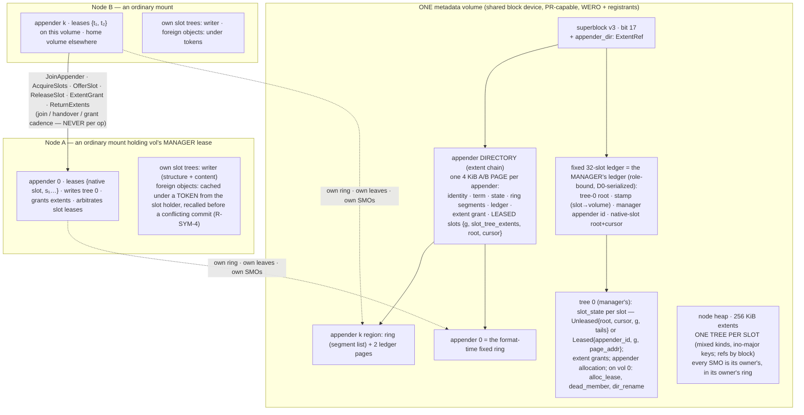
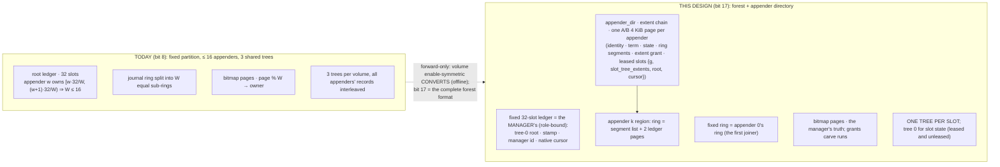

# Design Doc: SYMMETRIC SHARED-DISK METADATA — every node an equal metadata authority

| | |
|---|---|
| **Title** | Symmetric shared-disk metadata: every mount appends directly to the shared metadata volumes into its OWN slot trees under leased slot ownership — no designated authority mount, no operator assignment verb, no per-op RPC on the common path, no format bound on the appender count |
| **Author** | (design agent; adjudication owner: user) |
| **Date** | 2026-09-12 |
| **Status** | **Rev 7 — APPROVED by review (Rev 6, zero issues); the owner's five §14 decisions folded as final rulings R-SYM-4..8. Ready for PR 0.** Program AFTER DLM S0–S11 (all landed) and after the per-volume claim-admission recipe (closed 2026-08-24). Reverses recorded rulings **D18 / D19 / D20** by owner ruling 2026-09-12 (§1.1). Rev 1 changed the design to a **per-slot tree forest** (§9(a)); Rev 2 followed that shape through; Rev 3 closed round 3's twelve detail issues; Rev 4 composed the Rev-3 mechanisms with the SHIPPED terminal arms (the `EBADE` latch, the `T_self` poison); Rev 5 carried the per-host-id reservation model through to the WERO HOLDER (personal identity, election reconnect, the device-handle swap arm) and hardened the park; Rev 6 stated the target-ACL requirement derived identities create; **Rev 7 folds the owner's five Open-Question decisions** — GPFS-strict tokens as the only foreign-read method, dentry striping funded, `format` never sizes for clients, the co-located guarantee row, SPDK retired and fencing groups demoted to a follow-on (see the revision history). |
| **Repo state audited** | branch `dev`, tip `b4fe6560`, clean. Every `src/` anchor is as of that tip. |
| **Operating point (owner reminder 2026-09-12, verbatim intent)** | **10,000–15,000 mounted clients on AVERAGE, all reading AND writing, rarely the same files** (ruling D1). Not a peak, not a ceiling. Every derivation is evaluated at **12,500 simultaneously writing clients** as the normal case (§1.6), and every "fleet of 32" / "K ≤ 16" number inherited from the predecessor programs is re-derived there. |
| **Binding inputs** | [`AGENTS.md`](../AGENTS.md) (one source of truth — performance is the only terminal requirement; portable; io_uring everywhere; NO dead code; NO tokio in product code; every constant DERIVED with its reason on the line; every knob registered — ENG-10; forward-only format; red-first TDD; the venue rule); [`pre-rc-engineering-spec.md`](pre-rc-engineering-spec.md) §6.2 (the ten durable single-writer assumptions + the runtime item), §6.6–§6.9; [`design-cow-kv-metadata.md`](design-cow-kv-metadata.md) §4.4 (journal), §4.5 (node cache), §4.6/§4.6a (SMOs, leaf merge), §4.7 (extent allocator, pending-free), §4.8 (monotonic inos, no reuse), §4.9 (lock order), **§4.9a (node-cache coherence — "partitioning, not coherence")**, §4.10/§4.10a; [`design-dynamic-meta-routing.md`](design-dynamic-meta-routing.md) (the derived width `W = 2^16`, the guest keyspace, mint spread — §5.4's divisibility law, S4 lock homing); [`design-per-volume-claim-admission.md`](design-per-volume-claim-admission.md) §2, §5.7, §5.12, **§9(a)**; [`design-full-multi-writer.md`](design-full-multi-writer.md) (the rung-20 residual board); [`design-mw-data-alloc-partition.md`](design-mw-data-alloc-partition.md); [`design-durable-block-refcounts.md`](design-durable-block-refcounts.md); [`design-small-file-packing.md`](design-small-file-packing.md); [`design-random-small-writes.md`](design-random-small-writes.md) §5.1 (the W1 clone/patch fence); [`design-free-grace-sustain.md`](design-free-grace-sustain.md) + [`.benchmarks/2026-09-06-free-grace-hold-time.md`](../.benchmarks/2026-09-06-free-grace-hold-time.md) (the hold-time composite this design must not undo); [`rc-manifest.md`](rc-manifest.md) §2 (evidence tiers), §3b2 |
| **Evidence this program must move** | [`.benchmarks/2026-08-18-mw-program-closing.md`](../.benchmarks/2026-08-18-mw-program-closing.md) (≈ 2.6 GiB/s aggregate co-writer ingest through ONE authority); [`.benchmarks/2026-08-17-s10-slot-placement.md`](../.benchmarks/2026-08-17-s10-slot-placement.md) (`tar -x` on a co-writer = **6.73×** the authority-local wall at 250 µs RTT, 14.5 wire verbs/entry); [`.benchmarks/2026-08-22-pv-claim-admission.md`](../.benchmarks/2026-08-22-pv-claim-admission.md) (the K ≤ 16 recipe: 0.98× of S0 on a 2-owner fleet — every singular plane still on ONE set authority) |
| **Evidence this program must NOT move** | [`.benchmarks/2026-08-15-mw-s4-regate.md`](../.benchmarks/2026-08-15-mw-s4-regate.md) — the solo re-gate law: a single mount stays **within noise** of today with `dlm_rpcs == 0` by construction (within noise, not byte-identical — §8 gate 1 says why) |

**Revision history**

| Rev | Date | Change |
|---|---|---|
| 0 | 2026-09-12 | Initial draft: shared per-volume tree, floating structural lease, owner-built leaf images + shipped `ReplaceLeaf` flips, slot-aligned boundary splits, owner-major `TREE_BLOCK_REFS` re-key. |
| 1 | 2026-09-12 | Review round 1 (28 issues) folded + the owner's operating-point reminder. **The design CHANGED (Issue 16): the per-slot tree FOREST** — roots travel with the slot lease, every SMO is the owner's own in its own ring, the structural plane is deleted; a per-volume **manager lease** with zero per-op work survives (§5.3). Critical Issue 1 fixed by keeping the by-block C8 key inside each slot tree and packing per `(writer, slot, data volume)`. §1.6 re-derives every quantity at 12,500 writers. |
| **2** | 2026-09-12 | Review round 2 (17 issues: 8 major, 8 minor, 1 nit — all consequences of the forest not followed through) folded. **Mint affinity bounded** (children of native-slot directories go to the rotor; a slot tree is capped at `A_max = heap / MINT_SPREAD` so the divisibility law survives; §5.1.2, KD-SYM-11/16). **Handover dominance** re-defined per single requester against the holder's minutes-scale EWMA with an absolute floor, aggregate shipping never triggers, offer delivery specified (§5.1.4). **Frame screen** re-based on a per-slot lease generation `g_s` + recorded log tails + the monotone-`g` rule, with the non-PR residual named (§5.8.2). **Data-volume allocation bitmap** owned by the allocation-lease holder with its crash matrix (§5.5.1). **Cross-shard death ledger** in tree 0 of volume 0 with a bounded propagation (§5.5.2, §5.9). **Probe holders, not leaves**: per-slot `flush_gen` on the page (§5.7.1). **Lessee recorded in tree 0** so readers resolve slots wire-free; the many-creator `readdir + stat` shape priced and the gather-mode alternative adjudicated (§5.7.5). **PR registrant ceiling** row: SPDK nvmf caps registrants at 16, nvmet is unbounded, arrays are vendor-specific — probe, refuse loud, the fencing-group lever (§1.6, §5.8.1). Tag/codec conventions (§5.2.1), kind-pass = census walk (§5.8.5), free-grace fan-in carriage cadence (§5.7.3), the slot-0 metanode row (§5.10), region release + accumulation bound (§5.1.3), the slot economy over job waves (§5.1.9), dominated-handover flush pricing (§1.6), PR plan homes for the new rungs + PR 1 re-estimated (§PR Plan), `SLOT_PAGE_BUDGET` = 122 with `flush_gen` (§5.3.2). |
| **3** | 2026-09-12 | Review round 3 (12 issues: 5 major, 6 minor, 1 nit; 14 of round 2's 17 closed, Issue 1 re-listed, four fixes had introduced a new problem each) folded. **Affinity ceiling made LOAD-relative and dynamic** — `A_max(t) = max(used_leaf_bytes(volume, t) / MINT_SPREAD, node_size)`, soft, with `slot_tree_extents` durable on the page and the all-rotors-at-cap outcome stated (§5.1.2, KD-SYM-16); gate 1's law derived from the harness shape. **Dominance = OPS over one common `T_idle` window** (`ops_q ≥ 2 × ops_h ∧ ops_q ≥ N_floor`, `N_floor` = the handover's own cost in ships), no sustain clause, no immunity clause; the idle arm folded into it (§5.1.4). **Frame screen**: tails recorded for EVERY leaf at recovery on non-PR substrates (a full tail scan, priced) and the zombie-overwrites-successor acked-loss class named (§5.8.2). **Data bitmap co-located** with the holder's ring on its home volume; the allocation-lease re-grant gated on the dead holder's home region being `Recovered`; the double-allocation rows added (§5.5.1). **Fencing groups**: a member's death preempts the GROUP key and every live member re-registers within one beat — stated as the availability cost, with the detection-grade alternative named as the non-PR posture (§5.8.1, KD-SYM-18). Shared index kind `0x09` (§5.2.1); the cloner's ref SHARED-flagged (§5.4.4); the probe defined as on-access with the hot-slot re-probe row (§5.7.1); volume 0's manager death as a §1.6 row + the vol-0-unreachable rule (§5.5.2); anchors and PR homes fixed. |
| **4** | 2026-09-12 | Review round 4 (8 issues: 2 major, 5 minor, 1 nit; all 12 round-3 resolutions verified closed). Both majors were Rev-3 mechanisms composed with shipped machinery that treats its trigger as TERMINAL. **Fencing groups re-derived from the device's permission model** (write permission is per HOST ID, so rotating a shared key fences nobody and preempting the shared registration fences everyone — including live members, whose next barrier would latch `failed` under the shipped `EBADE` arm): the group posture is now an explicit operator choice between detection-grade per-member fencing and a **group host-id rotation** (preempt + fabric reconnect + re-register) served by a **re-key PARK arm** that never latches a live member (§5.8.1, KD-SYM-18). **A manager's death is its home shard's membership outage**: the symmetric appender's `T_self` action is defined as **park-and-reclaim** in the successor's S6 grace window (acks parked, page/ring/leases kept, reclaim under grace, no region recovery for reclaimers, `data_custody::poison` only when the park expires), priced for 195 members, and the §1.6 manager-death rows corrected (§5.5.3, KD-SYM-15). Minors: the overflow trigger strictly-over-cap so a solo mount stays at 64 rotor trees; gate 3 reworded; the fresh-volume floor-cap transient priced; open packs ≤ leased slots with the seal residue priced and added to gate 1; the free-grace ack pass DROPS unaccessed foreign leaves instead of probing them; `RecordRecovered` / `recovered:` / the `alloc_lease:` gate moved into PR 8; the dead `SQUEEZEFS_SYM_T_ACTIVE_MS` knob deleted; R8 / PR 0 / `N_floor` cold start / the 90th-ship wording; the rack-failure tail-scan aggregate. |
| **5** | 2026-09-12 | Review round 5 (4 issues: 1 major, 2 minor, 1 nit; all 8 round-4 resolutions verified closed, the per-host-id derivation independently confirmed). **The WERO holder is a group member too** — a same-host preempt maintains the issuer's registration and fences nobody — so every WERO holder (a volume's manager; a data volume's allocation holder) connects to the namespace it holds under a **PERSONAL `(hostnqn, hostid)` identity**, a group member's election reconnects that one namespace under a personal identity before the D0 arm (`manager_election_reconnect_ns`, added to the failover bound), the per-namespace budget is **`1 + G ≤ cap`** (`2 + G` during a hand-off), and the fabric reconnect is given its daemon mechanism: the **device-handle swap arm** in `NvmeBlockDev` — connect the new identity (a NEW host-side subsystem and `/dev` node under the sqz kernel's `fabrics_host_scoped_subsystems`, the fleet's shipped posture), open by NGUID through the identity walk, register a second fixed file, drain, switch, drop, disconnect the old controller — with its requirement and its refusal on stock kernels (§5.8.1, KD-SYM-18). `group_hostid_epoch` given its home in tree 0 of volume 0 and both record lists. **The park keeps its checkpoint task running** (the flush ceiling and reader bound hold through a park), the non-PR page race named as residual class (iii), grant liveness stated as death-ledger-never-TTL (§5.5.3, §5.8.2, §5.5). **The `Parked` gate is a pre-admission state exempt from the shipped D1.b escalation** (`SQUEEZEFS_TIMEOUT` 30 s < `T_park_max`), watchdog-labelled, with barrier/fsync bounded-error timers suspended while parked (§5.5.3). Registrant arithmetic corrected (§1.6). |
| **6** | 2026-09-12 | Review round 6 ("approve pending two small edits": 1 minor, 1 nit; all 4 round-5 resolutions verified). **Derived identities must be ADMITTED BY THE TARGET**: the product's own nvmet control plane writes `attr_allow_any_host=1` or a hostnqn allow-list (`src/nvmeof/nvmet.rs:636-646`), and a personal hostnqn per `(node, namespace)` or a fresh `(group_id, epoch)` hostnqn per rotation cannot connect through an allow-list nobody updated — the symmetric plane therefore REQUIRES `allow_any_host` (the substrate's default, the D2 trusted-fabric posture) on every subsystem it uses, probes it at join with a derived-identity connect, refuses loud otherwise (`pr_identity_acl_refusals`), and names the allow-list pre-add arm as a follow-on; one `operations.md` row, landed by PR 3 (§5.8.1, KD-SYM-18). The `2 + G` slack reworded: ONE concurrent identity event per namespace, a second refused-and-retried (§1.6, §5.8.1). **Reviewer verdict on Rev 6: approved, zero issues.** |
| **7** | 2026-09-12 | **The owner answered the five Open Questions (final rulings R-SYM-4..8, §1.1).** **R-SYM-4**: foreign metadata is read under GPFS-strict TOKENS and ONLY that way — the bounded projection (holder-page probe, `flush_gen`, tail probe, `foreign_leaf_staleness_bound_ms`, `SQUEEZEFS_SYM_FOREIGN_PROBE_MS`, `SQUEEZEFS_SYM_STRICT_FOREIGN_META`) is deleted; free-grace becomes recall-driven; `-o ro` mounts are token clients (§5.7, KD-SYM-19). **R-SYM-5**: dentry striping funded — §5.6.5 (DNE-2 shape, `K = MINT_SPREAD` stripe inos supplied by the heaviest creators, lazy migration, C17), PR 7b. **R-SYM-6**: `format` never sizes for clients — the sizing table lives in `operations.md`, the join publishes headroom and refuses only what the substrate cannot do (KD-SYM-21). **R-SYM-7**: co-located mounts sharing one registrant are their own guarantee row (KD-SYM-22). **R-SYM-8**: SPDK retired as a target (PR 16; nvmet is THE target), so the 16-registrant ceiling and the fencing-group problem leave the product: groups, host-id rotation, the device-handle swap, the re-key park arm, personal holder identities, the election reconnect, the target-ACL requirement and the group knobs are REMOVED from this program (documented follow-on for vendor-capped arrays); the registrant-cap probe + loud refusal and the `REGCTL`-sized read stay (KD-SYM-18/23). §1.6, gates, risks (R10/R12/R19/R20 rewritten for tokens; the group risks R24/R26–R28 retired; R24 striping migration, R26 striped `rmdir`, R27 SPDK retirement added — 27 risks), knobs (14 → 11), KDs (19 → 24, KD-SYM-19..23), PR plan (15 → 18 PRs incl. 7b striping and 16 SPDK retirement, ≈ 95 eng-weeks) updated; §14 closed. |

---

## Overview

Every SqueezeFS metadata volume has exactly one **appender** today, and every distributed shape the S0–S11 program shipped is built around that fact: a co-writer holds no metadata authority and **ships every mutation** to the one node that does (S8/S9); the per-volume-owner recipe lets a different node own each volume but keeps **one appender per volume**, caps owners at **16** (`MAX_APPENDERS`, [`src/meta_backend/kv/journal.rs`](../src/meta_backend/kv/journal.rs) `:168-173`), assigns ownership **offline**, refuses cross-owner `rename`/`link` with `EXDEV`, and homes every singular plane on the slot-0 volume's owner. Measured, that is a Lustre-shaped system with the metadata-server role fused into one client mount, and the owner's ruling (§1.1) rejects it: *"the multi writer method funnels everything through a single 'writer' that owns the metadata, that doesn't work."*

This design makes every mount an **equal metadata authority** in the GPFS sense. Each mount **appends directly to the shared metadata volumes** into its own **appender region** (its own journal ring, its own ledger page, its own extent grant — GPFS's per-node recovery log), and it owns metadata at the granularity of **routing slots** (the existing 65,536-slot map). **Each slot is its own tree.** A slot's records were already a contiguous key range (guest-slot keys are `(slot+1) << 40 | local`, [`src/meta_backend/mod.rs`](../src/meta_backend/mod.rs) `:35-68`); at the operating point — 12,500 writers over 65,536 slots — the shared interior tree of Rev 0 was a routing layer for a map the appender page already holds, with a per-volume SPOF attached. In the forest, a slot's tree root travels with its lease; compaction, split and merge are the **owner's own SMOs in its own ring** (§4.6 verbatim, one ring, one total order); nothing structural is ever shipped. What remains per volume is a **manager lease** — slot-lease arbitration, extent grants, appender-page allocation, the slot→volume map, the volume's control tree — held by an ordinary mount, elected through the existing D0 ladder, and touched by nobody on the write path. Ownership is **first-writer-takes-it** and **handed over** GPFS-metanode-style: an idle slot moves to whoever wants to write it; a live holder serves the writes it receives and offers the slot only to a single requester whose sustained rate dominates its own. A job's subtree lives in one slot tree (parent-slot mint affinity, bounded so a volume's load stays divisible into ≥ 64 movable slices — the shipped law). Cross-owner operations reuse S3.5's intent protocol with shipped steps (D18 reversed); readers keep the shipped bounded-staleness model and stay **wire-free** (slot lessees are recorded in the volume's control tree); fencing stays device-enforced (metadata namespaces move from Write-Exclusive to **WERO with every appender registered**, S7's law applied to metadata — with the substrate's registrant ceiling probed and named).

Everything ships **dark** behind `SQUEEZEFS_SYMMETRIC_META` (default `0`) and behind a test-only format stamp until the conversion verb and the counted acceptance rows exist; a plain mount re-proves the solo re-gate (`dlm_rpcs == 0`, within noise) at every PR.

---

## 1. Background & Motivation

### 1.1 The owner's rulings (2026-09-12, verbatim — final)

| # | Ruling | What it settles |
|---|---|---|
| **R-SYM-1** | *"we need to have multiple writers.... everyone should be able to write to the metadata and filesystem all the time like lustre, gpfs, juicefs, BeeGFS, OrangeFS, etc."* — confirmed as option 3 of three offered: **"every node an equal metadata authority."** | The program's goal: symmetry, not more owners and not a faster wire. |
| **R-SYM-2** | Mechanism = **(a) symmetric shared-disk**: every node appends to the shared metadata volumes DIRECTLY under leased slot ownership. NOT (b) owner-routed with dynamic per-slot owners. *"the multi writer method funnels everything through a single 'writer' that owns the metadata, that doesn't work"*. | The GPFS row (§1.2). The common path pays no RPC. The ruling is on the MECHANISM; whether one structural authority per volume survives was the design's to decide (it does not — §5.2). |
| **R-SYM-3** | **"The ledger bound must go"** — `MAX_APPENDERS = 16` is not acceptable as a cap on simultaneous metadata writers per volume. | §5.3.1: the appender directory. |
| **Operating point** (reminder, 2026-09-12) | **10–15 k mounted clients on AVERAGE**, all writing, rarely the same files. | §1.6 evaluates every quantity at 12,500 writers. |
| **R-SYM-4** (OQ-1, 2026-09-12) | *"I think we only need one method and I think the GPFS-strict by default is the best approach. we want clients to be aware, 2 seconds is too long."* | Foreign metadata is read under GPFS-strict tokens, and ONLY that way; the bounded-staleness projection is deleted (§5.7, KD-SYM-19). |
| **R-SYM-5** (OQ-2, 2026-09-12) | Fund sub-slot dentry striping NOW. | §5.6.5 (KD-SYM-20), PR 7b. |
| **R-SYM-6** (OQ-3, 2026-09-12) | *"the format shouldn't care about the number of clients ever."* | No format-time sizing arm, ever; the sizing table is `operations.md`'s; the join publishes headroom and refuses only what the substrate cannot do (KD-SYM-21). |
| **R-SYM-7** (OQ-4a, 2026-09-12) | Co-located mounts sharing one PR registrant: yes, as their own guarantee-class row (`flock` + `T_self` + frame screen), as co-writers have today. | KD-SYM-22. |
| **R-SYM-8** (OQ-4b, 2026-09-12) | Drop SPDK as a supported target; with it the `SPDK_NVMF_MAX_NUM_REGISTRANTS = 16` cap and the fencing-group problem leave anything SqueezeFS ships. | nvmet is THE target (PR 16 retires the SPDK verbs/build/fidelity legs, forward-only); fencing groups become a documented follow-on for vendor-capped arrays; the registrant-cap probe stays (KD-SYM-23). |

**These reverse three recorded rulings** of [`design-per-volume-claim-admission.md`](design-per-volume-claim-admission.md) §3 (also KD-SYM-0):

| Reversed | Was | Now |
|---|---|---|
| **D18** | Cross-owner `rename`/`link` scoped out as `EXDEV`; `unlink`/`rmdir` made safe by the M1 pre-check | Cross-owner `rename`/`link`/`unlink`/`rmdir`/`create` are POSIX through a two-party protocol (§5.6). The `cross_owner_error` arm ([`src/meta_ship/mod.rs`](../src/meta_ship/mod.rs) `:902`) is retired. |
| **D19** | Static, offline ownership (`volume set-owners`) | Ownership is a **RAM lease**, first-writer-takes-it, handed over through the S6 channel, failed over on lease expiry (§5.1). `volume set-owners` is retired forward-only (§7). |
| **D20** | The slot-0 volume's owner is the SET authority for every singular plane | Each plane is a **per-volume floating lease** or is homed on the leased slot that owns its records; the membership plane is **sharded by home volume** with a death ledger every manager reads (§5.5). Nothing derives from an operator assignment. |

### 1.2 Reference systems — how each actually does it, and why the ruling picked GPFS's row

| System | Mechanism | Metadata write path for a client | What transfers |
|---|---|---|---|
| **GPFS / IBM Storage Scale** | **Symmetric shared-disk.** Every node writes metadata directly to the shared disks. A distributed **token manager** (the file-system manager at first; distributed across manager nodes once many nodes mount — token server + client-cached tokens; conflicting tokens are revoked by the *requesting* node) arbitrates byte-range, inode and allocation-map-region tokens. Per open file one dynamically elected **metanode** (the first opener / longest holder) merges that file's metadata updates; other nodes ship deltas to it, and the role migrates to the node using the file most. **Every node is assigned its own recovery log** on shared disk, replayed by a surviving node on failure. The **block** allocation map is divided into separately lockable regions sized at `mmcrfs -n`; the **inode** allocation map's segments are chosen per PARENT DIRECTORY so a directory's files co-locate, and a segment that fills yields to another (`maxActiveIallocSegs` bounds how many a node holds). GPFS requires disk leasing/fencing for its safety claims. | **Local**: token cached ⇒ write the shared disk directly, journal in own log. Contended ⇒ ship to the metanode. | Per-node logs (§5.3), leased ownership with holder-decided handover (§5.1.4), metanode-on-contention (§5.1.4), **inode tokens as THE read-coherence method (§5.7, R-SYM-4)**, block-allocation regions ⇒ block grants + the per-data-volume bitmap (§5.5.1), parent-directory inode affinity with a segment-full rule ⇒ the bounded mint policy (§5.1.2), surviving-node log replay (§5.9), device fencing as the safety basis (§5.8). |
| **Lustre** | **Owner-routed.** MDS/MDT tier; DNE-1 remote directories pinned to an MDT, DNE-2 **striped directories** (entries hashed across MDTs). Clients cache under **LDLM inodebits** (LOOKUP/UPDATE/PERM/LAYOUT/XATTR bits; PDO name-hash locks). Cross-MDT rename = distributed transaction with **update logs**; directory renames take a global **BFL**; FID-ordered locking. | **Always an RPC** to the owning MDT. | Inodebit-style caching under a token (§5.7 — now the only read method), the BFL ⇒ the set-wide directory-rename lock (§5.6.4), update logs ⇒ S3.5 intents (§5.6), **DNE-2 striped directories ⇒ §5.6.5 (funded, R-SYM-5)**. |
| **BeeGFS** | **Owner-routed.** A directory's entries AND its files' inodes live on ONE metadata target (file inodes are inlined with the parent's dentries); only DIRECTORY inodes may live on another target. Clients RPC per op. | RPC per op. | Directory+children co-location is the shape parent-slot mint affinity produces (§5.1.2). |
| **OrangeFS / PVFS2** | **Owner-routed.** Handle ranges partition objects across servers; RPC per op; relaxed semantics. | RPC per op. | Handle ranges ≈ slots as contiguous id ranges. |
| **JuiceFS** | **Externalized** to a transactional store (Redis/TiKV/MySQL). | RPC to the store. | Nothing structural (the client-side levers already landed). |

**Why GPFS's row.** Lustre, BeeGFS, OrangeFS and JuiceFS route every mutation to an owning server; a client is never local. SqueezeFS today IS that row with the server fused into one mount and ownership per volume, offline, ≤ 16 — the owner's complaint is exactly the funnel that row implies. GPFS is the production system where the node doing the work appends the metadata itself, and this repo has most of its parts (S4 slot homing, S6 leases with grace + `T_self`, S7 device fencing, S8 verb shipping, the bit-8 appender regions, the per-ring two-phase replay). Sources §15; the Lockify citation is via spec §6.6 and not independently verified.

### 1.3 What SqueezeFS has TODAY — verified against the code

| # | Fact | Anchor | Consequence |
|---|---|---|---|
| 1 | **Partitioned append exists** (bit 8): N ≤ 16 appenders in ONE volume with own sub-ring, bitmap pages, ledger slot range; `MAX_APPENDERS` bounded by the 32-slot ledger (≥ 2 slots each); `ROOT_AUTHORITY_WRITER = 0` owns structure — *"content has N appenders, structure has exactly one authority"* because two-phase replay's `(level DESC, seq)` order is total only from one ring. | [`superblock.rs`](../src/meta_backend/kv/superblock.rs) `:193-221`; [`journal.rs`](../src/meta_backend/kv/journal.rs) `:168-185`, `:209-228`, `:254-274`; [`checkpoint.rs`](../src/meta_backend/kv/checkpoint.rs) `:157-181`, `:426-441`, `:869-940` | The structure/content split is honoured **per appender**: every appender IS the sole structural authority of its own slot trees, so the total-order argument holds ring by ring (§5.2). The fixed sub-ring/slot-range partition is retired. |
| 2 | **The node cache is load-once RAM-authoritative**; *"partitioning, not cache coherence"*. `CachedNode::apply_locked` refuses a non-authority structural mutation (`meta_kv_node_partition_refusals`); a peer's append into a cached leaf is DETECTED at `append_frozen`; the reader arm drops nodes on epoch step. The named missing third gate state: *"reader for structure, appender for my own leaves"*. | [`node_cache.rs`](../src/meta_backend/kv/node_cache.rs) `:78-90`; [`revalidate.rs`](../src/meta_backend/kv/revalidate.rs) `:1-80`; §4.9a; [`.benchmarks/2026-08-05-mw-node-cache-coherence.md`](../.benchmarks/2026-08-05-mw-node-cache-coherence.md) | **Honoured** (KD-SYM-5): a mount is the ONLY cacher-as-writer of its slot trees; every foreign slot tree is a projection (§5.7.1). |
| 3 | **Ino routing** `route_ino_width(ino, W) = ((ino−2) % W, (ino−2)/W + 2)` over the DERIVED `W = 2^16`; **inside a volume a guest slot's keys are `guest_local_ino(slot, local) = (slot+1) << 40 \| local`**, the native keyspace is `[0, 2^40)`; keys in all three trees are BE local-key-ino-prefixed ([`record.rs`](../src/meta_backend/kv/record.rs) `:74/108/136`). Tree ids `TREE_INODES = 1`, `TREE_DENTRIES = 2`, `TREE_XATTRS = 3`, `TREE_ALLOC_RESERVED = 4`, `TREE_BLOCK_REFS = 6`, `TREE_BLOCK_MAP = 7`, `TREE_ID_MAX = 7`; key lengths 8 / 16 / 16 / 12 (`record.rs:20-64`, `block_map.rs:72`); the journal tag `tag_for(tree_id, level) = tree_id \| level << 4` asserts `tree_id ∈ 1..=TREE_ID_MAX` (`journal.rs:353`); mint spread = 64 slots/volume — *"a volume's load divisible into ≥ 64 movable slices from birth"* ([`design-dynamic-meta-routing.md`](design-dynamic-meta-routing.md) §5.4). | [`mod.rs`](../src/meta_backend/mod.rs) `:20-37`, `:59`, `:66-68`, `:779-813` | A slot IS a contiguous key range; the forest gives each such range its own root (§5.2). The slot is read from the KEY. Global inos untouched. The divisibility law is preserved by the affinity ceiling (§5.1.2). |
| 4 | **DLM S4**: lock objects home on the slot map; `SlotOwners` (a bitset, `:119`) and `MODE_SLOT_HOMED` (`:113`) exist and are never installed in production; a foreign home travels via `data_grant::acquire_remote` (`data_grant.rs:4175`) and adopts the grant (`dlm.rs:210`). `src/dlm.rs` is process-local. | [`dlm_slot.rs`](../src/dlm_slot.rs) `:1-125`, `:178-190`; [`dlm.rs`](../src/dlm.rs) `:1-40` | The DLM = the S4 table installed from the lease map + a slot→holder cache fed by the control tree (§5.1.5–§5.1.6). |
| 5 | **Landed and reusable**: S6 membership ([`membership.rs`](../src/membership.rs) — RAM leases, grace, `T_self = T_owner − 2·skew_max − D_purge` `:1085`, renewal `min(10 s, T_self/3)` `:1105`, `T_owner` = the 45 s shipped TTL `:1088`, `min_acked_free_epoch`; one owner record per volume `MEMBERSHIP_OWNER_XATTR` `:129`, `arm_owner :2829`); S7 fencing ([`data_custody.rs`](../src/data_custody.rs) — WERO `acquire_wero :774`, `join_wero_as_registrant :1058`, custody epochs, dead-epoch quarantine; the PR report read in [`reservation.rs`](../src/meta_backend/reservation.rs) `:552-575` — a fixed 4 KiB buffer whose parse loop silently `break`s past the 63rd extended registrant, so today's S7 rung-5 check would mis-report the 64th co-writer as unregistered; `:76-121` is the `ReservationReport` struct); S8 shipping ([`meta_ship/`](../src/meta_ship/mod.rs) — frames, dedup window, `owner_dispatch`); S9 ([`data_grant.rs`](../src/data_grant.rs), [`cowriter.rs`](../src/cowriter.rs) `execute_shipped_frees :1963`, [`alloc_lane_grant.rs`](../src/alloc_lane_grant.rs) `MAX_LANES = MAX_APPENDERS :119`, [`data_alloc_lane.rs`](../src/data_alloc_lane.rs)); [`free_grace.rs`](../src/free_grace.rs) (the ack-renewal carriage law); [`writer_scope.rs`](../src/writer_scope.rs); C8 refs [`block_refs.rs`](../src/meta_backend/kv/block_refs.rs); the block-map tree [`block_map.rs`](../src/meta_backend/kv/block_map.rs); the A/B bitmap-page pattern [`alloc_ext.rs`](../src/meta_backend/kv/alloc_ext.rs); the conveyor + durability lane ([`backend.rs`](../src/meta_backend/kv/backend.rs), `ConveyorCore`); lock order [`stripe_locks.rs`](../src/stripe_locks.rs); S3.5 ([`crossvol_tx.rs`](../src/meta_backend/crossvol_tx.rs) `:22-40`, `recover_open_intents :988`, `xv_apply_step` `backend.rs:13331`); S10 intents (`IntentCreatePreset` `mod.rs:791-800`); the D0 ladder (`open :1260`, `acquire_writer_flock :6088`, `classify_claim :6289`; `CLIENT_HEARTBEAT_INTERVAL_SECS = 10`, `CLIENT_STALE_TTL_SECS = 45`, [`fuse_client.rs`](../src/fuse_client.rs) `:191-195`); the bset frame ([`node.rs`](../src/meta_backend/kv/node.rs) `:132-142`: 32 B, `version: u16 \| reserved: u16`); the journal page header (`journal.rs:18-32`, `:145-149`: 24 B, `_pad [10..12)` the only free pair). | as cited | Every mechanism below is one of these with its input changed; §5 names the anchor at every reuse. |
| 6 | **Per-volume owners**: K ≤ 16, static; §5.12 lists the surviving funnels; **§9(a) rejected N appenders per volume on four points** and named it the natural successor. | [`design-per-volume-claim-admission.md`](design-per-volume-claim-admission.md) | §1.5. |
| 7 | **Substrate fencing facts** (verified for Rev 2): the NVMe Reservation Report is `24 B header + 24 B × REGCTL` (64-bit host ids) or `64 B + 64 B × REGCTL` (128-bit host ids — NVMe-oF, EDS=1); `REGCTL` is a 16-bit count. Linux `nvmet` keeps registrants in an unbounded list; SPDK's nvmf target hardcoded `SPDK_NVMF_MAX_NUM_REGISTRANTS = 16` (`include/spdk/nvmf.h`) — **the reason the owner retired SPDK as a target (R-SYM-8, PR 16)**; hardware arrays cap registrants per namespace at vendor-specific values (SCSI-PR-era 64–256 typical), and `RESCAP` advertises reservation TYPES, never the count. | NVMe Base Spec 2.0c §Reservation Report; `docker/`'s fidelity tier (nvmet after PR 16) | §1.6's registrant row and §5.8.1's posture; **S7 already has this exposure on every data namespace** — it is not new, it is now named. |

### 1.4 Measured constants this design is built against

| Constant | Value | Tier | Source |
|---|---|---|---|
| **Client-serial wire-verb rate at the veth floor** (S8-a) — NOT owner capacity: the note attributes the row 100 % to RTT (`batched_verbs / batches = 1.00`) with **owner-side `execute ≤ 8 µs`, `total ≤ 32 µs`** | 9,473 verbs/s (client-serial); ≈ 30 k verbs/s per owner core single-threaded from the service time (arithmetic) | measured-real (client rate); arithmetic (owner ceiling) | [`.benchmarks/2026-08-16-mw-s8-arm.md`](../.benchmarks/2026-08-16-mw-s8-arm.md) `:113-142` |
| Co-writer ingest publish cost (S9-a) ⇒ the "2.6 GiB/s independent of writer count" wall | 3.6 publish verbs/MiB. The closing note's arithmetic treats 9,473 verbs/s as OWNER saturation, which S8-a does not support. The honest statement: ONE serial co-writer stream ≤ 9,473 ÷ 3.6 ≈ 2.6 GiB/s (RTT-bound); the AGGREGATE is bounded by the owner's service capacity ≈ 30 k verbs/s per core ÷ 3.6 ≈ 8 GiB/s per owner core. Either way one node's cores bound the fleet — the funnel the ruling rejects | arithmetic-on-measured | [`.benchmarks/2026-08-18-mw-program-closing.md`](../.benchmarks/2026-08-18-mw-program-closing.md) `:52-60` |
| `tar -x` on a co-writer at 250 µs RTT | **6.73×** (14.87 s vs 2.21 s; 14.5 wire verbs/entry) | measured-real | [`.benchmarks/2026-08-17-s10-slot-placement.md`](../.benchmarks/2026-08-17-s10-slot-placement.md) |
| Local conveyor create rate (mdstorm, 64 threads, `/dev/shm`, dev box — scoping) | 8,146–8,375 creates/s; 4a guard wait 28 µs/op | measured-real (label-only venue) | [`.benchmarks/2026-09-05-d3-dlm-stripe-derivation.md`](../.benchmarks/2026-09-05-d3-dlm-stripe-derivation.md) §7 |
| create + 16 KiB write + fsync, squeeze-test | 4,200 files/s | measured-real | [`.benchmarks/2026-09-10-packing-rows-squeeze-test.md`](../.benchmarks/2026-09-10-packing-rows-squeeze-test.md) |
| Per-volume-owner recipe, 2 owners | `tar -x` 0.98× of S0 | measured-real | [`.benchmarks/2026-08-22-pv-claim-admission.md`](../.benchmarks/2026-08-22-pv-claim-admission.md) |
| Solo re-gate | within noise, `dlm_rpcs == 0` | measured-real | [`.benchmarks/2026-08-15-mw-s4-regate.md`](../.benchmarks/2026-08-15-mw-s4-regate.md) |
| S11 MPI-IO on a real cloud fabric (1 authority + 2 co-writers) | shared 1,061/1,053 MiB/s vs fpp 880/870 (1.21×); NIC-bound | measured-real (cloud, third class) | [`.benchmarks/cloud/2026-09-12-075403/manifest.txt`](../.benchmarks/cloud/2026-09-12-075403/manifest.txt) |
| Free-grace hold composite after the 2026-09-06 campaign | `bound_age` 8,994 → ≈ 2,724 ms with acks travelling as carriage on prods | measured (in-process) | [`.benchmarks/2026-09-06-free-grace-hold-time.md`](../.benchmarks/2026-09-06-free-grace-hold-time.md) |
| Journal / node constants | ≈ 230 B entry per create; 4 KiB pages, 24 B header; `MAX_ENTRY_LEN` 128 KiB; `ENTRY_HDR_LEN` 20 B; solo ring `clamp(volume/64, 8 MiB, 32 MiB)`; `CHECKPOINT_MAX_AGE_MS` = 1 s; 256 KiB nodes (64 KiB–1 MiB), ≈ 60 × 4 KiB bset appends per node log, ≈ 2,000 records/leaf at ~100 B (≈ 800 files/leaf at ~330 B for inode + dentry + `layout`), cold leaf read 85–120 µs; the S5 reader's ledger poll = one 128 KiB read per volume per interval | format constants | [`design-cow-kv-metadata.md`](design-cow-kv-metadata.md) §4.1/§4.4; [`revalidate.rs`](../src/meta_backend/kv/revalidate.rs) |
| Membership | journal-free liveness at N = 32; the SIM-1 harness exists (`SimConfig { clients: 15_000 }`, deferred run); `T_owner` 45 s shipped; renewal 10 s | measured-real (N=32) / harness | [`.benchmarks/2026-08-16-mw-s6-arm.md`](../.benchmarks/2026-08-16-mw-s6-arm.md); [`membership_sim.rs`](../src/membership_sim.rs) `:20-40` |

### 1.5 Why the shipped shape cannot get there — the §9(a) blocker list answered

| §9(a) "against" | Answer | Where |
|---|---|---|
| (1) *"the node cache is one per volume and `apply_locked` refuses non-authority structural mutations; the missing third gate state"* | Each appender is the structural authority of its OWN slot trees, so `apply_locked`'s refusal keys on "is this slot mine" — the third gate state is that predicate (§5.7.1). | §5.2, §5.7.1 |
| (2) *"multiplies the crash matrix across three durable structures"* | The three become ONE appender region with one crash discipline (§5.3.2), enumerated (§5.3.4), pinned by the crucible (§8 gate 4). | §5.3.4 |
| (3) *"the delegation watermark comparison must name the bit-8 partition"* | Delegations are issued by the slot lease holder and carry its `dlm_term` (§5.7.4). | §5.7.4 |
| (4) *"the volume-grain answer needs no format change"* | True, and it left K ≤ 16, offline assignment and every plane singular. The ruling accepts the format change (§7). | §7 |

### 1.6 The operating point: 12,500 writing clients, re-derived (owner reminder)

Every inherited number is re-derived at **N = 12,500 writers**, `W = 65,536`, and two volume counts: **V = 64** (the recommended shape) and **V = 8** (a small set, to show what breaks first). "Breaks first" = the first resource whose derived bound is crossed. Slot population is NOT uniform (§5.1.2): **rotor slots** hold the mints whose parent this node did not lease (≈ uniform, small); **affinity slots** hold whole job subtrees, each capped at the LOAD-relative `A_max(t)` — both kinds are priced.

| Quantity | Derivation (reason on the line) | N = 12,500, V = 64 | N = 12,500, V = 8 | Breaks first? |
|---|---|---|---|---|
| Rotor slots per node `M` | `clamp(W / (2 × writers), 1, MINT_SPREAD)` — the `2 ×` keeps HALF the width unleased for inheritance and churn (§5.1.9); `MINT_SPREAD = 64` is the shipped granularity ceiling | **2** | 2 | no |
| Slots leased by rotors at first join / spare | `N × M` / `W − N × M` | 25,000 / 40,536 (62 %) | same | **first wave only** — after ≈ 2.6 job waves every slot carries history (§5.1.9); the width is never exhausted because rotor leases are bounded by `M` and inherited slots are the SAME slots re-leased |
| Concurrent lessees (writers) bound | `W` (each writer needs ≥ 1 slot) — a FORMAT bound (u16 slot ids), ≥ 4× D1 | 65,536 | 65,536 | no (§2 Non-Goals; growth path §5.1.7) |
| Affinity slot tree size ceiling `A_max(t)` | `max(used_leaf_bytes(volume, t) / MINT_SPREAD, node_size)` — the divisibility law is about LOAD ("a volume's load divisible into ≥ 64 movable slices"), so the cap is 1/64 of the volume's CURRENT leaf bytes (the manager's bitmap census, published in its ledger record), never less than one extent; it rises as the volume fills, so a tree spills only while it takes MORE than its share of new load (GPFS's segment-full rule); `heap / MINT_SPREAD` survives as the hard ceiling for the degenerate case (§5.1.2) | a job ≈ 1/195 of its volume's load < 1/64 ⇒ **one tree per job, by design** (the cap binds nowhere a volume is already divisible); a SOLO mount's load is the volume's load ⇒ every tree ≤ 1/64 ⇒ ≥ 64 rotor trees carry it — the shipped granularity, at subtree grain | at V = 8 a job is 1/1,563 of the volume: one tree | binds exactly where the law wants it to; gauged `slot_tree_bytes` p99/max vs `A_max` and `affinity_ceiling_spills` |
| Appenders per volume (home) | `N / V` — home volume = fewest appenders at join | **195** | 1,563 | no |
| **Appender regions per volume incl. foreign** | home regions + regions on volumes where the node leases a foreign slot; a region is released when its last slot on that volume is released and its ring window is empty (§5.1.3) ⇒ bounded by live foreign leases, ≤ `min(N, appenders_capacity)` | steady ≈ 195 + live foreign ≈ a few hundred; worst 12,500 = 12,500 × 512 KiB = 6 GiB of rings + 98 MiB of pages | same | no (inside the 64 GiB budget even at the worst case); recovery of a dead node = ONE ring per region it held, all recovered in parallel by their managers (§5.9) |
| Per-appender ring | `clamp(2 × ewma_commit_bytes/s × CHECKPOINT_MAX_AGE, 512 KiB, volume/64)` — floor = the checkpoint reserve + one `MAX_ENTRY_LEN` (physical); `2 ×` = one EWMA window of under-estimate; ceiling = the solo ring's derivation. At a 100 creates/s per-node norm the floor; at the 8 k peak 4 MiB | 195 × 512 KiB = **98 MiB** (norm) / 780 MiB (peak) | 780 MiB / 6 GiB | no |
| Ring budget per volume (appender capacity) | `heap / 16` — the solo ring is `volume/64`; 4× that for many appenders (a quarter of the heap stays for images at the peak) | 64 GiB ⇒ 16 k appenders at 4 MiB, 128 k at the floor | same | **at V = 1 and the 8 k peak**: 49 GiB ≈ the budget — the first thing that binds; V ≥ 2 clears it |
| Leased-slot entries per page | `SLOT_PAGE_BUDGET` = (4096 − ≈ 300 B fixed) ÷ 31 B per entry (slot u16 + state u8 + `g` u32 + `slot_tree_extents` u32 + root (u64, u64) + cursor u64) = **122** — physical; beyond it the holder LRU-releases idle slots | 2 rotor (+ ≤ 2 overflow) + inherited ≤ 122 | same | no |
| Unleased-slot state + lessee records (tree 0) | ≤ 65,536/V entries × ~60 B (root, cursor, lessee, `g`, `slot_tree_extents`, tails ref) per volume | 1,024 entries ≈ 56 KiB (one leaf) | 8,192 ≈ 450 KiB (2 leaves) | no |
| Leaf extents — rotor slots | ≈ 1,500 inos at the 100 M cap × ~330 B ⇒ 2–3 leaves; one at typical | 65,536 × 256 KiB = **16 GiB floor** set-wide if all active | same | no at 1 TiB × V; at a 64 GiB set 25 % of the heap — `--meta-node-kib 64` (4 GiB) is the lever (§7.3) |
| Leaf extents — affinity slots | a job tree of `F` files ≈ `F × 330 B / 256 KiB` leaves (10 M files ≈ 3.3 GB ≈ 12,900 leaves), bounded by `A_max(t)` — at the operating point a job never reaches the cap | job-sized | same | no — it is the same population the job would have written under any layout |
| **Handover reclaim by a bursty owner** (round-3 Issue 2) | a job whose idle tree moved reclaims it at its next burst once `ops_q(T_idle) ≥ 2 × ops_h(T_idle) ∧ ≥ N_floor`; worst case one handover per burst per direction against a trickle holder | a 10-min-checkpoint job: ≤ 2 handovers per 10 min ≈ 20–400 ms per 600 s | same | no |
| Manager verbs per volume (per-op work = 0) | joins + acquires/handovers + grants/returns + tree-0 lessee writes; a grant every `G` extents | join storm ≈ 195 joins + 390 tree-0 writes in ~1 min; steady ≪ 100/s | 8× | no (owner service ≤ 32 µs/verb ⇒ ≥ 30 k/s per core) |
| **Root-level metanode ships — STRIPED** (§5.6.5) | every `mkdir /jobs/X` ships to the holder of `/jobs`'s stripe `hash(X) % 64`; every `mkdir /<top>` ships to volume 0's manager (slot 0 holds `/`'s dentries) | 12,500 ships per job wave spread over **64 stripe holders ≈ 195 each ≈ 6 ms** of each holder's time (was 0.4 s on one node); `/<top>` mkdirs are rare | same | no |
| Structural flips per volume (Rev 0's funnel) | **0** — deleted by the forest | 0 | 0 | — |
| Membership beats | sharded by home volume (§5.5.2): `N/V ÷ 10 s` per shard | **20 beats/s** per manager | 156/s | no (S6 sized ONE owner for 1,500/s) |
| **Death propagation** | home shard evicts at `T_owner` → one `RecordDeath` verb to volume 0's manager → tree 0 of volume 0 → every manager/allocation holder reads it as a projection within `poll + CHECKPOINT_MAX_AGE` | `T_owner` + ≈ 2 s | same | no; added to the recovery bound |
| Free-grace qualification (recall-driven, §5.7.3) | a terminal free ships after the freeing publish's token RECALLS are acked (each reader drains its in-flight reads + purges its census for the ino before acking); the grace ring is the timeout path for a reader that never acks (evicted at `T_owner`) | recall RTT ≈ ms for responsive readers; `T_owner` for dead ones; no shard fan-in | same | no; `free_grace_hold_ms` collapses from the 2,724 ms composite to ≈ 1 RTT (gate 5 measures) |
| **Foreign-object tokens per node** (R-SYM-4) | one RPC per (foreign object, reader) first touch or after a recall; the grant reply carries the records; 0 RPCs and 0 device reads while cached | D1: a node touching ≤ ~10 foreign objects/s ⇒ ≤ 10 RPCs/s per node ≈ 125 k RPCs/s set-wide spread over their holders (≈ 10/s per holder); a write-once dataset read by all: one grant per (object, reader), never a recall | same | no |
| **Recall fan-out** (R-SYM-4, §5.7.4) | a holder's mutation of an object with `R` token holders recalls `R` tokens (batched per conveyor pass); the broadcast shape — one writer, 12,500 readers of one file — recalls 12,500 per layout publish | ≈ 12,500 × RTT at 64-way concurrency ≈ **100 ms per publish** on that one file; a hot shared directory recalls only its stripe's readers (§5.6.5) | same | the GPFS cost, paid only where sharing is; `dlm_recall_fanout` p99 gauged |
| **Tree-0 / ledger poll reads per volume** | every mount polls the fixed ledger of each volume it touches: one 128 KiB read per `resolve_revalidate_interval_ms` (≥ the checkpoint ceiling); PR 5 lands the predicted-slot-first 4 KiB read | 12,500 × ~2 volumes × 128 KiB/s ≈ 3.2 GB/s set-wide, **50 MB/s per volume** (4 KiB-first: 1.6 MB/s) | 400 MB/s per volume | no on NVMe; the 4 KiB-first read is PR 5's row |
| **Many-creator `readdir + stat`** | dentries in `K = 64` stripes (§5.6.5) ⇒ 64 stripe tokens; children's inodes in `C` slot trees ⇒ `C` inode tokens (one RPC per child, one per holder, parallel); **0 leaf reads**; warm = RAM | cold `ls -l` on a 12,500-creator directory ≈ **12,500 RPCs ≈ 20 ms at 64-way concurrency** (was 3.1 GiB of leaf reads under the deleted projection) | same | the honest cost of write locality; gather mode (§5.7.5) is the opt-in for read-mostly shared directories |
| Join storm (a training job starting: 12,500 mounts in ~2 min) | per manager: `JoinAppender` = page + ring extents + initial grant + `AcquireSlots(M)` + tree-0 lessee writes ≈ 2–5 ms incl. barrier; **plus** one WERO `REGISTER` per namespace per host (the device's command rate — µs) **plus** the 12,500 `mkdir /jobs/X` ships to `/jobs`'s holder (0.4 s). **Floor-cap transient on a FRESH volume**: with `used ≈ 0` the cap is one extent, so each job's first ≈ 800 files spill across its `M` rotor slots (and ≤ `2 × M` on overflow) until the volume's leaf bytes pass `64 × node_size` and the cap rises above the per-job trees — harmless, ≤ a few thousand files across ≤ 4 slots per job | 195 × 5 ms ≈ **1 s** of manager time; 0.4 s on `/jobs`'s holder | 8 s | no |
| Slot handover cost — idle arm | flush of an IDLE slot's dirty set = 0 + page write + barrier + manager tree-0 tx + requester page write ≈ **4 barriers + 3 RTTs ≈ 5–20 ms** | per handover | same | no |
| Slot handover cost — dominated arm (Issue 15) | flush of ≤ ONE flush ceiling's dirty set of that slot (≤ 1 s of the holder's writes: at 8 k creates/s ≈ 8 k records ≈ 4–10 dirty leaves, hundreds for a wide tree) × one 4 KiB append each + 1 barrier, then the idle arm's cost | ≈ 10–200 ms | same | no; rate bounded by the dominance rule (§5.1.4) |
| Dead node → slots leasable | `T_owner` (45 s shipped) + propagation (≤ 2 s) + recovery (§5.9: 0.2–0.5 s per ring) | **≈ 47–48 s**; reads unaffected | same | the TTL, not the mechanism; `SQUEEZEFS_MEMBERSHIP_LEASE_TTL_MS` is the lever (clocks refuse unsafe values) |
| Several nodes die at once (a rack, 100) | rings recovered by their volume managers in parallel: `100 / V` serial per manager × 0.5 s per region; **on a non-PR substrate + the full tail scan** (§5.8.2): `100 / V` × 1–3 s | **≈ 1 s** after propagation (PR); ≈ 5 s on non-PR | 6 s (PR); ≈ 40 s on non-PR | no |
| Manager death — FOREIGN-homed appenders on that volume | D0 ladder on `writer_claim` staleness (`CLIENT_STALE_TTL_SECS` = 45 s) + ladder ≈ 1 s + ring replay ≈ 0.5 s ⇒ `manager_failover_bound_ms` ≈ **46.5 s**; an appender homed ELSEWHERE that leases a slot here keeps committing (its membership lease is with its own shard; no per-op manager dependence) while its extent grant lasts | grant headroom `≥ 2 × ewma_smo_rate × failover_bound` (§5.3.3) | same | at a 100 creates/s norm ≈ 0.06 SMO/s ⇒ the 8-extent floor; at the 8 k peak 5 SMO/s ⇒ 470 extents = 117 MiB per appender ⇒ 23 GiB per 1 TiB volume (V=64) — 2.3 %; V=8: 18 % — **the second thing that binds at V = 8 under peak** |
| **Allocation-lease holder death** | successor granted the lease ONLY after the dead holder's home region is `Recovered` (its ring replay applies the bitmap deltas — §5.5.1); then one bitmap read + copy (32 KiB per TiB of data) | ≈ `T_owner` + propagation + home recovery (0.2–0.5 s) + copy ≈ 47–48 s; grants already issued keep flowing (writers hold `G` blocks) | same | no |
| **Manager death — its HOME-SHARD members** (round-4 Issue 2) | the manager is the shard's S6 owner, so its ≈ `N/V` members cannot renew until the successor arms (46.5 s) > their `T_self` (≈ 40–44 s): at `T_self` each member **parks-and-reclaims** (§5.5.3) — acks parked at the conveyor's admission, page/ring/slot leases kept, reclaim under the successor's grace window, no region recovery, no self-fence unless the park outlives `T_park_max` | **≈ 195 nodes with no metadata acks for `failover_bound − T_self` + one reclaim RTT ≈ 3–12 s** (3–17 s at the widest `skew_max`/`D_purge`); data-plane DMA to already-granted blocks continues (custody is local, permission is the device's); foreign-homed appenders on the volume unaffected | ≈ 1,563 nodes parked | a routine event at 12,500 nodes (one of 64 ordinary nodes dying); the reclaim storm is S6 R6's sized shape (1,875 × 1 k tokens in a 45 s window) |
| **Volume 0's manager death** | every set-wide role KD-SYM-2 fuses into that identity — death-ledger writes, `alloc_lease:` grants, `dir_rename`, root-level `mkdir` — stalls ≤ `manager_failover_bound_ms`; `RecordDeath` retries idempotently; recoveries queue behind it; a manager that cannot read volume 0's ledger for > `T_owner` releases its own manager role (§5.5.2) | **≤ 46.5 s** per volume-0 manager death, set-wide, for those roles only; ordinary writes unaffected **except volume 0's own home shard, which parks per the row above** | same | the TTL again; the roles are rare-cadence by construction |
| **Co-located mounts sharing one registrant** (R-SYM-7) | the device cannot tell them apart, so a co-located mount's death is fenced by the kernel-arbitrated `flock` (instant) + `T_self` + the frame screen — its own guarantee row | 0 stall; detection-grade for that one class | same | the shipped co-writer posture, stated |
| **Non-PR recovery tail scan** (round-3 Issue 3) | on a non-PR substrate the recoverer records the log tail of EVERY leaf of the dead node's slot trees on this volume (a full read of those trees, ≈ 12 B per leaf recorded) | a 10 M-file job tree ≈ 3.3 GB read ≈ 1–3 s at NVMe rates, per dead region; 0 on PR substrates (the preempt makes it unnecessary) | same | the lab posture's price, named |
| **PR registrants per namespace** | every appender registers on every metadata namespace it appends to and every writer on every data namespace (S7, exists): ≤ N per namespace, one identity per mount; report = `64 + 64 × REGCTL` B, read in two `REGCTL`-sized steps | **12,500 registrants; report ≈ 800 KiB**; **`nvmet` (THE target, R-SYM-8): unbounded list**; third-party arrays: vendor cap, probed | same | on nvmet it does not bind; on a vendor-capped array the join refuses loud past the cap (§5.8.1) — nvmet in front of the array is the remedy |
| Reader staleness bound | **0 for metadata under tokens** (R-SYM-4): a reader sees a foreign change at its next resolve after the recall; the gauge stays at 0 | 0 | 0 | — |
| ino-1 record rate (`job:`, `dead_member:`) | job cadence + one record per death | ≈ 0 | ≈ 0 | no |
| Set-wide directory-rename lock | one lease on volume 0's manager; directory renames only | rare | rare | only if a workload renames directories at fleet rate |

**What breaks first, stated:** at V = 1 the ring budget (49 GiB of rings at the 8 k/node peak); at V ≤ 8 under sustained peak the extent-grant reserve (18 % of the heap); on a third-party PR array the vendor's registrant cap, probed and refused loud (nvmet, THE target, has none — R-SYM-8); the broadcast-write shape's recall fan-out (100 ms per publish on a file 12,500 nodes read). Everything else is inside its bound by ≥ 4× at V = 64. The operator lever is the metadata volume count; **`format` never sizes for clients** (R-SYM-6) — `operations.md` publishes this table, and the join publishes `appenders_capacity`, `manager_load_pct` and the grant headroom as live gauges.

---

## 2. Goals & Non-Goals

### Goals

1. **Every mount is a metadata writer.** Any node mounts read-write and can `create`/`mkdir`/`rename`/`link`/`unlink`/`setattr`/`write` anywhere with **no designated authority mount, no operator assignment verb, and no per-op RPC on the common path**.
2. **Leased, dynamic, first-writer-takes-it ownership** with GPFS-style holder-decided handover and automatic failover on lease expiry (the successor replays the dead node's ring — every ring the dead node held, on every volume).
3. **Appender count per volume unbounded by the format** — bounded by heap space alone, derived and published.
4. **The §4.9a law kept for writers**: a mount is the only writer-cacher of its own slot trees; readers cache foreign objects only under tokens the writer grants and recalls (§5.7). No cross-node coherence protocol for writers.
5. **Cross-owner `rename`/`link`/`unlink`/`rmdir`/`create` are POSIX** (D18 reversed), crash-safe by intent roll-forward, directory renames cycle-safe.
6. **Every D20 singular plane** is a per-volume floating lease (or sharded with a propagation channel); none is an operator assignment.
7. **Fencing device-enforced on metadata namespaces** (WERO + registrants on the kernel `nvmet` target, the one supported target — R-SYM-8; a vendor-capped array's registrant ceiling probed and refused loud), detection-grade via bset-frame lease generations on non-PR substrates; **zero acked-data loss** on any single-node `kill -9` at any instant; fsck + C8 clean after every kill.
8. **Foreign metadata is EXACT** (R-SYM-4): every foreign read is served under a token the holder recalls before a conflicting commit; `reader_staleness_bound_ms` reads 0; `-o ro` mounts are token clients (§5.7).
8b. **Hot shared directories are striped** (R-SYM-5): a directory written by many nodes spreads over `K = 64` stripe holders (§5.6.5).
9. **The divisibility law kept**: a volume's LOAD stays divisible into ≥ 64 movable slices — no slot tree exceeds 1/64 of its volume's current leaf bytes (the load-relative affinity ceiling, §5.1.2).
10. **Solo re-gate at every PR**: one mount = one appender + the manager role, `dlm_rpcs == 0`, throughput within noise.
11. **Performance gates** (§8): `tar -x` on ANY node ≤ 1.10× the local wall; aggregate create/s and ingest scale with node count and are bounded by no single node; the crash matrix green; the reader bound unchanged.

### Non-Goals

- **A second foreign-read method.** There is no bounded-staleness projection of user-visible metadata and no lever to get one (R-SYM-4); control-plane records (tree 0, ledgers, pages) are the only bounded-staleness reads, and they are the plane's own.
- **Re-striping a directory** (changing `K` after the flip) — a named follow-on; `K = MINT_SPREAD` at the flip.
- **Fencing groups / shared-identity fencing for vendor-capped arrays** — a documented follow-on (§9); the product's target is nvmet (R-SYM-8).
- **Any format-time sizing for a client count** (R-SYM-6).
- **A consensus service, directory service or external database.**
- **Any 15 k measured-real row.** Every 15 k number is arithmetic on §1.4's constants, labelled.
- **Changing global inos / `st_ino` / the derived width.** The concurrent-writer count is therefore bounded by `W = 65,536` (≥ 4× the D1 operating point); the growth path is §5.1.7, not this program.
- **Snapshots** (`TREE_ALLOC_RESERVED`'s snapshot reservation stays reserved).
- **A byte-identical solo mount.** The forest changes the on-disk layout of every volume; the solo re-gate is "within noise + `dlm_rpcs == 0`" (the AGENTS.md law), not a sector diff (§8 gate 1).
- **Mounting bit-17-absent volumes under the new model.** Forward-only; the offline conversion verb is the path (§7).
- **Read locality for a directory populated by thousands of creators without an opt-in.** Write locality is the default (D1); gather mode is the per-directory opt-in (§5.7.5); tokens make the cold `ls -l` RPC-bound rather than I/O-bound.

---

## 3. The shape, in one picture



One law: **a node appends only to slot trees it leases, journals only into its own ring, allocates only from its own extent grant, and runs every SMO of its trees itself.** Everyone else reads those trees' objects under tokens the lessee grants and recalls. The manager lease is arbitration and allocation bookkeeping, held by an ordinary mount, elected through the existing ladder, and absent from every write path.

---

## 4. Vocabulary

| Term | Meaning |
|---|---|
| **Slot** | One of the set's `W = 2^16` routing slots; inside a volume a contiguous key range. The unit of metadata OWNERSHIP. |
| **Slot tree** | One KV tree per slot holding ALL of the slot's records (inodes, dentries, xattrs, block map, block refs — kinds distinguished inside the key, §5.2.1). Root = `(addr, node_seq)`, on the lessee's appender page (leased) or in tree 0 (unleased). |
| **Rotor slot / affinity slot** | A node's `M` rotor slots receive mints whose parent the node does not lease (or whose parent is in a native slot); an affinity slot is any leased slot whose tree grows by parent-slot affinity — a job subtree (§5.1.2). |
| **Tree 0** | The volume's control tree, owned by the manager: `slot_state` for EVERY slot (unleased state, or the lessee's identity), extent grants, appender allocation; on volume 0 also `alloc_lease`, `dead_member`, `dir_rename`. Its root lives in the fixed ledger. |
| **Appender** | A mount holding an appender page on a volume: own ring, own ledger pages, own extent grant. Appender **0** uses the format-time fixed ring; every other region is allocated from the heap. The manager is ALSO an ordinary appender (KD-SYM-3). |
| **Slot lease** | RAM lease (S6 channel, renewed as carriage): "node N owns slot s of volume v", with a per-slot **lease generation `g_s`** the manager increments at every grant; attested on N's page and in tree 0. |
| **Manager lease** | Per volume: the right to write tree 0 and the fixed ledger, arbitrate slot leases, allocate appender pages, grant/return extents, hold the volume's **native slot** (KD-SYM-2), and — for volume 0 — the set-wide roles (§5.5). Elected by the D0 ladder; floating; **no per-op work**. |
| **Allocation lease** | Per DATA volume: block grants, the **data allocation bitmap** (§5.5.1), the free-grace ring, terminal frees, quarantine, the shared-block index. Floating. |
| **Membership shard** | The manager of volume v is the S6 owner for mounts HOMED on v; deaths propagate through the **death ledger** in tree 0 of volume 0 (§5.5.2). |
| **Extent grant** | A run of free heap extents the manager hands an appender; the appender claims inside it for its own SMO images. |
| **Handover** | The holder-decided transfer of a slot lease to ONE requester (offer → recall-for-offer → flush → page `Releasing` → tree 0 → requester page), §5.1.4. |
| **Token** | The right to cache a foreign OBJECT's records (inode, xattrs, a directory stripe's dentries) as current, granted by the object's slot holder (the S10 delegation generalized) and recalled before any conflicting commit — the ONLY way foreign metadata is read (§5.7, R-SYM-4). |
| **Stripe** | One of `K = 64` sub-slot units a hot shared directory's dentries are hashed across, each a stripe ino in a different node's slot tree (§5.6.5). |
| **Projection** | A bounded-staleness read of a CONTROL-PLANE record only (tree 0, the fixed ledger, an appender page) through the S5 epoch poller — never of user-visible metadata. |
| **Term** | The S2 durable writer era per appender (`dlm_term`), bumped at every (re)join. Frames carry the SLOT's `g_s`, not the appender's term (§5.8.2). |

---

## 5. Proposed design

### 5.1 A — Leased, dynamic ownership

#### 5.1.1 The unit of ownership is the SLOT — adjudicated

| Candidate | For | Against | Verdict |
|---|---|---|---|
| Per file / directory (GPFS metanode) | Finest recall grain | A token population sized for 12,500 × thousands; ownership of a record ≠ ownership of the tree it lives in, so two owners share a tree — the §4.9a violation | The **handover DECISION** unit, not the ownership unit (§5.1.4) |
| Per volume (the shipped recipe) | No format change | K ≤ 16, offline, every cross-volume pair cross-owner | Rejected (the ruling) |
| **Per SLOT** | Already the lock-home unit (S4), a contiguous key range, online-migratable, with a durable cursor; in the forest a slot is exactly ONE tree, so ownership = tree = ring = SMO authority — the §4.9a law is structural | Coarser than a directory: a handover moves the whole slot tree (a job subtree under affinity, bounded by the load-relative `A_max(t)`); the writer count is bounded by `W` (§5.1.7) | **Chosen — KD-SYM-1** |

#### 5.1.2 Acquisition and minting — first-writer-takes-it, LOAD-BOUNDED parent-slot affinity

At **join** on its home volume a node leases `M` **rotor** slots (`AcquireSlots { want: M, prefer: unleased-then-idle }`), `M = clamp(W / (2 × writers_known), 1, MINT_SPREAD)` — `2 ×` keeps half the width unleased for inheritance and churn; `MINT_SPREAD = 64` is the shipped granularity ceiling; `writers_known` = the membership census at join. The minting policy (**KD-SYM-11 / KD-SYM-16**, GPFS's parent-directory ialloc heuristic WITH its segment-full rule, and BeeGFS's directory co-location):

> A child is minted **into its parent directory's slot** iff (a) this node leases that slot, (b) that slot is **not a native slot** (native slots hold control records and the root-level dentries only), and (c) the parent's slot tree is below the **affinity ceiling** `A_max(t) = max(used_leaf_bytes(volume, t) / MINT_SPREAD, node_size)` — the divisibility law is about LOAD, so no single tree may hold more than 1/64 of its volume's CURRENT leaf bytes (the manager publishes `heap_used_leaf_bytes` in its ledger record; every lessee reads it with the epoch — ≤ 1 s stale, which is fine for a soft cap), never less than one extent; `heap / MINT_SPREAD` is the hard ceiling for the degenerate empty-volume case. Otherwise the child goes to the node's **rotor**: the rotor slot with the MOST headroom under `A_max(t)` (ties round-robin — the mint-spread law scoped to the node).

**The cap is SOFT and its input is durable** (round-3 Issue 10): a mint is never refused. Each page entry carries `slot_tree_extents: u32` (maintained by the lessee's own `alloc`/`free` records, written with the page; `slot_state` carries it for unleased slots), so a lessee that just acquired an idle tree knows its size without loading it (`SLOT_PAGE_BUDGET` = (4096 − 300) ÷ 31 B = **122**). When EVERY rotor tree of a node is **STRICTLY above the cap by ≥ 1 extent** (at exact equality — a solo mount's 64 trees each at `used/64`, which the average makes deterministic — the most-headroom tie-round-robin already spreads, so the pigeonhole bound `n × (used/64) ≤ used ⇒ n ≤ 64` never requests a 65th slot; round-4 Issue 3), the node asks `AcquireSlots` for one more (the manager grants up to `2 × M` — inside the width headroom the `2 ×` in `M` reserved — counted `affinity_ceiling_overflows`); past `2 × M` the mint goes to the smallest rotor tree.

Consequences: a **solo mount** IS its volume's whole load, so `A_max(t)` = 1/64 of its own leaf bytes at every instant — its trees grow in step and every mint past a tree's share spills to the rotor slot with the most headroom: the volume's load is divisible into ≥ 64 movable slices at SUBTREE grain, whatever the top-level shape (two top-level directories or two thousand), which is the shipped law with locality added inside each slice; `volume add-meta --take-slots` / `migrate-meta-slot` recover their 1/64 promise. A **job** at the operating point is ≈ 1/195 of its volume's load (V = 64), below 1/64, so `mkdir /jobs/A` (parent `/jobs` is in whoever's rotor slot minted `/jobs`; A does not lease it) mints `/jobs/A` into A's rotor slot and everything under it follows — one tree, one ring, zero RPC for `tar -x`/`make`/`rsync` — and the cap binds only if that job outgrows its volume's divisibility, at which point its new children spill to the node's other rotor slot(s), still local, now divisible; an intermediate fleet (16 nodes on one volume, each 1/16 of the load) spreads each job over ≥ 4 of its 64 rotor slots; the **native slots** hold only control records plus the dentries of root-level names (`/`'s children), which is why every `mkdir /<top>` is a ship to volume 0's manager (rare) and why `/jobs`'s HOLDER — a normal node — is the metanode for every `mkdir /jobs/X` (§1.6, priced). Cursors: each leased slot's cursor lives on the holder's page (≤ 122 entries) and follows the lease (§5.1.4, §5.1.8). **Per-writer ino LANES (bit 12) are retired for metadata under bit 17**: a slot has one holder at a time and its cursor is monotone through every transfer; `recover_ino_floor` / `install_ino_lane_floor` (`backend.rs:2753`) read lane cursors for recovery of pre-conversion residue and never advance them; `PartitionViolation::Key` and fsck C10 remain the arbitration tripwires.

#### 5.1.3 Hold, release, and region release

A slot lease lives as long as the holder's membership lease (renewal carries the held-slot vector — the `ack_free_epoch` carriage precedent, one beat). Released on clean unmount, on handover (§5.1.4), by **LRU release** when the page budget (122) is exceeded or when the derived `M` drops below the node's ROTOR count (**forced shrink**: idle rotor slots released down to `M` within one renewal beat, least-recently-written first, after a covering flush; the manager refuses `AcquireSlots` above the derived `M`), and on death (§5.9). No TTL on a held slot beyond the membership lease. **A region (page + ring + grant) on a volume is released when its last slot on that volume is released and its ring window is empty** (after a covering checkpoint — the clean unmount's final fixpoint covers EVERY ring, and a region still uncovered at the leave is left `Live` for the next open's own-residue recovery, never freed over its window; PR 3 round 3): the page goes `Free`, ring extents and the unclaimed grant return (`appender_leaves`); so a node accumulates regions only on volumes where it currently leases a slot, and the per-volume region count is bounded by live foreign leases (§1.6).

**The corpse-reclaimer law (as built at PR 13h, record §4.4ap; review round 1, Issue 1):** the slot is the ownership unit, so an unlinked inode's **reclaimer is its slot's holder** — the manager for a slot nobody leases — and the release of a slot moves its CORPSES with it. A FORGET is a kernel event at whichever mount instantiated the inode (a token client as readily as the holder), and the holder's kernel never FORGETs an inode it never held, so a FORGET whose reclaimer is another appender travels there as a **reclaim hint** (`MetaCall::ReclaimHint`, the S8 wire): the forgetter resolves the home ONCE per slot per batch off the MANAGER's word (never its own projection, which can still name the departed lessee after its own release), reads nothing for the ino, and the reclaimer runs the hint as its own FORGET — its admission (open count, the exact record's `nlink`, the single-drive claim), its plan, its destroy with the releases in the same entry, in its own ring under its own lease; a hint for a slot that moved again is forwarded ONE hop (a count, so a lease ping-pong never loops it), a hint that cannot travel is counted and the corpse stays for its reclaimer's mount-time sweep (the shipped posture's hole, never acked-data loss). The classes this law names: **(i) the UNLEASED corpse** — an unlinked-but-open file whose slot the cadence released (forced shrink, LRU, region release) before the close: the manager reclaims it within its own reclaim cadence (pinned); **(ii) the MOVED-slot corpse** — a slot handed to another appender between the unlink and the FORGET: the NEW holder reclaims it (pinned); **(iii) the mid-`Releasing` corpse** — a FORGET that arrives while the corpse's slot is mid-handover: the forgetter still leases the slot (`Releasing` is not `Unleased`, and its table still names it), so the reclaim judges the ino its own, prices the destroy and PARKS at the commit door (the `Releasing` state parks, never refuses); when the slot lands at the receiving holder before the parked commit runs, the door answers `SlotBusy { holder }` and `refuse_reclaim` WITHHOLDS the destroy (`destroy WITHHELD`, no tx, no free; `reclaim_destroy_refused_release_failed` +1) — the record stands, `nlink 0`, in the NEW holder's tree, whose kernel never held the ino: class (ii) reached from the door instead of from the forget, and the corpse waits for that holder's mount-time sweep. Pre-existing (the door's refusal predates this rung), stated, and its remedy is the same hint shipped from the withhold. **Why it waits:** the withhold sits at the tail of `reclaim_destroy`'s bisecting group loop with the door's word STRINGIFIED (`refuse_reclaim(plan, &e.to_string(), …)`), so the arm needs the slot-moved class carried typed out of `destroy_inodes_releasing` (the `RefusalClass::SlotMoved` the cross-owner path already mints), a re-resolve off the manager's word at the withhold (`reclaim_home` — the door's `holder` is the table's word at the commit instant, the manager's is the law's) and the same `ship_reclaim_hint`, with a pin that lands a FORGET inside the handover window (`TEST_HANDOVER_HOLD_AFTER_PAGE` between the plan and the door). A scope call: the window is one handover's cover cycles wide (≤ `COVER_CYCLES_MAX`) and a FORGET racing a handover of its own slot is the rare schedule; owed to **PR 14's pre-flip fix list** (the rung that swaps the terminal-free engine — the same reclaim surface), beside the F-R6 fleet leg's reading of the withhold gauge, which is what will show the class firing. **A `-o ro` reader hints nobody**: a reader never unlinks, so the FORGET that reclaims a corpse is always the UNLINKER's (hinted to the slot's reclaimer if the unlinker does not lease it) or the holder's own — the reader's FORGET is the last reference of a token client, and the reader owns no slot to reclaim into; its FORGET drops the cache entry and the side maps and accounts nothing — no divert Grant, no destroy priced (`reclaim_reader_forgets`; round 1, Issue 2).

#### 5.1.4 Handover — holder-decided, ONE requester, ops over a common window, never thrashing

```mermaid
stateDiagram-v2
  [*] --> Unleased
  Unleased --> Leased: AcquireSlot(s) granted by the manager<br/>(g_s += 1; tree 0: Leased{appender, g} → requester page)
  Leased --> Leased: holder writes s (EWMA r_h over T_idle)
  Leased --> Leased: foreign write → manager REFUSES with holder<br/>→ requester SHIPS (metanode arm); holder counts ops_q PER requester over the T_idle window
  Leased --> Offered: holder OFFERS s to ONE requester q, evaluated at each ship:<br/>ops_q(T_idle) ≥ 2 · ops_h(T_idle) ∧ ops_q(T_idle) ≥ N_floor<br/>(an idle tree is the case ops_h = 0 — one touch never moves it);<br/>or LRU / forced shrink / clean unmount (to nobody)
  Offered --> Leased: q does not accept within one beat (offer expires; holder unchanged)
  Offered --> Releasing: q's AcquireSlot(s) → manager RecallForOffer → holder flush-then-transfer
  Releasing --> Unleased: flush s's dirty leaves + barrier · page: s → Releasing{root,cursor,g} + barrier<br/>· ReleaseSlot{root,cursor,tails} → manager writes tree 0 (tx) · page: drop s
  Leased --> Dead: membership lease expiry
  Dead --> Recovered: each volume's manager replays its ring, flushes,<br/>writes tree-0 state for every slot, marks page Recovered (§5.9)
  Recovered --> Unleased
```



- **A live holder is never recalled against its will.** Requests for a leased slot are refused with the holder's endpoint and the requester ships (S8 verbs; the metanode arm). **Aggregate shipping never triggers an offer** — 12,499 nodes each shipping one create into A's checkpoint directory IS the metanode arm working, and A keeps the slot. The HOLDER offers, evaluated at each ship it serves, iff **one** requester `q` dominates over a COMMON window: `ops_q(T_idle) ≥ 2 × ops_h(T_idle)` **and** `ops_q(T_idle) ≥ N_floor`, where both counts are the ops on that slot in the same `T_idle = T_owner` window (the holder's own commits and the ships it served from `q`) and **`N_floor = max(2, ceil(ewma_handover_ns / ewma_ship_ns))`** — a handover must pay for itself in ships saved (≈ 5 ms ÷ 100 µs ≈ 50 at the measured costs; floor 2 so a single touch never moves anything). **Cold start**: until `slot_handover_phase_ns` has samples on this mount, `ewma_handover_ns` derives from what a handover IS — `4 × ewma_barrier_ns (uring_fs_write_phase_ns) + 3 × ewma_ship_rtt_ns` — and `ewma_ship_rtt_ns` from the S8 `meta_ship_phase_ns.rtt` EWMA (both always-on); published `slot_offer_n_floor`. There is no sustain clause and no immunity clause (round-3 Issue 2): a 1,000-op checkpoint burst dominates a 45-op trickle at its `max(2 × ops_h, N_floor)`-th ship (the 90th), and a job writing 10,000 ops/s is never dislodged by a 1 op/s heartbeat agent because `2 × ops_h` dwarfs it. **The idle arm is the same rule at `ops_h = 0`**: an idle tree moves only to a requester that has shipped ≥ `N_floor` ops into it — cheaper to serve a touch as a ship (≈ 100 µs) than to hand over (5–200 ms). Both failure shapes re-checked: a live job on a 2 s pause keeps its tree (`ops_h(45 s)` ≫ 1); a bursty job whose idle tree moved reclaims it during its next burst (the burst's ships exceed `2 × ops_h` of any trickle holder at once), at worst one handover per burst per direction (§1.6). The requester-side cooldown after a transfer reuses the S10 never-thrash valve (`recall_cooldown_from`, [`tokens.rs`](../src/meta_ship/tokens.rs) `:836`; pinned by `tests/mw_slot_placement_tests.rs:655`).
- **Offer delivery**: the HOLDER answers `q`'s next ship with `Offered { s }` (it knows it offered — ships go to the holder), and in parallel `OfferSlot { s, to: q }` lets the manager record `Offered { to: q, expires: now + renewal beat }` in RAM and piggyback it on `q`'s renewal grant; `q`'s `AcquireSlot { s }` → the manager sends `RecallForOffer { s }` to the holder, which runs flush-then-transfer; an unaccepted offer expires and the holder is unchanged (it never flushed or marked anything). Under many requesters the offer names exactly one identity — the dominating one — and the dominance test is re-run by the NEW holder against ITS counts, so the slot cannot ping-pong through a crowd (each requester in the crowd is below `N_floor` individually or the crowd is aggregate, which never triggers).
- **Flush-then-transfer** (KD-SYM-4): the departing holder flushes the slot tree's dirty leaves, barriers, rewrites its page with the slot in `Releasing { root, cursor, g }`, barriers, and sends `ReleaseSlot { s, root, cursor, tails }` (`tails` = the log tail of every leaf it flushed under this lease — sufficient at a HANDOVER because the departing holder's own `leased_slots` gate stops it appending afterwards; the death path records every leaf, §5.8.2); the manager writes tree 0 (`slot_state:{s} → Unleased { root, cursor, g, tails }`, one tx, barriered by its lane) and acks; the holder drops the slot from its page. **Two durable homes at every instant — never zero.** Invariant: **for any key at most one ring holds in-window records** — what makes cross-ring replay decidable and keeps `PartitionViolation::Key` a tripwire.
- **Displacement cost** (priced in §1.6, both arms): the idle arm ≈ 4 barriers + 3 RTTs (5–20 ms); the dominated arm adds a flush of ≤ one ceiling's dirty set (10–200 ms). Gate 3c measures the rate for D1. Pins: `a_live_holder_is_never_recalled_by_a_touch`, `twelve_thousand_single_shot_creators_never_move_the_directory_slot`, `a_paused_live_job_keeps_its_tree`, `a_single_touch_never_moves_an_idle_tree`, `a_bursty_job_reclaims_its_tree_from_a_trickle_holder`.
- **As built at PR 13 (the fleet's gate 3b/3c rows, [`.benchmarks/2026-09-19-sym-acceptance.md`](../.benchmarks/2026-09-19-sym-acceptance.md) §4.4b–§4.4e)**: the evaluation runs AT THE SERVED SHIP in production — `xv_serve_step` notes every ship it applies (`note_slot_ship`, the served wall as `ship_ns`; the requester = the shipping mount's appender off its member id, else the child's slot for an insert) — PR 4's contracts had driven the rule directly and PR 6's served step never called it; a JOINED holder's offer travels as the wire `OfferSlot`; the SERVED step's own commit is the REQUESTER's work on the slot, never `ops_h` (`KvTx::served_step` skips the door's holder-op note); a wire `ReleaseSlot` that spends a standing recall IS the handover the manager counts (`slot_handovers`) and the requester sets the never-thrash cooldown on ITS plane at the accept; the cold-start seed is retried until the always-on tables answer (a joined appender arms before its first write or ship — `N_floor` read 2 for its life) and the wire holder folds its own flush + page + tree-0 wall into `ewma_handover_ns`; a ship into a STRIPED directory or one of its stripes feeds no window (`is_striping_domain` — §5.6.5's split: one dominating creator is a handover candidate, MANY are a striping one; a stripe the manager supplied had moved to the first requester whose few ships into that 1/K shard beat the manager's own few); and a stale holder view at the travelling guards ("this mount does not lease the slot — the initiator re-resolves through tree 0") IS the re-resolve's trigger: `reresolve_slot_holder` (one wire `ResolveSlot`, the answer learnt into the projection) and a bounded retry (`xv_cross_owner_guard_stale_reresolves`), never EAGAIN to the application.
- **As built at PR 13 (defects 30 / 31, [`.benchmarks/2026-09-19-sym-acceptance.md`](../.benchmarks/2026-09-19-sym-acceptance.md) §4.4x–§4.4y) — the door's `SlotBusy` is the plan's re-dispatch, and a slot leaves with its pending times.** The "manager REFUSES with holder → requester SHIPS" edge above runs at the commit DOOR for a LOCALLY dispatched op too: a joiner's projection can read a slot UNLEASED (its lessee just released it) while the manager first-touches it, so the op's plan says "local" and the door's wire first touch is refused with the holder — PR 12b's `SlotRefused` arm learns the holder into the projection, and `RoutedMetaBackend::redispatch_once_on_slot_moved` re-runs the namespace op ONCE (`create`/`mkdir`, `unlink`/`rmdir`, `link`, `rename`), which now reads the slot foreign and ships; the door refuses before ring admission and any node lock, so the re-run is safe, and a second refusal is the application's EAGAIN (`xv_cross_owner_op_slot_moved_redispatches`). And the flush-then-transfer's step 0 drains the departing slot's RAM-parked pending-times refinements (PR M6's SETATTR-echo / write-times map) while the door still admits them; at any drain a refinement whose slot another appender leases is dropped and counted (`meta_kv_times_echo_foreign_dropped`) instead of refusing the volume's whole batch — before it one such ino wedged the manager's every drain and every `fsync` of its own files. **Lock order (PR 13 review round 1, Issue 20):** step 0 adds the edge `handover → 4a → (commit park → tick)` under two rules — `handover` is taken with NO 4a guard held and NEVER under the SMO mutex (the accept path takes the SMO mutex only AFTER the transfer; the cadence and the leave hold neither); step 0 takes 4a guards under `handover` and may park at ring admission there, and the checkpoint tick that drains the park needs neither `handover` nor a 4a guard (the drain runs before `begin_release`, so a committer parked at the door on `Releasing` holds no guard the drain needs). No path may hold a 4a guard and wait on `handover`; no path may hold `handover` under the SMO mutex (`src/stripe_locks.rs`'s lock-order notes carry the same two rules).
- **As built at PR 13c (F-B2 — the box's gate-3c row, [`.benchmarks/2026-09-19-sym-acceptance.md`](../.benchmarks/2026-09-19-sym-acceptance.md) §3.9.2): `ops_h(S)` counts the holder's namespace ops on the SUBTREE rooted in `S`'s directories, not on `S`'s records alone.** The rule's words above stand; what "the holder's own commits on that slot" MEANS is amended. On squeeze-test the holder's LIVE job ran under `job-wA/live/r*` — directories the `A_max` floor had spilled to the ROTOR — while the requester created 64 names INTO `job-wA` per burst: every op of the storm landed in the spilled directories' slots, `job-wA`'s own slot `S` read one own op (the `mkdir live`) beside 64 foreign creates, and with `N_floor` seeded 2 the second ship judged the holder DOMINATED — a LIVE holder recalled by a touch, the law's exact failure. The per-slot count could not see the job: a directory's subtree spills across the holder's rotor by design (§5.1.2), so the slot a foreign create lands in and the slots the holder's work lands in are different slots of the same tree. **The law as built**: at the commit door every dentry-bearing commit notes the holder's op on the tx's own slots AND on the slots of the parent directory's ANCESTORS (the routed layer's `dir_parents` memo walked to the root, resolved once per commit through `KvMetaBackend::install_liveness_ancestors` on an ARMED mount — a memo miss ends the walk and credits nothing, erring toward the shipped per-slot count; slots this mount does not lease are skipped; an ancestor on ANOTHER metadata volume is credited on THAT volume's plane as the walk passes it — `KvMetaBackend::note_subtree_holder_op`; the subtree is a property of the TREE, and `pick_mint_volume` mints a directory's children round-robin over the healthy volumes, so a job's storm directory routinely lives on the other volume from the directory a requester touches (the fleet's two-volume `sym-foreign-touch` PAUSED phase read the touched slot idle at the manager with the job one second old until this clause; the one-volume first build skipped such an ancestor); a served step still counts for the requester alone), so a job live ANYWHERE below a directory keeps that directory's slot. **The memo is a HINT, and its error has two directions** (review round 1, Issue 2): a MISS credits nothing (the shipped per-slot count); a STALE HIT over-credits — the memo is fed by this mount's own mints and renames and by the served insert of a directory at the holder of its NEW parent (`xv_serve_step` re-feeds `child → parent` when a peer's rename lands a directory under a parent this mount holds), so a THIRD mount that minted or listed directory X under D and never served its move under E keeps X→D until the entry's capacity eviction (the memo has no TTL; its bound is `mem_budget::dir_entry_capacity`) and credits D's slot with X's subtree — the SAFE direction for "never recall a live holder", the WRONG one for "a bursty requester still reclaims from a trickle holder" (D reads live on work that is under E). **The root-ward consequence** is stated too: every ancestor up to `/` is credited, so a directory near the root whose holder is live anywhere below it is never handed over by DOMINANCE — a shared top-level directory's spread is the striping arm's remedy (§5.6.5), and a directory nobody works under still moves by the IDLE arm; the IDLE arm is unchanged (the subtree count falls to 0 with the job, and the directory moves at `N_floor` foreign ships), a bursty requester still reclaims from a trickle holder (the trickle is small wherever it lands), and the crowd still never triggers. The flat and unarmed paths are untouched (the resolver is consulted behind the armed plane's `Option`). Cost: one memo `get` per ancestor level per namespace commit on an armed writer. Pins: `sym_slot_transfer_tests::a_holder_live_below_a_directory_is_never_recalled_by_a_burst_into_it` (the box's shape — a spilled directory's storm + 64-touch bursts into its parent, `N_floor` forced to 2; RED at the second ship before) and `…_on_another_volume_keeps_the_directorys_slot` (the fleet's two-volume shape; RED at the second ship on the one-volume build). The PAUSED-phase premise PR 13 §7 item 10 named (the same per-slot reading) is closed by the same amendment.
- **The record-seq space is monotone across rings — a slot's seq floor travels with the lease** (PR 4 review round 2, Issue 2 — a SAFETY item: the leaf fold is per-key LWW by record seq across the overlay and the base index (`(key asc, seq desc)`), and the replay gate skips a record whose key already holds a newer seq; record seqs were ring POSITIONS, so after a handover from a busier ring to a quieter one the new lessee's same-key writes carried LOWER seqs than the stored ones — shadowed in RAM, skipped at replay: acked-data loss). **The law**: every ring stamps `position + seq_offset` (the offset is the ring's word; stamped AT reservation under the in-flight mutex so seq order stays reservation order within a ring); a release records the departing ring's stamp FRONTIER (`head + offset`) as the slot's **`seq_floor`** — in tree 0's `Unleased`/`Leased` record and in the wire's slot words, `max`ed over every release — and a grant / re-adoption RAISES the receiving ring's offset above it (`raise_seq_floor`, a monotone `fetch_max`; idempotent). The offset is durable on the appender page (`seq_offset`), recovered as `max(page, the window's own stamps)` — exact, since `seq − (entry position + index)` IS the offset — and carried across a ring's incarnations and growth. A ring nothing was ever handed to stamps its positions verbatim: **the flat and unarmed paths are byte-identical** (pinned), the on-disk record encoding is unchanged (the seq is the record's existing u64), and the design's "for any key at most one ring holds in-window records" invariant is what keeps the floor sufficient (the new lessee's ring stamps above EVERY record the slot ever carried, whichever ring holds it). Chosen over a `(g, position)` lexicographic seq because it keeps the record encoding and the fold untouched; the floor is one u64 per lease. Pin: `a_same_key_write_after_a_handover_to_a_quieter_ring_is_the_newest_value` (RAM serve + crash replay + digest).
- **The commit door** (§5.4.1's law made a DOOR — PR 4 review round 2, Issue 6): every commit takes a door TOKEN per slot its records name before it is queued and holds it to its terminal outcome (the queue entry owns it, like the tx's DLM guards); a release raises `Releasing`, DRAINS the slot's tokens (every admitted commit reaches its outcome — apply included — before the flush snapshots the tree), then flushes until the departing region's `reusable_upto` passes the slot's record FRONTIER and the root is published (a post-condition, not a fixed cycle count). A commit that finds the slot `Releasing` PARKS at the door until the handover completes and re-reads it (`slot_door_parks`); one that finds another appender's lease refuses `SlotBusy` = EAGAIN, the "ship to the holder" class (`slot_door_refusals`; PR 6/12's ship); one that finds the slot unleased acquires it first-touch with a PARKING ring admission (it is a user commit). The belt in `apply_locked` (`meta_kv_leaf_lease_refusals`, must-stay-0) is then reached by no legal schedule; the two sides of the door are a `SeqCst`-fenced Dekker pair, loom-modelled (`a_commit_that_passed_the_door_is_drained_by_the_release`, weakening-verified). Because a release now waits on admitted commits and a commit parked at ring admission needs the checkpoint TICK, the slot-lease cadence runs on its own single-flight task, never inline in the tick.
- **The structural door — a grant to another appender serializes with the manager's SMOs on the tree** (PR 4 review round 5, Issue 28): the manager maintains every UNLEASED slot tree (KD-SYM-2/3 — its SMOs journal in ring 0, its root in tree 0), and the maintainer filter (`maintainable_trees`) is a per-pass snapshot the `foreign` bit only joined AFTER a wire grant's durable write, so a grant racing a sweep merging the tree either landed the manager's SMO on a slot tree 0 now leases elsewhere (its records in ring 0 judged at the next open by tree 0's FINAL lessee — the `Lease` violation; a root published nowhere; the merged-away leaves freed under the lessee's grant-time root) or reached the `apply_locked` belt on a legal schedule. **The grant WAITS**: `manager_acquire_slots` for any appender but the manager takes the per-volume SMO mutex BEFORE the verb mutex (the checkpoint task's own order) — a structural pass holds it for its whole pass, so no SMO on the slot is in flight when the lease moves and no pass can span the grant (its filter and the belt can never disagree). The re-check-before-apply alternative was rejected: it protects the sweep's side but leaves the SMO built before the grant and applied after it, and any SMO the same pass already applied, in ring 0's window. Under the mutex, ring 0's window is cycled CLEAR of the unleased slots the grant hands out (`clear_ring0_window_of_unleased` — the handover's post-condition law for the manager's side, bounded, loud on a stuck tail), the `foreign` bit is marked at `table.acquire` ahead of the durable write and rolled back with the table on a failed write, and — the seq-space law's grant step for the MANAGER's structural custody — a release raises ring 0's seq offset above the departing ring's `seq_floor` (a merge's parent flips stamped below the lessee's split pointers were shadowed by the fold and routed to retired leaves). A wire ask is `Try`, so nothing parks under the mutex; the cadence's tick waits out one grant. Pin: `a_wire_grant_of_an_unleased_tree_waits_for_the_sweep_and_clears_its_window` (×10 stamped). **The clearing's bound is a DEFERRAL, not a defect** (review round 6, Issue 30): the four "cycle until the tail covers X" loops — the mount's bring-up cover, the mount gate's pre-claim drain, the handover's post-condition, this clearing — run to ONE bound, `COVER_CYCLES_MAX` = eight §4.7 clause-b rounds (a tail that does not move at all fails the volume loud inside the eighth barriered cycle by the audit itself, so a loop reaching the bound has a tail that MOVES and has not caught up — a slow device, a long in-flight stage-B window); the grant answers `GrantDeferred` (EAGAIN, `slot_grant_deferrals`, nothing written, the requester retries — on the wire the TYPED `ManagerReply::Deferred` under `STATUS_DEFERRED`, so a requester retries without parsing a reason; review round 7, Issue 32), `Corrupt` only for a tail that never moved. A manager releasing its OWN slot raises nothing on ring 0 (its floor IS ring 0's frontier).
- **The wire words are screened before any effect** (PR 4 review round 6, Issue 29 — PR 3's "bounded codec = bounded EXECUTION" law applied to the slot words): a wire `ReleaseSlot` presents `seq_floor`, `cursor`, `root`, `slot_tree_extents`, and the structural door made the first act on ring 0's seq space immediately — one bad frame (`seq_floor` near `u64::MAX`, a buggy peer or a corrupted frame past the MAC) would have raised ring 0's offset so every later stamp saturated, collapsing the fold's LWW to insertion order and making the next replay skip every window record as "already materialized"; a wire `cursor` of `u64::MAX` would have become the slot's never-lowered ino floor; a bogus `root` would have overwritten tree 0's. The manager validates every word against DURABLE / derived state before any RAM or durable effect (`appender::screen_release_words`, pure — fuzzed and property-mirrored): `seq_floor` STRICTLY above the grant's floor (the lessee's raise put its next stamp at `floor + 1`; a floor at or below would leave ring 0 stamping below the departing ring's records) and at most `release_seq_floor_bound` — the appender's page `seq_offset` (or the highest floor this manager granted it plus one, when the raise is not yet on its page) plus the page's `head_hint` plus twice its ring's length (the newest durable page is at most one checkpoint stale; a head advances at most one ring length past the tail its page declared before the next page write), capped at `SEQ_FRONTIER_SANE_MAX` = half the `u64` space; `cursor` at least the grant's (§5.1.8's never-lowered floor) and at most `GUEST_NS_BASE`; `slot_tree_extents` at most the volume's extents; `root` the grant's verbatim, or a node-aligned heap address whose extent the appender's `extent_grant` record holds AND whose node decodes with the word's incarnation stamp AND whose records name the released slot (review round 7, Issue 32 — a holder of A and B must not release A with B's root; every slot tree's header carries tree id 0 and a root's key bounds are the sentinels, so the slot is read off the node's first routable record: one extent read, once per moved-root release — the price). A word outside its bound is REJECTED (`STATUS_REJECTED`, `manager_verb_rejected`) with nothing written; `g` stays the durable witness's (`STATUS_REFUSED`). **The derived frontier bound presumes the appender's own checkpoint writes its page** (`head_hint` ≥ its head, `seq_offset` in force — PR 12's obligation, stated in its row; review round 6, Issue 31): a page no appender checkpoint ever wrote (`ckpt_seq == 0` — in PR 4 every wire appender's, since only the join and the manager's slot-only rewrites touch it and `head_hint` stays the join-time `start`) bounds the floor by the sane cap alone, so a legitimate release past two laps is never refused on a stale hint. The frame's `appender_id` on every slot verb must name a `Live` directory page and never one of this mount's own regions; an offer's `to` must name an appender the manager knows and not the holder. Pins: `a_wire_releases_slot_words_are_screened_before_any_effect` (eight poisoned words + five poisoned identities, the volume byte-identical after each — sector 0, ring 0's offset and written entries, tree 0, the cursor, the lease — and the legitimate release accepted), `manager_wire_bounds_tests`, the fuzz target's poisoned-frame arm, the proptest mirror.
- **The page-budget overflow law**: a region holding MORE slots than its page names (`SLOT_PAGE_BUDGET`; a burst of first-touch acquires, none idle yet for the LRU release) has roots its page cannot publish, and an unpublished root is a floor — before the law such a burst pinned the ledger tail for good and the clause-b audit fail-stopped the volume after 8 barriered cycles. The overflow roots ride tree 0: `publish_forest_roots` rewrites their `Leased` record with the current root (lessee, `g`, cursor, extents, `seq_floor` kept), the record the next open already falls back to when the page names no entry. In-process regions only — a wire appender's holdings are bounded at its join (PR 12). Pin: `a_region_past_its_page_budget_publishes_the_overflow_roots_into_tree0`. **The cut is DYNAMIC and a publication remembers its HOME (PR 13b, the `sym-storm` acked-writes loss — record §4.4af)**: the page named the 108 LOWEST slots by page slot, so a later first touch of a LOWER slot pushed a PAGE-published slot into the overflow with its `published` mark intact — nothing shipped it (its mark equalled its live root), the page no longer named it, the tail had passed its records: a root named nowhere durable, and the lessee's death recovered the slot at tree 0's grant-time root (15 fsynced files of one writer, every inode the rotor round-robin minted into that slot). Now a publication carries its home (`PublicationHome::{Tree0, Page}`) and **the invariant is the ONE page writer's** (PR 13b review round 1, Issue 2): the page plan (`page_plan`, ONE order for every page write) ranks by what a slot loses if dropped — the entry mid-handover first (the caller's `releasing` or the table's `Releasing` state), then every slot whose tree only a page names (`page_homed` — a page-homed publication at ANY root: at an older root the page is still the only home of the records flushed under it, which the live root's floor no longer covers; review round 2, Issue 12), then every unpublished slot whose last home is tree 0 (its floor keeps every record since tree 0's root in the window), then the slots tree 0 names at their current root and the native slot (the ledger's) — and every page write of a leased region (the cycle's, the handover's steps 3 and 5, the leave's) takes its entries from `prepare_page_entries`, which publishes a page-homed slot the plan still cuts into tree 0 BEFORE the page drops it: the manager as one control entry rewriting the `Leased` record with the current root, a joined appender as `PublishRoots` awaited (`wire_publish_roots`); a publication that cannot land fails the page write, and the previous image that named the slot stands. A slot the page can no longer name loses its page-homed publication (`demote_page_publications`, its floor re-armed at the region ring's reusable frontier) — by the cycle's bulk publication (`publish_forest_roots` on the manager, the joiner's `PublishRoots`, both BEFORE the tail and the page write) or by the page writer's publish-before-drop. The first fix enforced the order at the two cycle sites and ranked the unpublished ahead of the page-homed, so a first touch during the flush pass, a handover's `Releasing` entry on a page-full region, or the leave's all-`Releasing` page could still evict a page-homed slot un-demoted for a cadence. Gauge `meta_kv_forest_page_publications_demoted`. Pins: `a_page_published_root_pushed_off_the_page_by_a_lower_first_touch_rides_tree_zero_before_the_lessee_dies`, `releasing_an_overflow_slot_of_a_page_full_region_publishes_the_slot_it_pushes_off_first` (the handover shape, the holder dying after step 3), `a_first_touch_between_the_cycles_publication_and_its_page_write_evicts_no_page_homed_root` (the manager's cycle parked before its page write, `TEST_CHECKPOINT_PARK_BEFORE_PAGES`), `a_root_split_in_the_parked_cycles_flush_pass_never_drops_the_slots_page_home` (the victim's root splits in the parked cycle's flush pass; the death loses nothing).

#### 5.1.5 The distributed lock/token manager

Nothing in the acquire path is re-plumbed: `SlotLockManager` already asks `is_local_slot` and delegates locally; a foreign home already travels via `acquire_remote` and adopts the owner's grant. The design installs `SlotOwners` from the live lease map (`dlm_mode = slot-homed`), so the token SERVER for slot `s` is `s`'s lease holder — the S4 law made dynamic:

| Lock class | Home | Common-path cost |
|---|---|---|
| 4a `I{ino}` / `D{parent,name}` | slot of the ino / parent | own ⇒ the local `scc` probe; foreign ⇒ `acquire_remote` to the holder (`dlm_rpcs += 1`) |
| Custody (S9 / S11) | slot of the file | own ⇒ local mint; foreign ⇒ remote grant (exists) |
| LOOKUP delegations (S10) | slot of the object | issued by the holder, recalled via `dlm_recall` |
| Fencing-token reads (~24 sites) | slot of the object | own ⇒ local; foreign ⇒ the S8 token cache fed by grants |
| 4b node locks | process-local, own slot trees | unchanged |

#### 5.1.6 Slot → holder resolution

**Tree 0 records the LESSEE** (KD-SYM-17): `slot_state:{s} → Leased { appender_id, g, page_addr }` is written by the manager at every grant/handover (≈ 48 B; 25 k records per set at the first wave — nothing). Resolving a slot to its holder — the TOKEN SERVER for every object in it and the ship target for every mutation of it — is therefore a control-plane projection: tree 0 (RAM after first load, epoch-refreshed) → the holder's identity → its endpoint from the membership census; **no manager RPC per resolve**. A per-mount **`SlotHolderCache`** (`slot → (appender_id, g, endpoint)`, `ArcSwap`'d — the `PlacementTable` pattern) holds it, with `ResolveSlot { s }` to the volume's manager as the fallback for a stale tree-0 view (counted `slot_resolve_rpcs`, NOT `dlm_rpcs`, which keeps its S4 meaning), `NotHolder { current }` redirects (`slot_resolve_redirects`) and invalidation on the grant's `dead_members` and on `g` changes observed in tree 0.

#### 5.1.7 The `W` bound and its growth path

Concurrent lessee-writers ≤ `W = 65,536` per set — ≥ 4× the D1 operating point, stated in §2. The guest key encoding reserves 24 bits above the 40-bit local ino (`(slot+1) << 40`, `mod.rs:35-37`), so a future format could derive `W = 2^20`; the blast radius is the u16 slot typing in the stamp wire (`STAMP_MAX_RUNS`/`STAMP_MAX_CURSORS`), the cutover-gate map, `SlotSet` and `SlotOwners` (8 KiB → 128 KiB). Named follow-on, not this program.

#### 5.1.8 Cursors never re-mint

Durable homes: the holder's page (every checkpoint), tree 0 (on release/recovery). The floor at ANY (re)acquire or recovery is

`cursor = max(tree-0 cursor, page cursor (Releasing or Live), max ino in every in-window ring entry for the slot, high live inode key of the slot tree) + 1`

— the last term is one leaf read (the slot tree's inode range is sorted) and is a floor helper only; the durable cursors carry the no-reuse law (§4.8) through deletes and through the history a re-leased slot carries (§5.1.9), because a checkpointed cursor is never lowered. Pin: `a_slot_released_reacquired_with_its_top_inos_deleted_never_remints_an_ino`.

#### 5.1.9 The slot economy over a day (Issue 14)

Each job wave leases `N × M` rotor slots; `65,536 / 25,000 ≈ 2.6` waves later every slot carries at least one previous job's tree (unless deleted). The steady state is therefore **every slot populated; a rotor lease adopts a slot with history** (`prefer: unleased-then-idle` chooses the least-recently-written unleased slot); a handover moves the live tree plus whatever history the slot carries (bounded by `A_max(t)` per tree — history is part of the same tree); `rm -rf` of an old job frees its leaves; the D4 defrag arm compacts sparse slot trees; `slot_tree_inos` (p50/p99/max per volume) and `slot_tree_bytes` are the gauges. The width is never exhausted: a rotor lease is `M` slots per LIVE writer (forced shrink enforces it), so ≤ `N × M` are rotor-leased at any instant and the rest are inheritable.

### 5.2 B(i) — The FOREST: one tree per slot (KD-SYM-2)

#### 5.2.1 Key layout inside a slot tree, tags and codecs

```text
ino-major family (first byte ≤ 0x01 — a guest ino's top byte is at most 0x01 since (s+1) << 40 ≤ 2^56):
   local_key_ino: u64 BE ‖ kind: u8 ‖ rest
   kind 0x01 inode        rest = ∅                          INODE_KEY_LEN     8 → 9
   kind 0x02 dentry       rest = name_hash54 ‖ coll_seq      DENTRY_KEY_LEN   16 → 17  (key ino = the PARENT's)
   kind 0x03 xattr        rest = name_hash56 ‖ coll_seq      XATTR_KEY_LEN    16 → 17
   kind 0x07 block-map    rest = block_index: u32            BLOCK_MAP_KEY_LEN 12 → 13 (the bit-16 kvmap records, folded in)
by-block family (first byte = the kind, ≥ 0x02, sorts after every ino-major key):
   0x06 ‖ vol_tag: u64 ‖ block_idx: u64 ‖ owner_local_key_ino: u64 ‖ block_index: u32     (TREE_BLOCK_REFS' C8 key, prefixed; 29 B)
   0x09 ‖ vol_tag ‖ block_idx ‖ owner_ino ‖ block_index                                     (the shared index — TREE_SHARED_INDEX = 9 — in the allocation holder's control-ino slot tree)
tree 0 (its own tree, not a slot tree; TREE_CONTROL = 8): slot_state:{s} · extent_grant:{a} · appender_alloc — and on VOLUME 0 only (set-wide records): alloc_lease:{vol} · dead_member:{id} · recovered:{id, vol} · dir_rename
```

The kind bytes ARE today's tree ids (`TREE_INODES = 1`, `TREE_DENTRIES = 2`, `TREE_XATTRS = 3`, `TREE_BLOCK_REFS = 6`, `TREE_BLOCK_MAP = 7`), so the **journal tag nibble is unchanged for content records** (`tag_for(kind, 0)`); the record's SLOT is `key_ino >> 40` for the ino-major family and the owner ino at offset 17 for refs. Two tag conventions are new under bit 17: **interior records of a slot tree carry kind `0x0` with `level ≥ 1`** (an interior node of a mixed tree separates keys of every kind; `tag_for` accepts `tree_id == 0` iff `level ≥ 1`. **As built (PR 1, review round 2):** the separator alone cannot name the tree — the rightmost child's separator is `KEY_SPACE_MAX`, which every tree's top separator shares, and because the refs prefix `0x06` sorts after every ino-major key a slot tree's key space is NOT one contiguous slot range — so a slot tree's interior pointer record is journaled under `slot: u32 BE ‖ separator` (`forest::interior_journal_key`) and replay strips the prefix. Every slot-tree NODE carries header `tree_id` 0 too (the 40-byte header has no free field and a slot does not fit a u8), so the owning tree is a RAM-only stamp on the cached node — every by-id lookup (`root_of`, the SMO seam, the flush dispatch) is slot-aware on a forest), **tree 0 is `TREE_CONTROL = 8`**, and **the shared index is kind `TREE_SHARED_INDEX = 9`** (`TREE_ID_MAX` 7 → 9). **A kind byte is never another tree's id** (round-3 Issue 6: content records are journaled `tag_for(kind, 0)` and routed by tag + key slot, so kind `0x08` inside a slot tree would be indistinguishable from a tree-0 record) — pinned in the `slot_tree_record` property tests. The refs prefix `0x06` and the shared prefix `0x09` sort after every ino-major key, and **`refcount(block)` is one range probe** inside the slot tree (§5.4.3). What the ino-major order buys: a file's inode, its `layout`, its block map and — for a directory — its entries are ADJACENT: cold `stat` + `getxattr layout` is one leaf read (two today). PR 1 carries the codec changes (`record.rs`, `block_map.rs`, `block_refs.rs`), the `kvmap_record` fuzz target folded into a `slot_tree_record` target, and the `tag_for` change.

#### 5.2.2 Trees, roots and where they live

| Tree | Owner | Root stored | Notes |
|---|---|---|---|
| **slot tree** `s` (leased) | the lessee | lessee's appender page, per checkpoint | one mixed-kind tree; may grow interior nodes (a 1 M-entry directory ≈ 320 leaves; a 10 M-file job ≈ 13 k leaves) — the lessee's own SMO task handles it exactly as a solo volume's does |
| **slot tree** `s` (unleased) | nobody | tree 0 `slot_state:{s} → Unleased { root, cursor, g, … }` + `slot_tails:{s} → { g, tails }` | `tails` = the flushed-leaf log tails recorded at the last release/recovery (a KV value ≤ 64 KiB ≈ 4,000 entries inline; larger sets spill to heap extents named by the record) — as built (PR 4 review round 3) their OWN record beside the fixed-size state record, left alone by the grant so the previous generation's tails stay readable while the slot is leased (§5.8.2) |
| **slot tree** `s` (leased, for resolution) | — | tree 0 `slot_state:{s} → Leased { appender_id, g, page_addr }` | what makes reads wire-free (§5.1.6) |
| **tree 0** | the manager | the fixed 32-slot ledger record (`tree_roots = [(8, addr, seq)]`) | tiny (§1.6) |
| native slot tree (local inos `< 2^40`) | **the manager, by KD-SYM-2** | fixed ledger (`next_ino` = its cursor) + the manager's page | holds local ino 1's control xattrs: `writer_claim`, `membership_owner`, `claim_set`, `job:`, `sym_upgrade:` — the D0 heartbeat is a LOCAL append; and the dentries of `/`'s children |

**KD-SYM-2: the manager lease of volume `v` implies the lease of `v`'s native slot, non-transferable while held.** For volume 0 the native slot is slot 0 (root pin `route_ino_width(1, W) == (0, 1)`), so volume 0's manager IS the slot-0 holder, the job coordinator, the death-ledger writer and the set-wide lock holder — one identity, no separate election. `next_ino` recovery = `max(ledger.next_ino, manager page cursor, high live key) + 1` (§5.1.8).

#### 5.2.3 SMOs are the owner's own — §4.6 verbatim, one ring

Compaction, split, merge (§4.6a), root growth/collapse of a slot tree run on the lessee's per-appender checkpoint/SMO task, journal their records (interior flips, `alloc(successor)`, `free(old)`) in the lessee's OWN ring, and obey every existing law unchanged: reserve-in-window/write-after-release, the dying-floor pin for root swaps (§4.6 — now for every slot tree's root, since a one-leaf tree's root changes at every compaction; its durable form is the page's root vector at the next checkpoint, and the floor keeps every record applied under the new root in the window until then), the §4.7 coverage-gated pending-free keyed on the free record's seq in the SAME ring, two-phase replay `(level DESC, seq)` over that ring. **Nothing is shipped; nothing spans two rings.** Extents come from the appender's grant (§5.3.3); `node_seq` for images is **appender-INCARNATION-scoped** so two appenders never mint one identity — **as built in PR 13** (`kv::node_seq`; PR 2–12b had every appender seed one per-volume counter from the ledger watermark, and the acceptance fleet's N = 8 storm read two appenders' frames under one `node_seq` in one extent): the volume's uuid base `B` (`builder::node_seq_base`, top bit clear) starts incarnation 0 — the manager's and every flat / unarmed mount's LEGACY space, seeded and raised exactly as before, bounded by `B + 2^K`; every `JoinAppender` (a rejoin included) is minted a fresh ordinal `o ≥ 1` from the durable tree-0 counter `node_seq_incarnations` (one control entry, barriered before the reply) and the joiner mints in the disjoint `[B + o·2^K, B + (o+1)·2^K)`, its handle never raised by a replayed pointer (a fresh space has no residue; a raise from a projected or transferred tree would leave it) — **the word travels in the `Joined` reply under `MANAGER_SCHEMA` 1 (the program's wire is unreleased — KD-7 same-commit fleets), the page layout unchanged, and the JOINER SCREENS it before anything is installed** (`node_seq::screen_incarnation_base`, PR 13 review round 1 Issue 6 — PR 3's bounded-execution law: exactly `B + o · 2^K` for `1 ≤ o ≤ INCARNATION_ORDINAL_MAX` over the volume's OWN base is admitted; incarnation 0, an off-stride word or one past the capacity is `Rejected` with nothing installed, `joined_wire_words_rejected`; fuzzed by `manager_call_frame`'s arm 3e + the proptest mirror, pinned by a forged reply). `K = 38` derived from the 63 usable bits: 2^38 ≈ 2.7 × 10^11 mints per incarnation (200 SMOs/s for 43 years) × 2^25 ≈ 33.5 M incarnations per volume (15 k mounts re-joining daily for six years); either exhausted REFUSES loud (`NodeSeqHandle::next`, the join), never a wrap. Every seq guard compares EQUALITY (the §4.2 pointer checks, the §4.5 frame-incarnation walk, the frame screen) or generations (PR 10's root choice); the one ORDER comparison across spaces — `install_recovered_root`'s "cached image older than the pointer" re-read — became a mismatch test, and the shared handle ignores a raise into a foreign space (PR 10's raise to a dead joiner's root / residue stamps: the disjointness is the guarantee the raise used to buy). The reply carries the base (`Joined.node_seq_base`); the page layout is unchanged — a root installs by pointer + seq equality, so no replay needs the base.

#### 5.2.4 Root-swap visibility

A slot tree's root changes at every compaction of its root leaf (frequent for a one-leaf tree). Only the lessee reads its own tree's leaves from the device (readers hold tokens served from the lessee's RAM — §5.7), so the root's durable form matters to two parties: the lessee's own recovery (the page's root vector, §5.3.2) and the RECOVERER of a dead lessee (the page or tree 0). The old image stays readable until the coverage gate releases it (§4.7), so a recovery mid-traversal never dereferences a recycled extent.

- **As built at PR 13 — a PROJECTION follows a recycled root** ([`.benchmarks/2026-09-19-sym-acceptance.md`](../.benchmarks/2026-09-19-sym-acceptance.md) §4.4k/§4.4n): the third party this paragraph did not name is the PROJECTION — a joined appender's `KvTree` of tree 0 and of the manager's native tree (PR 12b: read at open, re-adopted by `refresh_control_projection` at the cadence and at F3's re-dials), and the manager's `KvTree` of a slot it granted away (the grant-time image). The coverage gate protects a recovery mid-traversal; it does not protect a projection whose root pointer names an image the manager compacted, freed at the covering checkpoint and RE-GRANTED — the joiner's granted-extent barrier drops the stale image and its next mint writes there (or a peer's write lands on the device), and `KvTree::descend`, which re-reads the root from the tree's own pointer at every restart, spun its budget on `root-seq` (the `sym-scale` N = 8 row: EIO on the user op). The law: a root-pointer restart on a tree this mount does not WRITE (`NodeCache::is_projection`) runs the installed projection refresh every 8 restarts (`install_projection_refresh` — the joiner's `refresh_control_projection` behind the SMO mutex's `try_lock`) and restarts on the root it installs; a writer's own trees never take the arm. And the served shipped free's count (§5.4.3 law 2's consumer) never walks a projection: `block_ref_count_maintained` counts the slot trees this mount WRITES — the manager's count over a joiner's tree read a released reference as held (a leak) and looped on the recycled root (every rewrite-displaced free abandoned).

### 5.3 B(ii) — Appender identity without the ledger bound

#### 5.3.1 Layout — before vs after



Appender **0** uses the format-time fixed ring; its page (id 0) points at it. Appenders ≥ 1 live in the **appender directory** — an extent chain (`superblock.appender_dir` names the first extent; each 256 KiB directory extent holds 32 page-pairs and a `next` pointer) allocated by the manager. Capacity is bounded by the ring budget alone (`heap/16`, §1.6), published as `appenders_capacity`; a join past it refuses naming the volume count as the lever. The `AppendPartition { writers ≤ 16 }` arithmetic, the ledger `append_partition` suffix and `read_partitioned_ledger`'s three refusals retire; the fixed ledger is written by exactly one process (the manager, D0-serialized), so `slot = seq % 32` is the solo law again.

> **As built at PR 13 (defect 25) — the ledger is DENSE.** A checkpoint-class durable step outside a cycle — a ring's growth (PR 2), an appender's leave (in-process and the wire `LeaveAppender`, PR 12b), a dead region's release (PR 10) — consumes a checkpoint seq for its bitmap write so DUR-4's generation raise stays a signal; each now also writes the LEDGER RECORD that seq names, restating the last cycle's word (the roots as they stand, the last record's tail) under the SMO mutex (`KvMetaBackend::consume_checkpoint_seq_for_bitmap`, `meta_kv_ledger_restatements`). PR 5's predicted-slot poll stops on an older record at `(adopted + 1) % 32` as "not written yet", which a consumed seq without a record made false: the reader parked until the writer's seq wrapped the ring (41 s on the seven-death storm; unbounded on a quiet writer). The reader keeps a belt for the one gap a crash between a bitmap write and its record can leave: after a ring's worth of stopped polls it reads the whole ledger once (`meta_kv_revalidate_gap_scans`).

#### 5.3.2 The appender page (new checksummed unit)

```text
appender page (4 KiB LE image; xxh3_64 with the field zeroed; A/B pair, generation newest-valid-wins)
  magic: u32 = APPENDER_PAGE_MAGIC   appender_id: u32   generation: u64   xxh3_64: u64
  identity: { node_token: u64, mount_slot: u16, writer_id: u128 }        (KD-MW-2 + WriterClaim.id)
  term: u64      state: u8 { Free, Live, Recovering, Recovered }      recovered_by_term: u64
  is_manager: u8  home_volume: u8
  ring: { n_segments: u16 (≤ 8 — one 256 KiB segment is 64 pages; 8 segments = 2 MiB per growth step is the
          largest a ring grows per `journal_full_stalls` event before the page's remaining bytes bind),
          segments: [ExtentRef; ≤ 8], head_hint: u64 }
  ledger_tail_seq: u64    ckpt_seq: u64   (slot = ckpt_seq % 2 over the two ring-side ledger pages + this pair)
  extent_grant: { n_runs: u16 (≤ 4 — the current run, its successor, and two returns in flight — the alloc_lane
                  ahead-refill's own depth), runs: [(start: u64, len: u32); ≤ 4] }
  slots: { n: u16, entries: [(slot: u16, state: u8 {Live, Releasing}, g: u32, slot_tree_extents: u32,
                              root: (u64, u64), cursor: u64); ≤ SLOT_PAGE_BUDGET] }   (31 B each)
  padding to 4 KiB (zeroed)
```

`SLOT_PAGE_BUDGET` = (4096 − ≈ 300 B fixed) ÷ 31 B = **122** (physical; Rev 7 — the Rev-2..6 `flush_gen` left with the projection). `g` is the slot's lease generation (§5.8.2); `slot_tree_extents` is the tree's durable size for the affinity cap (§5.1.2). **As built (PR 2–4)**: the fixed part is 314 B at the fields' natural widths (`mount_slot` at its shipped u32; `seq_offset: u64` — the ring's record-seq offset, §5.1.4's seq-space law — at 306, the slot entries at 314, 35 B each ⇒ `SLOT_PAGE_BUDGET` **108**), and byte 55 is the page **LAYOUT version** (`APPENDER_PAGE_LAYOUT_VERSION` = 1 since PR 4 review round 3): the PR 2/3 layout (slots at 306, no offset word) wrote 0 there and is refused loud, never misread under the shared magic — the format is forward-only, and bit 17 is stamped by no field volume. The page IS the appender's ledger record (tail, checkpoint seq, roots, cursors) and its directory entry — one write per checkpoint, one read per recovery. Two extra ledger pages in the first ring segment give a torn newest page two predecessors of the same appender (the §4.1 fallback, with slack). **No page names tree 0's root or the stamp** — those are the fixed ledger's, so two managers are unrepresentable; **every page, including the manager's, names only the slots it leases** (KD-SYM-3: the manager is an ordinary appender with the `is_manager` bit; its content — native slot + its rotor slots — is in its own ring; on failover the successor keeps its own page and ring and takes the ROLE: it replays the dead manager's ring first (§5.9), then writes tree 0 and the native slot into ITS ring — KD-SYM-4's one-ring-per-key invariant holds because the dead ring's window is empty before the successor's first control write).

**Identity binding and reuse.** A joining node looks for its own `(node_token, mount_slot)`: a `Live` page of its own = its predecessor died un-recovered ⇒ it recovers its OWN ring first (the D0 `Reclaimable` arm; `appender_self_recoveries`); a `Recovered` page is re-adopted with a bumped term and a FRESH ring head (a Recovered ring is never replayed — §5.8.3). Otherwise the manager allocates the lowest `Free` page. Ids are stable for the volume's life.

#### 5.3.3 Extents: the manager's bitmap truth, grants and returns

The A/B bitmap pages and appender 0's journaled deltas stay the manager's truth. A content appender never touches a bitmap page: it claims inside an **extent grant** — a run the manager journaled as `extent_grant:{appender}` in tree 0 (folding per extent at replay) and recorded on the appender's page — journaling `alloc(extent)` in its own ring per image (`PartitionViolation::Extent` = "outside a grant of this appender"). Frees are the appender's own `free(extent)` records gated by ITS tail (§4.7, one ring); once released, extents are batched into `ReturnExtents` at the appender's checkpoint cadence and the manager clears them (a died-before-return appender's frees are found by its recoverer). **Grant sizing**: `grant_extents = clamp(2 × ewma_smo_rate × manager_failover_bound_s, 8, free_heap / (4 × appenders))` — floor **8 = one image per pending root swap per checkpoint cycle (a compaction or split of a slot tree claims ≤ 2 extents) × up to 4 pending swaps per cycle, the mixed tree's SMO budget** (physical); `2 ×` = one EWMA window of under-estimate; cap = a quarter of free space spread over the appenders; refilled proactively at 50 % consumption (the `alloc_lane` ahead-refill law). **The stall bound** when the manager is dead: an appender out of grant cannot compact a full leaf log ⇒ appends to THAT tree refuse `EAGAIN`-class (loud, counted `manager_dependency_stalls`) until the successor manager grants — published `manager_dependency_stall_bound_ms = manager_failover_bound_ms`, and the grant headroom is sized so the bound is never reached at the appender's measured rate (§1.6).

**As built for a WIRE appender (PR 13g, F-R5 — the third box campaign, record §4.4ao).** The manager holds no `AppenderRegion` for a joined appender, so its own `ewma_smo_rate` for one is 0 and the derivation above answered the FLOOR for every production joiner whatever its storm (the box: 1,483 grants of 2–8 extents in one row, ≈ 105 verbs per joiner per storm, `extent_grant_returned` ≈ the compactions — claim-and-retire churn at the SMO grain). The rate is the JOINER's to measure: it folds its SMO rate on its own flush pass and every `ExtentGrant { want }` names ITS derived size, screened at the manager against the derivation's heap-share cap alone (`grant_extents_wire_cap = free_heap / (4 × appenders_known)` — the bounded-execution law; the manager's own derivation for a wire appender is inert by construction). The grant is a POOL: retired images RECYCLE into the region's own unclaimed set up to the pool's TARGET (a pressure-driven cycle returns nothing; `ReturnExtents` carries the surplus above the pool alone), the carve tops the pool up, and the flush pass's reactive ask is a ladder — the derived grant in the USER class on a healthy heap, one SMO's images in the INTERNAL class on the space class alone. **The pool law as built (review round 1, Issues 5 / 11):** ONE target — `joined_pool_target = max(derived + promised, GRANT_EXTENTS_FLOOR + M)` bounded by the heap-share cap and never below the promises — is the recycle's keep, the SHRINK's mark and the ask's size: a quiet cadence returns a standing pool's surplus above the target (smallest runs first, `RegionGrant::shrink_to` — the returned count moves with it, so `extent_grant_extents ≡ claimed + returned + unclaimed` holds across a shrink), and the ask fires on `headroom < derived / 2` alone; the rate the derivation reads is the volume's OWN flush pass's fresh IMAGES (`SmoContext::images_written` — a merge's successor counted like a split's; the process-wide SMO counters fold every volume's and inflated a joiner's grant on a multi-volume mount). The same recycle governs the in-process DECLARED regions (`grant_cadence` — PR 2's seam), which keep to the derived size and never shrink: the seam's shape, not a production posture. **The unnamed pool across a CRASH-REJOIN (Issue 2):** the page names `GRANT_RUNS_MAX` = 4 runs of the pool and the rest lives in RAM alone, so a rejoin's `RegionGrant::recover` lands every record extent the page does not name CLAIMED — the class PR 3 review round 1 Issue 9 closed by naming the whole remainder, reopened by the pool. The own-residue open runs the death path's orphan census for its OWN regions (`restore_own_pools`: claimed ∖ reachable by any tree of this mount ∖ the window's in-window claims → back to UNCLAIMED, `appender_pool_restored_extents`), before any SMO claims from the pool; the bound is the pool's own size, the surplus the next quiet cadence returns. A `GrowRing` carve honours the SET-WIDE ring budget (`heap/16` less every Live page's ring — `appender_ring_budget_remaining_bytes`, Issue 8) and spends a table slot only on a run of the doubling class (half the clamped ask at least, `grow_ring_segment_floor_extents`, Issue 9 — `None` otherwise, every claim released); a sized rejoin on a fragmented heap takes the largest runs that fit `RING_SEGMENTS_MAX` and falls back to the floor, never a refusal (Issue 4); a derived carve or a whole-pool return wider than one control entry is chunked by `journal::pack_entries` at a bound derived from `MAX_ENTRY_LEN` (Issue 3). **The ring's drain-then-grow over the wire (§5.3 B(ii)'s owed item):** a joiner whose cadence is pressure-driven asks `GrowRing { want_bytes }` for the next SEGMENT (the manager carves the longest adjacent run of the ask, refuses a run another appender holds, zeroes it and journals the alloc deltas as one control entry — `RingGrown { segment }`, `None` at `RING_SEGMENTS_MAX`), replaces its ring under its closed gate one step at least a doubling toward `clamp(2 × ewma_commit_bytes/s × CHECKPOINT_MAX_AGE, floor, ceiling)`, the drain wait running cover cycles between its waits (a pass parked at ring admission needs a cycle of the growing task to advance the tail) and bounded by one landing ceiling, its page naming the grown table in both directory slots BEFORE any position is written under the new map (the directory-first law). **The rejoin (PR 3's owed "persisted EWMA as the ring-size input"):** tree 0's per-identity `appender_hint:{node_token, mount_slot}` record carries the ring size the identity's `GrowRing`s reached and the largest derived grant it asked (written inside those verbs' own control entries), read at `JoinAppender` — a rejoin after a storm starts at the sized ring and pool; the join's initial grant is `GRANT_EXTENTS_FLOOR + M` (the rotor the join mints at its first touches plus the SMO floor — the join's known cost class) floored at the hint.

#### 5.3.4 Crash matrix — N rings, N forests

Replay at mount and at recovery: **per ring**, the existing two-phase pass (phase 1 interior/root records of that ring by `(level DESC, seq)`, routed to slot trees by the separator key; phase 2 content by key into the slot trees the keys name). Cross-ring same-key = `PartitionViolation::Key` (loud; unreachable by flush-then-transfer + recover-before-grant). A record for a slot tree the ring's appender did not lease at that seq = `PartitionViolation::Lease` (loud).

**The replay's mint is governed by the OPEN's posture (as built, PR 1 — review round 3, Issues 18/19).** A window record of a slot tree that tree 0 does not yet name (the writer minted the slot after its last checkpoint) is routed by MINTING the tree at replay — an extent claim plus a device write of an empty root — and only a mount that may write may do that: the write mount's replay mints in the RECOVERY allocation class (`claim_internal`, the flat bit-9/16 mount-time mints' class — a volume that crashed in `heap_full` with an unpublished mint in its window must still mount; the user class refused the mount itself), the commit path's runtime mint stays USER growth (§4.7). A NON-WRITER open — a `-o ro` reader, a co-writer, a probe, a peer-owned open — never mints: its replay **skips** those records (counted on `meta_kv_forest_reader_window_skips`, one INFO line per open naming the slots) and serves them at the poll after the writer publishes the root — the S5 bounded-stale contract, chosen over a RAM-only tree because the reader's epoch drop pass tears every stale-stamped node from its cache at each advance, which would strand every lookup of that slot until the next resync. A non-writer path that reaches the mint is an invariant violation (`forest::MintPolicy::Refuse` — loud, counted on `invariant_tripwires`), never a silent write. The posture is set by the door (`OpenPosture`), not read from a latch set after the replay.

**What a non-writer answers for a slot it does not hold (review round 3, Issue 23 — the S5 contract, stated).** A non-writer's view of a forest is **partial by slot**: it serves the slot trees tree 0 named at its last poll — their window records included, since the reader's replay applies them and the parent's leaf log carries a threshold-appended record ahead of any checkpoint — and nothing of a slot tree 0 does not name. The one edge that crosses slots is the dentry: it lives in its PARENT's slot and names a child in the CHILD's, so the parent's leaf can list a name whose inode this mount cannot resolve. **A non-writer therefore lists a child iff it holds the child's slot tree** — the very condition its `lookup` (dentry + `getattr(child)`) already answers — enforced at the ONE routed directory pager both listing faces ride (`RoutedMetaBackend::readdir_page_held`; withheld names counted on `meta_kv_forest_reader_unpublished_children`, re-paged so a page never ends short while the directory has more). The view is thus a consistent snapshot: for an ino in a slot this mount does not hold, `lookup` answers ENOENT, `readdir` omits the name, `getattr` answers ENOENT, and every one of them flips together at the poll that names the slot — the same bound the S5 reader already publishes (`reader_staleness_bound_ms` — a slot's first publication is one checkpoint away, and every record of that slot is at most that stale). Skipping the WHOLE window for a non-writer was considered and rejected: the writer never checkpoints per `writer_claim` heartbeat, so the `clients`/`claim` probes and the reader's guard rows read the window (pinned by `readonly_mount_tests`), and the flat layout's reader has always served it. PR 5's tokens replace this projection wholesale.

**The writer's replay and the reserve (Issue 24).** The writer's replay re-mints EVERY slot tree the window holds records for and tree 0 does not name — one recovery-class extent each — while the originals sit orphaned in the durable bitmap. A window can hold many (a first-touch burst mints up to `MINT_SPREAD` = 64 rotor slots, plus the explicitly targeted ones), against a compaction reserve of `max(8, 2 %)` of the heap: production geometry covers a full burst, a small volume may not, and a heap that cannot cover its re-mints refuses the MOUNT — ENOSPC-class, never the corruption class — naming the count of slot trees the window needs, the slots, the heap against the reserve, and that the originals are orphaned until the hygiene sweep. Adopting the orphaned root extents at replay is owed with that sweep (evidence note §7): an empty root carries no slot identity and an extent an in-window SMO pointer names is not free, so the recognition is fsck C6's reachability census, never a mount-time guess.

| Kill −9 at | Durable state | Outcome | Acked loss? |
|---|---|---|---|
| Entry written, not flushed | in own ring ≥ tail | replay into own slot trees; recoverer flushes | **No** |
| Bset appended, page not yet written | tail below | idempotent per-key LWW over the bset | No |
| Root swap (compaction) done in RAM, page not yet naming the new root | floor pinned ⇒ every record under the new root in-window; the old image's `free` is in the window (its RAM park died with the process) | replay through the OLD root (page's), content by key — the old root is LIVE again, so its replayed `free` is DROPPED at mount (`meta_kv_replay_root_frees_dropped`; parking it released the live root at the first post-mount checkpoint — the shipped defect PR 3 found on the flat leg); the successor image stays claimed-and-unrouted: reclaimed by C13 on an appender GRANT; the manager's own swaps (tree 0, the native slot tree, every slot it holds) and every flat swap are the bounded leak class until a bitmap-vs-reachability census exists (no detector) | No |
| Page written naming new root, old extent's free in-window | — | coverage gate parks the old extent until the tail passes the free | No |
| Holder dies mid-handover: page `Releasing{root,cursor,g}`, tree 0 not yet written | slot attested on the dead page | recoverer replays the ring, writes tree 0 `Unleased` from the page's Releasing entry (cursor by §5.1.8) | No |
| **Holder dies AFTER the manager's tree-0 ack but BEFORE dropping the slot from its page** (Issue 16): page `Releasing` ∧ tree 0 `Unleased`/`Leased{other}` | both homes present, tree 0 newer | **tree 0 wins**: a `Releasing` entry never contradicts tree 0 (C14 ignores `Releasing`; the recoverer drops it) | No |
| Manager dies after tree 0 wrote the release, before the requester's page named it | tree 0 authoritative | requester retries `AcquireSlot` against the successor manager — idempotent (§5.3.5) | No |
| Requester dies after its page named the slot | its page + tree 0 `Leased{requester}` | its recoverer treats it like any leased slot | No |
| Torn appender page (newest copy) | predecessor valid | fallback; longer window; idempotent | No |
| Manager dies | `writer_claim` stale; tree 0 + native slot in its ring's window | D0 ladder elects successor after `CLIENT_STALE_TTL_SECS`; successor replays the dead ring (all of it), then serves; appenders kept committing meanwhile (grant headroom) | No |
| Non-PR substrate: fenced zombie appends after recovery | bset frames with `g < g_current` past the recorded tail, or non-monotone `g` | screened at load (§5.8.2); ring never replayed (Recovered) | No — the zombie's post-`T_self` acks never existed |

| **Recoverer dies INSIDE its step-6 flush** — between a cycle's SMO records and that cycle's ledger record (PR 10 review round 4, Issue 31) | tree 0 `Leased{dead}`, the dead page `Recovering`, the recoverer's interior records for the dead slot UNCOVERED in ring 0 (the slot is no region of its set, so its compactions journal there), the successor images claimed, the predecessors' frees parked | the next open ADMITS them (`detect_appender_violations` exempts the manager's interior records for a slot whose tree-0 lessee's PAGE is `Recovering` — keyed on the page state, never the writer; the lessee's own frames and a third appender's stay judged by the lease map), installs the page's root before the replayed frees are judged, STASHES the records instead of folding them into the foreign tree, and the frame screen's rule 4 admits the recoverer's `(0, g)` frames on the slot; the mount path's C15 arm re-runs the recovery — the stash applies onto the installed root, then the dead window; a failed re-run puts the stash back | **No** — pinned `a_recoverer_dying_after_its_flush_leaves_a_mount_the_next_open_admits` (before: a `Lease` refusal on every later open, clearable by nothing) |
Replay-twice digest equality holds per ring (a deterministic total order over one ring's entries); the union over rings is order-independent because rings are key-disjoint in-window.

#### 5.3.5 Every manager verb is idempotent against DURABLE state

No manager verb relies on the S8 RAM dedup window surviving a failover: `JoinAppender` (a page with the caller's identity in `Live` ⇒ `Joined { already }`), `AcquireSlot` (tree 0 says `Leased{caller, g}` ⇒ `Granted { already }`), `ReleaseSlot` (tree 0 already `Unleased` with that cursor ⇒ `Released { already }`), `OfferSlot` (RAM only — an offer that dies with the manager simply expires), `ExtentGrant` (an unconsumed grant record for the caller ⇒ returned verbatim — as built the joiner keeps its page's grant word CURRENT, so a remainder below half the derived size reaches a fresh carve: PR 12b. **The witness is the joiner's PAGE WORD, and a lost reply is its gap** (PR 13g review round 2, Issue 14): a carve that lands while the `Granted` reply is lost sits in the record and in no page word — the joiner's RAM never learns it, its next page write and its leave carry what it knows, and the record keeps the carve under a `Free` page; a same-incarnation re-ask is answered the remainder verbatim (the record ∩ the word — the carve is outside the word, so it is NOT re-answered and stays stranded). Two settle points close it as built: a REJOIN of the identity recovers the record ∖ the word as CLAIMED and its own-residue census (`restore_own_pools`) returns claimed-unreachable extents to the pool; a FRESH join of the id over the `Free` page RETURNS the record's residue before its own grant (`manager_join_appender` — `appender_join_residue_returned`, ≈ 0 on a healthy fleet), so the fresh joiner's grant is its grant alone and it claims nothing (before it the residue was the fresh joiner's phantom CLAIMED — no tree reaches it, no census runs at a fresh join). A durable per-ask witness — `GrowRing`'s pending-segment shape — stays OWED: it would make the lost carve the re-ask's verbatim answer instead of the next join's return), `ReturnExtents` (bitmap already clear ⇒ no-op), `RecordDeath` (`dead_member` present ⇒ no-op), `GrowRing` (PR 13g review round 1, Issue 1: the carve's OWN control entry writes a durable PENDING-SEGMENT witness into the identity's `appender_hint` record — `(appender_id, term, start, len)` — so a re-ask from the same incarnation whose page does not yet name the segment is answered it VERBATIM (`manager_verb_replays`; a lost `RingGrown` reply re-asked through the joiner's retry door carves nothing more); a page that names it clears the word; a segment no page ever names is RETURNED by the identity's death path (§5.9 step 8), its leave, `appender clear` or the next `GrowRing` of another incarnation (`appender_pending_segments_returned`, ≈ 0 on a healthy fleet). C13's census walks grant-CLAIMED extents and never saw a ring segment — the round-0 statement "C13 returns it" was false; the witness is the detector. The id-only ask is peer-bound through the page's identity: the session's member id must derive from it). `manager_verb_replays` counts them; `manager_verb_refusals` is the must-stay-0 face (a verb whose durable witness contradicts the caller).

### 5.4 C — Key layout / partitioning, tree by tree

#### 5.4.1 The partition law

> **A slot tree has exactly one writer-cacher: its lessee. A mount's `apply_locked` refuses a mutation to a slot it does not lease** (`meta_kv_leaf_lease_refusals`, must-stay-0 — the writer twin of `node_partition_refusals`, which is kept for interior records). No boundary splits, no leaf sharing, no cross-node coherence.

#### 5.4.2 Record kinds

| Kind | Key (inside the slot tree) | Slot | Change vs today |
|---|---|---|---|
| inode | `ino ‖ 01` | the ino's | key gains the kind byte |
| dentry | `parent ‖ 02 ‖ hash54 ‖ coll` — for a STRIPED directory `parent` is the stripe ino `D_i`, `i = hash % K` (§5.6.5) | the PARENT's (or the stripe's) — a directory's entries belong to whoever leases that slot; many creators ⇒ striping spreads the metanode arm 64 ways | the stripe indirection |
| xattr (`layout`, symlink, ino-1 control) | `ino ‖ 03 ‖ hash56 ‖ coll` | the ino's | same |
| block map (bit 16) | `owner ‖ 07 ‖ block_index` | the owner's | folded into the slot tree |
| block refs (bit 9) | `06 ‖ vol_tag ‖ block_idx ‖ owner ‖ block_index` | the referencing ino's | **C8 key kept by-block INSIDE the slot tree** (§5.4.3) |
| shared index (`TREE_SHARED_INDEX = 9`) | `09 ‖ vol_tag ‖ block_idx ‖ owner_ino ‖ block_index` | the allocation holder's control ino | new |
| tree 0 control (`TREE_CONTROL = 8`) | per volume: `slot_state:{s}`, `extent_grant:{a}`, `appender_alloc`; volume 0 only (set-wide): `alloc_lease:{vol}`, `dead_member:{id}`, `recovered:{id, vol}`, `dir_rename` | tree 0 | new |

#### 5.4.3 Block references, pack blocks and the shared index

The **C8 key stays by block inside each slot tree** (the prefix `06 ‖ vol ‖ blk` is a one-range probe) with two laws:

1. **Pack per `(writer, slot, data volume)`** (KD-SYM-8): a pack block's tenants are inos of ONE slot, so all of the block's references live in ONE slot tree and `refcount(block)` there is exact. The `Packer` scope generalizes `(owner endpoint, home meta volume)` ([`pack.rs`](../src/pack.rs) `:412`) to `(writer, slot, data volume)`; with parent-slot affinity a job's writes concentrate in one slot, so the pack ratio is unchanged for the main case, and rotor slots pack separately. **Population and residue (round-4 Issue 4)**: open packs per node per data volume ≤ leased slots being written — 2–4 per job at the operating point, **up to 64 on a solo mount** (≤ 122 with inherited slots) where PK2 has ONE; the seal residue at dismount/drain is therefore ≤ that many partial blocks per data volume (the PK acceptance row's "20,000 → 148" dismount figure becomes ≤ 148 + 63 partials on a solo mount), consumed by the D1 compaction arm (`defrag --pack`, `pack_reclaimable_bytes`); gate 1 re-runs the packing row and reports `pack_blocks_sealed_dismount` beside it. Pin: `a_pack_block_whose_slot_is_handed_over_keeps_its_whole_population_in_one_tree`.
2. **No seed walk — refcounts are probed on demand**: the RAM refcount map today exists because the durable truth was a volume-wide tree seeded at mount; in the forest a lessee's slot trees ARE in RAM (the node cache, RAM-authoritative), so `refcount(b)` for the W1 predicate and the terminal-free decision is one `06 ‖ vol ‖ blk` range probe (O(log) in the slot tree of the freeing ino, which by the pack law holds every reference) — no seed at join, no O(refs) walk at handover, nothing proportional to a 10 M-file affinity tree. `recover_block` / `fsck_reconcile_accounting` / `move_one` probe the referencing ino's slot tree (the layout names it). The **free list** is the allocation holder's bitmap (§5.5.1), not a derivation. Gauge `block_ref_probes`.

A block referenced by inos of DIFFERENT slots arises only through **clone/reflink** (and the legal same-`off` nested clone+clip class). Those go through the **shared-block index** on the data volume's allocation lease holder (§5.5), with the protocol of §5.4.4. Population(b) = own-slot range probe ∪ shared index; W1's sole-owner patch predicate adds the SHARED flag. The C8 oracle walks per slot tree and compares against `Σ slot ranges ∪ shared index ∪ the allocation bitmap`; **C16** = shared-index drift (a SHARED-flagged ref without an index entry or vice versa), report-only.

#### 5.4.4 The clone protocol — ordered, both refs SHARED-flagged, with crash windows

Actors: **C** the cloner (target ino `G` in C's slot), **O** the holder of the source ino `F`'s slot (F's block `b` has O's ref record), **H** the allocation lease holder of `b`'s data volume (owns the shared index, keyed `09 ‖ vol ‖ blk ‖ owner_ino ‖ block_index`, in a control ino of H's slot — §5.5).

```text
1. C → O   MarkShared { F, b }        O, under F's 4a guard: ref record present ⇒ set SHARED flag (own-ring tx, ack after its
                                       durability lane); absent ⇒ reply Gone (b may be freed) ⇒ C aborts the clone (ENOENT-class)
2. C → H   ShareBlock { b, G }        H writes the index entry (own-ring tx) — idempotent on replay
3. C       publishes G's layout + its own ref WITH THE SHARED FLAG SET (C's slot tree, one tx: the C8 law) — a clone of a clone
           inherits the flag (round-3 Issue 7: an unflagged cloner ref would let C's later truncate probe population 1 and free b under F)
4. later   EITHER owner dropping its last ref reads SHARED under its ino's guard ⇒ ships FreeBlocks { b, shared: true } / ReleaseShared { b, ino }
           to H, who decides from the index; a terminal free of a SHARED block is never decided locally on either side
```

Ordering law: **a reference to a block is published only after its SHARED mark is durable at the owner** (step 1 before step 3), so O's truncate/rewrite can never free or W1-patch `b` under a clone; the W1 predicate reads SHARED under the same 4a guard `MarkShared` applies under, in ONE process (O), so the existing in-process `fence(SeqCst)` pair composes unchanged. Crash windows: C dies after 1 ⇒ a SHARED flag with no clone (harmless: O ships its free to H, H's index is empty, H frees); C dies after 2 ⇒ an index entry naming G that has no ref ⇒ C16 report + H's index GC on `G`'s absence; O dies mid-1 ⇒ C retries to O's successor lessee (durable witness: the flag). **C16 checks BOTH sides**: a SHARED-flagged ref without an index entry on the source OR the target ino, and an index entry whose ino has no SHARED ref. Loom model **`shared_ref_core`** (owner free vs cloner mark vs patcher read); pin `a_clone_racing_a_truncate_never_frees_or_patches_a_shared_block`.

### 5.5 D — The singular planes, made per-volume or sharded

| Plane | D20 (today) | This design | Per-op cost |
|---|---|---|---|
| **Data-plane allocation** (lanes `b % W`, `W ≤ 16`) | ONE set authority | **Per DATA volume a floating allocation lease** (first-come via the S6 plane, failover on lease expiry; the holder is an ordinary mount). Residue lanes ⇒ **ranged block grants** (KD-SYM-9): `BlockGrant { start, len }`, `G = clamp(2 × ewma_blocks_per_s × T_renewal, 64, cap / (2 × writers))` — `T_renewal` = the membership beat (the beat SIZES the grant — a WARMED grant covers two beats by construction; the top-up is ASKED by the writer's window at 50 % consumption, off the write path, which is also the carriage's COLD-START path: PR 8 as built, PR 12's arithmetic — at the FLOOR grant, 64 blocks, a writer at 8 k blocks/s (an ASSUMED shape: two 4 MiB blocks per 250 µs, the write pipeline's BDP window turning over; nothing was measured) empties it in ≈ 8 ms against a 10 s beat, so the ramp needs the ask until the EWMA warms; steady state and ramp compose — the carriage is not deleted); `2 ×` the EWMA window; floor 64 = one write-pipeline BDP window of 4 MiB blocks; cap = half the volume spread over writers (half stays for reuse). **Durable truth = the data allocation bitmap, co-located with the holder's ring** (§5.5.1). **A grant's liveness is the writer's `dead_member` status, never a TTL**: the carriage refresh tops the grant up, it does not expire it, so a parked member's (§5.5.3) already-granted blocks stay its own until the death ledger says otherwise. `MAX_LANES` and the power-of-two stranding table retire. | 1 RPC per `G` blocks |
| **Terminal frees, free-grace ring, reclaim, quarantine, shared-block index** | the set authority | the allocation holder of THAT data volume — `execute_shipped_frees` ([`cowriter.rs`](../src/cowriter.rs) `:1963`) verbatim; one ring per data volume, one clock. Frees ship only after the freeing publish's token recalls are acked (§5.7.3). | 1 batched verb per displaced batch |
| **S9 custody endpoint** | one endpoint | the **slot holder of the file** (S4 law, dynamic; resolved via tree 0 + `SlotHolderCache`); custody epochs carry the holder's `dlm_term`; every writer a WERO registrant on every data namespace (exists) | 0 own; 1 remote grant for a foreign file |
| **Root / ino 1** (`job:`, `claim_set`, `alloc_lease:`, `dead_member:`, `membership_owner`) | slot-0 volume's owner | volume 0's manager = the native-slot (slot 0) holder by KD-SYM-2 | job cadence; one record per death |
| **Membership authority** | ONE set owner | **sharded by home volume** (KD-SYM-15): volume v's manager is the S6 owner for mounts homed on v (the per-volume `membership_owner` record already exists — `arm_owner` writes one per volume); `squeezefs clients` unions V shards; a shard fails over with its manager lease. **Cross-shard death propagation = the death ledger** (§5.5.2). | 1 beat per member per `min(10 s, T_self/3)`, ≈ 20/s per shard |
| **Free-grace qualification** | one owner's `min_acked_free_epoch` over every reader | **recall-driven** (§5.7.3): the freeing publish recalls the file's tokens; the free ships after the acks; the ring is the timeout path (a non-acking reader is evicted at `T_owner`); no epoch fan-in | ≈ 1 recall RTT per freeing publish |
| **Maintenance coordinator** | the set authority | volume 0's manager; KD-PV-16's owner shards ⇒ **lessee shards** (each mount evaluates the inode plane over the slots it leases); coverage `fsck_inode_plane_slots_covered ≡ leased_slots ∪ tree-0 unleased slots (walked by the coordinator)` | job cadence |
| **Directory-rename serialization** | one authority serialized everything | a set-wide lock on volume 0's manager (§5.6.4) | rare |
| **`next_ino`** | per-volume watermark + bit-12 lanes | slot cursors travel with leases (§5.1.8) | 0 |
| **Slot→volume map / `migrate-meta-slot`** | the volume's owner | both volumes' managers; a slot in flight is UNLEASABLE (the cutover gate parks acquires before 4a — exists); migration copies the slot tree | verb cadence |

#### 5.5.1 The data allocation bitmap — durable free-list truth per data volume, co-located and ordered (round-3 Issue 4)

Today the free list is *the complement of the referenced set below the cursor*, derived from ONE volume-wide by-block census. In the forest the references are scattered over 65,536 slot trees, so a successor allocation holder needs a truth it can recover WITHOUT that walk — and the truth must be ordered so a stale page can never show a granted range as free:

- **One bit per block per data volume**, A/B page pairs exactly as the meta heap's bitmap (`alloc_ext.rs`'s pattern: newest-valid-page-wins, generation-stamped, checksummed): 1 TiB / 4 MiB = 262,144 bits = **32 KiB** (×2 for A/B); 1 PiB = 32 MiB. **The pages live in extents from the holder's OWN extent grant on its HOME volume** — the same device as its ring, so "a page write covers the deltas ≤ its tail" is the meta-bitmap law verbatim on one device, and the holder is already a WERO registrant there. `alloc_lease:{vol_tag} → { holder, control_ino, bitmap: [(home_vol, ExtentRef)], term }` in tree 0 of volume 0 names them volume-qualified.
- **Deltas are journal-resident records in the holder's OWN ring** (`TREE_ALLOC_RESERVED`'s pattern, kind 4 with a `vol_tag` prefix): a `BlockGrant` sets its range BEFORE the reply (the reply follows the durability lane, so a grant a writer holds is always journaled — the `LaneReservation` law: a zombie may DMA into granted-but-unpublished offsets, so the recovery floor is the grant's end); a terminal `FreeBlocks` clears bits only at `finish_free` (after the grace ring), so a clear bit means "reallocatable now". Bitmap pages are written at the holder's checkpoint like the meta bitmap.
- **Recovery and the ordering law.** The dead holder's ring is its meta appender ring on its home volume, recovered by THAT volume's manager under §5.9 — and that replay **applies kind-4 `vol_tag`-prefixed deltas to the bitmap pages** as one of its arms (`replay_data_alloc_deltas`, the pages being in the same volume's heap), then writes `recovered:{id, home_vol}` to tree 0 of volume 0 (idempotent, §5.3.5). **Volume 0's manager re-grants `alloc_lease:{vol}` only after `recovered:{dead holder, home_vol}` is present** — the death ledger already orders this; it is now stated. The successor then reads the recovered pages via the volume-qualified refs, COPIES them into extents of its own grant on ITS home volume (32 KiB–32 MiB, ms), and writes the new refs into `alloc_lease:` (barriered by volume 0's lane). The dead holder's region stays `Recovered` (not `Free`) until `alloc_lease:` no longer names its extents — the home manager reads `alloc_lease:` as a projection before releasing the region.
- **The C8 census stays the ORACLE**: fsck C6/C8 compare the bitmap against `Σ slot trees ∪ shared index ∪ open grants` (a set bit with no reference and no open grant = a leak to release; a referenced block with a clear bit = the S1 class, report-only, `data_alloc_bitmap_drift` must-stay-0 in the loss direction).

| Kill −9 at | Durable state | Outcome | Double allocation? |
|---|---|---|---|
| **Holder journals a `BlockGrant` SET, dies before its next page write** (the case that matters) | the delta in its ring ≥ tail; pages stale (range shows FREE) | the home manager's ring replay applies the delta to the pages BEFORE `recovered:` is written; the successor cannot be granted the lease before that; it reads pages that show the range SET | **No** (pin `a_grant_journaled_before_a_holder_death_is_never_regranted`) |
| Successor elected before the home recovery | — | **refused by construction**: `alloc_lease:` re-grant requires `recovered:{holder, home_vol}` | No |
| Holder dies after `finish_free` clear, before the page write | delta in ring | replays; a clear bit that was pending is re-derived from the ring | No (a leak-direction race at worst, closed by replay) |
| Holder dies between receiving `FreeBlocks` and `finish_free` | nothing durable at the holder | the co-writer's ledger re-ships (`free_ship_failures`, the S9 law) | No |
| Writer dies holding a grant | grant record durable, blocks unpublished | S7 quarantine drains → the holder clears the unpublished remainder (exists) | No |
| Torn bitmap page | predecessor copy valid | newest-valid-wins + longer replay | No |
| Home manager dies mid-recovery of the holder's ring | `Recovering` page; no `recovered:` record | the successor home manager re-runs the recovery (idempotent replay); the allocation lease stays un-grantable until it lands | No |
| Successor dies after copying pages, before `alloc_lease:` names them | old refs still authoritative | the next successor copies again from the still-`Recovered` region | No |

Pin `an_allocation_lease_successor_never_regrants_a_referenced_block` (PR 8) covers the whole table.

#### 5.5.2 The death ledger — cross-shard propagation, and volume 0's manager as the set-wide bound

A node holds a region on EVERY volume where it leases a slot, but its membership lease lives with its HOME shard. On eviction the home shard's manager (a) mints the S7 dead epoch and (b) ships **one** `RecordDeath { member_id, epoch, ts }` to volume 0's manager, who writes `dead_member:{id} → { epoch, ts }` into tree 0 of volume 0 (idempotent — §5.3.5). **Every volume manager and every allocation-lease holder already reads tree 0 of volume 0 as a projection** (for `alloc_lease:` etc.), so within `poll + CHECKPOINT_MAX_AGE` (≤ 2 s) each of them sees the death and acts on its own volume: a manager recovers every `Live` page whose identity matches (§5.9); an allocation holder quarantines the dead epoch's grants (S7). Each recovering manager writes `recovered:{id, vol}` when its region is done (the allocation-lease ordering of §5.5.1 reads it). Entries retire after `2 × T_owner` — a manager whose projection was stale for longer is itself lease-expired and being recovered; to make that true, **a manager that cannot read volume 0's ledger for > `T_owner` releases its own manager role** (`manager_vol0_unreachable`, round-3 Issue 9) rather than act on a stale ledger. Propagation bound `dead_member_propagation_ms` ≤ `poll + CHECKPOINT_MAX_AGE`, added to the recovery bound in §1.6; gauges `dead_members_recorded`, `dead_members_acted` (per volume, closure `acted ≡ recorded × regions held`). **While volume 0's manager is dead** (≤ `manager_failover_bound_ms` ≈ 46.5 s) no death can be recorded, no allocation lease re-granted, no directory renamed and no root-level `mkdir` served anywhere in the set — every role KD-SYM-2 fuses into that identity waits; `RecordDeath` is retried idempotently by the home shard, recoveries queue behind the ledger, and ordinary writes everywhere are unaffected (§1.6 row). PR 10's multi-death leg kills a node holding slots on THREE volumes and asserts all three rings recover.

#### 5.5.3 A manager's death is its home shard's membership outage — the symmetric appender's `T_self` is PARK-AND-RECLAIM (round-4 Issue 2)

KD-SYM-15 fuses volume `v`'s S6 owner into its manager lease, so when that manager dies its ≈ `N/V` home-shard members cannot renew until the successor arms — `manager_failover_bound_ms` ≈ 46.5 s — while their own `T_self = T_owner − 2·skew_max − D_purge` (≈ 40–44 s, `membership.rs:1085`) expires FIRST by construction. Today a Writer's `self_fence` **poisons `data_custody`** (`membership.rs:2377-2404`) — terminal until remount. That is the wrong action for a symmetric appender, because S6's successor opens **a grace window admitting only reclaim** (`membership.rs:60-69`, `open_grace :2011`) and everything the member holds is reclaimable. **KD-SYM-15 (extended): a symmetric appender's `T_self` action is park-and-reclaim.**

1. **At `T_self` without a grant** the member enters `Parked`: the conveyor stops ADMITTING new commits (ops wait at admission — lock order untouched, nothing held across the park), in-flight entries land but their ACKS ARE HELD (the D-2 durability-lane discipline: an ack is released only once a grant confirms the lease is still ours), reads keep serving (its own trees are authoritative; token grants and recalls continue — a parked lessee is still the lock master for its slots), DMA to already-granted blocks continues (custody over its own files is local; write permission is the device's registration, which nobody has preempted). **Its checkpoint/flush task CONTINUES** (bset flushes, page writes, its own SMOs — every lease it holds is intact by the grace contract), so the per-appender flush ceiling (§5.7.3) holds THROUGH a park and `appender_flush_ceiling_overruns` stays 0. Its page stays `Live`, its ring, slot leases and `g` stay in RAM. Nothing is poisoned. **The `Parked` gate is a distinct PRE-admission state** (posture word `appender_parked`), not a wait inside ring admission: it never feeds `note_journal_failure`, so the shipped D1.b escalation (`admit_user_budget`, `backend.rs:9373`; `SQUEEZEFS_TIMEOUT` = 30 s, `backend.rs:322-328`; `JOURNAL_FAILURE_LATCH` = 3) cannot turn a legitimate park into the fail-stop it exists to avoid (`T_park_max` > 30 s by construction); the FUSE op watchdog logs parked ops under that label rather than as overdue; the bounded-error timers on barrier and `fsync` waits are SUSPENDED while parked and resume on the grant (an `fsync` parked on a held ack never returns a bounded error at 30 s); `appender_park_expiries` is the one terminal signal.
2. **The member watches for the successor** through the home volume's fixed ledger (`writer_claim`, a projection it already polls) and, when the successor manager arms and opens grace, **reclaims**: one renewal carrying `slot_leases_ack { prior_epoch, slots: [(s, g)] }`. The successor **treats a `Live` page whose owner reclaims in grace as live** — no recovery, `g` unchanged, tree 0's `Leased{…}` unchanged — releases the held acks by granting, and evicts only NON-reclaimers after grace (S6's existing arm); the shard ships `RecordDeath` **only after grace**, never at `T_owner`. Held acks are released in journal order (the entries landed before the park; the lane's ordering is preserved).
3. **The park is bounded**: `T_park_max = manager_failover_bound_ms + grace_ms` (derived — the longest a live successor can take to arm and admit reclaims). A member whose park outlives it self-fences terminally exactly as today (`data_custody::poison`, `EIO` to the parked ops) — so a member that is genuinely partitioned from a LIVE owner (which will have evicted it at `T_owner` and granted its slots after recovery) stops acking at `T_self` as the S6 law requires, and its parked entries — never acked — may be lost without violating anything. **`data_custody::poison` therefore splits**: poison at `T_self` only for objects whose lease is NOT reclaimable under the S6 grace contract (today's S9 remote-custody semantics), park for slot leases and the appender region. **The partitioned-from-a-LIVE-owner case on a non-PR substrate** has one more face: the parked member's continuing page writes (`Live`, advancing generation) race the recoverer's `Recovering`/`Recovered` writes on the same A/B pair (newest-generation-wins), which can leave the region attested `Live` with a stale tail beside tree 0's re-grant — the C14 class, refused loud at the next mount, or self-healed by C15 if the member's identity has a `dead_member` record; named as residual class (iii) in §5.8.2. On PR substrates the first post-preempt write latches, correctly.
4. **Price** (§1.6): the shard's ≈ 195 members issue no metadata acks for `failover_bound − T_self` + one reclaim RTT ≈ **3–12 s** (3–17 s at the widest clock terms); 195 reclaims in the grace window is S6 R6's sized shape; foreign-homed appenders on the volume, and every other shard, are unaffected. Gauges: `appender_parks`, `appender_park_ns` (exact-sum: `wait_successor / reclaim_rtt / total`), `appender_park_expiries` (**must-stay-0** on a healthy failover), `slot_lease_reclaims` beside the existing `membership_grace_reclaims` per shard. Pin `a_parked_member_reclaims_against_the_successor_the_ledger_names` (PR 8 for the membership half, PR 10 for the recovery half: a successor never recovers a region whose owner reclaims in grace).

- **As built at PR 13 — the successor's liveness word inside its window** ([`.benchmarks/2026-09-19-sym-acceptance.md`](../.benchmarks/2026-09-19-sym-acceptance.md) §4.4l): between the successor's arm and its members' reclaims the successor's S6 census is EMPTY, and every liveness DECISION taken against it must say `Unknown`, never `Dead`: `MembershipOwner::member_liveness` is three-valued (`Live` inside a deadline; `Dead` past it, departed here, or absent with the re-assertion window closed; `Unknown` absent while the window is open) and PR 12b's F2 predicate (`foreign_slot_holder_live` — a redirect to a lessee, a dial) refuses `Dead` alone. Before it the successor read every live joiner as dead off `member_is_live` — the `RecordDeath` screen's word, where "not listed" is rightly "not proven live" — and refused every read of their objects `EAGAIN` for a renewal beat after every failover (the `sym-crash` round-4 oracle: 1,318 of 1,318 acked files "lost"). `member_is_live` keeps the screen's word.

### 5.6 E — Cross-owner operations (D18 reversed)

S3.5's protocol ([`crossvol_tx.rs`](../src/meta_backend/crossvol_tx.rs) `:22-40`) generalized: steps homed on a foreign holder execute as **shipped verbs** (S8) instead of local commits; roll-forward is performed by whoever recovers the initiator's ring. `xv_apply_step` stays the ONE applier. **The record-level mutations of a foreign-slot INODE — `setattr`, `setxattr`, `removexattr`, the layout publish — are NOT intents (PR 13b, §5.10's metanode arm): each is ONE shipped verb to the slot holder resolved through the same `step_home`, served under the holder's lease and door and idempotent under `(lease_epoch, request_id)`; only the multi-object namespace ops need the intent.** **A step whose slot moves TO the initiator mid-plan (PR 13b, the storm ×10's round 4)**: defect 29's re-dispatch resolves it LOCAL, but its guards travelled to the old holder — so the local apply takes the step's OWN guards in the non-parking canonical form (`DlmLockManager::try_lock_many`; a parking late acquire while the op holds its other guards could cycle with a peer's canonical set), holds them across the apply, and answers a contended stripe with the slot-moved retryable class (the bounded re-dispatch, then the intent stays open for the cadence); never unguarded. Gauges `xv_cross_owner_step_late_guards` / `_refusals`.

```text
1. plan        under the op's 4a guards (foreign-home guards travel: dlm_rpcs += 1 each)
2. step 0 +    ONE whole-tx entry in the INITIATOR's ring: local half + the intent (every remote step, its slot, a request_id)
   intent
3. barrier     the initiator's ring
4. steps 1..k  SHIPPED to each step's slot holder (resolved via tree 0 + SlotHolderCache; the intent's request_id is the dedup
               key — and the applier is idempotent under the recorded (pre, post) witness, so a successor holder with no window
               applies-or-recognizes exactly once)
5. (barrier)   implicit: the holder's reply follows its durability lane
6. retire      Delete the intent (initiator's ring)
```

**Create in a foreign directory** (a shared output directory — the D1 shape most likely to occur):

```mermaid
sequenceDiagram
  participant App as app on node B
  participant B as node B (creator; leases rotor slot t)
  participant R as tree 0 (projection) / SlotHolderCache
  participant A as node A (leases slot s ∋ dir D)
  App->>B: creat(D/name)
  B->>B: parent D's slot s is FOREIGN ⇒ child minted in B's rotor slot t (affinity does not apply)
  B->>R: lessee(s) from tree 0 (RAM); endpoint from the census (cached)
  B->>A: acquire_remote D{D,name} (dlm_rpcs+1)
  B->>B: tx0 = [inode(child) in slot t, intent{InsertDentry@s, request_id}] → own ring; barrier
  B->>A: InsertDentry{D, name, child_ino (pre-minted), type, request_id}
  A->>A: era gate · witness · commit dentry + parent Δtime in ITS ring (slot s tree)
  A-->>B: Done (after A's durability lane)
  B->>B: retire intent; reply
  Note over B,A: B dies after tx0 ⇒ B's recoverer rolls the intent forward (re-ships under request_id)
  Note over B,A: A dies before commit ⇒ B retries to A's slot successor (after recovery; the step is idempotent)
```

The pre-minted child rides `IntentCreatePreset { global_ino, ts_ns }` (`mod.rs:791-800`). The child is B's, so its later `write`/`setattr`/`fsync`/layout publishes are local to B; only the name lives with A. **Crash windows** are the S3.5 table one axis over (initiator after 2 / after 3 / a holder after committing before replying / before committing / all parties down ⇒ the next mount's `recover_open_intents` rolls forward) — each `No acked loss`, each pinned in `tests/sym_cross_owner_tests.rs`. M1/M2/M3 of the per-volume design retire with D18; `xv_cross_owner_intents_stuck` (an intent whose step names a slot no live holder serves after the grace window) is the must-stay-0 face.

**As built at PR 13e (the box re-run's findings, 2026-09-22 — record §4.4al / §4.4am):** (1) **the plan's inode WITNESS is read AT THE HOLDER of the ino's slot** — `KvMetaBackend::read_inode_witness`, the ONE read every plan builder (unlink / rmdir, link, rename's overwritten destination and parent shift, the compensation's inverse insert, the stripe migration's shadowed loser) records its `(pre, post)` against: through the writer's read divert (`token_serve` → the holder's token plane — one grant, already held from the `lookup` an `rm` runs first, recalled by the very step the plan then ships) for a slot another appender leases, the local record verbatim for a slot this mount leases or maintains and on every unarmed mount. Under KD-SYM-3 this daemon's tree of a foreign lessee's slot is a stale PROJECTION, and the first build read it: a child the requester minted in ITS rotor and shipped the dentry for was `None` there, the `None ⇒ no count step` arm (written for a record genuinely gone) shipped `RemoveDentry` alone, and every cross-owner unlink of a foreign-minted child orphaned its inode (430 / 512 in one `rm -rf` on the box; as found, invisible to fsck at EVERY censusing mount — the inode plane scopes a live lessee's slots out, and C9's era floor exempted a departed joiner's mints as current-era because a joiner's rotor cursors live in tree 0 alone, never in the manager's stamp or a probe's: review round 1, Issue 2). A projection's `None` on a slot a LIVE foreign appender leases refuses the retryable class (`xv_cross_owner_witness_refusals`, the belt); the dangling-name arm is the must-stay-0 `xv_cross_owner_dangling_names`. **fsck C9's era floor on a forest consults tree 0 beside the floor** (`KvMetaBackend::minted_in_prior_era`, record §4.4al): an UNLEASED slot's records are ALL prior-era candidates (no minter — the armed plane's live lease table, else the `slot_state` words read at open), a PROBE's guest records without a floor are candidates (nothing in flight), a live foreign lessee's slot stays fail-closed, and the ino bitmaps' ceiling folds every slot's cursor — so the post-leave census (every joiner leaves, then the manager; the OFFLINE fsck asserts `findings == 0` and `current_era_exempted == 0`; the remounted manager's S6 grace window waited out before the members re-admit — run on a 3-writer fleet, review round 2 Issue 11) is a verdict on the joiner-minted class. **C9 exempts the inos an OPEN cross-owner plan names** (review round 2, Issue 10 — C10's `open_intent_inos`, read by C9's evaluate, confirm and repair planner; `unreferenced_intent_exempted`): a create's child whose `InsertDentry` ship the holder refused stands at nlink 1 with no name under an open intent, and once its slot reads UNLEASED the era witness would make it a C9 candidate — the roll-forward's object, never C9's, until the intent retires (a `--repair` there would destroy the record the roll-forward re-names). (2) **A served step for a slot the holder no longer leases is the SLOT-MOVED class, never the op's errno**: `xv_serve_step` checks the lease first and again inside the `InsertDentry` arm's dying-parent refusal (the holder released the slot to the requester between the initiator's resolve and the serve — the parent read `NotFound` under a lease it had lost and the PR 7b witness refusal surfaced as the create's `ENOENT`); the typed `RefusalClass::SlotMoved` re-resolves through tree 0 and re-dispatches (defects 29 / 30 / 35's family), and a witness refusal is the op's errno only when judged here or at a holder that still leases the slot. A wire grant adopts the transferred tree (`adopt_transferred_slot_tree`) BEFORE it names the new lessee in the RAM table.

#### 5.6.4 Directory renames: the set-wide lock

Two initiators on two nodes, each holding tokens on DIFFERENT parts of the ancestor chain, could rename directories into a **cycle** unless serialized (a token on `D` says nothing about `D`'s ancestors). Lustre serializes directory renames under a global BFL; this design adopts it (**KD-SYM-14**): **every `rename` whose source is a DIRECTORY takes the set-wide `dir_rename` lease** (homed on volume 0's manager, one RPC, held for the op), regardless of slot — same-slot directory renames too, because a same-slot rename can complete the cycle a cross-slot one is checking against. Under the lock the initiator performs the ancestor check on **exact** data: the target's parent chain is read through **shipped exact lookups** to each ancestor's slot holder (`d` RPCs at ≈ 100 µs each; waiting out the projection's `T_probe + flush_ceiling` ≈ 2 s per rename was rejected). File renames never take it. Gauges `dir_rename_lock_{acquires,wait_ns}`; pin `two_nodes_cannot_rename_directories_into_a_cycle`.

#### 5.6.5 Hot shared directories: DENTRY STRIPING, funded now (R-SYM-5)

**Owner ruling R-SYM-5 (2026-09-12): fund sub-slot dentry striping in this program.** The DNE-2 shape (KD-SYM-20): a directory `D`'s entries are striped across **`K` stripes by name hash**, each stripe a separately leased sub-slot unit homed on a DIFFERENT node, so `N` creators shipping into one shared directory spread over `K` holders instead of one, and a create in `D` recalls only the readers of its stripe.

- **The stripe map.** A striped directory's inode record carries `stripes: [D_0 … D_{K-1}]` — `K` **stripe inos** (a new inode kind `DIR_STRIPE`, invisible to `readdir`, no name of its own) — and `K`; `stripe(name) = xxh3(name) % K`; stripe `i`'s dentries are keyed `D_i ‖ 02 ‖ hash54 ‖ coll` in `D_i`'s slot tree, so stripe ownership = slot ownership, with no new lease kind. **`K = MINT_SPREAD = 64`** at the flip, never re-striped (re-striping is a rehash of every name — a named follow-on; DNE-2 stripes at `mkdir` only for the same reason): 64 stripe inos per striped directory is cheap and 64 is the shipped granularity constant.
- **Where the stripes live** — on `K` distinct nodes, or the striping buys nothing. The holder of `D` asks the `K` heaviest foreign creators it has observed (it serves their ships, so it knows them) to each **supply** a stripe ino minted in THEIR rotor slot (`SupplyStripeIno { D, i }` → the S10 `InoSupply` pattern; a creator that declines or is gone is replaced by the next; the holder mints any remainder itself). Stripe `i` is then served by node `i` (its lessee) — the metanode for `1/K` of `D`'s names — and node `i`'s own creates hit its own stripe with probability `1/K`.
- **When to stripe.** Automatically, by the holder, when foreign ships into `D` exceed `N_floor` per `T_idle` from more than one creator (the handover rule's own constants — a directory ONE foreign node writes is a handover candidate, not a striping one); or explicitly `setxattr squeezefs.stripes=64 <dir>` at any time; a directory's `mkdir` under a `--stripe-dirs` mount option stripes at creation (the DNE-2 default). Gauges `dir_stripe_flips`, `dir_striped_dirs`.
- **The flip is a two-party op under §5.6's intent protocol**: intent on `D`'s holder ring (`StripeDir { D, K }`) → `K` `SupplyStripeIno` ships → the holder writes `D`'s stripe map (one tx; from this commit `D`'s EXISTING dentries are re-homed lazily: a lookup that misses in stripe `i` falls back to `D`'s own tree during the migration and the holder moves names to their stripes in the background, `dir_stripe_migrated_names`; the map carries a `migrating` bit until the fallback is no longer needed) → retire. Crash windows: a stripe ino supplied but not recorded is C9's class (an unreferenced inode — the holder's intent roll-forward re-uses or the census cleans); a map written with `migrating` and the holder dead ⇒ the successor lessee of `D`'s slot resumes the migration from the map; a name present in both `D`'s tree and stripe `i` during migration ⇒ the stripe wins (the migration's LWW rule), C17 checks it.
- **Operations on a striped directory.** `create/unlink/lookup(D/name)`: read `D`'s token (the stripe map rides it), compute `i`, one op on `D_i`'s holder (`InsertDentry@D_i` — the same shipped verb, a different key ino); `readdir`: `K` stripe tokens (Lustre does the same), merged in hash order with a `(stripe, cookie)` continuation; `rename` within `D` across stripes: `RemoveDentry@D_i` + `InsertDentry@D_j` under §5.6's intent (file renames cannot form cycles; a directory rename takes the set-wide lock as before); **`rmdir D`**: an exclusive token on `D` plus an `IsEmpty` probe of each of the `K` stripes under it (K RPCs; a non-empty stripe ⇒ `ENOTEMPTY`), then `K` `DestroyStripe` ships and `D`'s destroy in one intent; `nlink`/`Δtime` of `D` stay on `D`'s record (the holder of `D` receives one `Δtime` ship per stripe insert, batched per stripe per flush cadence — `dir_stripe_time_batches`).
- **fsck class C17 — stripe consistency** (report-only, the C8 posture): a stripe ino not named by exactly one directory's map; a map naming a missing stripe; a dentry in stripe `i` whose `hash % K ≠ i`; a name present in both `D` and a stripe after `migrating` cleared. `fsck_stripe_findings` must-stay-0; the census's ONE walk (§5.8.5) sees every stripe's range.
- **Price at the operating point** (§1.6): the checkpoint-directory wave — 12,500 creators each `mkdir /jobs/X` under a striped `/jobs` — is **≈ 195 ships per stripe holder ≈ 6 ms of its time** (was 0.4 s on one node), each creator ships 63/64 of its creates into `/jobs` (one per job — the metanode cost, now spread), and a reader's `ls /jobs` is 64 stripe tokens. Instruments: `dir_stripe_{flips,supply_rpcs,ships,readdir_merges,migrated_names,time_batches}`, `dir_striped_dirs`, `fsck_stripe_findings`. Knobs: `SQUEEZEFS_SYM_DIR_STRIPES` (int 1..=64, derived `MINT_SPREAD`; `1` = the striping-off A/B control), mount option `-o stripe_dirs`. PR 7b.
- **As built (PR 7b, 2026-09-16; review round 2 — `.benchmarks/2026-09-16-sym-pr7b-dir-stripes.md`).** (1) **The stripe map is dentries, not a record field**: `K + 2` reserved NUL-led names in `D`'s own tree (`src/meta_backend/dir_stripe.rs`), written as ONE PR 6 intent with the commit marker LAST — the map rides `D`'s token verbatim (PR 5 pages a directory's dentries), the flip is `K + 2` existing `InsertDentry` steps (no new step kind, no new applier; `XV_MAX_STEPS` = `2 × MINT_SPREAD + 8`, the one-intent rmdir of a `K = 64` directory), and C9's dentry pass marks a stripe REFERENCED by its map entry; no slot-tree kind is added (§7.1). The commit and migrating markers name STRIPE 0, never `D` (a self-reference was the reverse dentry scan's first hit whenever `D`'s key sorted below its parent's — `..` of `D` answered `D` on the reconnect path); the codec is canonical (exactly the encoder's width decodes). The flip's 4a guards are ONE canonical acquisition — `I{D}` + every remainder `I{D_i}` + the marker keys — taken after the suppliers' asks (another appender's own transactions, asked while the flip holds nothing) and before the remainder's mints; the `-o stripe_dirs` flip runs after the mkdir's own guards have dropped (fix round 2026-09-16, PR 10 review Issue 28: the landed build took the marker set first and each mint's `I{D_i}` as a SECOND acquisition on the same striped table — a stripe-collision self-deadlock, deterministic under `SQUEEZEFS_DLM_STRIPES=1`). (2) **Stripes live on `D`'s VOLUME**, in the suppliers' slots there — every stripe shares `D`'s hash seed, so `stripe(name) = hash54(name) % K` over the SEEDED hash, the K-way `readdir` merge has one `(hash54, coll)` order and the shipped cookie is its exact continuation (no `(stripe, cookie)` composite needed); the merge is STREAMED — each stream refilled only when its head is consumed, in pages of `max/(K+1)` floored at 8, so a merged page reads `≤ max + (K+1) × page` raw entries. **A stripe never carries a map**: the trigger census skips a known stripe, the flip's belt is the reverse scan (`is_stripe`, once per stripe), the explicit flip refuses. (3) **`nlink`/`Δtime` of `D` are the FOLD over the stripes** (`nlink = D.nlink + Σ(D_i.nlink − 2)`, times = max): a stripe's own record is the exact, idempotent delta its inserts wrote in the same transaction as the dentry, so nothing ships per insert; `dir_stripe_time_batches` counts the fold's persist onto `D`'s record once per CHECKPOINT CADENCE per directory (never at the `stat` rate — the write recalls `D`'s readers). (4) **`rmdir D` is ONE intent under ONE guard set** — `I{parent}` + the parent dentry key, `I{D}`, `I{D_i}` EXCLUSIVE on every stripe (travelling to a foreign holder), every marker key: `D`'s own tree and every stripe are probed empty UNDER the exclusive guards (exact — every insert that took a stripe's guard has landed, none can be in flight), `ENOTEMPTY` writes nothing, and the intent removes the parent dentry, the markers (commit marker first), and writes `SetNlink 2 → 0` on every stripe (the DYING mark) and on `D`; a kill at any step rolls forward whole. The "exclusive token" is therefore `D`'s exclusive guard + the stripes' exclusive guards; the mark's job is the insert that PARKED behind them — it resumes to a parent whose record reads `nlink 0` (or is gone) and refuses `ENOENT` (`refuse_dying_parent` under the insert's guards at every insert path: create, link, rename's destination, the served step — where it is a WITNESS refusal, so a roll-forward retires the intent). (5) **The trigger's creator identity** is the shipped child's slot holder (the child is minted in the creator's rotor), counted per directory over the `T_idle` half-window pair with O(1) increments (the heaviest-first sort once, when due); `SupplyStripeIno` / `IsEmpty` / `DestroyStripe` ride the S8 `MetaCall` as the 0x90–0x92 block. (6) **Where a name IS**: `D`'s own tree is a PERMANENT secondary home for reads (the stripe wins where both hold a name — the LWW rule), and every mutation keys the STRIPE, re-homing a name still in `D`'s tree first through the migration's own move under the same guards; the `migrating` marker is the background migration's durable cursor (the successor lessee resumes at the directory's next ACCESS — a mount-time census of migrating directories was rejected as the census's cost), and its clear re-verifies `D`'s tree empty of user names under the exclusive guard. (7) The wire face proven in-process is PR 6's declared-partition model (every actor this mount, foreign slots served over a real `cluster_wire` session); N daemons as stripe holders, a wire reader's per-stripe token merge and the SHIPPED explicit flip (from a non-holder it answers `EAGAIN` naming the holder today) are PR 12's — **the wire reader's per-stripe token merge landed at PR 13** (`.benchmarks/2026-09-19-sym-acceptance.md` §4.4g: `stripes_armed` was the slot-lease plane's word, which a `-o ro` reader lacks, so the reader listed a striped directory's RAW tree; the striping READ paths — the map, the merge, the marker filter, the `stat` fold — arm on a token reader of an armed set too (`KvMetaBackend::striping_plane_armed`), never a mutation gate, and the fleet's `sym-shared-dir-ls` row reads 20,000 children over 64 stripes as `K + C + 3` tokens with 0 data-leaf reads; and a foreign create's `refuse_dying_parent` reads the stripe's record through the writer's read divert (`key_parent_nlink` — the routed LOCAL read was the initiator's projection under N daemons, refusing every post-flip foreign create `ENOENT`, §4.4a). (8) fsck's inode plane records NO verdict on a read-only probe over a `Live` appender page (an uncovered ring window is not a census); two base-tree defects the round found are fixed in `kv/backend.rs` (the flush pass's INTERNAL-class refill admitted during the shutdown fixpoint; a PROBE's `shutdown` no longer writes a checkpoint — a SHIPPED-path fix on every layout, keyed on the probe posture alone so a §4.11-degraded writer keeps its whole teardown ladder). (9) **What PR 12 inherits**: the rmdir's `IsEmpty` probe of a stripe held by a truly REMOTE appender under the S8 owner-execute context (`executing_for_ship_client()` — plain `lock_many`, no travelling scope) is answered under the holder's OWN guard, not the initiator's exclusion, so a file create at the holder can land between the probe and the intent's `SetNlink 2 → 0` (a mkdir is caught by the `pre: 2` witness; a file is not): the ship-client context must travel the stripes' guards, or the striped rmdir must refuse under it — unreachable today (every holder in-process; no S8 owner-execute of an `unlink` on a symmetric mount).
- **As built at PR 13 (defect 24) — every per-stripe probe of a striped directory is a FOREIGN read at a non-holder.** A stripe is minted in another appender's slot (the supplier's, or the holder's rotor); PR 13's `sym-scale` N = 8 found the attribute fold (`stat D`) and the rmdir's stripe count reading each stripe's record off the probing mount's PROJECTION of that slot — on a joiner a manager rotor's tree whose retired root had been re-granted (256 root-seq restarts, EIO), and which no projection refresh heals (a LEASED slot's root rides its lessee's page, KD-SYM-3). `dir_stripe::stripe_record` (`getattr` through the writer's read divert — the holder's token plane; own-slot and unarmed mounts read locally) is the ONE per-stripe record read, defect 8's `key_parent_nlink` folded into it. Standing: `is_stripe`'s reverse dentry scan still walks every slot tree on the flip candidate's holder (once per candidate, never per op).

### 5.7 F — Readers and coherence: GPFS-STRICT tokens, the ONLY method (R-SYM-4)

**Owner ruling R-SYM-4 (2026-09-12): *"we only need one method … GPFS-strict by default is the best approach. we want clients to be aware, 2 seconds is too long."*** The bounded-staleness projection of foreign metadata (Rev 1–6's holder-page probe, `flush_gen`, the tail probe, `foreign_leaf_staleness_bound_ms`, the `strict_foreign_meta` opt-in) is **deleted** — one mechanism, no lever, no second method (KD-SYM-19). Every foreign metadata read is served under a **token** from the object's slot holder, exactly as GPFS inode tokens and Lustre's LDLM inodebits: the token is what makes a client's cache CURRENT, and the holder recalls it before any conflicting mutation commits.

#### 5.7.1 The read classes — own slot, foreign slot, control plane

| What is read | Served from | Currency |
|---|---|---|
| **Own slot trees** (this node is the lessee) | the node cache, RAM-authoritative (structure AND content) | exact — the writer half of the third gate state; `apply_locked` refuses foreign slots (§5.4.1) |
| **Foreign objects** (an inode, its xattrs, a directory's entries, in a slot another node leases) | a **read token** on the OBJECT from the slot holder — the S10 LOOKUP delegation generalized (`dlm_delegation`, `dlm_recall` exist): the grant reply CARRIES the records (Lustre's intent lock: attrs + `layout` + the directory's dentry set or stripe map), the reader caches them and serves locally until recalled | **exact**: the holder recalls every reader's token on the object BEFORE its mutation commits (the recall rides the commit's 4a guard; the commit proceeds when every recall is acked or the holder's membership lease has expired — a dead reader's tokens die with its lease, `T_owner`) |
| **Control plane** (tree 0, the fixed ledger, appender pages, `writer_claim`, the death ledger) | the S5 epoch poller — bounded-staleness by design | ≤ poll + checkpoint ceiling — these are the plane's OWN records, never user-visible metadata; a stale tree-0 lessee resolves through `NotHolder` redirects (§5.1.6) |

**Token granularity** is the OBJECT (inode; a directory's LOOKUP token covers its dentries — per STRIPE when the directory is striped, §5.6.5), never the slot: a write to file X recalls X's tokens only (since PR 13b a writer's own record-level mutation of a FOREIGN file — `setattr`, `setxattr`, the layout publish — is served at X's holder and recalls X's tokens there like any holder commit, the writer's own token included, so the writer re-fetches X at its next resolve, exact); a create in directory D recalls the tokens of D's stripe `hash(name) % K` only. **Token modes**: `Read` (shared, N holders) and the holder's implicit `Write` (the lessee needs no token on its own tree). **What the token buys**: after the first touch a foreign `stat`/`lookup`/`readdir`/`getxattr` is a RAM hit with **0 RPCs** until the object changes; the reader never reads a foreign leaf from the device at all (the holder serves from its RAM-authoritative tree), so the Rev-1..6 page/leaf probe I/O rows are gone. **What it costs**: one RPC per (object, reader) first touch or after a recall; a **recall fan-out** on the holder per mutation of an object with `R` token holders (batched per commit: a conveyor pass recalls the union of its batch's objects once). Token records on the reader are bounded by the existing R5 component the S10 delegations already ride; eviction of a cached token = a voluntary release (`dlm_delegation_releases`).

#### 5.7.2 Read-only mounts

An `-o ro` mount is a **member** (S6 `member-reader`, exists — it needs a lease so its tokens can expire) and a token client: no claim, no PR key, no appender region, nothing written — but it holds a wire session to every holder whose objects it caches. It pays exactly what a writer pays for foreign objects (§5.10): 1 RPC per object first touch, 0 while cached, a recall when the object changes. `reader_staleness_bound_ms` reads **0** for metadata under tokens (the S5 bounded-staleness posture is retired for user-visible metadata; the gauge stays, at 0, so tooling keying on it sees the change).

- **As built at PR 13 ([`.benchmarks/2026-09-19-sym-acceptance.md`](../.benchmarks/2026-09-19-sym-acceptance.md) §4.4h — found by the fleet's `sym-crash` leg)**: a reader's planes FOLLOW a holder that moved its listener. The manager's plane (appender 0's — the reader's default for every own-slot and unleased-slot object) dialed the endpoint the manager's claim-set entry named at the arm and kept dialing it for the mount's life; a manager failover keeps appender 0's identity and publishes a NEW listener into that entry, so the reader answered `EIO` to every op until it was itself remounted. Now a resolve whose plane's recall channel FAILED (the dial refused — read early, never the whole fail-closed window at a dead address) or never freshened re-resolves the holder's endpoint off DURABLE state (`sym_join::resolve_holder_endpoint`: its page identity → its claim-set entry, a control xattr read off the reader's own S5 projection — the poll refreshes it from the successor's checkpoints; no wire) and a MOVED endpoint RE-POINTS the plane in place (`TokenReaderPlane::repoint`: identity, gauges, data sink and R5 registration kept; the endpoint word + its generation swapped so every session dialed under the old one drops before its next call; every cached token dropped with its purge — a holder that moved may have re-granted, PR 5's dead-holder law; the channel task woken to dial the successor at once). A per-holder plane (a joiner rejoined at a new port) is stopped dead and the successor's dialed. The same address keeps the shipped fail-closed posture verbatim. `dlm_token_holder_repoints` is the gauge. The writer's per-holder planes had this law since PR 12b (`data_grant::foreign_read_plane`); the reader's did not.

#### 5.7.3 The flush ceiling, and free-grace made RECALL-DRIVEN

**Per-appender flush ceiling (KD-SYM-10)**: every dirty leaf of every slot tree an appender leases is flushed (bset appended + barriered) within `CHECKPOINT_MAX_AGE_MS` — tie-tested, `appender_flush_ceiling_overruns` must-stay-0. It no longer feeds a reader bound (there is none); it bounds a dead node's recovery window (§5.9) and the durability of acked records on non-PR substrates. **As built at PR 13e (F-B1, record §4.4an):** the ceiling's `trigger + 2 ticks` prices the tick wait and one period of the tick's work; the cycle's own TERM — its pre-barrier wall (the flush pass, an SMO barriering its images, the bitmap pages, barrier #1 — at N regions their page writes) plus the age decision's lateness beyond one tick (the deferred-flush and maintenance barriers the tick runs before it decides) — sat outside it, so the box tripped the gauge with nothing to excuse. A forest volume's cadence now ANTICIPATES the term it measures: the age law runs from the last COLLECTION against `checkpoint_trigger_ms(max_age, term)` = `max_age − term` (the input is the max age the tick fires AT, never the landing ceiling `max_age + 2 × tick`), the term the MAXIMUM over the last `COVER_CYCLES_MAX` CYCLES (`CycleTermWindow` — a bound anticipated by a bound; a count of cycles, never a duration) of `checkpoint_cycle_term_ns` = `wall + (min(late, cap) − tick)⁺`, the tick's wait for the SMO mutex left out of `late` (a wait behind another holder is that holder's hold — the audit's business, never the cadence's term) and `late` capped at one landing ceiling (a decision later than the whole ceiling is a stall the audit counts, never a term to anticipate); the lateness rides the cycle it RUNS alone and an idle due tick with nothing to cover advances the collection instant (review round 1, Issue 1: recorded on every due tick, an idle span became the next cycle's term and the trigger saturated to 0 for 64 cycles); the published ceiling never widens, a term at or past it makes a cycle due every tick. The dispatch is `appenders().is_some()` — every bit-17 forest, armed or not (`SQUEEZEFS_SYMMETRIC_META=0` on a bit-17 volume takes the new cadence, the population the audit judges); a bit-17-ABSENT volume's cadence is DECISION-identical to the shipped one in the age law's VERDICT (the same `last_checkpoint.elapsed() ≥ max_age` verdict, plus the term bookkeeping's two stores, one mutex and a 64-word max per cycle) — review round 1, Issue 9; `meta_kv_checkpoint_{term,trigger}_ms` per volume. Two changes of PR 13g's F-B1 fix ride EVERY layout (review round 2, Issue 17): the tick reads its checkpoint DECISION before the threshold drain and a due cycle skips the drain (the cycle's flush pass appends every dirty node; the leftovers re-arm), and the drain runs under ONE pass-wide `checkpoint::DrainBudget` over the trees rotated — finding 49's law ("every threshold drain is bounded by one period; at least one item per pass; leftovers re-arm") re-affirmed with the item admitted per PASS, never per tree (the per-tree form put a forest's tick `trees × one item` late); the projection's image unit is floored at the node unit (consumed by the forest cadence alone). **As built at PR 13h (the fourth box pass's trip, record §4.4an's PR 13h paragraph):** the projection's UNITS are each pass's mean per ITEM over the count it ran (`flush_unit_ns` = `wall / count`; PR 13g's grain floor of four — a two-image pass read half its per-image cost, one image a quarter — is deleted: the box's manager priced a lockstep wave of 38 promised compactions at 2.04 ms per image and paid 3.97, 38 × 3.97 = 151 = the trip cycle's term; a bound must bound, and a hiccup on a small pass now over-prices the horizon instead of under-pricing the wave); the cycle's TERM is clocked from the age DECISION (the due tick's deferred-flush barrier between the decision and the cycle is inside it) and the projection prices the covering barriers at the measured barrier unit (`meta_kv_checkpoint_barrier_ms`); and every cycle's TAPE — the decision's words and the paid walls — rides `.stats meta_kv_checkpoint_last_cycle` and the overrun WARN line (the instrument the box-pass review named: a trip attributes itself with no snapshot to read on its right side).

**Free-grace becomes recall-driven.** The freed-offset grace period existed because readers served stale LAYOUTS from a projection and could DMA a block after its terminal free. Under tokens the holder **recalls the file's token BEFORE the layout publish that frees the block commits**, and a reader acks a recall only after its in-flight DMA reads on that ino drain (`ro_coherence::ServeStamp`, exists) and its block-key census for the ino is purged (the R-6 purge, exists) — so at commit no live reader holds the old layout or an in-flight read on it. The terminal free therefore ships to the allocation holder **after the recall acks** (no separate flush-cadence wait; the recall IS the qualification), and the grace RING survives as the **timeout path**: a reader that does not ack within its membership lease is evicted at `T_owner`, and frees waiting on it are the ring's `deferrals`. `free_grace_deferrals ≡ releases + offsets` keeps its closure; `min_acked_free_epoch` and the shard fan-in retire (the ack is per recall, not per epoch); `free_grace_hold_ms` collapses to the recall RTT for responsive readers (the 2,724 ms composite of the hold-time campaign becomes ≈ 1 RTT + the reader's drain — measured in gate 5) and to `T_owner` for dead ones.

#### 5.7.4 Recall economics and the broadcast-write shape

Recall is the coherence cost, and it is paid where the SHARING is: a job's own tree (no foreign token holders) pays nothing; a read-mostly shared dataset pays one grant per (object, reader) once (12,500 readers × 30 µs ≈ 0.4 s of a holder's time per object, amortized over the dataset's life) and no recalls; a **hot shared directory** pays one recall per create per reader of that stripe — the reason §5.6.5 stripes it 64 ways; **a file written by one node and read by 12,500** (a broadcast) recalls 12,500 tokens per layout publish — the GPFS cost, stated honestly: ≈ 12,500 × RTT fan-out ≈ 100 ms per publish at 64-way concurrency, priced in §1.6 and gauged `dlm_recall_fanout` (p99). No valve downgrades a reader to a stale mode — R-SYM-4 rules out the second method.

#### 5.7.5 The many-creator directory: write locality by default, gather mode by opt-in

A directory populated by `C` creators has its children's inodes in `C` slot trees (each creator mints in its rotor slot, §5.6). Under tokens a cold `readdir + stat` of it is `K` stripe tokens (readdir) + `C` inode tokens (one RPC per child, one per holder, parallel — **≈ 12,500 RPCs ≈ 20 ms at 64-way concurrency at the operating point; 0 leaf reads**; warm = RAM) — an order of magnitude cheaper than the Rev-6 projection's 3.1 GiB of leaf reads, and the shipped S10 fleet (one `client_mint_slot` per client) has the same spread. **Gather mode** (the directory's holder mints the child from ITS cursor via the S10 intent supply, so the child's inode lives in the directory's slot and `stat` needs no per-child token) remains a per-directory OPT-IN (`setxattr squeezefs.gather=1`) for read-mostly directories — never automatic, because for the checkpoint-directory shape it would route every creator's later publishes through one holder (≈ 470 M publish verbs for a 12,500 × 10 GiB wave — the funnel the ruling rejects). `dir_gather_mints` is the gauge.

### 5.8 G — Fencing and safety

#### 5.8.1 Device-enforced: WERO on metadata namespaces, and the registrant ceiling on the ONE supported target (R-SYM-8)

Every appender is a **registrant** and the manager holds **WERO** (rtype 3) on the volume's namespace — `data_custody`'s standing hold one namespace class over (`acquire_wero :774` / `join_wero_as_registrant :1058`). A dead appender's lease expiry ⇒ its home manager **preempts its registration** (`PREEMPT_AND_ABORT`, S7's drain proof) on every volume it appended to (the death ledger tells each manager); from that instant the device rejects its writes. Each mount registers under its OWN configured identity (`SQUEEZEFS_HOSTNQN`/`SQUEEZEFS_HOSTID`, pair-or-neither — KD-MW-2/3), so every preempt is a foreign-host preempt and fences exactly the dead mount. **Co-located mounts that share their host's identity are the one exception and their own guarantee row (KD-SYM-22): the device cannot tell them apart, so a co-located mount's death is fenced by the kernel-arbitrated `flock` + `T_self` + the frame screen** — the class co-writers ship under today.

**The registrant ceiling (KD-SYM-18, KD-SYM-23).** Registrants per namespace = every host that appends to (metadata) or writes (data, S7 — exists) that namespace: ≤ N = 12,500 at the operating point; the extended Reservation Report is `64 + 64 × REGCTL` B ≈ 800 KiB. **The ONE supported target is the kernel `nvmet` (the sqz-kernel target), whose registrant list is unbounded** — owner ruling R-SYM-8 retires SPDK as a target (its `SPDK_NVMF_MAX_NUM_REGISTRANTS = 16` was the only ceiling SqueezeFS itself shipped; PR 16). What remains: (a) every join reads the report **sized by `REGCTL`** — a 64 B header read first, then `64 × REGCTL` (this also fixes the shipped `reservation.rs:552-575` fixed 4 KiB buffer, which silently truncates at the 63rd extended registrant — S7's rung-5 check would mis-report the 64th co-writer today); (b) on a **third-party PR-capable array** whose registrant array is vendor-capped (64–256 typical; `RESCAP` advertises types, never counts) the join **refuses loud past the cap** with the number and the namespace (`pr_registrant_cap_refusals`; the cap learned from the first REGISTER failure or declared by `SQUEEZEFS_PR_REGISTRANT_CAP`), naming the remedy — nvmet in front of the array, or fewer hosts per namespace; (c) `pr_registrants_per_namespace` and `pr_report_bytes` are published per namespace. **Fencing groups** (Rev 4–6's shared-identity groups with host-id rotation, the device-handle swap and the re-key park arm) are **removed from this program** and recorded as a documented follow-on for vendor-capped arrays (§9); with one identity per mount and no shared identities, the "a same-host preempt fences nobody" problem does not arise, so **no personal-holder-identity machinery, no election reconnect, no target-ACL requirement beyond the operator's own `--allow-host` configuration of the identities it uses** — the join probes nothing but the cap. The fidelity tier runs on nvmet alone: ≥ 1,024 host ids on one namespace with the `REGCTL`-sized read; the 64th registrant REPORTED (the truncation repro-ported).

#### 5.8.2 Detection-grade: the SLOT lease generation on the bset frame, with position

The hazard a zombie poses is a bset appended to a leaf log after the slot moved; journal entries of a `Recovered` ring are never replayed (§5.8.3), so the entry header stays **20 B, byte-identical**. Under bit 17 the bset frame is **v2**: `magic ‖ version=2 ‖ reserved ‖ node_seq_at_write ‖ padded_len ‖ bset_len ‖ appender_id: u32 ‖ g: u32 ‖ checksum` (32 → 40 B per 4 KiB frame, 0.2 %), where **`g` is the SLOT's lease generation** — a per-slot monotone the manager increments at every grant (carried in the grant, kept on the page entry and in tree 0) — not the appender's `dlm_term` (two appenders' terms are unrelated sequences; a slot's generations are one). The screen, applied by both loaders (the lessee's `append_frozen` destination-page probe and recovery replay — readers never load foreign leaves under R-SYM-4), reads the slot's `g_current` and the recorded `tails` (from tree 0 or the handover) and treats a frame as **foreign** iff:

1. `g > g_current` — impossible; loud (`appender_fence_breach` on PR, `foreign_frames_screened` otherwise); or
2. `g < g_current` AND the frame sits **at or past the recorded log tail** of that leaf for generation `g` (the departing holder or the recoverer recorded the tails of every leaf it flushed — the positional half); or
3. `g` is **lower than an earlier frame's `g` in the same log** (non-monotone — a frame appended after a newer lessee's frame by an older lessee).
4. `g == g_current` from an appender that is **not the slot's lessee** (PR 5 review round 2, Issue 18 — a leased generation has ONE lessee, tree 0's; inert while the slot is UNLEASED, where a release kept `g` and the former lessee's frames stand beside the maintaining manager's `(0, g)`). **Suspended on a slot whose lessee's page is `Recovering`** (PR 10 — `SlotLeasePlane::recovering_lessees`, from the page's `Recovering` write to the recovery's tree-0 step, i.e. until the next grant moves `g`): the recoverer's `(0, g)` frames on that slot are the recovery's own. What the suspension admits at `g`: a frame from an appender that is neither the dead lessee nor `0` on a slot it never leased — a corrupted or hostile appender; rules 1–3 stay armed (a former lessee at `g − 1` is still caught, a frame past the recorded tail still screened), and on a PR substrate the recovery's preempt fences the dead lessee's key regardless (PR 10 review round 4, Issue 33).

A frame with `g < g_current` BEFORE the recorded tail is a legitimate pre-handover frame and is kept — flush-then-transfer guarantees every legitimate frame of generation `g` precedes `g`'s recorded tail, so nothing legitimate is ever screened (pin `a_predecessors_pre_handover_frames_are_never_screened`).

**The record-seq floor rides the same records** (PR 4 review round 2, Issue 2 — §5.1.4's seq-space law): `Unleased`/`Leased` carry `seq_floor`, the departing ring's stamp frontier at the release; the screen's `tails` are positions in the departing ring's LEAF LOGS, the floor is a position in its RECORD-SEQ space — two words, two homes. `tails` are recorded COMPLETE over the tree (every reachable leaf — review round 2 Issue 12; never a cached subset), so PR 5's frame screen reads the full set.

**The tails ride their own tree-0 record, `slot_tails:{s} → { g, tails }`** (PR 4 review round 3, Issue 21 — the as-built form of the `tails: ExtentRef?` in §5.2.2's table): written by the RELEASE in the same control entry as the `Unleased` record and left alone by the grant, so the `Unleased`/`Leased` records stay fixed-size (the door's parking pre-admission is exact), a `Leased` slot keeps its previous generation's tails readable (rule 2 above reads generation `g`'s tails while the slot is leased at `g + 1`), and a grant never rewrites a tails set. The set is INLINE while it fits the volume's KV value cap (`inline_tails_cap` = `(record_value_cap − 7) / 12` ≈ 5,400 entries at 256 KiB nodes, 1,386 at 64 KiB) and SPILLED above it: `n_tails = 0xFFFF ‖ n_runs ‖ (extent addr, count) × n ‖ xxh3` names heap extents claimed from the manager's bitmap in the internal class, each holding `node_size / 12` entries as a raw image, written and BARRIERED before the record names them; the previous release's spill is freed by the superseding entry (retire 0 — the entry is durable before the release and every replay selects it over the record that named the extents; a stale reader's read of a reused extent fails the run checksum loud). A tree-0 value past the cap is refused at `write_control_entry`, never discovered at the flush pass (the deferred-node → pinned-tail → clause-b fail-stop class); the clean leave's tree-0 batch is chunked by the entry cap (`journal::pack_entries` — 108 complete sets do not fit one 128 KiB entry), each chunk moving its trees' images out of the region's grant record. The release records a resident leaf's tail off the node cache and a non-resident one by ONE extent read that is scanned and dropped, never materialized (`NodeCache::peek_tail_offset`): the tail is the §4.5 append walk's result, no header carries it, so the read is the floor and a 65 k-leaf release never evicts the working set. **Priced (review round 4, Issue 27):** at the operating point (`A_max` ≈ 16 GiB per slot tree on a 1 TiB volume, 256 KiB nodes) a release of a COLD tree is ≈ 65 k extent reads ≈ 16 GiB inside the handover, the leave or the arm's row-5 settle — seconds at NVMe rates, never memory — while a WARM tree (the departing holder just flushed it; its leaves are resident) costs no read at all. **Owed: a header tail hint** — a `tail_hint` word in the node header written by every append and compaction (a hint, verified by the walk from it rather than from the base bset; a stale hint is only a longer walk) makes a non-resident leaf's tail one 4 KiB header read instead of the extent — a format step under bit 17 before the PR-14 flip (no field volume carries the bit). A root moved by the manager's structural maintenance on an UNLEASED tree does not re-record the tails at the checkpoint — the record is the release's attestation for `g`, and the new leaves' frames carry their own `(appender_id, g)`.

**Tail coverage (round-3 Issue 3).** Rule 2 screens a zombie frame only on a leaf with a recorded tail. At a **handover** the departing holder is live and its own `leased_slots` gate stops it appending afterwards, so recording the tails of the leaves it flushed under `g` is sufficient there (a post-handover append is a broken node, not a partition — the death path). On the **death path** the zombie is the dead lessee itself, which may append to ANY leaf of the slot tree it ever loaded, so on a substrate without a device fence the recoverer records the tail of **EVERY leaf of the dead node's slot trees on this volume** — a full read of those trees (≈ 3.3 GB for a 10 M-file job tree, 1–3 s at NVMe rates; ≈ 12 B per leaf recorded, spilled as designed), gauged `recovery_full_tail_scan_bytes`, §1.6 row "non-PR recovery tail scan". On PR substrates the preempt makes the scan unnecessary and it is skipped (`tail_scan = !pr_fenced`, derived from the substrate). With every tail recorded, rule 2 screens every zombie frame appended AFTER the tail read; pin `a_zombie_frame_on_an_untouched_leaf_is_screened`.

**The non-PR residual, stated fully.** Two classes survive on the opt-in non-PR posture, both bounded by the S6 `T_self` law (a member past `T_self` has fail-stopped its own appends BEFORE the owner declares it dead, so a zombie that still writes has a clock broken beyond `skew_max`): (i) a zombie frame appended BEFORE the recoverer's tail read is adopted — its records were never acked to anyone, so this is un-acked data becoming visible, not loss; (ii) **a zombie frame written at a tail position the successor has ALREADY written overwrites the successor's frame — an ACKED-loss class**: the successor's checkpoint may have passed those records, and the screen's later verdict on that position cannot restore them (the successor's next `append_frozen` destination-page probe detects the foreign frame at its tail — `foreign_frame_overwrite_detected`, loud — after the fact); (iii) **a parked member partitioned from a LIVE owner keeps writing its appender page** (§5.5.3: its checkpoint task runs through the park), racing the recoverer's `Recovering`/`Recovered` writes on the same A/B pair — newest-generation-wins can leave the region attested `Live` with a stale tail beside tree 0's re-grant: the C14 refuse-loud class at the next mount (self-healed by C15 when a `dead_member` record names the identity), never silent divergence. "Detection-grade" is therefore NOT "loss-free", which is the honest reason KD-SYM-13 refuses to arm on non-PR substrates without the loud opt-in, and `operations.md`'s non-PR row says so in those words. On PR substrates the device refused the write and every arm above must read 0.

#### 5.8.3 A `Recovered` ring is never replayed

The recoverer preempts (PR), reads the page, reads the ring to the head it observes, replays (applying kind-4 data-bitmap deltas to any bitmap pages in the region — §5.5.1), flushes, records tails (every leaf on non-PR), writes `recovered:{id, vol}`, marks `Recovered` with `ledger_tail_seq = head`. On the dead node's remount its page says `Recovered` ⇒ it starts a fresh ring head and replays nothing. Anything a non-PR zombie appended to the old ring after the recoverer's head read is unreachable by construction, and — by the S6 `T_self` law — was never acked to anyone.

#### 5.8.4 Zero acked-data loss — the argument

An ack is issued only after the entry landed in the appender's OWN ring (the D-2 durability lane), and for cross-owner ops only after the intent is durable on the initiator. Every acked record is in exactly one ring's window or in a flushed bset a durable page covers; the dying-floor pin keeps records under an un-checkpointed root in the window; flush-then-transfer keeps one ring per key; recover-before-grant keeps a dead node's slots unleasable until its ring is applied; the death ledger reaches every volume the node appended to; the §5.3.4 matrix enumerates the windows; gate 4 is the proof.

#### 5.8.5 fsck classes — and what a "kind pass" costs in the forest

| Class | Detects | Repair |
|---|---|---|
| **C13** — orphan image extent | an extent claimed by an appender's `alloc` (inside its grant) reached by no slot-tree root (page or tree 0) and no pending-free | return to the bitmap |
| **C14** — slot custody conflict | one slot attested `Live` on two pages, or `Live` on a page AND `Leased{other}` in tree 0 with a newer `g` (a `Releasing` entry never counts — tree 0 wins) | **refuse the mount loud**; remedy `squeezefs appender clear` |
| **C15** — un-recovered appender | a `Live` page whose identity has no membership lease (or a `dead_member` record) and a non-empty ring window | recovery (§5.9), run by the mount path before serving |
| **C16** — shared-index drift | SHARED flag without an index entry or vice versa | report-only |
| **C17** — stripe consistency (§5.6.5) | a stripe ino not named by exactly one directory's map; a map naming a missing stripe; a dentry in stripe `i` with `hash % K ≠ i`; a name in both `D` and a stripe after `migrating` cleared | report-only (the C8 posture); `fsck_stripe_findings` must-stay-0 |
| **C6 / C8** (data plane) | the allocation bitmap vs `Σ slot trees ∪ shared index ∪ open grants` — `data_alloc_bitmap_drift` must-stay-0 in the loss direction | leak direction: release; loss direction: report-only |
| C9, C10, C12 | unchanged in meaning; the era floor per lessee over the slots it leases (KD-PV-7 one grain finer) | as today |

**A kind pass is the census walk.** In ino-major order a directory's `P ‖ 02 ‖ …` dentries sit between `P ‖ 01` and `P ‖ 03`, so C9/C10's "dentry pass" reads every leaf of every slot tree — inodes, `layout` xattrs and refs included: ≈ 3× the bytes of today's dentry-tree pass, but it is the SAME walk the inode census, C8's per-slot census and C13 need, so the inode plane runs **one walk for C1–C10 and C13/C16/C17** instead of one per tree. §9(a)'s "same leaf population" is the census statement, not a per-kind one. Defrag's D4 (dead-bset ratio) and the §4.6a merge law act per slot tree; `frag_d4_dead_bset_ratio` is aggregated over the volume's trees and reported with the per-tree p99.

#### 5.8.6 Must-stay-0 tripwires

`meta_kv_node_partition_refusals` (kept), `meta_kv_leaf_lease_refusals`, `meta_kv_replay_{key,lease,extent}_violations`, `slot_lease_conflicts` (C14 live), `manager_verb_refusals`, `appender_fence_breach` (PR), `appender_flush_ceiling_overruns`, `xv_cross_owner_intents_stuck`, `appender_page_torn_after_clean_unmount`, `meta_kv_block_refs_drift`, `data_alloc_bitmap_drift` (loss direction), `pr_registrant_cap_refusals` (0 on nvmet by construction), `fsck_stripe_findings`, `dlm_token_recall_timeouts_live` (a recall unacked by a member whose lease is still live — a stuck reader, must-stay-0).

### 5.9 Node death and log recovery

```mermaid
sequenceDiagram
  participant Sh as home shard manager M_h of X
  participant M0 as volume 0's manager (tree 0 of vol 0)
  participant Mv as manager of vol v (every volume where X held a region)
  participant Dev as vol v namespace (PR)
  participant P as X's page + ring on v
  participant Q as requester C
  Note over Sh: X's lease passes T_owner (45 s shipped)
  Sh->>Sh: evict(X): dead epoch e_X
  Sh->>M0: RecordDeath{X, e_X} (idempotent) → tree 0 of vol 0: dead_member:{X}
  Note over Mv: Mv polls tree 0 of vol 0 as a projection (≤ poll + ceiling ≈ 2 s)
  Mv->>Dev: PREEMPT_AND_ABORT X's registrant key
  Mv->>P: page A/B → Live ⇒ write Recovering, recovered_by_term = Mv.term
  Mv->>P: read ring segments ≥ ledger_tail_seq
  Mv->>Mv: two-phase replay of X's ring into X's slot trees (+ data-bitmap deltas, §5.5.1); flush every dirty leaf; record tails (every leaf on non-PR); barrier
  Mv->>Mv: tree 0: slot_state Unleased{root (post-flush), cursor per §5.1.8, g, tails} for each of X's slots; return X's unclaimed grant; C13 sweep
  Mv->>P: write Recovered (ledger_tail_seq = head)
  Mv->>M0: recovered{X, v} (idempotent; gates the allocation-lease re-grant)
  Q->>Mv: AcquireSlot{s ∈ X's slots} — parked until here; granted now (g += 1)
  Note over Mv: the allocation holders quarantine X's block grants from the same dead_member record
  Note over Mv: if X was v's MANAGER: the D0 ladder ran FIRST (Mv is the successor), replayed X's ring, then opened GRACE — X's home-shard members reclaim their leases in it (§5.5.3) and are NOT recovered; only non-reclaimers are
```

**Recovery time bound** (`appender_recovery_bound_ms`, derived, published): ring ≤ `R` ⇒ ≤ `R / 230 B` entries (2,300 at the 512 KiB floor, 18 k at 4 MiB); clustered into ≤ `entries / 800 files per leaf` leaves (≈ 3 at the floor, ≈ 23 at 4 MiB; ≤ 200 adversarial) ⇒ ≤ 50 MiB of leaf loads (50–100 ms), fold ms, one flush + barrier ⇒ **0.2–0.5 s per dead region**, serial per manager, parallel across volumes. **Time-to-reclaim** = `T_owner` **(45 s shipped) + propagation (≤ 2 s) + that** ≈ 47–48 s; reads continue on the projection. A node's regions on every volume are recovered by those volumes' managers in parallel from the one `dead_member` record; 100 simultaneous deaths over V = 64 ⇒ ≤ 2 regions per manager ≈ 1 s (§1.6). Contrast today: a dead partial authority's subtree stops until an offline verb.

### 5.10 Lock / RPC traffic per op — the D1 arithmetic

| Op | Own slot(s) | Foreign, unleased / idle holder | Foreign, live holder (metanode arm) | D1 argument |
|---|---|---|---|---|
| `create`/`mkdir` under an OWN directory | **0** | — | — | the common path (`tar -x`, `make`, `rsync` in a job tree) |
| **`mkdir /<top>`** (parent `/` in slot 0) | — | — | 1 ship to volume 0's manager + 1 intent barrier | rare |
| **`mkdir /jobs/X`** (parent `/jobs` STRIPED, §5.6.5) | — | 1 handover if the stripe is idle (then 0) | **1 ship + 1 intent barrier** to the holder of stripe `hash(X) % 64` — 195 ships per stripe holder per wave ≈ 6 ms each | once per job; the metanode cost spread 64 ways |
| `create` in a SHARED (striped) directory | 1/64 of creates land on an own stripe | — | 1 ship + 1 barrier per create to the name's stripe holder — never a handover (aggregate never triggers) | the one shape every reference system pays, spread over 64 holders; gate 3b |
| `lookup`/`stat`/`readdir` | 0 | **1 token RPC per foreign object on first touch or after a recall, 0 while cached** (the reply carries the records — no device read) | same | GPFS-strict, the ONLY method (R-SYM-4): `readdir + stat` of a `C`-creator directory = `K` stripe tokens + `C` inode tokens cold, 0 warm (§5.7.5) |
| `open(O_RDWR)` + `write` on an OWN file | 0 (blocks: 1 grant RPC / `G`) | — | — | common |
| **`write` to a FOREIGN-owned file** (holder live) | — | 1 handover if idle (then 0) | 1 custody grant + **1 publish ship per layout publish** (today's S9 shape, 3.6 verbs/MiB) + the holder's recall of the file's other token holders per publish | "rarely the same files" — the row where D1 is load-bearing |
| `unlink`/`rmdir` in an own directory of own files | 0 | — | — | common |
| **`unlink` of a foreign-minted file in MY directory** (`rm -rf` of a shared output dir) | — | 1 ship (`SetNlink`/destroy) per file | 1 ship per file + 1 barrier per plan | bounded by the shared-dir population |
| `rename` within one slot | 0 | — | — | common |
| `rename` across two slots (file) | — | 1–3 ships + 1 barrier (+ 1–3 remote 4a guards) | same | rare |
| `rename` of a DIRECTORY (any slots) | 1 set-wide lock RPC + `d` exact lookups | same + steps | same | rare (§5.6.4) |
| `fsync` | 0 | 0 | 0 | — |
| token recall (holder side) | `R` recalls per mutated object with `R` token holders, batched per conveyor pass | | | 0 on a job's own tree; the broadcast shape ≈ 100 ms per publish (§5.7.4) |
| terminal free (rewrite/delete) | 1 batched verb per displaced batch to the data volume's allocation holder | same | same | rewrite/delete only |
| compaction / split / merge | **0** (own ring) | — | — | Rev 0 paid 1 flip here |
| membership beat | 1 per `min(10 s, T_self/3)` to the home shard — carries slot leases, grace acks, grant hints | | | |

`tar -x` of the linux `fs/` corpus (2,384 entries) on ANY node into a directory it created: **0 wire verbs/entry** (today 14.5 on a co-writer), **0 structural verbs**.

> **Status at PR 13b — BUILT.** The "`write` to a FOREIGN-owned file" row and its record-level siblings (`setattr` / `setxattr` / `removexattr` of a foreign-slot inode) are the record-level metanode ship: `RoutedMetaBackend`'s `setattr` / `setxattr` / `removexattr` entries and the S9 publish plane's `set_layout_and_size` / `merge_layout_and_size` / block-reference commits resolve a FOREIGN-slot ino's holder through PR 6's `step_home` (tree 0's lessee → the appender→endpoint table, `bind_holder_endpoint_on_demand` for a late joiner) in `src/meta_backend/record_ship.rs` and ship over the existing S8 verbs (`MetaCall::{Setattr, Setxattr, Removexattr}`) and S9 publish frames — the publish riding the per-holder custody lease PR 9's grant established (`publish::PublishTarget`); the served side applies under the holder's lease and door (`SHIP_CLIENT`), the conveyor pass recalls the object's tokens (the writer's own included), the ship feeds the holder's dominance window as the requester's op — the record verbs AND the served layout publish alike (`record_ship::note_served_slot_ship`, the one feed both sites run; review round 1, Issue 8: a writer that dominates a slot through its data writes alone earns the offer), and the reply is idempotent under `(lease_epoch, request_id)`; a slot moved between resolve and ship is re-resolved once (`record_ship_redirects`); a holder with no bound endpoint answers the retryable class `RefusalClass::HolderUnreachable` (EAGAIN) — the interim `EREMOTE` refusal is deleted. The namespace verbs keep PR 6's intent arm. Gauges `meta_ship.record_{ships,served,refusals,ship_redirects,unreachable}`, `foreign_publish_{ships,served,refusals}` (`ships` counts the publishes that LANDED, at the terminal reply; `refusals` the terminal failures), `record_ship_phase_ns` {resolve, rtt, total}; the row's 3.6 verbs/MiB is the box bracket's to price. Pinned on the two-backend fixture (joiner → manager, manager → joiner, joiner → joiner) and live on the fidelity tier's `sym-join-ladder` leg. The `sym-foreign-file` fleet leg then found the two faces the ship exposed beneath it — the WRITER's token recall dropping its dirty layout entry (the acked bytes of an inline append — kept now; `dlm_token_recall_dirty_kept`) and the HOLDER's own caches + writeback-cache kernel reading the pre-mutation words (invalidated now, `FUSE_NOTIFY_PRUNE` for the kernel; `served_mutation_{invals,prunes}`) — and reads GREEN ×3 from zero. The paragraph below is the state at PR 13, kept as the record of what was found.
>
> **Status at PR 13 ([`.benchmarks/2026-09-19-sym-acceptance.md`](../.benchmarks/2026-09-19-sym-acceptance.md) §4.4z, defect 32 — the flip's first blocker): the "`write` to a FOREIGN-owned file" row is PRICED here and NOT BUILT.** PR 9 landed the custody GRANT at the slot holder; the record-level ship the row names beside it — the layout publish, and with it `setattr` / `setxattr` / `removexattr` of a foreign-slot inode — was carried as owed from PR 5 ("the metanode ship for a foreign slot's mutation, PR 6/12") and left PR 12b's owed ledger unbuilt. Measured on the fleet: from a mount that does not lease the file's slot, `chmod`/`touch` answer `ENOENT`, `setfattr` `EOPNOTSUPP`, a data write's fsync publish is refused at the writer's own door (`SlotBusy`) and an append without an fsync acks bytes that never land — since PR 13's fix rounds 1–2 the armed plane REFUSES the class loud with the typed `EREMOTE` at the open for write and at `setattr` / `setxattr` / `removexattr` / the publish (record §4.4z / §4.4ai; never `EOPNOTSUPP`, which coreutils' `chmod`/`chown` swallow), until this arm lands; the NAMESPACE rows above (a create / unlink / rename into another appender's directory) are exact — PR 6 ships them. The arm to build (PR 14's prerequisite): `daemon_verb_router` and the S9 publish shipper keyed by SLOT HOLDER through PR 6's `step_home` for the record-level verbs only (the namespace verbs keep the intent arm — the S8 router's `create` would bypass the creator's-rotor mint), the served side under the holder's lease and door, its custody scope composed with PR 9's grant at that holder, the object's tokens recalled (the writer's own included); the cost is this row's, already stated.

### 5.11 Capacity — measured live, never a constant refusal; `format` NEVER sizes for clients (R-SYM-6)

**KD-SYM-21**: *"the format shouldn't care about the number of clients ever"* — there is no `--expected-nodes`, no format-time sizing arm, no refusal of an "under-sized" set; §1.6's table is `operations.md`'s sizing guidance, and the JOIN publishes the live headroom (`appenders_capacity`, `manager_load_pct`, the extent-grant headroom, `pr_registrants_per_namespace`) and refuses only what the substrate cannot do (the ring budget; a vendor array's registrant cap). The design refuses on **hard resources only** (the ring budget — `appenders_capacity`; the substrate's registrant cap — `pr_registrant_cap_refusals`) and publishes every soft capacity as a **measured** gauge: `manager_service_ns` (exact-sum per verb: `admit / execute / reply`), `manager_load_pct = Σ service ns ÷ wall` (the `write_pipeline_depth_target` "measured, not declared" pattern), `manager_verbs_per_s`, `appenders_live / appenders_capacity`. The sizing table (§1.6) is published in `docs/operations.md`; OQ-3 asks whether `format` should refuse an under-sized set.

### 5.12 Shared-LUN I/O coherence — metadata device I/O is `O_DIRECT` on every host (PR 13i, F-C1)

**The finding (the cloud row, 2026-09-24 — run-log row `b88bfa54`; `RESUME-2026-09-24-omarchy.md`).** Every metadata read and write rode `uring_fs` BUFFERED I/O — the issuing HOST's block-device page cache. Every venue before the cloud row was ONE kernel (the N-daemon fixture is one process; the netns fleet is one box; squeeze-test's 32 members share one page cache), so one cache was the truth. Two hosts over nvme-tcp are two caches of one LUN: the joiner read the FIRST image of its appender page (`Live`, grant cleared) and never the second (the 72-extent grant) — `GrantExhausted` on its first `mkdir`, the class F-C3 then flattened to `EINVAL`. Every cross-host read shares the shape: tree 0 and ring 0 as a joiner's projection, another lessee's slot-tree nodes through the divert's fallback, the appender directory, the ledger a `-o ro` reader polls, the superblock. The two-host fixture (below) reproduced it on the base binary ×4 with the product's own verb: the guest's `squeezefs appenders --json` re-read page 0 at generation 48 / 57 / 61 / 65 while the host had written 49 / 58 / 62 / 66.

**The law.** Metadata device I/O is **`O_DIRECT` on every host, from the first byte** (GPFS's and Lustre's shared-LUN rule): every read of a block another host may write, and every write, bypasses the host page cache — an `O_DIRECT` write is also the DUR barrier's honest input (the barrier flushes the DEVICE's cache, never a host cache that never received the write). The posture is REGISTERED per device path (`uring_fs::register_meta_device`) at the three points every metadata byte passes: `superblock::classify_volume_slot` (every door's first read — writer, joiner, reader, probe, every offline verb), `builder::format_v3_inner` (before the wipe) and `ImageBuilder::build` (the harness's builder writes direct too — a second host's cache never holds a pre-format image of those sectors). The **grain** is DERIVED, never assumed: `statx(STATX_DIOALIGN)`'s `stx_dio_offset_align` → the block device's `/sys/dev/block/M:m/queue/logical_block_size` → 4096 (the default when neither answers — a regular file on a filesystem without the report), clamped to a power of two ≤ 4 KiB (a page boundary is then always aligned); the buffer alignment is `max(stx_dio_mem_align, grain)`. The registry is process-global and the worker's fd cache carries the posture with every entry (a path read buffered BEFORE its registration re-opens direct at its next use, never served off the stale fd — the harness precedent every suite hits). **No knob by default.** The one seam is `SQUEEZEFS_TEST_META_BUFFERED=1` (registered, `Kind::Bool`) — the two-host pin's control arm and the pre-PR-13i posture, counted on `meta_io_buffered_fallback`. The **fallback** the product takes on its own is ONE class: the trial `O_DIRECT` open fails `EINVAL` on a **REGULAR FILE** (a filesystem without `O_DIRECT` support) → buffered, LOUD, counted on `meta_io_buffered_fallback` (**must-stay-0 on any block device** — a shared LUN is never a regular file); a BLOCK DEVICE that refuses `O_DIRECT` REFUSES the open naming this section. (This laptop's tmpfs accepts `O_DIRECT`, so the sandboxes on `/tmp` exercise the aligned path with the 4096 default grain; a `TMPDIR` on btrfs/ext4/xfs reads the grain off `statx`.)

**The inventory — every metadata I/O shape and its aligned form.** The census is what made the rung small: every on-disk unit but ONE was already sector-granular in offset and length, so the buffer alignment (`uring_fs::AlignedBuf`, the `nvme_dev.rs` precedent) is the only change those shapes take.

| Shape | Offset / length as shipped | Aligned form (PR 13i) | Space cost |
|---|---|---|---|
| Superblock sector 0 + the DUR-5 backup | 4096 at 0 / `backup_offset` | unchanged; aligned buffer | 0 |
| Appender pages (4 slots per region, the directory pairs, `DirHeader`) | 4096 at page slots | unchanged | 0 |
| Root-ledger slots | 4096 at `ledger_base + slot × 4096` | unchanged | 0 |
| Extent-allocator bitmap pages; the data-allocation bitmap pages | 4096 A/B pairs | unchanged | 0 |
| Node images (`write_node`: header page + base frame) and **bset appends** (`append_bset` at the node's tail) | header page 4096; every frame `padded_len` a 4 KiB multiple at a 4 KiB tail (`tail % NODE_PAGE == 0` is `append_bset`'s precondition, §4.1 of the CoW-KV design) | **unchanged — no RMW, no pad**: the append's 4 KiB granularity IS the sector grain's ceiling. The brief's concern (an arbitrary byte tail) never held: `node_append_bytes` stays honest | 0 |
| Extent zeroing (`zero_range`, the ring/grant carve's `zero_extents`) | node-size-aligned extents, 4 MiB chunks | unchanged | 0 |
| **Slot-tails spill** (`stage_slot_tails`: `count × 12` bytes into a claimed extent) | byte length, extent-aligned offset | **`uring_fs::pad_to_grain`** — the image zero-extended to the grain; the record carries the exact count, the trailing zeros are never content | ≤ grain − 1 per spill extent (each extent is claimed whole anyway) |
| **The journal ring** — a window = ONE contiguous write of N checksummed entries at an arbitrary BYTE position | byte-positioned (the wait-free reservation) | **the SECTOR-PAD law** (below) | ≤ `PAD_MIN + page_data_len` per window on a 4096-grain device (every window pads to a PAGE end: the 24 B page header makes `(24 + off) % 4096 == 0` true at the page end alone), ≤ 532 B per window on a 512-grain device |
| Every READ (node loads, page reads, ledger/superblock reads, the ring replay's whole segments, `peek_tail_offset`, the reader's predicted ledger slot) | any window | **widened to the grain into an aligned buffer, sliced out** (`read_span`; `meta_io_read_widened` counts the widened ones) — the cold path (the node cache is RAM-authoritative) | a bounce per widened read; the hot path pays none |
| The harness's byte plants (torn headers, flipped padding bytes, smashed records) | any offset | **`uring_fs::patch_at`** — read-modify-write of the covering span; never a product path | — |
| A PRODUCT write at a misaligned offset/length | — | **REFUSED `EINVAL`**, counted on `meta_io_unaligned_refusals` (must-stay-0): a caller bug — the aligned form belongs beside the shape, never to a silent RMW in the worker | — |
| A product write from a misaligned BUFFER | — | bounced into an aligned copy, counted on `meta_io_bounce_bytes` — the journal ring's runs are built aligned (`AlignedBuf`) and pay none; the page / node / ledger images are heap `Vec`s and bounce once per write (the two-host leg: 1,344 pages = 5.5 MiB over 200 creates + 20 checkpoints) — building those images aligned at their encoders is the economy item PR 14 inherits | one copy per page/node write; 0 on the conveyor's hot path |

**The sector-pad law (the ring's aligned form).** Physical fact: a ring page is 4 KiB with a 24 B header at its start and 4,072 B of logical bytes after it, so a logical position `pos` is sector-aligned iff `in_page_off(pos) == 0` (the page start — 4 KiB-aligned by construction) or `(24 + in_page_off(pos)) % grain == 0` (`CoreGeometry::sector_aligned`). Every reservation ends aligned: its **pad** is 0 when its end already is, else the distance to the first aligned position at or after `end + PAD_MIN` (`PAD_MIN` = 21 = an entry header + one marker byte — a pad must hold a PAD entry; `CoreGeometry::pad_of`, bounded by `max_pad = PAD_MIN + grain`, the SLACK every admission claims beside its entry and gives back at reserve — `Admission { len, slack }`; the conservation law `admitted == Σ (len + slack)` of the live admissions holds, pinned by the loom model `journal_core_padded_reserve_lands_every_end_sector_aligned` beside the three shipped ones). The pad is an **explicit PAD entry** — an ordinary checksummed entry (`seq == position`, `len = pad − 20`) whose payload is `PAD_TAG` (0xFF — a tag byte no record carries: `untag` → tree 15, level 15, outside the §4.2 table) followed by zeros — so the chain-primary replay parses and SKIPS it as a chain link (`Parsed::Pad`) without knowing the writer's grain; a zero gap would have broken the chain and lost every later entry of the page to the header resync. `reserve` stays the modelled `fetch_add` on an unpadded ring (grain 1 — every ring before PR 13i and the buffered posture, byte-identical) and is a CAS loop on a padded one (the pad depends on where the head stands). A window's ops (page headers + entry bytes + the pad) are coalesced into **ONE aligned run per physically contiguous span** (`aligned_ops` — one `AlignedBuf` per ring segment the window crosses, holes zero-filled, a misaligned run REFUSED as `Corrupt` before any write), so a window write is sector-aligned in offset AND length and needs no read. The head's coverage arithmetic (completion, tails, the record frontier, `hole_end`, `checkpoint_past_region`) reads `Reservation::padded_end()`. **A ring written unpadded before this binary replays verbatim** (pads are ordinary entries; none are there), and a WRITER whose replayed head stands mid-sector writes ONE recovery pad first (`align_head_for_writing` — the one honest read-modify-write: the ring's own tail sector, read from the device the writer alone appends to under its lease, overlaid, written whole; `Writer` ring 0 and every own region at open) — after which every window is aligned. A ring recovered within `max_pad` of 100 % full (the checkpoint class consumed its whole reserve before the crash — the wedged-tail escalation; a pre-13i binary's unpadded ring, its head mid-sector) admits no pad, and a refusal there was a refusal of every later open (review round 1, Issue 3 — the mount-refusal wedge face `preclaim_ring_recovery` exists to prevent, which the pre-13i binary recovered from because its first pre-claim cycle needs no ring write): the open DEFERS the alignment (`KvMetaBackend::align_ring_head_or_defer`) and lands it through the pre-claim's guarded checkpoint cycles (`align_own_rings_for_writing`, the first step of `preclaim_ring_recovery`; a joined appender's before its checkpoint task spawns) — each cycle flushes the replayed dirt into heap extents, writes the ledger and advances the tail without a ring write, the pad retried after each, bounded by `COVER_CYCLES_MAX`. Deferral is safe by the arithmetic: the same fullness admits NOTHING (every admission claims its entry plus the pad slack), so the alignment stays the ring's first write, and a write reaching a mid-sector head is the aligned form's loud `Corrupt`, never a misaligned device write. Pinned red-first by `meta_io_direct_tests::a_ring_recovered_within_max_pad_of_full_opens_through_the_guarded_cycles` (a 512 KiB ring filled unpadded in the checkpoint class to its last bytes; RED `JournalReserveExhausted { needed: 25 }` on the first build). **The ring-capacity cost, derived not declared:** on a 4096-grain device (this LUN, the devsub's null_blk, every NVMe namespace formatted at 4 KiB) every window pads to its page end — ≤ 4,093 B per window, ≈ 2 KiB mean — so a ring holds `admissible ÷ (window + max_pad)` windows; a WINDOW is the conveyor's whole batch (group commit), so the cost is per batch, never per tx; on a 512-grain device ≤ 532 B per window. Faces: `meta_kv_journal_pad_entries` / `meta_kv_journal_pad_bytes` (per volume, beside `meta_kv_journal_{entries,bytes}` — bytes ÷ entries is the live pad size). The fault shim tears a coalesced run exactly as it tore the per-op shape (`tear_hits` keeps the armed `keep` from the run's start). **Two laws the padded ring forced (the matrix's findings, red-first):** a committer PARKED at ring admission wakes the checkpoint task with the park's mark (`ring_park_kick`) and the task reads that wake as a TICK whose decision the MARK ALONE makes due — a cycle with `barrier_now`, never the maintenance pass alone — so a serial stream on a small ring never waits out the cadence deadline into the D1.b escalation (a threshold wake never carries the mark: promoting every wake under pressure cycled a half-full ring continuously; and gating the park's promotion on the pressure law `distance > logical_len / 2` left every park on a ring whose §4.4 pt 5 reserve is HALF of it — the 512 KiB floor, `checkpoint_reserve_bytes` = 256 KiB — to the cadence, where user admission parks at `distance ≈ logical_len / 2` and the law is unreachable: R10's storm drained at 1 Hz, 116–130 s flat and past its 180 s bound on the stamped leg; it drains in 1–2 s through its kicks); and a joined appender whose `GrowRing` the manager DECLINED at a ring size (the ceiling, the `heap/16` budget, the short-run class — all reached inside one storm under the ≈ 18× ring demand) re-asks only after its ring changed or a fresh stall arrived (`grow_declined_at`), never a verb per cycle.

**Faces (`.stats`, ungated): the `meta_io` object** — `meta_io_direct_paths` (registered `O_DIRECT` paths; every metadata volume of a mount), `meta_io_buffered_fallback` (**must-stay-0 on any block device**), `meta_io_bounce_bytes`, `meta_io_unaligned_refusals` (**must-stay-0**), `meta_io_read_widened` — and `meta_kv_journal_pad_{entries,bytes}`. Contracts: `tests/meta_io_direct_tests.rs` (the mechanism in-process: the pad law over both field grains, the registration posture + derived grain, refusals / bounce / widening / `pad_to_grain` / `patch_at`, a padded ring's aligned runs + a replay that walks the pads, an unpadded ring replaying direct with the writer's recovery pad, the seam); the loom model above; every KV suite runs under the direct posture by construction (its sandboxes register at format).

**The two-host fixture — the pin's venue, and the venue the cloud re-run is proven on before money is spent.** Two KERNELS sharing one metadata LUN: the laptop exports the fleet's nvmet-tcp devsub on a host-only TAP (`sqz-mwtap`, host 10.99.0.1 / guest 10.99.0.2 — slirp cannot route the manager's dial to the joiner's listener), and a qemu/KVM guest booting THIS host's kernel (`tests/mw_guest_image.sh` `SQZ_MWGUEST_KERNEL_SRC=host`) connects the same namespace under its own NQN/hostid. `tests/mw_fleet.sh create N=1 --symmetric --vm=1 --vm-net=tap` stands it (the manager on the host, `SQUEEZEFS_MW_BIND` + membership on the tap's host address); `tests/run_mw_matrix.sh sym-two-host` is the leg — **phase 1, the pin**: the guest lists the appender directory with the product verb, the host manager takes ≥ 2 checkpoint cycles and quiesces, a HOLDER process keeps the guest's block device open across both listings (Linux drops a bdev's page cache at its last close, so two bare listings read the device twice — the holder is what a long-lived daemon is), the host takes its OWN listing (the writer's word, coherent with its writes by construction), the guest lists AGAIN and its page-0 generation must be AT LEAST the host's word taken before that read. Two buffered faces read RED on the base: the READER's stale cache with the holder (8 → 8 while the host had 12 — the cloud row's joiner shape) and, without it, the WRITER's write-behind (the host's page image dirty in its cache until a later cycle's barrier; the second kernel's device read one image behind: 48/57/61/65 vs 49/58/62/66, 8 → 11 vs 12 — five runs whose first attribution named the reader's cache); GREEN under this law on the fixed binary (9 → 12 ≡ 12; with the holder 9 → 15 ≡ 15). The comparison is against the word taken BEFORE the guest's read: a host cycle landing between the two listings — the forest's trailing root publications, the slot-lease cadence's page writes, none a `meta_kv_checkpoints` step the leg's quiesce loop counts — moves the page AFTER the guest read it, which is not incoherence (the first protocol compared against the host's word taken after, and read one such late cycle as RED on the final binary); **phase 2, the join**: the guest mounts as a JOINED writer over the wire, `mkdir` + `N` creates + `rm -rf` land, the host reads every acked byte through the divert, the guest leaves clean, the host's listing shows its region `Free` (a host read of a page the guest wrote) and the online fsck is clean; then the guest's controller disconnects (zero residue, the tap torn down with the fleet). It is a MATRIX MODE (`--venue=laptop`, scoping) the flip binary's acceptance reruns; **the cloud row's shape (a manager + a joiner on two hosts over one nvme-tcp LUN) is proven here first — no paid row launches on a binary whose `sym-two-host` is not GREEN.** The `sym-foreign-touch` / `sym-scale` shapes across two kernels are phase 2's creates / `rm -rf` / census at this rung; the full legs with a guest MEMBER of the fleet's member list are PR 14's acceptance venue (the rig addresses the guest through `vm-exec`, not as a numbered member).

---

## 6. API / interface changes

### 6.1 Env knobs (all registered in `src/env_knobs.rs`, ENG-10; PR attribution in the PR plan)

| Knob | Kind / range | Default | Purpose | PR |
|---|---|---|---|---|
| `SQUEEZEFS_SYMMETRIC_META` | bool | **0** (dark) until the flip | Arms the symmetric plane. `0` = the shipped postures exactly (the A/B control). Refuses on a bit-17-absent volume naming `enable-symmetric`. | 4 |
| `SQUEEZEFS_TEST_STAMP_SYMMETRIC` | bool (test seam) | 0 | Stamps bit 17 at format in tests before the conversion verb exists (the `SQUEEZEFS_TEST_STAMP_BLOCK_REFS` precedent) | 1 |
| `SQUEEZEFS_SYM_MINT_SLOTS` | int 1..=64 | derived `clamp(W/(2×writers), 1, 64)` | Explicit rotor size (measurement lever) | 4 |
| `SQUEEZEFS_SYM_AFFINITY_MAX_MB` | int 256..=`heap` MiB | derived `max(used_leaf_bytes / MINT_SPREAD, node_size)` (dynamic) | Explicit STATIC affinity ceiling replacing the dynamic derivation (`256` = the one-extent floor; the divisibility A/B lever) | 4 |
| `SQUEEZEFS_SYM_RING_KB` | int 512..=`volume/64` KiB | derived (§1.6) | Explicit per-appender ring size | 2 |
| `SQUEEZEFS_SYM_T_IDLE_MS` | int 1000..=600000 | derived `T_owner` | Idle-offer threshold and the holder EWMA window | 4 |
| `SQUEEZEFS_META_PR_WERO` | bool | 1 when symmetric | `0` = detection-grade only — refused on a PR-capable substrate unless the next row is set | 3 |
| `SQUEEZEFS_SYM_ALLOW_NON_PR` | bool | 0 | Loud opt-in to arm on a non-PR substrate (lab use; announced at mount, never a default) | 3 |
| `SQUEEZEFS_SYM_GRANT_EXTENTS` | int 8..=65536 | derived (§5.3.3) | Explicit extent-grant size | 3 |
| `SQUEEZEFS_PR_REGISTRANT_CAP` | int 1..=65535 | unset = learn from the device | Declared registrant cap for third-party arrays whose behaviour is known; the join refuses loud at it (nvmet has none) | 3 |
| `SQUEEZEFS_SYM_DIR_STRIPES` | int 1..=64 | derived `MINT_SPREAD` = 64 | Stripe count at a directory's flip (`1` = the striping-off A/B control) | 7b |

Retired at the flip (forward-only refusals naming the successor): `SQUEEZEFS_MW_ROLE`, `SQUEEZEFS_MW_AUTHORITY`, `SQUEEZEFS_MW_MEMBERS`, `SQUEEZEFS_MULTI_WRITER`. Retired by PR 16 (R-SYM-8): `SQUEEZEFS_SPDK_TGT_BIN` and the SPDK arms of the `nvmeof` verbs. **Never registered** (deleted in Rev 7 with their mechanisms): `SQUEEZEFS_SYM_FOREIGN_PROBE_MS`, `SQUEEZEFS_SYM_STRICT_FOREIGN_META`, `SQUEEZEFS_PR_FENCING_GROUP`, `SQUEEZEFS_PR_FENCING_GROUP_PREEMPT`.

### 6.2 CLI

| Verb | Change |
|---|---|
| `squeezefs format` | `--symmetric` stamps bit 17 (PR 11 ⚠ **LANDED 2026-09-14** — the seam-stamped builder path made the flag's second caller, so the flag and the seam build byte-identical images; the multi-writer class plus the forest); default after the flip (PR 14); `--single-writer` keeps producing the pre-flip class and conflicts with `--symmetric` (the forest presumes the multi-writer bits) |
| `squeezefs volume enable-symmetric <sqmeta-uri> [--dry-run] [--resume] [--abort]` (PR 11 ⚠ **LANDED 2026-09-14**; review round 2 the same day) | offline (D0-guarded: the verb holds the Layer-A flock on every volume for its duration, released only around its own guarded opens): **converts** the three shared trees (plus the block-map and block-reference trees where engaged) into slot trees, resumable under a `sym_upgrade:` marker on EVERY volume that refuses every writable mount while present (one check at the D0 gate, before the claim), allocates the appender directory, writes tree 0, stamps bit 17 + barriers. **Every refusal runs before the first marker, which is the verb's first write**: a bit-8 non-solo partition record, a missing stamp, a volume not cleanly unmounted, an open intent, an in-flight `job:` record, a live client, a concurrent holder of the writer lock, and the **capacity preflight** — the forest is written into fresh extents while the shared trees stay claimed until the end, so `needed = Σ_slot nodes(slot records) + nodes(tree 0) + 1` (the tree writer's own chunking; the marker planned in) must fit `free + reclaimable orphans − compaction_floor(reserve)`, else the verb refuses naming the volume, the numbers and the remedy (`--dry-run` reports the shortfall). `--abort` undoes a crashed run on every volume still flat under its marker (orphans reclaimed, the flat ledger restated with a watermark raised above the reclaimed residue's stamps, marker removed — the pre-verb volume) and refuses the whole set when any volume is past its flip or when its DUR-5 backup copy is already stamped under a flat sector 0 — the torn-stamp window (`--resume` is the exit). **As built** (deviation from "whole-tx per batch": a journal entry is interpreted by the layout bit, so a transaction spanning the flat source trees and the forest is not expressible; the whole-tx law is honoured at its atomic points instead): the volume is quiesced (guarded open → checkpoint → clean shutdown ⇒ an EMPTY window, asserted), every live record is read folded through a probe, the forest is written into FRESH extents at seq 0 (one EMPTY slot tree per hosted slot whose stamp carries a cursor but whose inos were all deleted — tree 0 is the cursor's durable home, §5.1.8) with the fixed ring ZEROED but its seq space KEPT (the hybrid ledger carries the quiesced tail; a tail of 0 let a flat write in the window before the stamp sort below the flat trees' records and lose its LWW fold — found by the `--abort` contracts), ONE ledger write names the flat AND the forest roots, ONE sector write flips the layout, the old trees are freed and folded out by the ledger's next record, and the marker is removed through the forest's first guarded open — every intermediate state is decided from durable facts (the bit, the ledger's roots, the marker), never a cursor. A pre-build census reclaims every claimed extent no ledger root reaches (a crashed build's orphans — and the shipped clean-unmount leak PR 11 found and FIXED in the same landing: the shutdown fixpoint now also converges on dirty bitmap pages; `.benchmarks/2026-09-14-sym-pr11-convert.md` §5) and floors the writer's node seqs above every stamp those extents' residue carries (`node::residue_seq_ceiling` — the watermark law covers extents freed under a record, never these). The digest equality is over the user kinds; kinds 6/7 are compared as sets (`builder::digest_backend_kind_set`). |
| `squeezefs volume set-owners` | **retired** (hard error naming `enable-symmetric`); `get-owners`/`locate` stay — `locate <path>` prints slot + live lessee + `g` (+ the stripe for a name in a striped directory) |
| `squeezefs appenders <sqmeta-uri>` (new) | lists pages: id, identity, state, term, ring segments, leased slots |
| `squeezefs appender clear <sqmeta-uri> <id>` (new, attested like `claim clear`) | the C14/C15 remedy on non-PR substrates |
| `squeezefs claim clear` | unchanged; documented as "clears the MANAGER claim" |
| `setxattr squeezefs.gather=1 <dir>` | the gather-mode opt-in (§5.7.5) |
| `squeezefs nvmeof share --allow-host` | unchanged (the operator configures the identities it uses; no derived identities exist under R-SYM-8) |
| `squeezefs nvmeof … --target-stack spdk`, the SPDK arms of `nvmeof target install/setup/start/stop/status/systemd-unit` | **retired forward-only by PR 16** (R-SYM-8): refuse loud naming nvmet; `nvmeof status` lists the ledger's SPDK shares for the operator to re-share on nvmet |
| `setxattr squeezefs.stripes=64 <dir>` / `-o stripe_dirs` | the explicit striping opt-in / stripe-at-mkdir mount option (§5.6.5); auto-striping needs neither |

### 6.3 Wire

`CLUSTER_WIRE_SCHEMA` 4 → 5; `PUBLISH_SCHEMA` 17 → 18 (KD-7 same-commit fleets):

```rust
enum ManagerCall {                                     // owner service = the volume's manager; ALL idempotent vs durable state
    JoinAppender { identity, ring_want_bytes: u64 },   // → Joined { appender_id, page_addr, ring_segments, grant, already: bool }
    AcquireSlots { want: u16 }, AcquireSlot { slot: u16 },   // → Granted { slots: Vec<(u16, g, root, cursor)>, already } | Refused { holder, endpoint }
    OfferSlot    { slot: u16, to: identity },          // holder-decided; RAM Offered{to, expires} at the manager
    ReleaseSlot  { slot: u16, root: (u64,u64), cursor: u64, g: u32, tails: Vec<(u64, u32)> }, // → Released { already }
    ResolveSlot  { slot: u16 },                        // endpoint lookup for SHIPS only → Holder { appender_id, endpoint, g } | Unleased
    ExtentGrant  { want: u32 },  ReturnExtents { runs },
    RecordDeath  { member_id, epoch: u64 },            // home shard → volume 0's manager (idempotent)
    RecordRecovered { member_id, vol: u8 },           // recovering manager → volume 0's manager (idempotent; gates alloc_lease re-grant)
    DirRenameLock { acquire: bool },                   // volume 0's manager only
}
// holder-side: RecallForOffer { slot } (manager → holder, after the offered requester's AcquireSlot)
// membership Grant gains (carriage): slot_leases_ack { prior_epoch, slots: [(s, g)] } (the reclaim), dead_members, slot_release_notices, offered_slots,
//                                    block-grant hints (exists), shard_min_acked_free_epoch (forwarded on change)
enum AllocCall { BlockGrant { want: u32 }, ShareBlock { block, owner_ino }, ReleaseShared { block, owner_ino }, FreeBlocks(/* verbatim, + shared: bool */) }
// cross-owner steps ride PublishCall as today: InsertDentry / RemoveDentry / SetNlink / Rmdir / MarkShared, each with request_id
// striping (§5.6.5): SupplyStripeIno { dir, i } → StripeInoSupplied { ino }; IsEmpty { stripe }; DestroyStripe { stripe }
// tokens (§5.7): the S10 delegation verbs — Grant { object, mode, records } / Recall { object } / RecallAck { object } / Release { object }
```

### 6.4 Structs touched

`SuperblockV3 { …, appender_dir: ExtentRef }` (bit 17); `AppenderPage` (new, `kv/appender.rs`); `SlotTrees` (slot → `KvTree`, lazy; replaces `trees()[0..3]` at every `KvMetaBackend` site through one `tree_for(key)` router); tree 0 records (`kv/slot_state.rs`, `TREE_CONTROL = 8`); `record.rs` key codecs (+ kind byte), `block_map.rs` (folded), `block_refs.rs` (prefix); `tag_for` (kind 0 for interior); `JournalRing` segment table; bset frame v2 (`node.rs`); `ReadOnlyCause::ForeignSlotTree`; `NodeCache.leased_slots: ArcSwap<SlotSet>` consulted in `apply_locked`; `dlm_slot::SlotOwners` installed from the same set; `SlotHolderCache` (new, `src/slot_holder_cache.rs`); `BlockAllocator` loses the `AppendPartition` lanes, gains `BlockGrantLedger` + `DataAllocBitmap` (`alloc_ext.rs` pattern, new `src/data_alloc_bitmap.rs`); `Packer` scope `(writer, slot, data volume)`; `reservation.rs` two-step `REGCTL`-sized report read (replacing the fixed 4 KiB buffer at `:552-575`); the page entry gains `slot_tree_extents: u32`; the ledger record gains `heap_used_leaf_bytes: u64`; the inode record gains the `DIR_STRIPE` kind and the `stripes` map (§5.6.5); `dlm_delegation` generalizes to per-object read tokens with record-carrying grants (§5.7).

---

## 7. Data model changes & migration (forward-only)

### 7.1 Incompat bit 17 — `KV_SYMMETRIC_FOREST`: one bit, one complete meaning

Bit 17 means ALL of: one tree per slot with the §5.2.1 key layout and tag conventions; tree 0 (`TREE_CONTROL = 8`); the appender directory; segmented per-appender rings; bset frame v2; the fixed ledger as the manager's; WERO-class metadata namespaces under an armed plane. **It is never partially stamped.** Three arms stamp it, all DARK until PR 14 (as built, PR 11 — 2026-09-14): the test seam `SQUEEZEFS_TEST_STAMP_SYMMETRIC=1` (the suites' way), `format --symmetric` (the seam's builder path made the flag's second caller — one code path, byte-identical images), and the offline `squeezefs volume enable-symmetric` conversion, whose flip is ONE sector write of bit 17 + `appender_dir` onto a ledger that already names tree 0 and the native slot tree beside the flat roots. **At this rung the stamp's meaning is what PR 1–3 define**: the forest, tree 0, the appender directory and appender 0's page in the fixed extent (segmented rings for appenders ≥ 1 exist from PR 2; the bset frame is v1 until PR 5; tree 0's `slot_state` records are `Unleased` with `g = 0` until PR 4). A conversion produces exactly that — no more, no less — and a bit-17 volume from any of the three arms mounts through the same PR-3 open. Bit 12's lane cursors are read for recovery of pre-conversion residue and never advanced under bit 17.

**The slot-tree KIND SET is part of that meaning** (PR 1 review round 3, Issue 25). Bit 17's kind set is frozen at the flip to the kinds the PRs before it define — PR 1's five content kinds (§5.2.1: `0x01`–`0x03`, `0x06`, `0x07`) plus PR 7's shared index (`0x09`, §5.4.2), all landed dark under the seam before PR 14 stamps a single field volume. **A slot-tree kind added AFTER the flip requires a NEW incompat bit**, so an older binary refuses the volume instead of skipping the new kind's records in every kind-routed walk and — the dangerous half — deleting them in `fsck --repair` as C1 damage. Two things make the interval before the flip safe too: nothing stamps bit 17 by DEFAULT — the seam, `format --symmetric` and `enable-symmetric` are each an explicit act, so no field volume is written by a newer binary and repaired by an older one without an operator having asked for the forest — and fsck's raw C1 repair (`record::classify_refused_key`) deletes ONLY a key whose kind byte is a slot-tree kind THIS binary knows in a shape it never takes — a kind byte it does not know is `report-only`, never dropped, whatever the bit says. `record::is_slot_tree_kind` is the ONE list; a PR that grows it names the bit it ships under. **PR 7b's `DIR_STRIPE` (as built, 2026-09-16) adds NO slot-tree key kind**: a stripe is an ordinary `S_IFDIR` inode record (kind `0x01`) named by nothing but its map, and the `stripes` map is a set of RESERVED-NAME dentries (kind `0x02`) in the directory's own tree — names whose leading NUL byte no user operation can pass (the VFS refuses it): `\0sqz.stripe:NN → D_i`, `\0sqz.migrating → D`, `\0sqz.striped → D` (the commit marker). What 7b adds to bit 17's meaning before the flip is therefore that reserved NUL name space inside the dentry kind — an older binary lists those names raw and routes no name to a stripe, which is exactly the class the freeze exists to fence, so the flip (PR 14) stamps a bit whose meaning includes it; the slot-tree KIND set stays PR 1 + PR 7's.

### 7.2 What happens to a volume formatted today — per program phase

| Volume | PRs 1–13 (dark) | PR 14 (the flip) and after |
|---|---|---|
| bit 17 absent (every default-format volume since 2026-08-16; every dev box, squeeze-test, the fleet rig, CI) | **mounts exactly as today** — the shared-tree code path is untouched; `SQUEEZEFS_SYMMETRIC_META=1` on it refuses loud naming `enable-symmetric` | refuses loud: *"not symmetric-forest capable (bit 17 absent); run `squeezefs volume enable-symmetric <uri>` offline, or `format --force`"* — presence-required, the `KV_DYNAMIC_ROUTING` precedent, at the same act as the default flip |
| bit 17 set | mounts under the forest (from PR 1, test-stamped; from PR 11, converted). **Once ARMED, stays armed** (PR 5 review round 3, Issue 25): a volume whose tree 0 records any slot generation `g ≥ 1` — a generation the slot-lease plane minted — refuses a WRITER opened without `SQUEEZEFS_SYMMETRIC_META=1`, loud, naming the knob, before anything is written (`KvMetaBackend::refuse_unarmed_writer_of_an_armed_forest`, the marker gate's place in the D0 ladder). The §5.8.2 frame-stamp law — a slot's generations are ONE sequence owned by its lease, a frame legitimate only under the lease that wrote it — has no writer without the plane: `(0, g)` on an existing leaf sits past generation `g`'s recorded tail (rule 2's zombie shape), `(0, g + 1)` pre-empts a generation tree 0 never granted (rule 1 on every slot the next arm does not acquire, rule 4 when a wire joiner takes it), and moving tree 0's generation IS the plane. `=0` on a PR 1–3-shaped volume (every slot at `g = 0`, §7.1 — what the seam, `format --symmetric` and `enable-symmetric` all produce) stays the shipped posture exactly; readers, probes and co-writers append nothing and open without the knob; an offline WRITABLE verb on a once-armed set runs under the plane too (the knob) | mounts. **`SQUEEZEFS_SYMMETRIC_META=0` on a stamped volume REMAINS a refusal for a WRITABLE open after the flip** (PR 5 review round 4, Issue 30 — the decision PR 14's implementer confirms): the flip deletes the `=0` posture code and makes `1` the default, so `=0` names nothing a writer could run under; the reader / probe posture is `-o ro` (or `squeezefs … --read-only`), never a knob value — PR 14's row carries the confirmation |
| bit 8 non-solo partition record | `enable-symmetric` refuses until mounted solo once | same |
| `--single-writer` | unchanged | unchanged |

### 7.3 How the shipped shapes map

| Shipped | Under the forest |
|---|---|
| solo write mount | appender 0 + the manager role; the native slot (control records + `/`'s dentries) + 64 rotor slot trees, each ≤ 1/64 of the volume's current leaf bytes (the load-relative cap, §5.1.2 — a solo mount's load spreads over all 64 whatever its top-level shape, with subtree locality inside each); `dlm_rpcs == 0`; within noise (gate 1); `migrate-meta-slot` granularity = 1/64 of the volume's load, the shipped promise |
| `-o ro` reader | a token client (R-SYM-4): a member-reader with a wire session to the holders whose objects it caches; no claim, no PR key, nothing written (§5.7.2) |
| co-writer (five rungs) | **just a writer**: the rungs become the symmetric **join ladder** — declaration → bits (7/9/10/11/13/14/15/16/**17**) → membership lease (home shard) → device registrant (WERO join on metadata AND data namespaces, the registrant cap probed) → `JoinAppender`. **As built (PR 12)**: the numbering is the ladder's CHECKLIST, not its execution order — rungs 5–6 (`JoinAppender` / `AcquireSlots`) run inside the routed OPEN, before rung 3 (the mount path's membership arm) and before rungs 2 / 4 / 7 (`sym_join::arm`); `symmetric_join.rungs` publishes the required set in this numbering. The cap is PROBED on a registrant JOIN only (`join_wero_as_registrant` — PR 12b's joiner); the solo holder's own REGISTER learns it. `cowriter.rs`'s client halves are reused as the foreign-slot arms; `plane_gate` / `alloc_plane_gate` key on **"do I hold this plane's lease"** (~40 `co_writer_mount()` sites swept, table in PR 12) — W1, the recovery walk, reclaim and quarantine run on every mount for what it holds |
| authority / set-authority / partial-authority | roles cease; `mount_posture` reads `writer` on every RW mount; role gauges say which leases it holds |
| `volume set-owners` assignments | reported by `enable-symmetric` as dropped; fields decodable, never written |
| S10 placement (`client_mint_slot`, migration policy + valve) | mint slots ⇒ leased rotors + bounded affinity; the valve ⇒ the handover cooldown; `migration_*` gauges retire |
| S11 range custody | unchanged; issued by the file's slot holder |
| PK4 co-writer batch pack | no caller (promotions are local) ⇒ deleted at the flip (no-dead-code law) |
| `--meta-node-kib` | the lever for the per-slot extent floor on small sets (§1.6): stated in `operations.md` |

---

## 8. Performance gates & evidence tiers

| # | Gate | Instrument / venue | Tier | Engagement law (row INVALID without) |
|---|---|---|---|---|
| **1** | **Solo re-gate**: within noise of `dev` tip on mdstorm, rand-4k, `w_fresh`, the scoreboard smoke, and mount time; `dlm_rpcs == 0`; **not byte-identical** (§2); ledger + page writes per checkpoint priced | `tests/run_mdstorm.sh` + campaign rows A-B-B-A on **squeeze-test** at PR 1 (**met** — `.benchmarks/2026-09-13-sym-pr1-solo-regate.md`) and at 13/14 (**MEASURED 2026-09-22, MISS** — PR 13b's flat path (`7b2ef9e9`) vs `3228fcb8`: mdstorm `mkdir` / `rename` / `unlink` −3.4…−5.8 % in both A-B-B-A brackets, rand-4k within noise with a reproducible −1.8 % / −2.5…−3.8 %, `w_fresh` and mount time within noise, `dlm_rpcs` 0 everywhere — `.benchmarks/2026-09-19-sym-acceptance.md` §3.9.1; **RE-RUN 2026-09-22 on PR 13c's binary `77f4da1d` (§3.9.4.1): `rr4k` PAR 0.999, `mkdir` within noise 0.976 / 0.984, `create` / `stat` / `manydirs` / `rmdir` / `w_fresh` / mount within noise, `rw4k` 0.970 at the floor; `rename` 0.960 / 0.967 and `unlink` 0.956 / 0.967 DELTA in both orders — MISS on those two, ATTRIBUTED to the PR-4 rename guard (priced, kept) + the `handle_setattr` future's construction and lane move per op (the kernel's SETATTR echo; named by DWARF perf) — PR 13f shrank the unarmed setattr future (the box bracket on the flip binary re-reads the row)*; **THIRD PASS 2026-09-23 on PR 13e / 13f's binary `b377cbb8` (§3.9.5.1, A B B A at RT = 60 + B A A B on the DELTA rows' shapes): MET by the rule — `rename` 1.012 / 0.998 PAR, `unlink` 1.054 / 1.042 B AHEAD in both orders (the setattr term FIXED on the box), `rr4k` 1.005, `rw4k` 0.984 / 1.015, `w_fresh` 0.991, the other phases within noise (`create` −2…−3 % at the floor); mount time 1.251 (within a 31.5 % band) / 1.326 (DELTA by 0.03 over 29.7 % — B's first mount of a fresh set +0.1 s on a 0.4 s event, stated for the flip bracket's ms-grained tape); the post-`rw4k` clean unmount +0.5–0.9 s — NEW on this binary (the re-run's B read FASTER there), unattributed, owed with a per-step tape on the shutdown ladder (acceptance record §7 item 16) — not this row's law but a flat-path change the flip would ship**); the cheaper local re-gate at every other PR, PR 2 included (owner 2026-09-14: the box runs the minimum acceptance brackets only, never verification) | measured-real | `appender_joins == 1`, `manager_role == held`, `slot_leases_held == 1 native + 64 rotor` (the strictly-over-cap trigger never requests a 65th — `affinity_ceiling_overflows == 0` on a solo mount); **the packing row re-run** (the PK acceptance shape: blocks ≈ 375, `pack_blocks_sealed_dismount ≤ 64` partials); **the divisibility law as a derived assertion on the harness's own shape** (mdstorm creates two top-level directories, `storm` and `manydirs`): `slot_tree_bytes.max ≤ A_max(end) + node_size` (no tree over its share plus one extent of slack) and `rotor trees with records ≥ min(64, ceil(total_leaf_bytes / A_max(end)))` — 64 once the tree exceeds 64 extents of leaves, which every mdstorm leg does; `manager_verbs == join-time only` |
| **2** | **`tar -x` on ANY node ≤ 1.10× the S0 local wall** at netem 250 µs into a directory it created | `tests/run_mw_matrix.sh sym-tarx` (NEW leg): N=2, netns, the extracting node NOT the manager | measured-real (**MET on squeeze-test 2026-09-22: 1.04–1.07× of S0, verbs/entry 0.012 / 0, handovers 0** — acceptance record §3.9.2) | `wire_verbs_per_entry ≈ 0`; `slot_handovers == 0`; must-stay-0 set clean |
| **3** | **Aggregate create/s and ingest scale with N**, bounded by no node: N = 1, 2, 4, 8 co-located mounts each in its own slot trees (`slot_handovers == 0`, `slot_ships ≈ 0` — at N = 8 a job is 1/8 of the volume and the cap spreads it over ≥ 8 of its rotor slots, all its own) ⇒ ≥ 0.7 × N × the N=1 rate; the manager's CPU share flat in N. **Venue term (PR 13c)**: the law's premise is N independent NODES; on a CO-LOCATED venue the N writers share the box's cores with their N clients, so the wall-clock multiple is bounded by the box, not the mechanism, and the row is judged on **creates per daemon-CPU-second** (the `sym-scale` table's `C/CPU-S` column, the create phase alone) beside the wall multiple — or the row needs one node per writer | `tests/mw_fleet.sh --symmetric` + `run_mw_matrix.sh sym-scale` (NEW) on the tcp devsub; squeeze-test brackets | measured-simulated (**squeeze-test 2026-09-22: N = 2 1.90× / 2.04×, N = 4 3.23× / 2.95× MET; N = 8 4.27× creates / 5.33× ingest — MISS vs ≥ 5.6× on the WALL multiple; handovers 0, ships ≤ 5, rpcs 0; the flush-ceiling tripwire tripped** — §3.9.2. **Attributed at PR 13c from the row's own `.stats`** (acceptance record §3.9.3): the eight daemons used 8.4 of 32 cores (1.0–1.2 each), no product wall (conveyor ρ ≈ 0.3, door parks 0, guard waits ≈ 0), every RAM-only phase +40–58 % per op uniformly (`leaf_lock_hold` 21.8 → 32.0 µs, the meta op 105 → 160 µs) — the co-located venue's per-core slowdown, with ≈ 600 of the ≈ 700 µs per-create latency growth OUTSIDE the daemon's meta op (transport + kernel + client-thread scheduling on shared cores); the `C/CPU-S` column and the fixed `MGR_CPU` (the first build divided the row's CPU by the ingest wall alone) are the re-run's instruments. **RE-RUN 2026-09-22 on `77f4da1d` (§3.9.4.2): B N = 8 21,486 c/s = 4.27× / 6,898 MiB/s = 5.37× (the wall law MISSES at N = 8 to 0.01× of the first read; N = 2 / 4 MET), `C/CPU-S` 4,281 → 2,627 = 0.61× at N = 8 (0.92× / 0.77× at N = 2 / 4); handovers 0, ships ≤ N, rpcs 0; the F-B1 tripwire tripped 4× on the fleet (§3.9.4.6) — the row set stopped at r1. The A ARM (`run_mw_matrix.sh mw-scale`: the SHIPPED authority + co-writers on `create N=1 --cowriters=7`, the same storm) measured for the first time: 351 / 343 / 391 creates/s aggregate at N = 2 / 4 / 8 = 0.07× — bounded by the authority's verb service (F-R2: an 8k-entry `readdir_local` per shipped create in `issue_update_grant`); ingest 2.11× / 3.52× / 6.04× — the armed plane creates 55× faster at N = 8 on the same binary. **THIRD PASS 2026-09-23 on `b377cbb8` (§3.9.5.2): N = 1 4,928 c/s · 4,133 `C/CPU-S` · 1,327 MiB/s; N = 2 1.85× / 1.81× MET; N = 4 3.17× / 3.48× MET; N = 8 3.53× creates (MISS on the wall law; per-writer storms 9.2–14.4 s = 2,770–4,346 c/s each; an INFERRED ≈ 3.9 s of launch skew — wall − the longest storm, no per-storm stamp — with the root's STRIPING at the row's eight `mkdir`s the hypothesised cause; the storms' own concurrency ≤ 4.5×, an upper bound) / 5.50× ingest MET, `C/CPU-S` 0.67×; handovers 0, ships ≤ 4, rpcs 0; the ingest's `/proc/diskstats` face 1.24 → 1.13× device ÷ user at `wareq-sz` 1.5 → 1.3 MiB; F-B1 TRIPPED TWICE on the MANAGER with PR 13e's derivation ENGAGED but its 64-cycle horizon EMPTY (1,127 / 1,125 ms; volume 1's `meta_kv_checkpoint_term_ms` 11 / 4 ms at each joiner storm's start — 199 quiet cycles between the rows had forgotten N = 4's term — the trip cycle's own 133 / 127 ms in the window only after; the storm's steady state did not trip; 0 excused) — the FIRST cycle of a joiner create storm's `ExtentGrant` burst of 50–80 verbs/s (F-R5: the manager derives a WIRE joiner's grant from an EWMA it never receives — `grant_extents_for` reads the in-process region's word, `None` → `ewma = 0` → the floor 8 whatever the joiner's SMO rate — so every production joiner refills in ≤ 8-extent grants while its 512 KiB floor ring checkpoints ≈ 8×/s under the storm; PR 13g) — the row set stopped at r1; the per-NODE law stays PR 15's. **FOURTH PASS 2026-09-24 on PR 13g's `230e95dd` (record §3.9.6, two row sets from zero): set 1 — N = 1 4,997 c/s · 4,216 `C/CPU-S` · 1,506 MiB/s; N = 2 1.87× / 1.75×; N = 4 3.33× / 2.98×; N = 8 3.53× / 4.84× with the launch skew MEASURED for the first time — 9.135 s = three 3.03 s `mkdir`s by the fresh joiners into the freshly STRIPED root (the third pass's inferred 3.9 s), Σ per-writer rates 5.69× the bound; `appender_flush_ceiling_overruns` 0 on every writer through all four rows — the FIRST gate-3 row set to reach its oracle on the box (deleted-stays-deleted 0 / 3,000 ×2, fsck clean); set 2 (the row's setup taken out of its clock) — N = 8 22,941 c/s = **4.61×** creates on the storms' own clock (per-writer storms 10.8–13.9 s, skew 12 ms; Σ rates 5.25×, the bound — the co-located venue's term), `C/CPU-S` 2,820 = 0.66×, ingest 7,594 MiB/s (the N = 8 absolute stable at 7.3–7.6 GB/s across three passes; the N = 1 base a sub-second `dd` — 1,327 / 1,506 / 2,215 — so the ingest multiple is the base's noise), and ONE trip on the manager's volume 1 at N = 4 — 1,101 ms, 1 ms past, at the storm's END with ONE verb served on that volume (the grant burst GONE — F-R5 fixed: every joiner's ring 768 KiB–2.3 MiB, 1–3 wire grants per row, reactive 0, returns ≪ compactions, the manager 88 verbs / 0.114 s over the N = 8 row against 892 / 2.93 s); the LIVE projection under-priced the storm's END cycle by ≈ 65 ms — 84 ms at the tick's decision against the cycle's ≈ 150 ms pre-barrier wall (the create-end snapshot preceded the trip with overruns 0; the cycle's own term 151 and lateness 35 entered the horizon after it; no barrier face reads above 2 ms) — against the fixed two-tick margin (record §7 item 3's last piece: the projection's growth between the decision and the flush + the lateness term); handovers 0, ships ≤ 4, rpcs 0; F-R6 reported (a joiner's FORGET-driven reclaim pricing destroys for the holder's inos through its stale projection)**). **THE PER-NODE LAW — PR 15 Phase B run 1, 2026-09-24 (record §3.10): the cloud run ASSEMBLED on 8 real nodes (S2 + 8 oss, 17 × i4i.2xlarge, one symmetric writer per node) and FAILED on row 1 — UNMEASURED.** Gate 2's first arm died at the joined writer's first `mkdir` (`EINVAL`) before any rate was read: F-C1 (every metadata read/write BUFFERED through each host's page cache — the shared-LUN rule, a design-level flip blocker, §5.8), F-C2 (the joiner rebuilds its grant off the device page, not the `Joined` reply), F-C3 (the conveyor's fan-out flattens every retryable class to `Corrupt` → `EINVAL`) — PR 13i's; the pulled evidence was lost with the dev machine, no per-node number exists, and the law's reading is owed to the re-run after PR 13i lands with a new expressed owner approval; 15 k = §1.6 arithmetic | `appender_joins == N`, `manager_load_pct` reported, `slot_handovers`/`slot_ships` ≈ 0 |
| **3b** | **Shared-directory row (STRIPED, §5.6.5)**: N creators in ONE directory vs today's authority+co-writers; the directory flips to `K = 64` stripes on the holder's observed creator count; `dir_stripe_ships` spread over the stripe holders; **no handover** (aggregate never triggers); plus `sym-shared-dir-ls`: cold `readdir + stat` of the result = `K_D` stripe tokens + `K_root` root-stripe tokens + `C` inode tokens, 0 leaf reads — **the `-ls` law is `K_D + K_root + C + [0, 4]`** (adjudicated PR 13d, 2026-09-22 — `K_D` the listed directory's stripe count, `K_root` the mount root's, 0 while `/` is unstriped, read off the manager's root as `getfattr -n user.squeezefs.stripes` / the `dir_striped_dirs` census): the reader's first `stat /` AFTER a lookup under `/` learnt the root's map — the kernel revalidates the mount root on every path walk under tokens; `stripe_map_cached` folds only a known map, so a pre-lookup `stat /` pays the root's records-only grant and folds nothing — folds the root's stripes, one records-only grant per root stripe, a design-conformant cost paid once per token lifetime; the constant `[0, 4]` is the walk order's (a cold reader in the kernel's order reads `+4`, the fleet `+3` because the harness's pre-leg `.stats` snapshot absorbs the root's records grant); the law holds on ANY fleet state, a fresh fleet being the harness's premise, not the design's | `sym-shared-dir` (NEW) | measured-simulated (**squeeze-test 2026-09-22: MET on every law — 3,400–3,581 creates/s into one directory, one flip, 34,982 shipped ≡ served, `ls -l` 40,000 = K + C + 3 tokens in 65.3 s (`K_root = 0`); the authority + co-writers A arm has no leg** — §3.9.2; the striped-root arithmetic `2K + C + 3` read on the laptop, §4.4ak) | `dir_stripe_flips == 1`; `dir_stripe_ships ≡ foreign creates`; `slot_handovers == 0`; `dlm_token_grants` on the `ls` leg ≡ `K_D + K_root + C + [0, 4]` |
| **3c** | **Foreign-touch displacement row**: a D1-shaped fleet where each node touches K foreign idle/live trees per minute; handovers/s and their cost vs the node's own rate; a PAUSED live job's tree stays | `sym-foreign-touch` (NEW) | measured-simulated (**squeeze-test 2026-09-22: MISS (mechanism) — a LIVE holder recalled once by a 64-touch burst, `N_floor` seeded 2 on the box; F-B2 in §3.9.2. Fix landed PR 13c (§5.1.4 as built: `ops_h` counts the holder's work on the slot's SUBTREE; pinned on the box's shape). **RE-RUN 2026-09-22 on `77f4da1d` (§3.9.4.3): the LIVE law MET as a VERDICT ×2 — 192 ships / 0 handovers per fresh fleet at `N_floor` 2 (F-B2 FIXED); IDLE moved after 4 / 5 bursts, `slot_handover_phase_ns` 7.48 / 6.67 ms (flush 4.0 / 2.0, tree 0 3.4 / 4.5, page 0.13); **the PAUSED law NOT RUN — the phase's "live job" never ran on any venue since PR 13's `8b7cc418` (its storm died at its first `mkdir`; record §4.4aj — a harness defect fixed on `perf/sym-box-rerun`, the fixed phase proven on the laptop: a live STOPPED job through the touches, 0 handovers / 0 idle offers / 0 dominated offers; the box row owed to the next session)**; position 2 RED at its oracle on F-B1 (1,116 ms); two new findings on the cross-owner path — F-R3 (the unlink witness off the projection orphans every foreign-minted child) and F-R4 (a mid-handover create `ENOENT`). **THIRD PASS 2026-09-23 on PR 13e / 13f's binary `b377cbb8` (§3.9.5.3, two fresh fleets): MET on ALL THREE laws ×2 — LIVE 192 ships / 0 handovers; IDLE moved after 4 bursts, `slot_handover_phase_ns` 17.94 / 17.59 ms (flush 13.8 / 14.1, tree 0 4.1 / 3.4, page 0.1); the PAUSED law's FIRST REAL RUN on any venue — a live STOPPED job through the touches, resumed to its 40,000 mkdirs, handovers 0 / idle offers 0 / dominated offers 0 ×2; F-R3 FIXED (zero `no inode record` lines, `xv_cross_owner_dangling_names` 0, the post-leave census C9 = C10 = 0, the OFFLINE census `current_era_exempted` 0 / findings 0 ×2); F-R4 FIXED as far as the leg reaches (0 errnos on 451 / 451 touch creates = 902, the IDLE handovers' bursts included; the slot-moved class NOT exercised on the box — `xv_cross_owner_step_slot_moved_retries` 0 — the in-process pin is its proof); F-B1 0; oracle clean ×2**) | `slot_handover_phase_ns` reported; live-holder touches ⇒ ships, never handovers; `a_paused_live_job_keeps_its_tree` |
| **4** | **Crash matrix**: kill −9 of (a) an appender mid-storm, (b) the manager mid-grant (with a BUSY appender compacting across the window), (c) a node mid-cross-owner-rename, (d) the allocation holder mid-free AND mid-grant (a grant journaled before the death is never re-granted; a successor is never elected before the home recovery), (d') a stripe holder mid-`StripeDir` flip (the intent rolls forward; C17 clean), (d'') a MANAGER whose home shard has 8 members mid-storm (every member parks at `T_self`, reclaims in the successor's grace, `appender_park_expiries == 0`, no region recovered for a reclaimer), (e) 8 appenders at once, **(f) a node holding slots on THREE volumes (all three rings recover via the death ledger)** — ×10 each from zero; after every kill `fsck_findings == 0`, `meta_kv_block_refs_drift == 0`, `data_alloc_bitmap_drift == 0`, C13 ≤ the bounded class, acked-loss == 0, `replay_dropped_torn == 0`, refusals 0; a stop/resume-past-TTL leg shows the DEVICE rejecting the zombie's metadata write; a pre-handover frame is never screened; on the non-PR leg a zombie frame on an untouched leaf IS screened after the full tail scan; **a reader holding a token on a killed holder's object is recalled by the successor lessee before its first mutation** | `sym-crash` (NEW; the `s7-kill-matrix` shape), nvmet-tcp `resv_enable=1` | measured-real | must-stay-0 set; `appender_recoveries == regions of the killed nodes`; `appender_fence_breach == 0`; `manager_dependency_stalls == 0` at the sized grant; `dead_members_acted ≡ recorded × regions` |
| **5** | **Reader exactness (R-SYM-4)**: a foreign create/rename/setattr is visible at the reader's NEXT resolve after the recall — asserted exact, never bounded; `reader_staleness_bound_ms == 0`; token grant p99 and recall-ack p99 at N = 32 members; the broadcast shape (1 writer, 31 readers of one file) recalls 31 per publish with `dlm_recall_fanout` ≡ readers; **free-grace recall-driven**: `free_grace_hold_ms` ≈ 1 recall RTT (vs the hold-time note's 2,724 ms composite) with `free_grace_deferrals ≡ releases + offsets`; `-o ro` mounts hold tokens (`dlm_token_grants` on the reader ≡ its foreign first touches) | `sym-readers` (NEW; the S6-a rows lived under `s6-journal`) | measured-real (**squeeze-test 2026-09-22: BLOCKED — the 1 × 31 fleet cannot come up on PR 13b: the manager's cluster-wire cap derives to 64 under `FLEET_SHARE=32`; F-B3 in §3.9.2. Fix landed PR 13c (the cap derives from the RAW root × 16 ceilinged by the fd budget; a refused dial retries; the reader's root attr survives the refusal). **RE-RUN 2026-09-22 on `77f4da1d` (§3.9.4.4): MET ×2 — the 32-member fleet FORMS (the manager's listener `max 512 connections`, `RLIMIT_NOFILE` raised 1024 → 262144; F-B3 FIXED), exactness 0 misses over 31 readers, `dlm_token_recalls` 155 ≡ 5 × 31, acks 155, `fanout_p99` 32 (the bucket edge), `timeouts_live` 0, recall RTT 300 µs (send 157 / drain 90 / ack 53), token grant p99 ≤ 512 µs, `free_grace_hold_ms` 0 under tokens, `reader_staleness_bound_ms` 0 ×31**) | `dlm_token_grants`, `dlm_token_recalls` ≡ mutations × holders; `dlm_token_recall_timeouts_live == 0`; `free_grace_deferrals ≡ releases + offsets` |
| **6** | **Format cost**: per-slot extent floor (`meta_kv_slot_tree_leaves × node_size`), `slot_tree_bytes` p99 vs `A_max(t)`, ring space, page writes at N = 8/32; the 46-volume width row re-run | fleet rig ([`.benchmarks/2026-08-21-pv-volume-scaling.md`](../.benchmarks/2026-08-21-pv-volume-scaling.md) shape) | measured-simulated | gauges per volume |
| **7** | **Relocated walls**: terminal-free rate per allocation holder under `w_rewrite` at N = 8; manager verb rate under the join storm (N=32 mounts in 10 s, incl. WERO registers and the `mkdir /jobs/X` ships to `/jobs`'s holder) | fleet rig + squeeze-test | measured-simulated / real (**squeeze-test 2026-09-22: row (a) at N = 8 983 frees/s, shipped 1,824 ≡ served ≥ 1,792 displaced, `manager_load_pct` 1 — MET with the flush-ceiling tripwire tripped; row (b) at N = 8 3.92 s, 55 verbs, 278 ms service — MET; the N = 32 storm BLOCKED (F-B3)** — §3.9.2. **PR 13c**: the audit EXCLUDES the SMO mutex's structural holds — an overlap-bounded exclusion (over-excuse ≤ one cadence tick per hold), each class capped at a published bound (a recovery's at `appender_recovery_bound_ms`, a service hold's at one landing ceiling — `appender_flush_ceiling_service_cap_ms`), the excused Σ published (`appender_flush_ceiling_excused_{ns,max_ms}`), the pass's own wall never excused; **the MARGIN's derivation from the measured pass wall (record §7 item 3) is untouched — PR 14's**; and the N = 32 storm's cap fix landed (F-B3). **RE-RUN 2026-09-22 on `77f4da1d` at N = 32 (§3.9.4.5): row (a) MET ×2 — 1,299 / 1,002 frees/s at the holder, `shipped 1,984 ≡ served 1,984 ≡ displaced`, the daemons' ledger 1.000× submitted/user (the `/proc/diskstats` face + `wareq-sz` owed on the N-writer legs), `free_ship_failures` 0; row (b) MET ×2 — 32 mounts in 3.66 / 3.68 s (the design's 10 s), 250 / 269 manager verbs, `manager_service_ns` Σ 14.6 / 12.3 s (58 / 46 ms per verb under 31 concurrent joins), `MGR_CPU` 169 / 210 %, every `/jobs` mkdir landed with Σ served ≡ Σ shipped fleet-wide (`/jobs` STRIPES mid-storm — 31 creators are the 3b shape; the 31 co-located joiners ADOPT the manager's WERO hold, so no device registration rides the storm). F-B1 tripped on the second launch's rewrite (m65, 1,206 ms, 0 excused) — the tripwire's verdict stands beside the rows. PR 13e (F-B1): the margin's derivation LANDED — a forest volume's cadence fires `max_age − max(cycle term over the horizon)` from the last collection (KD-SYM-10 as built; record §4.4an), RED-first on the box's shape — the CLASS, with a parked device; the join / N = 8 shapes themselves are not reproduced in-process — the bit-17-absent cadence decision-identical in the age law's verdict (the tick's order and the pass-wide drain budget changed on every layout — §5.3.3's KD-SYM-10 paragraph); the box re-run on that binary judges it). **The third campaign re-read (the box record's review, Issue 2 / PR 13g, record §4.4an's PR 13g paragraph):** the two trips on PR 13e's binary were the FIRST storm cycle after a QUIET horizon (terms 11 / 4 ms at the trips — the 64-cycle window had forgotten the previous row's 133 ms across 199 quiet cycles; row (a)'s own terms of 47–119 ms tripped nothing, the derivation pricing a term it HOLDS), and the cadence gained the second term that prices it — a LIVE projection of the next cycle's flush wall off its PENDING work (dirty nodes × the per-node append unit + promised images × the per-image SMO unit, the units horizon maxima per class, per volume) anticipated beside the horizon term; RED-first on the box's row sequence in process (`a_storms_onset_after_a_quiet_horizon_lands_inside_the_managers_ceiling`). **F-R5 (record §4.4ao):** the joiner's extent supply at the one-SMO grain — the manager derived every wire joiner's grant off a rate of 0 — FIXED (§5.3.3 as built); **the box read it on PR 13g's binary (record §3.9.6.2, 2026-09-24): FIXED as a verdict on every joiner in two `sym-scale` row sets — rings 768 KiB–2.3 MiB, 1–3 wire grants per joiner per row at 58 extents per grant, reactive 0, returns ≪ compactions, the manager's N = 8 row 88 verbs / 0.114 s of service against 892 / 2.93 s, the closure exact set-wide; F-B1 0 through set 1's four rows and +1 (1,101 ms, 1 ms past, at a storm's END under one served verb) in set 2 — the projection's under-count of the storm's END cycle (≈ 65 ms) + the 35 ms lateness, record §7 item 3.** **THIRD PASS 2026-09-23 on `b377cbb8` at N = 32 (§3.9.5.4, two launches on fresh fleets): row (a) MET ×2 — 1,269 / 1,344 frees/s, `1,984 ≡ 1,984 ≡ 1,984`, and the `/proc/diskstats` face for the first time: device write bytes 8,321,499,136 ≡ the daemons' ledger ≡ 1.000× user at `wareq-sz` 1,204 / 1,192 KiB, device reads ≈ 0 (72 KiB, 0.000× user); row (b) MET ×2 — 32 mounts in 3.80 / 4.06 s, 263 / 291 manager verbs, Σ service 15.1 / 16.0 s, `MGR_CPU` 229 / 228 %, 31 `/jobs` ships ≡ 31 served fleet-wide; `appender_flush_ceiling_overruns` 0 on ALL 32 writers through both launches — row (a)'s faces anticipate 50–119 ms on the busiest joiners (m71 119, m75 101, m66 81 … 5 / 9 of 32 writers ≥ 30 ms) and no writer trips: the derivation working where the horizon HOLDS the term (row (b)'s ≤ 7 ms); oracle clean ×2**. **FOURTH PASS 2026-09-24 on `230e95dd` (§3.9.6): gate 7 rows MET; F-B1 tripped ONCE on the manager at N = 4's END (1,101 ms) — the box-pass review re-read the trip off `pc41` / `pn41` (a 38-image wave priced at 2.04 ms per image, paid at 3.97; 38 × 3.97 = 151 = the trip cycle's term) and PR 13h deleted the unit's grain floor, priced the deferred barrier and landed the per-cycle tape (§5.3.3's KD-SYM-10 paragraph); the flip binary's bracket judges.**) | `free_shipped_blocks ≡ displaced`; `manager_service_ns` reported |
| **8** | **SIM-1**: 12,500 simulated members over 64 shards renewing with slot-lease carriage; beat p99 and eviction fan-out within the S6-a envelope; the free-grace V-fan-in closes with the on-change cadence; the death ledger reaches every shard within the bound | `src/membership_sim.rs` `SimConfig { clients: 12_500, shards: 64 }` | measured-simulated (harness) | tier (ii) verbatim |
| **8b** | **Fidelity tier (nvmet only, R-SYM-8)**: ≥ 1,024 host ids registered on one nvmet namespace with the `REGCTL`-sized read; the 64th registrant REPORTED (the shipped 4 KiB-buffer truncation repro-ported); a declared `SQUEEZEFS_PR_REGISTRANT_CAP=8` array emulation refuses the 9th loud | `tests/run_nvmeof_fidelity.sh` (new leg `pr-registrants`; the SPDK legs deleted by PR 16) | measured-real | `pr_registrants_per_namespace`, `pr_registrant_cap_refusals == 1` on the emulated cap |
| **9** | **Cloud `mw` preset** (expressed approval per run): gates 2 + 3 + 3b on N real nodes — ONE symmetric writer per node, the per-NODE reading of gate 3's law ("bounded by no node"), which every co-located venue could only proxy (§3.9.3 of the acceptance record) | `tests/cloud_bench_cluster.sh` `PRESET=mw SYMMETRIC=1 N_CLIENT=<n>` (`assemble-sym` / `bench-sym`) + `tests/cloud_sym_rows.sh` — **built at PR 15 (Phase A, 2026-09-22); Phase B run 1 LAUNCHED 2026-09-24 with the owner's approval** (S2 + 8 oss: `N_MDS=1 N_OSS=8 N_CLIENT=8`, 17 × i4i.2xlarge us-east-1a on-demand, `MAX_CLUSTER_HOURS=4`; record §3.10) | measured-real (cloud, third class) | **run 1: ASSEMBLED on 8 real nodes on the second attempt** (`appenders_known 8`, `membership_writers 7`, "device registrants 8/8" — the contemporaneous summary's words; every joiner `joined_registrant_posture registrant` and the per-namespace `resv-report -e` count are the assemble's own asserts, derived) **and FAILED on row 1** — gate 2 `sym-tarx` arm `sym-1`: the joined writer's `mkdir` under the root `EINVAL`, every joiner write-dead from its join (the contemporaneous summary's gauges — `extent_grant_granted 72 = claimed 72, unclaimed 0` at the joiner, `manager_verb_replays 2083` of `manager_verbs 2135` at the manager — quoted from the record's §3.10; the evidence they were read from is LOST, so they are attributed readings, never a measurement of this row) — **F-C1** (cross-host page-cache incoherence on the shared metadata LUN: `uring_fs` buffered metadata I/O, the data path alone `O_DIRECT` — the shared-LUN rule, §5.8, a DESIGN-LEVEL flip blocker), **F-C2** (`open_joined_appender` discards the `Joined` reply's grant word), **F-C3** (`clone_kv_error` flattens every retryable class to `Corrupt` → `EINVAL`) → **PR 13i**; torn down at 26.5 min ≈ $5.2, nothing billing; four rig defects fixed on the redo branch (the cloned `/etc/machine-id` regenerated before the identity steps, `format --force` on the re-assemble, the apt timers stopped + `unattended-upgrades` masked at deploy, the estimate priced over every node). **NO per-node number exists — the row is INCOMPLETE; the pulled evidence was LOST with the dev machine (2026-09-24). The re-run needs a NEW expressed owner approval after PR 13i lands (the owner rule of 2026-09-24 21:20: nothing runs on AWS until then).** The rows' laws are the lib's (`tests/sym_rows_lib.sh`) — the same the box legs read |

---

## 9. Alternatives considered

### 9(a) The shared per-volume tree with a floating structural authority — **Rev 0's design, superseded**

Rev 0 kept ONE tree per kind per volume and made content appenders build leaf images and ship ~64 B `ReplaceLeaf` flips to a floating structural holder, with slot-aligned boundary splits at grant and an owner-side floor pin across two rings. Adjudicated with the rigor the per-volume design gave its §9(a):

| | Shared tree + structural lease (Rev 0) | **Per-slot forest (Rev 1+)** |
|---|---|---|
| Why structure needed one ring | two-phase replay's `(level DESC, seq)` is total only from one ring — for a SHARED tree | trivially true per ring for DISJOINT trees; the argument does not apply |
| Per-op wire cost on the common path | 0 | 0 |
| Structural wire cost | ≈ 1 flip per 60 leaf appends per tree ⇒ at 12,500 nodes 62 k–150 k flips/s set-wide, 1–2.3 k/s per volume at V=64 — a per-volume serialization point | **0** |
| Manager death | every busy appender stalls within seconds (ring/grant exhaustion) for `T_owner` + ladder | appenders keep committing; only joins/handovers/grants wait; grant headroom sized (§5.3.3) |
| Cross-process protocol surface | flip idempotency after failover, floor pin across rings, two-ring coverage gate, `RecallLeaf`/boundary split pausing a neighbour, reserve starvation | none of these exist; §4.6/§4.7 apply per appender verbatim |
| Slot population at the operating point | under the boundary law every ACTIVE slot is its own leaf per kind (3–5 leaves per slot) ⇒ 48–80 GiB when all 65,536 are active | **rotor slots** ≈ uniform, one mixed tree, typically one leaf (16 GiB floor set-wide when all active); **affinity slots** hold a job subtree, bounded by `A_max` — the same leaves the job would have written under any layout |
| Read locality | 2 leaf reads for `stat + layout` | 1 (ino-major mixed keys) |
| Foreign reads | pinned interior (3 MiB) + leaf | tree 0 (RAM) + one holder page (4 KiB, cached; probed per holder, not per leaf) + leaf |
| Slot transfer | leaf ownership moves; the interior stays the holder's | four words move: root, cursor, `g`, tails |
| fsck / census | one walk per volume | one walk over all slot trees — the same leaf POPULATION for the census; a per-KIND pass becomes that same walk (§5.8.5) |
| Solo re-gate | byte-identical fixed structures | within noise; layout differs (1 native + 64 rotor trees, page write per checkpoint) — the AGENTS.md law is "within noise" |
| Code delta | a cross-process split of the SMO protocol (the plan's riskiest cell) | a `tree_for(key)` router over `KvTree` + per-slot roots + three key codecs (PR 1, the plan's risk cell, 8 weeks) |
| Journal tag nibble (the `mod.rs:20-31` reason guest keyspaces were not per-slot trees) | unchanged | unchanged for content records — the SLOT is read from the key; interior records take kind 0, tree 0 takes id 8 (§5.2.1) |

**Verdict: the forest.** At the operating point the shared interior tree routed slot → leaf for a map the appender page already holds, and its price was a per-volume serialization point whose death stalls the volume. The costs are the per-slot extent floor on small sets (§1.6, the `--meta-node-kib` lever), the kind-pass cost (§5.8.5) and the loss of byte-identity for the solo mount; none is a product-semantics trade. **KD-SYM-2.**

### Other alternatives

| Alternative | For | Against | Verdict |
|---|---|---|---|
| **(b) Owner-routed with dynamic per-slot owners** (Lustre-DNE shape on the S8/S10 wire) | smallest change | a foreign slot still costs one RPC per op; one appender per volume; the owner rejected it (R-SYM-2) | rejected by ruling |
| Per-directory metanode tokens as the ownership unit | finest grain | ownership of a record ≠ ownership of its tree; two owners per tree is the §4.9a violation | the handover DECISION unit (§5.1.4) |
| Unbounded parent-slot affinity (Rev 1) | a whole job in one tree, always | a solo mount's entire tree in the native slot; the divisibility law repealed; `migrate-meta-slot` useless on single-writer volumes | **rejected in Rev 2** |
| Heap-relative affinity cap `A_max = heap / MINT_SPREAD` (Rev 2) | one constant | bounds by CAPACITY, not load: 16 GiB on a 1 TiB volume never binds, so a solo mount with three top-level directories put its whole load in three slots — the law repealed one level down | **rejected in Rev 3** for the load-relative dynamic cap (§5.1.2) |
| Fencing groups — shared identities with host-id rotation, the device-handle swap, the re-key park arm (Rev 3–6) | a way to fit 12,500 hosts under a 16-registrant target | the ONLY 16-registrant target SqueezeFS shipped was SPDK; the owner retired it (R-SYM-8), so the machinery's one customer left the product; for a vendor-capped third-party array it remains the documented follow-on (its design is in this document's history, Rev 4–6) | **removed from this program in Rev 7**; the registrant-cap probe + loud refusal stay |
| Bounded-staleness projection of foreign metadata (Rev 1–6: holder-page probe, `flush_gen`, tail probe, `T_probe`) as the default, tokens as an opt-in | zero RPCs on the read path | *"we want clients to be aware, 2 seconds is too long"* — and two methods is one too many (R-SYM-4); under tokens the cold `ls -l` of a 12,500-creator directory is 12,500 RPCs ≈ 20 ms instead of 3.1 GiB of leaf reads | **deleted in Rev 7**; tokens are the only method |
| Directory striping as a follow-on (Rev 1–6) | defer until measured | the owner funded it (R-SYM-5); the checkpoint-directory wave's 0.4 s on one node becomes 6 ms on each of 64 | **built in Rev 7** (§5.6.5, PR 7b) |
| Gather mode BY DEFAULT for many-creator directories | `stat` locality | routes every creator's later publishes through one holder (§5.7.5) | opt-in only (unchanged) |
| A format-time expected-node-count (`mmcrfs -n` style) | refuse an under-sized set early | *"the format shouldn't care about the number of clients ever"* (R-SYM-6) | **rejected by ruling**; the join publishes headroom |
| `T_self` self-fence as the symmetric appender's action (implicit through Rev 3) | the shipped S6 law verbatim | a manager's death is its shard's outage; 195 members would poison `data_custody` and force 195 ring recoveries + rejoins per manager death, a routine event at 12,500 nodes | **rejected in Rev 4** for park-and-reclaim in the successor's grace (§5.5.3) |
| Rate-based dominance with a sustain window and an immunity clause (Rev 2) | protects a paused holder | a ≥ 1 op/s trickle holder became immune; a sub-2 s burst could never dominate; a bursty job could ship every checkpoint forever | **rejected in Rev 3** for ops over a common window (§5.1.4) |
| Gather mode by default / auto-flip for many-creator directories | `ls -l` locality | routes every creator's later publishes through one holder — the funnel (§5.7.5: 470 M verbs for a checkpoint wave) | opt-in only |
| Cross-node leaf coherence protocol | truly shared directories with no ship | a distributed atomic on every leaf tail + an invalidation channel per leaf; the silent-divergence class | rejected (KD-SYM-5) |
| Bigger fixed ledger (`4 KiB × 2 × N` slots at format) | trivial | still a format-time N — `mmcrfs -n` by another name | rejected |
| Per-leaf tail probe for foreign currency (Rev 1) | no page format change | O(cached foreign leaves) reads per second per reader — 120 M IOPS set-wide at a 10 k-leaf working set | **rejected in Rev 2** for the per-holder `flush_gen` probe (§5.7.1) |
| Appender-fanout epoch for foreign currency | one shared word | O(appenders) per record or per poll | rejected |
| Deriving the data-volume free list from the slot-tree census at allocation-holder failover | no new durable structure | a 100 M-inode census on the failover path of the plane every writer's grants depend on | **rejected in Rev 2** for the allocation bitmap (§5.5.1) |
| Appender `dlm_term` on the bset frame (Rev 1) | one number the appender already has | two appenders' terms are unrelated sequences; the screen drops every legitimate pre-handover frame | **rejected in Rev 2** for the slot lease generation + tails (§5.8.2) |
| A larger derived width (`W = 2^20`) in this program | 84 slots per node at 12.5 k | u16 slot typing across the stamp wire, cutover map, `SlotSet`, `SlotOwners`; granularity is orthogonal to the tree (affinity, not slot count, makes a job tree movable as a unit) | named follow-on (§5.1.7) |
| Do nothing — the per-volume recipe | shipped, 0.98× | K ≤ 16, offline, EXDEV, every plane singular, no failover | rejected by R-SYM-1..3 |

---

## 10. Security & privacy

- **Trust model unchanged**: possession of volume access IS cluster membership (D2); `job:enroll` remains the root of trust; every new verb rides the S3 wire's per-frame MAC and the S8 era gates.
- **A malicious or buggy appender's blast radius** is bounded by the device fence and the partition detectors: it can write only its own ring and its leased slot trees (WERO registrant; `PartitionViolation::{Key,Lease,Extent}` loud at replay; `leaf_lease_refusals` loud live). It cannot forge a grant (tree 0 is the manager's) or a lease (C14 refuses two attestations). **Co-located mounts** sharing their host's identity are the one class the device cannot tell apart; their fence is `flock` + `T_self` + the frame screen (KD-SYM-22).
- **Appender pages** carry the same identity classes the `claim_set` record stores; `squeezefs appenders` rides the VAL-7a posture (0400 stats; identities behind `SQUEEZEFS_STATS_KEY_CENSUS`).
- **Non-PR substrates**: detection-grade only; the plane refuses to arm without `SQUEEZEFS_SYM_ALLOW_NON_PR=1` (KD-SYM-13); `docs/operations.md` gains the guarantee row and the registrant-cap row.
- **Target admission**: each mount connects under the identity the operator configured (no derived identities under R-SYM-8), so `--allow-host` fleets work unchanged; the ONE supported target is the kernel `nvmet`.
- **Token grants carry records** (§5.7): a holder serves an object's records to any member that asks — the same trust as today's S8 reads (possession of volume access IS membership, D2); a token grant never carries another object's records, and `-o ro` mounts are members (kind `member-reader`) so their tokens expire with a lease.
- **Fuzz targets** (TEST-4, attributed in the PR plan): `slot_tree_record` (PR 1 — absorbs `kvmap_record`), `slot_state_record` (PR 1), `appender_page` (PR 2), `manager_call_frame` (PR 3), `bset_frame_v2` (PR 5), `data_alloc_bitmap_page` (PR 8).

---

## 11. Observability

**Posture words**: `symmetric_meta` (0/1), `appender_parked` (0/1 — the pre-admission park, §5.5.3), `dlm_mode` (`solo` | `slot-homed`), per volume `manager_lease` (`held` | `peer:<id>` | `vacant`), per data volume `alloc_lease`, `membership_mode` (per shard), `pr_fencing_group` (unset | id).

**Appender family** (per volume): `appender_id`, `appenders_live`, `appender_parks`, `appender_park_ns` (exact-sum: `wait_successor / reclaim_rtt / total`), `appender_park_expiries` (**must-stay-0** on a healthy failover), `slot_lease_reclaims`, `appenders_capacity` (derived), `appender_joins`, `appender_leaves` (incl. region release), `appender_self_recoveries`, `appender_recoveries` (performed by this node), `appender_recovery_ns` (exact-sum: `preempt / ring_read / replay / flush / tree0 / page_write / total`), `appender_recovery_bound_ms` (derived), `appender_ring_bytes`, `appender_ring_segments`, `appender_ring_grows`, `appender_flush_ceiling_overruns` (**must-stay-0**), `foreign_frames_screened`, `appender_fence_breach` (**must-stay-0** on PR); PR 13g review round 1: `appender_pending_segments_returned` (`GrowRing` segments no page named, returned by the identity's death / leave / clear — ≈ 0 on a healthy fleet), `appender_pool_restored_extents` (the own-residue census's restores — 0 on every clean lifecycle), `appender_ring_budget_remaining_bytes` (`heap/16` less every Live page's ring), `appender_grow_ring_short_declines` (asks declined under the segment floor), `appender_directory_reads` (process-wide whole-directory walks — a wire `ExtentGrant` performs one); per region `smo_last_cycle` / `smo_folded_total` (the rate's per-volume image input); review round 2: `extent_return_run_cap_refusals` (a `ReturnExtents` cut short because freeing the next extent would split the caller's grant record past the tree-0 value cap's run bound — the CAPACITY class: what the record could name landed, the rest stays granted for the retry; never the must-stay-0 witness class `manager_verb_refusals`), `appender_stale_page_words_dropped` (page-word extents a region's open found outside its grant record — a return landed after the page's last write — dropped by `RegionGrant::recover`'s `page ∩ record`, one WARN per region; 0 on a clean lifecycle), `appender_join_residue_returned` (record residue a FRESH join returned before its own grant — a wire carve whose reply was lost; ≈ 0 on a healthy fleet).

**Slot-lease family**: `slot_leases_held`, `slot_rotor` (derived M), `slot_acquires`, `slot_grants`, `slot_offers` (idle / dominated split), `slot_offers_expired`, `slot_handovers`, `slot_handover_phase_ns` (`flush / page / tree0 / grant / total`), `slot_ships` (the metanode arm), `slot_lru_releases`, `slot_forced_shrinks`, `slot_lease_conflicts` (**must-stay-0**), `slot_resolve_rpcs`, `slot_resolve_redirects`, `slot_tree_inos` (p50/p99/max), `slot_tree_bytes` (p99/max vs `A_max(t)`), `affinity_a_max_bytes` (the cap in force), `affinity_mints`, `rotor_mints`, `affinity_ceiling_spills`, `affinity_ceiling_overflows`, `slot_offer_n_floor` (derived), `dir_gather_mints`, `block_ref_probes`.

**Manager family**: `manager_verbs_per_s`, `manager_service_ns` (`admit / execute / reply / total`), `manager_load_pct` (measured), `manager_verb_replays`, `manager_verb_refusals` (**must-stay-0**), `manager_verb_rejected` (wire-invalid frames rejected at the service edge — the buggy/hostile-peer class, kept off the must-stay-0 gauge), `appenders_known` (the directory's `Live` count the grant cap divides by), `manager_failover_bound_ms` (derived), `manager_dependency_stalls` (**must-stay-0** at the sized grant), `manager_dependency_stall_bound_ms`, `extent_grants`, `extent_grant_extents`, `extent_returns`, `extent_grant_{claimed,returned,unclaimed}` (the closure law's terms), `extent_grant_promised` (the §4.7 admission's promises against the grants; 0 at quiesce), `meta_kv_slot_tree_leaves`, `meta_kv_leaf_lease_refusals` (**must-stay-0**), `meta_kv_replay_{key,lease,extent}_violations` (**must-stay-0**), `dir_rename_lock_{acquires,wait_ns}`, `dead_members_recorded`, `dead_members_acted`, `dead_member_propagation_ms`, `recovered_records`, `manager_vol0_unreachable`, `recovery_full_tail_scan_bytes` (non-PR).

**Token family** (§5.7 — the `dlm_delegation` family generalized): `dlm_token_grants` (reader side: foreign first touches), `dlm_token_grants_served` (holder side), `dlm_token_cached` (gauge), `dlm_token_recalls` / `dlm_token_recall_acks` (closure `recalls ≡ acks + expired_with_lease`), `dlm_token_recall_fanout` (p50/p99 holders per recalled object), `dlm_token_recall_rtt_ns` (exact-sum: `send / drain / ack / total`), `dlm_token_recall_timeouts_live` (**must-stay-0**: a recall unacked by a member whose lease is still live), `dlm_token_releases` (voluntary evictions), `reader_staleness_bound_ms` (**0** under tokens, kept for tooling); `dlm_token_park_expired_refusals` (verbs refused past an EXPIRED appender park — PR 8's stand-in), `dlm_token_nonmember_refusals` (verbs from a client the membership owner does not list — refused before any grant; **must-stay-0** on a fleet whose readers arm through the lease requirement); the recall-gated free's own two: `free_grace_recall_gated_frees` (terminal frees that published DIRECTLY because the displacing publish's recall qualified them) and `free_grace_recall_timeout_deferrals` (frees parked on the ring inside a live-timeout window — PR 8's `free_grace_timeout_deferrals` is the per-ring forced-release sum, a different gauge); `meta_kv_revalidate_*` keep their control-plane meaning.

**Cross-owner family**: `xv_cross_owner_intents_minted / _retired` (closure `minted ≡ retired + open`), `xv_cross_owner_steps_shipped / _served`, `xv_cross_owner_intents_stuck` (**must-stay-0**), `xv_cross_owner_phase_ns` (`plan / intent_barrier / ship_rtt / retire / total`).

**Allocation-lease family**: `block_grants`, `block_grant_blocks`, `data_alloc_bitmap_{set,clear}_bits`, `data_alloc_bitmap_drift` (**must-stay-0**, loss direction), `shared_blocks`, `share_block_calls`, `release_shared_calls`, `fsck_repair_classC13`, `fsck_shared_index_drift` (C16, report-only), `free_grace_hold_ms` (now ≈ the recall RTT for responsive readers — §5.7.3), `free_grace_recall_gated_frees` (frees that waited on a token recall — PR 5's gauge, listed once in the Token family), `free_grace_timeout_deferrals` (this family's own: the per-ring forced releases summed; PR 5's live-timeout deferrals are `free_grace_recall_timeout_deferrals`).

**Striping family** (§5.6.5): `dir_striped_dirs`, `dir_stripe_flips`, `dir_stripe_supply_rpcs`, `dir_stripe_ships`, `dir_stripe_readdir_merges`, `dir_stripe_migrated_names`, `dir_stripe_time_batches`, `fsck_stripe_findings` (C17, **must-stay-0**); closure `dir_stripe_ships + own-stripe creates ≡ creates into striped directories`.

**Fencing family**: `pr_registrants_per_namespace`, `pr_report_bytes`, `pr_registrant_cap` (learned or declared; unbounded on nvmet), `pr_registrant_cap_refusals` (**must-stay-0** on nvmet by construction), `foreign_frame_overwrite_detected` (**must-stay-0** on PR; the non-PR acked-loss class's after-the-fact face).

**Closure laws**: `slot_offers ≡ slot_handovers + slot_offers_expired`; `appender_joins − appender_leaves − appender_recoveries ≡ appenders_live`; `xv_cross_owner_intents_minted ≡ retired + open`; `extent_grant_extents ≡ claimed + returned + granted_unclaimed`; `free_grace_deferrals ≡ releases + offsets` per data volume; `dead_members_acted ≡ dead_members_recorded × regions held`; `affinity_mints + rotor_mints + dir_gather_mints ≡ mints`; `dlm_token_recalls ≡ dlm_token_recall_acks + expired_with_lease`; `meta_kv_block_refs_drift == 0` with the per-slot census ∪ shared index ∪ bitmap.

---

## 12. Rollout plan

1. **PRs 1–13 land DARK**: the forest exists only on test-stamped volumes (`SQUEEZEFS_TEST_STAMP_SYMMETRIC`), the plane only under `SQUEEZEFS_SYMMETRIC_META=1`; every bit-17-absent volume mounts exactly as today.
2. **PR 11** lands `format --symmetric` + `enable-symmetric`; the fleet rig arms from PR 4 (`tests/mw_fleet.sh --symmetric` on test-stamped volumes).
3. **Default flip (PR 14)** as ONE act: `format` stamps bit 17, `SQUEEZEFS_SYMMETRIC_META` defaults to 1, bit 17 becomes presence-required, the co-writer/role knobs and verbs retire — gated on gates 1–8b green and the cloud row approved and green.
3b. **SPDK retirement (PR 16)** is forward-only and independent of the flip: it lands as soon as the fidelity tier runs green on nvmet alone (R-SYM-8); the SPDK verbs refuse loud from that commit.
4. **Rollback**: before the flip, the lever (and bit-17-absent volumes are untouched); after it, `SQUEEZEFS_SYMMETRIC_META=0` mounts a bit-17 volume solo (one appender, manager role, `dlm_rpcs == 0`) and `--single-writer` formats the pre-flip class.

---

## 13. Risk register

**S1** data loss / silent divergence · **S2** availability / guarantee regression · **S3** performance / operability.

| # | Risk | Sev | Mitigation | Pinning test |
|---|---|---|---|---|
| **R1** | Two rings hold in-window records for one key | **S1** | flush-then-transfer (§5.1.4) + recover-before-grant (§5.9); `PartitionViolation::Key` loud | `tests/sym_slot_transfer_tests.rs::a_handover_never_leaves_in_window_records_behind`; `sym_crash_matrix_tests::a_dead_nodes_slots_are_unleasable_until_its_ring_is_applied`; loom `slot_lease_core` |
| **R2** | Records under an un-checkpointed root become unreachable after a crash | **S1** | the dying-floor pin per slot-tree root swap (§5.2.3 — the existing law, one ring) | `sym_forest_tests::a_root_swap_pins_the_floor_until_the_page_names_it` |
| **R3** | Zombie appends after its lease on non-PR | S1 → detection-grade | WERO on metadata (PR); frame v2 `(appender_id, g)` + tails + monotone rule; the named residual; `T_self`; refuse to arm non-PR without the loud opt-in | `sym_fence_tests::a_preempted_registrant_cannot_append` (real nvmet PR); `…::frames_past_the_recorded_tail_with_an_older_g_are_screened`; `…::a_predecessors_pre_handover_frames_are_never_screened` |
| **R4** | Two live pages attest one slot | **S1** | C14 refuses the mount loud (tree 0 wins over `Releasing`); live `slot_lease_conflicts`; the two-durable-homes handover | `sym_slot_transfer_tests::two_live_pages_naming_one_slot_refuse_the_mount` |
| **R5** | Cursor loss re-mints an ino | **S1** | §5.1.8's floor rule with two durable homes | `…::a_slot_released_reacquired_with_its_top_inos_deleted_never_remints_an_ino` |
| **R6** | Pack / multi-ino refs straddle a lease boundary | **S1** | pack per `(writer, slot, data volume)`; by-block C8 key inside the slot tree; on-demand probes; clones via the shared index + the ordered protocol | `sym_pack_tests::a_pack_block_whose_slot_is_handed_over_keeps_its_whole_population_in_one_tree`; `sym_shared_refs_tests::a_clone_racing_a_truncate_never_frees_or_patches_a_shared_block`; loom `shared_ref_core`; all 28 layout-publishing suites drift-free |
| **R7** | Manager death stalls appenders | S2 | no per-op dependence; grant headroom `≥ 2 × ewma_smo × failover_bound`; `manager_dependency_stall_bound_ms` published | `sym_crash_matrix_tests::a_busy_appender_compacts_across_a_manager_failover_without_stalling` |
| **R8** | Handover thrash / a live job losing its tree (round-2 Issue 2) | S3 | holder-decided offers only, ONE requester, OPS over a common `T_idle` window with `N_floor` = the handover's cost in ships; the idle arm is `ops_h = 0`; aggregate shipping never triggers; forced shrink; gates 3b/3c | `…::two_nodes_alternating_on_one_directory_converge_on_one_holder`; `…::a_live_holder_is_never_recalled_by_a_touch`; `…::twelve_thousand_single_shot_creators_never_move_the_directory_slot`; `…::a_paused_live_job_keeps_its_tree` |
| **R9** | Per-slot extent floor on small sets; an affinity tree outgrowing divisibility | S3 | `--meta-node-kib`; lazy tree creation; the load-relative soft cap with durable `slot_tree_extents`; gauges + gate 6 | `sym_forest_tests::an_empty_slot_owns_no_extent`; `…::a_tree_past_a_max_spills_new_children_to_the_rotor`; `…::a_solo_mounts_load_spreads_over_sixty_four_rotor_trees_whatever_its_top_level_shape` |
| **R10** | **Token traffic on a hot shared object** — recall fan-out per mutation, grant storms on first touch (R-SYM-4's cost) | S3 | tokens per OBJECT/stripe, recalls batched per conveyor pass, striping (§5.6.5) for directories; the broadcast shape priced (100 ms per publish) and gauged (`dlm_token_recall_fanout`); no second method exists by ruling | `sym_coherence_tests::a_foreign_create_is_visible_at_the_next_resolve`; `…::a_recall_storm_on_one_object_is_one_batch_per_pass`; gate 5 |
| **R11** | Directory-rename cycle | **S1** (POSIX) | the set-wide lock + exact chain lookups | `sym_cross_owner_tests::two_nodes_cannot_rename_directories_into_a_cycle` |
| **R12** | Free-grace qualification under tokens: a reader DMAs a freed block after the layout that bound it was recalled | **S1** | recall-driven frees (§5.7.3): a reader acks a recall only after its in-flight reads on the ino drain (`ServeStamp`) and its census purges; the free ships after the acks; the ring is the timeout path for a non-acking reader (evicted at `T_owner`) | `sym_coherence_tests::a_reader_never_acks_a_recall_with_a_read_in_flight`; `…::a_free_never_ships_before_every_recall_is_acked_or_expired`; gate 5 |
| **R13** | Solo re-gate regresses (65 trees, page write per checkpoint, `tree_for` router) | **S2** | one relaxed load per hook; lazy trees; gate 1 A-B-B-A at PRs 1/2 on squeeze-test | `sym_solo_regate_tests::*` + the box rows |
| **R14** | Conversion crash leaves a half-converted volume | S1 | whole-tx batches under the `sym_upgrade:` marker; every writable mount refuses while it exists; resumable | `sym_convert_tests::a_crashed_conversion_refuses_every_writable_mount_until_resumed` |
| **R15** | Join storm at 12,500 mounts (incl. WERO registers, the root-level mkdir ships) | S3 | per manager ≈ 195 joins ≈ 1 s; `/jobs`'s holder ≈ 0.4 s of ships; joins park, never fail; gate 7 | `sym_manager_tests::a_join_storm_of_32_completes_inside_the_bound` |
| **R16** | The relocated free wall per allocation holder | S3 | per data volume; batched; gate 7 | gate 7 row |
| **R17** | **A dead node's non-home regions never recovered** (round-2 Issue 5) | **S1/S2** | the death ledger in tree 0 of volume 0; every manager and allocation holder acts on it within the bound; closure `acted ≡ recorded × regions` | `sym_crash_matrix_tests::a_node_holding_slots_on_three_volumes_has_all_three_rings_recovered` |
| **R18** | **Allocation-holder failover re-grants a referenced block** (round-2 Issue 4) | **S1** | the data allocation bitmap (§5.5.1): bits set ahead of grant, cleared only at `finish_free`; the C8 census as oracle | `sym_block_grant_tests::an_allocation_lease_successor_never_regrants_a_referenced_block` |
| **R19** | **A third-party array's registrant cap binds below the fleet** | S2 | nvmet is THE target and has no cap (R-SYM-8); on an array the join probes and refuses loud with the number; fencing groups are the documented follow-on if such a fleet ever needs more hosts than the array admits | gate 8b (`SQUEEZEFS_PR_REGISTRANT_CAP=8` emulation refuses the 9th); `sym_fence_tests::a_declared_registrant_cap_refuses_the_next_join_loud` |
| **R20** | **A reader's cached tokens outlive its lease** (a dead reader's stale cache; a partitioned reader serving stale metadata) | **S1** (semantics) | a token is valid only while the reader's membership lease is; at `T_self` a reader drops every token (its cache is invalid, exactly as its slot leases would be); the holder treats an unacked recall as acked at the reader's `T_owner` | `sym_coherence_tests::a_reader_past_t_self_serves_nothing_from_cache`; `…::an_unacked_recall_completes_at_the_readers_lease_expiry` |
| **R21** | **Zombie overwrites a successor's acked frame on a non-PR substrate** (round-3 Issue 3) | **S1** (non-PR only) | named as an acked-loss class; the full tail scan at recovery screens appends past the tail; `foreign_frame_overwrite_detected` loud after the fact; KD-SYM-13 refuses non-PR without the loud opt-in for exactly this reason | `sym_fence_tests::a_zombie_frame_on_an_untouched_leaf_is_screened`; the overwrite class is documented, not pinned as prevented |
| **R22** | **Bursty job stuck shipping every checkpoint** (round-3 Issue 2) | S3 (a funnel by another door) | ops over a common window, no sustain, no immunity; `N_floor` = the handover's cost in ships | `sym_slot_transfer_tests::a_bursty_job_reclaims_its_tree_from_a_trickle_holder`; `…::a_single_touch_never_moves_an_idle_tree` |
| **R23** | **Volume 0's manager death stalls the fused set-wide roles** (round-3 Issue 9) | S2 | ≤ `manager_failover_bound_ms`; idempotent retries; the vol-0-unreachable release rule; ordinary writes unaffected except volume 0's own shard (R25) | `sym_manager_tests::set_wide_roles_resume_after_a_volume_0_manager_failover` |
| **R24** | **Striping's lazy migration serves a name from the wrong place** (a name in both `D` and stripe `i` during migration; a lookup that misses the stripe and the fallback) (§5.6.5) | **S1** (POSIX) | the stripe wins by the migration's LWW rule; the fallback to `D`'s tree is taken only while `migrating` is set; C17 checks both; the flip is an intent that rolls forward | `sym_dir_stripe_tests::a_name_is_served_from_exactly_one_place_during_migration`; `…::a_crashed_flip_completes_on_the_successor_lessee` |
| **R25** | **A manager's death self-fences its whole home shard through the shipped `T_self` poison** (round-4 Issue 2) | **S2** (195 poisoned mounts per routine death) | park-and-reclaim (§5.5.3): acks parked in a pre-admission state exempt from the D1.b escalation (`SQUEEZEFS_TIMEOUT` 30 s < `T_park_max`), the checkpoint task running, reclaim in the successor's grace, `data_custody::poison` only past `T_park_max`; the successor never recovers a reclaimer's region | `sym_crash_matrix_tests::a_parked_member_reclaims_against_the_successor_the_ledger_names` (PR 8: `sym_block_grant_tests::…`, the production tick over the wire); `…::a_park_longer_than_squeezefs_timeout_never_escalates`; `…::the_flush_ceiling_holds_through_a_park`; `appender_park_expiries == 0` in gate 4(d'') |
| **R26** | **`rmdir` of a striped directory races a create into one of its stripes** | **S1** (POSIX: a non-empty directory removed) | an exclusive token on `D` (recalling every reader/creator's stripe tokens) + `IsEmpty` on each stripe UNDER it + `DestroyStripe`/destroy in one intent; a create that arrives after the exclusive token is refused `ENOENT` by the stripe holder (the parent is gone) | `sym_dir_stripe_tests::rmdir_of_a_striped_directory_never_races_a_create` |
| **R27** | **The SPDK retirement strands an operator's SPDK shares** | S2 (operability) | forward-only with a loud path: `nvmeof status` lists the ledger's SPDK shares; the retired verbs name nvmet and the re-share sequence (`unmount → disconnect → unshare → share --target-stack nvmet → connect`); the ledger's SPDK records stay decodable | `tests/nvmeof_retire_spdk_tests.rs::a_spdk_share_in_the_ledger_is_listed_and_the_verbs_refuse_naming_nvmet` |

---

## 14. Open Questions

**None — all five decided by the owner on 2026-09-12** and folded into the body as R-SYM-4..8 (§1.1) and KD-SYM-19..23: GPFS-strict tokens as the only foreign-read method (§5.7), dentry striping funded (§5.6.5), `format` never sizes for clients (§5.11), the co-located guarantee row (§5.8.1), SPDK retired and fencing groups demoted to a follow-on (§5.8.1, §9, PR 16).

---

## 15. References

- Owner rulings 2026-09-12 (restated §1.1) and the operating-point reminder; commit `b4fe6560`.
- [`AGENTS.md`](../AGENTS.md); [`pre-rc-engineering-spec.md`](pre-rc-engineering-spec.md) §6.2–§6.9; [`design-cow-kv-metadata.md`](design-cow-kv-metadata.md) §4.1–§4.10a; [`design-dynamic-meta-routing.md`](design-dynamic-meta-routing.md); [`design-per-volume-claim-admission.md`](design-per-volume-claim-admission.md); [`design-full-multi-writer.md`](design-full-multi-writer.md); [`design-mw-data-alloc-partition.md`](design-mw-data-alloc-partition.md); [`design-mw-cursors-and-incarnation.md`](design-mw-cursors-and-incarnation.md); [`design-durable-block-refcounts.md`](design-durable-block-refcounts.md); [`design-small-file-packing.md`](design-small-file-packing.md); [`design-random-small-writes.md`](design-random-small-writes.md); [`design-metadata-throughput.md`](design-metadata-throughput.md); [`design-smo-replay-currency.md`](design-smo-replay-currency.md); [`design-kvmap-block-map-tree.md`](design-kvmap-block-map-tree.md); [`design-free-grace-sustain.md`](design-free-grace-sustain.md); [`design-nvmeof-target-management.md`](design-nvmeof-target-management.md); [`rc-manifest.md`](rc-manifest.md); [`reference-clients-survey.md`](reference-clients-survey.md); [`operations.md`](operations.md).
- Evidence: [`.benchmarks/2026-08-18-mw-program-closing.md`](../.benchmarks/2026-08-18-mw-program-closing.md); [`.benchmarks/2026-08-17-s10-slot-placement.md`](../.benchmarks/2026-08-17-s10-slot-placement.md); [`.benchmarks/2026-08-16-mw-s8-arm.md`](../.benchmarks/2026-08-16-mw-s8-arm.md); [`.benchmarks/2026-08-16-mw-s9-arm.md`](../.benchmarks/2026-08-16-mw-s9-arm.md); [`.benchmarks/2026-08-16-mw-s7-arm.md`](../.benchmarks/2026-08-16-mw-s7-arm.md); [`.benchmarks/2026-08-16-mw-s6-arm.md`](../.benchmarks/2026-08-16-mw-s6-arm.md); [`.benchmarks/2026-08-15-mw-s4-regate.md`](../.benchmarks/2026-08-15-mw-s4-regate.md); [`.benchmarks/2026-08-05-mw-node-cache-coherence.md`](../.benchmarks/2026-08-05-mw-node-cache-coherence.md); [`.benchmarks/2026-08-05-dlm-s3-cluster-wire.md`](../.benchmarks/2026-08-05-dlm-s3-cluster-wire.md); [`.benchmarks/2026-08-22-pv-claim-admission.md`](../.benchmarks/2026-08-22-pv-claim-admission.md); [`.benchmarks/2026-08-21-pv-volume-scaling.md`](../.benchmarks/2026-08-21-pv-volume-scaling.md); [`.benchmarks/2026-08-17-mw-fleet-jobs.md`](../.benchmarks/2026-08-17-mw-fleet-jobs.md); [`.benchmarks/2026-09-05-d3-dlm-stripe-derivation.md`](../.benchmarks/2026-09-05-d3-dlm-stripe-derivation.md); [`.benchmarks/2026-09-06-free-grace-hold-time.md`](../.benchmarks/2026-09-06-free-grace-hold-time.md); [`.benchmarks/2026-09-10-packing-rows-squeeze-test.md`](../.benchmarks/2026-09-10-packing-rows-squeeze-test.md); [`.benchmarks/cloud/2026-09-12-075403/manifest.txt`](../.benchmarks/cloud/2026-09-12-075403/manifest.txt).
- Code anchors: [`journal.rs`](../src/meta_backend/kv/journal.rs), [`checkpoint.rs`](../src/meta_backend/kv/checkpoint.rs), [`node_cache.rs`](../src/meta_backend/kv/node_cache.rs), [`node.rs`](../src/meta_backend/kv/node.rs), [`revalidate.rs`](../src/meta_backend/kv/revalidate.rs), [`superblock.rs`](../src/meta_backend/kv/superblock.rs), [`alloc_ext.rs`](../src/meta_backend/kv/alloc_ext.rs), [`ino_lane.rs`](../src/meta_backend/kv/ino_lane.rs), [`block_refs.rs`](../src/meta_backend/kv/block_refs.rs), [`block_map.rs`](../src/meta_backend/kv/block_map.rs), [`record.rs`](../src/meta_backend/kv/record.rs), [`mod.rs`](../src/meta_backend/mod.rs), [`crossvol_tx.rs`](../src/meta_backend/crossvol_tx.rs), [`backend.rs`](../src/meta_backend/kv/backend.rs), [`reservation.rs`](../src/meta_backend/reservation.rs), [`dlm.rs`](../src/dlm.rs), [`dlm_slot.rs`](../src/dlm_slot.rs), [`membership.rs`](../src/membership.rs), [`membership_sim.rs`](../src/membership_sim.rs), [`data_custody.rs`](../src/data_custody.rs), [`free_grace.rs`](../src/free_grace.rs), [`writer_scope.rs`](../src/writer_scope.rs), [`data_alloc_lane.rs`](../src/data_alloc_lane.rs), [`alloc_lane_grant.rs`](../src/alloc_lane_grant.rs), [`cowriter.rs`](../src/cowriter.rs), [`multi_writer.rs`](../src/multi_writer.rs), [`data_grant.rs`](../src/data_grant.rs), [`meta_ship/mod.rs`](../src/meta_ship/mod.rs), [`meta_ship/placement.rs`](../src/meta_ship/placement.rs), [`meta_ship/tokens.rs`](../src/meta_ship/tokens.rs), [`meta_ship/intents.rs`](../src/meta_ship/intents.rs), [`pack.rs`](../src/pack.rs), [`stripe_locks.rs`](../src/stripe_locks.rs), [`fuse_client.rs`](../src/fuse_client.rs).
- Reference systems: IBM Storage Scale documentation — *Glossary: metanode*; *Using multiple token servers*; *Recovery logs* (`bl1ins_logfile`); `mmchconfig` (`maxActiveIallocSegs`, `--inode-segment-manager`, `maxAllocRegionsPerNode`) — <https://www.ibm.com/docs/en/storage-scale>. OpenSFS *DNE Striped Directories High Level Design* — <https://wiki.opensfs.org/DNE_StripedDirectories_HighLevelDesign_wiki_version>. Lustre wiki *Distributed Namespace (DNE)* — <https://www.lustre.wiki/Features/distributed-namespace-dne>. Whamcloud JIRA LU-3532, LU-11104. BeeGFS documentation (metadata targets; inlined file inodes). OrangeFS/PVFS2 documentation (handle ranges). JuiceFS architecture — <https://juicefs.com/docs/community/architecture>. **NVMe Base Specification 2.0c** §5.x Reservation Report (`REGCTL`, 24 B / extended 64 B registered-controller structures, EDS); **SPDK** `include/spdk/nvmf.h` (`SPDK_NVMF_MAX_NUM_REGISTRANTS = 16`, consumed by `lib/nvmf`); Linux `drivers/nvme/target/pr.c` (unbounded registrant list). FAST '26 *Lockify* — **cited via spec §6.6, not independently verified**.

---

## Key Decisions

| ID | Decision | Rationale |
|---|---|---|
| **KD-SYM-0** | **D18, D19, D20 are REVERSED** (owner, 2026-09-12): cross-owner mutations are POSIX; ownership is a dynamic lease; every singular plane is a per-volume lease or sharded. | R-SYM-1..3 (§1.1). |
| **KD-SYM-1** | **The unit of ownership is the routing SLOT**, leased first-writer-takes-it. | Already the lock-home unit, a contiguous key range, online-migratable, with a durable cursor; in the forest a slot is exactly one tree, so ownership = tree = ring = SMO authority. |
| **KD-SYM-2** | **One tree per slot (the FOREST)**, mixed kinds with ino-major keys and by-block refs under `0x06`; roots travel with the lease (page ↔ tree 0); every SMO is the owner's own in its own ring; NO structural authority for content. **The manager lease implies the native slot** (control records local). | §9(a): the shared interior was a routing layer with a per-volume SPOF; the total-order argument is per ring. |
| **KD-SYM-3** | **Every appender, the manager included, has a page and names only the slots it leases; the fixed ledger is the manager's, role-bound; tree 0 and the native slot are written into the manager's OWN ring; a successor replays the dead manager's ring before its first control write.** | One durable attestation shape for every node; one ring per key in-window holds through failover. |
| **KD-SYM-4** | **Flush-then-transfer with two durable homes**: page `Releasing{root,cursor,g}` → tree 0 (`Unleased{root,cursor,g,tails}`) → page drop; tree 0 wins over a stale `Releasing`; a dead node's slots are unleasable until its ring is replayed. Cursors never re-mint (§5.1.8). | Cross-ring replay decidable; no-reuse law kept. |
| **KD-SYM-5** | **"Partitioning, not coherence" KEPT for WRITERS**: a slot tree has exactly one writer-cacher; `apply_locked` refuses foreign slots. Readers cache foreign OBJECTS only under tokens the writer grants and recalls (KD-SYM-19) — GPFS's split exactly. | The spec's verdict honoured; a writer-side coherence protocol priced and rejected; the reader side is the token manager S4 promised. |
| **KD-SYM-6** | **Metadata namespaces move to WERO with every appender registered**; preempt at lease expiry on every volume (via the death ledger); **bset frame v2 carries `(appender_id, g)` — the SLOT's lease generation — screened by position (recorded tails) and monotonicity; on non-PR substrates recovery records the tail of EVERY leaf (a full scan, priced)**; journal entries unchanged; a `Recovered` ring is never replayed; the non-PR residual named in full, including the zombie-overwrites-successor ACKED-loss class. | S7's law applied to metadata; a slot's generations are one sequence; the zombie hazard is in leaf logs, not rings; "detection-grade" is not "loss-free" (round-3 Issue 3). |
| **KD-SYM-7** | **Every manager verb is idempotent against DURABLE state**, never against a RAM dedup window. | Failover leaves no window; the successor answers replays from tree 0 / pages. |
| **KD-SYM-8** | **Pack per `(writer, slot, data volume)`; `refcount(b)` is an on-demand range probe in the slot tree (no seed walk); multi-slot references only via clone through the shared index with the ordered protocol.** | A block's population never straddles a lease boundary; the C8 by-block probe survives; nothing scales with an affinity tree's size at handover. |
| **KD-SYM-9** | **Data allocation = per-data-volume floating lease with ranged block grants AND a durable allocation bitmap CO-LOCATED with the holder's ring on its home volume** (1 bit/block, A/B pages in the holder's own extent grant, deltas in its ring); the home manager's ring replay applies the deltas to the pages and writes `recovered:`; **volume 0's manager re-grants the lease only after that record exists**; the successor copies the pages into its own grant; `MAX_LANES` retires; the C8 census is the oracle. | The residue lanes inherited the 16 bound; GPFS block-allocation regions; round-3 Issue 4: a grant SET journaled before a holder death must never be re-granted, which needs one device and one ordering. |
| **KD-SYM-10** | **Per-appender flush ceiling = `CHECKPOINT_MAX_AGE_MS`**, tie-tested; **free-grace is RECALL-DRIVEN**: a terminal free ships after the freeing publish's token recalls are acked (a reader acks only after its in-flight reads on the ino drain and its census purges); the grace ring is the timeout path for a reader that never acks. | R-SYM-4 removed the projection the epoch-ack law existed for; the recall is the qualification, and `free_grace_hold_ms` collapses to a recall RTT. |
| **KD-SYM-11** | **Mint policy: BOUNDED parent-slot affinity** — a child follows its parent's slot iff this node leases it, it is not a native slot, and the tree is below the LOAD-relative `A_max(t)` (KD-SYM-16); else the rotor slot with the most headroom (`M = clamp(W/(2×writers), 1, 64)`; soft cap, never a refused mint; up to `2 × M` rotor slots when all are at cap). **Handover is holder-decided, ONE requester, OPS over a common window**: offer to `q` iff `ops_q(T_idle) ≥ 2 × ops_h(T_idle) ∧ ops_q(T_idle) ≥ N_floor`, `N_floor = max(2, handover_cost / ship_cost)` measured; an idle tree is the `ops_h = 0` case; no sustain clause, no immunity clause; aggregate shipping never triggers; a live holder is never recalled by a touch; forced shrink to the derived `M`. | Round-3 Issues 1/2: a solo mount's load spreads 64 ways whatever its top-level shape; a job's tree is one movable unit; a paused live job never loses its tree; a bursty job reclaims its tree from a trickle holder; a 12,499-creator crowd never moves a slot. GPFS's parent-directory ialloc with its segment-full rule + metanode migration. |
| **KD-SYM-12** | **Everything dark behind `SQUEEZEFS_SYMMETRIC_META` and the test stamp; bit 17 = the complete forest format, stamped for real only from PR 11, presence-required only at the flip (PR 14), when the shipped postures/verbs retire as ONE act.** | The default-flip law; nothing before the flip changes a plain mount. Decided; the owner may override the retirement timing. |
| **KD-SYM-13** | **The plane refuses to arm on a non-PR substrate** unless `SQUEEZEFS_SYM_ALLOW_NON_PR=1` (announced loudly, never a default). | The S9 law; detection-grade fencing has a named residual (§5.8.2). Decided; the owner may override. |
| **KD-SYM-14** | **Every `rename` whose source is a directory takes the set-wide `dir_rename` lease on volume 0's manager and checks ancestry with exact shipped lookups.** | Two bounded-stale initiators can otherwise form a cycle; Lustre's BFL. |
| **KD-SYM-15** | **The membership plane is sharded by home volume, with deaths propagated through the `dead_member` ledger in tree 0 of volume 0** that every manager and allocation holder reads as a projection — **and a symmetric appender's `T_self` action is PARK-AND-RECLAIM** (acks parked in a pre-admission state exempt from the D1.b escalation, checkpoint task RUNNING, token service continuing, page/ring/leases kept, reclaim in the successor's S6 grace window, no recovery for a reclaimer, `data_custody::poison` only past `T_park_max`; grant liveness is death-ledger, never TTL). | 1,250 beats/s to one owner is 83 % of S6's line; 20/s per shard is nothing; a dead node's regions on every volume are recovered within a stated bound; round-4 Issue 2: a manager's death is its shard's membership outage and must not poison 195 mounts. |
| **KD-SYM-16** | **The affinity ceiling is LOAD-relative and dynamic: `A_max(t) = max(used_leaf_bytes(volume, t) / MINT_SPREAD, node_size)`**, soft, with `slot_tree_extents` durable on the page and `heap_used_leaf_bytes` published in the manager's ledger; `heap / MINT_SPREAD` is only the hard ceiling for the degenerate case. | The shipped divisibility law is about LOAD ("a volume's load divisible into ≥ 64 movable slices"); a heap-relative cap never binds (round-3 Issue 1). At the operating point a job (< 1/64 of its volume) is one tree; a solo mount spreads 64 ways. |
| **KD-SYM-17** | **Tree 0 records the lessee of every leased slot** (`Leased{appender_id, g, page_addr}`), so resolving an object's TOKEN SERVER / ship target is a control-plane projection with no manager RPC; `ResolveSlot` is the stale-view fallback. **Gather mode is a per-directory opt-in**, never automatic. | No per-op manager work through the back door; auto-gather would rebuild the funnel for the checkpoint-directory shape. |
| **KD-SYM-18** | **The PR registrant cap is probed at every join (report sized by `REGCTL`, replacing the shipped fixed 4 KiB read), published, and refused loud at the cap** — on the kernel `nvmet` target the list is unbounded and the refusal is unreachable; on a third-party array the cap is learned or declared (`SQUEEZEFS_PR_REGISTRANT_CAP`). One configured identity per mount; no derived identities. | Rev 4–6's fencing groups, host-id rotation, device-handle swap, re-key park arm, personal holder identities and target-ACL requirement existed for SPDK's 16-registrant cap; R-SYM-8 retired SPDK, so with one identity per mount the "a same-host preempt fences nobody" problem does not arise and the machinery is a documented follow-on for vendor-capped arrays. |
| **KD-SYM-19** (R-SYM-4) | **Foreign metadata is read under GPFS-strict TOKENS, and ONLY that way**: a per-object read token from the slot holder (the S10 delegation generalized; the grant carries the records), recalled before any conflicting commit; the bounded-staleness projection of user-visible metadata and every lever for it are deleted; `-o ro` mounts are token clients and members; control-plane records stay projections. | Owner: *"we only need one method … GPFS-strict by default … we want clients to be aware, 2 seconds is too long."* One mechanism (the repo's law); exactness where the sharing is; the cost paid as recall fan-out only on shared hot objects. |
| **KD-SYM-20** (R-SYM-5) | **Hot shared directories are STRIPED (DNE-2 shape)**: `K = MINT_SPREAD = 64` stripe inos supplied by the heaviest foreign creators into their own slots, `stripe(name) = xxh3(name) % K`, automatic flip on `> N_floor` foreign ships per `T_idle` from > 1 creator (or explicit), lazy name migration under a `migrating` bit, `readdir` merges `K` stripes, `rmdir` under an exclusive token + per-stripe `IsEmpty`, fsck C17; never re-striped (follow-on). | Owner: fund it now. The checkpoint-directory wave's metanode cost goes from 0.4 s on one node to 6 ms on each of 64; a create recalls only its stripe's readers. |
| **KD-SYM-21** (R-SYM-6) | **`format` never sizes for a client count** — no `--expected-nodes`, no format-time refusal; the sizing table is `operations.md`'s; the join publishes live headroom and refuses only what the substrate cannot do. | Owner: *"the format shouldn't care about the number of clients ever."* |
| **KD-SYM-22** (R-SYM-7) | **Co-located mounts sharing one PR registrant are their own guarantee-class row**: the device cannot tell them apart; a co-located mount's death is fenced by the kernel-arbitrated `flock` + `T_self` + the frame screen — the class co-writers ship under today. | Owner: yes, documented as its own row. |
| **KD-SYM-23** (R-SYM-8) | **The kernel `nvmet` (the sqz-kernel target) is THE supported NVMe-oF target; SPDK is retired forward-only** (PR 16: `--target-stack spdk`, the SPDK lifecycle verbs, the v26.05 pin, `SQUEEZEFS_SPDK_TGT_BIN` and the SPDK fidelity legs refuse or are deleted; the ledger's SPDK shares are listed for re-share). Fencing groups and every mechanism that existed for a 16-registrant target are removed from this program and documented as a follow-on for vendor-capped arrays. | Owner: with SPDK gone the 16-registrant cap and the group problem leave anything SqueezeFS ships. |

---

## PR Plan

Every PR: branch off `dev`, red-first tests, the full `task check` gate (loom when a lock-free core changes — `tests/run_loom.sh`), lands DARK (test-stamped format + `SQUEEZEFS_SYMMETRIC_META=0`), re-runs the local solo re-gate (the squeeze-test A-B-B-A at the format-changing PRs 1/2 and at 13/14), registers every knob it reads (`tests/env_knob_convention_tests.rs`), and lands WITH its evidence note `.benchmarks/YYYY-MM-DD-sym-<rung>.md`. Estimates are eng-weeks for one engineer.

| # | PR title / branch | Files / components | Deps | Red-first tests (+ loom, fuzz, stats) | Knobs | Evidence note | Est. |
|---|---|---|---|---|---|---|---|
| **0** | `docs(sym): symmetric shared-disk metadata design (Rev 7, approved + owner rulings)` — `docs/sym-design` | this document; `operations.md` stub rows (symmetric; the co-located class; registrant cap on arrays; the home-shard park; strict tokens; striping; the SPDK retirement notice) | — | `tests/check_markdown_links.sh` | — | — | 1 |
| **1** ⚠ **LANDED 2026-09-13** (`feat/sym-forest`; note [`.benchmarks/2026-09-13-sym-forest.md`](../.benchmarks/2026-09-13-sym-forest.md) — the in-process contracts; **green on the forest**: the fifteen pre-forest KV suites run flat AND under the seam by `tests/run_sym_forest_suites.sh` (round 2 — round 1 had run them flat only and the forest arm was red in four ways, note §4b); the `slot_tree_record`/`slot_state_record` fuzz targets + proptest mirror landed; the squeeze-test solo re-gate A-B-B-A, the instrumented fuzz campaign and the ONE-walk census are owed to the note's §7) | `feat(meta): the slot-tree forest — per-slot KvTree router, ino-major mixed keys (+kind byte: inode 9 B / dentry 17 B / xattr 17 B / block-map 13 B), by-block refs under 0x06, kvmap folded in, tag conventions (kind 0 interior, TREE_CONTROL = 8), tree 0, roots in the ledger (test-stamped bit 17)` — `feat/sym-forest` | `kv/record.rs` (key codecs), `kv/block_map.rs`/`kv/block_refs.rs` (folded/prefixed), `kv/journal.rs` (`tag_for`), `kv/tree.rs`/`kv/backend.rs` (`SlotTrees`, `tree_for(key)` at every `trees()[…]` site — the largest mechanical sweep), new `kv/slot_state.rs`, `kv/checkpoint.rs` (ledger = tree-0 root + native cursor), `superblock.rs` (bit 17 constant; `SQUEEZEFS_TEST_STAMP_SYMMETRIC`), fsck/census/C9 as ONE walk over slot trees; fuzz `slot_tree_record` (absorbs `kvmap_record`), `slot_state_record`; `decoder_property_tests` mirror | 0 | `tests/sym_forest_tests.rs`: every existing KV contract green on the forest (suites parametrized over the stamp); a record routes to the slot its key names; interior records route by separator; `stat + layout` is one leaf; root swap pins the floor until the ledger names it; an empty slot owns no extent; replay-twice digest; bit-17-absent volumes byte-for-byte untouched | `SQUEEZEFS_TEST_STAMP_SYMMETRIC` | `…-sym-pr1-forest.md` (solo re-gate A-B-B-A on squeeze-test incl. mount time; leaf count vs population) | **8 — the risk cell** (three codecs + kvmap fold-in + the 13 k-line `backend.rs` sweep + the census walk + the ledger) |
| **2** ⚠ **LANDED 2026-09-14** (`dc439161`+, `feat/sym-appender-region`; note [`.benchmarks/2026-09-13-sym-pr2-appender-region.md`](../.benchmarks/2026-09-13-sym-pr2-appender-region.md) — as built: `SLOT_PAGE_BUDGET` computes to **108** at the §5.3.2 field list's natural widths (35 B per entry — the 31 B / 122 here predates `slot_tree_extents`; `mount_slot` at its shipped u32); the directory extent is one heap extent of `node_size` bytes holding `(node_size/4096 − 1)/2` pairs + a header page LAST with `next`; appender 0's four page slots are the fixed extent's first four pages; the second appender is the DECLARED partition seam `SQUEEZEFS_TEST_SYM_APPENDER_SLOTS` (PR 4's gate stands in); structure — interior flips, allocator deltas — stays in the manager's ring until PR 3's grant makes an appender's alloc record its own (§5.2.3's own-ring SMOs owed to PR 3); region 0's fixed ring never grows; a `Recovered` page re-adopts with a fresh ring for regions ≥ 1 only (region 0's fixed ring is replayed from the ledger's tail BEFORE its page is read, so §5.8.3 does not yet hold for appender 0 — PR 10 must consult page 0 first); a `Recovering` page of any identity refuses the join (the joiner's park, PR 10's); under D0 "own" in the §5.3.2 identity binding is the NODE token — the writer holds the flock, the same-host death proof, so a same-node `Live` page at any mount slot is its residue and the `(node, slot)` narrowing is PR 10's; foreign-node `Live` refuses at the JOIN (after the D0 claim gate) naming PR 10 as the remedy's owner — no `appender clear` verb exists before PR 10; ONE checkpoint task per volume computes PER-REGION tails (not a task per appender — natural for one process holding N regions; `kv/journal_lane.rs` untouched; KD-SYM-10 is audited per region as the oldest dirty slot-tree leaf's age at the covering barrier against the checkpoint LANDING ceiling — `CHECKPOINT_MAX_AGE_MS` names the trigger the tick fires AT, 1,100 ms shipped), so a slow region's flush pass delays every region's covering barrier; the reader's window is region 0's (a declared region's content is served after its page / tree-0 publication — S5 bounded staleness until PR 5's tokens); the page-slot rotation is under the DIRECTORY-FIRST law (a table-changing page is written to every directory slot not yet naming the table before any ring-side slot is used); record seqs stay per-ring positions — a globally monotone seq space is PR 4's; the re-gate at this rung is the LOCAL one per the 2026-09-14 venue directive) | `feat(meta): appender directory + pages (g, slot_tree_extents), segmented per-appender rings, per-appender checkpoint task with the flush ceiling, own-residue recovery` — `feat/sym-appender-region` | `superblock.rs` (`appender_dir`, `plan`), new `kv/appender.rs` (page codec, A/B, chain), `kv/journal.rs` (segment table; `detect_partition_violations` per ring: `Key`/`Lease`/`Extent`), `kv/journal_lane.rs`, per-appender checkpoint task (flush ceiling tie test), `squeezefs appenders`; fuzz `appender_page` | 1 | `tests/sym_appender_tests.rs`: page round-trip / torn newest ⇒ predecessor / chain growth / capacity derivation tie; two appenders on one volume (a declared static test partition of slots — the lease gate arrives in PR 4) commit + replay to the same digest as one; ring growth on `journal_full_stalls`; own-residue recovery; violations loud; `appender_flush_ceiling_overruns == 0` | `SQUEEZEFS_SYM_RING_KB` | `…-sym-pr2-appender-region.md` (journal bytes/appender, replay ms vs ring size, page-write cost) | 4 |
| **3** ⚠ **LANDED 2026-09-14** (`ae01e6f1`+, `feat/sym-manager-lease`; note [`.benchmarks/2026-09-14-sym-pr3-manager.md`](../.benchmarks/2026-09-14-sym-pr3-manager.md) — as built: the manager IS the D0 ladder's winner (no separate election — `manager_lease` = `held` / `peer:<node token>` / `vacant`, `manager_failover_bound_ms` = `CLIENT_STALE_TTL_SECS` + the ladder's measured wall + the replay's measured wall); the successor arm is the existing ladder + the adoption of a foreign `Live` page 0's newer roots at replay (the fixed-ring replay the mount already performs IS the dead manager's ring; §5.8.3 for region 0 still owes PR 10's page-first read); the grant path REVERSED PR 2's deviation 3 — a declared region's interior flips and allocator deltas journal into ITS ring (`SmoContext` scopes itself by slot through a resolver at every SMO entry point, the flush pass / threshold maintenance / merge sweep / defrag arm included; per-slot dying floors for interior nodes and root swaps clamp the REGION's tail) — with PR 2's `Lease` / `Extent` classes as the tripwires; refill is proactive at 50 % AND reactive (a flush pass that finds a grant empty with the manager reachable refills and retries the node once — beyond §5.3.3's proactive law); the heap admission refuses `GrantExhausted` only under the unreachable-manager seam (otherwise it admits and the cadence refills); `JoinAppender` / `ExtentGrant` / `ReturnExtents` are ONE verb family `ManagerCall` on the S8 owner service (`CLUSTER_WIRE_SCHEMA` 4 → 5; `AcquireSlot` / `ReleaseSlot` / `OfferSlot` / `RecordDeath` / `DirRenameLock` are NOT reserved — PR 4+ extend the enum), served on an `RpcListener` the contracts stand up (the mount path's listener wiring is PR 4's first caller); idempotency is the DURABLE witness (the joiner's `Live` page, the grant record), never a RAM window; WERO on the metadata namespace rides `decide_meta_fence_posture` at open (`SQUEEZEFS_META_PR_WERO`, rtype 3 with registrants joining through `join_wero_as_registrant`; a solo forest mount keeps rtype 1 verbatim), KD-SYM-13 refuses a non-PR substrate unless `SQUEEZEFS_SYM_ALLOW_NON_PR=1`; the registrant cap is learned from the first non-conflict REGISTER refusal or declared, the report read two-step SIZED BY REGCTL on both namespace classes (the shipped truncation fixed for every layout); C13 is its OWN pass (the census needs node reachability the record walk does not read — `KvTree::reachable_node_addrs`, one paged walk of the interior population per volume under the SMO mutex + the forest's mint guard, skipped when no grant holds a claim), repair = the appender frees the orphan in ITS ring (a direct return would plant the `Extent` violation while the alloc is in-window); **a SHIPPED defect found under the C13 crash window on the FLAT leg**: the §5.3.4 row's 'old image parked (coverage gate)' is wrong for an UNPUBLISHED root swap — the mount replays THROUGH the predecessor, so it is live again and its replayed free must be DROPPED (parking it released the live root at the first post-mount checkpoint; `ExtentAllocator::park_replayed_frees` + `RegionGrant::unpark_live_roots`, `meta_kv_replay_root_frees_dropped`); `manager_vol0_unreachable` is the gauge + the one-function decision (`manager_should_release_role`) — PR 8/10 wire the roles; the instrumented fuzz run and the box bracket are owed to the note's §7) | `feat(meta): the manager lease — D0 ladder as election, WERO + registrants on metadata namespaces with the registrant-cap probe (REGCTL-sized report read replacing the fixed 4 KiB buffer), extent grants/returns, JoinAppender, idempotent verbs, automatic successor` — `feat/sym-manager-lease` | `kv/backend.rs` (B1 → WERO; `StaleForeign` successor arm; native-slot lease), `data_custody.rs` (metadata hold), `reservation.rs` (two-step `REGCTL`-sized report read replacing the fixed 4 KiB buffer; cap learning/declaration), `kv/alloc_ext.rs` (range grants, returns), `meta_ship/` (`ManagerCall`, owner-service arm, durable-witness idempotency), C13; fuzz `manager_call_frame` | 2 | `tests/sym_manager_tests.rs`: join/leave; grant/claim/return closure; a grant outlives a manager failover (busy appender compacting across the window — R7); every verb replays `already` against a successor; successor election on kill (real PR target); C13 sweep; join storm of 32 inside the bound; `tests/sym_fence_tests.rs::a_declared_registrant_cap_refuses_the_next_join_loud` (fidelity tier, nvmet, `SQUEEZEFS_PR_REGISTRANT_CAP=8` emulation); the 64th registrant is REPORTED (the shipped 4 KiB-buffer truncation repro-ported); `operations.md` gains the co-located guarantee row (KD-SYM-22) and the array-cap row here | `SQUEEZEFS_META_PR_WERO`, `SQUEEZEFS_SYM_ALLOW_NON_PR`, `SQUEEZEFS_SYM_GRANT_EXTENTS`, `SQUEEZEFS_PR_REGISTRANT_CAP` | `…-sym-pr3-manager.md` (`manager_service_ns`, failover bound measured, grant headroom vs stall, `pr_report_bytes` at 1,024 registrants) | 5 |
| **4** ⚠ **LANDED 2026-09-14** (`5d9753da`+, `feat/sym-slot-leases`; note [`.benchmarks/2026-09-14-sym-pr4-slot-leases.md`](../.benchmarks/2026-09-14-sym-pr4-slot-leases.md) — as built: the plane arms behind bit 17 AND the registered `SQUEEZEFS_SYMMETRIC_META` (default 0 — `=0` is the shipped PR 1–3 forest exactly, `=1` on a bit-17-absent volume refuses naming `enable-symmetric`); `SLOT_PAGE_BUDGET` is **108** (PR 2's computed budget; the 122 here predates `slot_tree_extents`); the `Leased` record carries the GRANT-TIME words and a leased slot's live root rides its lessee's PAGE, never tree 0 (KD-SYM-3 — `publish_forest_roots` skips leased slots, the page write records the publication; an unleased slot's re-publication keeps its release record's `g` / cursor / `last_written`); flush-then-transfer cycles to a POST-CONDITION — the departing region's durable tail past the slot's record frontier and the root published, bounded at 64 cycles and loud on a stuck tail (review round 2, Issue 11; a fresh flush typically takes two: the moved root's floor clamps the departing region's tail in the flush cycle and the next carries the tail past it) — so the departing window is clear of the slot before any other home says it moved (`slot_handover_phase_ns.flush` is the whole loop), and handovers are serialized per volume; a slot tree's live image extents move between the two appenders' `extent_grant` records with the release / the grant (C13's claimed-unreachable census); the open snapshots every loaded page's entries before the join's checkpoint rewrites them so rows 5/6 settle against tree 0 at the arm; the replay detector judges a window by tree 0's lessee map under the armed plane and the PR-2 seam `SQUEEZEFS_TEST_SYM_APPENDER_SLOTS` survives as a WISH-LIST reconciled against tree 0 (the real acquire path decides); `SQUEEZEFS_SYM_AFFINITY_MAX_MB`'s registered floor is 1 MiB (an extent is `node_size`), clamped to `[node_size, heap]` at open; the mint headroom is SIGNED so over-cap trees equalize, and the local divisibility contract allows one extent of lag per un-flushed split beyond `A_max + node_size` (the ledger counts every image of a split SMO; the soft cap reads at the maintenance tick); a WIRE holder's accepted offer is a RECALL on its renewal grant (`slot_release_notices` / `slot_recall_notices`) and the requester retries after the release — PR 12's holder-side service is not needed for it; the manager frame gained a VOLUME ordinal and `ManagerSetService` rides the multi-writer arm's `AsyncVerbRouter` (`with_manager`) when any volume armed the plane — a symmetric mount without the multi-writer arm serves no wire appender (PR 12's join ladder); bit-12 ino lanes are retired for metadata under bit 17 (the slot's cursor is the mint's; no lane cell exists on an armed mount — pinned); `RecallForOffer` is the in-process `release_slot_handover` call, never a wire verb; **the record-seq space IS monotone across rings since review round 2** (Issue 2, adjudicated a SAFETY item — the round-1 claim that the cross-ring per-key LWW was "sound while a slot's records come from one ring per mount" covered the journal's `Key` detector, not the LEAF fold, which is seq-LWW across the overlay and the base index: a handover from a busier ring to a quieter one shadowed the new lessee's same-key writes in RAM and at replay — acked-data loss, pinned red on `1fea372c`): a slot's `seq_floor` travels with the lease (§5.1.4 / §5.8.2), the record encoding and the flat path byte-identical; **round 2 also**: the commit DOOR parks on a handover and holds door tokens the release drains (Issue 6 — the round-1 door passed a `Releasing` slot and every commit on the departing holder during flush-then-transfer failed EINVAL through the belt), flush-then-transfer cycles to a POST-CONDITION (the region's tail past the slot's record frontier + the root published — Issue 11), the RAM lease set and the rotor mutate under one-writer mutexes (Issue 5), `N_floor`'s ship EWMA is fed (the served ship's measured wall; the cold-start seed at the arm — Issue 7), the leave writes the `Releasing` page step and moves the released trees' images out of the region's grant (Issues 4/8), `ReleaseSlot` consults the table's verdict BEFORE its durable write (Issue 3), a `Live` attestation below tree 0's `g` is stale residue (`slot_lease_stale_entries`), legal manager outcomes ride their own gauges (`slot_acquire_refusals`, `slot_rotor_cap_refusals`, `slot_offers_busy`; the rotor cap counts ROTOR grants — Issue 14), the S4 owner table is a per-volume MERGE (Issue 13), `A_max` reads the slot-tree extent ledger's Σ (images of the slot trees, never the used heap; the interior share is under 1 % at the shipped fan-out — the wire lessee's `heap_used_leaf_bytes` ledger field is PR 12's, Issue 10), `tails` are complete over the tree (Issue 12), the carriage and `held_by` ride holder/offer indexes (Issue 16), and the page-budget OVERFLOW law publishes the roots a page cannot name into tree 0 (found by the Issue 5 storm — a wedge that fail-stopped the volume); the rename lock hole routed from PR 11 §5b (a SHIPPED defect: `I{moved}`/`I{dest}` never locked) is fixed under the flat law's shipped-bug-fix exception — `tests/rename_lock_set_tests.rs`, in the matrix on both legs; **round 3**: the overlay is addressed by the RECORD-SEQ span and every §4.7 pending-free gate is a ring POSITION (`SeqSpan` / `Reservation::record_gate` — Issue 20: on a ring that received a handed-over slot the two rollback arms removed nothing and a retired extent stayed parked `seq_offset` bytes past its entry), the slot's record frontier is RESET to the receiving ring's head at the grant (Issue 22), a first-touch acquire admits its control entry BEFORE `manager_verbs` (Issue 24 — a park under it deadlocked with the checkpoint task's grant verbs), the tails ride their own record `slot_tails:{s}` inline under the value cap / spilled above it with the leave chunked by the entry cap and the cap enforced at the control entry (Issue 21, §5.8.2 as built), the page carries a layout version and the re-adopted rotor counts against the cap (Issue 23); found by the round's large-tree fixtures on PR 3/4 surfaces and fixed with them: the departing holder's own flush passes the `Releasing` gate (`apply_locked_structural` — every tree with pending splits at its handover failed the release), and a leased leaf's split wider than the one-SMO constant is refilled to ITS need (`GrantExhausted { needed }`, the INTERNAL class unclamped by the steady-state cap — the constant ask was re-answered verbatim for ever and every commit parked at the region's full ring escalated through D1.b)) `feat(dlm): slot leases — acquire/offer/handover/release with g and tails, tree-0 lessee records, the leased_slots gate in apply_locked, SlotOwners + SlotHolderCache, load-relative soft affinity cap (slot_tree_extents on the page, heap_used_leaf_bytes in the ledger), ops-over-a-window dominance with N_floor, forced shrink, region release` — `feat/sym-slot-leases` | `membership.rs`/`membership_wire.rs` (carriage), `meta_ship/` (`AcquireSlots`/`AcquireSlot`/`OfferSlot`/`RecallForOffer`/`ReleaseSlot`/`ResolveSlot`), new `slot_lease_core.rs` (`#[path]`-shared to loom), `kv/node_cache.rs` (`leased_slots` in `apply_locked` — lands HERE, with the first two live appenders), `dlm_slot.rs` (install), new `slot_holder_cache.rs`, `meta_backend/mod.rs` (mint policy + `A_max`), `meta_ship/placement.rs` (valve as cooldown), `kv/ino_lane.rs` (retired for metadata) | 3 | `tests/sym_slot_transfer_tests.rs`: first-writer-takes-it; a handover leaves no in-window records behind; a live holder is never recalled by a touch; a paused live job keeps its tree; a single touch never moves an idle tree; a bursty job reclaims its tree from a trickle holder; twelve thousand single-shot creators never move the directory slot; one dominating requester gets the offer, the crowd does not; alternating pair converges; two live pages ⇒ refuse; tree 0 wins over a stale `Releasing`; cursor never re-mints; forced shrink; region released when its last slot is; a tree past `A_max(t)` spills to the rotor slot with the most headroom; a solo mount's load spreads over 64 rotor trees whatever its top-level shape (the mdstorm two-directory shape included); all-rotors-STRICTLY-over-cap grants one more up to `2 × M` while exact equality never does (a solo mount stays at 64); `leaf_lease_refusals` fires on a foreign mutation; reads resolve via tree 0 with `slot_resolve_rpcs == 0`; `dlm_mode == slot-homed`; **loom** `slot_lease_core` | `SQUEEZEFS_SYMMETRIC_META`, `SQUEEZEFS_SYM_MINT_SLOTS`, `SQUEEZEFS_SYM_AFFINITY_MAX_MB`, `SQUEEZEFS_SYM_T_IDLE_MS` | `…-sym-pr4-slot-leases.md` (handover phase ns both arms; offer/ship rates on the alternating, crowd and foreign-touch shapes) | 5 |
| **5** ∥ ⚠ **LANDED 2026-09-15** (`feat/sym-tokens`, from `dev` @ `6f8d44e6`; note [`.benchmarks/2026-09-15-sym-pr5-tokens.md`](../.benchmarks/2026-09-15-sym-pr5-tokens.md) — as built: the token verbs are their OWN enum `TokenCall::{Grant, Recall, RecallAck, Release}` on verb block `0x0600` (`TOKEN_SCHEMA` 1 under `CLUSTER_WIRE_SCHEMA` 5; `ManagerCall` untouched), served by `TokenService` / `TokenSetService` on the S8 listener beside the manager's; the plane lives in NEW `meta_ship/token_plane.rs` (holder: `TokenHolderPlane` over the S10 `RecallLane` in a `LiveTokens` mode whose recall deadline is the READER'S LEASE TTL by derivation, never a measured p99 — a process-wide evidence read made one suite's fast acks the next suite's 1 ms deadline; reader: `TokenReaderPlane`, an scc cache bounded by the S10 R5 component, single-flight fetch per object, a standing recall channel on its own session) with `tokens.rs` extended, not replaced; the commit-path hook is ONE fn + ONE call (`KvMetaBackend::recall_tokens_for_batch` at the top of `run_batch_group`, before ring admission and any node lock; `plane.settle` after the apply) and control-plane writes (`writer_claim`, jobs, every xattr a grant never carries) are `token_quiet` and recall nothing; `dlm_token_recall_rtt_ns` is exact-sum PER BATCH (`send` = the pass's call → the last frame handed to a reader's poll, `drain` → the last ack's arrival, `ack` → the pass observing it); **the reader's `-o ro` arm** (`ro_coherence::arm_token_readers`, one call from `fuse_client::init`) dials the DECLARED set authority (`SQUEEZEFS_MW_AUTHORITY` — the co-writer's existing declaration; the per-slot holder → endpoint binding through tree 0 + `SlotHolderCache` is PR 12's join ladder) as every volume's holder with its membership member id as the grant key, and refuses LOUD without the forest / a membership lease / the endpoint / the cluster secret; `=0` is the S5 reader verbatim; **every reader TTL derives to 0** under tokens (`ro_coherence::metadata_staleness_bound`) — the S5 poller stays the control plane, reading the PREDICTED 4 KiB ledger slot first (`revalidate::read_newest_ledger_from`: 1 slot idle, `k + 1` after `k` checkpoints, the 128 KiB read only on a torn slot — `meta_kv_revalidate_ledger_{read_bytes,full_reads}`); **free-grace**: the recall gate is ONE call in `finish_free` (`free_grace::recall_gate_verdict` → `Gated` publishes directly, `Deferred` = the ring for `T_owner` after a live-timeout), and the epoch fan-in (`min_acked_free_epoch`, the shard fan-in) is NOT deleted — it is the unarmed posture's mechanism until the PR-14 flip and the ring's release law under tokens (retired as the QUALIFICATION here; deletion is the flip's — a deviation from "delete", stated); **frame v2** is the LAYOUT's (`NodeLayout::new_symmetric` — a v1 frame is foreign on a v2 layout and vice versa; the builder and the conversion write v2), the stamp a per-write copy (`NodeLayout::stamped`), the screen reads through ONE source (`NodeCache::FrameFenceSource` → `KvMetaBackend::frame_screen_for`, the accessor PR 10's driver calls) and BOTH loaders apply it (`append_frozen`'s `probe_tail_page`; `load_node_screened`); **dark-path finding fixed**: a token reader's clean unmount RELEASES its grants (before it, the writer's unmount recalled a dead reader's root token and waited the whole deadline); the token client is proven in-process (an armed writer + its listener + a read-only token client on one file — N daemons is PR 12's) and the live-FUSE `-o ro` token mount needs the multi-writer arm's listener, unreachable on a non-PR laptop; **review round 2 (2026-09-15, 20 issues closed — 7 bugs)**: the grant is served under the pass's exclusion (`token_grant_core::GrantPassGate` — the token REGISTERS before it reads, a pass marks its whole union in flight before it consults holders, a grant on an in-flight object PARKS to the settle; two loom models, weakening = the steps swapped reads red), the recall completes at `ack ∨ the S6 owner's lease EXPIRED` inside the wait loop with a dead member's every grant swept (`dlm_token_lease_swept_grants`), the recall-gated free is per READER CLASS (an S5 `=0` reader still enrolled keeps the ring — `free_grace_s5_reader_deferrals`), the voluntary release runs the recall's drain + R-6 purge (one path, two triggers), the drain levers are refused at `0` on a token reader and explicit non-zero kernel TTLs are refused loud (R-SYM-4), the cache is bound by BYTES on its own R5 component (`dlm_token_records_bytes`), the recall purge is scoped per ino off the entry's own layout (the census the counted fallback), grants ride a session pool with the records paged under one byte budget (attrs + xattrs by name first, dentries by cookie after), the holder answers `NotHolder` off one lease-table read, a failed window's rollback recalls its undo keys' objects, the frame screen gained rule 4 (`g == g_current` from a non-lessee → the breach class; inert on an UNLEASED slot, where a release kept `g` — the slot-transfer matrix leg found the first build reading a released tree empty), the `..` reconnect scan refuses `ESTALE` on a token reader, and the recall RTT is its own pass phase (`pass_token_recall`) above the growth Dekker; **owed after round 2**: the first `readdir` page served from the first grant page (a partial entry against the immutability law — the streaming form), the per-ino layout-cache step (the global step stays as the stamp gate's race closer; under tokens the miss re-decodes off the token cache); **review round 3**: a departed member's grants are swept at its departure (the membership departure sink — additive in `membership.rs`; an unlisted token client reads `Expired`), the reader's install is conditional on its read generation under the cache entry, the gate's in-flight set is a refcount (two users), the reader-class verdict is cached against the census generation; **round 4 — rebased onto `c6683b19` (PR 6/7/8 landed)**: the recall gate's live-timeout gauge is `free_grace_recall_timeout_deferrals` (PR 8 owns `free_grace_timeout_deferrals`), the token holder refuses every verb past an EXPIRED appender park (`park_gate::admits_token_service`, `dlm_token_park_expired_refusals`), and the frame stamp is PRIMED before the bring-up cover (`prime_frame_stamps`; the native slot's pre-arm stamp is its arm generation `g + 1`; `frame_g_floor` a per-slot monotone floor for the mount's life — the rebased `sym_cross_owner_tests` found the pre-arm `(0, 0)` stamp screened by rule 3, ending the log before every later commit)) `feat(dlm): GPFS-strict read tokens — the S10 delegation generalized to every foreign object (record-carrying grants, per-object/per-stripe recall before a conflicting commit, recall batched per conveyor pass, token expiry with the reader's lease), -o ro mounts as member-readers + token clients, bset frame v2 (appender_id, g) with the tails/monotone screen, predicted-slot-first ledger read, recall-driven free-grace` — `feat/sym-tokens` | `meta_ship/tokens.rs` (grant/recall/ack/release; the record-carrying grant), `dlm.rs`/`dlm_slot.rs` (token server = slot holder), `kv/backend.rs` (commit-path recall hook under the 4a guard: recall the batch's objects' tokens, proceed on acks or lease expiry), `fuse_client.rs` (every foreign resolve through the token cache; the R-6 purge on recall), `ro_coherence.rs` (member-reader posture; `ServeStamp` drain before a recall ack), `kv/node.rs` (frame v2), `kv/revalidate.rs` (4 KiB-first control-plane read), `free_grace.rs` (recall-gated frees; the ring as timeout path; `min_acked` fan-in retired); fuzz `bset_frame_v2` | 4 | `tests/sym_coherence_tests.rs`: a foreign create is visible at the reader's NEXT resolve (exact, never bounded); a token is recalled before the conflicting commit lands; a recall storm on one object is one batch per pass; a reader never acks a recall with a read in flight; a free never ships before every recall is acked or expired; a reader past `T_self` serves nothing from cache; an unacked recall completes at the reader's lease expiry; frames past the recorded tail with an older `g` screened; a predecessor's pre-handover frames are never screened; `reader_staleness_bound_ms == 0`; S5's reader suite re-scoped to tokens | — | `…-sym-pr5-tokens.md` (grant/recall RTT p99; `dlm_token_recall_fanout` on the broadcast shape; `free_grace_hold_ms` vs the hold-time note) | **5** (tokens replace the projection's 3) |
| **6** ⚠ **LANDED 2026-09-15** (`feat/sym-cross-owner-tx`; note [`.benchmarks/2026-09-15-sym-pr6-cross-owner.md`](../.benchmarks/2026-09-15-sym-pr6-cross-owner.md) — as built: every S3.5 step homed on a slot another appender leases ships as the S8 verb `MetaCall::XvStep` (0x60 block; `LookupExact` 0x61; the travelling guard's `XvGuards` 0x62 / `XvRelease` 0x63) to the holder resolved through tree 0's lessee + an appender→endpoint table on `SlotHolderCache` (the join ladder's binding — PR 12's), and `xv_apply_step` is the ONE applier on both sides (the served side under the holder's own guards, lease and ring; the reply after its lane; the outcome counted at the holder); **the intent rides STEP 0's region when step 0 is local** — keyed on local 0 of that step's slot namespace (`intent_ino_for_slot`; ino 0 verbatim on the flat/native path) — and is written ALONE first (its own entry + barrier) when step 0 is another appender's; **foreign-home guards TRAVEL, as line 1 says** — the initiator's guards on a foreign holder's objects are parked AT THE HOLDER under the op's scope (`XvGuards`: one canonical `lock_many` in the holder's table), the steps apply under the scope WITHOUT taking a guard (a served step never parks on a 4a lock), the release rides the drop of the op's guard set (`XvRelease`), and a dead initiator's scope expires with its lease (`xv_cross_owner_guard_expiries`, must-stay-0); deadlock-free by two laws — one process's table is ONE stripe-canonical `lock_many`, and tables are acquired in ascending appender-id order (hierarchical); the first build's "no foreign guard travels" was found unsound by the scoping row (the holder's `insert_dentry` parked behind the initiator's held guards — a stripe collision in one process, the two-mutual-initiator cycle across two) and reversed before landing; the `dlm_rpcs += 1` face is the family's own `xv_cross_owner_guard_rpcs` (the S4 word is PR 5's file), a same-process holder costs no round trip; **a ship that fails leaves the intent open, never fail-stops** (the lattice latch guards a LOCAL mid-plan device error's violation of the witnesses' premise; a down holder violates nothing) — the set's roll-forward cadence (adopting by the intent register's STATE — a live op's intent is its own, an ABANDONED one the cadence's; never by time; every recovery re-reads the intent under its guards — review round 1, Issue 4; the scan is SCOPED to intent homes whose slot this mount's step-home is `Local` for, so two mounts never both adopt one intent — review round 2, Issue 21; **PR 12's obligation**: the cross-process face — a dead initiator's intents adopted by the mount that recovers its ring (§5.6 "roll-forward by whoever recovers the initiator's ring"), an intent inherited with a re-leased slot scanned at its lease install) / the next mount completes it, `xv_cross_owner_intents_stuck` past `CLIENT_STALE_TTL_SECS`; a live witness refusal at a shipped step STOPS the plan, undoes every applied half in reverse under the op's guards (a create's mint, a link's count, a rename's removed source) with the retirement riding the last local inverse's own entry, and answers the op's errno (the crash window: a kill before that last inverse — or, when it is foreign, before the separate retirement — leaves the intent to complete FORWARD, the C9/C10 census classes; the abort marker is owed); the `dir_rename` lease is a tree-0 record on volume 0 (`DirRenameLock/Unlock`, idempotent, the wire words SCREENED — volume 0 only, a `Live` non-own id, the holder for an unlock; expiry = the holder's membership lease, `manager_dir_rename_release_dead` PR 10's driver's entry; tickets for one process's concurrent directory renames; RAII) taken OUTERMOST by a `rename` wrapper (decided on an unguarded read of the source's type, re-decided under the guards), the ancestor check GUARD-FREE under the lease (review round 1, Issue 2 — a shared `D{}` guard parked the initiator behind its own exclusive guards on a stripe collision), each hop O(1) off a directory-parent memo with the reverse dentry scan — v3 keeps no parent pointer) with every link confirmed at its holder through `LookupExact`; **the D19/D20 arms (`cross_owner_error`, M1/M2/M3) are NOT deleted here** — the per-volume-owner recipe's on flat volumes, unreachable under the symmetric plane (`cross_owner_refusals` 0 by construction on a symmetric mount), left to PR 12/14 with the recipe (the flat law); the multi-holder model is PR 2–4's declared partition — appender 0 + the declared regions, each its own ring, lease set and tree-0 record, a declared slot FOREIGN to appender 0, the ship a real `cluster_wire` session to the S8 service over the same backend; the plan's foreign reads are exact in-process and the S5 projection on the wire until PR 5) | `feat(meta): cross-owner transactions — crossvol_tx over shipped steps; create-in-foreign-dir; the set-wide directory-rename lock; D18 reversed (the D19/D20 arms stay for the flat recipe until PR 12/14)` — `feat/sym-cross-owner-tx` | `crossvol_tx.rs`, `meta_ship/service.rs` (step applier), `meta_backend/mod.rs` (create path), `DirRenameLock` on volume 0's manager, retire `cross_owner_error`/M1 | 4 | `tests/sym_cross_owner_tests.rs`: create/unlink/rmdir/link/rename/exchange across two and three holders; every §5.6 crash window; exactly-once under session kills; both parties die ⇒ the next mount rolls forward; `two_nodes_cannot_rename_directories_into_a_cycle`; `xv_cross_owner_intents_stuck == 0` | — | `…-sym-pr6-cross-owner.md` (per-verb wire + barrier cost; `dir_rename_lock_wait_ns`) | 4 |
| **7** ⚠ **LANDED 2026-09-15** (`feat/sym-pack-and-refs`; note [`.benchmarks/2026-09-15-sym-pr7-refs.md`](../.benchmarks/2026-09-15-sym-pr7-refs.md) — as built: **a PR-1 defect fixed on every forest volume** — the codec routes a reference by the slot bits of the owner at offset 17 (the local key form) while every product site keyed the GLOBAL owner (rung 19), so through the routed layer every reference landed in the manager's native slot tree; `RoutedMetaBackend::forest_ref_ops` re-keys at every entry point, the conversion under the stamp's width + native, the kind-6 set oracle folds owners back to the global form (flat volumes verbatim); **the free list stays the ONE by-block scan's derivation at mount** — §5.5.1's bitmap is PR 8's, so "zero census reads at open" is PR 8's pin; the RAM refcount map stays the free-list/cursor/pin engine while the W1 predicate and the terminal free read the durable truth beside it (the one-slot probe `block_ref_probe` + the SHARED mark); **the shared index lives in tree 0 of volume 0** as `shared_ref:` control records keyed by the GLOBAL owner (the manager's control plane, `write_control_entry`) behind ONE fn `index_home_volume()` — kind `0x09` in the allocation holder's slot tree is PR 8's re-point, bit 17's kind set unchanged; the three verbs ride `ManagerCall` as the PR-7 block at the END of the enum (bincode carries the variant index — the 0x70–0x7F range names the block); every actor is this mount in PR 7 (the wire service takes no GC verdict; the routed executor is the GC arm; PR 12's non-manager reaches the home over `ManagerClient`); the SHARED bit is bit 1 of the block-ref VALUE; `open_room_bytes` reads the roomiest scope; gather's opt-in is `user.squeezefs.gather` (the kernel's xattr namespaces) admitted by name; the loom model's weakening result: the patcher's fence is load-bearing, the cloner's two fences fail only together — the model is a serializability pin of the DESIGN's three-word protocol, the PR-7 product clone pins before it marks; **review round 1 (4 bugs, 13 items) as built**: the W1 durable clause reads count ∧ ¬SHARED off the probed records (the RAM mark is an accelerator) and runs BEFORE the incarnation retire; the protocol runs over the entries the dest map shares with the source — never a staged source's spill copy — and only across two slot trees (a same-slot clone of an unshared block is the shipped clone); `MarkShared` goes through the routed door (`RoutedMetaBackend::mark_block_refs_shared`); both index writers pre-admit PARKING before `manager_verbs` and the home's journal-failure class keeps the reference (`shared_release_failures`); `ReleaseShared` is keyed `(ino, block_index)`; a re-description of an existing reference writes no op (`cancel_same_reference_pairs` — the SHARED bit survives a passthrough truncate-shrink); the pack scope is `(meta volume, forest slot)`; the served `ShareBlock` screens every word against durable state; **a surviving sole owner stays SHARED** — its W1 patch takes CoW for that block from then on, the un-share owed to PR 12's wire protocol; **owed to PR 12 (review round 2, Issue 20)**: (a) the served `MarkShared` enters through the routed door (`RoutedMetaBackend::mark_block_refs_shared` — today the volume executor directly, the `ManagerService` holding one volume) and (b) the served mark takes the guard the local W1 site holds across its durable commit + RAM mark (or the W1 site reads the mark under the 4a guard `MarkShared` applies under), closing the cross-process window in which a foreign mark lands between the patcher's durable probe and its fenced RAM-mark load — until then a served mark that observes an unstable incarnation word trips `served_mark_shared_under_patch` (`invariant_tripwires`); **owed to PR 9 (Issue 18b)**: the no-re-Put law at the two BACKEND-side recompute translators (`KvMetaBackend::recompute_refs_against_map` — the owner's compose of a co-writer's shipped frame — and the kvmap train's `resolve`), unreachable on PR 7's surface because S9 shipped publishes are PR 9's re-scope and a kvmap map never carries a decorated re-description) `feat(data): pack per (writer, slot, data volume); on-demand refcount probes; the shared-block index + clone protocol; gather-mode xattr; C16` — `feat/sym-pack-and-refs` | `pack.rs` (scope), `block_allocator.rs` (probe-based refcount; SHARED flag in the W1 predicate), new `kv/shared_refs.rs`, `routing.rs` clone path (`MarkShared`/`ShareBlock`/`ReleaseShared`), `meta_backend/mod.rs` (gather mints via `InoSupply`), `fsck.rs` (C8 census per slot ∪ index; C16) | 4 | `tests/durable_block_refs_tests.rs` re-scoped green + `tests/sym_pack_tests.rs` + `tests/sym_shared_refs_tests.rs`: a pack block's population stays in one tree across a handover; `a_clone_racing_a_truncate_never_frees_or_patches_a_shared_block`; a gather-mode directory's children live in its slot; C8 drift 0 across all 28 layout-publishing suites; **loom** `shared_ref_core` | — | `…-sym-pr7-refs.md` (probe ns; pack ratio vs the Rev-0 scope; `ls -l` cost with/without gather) | 4 |
| **7b** ⚠ **LANDED 2026-09-16** (`feat/sym-dir-stripes`, from `dev` @ `c4cb3730`; note [`.benchmarks/2026-09-16-sym-pr7b-dir-stripes.md`](../.benchmarks/2026-09-16-sym-pr7b-dir-stripes.md) — as built (review round 2): the stripe map is `K + 2` reserved NUL-led DENTRIES in the directory's own tree written as ONE PR 6 intent (commit marker last; the commit/migrating markers name stripe 0, never `D`), not a record field — so it rides `D`'s token verbatim, needs no new step kind or applier, and adds no slot-tree kind (§7.1 amended); stripes live on `D`'s volume in the suppliers' slots (one hash seed ⇒ one merge order, the shipped cookie the exact continuation; the merge streamed); a stripe never carries a map; `D`'s `nlink`/times are the fold over its stripes, persisted once per checkpoint cadence (`dir_stripe_time_batches`) — no per-insert Δtime ship; `rmdir` is ONE intent under exclusive guards on `D` and every stripe (probes exact under them, `ENOTEMPTY` writes nothing, a kill rolls forward whole), the DYING mark refusing the insert that parked behind them (`ENOENT` at every insert path — R26 closed at the stripe); mutations re-home a name still in `D`'s own tree before they key the stripe; the creator identity is the shipped child's slot holder; `SupplyStripeIno`/`IsEmpty`/`DestroyStripe` are `MetaCall` 0x90–0x92; the successor lessee resumes a migration at the directory's next access; C17 rides C9/C10's ONE dentry walk (the marker census) and re-reads the striped population alone; the local wave rows: 7 declared holders, K = 14, 2,000 creates ⇒ every foreign create one ship, per-stripe 113–170 vs mean 143, and 31 holders, K = 62 ⇒ 20–47 vs 32.3, no handover, ≈ 1.6–1.8 ms per create in-process (debug); the declared-partition seam caps in-process holders at 7 per 64 KiB directory extent (31 at 256 KiB — `SQZ_STRIPE_WAVE_NODE_KIB=256`); N daemons as holders and the wire reader's stripe merge are PR 12's) `feat(meta): directory STRIPING — DIR_STRIPE inos supplied by the heaviest creators, hash-routed dentries, automatic and explicit flips as an intent, lazy migration, K-way readdir merge, rmdir under an exclusive token + per-stripe IsEmpty, C17` — `feat/sym-dir-stripes` (R-SYM-5) | `kv/record.rs` (`DIR_STRIPE` kind; the `stripes` map on the directory record), `meta_backend/mod.rs` (`stripe(name)` routing in lookup/create/unlink/rename/readdir/rmdir; the fallback under `migrating`), `meta_ship/` (`SupplyStripeIno`, `IsEmpty`, `DestroyStripe`; the flip intent), `meta_ship/placement.rs` (the flip trigger off the ship census), `fsck.rs` (C17), `fuse_client.rs` (`-o stripe_dirs`; `squeezefs.stripes` xattr) | 4, 6, 5 | `tests/sym_dir_stripe_tests.rs`: a directory flips at the derived trigger and never below it; names route to `hash % K` and are served from exactly one place during migration; a crashed flip completes on the successor lessee; `readdir` merges `K` stripes in hash order with a stable continuation; `rmdir` never races a create; a striped directory's `nlink`/`Δtime` are exact; C17 clean after every kill of the fleet matrix; `tests/mw_fleet.sh` `sym-shared-dir` shows `dir_stripe_ships` spread over the stripe holders | `SQUEEZEFS_SYM_DIR_STRIPES` | `…-sym-pr7b-dir-stripes.md` (the 12,500-creator wave at N = 8/32: ships per stripe holder, flip cost, `ls` cost) | **5** |
| **8** ⚠ **LANDED 2026-09-15** (`feat/sym-alloc-lease`; note [`.benchmarks/2026-09-15-sym-pr8-alloc-lease.md`](../.benchmarks/2026-09-15-sym-pr8-alloc-lease.md) — as built: `alloc_lease:{vol_tag}` carries the holder's KD-MW-2 identity, appender id, HOME volume, control ino, the bitmap's block count, `term` and volume-qualified page extents (`kv/alloc_lease.rs`); the ordering law answers a dead holder's successor **`LeaseDeferred`** (EAGAIN / `STATUS_DEFERRED`) until `recovered:{holder, home_vol}` exists, a LIVE holder `Busy`; the successor's copy is `hold_alloc_lease(predecessor image)` → `AllocLeaseBitmap` at `term + 1`; the bitmap page is `alloc_ext`'s image with the `vol_tag` in a 32-byte header (magic `KVDA`), the deltas are kind-4 records whose **16-byte key** (`vol_tag ‖ block`) is the discriminator every heap decoder skips; **the window's data deltas are KEPT across the mount's own bring-up checkpoint** (the remount's first checkpoint advances the tail past them before any lease is re-held — the headline contract found it red), so the recovery arm folds the kept window with the live ring; **review round 2 (2026-09-15)**: the pages are written where the meta bitmap's are — BEFORE barrier #1 and the ledger record that passes their deltas (the round-1 order lost every journaled SET below the new tail to a kill between the two); every bit mutation and its delta are queued under ONE per-holding lock in RAM order and journaled head-first by one drainer at a time, so a CLEAR lands at `finish_free` itself in order with a re-grant's SET (never at the next checkpoint); the delta value carries the holder TERM and a recovery folds only its term's; a holding is bound to its home backend and only that volume's checkpoint writes its pages; the `T_self` split is classified by OBJECT (`self_fence` poisons — the S9 custody client verbatim — and only `self_fence_as(SymmetricAppender)` parks, the renewal tick its one caller; the not-custody arm never parks; the parked tick is retryable, paced at the beat, reclaiming against the successor the ledger observation names); every wire integer and ref is screened against derived state before any effect; the production arm `arm_symmetric_allocation` acquires, holds/re-holds and installs the grant arm on every data volume's allocator (the bitmap IS the free list on an armed allocator; `record_death` revokes and quarantines); the grant top-up is ASKED by the writer's window at 50 % (proactive off the write path, the exhausted mint the belt); **review round 3**: the checkpoint's page step never drains on the cycle (a refused user-class drain livelocked the cycle into the D1.b fail-stop — the queue is re-kicked off the cycle, counted), the FIRST hold is SEEDED from the allocator's derived truth ∪ the set's durable reference ledger (an unseeded hold re-granted a populated volume's live blocks; an allocator whose cursor reads 0 while the ledger names blocks refuses the arm — round 4: PR 7 kept the mount-time by-block scan as the free list's derivation, and the forest open with ZERO by-block census reads PR 7 named for PR 8 is owed to PR 12/14) with the loss-direction check refusing the arm, the free-list-first pass is gated on an armed allocator, the valve's supply terms read the window + the holder's clear population, the shared-block index home follows the allocation holder (`index_home_volume_for`) — **owed to PR 12**: a home CHANGE (a successor homed elsewhere, a holder homed off volume 0 by the join ladder) moves the index home while the `shared_ref:` records stay in the OLD home's tree 0, so the lease handover must MIGRATE the old home's `shared_ref:` population into the new home (or the successor's copy must carry it beside the bitmap pages) BEFORE `alloc_lease:` names the new home — else a shared block's release reads "unshared" at the new home and frees it while referenced; the population counter is maintained O(1) (the popcount runs once per checkpoint as a drift check), the seed is one pass over one bitset (the mount's scan handed to the arm), the parked leave's refusal is set-wide (the in-process sink / the wire `BlockGrant` verb) rather than carried on the renewal grant (PR 12's carriage); `alloc_lane_grant.rs` is NOT renamed (60 references in files the parallel PRs edit — the rename rides the PR 12/14 retirement sweep; `block_grant.rs` is the armed plane's module and the unarmed S9 path is byte-identical); the holder's ring in-process is ring 0 of its home volume (the manager's own); the park is a PRE-admission state in `admit_user_budget` + an ack hold before the durability lane's `fan_out`, `T_park_max = failover_bound + LeaseClocks::grace`, `data_custody::poison` split by `FenceClass`; a shutdown over a standing park is refused loud (the parked committers fail, the landed acks release, the page stays Live — PR 10 inherits the boundary); `record_death` is the in-process writer (the wire's `RecordDeath` refuses naming PR 10); the vol-0 rule's driver `note_vol0_ledger_probe` releases the role (the claim stays — the successor ladder is PR 10's); `membership_shards` = the shards an owner SERVES (one plane; the owner-role fusion — volume `v`'s manager as the S6 owner of the mounts homed on `v` — is PR 12's), a symmetric appender renews with its HOME volume's record (volume 0 until PR 12); `membership_sim::run_sharded` is the SIM-1 shape with an API-level park leg (the production arm is driven over the wire by `a_parked_member_reclaims_against_the_successor_the_ledger_names`); C13 must learn to exempt the extents `alloc_lease:` refs name once PR 12 moves the pages into a grant (owed); the coordinator predicate + the lessee-shard gates on C9/C10 + `fsck_inode_plane_slots_covered`; loom `park_gate_models` + `grant_table_core` re-run; fuzz `data_alloc_bitmap_page` + the PR-8 arm of `manager_call_frame`) `feat(data): per-data-volume allocation lease + ranged block grants + the durable data allocation bitmap co-located with the holder's ring (RecordRecovered / recovered: / the alloc_lease: gate — the lease's OWN ordering; successor copy); membership sharded by home volume with the park-and-reclaim T_self arm and the data_custody::poison split; MAX_LANES retired; coordinator = volume 0's manager` — `feat/sym-alloc-lease` | `alloc_lane_grant.rs` → `block_grant.rs`, new `data_alloc_bitmap.rs` (`alloc_ext.rs` pattern), `data_alloc_lane.rs`, `meta_ship/` (`RecordRecovered`; the `recovered:` record; the `alloc_lease:` gate — with a test-seam writer until PR 10's driver), `free_grace.rs` (the ring as the recall timeout path), `block_reclaim.rs`, `membership.rs` (shards; park-and-reclaim at `T_self`; `poison` split; grace treats a reclaiming `Live` page as live), `fsck.rs`/`defrag.rs`/`jobs.rs` (coordinator predicate; lessee shards; C6/C8 vs bitmap); fuzz `data_alloc_bitmap_page` | 4 | `tests/sym_block_grant_tests.rs`: disjoint grants; zombie floor = grant end; `an_allocation_lease_successor_never_regrants_a_referenced_block`; `a_grant_journaled_before_a_holder_death_is_never_regranted`; a successor is never elected before `recovered:` exists (written by the seam here, by PR 10's driver later); `a_death_record_revokes_the_dead_writers_grants_into_the_quarantine`; `a_parked_member_reclaims_against_the_successor_the_ledger_names` (the PRODUCTION renewal tick over the wire: `RejoinRefused` → `Parked` → `Rejoined` against the successor, parked acks release on the grant, `appender_park_expiries == 0`); `an_armed_two_writer_set_allocates_disjoint_ranges_from_grants`; the crash-window body at every window on 1- and 2-volume sets; `a_park_longer_than_squeezefs_timeout_never_escalates` (the D1.b exemption, `SQUEEZEFS_TIMEOUT=5` under a 12 s park); `the_flush_ceiling_holds_through_a_park`; a parked member's grants stay valid (death-ledger, not TTL); a parked lessee keeps granting and recalling tokens; frees to the right holder; bitmap vs census oracle; `free_grace_deferrals ≡ releases + offsets` per volume with 2 shards; `fsck_inode_plane_slots_covered ≡ leased ∪ unleased`; **loom** `grant_table_core` re-run | — | `…-sym-pr8-alloc-lease.md` (grant RPC rate; free-ladder rate per holder; bitmap recovery ms; shard beat rates) | 5 |
| **9** ∥ ⚠ **LANDED 2026-09-16** (`feat/sym-custody`; note [`.benchmarks/2026-09-16-sym-pr9-custody.md`](../.benchmarks/2026-09-16-sym-pr9-custody.md) — as built: the custody SERVER is resolved by PR 6's `step_home` predicate (tree 0's lessee + the `SlotHolderCache`'s endpoint table — a declared region's slot is another appender's), consulted FIRST at `SlotLockManager`'s two acquire entry points (one relaxed load unarmed; `None` for every own-slot object → the local arbiter, `dlm_rpcs` 0); ONE JOINed `WriteCustodyClient` per holder endpoint (single-flight PER HOLDER — review round 2, Issue 6: a per-endpoint dial slot with its own async mutex, a failed dial declined for one renewal beat; a second JOIN revokes the first's grants), the renewal cadence per holder; **the client is SCOPED** (round 2, Issue 7 — `CustodyScope::SlotHolder`): a holder's lease epoch and era are its own, never folded into the process custody generation / durable term (the shared `fetch_max` voided in-flight DMA under another holder's grant); **the grant rides the TOKEN wire** — `TokenCall::CustodyGrant` / `TokenReply::CustodyGranted { grant, records, already }` appended (`TOKEN_SCHEMA` 1 unchanged, `ManagerCall` untouched), NOT the custody wire's `AcquireReplyFrame`: the holder arbitrates on its installed S9 owner under the caller's lease FIRST (the arbiter keys on the GLOBAL ino derived from the wire's LOCAL word) and reads the records under the grant ∥ pass gate second, the writer adopts through the ONE adopt both carriers share and installs the records in a per-`(holder, volume)` `TokenReaderPlane` whose recall channel is what the holder's later commit recalls (`dlm_custody_via_slot_holder`, `dlm_custody_token_carried`); **custody across a handover DEFERS-AND-RECALLS** (round 2, Issues 5/9 — `defer_handover_for_custody` at `release_slot_handover_locked`: `KvError::HandoverDeferred` → the wire's `Deferred` / `STATUS_DEFERRED` / `EAGAIN`, `slot_handover_custody_deferrals`; the first deferral RECALLS the slot's live grants through the S9 pull channel — `RecallNotice` on every f16a carrier + the standing notice poll, `CUSTODY_SCHEMA` 7 → 8 — the recall STATE re-gathered on every carrier (round 3, Issue 21); it REACHES the FUSE layer's cached lease (round 3, Issue 20 — the recall hooks park the cached lease so the next write re-acquires, the ino's in-flight custody uses drain, the release rides the finding-34 gate) and a re-acquire at the old holder answers `CUSTODY_DEFERRED` while the slot is mid-handover — the mark HELD through the flush-then-transfer and re-read by every grant path AFTER its grant (round 3's ×10 finding: the cleared mark let a retry inside the transfer be granted at the old holder and span the move; the Dekker pair through the owner's grant lock and the mark's; the stale-resolve window — a request resolved before the move, served after it — closed by `NotHolder` for an unleased slot on a non-manager and the writer's re-resolve after every grant, `dlm_custody_stale_holder_grants`) — the requester's next tick moves it: **the design's flush-then-transfer, bounded by one renewal beat of the recalled writer's release** (a writer that never polls: `T_owner` through the S9 sweep — Issue 24), nothing voided; the HOLDER's clean leave recalls its grants the same way before its slots go `Unleased` (round 3, Issue 22), and a grant that survives the leave's bound keeps its region in the UNCOVERED posture whole — page `Live`, ring and grant claimed, slots leased (round 4, Issue 28); the two Dekker pairs are the `#[path]`-shared `custody_revoke_core` loom-models checks, the mark's stamp a monotone counter and its lifetime one named act (round 4, Issues 29/30); the `Unleased`-on-a-non-manager `NotHolder { 0 }` arm pinned (round 4, Issue 32); rebased onto PR 7b (`50b822c6`): a custody object is a REGULAR FILE — a striped directory's stripes and markers' targets are rejected at the screen, a file inside one resolves its own slot holder (round 5, seam (c)); round 1's deferral waited for the writer's last close — unbounded under a long-lived open — and its `Busy` reached a wire requester as `Refused`/EINVAL; chosen over a derived bound followed by revocation because a revoked LIVE grant costs the work under it); a dead holder ⇒ the writer fences ITS CUSTODY FROM THAT HOLDER at `T_self` (round 2, Issue 10 — grants dead, generation advanced, its token planes stopped, the holder forgotten; the mount lives; `dlm_custody_holder_fences`; the set authority's lease keeps the poison; the process-wide `advance`'s retire of DMA under OTHER holders' grants is the one-word carrier's stated residue — PR 12's per-object capture), the holder side is PR 10's; **the clean leave is wired** (round 2, Issue 2 — `main.rs` disarms this plane before the membership leave: tokens released, then every grant, drained); **the wire word `object` is SCREENED** before the arbiter (round 2, Issue 3 — `screen_custody_words`, fuzzed; `TokenReply::Rejected` / `STATUS_REJECTED`, `dlm_token_custody_rejected`); a carried token wider than one page is PAGED to completion (Issue 4), a failed install keeps the custody (Issue 8), a `NotHolder` for a slot now ours falls to the local arbiter (Issue 15), every deterministic refusal is typed `Refused { errno }` (Issue 11); W1 declines a foreign-custody file on its own label `patch_ineligible_foreign_custody` (Issue 12 — the co-writer shape: the holder's tree holds the references; the CoW cost priced, the grant-carried reference summary owed to PR 12); **the PK4 `pack_group` wire STAYS** (the unarmed co-writer ships it today, thirteen live contracts; an armed mount never issues one, pinned; it retires with the co-writer posture at PR 12/14); PR 7's owed no-re-Put law landed at both backend-side translators — and the kvmap train's was a LIVE re-description (a run start re-adopted as a point at the same block freed a block the record still held); the mount path arms it as ONE call after PR 8's (`arm_mount_slot_custody`: the appender identity's member id, the cluster secret, the `MountRecallSink`; no secret ⇒ WARN, no arm); owed: the writer's read verbs consuming the carried records on a foreign file + the holder-side owner on every writer + the registrant key on the JOIN (PR 12), the S11 ranged acquire's token carriage) `feat(dlm): custody by the slot holder (endpoint via tree 0 + SlotHolderCache; the custody grant carries the file's token); PK4 batch-pack wire adjudicated (stays until the co-writer posture retires)` — `feat/sym-custody` | `data_grant.rs` (endpoint via tree 0 + `SlotHolderCache`; `SlotCustodyArm`; the handover deferral probe), `meta_ship/token_plane.rs` (`CustodyGrant` / `CustodyGranted` / `CustodyRefused`; the holder's serve arm; the reader's `install_carried`), `dlm_slot.rs` (the two acquire entry points' PR-9 arm), `routing.rs` (W1's foreign-custody clause), `kv/backend.rs` (the two translators' `cancel_same_reference_pairs`; the handover's one call), `main.rs` (one arm call) | 4, 5 | `tests/sym_custody_tests.rs`: own file 0 RPC; foreign 1 grant (token included); the holder's publish recalls the writer's token and the writer re-fetches; W1 declines a foreign-custody file / keeps the probe for own files; custody defers a handover and moves with the slot once released; round 2 — a clean leave leaves 0 held / 0 outstanding at the holder; the deferral is the retryable class and completes within a beat through the recall; a two-page carried token is paged to completion; four screened wire words never reach the arbiter; a dead holder's dial never delays a live one's acquire; a busier holder's grant never voids DMA in flight under another's; a dead holder's cadence-driven `T_self` fence is scoped to its own custody; a failed token install keeps the custody; a `NotHolder` for a slot now ours falls local; unarmed/flat/solo count nothing and ship no `pack_group`; the two translator pins | — | `…-sym-pr9-custody.md` | 2 |
| **10** ⚠ **LANDED 2026-09-16** (`feat/sym-recovery`, from `dev` @ `c4cb3730`; note [`.benchmarks/2026-09-16-sym-pr10-recovery.md`](../.benchmarks/2026-09-16-sym-pr10-recovery.md) — as built: the driver lives in `kv/backend/recovery.rs` (a child module of `backend.rs`) and the S6 owner's eviction is the ledger's production writer through an additive `membership::install_death_sink` (`DeadMember { id, epoch, pr_key }` — the join's registrant key travels on `MemberState`/`Eviction`, and `DeadMemberRecord` grew `pr_key` to 25 B, v1's 17 B decoding with key 0); the grace deadline records only the members that did NOT reclaim; PR 8's reserved wire `RecordDeath` is activated and SCREENED (the manager's own identity or a live member of the installed census is `STATUS_REJECTED`), the key-less `record_death` survives as the allocation arm's same-node takeover form; every manager polls volume 0's ledger at the checkpoint landing ceiling (the release of `Recovered` regions no allocation lease names runs FIRST each projection — one observable step per state); §5.9 runs per region under the handover mutex and the SMO mutex with the replay in the STRUCTURAL lease class (`apply_replayed_recovery` — the leases are the manager's now), the cursor `max(recorded, page, window's max minted local + 1)`, the tails walk the interior population only (a non-resident leaf costs ONE extent read, never a materialized node — `reachable_node_addrs` is C13's), the orphan images returned beside the unclaimed grant, the dead manager's `dir_rename` released, and the set's open cross-owner intents rolled forward after any recovery; `appender_recovery_bound_ms` derives per volume from the fixed ring (230 B/entry, 800 files per 256 KiB leaf × 120 µs, 1 µs fold, + the landing ceiling — ≈ 1.27 s at the shipped shape, tie-tested); the mount-path gate (`recovery::arm`, BEFORE `arm_symmetric_allocation`) recovers ledgered regions before serving and REFUSES an unledgered `Recovering` page naming `appender clear`; `open_appender_regions`' join refusal narrowed to a foreign `Live`/`Recovering` page the declared partition claims, and an OWN-node `Recovering` page is own residue (a fresh ring over it would have dropped the acked window — PR 2's "any Recovering page refuses" re-scoped); the vol-0 rule's release stops `guard_heartbeat`'s claim refresh (the D0 ladder re-elects — no separate successor ladder); `membership::observe_successor` (the home volume's rendezvous record at a newer era) is the parked reclaim's production venue source, read at every parked beat; `appender clear` = the `claim clear` law (flock on the volume and volume 0; refuses live-mounted / a fresh `client:` heartbeat / a fresh manager claim / own residue; `dead_member:` at epoch 0, key 0 + the page `Recovering`); C14 rides `slot_custody_census` (one finding per unordered pair per slot, report-only, the mount refuses — PR 4's arm), C15's repair is the online recovery on the manager (offline refuses naming the mount path), and the inode plane (C9/C10) records NO verdict while a foreign ring window this open did not replay exists (a cross-owner create's dentry rides the parent holder's ring — the C14 contract's probe read six healthy children as C9-unreferenced); **a non-writer open of a forest screens frames off TREE 0** (`reader_frame_screen_for` — offline fsck's raw C1 walk had folded a zombie's frame every writer screened; found by the non-PR zombie contract); **in-process, "another node died" is drop-without-shutdown + the page's identity restamped a foreign node's** (`restamp_page_identity`) and the killed holder is PR 6's wire venue in the same process — the busy-appender-across-a-failover row and the 8-home-shard-members storm are N-daemon shapes (PR 12's venue; their halves pinned: the grace writer, the successor observation, PR 8's park-and-reclaim); `mw_fleet.sh create --symmetric` + `run_mw_matrix.sh sym-crash` are the LOCAL kill legs on a one-appender fleet (`appender_recoveries` 0 by construction there — own-residue + the tripwires + the acked-writes oracle + fsck per round); PR 2's drain-then-grow stays owed. **Review round 2**: the recoverer is a DIFFERENT backend in the contracts (the region-image fixture — a lessee's ring/page/grant bytes re-applied under a second `KvMetaBackend`), which found the round-1 defects the one-backend shape hid: the RAM lease table is now released LAST (slots `Releasing { dead }` through every durable step, a rollback on any `Err`, a re-run past tree 0 treats the released slots as absorbed, the poll completes a missing `recovered:` record before the release law), the recoverer drops its cached nodes of the slot and installs the page's newer root writer-legal (the reader's `adopt_root` refused on every writer — the same misuse in the open's page-root pass refused the remount of an unarmed forest killed under write load; `SlotTrees::new` now seeds `published` with tree 0's root so a guest opened ahead is re-published), the decision is taken under the handover mutex on a fresh page read, `pr_fenced` requires a landed non-zero preempt (RACQA 2 — PREEMPT AND ABORT, the design's action), the death write parks and is retried until durable, `appender clear` refuses a fresh claim on every volume it touches, the `RecordDeath` key word is screened against the census's registered key, the record is retired by a rejoin (the incarnation), the orphan census is scoped to the released trees, C6 runs the bitmap oracle on a grant-armed allocator, C9/C10 scope out the inos a foreign window names instead of skipping, the non-writer screen applies rules 2/3 only, and a probe's `shutdown` no longer checkpoints). **Review round 3 (the rebase onto PR 7b, `dev` @ `6c80d70f`)**: the probe's no-write teardown is PR 7b's `KvMetaBackend.probe` field set by `open_probe` alone (PR 10's round-2 key, `non_writer`, was DROPPED at the rebase — a §4.11-degraded WRITE mount shares it and its whole teardown ladder skipped; 7b's `a_degraded_writers_shutdown_runs_its_whole_ladder` is red on it, PR 10's forest-loss pin green on 7b's); `RecoveryRollback` restores EVERY RAM word step 4 changed as one RAII — the lease table's state, the gate's `foreign` bit as it read before (a failed recovery left the dead lessee's tree readable as the manager's to maintain until the re-run: the merge sweep / D4 arm / heap-full recovery could SMO a tree tree 0 still leases to the dead appender, ring-0 interior records the next open's `Lease` detector refuses — PR 4's Issue-28 class), the door's waiters — pinned by `a_failed_recovery_leaves_the_dead_lessees_tree_foreign_to_the_managers_sweep`; `KvTree::install_recovered_root` is the ONE install the own-residue open and the driver both run — it reads the root node and checks its `node_seq` against the pointer FIRST (a torn page word never installs an unverified root), pins and stamps it, and RAISES the node-seq handle to the root's seq (the driver's arm stored the root and left the handle where it was, so an EMPTY-window death left the recoverer minting below the dead tree's stamps — PR 11's residue-seq collision class); the fresh-tree arm is `open_unpublished_slot_tree`; the orphan images' residue stamps floor the handle before their extents return (`node::residue_seq_ceiling`, one extent read per orphan); `foreign_window_inos` resolves a dentry DELETE's child in the parent's tree (a cross-owner unlink's name removal in the holder's ring with the child's `nlink 1 → 0` in ring 0 read as `C10ZeroNlinkNamed` on a healthy fleet — pinned red-first); the death record's retirement age is ONE law with two readers (`alloc_lease::death_record_retire_age_ms` = `DEATH_RECORD_RETIRE_TTLS` (2) × `T_owner` — the sweep's age and the S6 owner's departed-key memo's retention, which is bounded by AGE, never a count; tie-tested); `admit_control_drain_and_retry`'s bound answers `Busy` when the tail moved (the poll retries) and `Corrupt` only when it did not; the fleet oracle's "acked" is a per-file `fsync(2)` that RETURNED (`dd conv=fsync` — `sync -f` is `syncfs`, which the FUSE fork does not serve). **PR 12's obligation (review round 2, Issue 25 — the CROSS-SHARD rejoin)**: the death record is retired by three arms — the rejoining writer's own arm (`retire_own_death_records`, a joined WRITER on volume 0), the poll when THIS manager's installed S6 owner lists the member live again, and the sweep past `2 × T_owner`. A member homed on ANOTHER volume's shard that rejoins as a NON-MANAGER appender (PR 12's join ladder — it cannot write tree 0 of volume 0, and its S6 owner is not this process's `installed_owner`) is retired by NONE of them at its rejoin: today its fresh `Live` page matches the standing `dead_member:` record for up to `2 × T_owner`, and every manager's poll on a volume it holds a region on RECOVERS the live rejoiner's region — preempts its registrant (a device fence under WERO), replays its ring past the page's tail, unleases its slots, marks its page `Recovered` — while it writes; the record's `epoch` (the S6 join epoch) is compared against nothing. PR 12 owes: the join ladder's `JoinAppender` (or a `RetireDeath`-class verb) retiring the identity's record at volume 0's manager BEFORE the page goes `Live`, and the page carrying its join epoch so the poll compares record vs page and SKIPS a newer incarnation. In-process every rejoiner is the manager or this shard's member, so the exposure is unreachable in the contracts and on the one-appender fleet leg. **Review round 4**: the rollback restores the slot's RAM TREE too (Issue 29 — a failed recovery with NO successful re-run, the record retired by a rejoin or a permanent failure, left the installed page root published nowhere and unpublishable with its `root_floor` clamping ring 0's checkpoint tail for ever — the wedge class): every cached node of the slot is DISCARDED, dirty ones included (`NodeCache::discard_slot_nodes` — the failed replay's RAM fold of a window the ring still holds), and the tree goes back to its pre-install `(root, floor)` (`KvTree::restore_root`) or leaves the forest when the run adopted it fresh (`SlotTrees::remove_guest`); the RAII is declared under the SMO mutex so its drop runs under it; pinned red-first (`a_failed_recovery_with_no_re_run_leaves_no_floor_on_ring_0` — after a failure at steps 5 and 7 `unpublished_root_floors()` is empty, the record retires, a storm's head is passed by ONE cadence's cycles with `journal_full_stalls` flat, and a later record recovers from the durable state). `open_guest_trees` opens a root ahead of tree 0 through `open_unpublished_slot_tree` (the ONE law's last inline copy); the forest matrix runner kills a suite past a DERIVED wall bound (`max(600 s, 4 × its flat wall)`; `SQZ_SYM_HANG_FACTOR` / `SQZ_SYM_HANG_FLOOR_S`) and reports it `HUNG` naming the last test line — the leg fails, never a silent stall (Issue 30; PR 7b's Issue-28 flip self-deadlock is the shape that found the 18-minute stall). **Review round 5 (Issue 31 — the recoverer's death inside its step-6 flush)**: the §5.3.4 row above, as built — `journal::detect_appender_violations` takes the slots whose tree-0 lessee's page is `Recovering` and admits the MANAGER's interior records for them alone (a content record, a foreign ring's record and a `Live` lessee's slot stay the `Lease` class; pinned `the_recovering_exemption_admits_the_managers_structure_alone_and_only_for_the_named_slots`); the forest replay WITHHOLDS those records (`appender::RecoveringStructure` → `AppenderSet::recovering_structure`) and the appender open installs the `Recovering` page's root before `park_replayed_frees` judges the mounted roots (a root swap's retirement of the page root is among the replayed frees) — an OWN `Recovering` page's stash applies at the open onto that root, a foreign page's waits for the re-run's step 4, which applies it before the dead window (the rollback puts it back and discards what it dirtied); `SlotLeasePlane::recovering_lessees` (set at open, step 2 in, step 8 out) makes the §5.8.2 screen's rule 4 inert for the slot — the recoverer's `(0, g)` frames on a slot tree 0 leases to the dead appender were FOREIGN at every reload (the recovered leaves read truncated, the re-run's compaction refused the fold — found by the pin); the seam `TEST_CHECKPOINT_HALT_BEFORE_LEDGER` is the kill inside a cycle (a death AFTER step 6 completes leaves no such record: the flush loops until every dirty node is covered, and the slot's floor — the manager holds no lease on it — never clamps ring 0). **Review round 6 (the rebase onto PR 9, `dev` @ `b7be8177`)**: the recovery arms no `HandoverCustodyMark` — its door is the lease TABLE, `Releasing { dead }` from step 4 to 7b, which BOTH custody grant paths consult before granting (`foreign_slot_holder` → `NotHolder { dead }` at the served `CustodyGrant`; `slot_holder_home` → the dead holder, unbound/undialable, at the local acquire — never the recoverer's arbiter), and the recoverer holds no grant on the dead slot's files (a grant is the ISSUING owner's process RAM; the dead holder's are retired at their WRITERS by S9's `CUSTODY_UNKNOWN_LEASE` / `T_self`); the seam pin `a_custody_grant_of_a_slot_mid_recovery_is_the_dead_holders_never_the_recoverers` FOUND that step 7b never republished the S4 lock plane (`publish_slot_owners` — the grant's and the release's own step), so every `SlotLockManager::acquire_lock` on a recovered slot's file was refused as a foreign home until the volume's next grant or release — fixed at 7b after `refresh_holders`; PR 9's per-slot RAM state at the recoverer is the mark (untouched) and the `SlotHolderCache` projection (re-derived at 7b), so `RecoveryRollback` restores nothing of PR 9's; the recovery is kind-blind (a custody object is a regular file). **PR 12's obligation (round 6)**: the successor's S9 custody owner opens no grace window at the production arm (`open_grace` has simulation callers only), so a recovered or own-residue-resumed slot's file can be granted afresh up to one renewal beat before its previous writer learns the dead holder's lease is unknown — the join ladder's custody re-arm is where the S9 grace window for those files belongs. **Review round 7 (Issues 32–35)**: (32) a slot LEASED to a live FOREIGN appender opens at its page root PUBLISHED — its page IS its publication, its records sit in ITS ring, and `publish_forest_roots` never publishes a leased slot by law, so the round-2/3 "ahead of tree 0 ⇒ unpublished + floor" law applied to it clamped ring 0's tail for the mount's life (in-process it went further: the bring-up could not cover and the open REFUSED); the floor stays where this mount OWNS the publication — an own page's root (own regions; the bring-up's `publish_forest_roots` now REWRITES an own region's `Leased` record with the moved root, the page-budget overflow arm's shape, instead of the first build's skip-yet-note that lifted floors with nothing durable) and a `Recovering` page's root (Issue 31's hold, made REAL: it stands through the open's bring-up cycles, which cover DOWN TO it — `cover_bring_up_residue` / `recovery_hold_floor` — until the re-run's tree-0 step; the first build's bring-up publish lifted it by accident); the checkpoint's floor view carries the lease filter (`unpublished_root_floors`: a live foreign lessee's slot never floors); pinned `a_live_foreign_lessees_page_root_ahead_of_tree_0_floors_nothing_at_the_managers_open` + the hold witnessed in the Issue-31 pin. (33) §5.8.2's rule 4 and its suspension window/class are stated there. (34) `DeadMemberRecord` carries its RECORDER class (26 B; the 17/25 B images decode as the plane's): `appender clear` and PR 8's same-node takeover are EARLY recorders — they can run inside a surviving custody writer's `T_self`, where the plane's own recorders cannot — so the recovery QUARANTINES fresh custody grants on the recovered slots until `ts_ms + T_self` (`data_grant::quarantine_slot_custody`; both grant paths answer the retryable class; `slot_custody_quarantine_refusals` / `slot_custody_quarantined`), pinned `an_early_death_record_quarantines_the_recovered_slots_custody_for_t_self`. (35) `SQZ_SYM_HANG_{FACTOR,FLOOR_S}` are registered harness knobs. **Review round 8 (Issue 36)**: the quarantine's bound is the OWNER's — `T_owner + 2 × skew_max` past the record's `ts_ms` (`data_grant::custody_quarantine_bound_for`, tie-tested: `T_owner` is the instant past which a holder may re-grant, `T_self` the member's stricter self-fence; the record's `ts_ms` is the RECORDER's wall clock against the quarantining node's, so `2 × skew_max` of disagreement is absorbed; the bound never outlives the record — `2 × T_owner`), and it is DURABLE: the recovery writes `custody_quarantine:{slot} → { until_ms }` (tree 0, a 9 B versioned record) beside each slot's `Unleased` in the same entry, the mount path's C15 gate re-derives the RAM word from those records (`load_custody_quarantines` — one range per armed volume; expired records retired in one control entry), so a manager restart inside the window keeps refusing (pinned `a_custody_quarantine_survives_a_manager_restart_inside_the_window`; fuzz `slot_state_record` + the proptest mirror cover the codec). | `feat(meta): dead-appender recovery — the death ledger (RecordDeath → tree 0 of vol 0; the driver that writes PR 8's RecordRecovered), every manager/allocation holder acting on it, preempt, replay (+ data-bitmap deltas), flush, tails (every leaf on non-PR), tree 0, release; a reclaiming Live page is never recovered; the vol-0-unreachable release rule; multi-volume and multi-death; C14/C15; appender clear` — `feat/sym-recovery` | `kv/backend.rs` recovery driver, `membership.rs` (`RecordDeath`; ledger poll), `data_custody.rs` (preempt), `fsck.rs`, `main.rs`, `tests/mw_fleet.sh --symmetric`, `run_mw_matrix.sh sym-crash` | 3, 4, 6, 8 | `tests/sym_crash_matrix_tests.rs` (every §5.3.4 row as a deterministic kill via the existing seams) + the fleet kill legs ×10 from zero (incl. 8 simultaneous, and **a node holding slots on three volumes — all three rings recover**); acked-loss 0 ∧ refusals 0 ∧ `dropped_torn` 0 ∧ `fsck_findings` 0 ∧ C8 drift 0 ∧ bitmap drift 0; device rejection past TTL; a busy appender across a manager failover; a manager with 8 home-shard members killed mid-storm — every member parks and reclaims, no region recovered for a reclaimer; `dead_members_acted ≡ recorded × regions`; on the non-PR leg `a_zombie_frame_on_an_untouched_leaf_is_screened` after the full tail scan; `set_wide_roles_resume_after_a_volume_0_manager_failover` | — | `…-sym-pr10-recovery.md` (recovery phase ns vs ring size; propagation ms; derived bound vs measured; multi-death) | 4 |
| **11** ⚠ **LANDED 2026-09-14** (`feat/sym-convert`; note [`.benchmarks/2026-09-14-sym-pr11-convert.md`](../.benchmarks/2026-09-14-sym-pr11-convert.md) — as built: **the conversion is a relayout driven by durable state, not a journaled key-range move** — a journal entry is interpreted by the volume's layout bit, so one transaction cannot both delete a flat record and insert its forest form; the whole-tx law is honoured at the atomic points (the marker commit, the ONE ledger write that names flat + forest roots, the ONE sector write that flips, the ledger write that folds the old roots out, the marker's delete) and every intermediate state is decided from the bit, the ledger's roots and the marker — never a progress cursor, which a refused mount's checkpoint could have made stale; the marker is PER VOLUME (each `KvMetaBackend::open` reads its own, before its claim, so a refused open writes nothing and `open_for_sym_upgrade` is the verb's one tolerant door); the source is quiesced under the D0 ladder and read FOLDED through a probe, the forest written at seq 0 into fresh extents with the fixed ring zeroed and its seq space kept (tree 0 `Unleased { cursor = max(stamp cursor, max live ino + 1), g: 0 }` for every stamped guest slot, an empty tree where its inos are gone); a pre-build bitmap-vs-reachability census reclaims a crashed build's orphans — and found the SHIPPED clean-unmount leak (every flat volume, every layout: the shutdown fixpoint converged on ring coverage alone, so the final cycle's released images stayed claimed; FIXED in the same landing — the fixpoint also converges on `ExtentAllocator::has_dirty_pages()`; §5 of the note, pinned red-first); records are held in RAM per volume (the streaming form is owed); `--resume` and `--abort` are explicit acts; `set-owners` assignments and solo bit-8 suffixes are reported DROPPED; the crash seams are five in two classes, each pinned for resume and abort; **review round 2**: every refusal before the first marker incl. the capacity preflight (the bug: a half-full volume failed `NoSpace` mid-build under its markers), the verb's D0 flock, the census-reclaim seq floor, tree 0 as the emptied slot's cursor home, the kept ring seq space (found by the abort contracts), the per-kind set oracle; the box row is not this rung's) | `feat(format): volume enable-symmetric (offline conversion shared trees → forest) + format --symmetric; the real bit-17 stamp` — `feat/sym-convert` | `config_ops.rs` (the conversion pass, the marker, the census, the crash seams), `main.rs` (the flag, the verb), `kv/builder.rs` (`set_symmetric`, `format_v3_stamped_symmetric`, the shared `TreeWriter`), `kv/superblock.rs` (`set_symmetric_forest` — bit 17 + `appender_dir` in one sector), `kv/backend.rs` (`open_for_sym_upgrade` + the one marker check), `lib.rs` (`SYM_UPGRADE_MARKER_XATTR`) | 1–3 | `tests/sym_convert_tests.rs` (36 contracts + the `#[ignore]`d §5b handover; in `run_sym_forest_suites.sh`'s list, layout-blind): a converted volume's post-fold digest equals the source's and every record reads back through the PR-3 mount (`dlm_rpcs == 0`, storm + remount + fsck clean); a crashed conversion refuses every writable mount until resumed at each of five windows while readers serve, the resume leaks no extent (equal free extents to a straight conversion); refusals (already symmetric, bit-8 non-solo — and its remedy pinned true, not cleanly unmounted, open intent, in-flight job, live client, the writer lock, the capacity preflight before any marker, marker without `--resume`/`--abort`, `--symmetric --single-writer`); the plan ≡ the build's claim (tie); `--abort` at the three pre-stamp seams restores the pre-verb volume and refuses past the flip; two concurrent invocations never double-build; the census-reclaim seq floor; the emptied slot's cursor in tree 0; the flag ≡ the seam byte for byte; the flat image ≡ the pre-PR golden; a default format untouched; `--dry-run` writes nothing; a 4-volume set in one invocation; a half-converted set refuses naming the volume; the clean-unmount leak finding | — | `…-sym-pr11-convert.md` (conversion rate; the 4-volume set as the 46-volume shape; the crash-window matrix; the finding) | 3 |
| **12** ⚠ **LANDED 2026-09-16 / 2026-09-17** (row 12b landed the piece left standing — see it; originally LANDED IN PART: `feat/sym-mount-posture`; note [`.benchmarks/2026-09-16-sym-pr12-mount-posture.md`](../.benchmarks/2026-09-16-sym-pr12-mount-posture.md) — as built: **the join ladder is ONE entry** (`src/sym_join.rs`) whose rungs a SOLO armed mount walks in full — 1 declaration (the four posture knobs `SQUEEZEFS_MULTI_WRITER` / `MW_ROLE` / `MW_AUTHORITY` / `MW_MEMBERS` are RETIRED spellings beside `SQUEEZEFS_SYMMETRIC_META=1`, refused at startup in the registry's `Kind::Enum { retired }` form naming the plane; `SQUEEZEFS_MW_BIND` stays — every writer serves, the bind is where, `off` refused at rung 7), 2 bits (the multi-writer class + 17 on every volume), 3 membership (the shard armed at `auto` when no bind was declared; explicit wins; explicit `off` refused), 4 registrant (S7's data WERO joined; detection-grade under `SQUEEZEFS_SYM_ALLOW_NON_PR`, announced), 5–6 the open's `JoinAppender` / `AcquireSlots`, 7 the planes — `multi_writer::arm_authority_planes`, the declared arm's tail made shared (custody owner, publish / meta / manager / token services on ONE listener, the all-local ownership map — `dlm_rpcs == 0` by construction) — with the writer's listener PUBLISHED into its claim-set entry (`publish_symmetric_endpoint`), the durable binding `sym_join::resolve_holder_endpoint` reads for any appender (page identity → member id → the entry's endpoint); `mount_posture` reads `writer`, `symmetric_join` publishes the rungs; `volume set-owners` refuses on a bit-17 set naming the lease. **The reader binds PER SLOT HOLDER**: `KvMetaBackend::token_reader_for(object)` resolves the lessee off the reader's tree 0 and serves from the manager's plane or a plane dialed to the holder's published listener (one plane per LISTENER — two appenders one daemon serves share one recall channel), an unbound holder REFUSING loud (`dlm_token_reader_unbound_holders`), never the projection; `SQUEEZEFS_MW_AUTHORITY` is read nowhere. **`plane_gate` is `&self` and keys on the held ALLOCATION LEASE on a grant-armed allocator** (`alloc_lease::holding(vol_tag)` or the served-free scope; `alloc_plane_gate` on the grant window) — the unarmed arms verbatim. **The Issue-31 obligation**: the appender's own checkpoint already refreshed `head_hint` / `seq_offset` / `ckpt_seq` (PR 2's `write_appender_pages`); the manager's slot-only rewrite of a wire joiner's page now STOPS once `ckpt_seq ≥ 1` (one writer per page — a racing rewrite would land an older root at a newer generation), and the > 2-lap release is pinned under the DERIVED bound. **PR 7's window closed**: the served `MarkShared` runs under `BLOCK_FLUSH_LOCKS(global owner ino, block index)` — the guard the W1 patch site holds — so the mark lands wholly before or wholly after a patch (`served_mark_shared_under_patch` is the must-stay-0 belt). PR 9's JOIN carries the registrant key rung 4 registered. The two base defects fixed: the A7 block-map admission keys on the leaf's KIND (`kvmap_read_tests` joins the matrix); PR 6's `xv_local_step_unguarded` exempted a fresh mint (7b's allow-list removed). **Found on the REAL PR target** (the fidelity tier's new `sym-join-ladder` quick-tier leg — `format --symmetric`, the armed mount's rungs, the device's rtype on both namespaces, 200 creates at `dlm_rpcs == 0`, a `--read-only` token reader on real FUSE seeing a foreign create at its next resolve, kill -9 + the successor, zero residue on both namespaces): (a) the knob-armed manager held rtype 1 on its METADATA namespace — `decide_meta_fence_posture` keyed on PR 2's DECLARED partition (`symmetric_arm_engaged` = `regions.len() > 1`), so §5.8.1's device-enforced class never reached the product shape; the predicate now fires for the knob on a bit-17 volume (pinned red-first: `a_knob_armed_writer_holds_wero_on_a_pr_capable_metadata_namespace`); (b) SHIPPED S9 (every layout): a clean leave left the mount's OWN data-namespace registrant — the custody sweep held a CLONE of the `WeroHold` across its cadence and the release ioctl lives in the hold's drop; the sweep observes it through `WeroHoldRef` (a `Weak`) and `disarm`'s drop is the release (pinned red-first). Fidelity `quick` on the final binary PASS=78 FAIL=0. **Review round 1 (19 issues, 2 bugs)**: the rustdoc gate was RED (an outer `///` on `pub mod sym_join` made the module's links resolve in the parent — fixed, the doc line is in the verification table); rung 3 silently overrode an EXPLICIT `SQUEEZEFS_MEMBERSHIP_BIND=off` into `auto` (fixed: unset ⇒ the ladder's `auto`, explicit `off` refused at rung 3 naming the knob, pinned both arms); a retired BOOL knob at its OFF spelling is the absent knob (ENG-10); the D0 refusals name the plane and PR 12b when the plane is requested; the S9 WERO-leave fix gained its FLAT-layout pin (`dlm_multi_writer_tests`) and its 1.3.0 release note; the reader negative-caches an unresolved holder per epoch step (`dlm_token_reader_holder_resolves`); **rung 7 binds the WRITER side of the census** — the step shipper under the cluster secret + every Live appender's published endpoint into the slot holder table (PR 6's owed binding; a later joiner's arrives with PR 12b's wire `JoinAppender`), and the authority arm advertises an explicit bind IP verbatim (it advertised the route-derived IP for every bind). **NOT in this rung — the MANY-writer posture, PR 12b (row 12b below): N RW daemons on one set, N unbounded by design** (every non-manager RW daemon a full writer with its own ring, page writes, checkpoint task and listener, tree 0 as a projection, the third gate state; the second daemon is only the first pin) — rungs 5–6 over the wire still meet the D0 gate, whose refusal names PR 12b and the posture; with it stay homes ≠ volume 0 / two shards, the wire holder's flush-then-transfer, the `shared_ref:` migration, the bitmap as terminal-free engine, the writer's read divert, 7b's remote `IsEmpty`, PR 9's per-object epoch capture + owner grace, PR 10's cross-shard rejoin retirement, PR 2's drain-then-grow, PR 7's un-share (needs the share-in-flight witness across the owner and the home); the note's ledger names each) | `feat(mount): every mount is a writer — the join ladder; -o ro as member-reader + token client; plane_gate by held lease; postures/roles/set-owners retired forward-only (refusing, not yet deleted)` — `feat/sym-mount-posture` | `cowriter.rs`/`multi_writer.rs` (join ladder), `block_allocator.rs` (gates by lease), the `co_writer_mount()` consumer sweep (~40 sites, table in the PR), `main.rs` (verb refusals naming successors), `operations.md` guarantee rows (symmetric, co-located, fencing group, registrant cap) | 5–10 | `tests/sym_mount_posture_tests.rs`: a plain mount arms nothing (`dlm_rpcs == 0`); non-PR refuses without the opt-in; every retired verb/knob refuses naming its successor; W1 runs on every mount for its own blocks; `mount_posture == writer`. **Obligation from PR 4 review round 6, Issue 31 (the `seq_floor` screen's soundness)**: the appender's OWN checkpoint page write carries `head_hint ≥ its ring head`, its `seq_offset` in force and `ckpt_seq ≥ 1`, and the manager's slot-only page rewrite (`write_wire_joiner_page_slots`) never regresses either — the manager's derived release bound (`release_seq_floor_bound`) reads them; until an appender checkpoint has written the page (`ckpt_seq == 0`) the manager bounds the floor by the sane cap alone. Pin: a wire appender that journaled three laps of its ring releases successfully under the derived bound. **Obligations from PR 8 (review round 4, Issue 34 and the seam)**: (i) the join ladder homes a holder off volume 0 / a lease successor homed elsewhere — the `shared_ref:` population of the OLD index home migrates into the new home (or rides the successor's copy beside the bitmap pages) BEFORE `alloc_lease:` names the new home, and `index_home_volume_for` is re-pointed by the record for a wire writer (the projection of an unheld lease); (ii) the forest open with ZERO by-block census reads — the allocation bitmap as the terminal-free engine replacing the RAM refcount map's mount-time seed (with PR 14) | (retired knobs refuse) | `…-sym-pr12-posture.md` | 3 |
| **12b** ⚠ **LANDED 2026-09-17** (`feat/sym-n-daemon-posture`; note [`.benchmarks/2026-09-17-sym-pr12b-n-daemon.md`](../.benchmarks/2026-09-17-sym-pr12b-n-daemon.md) — as built: **the fifth door** `KvMetaBackend::open_joined_appender` (`kv/backend/joined.rs`) — no flock, no claim, `JoinAppender` FIRST over the manager wire (a `Live` page of this exact `(node, mount slot)` presented → `already` → own residue; a `Recovering` one the retryable class), the fixed ring + tree 0 a PROJECTION (no mint), the manager's region as `regions[0]` with `AppenderSet::owns_region(0) == false` (every "region 0 is mine" fold runs over `own_regions()`), the own page `Live` at `term + 1` with `ckpt_seq ≥ 1` from the join (one writer per page from the first instant), `AcquireSlots` over the wire, the commit door's first touch a wire `AcquireSlot`, every control write refused (`joined_control_refusals`, must-stay-0), its OWN checkpoint cycle (`joined_checkpoint_cycle` — its flushes, its page with the Issue-31 words, its tail, its extent returns and refills over the wire; the shutdown fixpoint judges a joiner by ITS ring), the clean leave 65 × `ReleaseSlot` + the new `LeaveAppender` verb (`0xB0`: page `Free`, ring + remainder returned); the mount path joins a LIVE manager (`symmetric_join_target` off a probe — a local exclusive lock holder or a heartbeat-fresh claim — then `open_routed_meta_set_joined`; the D0 loser of a race re-reads and joins the winner), rung 3 as a WRITER MEMBER of the manager's shard (`membership::arm_joined_member`), rungs 4 + 7 as `sym_join::arm_joined` (the same planes on ONE listener minus the manager verbs; the listener PUBLISHED through the new `PublishEndpoint` verb (`0xB1`) into the joiner's claim-set entry + the manager's holder table — deviation: the endpoint travels at rung 7, not at `JoinAppender`, because the listener does not exist at the open), the death ledger's driver and the block-ownership recovery skipped (a joined open performs ZERO by-block census reads), `alloc_lease::arm_joined_allocation` (PR 8's wire grant sink + free target on every allocator; terminal frees SHIP to the holder on a grant-armed non-holder allocator, the lease PR 9's per-holder custody client's), `arm_authority_planes` SOLO by law under the plane (a PR 12 manager-only assumption: the joiners are writer members of the roster). **Cross-daemon laws the two-/three-backend fixture found**: `adopt_transferred_slot_tree` — ONE barrier (PR 10's `drop_slot_nodes` + `install_recovered_root`) for EVERY slot transfer in both directions (PR 4's wire release left the manager's RAM tree of the slot at the images it loaded at open — the lessee appends INTO the node images under an unchanged root pointer; the manager's re-acquire read every acked dentry as absent); `TokenHolderPlane::recall_slot` — the token half of flush-then-transfer at the wire grant and every handover (a token the departing holder granted stood after the move); `appender::page_is_own` — a same-node page is own residue on PAGE 0 alone (the flock is the manager's proof; a joiner's page is judged by the exact identity — PR 2's law under N daemons on one host would have adopted a live joiner's ring at the manager's remount, PR 8's arm named its lease dead, `appender clear` refused it); the joiner keeps its page's grant word current around every `ExtentGrant` (PR 3's idempotency answered a claimed remainder verbatim) and its rejoin pre-sizes the grant over the join's wire before the own-residue replay mints (a predecessor dead with its grant consumed refused the rejoin for ever). **The writer's read divert** (PR 9's deviation 4): `token_reader_for`'s WRITER arm reads an object of a slot this mount does not hold through its holder's token plane (PR 9's per-holder custody arm dials it; a joiner reads UNLEASED slots at the manager). **The carriage's member side**: `membership::install_slot_carriage_sink` — every adopted grant's `slot_release_notices` run the same `release_slot_handover` the manager's cadence runs, `offered_slots` are taken with the wire first touch. **Pins** (`tests/sym_n_daemon_tests.rs`, 8 contracts, TWO and THREE real `KvMetaBackend`s on one volume in one process, every wire verb over a real `cluster_wire` session): the join + own ring + own checkpoint + clean leave; the rejoin as own residue; the dead joiner recovered by the manager's poll and a THIRD daemon at `g + 1`; three rings; the two-daemon storm (creates/renames/unlinks) → the manager's remount (page 0 alone own residue; both joiner pages Live, unadopted; door refuses `SlotBusy`) → one recovery pass, 0 Key/Lease/Extent violations; the token divert + a manager-initiated create served on the joiner's listener; the release on notice + the offer's acceptance; the refusals. **DELIVERED on the real venues (dev-box scoping)**: the fidelity tier's `sym_n_daemon_leg` — N = 3 processes on kernel nvmet (quick tier PASS=118: adoption of the manager's holds, 100 + 100 creates, cross-daemon reads exact, a joiner's terminal free on the holder's ladder, joiner 3 killed and rejoining as own residue, clean leaves, fsck clean) — and `mw_fleet.sh create N=2 --symmetric --writers=3` + `run_mw_matrix.sh sym-crash` (5/5: every joined writer follows every manager failover; the epoch fan-in advances with joiners as members) / `sym-storm` (round 1 GREEN at 8,754 / 9,649 acked files under the per-file-fsync oracle; a joiner killed, recovered by the manager's ledger, rejoining a fresh region) — the real venues found and the rung fixed: the enroll secret re-minted per coordinator (VL2), the reclaim's 1 ms spin and venue (S6), the joined writer's freed-offset ack (§6.8 item 3), the node cache's one-writer `retired` veto (KV), the recovery's node-seq root choice (PR 10 → KD-SYM-3 by generation), the holder plane's re-point and the lease projection's refresh after a moved / dead holder, the free executor under the plane (PR 8), the lane map / rung-3 key / durable era / lease-foreign fencing reads / job fabric on a joiner (PR 12 / S8 / VL2); **OWED — PR 13 (measurement / the two-process venue)**: the counted box rows, a joiner's durable `client:` heartbeat, a second SHARD (a home ≠ volume 0 — the owner-role fusion, the `shared_ref:` migration, the cross-shard rejoin retirement, the departure sink's cross-shard face), the dead-INITIATOR-mid-plan pin, 7b's remote `IsEmpty`, PR 9's per-object epoch capture + owner grace, the served `MarkShared` on a mid-cutover slot; **OWED — PR 14 (deletion)**: the manager's zero-by-block-census open (the terminal-free engine swap), PR 7's un-share) | `feat(mount): the MANY-writer posture — N RW daemons on one set, N unbounded by design (15 k is the target); the second daemon is the first pin` — `feat/sym-many-writer` (named at PR 12's review round 1, the orchestrator's adjudication: PR 12 lands IN PART; this is the piece of row 12 left standing, serial after it; the owner's ruling at round 2: EVERY non-manager RW daemon on a volume joins as a full writer, and nothing bounds N — per-writer pages + rings with no ledger bound (§5.3.2's directory chain grows by extents), per-slot leases over `W = 2^16` slots × `MINT_SPREAD = 64` rotors, membership sharded by home volume (§5.5.3 — the design's own arithmetic is 12,500 writers per shard, SIM-1's shape); "the second daemon" is only the FIRST PIN, never the scope) | **Scope (the note §6 verbatim, plural)**: every non-manager RW daemon opens through `open_joined_appender` — the fourth door beside Writer / ReadOnly / CoWriter / Probe — taking no flock and no claim, replays the manager's ledger + tree 0 as a PROJECTION, JOINs over the wire (`JoinAppender` → a region of its own; the joiner's endpoint word at the verb is how the manager binds it — PR 12's rung 7 binds the appenders Live at its own join), `AcquireSlots` over the wire, commits into ITS ring under the commit door with its leased slots, runs its own checkpoint task (its page — the Issue-31 words — its slot trees' flushes, its SMOs in its ring under its grant), replays its own ring at reopen (own residue), reads foreign slots under tokens (PR 9's deviation 4 — the writer's read divert to its per-holder planes), serves its slots' tokens / custody / shipped steps on its OWN listener, and acts on `slot_release_notices` (the wire holder's flush-then-transfer) — N such daemons beside the manager, each an equal writer. **Its deliverables are the ledger's "OWED — PR 12b" rows** ([`.benchmarks/2026-09-16-sym-pr12-mount-posture.md`](../.benchmarks/2026-09-16-sym-pr12-mount-posture.md) §2): the two-armed-volume + wire-joiner pin (PR 4), the departure sink's cross-shard face (PR 5), the wire holder's flush-then-transfer (PR 4), a dead INITIATOR's intent adopted by a foreign recoverer (PR 6/10 — in one process every initiator is appender 0), the served `MarkShared` through the routed door for a mid-cutover slot and the un-share of a surviving sole owner (PR 7), the `shared_ref:` migration at a home change / homes ≠ volume 0 / two shards (PR 8), the writer's read divert + PR 9's per-object epoch capture + the owner's grace at the arm (PR 9), 7b's remote `IsEmpty` under the S8 owner-execute context, PR 10's cross-shard rejoin retirement + the `Recovering` page's recoverer identity, PR 2's drain-then-grow, PR 8's zero-by-block-census open (deferred BY SCOPE — the bitmap as the terminal-free engine; the solo armed mount holds it today), the block-grant top-up carried on the renewal grant (the steady-state half; the 50 % ask stays the cold-start path). Until it lands a second or later RW mount of an armed set is refused at the D0 gate naming this row (PR 12 review Issue 6: "…joins as a WRITER once PR 12b — the many-writer posture, N unbounded by design — lands") | 12 | `tests/sym_many_writer_tests.rs` (new): the FIRST PIN — two `KvMetaBackend`s on one volume in one process (PR 10's two-backend fixture as the venue's precedent): the joiner's `JoinAppender` / `AcquireSlots` over the wire, its own ring + page + checkpoint, a create under a directory the OTHER daemon leases shipped over a real session and served there, the reader's per-slot plane dialed to the joiner, the joiner's kill and the manager's recovery of its region with the acked names present; then N ≥ 3 in one process (three joiners beside the manager, every pair shipping to each other, `dlm_rpcs == 0` for own-slot ops on every daemon); the fleet legs `mw_fleet.sh create --symmetric N=3` (TWO RW members + the manager) AND `N=5` (THREE RW members beside the manager) + `run_mw_matrix.sh sym-crash` killing a JOINER as well as the manager; the directory-chain growth past its first extent under N joiners (PR 3's 32-joiner shape, as writers) | (a second or later RW mount still refuses) | `…-sym-many-writer.md` | 3 |
| **13** ⚠ **LANDED 2026-09-20** (`perf/sym-acceptance`; record [`.benchmarks/2026-09-19-sym-acceptance.md`](../.benchmarks/2026-09-19-sym-acceptance.md) — as built: the acceptance legs `sym-tarx` / `sym-scale` / `sym-shared-dir`(+`-ls`) / `sym-foreign-touch` / `sym-readers` / `sym-walls` / `sym-crash` / `sym-storm --victims=K --cross-owner --striped` / `pv-volume-scaling --symmetric` on a 7-joiner + token-reader dev-box fleet, every mechanism law GREEN from zero on the final binary and every RATE row scoping evidence for the box (the 2026-09-14 venue law — no box row ran, the budget spent on the flip binary, §8); **thirty-five product defects fixed red-first**, each named to its rung (§4: P0s among them — two joined appenders under one `node_seq` space, a flush that took the whole dirty floor over a parked frozen delta, a successor reading every live joiner dead, the served free counting projections, a token reader that never followed a failover, a consumed checkpoint seq blinding every reader's poll, a shipped step's `SlotBusy` fail-stopping the initiator, a locally dispatched op's `SlotBusy` reaching the user, one pending-times refinement wedging the manager's every fsync, the flush ceiling vs the recovery's mutex hold, a projection spinning on a recycled child); **one FOUND, NOT FIXED — the flip's first blocker (§4.4z)**: the record-level metanode arm this design's §5.10 prices ("`write` to a FOREIGN-owned file: 1 custody grant + 1 publish ship") was never built — a foreign-slot file's `setattr`/`setxattr`/data write from a non-holder answers `ENOENT`/`EOPNOTSUPP`/a refused publish, and an unfsynced append acks bytes that never land; PR 9 built the grant, the ship left PR 12b's owed ledger; SIM-1 at 12,500 × 64 MET (tier ii); gate 6's width row VALID (the per-slot extent floor 16 MiB/volume = R9's number; `A_max` inert on a manager — §7); **the flip decision: NOT YET** — defect 32's rung first, then the box brackets on THAT binary) | `perf(sym): acceptance — gates 1–8b (new legs sym-tarx / sym-scale / sym-shared-dir(+ls, striped) / sym-foreign-touch / sym-crash / sym-readers (tokens); fidelity pr-registrants on nvmet); SIM-1 at 12,500 × 64 shards with the death ledger + token recall fan-out; the flip decision` — `perf/sym-acceptance` | `tests/run_mw_matrix.sh` legs, `tests/run_nvmeof_fidelity.sh` (pr-registrants leg), `membership_sim.rs` (shards + carriage + death ledger + recalls), `.benchmarks/rigs/` analyzers | 12b, 7b, 16 | rows: A-B-B-A both orders on squeeze-test; from-zero ×10 crucible; engagement laws | — | `…-sym-acceptance.md` (the closing record) | 4 |
| **13i** ⚠ **LANDED 2026-09-24** (`fix/sym-shared-lun-coherence` — the cloud row's three findings, run-log row `b88bfa54`; §5.12) | `fix(sym): shared-LUN metadata I/O is coherent across hosts — the metadata device paths open O_DIRECT with aligned forms (F-C1); the joiner honours the Joined reply's grant word (F-C2); the conveyor's failure fan-out keeps the error class (F-C3)` | `src/uring_fs.rs` (the registry + posture-aware fd cache, `AlignedBuf`, `prepare_direct_write` / `read_span`, `pad_to_grain`, `patch_at`, the `meta_io` faces), `src/meta_backend/kv/journal_core.rs` + `journal.rs` (the sector-pad law: `Admission { len, slack }`, `Reservation { start, len, pad }`, the PAD entry, `aligned_ops`, `submit_entries_batch(window, …)`, `align_head_for_writing`, `Parsed::Pad`), `superblock.rs` / `builder.rs` (registration at every door + format), `backend.rs` (the padded-end coverage arithmetic; the spill's `pad_to_grain`; `fail_batch` clones the error), `backend/joined.rs` (`JoinedOpen.grant` = the reply's word), `kv/mod.rs` + `error.rs` (exhaustive `Clone` for `KvError` / `SqueezefsError`; `clone_kv_error` deleted), `tests/mw_guest_image.sh` (`SQZ_MWGUEST_KERNEL_SRC=host`), `tests/mw_fleet.sh` (`--vm=1 --vm-net=tap`), `tests/run_mw_matrix.sh` (`sym-two-host`) | 13h | F-C3: `sym_manager_tests::a_batch_failed_at_resolve_by_grant_exhaustion_fans_out_the_grant_class_to_every_member` (RED: `Corrupt`/EINVAL) + `posix_errno_tests::every_kv_error_class_survives_the_fan_out_clone_with_its_errno`; F-C2: `sym_n_daemon_tests::a_joiner_honours_the_joined_replys_grant_word_not_its_page_read` (seam `TEST_JOIN_STALE_PAGE_READ`; RED: `unclaimed 0, claimed 72` — the cloud row's numbers); F-C1: `tests/run_mw_matrix.sh sym-two-host` phase 1 (RED ×46 on the base — two kernels, one LUN; the reader's stale cache and the writer's write-behind), `tests/meta_io_direct_tests.rs` (76 mechanism pins), the loom model `journal_core_padded_reserve_lands_every_end_sector_aligned`; the 42-suite matrix flat + stamped under the direct posture | `SQUEEZEFS_TEST_META_BUFFERED` (the seam — never a product knob) | the acceptance record's §4.4ar–at + §7 / §9 lines, [`.benchmarks/2026-09-12-sym-pr-run.md`](../.benchmarks/2026-09-12-sym-pr-run.md) | 3 |
| **14** | `feat(format): the default flip — bit 17 by default and presence-required; SQUEEZEFS_SYMMETRIC_META default 1; dead posture code deleted` — `feat/sym-default-flip` | `format` default, knob defaults, delete retired code (no-dead-code law), `AGENTS.md`/`README.md`/`operations.md`/`rc-manifest.md` | 13i green (`sym-two-host` GREEN on the flip binary FIRST) + cloud row approved & green | solo re-gate on the flipped default; `tests/cli_version_tests.rs`; link check; **CONFIRM the post-flip `=0` law** stated in §7.2's bit-17 row (PR 5 round 4, Issue 30): with the `=0` posture code deleted, `SQUEEZEFS_SYMMETRIC_META=0` on a stamped volume is a REFUSAL for a writable open (`refuse_unarmed_writer_of_an_armed_forest` stays, its condition becomes "the knob is off"); the reader / probe posture is `-o ro`, never a knob value — or amend both rows if this PR decides otherwise | — | `…-sym-default-flip.md` | 2 |
| **15** ⚠ **PHASE A BUILT 2026-09-22; PHASE B RUN 1 LAUNCHED 2026-09-24 — FAILED ON ROW 1, INCOMPLETE** (`perf/sym-cloud-row`; rthe launch 1— Phase B — awaiths the owner's expressed approval (S2per + 8 oss — `N_MDS=1 N_OSS=8 N_CLIENT=8`run, 17 × i4i.2xlarge us-east-1a on-demand, `MAX_CLUSFTER_HOURS=4`; the accsquepeze-tancest reco-rd §3.10): launched 19:02:14 UTC → deployed → assemble attempt 1 FAILED "on the cloned `/etc/machine-id` (= the node token)" — the baked AMI's clone; that the failure was at the mounts is derived (`src/writer_scope.rs` derives the node token from the file; nothing before the daemons reads it), where in the ladder it failed is not known → attempt 2 ASSEMBLED 8 real nodes (`appenders_known 8`, `membership_writers 7`, device registrants 8/8 — the contemporaneous summary's words) → row 1, gate 2 `sym-tarx` arm `sym-1`, FAILED (the joined writer's `mkdir` under the root `EINVAL` — F-C1 cross-host page-cache incoherence on the shared metadata LUN, F-C2 the joiner discarding the `Joined` reply's grant word, F-C3 `clone_kv_error` flattening every retryable class to `Corrupt`; all three PR 13i's, F-C1 a design-level flip blocker) → torn down 19:28:44 UTC, ≈ 26.5 min ≈ $5.2, nothing billing (verified ×3). The two instants, the gauges, the failing op and the daemon line are the surviving sources' (the resume note + the run log's 15:55 / 20:55 rows); no intermediate wall time, node kernel or RTT survives and none is stated. **The four rig defects the run found are FIXED on the redo branch `perf/sym-cloud-row-run`**: `assemble-sym` asserts `/etc/machine-id` DISTINCT across the client nodes and regenerates a clone (a regular-file dbus id removed before `systemd-machine-id-setup` — its first source — and recreated after) before the identity steps; the re-assemble's `format` passes `--force` (the live-client refusal kept); `deploy` takes Ubuntu's unattended apt off the session on every node (`unattended-upgrades` drained then masked, the timers off; a live apt/dpkg transaction waited for by its lock, bounded, never killed — what the run's unattended apt did is in no surviving source); the symmetric shape's `EST_CLUSTER_HOURLY` prices EVERY node (`N_MDS + N_OSS + N_CLIENT + N_SPARE` — the typed-YES line had priced 11 of the 17). **The evidence pulled to `.benchmarks/cloud/2026-09-24-152527/` was LOST with the dev machine's reinstall that evening (with the first redo branch `3ce1395a`, never pushed) — no per-node number of the run exists; the conclusions rest on the contemporaneous summary in the run log. The row is owed to run 2: after PR 13i lands, on the flip candidate's binary, with a NEW expreadssed owner approval for that specific run (owner rule 2026-09-24 21:20: nothing runs on AWS until PR 13i has landed).** Phase A; as built: **the rig** — `tests/cloud_bench_cluster.sh` `PRESET=mw SYMMETRIC=1 N_CLIENT=<n>` makes `N_CLIENT` the WRITER NODE count (one symmetric writer per client node — the program's only multi-node venue, gate 3's per-NODE law's instrument per the acceptance record §3.9.3 / §7 item 0), `assemble-sym` = the mw fabric steps diverging into `format --symmetric` on the manager's node (the others connect only) and ONE writer per node through the join ladder — the MANAGER on `client0` (the D0 winner; membership `auto`, listener `<private ip>:SYM_PORT` advertised verbatim), a JOINED writer on `client1..N-1` (the fifth door over a REAL wire: `joined_registrant_posture` must read `registrant` — the REMOTE posture; `adopted` there is a product finding), a `--read-only` token reader on `client0` for the `-ls` half; each node its OWN registrant (its nvme-cli host identity, asserted DISTINCT across the fleet — a baked AMI clones it); posture gates from every node's `.stats` (`appenders_known == N` (the appender directory's Live-page count — a daemon's `appenders_live` counts only the regions it joined itself), `membership_writers == N − 1`, the endpoint on the node's private ip); `bench-sym` drives the rows from the operator box; `sym-hook` is the driver's leave/rejoin of one node; `--dry-run` covers every subcommand; **the driver** `tests/cloud_sym_rows.sh` (a `role=host:mount` list, `host` may be `local`) runs gate 2 `sym-tarx` (a JOINED node's `tar -x` vs S0 = the manager's own extract with the joiners mounted and idle — the matrix's shape, never a solo mount; A-B-B-A; one extraction per arm by default — the box's shape; the measured RTT in the row), gate 3 `sym-scale` (N writer NODES, exactly N appenders live via the hook, `C/CPU-S`, the ingest row's `/proc/diskstats` amplification columns on the storage nodes, deleted stays deleted across every writer's clean leave) and gate 3b `sym-shared-dir` (+ `-ls`) with **the matrix's laws through ONE file, `tests/sym_rows_lib.sh`**, which `run_mw_matrix.sh` now sources for its own sym legs (one law per row on every venue, never a fork); the oracle is `fsck --json` at the manager + the drift gauges + the must-stay-0 set; every row carries the cloud label (instrument, `aws-<market>/<instance>/<az>/pg-<placement>`, venue, RTT, per-node kernel + build). **Deviations, stated**: gate 3b needs ≥ 2 JOINED writers, so the 4-node shape of this row's title carries gates 2 + 3 only — S1 is `N_CLIENT=3` (6 nodes) to carry 3b, S2 `N_CLIENT=8` (11 nodes) for gate 3's full ladder; the design's "vs today" A arm (authority + co-writers per node) is NOT built (`SYM_ARM_A=1` refuses loud — the rig has no per-node co-writer recipe), the B-only law rows are the minimum; the RT rule governs the create / ingest / shared-dir RATES; gate 2 (a wall ratio) keeps the box's one-extraction-per-arm shape by default (`--tarx-reps=0` fills `--rt` where the data volumes hold the ≈ 7 GiB one cache-less `fs/` extraction costs — the local pass found the fleet's default 2 × 4 GiB data volumes full after one extraction on a 4-writer set). The local functional pass (the laptop's `mw_fleet.sh create N=2 --symmetric --writers=3` fleet as the "nodes", `--rt=10`) is scoping evidence only; no cloud minute has been spent.) | `perf(sym): cloud mw row — gates 2 + 3 + 3b (striped) on N real nodes, one symmetric writer per node` — `perf/sym-cloud-row` (owner's expressed approval per launch) | `tests/cloud_bench_cluster.sh` (`PRESET=mw SYMMETRIC=1`, `assemble-sym` / `bench-sym` / `sym-hook`), `tests/cloud_sym_rows.sh`, `tests/sym_rows_lib.sh` (+ `run_mw_matrix.sh` sourcing it), `docs/cloud-benchmarking.md` | 13 | the rows, manifest, oracle; the local functional pass; every subcommand's `--dry-run` transcript | (harness: `SYMMETRIC`, `SYM_*`) | run 1: [`.benchmarks/2026-09-24-sym-pr15-cloud-row.md`](../.benchmarks/2026-09-24-sym-pr15-cloud-row.md) + the acceptance record's §3.10 (its `.benchmarks/cloud/2026-09-24-152527/` evidence LOST with the dev machine); run 2: `.benchmarks/cloud/<ts>/` + note (after the NEW approved launch, post-PR 13i) | 1 |
| **16** | `feat(nvmeof): retire SPDK as a target — nvmet is THE target (forward-only)` — `feat/retire-spdk-target` (R-SYM-8) | `src/nvmeof/spdk/` deleted (`lifecycle.rs`, `rpc.rs`, `hugepages.rs`), `src/nvmeof/stack.rs` (`StackKind::Spdk` refuses loud naming nvmet), `src/main.rs` (`--target-stack spdk` and the SPDK arms of `nvmeof target install/setup/start/stop/status/systemd-unit` refuse naming nvmet and the re-share sequence; `nvmeof status` lists the ledger's SPDK shares), `src/nvmeof/ledger.rs` (SPDK records stay decodable, never written), `env_knobs.rs` (`SQUEEZEFS_SPDK_TGT_BIN` retired-refusing), `tests/run_nvmeof_fidelity.sh` + `tests/nvmeof_target_substrate.sh` (single-stack nvmet; the SPDK PTPL/power-cycle leg replaced by nvmet's target-restart persistence leg G2), `docker/` (the v26.05 pin and its build removed), `docs/operations.md` §NVMe-oF, `docs/design-nvmeof-target-management.md` (a retirement note), `AGENTS.md` (the dual-stack references) | — (independent; lands before 13) | `tests/nvmeof_retire_spdk_tests.rs`: `--target-stack spdk` refuses naming nvmet; an SPDK share in the ledger is listed with the re-share sequence and never re-presented; the fidelity tier's quick + full run green on nvmet alone; `cargo clippy -D warnings` clean with the SPDK module gone (no-dead-code law) | (retired knob refuses) | `…-retire-spdk-target.md` (the fidelity tier's nvmet-only run as the closing evidence) | **3** |
| **FIX** | **Fix-campaign budget** — the two predecessor programs needed +30–50 % (19 rungs + six fix campaigns; 13 findings during per-volume acceptance) | every red-first repro lands with its fix (the repro-port mandate) | — | — | — | footnoted on this doc's PR table as the predecessors did | **+27 (≈ 40 %)** |

**Total ≈ 68 + 27 ≈ 95 eng-weeks** (Rev 7: −2 for the group machinery, +2 for tokens over the projection, −1 for PR 9, +5 striping, +3 the SPDK retirement). Independence: PRs 1–2 are pure format/replay work verifiable in-process; PR 3 needs a PR target (the dev tcp substrate, nvmet); **PRs 5, 6, 7 are parallel once 4 lands; PR 7b depends on 4, 5 and 6; PR 9 depends on 4 AND 5**; PR 8 depends on 4; PR 10 on 3/4/6/8; PR 11 on 1–3; **PR 16 is independent of the symmetric plane and lands first** (the fidelity tier must run green on nvmet before the fencing rows of PR 3 are measured). Nothing before PR 14 changes a bit-17-absent mount's behaviour — the solo re-gate is asserted at every rung, and the squeeze-test A-B-B-A runs at PRs 1, 2, 13 and 14.
