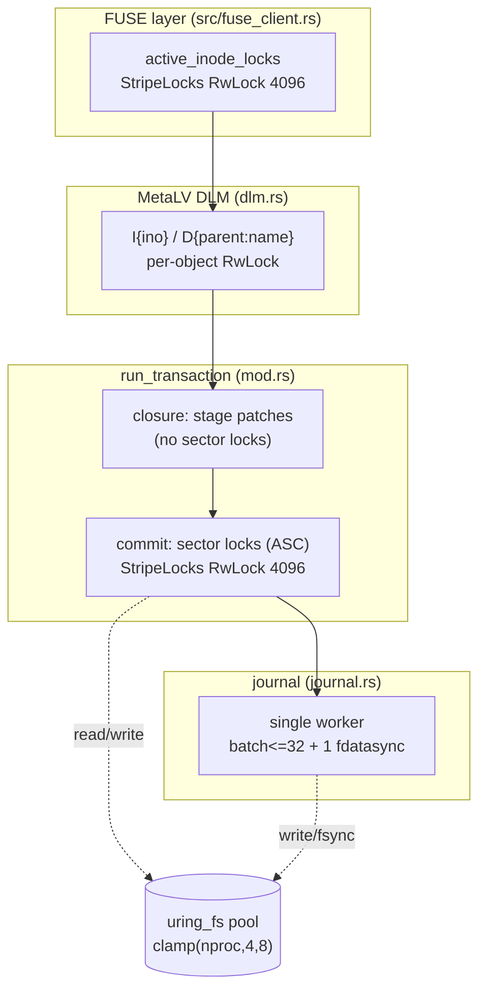

# Design Doc: Sector-Sharded Metadata Commit — Removing the Global `transaction_lock`

> **Superseded on v3 volumes** by `docs/design-cow-kv-metadata.md` (CoW KV btree commit pipeline). The sector-commit protocol described here remains the authoritative v2-volume path.

| | |
|---|---|
| **Title** | Uncapping small-file / metadata write throughput by replacing the global `transaction_lock` with sector-sharded commit locking |
| **Author** | _(placeholder — assign on review)_ |
| **Date** | 2026-07-06 |
| **Status** | **Draft** |
| **Repo** | `/home/justin/Source/squeezefs` (Rust, tokio, io_uring, FUSE; MetaLV block-backed metadata) |
| **Reviewers** | MetaLV / FUSE owners |
| **Related** | `AGENTS.md` (non-negotiables), commit `352d776` "stop inode sector RMW races causing ESTALE under concurrent mkdir", `9212c57` (SyncCoalescer), `c26dcef` (uring_fs MPMC pool), `f9fabdd`/`fec59bd` (fsync-barrier fixes) |

---

## Overview

The MetaLV metadata backend serializes **every** metadata mutation on a single per-volume `tokio::sync::Mutex<()>` named `transaction_lock` (`src/meta_backend/storage.rs:36`, held across the whole of `MetaLvBackend::run_transaction`, `src/meta_backend/mod.rs:113`). It is held across the transaction closure (reads + staged writes), the WAL append, **and** the region apply. The result: with 10 client threads, `mkdir` runs at ~5,150 ops/s @ 0.19 ms and small-file create+write at ~425 ops/s @ 2.35 ms — i.e. metadata mutations run essentially one-at-a-time. Now that the redundant fsync barrier is gone, a group-commit coalescer exists (`src/meta_backend/sync_coalescer.rs`), and `crate::uring_fs` is a concurrent MPMC pool (`src/uring_fs.rs:57`), `transaction_lock` is the last global serialization point on the metadata write path.

This document proposes replacing the global `transaction_lock` (and the coarse per-type `inode_lock`/`dentry_lock`/`xattr_lock`) with **sector-sharded RwLocks** keyed by disk sector offset, an **atomic in-RAM free-inode allocator**, and a commit protocol that holds each transaction's sector locks across **[read-modify-write → WAL append → apply]**. Transactions touching disjoint sectors commit fully concurrently; only transactions that physically share a 4 KiB sector serialize. The runtime consistency invariants the global lock guarantees (no lost same-sector RMW, no double-alloc) are preserved, and FUSE `fsync` durability semantics are unchanged. Metadata **crash recovery is scoped as unchanged from today** — in-place apply + group-commit `fdatasync`; `journal::replay` is deliberately **not** wired because the WAL has no `tail`/checkpoint discipline (§3.9). Expected result: `mkdir` (distinct parents) scales from a hard ~5.1 k ops/s ceiling to a 5–10× improvement, with the new bottleneck moving to the single journal worker and the io_uring worker-pool depth rather than a global mutex.

---

## Background & Motivation

### Current architecture (verified against source)

MetaLV stores everything in one block device / file per volume, at fixed byte offsets (`src/meta_backend/storage.rs`, `inode.rs`, `dentry.rs`, `xattr.rs`, `journal.rs`):

| Region | Offset | Granularity | Sharing |
|---|---|---|---|
| Superblock | `0` | sector 0 | singleton |
| Free-inode bitmap | `4096` | **one** 4 KiB sector | **every alloc touches it** |
| Inode table | `INODE_TABLE_START = 8192` | 256 B slot, **16 inodes / 4 KiB sector** | adjacent inodes share a sector |
| Dentry table | `DENTRY_TABLE_START = 8 MiB` | 512 B slot, **8 dentries / sector**; 32768 hash buckets → 131072 slots | adjacent buckets share a sector |
| Xattr blocks | `XATTR_BLOCK_START = 72 MiB` | 32 KiB (8 sectors) **per inode**, sector-aligned | disjoint per inode |
| Journal (WAL) | `journal_start = 104 MiB` | 4 MiB circular + 1 state sector | singleton |

The transaction machinery works through a task-local staging buffer (`ACTIVE_TX`, `src/meta_backend/storage.rs:45`):

- `write_blocks(offset, buf)` (`storage.rs:308`) — if `ACTIVE_TX` is set, pushes `(path, offset, buf.to_vec())` (a **full 4 KiB sector image**) into the task-local `Vec`; else writes direct.
- `read_blocks(offset, buf)` (`storage.rs:241`) — overlays the most recent staged write for that offset, else reads direct.
- `run_transaction` (`mod.rs:113`): takes `transaction_lock`, runs the closure under `ACTIVE_TX.scope(...)`, then groups staged ops by path; for the meta device it serializes `Vec<(u64, Vec<u8>)>` with `bincode`, calls `journal.write_record`, acquires the coarse per-type locks by offset range (`need_sb`/`need_inode`/`need_dentry`/`need_xattr`, `mod.rs:158-194`), and applies each op via `write_blocks_direct`.

The WAL (`src/meta_backend/journal.rs`) is a single-consumer `mpsc` worker (`journal_worker_loop`, `journal.rs:243`) that **already** batches up to 32 requests and does **one** `fdatasync` per batch when any request has `sync=true` (else a 50 ms deferred timer). `replay` (`journal.rs:78`) is *implemented* to re-apply committed records in log order — but it currently has **no caller** on the mount path (see invariant #3 below and §3.9).

Inode/dentry RMW helpers read the enclosing 4 KiB sector, patch one slot, and write the whole sector back (`write_inode_raw` `inode.rs:87`; `write_dentry_raw` `dentry.rs:83`). `read_inode`/`write_inode` (`inode.rs:56,103`) and `find_dentry`/`insert_dentry`/`remove_dentry` (`dentry.rs`) additionally take the **global** `inode_lock`/`dentry_lock`.

### Why the global lock exists — the three invariants

Per commit `352d776` and code inspection, `transaction_lock` guards three properties. **Each must survive the change.**

1. **Shared-sector read-modify-write races.** Inode slots (256 B) and dentry slots (512 B) share 4 KiB sectors. Two transactions RMW-ing *different slots of the same sector* each read the sector, patch their slot, and write the whole sector back — last writer wins and zeroes the sibling slot (`magic == 0` → `ESTALE`). This is exactly the `352d776` bug.
2. **Allocation collisions.** `alloc_inode_bit_locked` (`storage.rs:103`) reads the shared bitmap sector, scans from `free_ino_hint`, sets a bit, and **stages** the set-bit (invisible to other transactions until commit). Without global serialization, two concurrent `create`s read the same bitmap and allocate the **same** inode number.
3. **Runtime apply is per-sector-consistent.** `journal::replay` (`journal.rs:78`) *would* re-apply committed records in log (head-advance) order — but it has **zero callers** (`grep -rn "\.replay(" src tests benches` returns nothing; mount `src/main.rs:2007-2050` runs only `recover_active_blocks`, :2044), and, critically, the write path advances **only** `head` and never `tail` (`journal.rs:335`/`:341`), so the on-disk `tail..head` range is *not a valid replayable window* on any non-trivial volume (see §3.9). **So metadata crash recovery today is in-place-apply + `fdatasync` only — there is no live WAL redo.** What `transaction_lock` actually guarantees at runtime is that each 4 KiB sector's read-modify-write is not lost to a concurrent transaction; the sector locks preserve exactly that (invariant #1). This design therefore scopes crash-recovery as **unchanged from today** (§3.9) and does **not** claim a multi-sector WAL-redo guarantee that the code does not provide.

### Why we can now remove it

Two facts make sharding tractable and safe:

- **The DLM already serializes same-object mutations — with one audited exception.** Every mutator takes DLM locks *before* `run_transaction` (`DlmLockManager`, `src/meta_backend/dlm.rs`). Verified per caller: `MetaLvBackend::create` holds `I{parent}` exclusive (`mod.rs:343`) and updates only parent mtime/ctime, **no `nlink++`** (:383-392); routed **directory** `create` holds `I{parent}` exclusive (:935) and does bump parent `nlink` (:1058); `setattr` holds `I{ino}` (:668); `link` `I{ino}` (:475); `unlink` holds `I{parent}`+`I{child}` (:421, :1165/:1181); `destroy_inode` holds `I{ino}` (:744); `rename` sorts and locks all parent/dentry keys (:540-554, :1498-1523). So RMW-of-**value** on an inode slot is race-free per inode **for every path except one**: the routed regular-file "fast path" (`mod.rs:959-1004`) holds **no** `I{parent}` (`_parent_guard` is `Some` only `if is_dir`, :935-943) and touches no parent inode. §3.8 specifies exactly how the unified path re-establishes parent-slot safety there (shared `I{parent}` + a field-level timestamp patch); it is the crux of Issue 1 from review. Given that, the *only* unprotected races are (a) **different** inodes/dentries that share a physical sector, and (b) **allocation** (collision domain = the bitmap, not a single inode) — precisely invariants #1 and #2, both sector/allocation-scoped, not global.
- **The free-inode bitmap is derived state.** A slot is "allocated" iff its on-disk inode `magic == 0x4E4F4445` (`inode.rs:38`, checked at :70-82). The bitmap is a cache of the inode table and can be rebuilt on mount. So allocation *durability* rides on the in-place, `fdatasync`'d inode-slot write, and the bitmap need not be a per-op durability bottleneck.

### Pain points

- **Throughput cap:** metadata mutation rate is fixed at single-thread latency regardless of client concurrency (10 threads → no scaling).
- **A hack has already leaked into the code:** `RoutedMetaBackend::create` added an *un-journaled* "fast path" for regular files (`mod.rs:959-1004`) specifically to dodge `transaction_lock` — bypassing the journaled durability-barrier path and silently dropping the POSIX parent-mtime update (`mod.rs:960`: "Skip parent inode read"). This is duplicated logic we fold into the concurrent journaled path (§3.8).

---

## Goals & Non-Goals

### Goals

1. Remove the global per-volume `transaction_lock` as a serialization point for metadata mutations.
2. Let transactions touching **disjoint sectors** commit concurrently; serialize only genuine same-sector / same-allocation contention.
3. Preserve the runtime consistency invariants (#1 no lost same-sector RMW, #2 no double-alloc) under the new concurrent commit path, and **scope metadata crash-recovery as unchanged from today** (in-place apply + group-commit `fdatasync`; **no** WAL redo). Do **not** wire `journal::replay` — it is unsound as the WAL stands (no `tail`/checkpoint discipline, §3.9). Prove the change introduces no crash regression.
4. Preserve FUSE `fsync`/`fsyncdir` durability barriers (`FORCE_SYNC_TX`, `sync_all_devices`) and group-commit behavior.
5. Delete the un-journaled regular-file "fast path" and route all creates through the concurrent journaled path — gaining the (currently missing) **POSIX parent-mtime update** and a single uniform code path, with parent `nlink++` correctly gated to directories only (§3.8). This does **not** change crash behavior: with replay unwired, journaled and fast-path creates recover identically, so the deletion is justified by dedup + parent-mtime correctness, not durability.
6. Stay within `AGENTS.md` non-negotiables: io_uring-first, no dead code, latch-free hot paths, defined lock order, TDD, green verification gate.

### Non-Goals

- Changing the on-disk **metadata** format (inode/dentry/xattr/superblock layouts are unchanged). The WAL record format is discussed but the recommended design keeps it byte-compatible (full-sector images).
- Reworking the DLM lease/fencing subsystem, the data (NVMe/striped) path, or the FUSE transport.
- Distributed (multi-node) metadata coordination. This is intra-volume, intra-process concurrency.
- Fully eliminating same-directory serialization: `mkdir` stays serialized by exclusive `I{parent}` (POSIX parent `nlink` RMW), and same-dir regular `create` still serializes at the parent-sector commit (§3.8). Cross-directory operations are the horizontally-scalable target.

---

## Proposed Design

### 3.1 Summary of the change

| Concern | Today | Proposed |
|---|---|---|
| Cross-transaction serialization | one global `transaction_lock` | **sector-sharded `RwLock`** keyed by sector offset |
| Per-type locks | `inode_lock`, `dentry_lock`, `xattr_lock` (global) | folded into sector locks (+ a **per-bucket** dentry index lock) |
| Inode allocation | bitmap-sector RMW under `inode_lock` (stages set-bit) | **atomic in-RAM bitmap** (`fetch_or`/CAS); bitmap = derived, reconciled on mount |
| Staging unit | full 4 KiB sector image | **sub-sector patch** `(byte_offset, bytes)` (down to 16 B) |
| Apply | full-sector `write_blocks_direct` under per-type locks | per-sector **RMW-merge** under that sector's write lock |
| WAL record | `Vec<(u64 sector_offset, Vec<u8> full_sector)>` | **unchanged** — full-sector image computed under the sector lock at commit |
| Runtime consistency | global lock serializes all RMW | sector lock held across **[RMW-read → apply]** ⇒ no lost same-sector RMW (invariant #1). WAL append kept inside as the durability barrier; per-sector WAL order == apply order is preserved for a *possible future* checkpointed replay, but **replay is not wired** (§3.9) |

### 3.2 Sector-sharded lock

Reuse the existing, proven `StripeLocks<L, const N: usize>` (`src/fuse_client.rs:52`) — a fixed splitmix-hashed array already used for `active_inode_locks` and `BLOCK_FLUSH_LOCKS`. Add a per-volume instance keyed by **sector offset** to `MetaLvStorage`:

```rust
// src/meta_backend/storage.rs
use crate::fuse_client::StripeLocks; // existing splitmix stripe array

pub const SECTOR_LOCK_SHARDS: usize = 4096;

#[derive(Clone)]
pub struct MetaLvStorage {
    pub path: PathBuf,
    // REMOVED: superblock_lock, inode_lock, dentry_lock, xattr_lock, transaction_lock
    /// Serializes read-modify-write + apply of a single 4 KiB sector across
    /// transactions. Keyed by sector-aligned byte offset. Read guard = consistent
    /// non-tx reads; write guard = commit-time RMW+apply.
    pub sector_locks: Arc<StripeLocks<tokio::sync::RwLock<()>, SECTOR_LOCK_SHARDS>>,
    /// Per-bucket lock protecting the in-RAM dentry chain index (see 3.6).
    pub dentry_bucket_locks: Arc<StripeLocks<tokio::sync::Mutex<()>, SECTOR_LOCK_SHARDS>>,
    /// Atomic in-RAM free-inode bitmap (see 3.5). Authoritative at runtime.
    pub inode_alloc: Arc<InodeAllocator>,
    pub free_ino_hint: Arc<std::sync::atomic::AtomicU64>,
    pub dentry_index: Arc<scc::HashMap<u64, Vec<(u64, DiskDentry)>>>,
    pub dentry_by_offset: Arc<scc::HashMap<u64, (u64, DiskDentry)>>,
    pub dentry_occupied_offsets: Arc<std::sync::Mutex<std::collections::HashSet<u64>>>,
    pub dentry_index_initialized: Arc<tokio::sync::OnceCell<()>>,
}

impl MetaLvStorage {
    #[inline]
    pub fn sector_of(offset: u64) -> u64 { offset & !(SECTOR_SIZE as u64 - 1) }

    #[inline]
    pub fn sector_lock(&self, sector_offset: u64) -> &tokio::sync::RwLock<()> {
        // StripeLocks::get_inode_lock is a generic splitmix over a u64 key.
        self.sector_locks.get_inode_lock(sector_offset)
    }
}
```

`StripeLocks` is currently defined in `fuse_client.rs`; PR 1 lifts it to a small shared module (e.g. `src/stripe_locks.rs`) so both the FUSE layer and MetaLV can use it without a dependency cycle (no behavior change, `fuse_client.rs` re-exports).

Fixed-size striping (no per-offset allocation) keeps this latch-free-ish and zero-alloc on the hot path, satisfying the "latch-free hot path / traditional locks only for metadata transactions" rule in `AGENTS.md`.

### 3.3 Revised commit protocol (`run_transaction`)

The closure still stages, but stages **patches** rather than full sectors. Commit then, per distinct sector in **ascending offset order**: acquire the sector write lock, read the current sector, overlay this transaction's patches (the RMW), append the resulting full-sector image(s) to the WAL as one atomic record, `fdatasync` per journal policy, and apply — releasing all sector locks only after apply.

```mermaid
sequenceDiagram
    participant Op as create/mkdir/... (holds DLM I{ino}, D{parent:name})
    participant TX as run_transaction
    participant S as sector_locks (RwLock per 4KiB)
    participant J as journal worker (single, batched)
    participant D as device (uring_fs pool)

    Op->>TX: run closure (ACTIVE_TX set)
    Note over TX: reads via staging overlay + direct;<br/>writes staged as (offset, sub_off, bytes) patches;<br/>NO sector locks held here
    TX->>TX: group patches by sector; sort sector offsets ASC
    loop each sector (ascending)
        TX->>S: write().await  (deadlock-free: total order)
    end
    loop each sector (ascending)
        TX->>D: read current 4KiB sector (uring)
        TX->>TX: overlay patches -> new full-sector image (RMW)
    end
    TX->>J: write_record(Vec<(sector_off, image)>, sync)
    J->>D: circular WAL write + head sector (batched w/ disjoint txns)
    alt sync==true or flush_interval==0
        J->>D: fdatasync (group-commit coalesced)
    end
    J-->>TX: Ok
    loop each sector (ascending)
        TX->>D: write_blocks_direct(sector_off, image) (apply)
    end
    loop each sector
        TX->>S: drop write guard
    end
    TX-->>Op: Ok(result)
```

Sketch:

```rust
pub async fn run_transaction<F, Fut, R>(&self, f: F) -> Result<R>
where F: FnOnce() -> Fut, Fut: Future<Output = Result<R>> {
    use crate::meta_backend::storage::ACTIVE_TX;
    if ACTIVE_TX.try_with(|_| ()).is_ok() {
        return f().await;                 // nested tx: reuse parent staging
    }

    // Patch = (byte offset, bytes). Offsets need not be sector-aligned.
    let tx: Arc<Mutex<Vec<(PathBuf, u64, Vec<u8>)>>> = Arc::new(Mutex::new(Vec::new()));
    let ret = ACTIVE_TX.scope(tx.clone(), f()).await?;   // NO global lock

    let patches = std::mem::take(&mut *tx.lock().unwrap());
    if patches.is_empty() { return Ok(ret); }

    // Split meta-device patches from ad-hoc file patches (unchanged behavior).
    let (meta_patches, other) = split_by_path(patches, &self.storage.path);
    apply_foreign_paths(other).await?;    // non-metadata files: direct uring writes

    // Group meta patches by sector, sort ascending for deadlock-free acquisition.
    let mut by_sector: BTreeMap<u64, Vec<(u64, Vec<u8>)>> = BTreeMap::new();
    for (off, buf) in meta_patches {
        by_sector.entry(MetaLvStorage::sector_of(off)).or_default().push((off, buf));
    }

    let sync = FORCE_SYNC_TX.try_with(|v| *v).unwrap_or(false);

    // 1. Acquire all sector write locks in ascending order (total order => no deadlock).
    let mut guards = Vec::with_capacity(by_sector.len());
    for &sector in by_sector.keys() {
        guards.push(self.storage.sector_lock(sector).write().await);
    }

    // 2. RMW-read each sector under its lock, overlay patches -> full-sector images.
    let mut images: Vec<(u64, Vec<u8>)> = Vec::with_capacity(by_sector.len());
    for (&sector, sector_patches) in &by_sector {
        let mut image = vec![0u8; SECTOR_SIZE];
        self.storage.read_blocks_direct(sector, &mut image).await?;
        for (off, bytes) in sector_patches {
            let start = (off - sector) as usize;
            image[start..start + bytes.len()].copy_from_slice(bytes);
        }
        images.push((sector, image));
    }

    // 3. One atomic WAL record (SAME format as today: Vec<(sector_off, image)>).
    let record = bincode::serialize(&images).map_err(io_invalid)?;
    self.journal.write_record(&self.storage, &record, sync).await?;

    // 4. Apply. Locks still held => per-sector WAL order == apply order.
    for (sector, image) in &images {
        self.storage.write_blocks_direct(*sector, image).await?;
    }
    // 5. guards drop here (reverse order irrelevant for correctness).
    Ok(ret)
}
```

Key points:

- **WAL format & write path unchanged.** Each image is a complete, valid 4 KiB sector snapshot produced *after* reading the current on-disk sector under the write lock; the WAL append remains the group-commit `fdatasync` / durability barrier. The record format is untouched (so a *future* checkpointed replay could use it), but **this design does not replay the WAL** — crash recovery is in-place apply + `fdatasync`, unchanged from today (§3.9).
- **RMW-of-value is safe** because the closure's read of an inode's own mutable fields (nlink, mode, size) is protected by that inode's DLM lock held for the whole op (closure through commit): **exclusive** `I{ino}`/`I{parent}` for value-mutating ops (`setattr`, `link`, `unlink`, `mkdir`), and **shared** `I{parent}` for regular-file create, which only touches the parent's *timestamp* bytes via a field-level patch and never its value fields (§3.8). No op can mutate *the same slot bytes* between another op's read and apply; only sibling slots (or, for the parent, non-overlapping byte ranges) change, and those are merged by the per-sector RMW.
- **Staging changes from full-sector to patch granularity.** `write_inode_raw`/`write_dentry_raw`/bitmap persistence/parent-timestamp touch stage `(byte_offset, bytes)` sub-sector patches (down to a 16-byte mtime+ctime patch) instead of a full sector. This is what lets two applies to *different byte ranges* of one sector merge instead of clobber. The read-overlay path is updated to match — see §3.4.

### 3.4 Read path & the staging overlay

**Non-transactional reads** (`getattr`, `lookup`, `readdir`, `setattr`'s pre-read) take the sector **read** lock so they never observe a sector mid-commit:

```rust
pub async fn read_inode(storage: &MetaLvStorage, index: u64) -> Result<DiskInode> {
    let offset = INODE_TABLE_START + index * INODE_SLOT_SIZE as u64;
    let sector = MetaLvStorage::sector_of(offset);
    // Inside a tx, staging overlay already gives a consistent view; don't re-lock.
    let _g = if ACTIVE_TX.try_with(|_| ()).is_err() {
        Some(storage.sector_lock(sector).read().await)
    } else { None };
    read_inode_raw(storage, index).await
}
```

Read locks don't contend with each other, and only briefly with the (short) commit write window for that specific sector. Inside a transaction we rely on the staging overlay + the DLM lock, and **must not** take the sector lock (it is taken at commit; taking it in the closure would violate acquisition order and risk reentrancy on the non-reentrant tokio lock). This is the single most important reentrancy rule of the design.

**Read-your-own-writes overlay (must change for sub-sector patches).** Today `read_blocks` (`storage.rs:249-259`) matches a staged entry only when it is a *full-sector image at the exact offset* (`*off == offset && data.len() == buf.len()`). Once staging holds sub-sector patches, an RMW helper doing `read_blocks(sector)` then slicing out a 256 B / 512 B slot would no longer find a matching full-sector entry and would read the **stale on-disk sector**, missing this transaction's own staged slot (e.g. `create` stages `new_ino`'s slot then calls `read_inode(new_ino)`, `mod.rs:394`, to build its return value). The overlay must be rewritten to merge **all** staged patches intersecting the requested range, in stage order:

```rust
// read_blocks(offset, buf): after fetching the direct sector into buf,
// overlay every staged patch for this path that overlaps [offset, offset+buf.len()):
ACTIVE_TX.try_with(|tx| {
    for (p, off, bytes) in tx.lock().unwrap().iter() {           // stage order
        if p != &self.path { continue; }
        let (lo, hi) = (*off, off + bytes.len() as u64);
        let (rlo, rhi) = (offset, offset + buf.len() as u64);
        if lo < rhi && rlo < hi {                                 // intersects
            let s = lo.max(rlo);
            buf[(s - rlo) as usize .. (hi.min(rhi) - rlo) as usize]
                .copy_from_slice(&bytes[(s - lo) as usize .. (hi.min(rhi) - lo) as usize]);
        }
    }
});
```

Later patches overwrite earlier ones on overlap (stage order = last-writer-wins within the transaction). This overlay change is **in PR 3's scope** (not PR 4) and is covered by a dedicated read-your-own-writes unit test (Test Strategy T2).

### 3.5 Atomic in-RAM inode allocator

```rust
pub struct InodeAllocator {
    words: Box<[std::sync::atomic::AtomicU64]>,  // 1 bit per inode index
    limit: u64,                                   // min(20000, max_inodes)
    hint:  std::sync::atomic::AtomicU64,
}

impl InodeAllocator {
    /// Claim a free inode atomically. Returns Err if full. No global lock.
    pub fn alloc(&self) -> Result<u64> {
        let start = self.hint.load(Relaxed).max(2);
        for ino in (start..self.limit).chain(2..start.min(self.limit)) {
            let (w, b) = ((ino / 64) as usize, ino % 64);
            let mask = 1u64 << b;
            // CAS-free set: fetch_or returns prev; if our bit was 0 we won.
            if self.words[w].fetch_or(mask, AcqRel) & mask == 0 {
                self.hint.store(ino + 1, Relaxed);
                return Ok(ino);
            }
        }
        Err(SqueezefsError::InvalidOperation("Inode table full".into()))
    }
    pub fn free(&self, ino: u64) {
        let (w, b) = ((ino / 64) as usize, ino % 64);
        self.words[w].fetch_and(!(1u64 << b), AcqRel);
        let _ = self.hint.fetch_min(ino.max(2), Relaxed);
    }
    pub fn is_set(&self, ino: u64) -> bool { /* load & mask */ }
}
```

- **No double-allocation:** `fetch_or` is atomic; exactly one caller observes the 0→1 transition.
- **Seeding on mount (authoritative):** the bitmap is *derived* from the inode table, so on mount scan the inode table region and set a bit iff the slot's `magic == 0x4E4F4445`. This is bounded (`≤ limit` inodes, ~20000; a batched sector scan like `ensure_dentry_index`, `storage.rs:153`) and self-heals any leaked/torn bitmap bits. Because replay is **not** wired (§3.9), the in-place inode table *is* the authoritative post-crash state, so seeding directly from it is correct with no redo-vs-seed ordering concern (the round-1 "seed after replay" ordering, review Issue 11, is moot). The mount sequence is fixed in §3.9.
- **`free()` MUST run only after the destroy transaction durably commits** (post-`write_record`, ideally post-apply) — **never inside the closure**. This preserves today's `destroy_inode` invariant (`mod.rs:764-765`: "Bitmap free + zero slot must be one critical section so a concurrent create cannot reallocate the bit before the slot is cleared"). Today that atomicity is provided by `inode_lock` + `I{ino}`; but a *future* `create` reusing ino X cannot pre-acquire `I{X}` (X is unknown until `alloc()` returns), so there is **no DLM exclusion** between `destroy_inode(X)` and a later `create` that reuses X. If `free(X)` became visible before the destroy's slot-zero durably applied, a concurrent `create` could `alloc(X)`, write a fresh inode into X's slot, and the destroy's later zero-apply would clobber it (the per-sector lock serializes the *physical* writes but not this *logical* order). Rule: the destroy transaction zeroes the slot as part of its commit, and only its success path calls `inode_alloc.free(X)`. See Test Strategy T3 (`test_destroy_realloc_no_clobber`).
- **Durability of allocation** rides on the in-place inode-slot write + group-commit `fdatasync` (§3.3), not on the bitmap sector, so the bitmap need not be journaled per op. The single bitmap sector (offset 4096) is thereby removed as a global serialization point (it would otherwise be the immediate new bottleneck). See the bitmap-persistence decision in Data Model Changes (resolving former Open Question 1).
- **Alloc-side rollback:** if a transaction fails after `alloc()`, the error path calls `inode_alloc.free(ino)` via an RAII drop-guard. Mount-time reconciliation (seed-from-inode-table) is the backstop for a crash in the alloc→commit window (a leaked bit that seeding clears).
- **`get_allocated_inode_count` is rewired** (`mod.rs:217-235` today reads the on-disk bitmap sector) to `popcount` the in-RAM `InodeAllocator` words, since the on-disk bitmap is no longer authoritative. This is required for Test Strategy T1's "allocated count == total" assertion to remain meaningful (review Issue 9); listed in "API / Interface Changes" and PR 2/PR 4.

### 3.6 Dentry index concurrency

`insert_dentry`/`remove_dentry` mutate three in-RAM structures **during the closure** (not staged): `dentry_index` (parent → chain), `dentry_by_offset`, and `dentry_occupied_offsets`. Today `dentry_lock` serializes both the disk RMW and these mutations. Sector locks cover the disk RMW; the **in-RAM chain** needs its own serialization because two different names in the same parent take different `D{parent}:{name}` DLM locks and can run concurrently.

Design (revised to remove the review-flagged contradiction):

- **Per-bucket lock held from closure *through* the post-commit index apply.** Acquire `dentry_bucket_locks.get_inode_lock(bucket)` (bucket = `dentry_hash(parent, name) % MAX_HASH_BUCKETS`, `dentry.rs:140`) at first touch of a bucket in the closure and hold it until *after* the transaction's post-commit in-RAM index delta is applied — not merely to closure end. This is the key correction over the first draft, which contradictorily said "released before commit" (old lock-order 4b) while *also* deferring the index delta to post-commit: if the lock were released at closure end, a second same-bucket insert could traverse a stale in-RAM chain (the first insert's tail delta not yet applied) and link to the same predecessor → lost/duplicated dentry. Holding through the index apply makes {read chain → find tail → link predecessor `next_ptr` → apply index delta} one critical section. Cost: same-bucket ops serialize across the journal round-trip; with 32768 buckets, same-`hash(parent,name)` collisions are rare, so different names in one parent usually hit different buckets and stay concurrent.
- **In-RAM index delta applied post-WAL-success (R4 fix).** The closure records the intended `dentry_index`/`dentry_by_offset` delta but does **not** apply it; `run_transaction` applies both the disk image and the index delta only after `write_record` succeeds, so a WAL failure leaves neither (no RAM⧸disk divergence). Because the bucket lock spans this apply (previous bullet), the two are consistent.
- **Free-slot reservation is rolled back on commit failure.** The overflow-slot claim (`dentry_occupied_offsets` `std::sync::Mutex`, find-free + insert in one critical section, `dentry.rs:174-184`) happens in the closure. On any commit/WAL failure the reserved offset is released from `dentry_occupied_offsets` on the error path (the same drop-guard mechanism as alloc rollback in §3.5), preventing leaked overflow slots until remount.
- **`scc::HashMap` entry ops** (`entry_sync(...).get_mut()`, `retain`) remain per-entry-locked and safe.
- **Multi-bucket operations (`rename`, `RENAME_EXCHANGE`) acquire bucket locks in ascending bucket-index order**, mirroring the DLM's existing sorted-key discipline (`mod.rs:540-554`, `:1498-1523`), and hold them for the whole rename closure through its post-commit index apply. Ascending-index acquisition + the DLM already ordering the underlying names gives deadlock freedom for the ≤2-bucket case. (`rename` non-exchange = remove+insert, `mod.rs:601-615`; exchange = remove+remove+insert+insert, `:568-591`.)

Because a dentry chain lives within a single bucket and same-bucket ops are serialized by the bucket lock (held through commit), the predecessor-`next_ptr` RMW touches only slots owned by that bucket's serialized operations; cross-bucket operations that merely share a physical sector are merged safely by the per-sector RMW at commit.

### 3.7 End-to-end concurrency picture



Lock order (matches and extends `AGENTS.md` "Lock order & connection scope"): **(1)** `active_inode_locks` → **(2)** `lease_locks` → **(3)** `BLOCK_FLUSH_LOCKS` → **(4) MetaLV backend**, and *within* (4): **(4a)** DLM `I{ino}`/`D{parent:name}` (function-scoped; `I{parent}` is **shared** for regular-file create, **exclusive** for mkdir/setattr/unlink/rename — §3.8) → **(4b)** dentry bucket lock(s) (acquired in the closure in ascending bucket order, **held through the post-commit index apply** per §3.6) → **(4c)** sector locks (acquired at commit in ascending offset order). Invariant: **4a → 4b → 4c**, buckets acquired ascending, sectors acquired ascending; because a bucket lock is held across 4c acquisition, 4b-before-4c must hold on every path. No path acquires an outer level while holding an inner one; the closure holds no sector locks. The stale in-code lock-order comment (`fuse_client.rs:41-51`, still reads "DLM/Redis — network locks via Garnet") is rewritten to this ordering as part of PR 3/PR 4 (review Issue 13). Deadlock freedom is argued in Risk R2.

### 3.8 Unifying `create`: deleting the fast path *safely* (resolves review Issue 1)

`RoutedMetaBackend::create`'s regular-file branch (`mod.rs:959-1004`) bypasses the journal to dodge `transaction_lock`, holds **no** `I{parent}` (`:935-943`), and skips the parent-inode update entirely. The journaled same-volume path it would merge into is **directory-specialized**: it sets child `nlink = 2` (`:1034`) and does parent `nlink += 1` **unconditionally** (`:1058`). So the branch cannot be deleted by naïvely routing regular-file creates through that path — that would corrupt parent `nlink` (regular files must not bump it) and, without `I{parent}`, race on the parent slot. The first draft glossed this; here is the explicit, concurrency-safe unified `create`.

**Rule set for the unified path:**

1. **`nlink` gating.** Child `nlink` comes from `DiskInode::new` (`= 1`, `inode.rs:43`); directories are then set to `2`. Parent `nlink += 1` is applied **iff `is_dir`**. Regular-file create never touches parent `nlink`.
2. **Parent DLM lock granularity — shared vs exclusive.** Regular-file create takes **`I{parent}` shared** (`dlm.lock_shared`, `dlm.rs:35`); `mkdir`, `setattr(parent)`, `unlink`, `rename` take **`I{parent}` exclusive**. Two same-dir regular creates hold shared concurrently; any op that RMW-mutates parent *value* fields (nlink/mode/size) holds exclusive and is therefore mutually excluded from creates. This is what lets a create's parent-timestamp patch compose safely with a concurrent full-slot writer (below), while keeping same-dir creates concurrent.
3. **Parent mtime/ctime via a field-level patch (not a full-slot write).** Regular-file create updates parent mtime/ctime by staging a **16-byte sub-sector patch** at `parent_slot_offset + offsetof(DiskInode, mtime)` (mtime@24, ctime@32 are adjacent `u64`s; `inode.rs:14-16`). At commit the per-sector RMW overlays only those 16 bytes onto the freshly-read parent sector, so nlink/mode/size (read fresh at commit) are preserved. Two concurrent creates' timestamp patches are last-writer-wins on ~now (benign). Because value-mutating parent ops hold `I{parent}` exclusive, no full-slot parent write is ever concurrent with a create's field patch, so the "full-slot writer clobbers the field-patcher" hazard cannot occur; the shared/exclusive discipline also orders each create's commit strictly before or after any exclusive parent op's read.

Why not make parent `nlink++` a field patch too (to also parallelize same-dir `mkdir`)? Because `nlink` is a value that must not lose increments, and an increment-delta patch is **not idempotent under replay** (a replayed "increment" after a durable increment double-counts). So `mkdir` keeps exclusive `I{parent}` (whole-op serialization of the parent `nlink` RMW); same-dir `mkdir` stays serialized (POSIX-required), cross-dir `mkdir` is concurrent. This matches the Non-Goals.

**Result:** the ~80-line un-journaled branch is deleted (no dead code); regular-file creates gain the (currently missing) **POSIX parent-mtime update** and a single uniform code path. They do **not** gain multi-sector crash-atomicity: with replay unwired (§3.9), journaled and fast-path creates recover identically (in-place apply + `fdatasync`), so the deletion is justified by dedup + parent-mtime correctness, not durability. Concurrency: cross-directory create/mkdir fully concurrent; same-directory *regular* create runs its closure (atomic alloc, dentry insert) concurrently and serializes only at the parent-sector commit RMW (journal-append latency, deferred-flush — tens of µs, not a whole-op lock); same-directory `mkdir` stays serialized by exclusive `I{parent}`.

**Perf consequence (re-derived, review Issue 1/7/17).** The measured small-file workload (`squeezefs bench … --small-size 4`) creates all files in **one** directory and `fsync`s each (`src/main.rs:3789-3796`), so it is fsync-bound at ~2.35 ms/op; the added parent-timestamp field-patch rides inside that same transaction and is dwarfed by the per-file `fdatasync`, so it does **not** regress that number. For a **non-fsync same-parent create microbench**, however, the unified path is a **bounded, accepted regression** vs. today's behavior — and the correct comparison is the **fast path** (`mod.rs:959-1004`: no WAL write, no parent read/update, no parent-sector contention), **not** `transaction_lock` (regular-file creates were never `transaction_lock`-bound). The added parent-sector RMW + WAL round-trip + same-parent commit serialization is the price of the POSIX parent-mtime update and a uniform path. T5 sets an explicit regression **budget** for this microbench (not "must not regress"), while the fsync-bound `--small-size 4` mount bench must not regress.

**Sequencing — no milestone has two writer safety models (resolves review Issue 19).** The regular-file fast path (`mod.rs:959-1004`) is a *second* sector-lock-unaware writer: it takes the global `inode_lock` (`:974`) and writes the inode/dentry sectors **directly** (no `run_transaction`, no sector lock), and its own comment (`:956-957`) says *"Sector safety is still provided by inode_lock / dentry_lock RMW."* So it **must not be live alongside the sector-locked path**. It is therefore **flag-gated, not left dangling**: the fast-path branch runs **only when `SQUEEZEFS_META_SECTOR_LOCKS` is off** (the legacy path, together with the global locks it needs), and when the flag is **on** (from PR 4) regular-file `create` is routed through the sector-locked `run_transaction`. Thus in the flag-**on** milestone there is exactly one writer model (sector locks); in the flag-**off** milestone there is exactly one writer model (global locks + fast path). The two never coexist, so the `352d776` clobber cannot recur. PR 4 lands the flag-on unified `create` with a **temporary** exclusive `I{parent}` + full-slot parent write **and `nlink` gated to `is_dir`** (correctness); PR 5 refines *only the flag-on path* to shared `I{parent}` + the 16-byte field-patch (§3.8 end state); the fast-path branch and the legacy locks are deleted together in **PR 8** (they remain the flag-off rollback path until then — review Issue 20).

### 3.9 Metadata crash-recovery scope — why `journal::replay` is **not** wired (resolves review Issue 15)

Round 1 proposed wiring `journal::replay` on mount. **That is unsound as the WAL stands, so it is dropped.** Verified in `src/meta_backend/journal.rs`: the write path advances **only** `head` (`state.head = (state.head + padded_len) % circular_size`, `:335`) and re-writes the state sector with `state.tail` **unchanged** (`:341`); `tail` is advanced **exclusively** by `replay` itself (`:184`, `tail = head`). The circular region is `journal_size − 1 sector` ≈ 4 MiB − 4 KiB ≈ 1023 records (`journal.rs:104`; sizing `mod.rs:87`). Consequences:

- On existing volumes `tail = 0` **forever** (replay never runs today) while `head` grows and wraps; after a wrap `tail = 0` no longer sits on a record boundary.
- Nothing bounds `head − tail`: a single long-lived mount that writes > ~4 MiB of records wraps the log, so `tail..head` spans the wrap.

Consuming `tail..head` in that state is a **partial/misordered redo** — it can re-apply a superseded sector image over the authoritative in-place value and stop (at the wrap or a SHA-256 mismatch, `journal.rs:154-160`) **before reaching `head`**, silently corrupting healthy metadata **on a routine mount, no crash required**. Making replay sound needs a real **checkpoint discipline** (durably advance `tail` past records whose in-place apply has been `fdatasync`'d, bounding `head − tail`), a **one-time migration** resetting `tail = head` without replaying on existing (uncheckpointed) volumes, and over-full detection. That is a **separate crash-recovery subsystem** and a large new surface in the durable core — out of scope for removing `transaction_lock`, and itself a corruption risk if rushed.

**Decision (review Issue 15, option b): do not wire replay; scope metadata crash-recovery as *unchanged from today* — in-place apply + group-commit `fdatasync`, no multi-sector WAL redo.** This is honest about the code and introduces **no crash regression**:

- **Runtime consistency comes from the sector locks, not replay.** Invariants #1 (no lost same-sector RMW) and #2 (no double-alloc) hold because each sector's read-modify-write is serialized under its sector write lock and allocation is atomic in RAM — exactly what `transaction_lock` provided at runtime.
- **Multi-sector crash-atomicity was never provided and is not regressed.** Today `run_transaction` applies each sector in place with a batched/deferred `fdatasync` and never replays, so a crash mid-apply already leaves a torn transaction (inode written, dentry not) with nothing to repair it. The sector-lock design has the same property: disjoint-sector applies may interleave on crash (independent ops — fine), and same-sector content stays per-sector-consistent (sector lock). No transaction durable-before-crash becomes less durable, and no sector that was consistent under `transaction_lock` becomes inconsistent. Invariant #3 is thus **"WAL append precedes in-place apply for the durability barrier,"** not "replay reconstructs runtime order."
- **The WAL write path stays, unchanged.** It is the existing group-commit `fdatasync` / durability-barrier mechanism (`journal_worker_loop`, batched, `:352`); the commit still writes the record *before* applying in place, and the record format is untouched, so a future checkpointed replay (if ever built) would already have correctly-ordered records to work with.
- **`journal::replay` and `read_circular` remain uninvoked.** Their pre-existing dead-code status (a standing `AGENTS.md` violation) is **orthogonal** to removing `transaction_lock`, and is resolved **separately**: either build the checkpointed-replay subsystem above, or **delete** them. This design neither calls nor depends on replay; the cleanup PR (last in the plan) deletes the unsound uninvoked `replay`/`read_circular` unless a dedicated crash-recovery project claims them first.

**Mount reconciliation still runs** (needed to build the in-RAM allocator and to keep the legacy on-disk bitmap consistent for rollback), now with **no replay step**:

```text
for each MetaLvBackend volume, in order (main.rs mount, before serving FUSE):
  1. storage.seed_inode_alloc_from_table()   # build in-RAM InodeAllocator from magic-valid inode slots (authoritative)
  2. refresh on-disk bitmap cache from (1)    # keep the legacy allocator's on-disk bitmap consistent (see Rollout §6)
  3. recover_active_blocks(...) / recover_staging(...)   # existing block/staging recovery (reads inode/layout metadata)
  # then: serve FUSE
```

Because nothing replays, the in-place inode table *is* the authoritative post-crash state, so seeding directly from it (step 1) is correct and needs no redo-vs-seed ordering (review Issue 11 is moot). The same reconciliation is also run on **clean unmount** (Rollout §6) so a subsequent mount by a pre-reconciliation binary reads a consistent bitmap.

---

## API / Interface Changes

All changes are **internal** to `crate::meta_backend` and `crate::fuse_client`; no public FS/CLI surface changes.

> **This diff is the post-PR-8 *end state*, not the PR 4 change (review Issue 20).** During the **PR 4 → PR 8** window the new sector-lock fields **coexist with** the legacy `superblock_lock`/`inode_lock`/`dentry_lock`/`xattr_lock`/`transaction_lock` + `alloc_inode_bit_locked` + the regular-file fast path: the legacy set is **retained behind `SQUEEZEFS_META_SECTOR_LOCKS=off`** as the rollback lever (Rollout §2/§6) and is deleted only in **PR 8**. PR 4 *stops using* the legacy locks/allocator/fast-path when the flag is **on**; it does not remove them.

**`MetaLvStorage` (`storage.rs`) — post-PR-8:**

```diff
- pub superblock_lock: Arc<tokio::sync::Mutex<()>>,
- pub inode_lock: Arc<tokio::sync::Mutex<()>>,
- pub dentry_lock: Arc<tokio::sync::Mutex<()>>,
- pub xattr_lock: Arc<tokio::sync::Mutex<()>>,
- pub transaction_lock: Arc<tokio::sync::Mutex<()>>,
+ pub sector_locks: Arc<StripeLocks<tokio::sync::RwLock<()>, SECTOR_LOCK_SHARDS>>,
+ pub dentry_bucket_locks: Arc<StripeLocks<tokio::sync::Mutex<()>, SECTOR_LOCK_SHARDS>>,
+ pub inode_alloc: Arc<InodeAllocator>,
```

**Allocation:**

```diff
- pub async fn alloc_inode_bit_locked(&self) -> Result<u64>   // reads+stages bitmap sector
- pub async fn free_inode_bit_locked(&self, ino: u64) -> Result<()>
+ // allocation is now synchronous, lock-free, in-RAM:
+ // storage.inode_alloc.alloc()?  /  storage.inode_alloc.free(ino)
+ pub async fn seed_inode_alloc_from_table(&self) -> Result<()>   // mount reconcile
```

**Helper split (reentrancy discipline):** public `read_inode`/`write_inode`/`find_dentry`/`insert_dentry`/`remove_dentry`/xattr helpers stop taking global locks; they take the sector **read** lock only when *not* inside a transaction. The `*_raw` variants (already present for inode/dentry) remain the in-transaction primitives. `StripeLocks` moves to `src/stripe_locks.rs` and is re-exported from `fuse_client` (source-compatible).

**Staging record type** (`ACTIVE_TX`, `storage.rs:45`): value stays `(PathBuf, u64, Vec<u8>)`, but the `u64` is now a **byte offset** (patch), not required to be sector-aligned; `write_blocks`'s alignment assertion moves to apply time. No cross-process/on-disk impact (it is a task-local).

**`read_blocks` overlay (`storage.rs:249-259`)** is rewritten from "match a full-sector entry at the exact offset" to "overlay every staged patch intersecting the requested range, in stage order" (algorithm in §3.4). Correctness-critical for read-your-own-writes once staging is sub-sector; lands in PR 3 (review Issue 6).

**`get_allocated_inode_count` (`mod.rs:217-235`)** stops reading the on-disk bitmap sector and instead `popcount`s the in-RAM `InodeAllocator` words (review Issue 9). Callers: `RoutedMetaBackend::get_volume_health` (`mod.rs:824`) and Test Strategy T1.

---

## Data Model Changes

- **On-disk metadata layout:** unchanged (superblock/inode/dentry/xattr/journal offsets and structs identical).
- **WAL record format:** unchanged (`Vec<(u64 sector_offset, Vec<u8> 4KiB image)>`) and the WAL write path is unchanged — it remains the group-commit `fdatasync` mechanism (§3.9). Keeping the format intact means a future checkpointed-replay effort could use it without migration; **this design does not replay it** (§3.9). (The alternative patch-format WAL is rejected regardless — see Alternatives.)
- **Free-inode bitmap sector (offset 4096):** demoted from authoritative to a **rebuildable cache**, but **kept consistent for the legacy allocator** (resolving former Open Question 1 and review Issue 5). Reconciliation runs from the inode table (`seed_inode_alloc_from_table`, §3.9 step 1) and writes the reconciled sector back (§3.9 step 2) on **both mount and clean unmount** (review Issue 18), so *either* code path — the new in-RAM `InodeAllocator` or the legacy `alloc_inode_bit_locked` (which reads offset 4096, `storage.rs:103-133`) — sees a correct bitmap. During new-path operation the on-disk bitmap is refreshed lazily/coalesced (not per-op-journaled), so it never becomes a hot per-op sector. **Rollback interaction (was the Issue 5 hazard):** because the legacy allocator trusts the on-disk bitmap, rolling the flag back is a **remount with the flag off**, not a live in-process flip; mount reconciliation then guarantees the legacy path reads a bitmap consistent with the inode table. Reverting to a **pre-reconciliation binary** after an *unclean* new-path session needs one reconciling mount first (Rollout §6). No on-disk format change; forward/backward compatible.
- **Superblock:** unchanged (`version: 2`).

---

## Alternatives Considered

### Alt A — Move region apply into the journal worker (prompt option 3b)

Have the single journal worker durably log a batch, then apply those writes in log order. WAL-order == apply-order becomes automatic.

- **Fatal flaw:** it does **not** fix invariant #1. The RMW *read* still happened earlier, in the closure, against a stale snapshot; a full-sector image staged from that stale read still clobbers a sibling slot when the worker applies it. To fix that, the *read* must also move into the worker — which serializes **all** reads through one task, recreating exactly the global bottleneck we are removing.
- Also complicates buffer ownership, backpressure (the worker channel is bounded at 1024), and error propagation (the awaiting caller must learn of an apply failure that now happens in a detached task).
- **Verdict: rejected.** Chosen design keeps apply in the calling task, parallel across disjoint sectors; the worker does only the (fast, batched) WAL append. This is prompt option **3a** ("hold sector lock(s) across [append + apply]"), which we adopt.

### Alt B — Patch-granularity WAL (stage + journal + replay all as `(off, sub_off, bytes)`)

Store sub-sector patches in the WAL and replay them as RMW.

- Pro: smallest WAL records; conceptually clean.
- Con: **breaks the WAL on-disk format** across the upgrade boundary. A crash with an in-flight old-format (full-sector) journal followed by a new-format replay is a correctness hazard requiring a journal version bump + dual-format replay. It buys nothing over computing the full-sector image under the sector lock (Alt: chosen design), which keeps replay byte-identical.
- **Verdict: rejected** in favor of "patch staging, full-sector-image WAL." We keep patches only in the volatile task-local staging buffer.

### Alt C — Single global `scc::HashMap<sector, Arc<RwLock>>` of dynamically-created locks

Allocate a lock per touched sector on demand.

- Pro: no hash collisions (distinct sectors never share a lock).
- Con: allocation + map churn on the hot path (violates zero-alloc/latch-free intent), plus lifetime/eviction complexity. `StripeLocks` (fixed 4096-way splitmix array, already in the tree) gives O(1) zero-alloc access; a hash collision only causes two unrelated sectors to briefly serialize — harmless for correctness, negligible at 4096 shards.
- **Verdict: rejected;** reuse `StripeLocks`.

### Alt D — Keep `transaction_lock`, shard by inode-number range / sub-volume

Partition the volume into N independent lock domains.

- Con: doesn't help same-domain contention, needs range routing, and the bitmap/dentry-table remain shared across domains. Coarser and less principled than sector sharding.
- **Verdict: rejected.**

---

## Security & Privacy Considerations

- **Threat model unchanged.** This is an intra-process concurrency refactor; it introduces no new network surface, no new file formats read from untrusted input, and no new `unsafe` beyond what the existing `zerocopy` casts already use (none added).
- **Availability / DoS:** correctness under concurrency is the security-relevant property — a metadata race that zeroes an inode slot (`magic 0` → `ESTALE`) is an integrity failure. The design's explicit goal is to **eliminate** that class (invariant #1) while lifting the throughput cap, so it is net-positive for resilience under load.
- **Fencing/leases untouched:** DLM fencing-token semantics (`AGENTS.md` DLM section) are orthogonal and preserved; sector locks sit strictly *below* the DLM in the lock order.
- **No secrets on this path;** crypto/compression (`src/crypto_compress.rs`) applies to the data path, not metadata sectors.

---

## Observability

Extend the existing metrics surface (`crate::fuse_client::METRICS`, exposed via the virtual **stats** inode per `AGENTS.md` "Stats surface"). Prefer these live signals over ad-hoc logging.

New counters/gauges:

| Metric | Type | Purpose |
|---|---|---|
| `meta_sector_lock_wait_ns` | histogram/sum | contention on sector write locks (the new hot lock) |
| `meta_sector_lock_contended` | counter | commits that blocked on a busy sector (same-sector contention rate) |
| `meta_tx_concurrency` | gauge | in-flight `run_transaction` commits (proves the cap is gone) |
| `meta_inode_alloc_cas_retries` | counter | allocator contention on the bitmap words |
| `meta_inode_alloc_reconciled` | counter (mount) | leaked bits healed by inode-table seed |
| `meta_device_syncs` | counter (exists, `mod.rs:104`) | group-commit effectiveness (barriers per op) |
| `meta_wal_batch_size` | histogram | journal-worker batch fill (headroom before it becomes the bottleneck) |

Alerting/CI signals:
- Regression guard: `meta_tx_concurrency` p50 > 1 under the concurrency bench (else the cap silently returned).
- `meta_inode_alloc_reconciled > 0` on a clean mount ⇒ investigate (crash-window leaks or a bug).
- Keep `RUST_LOG=debug` structured logs already present in `unlink`/`link` for forensic replay; do not add per-op hot-path logging.

---

## Rollout Plan

1. **Branching / TDD.** Each PR (see PR Plan) is a branch off `dev` (`feat/…`, `perf/…`), tests land with or before implementation, `--ff-only` merge, delete branch (`AGENTS.md` workflow).
2. **Feature flag for staged rollout.** Gate the new path behind an env knob `SQUEEZEFS_META_SECTOR_LOCKS` (default `on` after PR 4; `off` = the **full legacy path**). The flag selects **one coherent writer model** (review Issue 19): **on** ⇒ sector-locked `run_transaction` for *all* mutators, and regular-file `create` routed through it (the fast path is bypassed); **off** ⇒ `transaction_lock` + the global `inode_lock`/`dentry_lock`/`xattr_lock`/`superblock_lock` + `alloc_inode_bit_locked` + the regular-file fast path (`mod.rs:959-1004`) — i.e. today's exact behavior. **The entire legacy set is retained from PR 4 through PR 8** as the rollback lever; PR 8 deletes it (review Issue 20). The flag is read **at mount**, not per-op: switching takes effect on the next mount, because the legacy allocator depends on the on-disk bitmap that mount reconciliation refreshes (§3.9; review Issue 5). Mount reconciliation (`seed_inode_alloc_from_table` + bitmap refresh, §3.9 — **no** replay) runs under **both** settings, is orthogonal to the flag, and lands before it (PR 2b).
3. **Verification gate per PR (must pass before merge):**
   ```bash
   cargo clippy --all-targets --all-features -- -D warnings
   cargo fmt --check
   cargo test --all-features -- --test-threads=1
   cargo doc --no-deps
   ```
4. **External suites after the write-path lands** (root, mounted FS — `AGENTS.md` Testing): `sudo tests/run_ltp_syscalls.sh`, `sudo tests/run_fstests.sh`, `sudo tests/run_elbencho_mount.sh`. These catch mount-level regressions unit tests miss.
5. **Crash-recovery soak:** the crash harness (Test Strategy §T3 — scoped to in-place + `fdatasync`, §3.9) runs in CI; a periodic longer soak (`tests/long_validation.py`) before enabling the flag by default.
6. **Rollback strategy:** set `SQUEEZEFS_META_SECTOR_LOCKS=off` **and remount** (reverts to the full legacy path — `transaction_lock` + global `inode_lock`/`dentry_lock` + `alloc_inode_bit_locked` + the fast path — which is **retained through PR 8**, §2). This is the primary lever and it works on any binary in the PR 4→PR 8 window. No on-disk *format* migration is needed (metadata + WAL formats are unchanged), but rollback is **not** a live in-process flip: mount reconciliation rewrites the on-disk bitmap from the inode table (§3.9) so the legacy allocator reads a consistent bitmap (review Issue 5). Because reconciliation also runs on **clean unmount** (§3.9), a subsequent old-binary mount after a *clean* unmount is safe. **Caveat (review Issue 18):** a full `git revert` to a **pre-reconciliation (pre-PR-2b) binary** — which lacks §3.9 reconciliation — after an *unclean or lazily-flushed* new-path session can read a lagged on-disk bitmap and re-allocate a live inode. So "mountable by the old binary at every step" holds only for binaries **≥ PR 2b**; reverting *past* PR 2b requires first running one reconciling mount (or an explicit bitmap rebuild) before the pre-PR-2b allocator is used. Full revert otherwise = `git revert` of the PR chain.
7. **Default-on gate:** enable by default only after (a) LTP+fstests green, (b) crash-soak green, (c) the concurrency bench shows the target speedup, (d) `meta_inode_alloc_reconciled == 0` across soak.

---

## Risks

| # | Risk | Severity | Mitigation |
|---|---|---|---|
| R1 | Missed RMW race: a mutator writes a sector outside the sector lock (esp. the non-transactional regular-file fast path, `mod.rs:959-1004`), so sharding reintroduces the `352d776` clobber | **High** | Invariant: *flag-on ⇒ no mutator writes a sector outside the sector lock* — the fast path is **flag-gated off** and bypassed when sector locks are on (§3.8 sequencing, review Issue 19), so it never coexists with sector-locked writers; enforce patch-only staging (assert sub-sector patches at commit); keep/extend `test_routed_concurrent_mkdir_no_lost_inodes`; add the create-vs-setattr same-sector adjacent-inode stress; audit every `write_blocks` caller |
| R2 | Deadlock from multi-sector transactions acquiring locks out of order | **High** | Total order on sector offset (BTreeMap keys); closure holds no sector locks; single acquisition site; `cargo loom` model of the 2-sector case |
| R3 | Bitmap demotion loses an allocation across a crash window | Medium | Allocation durability rides on the in-place inode-slot write + group-commit `fdatasync`; mount seeds bitmap from inode table (authoritative); `meta_inode_alloc_reconciled` metric |
| R4 | Dentry in-RAM index diverges from disk on commit failure | Medium | Defer index mutation to post-WAL-success (§3.6); fixes a pre-existing latent bug |
| R5 | `StripeLocks` hash collision serializes two unrelated hot sectors | Low | 4096 shards; collision is a perf blip, not a correctness issue; tune shard count if `meta_sector_lock_contended` is high without true sharing |
| R6 | Reentrant sector-lock acquisition (tokio `RwLock` is not reentrant) → self-deadlock | **High** | Hard rule: sector locks only at commit or in non-tx reads; in-tx helpers use `*_raw` + staging; documented + asserted (`ACTIVE_TX` presence check) |
| R7 | Sector write lock held across `journal.write_record().await` stalls **hot-sector** txns — a popular parent directory, or sector 8192 (root + inodes 0-15, 16/sector) — at journal/fsync latency | **Medium** | No deadlock (the journal worker needs no sector lock and always finds a free `uring_fs` worker to drain the WAL); the sector lock spans the RMW-read→apply window (invariant #1) and the WAL append kept inside it is the durability barrier (and leaves records correctly ordered for a possible future replay); mitigate via deferred-flush batching + shared `I{parent}` so create *closures* stay concurrent; measure with `concurrent_create_same_parent` + a root-dir storm (T5) and `meta_sector_lock_wait_ns` |
| R8 | Unified regular-file `create` corrupts parent `nlink`/mtime or races the parent slot (review Issue 1) | **High** | `nlink += 1` gated to `is_dir`; parent mtime/ctime via a 16-byte field patch merged under the parent sector lock; **shared** `I{parent}` for create vs **exclusive** for value-mutating parent ops eliminates the full-slot-vs-field-patch clobber; T1 same-parent regular-create test asserts parent `nlink` unchanged, mtime advanced, no slot clobber |
| R9 | Crash-recovery scoped as in-place + `fdatasync` (no WAL redo, §3.9) is a real multi-sector-atomicity gap; or the unsound `replay` is accidentally invoked on a stale/wrapped `tail..head` | **High** | §3.9 proves **no regression** vs today (which also has no live redo — verified: worker advances only `head`, `journal.rs:335/341`); replay stays **uninvoked**, so it is never handed a stale window; the unsound uninvoked `replay`/`read_circular` are **deleted** in the cleanup PR (or replaced by a checkpointed subsystem in a separate project); T3 asserts a torn multi-sector op loses at most that op (no sibling-sector corruption) and that mount does **not** call replay |
| R10 | `free()`/reuse ordering zeroes a freshly re-created inode (review Issue 4) | **High** | `free(ino)` runs **only after** the destroy transaction durably commits, never in the closure; T3 `test_destroy_realloc_no_clobber` interleaves destroy+recreate across a crash point |

---

## Open Questions

1. **~~Persist the durable bitmap at all?~~ — RESOLVED (was the source of review Issue 5).** Decision: persist it as a **lazily-refreshed cache** *and* **reconcile+write it from the inode table on every mount** (§3.9), so both the new `InodeAllocator` and the legacy `alloc_inode_bit_locked` read a correct bitmap and flag rollback stays safe. The first draft's recommendation "(a) never write it" is **rejected**: the legacy allocator reads offset 4096 (`storage.rs:103-133`) and would hand out live inode numbers after a rollback. See Data Model Changes + Key Decision 9.
2. **`SECTOR_LOCK_SHARDS` value.** 4096 matches `active_inode_locks`/`BLOCK_FLUSH_LOCKS`. Should it scale with device size / inode count? Decide from `meta_sector_lock_contended` under the bench.
3. **Should `readdir`/`lookup` take per-sector read locks or rely on the dentry in-RAM index alone?** The index (`dentry_index`) is the read source (`dentry.rs:118`), not the disk, so reads may not need sector locks at all once the index is authoritative and updated post-commit. Needs a decision on index-vs-disk authority for reads.
4. **Multi-volume (`RoutedMetaBackend`) fairness:** with per-volume sector locks, does cross-volume `create` (two `run_transaction`s, `mod.rs:1100-1145`) need a documented two-phase ordering to stay deadlock-free across volumes? (Each volume's locks are independent, so likely yes-safe, but state it explicitly.)
5. **Do we keep the `SQUEEZEFS_META_SECTOR_LOCKS` flag long-term** or delete the legacy path (and its locks) once default-on is proven? "No dead code" argues for deleting it after one stable release.

---

## References

- `AGENTS.md` — non-negotiables (io_uring-first, no dead code, latch-free hot paths, lock order, TDD, verification gate), Module Map, Stats surface.
- `src/meta_backend/mod.rs` — `run_transaction` (:113); **`MetaLvBackend::create`** (:335 — `I{parent}` at :343, parent mtime/ctime only, **no `nlink++`** :383-392); **`RoutedMetaBackend::create`** (:891 — un-journaled regular-file fast path with **no `I{parent}`** :959-1004, journaled dir path with child `nlink=2` :1034 / parent `nlink+=1` :1058, cross-volume :1076-1159); `unlink`/`link`/`rename`/`setattr`; `destroy_inode` (:743, one-critical-section comment :764-765); `get_allocated_inode_count` (:217-235); mount block-recovery driver (`main.rs:2036-2050`).
- `src/meta_backend/storage.rs` — locks (:32-37), `alloc_inode_bit_locked` (:103-133), `write_blocks`/`read_blocks` (:241,:308), overlay match (:249-259), `ACTIVE_TX` (:45).
- `src/meta_backend/journal.rs` — `journal_worker_loop` (:243), `head`-only advance (`:335`) with `tail` written back unchanged (`:341`), `replay` (:78, **verified zero callers**, advances `tail` only at `:184` — **not wired**, §3.9; deleted in the cleanup PR), batch/fsync policy (:293-362).
- `src/meta_backend/inode.rs` / `dentry.rs` / `xattr.rs` — RMW helpers + in-RAM indices.
- `src/meta_backend/sync_coalescer.rs` — group-commit `fdatasync`.
- `src/uring_fs.rs` — MPMC io_uring file-worker pool (:57-101).
- `src/fuse_client.rs` — `StripeLocks` (:52), `active_inode_locks` (:463), **stale lock-order doc comment (:41-51, "DLM/Redis via Garnet")** to be rewritten (Issue 13), `fsync` `FORCE_SYNC_TX` (:3948).
- Commit `352d776` — the ESTALE / shared-sector RMW race this design must not regress.
- Tests: `tests/meta_lv_tests.rs` (`test_routed_concurrent_mkdir_no_lost_inodes` :299), `benches/meta_lv_bench.rs`.

---

## Test Strategy (TDD — tests land with or before implementation)

Per `AGENTS.md`, tests define the contract. All concurrency tests use `#[tokio::test(flavor = "multi_thread", worker_threads = 8)]`; no `sleep`-based synchronization (use `Barrier`/`Notify`/channels).

### T1 — Concurrency correctness (extends `tests/meta_lv_tests.rs`)
- **`test_concurrent_create_distinct_inodes_no_collision`**: N tasks × M creates across distinct parents; assert every returned `ino` is unique (invariant #2) and `get_allocated_inode_count` equals total. Deliberately pin creates so allocations land in the **same** inode sector (adjacent inos) to exercise invariant #1.
- **`test_concurrent_same_sector_rmw_no_lost_slot`**: force two inodes into one 4 KiB sector (16/sector), mutate both concurrently (`setattr`), assert both slots keep valid magic and independent field values (the `352d776` regression guard, at sector granularity).
- **`test_concurrent_create_vs_setattr_mkdir_adjacent_inodes`** (review Issue 19, **run flag-on in PR 4**): concurrently `create` a regular file and `setattr`/`mkdir` on **already-allocated adjacent inodes in the same 4 KiB sector**, asserting no sibling-slot clobber (valid magic, independent fields). This is the fast-path's exact hazard — it proves that when the flag is on the regular-file `create` goes through the sector-locked path and never races a sector-locked `setattr`/`mkdir` (not merely create-vs-create).
- **`test_routed_concurrent_mkdir_no_lost_inodes`**: keep the existing dual-volume test (`:299`) green unchanged.
- **`test_concurrent_regular_create_same_parent_parent_meta`** (review Issue 1 / R8): N tasks create distinct-named **regular** files in **one** parent; assert (a) parent `nlink` **== its initial value** (regular files must not bump it), (b) parent `mtime` advanced past the start time (POSIX parent-mtime now updated), (c) every child inode slot has valid magic (no clobber of the shared parent/child sectors), (d) all returned inos unique. This is the test the reviewer required for the unified fast-path deletion.
- **`test_concurrent_create_unlink_same_parent`**: create/unlink churn in one parent; assert `nlink` accounting and no orphaned dentries.
- **`test_concurrent_rename_exchange`**: concurrent `RENAME_EXCHANGE`/`RENAME_NOREPLACE` across parents; **run twice — names forced into the same hash bucket and into different buckets** (`dentry_hash % MAX_HASH_BUCKETS`) to exercise both the per-bucket serialized path and the multi-bucket ascending-acquire path (review Issue 10); assert no dentry loss/dup and no deadlock.
- **`test_concurrent_same_bucket_insert_remove`** (review Issue 3): many concurrent inserts/removes whose names collide on **one** bucket, forcing overflow-chain growth; assert chain integrity (every live name found, no duplicates) and no leaked overflow slot after churn (`dentry_occupied_offsets` count returns to baseline).
- **`test_no_deadlock_multi_sector_tx`**: transactions each touching 2+ sectors in opposing natural order; must complete under a `tokio::time::timeout` (deadlock ⇒ timeout ⇒ fail).

### T2 — Allocator + staging-overlay unit tests
- `alloc` never returns a duplicate under `worker_threads=8` hammering; `free` makes a slot reusable; `alloc` on a full table errors; `seed_inode_alloc_from_table` reconstructs bits from a hand-written inode table (including a "leaked" durable bitmap bit that must be cleared); `get_allocated_inode_count` popcount matches `seed`.
- **`test_tx_read_your_own_writes_subsector`** (review Issue 6): inside one transaction, stage two overlapping/adjacent sub-sector patches to the same sector, then `read_blocks` the sector and assert the overlay returns the merged latest bytes (last-writer-wins in stage order) — the read-your-own-writes correctness the sub-sector staging depends on. Lands in **PR 3**.
- **`cargo loom`** model (new optional dev-dep) for the `fetch_or` claim + `free` interleavings on a 2-bit allocator, and for the 2-sector lock acquisition order (memory-ordering + deadlock freedom).

### T3 — Crash-recovery correctness (scoped: in-place apply + `fdatasync`, **no** replay — §3.9)
- **`test_crash_torn_multisector_no_sibling_corruption`** (the scoped guarantee, replaces the round-1 "replay matches runtime" test): run concurrent creates/mkdirs whose inode/dentry sectors overlap sibling slots; drop the backend without a clean flush at a parameterized crash point (before WAL append, after append/before apply, mid-apply, after apply), remount, and assert **no sibling slot was zeroed/magic-invalidated** (invariant #1 holds across the crash) and each transaction is fully-or-not-applied *per sector* — a torn multi-sector op loses at most that op and never corrupts an unrelated file.
- **`test_recovery_is_inplace_last_fdatasync`**: after `FORCE_SYNC_TX` (FUSE fsync) commits an op then a crash, the op is present on remount; an op only in a deferred (un-`fdatasync`'d) batch may be absent — matching today's in-place + group-commit contract (nothing replays it back).
- **`test_mount_does_not_call_replay`** (guards review Issue 15): assert the real mount path does **not** invoke `journal::replay`, so a stale/wrapped `tail..head` can never be consumed and corrupt a healthy volume. (If a future checkpointed-replay subsystem lands, this test is replaced by its soundness suite incl. an existing-wrapped-journal and an in-session-overflow case.)
- **`test_destroy_realloc_no_clobber`** (review Issue 4): interleave `destroy_inode(X)` with a `create` that immediately re-allocates X, across many iterations and a crash point; assert the recreated inode survives with valid magic (proves `free(X)` is ordered after the destroy's durable slot-zero, never in-closure).
- **`test_deferred_vs_forced_sync_durability`**: with `FORCE_SYNC_TX=true` (FUSE fsync), a committed op survives crash; with deferred flush, only fsync'd ops are guaranteed (contract preserved).

### T4 — External POSIX suites (root, mounted FS)
After the write-path PRs: `sudo tests/run_ltp_syscalls.sh`, `sudo tests/run_fstests.sh`, `sudo tests/run_elbencho_mount.sh` (`AGENTS.md`). These are the authoritative mount-level gates for metadata/lock changes.

### T5 — Throughput benchmark (proves the win)
- The **existing** `benches/meta_lv_bench.rs` (`bench_metalv_metadata`) is **single-threaded** (one `to_async` iter at a time), so it cannot show or anchor the concurrency change. Add a **concurrent** group `meta_lv_concurrent` (Criterion, `async_tokio`, multi-thread runtime): `concurrent_mkdir_distinct_parents`, `concurrent_create_distinct_parents`, `concurrent_create_same_parent`, `mkdir_same_parent`, and a `root_dir_create_storm` (all creates in ino 1, which lives in sector 8192 with inodes 0-15 — the R7 hot-sector case), each at 1/4/8/16 tasks. Save the `dev` baseline with the **new concurrent group** before the change (the single-thread bench is not a valid baseline for this claim — review Issue 14):
  ```bash
  cargo bench --bench meta_lv_bench -- --save-baseline pre_sector_locks   # includes meta_lv_concurrent
  # after change:
  cargo bench --bench meta_lv_bench -- --baseline pre_sector_locks
  ```
- Acceptance: `concurrent_mkdir_distinct_parents` and `concurrent_create_distinct_parents` scale ≥5× from 1→8 tasks; `mkdir_same_parent` stays ~flat (correctly serialized by exclusive `I{parent}`); mount-level `squeezefs bench -t 10 --small-size 4` mkdir ops/s ≥5× the ~5,150 baseline (captured and cited before the default-on gate).
- **Bounded, accepted regression (review Issue 17):** `concurrent_create_same_parent`/`root_dir_create_storm` **will be slower per-op** than the `pre_sector_locks` fast-path baseline, because the unified path adds a parent-sector RMW + WAL round-trip + same-parent commit serialization that the fast path skipped. This is an *accepted* trade for the POSIX parent-mtime update + uniform path (§3.8) — the comparison is to the fast path, **not** `transaction_lock`. Set an explicit **budget** (e.g. ≤ 2× slower per-op at 8 tasks, dominated by the parent-sector commit, quantified via `meta_sector_lock_wait_ns`); exceeding the budget is a regression, matching-or-under it is expected. The fsync-bound `--small-size 4` mount bench must **not** regress.

---

## Quantified expectations & the new bottleneck

- **Current:** `mkdir` ~5,150 ops/s @ 0.19 ms with 10 threads = flat vs. single-thread ⇒ 100% serialized by `transaction_lock`.
- **After:** cross-directory `mkdir`/`create` scale with client concurrency until bounded by, in order of likelihood:
  1. **The single journal worker** (`journal_worker_loop`) — one task, batches ≤32, ~2 uring writes/batch in deferred mode. At ~30–100 µs/batch this sustains ~300 k–1 M records/s, i.e. far above current; under forced-sync it is fsync-bound (~1–2 k coalesced batches/s × up-to-32 ≈ 30–60 k ops/s).
  2. **The io_uring file-worker pool** (`clamp(nproc, 4, 8)` workers, `uring_fs.rs:91`) — each commit does 1 RMW read + WAL writes + 1 apply write per sector; effective in-flight parallelism ≈ pool depth.
  3. **Per-op CPU** (bincode of the record, splitmix hashing, sector copies).
- **Realistic target:** cross-directory `mkdir`/`create` **~5–10×** (≈25 k–50 k ops/s on NVMe, hardware-dependent), new ceiling = journal-worker append rate + uring pool depth, **not a global mutex**.
- **Same-directory cases (re-derived per review Issues 1/7/17):**
  - *Same-dir `mkdir`*: today uses the journaled path (was `transaction_lock`-bound); after, exclusive `I{parent}` (parent `nlink++` RMW) serializes same-dir mkdir — cross-dir mkdir is the genuine win, same-dir mkdir stays ~flat, correct.
  - *Same-dir regular `create`*: closures (atomic alloc, dentry insert) run concurrently under **shared** `I{parent}`; only the parent-sector commit RMW serializes, at journal-append (deferred-flush) latency. Versus **today's fast path** (un-journaled, no parent update — the correct comparison; regular creates were *never* `transaction_lock`-bound) this is a **bounded, accepted regression** (R7), paid for POSIX parent-mtime correctness + a uniform path, not a speedup.
  - *Small-file `create+write+fsync` (the ~425 ops/s bench — all files in one dir, `fsync` each, `main.rs:3789-3796`)*: dominated by the per-file `fdatasync` (~2.35 ms, group-commit-coalesced), **not** the metadata create; the added parent-timestamp field-patch is absorbed by that fsync floor, so no regression is expected. The create-concurrency win surfaces only when the fsync barrier is relaxed.
- **Explicitly removed as bottlenecks:** the global `transaction_lock`, and (via bitmap demotion + mount reconciliation) the single bitmap sector at offset 4096 that would otherwise become the immediate next cap.
- **Baseline caveat:** the ~5,150 / ~425 ops/s figures are the design's stated inputs (consistent with the fast-path "~2 ms/op floor" comment, `mod.rs:954-958`), not reproduced in-doc; the T5 concurrent baseline must be captured and cited before the default-on gate (review Issue 14).

---

## Key Decisions

1. **Shard commit serialization by 4 KiB sector offset using the existing `StripeLocks`, not the global `transaction_lock`.** Sector is the true collision domain for the RMW race (invariant #1); `StripeLocks` is already in-tree, zero-alloc, and proven for `active_inode_locks`/`BLOCK_FLUSH_LOCKS`. Disjoint-sector transactions become fully concurrent.
2. **Adopt prompt option 3a (hold sector locks across [RMW-read → WAL append → apply]) over 3b (apply-in-worker).** 3b cannot fix the stale-read clobber without also serializing reads in the worker, which recreates the global bottleneck. 3a keeps apply parallel across disjoint sectors.
3. **Compute full-sector WAL images under the sector lock; keep the WAL byte-format unchanged.** Guarantees per-sector WAL-order == apply-order *and* avoids a journal-format migration / crash-window dual-format hazard. Patches live only in the volatile task-local staging buffer.
4. **Make inode allocation an atomic in-RAM bitmap (`fetch_or`); treat the bitmap as derived from the inode table.** Kills double-allocation without a lock (invariant #2), and lets allocation durability ride on the already-journaled inode-slot write — removing the single bitmap sector as the next serialization point. Mount reconciles from the inode table (authoritative, self-healing).
5. **Rely on the existing DLM `I{ino}`/`D{parent:name}` locks for same-object RMW-of-value; sector locks only prevent cross-object same-sector clobber.** This is the correctness keystone that makes commit-time full-sector merges safe even though values were computed earlier in the closure.
6. **Add a per-bucket dentry index lock, held from the closure *through* the post-commit in-RAM index apply.** Preserves hash-chain integrity across concurrent same-parent inserts and fixes a pre-existing RAM⧸disk divergence-on-failure bug — resolving the first draft's self-contradiction (it cannot both "release the bucket lock at closure end" *and* "defer the index delta to post-commit"; the lock is held through the apply, review Issue 3).
7. **Unify `create` on the sector-locked path — `nlink` gated to directories, `I{parent}` *shared* for create / *exclusive* for value-mutating ops, parent mtime via a 16-byte field patch.** Removes duplicated logic and makes regular-file creates POSIX-correct for parent mtime while keeping same-dir creates concurrent without corrupting parent `nlink` (review Issue 1). Crash behavior is unchanged (replay not wired, §3.9) — the win is dedup + parent-mtime correctness, not durability. **Sequencing (review Issue 19):** the fast path is *flag-gated off* in PR 4 (flag-on routes regular create through `run_transaction`) so no milestone runs two writer models; it is physically deleted with the rest of the legacy flag-off path in PR 8, not PR 5.
8. **Total-order sector-lock acquisition by ascending offset; sector locks never held during the closure.** Guarantees deadlock freedom and fits cleanly below the DLM in the documented lock order.
9. **Gate behind `SQUEEZEFS_META_SECTOR_LOCKS`; rollback is a remount-with-flag-off (not a live flip), made safe by reconciling the on-disk bitmap from the inode table on mount *and clean unmount*.** No on-disk format change, but the legacy allocator reads the on-disk bitmap, so it is kept as a reconciled cache (review Issue 5); a full revert *past* the reconciliation PR after an unclean session needs one reconciling mount first (review Issue 18). Flag + legacy path removed once default-on is proven.
10. **Do NOT wire `journal::replay`; scope crash-recovery as unchanged from today (in-place apply + group-commit `fdatasync`).** Verified the WAL advances only `head`, never `tail` (`journal.rs:335/341`), so `tail..head` is not a valid replayable window — wiring replay would corrupt healthy volumes on a routine mount. Making replay sound needs a checkpoint/`tail`-advance discipline + migration (a separate subsystem, out of scope). Runtime consistency comes from the sector locks (invariants #1/#2); the change introduces **no crash regression** (§3.9 proof). The uninvoked `replay`/`read_circular` are deleted in the cleanup PR (review Issue 15).
11. **`InodeAllocator::free(ino)` runs only after the destroy transaction durably commits, never in the closure.** No DLM exclusion exists between a destroy and a future create reusing the same ino, so premature `free` visibility could zero a freshly re-created inode (review Issue 4).
12. **Stage sub-sector patches and rewrite the read-overlay to merge all intersecting patches in stage order.** Required for read-your-own-writes once staging is no longer full-sector (review Issue 6).

---

## PR Plan

Ordered, independently reviewable/mergeable PRs off `dev`; tests land with or before implementation (`AGENTS.md` TDD + branch-per-PR + `--ff-only`).

### PR 1 — `refactor(locks): extract StripeLocks into a shared module`
- **Files:** new `src/stripe_locks.rs`; `src/fuse_client.rs` (move `StripeLocks`, re-export for source-compat); `src/lib.rs` (module decl).
- **Deps:** none.
- **Changes:** Lift `StripeLocks<L, N>` out of `fuse_client.rs` so `meta_backend` can depend on it without a cycle. Pure move + re-export; no behavior change. Existing tests + gate must stay green.

### PR 2 — `feat(meta): atomic in-RAM InodeAllocator (tests-first)`
- **Files:** new `src/meta_backend/alloc.rs` (`InodeAllocator`); `storage.rs` (field + `seed_inode_alloc_from_table`); `tests/meta_lv_tests.rs` (T2); optional `loom` dev-dep.
- **Deps:** none (can land alongside PR 1).
- **Changes:** Introduce the allocator + mount seeding **without** wiring it into `create` yet (keep `alloc_inode_bit_locked` for now). Unit + loom tests prove no double-alloc and correct reconciliation. Sets up the allocation half of invariant #2.

### PR 2b — `feat(meta): mount + clean-unmount reconciliation (seed allocator + bitmap)`
- **Files:** `src/main.rs` (mount sequence at `:2036-2050`: `seed_inode_alloc_from_table` → refresh on-disk bitmap cache → existing `recover_active_blocks`, per §3.9; **and** the clean-unmount path — same reconciliation, review Issue 18); `storage.rs` (bitmap-refresh-from-allocator helper); `tests` (T3 `test_mount_does_not_call_replay`, reconciliation round-trip unit test).
- **Deps:** PR 2 (needs `seed_inode_alloc_from_table`).
- **Changes:** Build the in-RAM `InodeAllocator` from the inode table on mount, and rewrite the on-disk bitmap cache from it on **mount and clean unmount**, so both the new and legacy allocators stay consistent and rollback is safe (review Issue 5/18). **Does NOT wire `journal::replay`** — unsound as the WAL stands (§3.9, review Issue 15). Independent of `SQUEEZEFS_META_SECTOR_LOCKS` (runs under both paths); lands before the commit rewrite.

### PR 3 — `feat(meta): sector-sharded lock + sub-sector patch staging scaffolding`
- **Files:** `storage.rs` (`sector_locks`, `sector_of`, `sector_lock`, patch-offset semantics in `write_blocks`, **rewritten `read_blocks` overlay** per §3.4, sector read-lock in non-tx `read_*`); `mod.rs`/`inode.rs`/`dentry.rs` (helper wiring); `src/fuse_client.rs` (**rewrite the stale lock-order doc comment :41-51**, Issue 13); tests: `test_tx_read_your_own_writes_subsector` (T2) + read/stage semantics.
- **Deps:** PR 1.
- **Changes:** Add sector locks and switch staging to sub-sector patches **behind `SQUEEZEFS_META_SECTOR_LOCKS` (default off)** — `run_transaction` still uses `transaction_lock`. Includes the read-overlay rewrite (Issue 6) and the reentrancy discipline. No throughput change yet.

### PR 4 — `perf(meta): sector-sharded commit for inode + dentry + bitmap (flag-on path)` — *merges former PR 4 + PR 5-dentry (review Issue 16); resolves review Issue 19*
- **Files:** `mod.rs` (`run_transaction` **flag-branch**: flag-on ⇒ sorted sector-lock acquire + RMW-merge + WAL image + apply per §3.3, flag-off ⇒ existing `transaction_lock` path unchanged; `get_allocated_inode_count` → popcount when flag-on, Issue 9; **route regular-file `create` through `run_transaction` when flag-on**, gating the fast-path branch `:959-1004` behind flag-off; `nlink += 1` **gated to `is_dir`**; *temporary* exclusive `I{parent}` + full-slot parent write for the flag-on regular create); `inode.rs`/`dentry.rs` (helpers flag-branch — sector-lock + `*_raw` when flag-on, global `inode_lock`/`dentry_lock` when flag-off; `dentry.rs` per-bucket lock held closure→post-commit apply §3.6, deferred index delta, free-slot rollback); `storage.rs` (add `sector_locks` + `dentry_bucket_locks`, wire `InodeAllocator` into flag-on create, `free()` **post-commit only** §3.5; **retain** `inode_lock`/`dentry_lock`/`alloc_inode_bit_locked` for flag-off); `journal.rs` (unchanged); `tests` (T1 create/mkdir/setattr, **concurrent regular-create + setattr/mkdir on adjacent inodes in one sector**, same-bucket insert/remove, rename same/different bucket; T3 destroy-realloc + torn-multisector; T5 baseline).
- **Deps:** PR 2, PR 2b, PR 3.
- **Invariant — one writer model per flag state (resolves review Issue 19):** *when the flag is on, no metadata mutator writes a sector outside the sector lock.* The regular-file fast path (`mod.rs:959-1004`) is a direct, non-sector-locked writer that relies on the global `inode_lock` (`:974`; comment `:956-957` "Sector safety is still provided by inode_lock / dentry_lock RMW"); it is therefore **bypassed when flag-on** (regular `create` routed through the sector-locked `run_transaction`) and **retained only behind flag-off** alongside the global locks it needs. So the fast path never coexists with a sector-locked writer — the `352d776` clobber cannot recur, and PR 4's own `test_concurrent_create_distinct_inodes_no_collision` (pinned to one inode sector) plus the new create-vs-setattr adjacent-inode test pass. The global `inode_lock`/`dentry_lock`/`alloc_inode_bit_locked` are **not removed here** (review Issue 20) — they remain the flag-off rollback path until PR 8.
- **Why PR 4 and PR 5-dentry are merged (review Issue 16):** removing `transaction_lock` (flag-on) for `create`/`mkdir` and landing the through-commit per-bucket dentry lock must be atomic — verified against `insert_dentry` overflow chaining (`dentry.rs:197-236`): a create into an occupied bucket rewrites the predecessor's `next_ptr` from the in-RAM chain, so two same-bucket inserts (cross-parent hash collisions) can reorder at the shared dentry-sector commit and orphan a dentry unless the bucket lock is held **through commit**. The round-1 "keep global `dentry_lock`, still correct" claim was false.
- **Changes:** Flip the flag default **on**. Core throughput PR; larger by necessity — review as stacked commits (run_transaction flag-branch → inode+bitmap → dentry-bucket → create routing) but **merge atomically** (no intermediate build may orphan a dentry or mix writer models). Capture the T5 `pre_sector_locks` baseline before flipping.

### PR 5 — `perf(meta): same-dir regular-create concurrency — shared I{parent} + parent-mtime field patch`
- **Files:** `mod.rs` (flag-on regular `create`: exclusive `I{parent}` → **shared** `I{parent}`; full-slot parent write → **16-byte mtime/ctime field patch** per §3.8); `dlm.rs` (`lock_shared` already exists, `:35`); `tests` (T1 `test_concurrent_regular_create_same_parent_parent_meta`; T5 `concurrent_create_same_parent`/`root_dir_create_storm`).
- **Deps:** PR 4 (flag-on unified `create` is already correct + sector-locked).
- **Changes:** Pure §3.8 *semantic refinement* of the already-correct flag-on path (review Issue 19 leaves only this for PR 5): lets same-dir regular creates run their closures concurrently (shared parent lock) and serialize only at the parent-sector commit, preserving parent value fields via the field patch. **No lock removal and no fast-path deletion** (the fast path stays the flag-off legacy path until PR 8). Verify the same-dir regular-create bench stays within the T5 **budget** (review Issue 17).

### PR 6 — `feat(meta): xattr + superblock on sector locks (flag-on path)`
- **Files:** `xattr.rs`, `storage.rs` (`read_superblock`/`write_superblock`) — flag-branch to sector locks when flag-on; **retain** `superblock_lock`/`xattr_lock` for the flag-off legacy path (deleted in PR 8).
- **Deps:** PR 4.
- **Changes:** Fold xattr/superblock into the sector scheme on the flag-on path (xattr blocks are per-inode/disjoint + DLM-serialized, so low-risk). When flag-on, `MetaLvStorage` uses no global metadata mutex; the legacy mutexes remain for flag-off until PR 8.

### PR 7 — `feat(obs): sector-lock + allocator metrics on the stats inode`
- **Files:** `fuse_client.rs` (`METRICS` fields + stats-inode JSON), `mod.rs`/`storage.rs` (increment sites).
- **Deps:** PR 4–6.
- **Changes:** Add the Observability metrics (§Observability) for live regression detection and rollout gating.

### PR 8 — `chore(meta): delete the legacy transaction_lock path, the fast path, and uninvoked replay`
- **Files:** `mod.rs`/`storage.rs` (remove the flag **and** the entire flag-off branch: delete the regular-file fast path `:959-1004`, the `transaction_lock`/`inode_lock`/`dentry_lock`/`xattr_lock`/`superblock_lock` fields, `alloc_inode_bit_locked`, and the flag-branches in the shared helpers — this is where the API/Interface **end-state** diff is realized, review Issue 20); `journal.rs` (**delete the uninvoked `replay` + `read_circular`** and the vestigial `tail` handling — review Issue 15 — unless a separate checkpointed-replay project has claimed them).
- **Deps:** PR 4–7 + green LTP/fstests/soak + default-on proven across a stable release.
- **Changes:** Final "no dead code" cleanup: remove the whole legacy flag-off path (locks + `alloc_inode_bit_locked` + fast path), the flag itself, and the unsound uninvoked `replay`/`read_circular`. After this the only rollback is `git revert`; before this, flag-off is the working rollback lever. Metadata + WAL formats unchanged throughout, so pre-PR-8 (**≥ PR 2b**) binaries still mount.
