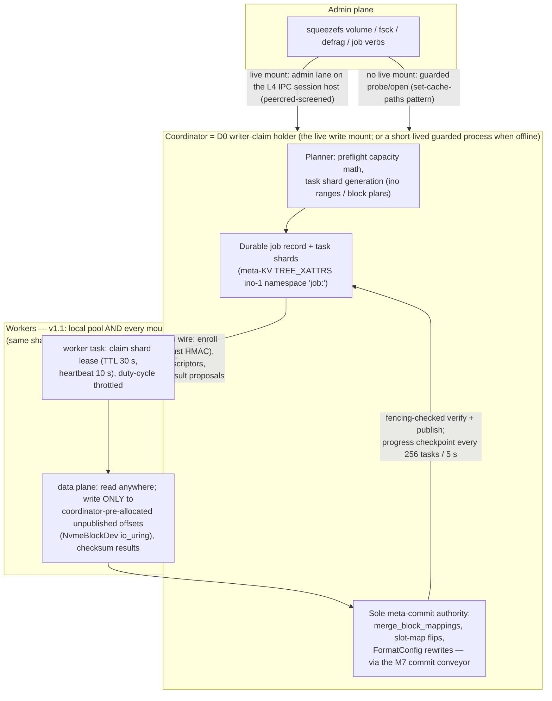
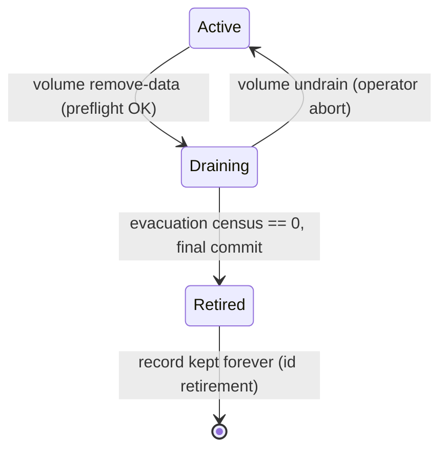

# Design Doc: SqueezeFS v1.1 Volume Lifecycle & Online Maintenance Program

**Dynamic meta+data volume add/remove with automatic migration, online defrag, online fsck, distributed throttled jobs**

| | |
|---|---|
| **Author** | (architect placeholder) |
| **Date** | 2026-07-19 |
| **Status** | **Draft** |
| **Lands as** | `docs/design-volume-lifecycle.md` |
| **Program tag** | VL (Volume Lifecycle) — PRs `VL1…VL9` (splits: VL2b wire, VL4b placement, VL5a/VL5b meta, VL6a/VL6b fsck) |
| **Charter** | User requirements 1–6 (verbatim in §2.1) — non-negotiable |
| **Binding law** | `AGENTS.md` (io_uring-first, no dead code, zero-copy/latch-free hot paths, lock lattice P1-9/P1-10/P1-11, forward-only formats, TDD red-first, tiered gates) |

---

## Overview

SqueezeFS today can *format* a filesystem across multiple metadata volumes (`sqmeta://a,b`) and multiple data volumes (`sqdata://a,b`), and it can *route* around an unhealthy data backend at runtime. What it cannot do is **change the volume set of a live filesystem**: `config data-volume add/remove/migrate` writes an ephemeral JSON file in `/dev/shm` that the daemon never converts into a registered backend (`src/config_ops.rs:22`), `config metadata-volume migrate` is bookkeeping that moves no data, `config fsck` returns `Ok(vec![])`, disabling a data volume turns reads of its blocks into `EIO` (verified live), and the `defrag` verb advertised in the AGENTS module map does not exist. The one piece of real machinery in this space — `src/jobs.rs` with its percentage throttle and `TaskType::BlockMove` — has zero submitters.

This program replaces that façade with a real **volume lifecycle**: durable, preflight-checked, *online* add/remove of both data and metadata volumes with automatic CoW evacuation; a real **online fsck** with verify-before-report detection, a **full data-block scrub class**, and **per-class `--repair` actions** (dry-run default, quarantine-first, proven against seeded corruption); a real **online defragmenter** with a defined fragmentation model and measured effectiveness; **balance-aware write placement** so ordinary foreground writes continuously drift the set toward fill balance; and a **distributed, percentage-throttled job fabric** whose data-plane shards execute on **every mounted client** in v1.1 — the coordinator (the D0 writer-claim holder) remains the sole meta-commit authority, remote workers execute device-bound work (block copies, scrub reads) under shard leases with fencing tokens over a deliberately minimal TCP/TLS job-execution wire (NOT a general networked DLM — foreground file I/O locking stays process-local). Durable job/task records live in the meta-KV; worker discovery rides the existing mount-registration heartbeats; a remote worker's writes touch only coordinator-pre-allocated, unpublished destinations, so a zombie worker can at worst scribble unreferenced blocks. Online-first per the charter (requirement 6): every job ships online; offline modes are the same engine run by a short-lived guarded coordinator process — including remote workers, which connect to it identically.

---

## 1. Background & Motivation

### 1.1 What is real today (verified against dev, this session)

| Mechanism | Where | Status |
|---|---|---|
| Multi-volume **data** sets at format; durable record | `FormatConfig.data_lv: Option<Vec<String>>` (`src/lib.rs:330`), stored as the format-config xattr on meta volume 0; mount reads it (`src/main.rs:1665`) | **Real** — but immutable after format |
| Per-block backend routing | `BackendRouter` (`src/routing.rs:213`): `backends` DashMap, `parse_block_key` (`src/routing.rs:549`) / `persist_block_key` (`src/routing.rs:577`) — block_map keys carry `name://offset`. **Write placement = `get_active_backend`** (`:465` — health-scored 90 %-band round-robin; becomes the §5.9 `PlacementTable` in VL4b); `active_write_backend: ArcSwap<String>` (`:221`) is the health-worker **failover pointer** for sticky-backend paths, not the placement mechanism | **Real** |
| Backend health + failover | `start_health_check_worker` (`src/routing.rs:854`): probes every backend, marks `unhealthy_backends`, fails the active write backend over | **Real** — fail-stop, not evacuation |
| Tier-coherent block free | `free_block` (`src/routing.rs:809`): `begin_free → tier purge → punch → finish_free`, clone-refcount aware (`src/refcount_core.rs` acquire-from-nonzero protocol) | **Real** — the exact primitive a mover needs |
| Layout RMW merge primitive | `merge_block_mappings(ino, BlockMapOp::Merge, …, fencing_token)` under `INODE_META_LOCKS`, purges RAM/NVMe tiers, returns displaced keys | **Real** — the `BlockMove` skeleton already calls it correctly (`src/jobs.rs:146`) |
| Multi-volume **meta** sets | `RoutedMetaBackend` (`src/meta_backend/mod.rs:173`): `route_ino` = `(ino−2) % volumes.len()` (`mod.rs:400`), `make_global_ino` inverse (`mod.rs:419`), RAM-only `disabled_volumes` + `redirections` maps | **Real** routing; set immutable; redirections non-durable and collision-unsafe |
| Generation identity | `volume_set_generation` = superblock uuids joined **in volume order** (`src/meta_backend/mod.rs:1373`); local staging is bound to it — mismatch ⇒ staging discarded | **Real** — and a direct constraint on any set change |
| D0 single-writer guard | `open_meta_volume_set` (`mod.rs:148`): every write mount claims each meta volume (flock + NVMe PR + `writer_claim` heartbeat) | **Real** — the central tension for "distributed" |
| Client discovery | `squeezefs clients` (`run_clients_report`, `src/main.rs:4177`; CLI arm `:2541`): on-volume `MountRegistration` heartbeat records, live/stale/dead classification, read-only probes | **Real** — the worker-discovery surface |
| Job skeleton | `src/jobs.rs`: in-memory queue, `submit_and_wait_for_job`, `start_job_worker` (started at mount, `src/main.rs:2992`), `job_throttle_sleep(elapsed, cpu_limit_pct)` duty-cycle throttle, pause-on-failure | **Real shape, zero submitters** — `TaskType::BlockMove` is dead code |
| Honest offline accounting | `squeezefs df` (`src/main.rs:4260`): allocator accounting rebuilt by the same inode-tree walk the mount runs; `free_extents`/`pending_free` meta stats | **Real** — preflight can build on it |
| DLM | `src/dlm.rs`: **process-local** scc maps — leases, per-file monotonic fencing generators, stripe-notified waiters | **Real locally; not networked.** Fencing tokens are the designed multi-writer substrate; the wire is not built |

### 1.2 What is fake or a foot-gun today (verified live on a devsub mount)

1. `config data-volume add/remove` writes only `/dev/shm/squeezefs_runtime_config.json` (`src/config_ops.rs:22`) — ephemeral, host-local; the daemon never registers a new backend from it; `FormatConfig.data_lv` untouched. A reboot silently forgets the "added" volume.
2. `config data-volume migrate` shells out to LVM `pvmove` (`src/config_ops.rs:464`) — below-fs, not block_map-aware, ignores refcounts/tiers/fencing.
3. `config metadata-volume migrate` — prints "no data is moved" and flips ephemeral statuses (`src/config_ops.rs:478`).
4. `config fsck` → `run_metadata_fsck` returns `Ok(Vec::new())` (`src/config_ops.rs:504`).
5. `config list` offline seeds a phantom `meta_volume_0 → /dev/shm/squeezefs_pjdfs_meta` (`src/config_ops.rs:40`).
6. **Disable is fail-stop, not evacuation**: after disabling a data volume, new writes route around it (the health gates in `get_active_backend` placement + the `active_write_backend` failover pointer), but reads of blocks mapped on the disabled volume return `EIO`.
7. AGENTS.md module map claims a `defrag` verb and `src/defrag.rs` — neither exists.
8. `TaskType::BlockMove` and `submit_and_wait_for_job` have zero callers — dead code under the house no-dead-code law.

### 1.3 Why now

Operators cannot grow, shrink, or repair a SqueezeFS deployment without reformat + restore. Every competitor on the scoreboard (JuiceFS, SeaweedFS) has volume/server add-remove and fsck-class tooling; the reference-client survey (`docs/reference-clients-survey.md`) lists fsck/dump/backup and cache-disk-health machinery as standing GAPs. And the current verbs are worse than absent — they *look* like they work. Honesty cleanup is itself a P0.

---

## 2. Goals & Non-Goals

### 2.1 Charter (user requirements, verbatim intent — non-negotiable)

1. Dynamically add and remove metadata AND data volumes.
   - 1a. Preflight: determine whether enough free meta/data space exists; refuse a remove that cannot fit elsewhere; report capacity honestly.
   - 1b. AUTOMATIC migration from/to added/removed volumes of any type.
   - 1c. ONLINE if possible. Offline optional.
2. Defragment — 2a. ONLINE if possible. Offline optional.
3. fsck — 3a. ONLINE if possible. Offline optional.
4. All ONLINE jobs distributed across ALL MOUNTED CLIENTS; throttled via percentage.
5. Offline jobs OPTIONALLY distributed across multiple clients.
6. "Ideally if we support ONLINE METHODS ONLY that is OK" — online-first.

### 2.2 Goals (program gates in §12)

- **G-VL-1** Honesty: no verb in the tree claims to do something it does not do.
- **G-VL-2** Durable, online **data volume add**: new capacity participates in allocation without remount; survives remount.
- **G-VL-3** Online **data volume remove**: full CoW evacuation (blocks, clones-once, staged content), preflight-refused when it cannot fit, zero-loss under kill-9 ×10, resumable by re-run.
- **G-VL-4** Online **meta volume add/remove** with slot migration, generation-identity rebind, and staging drain — zero-loss under kill-9 ×10.
- **G-VL-5** Online **fsck**: all seven check classes (C1–C6 + the C7 data scrub, §5.6), **zero false positives under concurrent fsstress**, 100 % detection of seeded corruption classes, and **per-class repair**: seeded corruption ⇒ `--repair --apply` ⇒ re-fsck clean ⇒ data manifest intact, ×10.
- **G-VL-6** Online **defrag** with a defined fragmentation model and measured effectiveness (§5.7), safe under concurrent fsx.
- **G-VL-7** Job fabric: percentage throttle adherence ±10 % at 25/50/75 %; pause/resume/cancel; durable progress; crash-resume; **remote execution on mounted clients** (a remote worker executes shards; kill-9 of a remote worker mid-shard ⇒ lease expiry ⇒ reclaim ⇒ convergence; stale-fencing submissions refused).
- **G-VL-8** **Balance-aware write placement**: on an imbalanced set under a sustained mixed write workload, fill spread converges and stays bounded (§5.9, §12).
- All maintenance I/O rides existing io_uring paths (`NvmeBlockDev`, `crate::uring_fs`); zero classical I/O. The job wire is TCP/TLS — network, explicitly not-uring per the AGENTS posture ("Not uring: TLS peers, network TCP/TLS stacks").

### 2.3 Non-Goals

- **A general networked DLM**: v1.1 ships the **job-shard execution wire** (§5.1.6 — shard leases, fencing-checked result submission, coordinator-pre-allocated write destinations) because requirement 4 demands remote execution NOW (user ruling, 2026-07-19). What it deliberately does **not** ship is a general distributed lock manager: foreground file-I/O DLM (`src/dlm.rs` leases/fencing for FUSE ops) stays process-local on the single writer mount — the wire moves *job shards*, never file locks. The boundary is explicit in KD-15.
- **fsck repair beyond redundancy**: `--repair` ships per-class actions (KD-10 rewritten, §5.6a), but v3 data/meta carry no replicas — where repair-from-redundancy is impossible (torn KV nodes, scrub-failed blocks) the honest action is **quarantine + report**, never fabrication. Stated per class in §5.6a.
- **Dedupe / clone de-sharing as a defrag objective**: out of scope.
- **Block-size or meta-node-size changes, shrinking a device in place** (LVM-level `storage` verbs remain the below-fs tool).
- **A standing rebalance daemon**: continuous drift prevention is now delivered *in the write path* (balance-aware placement, §5.9 — user design, OQ-3 resolution); bulk correction is the auto-on-add rebalance pass (KD-12). No background trigger loop exists to tune or wedge.

### 2.4 Charter sign-offs — RULED (user decisions, 2026-07-19, FINAL)

The Rev 2–4 drafts flagged three deviations for sign-off. The user has ruled; the rulings are recorded here and incorporated throughout (Rev 5):

| # | Charter text | Ruling | Consequence in this doc |
|---|---|---|---|
| SG-1 | Req 4: "distributed across ALL MOUNTED CLIENTS" | **VETOED** — online remote workers ship in v1.1 | §5.1.6 is now the **job-shard execution wire design** (discovery, TCP/TLS transport, remote shard leases + fencing, result submission, lease-TTL reclaim, storage-trust security model); KD-1 updated (execution model), KD-15 added (wire + its deliberate not-a-DLM boundary); PR VL2b; G-VL-7 remote legs; §5.8 offline distribution collapses onto the same wire (OQ-5) |
| SG-2 | Req 1b: "AUTOMATICALLY migrate … to added … volumes" | **Accepted as revised** (auto-rebalance-on-add, Rev 2) | KD-12 stands; complemented by balance-aware write placement (§5.9 — the user's OQ-3 design) |
| SG-3 | Req 3: "fsck" | **VETOED** — `--repair` ships in v1.1 | §5.6a per-class repair actions (dry-run default, quarantine-first, honest where redundancy does not exist); KD-10 rewritten to verify-before-repair; PR VL6 split VL6a detect / VL6b repair; G-VL-5 repair legs; plus the C7 **data scrub** class (OQ-4 resolution) |

OQ resolutions ruled in the same pass: **OQ-1** duty-cycle percentage (pinned in KD-3), **OQ-2** `W = volume count` default (pinned in KD-7), **OQ-3** balance-aware write placement replaces any standing rebalance trigger (§5.9, KD-16), **OQ-4** full data-block scrub ships (C7, §5.6), **OQ-5** offline mutating distribution ships via the same wire (§5.8). §14 retains only the genuinely new open questions the expansions raise.

---

## 3. Measurement & Verification Protocol (program-wide)

House rules apply verbatim: every measurement states its instrument; multi-run discipline (any attributable failure restarts the count from zero); paired same-substrate A/B on devsub (`tests/dev_substrate.sh`); never measure barrier-bound work on file-backed-on-btrfs. New instruments this program adds:

- **`tests/run_volume_lifecycle.sh`** — devsub rig: format N-volume sets, run add/drain/remove/defrag/fsck/scrub/repair cycles with concurrent fsx/fsstress, kill-9 injection points (env-selected), full-tree checksum manifests before/after; **2-node mode** (nvmet-loop namespaces cross-mounted — the same substrate `dev_substrate.sh` builds) enrolls a second client as a remote worker for the G-VL-7 remote legs.
- **Stats-inode deltas are the engagement instrument** (house pattern): a drain row is INVALID unless `evacuate_bytes_moved` accounts for the victim's used bytes; an fsck row is INVALID unless `fsck_inodes_scanned` equals the ino watermark census.

---

## 4. Architecture: the job fabric and where each operation sits



Every maintenance operation is a **job type** on one fabric:

| Job type | Data plane | Meta plane |
|---|---|---|
| `evacuate-data-volume` | copy blocks off the victim backend | republish block_maps, free displaced keys, flip volume state |
| `migrate-meta-slot` | bulk-copy a slot's KV trees | flip the durable slot map, retire guest source |
| `fsck` (C1–C6) | (read-only) suspect-verification reads; C1–C6 scan is coordinator-local (RAM-authoritative) | none in detect mode; §5.6a repair actions under `--repair --apply` |
| `scrub` (C7) | device-bound sequential reads of allocated blocks, checksum/AEAD verification — fully distributable | none in detect mode; quarantine on `--repair --apply` |
| `defrag-data` / `defrag-meta` / `rebalance` | block moves / node compaction kicks | republish maps |

---

## 5. Proposed Design

### 5.0 Honesty cleanup (PR VL1 — first, unconditionally)

Delete the fake surfaces; make everything that remains true:

- Delete `config data-volume add/remove/migrate`, `config metadata-volume add/remove/migrate`, `run_metadata_fsck`, the disk-cache no-op stubs (`add/remove/enable/disable/flush_disk_cache_path`), and the phantom `meta_volume_0` seed in `load_or_create_config` (`src/config_ops.rs:40`). The CLI arms print a loud "removed; superseded by `squeezefs volume …` (design-volume-lifecycle)" error until their VL successors land — a *refusal*, not a stub success.
- Delete `TaskType::BlockMove` + `submit_and_wait_for_job` (dead code; git history keeps the shape — VL2 rebuilds it durable). `job_throttle_sleep` and the worker loop survive (VL2 extends them).
- Keep `config data-volume enable/disable` semantics **as-is on the existing `/dev/shm` mechanism in VL1**, re-documented as the fail-stop health overrides they are. The re-home to the daemon admin lane — and the deletion of the `/dev/shm` file — happens in **VL3**, after the VL2 lane exists (VL1 precedes the lane and cannot re-home onto it).
- Fix AGENTS.md module map (no `defrag` verb, no `src/defrag.rs`) in the same PR.

Gate class: code-touching ⇒ full cargo gate. G-VL-1 acceptance: `grep`-provable absence + refusal-message tests.

### 5.1 The distributed throttled job fabric (PR VL2)

#### 5.1.1 Resolving the D0 tension (KD-1)

Today exactly **one write mount** exists per volume set (D0: flock + NVMe PR + `writer_claim`; `squeezefs clients` shows read-only probes and the writer). Therefore:

- **The coordinator is the D0 writer-claim holder.** It is the only process that may commit meta transactions, so *all* job meta-plane effects (map republish, slot flips, FormatConfig rewrites, job-record checkpoints) go through it — riding the existing M7 commit conveyor, which already serializes committers per volume.
- **Workers are data-plane only.** A worker claims a task shard by writing a *task lease* (through the coordinator), performs device I/O (reads anywhere, writes only to job-allocated destinations it holds fencing tokens for), and submits results to the coordinator for commit.
- **Two worker populations, one protocol (user ruling: remote ships in v1.1)**: the coordinator always runs a **local pool** of N tokio tasks (default `clamp(cpus/4, 2, 8)`, matching the L4 service-thread posture — a single-mount deployment needs nothing else), and **every other mounted client** may run remote workers that execute the same shards over the §5.1.6 job-execution wire. Records, leases, fencing checks, heartbeats, and result submission are identical for both; only the transport differs (in-process mpsc vs TCP/TLS frames). The load-bearing safety law for remote execution: **remote workers write only to coordinator-pre-allocated, unpublished destinations, and a reassigned shard always gets fresh ones** (expired-lease destinations are quarantined do-not-publish — §5.1.6) — publication and every fencing decision happen at the coordinator, so a zombie worker, dead *or live* (partitioned/paused past TTL, resuming DMA), can at worst scribble blocks nothing references or will ever reuse (reclaimed like any kill-9 leak, §5.4).

#### 5.1.2 Durable job state (KD-2)

Job records are **meta-KV xattr records on ino 1** under a reserved namespace, exactly like the format-config xattr (`FORMAT_CONFIG_XATTR` precedent in `src/config_ops.rs:74`):

```
job:{job_uuid}                 → JobRecord   (JSON: type, params, state, created_by, throttle_pct)
job:{job_uuid}:shard:{k}       → ShardRecord (JSON: range/plan digest, state, lease holder+fencing, progress cursor)
job:{job_uuid}:progress        → checkpoint  (tasks_done, bytes_moved, last_cursor, updated_ts)
```

Rationale: rides v3 whole-tx atomicity + torn-write immunity for free; visible to offline probes (`squeezefs job list` works against an unmounted set the same way `clients`/`df` do); no new on-disk structure, **no feature bit** (unknown xattrs are inert data to old binaries — forward-only satisfied trivially). Value size stays under the xattr cap (`min(65536, node_size/4)`) by sharding: one shard record per ino-range/plan chunk, never one giant plan blob.

**FUSE-side reachability (security, closes a pre-existing hole):** ino 1 is the FUSE-visible root, and today's xattr handlers screen **only** `BOOTSTRAP_XATTR` (`src/fuse_client.rs:9947,9979,10035`) — so `user.squeezefs.format_config` is already listable, settable, and *removable* by any user through the mount, and `job:` records would be too. VL2 therefore generalizes the existing `BOOTSTRAP_XATTR` screen into a **reserved-namespace screen** at the FUSE layer: names matching the reserved prefixes (`job:`, the format-config name, and any future `squeezefs.`-internal record) are filtered from `listxattr` and refused with `EPERM` on `getxattr`/`setxattr`/`removexattr` through the FUSE path. The daemon/probe/offline paths read them through the meta backend directly, never through FUSE. Pinned tests: reserved names invisible to `listxattr`, `EPERM` on all four verbs, and — regression for the pre-existing hole — `removexattr("user.squeezefs.format_config")` refused. Without this screen, a user could delete the durable lease/fencing bookkeeping of an in-flight drain from an unprivileged shell.

- **Checkpoint cadence**: every 256 completed tasks or 5 s, whichever first (one conveyor-batched xattr commit; ≈ 1 GiB of moved data per checkpoint at 4 MiB blocks — bounded re-work on crash).
- **Crash/resume**: jobs are *idempotent by plan regeneration* (KD-6): on restart, the coordinator re-plans from current state (e.g., "blocks still on the victim") rather than trusting stale shards; the progress record is advisory (ETA/stats), not correctness-bearing.

#### 5.1.3 Throttle (KD-3)

`job_throttle_sleep(elapsed, pct)` (`src/jobs.rs:219`) stays the primitive: per-worker duty-cycle — after a task that ran `t`, sleep `t·(100−pct)/pct`. Program-level additions:

- Throttle is a **job-record field**, changeable live: `squeezefs job throttle <id> <pct>` (admin lane); workers re-read it per task.
- Semantics documented honestly: percentage of *worker duty cycle*, which for I/O-bound tasks approximates percentage of device bandwidth consumed by the job. Adherence gate G-VL-7 measures duty cycle directly (task-active time / wall time within ±10 % of target at 25/50/75 %).
- A `--nice-io` posture rides free: workers submit through the same `NvmeBlockDev` bounded queues as foreground I/O, so backpressure from foreground traffic naturally deprioritizes job I/O; the duty cycle is the hard cap.

#### 5.1.4 Admin plane (KD-4)

Online verbs reach the live daemon over an **admin lane on the L4 IPC session host** (`src/ipc_host.rs` — abstract AF_UNIX, sealed-memfd sessions, peercred screening is THE security boundary per design-preload-interception §5.2). One correction the design must own: today the host exists **only on interception-enabled mounts** (`src/ipc_host.rs:5,546` — "One `IpcHost` per interception-enabled mount", armed by `-o interception`). Decision: **VL2 arms the host on every mount in a control-plane-only mode** —

- the abstract AF_UNIX listener + per-connection ctl threads always run (they are the cheap part: one listener fd, threads spawned per connection);
- **no shm sessions, no data-plane service-thread pool, and no payload arenas** are created unless `-o interception` is present — the L4 pinned service threads (`clamp(cpus/4,2,8)`) and arena budgets are untouched on non-interception mounts;
- a new `ADMIN` session flag admits only peercred uid 0 or the mount-owning uid; non-ADMIN binds on a non-interception mount are refused (`ipc_bind_refused_flags` counts them);
- resource delta on a default mount: one AF_UNIX listener + idle acceptor thread; security delta: none beyond what interception mounts already carry — the same §5.2 daemon fd screen and peercred gate govern, and the ADMIN lane is strictly *more* restrictive (uid screen on top).

Admin ops are tiny request/reply frames (submit/list/status/pause/resume/cancel/throttle, volume verbs). Because VL2 touches `src/ipc_host.rs`/`src/ipc_service.rs`, the **per-PR preload gate** (both legs) applies to VL2 per the AGENTS tiering table. The virtual `CONFIG_INODE`/`STATS_INODE` files (`src/fuse_client.rs:20-21`) stay **read-only** observability (job progress is published in the stats JSON); we do not invent a writable-control-file protocol (rejected in §8-E).

Offline (no live mount): verbs take the `set-cache-paths` path — `format_preflight` live-client gate per volume, guarded open (which takes the D0 claim), do the work, clean shutdown (`src/config_ops.rs:284` is the template).

#### 5.1.5 Worker loop, locks, and I/O law

Per task (e.g., one block move), in lattice order (P1-9), matching the corrected `BlockMove` discipline (`src/jobs.rs:123-207`):

1. No inode write guard is held across the copy (P1-8): the copy is lock-free data plane.
2. Copy: `router.read_block(src_key)` → verify checksum → `write_block(dst)` — both `NvmeBlockDev` io_uring workers. Copy buffers are bounded: **≤ 64 in-flight blocks per worker = 256 MiB per worker at 4 MiB blocks, ≤ 2 GiB program-wide at the default 8-worker cap** — and charged to the R5 memory budget as a new sheddable component `job_copy_buffers` sized from the *actual configured* worker count (the same actual-count figure the preflight `transient` term uses, §5.2).
3. Publish: `merge_block_mappings(ino, Merge, …, fencing_token)` — takes `INODE_META_LOCKS` + DLM 4a internally, commits via the conveyor. **P1-10 honored by construction**: the durable NVMe copy completes before any meta connection/commit is touched.
4. Free displaced source keys via `free_block` — `begin_free → tier purge → punch → finish_free`, clone-aware. The source frees **only after** the new mapping is durable and tiers are purged (crash-safety law, KD-6).
5. Fencing: the worker re-reads the ino's *current* token per attempt (the FIND-M11-A supersession law applied to movers): stale token ⇒ the move is a contractual no-op (the file changed; re-plan will revisit), never a forced write. Fencing tokens are never burned on failed lock acquisition (house must-not): tokens are read, not incremented, by movers.

#### 5.1.6 The job-shard execution wire (remote workers, v1.1 — SG-1 ruling)

The minimal wire that lets every mounted client execute data-plane shards online. **Deliberate boundary (KD-15): this is a job-shard execution transport, NOT a general networked DLM** — foreground file-I/O locking (`src/dlm.rs` leases/fencing for FUSE ops) stays process-local on the single writer mount; the wire never moves file locks, only shard descriptors, heartbeats, and results.

- **Worker discovery — coordinator publishes, workers dial.** The coordinator extends its `MountRegistration` heartbeat record (the `squeezefs clients` surface) with a `job_endpoint` field (`host:port` + a per-boot endpoint nonce). Any mounted client — including read-only mounts — already reads these records off the meta volumes it has open; `squeezefs job worker <sqmeta-uri>` (or `-o job-worker` at mount) probes the registration, finds the live coordinator's endpoint, and dials. No new discovery infrastructure; dead/stale coordinators are classified by the existing heartbeat staleness law.
- **Transport — TCP/TLS, deliberately, with the reuse boundary stated honestly.** A dedicated tokio TCP listener on the coordinator speaking length-prefixed, schema-versioned frames (`wire_schema: 1`, aligned with the job-record `schema: 1`), matching the AGENTS posture ("Not uring: TLS peers, network TCP/TLS stacks"). What is reused from `ClusterSecurityConfig` (`src/tiering/dht.rs:13`) is the **cert/CA/verifier machinery** — the rustls `ServerConfig`/`ClientConfig` construction up to (but not including) the quinn wrap: the in-tree artifact is **quinn/QUIC** plumbing (`dht.rs:110-175`, `Cargo.toml` has `quinn 0.11` and **no tokio-rustls**), so a TCP/TLS listener adds **`tokio-rustls` as a new dependency** (stated in VL2b's file list). Two alternatives were weighed: (a) the `src/p2p.rs`/DHT overlay as carrier — rejected for protocol shape (keyed cache-block fetch, no sessions, no ordered request/reply); (b) **quinn/QUIC itself as the wire transport** — already in-tree, and its ordered bidi streams/keep-alive/idle-timeout map well onto leased sessions — rejected in favor of TCP for operational reasons: a hand-framed TCP request/reply protocol is smaller than QUIC session management for this traffic volume (shard descriptors and heartbeats, not bulk data), trivially debuggable with standard tooling, and avoids introducing UDP flows on storage fabrics where TCP is universally permitted and QUIC middlebox behavior is not. TCP wins on simplicity for a control channel; the cert machinery reuse is identical either way (§8-H records this).
- **Security model — reasoned from shared-storage trust.** A worker client, by definition, can already open the meta volumes (read the KV) and the shared NVMe-oF data namespaces: it **already holds full data access**. The wire must therefore prove exactly that capability and grant nothing more. Enrollment: the coordinator writes a random per-job-fabric **session secret** into a `job:enroll` record (meta-KV, behind the §5.1.2 FUSE screen); a connecting worker proves storage membership by presenting `HMAC(secret, worker_id ‖ endpoint_nonce ‖ hello)` — only a principal that can read the meta volume can compute it. TLS adds transport confidentiality/integrity + optional mTLS pinning where `ClusterSecurityConfig` is deployed; without TLS the HMAC still gates enrollment (whether plaintext-with-HMAC is acceptable on trusted fabrics or TLS should be mandatory is OQ-A). The frame layer grants no meta-write capability at all — there is no "commit" verb on the wire; results are *proposals* the coordinator verifies and commits itself.
- **Shard lease + fencing for remote workers.** The coordinator assigns a `ShardRecord` lease `{holder, lease_expiry (TTL 30 s), shard_fencing}` and streams the shard descriptor: task list, source keys, and — for mutating jobs — **pre-allocated destination `(backend_id, offset)` tuples** the coordinator allocated (allocation is meta-side and never crosses the wire as a capability). Workers heartbeat every 10 s; renewal extends the lease. **Verification is at submission, not at the device**: a result carries `{shard_fencing, per-block checksums of what was written/read}`; the coordinator (a) checks the fencing value is current for that shard — a reclaimed shard's stale value is refused (`job_remote_refused_stale`); (b) for mutating shards, verify-reads the destination blocks against the submitted checksums before publishing via `merge_block_mappings` under the ino's current DLM token — **verification strength is coupled to transport trust (Issue-30 law): under TLS/mTLS a sample suffices (all under `--write-verification`); on a plaintext transport verify-reads are mandatory-100 %**, because cleartext fencing values authenticate nothing against a network-positioned non-member who hijacks an enrolled session — full verify-reads mean forged proposals cannot publish bytes the coordinator has not itself read and checksummed. Priced honestly: plaintext deployments pay ≈ 2× device reads on remote-mutated bytes (`job_remote_verify_read_bytes` gauges it). Because destinations were unpublished, a refused/failed submission leaves only unreferenced garbage — reclaimed by the §5.4/KD-6 law.
- **Result submission + failure/reclaim — the fresh-destination law.** Missed heartbeats past the TTL ⇒ the coordinator expires the lease, bumps `shard_fencing`, and reassigns the shard (to any worker, including local) — **always with freshly allocated destination tuples; the expired lease's destinations are never reused**. They enter a **do-not-publish quarantine set** (excluded from placement, publication, and job-internal reuse; reclaimed at job end or, failing that, by the next mount's tree-walk allocator rebuild, which never accounts them). This is the missing half of the pre-allocated-destination law: fencing protects the *submission*, not the *device bytes* — the dangerous zombie is not a dead process but a **live one** (partitioned or paused past TTL) that resumes DMA into its old destinations while the replacement works. With fresh destinations the zombie's late writes land only on quarantined offsets nothing will reference or reuse **within the job** — which leaves the residual case an *unbounded* pause must be honest about: a zombie that outlives the job resumes *after* quarantined offsets are reclaimed and possibly reallocated to foreground data. Any check-then-write has a pause window, so full closure without device-side fencing is physically impossible; the design bounds and fences it with the **D0-precedent guarantee-class ladder** (design-metadata-throughput §5.0 posture — enforce where the hardware can, document the class where it cannot, no bypass knob):

  1. **Per-batch lease re-validation (all substrates)**: a worker re-checks its lease (local expiry clock, plus a wire round-trip when past half-TTL) **before each DMA batch** — a paused worker that wakes finds its lease expired and aborts, shrinking stale-write exposure from a whole shard to the one batch in flight at pause time (≤ 64 blocks = 256 MiB, the §5.1.5 window).
  2. **NVMe PR preemption where `RESCAP` supports it (hard fence)** — with the reservation type named precisely, because registration alone gates nothing: the coordinator acquires **Write Exclusive – Registrants Only (WERO, rtype 2)** on each shared **data** namespace when the first remote worker enrolls (released when the last departs); worker hosts register per-host PR keys at enrollment; at lease expiry the coordinator **preempts the expired host's registration** — under WERO the device then rejects *that host's* resumed DMA while the coordinator and every still-registered worker keep writing, and quarantine reclaim thereafter is **unconditionally safe** (may happen at job end or immediately). This **extends `src/meta_backend/reservation.rs`, it does not purely reuse it**: the module today exposes only `acquire_write_exclusive` (`reservation.rs:141-144` — plain Write Exclusive, rtype 1, D0's deliberate single-writer semantics, under which workers could not write at all); the register/preempt/report ladder and the fake clients ARE reused verbatim, and a registrants-only acquire variant is added beside D0's. Two stated consequences: **(a)** while a WERO reservation stands, an *unregistered* third host (operator debug box, probe-only client) is write-blocked on those data namespaces for the duration of the distributed job — an operational side effect documented in the operations.md runbook (VL9); **(b)** the coordinator's WERO hold on **data** namespaces is disjoint from D0's Write Exclusive on **meta** volumes — different namespaces, different rtypes, no interaction.
  3. **Non-PR substrates — documented residual class**: reclaim stays deferred to job end and the window (zombie paused across job end, resuming after reallocation) is documented as a guarantee class in R11 and the operations.md runbook (rides VL9) — the same honest posture D0 takes for cross-host takeover on non-PR substrates. Operators on non-PR fabrics are told the exposure and the mitigation (PR-capable namespaces, or bounded worker-host supervision).

Late results from the expired holder are refused by the fencing check regardless. Coordinator crash ⇒ workers' dials fail; the resumed coordinator (remount or offline re-run) re-plans per KD-6 and re-publishes its endpoint; workers reconnect via discovery. The zombie species are first-class G-VL-7 legs: kill-9 (dead), **SIGSTOP-past-TTL / reassign / SIGCONT (live, within job)**, and — on the PR-capable devsub substrate — **SIGCONT *after job end*: the resumed DMA must be device-rejected by the preempted registration**.
- **What distributes, what does not.** Device-bound work distributes: evacuation/defrag/rebalance block copies, C7 scrub reads, suspect-verification device reads. RAM-authoritative work does not: online fsck's C1–C6 scan reads the live daemon's arc-swap state (a remote client sees only the durable image — the suspect-flood argument stands), and the suspect→lease re-check must run on the coordinator regardless. This division satisfies requirement 4 where distribution is *meaningful* (the device-bound bytes) and states honestly where it is not.
- **Throttle**: the job's duty-cycle percentage travels in the shard descriptor and applies per remote worker exactly as locally (KD-3); adherence is measured per worker and aggregated.

Offline fsck sharding (`fsck --offline --shards k/N` + `merge-reports`) remains available as the zero-coordination degenerate mode for unmounted sets; with the wire, coordinated offline distribution also works (§5.8).

### 5.2 Capacity preflight & honest accounting (requirement 1a; PRs VL4/VL5b carry it)

**Data side.** Per backend `b`: `free_blocks(b) = capacity_blocks(b) − used_blocks(b)` from the `BlockAllocator` (capacity bound via `set_capacity_bytes`, `src/block_allocator.rs:271`; used = the same authoritative inode-tree-walk census `squeezefs df` builds — allocator state is rebuilt from the tree walk at mount, so this is the ground truth, not a drifting counter). Preflight for removing volume `V`:

```
needed      = distinct_used_blocks(V)                 # census, tree-walk-derived, DEDUPLICATED per offset:
                                                      #   a clone-shared block is counted once, matching the
                                                      #   move-once design (§5.4) — the walk visits it once
                                                      #   per referencer; the planner unions by offset
avail       = Σ_{b ≠ V, healthy, state=active} free_blocks(b)
transient   = inflight_window_blocks                  # copies live on both sides until freed:
                                                      #   64 blocks × ACTUAL configured workers
                                                      #   (≤ 512 blocks = 2 GiB at the default 8-worker cap)
headroom    = max(write_rate_est × drain_eta, 1 GiB)  # foreground growth during the drain (est., re-checked live)
REQUIRE: avail ≥ needed + transient + headroom        # else refuse with the exact numbers
```

The double-count is explicit: an in-flight moved block occupies source and destination simultaneously until the post-publish free; `transient` bounds it by the worker window, and the drain **re-verifies headroom at every checkpoint** — if foreground writes consumed the slack, the job pauses itself loudly (state `paused-capacity`) instead of running the survivors to `StorageFull`. (For a *pure drain* the `transient` term is conservative rather than strictly necessary — the victim's space is excluded from `avail` and in-flight destinations are a subset of `needed`; it **is** load-bearing for rebalance/defrag moves *between survivors*, where source and destination both count against `avail`. It stays in the formula so the same preflight covers all mover job types — do not "optimize" it away.)

`write_rate_est` is defined, so G-VL-3(e)'s refuse-iff property has a closed form: the trailing-60 s mean of foreground block-consumption from the stats inode — `Δ(write_through_blocks) + Δ(staged-flush promoted blocks) + Δ(extent_spills)` blocks/s, sampled by the coordinator's existing stats cadence; `drain_eta = needed / measured_job_rate` (first checkpoint onward; the preflight's initial estimate uses the G-VL-3(b) floor rate and is re-verified per checkpoint, which is what actually protects the survivors).

**Meta side.** Per volume: `free_extents`/`pending_free` stats already exist (v3 A/B extent bitmap, 1 bit / 256 KiB). Preflight for removing meta volume `V`: used extents on `V` (bitmap popcount) ≤ Σ target free extents − checkpoint headroom (2× `SQUEEZEFS_META_CHECKPOINT_MAX_DIRTY_NODES` × node_size), with the same transient double-count during slot copy. The **journal ring is *not* subtracted**: it is a format-time fixed region referenced by the superblock (`ExtentRef` beside `root_ledger`/`alloc_bitmap`, `src/meta_backend/kv/superblock.rs`), outside the extent-bitmap heap — free-extent counts never include it, and subtracting it again would double-count. `pending_free` extents are treated as *unavailable* until released (the wedge-detector gauge semantics).

**Reporting**: `squeezefs volume list` (new verb) prints per-volume id, path, state, capacity, used, free, and — when a drain is active — needed/available/transient so the operator sees the same math preflight ran. `squeezefs df` grows per-volume rows.

### 5.3 Durable data volume add (PR VL3)

**Durable identity first (KD-5).** Today backend ids are device-path basenames (`src/main.rs:2862-2871`), and block_map keys persist them (`persist_block_key`, `src/routing.rs:577`). Basenames are neither unique nor stable (`/dev/nvme1n2` on host A vs B; a re-added device reusing a retired name would alias dead keys). VL3 introduces durable volume records:

```rust
// FormatConfig — additive serde fields (old binaries deserialize fine; see §7)
pub struct DataVolumeRecord {
    pub id: String,        // "vol-{8-hex}" — allocated once, never reused, key-stable
    pub path: String,      // current device path (host-resolvable; may be updated)
    pub state: VolState,   // Active | Draining | Retired
    pub added_ts: u64,
}
pub data_volumes: Option<Vec<DataVolumeRecord>>,   // None ⇒ legacy: synthesize from data_lv basenames
```

Legacy sets synthesize records with `id = basename` on first VL3 mount (grandfathering existing on-disk `name://offset` keys byte-identically; the `backend_0` unprefixed-key alias for the first volume is preserved verbatim — `persist_block_key`'s invariant comment stays true). New volumes get `vol-…` ids. **Retired ids are recorded forever** (a `Retired` record is never deleted, only its path cleared) so a stale key can never resolve to the wrong device — it fails loud (`err_backend_not_found`).

**Add flow (online):**

1. Admin lane: `squeezefs volume add-data <sqmeta-uri> <device>` → coordinator.
2. Preflight: device exists, sized (`device_capacity_bytes`), not already a member, not a meta volume; probe write+readback of a fenced scratch block.
3. Register runtime backend: build `NvmeBlockDev` + `BlockAllocator` (the mount-time code at `src/main.rs:2862-2895` refactored into `BackendRouter::register_backend(record)` so mount and add share one path), insert into `backends`.
4. Commit `FormatConfig.data_volumes += record` (one xattr tx on meta volume 0, conveyor-committed). **Durability order: runtime registration is completed only after the durable commit acks** — a crash between (3) and (4) must not leave blocks persisted with an id that the next mount does not know (write-path selection of the new backend is enabled last).
5. New capacity participates immediately: it joins **write placement** — `get_active_backend`'s healthy-candidate set (the §5.9 `PlacementTable` after VL4b, where its low fill ratio gives it above-mean weight) — the passive allocator consequence: new writes/CoW copies land there. (`active_write_backend`, the failover pointer, also learns of it via the health worker.)
6. **Automatic migration TO the added volume (charter 1b)**: `volume add-data` **auto-submits a bounded rebalance pass by default** (KD-12) — the §5.7 `rebalance` job at a conservative default throttle (25 %), objective: bring the new volume to within 10 percentage points of the mean `used/capacity` ratio, moving cold (tier-untouched-first) blocks. It is an ordinary fabric job: visible in `job list`, pausable, cancellable, re-throttleable. `--no-rebalance` opts out for operators who genuinely want allocation-participation-only (e.g., adding a volume ahead of a known ingest). A mostly-cold filesystem therefore gets *real* migration to new capacity without operator follow-up — passive-only would have been allocation participation, not the automatic migration the charter demands.

Offline add = same steps via the guarded-open path. Remount reads `data_volumes` and registers everything `Active|Draining`.

### 5.4 Data volume drain / remove (PR VL4)

**State machine (durable, in the volume record):**



`Draining` semantics fix foot-gun #6: the volume is **excluded from write placement and from new allocations — weight 0 / dropped from `get_active_backend`'s candidate set (VL4 lands this in the candidate filter; VL4b carries it into the §5.9 `PlacementTable`) — but serves reads and refcount ops normally** until retired. The `active_write_backend` failover pointer is repointed off it by the health worker as a side effect. (Health-`disable` remains the separate fail-stop override for a *broken* device.)

**Evacuation job (`evacuate-data-volume`):**

1. **Plan**: coordinator walks the inode trees (the `df` census walk) building shards of `(ino, [block_idx…])` whose keys parse to the victim id — plus the *reverse grouping* for shared blocks: all `(ino, idx)` referencing the same victim offset land in one task, because **a shared block moves once** (charter/obligation). Refcounts (`increment_refcount`, `src/routing.rs:687`) tell us sharing; the tree walk gives the referencer list.
2. **Per shared-block task**: copy once → `increment_refcount(dst)` up to the reference count **before** publishing any referencer (no window where dst refcount < published references; the pre-publish offsets are recorded in the task's **pre-publish refcount ledger**, coordinator-visible task state that online fsck's C3 checker consults while the job is active — §5.6) → `merge_block_mappings` per referencing ino in ascending-ino order, each under its own DLM lease + current fencing token → each merge's displaced source key goes through `free_block` (decrement; terminal decrement punches — the existing clone-safe protocol).
3. **Staged/parked content on the victim's inos**: blocks with live `active_block` buffers, parked extents, or spilled `active_block_ext:` records are **skipped and revisited**: the task nudges the fold/flush machinery (the existing fold triggers) and the re-plan pass picks the block up once it is quiescent, holding `BLOCK_FLUSH_LOCKS` (lattice 3) for the final check-and-move. No new lock class.
4. **Convergence**: re-plan passes repeat until the victim census is 0 (foreground CoW naturally stops adding: `Draining` excludes it from allocation). Termination is guaranteed because the victim's allocator admits no new blocks.
5. **Retire commit**: verify census 0 by a fresh tree walk + allocator emptiness, then one tx: record → `Retired`, path cleared. Runtime backend deregistered (reads of a straggler key now fail loud — and fsck's orphan class would have flagged it before retirement).

**Crash safety (KD-6)**: copy-then-republish CoW, never move-in-place; source freed only after durable publish + tier purge. A kill-9 mid-copy leaks only unreferenced destination blocks *within the current mount's allocator*, and the next mount's tree-walk allocator rebuild reclaims them automatically (the census walk simply never accounts them) — verified as gate G-VL-3's kill-9 soak invariant. Re-run resumes by re-planning (idempotent).

**Interaction ledger (obligation — every touchpoint):**

| Interacts with | Handling |
|---|---|
| CoW clone refcounts | move-once + pre-publish dst refcount raise (§5.4.2); freeing rides `refcount_core` terminal protocol |
| R4 RAM tier + NVMe read cache | `merge_block_mappings` purges tiers on publish; `free_block`'s `begin_free → purge → punch → finish_free` covers the source; no reader can observe stale bytes (same law as every merge caller — `src/jobs.rs:158-175` comment block is the spec) |
| W1 patch eligibility (`is_whole_block_mapping`, `src/routing.rs:1588`) | the mover republishes the *same mapping shape* with a new key — a whole-block mapping stays whole-block; gate asserts `patch_ineligible_*` ledger does not grow across a drain |
| Staged extents / fold | quiescent-first rule (§5.4.3); mover never folds itself — it kicks the existing machinery |
| Never-lossy writeback (FIND-M11-A) | writeback flush units re-validate staged ownership per attempt and present current tokens — a concurrent move that superseded a unit's mapping makes that unit a verified no-op, exactly the existing law; the mover's own stale-token outcome is symmetric (§5.1.5.5) |
| Prefetch / singleflight (R1/R2) | old key remains readable until post-publish free; publish purge invalidates; `prefetch_evicted_unconsumed` watched during soaks |
| mem budget (R5) | `job_copy_buffers` sheddable component; Red pauses job admission (`job_paused_mem_pressure` counter) |
| bg_admit / conveyor | mover commits are ordinary conveyor traffic; ring-admission parking escalation (`disabled_volumes` lattice) applies unchanged |

**Scale math**: 8 TiB victim, devsub-class NVMe ~2 GiB/s effective copy (read+write on same fabric ⇒ ~1 GiB/s net) at 100 % throttle ⇒ ≈ 2.3 h; at 50 % ⇒ ≈ 4.5 h; at 25 % ⇒ ≈ 9 h. 2 M block moves ⇒ 2 M merge commits ≈ 8 k conveyor batches at the default 256-tx batch — minutes of meta time, dominated by data copy. Checkpoints every 256 tasks ⇒ ~8 k progress commits, negligible.

### 5.5 Meta volume add / remove (PRs VL5a + VL5b)

#### 5.5.1 The routing problem (KD-7)

`route_ino` computes `volume_idx = (ino−2) % volumes.len()` and `local_ino = (ino−2)/volumes.len() + 2`, with two special cases: **`volumes.len() ≤ 1` short-circuits to identity encoding** (`(0, ino)` / `local_ino` verbatim) and ino 1 pins to volume 0; `make_global_ino` is the inverse, `(local_ino−2)·N + idx + 2`, likewise identity for N ≤ 1 (`src/meta_backend/mod.rs:400-427`). **The encoding of every global ino depends on the set size**: changing `volumes.len()` re-routes every ino ⇒ full reshuffle, and worse, changes st_ino ↔ record correspondence. Therefore:

- **Freeze the modulo as `routing_width W`** — a durable additive `FormatConfig.meta_routing_width: Option<u32>` (synthesized = current meta volume count on first VL5a mount; recorded explicitly at format thereafter). `route_ino`/`make_global_ino` use `W`, never `volumes.len()`. Global inos are eternally stable across set changes. **The W ≤ 1 identity special case is preserved**: today's code short-circuits `num_volumes ≤ 1` to identity (`mod.rs:402-403,421-422`); for W=1 the general arithmetic coincides exactly (`(ino−2)/1 + 2 = ino`; `(local−2)·1 + 0 + 2 = local`), so the frozen-width refactor keeps the short-circuit and adds a **pinned test asserting W=1 frozen-width routing is byte-identical to today's identity mapping across the ino space** (including ino 1 and the ino-2 boundary) — every existing single-meta-volume filesystem's st_ino stability depends on it.
- **Slot map**: durable `FormatConfig.meta_slot_map: Option<Vec<MetaSlotEntry>>` mapping each logical slot `s ∈ [0, W)` to a physical volume (by durable meta-volume id — meta volumes get the same `DataVolumeRecord`-style identity, `MetaVolumeRecord`). The existing RAM `redirections` map (`mod.rs:178`) becomes the runtime cache of this durable map. Default: identity (slot k → formatted volume k).
- **Guest keyspaces**: when slot `s` is hosted by a volume that also hosts slot `t`, their local-ino keyspaces collide — both slots' records carry `local_ino = (ino−2)/W + 2`, dense sequences from 2 that overlap. Collision is resolved by **per-slot tree namespacing inside the v3 KV**: guest slots get their own logical tree ids (`TREE_INODES(slot)`, `TREE_DENTRIES(slot)`, `TREE_XATTRS(slot)`) in the A/B root ledger — the native slot keeps the legacy tree ids so existing volumes are byte-identical until they first host a guest. Hosting a guest slot sets a new **incompat feature bit `KV_GUEST_SLOTS` = bit 2** on that volume's superblock (bits 0 and 1 are taken: `FEATURE_INCOMPAT_KV_V3` and `FEATURE_INCOMPAT_NODE_SEQ_WATERMARK`, the latter set on every current v3 volume — `src/meta_backend/kv/superblock.rs:83,96,99`): old binaries refuse loud via the existing `FEATURES_INCOMPAT_KNOWN` gate. Per-slot monotonic ino allocation cursors ride the same ledger.
- **New formats** may over-provision: `format --meta-slots N` (default = meta volume count — status-quo encoding; recommended ≥ 4× volumes for growth-planned deployments). Two bounds: format enforces `W ≤ 64 × initial volume count`, and migration preflight refuses any assignment that would put **> 64 hosted slots on one volume** — the §5.5.1a ledger-slot space cap. Migration granularity is 1/W of the ino space: a W=1 filesystem can only move its single slot wholesale (replace, not spread) — documented honestly in operations.md (OQ-2 covers whether the default should over-provision).

#### 5.5.1a Mount-time bootstrap and set ordering (the chicken-and-egg)

The slot map cannot live *only* in `FormatConfig` (an xattr on ino 1): ino 1 routes to slot 0, and after slot 0 migrates — or volume 0 is replaced — a fresh mount handed `sqmeta://a,b,c` could not route ino 1 to read the map that says where slot 0 lives. And volume *order* is itself load-bearing: `volume_set_generation` is the **ordered** uuid join (`mod.rs:1373`). Resolution:

- **Per-volume set-membership stamp — inside the root-ledger slot record** (under `KV_VOLUME_LIFECYCLE`): `{volume_id, set_epoch, member_position, member_count, slots_hosted[]}`. The v3 layout is densely packed (superblock sector 0 → root ledger at 4096 → journal → bitmap → heap; `superblock.rs:170-222`) — there is **no reserved space "beside" anything** on a legacy-formatted volume, so the stamp's home is the one structure that is already A/B-rotating, checksummed, and rewritable without relocation: the **root-ledger record payload** (`checkpoint.rs` — 32 × 4096 B slots, 24 B header + `PAYLOAD_FIXED_LEN` prefix + 17 B/tree-root, `encode_slot` bounds-checked). Space math: today's record uses ≈ 143 B of 4096 (34 B prefix + ≤ 5 roots). The stamp costs `16 (uuid) + 8 (epoch) + 2 (position) + 2 (count) + 2 B × hosted slot ids` ≈ 156 B at the **hosted-slot cap of 64 slots/volume** (a documented operational limit, enforced loud at migration preflight); worst-case image = 24 (header) + 34 (fixed prefix) + (64 × 3 guest + ≤ 5 native = 197) roots × 17 B (= 3 349) + 156 (stamp) = **3 563 B < 4 096** — the cap exists precisely so the ledger slot can never overflow (`encode_slot`'s defense-in-depth check becomes load-bearing and gets a boundary test at exactly 64 hosted slots). Placement consequence, for free: every ledger write is already durable + torn-write-safe, and a slot-map flip **forces a ledger write on the affected volume**, so "the stamp commits durably with the flip" is literally true *per volume* — the **cross-volume** ordering is a protocol, not an atom (§5.5.2b). Old binaries never parse the extended payload: `KV_VOLUME_LIFECYCLE` refuses them at the superblock gate before any ledger read — **provided the bit is there first**, which is a write-ordering invariant, not an accident: an extended slot fails the old decoder's length-consistency equation and *decodes as absent* (the NODE_SEQ_WATERMARK format-note behavior, `checkpoint.rs:126-134,269`), so an old binary mounting a stamped-but-unbitted volume would not refuse — it would silently fall back to an older ledger slot (stale roots, stale `journal_tail_seq`, wrong replay window). Therefore, numbered invariant: **(1)** bit 3 is written and barriered into a volume's superblock **before** **(2)** that volume's first stamp-extended ledger slot is written — mirroring the watermark discipline ("refuse loud before any slot is read"). A crash between (1) and (2) is harmless: bit set + no stamp yet ⇒ a new binary proceeds (the stamp appears on the next ledger write), an old binary is already refused. Pinned test (VL5a): kill-9 injected between bit-set and first-stamp, then assert the old-mask binary refuses the mount. The stamp is authoritative; the FormatConfig copy is the human-readable mirror.
- **Order-independent discovery**: mount probes every URI-listed volume's stamp first (cheap superblock read, before any tree routing), reconstructs the membership by `member_position`, cross-checks that all stamps agree on `set_epoch` and that the reconstructed set is complete. Only then is ino 1 routed (to whichever volume the reconstructed map says hosts slot 0) and `FormatConfig` read.
- **Canonical ordering rule**: `member_position` (assigned at format = format order; preserved across add/remove — removed positions retire, added volumes take fresh positions) defines the order for `volume_set_generation`, **not** the operator's URI ordering. Legacy sets (no stamps): URI order remains authoritative, exactly today's behavior.
- **Disagreement is a loud refusal**: URI lists a volume whose stamp names a different set / epoch ⇒ refuse naming both; URI omits a member ⇒ refuse naming the missing volume id; stamps disagree on epoch (crash mid-protocol) ⇒ resolved by §5.5.2b's rules — per-slot highest-epoch-wins for slot flips; for membership changes the highest *complete* epoch (every member of that epoch's set stamped ≥ it) wins, else refuse with the recovery verb (`squeezefs volume repair-set`, which idempotently re-runs the interrupted §5.5.2b sequence).

#### 5.5.2 Add / remove flows

**Add**: claim D0 guard on the new volume (extend `open_meta_volume_set` order: appended volumes claim last) → format it as an empty v3 member → commit `MetaVolumeRecord` + (optionally) slot reassignments. With no slot reassignment, an added meta volume carries nothing — meta add is only useful **with** slot migration, so `volume add-meta` takes `--take-slots k` (move the k most-loaded slots) or `--take-slots s1,s2,…`.

**Slot migration job (`migrate-meta-slot`)**, per slot:

1. Preflight (§5.2 meta math).
2. **Bulk copy phase (online, iterative)**: workers stream the slot's trees from the source volume's arc-swap read snapshots into guest trees on the target — read-side latch-free, no user-visible pause.
3. **Delta capture — the conveyor tee (designed, not asserted)**: records do **not** carry journal sequence numbers, and the journal ring (8–32 MiB) wraps many times during a large-slot copy, so "replay since seq X" is unavailable. Instead, delta capture exploits the M7 conveyor: the per-volume **pass task is the sole leaf-lock taker for user commits** — every committed key on the volume passes through it. When a slot enters migration, the pass task **tees the keys of records routed to slot `s`** into a bounded in-RAM side log (keys only, not values — values are re-read at delta-apply time from the authoritative tree, so the log is `≈ 40 B/key`; cap 1 M keys ≈ 40 MiB, charged to the node-cache budget). Delta rounds drain the log and re-copy those keys. **Overflow rule**: a full side log flips the round to a fresh full snapshot pass (correct by construction — the snapshot supersedes the lost keys) and doubles the delta threshold backoff; three consecutive overflows abort the migration loudly (`meta_slot_delta_overflows` counts). Node-level diffing by node-seq was rejected: the watermark stamps *nodes*, and compaction/rewrite churns node identity without changing record contents — it over-approximates the delta unboundedly under load.
4. **Cutover (short exclusive window)**: when the pending delta is below a threshold (default 1 000 keys), the coordinator takes a **per-slot commit gate**, applies the final delta (via the target volume's conveyor — the cutover task takes no leaf locks, §5.5.2a), runs the **multi-volume flip protocol** (§5.5.2b — target-first stamp writes; NOT an atom), swaps the runtime `redirections`, and releases the gate. Target window: < 250 ms per slot (measured gate). Gate mechanics in §5.5.2a.
5. Source slot trees are torn down (journaled pending-free of their nodes, riding the existing SMO pending-free protocol) — strictly after the flip is complete per §5.5.2b, so an aborted/torn flip never faces missing source data.

#### 5.5.2a The cutover gate vs cross-slot transactions (deadlock and escalation analysis)

Cross-volume ops are real today: a rename across parents on different volumes takes per-volume lock sets in ascending volume order and commits on two volumes/two journals (`src/meta_backend/mod.rs:968+`). Three obligations:

- **Gate position: in the meta-op path, *before* 4a acquisition — NOT at conveyor admission.** The conveyor cannot host this gate: committers take their 4a guards first and only then enqueue (`lock_many` → `hold_guards` → enqueue `{records, Arc<[DlmGuard]>, oneshot}`, `src/meta_backend/kv/backend.rs:1526,2695`; queue entries deliberately co-own guards until terminal outcome per M7). A gate there would park guard-holding ops — recreating exactly the cross-slot-rename wait-for edge this section exists to exclude. The gate is therefore a **new admission point at routed-meta-backend operation entry**: each mutating op computes its touched slot set (derivable from its inos/parents before any lock) and checks the per-slot gate **before any 4a `lock_many`**. Lattice position stated explicitly: *checked after lattice 1–3 (a FUSE op legitimately arrives holding `active_inode_locks`, possibly lease/block locks), before 4a; never re-checked while holding 4a or 4b* — so a parked op holds **no DLM guards and no node locks**. A cross-slot rename spanning `s` and `t` parks whole before acquiring either leg's guards.
- **Deadlock argument under the corrected position**: the cutover task never acquires lattice-1–3 locks and never waits on parked ops; parked ops hold only lattice-1–3 locks, which the cutover task never needs ⇒ no gate-holder ↔ parked-population cycle. Ops parked while holding an inode lock serialize *other FUSE ops on the same inode* behind them — ordinary lattice-1 serialization, bounded by the gate window (250 ms target, 1 s abort). **Drain rule, corrected**: closing the gate stops *admission*; ops already past the gate **do hold guards** and are drained to terminal outcome through the conveyor as normal (the cutover task holds nothing they need; drain latency is bounded by the conveyor batch caps + journal barrier). Only after the drain is the final delta applied — **submitted through the target volume's conveyor as ordinary commit traffic: the cutover task itself takes no leaf locks**, keeping AGENTS 4b's taker population exactly {per-volume conveyor pass task, checkpoint/SMO task} — closed, no amendment needed. (The gate has already drained slot-`s` ops, so the conveyor is idle for that slot and the delta commit is unconvoyed.) The deterministic G-VL-4 rename-during-cutover hook encodes this ordering (gate-before-4a) — it must observe the rename parked with zero 4a guards held.
- **Delta capture of cross-volume legs**: the tee sits in the per-volume pass task, so a cross-volume op's slot-`s` leg is captured on whichever volume commits it — legs are separate conveyor entries per volume today, so no leg escapes the tee.
- **Non-escalation carve-out (explicit)**: AGENTS.md's law — ring-admission parking past the watchdog threshold escalates via the `disabled_volumes` fail-stop lattice — exists because a wedged *ring* means a broken volume. Gate parking is a *planned, bounded* park and *must not* trip fail-stop: gate parks are tagged distinctly (`meta_slot_gate_parked_commits`), the watchdog logs them as overdue-with-cause (loud, not silent), and the escalation path for gate parks is **abort-the-cutover-and-retry** (release the gate, re-enter delta rounds) at a 1 s deadline — never `disabled_volumes`. R2's abort-and-retry intent is thereby mechanical, not aspirational.

G-VL-4 adds a **deterministic cross-slot-rename-during-cutover case** (a test hook holds the gate open while renames spanning the migrating slot are issued) — fsstress alone does not deterministically exercise cross-slot renames.

**Remove**: preflight → migrate every slot hosted by the victim → verify victim hosts nothing (root ledger empty of live trees) → **generation rebind** (§5.5.3) → commit record `Retired`, drop the victim from the mount set, release its D0 guard.

#### 5.5.2b The flip protocol: ordered multi-device writes, not "one tx" (crash windows enumerated)

With authoritative stamps on multiple volumes, a slot flip is **at least three durable writes on up to three devices** — there is no cross-device atom, and the doc must not pretend otherwise. The protocol (slot `s`, source volume `A`, target `B`, current epoch `E−1`):

| # | Write (each = one durable A/B ledger-slot write on its volume) | State if crash occurs immediately after |
|---|---|---|
| 0 | *(precondition)* final delta applied — B's guest trees for `s` are complete and durable | old map; B carries a complete but unclaimed copy — harmless (torn-down by re-run) |
| 1 | **B's stamp**: `set_epoch = E`, `slots_hosted += s` | **dual claim**: B claims `s`@`E`, A still claims `s`@`E−1`. Resolution: **highest epoch wins per slot** ⇒ B hosts `s` — safe, because write 0 guarantees B's copy is complete *before* B may ever claim |
| 2 | **A's stamp**: `set_epoch = E`, `slots_hosted −= s` | new map fully expressed in stamps; only the mirror lags |
| 3 | FormatConfig mirror update (informational, single tx on the slot-0 host) | fully complete |

- **Why target-first**: source-first would create a crash window where *no* volume claims `s` (orphaned slot ⇒ refuse-loud territory for user data that is perfectly intact). Target-first's worst case is a dual claim, which the per-slot **highest-epoch-wins** rule resolves deterministically; a same-epoch dual claim is impossible by construction (only the coordinator writes stamps, one flip at a time per slot) and is treated as corruption (refuse loud) if ever observed.
- **Epoch completeness, defined precisely**: for **slot flips** (member set unchanged) there is no completeness question — resolution is per-slot highest-epoch-wins, and every crash prefix in the table is self-consistent under it; re-running the migration converges (idempotent: it re-writes stamps at `E` and finishes). For **membership changes** (volume add/remove), epoch `E` is *complete* iff **every volume in `E`'s member set carries a stamp with `set_epoch ≥ E`**; mount uses the highest complete epoch, and an incomplete highest epoch refuses loud with `volume repair-set` (idempotent re-run of the interrupted change; for remove, survivors' stamps are written first and the victim's retirement stamp last, so the victim's disappearance is only ever expressed after the surviving set is fully self-describing).
- **G-VL-4 wiring**: the kill-9 soak names these windows explicitly — injection points after write 0, 1, 2, and 3 (and mid-write on each, exercising the ledger's torn-slot detection), ×10 each under the multi-run discipline; every outcome must land in the table's "state" column and every re-run must converge.

§5.5.1a's per-volume durability claim is scoped accordingly: each *individual* stamp write rides its volume's ledger write (durable, torn-safe per volume); the cross-volume sequence is this protocol.

#### 5.5.3 Generation identity & staging (obligation)

`volume_set_generation` = superblock uuids joined **in volume order** (`mod.rs:1373`); local staging is bound to it and discarded on mismatch. Any meta set change alters the generation. Handling (KD-8): before the final set-change commit, the coordinator runs a **staging drain barrier** — flush all staged content durably (the existing writeback machinery, forced to completion; `writeback_*` counters gauge it), refuse new staging admissions during the window (writes route striped, which is always legal), verify staging dirs carry no records (the clean-unmount invariant) — then flips the set and **restamps** the staging dirs with the new generation. Because staging is provably empty at the flip, the discard-on-mismatch law is a no-op even if the restamp is lost to a crash (the next mount discards empty dirs — nothing lost). Kill-9 anywhere in this sequence is covered by G-VL-4's soak.

D0 note: guards are per-volume; add claims the new volume before it becomes load-bearing; remove releases only after the retire commit is durable. A crash mid-sequence leaves a state in §5.5.2b's crash-window table — **not** "either old or new" (there is no single-tx flip across devices): every prefix is resolvable by the per-slot highest-epoch-wins rule (slot flips) or the epoch-completeness rule + `repair-set` (membership changes), and re-run converges.

### 5.6 Online fsck (PRs VL6a detect / VL6b repair) — verify-before-report, then verify-before-repair

Replaces the deleted stub with `squeezefs fsck <sqmeta-uri> [--online|--offline] [--json] [--throttle pct] [--scrub] [--repair [--apply]]`. Detection **never mutates**; `--repair` plans per-class actions against *verified findings only* and is **dry-run by default** — `--repair` prints the action plan, `--repair --apply` executes it (KD-10, §5.6a). Findings carry full identity (ino, key, offset, class, planned action).

**The false-positive problem**: online fsck races live mutation. Strategy (KD-9), exploiting v3's RAM-authoritative latch-free reads (arc-swap snapshots):

1. **Scan phase (lock-free)**: shard by ino ranges through the job fabric; each shard reads from per-volume immutable snapshots (the same snapshot memos folds use). Cross-object invariants evaluated across snapshots may be *transiently* inconsistent — every violation is recorded as a **suspect**, never a finding.
2. **Settle + re-check (per-object classes C1/C4/C5)**: suspects are re-evaluated after a settle window (default 2 s) against fresh state; still-suspect items are re-checked a final time **under the object's DLM lease** (lattice 2/4a — brief, per-object, never a global freeze). Only a violation that holds under the lease becomes a **finding**.
3. Suspects that clear are counted (`fsck_suspects_cleared`) — a high clear rate is expected and healthy online.

**Cross-object classes C2/C3 need more than a lease** — there is no DLM object whose lease pins an allocator offset, and two legitimate long-lived "inconsistencies" exist by design: (a) the write path allocates a block *before* publishing its map — every in-flight write is transiently "leaked", and an R5-parked or heavily throttled write can hold that state far beyond any settle window; (b) this program's own drain raises destination refcounts *before* publishing referencers (§5.4 step 2). The consistent cut is therefore explicit:

- **Allocation-epoch exemption (first filter)**: the allocator gains a monotonic **allocation epoch** (one atomic, bumped by the fsck coordinator at scan start and again at re-check). The epoch's store is a **separate side map** — `scc::HashMap<offset, epoch>` populated by `allocate_block` **only while a scan is active** (an `AtomicBool` scan-latch checked with one relaxed load; when no scan runs, zero stores, zero hot-path cost). It is explicitly **not** carried in the per-offset incarnation cell: that cell is the packed seqlock `gen << 1 | stable` in a single `AtomicU64` (`src/block_allocator.rs:73-87`) backed by the loom-verified `incarnation_core` — repacking it to steal epoch bits would force re-verification of the loom model and couple fsck bookkeeping into the cache-fill validation hot path, for no benefit over a side map that exists only during scans. C2/C3 checkers exempt any offset whose allocation is younger than the scan epoch.
- **In-flight liveness consultation (the escalation that makes findings sound)**: epoch age alone **cannot** distinguish "leaked" from "legitimately in flight for a long time" — the house writeback law is retry-forever (FIND-M11-A), so a flush unit retrying a transient merge failure, or a write parked under R5 pressure (`parked_gate_*` parks are long-lived by design), can hold an allocated-unpublished offset across *both* scan epochs. Two-epoch survival is therefore only the **escalation trigger**, never the verdict. Before promoting, C2/C3 consult the **in-flight allocation registry**: the enumerable live owners of unpublished offsets — active writeback/flush units (the never-lossy design tracks each unit and its destination offsets), live `ActiveBlockBuf` allocations, R5-parked writes, and mover task ledgers (below). Registry-listed offsets are exempt (`fsck_inflight_exempted`); a finding requires pre-scan allocation **and** two-epoch survival **and** absence from the registry at final escalation. Two specifications close the publish/deregister TOCTOU at that final step: **(a) registry contract** — an owner deregisters its offsets only *after* its publish is durable **and visible to the tree/refcount reads fsck performs** (deregister-after-publish-visible; the natural implementation order anyway); **(b) check order** — final escalation checks **registry-absence first, then re-verifies the reference state**. Under (a), the two interleavings are both safe: owner deregisters before the registry read ⇒ its publish is already visible, so the post-registry re-read sees the reference and the suspect clears; owner deregisters after ⇒ the registry read saw it and exempted. (Reference-state-first would false-positive on a healthy just-published block — the reason the order is normative, not stylistic.) Offline mode needs none of this (nothing is in flight by definition).
- **Mover-ledger consultation**: while any mover job (drain/defrag/rebalance) is active, C3 consults the job's **pre-publish refcount ledger** — the coordinator-visible record of offsets whose dst refcounts were raised ahead of publication (§5.4 step 2 writes it as part of the task state; it is one feeder of the registry above). Offsets in the ledger are exempt until the task reaches terminal state; a C3 violation on a ledger-listed offset after task-terminal is a finding (and a mover bug).
- **What G-VL-5(a) actually tests**: the epoch filter + registry escalation (fsstress exercises in-flight allocation continuously) — *and* a **drain-concurrent + clone-heavy fsck row is part of G-VL-5 itself**, not deferred to VL8: fsck runs to completion during an active drain over a cloned dataset with zero findings. fsstress alone neither clones nor drains, and a mechanism that only passes fsstress would be unsound exactly where VL8's interaction matrix later looks. Additionally, an **FP-seeding test targets the residual window directly**: a fault-injected flush unit stalled in transient-retry (and an R5-parked write) spanning scan-start *and* re-check epochs must produce **zero findings** — the case where age-only logic provably false-positives.

**Check classes:**

| Class | What | Source of truth |
|---|---|---|
| C1 tree integrity | walk every KV node from checkpoint roots; per-node checksums already verify on read; verify key ordering, tree membership, bset sanity | v3 node checksums (ride-along) |
| C2 block_map ↔ allocator | rebuild expected per-backend used-set from the inode-tree walk; diff against allocator state — leaked blocks (allocated, unreferenced) and lost blocks (referenced, unallocated/out-of-range) | the `df` census walk, per shard |
| C3 refcounts | reference count per offset from the walk vs allocator refcount words (clone sharing) | tree walk + `refcount_core` reads |
| C4 orphans | `active_block:` / `active_block_ext:` records whose ino meta is missing or whose generation/fencing stamps are stale beyond the recovery contract | existing recovery predicates, applied read-only |
| C5 staging validity | staging dir generation stamps vs `volume_set_generation`; segment files vs mapping records | `recover_staging` predicates, read-only |
| C6 capacity accounting | statfs/df numbers vs census; `pending_free` wedge check (`parked − released` divergence) | stats + bitmaps |
| **C7 data scrub** (`--scrub`, or `squeezefs scrub` as the standalone spelling — same engine; OQ-4 ruling) | device-bound sequential scan of **allocated** blocks per backend, verifying what each block's stored form makes verifiable: **encrypted volumes ⇒ AEAD open** (AES-256-GCM / ChaCha20-Poly1305 tags, `src/crypto_compress.rs` — cryptographic integrity); **compressed frames ⇒ frame decode** (structural integrity, incl. the bit-31 raw escape); **plain uncompressed unencrypted blocks ⇒ readability only** (no stored checksum exists today — scrub honestly reports read success, not content integrity; closing that gap needs a format-time per-block checksum option, OQ-B). Fully **distributable across remote workers** (§5.1.6 — read-only, device-bound, the ideal wire workload) and duty-cycle throttled | stored AEAD tags / frame structure / device read status |

**Offline mode** ships free: the same engine against read-only probe opens (`open_volume_probe` — the `clients`/`df` pattern), no suspects machinery needed (nothing mutates), works without a live mount. This satisfies 3a's "offline optional" at near-zero cost. **Offline distribution (req 5 down-payment)**: `fsck --offline --shards k/N` scans only the k-th of N ino-range shards — probes are read-only and independent, so N hosts shard a large set with zero coordination; `squeezefs fsck merge-reports <files…>` unions the JSON outputs (cross-shard classes C2/C3/C6 are finalized at merge from the shards' partial censuses). Online, the division of labor is §5.1.6's: **C7 scrub and suspect-verification device reads distribute to remote workers over the wire; the C1–C6 scan stays coordinator-local** (it reads the live daemon's RAM-authoritative state, which no remote client can see — the suspect-flood argument).

**Scale estimate and floor derivation**: C1/C2/C3 are RAM/tree-walk bound — the census walk that `df` runs today covers ~1 M inodes in *tens of seconds* on devsub, i.e. an observed 33–100 k inodes/s band, and fsck does strictly more work per inode (ordering checks, refcount cross-checks, suspect queueing). The floor is therefore **derived, not guessed** (house practice): VL6a's first task is a measured census-walk baseline on the lifecycle rig, and G-VL-5(c)'s floor is set at **½ of that measured baseline rate** (recorded, with instrument, in the closing report). The prose expectation is ~30–50 k inodes/s; the *gate* binds to the measurement. C4/C5 are staging-dir-sized (thousands of files). Device reads happen only for suspect verification in C1–C6 — those classes are metadata-bound. **C7 is device-bound by design**: 16 TiB of allocated blocks at ~2 GiB/s sequential devsub read ≈ **2.3 h** single-worker at 100 % throttle; distributed across 4 remote workers ≈ **35 min**; at 25 % throttle multiply by 4. C7's gate floor derives from the same measured-baseline discipline as C1–C6's scan floor (½ of measured single-worker sequential rate, recorded in the closing report).

#### 5.6a Repair (PR VL6b) — per-class actions, dry-run default, quarantine-first (SG-3 ruling)

**Safety gating (the law):** repair acts **only on findings** — i.e., only on violations that survived the full zero-FP machinery (suspect → settle → lease re-check; epoch + in-flight-registry escalation for C2/C3). Suspects and exempted offsets are never repair candidates. `--repair` alone is a **dry run** (prints per-finding planned actions + a quarantine manifest preview; exits nonzero if findings exist); `--repair --apply` executes. Apply mode requires the same authority as movers: **online** = the coordinator, each action under the object's DLM lease + the P1-9 lattice; **offline** = the D0-guarded process (exclusive by construction). Every action is idempotent and rides the existing tx-atomic / copy-then-republish laws — kill-9 mid-repair ⇒ re-run re-detects and re-plans (a completed action's finding no longer exists; a half-completed action is invisible or re-detected, never compounding). Quarantine is a per-run directory (`<staging>/quarantine/<fsck-run-uuid>/` or `--quarantine-dir` when cache-less) holding verbatim copies of everything a repair discards, with a JSON manifest — **nothing is destroyed without a copy**.

| Class | Finding | Repair action (`--apply`) | Honesty note |
|---|---|---|---|
| C1 | checksum-bad / torn KV node | **Quarantine + report** — copy raw node bytes to quarantine, enumerate the records/inos its subtree served (from parent keys), mark them in the report; **no fabrication**: v3 has no node replicas, restore-from-redundancy is impossible. Optional `--drop-damaged` (off by default) rewrites the parent CoW-style to drop the dead pointer, converting an unreadable subtree into explicit ENOENT/EIO findings | this is data loss made *visible and bounded*, not repaired |
| C1 | checksum-valid semantic damage (out-of-order keys, wrong-tree record) | **Rebuild-in-place**: decode the node's records, re-sort/re-emit as a fresh CoW node, swap the parent pointer (ordinary SMO-path write, journaled) | fully repairable — the bytes are intact, only structure is wrong |
| C2 | leaked block (allocated, unreferenced, registry-cleared) | **Free it** via `free_block` (`begin_free → purge → punch → finish_free`) — idempotent (already-free is a no-op), tier-coherent by construction | fully repairable |
| C2 | lost block (referenced, allocator says free/out-of-range) | Two-step: **verify content first** (the C7 check for that block); if it verifies ⇒ **repair the allocator** (mark the offset allocated — the data was fine, the accounting was wrong); if it does not ⇒ **quarantine the mapping** (replace with an explicit `damaged:` marker that reads as EIO, record ino/idx in the lost+found section of the report + quarantine manifest) | content-verifiable case fully repairable; otherwise loss made explicit — a hole is never silently fabricated |
| C3 | refcount ≠ counted references (ledger-cleared) | **Set refcount to the counted value** under the per-offset protocol, with every referencing ino's DLM lease held (ascending-ino order) during the recount-and-set | fully repairable (refcounts are derived state, rebuilt at mount anyway) |
| C4 | orphan `active_block:` / `active_block_ext:` records | **Quarantine copy of record + any staged payload, then discard** via normal tx (the existing recovery discard law, made non-destructive) | fully repairable |
| C5 | stale-generation / unmapped staging files | **Quarantine (move aside), not delete** — the existing discard-on-mismatch law with a copy retained | fully repairable |
| C6 | capacity-accounting drift | **Recompute and republish** the derived gauges from the census (pure derived state) | fully repairable |
| C7 | scrub-failed block (AEAD reject / frame undecodable / read error) | **Quarantine the mapping** (`damaged:` marker ⇒ EIO on read, ino/idx reported); the physical block is left in place for forensics until the marker is itself removed | no replicas ⇒ honest action is isolate + report, never guess |

**Gate (G-VL-5(d))**: per class — seed the corruption, run detect (finding appears), `--repair` (plan matches table), `--repair --apply`, **re-fsck clean**, and the untouched-data manifest verifies intact, ×10 under the multi-run discipline; plus quarantine-manifest completeness (every discarded byte is in the quarantine copy) and idempotence (apply twice = apply once) and kill-9-mid-apply ⇒ re-run converges.

### 5.7 Online defrag (PR VL7) — with a defined fragmentation model

At 4 MiB fixed blocks and 256 KiB meta extents, classical intra-file extent fragmentation does not exist; "fragmentation" in SqueezeFS means four measurable things (KD-11):

| Axis | Definition (the metric) | Why it matters | Mover |
|---|---|---|---|
| **D1 free-space contiguity** (data) | per backend: `1 − (largest_free_run / total_free)` over the allocator offset space; plus "reclaimable tail" (highest used offset vs capacity) | volume shrink/remove cost; TRIM effectiveness | move blocks from the sparse tail into low-offset gaps (compaction) |
| **D2 file locality** (data) | per file: fraction of adjacent logical block pairs whose physical offsets are adjacent-or-ascending on one backend | large-file sequential read: fewer ranged-read rebinds, better device streaming | rewrite a file's blocks contiguously (only refcount-1, quiescent blocks — clones are never de-shared) |
| **D3 staged-extent pressure** | `parked_extent_bytes` + spilled `active_block_ext:` record count per ino | fold amortization; recovery surface | kick fold passes to completion (`fold_*` machinery — defrag *drives* it, never reimplements it) |
| **D4 meta node occupancy** | per volume: dead-bset ratio (`node_appends` vs live records; `node_compactions` backlog) | node-cache efficiency, mount replay | schedule KV node compaction through the existing checkpoint/SMO task (the only interior-lock holder — lattice 4b respected by delegation) |

`squeezefs defrag <target> [--data|--meta|--fold|--rebalance] [--throttle pct] [--report-only]`:

- `--report-only` computes the metrics (also published continuously as stats gauges) — measurement ships as part of acceptance per the charter.
- `--rebalance` is the same D1 mover with a cross-backend objective: equalize `used/capacity` across `Active` backends (moves cold blocks — LRU-tier-untouched first — from the fullest to the emptiest). This is the "active rebalancing" decision (KD-12): **auto-submitted on `volume add-data`** (§5.3 step 6 — charter 1b) with `--no-rebalance` opt-out, and operator-invocable any time via this verb; continuous drift prevention is the §5.9 balance-aware placement (OQ-3 ruling) — no standing drift-triggered daemon exists.
- All movers are `evacuate`-family tasks on the job fabric — same copy-then-republish primitive, same interaction ledger (§5.4), same throttle, same crash law. D2 skips any block whose move would break W1 patch eligibility or that has parked extents (quiescent-first rule).
- **Effectiveness gate** (G-VL-6): on a synthetically fragmented devsub volume (interleaved create/delete to D1 contiguity ≤ 0.3), `defrag --data` reaches D1 ≥ 0.9 and reclaimable tail ≥ 90 % of free space, with fsx running concurrently, zero corruption, and the throttle adhered to.

### 5.8 Online / offline duality (requirements 1c, 2a, 3a, 5, 6)

One engine, two harnesses: **online** = job on the live coordinator mount (distributed protocol, throttle, admin lane); **offline** = the same job run by a short-lived process that takes the D0 guard (the `set-cache-paths` pattern) — trivially correct because it *is* a (mountless) writer. **Offline distribution (req 5, OQ-5 ruling): the same wire.** The offline coordinator process hosts the §5.1.6 job endpoint exactly like a live mount does (it writes the same `job_endpoint` registration and `job:enroll` secret); remote workers discover and connect identically — offline mutating jobs (drains, repairs, defrag) therefore distribute with **zero new mechanism**: offline is just a coordinator whose FUSE surface is absent. The zero-coordination degenerate remains for fsck (`--offline --shards k/N` + `merge-reports`, no coordinator process at all).

---

### 5.9 Balance-aware write placement (OQ-3 ruling — user design, verbatim intent: "balancing as best-effort part of the volumes health value that we use for round robin")

**Current reality (verified):** write placement is *already* health-scored round-robin-ish — `get_active_backend` (`src/routing.rs:465-528`) collects healthy backends, scores each via `get_backend_health` (`:422` — free-fraction × 1000, clamp 1000), sorts descending, keeps candidates **within 90 % of max health**, and round-robins an atomic counter across that band. (The `active_write_backend` ArcSwap remains the health-worker failover pointer for the code paths that use a single sticky backend.) The user's design lands on this structure naturally:

- **`health_effective` = device/health score − balance penalty.** The health worker (already looping, `start_health_check_worker` `:854`) computes per backend: `fill_ratio = used/capacity` (allocator census — the same numbers §5.2 uses), `set_mean = Σused/Σcapacity`, and `balance_penalty = clamp(k × (fill_ratio − set_mean), 0, 300)` with `k = 1000` (i.e., 10 pp above the set mean costs 100 points; capped at 300 of 1000 so **balance never outvotes health** — a genuinely degraded backend still loses to a merely-full one, and failover semantics are untouched: `is_backend_healthy` and the `unhealthy_backends` fail-stop mark remain absolute gates *before* scoring). Note today's free-fraction score already leans this way; the penalty makes the *relative-to-set-mean* term explicit and bounded.
- **Lock-free hot path — precomputed choice table.** Rather than per-write DashMap iteration + sort + `fs::metadata` (today's `get_active_backend` cost), the health worker publishes an **`ArcSwap<PlacementTable>`**: a small immutable vec of `(backend_id, allocator/device Arcs, cumulative_weight)` over backends within the 90 %-of-max band of `health_effective`. A write picks by atomic counter (cheap deterministic spread) or counter-hash into the cumulative weights — one ArcSwap load + O(#backends) scan, zero locks, zero syscalls (the P1-11 pattern). Refresh cadence = the health-worker loop (plus immediate refresh on volume state changes and health transitions). Empty table ⇒ the existing "no healthy backends" error path, unchanged.
- **Scope: NEW allocations only.** Placement chooses where *new* blocks land (CoW copies, write-through, promotions). Existing blocks stay put; **W1 patch is unaffected** (a sole-owner patch DMAs in place into the block's existing backend — placement is never consulted), and `Draining` backends carry weight 0 (§5.4).
- **Relationship to KD-12**: auto-rebalance-on-add remains the **bulk** corrector (an added-empty volume starts far below `set_mean`; a one-shot pass moves cold data); placement is the **continuous drift-prevention** complement — ordinary foreground writes preferentially fill the emptier volumes so the set never *develops* the imbalance a standing daemon would have to chase. No background trigger loop exists (OQ-3 resolved by construction).
- **Stats**: per-backend `backend_placement_picks`, `backend_placement_weight` (gauge), `backend_fill_ratio` (gauge), set-level `backend_fill_spread` (max−min fill ratio, the G-VL-8 instrument), `placement_table_refreshes`.
- **Gate (G-VL-8)**: on a 3-volume devsub set seeded imbalanced (fill ratios ≈ 70/40/10 %), a sustained mixed write/delete workload (elbencho, instrument stated) must (a) place ≥ 60 % of new blocks on the emptiest-band volumes while spread > 10 pp, and (b) drive `backend_fill_spread` monotonically-modulo-noise below **10 pp** without any rebalance job running; (c) throughput within 5 % of the pre-change baseline (the table is cheaper than today's per-write scan, so this guards regression, not hope).

## 6. API / Interface Changes

**New verb family (before → after):**

| Today (fake/absent) | v1.1 |
|---|---|
| `config data-volume add/remove/migrate` (ephemeral JSON) | `squeezefs volume add-data <sqmeta-uri> <dev> [--no-rebalance]` (auto-submits the bounded rebalance pass by default — charter 1b) · `volume remove-data <sqmeta-uri> <vol-id> [--throttle pct]` · `volume undrain <vol-id>` — durable, preflight-checked, evacuating |
| `config metadata-volume add/remove/migrate` (bookkeeping) | `squeezefs volume add-meta <sqmeta-uri> <dev> [--take-slots …]` · `volume remove-meta <sqmeta-uri> <vol-id>` — slot migration + generation rebind |
| — | `squeezefs volume list <sqmeta-uri> [--json]` — ids, states, capacity math (offline-capable probe) |
| `config fsck` (returns `[]`) | `squeezefs fsck <sqmeta-uri> [--online|--offline] [--throttle pct] [--json] [--shards k/N] [--scrub] [--repair [--apply]]` (+ `fsck merge-reports`, `squeezefs scrub` alias for the C7-only run) — 7 classes incl. data scrub; per-class repair, dry-run default, quarantine-first (§5.6a); offline shardable across hosts |
| *(AGENTS phantom)* | `squeezefs defrag <sqmeta-uri> [--data|--meta|--fold|--rebalance|--report-only] [--throttle pct]` |
| *(none)* | `squeezefs job list/status/pause/resume/cancel/throttle <id>` — live via admin lane, offline via probe reads of `job:` records |
| *(none)* | `squeezefs job worker <sqmeta-uri>` (or `-o job-worker` at mount) — enroll this client as a remote data-plane worker via the §5.1.6 wire (discovery from mount registrations; storage-trust HMAC enrollment; TLS via `ClusterSecurityConfig` when configured) |
| `config data-volume enable/disable` | kept, re-documented as fail-stop health overrides; state durable, `/dev/shm` runtime-config file deleted |

**Library surface**: `BackendRouter::register_backend/retire_backend`, `jobs::{submit_job, JobRecord, ShardRecord}` (schema v1), `meta_backend::slot_map` accessors, `fsck::run(FsckMode)`. `TaskType::BlockMove`, `submit_and_wait_for_job`, and the `config_ops` stubs are deleted (no dead code).

**Mount flags**: none new; `--job-cpu-limit` (exists, `src/main.rs:289`) becomes the default throttle for jobs submitted without one.

## 7. Data Model Changes

All durable state is **additive + forward-only** (house law):

| State | Where | Compatibility |
|---|---|---|
| `data_volumes: Option<Vec<DataVolumeRecord>>`, `meta_volumes: Option<Vec<MetaVolumeRecord>>`, `meta_routing_width: Option<u32>`, `meta_slot_map: Option<Vec<MetaSlotEntry>>` | `FormatConfig` (JSON xattr on ino 1, vol 0) — additive serde `Option` fields | Old binaries ignore unknown JSON fields **but must not write-mount a set whose slot map ≠ identity or whose volume list ≠ `data_lv`** — enforced by the feature bits below, not by JSON parsing |
| `KV_GUEST_SLOTS` incompat bit (**bit 2** — bits 0/1 are `FEATURE_INCOMPAT_KV_V3` and `FEATURE_INCOMPAT_NODE_SEQ_WATERMARK`, both already in `FEATURES_INCOMPAT_KNOWN`; bit 1 is set on *every* current v3 volume, so reusing it would silently defeat the refusal gate) | per-volume v3 superblock `features_incompat` (`src/meta_backend/kv/superblock.rs:83,96,99`) | set when a volume first hosts a guest slot ⇒ old binaries refuse loud via `FEATURES_INCOMPAT_KNOWN`. **Pinned test (VL5a): the new constants must not intersect the pre-VL5 binary's `FEATURES_INCOMPAT_KNOWN` mask** — the refusal test asserts the real old-mask check, not merely "some bit set" |
| `KV_VOLUME_LIFECYCLE` incompat bit (**bit 3**), on every member volume (carries the §5.5.1a membership stamp) | same | set at the first non-trivial lifecycle commit (non-identity slot map, non-legacy volume record, active drain), **durably barriered before that volume's first stamp-extended ledger slot** (§5.5.1a ordering invariant — an extended slot decodes-as-absent to old binaries, so bit-first is what makes the gate airtight; pinned kill-9 test) — the coarse "this set has a lifecycle history; old binary, stand down" gate, and the gate for the membership-stamp region. Legacy sets never set it ⇒ zero-cost grandfathering |
| Set-membership stamp `{volume_id, set_epoch, member_position, member_count, slots_hosted[]}` (§5.5.1a) | **root-ledger record payload extension** (≈ 156 B inside the existing 4096-B A/B slot; 64-hosted-slot cap keeps worst case at 3 563 B — space math in §5.5.1a), per meta volume | covered by `KV_VOLUME_LIFECYCLE`; authoritative over the FormatConfig mirror; solves the slot-0 bootstrap chicken-and-egg; multi-volume flip ordering per §5.5.2b |
| `job:` xattr records (ino 1 namespace) — incl. `job:enroll` (per-fabric session secret for §5.1.6 worker enrollment; behind the FUSE reserved-namespace screen) | meta-KV `TREE_XATTRS` | inert data to old binaries; schema-versioned (`schema: 1`; wire frames `wire_schema: 1`) |
| `job_endpoint` field on the coordinator's `MountRegistration` heartbeat | existing mount-registration record | additive field; old binaries ignore it |
| Per-slot tree ids + per-slot ino cursors | v3 A/B root ledger extension | covered by `KV_GUEST_SLOTS` |
| Guest-slot trees | ordinary CoW KV nodes | no new node format |

No key migration of existing volumes, ever: legacy `name://offset` and unprefixed block keys are grandfathered via synthesized volume records (§5.3); native slots keep legacy tree ids (§5.5.1). There is no downgrade path (house law: always forward) — the bits make that loud, not silent.

## 8. Alternatives Considered

**A. LVM `pvmove` below the fs (today's "migrate")** — rejected: not block_map-aware, cannot honor refcounts/tiers/fencing/W1, offline-ish, and lies about what it did. Retained only as the below-fs `storage` toolbox.

**B. Move-in-place (rewrite block_map key to a pre-copied hole on the same pass, no CoW)** — rejected: violates the crash law (a torn move corrupts the only copy); copy-then-republish costs one transient block and buys total crash immunity + free remount reclamation.

**C. External coordinator (etcd/redis/raft sidecar) for jobs** — rejected: the meta-KV already provides durable, tx-atomic, probe-readable records; DLM+fencing already provides the lease substrate; a sidecar adds a deployment dependency and a second source of truth. (The `_redis_url` fossils in `config_ops`/`jobs` are exactly the residue of this road not taken.)

**D. Meta routing by consistent hashing or by ino-high-bits volume encoding** — both rejected. Consistent hashing re-routes a fraction of *every* volume's inos on any set change (touches all volumes, not just the victim). High-bits encoding makes add/remove trivial but **changes global inos on migration** — st_ino instability, dentry rewrites across every parent, NFS-handle breakage. The frozen-width slot map moves only the victim's records and keeps every ino eternally stable.

**E. Writable control file (CONFIG_INODE) as the admin plane** — rejected: an ad-hoc write-protocol on a virtual inode has no peercred screening, no request/reply framing, and duplicates what the L4 session host already hardened (§5.2 daemon fd screen). Admin lane on the IPC host reuses THE security boundary.

**F. Stop-the-world fsck (freeze mutation, scan, thaw)** — rejected: violates online-first at any scale (a 100 M-inode scan would freeze the fs for minutes); verify-before-report + per-object lease re-check achieves zero false positives with only per-suspect, per-object pauses.

**G. Defrag as free-space-only compaction (skip D2/D3/D4)** — rejected as the *sole* scope: the charter demands a real defragmenter with defined meaning; D3/D4 reuse existing machinery (fold, node compaction) at near-zero new-code cost, and D2 is what an operator expects the word to mean for streaming workloads. Each axis is independently invocable, so cost is opt-in.

**H. quinn/QUIC as the job-wire transport** — the genuinely in-tree option (`quinn 0.11`, `dht.rs:110-175`); ordered bidi streams, keep-alive, and idle-timeout map naturally onto leased worker sessions. Rejected in favor of framed TCP/TLS for a control channel this small: shard descriptors + heartbeats are KB-scale request/reply (no bulk data — blocks move over shared storage, not the wire), a hand-framed TCP protocol is smaller than QUIC session management and debuggable with standard tooling, and TCP avoids introducing UDP flows on storage fabrics where their middlebox/firewall behavior is unproven. The cert/CA/verifier reuse from `ClusterSecurityConfig` is identical under either transport; the tokio-rustls dependency TCP requires is priced in VL2b (§5.1.6).

## 9. Security & Privacy Considerations

- **Admin lane**: rides the L4 IPC host's peercred screen (§5.2 of design-preload-interception is THE boundary); `ADMIN` sessions admit uid 0 / mount-owner only; refusals counted (`ipc_bind_refused_mode` family precedent). On non-interception mounts the host runs control-plane-only (ADMIN sessions exclusively; no shm/data-plane surface — §5.1.4).
- **Reserved xattr namespace at the FUSE layer** (§5.1.2): `job:` records and the format-config xattr are invisible to `listxattr` and `EPERM` on get/set/remove through the mount — closing the pre-existing hole where any user could tamper with `user.squeezefs.format_config`, and preventing unprivileged corruption of drain lease/fencing bookkeeping. Refusals counted (`fuse_reserved_xattr_refusals`).
- **Offline verbs**: gated by `format_preflight` live-client refusal (never mutate under someone's live mount) + the D0 guard itself — the same protections `set-cache-paths` carries.
- **Fencing**: workers present per-object fencing tokens on every publish; a superseded worker's result is refused (the FIND-M11-A law generalized). Tokens are never burned on failed acquisitions.
- **Volume add** validates the device is not already claimed (flock/PR probe) before touching it; add of a device containing a foreign superblock refuses without `--force-blank`.
- **Data at rest**: movers copy *stored* (compressed/encrypted) images verbatim — no plaintext materialization on the move path; checksum verification uses the stored-image checksums. fsck reads stored images only; report output contains keys/inos, never file contents.
- **The job wire is the one new network surface** (§5.1.6, R12): coordinator-hosted TCP listener, endpoint published only in mount registrations; enrollment gated by the storage-trust HMAC (`job:enroll` secret readable only by principals that already hold full storage access — the wire grants nothing beyond what it proves); **no meta-write verbs on the wire** (results are proposals, verified + committed coordinator-side behind fencing); remote mutation confined to pre-allocated unpublished offsets (KD-15); TLS via `ClusterSecurityConfig` (mandatory-TLS policy = OQ-A).
- **Repair authority** (§5.6a): `--repair --apply` requires the coordinator/D0-guarded identity + per-object DLM leases; dry-run default; quarantine-first with a manifest — repair can be audited and un-done from copies.

## 10. Observability (stats-inode families — house pattern)

- `job_{active,queued,completed,failed,cancelled,paused}`, `job_tasks_{done,errors,retried}`, `job_throttle_pct` (per active job in a sub-object), `job_checkpoint_writes`, `job_paused_mem_pressure`, `job_paused_capacity`.
- **Remote wire (§5.1.6)**: `job_remote_{workers,enrollments,enroll_refused,shards,submissions,refused_stale,lease_expiries,reassignments,bytes_moved,verify_read_bytes,quarantined_destinations,pr_preempts}` (+ `job_remote_fence_mode` gauge — `pr`/`deferred-reclaim`, the §5.1.6 guarantee class) — `job_remote_shards`/`bytes_moved` are the remote-engagement instrument (a "distributed" run's row is INVALID unless they account for the remote share); `job_remote_refused_stale` and `job_remote_enroll_refused` are the security/fencing tripwires.
- **Placement (§5.9)**: per-backend `backend_placement_picks`, `backend_placement_weight`, `backend_fill_ratio`; set-level `backend_fill_spread` (the G-VL-8 instrument), `placement_table_refreshes`.
- **Scrub (C7)**: `scrub_{blocks_scanned,bytes_scanned,aead_verified,frame_verified,readability_only,failures}` — `scrub_readability_only` is the honesty gauge (plain blocks that could only be read, not verified).
- **Repair (§5.6a)**: `fsck_repairs_{planned,applied,refused}`, `fsck_quarantined_{records,blocks,bytes}`, per-class `fsck_repair_class{C1..C7}`.
- `evacuate_{blocks_moved,bytes_moved,shared_blocks_moved,inflight_bytes,stale_token_noops,deferred_staged_blocks,replans}` — **`evacuate_bytes_moved` is the engagement instrument for drain rows**.
- `volume_states` (per-volume gauge object: id, state, capacity, used, free), `volume_preflight_refusals`.
- `meta_slot_{migrations,records_copied,cutover_ms_max,gate_parked_commits,delta_keys,delta_overflows}`; `staging_drain_barriers`.
- `fsck_{inodes_scanned,nodes_walked,blocks_checked,refcounts_checked,suspects,suspects_cleared,epoch_exempted,inflight_exempted,mover_ledger_exempted,findings,scan_secs}` — findings carry class labels **C1–C7**; **`fsck_findings` must be 0 on a healthy volume — tripwire**.
- `fuse_reserved_xattr_refusals` (§5.1.2 screen).
- `defrag_{blocks_moved,bytes_moved,folds_kicked,meta_compactions_kicked}` + gauges `frag_d1_contiguity`, `frag_d1_reclaimable_tail`, `frag_d2_locality`, `frag_d3_pressure_bytes`, `frag_d4_dead_bset_ratio`.
- Offline progress: `squeezefs job list` probe-reads `job:` records (the `clients`/`df` access pattern); `squeezefs status` grows a jobs section.
- Logging: every state transition (volume state, job state, slot cutover, staging drain barrier) at `info` with ids; every refusal at `error` with the exact preflight numbers.

## 11. Rollout Plan

- **No feature flags for correctness paths** (house posture): verbs land whole, gated by their PR's acceptance. The only "flag" is the incompat bits — a set that never uses lifecycle verbs never sets them and stays bit-identical (zero-risk default).
- Staged by the PR ladder (§PR Plan): honesty → fabric → data add → data remove → meta add/remove → fsck → defrag. Each PR is independently mergeable to `dev` (ff-only) with its tiered gate class.
- **Rollback**: git-revert per PR (versioning is git-commit-only). Data safety on revert: lifecycle bits refuse loud on pre-VL binaries — reverting the *binary* after using the verbs on a set is a refused mount, not silent corruption (forward-only law working as designed). The refusal has **no window**: §5.5.1a's ordering invariant lands the bit durably before the first extended ledger slot, so there is no crash prefix in which a stamped volume is mountable by an old binary.
- Ops docs (`docs/operations.md`, QUICKSTART) ride the PRs they describe; scoreboard/AGENTS updates ride VL9.

## 12. Testing & Gates

Red-first cargo tests per PR (contract tests precede implementation); external suites per the tiering table (fstests QUICK + LTP for data-path-touching PRs VL3–VL7). Multi-run discipline applies to every counted soak.

| Gate | Floor / acceptance | Instrument |
|---|---|---|
| **G-VL-1** honesty | zero fake-success verbs (refusal-message tests); AGENTS map accurate; clippy `-D warnings` clean with dead code deleted | cargo tests + grep audit |
| **G-VL-2** data add | add → write → remount → read on 3-volume devsub; new backend receives allocations; auto-rebalance job submitted (and `--no-rebalance` suppresses it); `volume list`/df exact | lifecycle rig (skeleton ships **in VL3** — §PR Plan) |
| **G-VL-3** data drain/remove | (a) zero-loss kill-9 soak **×10** (checksum manifest identical; kill at randomized injection points incl. mid-copy, mid-publish, mid-retire; resume by re-run); (b) drain throughput ≥ 50 % of raw device copy at 100 % throttle on devsub; (c) shared clone block moved exactly once (refcount-pinned test); (d) `patch_ineligible_*` and `write_path_seed_read_bytes` deltas = 0 across a drain; (e) preflight exactness property test: refuse iff `avail < needed+transient+headroom` (fuzzed censuses); (f) draining volume serves reads to completion (EIO foot-gun retired) | lifecycle rig + stats deltas |
| **G-VL-4** meta add/remove | slot-migration equivalence (full logical tree diff pre/post = ∅); cutover gate window p99 < 250 ms under fsstress **plus the deterministic cross-slot-rename-during-cutover case** (§5.5.2a — test hook holds the gate while renames span the migrating slot; rename observed parked with **zero 4a guards held**, no deadlock, no `disabled_volumes` escalation, delta captures the legs); delta-log overflow ⇒ fresh-snapshot fallback exercised; **§5.5.2b crash-window injection**: kill-9 after flip writes 0/1/2/3 and mid-write (torn slot), ×10 each — observed state matches the table, re-run converges; staging drain barrier zero-loss kill-9 ×10; old binary refuses on `KV_GUEST_SLOTS`(bit 2)/`KV_VOLUME_LIFECYCLE`(bit 3) — pinned test asserts the new constants **do not intersect the pre-VL5 `FEATURES_INCOMPAT_KNOWN` mask** and that a real old-mask check refuses; W=1 identity-routing byte-equivalence pinned | lifecycle rig + probe diff tool |
| **G-VL-5** fsck + scrub + repair | (a) false positives = **0** across ×10 online runs under concurrent fsx+fsstress, **and** ×10 with an active drain over a clone-heavy dataset, **and** the FP-seeding test (fault-injected stalled flush unit + R5-parked write spanning both scan epochs ⇒ zero findings — the C2/C3 epoch-filter + in-flight-registry escalation under its real adversaries, not deferred to VL8); (b) seeded-corruption detection = 100 % per class **C1–C7** (mutation rig seeds: **C1: bit-flipped node body — checksum ride-along — AND a checksum-valid out-of-order/wrong-tree record injected via test hook**, leaked block, lost block, wrong refcount, orphan `active_block_ext:`, stale staging generation, census drift; **C7, one seed per verified arm: AEAD-corrupted block (encrypted), frame-corrupted block (compressed), injected device read error — dm-error or equivalent on the devsub substrate (plain/readability)**); (c) scan floor = **½ of the measured census-walk baseline rate** on the same rig (baseline measured as VL6a's first task; instrument + number recorded in the closing report), and **C7 scrub floor = ½ of measured single-worker sequential read rate**, with the 4-worker distributed run ≥ 3× single-worker; (d) **repair legs (§5.6a)**: per class C1–C7 — seed ⇒ detect ⇒ dry-run plan matches table ⇒ `--apply` ⇒ re-fsck clean ⇒ untouched-data manifest intact, ×10; quarantine completeness; apply-twice idempotence; kill-9-mid-apply convergence | fsck rig + fault injector |
| **G-VL-6** defrag | D1 contiguity ≤ 0.3 → ≥ 0.9 and reclaimable tail ≥ 90 % on the synthetic-fragmentation volume, fsx concurrent, zero corruption; D2 locality strictly improved on the streaming fixture; `--report-only` metrics match independent census | lifecycle rig |
| **G-VL-7** fabric (+ remote) | throttle duty-cycle within ±10 % at 25/50/75 % (measured task-active/wall, local AND per remote worker); pause/resume/cancel/live-rethrottle; coordinator kill-9 mid-job ⇒ remount ⇒ re-run converges ×10; job records probe-readable offline; **remote legs**: a second mounted client enrolls and executes evacuation + scrub shards (engagement: `job_remote_shards` accounts for them); **kill-9 a remote worker mid-shard ⇒ lease TTL expiry ⇒ fencing bump ⇒ reclaim + reassign-with-FRESH-destinations ⇒ job converges, late submission refused (`job_remote_refused_stale` ≥ 1), zero loss ×10**; **live-zombie leg (its own row, distinct adversary): SIGSTOP a remote worker mid-shard past TTL ⇒ reassign ⇒ SIGCONT ⇒ the resumed worker's late DMA lands only on quarantined offsets — converged job, zero torn publishes, late submission refused, ×10**; **post-job-end SIGCONT variant (PR-capable devsub): SIGSTOP past TTL ⇒ reassign ⇒ job converges and ends ⇒ SIGCONT ⇒ the resumed DMA is rejected by the preempted PR registration — zero foreground corruption**; per-batch lease re-validation observed (a woken worker aborts before its next batch); plaintext mode: mutating publishes preceded by 100 % verify-reads (pinned); enrollment refused without the meta-volume secret; offline coordinator process serves remote workers identically (§5.8) | fabric tests + rig + 2-node devsub (nvmet-loop cross-mount) |
| **G-VL-8** placement | on a 70/40/10 % imbalanced 3-volume set under sustained mixed writes: ≥ 60 % of new blocks to the emptiest band while spread > 10 pp; `backend_fill_spread` converges < **10 pp** with no rebalance job; throughput within 5 % of baseline; failover semantics unchanged (unhealthy ⇒ weight 0, pinned test) | lifecycle rig + stats deltas |

## 13. Risk Register

| # | Risk | Sev | Mitigation |
|---|---|---|---|
| R1 | Mover races a foreground write (lost update on republish) | **Critical** | fencing-token re-read per attempt + `merge_block_mappings`'s existing INODE_META_LOCKS discipline; stale ⇒ no-op + re-plan; pinned by G-VL-3 kill-9+fsx soaks |
| R2 | Slot-map cutover parks commits too long (watchdog storms, latency SLO breach) | High | delta-threshold cutover (≤ 1 000 keys), per-slot (not global) op-path gate checked before any 4a acquisition (§5.5.2a — parked ops hold no DLM/node locks, no deadlock edge), explicit non-escalation carve-out (gate parks are tagged; escalation = abort-and-retry at 1 s, **never** `disabled_volumes`); p99 < 250 ms gate |
| R3 | Guest-slot tree namespacing bug corrupts a hosting volume | High | loom/property tests on the root-ledger extension; `KV_GUEST_SLOTS` bit confines blast radius to volumes that actually host guests; fsck C1 covers it; native slots byte-identical (no risk to non-participants) |
| R4 | Preflight underestimates foreground growth ⇒ drain runs survivors to `StorageFull` | High | checkpoint-time re-verification + self-pause `paused-capacity`; headroom term; honest refusal numbers |
| R5 | Online fsck false positives erode trust — and now feed `--repair` (stakes raised by SG-3) | **High** | verify-before-report (settle + lease re-check for per-object classes; allocation-epoch + in-flight-registry escalation for C2/C3 — §5.6); repair consumes *findings only*, dry-run default, quarantine-first (§5.6a, R13); G-VL-5(a) = 0 across ×10 incl. the drain-concurrent clone-heavy row and the stalled-unit FP seeds |
| R6 | Job I/O starves foreground (throttle inadequacy on mixed load) | Med | duty-cycle cap + bounded `NvmeBlockDev` queues backpressure + R5 mem-budget component; G-VL-7 adherence + a foreground-latency A/B row in the closing report |
| R7 | Staging drain barrier wedges on a stuck writeback unit (never-lossy = retry-forever) | Med | barrier surfaces per-unit diagnostics after a deadline (watchdog pattern, loud, no timeout-drop); operator can abort the set change (volume stays; nothing flipped) |
| R8 | Retired-id aliasing (a straggler key resolves to a re-added device) | Med | ids never reused (retired records kept forever); `err_backend_not_found` fails loud; fsck C2 flags stragglers before retirement |
| R9 | Leaked destination blocks after kill-9 inflate usage within a mount session | Low | bounded by the in-flight window (≤ 2 GiB); reclaimed automatically by the next mount's tree-walk allocator rebuild; counted (`evacuate_inflight_bytes`) |
| R10 | W=1 legacy sets can't spread meta (expectation mismatch) | Low | documented honestly in operations.md + `volume add-meta` prints the granularity warning; `--meta-slots` opt-in for growth-planned formats (default pinned = volume count, OQ-2 ruling) |
| R11 | Zombie remote worker — **dead (kill-9) or LIVE (partitioned/paused past TTL, resumes DMA)** — corrupts destinations or submits stale results | **High** | the pre-allocated-unpublished-destination law, both halves (KD-15): remote writes touch only unpublished offsets, and **reassignment always allocates fresh destinations — expired-lease offsets are quarantined do-not-publish** (a live zombie's late DMA lands on offsets nothing will reference or reuse); publication is coordinator-side behind the shard-fencing check; lease TTL + fencing bump on reclaim; **unbounded-pause ladder (§5.1.6)**: per-batch lease re-validation bounds exposure to one in-flight batch; PR-capable data namespaces hard-fence the expired host (coordinator-held **WERO rtype 2** + preempted registration ⇒ device rejects the preempted host's resumed DMA while registrants keep writing; reclaim unconditionally safe); non-PR substrates carry a **documented residual window** (zombie pausing across job end into post-reclaim reallocation) in the operations runbook — the D0 guarantee-class posture, no bypass knob; G-VL-7 pins **three** legs: kill-9 ×10, SIGSTOP/reassign/SIGCONT-within-job ×10 (zero torn publishes), post-job-end SIGCONT on PR devsub (device-rejected DMA) |
| R12 | Job wire becomes an attack surface (network listener on the coordinator; plaintext session hijack by a non-member) | Med | storage-trust enrollment (HMAC over a meta-KV secret only volume-readers can obtain — the wire grants nothing storage access doesn't already grant); no meta-write verbs on the wire (results are proposals); **verification coupled to transport trust: plaintext ⇒ mandatory-100 % verify-reads before any publish (forged proposals cannot publish unread bytes; priced ≈ 2× device reads on remote-mutated bytes), sampling only under TLS/mTLS**; TLS via the `ClusterSecurityConfig` cert machinery; endpoint published only in mount registrations; OQ-A tracks TLS-mandatory policy |
| R13 | `--repair --apply` damages data (wrong action, bad finding) | **High** | repair acts only on zero-FP-verified findings; dry-run default; quarantine-first (nothing destroyed without a copy + manifest); per-class idempotence + kill-9 soaks (G-VL-5(d)); no-fabrication rule where redundancy doesn't exist |
| R14 | Balance-aware placement oscillates or starves a backend | Low–Med | penalty capped at 300/1000 (balance never outvotes health); 90 %-band + counter spread damps flapping; refresh at health-worker cadence (no per-write feedback loop); G-VL-8 pins convergence AND throughput-within-5 % |

## 14. Open Questions

All Rev 1–4 open questions were ruled by the user on 2026-07-19 (FINAL; recorded in §2.4): OQ-1 duty-cycle (KD-3), OQ-2 `W = volume count` default (KD-7), OQ-3 balance-aware placement (§5.9, KD-16), OQ-4 scrub ships (C7, KD-17), OQ-5 offline distribution via the wire (§5.8, KD-13), OQ-6 sign-offs (SG-1/SG-3 vetoed and incorporated). The expansions raise two genuinely new questions:

- **OQ-A (wire transport policy)**: when `ClusterSecurityConfig` is not deployed, the §5.1.6 wire runs plaintext TCP with HMAC-gated enrollment (integrity of enrollment, not of frames) — **and, by the Issue-30 law, mandatory-100 % verify-reads before any mutating publish**, so a hijacked plaintext session cannot publish bytes the coordinator has not itself read and checksummed (the residual exposure is confidentiality of shard metadata and the ≈ 2× read tax). Question: is that priced-in plaintext mode acceptable on trusted storage fabrics (the NVMe-oF traffic beside it is typically unencrypted too), or should TLS be mandatory (require `ClusterSecurityConfig` to enable remote workers)? Ships default-permissive with a loud log line unless ruled otherwise.
- **OQ-B (plain-block checksums)**: C7 scrub can only verify readability on plain uncompressed unencrypted blocks (no stored checksum exists). Should a format-time per-block checksum option (e.g., xxh3 in a per-block trailer or a checksum tree) be added so plain volumes get real scrub integrity? On-disk format change; needs a ruling before design.

## 15. References

- `AGENTS.md` — non-negotiables, lock lattice, gates, module map.
- `docs/design-metadata-throughput.md` §5.0 (D0 writer guard), §5.5 (commit conveyor).
- `docs/design-cow-kv-metadata.md` — v3 trees, root ledger, journal, extent bitmaps, §4.9 lock sub-order, §4.10 crash contract.
- `docs/design-random-small-writes.md` — W1 predicate, fold machinery, extent records; house doc style exemplar.
- `docs/design-preload-interception.md` — IPC session host + peercred boundary; PR-ladder exemplar.
- `docs/design-read-path.md` — R4/R5 tiers + memory budget; `docs/design-zero-copy-write-path.md` §5.4.
- `docs/reference-clients-survey.md` — fsck/ops gap board (DAOS, JuiceFS prior art: JuiceFS `fsck`/`gc`, DAOS pool reintegration/drain as the shape references).
- Code anchors (symbol-first; line numbers checked at Rev 2 and expected to drift): `src/jobs.rs` (`job_throttle_sleep` :219, `start_job_worker` :91), `src/config_ops.rs` (`CONFIG_FILE_PATH` :22, phantom seed :40, `pvmove` :464, `run_metadata_fsck` :504, `set_cache_paths` :284), `src/routing.rs` (`BackendRouter` :213, `parse_block_key` :549, `persist_block_key` :577, `increment_refcount` :687, `free_block` :809, `start_health_check_worker` :854, `is_whole_block_mapping` :1588), `src/meta_backend/mod.rs` (`open_meta_volume_set` :148, `RoutedMetaBackend` :173, `route_ino` :400, `make_global_ino` :419, `volume_set_generation` :1373), `src/meta_backend/kv/superblock.rs` (incompat bits :83-100), `src/main.rs` (mount data_lv read :1665, backend registration :2862, `start_job_worker` call :2992, `run_clients_report` :4177, `run_df_report` :4260), `src/lib.rs` (`FormatConfig.data_lv` :330), `src/fuse_client.rs` (xattr screen sites :9947/:9979/:10035, `CONFIG_INODE`/`STATS_INODE` :20-21), `src/dlm.rs` (`get_fencing_token_ino` :184), `src/refcount_core.rs`.

---

## Key Decisions

- **KD-1 Coordinator = the D0 writer-claim holder; workers are data-plane only — and remote workers ship in v1.1 (SG-1 ruling).** Resolves the single-writer vs distributed tension without weakening D0: meta commits stay single-authority (the conveyor); every mounted client executes device-bound shards over the §5.1.6 wire; a remote worker's writes touch only coordinator-pre-allocated unpublished offsets — with reassignment always minting fresh destinations (KD-15's fresh-destination law) — so coordinator-side publication + fencing, plus destination quarantine on lease expiry, is the whole safety story for both dead and live zombies.
- **KD-2 Durable job state = xattr records on ino 1 in the meta-KV, behind a FUSE-layer reserved-namespace screen.** Whole-tx atomicity, torn-write immunity, offline probe visibility for free; no new on-disk structure, no coordinator sidecar (rejected alt C). The screen (generalizing the `BOOTSTRAP_XATTR` filter) also closes the pre-existing user-tamperable format-config hole.
- **KD-3 Throttle = per-worker duty cycle (existing `job_throttle_sleep`), live-retunable per job.** Simple, measurable (±10 % gate), composes with `NvmeBlockDev` backpressure. **Duty-cycle semantics pinned (OQ-1 ruling, FINAL)** — no bandwidth governor; the percentage applies identically to local and remote workers.
- **KD-4 Admin plane = ADMIN lane on the L4 IPC session host, armed on every mount in control-plane-only mode** (listener + ctl threads always; shm sessions/service pool/arenas only with `-o interception`); peercred boundary reused; virtual inodes stay read-only; offline verbs use the guarded `set-cache-paths` pattern.
- **KD-5 Durable, never-reused volume ids** (`vol-{hex}`) recorded in `FormatConfig`; legacy basename ids grandfathered byte-identically. Kills retired-id aliasing and host-dependent basenames.
- **KD-6 Movers are copy-then-republish CoW; source frees only after durable publish + tier purge; jobs resume by plan regeneration (idempotent), progress records are advisory.** Kill-9 anywhere leaves a consistent fs; leaked destinations reclaim on remount via the tree-walk allocator rebuild.
- **KD-7 Meta routing: freeze the modulo as durable `routing_width W` (W ≤ 1 identity mapping preserved and pinned); durable slot→volume map with per-volume **root-ledger membership stamps** for order-independent bootstrap (§5.5.1a — the ledger record is the one A/B, checksummed, relocation-free home the dense v3 layout offers); guest slots get namespaced tree ids under a new incompat bit.** Global inos eternally stable across set changes (rejected alts: consistent hashing, ino-high-bits); non-participating volumes stay byte-identical. **Default `W = meta volume count` pinned (OQ-2 ruling, FINAL)** — status-quo encoding; `--meta-slots` remains the explicit opt-in for growth-planned formats. Slot-copy delta capture = the conveyor pass-task key tee with bounded side log and full-snapshot overflow fallback (§5.5.2); the cutover gate is an op-path check *before 4a acquisition* (parked ops hold no DLM/node locks) and never escalates to fail-stop, and its final delta rides the target conveyor so the 4b taker population stays closed (§5.5.2a); the flip itself is the ordered target-first multi-volume protocol with enumerated crash windows (§5.5.2b), not a cross-device atom.
- **KD-8 Meta set changes require a staging drain barrier, then restamp the new generation** — the discard-on-mismatch law becomes a provable no-op (staging empty at the flip).
- **KD-9 Online fsck correctness = suspect → settle → re-check under per-object DLM lease for per-object classes; for the cross-object allocator classes C2/C3, an allocation-epoch filter (scan-latched side map, not the loom-verified incarnation cell) whose two-epoch survival only *escalates* to an in-flight-registry liveness check — age alone is never a verdict** (§5.6: retry-forever writeback and R5 parks legitimately span epochs). Zero false positives without stop-the-world (rejected alt F), gated against its real adversaries (drain-concurrent, clone-heavy, deliberately stalled units) not just fsstress.
- **KD-10 fsck is verify-before-repair (SG-3 VETOED report-only; ruling FINAL): per-class repair actions ship in v1.1** (§5.6a) — repair acts only on findings that survived the zero-FP machinery, is dry-run by default (`--repair` plans, `--repair --apply` executes), quarantines before every discard (nothing destroyed without a copy + manifest), and is honest where redundancy does not exist (torn nodes / scrub failures ⇒ quarantine + report, never fabrication). Each action is idempotent and tx-atomic/copy-then-republish; the detector still ships first *within the program* (VL6a before VL6b).
- **KD-11 Fragmentation is defined as four measured axes** (free-space contiguity, file locality, staged-extent pressure, meta node occupancy), each with a gauge and an independently invocable mover; D3/D4 drive existing machinery rather than duplicating it.
- **KD-12 Rebalance is auto-submitted on `volume add-data`** (bounded pass, conservative throttle, `--no-rebalance` opt-out — charter 1b's "automatic migration TO added volumes" taken literally) and operator-invocable via `defrag --rebalance`; continuous drift prevention is the §5.9 balance-aware write placement (KD-16 — the OQ-3 ruling); no standing rebalance daemon exists.
- **KD-13 Online-first, one engine — offline distribution collapses onto the wire (OQ-5 ruling)**: offline modes are the same jobs run by a short-lived D0-guarded coordinator process that hosts the §5.1.6 endpoint identically to a live mount; remote workers connect the same way, so offline mutating jobs distribute with zero new mechanism. Coordination-free offline fsck sharding (`--shards k/N`) remains as the degenerate mode.
- **KD-14 Forward-only compatibility via two incompat bits** — `KV_GUEST_SLOTS` = **bit 2**, `KV_VOLUME_LIFECYCLE` = **bit 3** (bits 0/1 are already `KV_V3` and `NODE_SEQ_WATERMARK`; a pinned test asserts non-intersection with the pre-VL5 known mask) — + additive `FormatConfig` fields; sets that never use lifecycle verbs never set a bit and remain bit-identical.
- **KD-15 The job-shard execution wire is deliberately NOT a networked DLM (SG-1 ruling scoped).** TCP/TLS (tokio + **tokio-rustls, a new dependency** — the reuse from `ClusterSecurityConfig` is the transport-agnostic cert/CA/verifier machinery, not the in-tree quinn wrap; AGENTS "not uring" network posture), storage-trust enrollment (HMAC over a meta-KV `job:enroll` secret — the wire proves and grants exactly what shared-storage access already grants), shard leases with TTL + fencing-checked result *proposals* (no meta-write verbs on the wire), and the **pre-allocated-unpublished-destination law in both halves**: remote mutation touches only coordinator-pre-allocated unpublished offsets, and **a reassigned shard always gets fresh destinations — an expired lease's destinations enter a do-not-publish quarantine set** (the live-zombie half; §5.1.6), with the unbounded-pause residue handled by the D0-precedent ladder: per-batch lease re-validation (exposure ≤ one batch), **coordinator-held Write Exclusive – Registrants Only (WERO, rtype 2) on the data namespaces + preemption of the expired worker host's registration where `RESCAP` supports it** (hard fence — the preempted host's DMA is device-rejected while registrants keep writing; reclaim unconditionally safe; **extends** `reservation.rs` with a registrants-only acquire beside D0's rtype-1 Write Exclusive — register/preempt/report ladder reused verbatim; disjoint from D0's hold on meta volumes), documented residual class on non-PR substrates. Verification strength couples to transport trust: plaintext ⇒ mandatory-100 % verify-reads before publish; sampling only under TLS/mTLS. Foreground file-I/O DLM stays process-local; rejected carriers: the DHT/p2p overlay (wrong shape: keyed fetch, not leased sessions) and quinn/QUIC (in-tree but heavier than a framed TCP control channel; UDP on storage fabrics — §8-H).
- **KD-16 Balance-aware write placement (OQ-3 ruling, the user's design)**: the health value backend selection already uses gains a bounded fill-balance penalty (`health_effective = health − clamp(k×(fill−set_mean),0,300)`), published as an ArcSwap'd weighted choice table refreshed by the health worker — lock-free per-write pick, failover semantics untouched (health gates precede scoring; penalty capped so balance never outvotes health), new-allocations-only (W1 patch and existing blocks unaffected). Continuous drift prevention; KD-12's auto-rebalance-on-add remains the bulk corrector.
- **KD-17 Data scrub (C7) verifies what the stored form makes verifiable (OQ-4 ruling)**: AEAD tags on encrypted volumes (cryptographic), frame decode on compressed (structural), readability-only on plain blocks — stated honestly (`scrub_readability_only` gauge); per-block checksums for plain volumes are a format-time option tracked as OQ-B. Distributable, throttled, quarantine-on-repair.

## Revision History

| Rev | Date | Change |
|---|---|---|
| 1 | 2026-07-19 | Initial draft — full program design (VL1–VL9), charter mapping, gates G-VL-1…7, risk register, PR ladder |
| 2 | 2026-07-19 | Review response (19 issues): incompat bits corrected to 2/3 (bit 1 collision with `NODE_SEQ_WATERMARK`); FUSE reserved-xattr screen for `job:`/format-config; C2/C3 allocation-epoch + mover-ledger consistent cut with a drain-concurrent G-VL-5 row; §5.5.1a mount bootstrap via superblock membership stamps + canonical ordering; conveyor-tee delta capture with overflow fallback; §5.5.2a cutover-gate deadlock/non-escalation analysis + deterministic cross-slot-rename case; admin lane = control-plane-only host arming on every mount; §2.4 charter sign-off list (SG-1/SG-3); auto-rebalance-on-add default (charter 1b); offline fsck `--shards k/N`; copy-buffer bound reconciled (256 MiB/worker, 2 GiB program); preflight dedupe/journal-ring/write-rate-estimator specified; C1 fault seeds; fsck floor derived from measured baseline; VL1/VL3 PR self-consistency (rig skeleton in VL3, re-home in VL3); VL5 split into VL5a/VL5b; anchor sweep (symbol-first) |
| 3 | 2026-07-19 | Review response (Issues 20–24): membership stamp re-homed into the root-ledger record payload with space math + 64-hosted-slot cap (`W ≤ 64 × volumes`); cutover gate repositioned to the meta-op path *before* 4a (`lock_many`-then-enqueue reality), lattice position stated, drain rule corrected, deadlock argument re-verified; C2/C3 two-epoch survival demoted to an escalation trigger with in-flight-registry liveness consultation + scan-latched epoch side map (incarnation seqlock untouched) + stalled-unit FP-seeding test; "single-tx flip" claim replaced by the §5.5.2b target-first ordered protocol with crash-window table, epoch-completeness definition, and named G-VL-4 injection points; loom clause moved to VL5b's actual ledger extension |
| 4 | 2026-07-19 | Approval-pass minor revisions (Issues 25–28): §5.5.1a bit-before-first-stamp ordering invariant (extended slots decode-as-absent to old binaries — bit 3 barriered first; pinned kill-9 test, §7/§11 loop closed); §5.6 registry TOCTOU closed (deregister-after-publish-visible contract + registry-absence-first check order; publish/deregister race added to VL6 fault injection); cutover final delta submitted as ordinary target-conveyor traffic — AGENTS 4b taker population stays closed, no amendment; revision-history rows reordered ascending |
| 5 | 2026-07-19 | **User rulings incorporated (FINAL, §2.4)** — SG-1 vetoed: §5.1.6 job-shard execution wire (TCP/TLS + `ClusterSecurityConfig` rustls reuse, storage-trust HMAC enrollment, shard lease TTL + fencing-checked result proposals, pre-allocated-unpublished-destination law, coordinator-local C1–C6 vs distributable device-bound division), PR VL2b, G-VL-7 remote legs, KD-1/KD-15; SG-3 vetoed: §5.6a per-class `--repair` (dry-run default, quarantine-first, honest no-fabrication classes), VL6a/VL6b split, G-VL-5(d), KD-10 rewritten; OQ-1/OQ-2 pinned (KD-3/KD-7); OQ-3 → §5.9 balance-aware write placement (health_effective penalty + ArcSwap choice table, PR VL4b, G-VL-8, KD-16); OQ-4 → C7 data scrub (AEAD/frame/readability honesty, KD-17, scale: 16 TiB ≈ 2.3 h single / ≈ 35 min ×4 workers); OQ-5 → offline distribution collapses onto the wire (§5.8, KD-13); risks R11–R14; stats `job_remote_*`/`backend_placement_*`/`scrub_*`/`fsck_repairs_*`; §14 reduced to OQ-A (TLS policy) + OQ-B (plain-block checksums) |
| 6 | 2026-07-19 | Review response (Issues 29–33): **fresh-destination law** — reassigned shards never reuse an expired lease's destination tuples (do-not-publish quarantine set; the live-zombie SIGSTOP/SIGCONT adversary distinguished from kill-9 and given its own G-VL-7 leg) — KD-15/R11 updated; **transport-coupled verification** — plaintext ⇒ mandatory-100 % verify-reads before publish, sampling only under TLS/mTLS (≈ 2× read tax priced; OQ-A re-scoped to priced-in mode); placement-vocabulary sweep (§1.1/§1.2/§5.3/§5.4 now name `get_active_backend`/`PlacementTable` as the placement mechanism, `active_write_backend` as the failover pointer); C1–C7 coverage sweep (G-VL-5(b), §10) + C7 seeds for all three arms (AEAD-, frame-corrupt, dm-error); transport honesty — reuse boundary is the cert/CA/verifier machinery not the quinn wrap, **tokio-rustls named as a new dependency** (VL2b), quinn/QUIC-as-transport recorded and rejected (§8-H) |
| 7 | 2026-07-19 | Review response (Issues 34–35): unbounded-pause zombie handled by the **D0-precedent guarantee-class ladder** — per-batch lease re-validation (exposure ≤ one 256 MiB batch), **NVMe PR preemption of the expired worker host's data-namespace registration where `RESCAP` supports it** (hard fence; quarantine reclaim unconditionally safe; reuses `reservation.rs`), documented residual window on non-PR substrates (R11 + operations.md runbook, rides VL9) — plus the **post-job-end SIGCONT** G-VL-7 variant on PR devsub (device-rejected DMA) and `job_remote_pr_preempts`/`job_remote_fence_mode` stats; stale "VL6's first task" → VL6a in §5.6 |
| 8 | 2026-07-19 | Review response (Issue 36): rung 2's reservation type specified — coordinator-held **Write Exclusive – Registrants Only (WERO, rtype 2)** on data namespaces (acquired at first worker enrollment, released at last departure; per-host worker registrations; preempt-on-expiry ⇒ the preempted host's DMA is device-rejected while registrants keep writing) — honestly labeled an **extension** of `reservation.rs` (registrants-only acquire beside D0's rtype-1 `acquire_write_exclusive`; register/preempt/report + fake clients reused verbatim); unregistered-host write-blocking side effect documented (operations runbook via VL9); meta-vs-data namespace disjointness stated; `FakeReservationClient` WERO test added to VL2b |

---

## PR Plan

Each PR branches from `dev`, red-first tests precede implementation, merges ff-only, and states its tiered gate class. Docs/AGENTS updates ride the PRs they describe. Sizes: S ≤ 1 day, M ≤ 3 days, L ≤ 1.5 weeks.

### PR VL1 — `chore(config): honesty cleanup — delete fake volume/fsck verbs, dead job code, phantom seeds` — **S**
- **Files**: `src/config_ops.rs` (delete add/remove/migrate/fsck/disk-cache stubs + phantom `meta_volume_0` seed), `src/jobs.rs` (delete `TaskType::BlockMove`, `submit_and_wait_for_job`), `src/main.rs` (CLI arms → loud refusal errors naming the successor verbs), `src/fuse_client.rs` (`sync_runtime_config_to_daemon` trimmed to health-override statuses only), `AGENTS.md` (module map: no `defrag` verb / `src/defrag.rs`; note this program), tests (refusal-message contracts).
- **Scope note (self-consistency)**: `config data-volume enable/disable` is *kept as-is on the existing `/dev/shm` mechanism* in this PR, re-documented as a fail-stop health override; the re-home to the admin lane and deletion of the `/dev/shm` file happen in **VL3**, after the VL2 lane exists. VL1 itself performs no re-homing.
- **Deps**: none. **Gate**: full cargo gate. Satisfies G-VL-1.

### PR VL2 — `feat(jobs): durable distributed-protocol job fabric v1 (single-node degenerate) + admin lane + reserved-xattr screen` — **L**
- **Files**: `src/jobs.rs` (rewrite: `JobRecord`/`ShardRecord` schema v1, meta-KV `job:` xattr persistence, planner/worker/coordinator split, checkpointing, pause/resume/cancel/live-rethrottle, R5 `job_copy_buffers` component), `src/ipc_host.rs`/`src/ipc_service.rs` (**control-plane-only arming on every mount** — listener + ctl threads unconditional, shm/service-pool/arenas still interception-gated; ADMIN session lane, peercred uid gate), `src/main.rs` (`squeezefs job list/status/pause/resume/cancel/throttle`, offline probe reads), `src/fuse_client.rs` (**reserved-xattr namespace screen** generalizing the `BOOTSTRAP_XATTR` filter — `job:` + format-config invisible/EPERM through FUSE, incl. the pre-existing format-config tamper hole; stats families `job_*`, `fuse_reserved_xattr_refusals`), tests (`tests/job_fabric_tests.rs`: throttle adherence, crash-resume with a no-op test task type, offline probe visibility; reserved-xattr pinned tests).
- **Deps**: VL1. **Gate**: full cargo gate + G-VL-7 (throttle ±10 %, kill-9 resume ×10) + **per-PR preload gate, both legs** (ipc_host/ipc_service touched — AGENTS tiering table); fstests QUICK for the fuse_client xattr-path touch.

### PR VL2b — `feat(jobs): remote job-shard execution wire — enrollment, leases, fencing-checked submission` — **L**
- **Files**: new `src/job_wire.rs` (tokio TCP listener + framed protocol `wire_schema: 1`; TLS via **tokio-rustls — new dependency** — reusing `ClusterSecurityConfig`'s cert/CA/verifier construction, not the quinn wrap; storage-trust HMAC enrollment against the `job:enroll` meta-KV secret; shard streaming with pre-allocated destination tuples; heartbeats, lease TTL/expiry/fencing-bump/**reassign-with-fresh-destinations + expired-destination do-not-publish quarantine set**; per-batch lease re-validation; **coordinator-held WERO (rtype 2) on data namespaces from first-enrollment to last-departure + per-host registration at enrollment + preempt-on-expiry where `RESCAP` supports it** (extends `src/meta_backend/reservation.rs` with a registrants-only acquire beside D0's `acquire_write_exclusive`; register/preempt/report ladder + fake clients reused verbatim), guarantee-class detection surfaced in `job worker` startup logs; result-proposal verification — transport-coupled strength: plaintext ⇒ 100 % verify-reads, TLS ⇒ sampled), `Cargo.toml` (tokio-rustls), `src/jobs.rs` (remote worker population beside the local pool; the pre-allocated-unpublished-destination allocation step for mutating shards), mount-registration record (`job_endpoint` additive field), `src/main.rs` (`squeezefs job worker` verb, `-o job-worker`), stats (`job_remote_*` incl. `verify_read_bytes`, `quarantined_destinations`), tests (enrollment refusal without the secret, stale-fencing refusal, lease-expiry reclaim with fresh-destination assertion, **`FakeReservationClient` WERO semantics: preemption rejects the preempted key's writes while other registrants proceed, and unregistered hosts are write-blocked while the reservation stands**, **SIGSTOP/SIGCONT live-zombie soak (within-job AND post-job-end-on-PR variants)**, plaintext-mode 100 %-verify pinning, wire-schema version refusal; 2-node devsub rig — nvmet-loop cross-mount — second client executes shards).
- **Deps**: VL2 (fabric core, records, admin lane). **Gate**: full cargo gate + G-VL-7 remote legs (remote-execution engagement via `job_remote_shards`; **remote-worker kill-9 mid-shard ⇒ TTL ⇒ reclaim ⇒ converge, late submission refused, ×10**; offline-coordinator remote serving per §5.8).

### PR VL3 — `feat(volume): durable volume identity + online data-volume add + lifecycle rig skeleton` — **M**
- **Files**: `src/lib.rs` (`DataVolumeRecord`, additive `FormatConfig` fields), `src/routing.rs` (`register_backend`/`retire_backend`; mount-time registration refactored to share it — `src/main.rs:2862` block moves into it), `src/main.rs` (`volume add-data [--no-rebalance]`, `volume list`; mount reads `data_volumes`), `src/config_ops.rs` (offline guarded-open path; `/dev/shm` runtime-config file deleted — health overrides re-homed to the VL2 admin lane), superblock (`KV_VOLUME_LIFECYCLE` = bit 3 plumbing, refusal test), **`tests/run_volume_lifecycle.sh` skeleton** (format-N-volumes, add, remount, manifest check — the G-VL-2 instrument; VL4 extends it with kill-9 injection), `tests/volume_lifecycle_tests.rs` (add→write→remount→read, legacy-key grandfathering byte-identity, old-binary refusal).
- **Note**: the §5.3 step-6 auto-rebalance *default* is armed in **VL4** (it reuses the VL4 mover); until then `add-data` prints that the rebalance pass activates with the mover PR.
- **Deps**: VL2 (admin lane). **Gate**: full cargo gate + fstests QUICK + G-VL-2 (auto-rebalance clause asserted from VL4 onward).

### PR VL4 — `feat(volume): data-volume drain/remove — capacity preflight + CoW evacuation job + auto-rebalance default` — **L**
- **Files**: `src/jobs.rs` (`evacuate-data-volume` job type: census planner, shared-block move-once tasks with the pre-publish refcount ledger, quiescent-first staged handling, re-plan convergence, checkpoint re-verification/self-pause; **`rebalance` objective variant of the same mover + arming the §5.3 step-6 auto-submit-on-add default**), `src/routing.rs` (Draining state in backend selection; retire commit), `src/main.rs` (`volume remove-data/undrain`, preflight math + honest refusal output — dedupe census, defined `write_rate_est` — df per-volume rows), stats (`evacuate_*`, `volume_preflight_refusals`), tests (kill-9 injection extensions to `tests/run_volume_lifecycle.sh`, clone move-once, preflight property tests with the closed-form estimator, W1-ledger-delta-zero, EIO-foot-gun regression, auto-rebalance submit/suppress).
- **Deps**: VL3. **Gate**: full cargo gate + fstests QUICK + LTP + G-VL-3 (all six clauses) + G-VL-2's auto-rebalance clause.

### PR VL4b — `perf(routing): balance-aware write placement — health_effective + ArcSwap choice table` — **S–M**
- **Files**: `src/routing.rs` (`balance_penalty` folded into the health computation; `PlacementTable` published via `ArcSwap`, refreshed by `start_health_check_worker` + on volume-state/health transitions; `get_active_backend` rewired to the table — retires the per-write DashMap scan/sort/`fs::metadata` cost), stats (`backend_placement_*`, `backend_fill_ratio`/`backend_fill_spread`, `placement_table_refreshes`), tests (weight-math property tests incl. the 300-point cap and unhealthy⇒weight-0; failover-unchanged pinned test; the G-VL-8 imbalanced-set rig scenario).
- **Deps**: VL3 (volume records for the fill census); independent of VL4 (can land either side of it). **Gate**: full cargo gate + fstests QUICK (write-path touch) + G-VL-8.

### PR VL5a — `feat(meta): frozen routing width + durable slot map + membership stamps (representation only, no migration)` — **M–L**
- **Files**: `src/meta_backend/mod.rs` (`routing_width` W, `route_ino`/`make_global_ino` on W with the pinned W≤1 identity equivalence, durable slot map + runtime `redirections` cache), `src/meta_backend/kv/superblock.rs` (`KV_GUEST_SLOTS` = bit 2, `KV_VOLUME_LIFECYCLE` = bit 3, `W ≤ 64 × volumes` format bound), `src/meta_backend/kv/checkpoint.rs` (**membership stamp as a root-ledger record payload extension** per §5.5.1a — encode/decode, the 64-hosted-slot `encode_slot` boundary test, order-independent mount discovery + URI-disagreement refusals), `src/lib.rs` (`MetaVolumeRecord`, `meta_routing_width`, `meta_slot_map` fields), `src/main.rs` (`format --meta-slots`), tests (bit non-intersection vs pre-VL5 `FEATURES_INCOMPAT_KNOWN`, **bit-before-first-stamp ordering: kill-9 between bit-set and first extended slot ⇒ old-mask binary refuses the mount**, W=1 byte-identity, bootstrap discovery incl. reordered-URI and torn-epoch cases, legacy-set byte-identity, ledger-slot space-cap boundary).
- **Rationale for the split**: pure representation change — byte-identical for legacy sets, independently gateable, and it unblocks VL6 in parallel with VL5b. (Rev 1 bundled all of this plus the migration engine into one "L" PR; that was the riskiest PR in the program at the most optimistic size.)
- **Deps**: VL2. **Gate**: full cargo gate + the G-VL-4 representation clauses (bit refusal, W=1 pinning, bootstrap refusals). **No loom clause**: VL5a touches no lock-free core — the ledger's sole writer is the serialized per-volume checkpoint task; the stamp extension is covered by encode/decode property tests + the A/B torn-slot cases, not loom.

### PR VL5b — `feat(meta): slot migration engine — guest keyspaces, conveyor delta tee, cutover gate, staging drain barrier, online add/remove` — **L**
- **Files**: `src/meta_backend/kv/` (per-slot guest tree ids + per-slot ino cursors in the A/B root ledger, slot bulk-copy, **conveyor pass-task key tee** + bounded side log + overflow fallback), routed-meta-backend op entry (per-slot cutover gate checked before 4a `lock_many`, non-escalation carve-out per §5.5.2a), `src/jobs.rs` (`migrate-meta-slot` job type), staging drain barrier + generation restamp (`src/fuse_client.rs` writeback forcing + stamp), `src/main.rs` (`volume add-meta/remove-meta --take-slots`, `volume repair-set`), tests (tree-diff equivalence tool, cutover-window measurement under fsstress **+ the deterministic cross-slot-rename-during-cutover hook**, delta-overflow fallback, staging kill-9 soak).
- **Deps**: VL5a; VL4 recommended first (shared rig). **Gate**: full cargo gate + fstests QUICK + LTP + **loom on the concurrently-read root-ledger extension this PR actually makes** (per-slot guest tree roots + per-slot ino allocation cursors — atomics read by latch-free readers while the checkpoint task publishes) + G-VL-4 (all clauses, incl. the §5.5.2b crash-window injection points ×10 each).

### PR VL6a — `feat(fsck): detection — seven check classes incl. C7 data scrub, verify-before-report, offline + distributed sharding` — **M–L**
- **Files**: new `src/fsck.rs` (classes C1–C6, suspect/settle/lease-re-check engine, **allocation-epoch exemption + mover-ledger consultation for C2/C3**, offline probe mode with `--shards k/N` + `merge-reports`; **C7 scrub**: per-backend allocated-block sequential scan verifying AEAD/frame/readability per stored form — distributable shards over the VL2b wire), `src/block_allocator.rs` (scan-latched allocation-epoch side map — the incarnation seqlock is untouched; **in-flight allocation registry** feeders in the writeback/active-block/parked-write paths), `src/jobs.rs` (`fsck` + `scrub` job types, ino-range and backend-extent shards), `src/main.rs` (`squeezefs fsck` verb incl. `--scrub`, `squeezefs scrub` alias, JSON output), stats (`fsck_*` incl. `epoch_exempted`/`inflight_exempted`/`mover_ledger_exempted`, `scrub_*`), **measured census-walk + sequential-scrub baselines first task** (freezes the G-VL-5(c) floors at ½ of each), fault-injection rig (`tests/fsck_fault_tests.rs`: seeded corruption per class incl. both C1 seeds — bit-flip and checksum-valid out-of-order record — and **all three C7 arms: AEAD-corrupted, frame-corrupted, and dm-error-injected read failure**; **publish/deregister racing final escalation via a test-hook barrier** — the §5.6 check-order edge), soak wiring (fsstress-concurrent ×10 **and drain-concurrent clone-heavy ×10** in the lifecycle rig, plus the stalled-flush-unit / R5-parked-write FP-seeding fault injections).
- **Deps**: VL2 (fabric), VL2b (distributed scrub shards), VL3 (volume records for C2 per-backend census), VL4 (mover ledger + drain-concurrent gate row); **parallel with VL5b** (needs only VL5a's representation). **Gate**: full cargo gate + G-VL-5(a–c) (FP=0 all soaks, detection 100 % incl. C1 + C7 seeds, derived scan + scrub floors, 4-worker distributed scrub ≥ 3× single-worker).

### PR VL6b — `feat(fsck): repair — per-class actions, dry-run default, quarantine-first` — **M–L**
- **Files**: `src/fsck.rs` (§5.6a action planner + executor: C2 leaked⇒free / lost⇒verify-then-allocator-repair-or-quarantine, C3 recount-and-set under referencing-ino leases, C1 rebuild-in-place for semantic damage + quarantine for torn nodes (`--drop-damaged` off by default), C4/C5 quarantine-then-discard, C6 recompute, C7 `damaged:` mapping quarantine; per-run quarantine dir + JSON manifest), `src/main.rs` (`--repair [--apply]`, `--quarantine-dir`), stats (`fsck_repairs_*`, `fsck_quarantined_*`), tests (per-class seed⇒detect⇒dry-run-plan⇒apply⇒re-fsck-clean⇒manifest-intact ×10, apply-twice idempotence, kill-9-mid-apply convergence, quarantine completeness).
- **Deps**: VL6a. **Gate**: full cargo gate + fstests QUICK (repair mutates data paths) + G-VL-5(d).

### PR VL7 — `feat(defrag): online defragmenter — four-axis model, movers, rebalance, effectiveness metrics` — **M–L**
- **Files**: new `src/defrag.rs` (metric computation D1–D4, `--report-only`), `src/jobs.rs` (`defrag-data`/`defrag-meta` job types reusing the VL4 mover — the `rebalance` objective itself shipped in VL4 with the auto-on-add default; VL7 adds its operator verb surface; D3 fold kick; D4 compaction scheduling via the checkpoint/SMO task), `src/main.rs` (`squeezefs defrag` verb incl. `--rebalance`), stats (`defrag_*`, `frag_*` gauges), synthetic-fragmentation fixture + effectiveness tests, `AGENTS.md` module map (now truthfully lists `src/defrag.rs`).
- **Deps**: VL4 (mover), VL5b (D4 meta path). **Gate**: full cargo gate + fstests QUICK + G-VL-6.

### PR VL8 — `test(lifecycle): program soak hardening — cross-feature interaction matrix` — **M**
- **Files**: `tests/run_volume_lifecycle.sh` extensions: drain-during-fsck, defrag-during-drain refusal/serialization policy, meta-slot-migrate + data-drain concurrency, mem-pressure (R5 Red) job-pause behavior, **remote-worker rows** (drain + scrub with 2 enrolled workers; remote kill-9 during each; coordinator kill-9 with live remote workers ⇒ reconnect-and-converge; enrollment-refusal probe from a non-member host), **placement row** (G-VL-8 imbalanced-set convergence under the full matrix), repair-under-concurrency row (`--repair --apply` on a quiesced object set while fsx runs elsewhere), full kill-9 matrix re-run on the final binary (multi-run discipline: counts restart post-fix).
- **Deps**: VL2b, VL4, VL4b, VL5a/VL5b, VL6a/VL6b, VL7. **Gate**: full cargo gate + all G-VL soaks green ×10 on the final binary.

### PR VL9 — `docs(bench): program closing report + AGENTS/README/operations + scoreboard note` — **S**
- **Files**: `.benchmarks/2026-XX-XX-volume-lifecycle-closing.md` (measured gates, drain/fsck/defrag numbers with instruments), `AGENTS.md` (program section: load-bearing machinery, stats families, knobs), `docs/operations.md` (volume lifecycle runbook, W-granularity honesty note, guarantee tables incl. the §5.1.6 remote-worker fence ladder — PR/WERO vs non-PR residual window, and the unregistered-host write-blocking side effect during distributed jobs), `README.md`/`QUICKSTART.md` verb docs, `docs/design-volume-lifecycle.md` implementation-record appendix (landed SHAs).
- **Deps**: VL1–VL8 (incl. VL2b/VL4b/VL6a/VL6b). **Gate**: docs-only ⇒ markdown link/anchor check.
