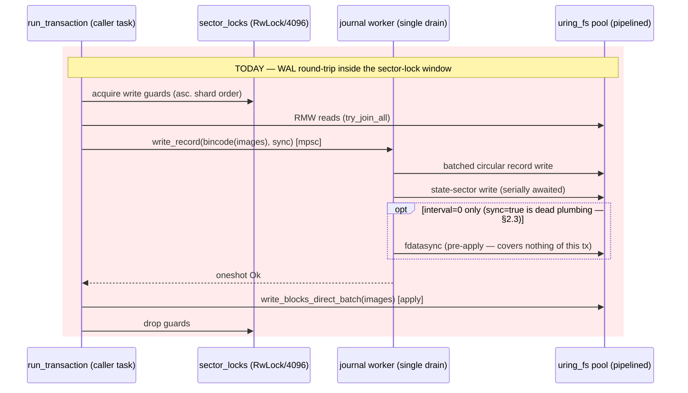
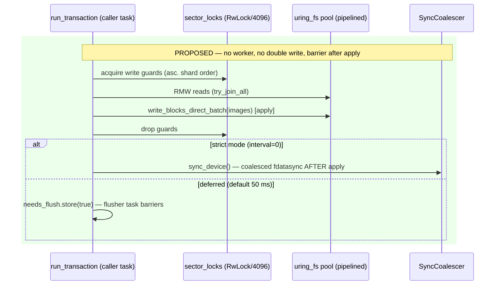

# Design Doc: MetaLV Metadata Durability — Retiring the Write-Only WAL and Making the Sector-Commit Crash Contract Explicit

> **Superseded** by `docs/design-cow-kv-metadata.md` (CoW KV metadata: checksummed journal + root-flip checkpoints; §7.2 there answers this document's WAL-deletion findings point-by-point). v2 support removed `fd22b69` (user directive: always forward) — the v2 sector-commit code this document describes no longer exists in the tree; the D0/D1/D2 contract here is historical context only.

| | |
|---|---|
| **Title** | SqueezeFS metadata WAL role & crash consistency: durability story for the MetaLV sector-commit path |
| **Author** | _(placeholder — assign on review)_ |
| **Date** | 2026-07-07 |
| **Status** | **Draft** |
| **Repo** | `/home/justin/Source/squeezefs`, branch `dev` @ `9ed068a` |
| **Intended home** | `docs/design-wal-crash-consistency.md` |
| **Reviewers** | MetaLV / FUSE owners |
| **Related** | `docs/design-transaction-lock-removal.md` (the approved sector-commit design; esp. §3.9 and review Issue 15), commits `07abb04` (PR 8: replay deleted as unsound), `d3a49fe` (pipelined uring_fs + `write_at_batch` + xxh3 WAL trailer), `1f66ed5`/`13e2e01` (sector-commit PRs 6–7), `a99c292` (loom models), `AGENTS.md` (non-negotiables) |

---

## Overview

Every MetaLV metadata commit today writes a WAL record that **nothing ever reads**. PR 8 of the transaction-lock-removal chain (`07abb04`) deleted `journal::replay` because it was unsound (no tail/checkpoint discipline → replay could re-apply stale records over newer sector states), but it kept the WAL *write* path as "the durability-barrier mechanism". Verified against the code, that framing no longer holds: the record write contributes nothing to any acknowledged durability guarantee, costs roughly **half of all metadata write volume plus a per-commit round-trip through a single-drain worker task**, and — worse — the journal's fixed region `[104 MiB, 108 MiB)` **physically overlaps the xattr blocks of inodes 1024–1151**, silently corrupting them on every journal wrap (§2.6, a live P0-class defect verified by arithmetic against `xattr.rs` and `journal.rs` constants).

This design decides the durability story: **delete the WAL write path entirely (Alternative C), replace its two residual live side-effects (the deferred flush timer; the interval-0 "sync-on-commit" mode) with explicit post-apply barriers, make the crash-consistency contract explicit and verified (per-4-KiB-sector atomicity delegated to the storage stack, probed at mount, strict-mode enforceable), quarantine the overlapping inode range, add a real crash/fault-injection test harness, and fold in reclaim group-commit (batched `destroy_inode`)** to attack the measured `Metadata Delete` ceiling (~2.2 k ops/s vs 55–65 k Stat). On-disk formats are byte-unchanged; pre-existing binaries keep mounting volumes touched by this design. A sound checkpointed-redo WAL (Alternative A) is specified in enough detail to be buildable later (§7.1) — the journal region stays reserved for it — but is rejected *now* because its soundness precondition (log-durable-before-apply) adds a device flush to the deferred commit path that today has none, inverting the perf goals for a protection level the current contract does not promise.

---

## 2. Background & Motivation

### 2.1 The sector-commit path today (verified)

`MetaLvBackend::run_transaction` → `run_transaction_sector_locked` (`src/meta_backend/mod.rs:158`, `:190`):

1. Closure runs with **no** global lock, staging sub-sector patches into the `ACTIVE_TX` task-local (`storage.rs:61-63`; `write_blocks` staging at `storage.rs:634-648`).
2. Patches are grouped by 4 KiB sector (`BTreeMap`, splitting multi-sector patches at sector boundaries, `mod.rs:265-281`).
3. Distinct sector-lock **shard indices** are collected, sorted ascending, deduped (`mod.rs:291-296`); write guards acquired in that total order (`mod.rs:306-315`) over the fixed `StripeLocks<RwLock, 4096>` array (`storage.rs:12`, `:46-48`).
4. RMW reads for all touched sectors run concurrently (`try_join_all`, `mod.rs:327-333`); patches are overlaid into full-sector images.
5. **One WAL record** — `bincode::serialize(&images)` — goes to `journal.write_record(&self.storage, &record, sync)` (`mod.rs:343-351`).
6. The images are applied **in place** as one batched uring-fs message (`write_blocks_direct_batch`, `mod.rs:353-361` → `storage.rs:665-675` → `uring_fs::write_at_batch`, `uring_fs.rs:250`).
7. Sector guards drop only after apply (`mod.rs:371-372`).

Because steps 5–6 both happen under the held sector write locks, **per-sector WAL order == per-sector apply order** (the invariant the prompt asked to verify: confirmed — for any one sector, a second transaction cannot enqueue its record before the first transaction's apply completes, since it cannot take the sector write lock until the guard drops). *Across* sectors, WAL order is journal-worker drain order and carries no cross-sector guarantee — acceptable for full-image redo, and moot once the WAL is gone.

### 2.2 The journal today (verified)

`src/meta_backend/journal.rs`, region fixed by `Journal::new(1024*1024*104, 1024*1024*4)` (`mod.rs:89`; the same values are written into `Superblock.journal_start/journal_size` at format, `mod.rs:465-466`, but never read back — the runtime hardcodes them):

- **State sector** at 104 MiB: `LVJOURNL` magic, `head` at bytes 8..16, `tail` at 16..24. Since PR 8, `tail` is persisted **equal to** `head` ("journal drained", `journal.rs:191-201`) so both current and pre-PR-8 binaries see an empty journal at mount.
- **Records**: `len (LE u32) | payload | xxh3_64(payload) LE 8 B | zero-pad to 4096` — `encode_record` (`journal.rs:89-99`), layout pinned by `test_encode_record_layout` (`journal.rs:243-266`). The xxh3 trailer replaced truncated SHA-256 in `d3a49fe` (the crypto cost was 3.7 % of daemon cycles under delete storms).
- **Worker**: one detached task per volume, single `mpsc` drain loop (`journal_worker_loop`, `journal.rs:101`; channel capacity 1024, `journal.rs:39`). Per drain: batch ≤ 32 requests (`journal.rs:151-157`), build all records into **one** batched circular write (`journal.rs:168-187`), then a **serially awaited** state-sector write (`journal.rs:202-208`), then `fdatasync` iff any request had `sync=true` or `SQUEEZEFS_JOURNAL_FLUSH_INTERVAL_MS=0` (`journal.rs:211-218`; the `sync=true` leg is never exercised in practice — §2.3); otherwise a detached 50 ms deferred-flush timer covers it (`journal.rs:125-148`).
- **Reader**: none. `replay`/`read_circular` were deleted in PR 8 as unsound (stale-`tail` windows could re-apply superseded sector images over newer durable data on a routine mount).

### 2.3 What the WAL actually buys today: nothing

The record is written *before* the apply, but:

- **It is never read.** No mount-path caller, no repair path (`grep` confirms: the only journal consumer is `write_record` from `mod.rs:349`).
- **It does not carry acked durability — and its `sync` plumbing is fully inert.** The FUSE `fsync` path (`fuse_client.rs:4116-4127`) wraps `flush_inode_to_backend` in `FORCE_SYNC_TX.scope(true, …)`, but **no metadata transaction ever executes inside that scope**: every metadata write inside the scope funnels through the single non-transactional sink `RoutedMetaBackend::set_layout_and_size` (`mod.rs:2339-2355`) — reached directly via `persist_dirty_layout_if_needed` → `save_metadata_to_backend` (`routing.rs:802`) and, second path, via `flush_single_active_block`'s block-map update (`save_metadata_to_backend`, `fuse_client.rs:5513`). That sink is deliberately non-transactional ("Persist layout xattr + size with fine locks (no journal transaction_lock)") — direct `xattr::set_xattr` + `inode::write_inode` under the DLM inode lock, no `run_transaction`, no WAL record. Everything else in the scope (memory-buffer flush, the active-block data writes themselves, staging `sync_key`) is data-path. So the flag's single reader (`mod.rs:283`) never observes `true`, `write_record` is never called with `sync=true`, the worker's `force_sync` fdatasync branch (`journal.rs:211-218`) fires **only** in interval-0 mode (§2.5), and the comment at `journal.rs:124` ("FUSE fsync/fsyncdir still force a full barrier via FORCE_SYNC_TX") is stale. The op's actual durability comes from the **trailing** `sync_device_for_ino` at the end of `flush_inode_to_backend` (`fuse_client.rs:1492` → `sync_device` → `SyncCoalescer::barrier` → `uring_fs::fdatasync`, `mod.rs:143-156`). A small-file fsync therefore already performs exactly **one** physical meta flush — which is why `tests/fsync_single_barrier_tests.rs` passes — and `FORCE_SYNC_TX` is dead plumbing end-to-end. (An earlier draft of this document claimed a second, uncounted worker flush per fsync; code verification disproved that — corrected per review Issue 1.)

### 2.4 The torn-apply crash window

If the host dies mid-`write_blocks_direct_batch`, a 4 KiB sector image can land partially (torn). There is no repair path. The de-facto contract (design-transaction-lock-removal §3.9, unchanged since) is *per-sector consistency + acked-fsync durability*, resting on the hope that 4 KiB sector writes are atomic across power loss. For **file-backed** meta volumes that hope is unfounded: `uring_fs` opens paths **buffered** (no `O_DIRECT` — `cached_open`, `uring_fs.rs:378-394`), so a power loss during page writeback can tear a sector at device granularity (512 B LBAs). For **process crashes** (kill -9, panic) a completed 4 KiB page-aligned buffered write is not torn — the page cache holds the full image and the kernel writes it back. The window is therefore: **host power loss / kernel crash, on storage without 4 KiB atomic-write guarantees.** The WAL as written *cannot close this window even if a reader existed*, because in deferred mode the record itself races the apply through the page cache (both can tear; see §7.1 for what soundness actually requires).

### 2.5 A concrete durability bug: `SQUEEZEFS_JOURNAL_FLUSH_INTERVAL_MS=0` flushes the wrong bytes

The knob is documented "Set to 0 for sync-on-commit durability" (`journal.rs:122-124`). In that mode the worker fdatasyncs after the **record + state** write (`journal.rs:212`), but the transaction's **apply** (`mod.rs:353-361`) has not been issued yet — it lands in page cache after the barrier and is not covered until some *later* barrier. Since nothing replays the record, the mode's promise is false: the last pre-crash transaction is durable only in a log nobody reads. (Interval-0 is also the *only* mode in which the worker's fdatasync branch executes at all — the `sync=true` leg is dead, §2.3.) This design fixes it by moving the strict-mode barrier **after** the apply (§4.2).

### 2.6 A live corruption bug: the journal region overlaps xattr blocks (inos 1024–1151)

Verified arithmetic: xattr blocks live at `XATTR_BLOCK_START (72 MiB) + ino * 32 KiB` (`xattr.rs:5-6`, `get_xattr_block_offset` `xattr.rs:47-49`, **no bounds check**). Ino 1024 → `72 MiB + 32 MiB = 104 MiB` — **exactly** `journal_start`. Inos **1024..=1151** map into `[104 MiB, 108 MiB)`, the state sector + circular log. The allocator permits them: `inode_limit = min(20000, (size − 72 MiB) / 32 KiB)` (`storage.rs:99-106`, `:148`) — 5 888 on the standard 256 MiB test volume, 20 000 on production volumes. Consequences today: `setxattr` on such an ino overwrites the journal state sector / records; every journal wrap (~4 MiB of commits) scribbles over those xattr blocks. Nothing detects it (the xattr block magic check, `xattr.rs:142-144`, silently returns "no xattrs"). This has escaped notice because test workloads recycle low inos and client-registration xattrs live on ino 1. **Any resolution of the WAL question must also resolve this overlap** (§4.4).

### 2.7 Perf: the journal worker is the residual serializer

After `d3a49fe` (pipelined uring workers, batched commit writes), the metadata write path's remaining serialization is the single `journal_worker_loop` drain: every commit pays record encode (bincode full-image copy + `encode_record` copy + xxh3), an mpsc hop into one worker task, **two serially awaited device writes per drain** (record batch, then state sector), and an oneshot hop back — before it may apply. Measured context:

- `benches/meta_lv_bench.rs` (criterion artifacts in `target/criterion/meta_lv_metadata/`): `create_unlink_file` ~191 µs (slope; 212 µs mean) — three transactions (create, unlink, destroy), i.e. three worker round-trips; `lookup_file` ~6.1 µs; `set_get_xattr` ~137 µs.
- Mount bench: **Metadata Delete ~2.2 k ops/s** vs Stat 55–65 k (`src/main.rs:4416`; delete = FUSE unlink transaction + FORGET-driven background reclaim `destroy_inode` transaction per file, `fuse_client.rs:1856`, `mod.rs:942-978`). Provenance caveat: these figures come from the delete-storm investigation and are recorded nowhere in the repo (only the bench *row* is verifiable); Rollout §3 makes committing a reproducible mount-bench baseline a hard precondition of PR 4 so the ≥2× gate is enforceable (review Issue 6).
- Write amplification per commit of N sectors: N×4 KiB RMW read + ~N×4 KiB record + 4 KiB state sector + N×4 KiB apply ⇒ **~2N+1 sector writes where N would do.**

Reclaim group-commit (batching destroy transactions) was flagged as a follow-up in the delete-storm investigation and folds into this design (§4.5).

### 2.8 Compatibility levers that do (and do not) exist

- `read_superblock` validates only the magic `METALV01` (`storage.rs:285-290`); the `version: 2` field is written (`mod.rs:461`) but **never checked anywhere**.
- **The mount path never reads the superblock at all** (verified: `read_superblock` has zero callers in `src/main.rs`; its only callers are `format`'s liveness check, `mod.rs:420`, and volume health). Consequence: *no purely on-disk change can force an existing binary to fail loud at mount.* Any format-changing alternative inherits this gap; the chosen design avoids a format change entirely **and** adds mount-time validation so that *future* format changes become fail-loud from this release forward (§4.6).

---

## 3. Crash-Consistency Contract (explicit)

The decision in this document is anchored on making the contract explicit rather than implied. Terminology below is used throughout.

| Level | Failure | Guarantee today (de facto) | Guarantee after this design |
|---|---|---|---|
| **D0** | Process crash (kill -9, panic, OOM) | All *completed* 4 KiB sector writes intact in page cache; kernel writes them back. Acked-fsync ops durable (trailing barrier). Un-acked ops may lose ≤ deferred-flush window. Per-sector consistency holds (sector writes are single-page buffered writes). Multi-sector transactions may still be split mid-apply — the batched apply is unordered across entries (`uring_fs.rs:245-250`) — the same op-level torn contract as D1. | **Identical**, now stated and tested (kill-9 harness, §4.7). |
| **D1** | Host power loss / kernel crash, meta volume on storage with 4 KiB atomic writes (NVMe with `AWUPF`/namespace ≥ 4 KiB or 4 KiB-LBA, or PLP) | Per-sector consistency holds *if* the stack honors 4 KiB atomicity — unverified, unprobed. Acked-fsync ops durable. Multi-sector transactions may be split (accepted since design-transaction-lock-removal §3.9). | **Identical guarantee, now probed at mount** (§4.6): atomicity advertised/verified, surfaced in stats, enforceable with `--strict-meta-atomicity`. |
| **D2** | Host power loss, file-backed volume or storage without 4 KiB atomic writes | A sector caught mid-writeback may tear; **no repair path**; tears surface later as invalid inode/dentry/xattr magic (`inode.rs:94-106`). The WAL provides zero protection (no reader; record races apply through page cache). | **Identical exposure, minus the false comfort**: documented dev-only, detected at mount probe, quantified by the torn-write harness (§4.7). Repair remains out of scope (see §7.1 for the future path). |

**Acked durability** (`fsync`/`fsyncdir` returning success) is carried solely by the post-apply coalesced `fdatasync` barriers (`sync_device_for_ino` / `sync_all_devices`, `mod.rs:2322-2337`) — true today (§2.3), preserved verbatim.

The WAL contributes to none of these rows. That is the crux of the decision.

---

## Goals & Non-Goals

### Goals

1. **Decide the WAL's role**: keep-and-fix, or delete. (Decision: **delete the write path**; preserve the option of a future sound redo log, §7.1.)
2. Make the crash contract (D0/D1/D2) explicit, tested, and observable — including a crash/fault-injection harness that actually simulates torn writes and kill -9 (§4.7).
3. Fix the verified defects the investigation surfaced: the interval-0 durability hole (§2.5), the xattr/journal overlap (§2.6), the fully inert `FORCE_SYNC_TX` plumbing (§2.3), and the missing mount-time format validation (§2.8).
4. Remove the journal worker as the residual metadata-write serializer; halve metadata write amplification; fold in reclaim group-commit. Perf gates: no regression on `meta_lv_bench` (`create_unlink` ~191 µs, `lookup` ~6.3 µs, `xattr` ~137 µs) with an expected improvement on `create_unlink`/`xattr`; **Metadata Delete ≥ 2×** (~2.2 k → ≥ 4.5 k ops/s); fsync path: **unchanged** — it already performs exactly one coalesced post-apply barrier (§2.3), and the `meta_device_syncs` single-barrier contract must stay green through the `FORCE_SYNC_TX` deletion.
5. Preserve on-disk compatibility with zero format change: pre-existing binaries mount volumes touched by this design and vice versa; the journal state sector's "drained" bytes stay valid.
6. Stay within `AGENTS.md` non-negotiables: io_uring-first (all I/O stays on `uring_fs` batch APIs), no dead code (the WAL module is deleted, not stubbed), latch-free hot paths, lock order P1-9 (`stripe_locks.rs:10-25`) untouched, TDD per PR, full verification gate incl. bench smoke.

### Non-Goals

- Multi-sector transaction atomicity across crashes. Never provided (design-transaction-lock-removal §3.9), not provided here; §7.1 documents what it would take.
- D2 torn-sector *repair*. Out of scope; detection + documentation only. The reserved journal region and §7.1 keep the door open.
- Data-path (`NvmeBlockDev`, staging, striped) crash recovery — `recover_staging` (`src/recovery.rs:3-12`) remains a stub; out of scope here (tracked separately).
- Changing the sector-commit concurrency protocol (sector locks, DLM, dentry buckets) — this design sits strictly inside the existing commit critical section.
- Distributed/multi-node metadata replication.

---

## 4. Proposed Design

### 4.1 Decision summary

| Concern | Today | Proposed |
|---|---|---|
| WAL record write per commit | bincode + `encode_record` + circular write + state-sector write via single-drain worker | **Deleted** (`journal.rs` module removed; `MetaLvBackend.journal` field removed) |
| Commit critical section | locks → RMW read → **WAL round-trip** → apply → unlock | locks → RMW read → apply → unlock |
| Deferred durability (default 50 ms) | timer task owned by the journal worker (`journal.rs:132-148`) | equivalent per-volume flusher task owned by `MetaLvBackend` (§4.2) |
| Interval-0 "sync-on-commit" mode | flushes record **before** apply — broken promise (§2.5) | post-**apply** coalesced `sync_device()` per commit — promise kept |
| FUSE fsync barriers | one trailing `sync_device_for_ino`; `FORCE_SYNC_TX` is inert plumbing that gates nothing (§2.3) | **unchanged** single trailing barrier; the dead `FORCE_SYNC_TX` plumbing deleted (§4.3) |
| Torn-apply protection | "hope 4 KiB writes are atomic" | explicit D0/D1/D2 contract + mount probe + strict mode (§4.6) |
| Journal region `[104 MiB, 108 MiB)` | actively written; **corrupts xattr blocks of inos 1024–1151** | never written; region reserved; overlapping ino range quarantined in the allocator (§4.4) |
| `destroy_inode` reclaim | one transaction per ino through the full commit path | group-commit batches (§4.5) |
| Crash testing | none (only `FAIL_NEXT_WRITES`-style hooks on the data path, `nvme_dev.rs:24-41`) | torn-write shim + kill-9 remount harness (§4.7) |

### 4.2 Deleting the WAL write path

**What is removed** (PR 4): `src/meta_backend/journal.rs` entirely (struct `Journal`, `write_record`, `encode_record`, `journal_worker_loop`, its tests), the `journal` field of `MetaLvBackend` (`mod.rs:82`, `:89`, `:93`), the `bincode::serialize` + `write_record` block in the commit (`mod.rs:343-351`), and the `meta_wal_batch_size` metric (`fuse_client.rs:348-350`, stats JSON `fuse_client.rs:931`). The `bincode` dependency **stays** — audit done: `routing.rs` (`:649`, `:662`, `:749`, `:795` — layout/indirect maps), `tiering/dht.rs` (`:310`, `:335`), and `block_allocator.rs` (`:290`, `:341`) still use it; only the commit-path serialize call is deleted, so `Cargo.toml` is untouched.

**What replaces its two live side-effects:**

1. **Deferred flush timer** — a per-volume flusher owned by `MetaLvBackend` (constructed in `new`, torn down with the backend): same `AtomicBool needs_flush` protocol as today; every successful commit apply sets it; a `tokio::time::interval` task swaps it and issues `uring_fs::fdatasync(device)`. The interval knob is renamed to **`SQUEEZEFS_META_FLUSH_INTERVAL_MS`** (a `JOURNAL_`-named knob controlling a flusher with no journal is a permanent naming wart), with `SQUEEZEFS_JOURNAL_FLUSH_INTERVAL_MS` retained as a legacy alias — the old name is "documented" only in a source comment today (`journal.rs:122-125`; it appears in no README/QUICKSTART/AGENTS table), but operators may have scripted it; the new name wins if both are set, and PR 6 documents both properly. Task lifecycle is tied to the backend via the same `Arc::strong_count` sentinel used today (`journal.rs:140-142`) so dismount cannot leak it (regression-tested against `dismount_teardown_tests.rs` patterns).
2. **Strict mode (`…_INTERVAL_MS=0`)** — `run_transaction_sector_locked` calls `self.sync_device().await` **after** `write_blocks_direct_batch` returns and **before** dropping the sector guards is *not* required (the guards protect RAM consistency, not durability) — the barrier runs after guard drop to keep hot sectors unblocked; `sync_device` is already group-commit-coalesced (`sync_coalescer.rs`), so concurrent strict-mode commits share one `fdatasync`. This fixes §2.5: the barrier now covers the apply bytes.

**Commit path, before → after:**





The commit critical section shrinks to `[RMW read → apply]` — exactly the window invariant #1 (no lost same-sector RMW) requires; nothing else changes in the protocol, so the sector-commit correctness argument of design-transaction-lock-removal §3.3 carries over verbatim.

**Journal state sector & region:** never written again. Existing volumes already carry `tail == head` (every post-PR-8 session persisted it); freshly formatted volumes have it zeroed by `wipe`. If a **pre-PR-8 or pre-this-design binary** later mounts the volume, it reads a valid drained state (or an invalid-magic zeroed sector → `head = 0`, `journal.rs:112-120`) and resumes journaling into the reserved region — the same behavior class as today, no new hazard (see §4.4 for the one interaction that matters). `Superblock.journal_start/journal_size` keep being written at format (`mod.rs:465-466`) so the region stays declared/reserved on disk. The existing guard test `test_reconciliation_does_not_touch_journal` (`tests/meta_lv_tests.rs:131-159`) is *strengthened* into "no code path in a full mutation session writes `[104 MiB, 108 MiB)`" — authored in PR 3 as `#[ignore]`-until-PR-4 (it is red by definition while the worker still writes the region on every mutation), enforced from PR 4 (§4.7, review Issue 3).

### 4.3 fsync semantics: delete the inert `FORCE_SYNC_TX`, keep the single trailing barrier

Verified (§2.3): `FORCE_SYNC_TX` is dead plumbing end-to-end. Its single reader is the commit's `sync` flag (`mod.rs:283`), but its single scope site (`fuse_client.rs:4125-4127`) wraps a path that never executes a `run_transaction` — the layout/size persist is deliberately non-transactional (`set_layout_and_size`, `mod.rs:2339-2355`) and everything else in the scope is data-path — so the reader always observes `false` and the worker's `sync=true` flush never fires. The fsync guarantee is, and remains, `flush_inode_to_backend`'s trailing `sync_device_for_ino` (`fuse_client.rs:1492`), intentionally the *single* barrier (`fuse_client.rs:4116-4121`, pinned by `tests/fsync_single_barrier_tests.rs` / `fsync_coalescing_tests.rs`).

Therefore PR 4 deletes the `FORCE_SYNC_TX` task-local (`storage.rs:63`), its scope wrapper, the `sync` parameter chain, and the stale comment at `journal.rs:124` — a pure no-dead-code removal with **zero behavior change on the fsync path**: it is exactly one physical `fdatasync` per small-file fsync today and exactly one after (an earlier draft claimed a 2 → 1 improvement here; disproven by code verification, review Issue 1). `fsyncdir` (`fuse_client.rs:4149-4154` → `sync_all_devices`) is untouched. The durability proof obligation — "every path that acks durability ends with a coalesced post-apply barrier" — is discharged by `test_acked_fsync_survives_kill` (§4.7) and the existing fsync test suites, which are retained unchanged as the regression gate for this deletion (they assert a property that is already true and must stay true).

### 4.4 Quarantining the xattr/journal overlap (inos 1024–1151)

Independent of the WAL decision this is a live corruption bug (§2.6) and lands **first** (PR 2):

- `InodeAllocator` gains a reserved range: `[1024, 1152)` is pre-marked at construction and excluded from `alloc()`/popcount (`alloc_core.rs` gets `reserve_range(start, end)` + a `reserved_count` so `allocated_count()` stays truthful; the loom models in `loom-models/src/lib.rs` extend to cover claim-vs-reserved non-interference since they `#[path]`-include the shipped core).
- **The on-disk bitmap cache marks the range too** (review Issue 2): `refresh_bitmap_from_table` (`storage.rs:582`, run on mount **and** clean unmount) sets bits 1024–1151 in the offset-4096 bitmap sector, **and `format_with_options` sets them in its initial bitmap write** (`mod.rs:471-475`, today bits 0–1 only) — so a volume formatted by a ≥ PR 2 binary is protected even if handed straight to a legacy-allocator binary without ever being mounted by a new one (round-2 review Issue 1); volumes formatted earlier become protected at their first ≥ PR 2 mount/clean-unmount. The reconciled bitmap's in-tree rationale names "pre-PR-8 binaries, which read it to allocate" (`storage.rs:574-582`), but history-level verification draws the effective protected class at **pre-PR-2b** (< `93f1099`) — reconciliation-era binaries rewrite the bitmap from the table themselves and erase the marks (see the generation matrix below, round-3 review Issue 1). Without the marks, a legacy-allocator binary mounting a post-quarantine volume could still allocate a quarantined ino, `setxattr` into the journal region, *and* journal over it. Set bits read as "in use" to the legacy allocator, so that generation is blocked by the same reconciled cache it already trusts. Format-neutral (the bitmap is a declared rebuildable cache). **Metric interaction** (round-2 review Issue 1): the quarantine range is **excluded from the healed-bits XOR accounting** — `refresh_bitmap_from_table` pre-seeds bits 1024–1151 into both the `prior` snapshot and the rebuilt image before the diff (`storage.rs:588-604`) — so `meta_inode_alloc_reconciled` keeps its documented meaning of *unexplained* divergence ("non-zero on a clean mount ⇒ investigate", `fuse_client.rs:345-347`) instead of firing ~128 on every pre-quarantine volume's first refresh. The existing green tests are updated accordingly in PR 2: `test_metrics_inode_alloc_reconciled_counts_healed_bits` (`sector_commit_tests.rs:973-986`, "clean refresh heals zero" must stay true with the quarantine bits masked) and `test_refresh_bitmap_from_table_round_trip` (`meta_lv_tests.rs:84-115`, its "mirrors the table" comment gains the quarantine-range exception).
- Mount reconciliation (`seed_inode_alloc_from_table`, `storage.rs:570`) counts magic-valid inodes found **inside** the quarantined range into a new `meta_quarantined_inodes` metric and logs loudly — those files predate the fix; their inode slots are fine (inode table is far below 72 MiB) but their *xattr blocks* are presumed corrupt. They remain readable/unlinkable; `setxattr` on them returns `EIO` with a log (bounds check in `get_xattr_block_offset` callers) rather than scribbling on the reserved region.
- **Read semantics for quarantined inos** (review Issue 4): regular xattr reads already degrade safely — the block magic check (`xattr.rs:142-144`) turns a corrupted block into "no xattrs". **Symlink-target reads do not**: `get_xattr(…, "system.symlink")` copies `inode.size` raw bytes from the xattr block with *no* validation (`xattr.rs:122-130`), so a pre-fix symlink whose ino landed in 1024–1151 would serve journal-record garbage as its readlink target — corruption returned as data. PR 2 therefore returns `EIO` for `system.symlink` reads on quarantined inos (the content is unrecoverable; an error beats silent garbage), states the regular-xattr degrade-to-empty behavior explicitly, and has the mount log line break `meta_quarantined_inodes` down by symlink vs regular (symlinks lost *content*, not just attributes).
- Why quarantine instead of relocating xattr blocks: relocation is an on-disk format change (breaks the `72 MiB + ino*32 KiB` invariant every binary hardcodes) for 128 inos out of 20 000 (0.64 % of the namespace); not worth the migration. Revisit only if a future format bump happens anyway (§7.1; resolved Open Question 2 — deferred to that trigger by owner decision).

With the WAL deleted, current binaries never write the region — but an **older binary** mounting the volume would journal into it again. The quarantine's protection is generation-precise, with the boundary verified against git history (round-3 review Issue 1 — the boundary is **PR 2b**, not PR 8): (a) binaries carrying this design's PR 2 are blocked by the in-RAM reserved range, and maintain the on-disk marks at format/mount/clean-unmount; (b) **pre-PR-2b binaries** (< `93f1099`, "mount + clean-unmount inode reconciliation") allocate exclusively from the on-disk bitmap and are blocked **while the marks stand** — with a narrow caveat: if such a session destroys a *legacy occupant* whose ino is in 1024–1151, its `free_inode_bit_locked` clears that bit and lowers `free_ino_hint` to it (`07abb04~1:storage.rs:235-246`), making that exact ino re-allocatable (and its xattr block journal-scribbled) until the next ≥ PR 2 mount/clean-unmount re-marks it; (c) **reconciliation-era binaries** — the window `[93f1099 (PR 2b), this design's PR 2)`, which *includes* PR 8 — run their own `refresh_bitmap_from_table` at every mount and clean unmount, rebuilding the bitmap **purely from the inode table** (verified at `93f1099`) and thereby **erasing the quarantine marks**; their allocation is then unconstrained from disk (flag-off sessions in `[93f1099, 07abb04)` allocate from the freshly wiped bitmap; flag-on/post-PR-8 sessions use the table-seeded in-RAM allocator, which ignores the bitmap entirely — §2.8). A (c)-generation mount also *temporarily de-protects subsequent (b) mounts* until a ≥ PR 2 binary re-marks the bitmap. Generation (c) spans only this repo's own `dev` history — no released format — and is called out in release notes together with the (b) free-then-reuse caveat. Pre-existing overlapped xattr blocks are already presumed lost (same as today). This is the compat interaction promised in §4.2.

### 4.5 Reclaim group-commit (batched `destroy_inode`)

Today each FORGET-driven reclaim (`queue_reclaim_inode` → 100 000-deep channel → `reclaim_orphaned_inode`, `fuse_client.rs:653-664`, `:1856`) issues one `destroy_inode` transaction per ino (`mod.rs:942-978`) — under delete storms, thousands of tiny commits (zero one 256 B slot each). With 16 inode slots per sector (`inode.rs:5-7`), batching is almost free concurrency-wise: sequential allocation clusters doomed inos in the same sectors.

Design (PR 5):

- The reclaim consumer drains the channel in batches of up to `R = 64` inos (tunable `SQUEEZEFS_RECLAIM_BATCH`), filters per today's rules (skip open inos, `nlink > 0`, reserved inos — preserving **both** of today's open-checks: the enqueue-time check in `queue_reclaim_inode`, `fuse_client.rs:653-664`, and the drain-time re-check), then calls a new `RoutedMetaBackend::destroy_inodes(batch)` per owning volume.
- `MetaLvBackend::destroy_inodes(&[Ino])`: take DLM exclusive locks on **all** inos via the existing canonical-order `lock_many` (`mod.rs:600`, `dlm.rs`) — deduped stripe order, same deadlock-freedom argument as rename; re-validate `nlink == 0` per ino under the locks (preserving the P0-8 TOCTOU check, `mod.rs:946`); **one** `run_transaction` staging all slot zeroes (patches to the same sector merge into one image — up to 16 destroys per sector image, one apply write); on commit success, `inode_alloc.free()` each (preserving Key Decision 11 ordering: free strictly after durable zero).
- **Scope: only the metadata destroy transaction is batched** (review Issue 5; ordering corrected per round-2 review Issue 3 against `fuse_client.rs:1884-1898`). The per-ino work stays per-ino and keeps **today's split around the destroy**: `router.delete_file` (data-path block/staging teardown, `:1887`) runs **before** batch admission — as it precedes `destroy_inode` today — and on failure the consumer **logs and proceeds to the destroy anyway**, matching today's semantics (the result is discarded, `let _ = …delete_file(…)`; gating admission on `delete_file` success would be a new policy under which a persistently failing data teardown leaks the inode slot forever — rejected: the slot zero is the authoritative reclaim and blocks are refcount-recoverable). Lease release, `active_posix_locks` cleanup, and `metadata_cache`/`attr_cache` invalidation (`:1892-1897`) run per-ino **after the batch's commit**, exactly as they run after `destroy_inode` today — invalidating *before* a now-deferred batched zero would open a window for a straggling `getattr` to repopulate `attr_cache` from the still-valid slot and survive the zero as a ghost entry.
- **Mid-batch failure semantics**: a batch commit error must not wedge 63 innocent inos on one persistently bad sector (today one bad ino affects only itself). The consumer **bisects on failure** — split the batch in half, retry each — terminating at size-1 sub-batches whose behavior is byte-for-byte today's per-ino path. `free()` runs only for inos whose (sub-)batch committed. **Failed (sub-)batch inos still receive the per-ino lease/POSIX-lock/cache teardown** (round-3 review Issue 3): today a failed destroy is not fully dropped — `reclaim_orphaned_inode` discards the destroy result too (`let _ = backend.destroy_inode(ino)`, `fuse_client.rs:1890`) and proceeds unconditionally to lease release, `active_posix_locks` cleanup, and both cache invalidations (`:1892-1897`) — so the batched path runs the same teardown on both the success and failure edges (invalidating caches for a still-live slot is safe; skipping it would leave leases lingering to TTL expiry and stale cache entries, a divergence from today). Only `free()` is withheld on failure; the failure itself is logged as today's is not (a strict logging improvement).
- Lock-order note: this holds multiple I-stripe locks concurrently — exactly the pre-existing `lock_many` pattern; no new level in P1-9. Batch size caps guard-vector length and DLM hold time; a batch containing a stripe collision degrades to fewer distinct guards (dedup), never deadlock.
- Expected effect: destroy cost amortizes ~R× on the meta side; combined with §4.2 (unlink and destroy each lose the worker round-trip), the **Metadata Delete ≥ 2×** gate (Goal 4) is conservative. The gate is stated **net of the unchanged per-ino data-path cost**: the mount bench's small files are inline/staged layouts whose `delete_file` is cheap relative to the two metadata transactions each delete pays today (§2.7); the committed mount-bench baseline (Rollout §3) records the meta/data split so the gate is auditable at PR 5 review. `meta_reclaim_batch_size` histogram added for headroom tracking.


### 4.6 Verified sector-atomicity: probe + strict mode + docs

D1's guarantee is only as good as the storage stack, so stop assuming and start probing (PR 6):

- **Mount-time probe** of each meta volume path: block device → read `queue/logical_block_size`, `queue/physical_block_size`, and (kernels ≥ 6.11) `queue/atomic_write_unit_max_bytes` from sysfs; classify as `atomic4k` (logical or atomic unit ≥ 4096), `likely` (physical ≥ 4096, logical 512), or `unknown` (file-backed, missing attrs). Regular file → `file-backed (dev)`. Result logged at mount and exposed on the stats inode as `meta_volume_atomicity` (string per volume) — per `AGENTS.md` "Stats surface", live signals over ad-hoc logging. **Probe I/O mechanism**: one-shot `std::fs::read_to_string` of the sysfs attributes at mount, deliberately *not* routed through `uring_fs` — these are tiny synchronous kernel-generated strings on a once-per-mount control path, not a data-plane I/O the kernel can accelerate; `AGENTS.md` scopes the io_uring rule to I/O paths "where practical", and pinning sysfs fds in the uring workers' fd-cache would buy nothing while costing cache slots.
- **`--strict-meta-atomicity` mount flag** (and config-file equivalent via `config_ops`): classification below `atomic4k` ⇒ **mount fails loud** with the classification in the error. Default off (dev file-backed volumes are the test substrate).
- **Docs**: `QUICKSTART.md`/`README.md` gain a "Metadata durability" section stating D0/D1/D2 verbatim from this doc; `AGENTS.md` (single source of truth) gets a two-line pointer under Error Handling & Crash Recovery.
- Explicitly rejected here: converting meta-volume I/O to `O_DIRECT` to bypass the page cache. It changes alignment/ownership constraints across every `uring_fs` caller and forfeits the page cache that the read path (e.g. `lookup` at 6 µs) currently enjoys; it also does not by itself add atomicity. Revisit with data if D1 probing shows fleet volumes stuck at `likely`.

### 4.7 Crash / fault-injection test harness (tests-first infrastructure)

Two complementary harnesses, landing **before** the WAL deletion so PR 4 can demonstrate contract preservation (PR 3):

**(a) Deterministic torn-write + dead-device shim in `uring_fs`.** Mirrors the established data-path precedent (`nvme_dev.rs:24-41`, `SIMULATE_CORRUPTION` / `FAIL_NEXT_WRITES` — live, test-exercised statics, so no dead-code violation):

```rust
// src/uring_fs.rs — consulted in Reactor::admit() for Write/WriteAtBatch;
// one relaxed atomic load when disarmed (default), zero branches taken.
pub struct TornWriteFault {
    /// Absolute file offset of the 4 KiB sector to tear (u64::MAX = disarmed).
    pub offset: AtomicU64,
    /// Bytes of the matching write to persist before the "crash" (< 4096).
    pub keep: AtomicUsize,
}
pub static TORN_WRITE_FAULT: TornWriteFault = /* disarmed */;
/// After the torn write fires, every subsequent request on the SAME path
/// fails with EIO ("device died mid-commit") until `clear_faults()`.
```

Semantics: the first write intersecting `offset` is truncated to `keep` bytes (the prefix is genuinely written), completes with success *suppressed* — the caller sees `EIO` — and the path is poisoned. A test then simulates remount by constructing a **fresh** `MetaLvStorage` on the same file and asserts the contract. This deterministically reproduces "power loss tore sector S mid-apply" without root, KVM, or dm-flakey, and runs in the serial `cargo test` gate. (dm-flakey/dm-log-writes remain available for the root-level suites but cannot be part of the required gate.)

**(b) Kill-9 remount soak.** `tests/crash_kill_tests.rs` re-executes the test binary as a child (`std::env::var("SQUEEZEFS_CRASH_CHILD")` branch — the standard re-exec pattern, no production CLI surface added): the child runs a create/unlink/setxattr/destroy churn against a file-backed volume and appends to a side ledger (`ledger.log`) both an **op-start** record before each op and an **ack** record for each fsync-acked op (each ledger line written+fsynced before the corresponding action proceeds — start records are what make the invariant-3 bound assertable); the parent SIGKILLs it at a random 5–50 ms deadline, then remounts and asserts:

1. Every ledger-acked op is present (D0 acked durability).
2. Full-table sweep: every inode slot magic ∈ {0, `0x4E4F4445`}; `ensure_dentry_index` completes with no duplicate offsets; every dentry's `child_ino` resolves or the dentry is absent (per-sector consistency — the `352d776` class, across a crash).
3. `seed_inode_alloc_from_table` + `refresh_bitmap_from_table` succeed, and reconciliation is **explained, not merely small** (bound corrected per round-2 review Issue 2 — the on-disk bitmap is written only at mount/clean unmount, `main.rs:2048` / `fuse_client.rs:2056`, so after a kill-9 the healed bits reflect the *whole session's net table delta* since the last refresh, not the in-flight window): the parent snapshots the offset-4096 bitmap **before** triggering the remount refresh, scans the inode table itself, and asserts (a) **no wild bits** — every ino whose bit differs, **quarantine range 1024–1151 excluded per the §4.4 mask** (those bits are format/mount-set with no table backing and appear in no ledger; equivalently, diff against the post-refresh bitmap, which carries the same marks — round-3 review Issue 2), appears in the ledger as created-or-destroyed during this session (a differing bit for an ino the ledger never touched = corruption or an allocator/reconciliation bug), and (b) `meta_inode_alloc_reconciled` ≤ the ledger's `creates_started + destroys_started` since the last recorded refresh. The child ledger records op-start as well as ack entries precisely so (a) and (b) are assertable.

Runs N=20 rounds in the serial gate (< ~30 s, file-backed tmp volumes); a 500-round variant joins `tests/long_validation.py` for the nightly soak. Not loom: `loom-models/` model-checks lock-free protocol cores (`tests/run_loom.sh`), and no new atomics protocol is introduced here — the `needs_flush` bool is trivially racy-safe (worst case: one extra or one deferred-by-a-tick flush); noted in the PR 4 review notes rather than modeled.

**Contract tests (tests-first, written in PR 3; green against TODAY's behavior and kept green through PR 4–6 — except the two deliberately-red `#[ignore]`-until-PR-4 tests marked below, review Issue 3):**

| Test | Asserts |
|---|---|
| `test_acked_fsync_survives_kill` | ledger-acked ops present after kill-9 remount |
| `test_torn_apply_detected_not_amplified` | with a torn inode-table sector: reads of victim slots error (invalid magic) but *sibling sectors and the allocator seed* are unaffected — corruption does not spread |
| `test_strict_mode_flushes_apply` | `…_INTERVAL_MS=0`: commit returns ⇒ apply bytes durable (fault shim: poison device *after* commit returns; remount sees the op). **Red today (§2.5); `#[ignore]`-until-PR-4, enforced there** |
| `test_single_fsync_single_barrier` | existing suite, retained unchanged — already true today (§2.3: exactly one physical flush, equal to `meta_device_syncs`); guards the `FORCE_SYNC_TX` deletion in PR 4 against any accidental barrier change |
| `test_journal_region_never_written` | full mutation session leaves `[104 MiB, 108 MiB)` byte-identical (strengthens `meta_lv_tests.rs:131`). **Red today by definition — the worker writes the region on every mutation; `#[ignore]`-until-PR-4, enforced there** |
| `test_reserved_inos_never_allocated` | allocator never returns 1024..1152 under exhaustion churn |
| `test_legacy_bitmap_marks_quarantine` *(lands with PR 2)* | after **format**, after mount, and after clean unmount, an old-allocator-semantics read of the offset-4096 bitmap shows bits 1024–1151 set (pre-PR-2b legacy-allocator binaries cannot allocate the range while the marks stand — §4.4, review Issue 2 + round-2 Issue 1 + round-3 Issue 1), and `meta_inode_alloc_reconciled` stays 0 across a clean refresh (quarantine bits masked from the healed XOR) |

### 4.8 Lock order & concurrency: unchanged

No new lock level. The commit still acquires only (4c) sector-shard write guards in ascending deduped shard order inside a (4a) DLM-locked op; dentry (4b) bucket guards unchanged. Deleting the WAL removes an *await* (the worker oneshot) from inside the sector-lock window — strictly shrinking hold times on hot sectors (root directory sector 8192 et al.), which `meta_sector_lock_wait_ns` should show. Reclaim batching reuses the existing `lock_many` canonical order. P1-9 (`stripe_locks.rs:10-25`) is untouched; the doc comment gets a one-line note that the sector window no longer spans a journal await.

---

## 5. API / Interface Changes

All internal, with three deliberate public-surface exceptions: the additive `--strict-meta-atomicity` mount flag (PR 6), the flush-interval knob rename with legacy alias (§4.2), and PR 1's fail-loud mount validation — a documented behavior change for unformatted/blank meta paths (review Issue 7, see PR 1).

```diff
 // src/meta_backend/mod.rs
 pub struct MetaLvBackend {
     pub storage: storage::MetaLvStorage,
     pub dlm: dlm::DlmLockManager,
-    pub journal: journal::Journal,
     pub sync_coalescer: sync_coalescer::SyncCoalescer,
+    // per-volume deferred-flush flusher handle (Drop-tied), §4.2
 }
-pub mod journal;            // module deleted

 // src/meta_backend/storage.rs
 tokio::task_local! {
     pub static ACTIVE_TX: ...;
-    pub static FORCE_SYNC_TX: bool;      // deleted — verified inert, gates nothing (§2.3/§4.3)
     pub static TX_STATE: ...;
 }
+impl MetaLvStorage {
+    /// Mount-time format validation: magic METALV01 + version <= 2, fail loud.
+    pub async fn validate_superblock(&self) -> Result<Superblock>;   // PR 1
+}

 // src/meta_backend/mod.rs (PR 5)
+impl MetaLvBackend { pub async fn destroy_inodes(&self, inos: &[Ino]) -> Result<()>; }
+impl RoutedMetaBackend { pub async fn destroy_inodes(&self, inos: &[Ino]) -> Result<()>; }

 // src/meta_backend/alloc.rs / alloc_core.rs (PR 2)
+pub fn reserve_range(&self, start: u64, end: u64);   // quarantine, excluded from alloc+popcount

 // src/uring_fs.rs (PR 3, test-support statics per nvme_dev precedent)
+pub static TORN_WRITE_FAULT: TornWriteFault;
+pub fn clear_faults();
```

- **Mount flags**: `--strict-meta-atomicity` (PR 6). Env knobs: `SQUEEZEFS_META_FLUSH_INTERVAL_MS` (new canonical name; 0 = sync-on-commit, now actually true; default 50 ms) with `SQUEEZEFS_JOURNAL_FLUSH_INTERVAL_MS` as a legacy alias, new name winning if both are set (§4.2); both documented in PR 6. `SQUEEZEFS_RECLAIM_BATCH` added (default 64).
- **Callers of `write_record`**: exactly one (`mod.rs:349`); removed with the module. `sector_commit_tests.rs:1014` (WAL batch metric) is replaced by a commit-batch-size metric test (§Observability).

## 6. Data Model Changes

**No layout/format changes on disk** — the sole on-disk value delta is the superblock `checksum` field gaining a real value (resolved Open Question 4; backward compatible, first bullet). Explicitly:

- Superblock layout unchanged (`magic METALV01`, `version 2`, `journal_start/size` still written at format). PR 1 adds **mount-time validation** (new binaries reject unknown magic/version > 2) — closing the gap where mount today performs zero format validation (§2.8), so any *future* format change becomes fail-loud from this release forward. The `checksum` field is **populated by ≥ PR 1 binaries** (xxh3_64 over the struct bytes with the field zeroed) and **verified iff nonzero** (resolved Open Question 4) — a value change inside an existing field, not a layout change, and backward compatible both directions: legacy volumes carry 0 (verification skipped) and pre-PR-1 binaries never read the field.
- Journal state sector: last persisted value remains `LVJOURNL | head | tail==head` (or zeroed on fresh formats); never rewritten. Old binaries mounting later see a drained (or empty) journal — the exact PR 8 compatibility posture, unchanged.
- Inode/dentry/xattr layouts unchanged. The quarantine (§4.4) is an allocator + reconciled-cache policy, not a format change: quarantined inos are simply never handed out, and the bits set for them at format/mount/unmount live in the offset-4096 bitmap — a declared rebuildable cache, not format-bearing state; volumes carrying pre-fix files in that range remain valid.
- WAL record format: ceases to be written. Its byte layout (pinned by `test_encode_record_layout`) is preserved *in this document* (§2.2) and in git history for the Alternative-A future; the pinning test is deleted with the module (a layout test for unwritten bytes is dead weight).
- **Migration: none required, in either direction.** New binary ↔ old volume: identical bytes. Old binary ↔ new-session volume: mounts; resumes journaling into the reserved region (hazard class unchanged from today; quarantine caps the blast radius, §4.4).

---

## 7. Alternatives Considered

### 7.1 Alt A — Restore a sound recovery reader (WAL earns its cost) — the designated future path

What soundness actually requires (this is the checklist PR 8's deletion implied, made concrete):

1. **Self-describing records**: header `{magic, LSN (u64 monotonic), payload_len, hdr+payload checksum}` — the current `len|payload|xxh3` format lacks LSN and header checksum; a format bump inside the journal region (invisible to the metadata format) is needed. Full-sector images make replay idempotent last-writer-wins.
2. **Checkpointed tail**: `tail` may advance past record R only after R's in-place apply is **durable** (i.e., after a device barrier that started after R's apply completed). With that rule, replaying `[tail, head)` in log order converges every sector to its newest logged image ≥ any durable in-place state — the stale-overwrite corruption PR 8 deleted becomes impossible. Requires a durable tail write per checkpoint (piggybacked on the existing coalesced barriers).
3. **Log-durable-before-apply**: without it, a crash can tear *both* the record (undetectable beyond the xxh3 stop) and the in-place sector, leaving an unrepairable tear — i.e. the WAL fails exactly when needed. Closing it means a device flush between record write and apply on **every commit batch**. Today's deferred path has **zero** flushes; this adds one per ≤32-commit drain — on PLP NVMe ~10–50 µs, on consumer/file-backed 0.5–5 ms. The create/delete-storm throughput this repo just spent three perf PRs buying back (`d3a49fe`, `1a32ed3`, `56fc1a8`) would be re-spent on a guarantee the contract doesn't promise.
4. **Mount-time bounded scan** between durable checkpoints, torn-record detection at the head (xxh3 + LSN monotonicity), over-full/wrap accounting, and a one-time migration for existing volumes (their persisted `tail==head` is conveniently already a valid empty checkpoint).
5. Either per-volume worker sharding or moving apply into checkpoint (write-back journaling) to fix the serializer — the latter forces an in-RAM dirty-sector cache as the read-path authority (a second, larger subsystem: reads today are direct `read_blocks_direct`, `storage.rs:609`).

**Verdict: rejected for now, preserved as the designated future path (§7.1).** It is the right design *if* the contract must strengthen to D2 tear-repair or multi-sector atomicity — and only then. Cost today: a per-batch flush on the hot path (perf inversion), a new on-disk discipline inside the journal region, and a recovery subsystem whose failure modes (the PR 8 lesson) are worse than the gap it closes. The deciding fact: **the current fleet contract (D0/D1 + acked-fsync) is deliverable without any log.**

### 7.2 Alt B — CoW / shadow-sector apply (A/B slots, torn applies structurally impossible)

Write each new sector image to the alternate slot of an A/B pair (or a scratch area + pointer flip), embed `{seq, checksum}`, pick-newest-valid at read/mount. Kills torn applies with **zero** log and no flush ordering.

- Sub-variant B1 (in-sector trailers): steals bytes from sectors — but the layouts are exactly packed (16 × 256 B inodes, 8 × 512 B dentries per 4 KiB; `inode.rs:6-7`, `dentry.rs:6-7`): slot geometry, every offset computation, and `inodes_for_size` change ⇒ deep format migration.
- Sub-variant B2 (paired sectors + out-of-band seq table): doubles the metadata footprint (dentry table alone is 64 MiB), needs an in-RAM current-slot map (seeded lazily read-both-validate on first touch — fine) and a seq/checksum table whose own writes need atomicity (16 B entries within 4 KiB table sectors — sub-512 B tear granularity is practically nonexistent, but "practically" is what we're trying to stop saying).
- Both: a **real** format change on a codebase where mount performs no validation (§2.8) — old binaries would mount an A/B volume and corrupt it silently; nothing on disk can stop them. PR 1's validation only protects binaries ≥ this release.
- Read cost: +0 in steady state (RAM slot map), +1 sector read on first touch. Write cost: same 1 write/commit (alternating), minus the entire journal.

**Verdict: rejected** — the strongest true-power-loss answer on paper, but it spends a one-way format migration (with an unenforceable downgrade story) to protect the D2 row that production (block-device, §4.6-probed) doesn't sit in. Reconsider only bundled with an already-required format bump.

### 7.3 Alt C — Delete the WAL; engineer/verify sector atomicity — **chosen**

As specified in §4. Honest accounting of what is *not* gained: D2 (power loss on non-atomic storage) keeps its torn-sector exposure, now documented, probed, and measurable instead of implicit; and the fsync path is *unchanged* (it was already single-barrier — §2.3). What is gained: the contract that exists becomes true (interval-0 fix), tested (harness), and cheaper (≈½ write volume, no worker serializer, dead `FORCE_SYNC_TX` plumbing removed), plus the overlap corruption fix; zero format risk; full old-binary compatibility.

### 7.4 Alt D — Hybrids

(Sub-variants labeled D-i/ii/iii to avoid collision with the D0–D2 durability levels of §3.)

- **D-i: WAL only for multi-sector transactions** (single-sector commits rely on 4 KiB atomicity): the multi-sector *atomicity* it implies was never the contract (Non-Goals); it keeps the worker, the region, the reader-soundness problem (Alt A #1–4 all still required), and adds a two-regime commit path. Complexity superset of Alt A with a subset of its value. Rejected.
- **D-ii: keep the write-only WAL but shard the worker per volume**: it already *is* per volume (`MetaLvBackend::new` spawns one worker per volume, `mod.rs:89`/`journal.rs:44`); the serialization is per-volume single-drain. Sharding *within* a volume (multiple circular logs / interleaved LSNs) is real complexity for a log with no reader. Rejected — deleting the write beats parallelizing it.
- **D-iii: group-commit redesign around the existing WAL** (batch destroys into shared records): captured the perf half of the problem; folded into the chosen design as §4.5 *without* the WAL.

| | Alt A (sound redo) | Alt B (A/B slots) | **Alt C (delete, chosen)** | Alt D-i (multi-sector-only WAL) |
|---|---|---|---|---|
| Torn-apply repair (D2) | ✅ (with per-batch flush) | ✅ | ❌ (documented/probed) | partial |
| Deferred-path device flushes added | **+1/batch** | 0 | 0 | +1/multi-sector batch |
| Format change | journal-region only | **metadata-wide** | none | journal-region only |
| Old-binary downgrade safety | fragile | **unenforceable** | unchanged/full | fragile |
| Kills worker serializer | only with write-back variant | ✅ | ✅ | ❌ |
| Write amplification | ~2× (unchanged) | ~1× | **~1×** | between |
| New recovery subsystem risk | high (PR 8 lesson) | medium | none | high |
| Delivers current contract (D0/D1 + acked fsync) | yes | yes | **yes** | yes |

---

## Security & Privacy Considerations

- **Threat model unchanged**: intra-process refactor; no new network surface, no new parsing of untrusted input (the deleted journal was the only component that *re-read* self-written structures; removing it shrinks the parse surface).
- **Integrity**: the design's purpose is integrity under crash — quarantine stops silent xattr corruption (§2.6); the interval-0 fix stops a false durability promise (§2.5). The xxh3 trailer was never a security boundary (`journal.rs:80-88` comment) and its removal changes no trust assumption: anyone who can write WAL records can write the inode table directly.
- **Fault-injection statics** (`TORN_WRITE_FAULT`) are process-local test hooks with no privilege implications, matching the `nvme_dev.rs` precedent; they gate on a disarmed-by-default atomic and are not reachable from any external input.
- **DoS/availability**: reclaim batching bounds DLM hold time via batch caps; strict-atomicity mount failure is fail-loud by operator opt-in only.
- No secrets on this path; `crypto_compress.rs` applies to the data path, not metadata sectors.

## Observability

Extending the existing stats-inode surface (`fuse_client.rs:906-931`), per `AGENTS.md` "prefer these for live regression signals":

| Metric | Change | Purpose |
|---|---|---|
| `meta_wal_batch_size` | **removed** (PR 4) | worker is gone. Field **removal is a breaking change** for any dashboard/alert keyed on it (the stats inode is the primary regression surface) — flagged in PR 4's description and release notes; `meta_commit_sectors` ships in the *same PR/JSON payload* as the designated replacement |
| `meta_commit_sectors` | **new** histogram (PR 4) | sectors per commit apply batch — replaces `meta_wal_batch_size` as the headroom signal (same-PR replacement, see row above) |
| `meta_device_syncs` / `meta_sync_requests` | unchanged | barrier accounting — already physically exact (§2.3: there is no uncounted second flush); "1 fsync ⇒ +1" contract test retained as the `FORCE_SYNC_TX`-deletion regression guard |
| `meta_flush_deferred` | **new** counter (PR 4) | deferred-flusher barriers issued (timer path) vs strict/fsync barriers |
| `meta_quarantined_inodes` | **new** gauge (PR 2) | magic-valid inodes found in `[1024,1152)` at mount — non-zero ⇒ legacy overlap victims present |
| `meta_volume_atomicity` | **new** string/volume (PR 6) | `atomic4k` / `likely` / `unknown` / `file-backed` from the mount probe |
| `meta_reclaim_batch_size` | **new** histogram (PR 5) | reclaim group-commit fill |
| `meta_sector_lock_wait_ns`, `meta_tx_concurrency*`, `meta_inode_alloc_*` | unchanged (semantics preserved) | expected to *improve* (shorter sector-lock windows) — watched as regression signals. `meta_inode_alloc_reconciled`'s "non-zero on a clean mount ⇒ investigate" contract (`fuse_client.rs:345-347`) is deliberately preserved by masking the quarantine range out of the healed XOR (§4.4, round-2 Issue 1) |

Alerting/CI: `meta_quarantined_inodes > 0` on mount ⇒ operator notice (legacy xattr loss); `test_strict_mode_flushes_apply` and the kill-9 soak in nightly; bench smoke (`cargo bench --benches -- --test`) stays in the required gate (it is what caught `meta_lv_bench` breakage historically).

Logging: mount logs one structured line per volume: atomicity classification + quarantine count + (absence of) journal activity. No per-op hot-path logging added.

## Rollout Plan

1. **Branch/TDD per `AGENTS.md`**: each PR below is a `fix/`, `feat/`, `perf/`, or `test/` branch off `dev`, tests land first — red only for the two `#[ignore]`-until-PR-4 tests that encode deliberate fixes (`test_strict_mode_flushes_apply`, `test_journal_region_never_written`; §4.7, review Issue 3) — `--ff-only` merge, branch deleted.
2. **Verification gate per PR** (required):
   ```bash
   cargo clippy --all-targets --all-features -- -D warnings
   cargo fmt --check
   cargo test --all-features -- --test-threads=1
   cargo doc --no-deps
   cargo bench --benches -- --test
   ```
3. **Bench discipline**: capture `cargo bench --bench meta_lv_bench -- --save-baseline pre_wal_removal` before PR 4; compare after PR 4 and PR 5. **Additionally capture and commit the mount-bench baseline** (full `squeezefs bench` table including the Metadata Delete and Stat rows, plus machine spec and volume/staging config) under `.benchmarks/` — the `AGENTS.md` convention — before PR 4 merges: the §2.7 mount figures (~2.2 k delete / 55–65 k stat) are currently unrecorded in the repo, and an unrecorded baseline makes the ≥2× gate unenforceable in review (review Issue 6). Gates: no regression on `lookup_file`; `create_unlink_file` and `set_get_xattr` at-or-better (expected −15–30 % from removing 1–3 worker round-trips per iteration); mount-level Metadata Delete ≥ 2× the committed baseline after PR 5. Numbers cited in each PR description.
4. **External suites** (root, mounted FS) after PR 4 and again after PR 5: `sudo tests/run_ltp_syscalls.sh`, `sudo tests/run_fstests.sh`, `sudo tests/run_elbencho_mount.sh` — the authoritative mount-level gates for write-path changes.
5. **Crash soak**: kill-9 harness (20 rounds) in the serial gate from PR 3 onward; 500-round nightly variant added to `tests/long_validation.py` before PR 4 merges.
6. **No feature flag for the deletion.** Precedent: PR 8 (`07abb04`) deleted the legacy path outright with `git revert` as rollback, and `AGENTS.md` forbids parked legacy escape hatches. Rollback story per PR: pure `git revert` — safe *because* no PR changes on-disk bytes (PR 4's only persistent effect is *ceasing* to write a region whose "drained" state is already persisted; a reverted binary resumes journaling exactly as today).
7. **Order matters**: PR 2 (quarantine) and PR 3 (harness) land before PR 4 (deletion) so the corruption fix is never gated on the perf work and the deletion lands with its contract tests already green-on-main.

## Risks

| # | Risk | Severity | Mitigation |
|---|---|---|---|
| R1 | Deleting the WAL forecloses a cheap future redo log | Medium (low probability of need) | Journal region stays reserved on disk; record format + soundness checklist preserved (§2.2, §7.1); Alternative A is a designed, buildable successor; git history retains the code |
| R2 | D2 torn-sector exposure persists on file-backed / non-atomic storage | Medium | It persists **today** with false comfort; now documented (D-levels), mount-probed, strict-mode enforceable, and quantified by the torn-write harness; production guidance = `atomic4k` volumes |
| R3 | `FORCE_SYNC_TX` deletion silently weakens an fsync path | **High if wrong** | Verified **inert** end-to-end: the flag's only scope site wraps a non-transactional path, so its single reader (`mod.rs:283`) never observes `true` and it has no effect at all (§2.3) — the deletion cannot change flush behavior; `fsync_single_barrier_tests` + `fsync_coalescing_tests` + the new §4.7 crash tests gate the PR as unchanged-behavior regression guards |
| R4 | Old binary mounts a new-session volume and journals into the reserved region | Low–Medium | Same hazard class as today (old binaries always owned that region). Generation-precise containment (§4.4, boundary at PR 2b per round-3 Issue 1): **pre-PR-2b** (< `93f1099`) binaries cannot allocate into 1024–1151 *while the marks stand* (caveat: a session freeing a legacy occupant in the range re-exposes that ino until the next ≥ PR 2 re-mark); reconciliation-era binaries `[93f1099, this design's PR 2)` erase the marks at their own mounts/unmounts and allocate unconstrained — unfixable from disk (§2.8), and such a mount temporarily de-protects later pre-PR-2b mounts. Both caveats span only this repo's own dev history, flagged in release notes. Pre-fix files in the range are already presumed lost |
| R5 | Reclaim batching deadlocks or starves foreground ops via many held DLM stripes | Medium | Reuses the audited `lock_many` canonical order (dedup, ascending stripes); batch cap R=64; timeout-wrapped tests (`test_no_deadlock_reclaim_batch_vs_create_storm`); semaphore concurrency retained |
| R6 | Deferred-flusher task leaks past dismount or double-runs | Low | Same `Arc` sentinel lifecycle as the current timer (`journal.rs:140-142`); covered by `dismount_teardown_tests.rs` extension |
| R7 | Strict mode (interval=0) throughput drops once the barrier actually covers the apply | Low | It was buying nothing before (§2.5); coalescer merges concurrent strict commits; default (50 ms) unchanged; documented trade |
| R8 | Quarantine surprises users with pre-existing inos 1024–1151 | Low | Slots/files remain valid; their xattr blocks are (already) lost — and for **symlinks** the xattr block *is* the content, so `readlink`/`system.symlink` returns `EIO` rather than serving journal garbage as a target (§4.4, review Issue 4); regular xattr reads degrade to empty; `meta_quarantined_inodes` (broken down symlink vs regular) + loud mount log; `setxattr` fails cleanly (`EIO`) instead of corrupting |

## Open Questions (resolved)

All six were put to the owner, who delegated to this document's recommendations; each recommendation is hereby the **final decision** and its implementation-affecting consequences have been folded into the PR plan (PR 1 for #4, PR 6 for #5, a PR 4 review agenda item for #6, a queued follow-up branch for #3).

1. **Freed 4 MiB journal region — RESOLVED: keep reserved; revisit only at a forced format bump.** Reservation preserves the Alternative-A option and the old-binary compat posture (R1/R4) at zero cost; repurposing it is a format decision this design deliberately avoids.
2. **Relocating quarantined inos' xattr blocks — RESOLVED: deferred, same trigger as #1 (a forced format bump).** 128 inos (0.64 % of the namespace) do not justify a standalone migration; the quarantine already contains the damage.
3. **Quick-format xattr ghosts (`wipe(quick)` zeroes only 108 MiB, `storage.rs:693-698`, while xattr blocks extend to `72 MiB + limit×32 KiB` — a reformatted volume can resurrect prior-life xattr blocks with still-valid magic) — RESOLVED: out of scope here, and *queued* as follow-up work, not merely filed:** a separate `fix/` branch with its own tests-first TDD cycle (see the queued-follow-up note under the PR plan). Kept out of this plan because it is orthogonal to the WAL/durability decision and touches the format path, not the commit path.
4. **Superblock `checksum` field (written 0, never verified — `storage.rs:28`, `mod.rs:467`) — RESOLVED: PR 1 adopts verify-if-nonzero + write-real-value.** `format_with_options`/`write_superblock` populate it (xxh3_64 over the superblock struct bytes with the checksum field zeroed — the repo's established error-detection primitive); `validate_superblock` verifies **iff nonzero**. Backward compatible both directions: legacy volumes carry 0 ⇒ verification skipped; old binaries never read the field. Consequences folded into PR 1's file list, tests, and the Data Model section.
5. **Atomicity-probe coverage on pre-6.11 kernels — RESOLVED: sysfs-only first; the NVMe identify (AWUPF) ioctl probe is explicitly deferred.** The ioctl needs CAP_SYS_ADMIN paths this daemon otherwise avoids; `likely` is an honest classification, and the probe surface can be extended later without format or contract change (noted in PR 6).
6. **`flush_inode_to_backend` barrier placement symmetry with `fsyncdir` — RESOLVED: decide at PR 4 review (unchanged).** Cosmetic either way; carried as an explicit PR 4 review agenda item so it cannot silently drop.

## References

- `AGENTS.md` — non-negotiables (io_uring-first, no dead code, latch-free, lock order P1-9, TDD, gate incl. bench smoke), Stats surface, Module Map.
- `docs/design-transaction-lock-removal.md` — prior approved design; §3.3 (commit protocol), §3.9 + review Issue 15 (why replay was deleted), Key Decisions 10–11; terminology (invariants #1/#2, D-guards, sector shards) reused here.
- `src/meta_backend/mod.rs` — `run_transaction_sector_locked` (`:190-383`), `sync_device` (`:143-156`), `destroy_inode` (`:942-978`), `format_with_options` superblock (`:459-469`), `sync_all_devices`/`sync_device_for_ino` (`:2322-2337`).
- `src/meta_backend/journal.rs` — `encode_record` (`:89`), worker loop (`:101`), state sector (`:112`, `:199-201`), deferred/forced flush (`:125-148`, `:211-222`), layout tests (`:243`).
- `src/meta_backend/storage.rs` — sector locks (`:12`, `:46-48`), superblock read/write (`:276-308`), staging (`:634`), `write_blocks_direct_batch` (`:665`), reconciliation (`:570`, `:582`), `inodes_for_size` (`:99`).
- `src/meta_backend/sync_coalescer.rs` — group-commit barrier (correctness contract in module doc).
- `src/uring_fs.rs` — pipelined reactors, `write_at_batch` semantics (`:245-264`: parallel SQEs, unordered entries, single completion), buffered `cached_open` (`:378`).
- `src/fuse_client.rs` — fsync path (`:4114-4131`), `flush_inode_to_backend` barrier (`:1488-1494`), reclaim plumbing (`:555`, `:653`, `:1856`), METRICS (`:311-350`, `:906-931`).
- `src/stripe_locks.rs` — lock order P1-9 (`:10-25`). `src/recovery.rs` — staging-recovery stub. `src/nvme_dev.rs` — fault-injection precedent (`:24-41`).
- Commits: `07abb04` (PR 8), `93f1099` (PR 2b — the compat-matrix boundary, §4.4), `d3a49fe`, `1f66ed5`, `13e2e01`, `a99c292`, `9ed068a`. Benches: `benches/meta_lv_bench.rs` + `target/criterion/meta_lv_metadata/` baselines; `src/main.rs:4416` (Metadata Delete row).
- Prior art: jbd2 (checkpointed redo, group commit), LMDB (shadow paging = Alt B lineage), NVMe AWUPF semantics, Linux 6.11 atomic-write sysfs attributes.

---

## Key Decisions

1. **Delete the WAL write path (Alternative C) instead of restoring a reader (A) or shadow paging (B).** A log with no reader is provably pure cost (§2.3: it carries no acked durability — the trailing post-apply barrier does); making it sound requires log-durable-before-apply, adding a device flush to a deferred path that today has none (§7.1 / Alt A #3) for a protection the contract doesn't promise; shadow paging costs a metadata-wide format migration with an unenforceable downgrade story (§2.8). Deletion delivers the *actual* contract at ~half the write volume with zero format risk.
2. **Make the crash contract explicit as D0/D1/D2 and probe it, rather than assuming atomicity.** The old contract was "hope 4 KiB writes are atomic"; the new one states exactly what holds per failure mode, verifies D1 at mount (sysfs probe + `--strict-meta-atomicity`), and documents D2 as dev-only exposure — identical guarantees, honest packaging, now testable.
3. **Fix the interval-0 durability hole by moving the strict-mode barrier post-apply.** Today `SQUEEZEFS_JOURNAL_FLUSH_INTERVAL_MS=0` flushes the WAL record *before* the apply is issued (`journal.rs:211` vs `mod.rs:353`) — sync-on-commit was a false promise; the knob now does what it says.
4. **Delete `FORCE_SYNC_TX` — verified fully inert — and keep the single trailing coalesced barrier as the fsync mechanism.** No metadata transaction ever executes inside the fsync scope (the layout persist is non-transactional via `set_layout_and_size`), so the flag gates nothing at all: the deletion is a pure no-dead-code removal with **zero fsync behavior change** — one physical barrier today, one after — and the single-barrier suites stay green as the regression guard (§2.3, §4.3; review Issue 1 corrected an earlier draft's claimed 2 → 1 flush win). No acked guarantee changes.
5. **Quarantine inos 1024–1151 before anything else — in the in-RAM allocator *and* the reconciled on-disk bitmap.** Their xattr blocks physically overlap the journal region (verified §2.6) — a live corruption bug independent of the WAL decision; an allocator policy (no format change) fixes it forward, with a metric + loud log for legacy victims and `EIO` (not garbage) for lost symlink content. Marking the offset-4096 bitmap — at format time and on every mount/clean unmount, with the range masked out of the healed-bits metric so its "investigate" contract survives (round-2 Issue 1) — blocks **pre-PR-2b legacy-allocator binaries** too, since they allocate from that bitmap (boundary verified in git history, round-3 Issue 1: reconciliation-era binaries `[93f1099, PR 2)` rewrite the bitmap from the table and cannot be constrained from disk); every binary generation that *can* be constrained from disk is, **while the marks stand** (§4.4, review Issue 2). This caps the blast radius of an old binary re-journaling the region (R4).
6. **No feature flag; rollback = `git revert`.** No PR alters on-disk bytes, so revert is always safe; PR 8 set the precedent and `AGENTS.md` forbids parked legacy paths. The high-risk semantic changes are instead gated by tests written first against *today's* behavior (PR 3), kept green through the deletion.
7. **Add mount-time superblock validation now (magic + version), even though this design needs no format change.** Mount currently validates nothing (§2.8), which is why no on-disk change can ever fail loud on old binaries; PR 1 closes that hole for every future format decision, including a later Alternative A/B. This deliberately turns today's silent limp-along mount of a blank/unformatted meta path into a loud "run `squeezefs format` first" error — a documented, user-visible behavior change (PR 1, review Issue 7).
8. **Fold reclaim group-commit into this design** (batched `destroy_inode` under `lock_many`, one transaction, same-sector zeroes merged): the Metadata Delete ceiling is a product of per-ino commits × per-commit WAL overhead; attacking only one factor would leave the bench goal unmet.
9. **Keep the journal region reserved and the redo-log blueprint in-doc (§7.1 / Alt A).** The decision is reversible-by-design: LSN'd record format, checkpointed-tail rule, and flush-ordering requirements are specified so a future project can build the sound reader without re-deriving the PR 8 lessons.
10. **Test the contract with a torn-write shim + kill-9 remount soak, not loom.** Crash consistency here is an I/O-ordering property, not an atomics-interleaving property; the shim follows the in-tree `nvme_dev` fault-injection precedent and runs deterministically in the serial gate, while loom stays scoped to the lock-free cores it already models.

---

## PR Plan

Ordered, independently reviewable/mergeable branches off `dev`; **tests land first in every PR** (red only where they encode a deliberate fix). Each PR runs the full required gate (clippy `-D warnings`, fmt, serial tests, doc, bench smoke); PRs 4–5 additionally run the root external suites and bench baselines per Rollout §3–4.

### PR 0 — `docs(meta): WAL role & crash-consistency design`
- **Files:** `docs/design-wal-crash-consistency.md` (this document).
- **Deps:** none.
- **Changes:** Land the decision record; link from `docs/design-transaction-lock-removal.md` §3.9 ("superseded-by" note) so the two crash-recovery scopes stay coherent.

### PR 1 — `feat(meta): mount-time superblock validation (fail loud on unknown format)`
- **Files:** `src/meta_backend/storage.rs` (`validate_superblock`: magic `METALV01`, `version <= 2`, **checksum verify-if-nonzero** — resolved Open Question 4; `write_superblock` populates `checksum` = xxh3_64 over the superblock struct bytes with the checksum field zeroed), `src/meta_backend/mod.rs` (`format_with_options` writes the real checksum instead of 0, `mod.rs:467`), `src/main.rs` (mount path calls `validate_superblock` per volume before reconciliation, hard error), `tests/meta_lv_tests.rs` (tests first: garbage magic ⇒ mount fails with the magic in the error; version 99 ⇒ fails; version 2 ⇒ mounts; formatted-then-mounted round-trip; **missing-path and blank/auto-created-file cases ⇒ mount fails with a "not formatted — run `squeezefs format`" error**; **checksum tests: fresh format yields a nonzero checksum that validates; a corrupted superblock byte under a nonzero checksum ⇒ mount fails naming the checksum; a legacy zero-checksum volume mounts with verification skipped**).
- **Deps:** PR 0 (context only).
- **Changes:** Closes the "mount validates nothing" gap (§2.8). No layout change — the only on-disk delta is a real value in the existing `checksum` field (**verify-if-nonzero + write-real-value**, resolved Open Question 4; backward compatible both directions, see Data Model) — but a **user-visible behavior change** (review Issue 7): today `MetaLvStorage::open` creates a missing backing file (`create(true)`, `storage.rs:111-118`) and mount proceeds against a zeroed volume with no root inode, limping until first use; after PR 1 that mount **fails loud** with an actionable "run `squeezefs format`" message (zeroed magic is distinguished from garbage magic in the error text). Decision: mount does **not** auto-format (formatting is a destructive, operator-intent action; the `format` subcommand exists) and `open`'s `create(true)` is retained (the format path and file-backed dev flows need it) — validation happens at mount, after open. Called out in release notes. Every later format decision (incl. any future Alt A/B) becomes fail-loud from this release forward.

### PR 2 — `fix(meta): quarantine inos 1024–1151 — xattr blocks overlap the journal region`
- **Files:** `src/meta_backend/alloc_core.rs` (`reserve_range` + reserved-count-aware popcount), `src/meta_backend/alloc.rs` (wire quarantine constants derived from `xattr.rs`/journal offsets with a compile-time assert), `src/meta_backend/xattr.rs` (bounds check: mutating ops on quarantined inos ⇒ clean `EIO` + log; **`system.symlink` reads on quarantined inos ⇒ `EIO`**, regular xattr reads degrade to empty — §4.4, review Issue 4), `src/meta_backend/storage.rs` (mount reconciliation counts legacy occupants → `meta_quarantined_inodes`, broken down symlink vs regular; **`refresh_bitmap_from_table` sets bits 1024–1151 *and masks the range out of the healed-bits XOR*** so pre-PR-2b legacy-allocator binaries, which read the offset-4096 bitmap, cannot allocate the range while the marks stand, and `meta_inode_alloc_reconciled` keeps meaning *unexplained* divergence — §4.4, review Issue 2 + round-2 Issue 1 + round-3 Issue 1), `src/meta_backend/mod.rs` (**`format_with_options` sets the quarantine bits in its initial bitmap write**, `mod.rs:471-475` — closes the formatted-by-new-binary-then-mounted-by-pre-PR-2b gap), `src/fuse_client.rs` (metric field + stats JSON), `loom-models/src/lib.rs` (extend the alloc model: reserved bits never handed out under races), `tests/meta_lv_tests.rs` + `tests/sector_commit_tests.rs` (tests first: exhaustion churn never yields a quarantined ino; setxattr on a synthetic legacy ino errors cleanly; `system.symlink` read on a synthetic quarantined symlink returns `EIO`, not block bytes; `test_legacy_bitmap_marks_quarantine` — offset-4096 bitmap shows 1024–1151 set after **format**, after mount, and after clean unmount; **`test_metrics_inode_alloc_reconciled_counts_healed_bits` updated** — clean refresh still heals zero with the quarantine bits masked (`sector_commit_tests.rs:973-986`); **`test_refresh_bitmap_from_table_round_trip` comment refreshed** with the quarantine-range exception (`meta_lv_tests.rs:84-115`); journal-region marker survives a setxattr storm).
- **Deps:** none (independent of PR 1).
- **Changes:** Stops the live corruption (§2.6) regardless of the WAL decision, for every binary generation constrainable from disk: this binary via the in-RAM reserved range, pre-PR-2b legacy-allocator binaries via the quarantine-marked on-disk bitmap (while the marks stand — see the §4.4 generation matrix and its two dev-history-only caveats, round-3 Issue 1). Allocator + reconciled-cache policy only — zero format change; `allocated_count()` stays truthful.

### PR 3 — `test(meta): crash & fault-injection harness — pin today's crash contract`
- **Files:** `src/uring_fs.rs` (`TORN_WRITE_FAULT` statics + poison-after-tear semantics + `clear_faults`, per the `nvme_dev.rs:24-41` precedent; consulted in `Reactor::admit` behind a disarmed-default atomic load), new `tests/crash_kill_tests.rs` (re-exec child churn + SIGKILL + remount invariants incl. the acked-op ledger), new `tests/crash_contract_tests.rs` (torn-apply detection/non-amplification, acked-fsync survival, journal-region-never-written, single-barrier physical accounting), `tests/long_validation.py` (nightly 500-round soak hook).
- **Deps:** PR 2 (quarantine keeps churn out of the overlap region).
- **Changes:** Infrastructure + contract tests against **today's** behavior so PR 4 has a pre-existing green baseline to preserve. Includes **two** deliberately-red tests, both `#[ignore]`d with an explicit PR 4 annotation and flipped on there (review Issue 3): `test_strict_mode_flushes_apply` (encodes the §2.5 fix) and `test_journal_region_never_written` (red by definition while the worker journals on every mutation; §4.2). The TDD red/green seam is explicit; everything else in the PR is green on today's code.

### PR 4 — `perf(meta): delete the write-only WAL; post-apply durability barriers`
- **Files:** delete `src/meta_backend/journal.rs`; `src/meta_backend/mod.rs` (drop `journal` field + `write_record`/bincode block; per-volume deferred flusher owned by `MetaLvBackend` reading `SQUEEZEFS_META_FLUSH_INTERVAL_MS` with the legacy `SQUEEZEFS_JOURNAL_…` alias; strict-mode post-apply `sync_device()`), `src/meta_backend/storage.rs` (delete the inert `FORCE_SYNC_TX` task-local — §2.3), `src/fuse_client.rs` (drop the `FORCE_SYNC_TX` scope at `:4125`; metrics: remove `meta_wal_batch_size`, add `meta_commit_sectors` + `meta_flush_deferred`; stats JSON), `Cargo.toml` **unchanged** (`bincode` retained — routing/tiering/block_allocator still use it, §4.2 audit, review Issue 9), `tests/sector_commit_tests.rs` (replace the WAL-batch metric test with `meta_commit_sectors`), flip both `#[ignore]`d PR 3 tests (`test_strict_mode_flushes_apply`, `test_journal_region_never_written`) to enforced, extend `dismount_teardown_tests.rs` for flusher lifecycle.
- **Deps:** PR 3 (contract tests must pre-exist), PR 2.
- **Changes:** The core decision (Key Decisions 1, 3, 4, 6). Tests-first additions: flusher-lifecycle test, deferred-mode durability-window test, the two red tests go green here, fsync single-barrier suites unchanged-and-green (the `FORCE_SYNC_TX` deletion is behavior-neutral — §4.3). **PR description + release notes must call out the `meta_wal_batch_size` stats-field removal as a breaking change for dashboard consumers, naming `meta_commit_sectors` as the same-payload replacement** (review Issue 10). Bench: save the `pre_wal_removal` criterion baseline **and commit the mount-bench baseline under `.benchmarks/`** (machine + volume config + full table — review Issue 6) before merge; PR description cites `create_unlink_file` / `set_get_xattr` deltas (expected −15–30 %) and no `lookup_file` regression. External suites (LTP/fstests/elbencho) run on a real mount before merge. **PR 4 review agenda item** (resolved Open Question 6): decide whether `sync_device_for_ino` moves fully into the FUSE layer for symmetry with `fsyncdir` — cosmetic, but it must be an explicit decision on the record. Rollback: `git revert` (no on-disk bytes changed; the region simply stops being written).

### PR 5 — `perf(meta): reclaim group-commit — batched destroy transactions`
- **Files:** `src/meta_backend/mod.rs` (`MetaLvBackend::destroy_inodes` + routed wrapper: `lock_many` canonical order, per-ino revalidation, one transaction, post-commit `free()`), `src/fuse_client.rs` (reclaim consumer drains ≤ `SQUEEZEFS_RECLAIM_BATCH` inos, **preserving today's per-ino split around the destroy: `delete_file` before admission with log-and-proceed on failure (its result is discarded today, `:1887`); lease/POSIX-lock/cache teardown per-ino *after* the batch's commit **on success and failure alike** (today's unconditional invalidate-after-destroy behavior, `:1890-1897` — closes the attr-cache ghost-repopulation window; only `free()` is withheld on failure); both open-checks preserved; bisects the batch on commit failure down to size-1** (§4.5, review Issue 5 + round-2 Issue 3 + round-3 Issue 3); routes per volume; `meta_reclaim_batch_size` metric), `tests/sector_commit_tests.rs`/`tests/meta_lv_tests.rs` (tests first: batch correctness incl. skip-open/skip-nlink>0/revalidation-under-lock; **bisect-on-failure: one poisoned sector wedges only its own ino, the other 63 commit, and the failed singleton still receives lease/lock/cache teardown while its `free()` is withheld**; crash mid-batch via PR 3 shim ⇒ per-sector contract holds, `free()` never precedes durable zero — extends `test_destroy_realloc_no_clobber` lineage; deadlock timeout test vs concurrent create storm), bench comparison.
- **Deps:** PR 4 (amortization math assumes no per-commit WAL), PR 3 (crash shim).
- **Changes:** Key Decision 8. Gate: mount-bench Metadata Delete ≥ 2× against the **committed `.benchmarks/` baseline** (review Issue 6), with the meta/data cost split recorded so the gate is auditable net of the unchanged per-ino data-path work (§4.5); `create_unlink_file` micro-bench must not regress (destroy in that loop now rides the batch path or a size-1 batch — measured either way).

### PR 6 — `feat(meta): sector-atomicity probe, strict mount mode, durability docs`
- **Files:** `src/meta_backend/storage.rs` or new `src/meta_backend/atomicity.rs` (sysfs probe + classification; one-shot `std::fs` reads, rationale in §4.6), `src/main.rs` (`--strict-meta-atomicity` mount flag; per-volume log line), `src/config_ops.rs` (config-file equivalent), `src/fuse_client.rs` (`meta_volume_atomicity` in stats JSON), `QUICKSTART.md`/`README.md` (Metadata durability section = D0/D1/D2; **document `SQUEEZEFS_META_FLUSH_INTERVAL_MS` + the legacy `SQUEEZEFS_JOURNAL_…` alias and `SQUEEZEFS_RECLAIM_BATCH`** — the flush knob's only prior "documentation" was a source comment, review Issue 8), `AGENTS.md` (two-line pointer under Error Handling & Crash Recovery), `tests/meta_lv_tests.rs` (tests first: file-backed ⇒ `file-backed` classification; strict flag ⇒ mount error mentions classification; stats field present; alias precedence — new knob name wins when both are set).
- **Deps:** PR 4 (documents the post-deletion contract).
- **Changes:** Key Decision 2's operational half. Pure additive surface; no behavior change without the opt-in flag. Probe scope is **sysfs-only** — the NVMe identify (AWUPF) ioctl probe is **explicitly deferred** (resolved Open Question 5: it needs CAP_SYS_ADMIN paths the daemon otherwise avoids; on pre-6.11 kernels classification honestly tops out at `likely`, extensible later without contract change).

**Dependency graph:** PR 0 → PR 1 (independent) ; PR 2 → PR 3 → PR 4 → {PR 5, PR 6}. PRs 1 and 2 may land in either order; nothing merges past PR 3 until the kill-9 soak is green in nightly.

**Queued follow-up (outside this plan, owner-confirmed):** `fix(meta): quick-format xattr ghosts` — `wipe(quick)` zeroes only 108 MiB while xattr blocks extend to `72 MiB + limit×32 KiB`, so a quick-reformatted volume can resurrect prior-life xattr blocks with still-valid magic (resolved Open Question 3). Separate `fix/` branch off `dev`, tests-first per the repo TDD workflow (failing test: quick-format over a volume with a high-ino xattr block, then assert the new volume reads no ghost xattrs). Queued as actual follow-up work — not merely filed — but deliberately excluded from this plan's dependency spine (format-path bug, orthogonal to the WAL/durability decision).
