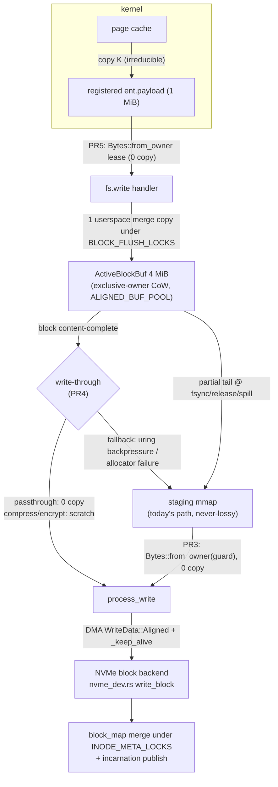

# Design Doc: Zero-Copy Write Path for SqueezeFS

| | |
|---|---|
| **Title** | Zero-copy write path: complete-block write-through, exclusive-owner active blocks, and FUSE-over-io_uring payload leasing |
| **Author** | _(placeholder — assign on review)_ |
| **Date** | 2026-07-07 (implemented 2026-07-08) |
| **Status** | **Implemented** — all seven PRs landed on `dev`; the ≥ 3× acceptance gate is met (closing re-run ~1827 MiB/s = 3.57×–4.25× vs the 430–512 MiB/s attribution baseline; see the landed table below and `.benchmarks/2026-07-08-zero-copy-write-path-closing.md`) |
| **Repo** | `/home/justin/Source/squeezefs`, branch `dev` |
| **Intended home** | `docs/design-zero-copy-write-path.md` |
| **Reviewers** | FUSE / data-path owners |
| **Related** | `.benchmarks/2026-07-07-write-path-attribution.md` (perf attribution), `.benchmarks/2026-07-07-write-copy-audit.md` (13-site copy inventory — the evidence base for every claim below), `.benchmarks/2026-07-07-pre-wal-removal-mount-bench.md` (no-regression baseline), `.benchmarks/2026-07-07-pr5-delete-gate-analysis.md` Addendum 2 (substrate cross-check), `docs/design-wal-crash-consistency.md` §3 (D0/D1/D2 contract), `AGENTS.md` (zero-copy / latch-free / io_uring-first non-negotiables, lock order P1-9) |

## Landed (per-PR SHAs on `dev`)

| PR | Landed as (tests-first + implementation) | Gate evidence |
|---|---|---|
| PR 0 — design | `1a3927e` (attribution `6a73303`, copy audit `f031bdb`) | — |
| PR 1 — `fix(fuse)` exclusive-owner CoW active blocks (P0) | `ac92350` + `7f783ff` | perf-neutral; loom green |
| PR 2 — `perf(cache)` contractual 4 KiB pooled alignment | `25db4ae` + `ec304cf` | fallback counter 0 on aligned workloads |
| PR 3 — `perf(fuse)` guard-backed zero-copy staged flush | `fa26dab` + `b7a2973` | aligned-branch deltas 0; sequencing pins |
| PR 4 — `perf(fuse)` complete-block write-through | `a678890` + `ffc5fe0` | ~921 → ~1679 MiB/s (**1.82×**), `.benchmarks/2026-07-07-pr4-write-through-gate.md` |
| PR 5 — `perf(fuse3)` transport payload leases | `3a64858` + `2580006` | ~1660.9 MiB/s sustained; **cumulative ≥ 3× gate MET**, `.benchmarks/2026-07-07-pr5-transport-lease-gate.md` |
| PR 6 — `refactor(routing)` slice reuse; delete subsumed routes | `2e5b3c1` + `80b0569` (+ surfaced pre-existing fixes: hole-punch `1a0ea16`+`f0ca977`, stale-fill `2974416`+`8e3995e`; design row retire `2c99e85`) | no-regression; equivalence + promotion pins |
| PR 7 — `docs(bench)` closing report, baselines, doc updates | this change | `.benchmarks/2026-07-08-zero-copy-write-path-closing.md` (closing re-run ~1827 MiB/s, full reference table, follow-up dispositions) |

---

## Overview

Large sequential writes deliver **430–512 MiB/s** against a **2.1–2.2 GB/s** substrate measured in the same directory — a 4–5× software gap that perf attributes to **45–50 % of all daemon cycles in glibc `memcpy`** across the tokio workers and the fuse-over-uring transport thread (`.benchmarks/2026-07-07-write-path-attribution.md`). The committed copy audit explains why: **every large-write byte is CPU-copied 5× in userspace** (plus the one irreducible kernel→user copy), and every 4 MiB block pays **one full extra staging-device write + `msync`** before the real NVMe write, because the "aligned direct striped" fast path at `src/fuse_client.rs:2847-2849` is unreachable for the default shape (FUSE `max_write` = 1 MiB < `block_size` = 4 MiB ⇒ `data.len() % block_size != 0` always) and the entire stream detours through `write_file_staged` → staging mmap → background writeback.

This design takes the write path from **5 userspace copies + 2 device writes** per byte to **1 userspace copy + 1 DMA** for sequential streams, in six independently mergeable PRs:

1. **P0 correctness first**: the merge copy at `src/fuse_client.rs:1383-1390` mutates a **shared `bytes::Bytes` through a raw pointer** — readers holding zero-copy slices of the same buffer (`fuse_client.rs:2617-2628`) can observe bytes changing underneath them, and the mutation itself is UB. Fixed with an exclusive-owner, copy-on-write active-block buffer type (`ActiveBlockBuf`). Independently mergeable, ships before any perf work.
2. **Complete-block write-through**: when the in-RAM accumulation buffer for a 4 MiB block becomes content-complete, upload it **directly** (crypto → allocate → io_uring DMA → block-map merge) instead of copying it into staging mmap, msync'ing, and re-copying it out in the writeback worker. Staging remains for partial blocks, tails, spill, and backpressure — its actual design role.
3. **Transport zero-copy**: in the vendored `crates/fuse3`, deliver FUSE_WRITE payloads as `Bytes::from_owner` leases over the registered uring payload buffer (killing a 1 MiB alloc + 2 MiB of memcpy per request), with a **deferred COMMIT_AND_FETCH re-arm protocol** that guarantees a leased buffer is never re-posted to the kernel while the lease lives, and an explicit **lease-severance boundary** (§5.4) that bounds every lease's lifetime to one handler invocation — no lease can reach a long-lived cache.
4. **Flush zero-copy**: residual staged flushes DMA straight from the staging mmap (`Bytes::from_owner(NvmeCacheReadGuard)`), killing a 4 MiB copy + alloc per flushed block.

Gate: **large-seq write ≥ 3× current (≥ ~1.3 GB/s)** on the committed substrate profile; **no regression** on small-write ops/s, read paths, or metadata rows vs the committed baselines. Audit estimates: write-through +400–700 MiB/s, transport +150–300, flush +100–200 — the stack reaches the gate with margin if two of three land as estimated.

---

## Background & Motivation

### The measured path today (audit `§(a)`, condensed)

```
kernel page cache
  ─K→ ent.payload (registered uring payload buf)      [kernel copy — irreducible]
  ─1→ Bytes::copy_from_slice → fresh 1 MiB heap Bytes  fuse_over_uring.rs:896-898
  ─2→ session data_buf (reused Vec)                    tokio.rs:469-477
  ──  fs.write(payload: Bytes)                         session.rs:2469-2472 (refcount, no copy)
  ─3→ active block buffer (ALIGNED_BUF_POOL, 4 MiB)    fuse_client.rs:1383-1390  ← ALSO UB (P0)
  ─4→ staging mmap segment + msync(MS_ASYNC)           tiering/nvme.rs:439,452-457  ← extra device write
  ─5→ fresh 4 MiB heap Bytes at writeback flush        fuse_client.rs:5600
  ──  crypto passthrough (no copy)                     crypto_compress.rs:350-354 ✅
  ─DMA→ block device (io_uring, WriteData::Aligned)    nvme_dev.rs:573-592 ✅
```

430 MiB/s delivered × ~6 copies ≈ 2.5 GB/s of memcpy traffic — consistent with the 45–50 % memcpy profile and the 2.1 GB/s substrate. Additional waste: a 4 MiB zero-fill memset on first touch of every block (`fuse_client.rs:1261-1270`, audit #4) and a **1 MiB heap allocation per FUSE WRITE request** (audit #1, the single biggest per-request allocation).

### Why everything detours through staging

`write_file_staged` (`src/fuse_client.rs:1200`) is the only reachable striped write path for the default shape. Its per-block flow: seed a 4 MiB buffer (zero-fill or RMW), merge the ≤1 MiB request slice, and — when the request reaches the block end (`is_block_complete`, `fuse_client.rs:1393`) — `put_active_block` copies the whole 4 MiB into a staging mmap segment (`cache/nvme.rs:627-651` → `tiering/nvme.rs:439`) and enqueues a `WritebackRequest`. The writeback worker (`run_constant_writeback_worker`, `fuse_client.rs:5246`) later calls `flush_single_active_block` (`fuse_client.rs:5565`), which **re-copies** the staged bytes to a fresh heap `Bytes` (`:5600`), runs `process_write`, allocates a block, DMAs it, and merges the block map. For a purely sequential stream this staging round-trip buys nothing: the data was already complete and correct in RAM.

### The P0 bug hiding in the merge

`active_block_buffers` is a `DashMap<String, bytes::Bytes>` (`fuse_client.rs:488-489`). The merge writes through `block_data.as_ptr() as *mut u8` + `ptr::copy_nonoverlapping` (`fuse_client.rs:1383-1390`). But `Bytes` is a *shared* refcounted view: the read path hands out zero-copy slices of the very same buffer (`buf.value().slice(rel_offset..)`, `fuse_client.rs:2619-2627`), and the complete-block path clones the `Bytes` into a `spawn_blocking` staging put (`fuse_client.rs:1398-1408`) while the map retains a handle. A subsequent write to the same block then mutates memory that live readers alias. Consequences: (a) undefined behavior — mutating memory reachable through `&`-derived shared references; (b) observable read-your-own-writes instability — a snapshot returned to the kernel can change while the reply is in flight. This must be fixed before the write path is made faster, not after.

### What is already right (build on it, don't rebuild it)

- `nvme_dev::write_block` (`src/nvme_dev.rs:570-592`) submits 4 KiB-aligned `Bytes` zero-copy with a `_keep_alive` handle — the DMA endpoint already exists.
- Crypto passthrough is zero-copy (`crypto_compress.rs:350-354`); pooled buffers exist (`BUFFER_POOL` `src/cache/pool.rs:83-89`, `ALIGNED_BUF_POOL` `pool.rs:211-217`).
- The reply direction already proves the `from_owner`-over-registered-buffer pattern: read replies land directly in the ent payload (`get_payload_buffer` + `UringBufOwner`, `tokio.rs:571-586`, `routing.rs:2501-2509`).
- The striped-write race machinery — `INODE_META_LOCKS` merge protocol (`routing.rs:2114-2165`), block-key **incarnation seqlock** (`src/incarnation_core.rs`, `block_allocator.rs:46-93`, loom-modeled), COW free-after-publish — is exactly the concurrency substrate write-through needs.

---

## Goals & Non-Goals

### Goals

1. **Large-seq write ≥ 3× current (≥ ~1.3 GB/s)** on the committed substrate profile of `.benchmarks/2026-07-07-write-path-attribution.md` (same-directory raw control 2.1–2.2 GB/s), measured by `squeezefs bench --only large-seq-write` (t=10 × 1 GiB, 1 MiB chunks).
2. **Fix the P0 shared-`Bytes` mutation UB** as an early, independently mergeable PR; make read-your-own-writes snapshots immutable by construction.
3. Sequential complete blocks: **1 userspace copy** (kernel→payload merge into the accumulation buffer) **+ 1 DMA**; zero staging traffic.
4. **No regression** vs committed baselines: small-write ops/s (Write Small Seq 441.03 MiB/s / Rand 395.43), all read rows, all Metadata rows (`.benchmarks/2026-07-07-pre-wal-removal-mount-bench.md`), and the direct-file numbers in `2026-07-07-pr5-delete-gate-analysis.md` Addendum 2.
5. Preserve **writeback-cache semantics** — read-your-own-writes coherency and byte-exact read-back across all three layouts as pinned by `tests/data_path_correctness_tests.rs` (incl. the mmap02 / short-read-zero-page size-coherency class fixed at `fuse_client.rs:2594-2603`), and the writeback queue-full / inline-overflow / indirect-map / allocator-recovery behaviors pinned by `tests/writeback_tests.rs`.
6. Preserve **staging's design role**: small/partial writes, spill under RAM pressure (`MAX_ACTIVE_BLOCK_BUFFERS` = 256, `fuse_client.rs:435`), never-lossy backpressure (`put_active_block` refusal), and the D0/D1/D2 crash posture of `docs/design-wal-crash-consistency.md` §3.
7. Stay inside `AGENTS.md` non-negotiables: io_uring-only hot path (transport work stays FUSE-over-io_uring; no classical escape hatches), zero-copy/latch-free (no new blocking locks on the data path), lock order P1-9 / P1-10, no dead code, TDD per PR, loom for new lock-free protocols, bench smoke in the required gate.
8. Keep the crypto/compress path (lz4/zstd/AES) fully functional on write-through with an explicit scratch-buffer strategy; keep fault-injection shims (`nvme_dev::FAIL_NEXT_WRITES`, `uring_fs::TORN_WRITE_FAULT`) working against the new path.

### Non-Goals

- **Kernel-copy elimination** (copy K). FUSE-over-io_uring has no splice/zero-copy receive today; the kernel→payload copy is irreducible on this transport (audit §b). Revisit if the kernel grows registered-buffer FUSE payloads.
- Read-path restructuring. Reads already have a zero-copy reply path; only incidental read-side effects of shared infrastructure changes are in scope.
- Changing the progressive layout thresholds (inline ≤ 4 KiB, staged ≤ block, striped), the DLM/fencing model, or any on-disk format. Zero format change.
- `recover_staging` implementation (still a stub per `design-wal-crash-consistency` Non-Goals; tracked separately). This design must not *worsen* its inputs, and does not (see §5.8).
- GDS (`gds` feature) path changes.
- The transport-notify feature (`fuse_notify_inval_*` over-uring) filed from the delete-gate analysis — separate design.

---

## Proposed Design

### 5.1 Target data flow



Copies per sequential 4 MiB block: today **~24 MiB of memcpy + 4 MiB staging write + 4 MiB DMA**; after **8 MiB (4 kernel + 4 merge) + 4 MiB DMA**. Userspace copies per byte: 5 → 1.

### 5.2 PR 1 (P0): `ActiveBlockBuf` — exclusive-owner, copy-on-write active blocks

Replace the `DashMap<String, bytes::Bytes>` value with a type that makes aliasing-and-mutation impossible by construction:

```rust
// src/cache/active_block.rs (new)

/// A 4 MiB, 4096-aligned active-block accumulation buffer.
/// Mutation requires provable uniqueness (Arc::get_mut); shared snapshots
/// force copy-on-write. Backing memory comes from ALIGNED_BUF_POOL and is
/// recycled on drop of the last handle.
pub struct ActiveBlockBuf {
    inner: Arc<AlignedBlock>,           // AlignedBlock = { ptr: *mut u8, len: usize } + Drop→pool
    /// Contiguous initialized range [covered.0, covered.1) — memset-elision
    /// bookkeeping for fresh (non-RMW-seeded) blocks. Seeded blocks are
    /// born fully covered. See §5.3 state machine.
    covered: (u32, u32),
}

impl ActiveBlockBuf {
    /// Zero-copy immutable snapshot for readers (read-your-own-writes) and
    /// for staging/upload. The snapshot is immutable FOREVER: any later
    /// writer that finds the Arc shared copies first (CoW).
    pub fn snapshot(&self) -> bytes::Bytes {
        bytes::Bytes::from_owner(SnapshotOwner(self.inner.clone()))
    }

    /// Exclusive mutable view. O(1) when unique; O(block_size) copy into a
    /// fresh pooled block when a snapshot is still alive (CoW).
    pub fn make_mut(&mut self) -> &mut [u8] {
        if Arc::get_mut(&mut self.inner).is_none() {
            let fresh = AlignedBlock::from_pool();
            unsafe { ptr::copy_nonoverlapping(self.inner.ptr, fresh.ptr, self.inner.len) };
            self.inner = Arc::new(fresh);
            METRICS.active_block_cow_copies.fetch_add(1, Ordering::Relaxed);
        }
        // SAFETY: uniqueness just proven or just established.
        unsafe { slice::from_raw_parts_mut(Arc::get_mut(&mut self.inner).unwrap().ptr, len) }
    }
}
```

Call-site changes:

- `active_block_buffers: DashMap<String, ActiveBlockBuf>` (`fuse_client.rs:488`). The merge in `write_file_staged` (`:1383-1390`) becomes `buf.make_mut()[rel_start..rel_start+slice_len].copy_from_slice(file_data_slice)` — same single memcpy, no raw-pointer aliasing. All mutations already run under `BLOCK_FLUSH_LOCKS.get_lock(ino, b)` (`:1248-1251`), so `make_mut`'s remove-mutate-reinsert of the map entry is writer-serialized; readers stay lock-free (`DashMap::get` + `snapshot()`).
- Read hit (`fuse_client.rs:2617-2628`): `buf.snapshot().slice(rel..rel+len)` — still zero-copy, now guaranteed stable. (Safe as a plain slice in PR 1 because PR 1 buffers are always born content-valid — seed-time zero-fill is retained; PR 4's memset elision upgrades this to the coverage-aware read of §5.3 "Uncovered-range semantics".)
- Staging put / spill / teardown flush paths (`:1394-1432`, `insert_active_block_buffer` `:1567`, `flush_all_memory_buffers_to_staging` `:1600`, promotion seed at `:2808-2825`) take `snapshot()`. (PR 4 additionally brings the spill/fsync/teardown exits under the victim's `BLOCK_FLUSH_LOCKS` for zero-completion — §5.3.)

**Why `Arc::get_mut` and not `Bytes::try_into_mut`**: pool-backed `Bytes::from_owner` values can never convert to `BytesMut`, and `Bytes` erases the pool identity. The Arc-based type keeps pooled recycling, 4096-alignment (feeding `write_block`'s aligned DMA branch), and a uniqueness check with std semantics.

**Uniqueness/visibility protocol**: `Arc::get_mut` atomically verifies `strong == 1 && weak == 0`; a reader that cloned the Arc before the check forces CoW, a reader that arrives after the map entry is re-inserted sees the new Arc. There is no bespoke atomic protocol here, but per the mandate ("loom for any new lock-free protocol") the CoW core is loom-checked — **following the house extracted-core convention** (`loom-models/src/lib.rs` `#[path]`-includes the *shipped* core sources, per the `incarnation_core` / `alloc_core` / `gauge_core` / `refcount_core` precedent, so the model checks the exact code, not a hand copy): the uniqueness-check/publish protocol lives in a dependency-free `src/cow_core.rs` with `#[cfg(loom)]`-switched `Arc`/atomic aliases, `#[path]`-included by both `active_block.rs` and `loom-models`. Model: writer (get_mut-or-copy, publish) vs reader (clone, read twice) — invariant: a snapshot's bytes never change between its two reads. Cheap insurance that a future "optimization" doesn't reintroduce in-place mutation of shared memory. `tests/run_loom.sh` joins PR 1's gate.

Perf note: sequential streams never trigger CoW (no concurrent snapshot of a still-accumulating block); mixed read/write of the same dirty block pays one 4 MiB copy per collision — that is the *price of correctness*, and `active_block_cow_copies` makes it observable. This PR is perf-neutral on the bench gates.

### 5.3 PR 4: complete-block write-through

#### Accumulation state machine (per `(ino, block)` key; all transitions under `BLOCK_FLUSH_LOCKS.get_lock(ino, b)`)

```mermaid
stateDiagram-v2
    [*] --> Empty
    Empty --> Complete_OneShot: request covers whole block<br/>(block_size ≤ max_write configs)
    Empty --> Accumulating_Seeded: partial write, existing data<br/>(RMW seed / staged seed — born content-valid)
    Empty --> Accumulating_Fresh: partial write, no existing data<br/>(zero-fill ONLY the complement lazily)
    Accumulating_Fresh --> Accumulating_Fresh: any write<br/>(merge copy; extend covered run or<br/>record a disjoint out-of-order run — RW3b)
    Accumulating_Seeded --> Accumulating_Seeded: merge copy<br/>(written union tracked)
    Accumulating_Fresh --> ContentComplete: written coverage union == whole block<br/>(RW3b trigger — order-blind; zero memset)
    Accumulating_Seeded --> ContentComplete: written coverage union == whole block<br/>(RW3b trigger)
    Accumulating_Fresh --> Staged_or_RAM: fsync/flush/release/spill with partial<br/>→ zero uncovered complement first
    Accumulating_Seeded --> Staged_or_RAM: fsync/flush/release/spill (today's semantics)
    ContentComplete --> Published: write-through: process_write → allocate<br/>→ DMA → block_map merge → remove entry
    Complete_OneShot --> Published: write-through after ONE severing copy<br/>of the request slice into a pooled block<br/>(lease-safe; never DMA from a transport lease)
    ContentComplete --> Staged_or_RAM: write-through FAILURE<br/>(uring backpressure / alloc / fencing)<br/>→ put_active_block + enqueue_writeback (never-lossy)
    Staged_or_RAM --> Published: background writeback (today, PR3 zero-copy)
```

Definitions:

- **Content-valid**: every byte of the 4 MiB buffer is the correct current content of the block. Seeded entries (RMW read `fuse_client.rs:1357-1377`, staged read `:1259-1261`) are born content-valid. Fresh entries become content-valid when `covered` spans the block **or** after complement-zeroing (performed under the block lock at the write-through trigger and at every stage/upload exit — see "Uncovered-range semantics" below for the read side and the exit sites). This replaces the unconditional 4 MiB `write_bytes` zero-fill (`:1262-1270`, audit #4): a sequentially-filled block never memsets at all.
- **Write-through trigger — normative, one definition**: ~~fire exactly when `write_end == b_end_offset`~~ **SUPERSEDED 2026-07-17 (RW3b — the FIND-L1-A fix): fire exactly when the accumulation's WRITTEN COVERAGE UNION reaches the whole block** (`ActiveBlockBuf::record_write` returns the completion transition — overlap-safe, order-blind, once per covering stream). The original `write_end == b_end_offset` definition used one write's end as a proxy for block completeness; that proxy is only sound when segments arrive in order, and the kernel legally splits FUSE WRITEs (unaligned-buffer O_DIRECT spans max_pages+1 pages) and dispatches the segments concurrently (`FOPEN_PARALLEL_DIRECT_WRITES`) — out-of-order arrival made the proxy fire on partial coverage (an inline seed fetch inside a sequential write) and MISS true completion (fully-covered buffers parked into the flush/spill seed+staging+writeback pipeline), violating this design's own complete-block write-through law (measured −34 % at t16; conviction `.benchmarks/2026-07-17-rw3-find-l1a-forensics.md`, fix evidence `.benchmarks/2026-07-17-rw3b-write-through-coverage-fix.md`). Coverage is now a first-class union: a primary run (the only state in-order streams touch — no allocation) plus rare disjoint out-of-order runs (`active_block_ooo_runs`); gap writes record runs instead of eagerly degrading. Consequences the RW3b test matrix pins (`tests/write_through_coverage_tests.rs` + the updated `tests/write_through_tests.rs`): out-of-order/shuffled segment fills write through exactly once with zero seed reads; **partial fills that merely END at the block boundary now PARK** (tail-first `[2M,4M)` parks and its head read serves zeros from RAM; the fsync exits zero-complete every gap) instead of early-firing — staging keeps its design role for genuinely-partial blocks; a middle-last fill completes the SAME accumulation (one write-through carrying both halves) instead of publishing early and re-seeding via RMW. Content-validity remains established *at* the completion transition (a full union needs no zeroing at all) and independently of it at every stage/upload exit (multi-gap zero-complete). Seeded entries stay born content-valid but their written union starts empty — a lone partial overwrite parks; the item-B deferral holds through any fill order (partial coverage defers the seed, exits materialize it, full coverage skips it forever — `seed_deferred ⇒ union partial` is the structural covered flush-seed elision).

#### Uncovered-range semantics under memset elision (holes are zeros, by contract)

Eliding the seed-time zero-fill means a partial **Fresh** buffer's uncovered range holds **recycled `ALIGNED_BUF_POOL` memory** — pool buffers are recycled without zeroing (`pool.rs:152-156`, `:183-190`), so those bytes can be another inode's old block contents. Today's unconditional memset is what guarantees POSIX holes-read-as-zeros; elision must therefore specify every path on which uncovered bytes could otherwise escape. **Contract: recycled bytes never leave the buffer's covered range — not to the kernel, not to staging, not to the device.** Three escape routes, three mechanisms:

1. **Read hit (`fuse_client.rs:2617-2628`) — coverage-aware, still lock-free, never mutating.** The concrete leak this closes: sparse-write `[3M,4M)` of a fresh block publishes `size = b_start + 4 MiB` ahead of coverage (`expected_new_size`, `:2739`); a read of `[b_start, b_start+1M)` is within `file_size`, single-block, hits the active buffer, and — naively — would return uncovered bytes: **recycled pool memory served through the kernel**, a cross-file information leak. (Multi-block reads are safe — they flush dirty blocks first, `:2629-2641`; sequential single-block reads are safe because `file_size` tracks the covered end. The sparse case is the leak.) Mechanism: `ActiveBlockBuf::snapshot()` returns the `Bytes` **together with the entry's `covered` interval** — both fields are read from the same `DashMap` entry value, so the pair is mutually consistent, and a CoW-replaced entry carries `covered' ⊇ covered`, so a stale pair only *under*-approximates coverage (worst case: an unnecessary copy, never garbage). If the requested range ⊆ `covered` (or the entry is Seeded/content-valid — the common case, and every sequential read), serve the zero-copy snapshot slice exactly as now. Otherwise build the reply in a **fresh buffer**: zeros, plus a copy of `covered ∩ range` — one bounded (≤ read size) copy on a rare sparse path, **without mutating the shared buffer** (zeroing in place from the read path would be a mutation outside `BLOCK_FLUSH_LOCKS`, violating §5.2's readers-stay-lock-free / mutations-under-the-lock split).
2. **Stage/upload exits — zero-complete under the victim's block lock, closing a lock-discipline hole that predates this design.** Every site that moves a RAM `ActiveBlockBuf` out of the map into staging or a durable upload zero-completes Fresh entries first via `make_mut` (CoW-safe) **while holding that block's `BLOCK_FLUSH_LOCKS`**: (a) **spill** (`insert_active_block_buffer`, `:1573-1596`, which today removes an arbitrary victim with *no* block lock) acquires the victim's lock via **`try_lock`** — mandatory, not an optimization: the caller may already hold the lock of the block being inserted (`:1424-1431`), and two same-level stripe locks can collide on one shard (`StripeLocks::shard_index` doc: a blocking re-acquire of a shared shard self-deadlocks), so on `try_lock` failure the spill picks a different victim or stops (the cap is soft; keeping one extra buffer beats deadlock — the existing refusal branch at `:1583-1591` already sets that precedent); (b) **fsync-path staging** (`flush_memory_buffers_for_inode`, `:1138-1190`) and (c) **teardown** (`flush_all_memory_buffers_to_staging`, `:1600-1680`) hold no block locks and acquire the victim's lock with a normal await. This also brings those paths inside §5.2's stated serialization ("all mutations under `BLOCK_FLUSH_LOCKS`") instead of silently contradicting it.
3. **Write-through trigger** — already specified above: zero-complete at the trigger, under the block lock the per-block future already holds.

**PR sequencing**: PR 1 buffers are always born content-valid — today's seed-time zero-fill is *retained* in PR 1 (`covered` exists but is not yet load-bearing); elision and this entire mechanism land together in PR 4. **Pre-approved simplification** if (1)+(2) balloon PR 4's review: keep elision only for sequential first writes (first write of a block at `rel_start == 0`; any other first touch zero-fills at seed time, as today) — that alone captures the workload the audit measured, and the coverage-aware read collapses to a debug assertion. Tests (PR 4 matrix): sparse write into a fresh block → read the hole → **zeros** (encodes the leak as a failing test under naive elision); sparse write → spill/fsync to staging → writeback → read back → zeros (the durable variant); spill-victim `try_lock` contention path.

#### The upload helper

```rust
/// Upload a content-complete block directly: crypto → allocate → DMA → merge.
/// Caller holds BLOCK_FLUSH_LOCKS(ino, b); MUST NOT hold the inode write guard
/// (striped scope is MetaPrepOnly, guard already dropped — P1-8) nor any pooled
/// meta connection (P1-10). Returns Err to request the staging fallback.
///
/// `plaintext` MUST be lease-free (§5.4 severance boundary): always an
/// `ActiveBlockBuf::snapshot()` — never a transport-payload Bytes. The
/// Complete_OneShot path (block_size ≤ max_write configs) satisfies this by
/// copying the request slice into a pooled ActiveBlockBuf first (its one
/// userspace copy — same count as the accumulation path), so no lease is ever
/// pinned across a device write or retained by a cache.
async fn upload_full_block(
    &self,
    ino: u64,
    b: u32,
    plaintext: bytes::Bytes,      // ActiveBlockBuf::snapshot(), lease-free by contract
    fencing_token: u64,
) -> Result<(), SqueezefsError>
```

Body mirrors the two proven implementations — the per-block task of `DataRouter::write_file`'s striped section (`routing.rs:2060-2086`) and the tail of `flush_single_active_block` (`fuse_client.rs:5603-5673`):

1. `process_write_async(plaintext.clone())` — passthrough returns the same `Bytes` (0 copy); non-passthrough per §5.7.
2. `allocate_block()` — marks the key's **incarnation unstable** (`block_allocator.rs:150-156`), so racing validated cache fills of a reused key fail their seqlock check instead of caching pre-DMA bytes.
3. `write_block(offset, processed)` — `ActiveBlockBuf` memory is 4096-aligned and 4 MiB ⇒ guaranteed `WriteData::Aligned` zero-copy submit (`nvme_dev.rs:573-592`); on failure `free_block` and return Err (fallback).
4. `publish_block(offset)` **after** the device write (same ordering comment as `routing.rs:2072-2077`). **No `read_lru.put` for already-striped files** — this deliberately mirrors `flush_single_active_block`'s `if !is_striped` gate (`fuse_client.rs:5652-5658`), *not* the routing path's unconditional put at `:2076`: write-through is the hot path, and a 10 GiB stream would otherwise push 2,560 plaintext 4 MiB blocks through the RAM read LRU, evicting genuinely hot read data. The put happens only for not-yet-striped promotions (matching today's flush semantics); the incarnation-ordering requirement is about *publish/cache after DMA*, which holds either way. If the PR 4 bench note's mixed write+hot-read row shows the cache would have paid, revisit with data.
5. **Block-map merge via the shared merge primitive** (see "One merge discipline" below) under `INODE_META_LOCKS.get_inode_lock(ino)` — read the *current* meta from the backend, insert `b → new_key`, `save_metadata_to_backend`, free only the key this merge actually displaces from the current map, purge displaced keys from every cache tier (the protocol at `routing.rs:2114-2165`; never merge into — or free from — a start-of-call snapshot). P1-10 holds: the meta connection opens after the DMA completed and closes before returning.
6. Invalidate: `active_block_buffers.remove(key)` and `cache.nvme.remove_active_block(key)` **after** the meta publish — a read racing between DMA and publish still hits the RAM snapshot (correct); after removal it resolves via the published block map. Any stale queued `WritebackRequest` for this key becomes a no-op: `flush_single_active_block` returns `Ok(())` when `read_staged_zero_copy` misses (`fuse_client.rs:5595-5598`) — no new plumbing needed.

`write_file_staged`'s per-block future then becomes: merge (or one-shot severing copy) → if trigger: `upload_full_block(...)`, on `Err` fall back to today's `put_active_block` + `enqueue_writeback` (`:1394-1418`); else keep in RAM (`insert_active_block_buffer`).

#### One merge discipline: every block-map RMW goes through one primitive, one lock

Write-through does not merely *reuse* the `INODE_META_LOCKS` protocol on its own path — **PR 4 unifies all block-map read-modify-write merges for an inode under it**, because leaving the retained paths on their current discipline creates a lost-update window: `flush_single_active_block` serializes its fetch→insert→save cycle under the `active_inode_locks` **write** lock (`fuse_client.rs:5626-5650`), and `flush_due_active_blocks_for_inode` does the same for its batch (`:5460-5507`) — neither touches `INODE_META_LOCKS`. Since the design deliberately keeps both alive (staging fallback on write-through failure; fsync-driven flushes), a fallback merge on block A could interleave with a write-through merge on block B of the same inode — two different locks, both fetch the current map, both save, one insert lost, the losing block's data unreachable and its key leaked (exactly the failure mode the comment at `routing.rs:2114-2122` documents). Today that collision is latent only because the routing striped merge is unreachable for the default shape; PR 4 would make it the hot path while backpressure keeps the other discipline alive. Therefore PR 4 (same PR, tests-first) extracts the merge into one shared primitive and converts every caller:

```rust
/// The ONLY way to mutate a striped block map. Serializes under
/// INODE_META_LOCKS.get_inode_lock(ino); fetches the CURRENT meta from the
/// backend; applies `op`; bumps size to at least `min_size` (or truncates to
/// it for TruncateFrom); applies `layout_flip`; saves with fencing
/// revalidation; returns the keys actually displaced/removed from the current
/// map (caller frees them AFTER this returns — never a start-of-call snapshot
/// key) having already purged them from every cache tier.
/// MUST NOT acquire BLOCK_FLUSH_LOCKS or active_inode_locks internally.
pub async fn merge_block_mappings(
    &self, // DataRouter
    ino: u64,
    op: BlockMapOp<'_>,
    min_size: u64,
    layout_flip: LayoutFlip,
    fencing_token: u64,
) -> Result<Vec<String> /* displaced/removed keys, post-publish free list */, SqueezefsError>

/// The mutation shapes the census found (see below) — inserts, removals, AND
/// size-only snapshot-saves — so truncate/fallocate share the serialization
/// domain instead of racing it:
pub enum BlockMapOp<'a> {
    /// Insert/overwrite entries: write-through, flush paths, defrag BlockMove,
    /// routing striped merge. (block_idx, new_block_key) pairs.
    ///
    /// `Merge(&[])` is the DEGENERATE, size-only case: no entries change, but
    /// the primitive still re-reads the CURRENT meta under INODE_META_LOCKS
    /// and saves size/map from that — which is exactly what makes the
    /// stale-snapshot whole-meta saves (truncate-grow, fallocate-extend)
    /// safe: they can no longer rewrite the block map "without mutating it".
    Merge(&'a [(u32, String)]),
    /// Remove every block whose start offset ≥ new_size (truncate-shrink):
    /// the retain at routing.rs:3065, re-expressed as a removal set on the
    /// same primitive; removed keys come back as the free list.
    TruncateFrom { new_size: u64 },
}

/// Layout-field policy — an EXPLICIT parameter, because the writers
/// disagree today and a silent "extracted-body default" would change the
/// flush paths' side-effects:
pub enum LayoutFlip {
    /// Flush-path merges (flush_single_active_block, flush_due_…,
    /// upload_active_block_bytes): force file_type = "striped" but PRESERVE
    /// file_id / data_key — today's exact field writes (:5647, :5479, :5551).
    /// Behavior-preserving by construction.
    ToStripedKeepStagedIdentity,
    /// Layout transitions (routing striped merge, routing.rs:2151-2153):
    /// file_type = "striped" AND clear file_id / data_key. Staged-identity
    /// release bookkeeping (release_superseded_staged — ring-entry/budget
    /// release, :1254, called at the four transition sites :1609/:1651/
    /// :1697/:1775) stays with the CALLER: the primitive never releases
    /// staged identity itself, so a clear is never paired with zero or two
    /// releases.
    ToStripedClearStagedIdentity,
    /// Truncate / non-transition mutations: leave file_type, file_id,
    /// data_key untouched (truncate_layout's inline/staged handling stays in
    /// its caller — the primitive only owns the striped map + size).
    KeepLayout,
}
```

Each conversion picks the variant matching its current field writes, making the conversions **behavior-preserving by construction** — the alternative ("convert everyone to the extracted body") would have silently cleared a `file_id` on the flush paths whose staging ring entry / budget nothing then releases. Whether flush-keeps-identity is itself a latent leak is deliberately *not* re-litigated here (out of scope: this design changes merge *serialization*, not layout policy); PR 4 adds a **staged-identity regression test** — fsync-flush of a just-promoted file must neither strand nor double-release its ring entry — so the chosen policy is pinned, not guessed.

Callers converted in PR 4 — **all nine** striped block-map writers (six RMW mutators + two stale-snapshot size-savers via the degenerate case + defrag `BlockMove`, whose conversion is specified in the census table below): `upload_full_block` (new), `flush_single_active_block` (`:5626-5650` — which today also frees the **start-of-call snapshot** `old_block_key` at `:5660-5663`, the exact anti-pattern the routing comment forbids; it now frees only the displaced-from-current keys the primitive returns), `flush_due_active_blocks_for_inode` (`:5460-5507`, same snapshot-key fix for `:5426-5433`), **`upload_active_block_bytes`** (`:5516-5563` — the never-lossy durable escalation that fires when staging *refuses* an active block: reachable from the fsync path via `flush_memory_buffers_for_inode` (`:1174-1187`, "this is the fsync path, so make the block durable right now") — and hence from `flush_inode_to_backend` `:1500`, FUSE `flush` `:4152-4154`, `release`'s background flush `:4181`, and `flush_active_blocks_with_retry` `:1476` — plus the dismount teardown at `:1642-1650`; it currently merges under the `active_inode_locks` **write** lock (`:5537-5554`), the old discipline, and staging refusal is *precisely* the backpressure regime in which write-through fallbacks fire concurrently on the same inode. It is also the easiest conversion: it already fetches current meta from the backend and frees only the key it displaces from the current map (`:5549`, `:5555-5560`), so it needs no snapshot-key fix — just the primitive + lock swap), **`truncate_layout`'s shrink path** (`routing.rs:3065-3082` — the `retain`-and-save whose only serialization today is `setattr`'s per-inode write lock (`fuse_client.rs:3068-3079`): once PR 4 moves the data-path merges to `INODE_META_LOCKS`, a truncate racing a write-through/fallback merge on the same inode would be an **unserialized lost-update** (truncate's retain-and-save could resurrect a just-merged block or drop its removal); converted via `BlockMapOp::TruncateFrom` + `LayoutFlip::KeepLayout`, with the freed-key list flowing through the same post-publish free discipline and truncate's inline/staged handling staying in the caller), **`truncate_layout`'s growth leg** (`routing.rs:3049-3056` — a **third mutation shape** an insert/remove census cannot see: a *stale-snapshot whole-meta save* that rewrites the block map "without mutating it", because `save_metadata_to_backend` serializes the **full layout, map included** (`routing.rs:703-732`) — the growth leg saves `meta` fetched at `:3046` wholesale under only the setattr inode lock (`fuse_client.rs:3068-3072`), never `INODE_META_LOCKS`. Today that is coincidentally safe (the flush merges share the inode write lock); **after PR 4's lock migration it is a live lost-update**: a MetaPrepOnly write-through merge publishes `b → k` and saves; the growth leg then saves its pre-merge snapshot — `b → k` vanishes from the backend *and* from the RAM cache (`metadata_cache.insert` at `:3054`), the block's data unreachable, its key leaked. Note interleaving (iii) tests *shrink only* and would stay green while the growth leg corrupts — hence interleaving (iv). Converted to the primitive's degenerate case `BlockMapOp::Merge(&[])` + `min_size = new_size` + `KeepLayout`, so the size update saves the *current* map re-read under `INODE_META_LOCKS`), **fallocate-extend** (`fuse_client.rs:4317-4325` — the same stale-snapshot shape under **no lock at all**: the `fallocate` handler (`:4279-4330`) takes no inode lock, so this race exists even *today* against every merge discipline (a pre-existing exposure, not one PR 4 introduces — but PR 4 makes the racing partner hot, since write-through publishes map entries continuously during exactly the large sequential writes that follow an application's fallocate, and the census's "so 'every' is checkable" claim now owns the site): `fetch_metadata` → `meta.size = target_size` → `save_metadata_to_backend`, whole map included; converted to the same degenerate `Merge(&[])` + `min_size = target_size` + `KeepLayout` call — conversion is one call, so no quarantine is needed), and `DataRouter::write_file`'s striped merge (`routing.rs:2123-2165`, which *is* the extracted body). The existing `active_inode_locks` usage in the flush and setattr paths is left as-is (it serves fsync-vs-write / setattr-vs-write serialization, lock order position 1) — the point is that the map RMW itself now has exactly one serialization domain regardless of which outer locks a caller holds.

**Census, so "every" is checkable — all mutation shapes, not just inserts** (`grep -n 'block_map' src/ | grep 'insert\|remove\|retain\|take'` and manual read of each hit; an earlier draft's insert-only census missed two mutators):

| Mutator | Shape | Disposition |
|---|---|---|
| The five insert-shaped writers above + `upload_full_block` | insert-RMW | **Converted** to `merge_block_mappings(Merge, …)` in PR 4 |
| `truncate_layout` shrink (`routing.rs:3065`) | `retain` (removal-RMW) | **Converted** to `merge_block_mappings(TruncateFrom, …)` in PR 4 |
| `truncate_layout` growth leg (`routing.rs:3049-3056`) | **stale-snapshot whole-meta save** (third shape — rewrites the map without "mutating" it; setattr inode lock only, a live lost-update after PR 4's lock migration) | **Converted** to the degenerate `merge_block_mappings(Merge(&[]), min_size = new_size, KeepLayout, …)` in PR 4 |
| fallocate-extend (`fuse_client.rs:4317-4325`) | **stale-snapshot whole-meta save** under **no lock** (pre-existing exposure) | **Converted** to the degenerate `merge_block_mappings(Merge(&[]), min_size = target_size, KeepLayout, …)` in PR 4 |
| **Defrag `BlockMove` job** (`src/jobs.rs:~148`): after copying a block to `dest_offset`, deserializes the `layout` xattr **directly**, `bm.insert(idx, dest_offset)`, re-serializes via raw `setxattr` — under **no lock at all** (not `INODE_META_LOCKS`, not the inode lock, not even `save_metadata_to_backend`) | insert-RMW via raw xattr | **Converted** in PR 4 (`Merge` + `KeepLayout` — it is the same insert shape as a flush merge and the raw-xattr bypass also skips fencing revalidation and cache purge, so conversion fixes three defects at once). If defrag conversion proves entangled (job-worker owns no `DataRouter` reference path today), the pre-agreed quarantine is: defrag jobs **refuse to schedule against inodes with a live lease OR any pending writeback / staged active-block state** (leases alone are insufficient — `release` drops the lease while queued `WritebackRequest`s and staged active blocks may still be merging that inode's map under pre-release fencing tokens: the drain-after-release window; both predicate halves are locally observable — the writeback queue and the inode's `active_block:` staging keys) + a filed follow-up — but conversion is the default, and the disposition is recorded in the PR either way |
| Staged promote commit (`routing.rs:1189-1190`): `block_map.take()` + `insert(0, …)` under the `INODE_META_LOCKS` guard at `:1172`, guarded by staged-identity preconditions (`file_type == "staged"`, `file_id` match, `staged_generation` match), keeps `file_type = "staged"` | insert-RMW, **already in-domain** | **Excluded from the primitive, by scoped rule** (below): it already executes under `INODE_META_LOCKS` — the single serialization domain the rule exists to enforce — and its identity preconditions are staged-layout transition logic, not a striped-map merge; forcing it through the primitive would mean growing a precondition-hook parameter for zero serialization benefit. If promote ever grows striped-map logic, it converts |
| Routing first-time-layout builders `:1587`, `:1750` | build a **fresh** map (no RMW of a map any concurrent writer could hold), committed under the transition guards (`:1592`, `:1759`) | Out of scope — not RMW; already in-domain |
| Routing first-time-layout builder `:1798` (first-time striped, no staging dirs) | builds a fresh map like its siblings, **but its save at `:1806-1808` has NO `INODE_META_LOCKS` guard** — an earlier census row wrongly lumped it with the guarded siblings. Its *actual* serializer is the **conditional** block-0 guard at `:1497` (`_staged_block_guard`), taken only when `file_type == "staged" ∨ (inline ∧ end > MAX_INLINE_SIZE)` — a string-typed condition a default/empty `file_type` on a brand-new file may not satisfy | **PR 4 adds the `INODE_META_LOCKS` guard around the `:1802-1816` commit** for uniformity with its `:1592`/`:1759` siblings — making the row true by inspection rather than by fresh-map argument (and closing the create-create race two concurrent first-writers would otherwise have on this leg); still not routed through the primitive — there is no existing map to merge |

PR 4 re-runs and records this census (all shapes) in its description. **Normative rule going forward, scoped precisely**: (1) *hard invariant* — **any save of a meta snapshot that carries an existing striped `block_map`** — whether the caller "mutated" the map (insert/remove/retain) or merely re-saves it around a size change — MUST go through `merge_block_mappings` or execute under `INODE_META_LOCKS.get_inode_lock(ino)` (checkable by inspection; the growth/fallocate rows above are exactly the shape a mutation-only wording missed); (2) every **striped-map** RMW MUST go through `merge_block_mappings` (the staged promote commit is the one named exclusion, justified above — it satisfies invariant (1) today). A future writer that bypasses either level is violating a stated invariant, not an implicit convention.

**Lock-order statement (explicit, since `upload_full_block` holds the block lock across the merge, unlike today's flush which drops it at `:5623`)**: the order `active_inode_locks (1) → BLOCK_FLUSH_LOCKS (3) → INODE_META_LOCKS → meta backend (4)` is already established today — `write_file_staged`'s per-block future calls `fetch_metadata` under the block guard (`fuse_client.rs:1283`), and `fetch_metadata` takes `INODE_META_LOCKS` on refill (`routing.rs:1065-1067`). The converted truncate keeps its `setattr` inode write guard (position 1) and takes `INODE_META_LOCKS` inside the primitive — same order. No existing or new path acquires `BLOCK_FLUSH_LOCKS` or `active_inode_locks` while holding `INODE_META_LOCKS` (the primitive is forbidden from doing so by contract, above; the routing merge at `:2123` never did), so the extended order is acyclic. This sentence gets copied into the `stripe_locks.rs` P1-9 doc comment in PR 4 so the order is normative in code, not just in this design.

#### Concurrency & correctness argument

- **Same block, concurrent writers**: serialized by `BLOCK_FLUSH_LOCKS` exactly as today (lock order position 3; the striped write path holds no inode write guard here — `InodeWriteLockScope::MetaPrepOnly`, `fuse_client.rs:2842-2844`).
- **Different blocks, same inode, concurrent write-throughs *and* concurrent fallback/fsync writebacks *and* truncate**: block I/O is parallel; every map mutation funnels through `merge_block_mappings` under `INODE_META_LOCKS` — the identical structure that made the direct striped path race-free (lost-update, COW-free-after-publish, displaced-key tier purge), now with **no second discipline left alive** (see "One merge discipline" above).
- **Racing reads of reused keys**: covered by the incarnation seqlock (unstable at allocate, publish after DMA) — no change, just reuse.
- **Fencing**: `write_file_staged` validates the token up front (`:1208-1215`); `save_metadata_to_backend` re-validates at commit. A `FencingTokenExpired` from the merge step propagates out and invalidates the local lease (existing handling at `fuse_client.rs:2875-2878`). Failed write-throughs never burn tokens.
- **Read-your-own-writes**: unchanged short-critical-section read protocol (`fuse_client.rs:2566-2632`); the active-buffer hit now returns a CoW-stable snapshot; size coherency is untouched — the write path still publishes size synchronously to `attr_cache` under the inode write lock (`:2762-2770`) and to the router `metadata_cache` for striped growth via `update_metadata_cache_size` (`:2837-2840`), which the read side prefers (`:2594-2603`).
- **fsync/flush/release partial tails**: unchanged. `flush` stays a soft flush (`flush_memory_buffers_for_inode`, `:4150-4156`); `release` schedules background flush via `bg_admit::spawn_bg` (`:4176-4189`); fsync's `flush_inode_to_backend` (`:1495`) drives RAM→staging→upload for whatever is still partial. Durable-error reporting via `WRITEBACK_HARD_FAILURES` is *strictly better*: the completing request now sees upload errors synchronously.

#### Latency shape (explicit trade)

Today the block-completing request acks after a 4 MiB mmap copy (~1 ms-class) and uploads asynchronously. After write-through it acks after the DMA + meta merge (~2 ms at 2 GB/s + deferred meta commit). Per 4 MiB: 3 fast acks + 1 device-bound ack. Aggregate throughput pipelines across blocks and threads (per-block locks, MetaPrepOnly scope, 10-thread gate workload), and the audit's +400–700 MiB/s estimate already assumes this shape. If the single-stream number disappoints, the documented lever is **detached-upload write-through** (ack after merge-into-buffer, upload in a tracked task bounded by `bg_admit::STRIPED_IO_SEM`) — deliberately *not* phase 1, because it re-introduces buffer-lifetime and failure-attribution complexity for a case (single-stream dd) the gate does not measure. Writeback-cache semantics permit either.

### 5.4 PR 5: transport zero-copy (vendored `crates/fuse3` — edit in place)

Two coupled changes, both strictly inside the FUSE-over-io_uring path (no classical fallback is introduced anywhere):

**(a) Payload lease instead of copy (kills audit #1).** At delivery (`fuse_over_uring.rs:889-952`), for `opcode == FUSE_WRITE` only, wrap the ent's payload region in a lease instead of `Bytes::copy_from_slice`:

```rust
// crates/fuse3/src/raw/connection/fuse_over_uring.rs

/// One per (qid, ent). Shared between the queue worker thread and lease drops.
struct EntLeaseState {
    refs: AtomicU32,      // live payload leases (0 or 1 in practice)
    parked: AtomicBool,   // worker has a commit waiting on refs == 0
}

/// Owner behind Bytes::from_owner. Holds the payload arena alive:
/// payload allocations move out of the worker-local `Ent` into a per-queue
/// Arc<PayloadArena> so a lease outliving the worker (shutdown) stays sound.
struct EntPayloadLease {
    arena: Arc<PayloadArena>,       // owns all payload buffers of the queue
    state: Arc<EntLeaseState>,
    wake_fd: RawFd,                 // queue eventfd (kept alive by arena/pool Arc)
    ptr: *const u8,
    len: usize,
}
impl AsRef<[u8]> for EntPayloadLease { /* slice::from_raw_parts(ptr, len) */ }
impl Drop for EntPayloadLease {
    fn drop(&mut self) {
        if self.state.refs.fetch_sub(1, Ordering::Release) == 1 {
            std::sync::atomic::fence(Ordering::Acquire);
            if self.state.parked.load(Ordering::Acquire) {
                let one: u64 = 1;
                unsafe { libc::write(self.wake_fd, &one as *const u64 as *const _, 8) };
            }
        }
    }
}
```

**Re-arm protocol — a leased buffer is never re-posted while the lease lives.** The COMMIT_AND_FETCH for an ent both sends the reply *and* re-arms the ent's registered buffers for the next inbound request (and `apply_reply` itself writes reply bytes into `ent.payload`, `fuse_over_uring.rs:1008-1036`). Therefore the queue worker's commit drain (`:743-756`) gains a gate:

- On `CommitMsg{ent_idx}`: if `state.refs.load(Acquire) == 0` → `apply_reply` + `push_cmd(COMMIT_AND_FETCH)` as today. Else **park** the message (`parked[ent_idx] = Some(msg)`, worker-local; `state.parked.store(true, Release)`), then **re-check** `refs == 0` and immediately un-park if the last lease dropped between load and park (classic publish-then-recheck; closes the missed-wake race).
- On eventfd wake: drain commits, then scan parked ents with `refs == 0` → apply + commit.
- Shutdown/final drain (`:985-1001`): the **no-write-while-leased rule stays unconditional** — it is not waived at shutdown. For a parked ent whose `refs > 0` after a short bounded wait (~100 ms) for lease drops, the worker commits a **header-only error reply** (16-byte `fuse_out_header` with an error errno, `payload_sz = 0` — the exact shape the existing `unique=0` recovery path already builds at `:866-871`; `apply_reply` never touches the payload region when the reply has no body beyond the 16-byte header). The arena Arc keeps the leased memory valid, so a pathological handler holding a payload past shutdown degrades to a leaked buffer and a dropped reply body — never a dangling pointer, and **never a write into memory a live `&[u8]` aliases** (writing the queued reply into a leased payload would be the same mutation-under-alias UB class PR 1 exists to eliminate; an earlier draft did exactly that and is corrected here). Note this matters even for ordinary write replies: `fuse_write_out` (24 B) lands in the payload region via `apply_reply` (`:1020-1027`), which is precisely why the *normal* path defers the whole apply+commit until `refs == 0`.

#### Payload sinks & the lease-severance boundary (lifetime bound, by construction)

Parking is only safe if every lease provably drops quickly. "The write handler drops the payload before replying" is true for the `write_file_staged` accumulation merge — but it is **not** true of every FUSE_WRITE consumer, and any sink that retains the `Bytes` indefinitely parks that ent's COMMIT forever: at `Q_DEPTH` = 4 (`fuse_over_uring.rs:256-264`), four retained small-file writes on one CPU's queue would stall all FUSE traffic on that queue — a deterministic mount hang, not a race. The sinks, enumerated (this table is normative; PR 5's tests cover each row):

| FUSE_WRITE `Bytes` consumer | Retention today | Lease rule |
|---|---|---|
| `write_file_staged` merge (`fuse_client.rs:1383-1390` → `ActiveBlockBuf::make_mut` copy) | consumed before reply | **May receive a lease** — the merge copy severs it; lease drops before the handler returns |
| Inline router write: full overwrite keeps `data.clone()` as the payload (`routing.rs:1565-1567`), then stores clones in `updated_meta.data_key`, `write_lru`, `read_lru` (`:1639-1646`) | **unbounded** (metadata cache + LRUs) | **Must never see a lease** — severed at the route boundary (below) |
| Staged router write: ends with `write_lru.put` / `read_lru.put(file_path, shared_data)` (`:1788-1789`) | **unbounded** (LRUs) | **Must never see a lease** — severed at the route boundary |
| ~~`is_aligned` direct leg~~ — **deleted by PR 6 (landed)** together with its transitional sever scaffolding: aligned striped writes funnel through `write_file_staged`, whose complete-block write-through consumes the payload via the one-shot severing copy (row below); the sinks-row canary test keeps pinning that an aligned striped overwrite provably drops the payload by handler return | n/a (route removed) | n/a — the route's consumers are the lease-safe rows above/below |
| `Complete_OneShot` write-through (§5.3) | would pin the lease across DMA + caches | **Never uploads from a lease** — copies into a pooled `ActiveBlockBuf` first (§5.3, upload-helper contract) |
| PR 6 slice reuse (`block_bytes = data_slice` → `read_lru.put`, `routing.rs:2076`) | **unbounded** (read LRU) | Safe **by construction**: it sits inside `DataRouter::write_file`, downstream of the route-boundary severance — no lease can reach it |

**Severance mechanism**: in the FUSE `write()` handler (`fuse_client.rs:2670`), before any route that hands `data` to `DataRouter::write_file`, the payload is materialized lease-free: `data = sever_payload(data)` — an unconditional copy into a plain heap/pooled `Bytes`. Since PR 6 landed there is exactly **one** such route (the PR 5→PR 6 window had two; the enumeration was corrected from an earlier draft, which mislabeled one leg and missed another): (i) the top of the `use_router_write == true` branch (`:2772-2798`) — note this branch is taken for *every* write to an inline/staged file, including growth past `block_size` (the condition at `:2748-2749` includes `file_type == "inline" || "staged"` unconditionally), so inline/staged promotions that the router resolves internally are covered here. Route (ii) — the `is_aligned` direct leg (`:2851-2855`), dead for the default shape, live for small-block configs — was deleted by PR 6 together with its one line of transitional sever scaffolding, exactly as planned. Everything else in the handler (`use_router_write == false`: striped writes, and first-time large writes on fresh files) feeds `write_file_staged` (`:2871-2892`) — the lease-safe consumer that needs **no** sever; the earlier draft's "staged→striped promotion leg" sever is dropped as a mislabel (that leg either goes through route (i) or through `write_file_staged`, never a third way). This is **not** a new cost: today *every* request already pays copy #1 at the transport; post-PR 5 the sever copy is the same bytes moved once, now paid **only** by the small/staged routes (≤ 4 KiB inline typically; ≤ block-size staged) while the hot striped route pays zero. Small-write ops/s therefore cannot regress vs today (they do strictly less copying: sever replaces copies #1 *and* #2), and the no-regression gate row pins it. Unconditional (rather than lease-detecting) severance is chosen deliberately: `bytes::Bytes` cannot cheaply introspect its owner, a `payload_is_lease` flag would have to thread through the `Filesystem` trait, and an unconditional copy on the cold routes is simpler than a reachability argument that every reviewer must re-verify. The resulting invariant is checkable in one place: **a transport lease never escapes the write handler's call graph — it is consumed by the accumulation merge, the one-shot severing copy, or `sever_payload`, all before the handler returns.**

Enforcement & observability: `transport_leases_outstanding` gauge plus a `transport_lease_max_age_ms` high-water mark (armed in debug/tests as an assertion: any lease older than 1 s aborts the test); PR 5 adds a **single-queue starvation test** — `SQUEEZEFS_FUSE_OVER_IO_URING_QUEUES` pinned so one queue serves a small-file write storm (the Issue-pattern: `echo foo > file` × thousands) with `Q_DEPTH=4`, asserting no stall and — **as corrected 2026-08-04 (pre-RC loose ends)** — that the park **ledger closes**: `transport_parked_commits ≡ transport_unparked_commits` at quiesce. The original `parked ≈ 0` acceptance was not a testable contract and flaked (2/5 on dev tip, more often after the FUSE-2 reply-path work made the reply ~76 ns cheaper, so COMMITs win the race against the handler's `Bytes` drop more often): parking is the gate WORKING, and its engagement is a benign race. The wedge — a park that never resolves (a `release()` that owes a wake, a parked scan that never runs) — is exactly what an unclosed ledger shows.

Depth math after severance: a parked ent costs one ring slot on one CPU's queue only for the residual window between reply submission and lease drop *within* a handler — in steady state effectively zero, and bounded by a single handler invocation in the worst case; `transport_parked_commits` proves it in production. FORGET/BATCH_FORGET keep `copy_from_slice` — they are auto-committed at delivery (`:911-937`) *before* the session consumes the payload, so leasing them would hand the session a buffer the kernel is already refilling. Non-write opcodes also keep the copy (payloads are small: names, xattrs, ≤ a few KiB) — one `if opcode == FUSE_WRITE` gate at delivery, no behavioral change elsewhere.

**Loom model (required — new lock-free protocol):** per the house extracted-core convention (`loom-models` `#[path]`-includes shipped sources — `incarnation_core` precedent), the refs/parked/re-check word protocol is extracted into a dependency-free `crates/fuse3/src/raw/connection/lease_core.rs` with `#[cfg(loom)]`-switched atomics, `#[path]`-included by `fuse_over_uring.rs` and by `loom-models/src/lib.rs` — the model checks the exact shipped code, not a hand copy. Model `ent_lease`: thread A = lease drop (refs 1→0, parked check), thread B = worker (refs load, park, re-check). Invariants: the commit executes **exactly once**, never while `refs > 0` — **including the shutdown header-only path** (modeled as a third interleaving: shutdown drain vs late lease drop). `tests/run_loom.sh` joins PR 5's gate.

**(b) Skip the session body copy for writes (kills audit #2).** In `inner_read_vectored` (`tokio.rs:443-499`): read the opcode from `inbound.header_and_op[4..8]`; for `FUSE_WRITE` copy only the 40-byte `fuse_write_in` from `op_in` into `data_buf` and skip the payload body copy (`:473-477`). `handle_write` (`session.rs:2436-2472`) parses `fuse_write_in` from `data_buf` and then uses `uring_payload` anyway (`:2469-2472`); the `write_in.size as usize != data.len()` check (`:2461`) is relaxed on the uring path to validate `write_in.size == payload.len()`. Every other opcode keeps the existing reconstruction verbatim.

Result per 1 MiB write request: 2 MiB of memcpy and one 1 MiB heap alloc removed from the fuse-over-uring thread and session task — the transport half of the memcpy profile. While in the file, the 24 B `data.deref().to_vec()` per reply (`tokio.rs:590`) and the `header_and_op` micro-allocs (`fuse_over_uring.rs:892-895`) are left alone — measurable-first discipline; they are allocator noise, not memcpy volume.

### 5.4c Transport geometry & kmbuf/zc adoption (2026-08-04 amendment)

*(fuse3 transport geometry + zc adoption campaign — evidence
`.benchmarks/2026-08-04-fuse3-zc-adoption.md`; the tree-verified kernel
facts it stands on: `docker/kernel-sqz/V2-CANDIDATES.md` candidates 1–2
and `.benchmarks/2026-08-04-sqz-kernel-v2-scoping.md`.)*

#### The geometry law (normative — `TransportGeometry::plan`)

The kernel's fuse-over-uring REGISTER acceptance bound is
`ring->max_payload_sz = max(FUSE_MIN_READ_BUFFER, fc->max_write,
fc->max_pages × PAGE_SIZE)` with `fc->max_pages =
min(fs.fuse.max_pages_limit, advertised max_pages)` — ents whose payload
is smaller are refused (`"Invalid req payload len"`), and over-uring is
mandatory, so a refused REGISTER is a **failed mount**. The historical
posture (blanket `max_pages = u16::MAX` in the INIT reply + a hardcoded
256-page payload floor in the planner) made that bound
sysctl-dependent while the ents were not: any box with
`fs.fuse.max_pages_limit > 256` failed to mount (reproduced live,
kernel log `fuse: Invalid req payload len 1048576`). The law that
replaces it:

1. **Negotiated `max_write`** = the filesystem's desire (SqueezeFS:
   `max(block_size, 1 MiB)`; `SQUEEZEFS_FUSE_MAX_WRITE` overrides
   verbatim) clamped to `[max(page, 4096), max_pages_limit × page]` —
   the sysctl (fallback 256 where absent) gates the ceiling; kernels at
   the default keep today's 1 MiB shape byte-identically.
2. **Advertised `max_pages` = `ceil(max_write / page)`** — the INIT
   reply describes the negotiated max_write EXACTLY, so
   `fc->max_pages = advertised` and the kernel bound **equals** the
   registered ent size by construction. REGISTER acceptance is
   structural; the failure class is unrepresentable.
3. **`payload_sz`** = the kernel-bound mirror
   (`max(8192, max_write, max_pages × page)`) — the registered ent
   payload length, the arena unit, and the R5 component unit.
4. **The variable-ent budget ladder** (the L1 depth policy re-derived):
   under the unchanged cap `min(mem_budget/8, 2 GiB)`, the **depth leg
   degrades first** (desired 32 → floor 4); only when the floor-4 arena
   still exceeds the cap does the **payload leg** engage, degrading
   `max_write` (page-aligned) toward the 1 MiB `PAYLOAD_BASE` — never
   below it. Env depth override bypasses both legs (unchanged operator
   semantics).

| shape (32 queues, cap 2 GiB unless noted) | max_write | max_pages | depth | arena |
|---|---|---|---|---|
| sysctl 256 (default / absent), desire 4 MiB | 1 MiB | 256 | 32 | 1 GiB *(today, byte-identical)* |
| **sysctl 1024 (sqz-host posture), desire 4 MiB** | **4 MiB** | **1024** | **16** | **2 GiB** |
| sysctl 1024, cap 819 MiB | 4 MiB | 1024 | 6 | 768 MiB |
| sysctl 1024, cap 256 MiB (payload leg) | 2 MiB | 512 | 4 | 256 MiB |
| sysctl 1024, cap ≤ 128 MiB (base pin) | 1 MiB | 256 | 4 | 128 MiB *(pre-L1 posture)* |
| sysctl 64 (lowered), any desire | 256 KiB | 64 | 32 | ≤ cap |

Gauges: `transport_max_write` / `transport_max_pages` (negotiated pair,
stats inode) join the existing `transport_{queues,q_depth,
payload_buffer_bytes,max_background}`. The 4 MiB win is
request-count-proportional (one FUSE_WRITE / one §5.4 lease / one merge
per whole block — per-op fixed costs quarter on ≥ block-size sequential
shapes); the per-page `FR_LOCKED`/GUP term is NOT touched by request
size — that is the kmbuf arm's job, below.

#### kmbuf bufring adoption (how buffer selection replaces/joins the §5.4 arenas)

`crates/fuse3/src/raw/connection/kmbuf.rs` is **the severable module
boundary** for the carried v4 series' ABI (upstream dropped the kmbuf
infra from for-7.1 on 2026-03-30; the eventual upstream FUSE-zc will be
a different ABI — this adoption is a knowing throwaway kept re-portable
behind one module + a runtime probe). Mode resolution happens once per
session: `IORING_REGISTER_KMBUF_RING` probe Present + lever ⇒ BufRing;
`EINVAL` (stock kernels) ⇒ UserEnts — **today's path byte-identical,
contract-pinned**. Post-probe registration refusals fail the mount loud
(`SQUEEZEFS_FUSE_KMBUF=0` is the operator escape and the A/B lever).

On the BufRing arm, the §5.4 registered payload **arenas are replaced by
the kernel's buffers and joined by the same lease machinery**:

- Per queue, the daemon registers a **fixed headers buffer** (index 0;
  ent *i*'s `fuse_uring_req_header` at `i × 288`) and a
  **kernel-managed buffer ring** (bgid 0, `buf_size = payload_sz`, pow2
  entries ≥ depth), then mmaps the kernel's buffer region once
  (`IORING_OFF_KMBUF_RING`). REGISTER SQEs carry
  `init.flags = FUSE_URING_BUF_RING` + `sqe->buf_index = ent_idx` and
  **no iovecs**.
- **Attachment law (daemon side of the kernel lifecycle):** the kernel
  attaches a buffer to an ent when the request carries/expects payload,
  REUSES it across consecutive payload-carrying requests, and recycles
  it at a payload-less fetch. The delivery CQE carries the bid
  (`IORING_CQE_F_BUFFER`) only on fresh selection ⇒ the daemon
  re-points on flagged CQEs and KEEPS on unflagged ones. A stale
  attachment can only exist across payload-less deliveries (header-only
  replies — no body write), and every body-reply op re-selects flagged
  if detached: **no body write can ever target a recycled buffer.**
  Violations (out-of-range bid, announced payload without attachment)
  are protocol breaches → loud shutdown.
- **`PayloadArena::from_kmbuf`**: the lease/wake machinery (§5.4
  verbatim — refs/parked, eventfd wake, coalescer) rides a bid-indexed
  view over the mmap'd region, mapping owned by `KmbufQueue` and held
  alive by the arena for lease lifetimes. **The lease-severance law
  composes unchanged**: the kernel recycles an ent's buffer only at
  fetch, fetch is triggered only by our COMMIT_AND_FETCH, and the §5.4
  commit gate already defers that until the last lease drops — deferred
  re-arm ≡ deferred recycle, same boundary. Reply bodies (and
  `get_payload_buffer` in-place serves) target the ATTACHED buffer —
  exactly where the kernel's commit copy reads from.
- **What it deletes**: the per-4 KiB-page `unlock_request → GUP →
  lock_request` discipline on every payload copy — counted **12.8 % +
  2.6 % of ALL client cycles** on the kern EXA read row
  (interface-frontier §3 Row A). `cs->is_kaddr` short-circuits
  `fuse_copy_fill` in BOTH directions; one memcpy per folio remains
  (K1).

#### zc serve integration (§5.4c — SHIPPED 2026-08-06, the K1 kill) & instruments

The `FUSE_URING_ZERO_COPY` **serve integration ships** (campaign
`.benchmarks/2026-08-06-fuse-zc-serve.md`; `SQUEEZEFS_FUSE_ZC=1`,
default OFF pending field acceptance — the dest-lease flip precedent).
With zc negotiated the kernel skips the folio copy entirely
(`skip_folio_copy`, both directions — `can_zero_copy_req` covers
`in_pages || out_pages`, NO per-request daemon opt-out), so the
integration answers all three consequences on an armed queue
(`crates/fuse3/src/raw/connection/zc.rs` carries the design):

- **out-paged replies** (READ/READDIR[PLUS]/READLINK) bridge through
  the sparse slot: the **direct device leg** (`READ_FIXED(device →
  slot)` — routing's cold aligned passthrough windows, whole-block AND
  sub-block; `ZcReadServe` + `ReplyData::zc_prefilled`) is the K1 kill
  — device DMA into the caller's pages, zero daemon passes; every
  other shape (warm/tier serves, transform volumes, unaligned) lands
  in the per-ent **memfd bounce** (`ZcBounce`) and bridges with
  `READ_FIXED(memfd → slot)` — copy-count parity with the kmbuf path.
- **WRITE payloads** extract slot → bounce (`WRITE_FIXED`) before
  dispatch; the §5.4 lease then rides the bounce mapping verbatim
  (deferred re-arm ≡ deferred recycle unchanged).
- **non-paged traffic** keeps the kmbuf shape byte-identically.

Opcode-mirror misses are LOUD, never corrupting: a wrongly-bridged
reply errors its slot fetch and falls back to the kmbuf attachment
(`fuse3_zc_fallbacks`); a wrongly-copied paged reply hits the
no-attachment EIO guard.

Instruments: `fuse3_kmbuf_negotiated` / `fuse3_zc_negotiated` (0/1 —
the arm proofs), `fuse3_zc_replies` (paged replies that rode the slot),
`fuse3_zc_fallbacks` + `fuse3_zc_slot_payload_skips` (the mirror
tripwires, ≈ 0 / 0), `read_zc_serve_bytes` (the direct-leg engagement
ledger — a NEW closure term: an armed row is INVALID unless its delta
accounts for the row's READ bytes), and the `commit_flush` phase
(5th member of `read/write_transport_phase_ns`): the COMMIT-carrying
ring-flush syscall duration — the venue where the kernel's commit-side
copy machinery runs — per-FLUSH sampled on provably wait-free flushes
only, so the killed lock/GUP term is visible as this phase's
before/after delta on kmbuf A/Bs without adding a syscall.

### 5.5 PR 3: flush/writeback zero-copy (kills audit #8)

`flush_single_active_block` (`fuse_client.rs:5595-5601`) and its sibling `upload_single_active_block_data` (guard at `:5380-5388`, copy at `:5390`): replace `Bytes::copy_from_slice(&guard)` + drop with a guard-backed DMA source. `NvmeCacheReadGuard` (`tiering/nvme.rs:94-109`) already derefs to the mmap value slice, is already `unsafe impl Send + Sync`, and the value region is 4096-aligned by the segment packer (`alignment = 4096`, `tiering/nvme.rs:176-178`, `cache/nvme.rs:643-645` passes `Some(4096)`) — so the guard-backed `Bytes` takes `write_block`'s `WriteData::Aligned` DMA branch with the guard as `_keep_alive`. One caveat: the payload length must be a 4 KiB multiple for the aligned branch; active-block staging entries are whole blocks at offset 4096 (`cache/nvme.rs:688-693`), so slice `[4096 .. 4096 + block_size]` qualifies.

**The guard is write-only and must be dead before any same-shard mutation — by construction.** Two hazards make naive `Bytes::from_owner(guard)` wrong, and both are closed structurally:

1. **Self-deadlock**: both modified functions end by calling `remove_active_block(&cache_key)` (`fuse_client.rs:5666-5673`, and `flush_due_active_blocks_for_inode` at `:5499-5506`), which takes the **same shard's write lock** (`cache/nvme.rs:654-672` → `NvmeShard::remove` → `inner.write()`) — same key ⇒ same shard by construction. A guard-backed `Bytes` still alive at that point (in passthrough mode `processed_block` *is* the guard-backed value, and `write_block`'s completion only drops the worker's `_keep_alive` clone, not the caller's) is a guaranteed parking_lot read→write self-deadlock on a tokio worker. Therefore the guard-backed value is wrapped in a **non-`Clone` `StagedDmaSource` newtype consumed by value** by a thin `write_block_from_staging` helper — retention past the DMA is a compile error, not a review item. Sequence, normative for both callers and for the batch path: take guard → (non-passthrough only) `process_write` into a fresh transform buffer, **drop guard** → DMA → merge; (passthrough) DMA the `StagedDmaSource` directly, whose last ref dies inside the helper when the await returns → only then meta merge → `remove_active_block`. `flush_due_active_blocks_for_inode`'s `buffer_unordered(8)` stage (`:5438-5455`) must not carry guards into its `results` — each per-block future returns keys/sizes only, with the guard provably dropped before the future resolves.
2. **Unbounded hold via caches**: an earlier draft had the plaintext `read_lru.put` (`:5652-5658`) reuse the guard-backed `Bytes` — an LRU entry has unbounded lifetime, which would hold the shard read-locked until eviction, blocking every writer/evictor on that shard. Corrected: **a guard-backed `Bytes` never enters any cache.** The put is already gated `if !is_striped` (`:5652`) — striped writeback, the overwhelmingly common case, never puts; for the not-yet-striped promotion case the put uses a real copy (bounded, cold path). Net effect: the audit-#8 4 MiB copy disappears from every striped flush and survives only as a small-file promotion copy.

**Residual risk & fallback**: with the write-only scoping, the shard read lock is held across exactly one `process_write` (non-passthrough) or one DMA (passthrough) — **plus, on `--write-verification` mounts, the sampled read-back verify**: `write_block` keeps the caller's `Bytes` alive after completion to run `verify_write_block` (`nvme_dev.rs:693-701`), so a sampled write holds the guard across write + read + checksum compare. Accepted as-is: still bounded, still deadlock-free, opt-in diagnostics with a sample-rate knob (`write_verification_should_check`), and verifying from a copy would spend a 4 MiB memcpy per sampled block to shorten a bounded hold on a non-default path — the wrong trade. The steady-state bound for evictors is therefore "one transform-or-DMA, or write+verify when sampled on verification mounts" — the same hold pattern the read-reply path already uses (`ReplyData::backing` carries the guard across the FUSE reply). No deadlock is possible against the uring worker (it completes writes on its own thread regardless of shard locks). If `staging eviction wait` gauges regress in the PR 3 gate, the pre-agreed replacement is an **entry pin count** (per-entry `AtomicU32` in `BlockMeta`; evictors skip pinned entries) instead of the shard read lock — kept as the fallback rather than the primary because the scoped guard is a smaller change with the identical externally-visible bound, and the newtype makes the scoping mechanical. Also applied where trivially safe: the staged-file upload path's `read_staged` `to_vec()` (`cache/nvme.rs:695`) for promotion/merge flows, under the same write-only rule.

Note: PR 4 removes this copy for *sequential* streams entirely (no staging round-trip); PR 3 still pays off for partial blocks, spills, fsync-driven flushes, and the promotion path — and it is independent, so it lands before the bigger PR 4 review.

### 5.6 PR 2 + PR 6: alignment contract, direct-path slice reuse, dead-gate removal

- **PR 2 — contractual 4 KiB alignment**: `BUFFER_POOL` currently hands out plain `vec![0u8; 4 MiB]` (`pool.rs:14-16`) and `write_block`'s aligned branch depends on jemalloc's incidental page alignment (audit #11). Re-back `BufferPool` with the same `Layout::from_size_align(_, 4096)` allocation strategy as `AlignedBufPool` (or make `PooledBuf` wrap `AlignedBlock`), add a debug assertion + `nvme_unaligned_write_fallbacks` counter in `write_block`'s fallback branch, and a test asserting pooled buffers always take the aligned branch. Makes audit #11 provably cold instead of luckily cold.
- **PR 6 — routing slice reuse (audit #12) + dead-route removal**: in `DataRouter::write_file`'s striped per-block task, when the overlap covers the whole block (`rel_start == 0 && rel_end == block_size`), use `data_slice` directly as `block_bytes` instead of copying into a `PooledBuf` (`routing.rs:2054-2058`; `into_bytes` at `:2065` is already `from_owner`). Lease-safe by construction: the §5.4 severance boundary guarantees no transport lease ever reaches `DataRouter::write_file`, so retaining `data_slice` in `read_lru` (`:2076`) retains a private copy. This path still serves staged→striped promotions and small-block configs. Then remove the `is_aligned` direct branch in `fuse_client.rs:2846-2869`: after PR 4, `write_file_staged` handles complete blocks equivalently (write-through) for *every* config, making the branch redundant duplicate logic — and the no-dead-code rule says delete it, not keep two striped write paths. **Also delete the in-handler promotion block at `fuse_client.rs:2800-2836`** — it is *provably unreachable today*: it sits inside the `use_router_write == false` branch guarded by `if file_type == "inline" || file_type == "staged"`, but the `use_router_write` condition (`:2748-2749`) is true for those exact `file_type` values unconditionally, so the guard can never hold there (inline/staged promotions are resolved inside `DataRouter::write_file` via route (i) of §5.4). Same no-dead-code disposition as the `is_aligned` branch; `tests/data_path_correctness_tests.rs` (64 KiB block config, where the `is_aligned` branch *is* reachable today) pins behavior equivalence before/after, and a promotion-path test pins that inline→striped and staged→striped growth still round-trip byte-exact after the deletion.

### 5.7 Crypto/compress strategy for write-through blocks

Write-through calls the same `process_write_async` (`crypto_compress.rs:386-400`) as every existing path — behavioral parity by construction. Strategy per mode:

- **Passthrough** (default): returns the input `Bytes` untouched (`:350-354`) — the `ActiveBlockBuf` snapshot flows to DMA with zero transform copies. The snapshot stays plaintext-shared with `read_lru`, exactly like `routing.rs:2076`.
- **Compression on (lz4/zstd)**: output size ≠ input size ⇒ **in-place is impossible by definition; scratch buffer it is.** Current code allocates a fresh `Vec` per transform (`compress` → `Cow`, then `encrypt` → second `Vec`, audit #9 "1-2 unavoidable transform buffers"). Improvement folded into PR 4 as a **severable sub-commit** (explicitly not gated on — see below): a dedicated **`CRYPTO_SCRATCH_POOL`** whose buffer size is computed at pool init as `worst_case(block_size)` = on-disk header (**`[2B wrapped_key_len][1B nonce_len][wrapped_key][nonce]`**, exactly as `encrypt` emits it at `crypto_compress.rs:272-279` — no mode byte; an earlier draft invented one) + **the actual wrapped-key blob length** — taken from the session-key path's `prewrapped_key` at init (`:202-212`); where no prewrapped blob exists at pool-init time, a stated conservative max of **512 B** (RSA-4096 wrap; the earlier "≤ 256 B" assumed RSA-2048 and would have understated the bound, silently pushing 4096-bit-key configs onto the overflow bounce the pool exists to avoid) + nonce (12 B) + `max(lz4_flex::block::get_maximum_output_size(block_size), zstd compress_bound(block_size))` + 16 B AEAD tag, **rounded up to the next 4 KiB** (≈ `block_size` + 128 KiB for 4 MiB blocks — deliberately *not* `ALIGNED_BUF_POOL`, whose buffers are exactly `block_size` (`pool.rs:211-217`) and therefore **cannot** hold worst-case output for the primary shape; an earlier draft got this wrong and would have shipped permanently-dead pooled-scratch code). Incompressible input that would still overflow the bound falls back to today's heap `Vec` (bounce only the overflow case). Required API changes, named so PR 4 scopes them honestly: `compress` gains buffer-writing variants (`lz4_flex::compress_into` / `zstd::bulk::Compressor::compress_to_buffer` replacing `compress_prepend_size` / `encode_all`, `crypto_compress.rs:158-168`) — and the lz4 variant **must reproduce the 4-byte little-endian size prefix** that `compress_prepend_size` writes today and `decompress_size_prepended` (`:179-181`) requires, since raw `compress_into` emits no framing and the read path is contractually untouched (this is on-disk-compatibility-relevant: a scratch-written block must be byte-compatible with pre-scratch readers, pinned by a read-back parity test against a volume written before the scratch sub-commit); and `encrypt` is restructured to write the header first and seal at an offset using **`seal_in_place_separate_tag`** (a raw fixed scratch does not implement the `Extend` bound `seal_in_place_append_tag` needs) — one pooled transform buffer total, 4096-aligned so the DMA stays on the `WriteData::Aligned` branch when the ciphertext lands on a 4 KiB multiple; otherwise the existing pooled-unaligned fallback (`nvme_dev.rs:597-623`) pays one bounded copy, exactly as today. **Severability**: if the `compress_into`/seal-offset plumbing balloons PR 4's review, ship PR 4 with today's per-transform `Vec`s unchanged (the ≥ 3× gate workload is passthrough; audit #9 already prices the `Vec`s as acceptable) and land the scratch pool as a follow-up `perf(crypto)` PR with the `crypto_compress_throughput` benches as its gate.
- **Input immutability**: `process_write` must never mutate its input — the same plaintext snapshot backs read-LRU and RYW reads. The scratch strategy guarantees this; an in-place-over-input "optimization" is explicitly rejected.
- **Read-back parity**: physical/logical sizes flow through the same result plumbing as `routing.rs:2067-2069`; the read path (`read_nvme_block` + `process_read_async`, `routing.rs:908-931`) is untouched. The `crypto_compress_throughput` Criterion group (existing, in `squeezefs_bench`) gates transform-cost regressions; a new `lz4_aes_combined_write` comparison on pooled-scratch vs current allocations quantifies the win.

### 5.8 Crash consistency & the role of staging (unchanged contract, better posture)

- Staging is **not** a durability mechanism today: `recover_staging` is a stub (`src/recovery.rs`, per `design-wal-crash-consistency` Non-Goals), and writeback-cache semantics already permit loss of un-fsynced data. Write-through strictly *shrinks* the volatile window for sequential data: bytes reach the durable block backend at block-completion time instead of after staging + queue latency.
- **P0 layout atomicity preserved**: block DMA completes before the meta flip (`upload_full_block` step ordering; same as both existing implementations). A crash between DMA and merge leaks an unpublished allocation — identical exposure to today's `flush_single_active_block` window; allocator reconciliation at mount covers both.
- **Acked durability**: fsync still drives `flush_inode_to_backend` → trailing `sync_device_for_ino` barrier (`fuse_client.rs:1495-1530`); the single-barrier contract (`tests/fsync_single_barrier_tests.rs`, `meta_device_syncs`) is untouched because write-through adds no meta barriers — it uses the same deferred-commit `save_metadata_to_backend`.
- **Fault-injection compatibility** (mandate): `nvme_dev::FAIL_NEXT_WRITES` (`nvme_dev.rs:550-568`) fires inside `write_block` and therefore *inside* `upload_full_block` — the new fallback-to-staging edge is deterministically testable with it (tests-first in PR 4). `uring_fs::TORN_WRITE_FAULT` / `power_cut` (`uring_fs.rs:283-334`) target meta-volume I/O and remain fully applicable — `tests/crash_contract_tests.rs` / `crash_kill_tests.rs` run unmodified against the new path. No shim signatures change.

---

## API / Interface Changes

No public CLI, mount-option, wire, or on-disk changes. Internal surfaces:

| Surface | Change |
|---|---|
| `src/cache/active_block.rs` (new) + `src/cow_core.rs` (new, extracted protocol core) | `ActiveBlockBuf { snapshot(), make_mut(), covered }`, `AlignedBlock`, `SnapshotOwner`; CoW uniqueness/publish core `#[path]`-shared with `loom-models` |
| `SqueezefsFilesystem::active_block_buffers` | value type `bytes::Bytes` → `ActiveBlockBuf` (private field; all call sites in `fuse_client.rs`) |
| `SqueezefsFilesystem::upload_full_block(ino, b, plaintext, fencing_token)` (new, private) | write-through core, §5.3; `plaintext` lease-free by contract |
| `DataRouter::merge_block_mappings(ino, op, min_size, layout_flip, fencing_token)` (new) | **the** striped block-map primitive (§5.3 "One merge discipline"); `BlockMapOp::{Merge (incl. the degenerate size-only `Merge(&[])`), TruncateFrom}` + `LayoutFlip::{ToStripedKeepStagedIdentity, ToStripedClearStagedIdentity, KeepLayout}`; converted writers: `upload_full_block`, `flush_single_active_block`, `flush_due_active_blocks_for_inode`, `upload_active_block_bytes`, `truncate_layout` shrink **and grow**, **fallocate-extend**, defrag `BlockMove`, routing striped merge (+ the `:1798` first-time save gains the `INODE_META_LOCKS` guard) |
| `sever_payload(data: Bytes) -> Bytes` (new, private helper in `fuse_client.rs`) | lease-severance copy at the two router-route boundaries (§5.4); hot striped route bypasses it |
| `write_file_staged` | per-block future gains trigger → `upload_full_block` → fallback; signature unchanged |
| `flush_single_active_block` / `upload_single_active_block_data` / `flush_due_active_blocks_for_inode` | guard-backed **`StagedDmaSource`** (non-`Clone`, consumed-by-value) instead of copy; merges via `merge_block_mappings`; displaced-key frees switch from start-of-call snapshot to merge-returned keys |
| `cache/pool.rs` `BufferPool` | contractually 4096-aligned backing |
| `crypto_compress.rs` (severable sub-commit) | `CRYPTO_SCRATCH_POOL` (worst-case-sized, §5.7), `compress_into` variants (size-prefix framing preserved), `seal_in_place_separate_tag` restructure |
| `crates/fuse3` `fuse_over_uring.rs` + `lease_core.rs` (new, extracted protocol core) | `PayloadArena`, `EntLeaseState`, `EntPayloadLease`, parked-commit drain in `queue_worker`, shutdown header-only replies; `InboundUringReq.payload` semantics: may be a lease (FUSE_WRITE) or a copy (all else) — type stays `Bytes` |
| `crates/fuse3` `tokio.rs` / `session.rs` | opcode-gated body-copy skip; `handle_write` size check validates against `payload.len()` on the uring path |
| `src/stripe_locks.rs` | P1-9 doc comment gains the `… → BLOCK_FLUSH_LOCKS → INODE_META_LOCKS → meta backend` order statement (§5.3) |
| `loom-models` | `active_block_cow` + `ent_lease` models, `#[path]`-including `cow_core.rs` / `lease_core.rs` per the extracted-core convention |

Env knobs: none added. (`SQUEEZEFS_FUSE_OVER_IO_URING_Q_DEPTH` remains the pressure-relief knob if parked ents ever contend; documented in the PR.)

## Data Model Changes

**None on disk.** Metadata keys, block map encoding, staging segment format (`BLOCK_MAGIC` header, 4096-aligned values), superblock: all byte-identical. In-RAM only: `ActiveBlockBuf` replaces `Bytes` in the active-buffer map; per-ent lease state + payload arena in the transport; the worst-case-sized crypto scratch pool (non-passthrough configs only).

---

## Alternatives Considered

### A. Fix only the `is_aligned` gate (route coverage-complete blocks through `DataRouter::write_file`)

Replace the request-granularity gate at `fuse_client.rs:2847-2849` with per-block coverage so the existing routing striped path handles covered blocks. **Rejected as the primary mechanism**: with `max_write` = 1 MiB and 4 MiB blocks, *no single request ever covers a block* — coverage completes only inside the accumulation buffer across ~4 requests, which lives in `write_file_staged`, not in the router. Splitting one FUSE request across two paths (router for covered prefix + staged for tail) would also double the per-request `INODE_META_LOCKS` merges. The coverage idea survives as PR 6's slice-reuse fix *inside* the router path (promotions, small-block configs), where it is correct and cheap.

### B. Scatter-gather accumulation (rope of leased payload slices; no merge copy)

Hold the transport payload leases of all 4 requests of a block and DMA them with a 4-iovec writev — a true 1-kernel-copy path (0 userspace). **Rejected**: (1) it pins ring ents across the *block* lifetime — with depth 4 per queue and a per-CPU queue, one in-flight block can exhaust a queue and stall all FUSE traffic on that CPU (the parked-ent design in §5.4 is safe precisely because leases drop within one handler, enforced by the severance boundary); (2) `NvmeBlockDev` workers submit single-buffer writes — adding iovec plumbing + keep-alive sets is a second worker protocol; (3) RMW-seeded and rewritten blocks still need a merge target, so the rope only helps the pure-append case. The merge copy costs 4 MiB per 4 MiB (1/6th of today's memcpy volume) — not where the next bottleneck is. Revisit only if the ≥ 3× gate is missed with PRs 1–6 landed.

### C. Sub-block direct DMA (write each 1 MiB payload at `offset + rel` before publish)

Allocate the block on first touch, DMA each 1 MiB request directly at its relative offset, publish after the last piece. Kills the merge copy without the rope's iovec plumbing. **Rejected for now**: leases pin ents across device writes (~ms each — same queue-stall exposure as B, per request rather than per block); a crash mid-block leaves a partially-written unpublished allocation (recoverable, but a new state for reconciliation to reason about); partial-overwrite RMW still needs the buffer path, so it forks the state machine. Kept in the back pocket as the step beyond 1-userspace-copy; measured evidence would have to show the merge memcpy (≈ 0.5 GB/s of traffic at 2 GB/s delivered) is the binding constraint.

### D. Detached-upload write-through (ack before DMA)

Ack the completing request after the merge, upload in a background task. **Deferred** (not rejected): preserves today's ack latency exactly, but re-couples completion to the writeback failure-reporting machinery and adds tracked-task lifecycle for a case the gate workload (10 threads) doesn't need — cross-block pipelining already hides the DMA. Documented as the phase-2 lever in §5.3 if single-stream latency numbers demand it.

### E. Double-buffered ent payloads (swap spare buffer at COMMIT instead of parking)

Swap a spare 1 MiB buffer into the ent before COMMIT_AND_FETCH so re-arm never waits on the lease. **Rejected**: the kernel captures the payload address at `REGISTER` (the COMMIT SQE carries no iovec — `push_cmd` passes `None` for COMMIT, `fuse_over_uring.rs:743-756`, `:1063-1074`), so swapping buffers requires a full re-REGISTER round-trip per swap — protocol churn with real hang risk (the REGISTER/ready dance at `:301-357` exists because getting this wrong deadlocks mounts), versus parking which changes *when* an existing, already-correct commit is pushed. Parking also costs zero extra memory (spares would be `nqueues × 1 MiB+`).

---

## Security & Privacy Considerations

- **Lease exposure window**: a leased payload buffer is kernel-shared memory; the lease guarantees the kernel does not refill it while referenced (park-until-drop, unconditional — the shutdown drain replies header-only rather than writing a leased payload, §5.4), so handlers can never observe another request's bytes through a stale lease. The reverse direction (stale *reply* bytes leaking into the next request's payload view) is prevented because the payload is only consumed before the reply is submitted, and `apply_reply` zeroes the reply header region (`fuse_over_uring.rs:1010-1011`). The severance boundary additionally guarantees payload bytes retained in caches (`data_key`, LRUs) are private copies, never kernel-shared memory.
- **Recycled-buffer hygiene**: §5.3's uncovered-range contract closes a cross-file information-leak class (recycled pool memory served through hole reads or persisted into staging) that naive memset elision would have introduced.
- **Encryption**: write-through blocks pass through the same `process_write` RSA-wrapped AEAD path; plaintext never reaches the block device when encryption is configured. The pooled crypto scratch must be treated as sensitive: pooled buffers are recycled without zeroing today (staging mmap likewise persists plaintext by design); no *new* plaintext-at-rest surface is added, but the scratch-pool PR notes this inherited posture explicitly.
- **UB removal is a security fix**: shared-`Bytes` mutation is memory unsafety in the presence of concurrent readers (potential torn reads served to other processes via the kernel).
- No privilege, authentication, or fencing-model changes. Stale fencing tokens are rejected at the same points as today.

## Observability

New fields on the stats-inode JSON (`generate_stats_json`, `fuse_client.rs:858`), per the `AGENTS.md` "prefer stats surface over ad-hoc logging" rule:

| Field | Meaning / regression signal |
|---|---|
| `write_through_blocks`, `write_through_bytes` | write-through adoption; should ≈ striped-seq volume |
| `write_through_fallbacks` | staging fallbacks (uring backpressure / alloc failures); should be ~0 on healthy mounts |
| `active_block_cow_copies` | CoW frequency (PR 1); spikes = read/write same-dirty-block contention |
| `active_block_memset_elided_bytes` | coverage-tracking win (PR 4) |
| `transport_payload_leases`, `transport_parked_commits`, `transport_unparked_commits` | PR 5 adoption + parked-ent pressure (parked ≫ 0 ⇒ handlers hold payloads too long or Q_DEPTH too small) + the park **ledger** (`parked − unparked` at quiesce is the re-arm-gate wedge count; parking itself is the gate working — corrected 2026-08-04) |
| `transport_leases_outstanding`, `transport_lease_max_age_ms` | severance-boundary enforcement (§5.4): outstanding should hover at in-flight write count; max age bounded by one handler — armed as a hard assertion in debug/test builds |
| `nvme_unaligned_write_fallbacks` | PR 2 contract violation detector; must stay 0 |
| `staging_bypass_bytes` (delta vs `nvme_staging_current_bytes` trend) | staging device-write elimination |

Existing signals that must not regress: `layout_striped_writes` mix, `writeback_queue_depth`, `uring_queue_full`, `block_lock_wait` / `write_lock_wait` histograms, `meta_device_syncs` (single-barrier fsync contract), staging budget gauges. Perf provenance: each perf PR commits a `.benchmarks/` note (attribution-doc format) with before/after `squeezefs bench` rows and, where relevant, a fresh `perf` memcpy share.

## Rollout Plan

1. Branches off `dev`, conventional commits, `--ff-only` merges, one PR per step below; every PR passes the full required gate (`clippy -D warnings`, `fmt --check`, `test --all-features -- --test-threads=1`, `doc`, **bench smoke** `cargo bench --benches -- --test`) plus `tests/run_loom.sh` when loom models change.
2. **Baseline first**: re-run and commit the attribution-substrate bench (btrfs NoCOW profile) at the current dev HEAD so per-PR deltas are attributable; the tmpfs mount-bench baseline (`pre-wal-removal`) covers the no-regression rows.
3. Land PRs in order (see PR Plan); PRs 1–3 are low-risk and independently revertible; PR 4 is the big behavioral change and carries the interim **≥ 1.9× (vs the step-2 re-baseline)** gate with an explicit proceed-and-judge-cumulatively fallback; PR 5 touches the transport and carries the umount/storm + single-queue starvation suites; PR 6 is cleanup gated on PR 4.
4. **Root suites** after PR 4 and again after PR 5 (material write-path + FUSE transport changes, per AGENTS.md): `sudo tests/run_ltp_syscalls.sh`, `sudo tests/run_fstests.sh`, `sudo tests/run_elbencho_mount.sh`.
5. Final acceptance (PR 7): ≥ 3× large-seq gate on the attribution substrate, no-regression table vs both baselines, committed `.benchmarks/` closing report, doc updates (`AGENTS.md` io_uring-coverage table row for the payload lease; README perf note).
6. Rollback story: each PR is an isolated mechanism behind existing seams (fallback-to-staging makes PR 4 self-degrading under `write_through_fallbacks` alarms); no format changes ⇒ plain `git revert` restores any prior behavior.

### Risk register

| # | Risk | Sev | Mitigation |
|---|---|---|---|
| R1 | Transport lease outlives its handler (retention leak, not just the re-arm race) → ring slot never re-armed → queue starvation / umount EBUSY (the `pending`-map class of hangs) | **High** | **Severance boundary (§5.4): no lease can reach a long-lived cache by construction** — enumerated-sinks table is normative; `transport_leases_outstanding` / `transport_lease_max_age_ms` (debug assertion); single-queue `Q_DEPTH=4` small-file storm test; loom `ent_lease` model for the re-arm race; shutdown drains with header-only replies (never writing leased payloads); FORGET/non-write opcodes exempted; storm tests (`multi_queue_tests.rs`); Q_DEPTH knob as last-resort pressure relief |
| R2 | Block-map lost-update under concurrent write-through vs fallback/fsync writeback (incl. the staging-refusal escalation), **truncate (shrink or grow), or fallocate-extend** (the stale-snapshot save shape), or stale-read under key reuse | **High** | **One merge discipline (§5.3): every save touching an existing striped block map — inserts, removals, and stale-snapshot size-saves — routed through `merge_block_mappings` under `INODE_META_LOCKS` in PR 4 itself** — including the retained flush paths (snapshot-key frees fixed to displaced-current-key frees), `upload_active_block_bytes` (the fsync-reachable staging-refusal escalation), `truncate_layout` shrink (`TruncateFrom`) and grow (degenerate `Merge(&[])`), fallocate-extend (degenerate `Merge(&[])`, today lock-free), and defrag `BlockMove` (today lock-free raw-xattr RMW); all-shapes grep census recorded in PR 4 + two-level normative rule (snapshot-save-inclusive in-domain invariant; primitive mandate for striped merges, promote exclusion justified); incarnation seqlock + COW-free-after-publish preserved; tests-first interleavings: write-through on block B racing (i) a `FAIL_NEXT_WRITES`-forced fallback writeback, (ii) a staging-refusal-driven escalation, (iii) a concurrent truncate-shrink, (iv) a concurrent truncate-grow, and (v) a concurrent fallocate-extend, on the same file — surviving state must be consistent in all five; remove-buffer-after-publish ordering; lock-order statement added to `stripe_locks.rs` |
| R3 | `NvmeCacheReadGuard` misuse: self-deadlock vs same-shard `remove_active_block`, or unbounded hold via cache retention; residual bounded evictor delay | Med→structural | **Write-only `StagedDmaSource` (non-`Clone`, consumed by value) + normative drop-before-mutation sequencing (§5.5)**: guard provably dead before any same-shard write-lock op; guard-backed `Bytes` never enters any cache (striped flushes skip the LRU put; promotions copy); residual evictor delay bounded by one transform-or-DMA — or write **+ sampled read-back verify** on `--write-verification` mounts (`nvme_dev.rs:693-701`; accepted: bounded, opt-in) — matching the read-reply precedent; entry-pin fallback pre-agreed; staging-budget gauges watched in PR 3 gate |
| R4 | Device-synchronous ack raises single-stream write latency | Med | Cross-block pipelining covers the 10-thread gate; detached-upload lever documented (§5.3, Alt D); ack-latency row added to the PR 4 bench note |
| R5 | CoW copies regress mixed read-write-same-block workloads | Med | Copy only on live-snapshot collision; `active_block_cow_copies` stat; `high_concurrency_bench` addition for the collision case |
| R6 | Compression-on write-through unaligned ciphertext keeps one bounded copy | Low | Explicitly accepted (audit #9/#11); pooled-unaligned fallback already exists; aligned-scratch strategy minimizes occurrence |
| R7 | `handle_write` size-check relaxation masks a malformed-request class | Low | Uring path validates `write_in.size == payload.len()` (kernel fills `payload_sz` from the same request); classical INIT-only path unchanged |

## Open Questions

1. **Non-passthrough physical-size plumbing**: `upload_full_block` must record logical/physical sizes wherever the existing striped path's `(logical_size, physical_size)` results land (`routing.rs:2067-2085`) — verify during PR 4 whether the block-map merge consumes them or they feed refcount/defrag ledgers only, and mirror exactly.
2. **`covered`-interval generality**: single contiguous interval (chosen) vs bitmap. Sequential and LTP patterns are interval-shaped; gap writes degrade safely to zero-fill. Is there a real workload where a 2-interval tracker pays? Default: no — keep the interval.
3. **PR 5 lease scope**: extend leases to opcodes beyond FUSE_WRITE later (SETXATTR values, symlink targets)? Payloads are small; parked-ent risk buys ~nothing. Default: no.
4. Should `write_through_fallbacks` > threshold trip a health-endpoint warning (`src/health.rs`) in addition to the stat? Leaning yes, one line in PR 4.
5. The elbencho row in the attribution doc (~230 MiB/s) is the slowest honest consumer — after PR 4/5, re-attribute whether its gap is instrument-side (per its aggregate-column caveat) or a residual FS effect worth its own note.
6. **Defrag `BlockMove` conversion depth**: the raw-xattr layout RMW in `jobs.rs` also bypasses fencing revalidation and cache purge (defects beyond serialization). PR 4 converts the merge; whether the job worker should further adopt the displaced-key free discipline for the *source* offset it vacates is left to the PR 4 review (today it frees nothing — the move reuses the allocation). **RESOLVED post-PR 7 (`6229a07`, tests `1fd07e1`)**: the worker frees the merge-returned displaced source keys — never an a-priori `src_offset` snapshot — strictly after `merge_block_mappings` publishes (durable + RAM-coherent, tiers purged), through `BackendRouter::free_block`'s `begin_free` → punch-on-terminal → `finish_free` split (`f0ca977`): terminal sources are punched before the offset is reallocatable; clone-shared sources are released but never punched or free-listed. Pinned by `test_defrag_block_move_frees_displaced_source_after_merge` and `test_defrag_block_move_clone_shared_source_not_freed` (`tests/write_through_tests.rs`).

## References

- `.benchmarks/2026-07-07-write-path-attribution.md` — instrument audit + memcpy attribution (45–50 % cycles), substrate control 2.1–2.2 GB/s.
- `.benchmarks/2026-07-07-write-copy-audit.md` — the 13-site copy inventory; all copy numbers (#1–#13), the minimal-copy ideal, and the three ranked refactors this design implements.
- `.benchmarks/2026-07-07-pre-wal-removal-mount-bench.md` — committed no-regression baseline (machine/profile provenance).
- `.benchmarks/2026-07-07-pr5-delete-gate-analysis.md` — Addendum 2 substrate invariance; the filed transport-notify follow-up.
- `docs/design-wal-crash-consistency.md` — D0/D1/D2 contract (§3), fault-harness conventions (§4.7), house design-doc precedent.
- `AGENTS.md` — zero-copy/latch-free + io_uring non-negotiables, lock order P1-9/P1-10, verification gate, TDD workflow.
- Code anchors: `src/fuse_client.rs` (`write` :2670, `write_file_staged` :1200, merge UB :1383-1390, `is_aligned` gate :2846-2869, dead promotion block :2800-2836, `flush_single_active_block` :5565, `upload_single_active_block_data` :5367-5395, `flush_due_active_blocks_for_inode` :5420-5507, `upload_active_block_bytes` :5516-5563, setattr truncate lock :3068-3079, fallocate-extend save :4317-4325), `src/routing.rs` (striped path :1946-2170, `INODE_META_LOCKS` :32, inline/staged payload retention :1565-1567/:1639-1646/:1788-1789, promote commit :1172-1195, `truncate_layout` :3044-3082 (grow leg :3049-3056), first-time-layout saves :1587-1599/:1750-1769/:1798-1808), `src/jobs.rs` (~:148 `BlockMove` layout RMW), `src/incarnation_core.rs`, `src/block_allocator.rs:46-93`, `src/cache/pool.rs`, `src/cache/nvme.rs:620-735`, `src/tiering/nvme.rs:94-109,390-470`, `src/nvme_dev.rs:540-660,693-701`, `src/crypto_compress.rs:158-168,272-281`, `crates/fuse3/src/raw/connection/fuse_over_uring.rs`, `.../tokio.rs`, `.../session.rs:2436-2522`, `tests/{writeback_tests,data_path_correctness_tests,small_write_zero_copy_tests}.rs`, `loom-models/`, `tests/run_loom.sh`.

---

## Key Decisions

1. **Fix correctness before speed — `ActiveBlockBuf` CoW replaces shared-`Bytes` raw-pointer mutation (P0).** The merge copy stays (it is the one legitimate userspace copy); what changes is that mutation now requires provable uniqueness (`Arc::get_mut`) and shared snapshots force copy-on-write. Rationale: the UB is load-bearing for every later PR (write-through uploads *from* this buffer; leases make payload lifetimes longer-lived and would widen the blast radius). Loom-modeled despite using std `Arc`, per the "loom for new lock-free protocols" mandate.
2. **Write-through at block-completion inside `write_file_staged`, not a new fast path — and one merge discipline for the whole inode.** The accumulation buffer is where full-block coverage actually materializes (1 MiB requests can never cover 4 MiB blocks); the trigger is today's `is_block_complete` condition for every entry kind and fill order (Fresh entries zero their uncovered complement *at* the trigger), so the completion point provably never moves — only the *destination* flips from staging-mmap+writeback to direct upload. The block-map merge is extracted into a single primitive (`merge_block_mappings`, under `INODE_META_LOCKS`, expressing **inserts, removals, and degenerate size-only saves** via `BlockMapOp` with an explicit `LayoutFlip` field policy) and **all striped block-map writers — write-through, both fsync/writeback flush paths, the staging-refusal durable escalation (`upload_active_block_bytes`), `truncate_layout`'s shrink *and* grow, fallocate-extend, defrag `BlockMove`, and the routing striped merge — are converted to it in the same PR**, with an all-mutation-shapes grep census (including the stale-snapshot whole-meta-save shape an insert-only census cannot see) recorded so "all" is checkable and a two-level normative rule (any save carrying an existing striped map through the primitive or under `INODE_META_LOCKS`; every striped merge through the primitive — the staged promote commit is the one named, justified exclusion, already in-domain): leaving any writer on an older discipline would have kept a lost-update window open between write-through and backpressure/fsync/truncate/fallocate paths on the same inode.
3. **Staging is demoted to its design role, not removed.** Partial blocks, tails at fsync/release, RAM-pressure spill, and never-lossy backpressure fallback all keep the staging path (with PR 3 making its flush leg zero-copy). Write-through failure degrades *into* the staging path — the system is self-healing under device backpressure, and the D0/D1/D2 crash posture is preserved (block DMA before meta flip; staging was never a durability tier).
4. **Transport zero-copy via lease + deferred COMMIT re-arm (park), not double-buffering — with a hard lease-severance boundary.** The kernel captures payload addresses at REGISTER; swapping buffers means re-REGISTER churn in the most hang-prone part of the stack. Parking changes only *when* an already-correct commit is pushed, costs zero memory, is loom-verifiable (`refs`/`parked` protocol via extracted `lease_core.rs`), and is scoped to FUSE_WRITE payloads only (FORGET auto-commit and small-payload opcodes keep the copy — deliberately boring). Parking is safe **only because every lease's lifetime is bounded to one handler invocation by construction**: the inline/staged router routes sever (copy) the payload at the route boundary before it can reach `data_key`/LRU retention, `Complete_OneShot` copies into a pooled block before upload, and the accumulation merge consumes the lease — so with `Q_DEPTH=4`, parked-ent starvation is structurally impossible, not statistically rare. The no-write-while-leased rule holds unconditionally, including shutdown (header-only replies). Hot path remains FUSE-over-io_uring-only; no classical fallback anywhere.
5. **One userspace copy is the target, zero is explicitly deferred.** Rope/sub-block-DMA designs (Alternatives B/C) that eliminate the merge copy pin ring ents across device I/O and fork the state machine; at 4 MiB-per-4 MiB the merge is ~1/6th of today's memcpy volume. Take the 5×→1× win with boring mechanisms; reopen zero-copy-to-DMA only if the ≥ 3× gate is missed.
6. **Crypto keeps a scratch-buffer strategy (in-place only within the scratch), sized for worst case and severable.** Compression output size ≠ input makes in-place impossible; the plaintext snapshot must stay immutable (it backs read-LRU and RYW). A dedicated `CRYPTO_SCRATCH_POOL` sized `worst_case(block_size)` (real header layout + actual wrapped-key blob length (512 B RSA-4096 fallback) + codec `compress_bound` + AEAD tag, 4 KiB-rounded — **not** `ALIGNED_BUF_POOL`, whose exactly-block_size buffers cannot hold worst-case output) plus `compress_into` (size-prefix framing preserved)/`seal_in_place_separate_tag` restructuring gets non-passthrough to one transform buffer without touching the read path; overflow beyond the bound bounces to a heap `Vec`. The whole optimization is a severable sub-commit — the ≥ 3× gate is passthrough and does not depend on it.
7. **Alignment becomes a contract, not jemalloc luck** (PR 2), so `write_block`'s zero-copy DMA branch is guaranteed for every pooled source, with a counter to prove the fallback stays cold.
8. **Delete the unreachable fast paths after write-through subsumes them** (PR 6) — the `is_aligned` branch *and* the provably-dead in-handler promotion block at `:2800-2836`: two striped write paths is how the 5-copy detour survived unnoticed; the no-dead-code rule applies to dead *routes*, not just dead symbols.

---

## PR Plan

Ordered, each independently reviewable/mergeable off `dev` (`--ff-only`), tests-first per the TDD workflow, full required verification gate (incl. bench smoke) on every one. Per-PR perf gates run `squeezefs bench` on the attribution substrate profile; the tmpfs mount-bench guards the no-regression rows.

---

**PR 1 — `fix(fuse): exclusive-owner CoW active-block buffers (P0 shared-Bytes mutation UB)`**
- **Files**: `src/cache/active_block.rs` (new), `src/cow_core.rs` (new — extracted CoW protocol core, `#[cfg(loom)]`-switched per the `incarnation_core` convention), `src/cache/mod.rs`, `src/lib.rs` (module), `src/fuse_client.rs` (map type + all `active_block_buffers` call sites: merge `:1383-1390`, read hit `:2617-2628`, staging put/spill `:1394-1432`/`:1567-1599`, teardown `:1600-1680`, promotion seed `:2808-2825`), `loom-models/src/lib.rs` (`active_block_cow` model `#[path]`-including `cow_core.rs`), `tests/data_path_correctness_tests.rs` (new RYW cases).
- **Deps**: none. **Must land first.**
- **Changes**: `ActiveBlockBuf` (snapshot/make_mut per §5.2); merge mutates only provably-unique memory; readers get immutable snapshots. Tests-first: RYW snapshot-stability test **added to `tests/data_path_correctness_tests.rs`** (where read-back/RYW verification lives; `writeback_tests.rs` covers queue/allocator behaviors, not RYW) — hold a read slice of a dirty block, write the same block again, assert the held slice is byte-identical (encodes the current bug as a failing test); multi-thread `rstest` interleavings; loom model against the shipped core; full `writeback_tests`/`data_path_correctness_tests` green. New stat `active_block_cow_copies`.
- **Gate**: perf-neutral (± noise) on large-seq + small-write rows; `tests/run_loom.sh` green.

**PR 2 — `perf(cache): make 4 KiB alignment contractual for pooled write buffers`**
- **Files**: `src/cache/pool.rs` (`BufferPool` aligned backing), `src/nvme_dev.rs` (fallback counter + debug assertion), `src/fuse_client.rs` (stats field), tests in `tests/nvme_dev_tests.rs`.
- **Deps**: none (parallel-safe with PR 1).
- **Changes**: pooled buffers guaranteed 4096-aligned; `nvme_unaligned_write_fallbacks` counter; test that every pooled source takes `WriteData::Aligned`.
- **Gate**: no-regression; counter == 0 across the bench suite.

**PR 3 — `perf(fuse): zero-copy staged-block flush via a write-only guard-backed DMA source`**
- **Files**: `src/fuse_client.rs` (`flush_single_active_block` `:5595-5601`, `upload_single_active_block_data` `:5380-5390`, `flush_due_active_blocks_for_inode` batch stage), `src/cache/nvme.rs` (`StagedDmaSource` newtype + `write_block_from_staging` helper; staged-upload `to_vec` sites where safe), `src/tiering/nvme.rs` (guard doc + pin-fallback prep), tests in `tests/writeback_tests.rs` + `tests/staging_budget_tests.rs` (eviction-latency guard) + a same-shard flush-then-remove sequencing test.
- **Deps**: PR 2 (aligned-branch guarantee makes the DMA claim contractual).
- **Changes**: flush DMAs directly from staging mmap (kills audit #8: 4 MiB copy + alloc per flushed block) under the §5.5 write-only discipline: non-`Clone` `StagedDmaSource` consumed by value (retention past the DMA is a compile error); normative drop-before-any-same-shard-mutation sequencing (guard provably dead before `remove_active_block`); guard-backed `Bytes` never enters any cache (striped flushes skip the LRU put per the existing `if !is_striped` gate; promotions put a real copy); `flush_due_active_blocks_for_inode`'s `buffer_unordered(8)` results carry keys/sizes only, never guards. Entry-pin fallback pre-agreed if staging eviction gauges regress.
- **Gate**: fsync-heavy workload improves or holds; staging eviction wait does not regress; the sequencing test proves no read→write shard self-deadlock; no-regression elsewhere.

**PR 4 — `perf(fuse): complete-block write-through — bypass staging for content-complete blocks`**
- **Files**: `src/fuse_client.rs` (`write_file_staged` per-block future, new `upload_full_block`, **all three** flush-path writers converted to the shared merge incl. `upload_active_block_bytes` `:5516-5563`, coverage-aware read hit `:2617-2628`, spill/fsync/teardown exits under block locks `:1573-1596`/`:1138-1190`/`:1600-1680`, stats), `src/routing.rs` (extract `merge_block_mappings` + `BlockMapOp` + `LayoutFlip` from `:2123-2165`; convert the striped merge, **`truncate_layout`'s shrink retain `:3065-3082` AND growth leg `:3049-3056`** (degenerate `Merge(&[])`), and **guard the `:1798` first-time-layout save (`:1806-1808`)** with `INODE_META_LOCKS` for uniformity with its `:1592`/`:1759` siblings), `src/fuse_client.rs` fallocate-extend (`:4317-4325` → degenerate `Merge(&[])`; today saves a whole stale meta under no lock), `src/jobs.rs` (**defrag `BlockMove` layout RMW converted** from raw-xattr under-no-lock to the primitive; disposition recorded either way per §5.3 census, quarantine predicate = live lease OR pending writeback/staged state), `src/stripe_locks.rs` (P1-9 doc comment gains the `BLOCK_FLUSH_LOCKS → INODE_META_LOCKS` order statement), `src/cache/active_block.rs` (`covered` + memset elision + coverage-exposing `snapshot()`), `src/crypto_compress.rs` (severable scratch sub-commit per §5.7), tests: new `tests/write_through_tests.rs` (trigger matrix: sequential complete, RMW-seeded complete, one-shot small-block config **via severing copy**, partial tail at fsync/release, **out-of-order fills: tail-first, gap write, middle-last** (completion point must match today's byte-for-byte), **sparse-hole zeros: sparse write into a fresh block → read the hole → zeros, and the durable variant via spill/fsync → staging → writeback → read-back** (encodes the recycled-pool-memory leak as a failing test under naive elision), spill-victim `try_lock` contention, concurrent same-block writers, concurrent different-block writers, **cross-discipline interleavings: write-through on block B racing (i) a `FAIL_NEXT_WRITES`-forced fallback writeback, (ii) a staging-refusal-driven `upload_active_block_bytes` escalation (`put_active_block` → `false` via a full/zero-budget staging segment), (iii) a concurrent `truncate_layout` shrink, (iv) a concurrent `truncate_layout` **grow** (the stale-snapshot save shape — the interleaving that encodes the PR 4-introduced regression as a failing test, since (iii) shrink alone would stay green while grow corrupts), and (v) a concurrent **fallocate-extend**, on the same file — surviving block maps must be consistent in all five (no resurrected, reverted, or lost mappings; size monotone under (iv)/(v))**, **staged-identity regression: fsync-flush of a just-promoted file neither strands nor double-releases its ring entry** (pins `LayoutFlip` policy), fencing expiry mid-stream, `FAIL_NEXT_WRITES`-forced fallback to staging, RYW across the DMA→publish window), plus `writeback_tests`/`data_path_correctness_tests`/`crash_contract_tests` unmodified-green.
- **Deps**: PR 1 (buffer type), PR 2 (aligned DMA), PR 3 (fallback leg already zero-copy).
- **Changes**: §5.3 state machine (normative trigger = today's `is_block_complete`; Fresh entries zero-complement at trigger); **uncovered-range semantics** (coverage-aware lock-free read; zero-complete under the victim's block lock at every stage/upload exit; pre-approved sequential-only-elision simplification); direct upload path (crypto → allocate/incarnation-unstable → DMA → publish → shared merge → invalidate buffers/staging; **no `read_lru` put for striped files**, mirroring flush semantics); **merge-discipline unification across all striped-map RMW writers and mutation shapes**: `flush_single_active_block` / `flush_due_active_blocks_for_inode` / `upload_active_block_bytes` converted to `merge_block_mappings` (+`LayoutFlip::ToStripedKeepStagedIdentity`, behavior-preserving) with displaced-current-key frees replacing start-of-call-snapshot frees, `truncate_layout` shrink converted to `BlockMapOp::TruncateFrom` + `KeepLayout`, truncate-grow and fallocate-extend converted to the degenerate `Merge(&[])` size-only case (closing the stale-snapshot whole-meta-save shape), the `:1798` first-time save brought under `INODE_META_LOCKS`, defrag `BlockMove` converted (or quarantined behind the lease-OR-pending-writeback/staged predicate, with recorded rationale + follow-up), all-shapes census recorded in the PR description with the snapshot-save-inclusive two-level normative rule; never-lossy fallback; memset elision via coverage interval; crypto scratch strategy (§5.7, severable, corrected header/framing) for non-passthrough; stats (`write_through_*`, `active_block_memset_elided_bytes`).
- **Gate**: **large-seq ≥ 1.9× the freshly re-run attribution-substrate baseline** (Rollout step 2) — stated against the re-baseline, not a fixed MiB/s, and consistent with the audit's +400–700 MiB/s estimate whose low end (~1.8–1.9× from the 430–512 band) an absolute "2× / 900 MiB/s" gate could miss while the evidence held. **Explicit fallback**: if PR 4 lands at 1.6–1.9×, record the shortfall in the PR 4 bench note and proceed to PR 5 — acceptance is judged cumulatively at the unchanged ≥ 3× gate (PR 5/PR 7). Small-write ops/s, read rows, Metadata rows at-or-better; a mixed large-seq-write + concurrent hot-read row (validates the skipped LRU put); ack-latency row; root suites (`run_ltp_syscalls.sh`, `run_fstests.sh`, `run_elbencho_mount.sh`) after merge to dev; committed `.benchmarks/` before/after note incl. staging-write-volume delta.

**PR 5 — `perf(fuse3): transport zero-copy — payload leases with deferred COMMIT_AND_FETCH re-arm`**
- **Files**: `crates/fuse3/src/raw/connection/fuse_over_uring.rs` (PayloadArena, EntLeaseState/EntPayloadLease, opcode-gated lease at delivery, parked-commit drain, shutdown drain with header-only replies), `crates/fuse3/src/raw/connection/lease_core.rs` (new — extracted refs/parked protocol core), `crates/fuse3/src/raw/connection/tokio.rs` (FUSE_WRITE body-copy skip `:462-499`), `crates/fuse3/src/raw/session.rs` (`handle_write` size check vs `payload.len()` `:2461`), `src/fuse_client.rs` (**`sever_payload` at the two router-route boundaries** in `write()` + transport stats plumb-through), `loom-models/src/lib.rs` (`ent_lease` model `#[path]`-including `lease_core.rs`), tests: `tests/multi_queue_tests.rs` extensions (write storms with held payloads, FORGET storms interleaved, clean umount under parked ents), **single-queue starvation test: small-file (`echo`-class inline/staged) write storm on one queue with `Q_DEPTH=4` — no stall, the park ledger closed (`parked ≡ unparked`), `transport_lease_max_age_ms` bounded** (the §5.4 sinks table, tested row by row — **including a small-block-config (`block_size = 64 KiB`) aligned write exercising the transitional `is_aligned` sever** for the PR 5→PR 6 window), transport unit tests in the vendored crate.
- **Deps**: PR 4 recommended first (handlers drop payloads pre-reply, keeping parking rare), but functionally independent — the severance boundary makes lease lifetimes safe regardless of ordering.
- **Changes**: §5.4 — kills audit #1 (1 MiB copy + 1 MiB alloc/request) and #2 (second 1 MiB copy); **lease-severance boundary** so no lease reaches `data_key`/LRU retention or a device write — exactly two sever points: the `use_router_write` branch top (`:2772`) and the transitional `is_aligned` leg (`:2851`, deleted with the branch by PR 6); the hot striped route stays zero-copy; shutdown honors no-write-while-leased via header-only replies. Vendored fuse3 edited in place per the patched-dependency rule; hot path stays FUSE-over-io_uring only.
- **Gate**: large-seq additive improvement (target cumulative ≥ 3×, ≥ ~1.3 GB/s); small-write ops/s at-or-better (severance replaces two copies with one — strictly less work than today); the park ledger closes (`transport_parked_commits ≡ transport_unparked_commits` at quiesce — the 2026-08-04 correction of the un-testable `≈ 0` row); `transport_leases_outstanding` returns to 0 at quiesce; umount/EBUSY storm suites green; `tests/run_loom.sh` green; root suites re-run.

**PR 6 — `refactor(routing): full-coverage slice reuse; remove the subsumed is_aligned fast path and the dead promotion block`**
- **Files**: `src/routing.rs` (`:2054-2058` slice reuse when `rel_start == 0 && rel_end == block_size`; RMW-seed copy #13 untouched), `src/fuse_client.rs` (delete `:2846-2869` `is_aligned` branch **and the provably-unreachable `:2800-2836` in-handler promotion block** — dead because `use_router_write` (`:2748-2749`) is unconditionally true for `file_type == "inline" || "staged"`, so the `else`-branch guard can never hold; its `is_aligned` sever scaffolding from PR 5 leaves with it), `tests/data_path_correctness_tests.rs` (64 KiB-block equivalence pins before/after; inline→striped and staged→striped promotion round-trips pinned across the deletion).
- **Deps**: PR 4 (write-through must subsume the branch for all configs); PR 5's severance boundary makes the reused `data_slice` lease-free by construction (§5.4 sinks table) — safe to land in either order relative to PR 5, since pre-PR 5 payloads are plain copies anyway.
- **Changes**: kills audit #12 on promotion/small-block paths; deletes the duplicate striped route **and** the unreachable promotion block per the no-dead-code rule (one write path to reason about).
- **Gate**: no-regression on all rows; small-block-config correctness suite green; promotion round-trip tests green.

**PR 7 — `docs(bench): zero-copy write path closing report, baselines, and doc updates`**
- **Files**: `.benchmarks/2026-07-08-zero-copy-write-path-closing.md` (landed name; final attribution rerun: bench rows, perf memcpy share, staging-write volume, alloc-rate), `AGENTS.md` (io_uring coverage table: payload-lease row; zero-copy section pointer), `README.md`/`QUICKSTART.md` perf note, criterion `--save-baseline zero_copy_write_path` refresh.
- **Deps**: PRs 1–6.
- **Changes**: verifies and records the **≥ 3× / ≥ ~1.3 GB/s** acceptance gate and the full no-regression table vs both committed baselines; files follow-ups for anything deferred (Alt C/D levers, open questions 4–6).
- **Gate**: the acceptance gate itself; all suites green at the closing commit.
